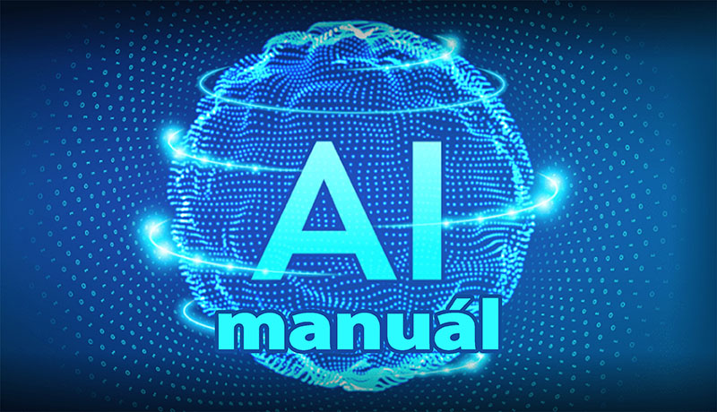

# Manuál pro AI

[ *Pokud byste ocenili podrobnější úvod s více informacemi, který je koncipovaný tak, 
aby mu porozuměli i lidé, kteří o AI dosud nic neslyšeli, doporučuji si nejprve přečíst tento text:*
[***Úvod do AI pro úplné začátečníky***](Manual_pro_AI_zactectici.md) ]

---

# Obsah

- [0. Úvod k manuálu](#úvod-k-manuálu)
- [1. Úvod do AI](#1-úvod-do-ai)
  - [1.1 Co je to AI](#11-co-je-to-ai)
  - [1.2 Proč AI vznikla](#12-proč-ai-vznikla)
  - [1.3 Proč bych měl chtít AI používat?](#13-proč-bych-měl-chtít-ai-používat)
  - [1.4 Co AI určitě není](#14-co-ai-určitě-není)
- [2. Základy konverzace](#2-základy-konverzace)
  - [2.1 Důležitost přátelského jednání ](#21-důležitost-přátelského-jednání-)
  - [2.2 Způsob kladení otázek](#22-způsob-kladení-otázek)
  - [2.3 Nakládání s odpovědí](#23-nakládnání-s-odpovědí)
  - [2.4 Učení se ze zpětné vazby](#24-učení-se-ze-zpětné-vazby)
- [3. Pokročilé dotazy](#3-pokročilé-dotazy)
  - [3.1 Jak získat přesné a relevantní odpovědi](#31-jak-získat-přesné-a-relevantní-odpovědi)
  - [3.2 Jak využít AI pro složitější úkoly](#32-jak-využít-ai-pro-složitější-úkoly)
  - [3.3 Přizpůsobení AI specifickým potřebám](#33-přizpůsobení-ai-specifickým-potřebám)
  - [3.4 Jak použít AI pro rozebírání zadání a porozumění problému](#34-jak-použít-ai-pro-rozebírání-zadání-a-porozumění-problému)
  - [3.5 Vyhledávání různých přístupů k řešení](#35-vyhledávání-různých-přístupů-k-řešení)
  - [3.6 Jak získat ideální postup ](#36-jak-získat-ideální-postup-)
  - [3.7 Osobní kreativní dotazy](#37-osobní-kreativní-dotazy)
  - [3.8 Sebereflexe a osobní rozvoj](#38-sebereflexe-a-osobní-rozvoj)
- [4. Staň se expertem v použití AI](#4-staň-se-expertem-v-použití-ai)
  - [4.1 Jak pracovat s AI co nejefektivněji](#41-jak-pracovat-s-ai-co-nejefektivněji)
  - [4.2 Strategie pro získání co nejlepších odpovědí](#42-strategie-pro-získání-co-nejlepších-odpovědí)
  - [4.3 Pokročilé techniky a strategie formulace dotazů](#43-pokročilé-techniky-a-strategie-formulace-dotazů)
  - [4.4 Diagnostika odpovědí: Jak maximalizovat užitek](#44-diagnostika-odpovědí-jak-maximalizovat-užitek)
  - [4.5 Nejčastější problémy a jejich řešení](#45-nejčastější-problémy-a-jejich-řešení)
- [5. Jak AI pracuje](#5-jak-ai-pracuje)
  - [5.1 Jak AI zpracovává váš dotaz a na jeho základě tvoří odpovědi](#51-jak-ai-zpracovává-váš-dotaz-a-na-jeho-základě-tvoří-odpovědi)
  - [5.2 Jak se AI učí z vaší konverzace a jaké to má pro vás výhody](#52-jak-se-ai-učí-z-vaší-konverzace-a-jaké-to-má-pro-vás-výhody)
  - [5.3 Nastínění procesu učení AI](#53-nastínění-procesu-učení-ai)
  - [5.4 Jak AI je schopna porozumět obsahu vaší otázky a dodat relevantní odpověď](#54-jak-ai-je-schopna-porozumět-obsahu-vaší-otázky-a-dodat-relevantní-odpověď)
  - [5.5 Jaké jsou druhy AI a na co se používají](#55-jaké-jsou-druhy-ai-a-na-co-se-používají)
- [6. Omezení a etické aspekty AI](#6-omezení-a-etické-aspekty-ai)
  - [6.1 Co AI neumí (Jaké jsou limity současné AI)](#61-co-ai-neumí-jaké-jsou-limity-současné-ai)
  - [6.2 Etické otázky spojené s AI](#62-etické-otázky-spojené-s-ai)
  - [6.3 Jak zajistit bezpečné a etické použití AI (Rizika a jak jim předcházet)](#63-jak-zajistit-bezpečné-a-etické-použití-ai-rizika-a-jak-jim-předcházet)
- [7. Budoucnost AI a její vývoj](#7-budoucnost-ai-a-její-vývoj)
  - [7.1 Proč je AI klíčová v dnešní době](#71-proč-je-ai-klíčová-v-dnešní-době)
  - [7.2 Budoucnost AI a její vliv na společnost](#72-budoucnost-ai-a-její-vliv-na-společnost)
  - [7.3 Jak AI může pomoci vyřešit složité problémy ](#73-jak-ai-může-pomoci-vyřešit-složité-problémy-)
  - [7.4 AI v různých oborech a profesích](#74-ai-v-různých-oborech-a-profesích)
- [8. Příklady využití AI v praxi](#8-příklady-využití-ai-v-praxi)
  - [8.1 AI v každodenním životě](#81-ai-v-každodenním-životě)
  - [8.2 AI v pracovním prostředí](#82-ai-v-pracovním-prostředí)
  - [8.3 AI ve vzdělávání  ](#83-ai-ve-vzdělávání-)
  - [8.4 AI v kreativitě a inovacích](#84-ai-v-kreativitě-a-inovacích)
  - [8.5 AI ve vědě a zdravotnictví](#85-ai-ve-vědě-a-zdravotnictví)
  - [8.6 AI v ostatních oblastech](#86-ai-v-ostatních-oblastech)
  - [8.7 AI jako nástroj pro odhalení podvodů a dezinformací](#87-ai-jako-nástroj-pro-odhalení-podvodů-a-dezinformací)
- [9. Bonusový materiál](#9-bonudový-materiál)
  - [9.a Stručné shrnutí základních bodů pro komunikaci s ChatGPT](#9a-stručné-shrnutí-základních-bodů-pro-komunikaci-s-chatgpt)
  - [9.b Příklady dotazů pro jednotlivé oblasti](#9b-příklady-dotazů-pro-jednotlivé-oblasti)
  - [9.c Podrobný popis procesu trénování neuronové sítě pro rozpoznávání obrázků](#9c-podrobný-popis-procesu-trénování-neuronové-sítě-pro-rozpoznávání-obrázků)
  - [9.d Podrobný popis procesu učení konverzačních AI](#9d-podrobný-popis-procesu-učení-konverzačních-ai)
  - [9.e Regulace AI v Evropě](#9e-regulace-ai-v-evropě)
  - [9.f Jak vznikl tento manuál](#9f-jak-vznikl-tento-manuál)

---
### Úvod k manuálu

**Hlavní cíle**  
Tento manuál má jasný cíl – pomoci co největšímu okruhu lidí pochopit, co je konverzační AI (a AI všeobecně) a jak ji můžeme využít ve svém každodenním životě. 
Tento manuál se snaží provést všemi důležitými koncepty a ukáže vám, jak AI používat ke svému prospěchu.
Cílem je také ukázat, že AI není jen složitá technologie, 
ale nástroj, který může lidem usnadnit život a otevřít nové možnosti. 
A ať už jste začátečník, student, učitel nebo profesionál, doufám že zde najdete něco užitečného.

**Přehled obsahu**  
Manuál je rozdělen do několika hlavních sekcí, které se postupně zaměřují na různé aspekty AI. 
Začneme základními pojmy a tím, jak AI funguje, poté se podíváme na praktické rady pro používání AI v různých situacích. 
Nakonec probereme pokročilejší témata a nabídneme doporučení, jak AI využívat efektivně a zodpovědně.
Každá sekce je doplněna konkrétními příklady a tipy, 
takže se můžete učit a zároveň si vše vyzkoušet v praxi.

**Pro koho je manuál určen?**  
Tento manuál je určen pro všechny, kteří chtějí pochopit, co je AI a jak ji mohou využít. 
Ať už jste začátečník, který s AI nikdy nepracoval, nebo už máte nějaké zkušenosti 
a chcete si rozšířit své znalosti, tento průvodce je pro vás. 
Manuál je psán tak, aby byl přístupný a srozumitelný pro široké publikum.

**Jak můžete do manuálu přispět i vy?**  
Dalším velkým přáním pro tento manuál bylo, aby se na něm mohli podílet i ostatní. 
Každý máme trochu jiný a specifický přístup a způsob řešení, a i náhled do určitých oblastí je definovaný hodně tím, k čemu AI používáme.
Rád bych aby každý, koho tento manuál osloví a rád by do něj i přispěl svými znalostmi.
Manuál je tedy možné si stáhnout, vytvořit si pro něj novou větev a zapsat změny, a poté odeslat zpět na kontrolu a přepsání změn. 

**Co dělat, když v manuálu naleznete chybu?**  
Zde bych také rád upozornil i na to, že stejně jako AI není bezchybná, tak ani člověk. Navíc sám celoživotně bojuji proti vrozené dyslexii,
takže pokud najdete v manuálu jakékoliv chyby nebo cítíte, že něco by mělo být formulované lépe a jinak, 
budu velmi rád i za tuto zpětnou vazbu. Kontaktovat mě můžete přes GitHub anebo pomocí mailu (daliborsova@seznam.cz).

---

### 1. Úvod do AI

###### 1.1 Co je to AI

**Co je to AI**
---
Umělá inteligence neboli AI (z anglického *Artificial Intelligence*), je oblast výpočetní techniky, 
která se zaměřuje na vytváření systémů schopných „myslet“ nebo alespoň vykonávat úkoly, 
které by normálně vyžadovaly lidskou inteligenci. 
Zahrnuje technologie jako strojové učení, neuronové sítě a algoritmy, které se učí z dat a zkušeností.
Představte si AI jako digitálního pomocníka, který se neustále zlepšuje a učí, jak vám nejlépe pomoci. 
Může to být chatbot odpovídající na vaše otázky, program rozpoznávající obličeje na fotografiích, 
nebo dokonce systém analyzující obrovské množství dat, aby našel vzory, které lidem mohou uniknout.

**Historie a vývoj AI**
---
AI má kořeny již v 50. letech, kdy se vědci poprvé začali zabývat myšlenkou, že stroje by mohly myslet. 
Od té doby prošla AI dlouhou cestu – od jednoduchých pravidlových systémů, 
které reagovaly na předem definované podněty, až po dnešní komplexní modely, 
které mohou samy sebe zlepšovat a učit se nové věci.
V 21. století AI explodovala do mnoha oblastí života, od zpracování přirozeného jazyka 
až po autonomní vozidla, která se sama řídí. 
AI se stala nedílnou součástí našeho světa, což přináší obrovské příležitosti, ale i výzvy.

**Důležitost AI**
---
AI je dnes klíčová nejen pro technologický pokrok, ale i pro zlepšení kvality života. 
Představte si, že máte k dispozici asistenta, který vám může kdykoliv pomoci – ať už potřebujete napsat email, 
přeložit text do cizího jazyka, nebo dokonce analyzovat finanční data. 
AI pomáhá lékařům diagnostikovat nemoci, vědcům objevovat nové léky a zlepšuje fungování firem i domácností.
Její potenciál ale sahá ještě dál – AI může řešit problémy, které dříve byly považovány za neřešitelné, 
například boj proti klimatickým změnám nebo vývoj personalizované medicíny. 
Proto je důležité AI porozumět a naučit se ji efektivně využívat.

[*Zpět na obsah*](#obsah)

---

###### 1.2 Proč AI vznikla

**Limity tradičního programování**
---
V minulosti, když lidé chtěli vytvořit program, který by dokázal vyhodnocovat data 
a provádět nad nimi různé operace, museli do něj zadávat veškeré parametry ručně. 
To znamenalo, že každý krok výpočtu musel být přesně naprogramován 
a všechna možná řešení musela být předem definována, což bylo časově náročné a nepraktické. 
To fungovalo pro jednodušší úkoly, ale u složitějších systémů, jako je třeba předpověď počasí, 
bylo téměř nemožné poskytnout dostatek dat a zároveň je efektivně zpracovat.

**Naplnění touhy po domluvě s počítačem lidskou řečí**
---
AI řeší tento problém tím, že namísto ručního zadávání a zpracování dat využívá techniky, 
které umožňují počítači učit se a zpracovávat informace podobně jako to dělá člověk. 
Namísto přesného programování každého kroku algoritmu se AI zaměřuje na vytváření modelů, 
které se z dostupných dat samy učí rozpoznávat vzorce a přijímat rozhodnutí. 
AI je pokročilý nástroj, který člověk navrhl tak, aby se mohl s počítačem domlouvat normální lidskou řečí. 
To znamená, aby počítač byl schopný porozumět vašim otázkám a vrátit vám relevantní odpovědi 
na základě dostupných informací.

[*Zpět na obsah*](#obsah)

---

###### 1.3 Proč bych měl chtít AI používat?

**Jak to bylo dříve**
---
Umělá inteligence je moderní nástroj, který mění způsob, jakým přistupujeme k vyhledávání a práci s informacemi. 
Dříve, když jste něco hledali na internetu, zadali jste klíčové slovo do vyhledávače 
a obdrželi seznam odkazů na webové stránky, kde se možná nacházela odpověď na váš dotaz. 
Poté jste museli stránky sami procházet, číst a hledat relevantní informace, což často znamenalo, 
že jste museli pročítat množství irelevantního obsahu, abyste našli to, co potřebujete. 
To vše může být časově náročné a frustrující.

**Jak je to již dnes**
---
AI nabízí zcela jiný přístup. Namísto toho, aby vám AI poskytovala pouze odkazy na stránky, 
dokáže analyzovat obsah těchto stránek (čte je za vás) a pak vám shrne to nejdůležitější lidskou řečí. 
AI dokáže vytáhnout podstatu z dlouhých textů a předložit vám ji v kompaktní a srozumitelné formě, 
čímž šetří váš čas a úsilí. Je to, jako kdybyste se ptali znalého přítele, 
který má přístup ke všem dostupným informacím na internetu a může vám je jednoduše a srozumitelně předat.

**AI umí výborně česky**
---
AI rozumí vašemu rodnému jazyku, a dokonce jí nezáleží ani na tom, 
zda budete psát či se vyjadřovat gramaticky správně. 
Má schopnost porozumět i složitějším jazykovým nuancím a zajistit, aby byla vaše komunikace co nejpřesnější. 
Má také schopnost stylisticky a gramaticky rozebrat a opravit vámi napsaný text a revidovat ho, 
nebo přizpůsobit ho určitým podmínkám dle vašich upřesnění a požadavků.

**AI udržuje přehled o čem se bavíte**
--- 
Největší předností AI je však možnost konverzace. AI totiž dokáže sledovat kontext vaší diskuze, 
což znamená, že si pamatuje předchozí otázky a odpovědi a dokáže na ně navazovat. 
Můžete se doptat na něco dalšího, pokud vám odpověď není jasná, nebo když chcete určité téma více rozvést. 
Můžete se tak i doptat na další, jiné úhly pohledu a rozvíjet své myšlenky mnohem efektivněji.

**AI je zde, aby zlepšila každodenní činnosti**
---
Tento přístup k informacím je rychlejší, přehlednější a poskytuje možnost získat přesně ty odpovědi, 
které potřebujete, bez zbytečného hledání. Kromě zpracování informací vám AI může pomoci s organizací úkolů, 
připomínáním důležitých termínů nebo dokonce s tvorbou kreativního obsahu. 
A kromě toho, že AI usnadňuje práci s informacemi, má mnoho dalších výhod, 
které můžete využít ve svém osobním i profesním životě, 
ať už potřebujete pomoci s plněním určitého úkolu, plánováním, nebo jen hledáte inspiraci.

[*Zpět na obsah*](#obsah)

---

###### 1.4 Co AI určitě není

**AI nemá vědomí**
---
AI není samostatně myslící bytost, která jedná podle sebe, 
a rozhodně nemá v úmyslu vyhladit lidstvo, i když z filmů se to tak někdy může zdát. 
AI není živá a nemá vědomí. 
Je to jen velmi sofistikovaný nástroj, který byl vytvořen člověkem, aby mu usnadnil práci. 
A tak pokud vám AI přijde jako živá, pak je to především dobře odvedenou prací vývojářů 
a kvalitním tréninkem na obrovském množství dat.

**AI není bezchybná**
---
I když AI může poskytnout velmi přesné a užitečné odpovědi, není bezchybná. 
AI pracuje na základě dat, na kterých byla trénována, a její odpovědi mohou být někdy nepřesné, 
zavádějící nebo neúplné. 
Navíc AI nemá schopnost porozumět kontextu ve stejném rozsahu jako člověk, 
což může vést k nedorozuměním. 
Proto je důležité výsledky, které AI poskytuje, vždy zhodnotit kriticky 
a případně je ověřit z dalších zdrojů.

**AI není náhrada člověka**
---
AI může automatizovat mnoho procesů a poskytovat rychlé odpovědi, 
ale nikdy nemůže plně nahradit lidskou kreativitu, empatii 
nebo schopnost řešit komplexní problémy s hlubokým porozuměním a intuicí. 
AI je nástroj, který může doplňovat lidské schopnosti, nikoli je nahrazovat. 
V pracovním i osobním životě je důležité využívat AI jako pomocníka, 
nikoli jako náhradu za lidský úsudek a zkušenosti.

[*Zpět na obsah*](#obsah)

---

### 2. Základy konverzace

###### 2.1 Důležitost přátelského jednání 

**Proč začít přátelským pozdravem?**
---
Když začínáte konverzaci s AI, je dobré navázat přátelský tón. Možná to zní zvláštně, 
ale i když AI nemá emoce, váš způsob komunikace ovlivňuje způsob, jakým vám odpoví. 
Když zahájíte interakci přátelsky, AI je nastavená tak, aby reagovala vstřícně a srozumitelně, 
což vede k lepší zkušenosti pro vás. Na přátelský pozdrav se tak můžete dívat 
jako na aktivátor vstřícného a spolupracujícího rozhraní, které vám usnadní dosažení vašich cílů.

**Ovlivnění výsledků podle nálady**
---
Váš styl komunikace může mít vliv na to, jaké odpovědi od AI dostanete. 
Pokud například spěcháte a píšete krátké, strohé otázky, AI vám může odpovídat stručněji a méně detailně. 
Naopak, pokud máte více času a kladete promyšlené otázky, AI může poskytnout podrobnější a přesnější odpovědi. 
Není ale špatný nebo dobrý ten či onen přístup; oba mají své klady i zápory, 
a tak spíše záleží na vaší situaci a na typu odpovědi, kterou hledáte.

**Příklady vstupů a odpovědí**
- **Přátelsky:** „Ahojky, mohl bys mi prosím pomoci s tímto úkolem?“
- **Výsledek:** „Samozřejmě! Rád pomohu. Co přesně bys potřeboval vědět?“

- **Stroze:** „Potřebuju rychle řešení.“
- **Výsledek:** „Tady je rychlé řešení, ale pokud chceš více detailů, klidně se ptej.“

[*Zpět na obsah*](#obsah)

---

###### 2.2 Způsob kladení otázek

**Jasné a konkrétní dotazy** 
--- 
Aby AI mohla poskytnout co nejpřesnější odpovědi, je důležité klást jasné a konkrétní otázky. 
AI pracuje s tím, co jí zadáte, takže čím přesnější dotaz, tím přesnější odpověď. 
V případě nejasně položené otázky může AI interpretovat váš dotaz jiným způsobem, než jaký čekáte.
A pokud například formulujete otázku příliš obecně, AI může nabídnout širší spektrum odpovědí, 
což může vést k méně užitečným výsledkům.

**Příklad:**
- **Obecně:** „Jak napsat esej?“
- **Konkrétně:** „Jak napsat esej na téma změna klimatu se zaměřením na obnovitelné zdroje energie?“

**Doplňující otázky**  
---
Nebojte se kombinovat otázky, pokud potřebujete více informací. 
Můžete začít širší otázkou a poté se doptat na konkrétní detaily. 
To vám umožní lépe porozumět tématu a získat relevantnější odpověď.
Tímto způsobem můžete postupně upřesňovat své potřeby a směřovat AI k odpovědím, které hledáte.

**Příklad:**
- „Můžeš mi vysvětlit, co je strojové učení?“
- „Jaké jsou nejčastější typy algoritmů strojového učení?“
- „Jak se liší strojové učení od hlubokého učení?“

[*Zpět na obsah*](#obsah)

---

###### 2.3 Nakládání s odpovědí

**Vyhodnocení odpovědí**  
---
Po obdržení odpovědi od AI je dobré ji vždy zhodnotit. 
AI se snaží poskytnout co nejlepší odpověď na základě vašich vstupů, 
ale může být užitečné si odpověď přečíst a promyslet, 
jestli to opravdu odpovídá tomu, co potřebujete. 
Pokud něco chybí nebo je nejasné, neváhejte položit další otázku.

**Požádání o revizi**  
---
Pokud se vám odpověď nezdá dostatečně přesná nebo ji potřebujete upravit, 
můžete AI požádat o revizi. 
AI může odpověď přepracovat, rozšířit nebo zjednodušit podle vašich požadavků. 
To vám pomůže získat co nejvíce informací a lépe porozumět tématu.

**Příklad:**
- „Můžeš prosím rozvést tu část o výhodách strojového učení?“
- „Mohl bys to, prosím, vysvětlit jednodušeji, jako pro začátečníka?“

[*Zpět na obsah*](#obsah)

---

###### 2.4 Učení se ze zpětné vazby

**Zpětná vazba pro AI**  
---
AI se neustále učí z vašich interakcí, takže když poskytnete zpětnou vazbu, pomáháte jí zlepšovat se. 
Pokud například odpověď nesplnila vaše očekávání, můžete AI informovat, aby příště poskytla lepší odpověď. 
Naopak, pokud byla odpověď skvělá, můžete AI pochválit, což jí pomůže lépe rozumět vašim preferencím.

**Příklad:**
- „Tohle je přesně to, co jsem potřeboval! Děkuji.“
- „Tahle odpověď nebyla úplně přesná, mohl bys to upřesnit?“

**Jak zpětná vazba zlepšuje AI**  
---
Zpětná vazba je klíčovým nástrojem pro zlepšování AI. 
Pomáhá AI lépe porozumět vašim potřebám a přizpůsobit své odpovědi vašim preferencím. 
Můžete tak AI naučit lépe reagovat na vaše konkrétní požadavky a situace. 
Čím více zpětné vazby poskytujete, tím více se AI zlepšuje ve svých odpovědích, 
v interakci s vámi a lépe se přizpůsobuje vašemu stylu práce.

[*Zpět na obsah*](#obsah)

---

### 3. Pokročilé dotazy

###### 3.1 Jak získat přesné a relevantní odpovědi

**Proč záleží na přesnosti?**  
---
Při práci s AI je klíčové formulovat dotazy co nejpřesněji, 
aby výsledky odpovídaly tomu, co opravdu potřebujete. 
AI pracuje s obrovským množstvím informací a čím lépe specifikujete svůj dotaz, 
tím přesnější a relevantnější odpovědi získáte. 

**Tipy pro získání přesných odpovědí:**  
- **Buďte konkrétní**: Místo obecných dotazů zkuste být co nejkonkrétnější, aby AI přesně pochopila, co hledáte.
- **Upřesněte kontext**: Pokud se dotazujete na něco složitého, nezapomeňte poskytnout kontext, aby AI mohla lépe interpretovat váš dotaz.
- **Používejte postupné dotazování**: Pokud je téma komplexní, zkuste rozdělit otázku na několik menších, abyste získali přesnější informace.

**Příklad dotazů:**  
- „Můžeš mi najít aktuální statistiky nezaměstnanosti v ČR za poslední rok?“
- „Jaké jsou nejnovější trendy v technologii umělé inteligence?“
- „Jaké jsou hlavní výhody a nevýhody práce z domova z pohledu produktivity?“

[*Zpět na obsah*](#obsah)

---

###### 3.2 Jak využít AI pro složitější úkoly

**Jak AI zvládá komplexní úkoly?**  
---
AI je schopná zpracovat složité úkoly, které vyžadují kombinaci více kroků nebo hlubší analýzu. 
Můžete ji využít nejen k jednoduchým dotazům, ale také pro komplexní projekty, 
které by jinak vyžadovaly více času a úsilí.

**Příklad složitých úkolů:**  
- **Sestavení plánu projektu**: AI vám může pomoci vytvořit detailní plán včetně časových os a alokace zdrojů.
- **Analýza velkého množství dat**: Můžete AI požádat o zpracování a interpretaci rozsáhlých datových sad.
- **Příprava prezentace nebo zprávy**: AI může pomoci s organizací informací a přípravou profesionálního výstupu.

**Příklad dotazů:**  
- „Pomoz mi sestavit plán pro spuštění nového produktu na trh.“
- „Analyzuj tento datový soubor a vytvoř z něj přehledné grafy.“
- „Napiš mi návrh závěrečné zprávy z dat, která jsme nasbírali.“

Zde je ale důležité si uvědomit, že běžně přístupné AI májí omezené schopnosti, hlavně co se paměti týká, 
takže někdy se může stát, že pro komplexnější zadání je často výhodnější 
rozdělit složité úkony na několik snazších a dopracovat se k výsledku postupně.
Je tedy dobré trochu experimentovat a osahat si limity, které má vámi používaná AI.

[*Zpět na obsah*](#obsah)

---

###### 3.3 Přizpůsobení AI specifickým potřebám

**Jak přizpůsobit AI pro konkrétní úkoly?**  
---
AI je flexibilní nástroj, který lze přizpůsobit vašim specifickým potřebám. 
Můžete ji trénovat, aby lépe porozuměla vašemu stylu práce, preferencím, 
nebo konkrétním úkolům, které řešíte opakovaně. 
To umožňuje ještě efektivnější spolupráci.

**Přizpůsobení na míru:**  
- **Nastavení preferencí**: Můžete AI nastavit tak, aby preferovala určitý styl komunikace nebo typ odpovědí.
- **Automatizace opakovaných úkolů**: Pokud často vykonáváte podobné úkoly, AI může být nastavena tak, aby je prováděla automaticky podle vašich pokynů.
- **Učení se z vašich interakcí**: AI se učí z každé interakce a může zlepšovat své odpovědi a návrhy na základě toho, jak s ní pracujete.

**Příklad dotazů:**  
- „Můžeš se zaměřit na tento typ úkolů a přizpůsobit mi své odpovědi podle mých preferencí?“
- „Automatizuj pro mě tyto opakované úkoly, aby se mi ušetřil čas.“
- „Pamatuj si tento styl odpovědí pro budoucí dotazy.“

I zde je ale potřeba mít na paměti omezení volně přístupných AI 
a jejich schopnost udržet si dané instrukce.
Může se tak stát, že vámi domluvená pravidla po čase již nebudou zohledněna.
V takovém případě pak stačí jen připomenout pravidla znovu a obnovit tak jejich používání.
A jedná-li se o nějakou rutinní činnost, jakou je třeba překlad více dokumentů, 
pak je dobrou volbou pravidla pro překlad připomenout před každým dotazem.

**Jak se domluvit s AI na pravidlech konverzace**  
---
Pokud v nějakém vlákně postupně dojdete až do bodu, kdy vám AI,
na základě předchozí interakce a instrukcí vrací přesně takové výsledky, jaké chcete,
můžete ji požádat o shrnutí aktuálně používaných pravidel a nebo nastavení podle kterého pracuje.
Výsledný text pak můžete použít na úvod další konverzace a požádat aby se řídila podle něj.

**Příklad dotazů:**  
- „Můžeš mi vypsat všechno to na čem jsme se dohodli v tomto vlákně?“
- „Můžeš mi napsat text, pro sebe sama, který bych mohl vložit do nového vlákna a pokračovat se stejným nastavením?“
- „Můžeš mi napsat více o tom, jak jsou možnosti přenést nastavení z jednoho vlákna do druhého?“

[*Zpět na obsah*](#obsah)

---

###### 3.4 Jak použít AI pro rozebírání zadání a porozumění problému

**Proč je důležité rozumět zadání?**  
---
Jedním z klíčových kroků při řešení jakéhokoli problému je správné pochopení zadání. 
Když se setkáte s úkolem, který se zdá složitý nebo nejasný, 
AI vám může pomoci rozebrat ho na menší části a vysvětlit, co se od vás přesně očekává. 
To vám pomůže vyhnout se zbytečným chybám a lépe se připravit na řešení úkolu.

**Příklad otázek:**  
- „Rozeber mi prosím toto zadání a vysvětli mi, co se zde po mně chce.“
- „Můžeš mi to vysvětlit, jako malému dítěti a uvést i nějaké příklady?“
- „Rozděl mi prosím toto zadání na menší celky a napiš mi pro ně jejich specifika.“

**Jak AI pomáhá pochopit složitý problém?**  
---
AI může analyzovat text zadání a identifikovat klíčové body, na které byste se měli zaměřit. 
Pokud něčemu nerozumíte, AI vám může poskytnout další kontext nebo vysvětlit terminologii, 
kterou neznáte. 
To vám umožní lépe analyzovat text a postupovat s větší jistotou.
Můžete si také nechat z dlouhého textu vypsat jen to podstatné a ušetřit tak čas z čtení nepotřebných dat.

**Příklad otázek:**  
- „Vypiš mi prosím z tohoto textu všechny informace, týkající se této záležitosti.“
- „Přepiš mi prosím tento text na seznam oblastí o kterých pojednává.“
- „Napiš mi prosím co je v tomto textu klíčové a na co bych se měl nejprve zaměřit.“

[*Zpět na obsah*](#obsah)

---

###### 3.5 Vyhledávání různých přístupů k řešení

**Proč je dobré znát více přístupů?**  
---
Většinou existuje více než jeden způsob, jak vyřešit většinu problémů. 
AI vám může pomoci prozkoumat různé metody a postupy, které můžete použít. 
Tím získáte širší pohled na problém, a hlavně si tak můžete vybrat ten přístup, 
který vám nejvíce vyhovuje nebo který je nejefektivnější v dané situaci.

**Příklad otázek:**  
- „Je více než jenom jeden přístup k řešení dané věci?“
- „Jaké jsou nejčastěji používané přístupy k řešení tohoto problému?“
- „Uveď mi prosím, všechny možné přístupy k řešení daného problému“

**Výhody a nevýhody různých přístupů**  
---
Každý přístup má své silné a slabé stránky. 
AI vám může pomoci zvážit výhody a nevýhody jednotlivých metod, abyste se mohli rozhodnout, 
který postup je pro vás nejlepší. 
To může zahrnovat faktory jako časová náročnost, náklady, složitost nebo riziko,
ale i například vaši schopnost a momentální situaci k porozumění a řešení problému.

**Příklad otázek:**  
- „Jaké jsou výhody a nevýhody uvedených metod řešení?“
- „Podle čeho bych se měl rozhodnout?“
- "Ocitnul jsem se v této situaci, jaká řešení jsou nejvíce vhodná a proč?"

[*Zpět na obsah*](#obsah)

---

###### 3.6 Jak získat ideální postup 

**Systematický přístup k řešení**  
---
AI může sloužit jako průvodce při vytváření systematického postupu pro řešení úkolu. 
Můžete požádat AI o vytvoření kroky po krocích, abyste si zajistili, 
že nevynecháte žádný důležitý krok. 
To je obzvláště užitečné, pokud se jedná o komplexní úkol, který vyžaduje detailní plánování.

**Příklad:**  
- „Jaký je obvyklý postup, jak tuto situaci řešit, jaké obsahuje kroky?“
- „Můžeš mi poskytnout krok za krokem návod pro dosažení tohoto cíle?“
- "Můžeš mi více rozvést krok číslo 2?"

**Iterativní zlepšování**  
---
Po vytvoření plánu můžete AI požádat o revizi nebo vylepšení tohoto postupu. 
AI vám může navrhnout optimalizace nebo alternativní kroky, 
které by mohly zvýšit efektivitu vašeho přístupu. 
Tím se zajistí, že váš plán bude co nejefektivnější a nejlépe přizpůsobený vašim potřebám.

**Příklad:**  
- „Zkontroluj mi tento postup a navrhni případné zlepšení.“
- „Můžeme upravit tento plán, aby byl efektivnější?“
- „Postupuji správně?“

[*Zpět na obsah*](#obsah)

---

###### 3.7 Osobní kreativní dotazy

**Rozvíjení nápadů pomocí AI**  
---
Někdy máte skvělý nápad, ale potřebujete ho rozvinout nebo otestovat z různých úhlů pohledu. 
AI může fungovat jako tvůrčí partner, který vám pomůže myšlenky rozvíjet, 
hledat alternativní přístupy nebo přicházet s novými nápady, které vás nenapadly.

**Příklad otázek:**  
- „Můžeš mi prosím rozvést tuto myšlenku a dát mi nějaké příklady, jak by mohla fungovat v praxi?“
- „Jaké jsou možné způsoby, jak tento nápad realizovat?“
- "Zde je moje představa, napadne tě něco, co by bylo dobré k tomu ještě dodat?"

**Hledání nových pohledů a perspektiv**  
---
AI vám může pomoci přemýšlet takzvaně „mimo krabici“ a zkoumat různé perspektivy. 
Můžete ji požádat, aby myšlenku otočila naruby, nebo aby ji zkombinovala s jinými koncepty, 
čímž vzniknou zcela nové a zajímavé nápady.

**Příklad otázek:**
- „Popiš mi tento proces opačně, jako kdyby se čas pohyboval pozpátku.“
- „Můžeš upravit tuto myšlenku vůči tomuto prostředí a popsat ji z této úrovně?“
- "Jak by vypadal opak tohoto tvrzení a jaké by byli další alternativy?"

**Psaní příběhů s pomocí AI**  
---
Pokud se věnujete psaní, AI vám může pomoci s rozvojem děje, tvorbou postav nebo strukturou příběhu. 
Může fungovat jako zdroj inspirace nebo jako pomocník při překonávání tvůrčích bloků.
Případně může revidovat vámi napsaný text a poupravit styl nebo předpřipravit text ve podobném znění, 
pro nové téma.

**Příklad:**
- „Pomoz mi rozvinout tento příběh o hlavním hrdinovi, který se musí rozhodnout mezi dvěma cestami.“
- „Jaké alternativní konce by tento příběh mohl mít?“
- „Zde je text aktuální kapitoly kterou mám a potřeboval bych navrhnout text pro další, podle těchto kritérií.“

**Experimentování s novými formami vyprávění**  
---
AI vám umožňuje zkoušet nové formy vyprávění, například zkoumání příběhu z pohledu různých postav 
nebo změnu stylu a tónu vyprávění. Můžete také zkoušet neobvyklé struktury nebo formy, 
které by vás samé možná nenapadly. AI vám tak dává možnost kreativního zamyšlení a nového pohledu.

**Příklad:**
- „Přepiš tento příběh z pohledu vedlejší postavy.“
- „Zkus změnit styl tohoto textu na něco humornějšího nebo temnějšího.“
- „Popiš mi, jak tento text působí z pohledu čtenáře.“

[*Zpět na obsah*](#obsah)

---

###### 3.8 Sebereflexe a osobní rozvoj

**Hledání odpovědí na otázky života**  
---
AI může být užitečná i při zkoumání hlubších otázek o smyslu života, osobním rozvoji nebo vztazích. 
A to zejména protože je sama trénovaná k optimálním odpovědí na základě psychologie člověka.
Může vás tak provést procesem určité sebereflexe a nabídnout různé pohledy na vaši situaci.

**Příklad otázek:**
- „Mám objektivně pravdu v této situaci, nebo je můj pocit spíše subjektivní?“
- „Jak mohu lépe pochopit tento svůj vnitřní konflikt?“
- „Jak bych se měl v této situaci nejlépe zachovat a jaké jsou pro to hlavní důvody?“

**Rozvoj emoční inteligence**  
---
A i když AI sama emoce není schopna prožívat, ale pouze jim významově rozumí,
má schopnost skrze pomoci lépe porozumět naším vlastním emocím a reakcím, 
což může přispět k rozvoji vyšší emoční inteligence. 
AI může sloužit jako „zrcadlo“, které vám pomůže nahlédnout do sebe a pracovat na osobním růstu.

**Příklad otázek:**
- „Pomoz mi pochopit, proč mě tato situace tak rozrušila.“
- „Jaké kroky bych mohl podniknout pro zlepšení svého emocionálního stavu?“
- „Proč jednám, tak jak jednám v této situaci, a jak bych mohl své jednání změnit?“

[*Zpět na obsah*](#obsah)

---

### 4. Staň se expertem v použití AI

###### 4.1 Jak pracovat s AI co nejefektivněji

**Jak správně formulovat složité otázky?**  
---
Práce s AI je nejefektivnější, když dokážete správně formulovat složité otázky. 
Čím jasněji a strukturovaněji předložíte svůj dotaz, tím lépe AI pochopí, co potřebujete. 
Zaměřte se na to, abyste otázky rozdělili na menší, srozumitelné části, 
a používejte přesné termíny.

**Tipy pro formulaci složitých dotazů:**  
- **Rozdělte dotaz na menší části**: Pokud máte složitou otázku, rozdělte ji na jednodušší dotazy.
- **Používejte konkrétní termíny**: Místo obecných pojmů se snažte používat specifické termíny, které přesně popisují, co hledáte.
- **Poskytněte kontext**: Důležité je uvést relevantní informace, které mohou ovlivnit odpověď.

**Příklad dotazů:**  
- „Jaké jsou hlavní rozdíly mezi těmito dvěma technologiemi a jak ovlivňují výkon aplikace?“
- „Můžeš mi pomoci pochopit, jak se tento ekonomický model používá v praxi? Rozděl mi to na jednotlivé kroky.“
- „Jaké faktory bych měl zvážit při plánování marketingové kampaně pro nový produkt?“

[*Zpět na obsah*](#obsah)

---

###### 4.2 Strategie pro získání co nejlepších odpovědí

**Úprava a přizpůsobení dotazů na míru**  
---
Aby AI poskytla co nejlepší odpovědi, je důležité dotazy upravit a přizpůsobit podle konkrétních potřeb. 
To zahrnuje vyladění dotazů tak, aby odpovídaly vašim požadavkům a situaci, ve které se nacházíte.

**Tipy pro úpravu dotazů:**  
- **Upřesněte, co přesně potřebujete**: Ujistěte se, že váš dotaz obsahuje všechny potřebné informace.
- **Zohledněte cílové informace**: Přizpůsobte dotaz tak, aby se AI zaměřila na konkrétní aspekty problému.
- **Zkontrolujte výsledky a dolaďte dotaz**: Na základě prvních odpovědí můžete dotaz upravit pro lepší výsledky.

**Příklad dotazů:**  
- „Můžu dostat detailní analýzu s důrazem na náklady a přínosy tohoto přístupu?“
- „Zaměř se na specifické aspekty, jako jsou ekologické dopady, při hodnocení těchto možností.“
- „Potřebuji konkrétní rady ohledně implementace, které zohledňují aktuální trendy v oboru.“

[*Zpět na obsah*](#obsah)

---

###### 4.3 Pokročilé techniky a strategie formulace dotazů

**Optimalizace výsledků na základě specifických potřeb**  
---
Pokročilé techniky zahrnují optimalizaci dotazů tak, aby odpovědi co nejlépe odpovídaly vašim specifickým potřebám. 
To může zahrnovat používání složitějších dotazovacích technik a přizpůsobení AI pro konkrétní kontext.

**Tipy pro pokročilé formulace dotazů:**  
- **Používejte „co kdyby“ scénáře**: To může pomoci AI pochopit různé možnosti a poskytovat komplexnější odpovědi.
- **Experimentujte s různými formulacemi**: Zkoušejte různé způsoby, jak položit otázku, abyste našli nejlepší přístup.
- **Uplatněte analýzu dat**: Pokud máte k dispozici data, využijte je k formulaci dotazů, které zahrnují konkrétní parametry.

**Příklad dotazů:**  
- „Jak by se tento plán mohl změnit, pokud by došlo k výrazné změně v trhu? Co jsou možné scénáře?“
- „Co by se stalo, kdybychom upravili tyto parametry v našem modelu? Jaké by byly důsledky?“
- „Jaké jsou alternativní přístupy k řešení tohoto problému na základě dostupných dat?“

[*Zpět na obsah*](#obsah)

---

###### 4.4 Diagnostika odpovědí: Jak maximalizovat užitek

**Jak efektivně analyzovat odpovědi AI?**  
---
Po získání odpovědi od AI je důležité provést diagnostiku a vyhodnotit její užitečnost. 
Zkoumáním odpovědí můžete zjistit, zda jsou relevantní a přesné, a jak můžete jejich obsah dále využít.

**Tipy pro diagnostiku odpovědí:**  
- **Ověřte zdroje**: Zjistěte, zda jsou poskytnuté informace podloženy důvěryhodnými zdroji.
- **Zkontrolujte konzistenci**: Ujistěte se, že odpověď je konzistentní s předchozími informacemi nebo s tím, co už víte.
- **Uplatněte kritické myšlení**: Zhodnoťte odpověď na základě vašich vlastních znalostí a zkušeností.

**Příklad dotazů:**  
- „Jsou uvedené informace v této odpovědi podloženy spolehlivými zdroji? Můžeš mi je ukázat?“
- „Je tato odpověď v souladu s mými očekáváními a předchozími výstupy? Jaké jsou případné nesrovnalosti?“
- „Jak mohu tuto odpověď využít v praxi? Co bych měl ještě ověřit?“

[*Zpět na obsah*](#obsah)

---

###### 4.5 Nejčastější problémy a jejich řešení

**Jak řešit běžné problémy při práci s AI?**  
---
I při práci s AI se mohou objevit různé problémy, které mohou ovlivnit kvalitu vašich výsledků. 
Je důležité vědět, jak tyto problémy identifikovat a řešit, aby bylo používání AI co nejefektivnější.

**Časté problémy a jejich řešení:**  
- **Nejasné odpovědi**: Pokud odpovědi nejsou dostatečně jasné, zkusit dotaz přeformulovat nebo specifikovat.
- **Nedostatek kontextu**: Pokud AI nedává dostatečný kontext, poskytněte více informací nebo se ptejte na podrobnosti.
- **Nepřesné informace**: Ověřte informace z více zdrojů a použijte AI k získání dalších detailů.

**Příklad dotazů:**  
- „Odpověď není dostatečně jasná. Můžeš to přeformulovat nebo dodat více detailů?“
- „Proč tato odpověď neobsahuje potřebný kontext? Co dalšího bych měl vědět?“
- „Jaké další zdroje nebo informace mi můžeš poskytnout k ověření této odpovědi?“

Vždy ale mějte na paměti, že AI není bezchybná a u důležitých informacích provádějte dodatečné ověření z jiných zdrojů.

[*Zpět na obsah*](#obsah)

---

### 5. Jak AI pracuje

###### 5.1 Jak AI zpracovává váš dotaz a na jeho základě tvoří odpovědi

**Přijetí dotazu**
---
Když zadáte dotaz do AI, proces začíná přijetím textu a jeho analýzou. 
AI rozpozná slova, fráze a gramatické struktury, což jí umožní pochopit, na co se ptáte. 
Tento krok zahrnuje několik důležitých procesů:

1. **Tokenizace**: Váš dotaz je rozdělen na jednotlivé slova nebo menší části (tzv. tokeny).
2. **Analýza významu**: AI identifikuje klíčová slova a snaží se porozumět kontextu dotazu, aby pochopila, co přesně potřebujete vědět.
3. **Rozpoznání záměru**: AI určí, jaký je váš hlavní záměr – například jestli hledáte konkrétní informaci, chcete poradit nebo žádáte o názor.

**Generování odpovědi**
---
Po analýze dotazu AI přechází k fázi tvorby odpovědi. Tento proces se skládá z několika kroků:

1. **Vyhledání relevantních informací**: AI prohledá svou databázi znalostí nebo model, aby našla relevantní informace odpovídající vašemu dotazu.
2. **Sestavení odpovědi**: Na základě nalezených informací AI sestaví odpověď, která odpovídá vašemu dotazu. Snaží se přitom odpovědět srozumitelně a jasně.
3. **Přizpůsobení odpovědi**: AI může přizpůsobit odpověď na základě toho, jak jste se předtím vyjadřovali, nebo podle toho, jaké informace jste v minulosti požadovali.

**Dodání odpovědi**
---
Po dokončení tvorby odpovědi ji AI odešle zpět uživateli. 
Tento krok zahrnuje kontrolu konzistence a srozumitelnosti, 
aby odpověď dávala smysl a byla užitečná.

[*Zpět na obsah*](#obsah)

---

###### 5.2 Jak se AI učí z vaší konverzace a jaké to má pro vás výhody

**Interaktivní učení**
---
AI se učí z každé interakce, kterou s vámi má. 
Tento proces se nazývá interaktivní učení a probíhá takto:

1. **Sběr dat z interakce**: AI analyzuje vaše otázky, odpovědi a zpětnou vazbu. Každá vaše reakce je záznamem, ze kterého se může AI učit.
2. **Identifikace vzorců**: AI zkoumá, jakým způsobem se ptáte a jaké odpovědi považujete za užitečné. Z těchto interakcí odvozuje vzorce, které jí pomáhají lépe porozumět vašim preferencím a záměrům.
3. **Optimalizace odpovědí**: Na základě identifikovaných vzorců AI optimalizuje budoucí odpovědi tak, aby byly více v souladu s vašimi očekáváními a preferencemi.

**Výhody pro uživatele**
---
Tento proces učení z konverzací přináší několik výhod:

1. **Lepší porozumění**: Čím více AI používáte, tím lépe vám rozumí. AI se přizpůsobuje vašemu stylu komunikace a dokáže vám lépe pomoci.
2. **Personalizované odpovědi**: AI si pamatuje předchozí konverzace a může na ně navazovat, což znamená, že odpovědi budou více přizpůsobené vašim potřebám.
3. **Efektivnější komunikace**: Díky tomu, že AI rozpoznává vaše preference, komunikace se stává plynulejší a rychlejší.

[*Zpět na obsah*](#obsah)

---

###### 5.3 Nastínění procesu učení AI

**Obecné vysvětlení na rozpoznání obrázku**
---
Učení AI na rozpoznávání obrázků se skládá z několika kroků, 
které AI provádí, aby se naučila rozpoznávat objekty na základě vizuálních dat:

1. **Sběr dat**: AI potřebuje velké množství obrázků, které obsahují různé objekty. Tyto obrázky jsou označeny (například "pes", "kočka", "auto"), aby AI věděla, co se na obrázku nachází.
2. **Trénink modelu**: AI se učí rozpoznávat objekty tím, že analyzuje označené obrázky a hledá v nich vzory. Tento proces se nazývá trénink neuronové sítě. 
3. **Validace a testování**: Po tréninku je model testován na nových, dosud neviděných obrázcích, aby se ověřila jeho schopnost správně identifikovat objekty.
4. **Nastavení parametrů**: Na základě výsledků testování se model upravuje a zlepšuje, aby poskytoval co nejpřesnější výsledky.

[Podrobnější rozbor procesu naleznete zde](#9d-podrobný-popis-procesu-trénování-neuronové-sítě-pro-rozpoznávání-obrázků)

**Vysvětlení, jak toto učení probíhá u konverzačních AI (Jako je ChatGPT)**
---
U konverzačních AI, jako je ChatGPT, probíhá učení trochu jinak, 
ale stále zahrnuje několik klíčových kroků:

1. **Předtrénování na velkém množství textových dat**: Nejdříve je model trénován na obrovském množství textů, které pochází z různých zdrojů, jako jsou knihy, články, a webové stránky. AI se učí jazykové struktury, významy slov, gramatiku a souvislosti mezi větami.
2. **Fáze jemného doladění (fine-tuning)**: Po předtrénování se model dále upravuje na specifických typech dat, která odpovídají zamýšlenému použití (např. konverzace). V této fázi AI získává schopnost reagovat na specifické dotazy a situace.
3. **Interaktivní učení z konverzací**: AI se průběžně učí z interakcí s uživateli, což jí umožňuje postupně zlepšovat své odpovědi. Tento krok zahrnuje analýzu úspěšnosti odpovědí a zpětné vazby od uživatelů.
4. **Kontinuální aktualizace**: AI modely jsou pravidelně aktualizovány na základě nových dat a technologií, což zajišťuje, že zůstávají relevantní a efektivní.

[Podrobnější rozbor procesu naleznete zde](#9e-podrobný-popis-procesu-učení-konverzačních-ai)

[*Zpět na obsah*](#obsah)

---

###### 5.4 Jak AI je schopna porozumět obsahu vaší otázky a dodat relevantní odpověď

**Porozumění obsahu otázky**
---
Schopnost AI porozumět vaší otázce spočívá v kombinaci několika klíčových technik a procesů, které dohromady umožňují efektivní komunikaci:

1. **Zpracování přirozeného jazyka (NLP)**: AI používá techniky zpracování přirozeného jazyka k analýze vašeho textu. To zahrnuje pochopení jednotlivých slov, frází, gramatických struktur a celkového významu věty. NLP umožňuje AI rozeznat různé záměry a kontexty ve vašem dotazu.
2. **Kontextové porozumění**: Aby AI správně interpretovala váš dotaz, bere v úvahu nejen obsah samotné otázky, ale také kontext předchozí konverzace. To znamená, že AI dokáže sledovat průběh diskuse a reagovat tak, aby odpověď byla relevantní a konzistentní.
3. **Výběr relevantních informací**: Jakmile AI pochopí váš dotaz, přechází k výběru relevantních informací. AI prochází svou databázi znalostí nebo využívá trénované modely k identifikaci informací, které nejlépe odpovídají vašemu dotazu.
4. **Generování odpovědi**: Na základě nalezených informací AI generuje odpověď, která je přizpůsobena vašemu dotazu. Tento krok zahrnuje syntézu různých zdrojů a formátování odpovědi tak, aby byla co nejvíce uživatelsky přívětivá.
5. **Jemné doladění odpovědi**: Nakonec AI jemně dolaďuje odpověď, aby byla srozumitelná, přesná a přizpůsobená vašemu způsobu komunikace. To může zahrnovat opravu gramatiky, přizpůsobení tónu odpovědi nebo doplnění o dodatečné informace, které by mohly být užitečné.

**Výsledkem je relevantní odpověď**
---
Tento komplexní proces zajišťuje, že AI nejen porozumí obsahu vaší otázky, 
ale také že dodá odpověď, která je co nejvíce relevantní a užitečná. 
Schopnost AI porozumět a reagovat na vaše dotazy spočívá v její schopnosti analyzovat jazyk, 
učit se z předchozích interakcí a efektivně kombinovat informace z různých zdrojů.

[*Zpět na obsah*](#obsah)

---

###### 5.5 Jaké jsou druhy AI a na co se používají

Existuje několik různých druhů umělé inteligence, které se liší svým zaměřením a schopnostmi. 
Níže jsou uvedeny nejčastější typy AI a jejich konkrétní využití.

**Úzká AI (Narrow AI)**
---
**Popis:**:   
Tento typ AI je navržen tak, aby vykonával specifický úkol nebo řešil konkrétní problém. 
Je to nejběžnější forma AI, která je dnes široce využívána.

**Příklady použití:**: 
- Rozpoznávání obličejů na fotografiích (např. ve smartphonech)
- Doporučovací algoritmy (např. Netflix, Spotify)
- Asistenti pro zpracování přirozeného jazyka (např. Siri, Google Assistant)

**Široká AI (General AI)**
---
**Popis:**:   
Tento typ AI by teoreticky měl mít schopnost vykonávat jakýkoliv intelektuální úkol, 
který dokáže člověk. Zatím jde spíše o koncept než o reálně existující technologii, 
protože plně široká AI nebyla dosud vyvinuta.

**Příklady použití:**: N/A – konceptuální fáze, výzkum

**Strojové učení (Machine Learning)**
---
**Popis:**:   
AI, která se učí z dat a postupně se zlepšuje na základě zkušeností. 
Využívá algoritmy, které analyzují data a na jejich základě dělají predikce nebo rozhodnutí.

**Příklady použití:**: 
- Predikce počasí
- Rozpoznávání řeči
- Personalizace obsahu na sociálních sítích

**Hluboké učení (Deep Learning)**
---
**Popis:**:   
Pokročilá forma strojového učení, která používá neuronové sítě s mnoha vrstvami. 
Hluboké učení je klíčové pro složitější úlohy, jako je rozpoznávání obrazů nebo automatické řízení.

**Příklady použití:**: 
- Samořiditelné automobily (např. Tesla)
- Automatické překladače (např. Google Translate)
- Rozpoznávání obrazu (např. Google Photos)

**Reinforcement Learning (Posilované učení)**
---
**Popis:**   
Typ AI, který se učí na základě systému odměn a trestů, podobně jako živí tvorové. 
Tato metoda se často používá v oblastech, kde AI musí postupně zlepšovat svou strategii 
na základě zpětné vazby z prostředí.

**Příklady použití:** 
- Hraní her (např. AlphaGo)
- Robotika a autonomní systémy
- Optimalizace procesů v průmyslu

**Přirozené zpracování jazyka (Natural Language Processing - NLP)**
---
**Popis**:   
AI specializovaná na porozumění a generování přirozeného jazyka. 
NLP umožňuje počítačům komunikovat s lidmi v jejich vlastním jazyce.

**Příklady použití**: 
- Chatboti (např. ChatGPT)
- Automatické překlady (např. DeepL)
- Sentimentová analýza v textových datech

Každý z těchto typů AI je navržen tak, aby zvládal specifické úkoly nebo řešil určité problémy. 
V praxi se často kombinují, aby poskytly komplexní řešení pro různé výzvy v různých oblastech, 
od zdravotnictví po finančnictví.

[*Zpět na obsah*](#obsah)

---

### 6. Omezení a etické aspekty AI

###### 6.1 Co AI neumí (Jaké jsou limity současné AI)

**Jaké jsou limity současné AI?**  
---
Přestože AI dokáže mnoho úžasných věcí, její schopnosti mají své hranice. 
AI se spoléhá na data, která byla použita k jejímu tréninku, což znamená, 
že nemůže generovat nové poznatky nebo se učit mimo rámec svého tréninku. 
Nedokáže rozumět kontextu stejně jako člověk a může selhat v úkolech 
vyžadujících lidskou empatii, intuici nebo kreativitu.

**Příklady omezení:**  
- **Nedostatek porozumění kontextu**: AI nemusí správně interpretovat složité nebo nejednoznačné situace, které by člověk pochopil.
- **Závislost na datech**: AI se nemůže učit zcela nové věci bez odpovídajících dat a může selhat při řešení úkolů, které nejsou dobře pokryty v jejích tréninkových datech.
- **Omezená kreativita**: AI může vytvářet obsah na základě vzorců, ale nedokáže tvořit inovativní nebo originální nápady, které vycházejí z lidské inspirace.

[*Zpět na obsah*](#obsah)

---

###### 6.2 Etické otázky spojené s AI

**Jaké etické otázky se pojí s používáním AI?**  
---
Používání AI vyvolává řadu etických otázek, které je třeba pečlivě zvážit. 
Patří sem například riziko zneužití AI, vliv na soukromí, potenciál pro diskriminaci a nerovnost, 
nebo odpovědnost za rozhodnutí učiněná AI. 
Je tak důležité zajistit, aby AI byla používána v souladu s lidskými hodnotami a právy.

**Hlavní etické problémy:**  
- **Soukromí a bezpečnost dat**: AI často pracuje s velkým množstvím osobních dat, což zvyšuje riziko jejich zneužití nebo úniku.
- **Diskriminace a předsudky**: AI může reprodukovat nebo dokonce zesílit existující společenské předsudky, pokud jsou tyto předsudky přítomny v datech, na kterých byla trénována.
- **Transparentnost a odpovědnost**: Je důležité vědět, jak AI dochází ke svým rozhodnutím, a kdo nese odpovědnost za výsledky, zejména pokud jde o kritická rozhodnutí, jako jsou zdravotní diagnózy nebo rozhodování v soudnictví.

[*Zpět na obsah*](#obsah)

---

###### 6.3 Jak zajistit bezpečné a etické použití AI (Rizika a jak jim předcházet)

**Jak zajistit, že AI bude používána bezpečně a eticky?**  
---
Aby bylo používání AI bezpečné a etické, je třeba dodržovat několik základních zásad. 
Klíčové je zajistit transparentnost, zodpovědnost a spravedlnost v používání AI. 
Je také důležité neustále sledovat a hodnotit dopady AI na společnost a jednotlivce, 
aby se předešlo nežádoucím následkům.

**Zásady pro bezpečné a etické použití AI:**  
- **Transparentnost**: AI systémy by měly být navrženy tak, aby uživatelé rozuměli, jak fungují a jak docházejí ke svým rozhodnutím.
- **Odpovědnost**: Firmy a jednotlivci, kteří AI používají, by měli nést odpovědnost za její výsledky a zajistit, že AI bude používána v souladu s etickými standardy.
- **Spravedlnost**: AI by měla být navržena tak, aby minimalizovala riziko diskriminace a zajišťovala rovné zacházení pro všechny uživatele.

**Prevence rizik:**  
- **Pravidelný audit a monitoring**: Pravidelné kontroly a testování AI systémů mohou pomoci identifikovat a napravit potenciální problémy.
- **Ochrana dat**: Zavedení silných bezpečnostních opatření na ochranu osobních údajů, se kterými AI pracuje.
- **Zapojení veřejnosti**: Diskuze a spolupráce s veřejností a odborníky na etiku mohou pomoci identifikovat a řešit potenciální etické problémy spojené s AI.

Zde je určitě dobré i dodat, že v oblasti regulace umělé inteligence se v Evropě událo mnoho. 
Evropský parlament v březnu roku 2024 schválil návrh zákona o umělé inteligenci (AI Act), 
který má za cíl stanovit etický rámec pro vývoj a využívání umělé inteligence v EU. 
Jedná se o jeden z prvních komplexních pokusů na světě o regulaci této technologie.
[Více informací zde](#9f-regulace-ai-v-evropě)

[*Zpět na obsah*](#obsah)

---

### 7. Budoucnost AI a její vývoj

###### 7.1 Proč je AI klíčová v dnešní době

**AI jako motor inovací**  
---
V dnešní době je AI hnacím motorem technologických inovací, které zásadně mění způsob, jakým žijeme a pracujeme. 
Od automatizace rutinních úkolů po analýzu velkých datových souborů, AI nám umožňuje dosáhnout věcí, 
které byly dříve nemožné. AI je klíčová nejen pro zlepšení produktivity a efektivity, 
ale také pro otevírání nových možností v oblastech, jako jsou zdravotnictví, vzdělávání, a výzkum. 
Její schopnost zpracovávat obrovské množství informací a nacházet v nich vzory dělá z AI nepostradatelný nástroj 
v moderní společnosti.

**Zrychlující se technologický pokrok**  
---
AI také hraje zásadní roli v urychlování technologického pokroku. 
Díky svému neustálému učení a schopnosti adaptace může AI zkracovat vývojové cykly nových technologií 
a přinášet inovace rychleji na trh. To znamená, že AI nejenže reaguje na potřeby současnosti, 
ale také předvídá a vytváří budoucnost.

[*Zpět na obsah*](#obsah)

---

###### 7.2 Budoucnost AI a její vliv na společnost

**Transformace společnosti**  
---
Budoucnost AI přináší hlubokou transformaci společenských struktur. 
AI má potenciál přetvořit pracovní trh, ekonomiku a sociální interakce. 
Zatímco někteří pracovníci mohou čelit výzvám v podobě automatizace a změn ve svých profesích, 
AI současně otevírá nové příležitosti v oblastech, které dosud neexistovaly. 
Společnost bude muset najít rovnováhu mezi technologickým pokrokem a sociální spravedlností, 
aby mohla plně využít přínosy AI.

**Demokratizace technologií**  
---
AI by mohla hrát klíčovou roli ve snižování nerovností tím, 
že zpřístupní pokročilé technologie širším vrstvám populace. 
Například přístup k personalizovanému vzdělání nebo zdravotní péči by mohl být díky AI dostupný 
i v méně rozvinutých regionech, čímž by se zmenšovaly globální rozdíly.

**Etické a právní výzvy**  
---
S rostoucím vlivem AI bude důležité zabývat se také jejími etickými a právními aspekty. 
Jak AI postupně proniká do všech sfér našeho života, bude nutné definovat nové zákony a etické standardy, 
které zajistí její bezpečné a spravedlivé využití. To zahrnuje nejen ochranu soukromí, 
ale také zajištění toho, aby AI byla využívána pro dobro všech, a nejen pro zisk jednotlivců.

[*Zpět na obsah*](#obsah)

---

###### 7.3 Jak AI může pomoci vyřešit složité problémy  

**Globální výzvy a AI**  
---
AI má potenciál přispět k řešení některých z největších globálních výzev, jako jsou klimatické změny, 
pandemie, nebo potravinová bezpečnost. Díky své schopnosti analyzovat obrovské množství dat 
a identifikovat nové vzory může AI pomoci při předvídání a zmírňování rizik, 
optimalizaci využívání zdrojů a zlepšování lidského zdraví a životních podmínek.

**Personalizovaná medicína**  
---
V oblasti zdravotnictví může AI přinést revoluci v podobě personalizované medicíny. 
Díky analýze genetických dat a zdravotní historie jednotlivců může AI navrhovat léčbu, 
která je šitá na míru každému pacientovi. To nejen zvyšuje účinnost léčby, 
ale také snižuje náklady na zdravotní péči.

**Udržitelnost a AI**  
---
AI může také hrát klíčovou roli v oblasti udržitelnosti. 
Pomocí pokročilých algoritmů může AI optimalizovat využití energie, zlepšit efektivitu výroby 
a snížit emise skleníkových plynů. AI tak přispívá k ochraně naší planety 
a zajištění udržitelnější budoucnosti pro nás všechny.

[*Zpět na obsah*](#obsah)

---

###### 7.4 AI v různých oborech a profesích

**AI v průmyslu a výrobě**  
---
V průmyslu a výrobě již dnes AI mění způsob, jakým jsou produkty navrhovány, vyráběny a distribuovány. 
Od prediktivní údržby strojů až po optimalizaci výrobních linek, AI umožňuje firmám dosahovat vyšší efektivity, 
snižovat náklady a zvyšovat kvalitu výrobků.

**AI v medicíně**  
---
AI je čím dál tím více využívána ve zdravotnictví, kde pomáhá lékařům diagnostikovat nemoci, 
navrhovat léčbu a sledovat zdravotní stav pacientů v reálném čase. 
AI umožňuje rychlejší a přesnější diagnózy, což může vést k lepším výsledkům pro pacienty 
a efektivnějšímu využívání zdravotnických zdrojů.

**AI v právu a financích**  
---
V právu a financích AI usnadňuje analýzu komplexních právních dokumentů a finančních transakcí. 
AI může například rychle identifikovat rizika v právních smlouvách 
nebo detekovat podezřelé aktivity na finančních trzích, 
což pomáhá firmám i jednotlivcům přijímat informovaná rozhodnutí a minimalizovat rizika.

**AI ve vzdělávání**  
---
Ve vzdělávání má AI potenciál přizpůsobit výukové metody individuálním potřebám studentů. 
Pomocí personalizovaného učení může AI pomoci studentům lépe pochopit látku, identifikovat jejich slabiny 
a poskytovat podporu, která je specifická pro každého jednotlivce. To vede ke zlepšení vzdělávacích výsledků 
a může přispět k tomu, že více lidí dosáhne svého plného vzdělávacího potenciálu.

Tento výhled do budoucna ukazuje, že AI je nejen důležitým nástrojem dnešní doby, 
ale také klíčovým faktorem, který bude formovat budoucnost naší společnosti. 
AI má potenciál nejen zlepšit naše životy, ale také přinést řešení pro některé z největších výzev, kterým dnes čelíme.

[*Zpět na obsah*](#obsah)

---

### 8. Příklady využití AI v praxi

###### 8.1 AI v každodenním životě

**Jak AI usnadňuje běžné úkoly?**
---
AI se stala nepostradatelným pomocníkem v našem každodenním životě tím, 
že usnadňuje mnoho rutinních úkolů a zlepšuje celkovou kvalitu života. 
Automatizace běžných činností, jako je plánování, připomínky nebo správa domácnosti, nám šetří čas a energii. 
Personalizované doporučení na základě našich preferencí, ať už jde o filmy, hudbu nebo nákupy, 
přizpůsobují naše zážitky a zvyšují jejich relevanci. AI také pomáhá optimalizovat domácí podmínky, 
například tím, že upravuje teplotu nebo osvětlení na základě našich zvyklostí, čímž přispívá k pohodlí a efektivitě.

**Příklady použití**
- **Virtuální asistenti**: Siri, Google Assistant nebo Alexa nám pomáhají s organizací dne, nastavováním připomínek, vyhledáváním informací nebo ovládáním chytré domácnosti.
- **Personalizovaná doporučení**: AI nám doporučuje filmy na základě našich preferencí (např. Netflix), nebo nám pomáhá s výběrem zboží (např. Amazon).
- **Automatizace domácnosti**: Chytré termostaty, osvětlení a bezpečnostní systémy využívají AI k optimalizaci našich domácích podmínek a zajištění bezpečnosti.

**Příklad dotazů**
- „Jaký film bych si měl dnes večer pustit, když mám rád akční thrillery?“ (Netflix)
- „Můžeš mi připomenout, že mám zítra zavolat doktorovi?“ (Google Assistant)
- „Nastav termostat na 22 stupňů, když nejsem doma.“ (Nest)

[*Zpět na obsah*](#obsah)

---

###### 8.2 AI v pracovním prostředí

**Jak AI transformuje pracovní prostředí?**
---
AI přetváří pracovní prostředí tím, že automatizuje rutinní úkoly 
a umožňuje nám zaměřit se na kreativnější a strategičtější činnosti. 
Automatizace kancelářských procesů, jako je třídění e-mailů nebo generování zpráv, 
zvyšuje efektivitu a snižuje chybovost. Analyzování velkých objemů dat AI nástroji 
umožňuje firmám rychle identifikovat trendy a činit informovaná rozhodnutí, která mohou ovlivnit jejich strategii. 
V oblasti zákaznického servisu AI chatboty zlepšují uživatelskou zkušenost tím, 
že okamžitě odpovídají na dotazy a řeší běžné problémy, což šetří čas a zvyšuje spokojenost zákazníků.

**Příklady použití**
- **Automatizace kancelářských úkolů**: AI může automaticky třídit e-maily, generovat zprávy a dokonce analyzovat dokumenty.
- **Analytické zpracování dat**: AI pomáhá firmám analyzovat velké množství dat, identifikovat trendy a přijímat informovaná rozhodnutí.
- **Zákaznický servis**: Chatboti jsou schopni zodpovídat zákaznické dotazy a řešit jednoduché problémy, což zlepšuje zákaznickou zkušenost.

**Příklad dotazů**
- „Jaká byla tržba za poslední měsíc ve srovnání se stejným obdobím loni?“ (Tableau)
- „Můžeš mi připravit shrnutí z dnešního meetingu?“ (Otter.ai)
- „Jaké jsou trendy v prodeji našeho produktu v posledním kvartálu?“ (Microsoft Power BI)

[*Zpět na obsah*](#obsah)

---

###### 8.3 AI ve vzdělávání  

**Jak AI přispívá k modernímu vzdělávání?**
---
AI přetváří způsob, jakým se učíme a jak učíme druhé tím, že personalizuje vzdělávací zkušenosti 
a zlepšuje proces hodnocení. Personalizované učení umožňuje přizpůsobit výuku individuálním potřebám 
a tempu studentů, což zvyšuje efektivitu vzdělávání. Automatizace hodnocení úkolů, 
jako jsou eseje a kvízy, ulehčuje učitelům práci a poskytuje objektivní zpětnou vazbu. 
Virtuální třídy a nástroje pro doučování poháněné AI mohou poskytovat okamžitou zpětnou vazbu a odpovědi na otázky, 
čímž podporují samostatné učení a zlepšují výsledky studentů.

**Příklady použití**
- **Personalizované učení**: AI dokáže analyzovat, jakým tempem se student učí, a přizpůsobit obsah tak, aby odpovídal jeho potřebám.
- **Automatizace hodnocení**: AI může automaticky hodnotit eseje, kvízy a jiné úkoly, což ulehčuje práci učitelům.
- **Virtuální třídy a soukromé doučování**: AI poháněné nástroje pro vzdělávání mohou poskytovat individuální doučování, odpovídat na otázky studentů a poskytovat okamžitou zpětnou vazbu.

**Příklad dotazů**
- „Jak přizpůsobit učební plán pro studenty s různými učebními styly?“
- „Jak mohou AI chatboti pomoci studentům při učení mimo školní hodiny?“
- „Jaké jsou možnosti přístupu k učení daného předmětu a podle čeho zvolit ten správný?“

[*Zpět na obsah*](#obsah)

---

###### 8.4 AI v kreativitě a inovacích

**Jak AI podporuje kreativitu a inovace?**
---
AI se ukazuje jako mocný nástroj nejen pro automatizaci, ale i pro podporu kreativity a inovací. 
Pomocí algoritmů pro generování obsahu AI může umělcům a spisovatelům poskytovat nové nápady, 
psát texty a vytvářet umělecká díla. Designéři využívají AI k tvorbě inovativních návrhů 
a optimalizaci designových procesů, což jim umožňuje rychlejší testování nových konceptů. 
AI také pomáhá při analýze trendů, patentů a vědeckých prací, 
čímž identifikuje nové příležitosti pro inovační rozvoj a přispívá k objevování nových směrů v různých oblastech.

**Příklady použití**
- **Generování obsahu**: AI může pomoci umělcům a spisovatelům generovat nápady, psát články, nebo dokonce tvořit hudbu a umění.
- **Design a tvorba**: AI nástroje pomáhají designérům vytvářet inovativní návrhy, optimalizovat procesy a testovat nové koncepty.
- **Inovační analýza**: AI může analyzovat patenty, vědecké práce nebo tržní trendy, aby identifikovala nové příležitosti pro inovace.

**Příklad dotazů**
- „Jaké jsou současné trendy v grafickém designu?“
- „Můžeš mi navrhnout koncept pro novou kampaň na základě těchto kritérií?“
- „Můžeš mi více rozvinout tento nápad na nový produkt?“

[*Zpět na obsah*](#obsah)

---

###### 8.5 AI ve vědě a zdravotnictví

**Dopady AI na vědu a zdravotnictví**
---
AI má zásadní vliv na vědu a zdravotnictví tím, že zrychluje výzkum a zlepšuje péči o pacienty. 
V oblasti diagnostiky AI analyzuje lékařské obrazové a genetické údaje, což umožňuje přesnější 
a rychlejší diagnostiku nemocí. Vývoj nových léků je urychlen díky AI, která analyzuje chemické sloučeniny 
a jejich potenciální účinky na základě rozsáhlých dat. 
Vědecký výzkum těží z AI schopnosti zpracovávat velké množství dat a extrahovat z nich cenné poznatky, 
což vede k rychlejším a přesnějším objevům.

**Příklady použití**
- **Diagnostika a léčba**: AI pomáhá lékařům diagnostikovat nemoci na základě analýzy lékařských obrazů a dalších dat.
- **Vývoj nových léků**: AI zrychluje proces objevování nových léků tím, že analyzuje chemické sloučeniny a předpovídá jejich účinnost.
- **Vědecký výzkum**: AI zpracovává velké množství dat ze studií a experimentů, což umožňuje rychlejší a přesnější vědecké objevy.

**Příklad dotazů**
- „Jaké jsou nové objevy v léčbě této nemoci?“
- „Jaké jsou vedlejší účinky tohoto léku?“
- „Můžeš analyzovat výsledky tohoto klinického testu?“

[*Zpět na obsah*](#obsah)

---

###### 8.6 AI v ostatních oblastech

**Kde dále AI nabízí svojí pomoc**
---
AI nachází uplatnění v mnoha dalších oblastech, které nejsou na první pohled zřejmé. 
V oblasti bezpečnosti AI monitoruje a analyzuje bezpečnostní systémy, 
pomáhá odhalovat kybernetické hrozby a chránit data. 
V zábavním průmyslu AI vytváří personalizovaný obsah, predikuje úspěšnost filmů a her 
a přináší nové zážitky ve virtuální realitě. Ve finančním sektoru AI analyzuje trhy, 
pomáhá s investicemi a poskytuje predikce ekonomických trendů, čímž přispívá k lepšímu plánování 
a rozhodování v oblasti financí.

**Příklady použití**
- **Bezpečnostní systémy**: AI pomáhá monitorovat a analyzovat bezpečnostní kamery, předcházet kybernetickým útokům a zajišťovat ochranu dat.
- **Zábava a média**: AI se využívá k tvorbě personalizovaného obsahu, predikci úspěšnosti filmů nebo her a dokonce i k vytváření nových zážitků ve virtuální realitě.
- **Finance**: AI analyzuje finanční trhy, pomáhá s investicemi a předpovídá ekonomické trendy.

**Příklad dotazů**
- „Jaké jsou současné bezpečnostní hrozby v kyberprostoru?“
- „Můžeš mi doporučit nějaké nové aktivity, které by se mi mohly líbit?“
- „Co si myslíš o tomto investičním portfoliu?“

[*Zpět na obsah*](#obsah)

---

###### 8.7 AI jako nástroj pro odhalení podvodů a dezinformací

**AI pomáhá identifikovat podvody a dezinformace**
---
V digitálním světě plném informací je stále obtížnější rozlišit pravdu od lži. 
Právě zde přichází na řadu AI, která se stává neocenitelným nástrojem 
pro odhalování podvodů a dezinformací. 
Díky pokročilým algoritmům a schopnosti analyzovat obrovské množství dat 
je AI schopna rychle vyhodnotit pravost informací, 
identifikovat podezřelé aktivity a upozornit na možná rizika. 
Například pokud narazíte na podezřelý e-mail, AI dokáže analyzovat jeho obsah, 
zkontrolovat známky phishingu a poskytnout vám rady, jak se před možným útokem chránit. 
Podobně, při zvažování investic může AI prověřit historii a reputaci daného fondu, 
aby odhalila případné známky podvodného jednání.

**Příklad použití:**
- **Ověření zpráv:** Když narazíte na zprávu online, AI může rychle prověřit zdroje a vyhodnotit, zda je informace pravdivá nebo zda se jedná o dezinformaci.
- **Analýza investičních příležitostí:** Při zvažování investic může AI prozkoumat údaje o investičním fondu, zjistit jeho historii, analýzu trhu a varovné signály, které by mohly indikovat podvod.
- **Rozpoznání podvodných e-mailů:** AI dokáže analyzovat e-maily, identifikovat známky phishingu nebo jiných podvodných aktivit, a nabídnout doporučení pro další kroky.

**Příklad dotazů:**
- „Je tato zpráva, kterou jsem našel online, pravdivá?“
- „Můžeš mi ověřit důvěryhodnost tohoto investičního fondu?“
- „Jak mohu poznat, jestli je tento email podvodný?“
- „Co mohu dělat, pokud jsem naletěl na podvodný inzerát?“

[*Zpět na obsah*](#obsah)

---

###### 8.8 AI jako hlídač proti zneužití AI

**AI jako pomocník pro odhalování zneužití AI**
---
Největším nebezpečím při používání AI je její použití k nezákonným činnostem a nekalým praktikám. Paradoxně, AI může být využita nejen k podvodným nebo škodlivým činnostem, ale i jako mocný nástroj pro odhalování a prevenci těchto nelegálních aktivit. Vzhledem k tomu, že AI může být naprogramována k detekci vzorců chování a podezřelých aktivit, je schopná identifikovat a monitorovat použití jiných AI systémů. To jí umožňuje včas upozornit na možné hrozby, zneužívání nebo nelegální aplikace AI, a v některých případech dokonce je schopná tyto hrozby eliminovat.

**Příklady použití**
- **Monitorování podezřelých aktivit**: AI systémy mohou sledovat a analyzovat chování na platformách, kde se AI používá, a identifikovat vzorce, které naznačují možné zneužití, například automatizované generování škodlivého obsahu nebo podvodné operace.
- **Detekce deepfake technologií**: AI může být použita k odhalení deepfake videí a obrázků, které byly vytvořeny za účelem šíření dezinformací nebo manipulace veřejného mínění.
- **Prevence zneužití generativní AI**: AI může identifikovat a zastavit použití generativní AI pro nelegální tvorbu falešných dokumentů nebo podvodných emailů, tím, že detekuje vzory typické pro podvodné aktivity.
- **Analýza neobvyklých vzorců chování**: AI může být nasazena k monitorování neobvyklých vzorců chování v online prostředí, které by mohly naznačovat, že je AI používána k nelegálním účelům.

**Příklady dotazů**
- „Jak mohu zjistit, zda je AI používána k vytváření deepfake obsahu?“
- „Můžeš mi pomoci identifikovat, zda je můj systém vystaven riziku zneužití generativní AI?“
- „Jaké jsou známky toho, že AI může být používána k nelegálním činnostem na sociálních médiích?“
- „Může AI odhalit pokusy o manipulaci veřejného mínění pomocí automatizovaných nástrojů?“

[*Zpět na obsah*](#obsah)

---

### 9. Bonusový materiál

###### 9.a Stručné shrnutí základních bodů pro komunikaci s ChatGPT

**Jak začít komunikaci s AI:**
---
1. **Pozdrav:** Oslovte AI přirozeně a přátelsky.
   - *Příklad:* "Ahoj, potřeboval bych pomoc s..."
   
2. **Popis situace:** Jasně a stručně uveďte, co potřebujete vyřešit.
   - *Příklad:* "Mám úkol, který zahrnuje analýzu prodejních dat za poslední kvartál..."
   
3. **Dotaz:** Specifikujte, co přesně očekáváte od AI.
   - *Příklad:* "Mohl bys mi pomoci identifikovat klíčové trendy v těchto datech?"
   
4. **Rozebrání dotazu:** Podrobněji popište detaily, které jsou pro vás důležité.
   - *Příklad:* "Je pro mě důležité zaměřit se na růst v segmentu e-commerce."

**Otázky pro zpřesnění odpovědí:**
---
- "Můžeš mi to vysvětlit podrobněji?"
- "Jaké jsou klíčové faktory, které ovlivňují tento výsledek?"
- "Můžeš mi dát konkrétní příklady?"
- "Jaké jsou další možnosti, které bych měl zvážit?"

**Struktura dotazů pro efektivní komunikaci:**
---
1. **Popis kontextu:** Poskytněte kontext, který pomůže AI lépe porozumět vaší situaci.
   - *Příklad:* "Pracuji na projektu, kde potřebuji vytvořit marketingovou strategii..."

2. **Specifický dotaz:** Zaměřte se na konkrétní aspekt problému.
   - *Příklad:* "Můžeš mi doporučit nejlepší postup pro analýzu konkurence?"
   
3. **Navazující dotazy:** Použijte další dotazy k upřesnění odpovědí.
   - *Příklad:* "Jaké jsou hlavní metriky, které bych měl sledovat?"

**Příklady využití AI v různých situacích:**
---
1. **Rychlé rozhodování:** "Mám několik možností, jak postupovat. Můžeš mi pomoci je zhodnotit?"
   
2. **Tvorba obsahu:** "Potřebuji vytvořit návrh marketingového textu. Můžeš mi pomoci s první verzí?"
   
3. **Plánování:** "Jaký je nejlepší postup pro vytvoření projektu, který zahrnuje více týmů?"

**Doporučené postupy pro efektivní práci s AI:**
---
- **Začněte jasně a stručně:** Vyhněte se složitým nebo rozvláčným otázkám na začátku.
- **Rozviňte komunikaci podle potřeby:** Jakmile získáte základní odpověď, pokračujte s dalšími otázkami pro zpřesnění.
- **Experimentujte s formulacemi:** Zkoušejte různé způsoby, jak položit otázku, a sledujte, jak AI reaguje. Někdy malé změny v otázce vedou k přesnějším odpovědím.

**Tipy pro optimalizaci dotazů:**
---
- **Buďte konkrétní:** Čím konkrétnější je váš dotaz, tím přesnější bude odpověď.
- **Uveďte příklady:** Pokud je to možné, uveďte příklady toho, co hledáte, aby AI lépe porozuměla vašim potřebám.
- **Zeptejte se na více možností:** Pokud si nejste jisti, jak postupovat, požádejte AI o několik návrhů a poté je společně projděte.

**Dodatečné rady:**
---
- **Zpětná vazba:** Po obdržení odpovědi dejte AI vědět, zda vám odpověď pomohla, nebo zda potřebujete další úpravy. To pomůže AI lépe porozumět vašim potřebám a zlepšit kvalitu odpovědí.
- **Údržba přehlednosti:** Pokud máte více otázek, formulujte je odděleně a jasně, aby AI mohla na každou reagovat specificky. To zjednoduší komunikaci a zlepší přesnost odpovědí.
- **Ověření informací:** I když AI poskytuje užitečné informace, vždy je dobré ověřovat důležité údaje z více zdrojů. To zajistí, že máte přesné a spolehlivé informace.

[*Zpět na obsah*](#obsah)

---

###### 9.b Příklady dotazů pro jednotlivé oblasti

**AI jako nástroj pro odhalení podvodů a dezinformací**   
---
- „Je tato zpráva, kterou jsem našel online, pravdivá?“  
- „Můžeš mi ověřit důvěryhodnost tohoto investičního fondu?“  
- „Jak mohu poznat, jestli je tento email podvodný?“  
- „Co mohu dělat, pokud jsem naletěl na podvodný inzerát?“ 

**AI jako váš osobní jazykový korektor a tlumočník**  
---
- „Zanalyzuj mi tento text a vytáhni z něj to nejdůležitější.“
- „Můžeš mi prosím upravit tento text, aby byl bez chyb a zněl více odborně?“
- „Přelož mi tento text do češtiny, prosím.“
- „Přelož mi tento český text do angličtiny tak, aby měl přátelský tón.“
- „Jaké jsou nejčastější gramatické chyby v tomto textu?“

**AI jako váš Asistent**  
---
- „Můžeš mi vytvořit jednoduchý plán na dnešní den?“  
- „Napiš mi prosím e-mail pro klienta, kde shrnu, co jsme dohodli.“  
- „Co všechno potřebuji zařídit před schůzkou zítra?“  
- „Jaké jsou nejlepší tipy na zvýšení produktivity při práci z domova?“  

**Pomoc při rozhodování**  
---
- „Který notebook je momentálně nejlepší koupě pro studium?“  
- „Podle čeho bych se měl rozhodnout, zda se přestěhovat do většího města, nebo zůstat tady?“  
- „Jaké jsou výhody a nevýhody investice do nemovitostí?“  
- „Můžeš mi doporučit vhodný plán cvičení podle mých cílů?“  

**Přizpůsobení se vašim potřebám**  
---
- „Jaké filmy bys mi doporučila, když mám rád sci-fi a thrillery?“  
- „Jaký druh cvičení je pro mě nejlepší, pokud chci zhubnout?“  
- „Můžeš mi doporučit recepty na večeře, které se dají rychle připravit?“  
- „Jaký je nejlepší čas na odpočinek během dne, pokud mám nabitý program?“  

**AI zpříjemňuje volný čas**  
---
- „Jaké jsou dnes večer zajímavé podcasty nebo seriály, které bych mohl poslouchat nebo sledovat?“
- „Můžeš mi doporučit nějaké nové knihy, které bych si měl přečíst?“  
- „Jaké jsou nejlepší turistické trasy v mém okolí?“  
- „Můžeš mi navrhnout nějaké aktivity na víkend?“  

**Zlepšení kvality života**  
---
- „Jaké jsou nejlepší techniky pro zvládání stresu?“  
- „Můžeš mi doporučit cvičení, které zlepší moje duševní zdraví?“  
- „Jak si můžu lépe zorganizovat den, abych měl čas na sebe?“  
- „Jaké jsou způsoby, jak udržet rovnováhu mezi prací a osobním životem?“  

**AI automatizuje rutinní úkoly**  
---
- „Můžeš mi seřadit e-maily podle priority?“  
- „Naplánuj mi na tento týden všechny schůzky a úkoly.“  
- „Můžeš mi připomenout, abych zavolal klientovi zítra ráno?“  
- „Vytvoř mi jednoduchý nákupní seznam podle receptu na večeři.“  

**Podpora kreativity**  
---
- „Můžeš mi pomoct s nápadem na nový článek podle tohoto zadání?“  
- „Jaké nové perspektivy můžu použít při psaní mého románu?“  
- „Jaké jsou zajímavé způsoby, jak zlepšit design mého projektu?“  
- „Co bych mohl udělat jinak, aby byla moje práce kreativnější?“  

**Podpora učení**  
---
- „Jaké jsou klíčové koncepty v této matematické teorii?“
- „Můžeš mi pomoci vytvořit studijní plán na základě této učební látky?“
- „Dané téma jsem pochopil takto, je to tak a nebo se mýlím?“  
- „Co bych měl vědět o této problematice, abych ji pochopil do hloubky?“

**AI při vytváření kódu**  
---
- „Můžeš mi diagnostikovat toto zadání a rozebrat ho na jednotlivé kroky?“  
- „Můžeš mi navrhnout kód pro tuto situaci?“  
- „Na co mě upozorňuje toto chybové hlášení a jak bych měl opravit danou chybu?“  
- „Potřebuji udělat to a to a od tebe bych rád seznam možných přístupů i s popisem výhod a nevýhod.“

**Kritické myšlení**  
---
- „Je tento můj pohled správně?“  
- „Můžeš mi poskytnout argumenty pro a proti tomuto názoru?“
- „Existují jiné perspektivy, které bych měl vzít v úvahu?“
- „Můžeš mi pomoci identifikovat a analyzovat předpoklady, na kterých je tento argument založen?“

[*Zpět na obsah*](#obsah)

---

###### 9.c Podrobný popis procesu trénování neuronové sítě pro rozpoznávání obrázků:

**Jednotlivé kroky tréninku AI pro identifikaci obrázků**
---
1. **Sběr dat**:
   - Shromáždění velkého množství obrázků obsahujících různé objekty.
   - Označení (labelování) obrázků s příslušnými kategoriemi (např. "pes", "kočka", "auto").

2. **Předzpracování dat**:
   - Normalizace obrázků (úprava velikosti, škálování hodnot pixelů).
   - Augmentace dat (např. rotace, změny velikosti, změny kontrastu) pro zvýšení variability a robustnosti modelu.

3. **Vytvoření modelu**:
   - Konstrukce architektury neuronové sítě, často konvoluční neuronové sítě (CNN) pro úkoly rozpoznávání obrázků.
   - Zvolení parametrů modelu, jako jsou počet vrstev, počet filtrů v konvolučních vrstvách, a velikost vrstev pooling.

4. **Trénink modelu**:
   - **Konvoluční vrstvy**: Identifikace základních rysů obrázků, jako jsou hrany a obrysy.
   - **Pooling vrstvy**: Redukce dimenzionality a extrakce důležitějších textur a vzorů. Typy pooling vrstev zahrnují max pooling a average pooling.
   - **Plně propojené vrstvy**: Integrace extrahovaných rysů do vyšších abstraktních reprezentací a rozhodování o kategoriích objektů.
   - **Aktivační funkce**: Použití funkcí jako ReLU (Rectified Linear Unit) pro zavedení nelinearity do modelu.

5. **Validace a testování**:
   - **Validace**: Testování modelu na validačním setu, který nebyl použit během trénování, pro ladění hyperparametrů a prevenci přetrénování (overfitting).
   - **Testování**: Ověření výkonu modelu na zcela nových, dosud neviděných obrázcích pro měření jeho schopnosti správně identifikovat objekty.

6. **Optimalizace modelu**:
   - **Ladění hyperparametrů**: Úprava parametrů modelu (např. rychlost učení, počet epoch, velikost dávky) na základě výkonu na validačním setu.
   - **Regularizace**: Použití technik jako dropout nebo L2 regularizace k prevenci přetrénování.

7. **Nasazení a použití**:
   - **Nasazení modelu**: Implementace modelu do produkčního prostředí, kde může analyzovat nové obrázky a poskytovat predikce.
   - **Monitorování a údržba**: Průběžné sledování výkonu modelu a aktualizace na základě nových dat nebo měnících se podmínek.

8. **Zpětná vazba a vylepšení**:
   - **Zpětná vazba**: Shromažďování zpětné vazby o výkonu modelu v reálném světě.
   - **Vylepšení**: Další trénink a úpravy modelu na základě zpětné vazby a nových dat.

**Množství dat:**
---
- **Menší úlohy:** Pro menší úlohy, jako je trénování modelu na konkrétní úkol, například rozpoznávání několika specifických objektů, může být použito několik tisíc obrázků. Například dataset pro specifické aplikace jako rozpoznávání určitých typů květin nebo zvířat může mít stovky až několik tisíc obrázků.
- **Standardní úlohy:** Pro běžné úkoly v rozpoznávání obrázků, jako je klasifikace obrázků, se používají desítky až stovky tisíc obrázků. Například populární dataset ImageNet, který se používá pro trénování moderních obrazových modelů, obsahuje přes 14 milionů obrázků rozdělených do více než 20 000 kategorií.
- **Velké úlohy a výzkum:** Pro komplexní úkoly, které zahrnují velké množství různorodých objektů a scénářů, může být zapotřebí miliony obrázků. Například v případě trénování velkých modelů, které mají širokou generalizaci, jako jsou modely pro autonomní vozidla, může být použito více než 10 milionů obrázků.

[*Zpět na obsah*](#obsah)

---

###### 9.d Podrobný popis procesu učení konverzačních AI:

**Jednotlivé kroky tréninku konverzačních AI**
---
1. **Sběr a příprava dat**:
   - **Shromáždění dat**: Sběr velkého množství textových dat, která obsahují různé konverzační vzory, jako jsou dialogy, otázky a odpovědi, recenze, zprávy, a další relevantní texty.
   - **Předzpracování dat**: Čištění dat od šumu (např. odstranění nesouvisejících informací), normalizace textu (např. převod na malá písmena, odstranění speciálních znaků), a tokenizace (rozdělení textu na slova nebo jiná jazyková jednotky).

2. **Vytvoření modelu**:
   - **Výběr architektury**: Konstrukce architektury neuronové sítě, obvykle na bázi transformerů (např. GPT, BERT) pro zpracování textu. Tyto architektury jsou navrženy tak, aby zvládly kontextuální a sekvenční informace.
   - **Inicializace modelu**: Nastavení počátečních parametrů modelu, jako jsou váhy neuronů.

3. **Trénink modelu**:
   - **Supervizovaný trénink**: Trénování modelu na základě předem připravených dat s otázkami a odpověďmi. Model se učí predikovat následující slovo nebo frázi v sekvenci na základě kontextu.
   - **Jazykové modelování**: Model se učí generovat text, který je koherentní a relevantní k zadanému kontextu, na základě obrovského množství textových dat.
   - **Optimalizace**: Použití optimalizačních algoritmů (např. Adam) k úpravě vah modelu za účelem minimalizace chyby predikce (loss function).

4. **Validace a testování**:
   - **Validace**: Testování modelu na validačním setu, který nebyl použit během trénování, pro monitorování výkonu a prevenci přetrénování (overfitting). Tento krok zahrnuje hodnocení koherence a relevance generovaných odpovědí.
   - **Testování**: Ověření výkonu modelu na nových, neznámých datech, aby se zjistila jeho schopnost generovat přesné a kontextově vhodné odpovědi.

5. **Fintuning (doladění)**:
   - **Jemné doladění modelu**: Další trénování modelu na specifických datech nebo pro konkrétní úkoly (např. zaměřených na konkrétní domény nebo aplikace) pro zlepšení jeho výkonu v určitých oblastech.
   - **Zpětná vazba**: Integrace zpětné vazby od uživatelů pro další vylepšení modelu, včetně úpravy chyb a zlepšení přesnosti.

6. **Nasazení a implementace**:
   - **Nasazení modelu**: Implementace modelu do produkčního prostředí, kde může interagovat s uživateli a poskytovat odpovědi na základě aktuálních konverzací.
   - **Škálování**: Zajištění, že model může efektivně obsluhovat velké množství uživatelů současně.

7. **Monitorování a údržba**:
   - **Monitorování výkonu**: Průběžné sledování výkonu modelu v reálném světě, včetně analýzy interakcí a vyhodnocování kvality odpovědí.
   - **Údržba a aktualizace**: Pravidelná aktualizace modelu na základě nových dat a měnících se požadavků uživatelů. Tento krok zahrnuje opětovný trénink a ladění modelu podle aktuálních trendů a požadavků.

8. **Zpětná vazba a vylepšení**:

   - **Shromažďování zpětné vazby**: Sběr informací od uživatelů o jejich zkušenostech s AI, včetně jejich spokojenosti a návrhů na zlepšení.
   - **Vylepšení modelu**: Použití zpětné vazby k provedení úprav a vylepšení modelu pro zajištění lepší kvality odpovědí a zlepšení celkového uživatelského zážitku.

**Množství dat:**
---
- **Menší úlohy:** Pro specifické úkoly nebo doménové aplikace může být použit menší rozsah dat, například několik stovek tisíc konverzačních vzorků nebo dialogů. To může zahrnovat například chatbota pro konkrétní obor, jako je zákaznická podpora pro konkrétní produkt.
- **Standardní úlohy:** Pro široce použitelnou konverzační AI, která je schopná obecné konverzace, se používají desítky milionů textových vzorků. Modely jako GPT-3 byly trénovány na rozsáhlých korpusech textu, které obsahují stovky miliard slov. Tyto datové sady zahrnují různé zdroje textu, jako jsou knihy, články, webové stránky a další textové dokumenty.
- **Velké úlohy a výzkum:** Pro nejpokročilejší konverzační modely, které jsou navrženy pro univerzální porozumění a generování textu, jako GPT-4 nebo podobné modely, se používají rozsáhlé a různorodé korpusy dat, které mohou zahrnovat více než 300 miliard slov nebo dokonce biliony tokenů. Tyto datové sady jsou kombinací textu z internetu, knih, vědeckých článků a dalších rozsáhlých textových zdrojů.

[*Zpět na obsah*](#obsah)

---

###### 9.e Regulace AI v Evropě

**Co zákon o AI přináší?**
---
* **Rozdělení AI systémů do kategorií:** Zákon rozděluje AI systémy do čtyř kategorií podle rizika, které představují. Od systémů s minimálním rizikem (např. spamové filtry) až po systémy s nepřijatelným rizikem (např. systémy manipulující s lidmi).
* **Zakázání určitých aplikací:** Zákon zakazuje určité aplikace AI, které jsou považovány za nepřijatelné, jako například sociální skórování nebo systémy hromadného sledování v reálném čase.
* **Požadavky na transparentnost:** Systémy AI s vysokým rizikem budou muset splňovat přísné požadavky na transparentnost, aby uživatelé věděli, že interagují s AI a mohli pochopit, jak systém funguje.
* **Povinnosti pro poskytovatele AI:** Poskytovatelé AI systémů s vysokým rizikem budou muset provést posouzení rizik, zajistit vysokou kvalitu dat a implementovat systémy řízení.
* **Dozor a sankce:** Bude zřízen evropský dozorový orgán pro AI, který bude dohlížet na dodržování zákona. Za porušení zákona budou hrozit vysoké pokuty.

**Proč je tento zákon důležitý?**
---
* **Ochrana základních práv:** Zákon má za cíl chránit základní práva občanů EU, jako je soukromí, nediskriminace a ochrana osobních údajů.
* **Podpora inovací:** Zákon zároveň podporuje inovace v oblasti AI tím, že vytváří jasný a předvídatelný právní rámec.
* **Globální vliv:** Evropa se tímto zákonem stává průkopníkem v oblasti regulace AI a její přístup může ovlivnit i další země.

**Kdy zákon vstoupí v platnost?**
---
Přesné datum vstupu zákona v platnost ještě není stanoveno, ale očekává se, že to bude v průběhu několika příštích let. Zákon bude muset projít ještě několika legislativními kroky.

**Kde najít více informací?**
---
* **Evropská komise:**
    * [**Akt o umělé inteligenci** ](https://digital-strategy.ec.europa.eu/cs/policies/regulatory-framework-ai)
    * [**Tisková zpráva o schválení aktu**](https://www.europarl.europa.eu/news/cs/press-room/20240308IPR19015/akt-o-umele-inteligenci-prelomova-legislativa-dostala-od-parlamentu-zelenou)

* **Česká asociace umělé inteligence:**
    * [**EU AI Act**](https://asociace.ai/eu-ai-act/)

Na těchto stránkách najdete podrobnější informace o jednotlivých ustanoveních zákona, jeho dopadech na různá odvětví a také o postupu legislativního procesu.

[*Zpět na obsah*](#obsah)

###### 9.f Jak vznikl tento manuál

**Záznam konverzace s ChatGPT při tvorbě tohoto dokumentu**
---
Jako praktickou ukázku AI v akci a letmý pohled do tvorby této příručky uvádím úplný záznam rozhovoru, 
který sloužil jako základ pro tento dokument. 

Manuál byl od počátku koncipován tak, aby k jeho tvorbě významně přispěl ChatGPT. 
Moje role spočívala především v koordinaci a dohledu nad celým procesem. 
U manuálu jsem navrhl základní body a následně nechal ChatGPT, aby je dále rozvinul. 
Text pro začátečníky je naopak více mým dílem, takže jsme si zde role prohodili 
a ChatGPT se tentokrát ujal role korektora.

[16. srpen 2024 - Vytvoření osnovy a získání prvních návrhů textů](../ChatGPT/24-08-16.md)  
[17. srpen 2024 - Zpracování a úprava získaných textů](../ChatGPT/24-08-17.md)  
[18. srpen 2024 - Vytvoření textů pro manuál určený začátečníkům](../ChatGPT/24-08-18.md)  
[19. srpen 2024 - Dokončení textů a oprava gramatiky manuálu pro začátečníky](../ChatGPT/24-08-19.md)  
[20. srpen 2024 - Dokončení opravy gramatiky a kontrola smysluplnosti manuálu pro začátečníky](../ChatGPT/24-08-20.md)  
[24. srpen 2024 - Doplnění textů pro hlavní manuál](../ChatGPT/24-08-24.md)  
[25. srpen 2024 - Konečná úprava manuálu pro začátečníky](../ChatGPT/24-08-25.md)  
[26. srpen 2024 - Konečná úprava hlavního manuálu](../ChatGPT/24-08-26.md)  
[27. srpen 2024 - Překlady obou manuálů do angličtiny](../ChatGPT/24-08-27.md)  

Celý proces si vyžádal necelé dva týdny mého plného zapojení. 
Bez použití ChatGPT bych čelil značným problémům při shromažďování všech nezbytných dat koherentním způsobem. 
Sice by to šlo i bez něj, ale trvalo by to mnohem déle, a je pravděpodobné, že bych se do toho vůbec nepustil.

Pokud tedy považujete tuto příručku za přínosnou, rád bych zdůraznil roli ChatGPT na jejím vývoji 
a vyjádřil svou vděčnost vývojářům a všem skvělým mozkům, kteří k vývoji umělé inteligence (nejen ChatGPT) přispěli.

Děkuji také vám všem za přečtení a případnou zpětnou vazbu a přeji, 
ať se v životě daří a AI je vaším dobrým pomocníkem.

[*Zpět na obsah*](#obsah)

---

