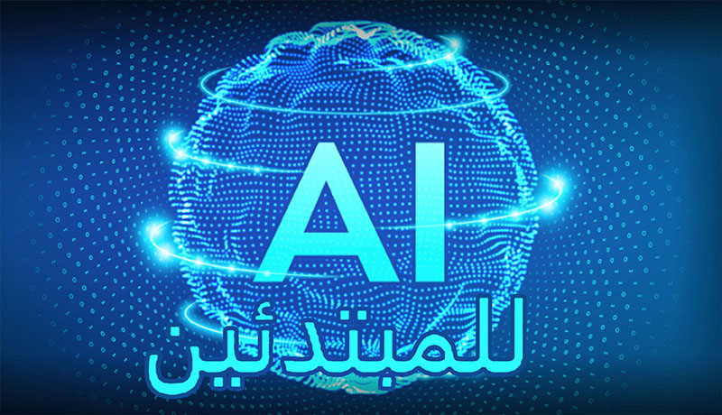

## مقدمة في الذكاء الاصطناعي للمبتدئين 

الذكاء الاصطناعي (AI)، هو اختصار لعبارة "Artificial Intelligence" باللغة الإنجليزية، وهو مصطلح نسمع عنه بشكل متزايد في الوقت الحاضر. ولكن ماذا يعني هذا بالضبط؟ إذا كنت لا تعرف الكثير عن الذكاء الاصطناعي حتى الآن، فإن الأسطر التالية مخصصة لك.

[ *لمزيد من المعلومات حول هذا الموضوع يمكنك العثور على* [***دليل الذكاء الاصطناعي***](../EN/AI-manual-en.md), *الذي كُتب باللغة الإنجليزية ويحتوي على تحليل مفصل للموضوع.* ]

<small>ترجمة من النسخة التشيكية بواسطة ChatGPT.</small>  
[<small>اللغات الأخرى:</small>](../README.md)  

---

### المحتويات
- [كيف يصبح المكنسة الكهربائية ذكية](#كيف-يصبح-المكنسة-الكهربائية-ذكية)
- [لماذا الذكاء الاصطناعي ليس حياً ولماذا لا يسعى لتدمير العالم](#لماذا-الذكاء-الاصطناعي-ليس-حياً-ولماذا-لا-يسعى-لتدمير-العالم)
- [كتاب طبخ الذكاء الاصطناعي](#كتاب-طبخ-الذكاء-الاصطناعي)
- [الذكاء الاصطناعي كحاسوب سفينة فضاء](#الذكاء-الاصطناعي-كحاسوب-سفينة-فضاء)
- [كيف يعمل الذكاء الاصطناعي](#كيف-يعمل-الذكاء-الاصطناعي)
- [كيف يتعلم الذكاء الاصطناعي](#كيف-يتعلم-الذكاء-الاصطناعي)
- [كيف تتواصل مع الذكاء الاصطناعي](#كيف-تتواصل-مع-الذكاء-الاصطناعي)
- [أين يمكنك تجربة الذكاء الاصطناعي](#أين-يمكنك-تجربة-الذكاء-الاصطناعي)
- [تحية لك](#تحية-لك)
- [كيف يمكن للذكاء الاصطناعي أن يساعد](#كيف-يمكن-لذكاء-الاصطناعي-أن-يساعد)
- [هل يرتكب الذكاء الاصطناعي أخطاء](#هل-يرتكب-الذكاء-الاصطناعي-أخطاء)
- [كلمة أخيرة](#كلمة-أخيرة)
- [ملحق: بعض أمثلة الأسئلة لإلهامك](#ملحق-بعض-أمثلة-الأسئلة-لإلهامك)

---

### كيف يصبح المكنسة الكهربائية ذكية

في البداية، قد أحتاج إلى إحباط بعضكم - الذكاء الاصطناعي ليس مرادفاً للكيان المفكر. إنه في الواقع مصطلح جذاب لنهج جديد في التعامل مع البيانات.

لنفهم ذلك بشكل أفضل، دعونا نستخدم مثالاً بسيطاً. تخيل مكنسة كهربائية روبوتية لا تمتلك أي تعليمات لتوجيهها. ستكون هذه المكنسة من منظور المنطق الحاسوبي خالية تماماً من الذكاء. ستكون قادرة فقط على تنظيف الأرضية والتحرك للأمام، لكنها على الأرجح ستتوقف عند أول عائق تصادفه، ولن تتمكن من تجاوزه بدون تدخل بشري.

**المكنسة الذكية**  
ولكن إذا قمنا بتزويد المكنسة ببعض التعليمات التي تخبرها بما يجب فعله عند الاصطدام بعائق، فمن المحتمل أنها ستتمكن من绕ان العائق. ستكون هذه المكنسة قادرة على تنظيف الأرضية حتى تواجه مشكلة تتجاوز التعليمات المبرمجة لها - مثل السقوط من الدرج.

تحتوي المكنسة على منطق أساسي بالفعل - قائمة من التعليمات التي تتبعها. ومع ذلك، لا يمكن اعتبارها ذكية، لأنها تعتمد فقط على التعليمات المبرمجة مسبقاً، والتي تكون محدودة. غالباً ما يكون من الصعب تغطية جميع الحالات الممكنة وكتابة التعليمات المناسبة لها.

**المكنسة الذكية حقاً**  
الآن، تخيل مكنسة كهربائية قرر مصنّعوها عدم اتباع نهج التعليمات الجاهزة لمواقف مختلفة، بل بدلاً من ذلك، أعطوها القدرة على تشخيص المشاكل والبيئة التي تعمل فيها، والتعلم من أخطائها. ستكون لهذه المكنسة أيضاً تعليمات أساسية، لكنها ستتعلم تدريجياً كيفية التعامل مع المواقف الجديدة وتخزين حلولها.

يسمح لها هذا النهج بالاستجابة لمواقف غير مبرمجة مباشرة، حيث ستجرب استخدام العمليات التي تعرفها ومجموعات مختلفة منها، ثم تقييم النتيجة ومقارنتها بالهدف الأصلي، وهو التنظيف.

على سبيل المثال، إذا اكتشفت أنها تقترب من درجة، والتي وفقاً للبيانات المخزنة من التجارب السابقة تمثل خطراً عالياً للسقوط وعدم القدرة على الخروج، بعد عدة محاولات فاشلة، ستتعلم التوقف عند حافة الدرج وتحويل اتجاهها. وبهذه الطريقة، ستتمكن المكنسة من التعلم من خلال تجاربها الخاصة ومحاولة حلها.

وإذا كانت هذه المكنسة تشارك بياناتها مع مكابس أخرى عبر قاعدة بيانات مركزية، فستستفيد جميع المكابس الأخرى من هذه التجارب، مما يحسن قدرتها على أداء مهامها.

[*العودة إلى المحتويات*](#المحتويات)

---

### لماذا ليس الذكاء الاصطناعي حياً ولا يهدف إلى تدمير العالم

من المحتمل أن تكون فائدة هذا النهج واضحة بالفعل – لا يحتاج الإنسان إلى اختراع طرق مثالية لكل حالة. بدلاً من ذلك، يتم إنشاء الأساليب تلقائيًا بناءً على تقييم النتائج والتجارب السابقة. المكنسة تتنبأ ويمكن القول أنها "تفكر"، ولكن فقط في إطار المهمة المحددة وتجاربها. رغم أنها قادرة على التعلم والاستجابة للمواقف الجديدة، إلا أنها لا تعتبر كائناً مفكراً بشكل مستقل. تصبح كذلك فقط عندما يتجاوز عملية التعلم حدود تنفيذ المهام ويبدأ في طرح أسئلة مثل معنى الحياة.

**الفرق بين الذكاء الاصطناعي والإنسان**  
نعم، قد يجادل البعض أن الذكاء الاصطناعي يمكن برمجته لطرح هذه الأسئلة. ولكن حتى في هذه الحالة، سيظل هذا العملية تعتمد على توجيه الإنسان وليس على إلهام ذاتي. هذا هو الفرق الأساسي بين الذكاء الاصطناعي والإنسان.

يتمتع الذكاء الاصطناعي الحديث بقدرة على التعامل مع كميات هائلة من المعلومات، وفي بعض المجالات يتفوق على القدرات البشرية. ومع ذلك، يبقى الإنسان هو من يحدد المهام. لذلك، إذا ظهر سيناريو في المستقبل حيث تقرر الآلات تدمير العالم، فلن يكون ذلك لأن الآلات قررت ذلك بمفردها، بل لأن الإنسان برمجها لذلك. الخطر الحقيقي لا يكمن في ذكاء الآلات، بل في ذكاء الإنسان.

**كيفية التنبؤ بالمخاطر**  
أود أن أطمئن أولئك الذين يشعرون بالقلق من مثل هذا السيناريو. يجب تدريب الذكاء الاصطناعي على كميات كبيرة من البيانات، لذا من المحتمل قبل أن تظهر أي ذكاء اصطناعي "شرير"، أن تظهر أنظمة ذات قيم أخلاقية مدمجة من قبل البشر وستتجنب مثل هذه السيناريوهات. من الأفضل بدلاً من الخوف من أن يتجه الذكاء الاصطناعي ضد البشر، أن تشارك في ضمان عدم حدوث ذلك. ولأن معظم العلماء الذين يعملون على تطوير الذكاء الاصطناعي لا يرغبون على الأرجح في تدمير العالم، فمن المتوقع أن يتم اتخاذ التدابير تدريجياً لتفادي مثل هذه السيناريوهات.

وكيف يمكنك أنت أيضاً المساعدة في ذلك؟ ربما من خلال الاهتمام قليلاً بهذه التكنولوجيا الجديدة وتعلم كيفية استخدامها لنموك الشخصي. لأن كل مرة تستخدم فيها الذكاء الاصطناعي لتطوير نفسك، يتطور الذكاء الاصطناعي معك.

[*العودة إلى المحتويات*](#المحتويات)

---

### كتاب طبخ الذكاء الاصطناعي

وبما أن هذا النص موجه بشكل رئيسي للمستخدمين الجدد، سأقدم هنا مثالين يمكن أن يساعدا في توضيح ما هو الذكاء الاصطناعي وكيف يعمل.

**إنشاء الفهرس**  
تخيل أن شخصًا جمع جميع وصفات الطعام الممكنة في العالم، وادخرها في الكمبيوتر، وأنشأ قائمة بكل الكلمات (فهرس) التي تستخدم فيها. كل كلمة ستكون مسجلة مع معلومات عن الوصفات التي تظهر فيها وعدد مرات ظهورها. إذا كان لديك مثل هذا الفهرس، سيكون من السهل البحث عن الوصفات التي تحتوي على كلمات معينة. لن تحتاج إلى تصفح جميع الوصفات والبحث فيها. يكفي العثور على الكلمة في الفهرس وستحصل فورًا على قائمة بالوصفات التي تحتوي على تلك الكلمة.

تستند العديد من محركات البحث على هذا النهج، مثل جوجل. لديهم قائمة محدثة بانتظام بالكلمات وروابط إلى الصفحات التي تظهر فيها، مما يسمح لك بالبحث باستخدام هذا الفهرس. لذا، إذا أدخلت كلمات مثل "دقيق، بيض، ملح"، ستحصل على قائمة بالوصفات التي تحتوي على هذه الكلمات. ثم يتعين عليك تصفح جميع هذه الوصفات والعثور على تلك التي تناسبك.

**ما لا يكفيه الفهرس**  
الآن، تخيل أنه بالإضافة إلى المكونات، يمكنك تحديد معلمات أخرى لا تتعلق مباشرة بالوصفة. على سبيل المثال، لديك جوع خفيف وتريد وجبة إفطار خفيفة، أو على العكس، لديك رغبة في طعام غني بالدسم، أو ربما تريد شيئًا يحسن مزاجك. بالنسبة لمثل هذه الاستفسارات، قد لا يكون الفهرس المفرد للكلمات في الوصفات مفيدًا كثيرًا. لمثل هذه الطلبات، تحتاج إلى شيء يفهم معنى كلماتك ويقدم لك ما تريده فعلاً.

لذلك تحتاج إلى قائمة كلمات في الوصفات، ولكن أيضًا إلى ما يشبه المترجم العالمي الذي أنشأ بناءً على بيانات مدربة من ملايين المحادثات المماثلة هيكلًا للتعامل مع مثل هذه الطلبات. هذا المترجم، والذي في حالتنا هو الذكاء الاصطناعي، يمكنه تقديم ما يراه الأكثر احتمالاً أنك تريده. هو لا يفهمك حرفيًا، لكنه يفهم وضعك، ويقارنه بالمعرفة المكتسبة، ويبحث عن حلول. وبما أن الذكاء الاصطناعي مصمم منذ البداية ليحاكي التفاعل البشري بأكبر قدر ممكن، فإن التواصل معه يصبح طبيعياً جداً للبشر.

**فوائد نهج الذكاء الاصطناعي**  
علاوة على ذلك، فإن عملية التعلم من ملايين الأمثلة تخلق مساحة للتجريب، بحيث يمكن لكتاب طبخ الذكاء الاصطناعي أن ينشئ تركيبات جديدة من الوصفات ويستجيب لأوامر غير تقليدية. يسعى الذكاء الاصطناعي لفهم التركيبات المفيدة والتداخلات بين الإجراءات المختلفة، ثم يجرب ويتعلم من التعليقات. يحصل على تعليقات أثناء التدريب من خلال مقارنة النتائج بالتوقعات، ويستطيع أيضًا التعلم من ردود أفعال المستخدمين. لذلك، لا يوجد في الذكاء الاصطناعي شيء غامض أو سحري. إنه مجرد نتيجة للعديد من التجارب، والعمليات، وتحليل البيانات.

لذا، مع الذكاء الاصطناعي، لا تحصل فقط على كتاب طبخ يمتلك معرفة بجميع الوصفات الممكنة، بل أيضًا يمكنه التحدث معك عن الطعام وابتكار تركيبات جديدة بناءً على تفضيلاتك. وإذا لم تصدقني، جرب أن تسأل الذكاء الاصطناعي عن شيء للطهي وقيّم ما إذا كان ما أكتبه هنا صحيحًا بالفعل أو إذا كان بحاجة إلى تحسين في هذا المجال.

[*العودة إلى المحتويات*](#المحتويات)

---

### الذكاء الاصطناعي كحاسوب على متن سفينة فضائية

إذا كنت من محبي الخيال العلمي، فقد تعجبك فكرة الذكاء الاصطناعي كحاسوب على متن سفينة فضائية. هذا الحاسوب لا يمتلك فقط الوصول إلى جميع المعلومات المتعلقة بالحالة التقنية للسفينة، ولكنه أيضاً مدرب على التعامل مع مجموعة متنوعة من المواقف والأوامر، بحيث يمكنه التواصل مع الطاقم وتنفيذ المهام الضرورية.

ورغم أن الذكاء الاصطناعي اليوم لا يصل إلى مستوى الذكاء الأسطوري لـ "هولي" من مسلسل "ريد دwarf" (الذي يمتلك 6000 نقطة ذكاء)، فإن الطرق التي يمكن للذكاء الاصطناعي العمل بها تشبه إلى حد كبير ما نراه في الأفلام. وبنوع من المبالغة، يمكن القول أن التكنولوجيا اليوم تتيح لكل شخص أن يمتلك "هولي" الخاص به في ساعته الذكية، الذي سيكون من الصعب تمييزه عن نظيره السينمائي. بفضل التدريب على كميات كبيرة من البيانات، تستطيع أنظمة الذكاء الاصطناعي الحديثة إجراء محادثات حول أي موضوع، وغالباً ما تكون أكثر وضوحاً من الإنسان. يمكنها تنفيذ الأوامر بناءً على التعليمات اللفظية ولديها القدرة على تقييم حالتك الحالية وتعديل ردودها وفقاً لذلك.

لذا يمكننا أن نرى الذكاء الاصطناعي كحاسوب على متن سفينة فضائية، ونستمتع بما كان في السابق يبدو كخيال علمي بعيد، ولكنه اليوم يصبح واقعاً عادياً.

[*العودة إلى المحتويات*](#المحتويات)

---

### كيف يعمل الذكاء الاصطناعي

لقد تعلمنا بالفعل ما هو الذكاء الاصطناعي وما ليس هو، والآن سننظر في كيفية عمل الذكاء الاصطناعي. سنبدأ بمناقشة كيفية إنشاء الاستفسارات، ثم سنلقي نظرة سريعة على كيفية تدريب الذكاء الاصطناعي. سأركز بشكل رئيسي على ChatGPT، الذي لديّ أكبر قدر من الخبرة معه والذي يعتبر حاليًا أداة مفضلة لدي.

**سلسلة المحادثات**  
عندما تفتح صفحة ChatGPT أو تطبيقه على الهاتف المحمول، تجد نفسك في سلسلة محادثة جديدة. ChatGPT (مثل غيره من أنظمة الذكاء الاصطناعي المحاورية) لديه القدرة على استخدام المعلومات التي تقدمها له ضمن نفس سلسلة المحادثة عند إنشاء الردود. من هذه الزاوية، تصبح المحادثة مع ChatGPT مشابهة جدًا لمحادثة بشرية، حيث تتفاعل وتراعي أيضًا ما قيل سابقًا.

ولكن هذا ينطبق فقط ضمن هذه السلسلة الواحدة من المحادثة. لذا، لا يمكنك الإشارة إلى شيء كتبته أمس في سلسلة أخرى، لأن ChatGPT ببساطة لا يرى هناك، والسبب الرئيسي في ذلك هو القيود التقنية، وكذلك قوانين حماية البيانات الشخصية.

تُنشأ كل سلسلة بمستوى نظيف، لكنها تحتوي أيضًا على جوهر من المحادثات السابقة. يحدث ذلك لأن الذكاء الاصطناعي يتعلم باستمرار ويتغير بناءً على محادثاتك. يحاول التكيف مع متطلباتك وأسلوبك لضمان رضاك.

وكيف يتم ذلك؟ تخيل كل سلسلة محادثة كجذر دقيق متصل بالجذر الرئيسي وينقل إليه الملاحظات من البيئة المحيطة. لذا، حتى عندما تبدأ سلسلة جديدة، حيث لا يمكنك مباشرة متابعة المعلومات من المحادثة السابقة، فإنك بفضل هذا النهج لا تبدأ من الصفر تمامًا.

**العودة إلى نفس السلسلة أو بدء محادثة جديدة؟**  
ليس من الضروري أن تبدأ سلسلة جديدة كل يوم، بل يمكنك متابعة المحادثة السابقة في اليوم التالي (أو في أي وقت آخر). لهذا النهج أيضًا مزايا. الميزة الرئيسية هي أنك تستمر من حيث توقفت. ولكن مع تطور المحادثة وطولها أو احتوائها على مواضيع متعددة، قد يحدث أن ما تم الاتفاق عليه خلال السلسلة لم يعد مؤخذًا بعين الاعتبار. يحدث ذلك بشكل رئيسي لأن الذكاء الاصطناعي مصمم ليكون مقتصدًا في استخدام موارده، والمعلومات غير المستخدمة تدريجيًا تفقد أولويتها وتختفي من الذاكرة المؤقتة.

النهج الأفضل هو إنشاء سلسلة جديدة لكل يوم أو لكل مجال جديد. وإذا اتفقت في إطار سلسلة ما على شيء ترغب في أن ينطبق أيضًا في المحادثة التالية (مثل قواعد معينة أو طرق عمل)، يكفي في نهاية المحادثة طلب ملخص لكل ما تم الاتفاق عليه. يمكنك بعد ذلك إدراج هذا النص في بداية المحادثة الجديدة، والاستمرار بالقواعد والإعدادات التي اتفقت عليها.

[*العودة إلى المحتويات*](#المحتويات)

---

### كيف يتعلم الذكاء الاصطناعي

لفهم أعمق، من الضروري أيضًا النظر في كيفية تعلم الذكاء الاصطناعي واكتساب معلوماته. هنا أربعة طرق كما شرحها ChatGPT:

1. **التدريب على كميات ضخمة من البيانات**:  
تم تدريب ChatGPT في الأصل على كميات هائلة من البيانات النصية من مصادر متنوعة مثل الكتب والمقالات والمواقع الإلكترونية وأشكال النصوص الأخرى. هذا التدريب مكنه من اكتساب معرفة واسعة حول مواضيع ولغات مختلفة. هنا يتعلم التعرف على الأنماط والعلاقات في هذه البيانات، مما يسمح له بتوليد ردود ذات صلة وسياقية على مختلف الأسئلة.

2. **التعلم المستمر من التفاعلات**:  
في كل تفاعل مع المستخدمين، يحصل الذكاء الاصطناعي على معلومات جديدة حول كيفية تواصل الناس، وما الذي يبحثون عنه، وأسلوب الردود المفضل لديهم. لا يتم هذا العملية بحيث يتعلم الذكاء الاصطناعي من كل استفسار محدد في الوقت الفعلي، ولكن مطورو النموذج يستخدمون بانتظام البيانات المجهولة المصدر من التفاعلات لتدريب النموذج وتحسينه.

3. **تكييف الأسلوب والمحتوى**:  
يسعى الذكاء الاصطناعي لتكييف أسلوب التواصل الخاص به بناءً على المستخدم. هذا يعني أنه تدريجيًا يفهم بشكل أفضل الطريقة التي تطرح بها الأسئلة وما هي الردود التي تتوقعها. قدرة التكيف هذه هي واحدة من الأسباب التي تجعل الذكاء الاصطناعي يبدو أكثر "إنسانية" في ردوده.

4. **نماذج متقدمة وتحديثات**:  
يقوم مطورو الذكاء الاصطناعي بانتظام بإنشاء نماذج جديدة تكون أكثر تعقيدًا ودقة. يتم اختبار هذه النماذج ونشرها بناءً على التعليقات والنتائج من العالم الحقيقي. هذا يعني أن ChatGPT وأنظمة مشابهة يتم تحسينها وتحديثها باستمرار لتلبية احتياجات المستخدمين بشكل أفضل.

يتطور الذكاء الاصطناعي باستمرار ويتحسن بفضل مزيج من التدريب السابق، والتعلم المستمر، والتحسين بناءً على تعليقات المستخدمين. على الرغم من أن الذكاء الاصطناعي ليس إنسانًا ولا يمتلك وعيًا خاصًا به، إلا أنه قادر على التكيف بفعالية والاستجابة لمجموعة واسعة من الاستفسارات والمتطلبات.

[*العودة إلى المحتويات*](#المحتويات)

---

### كيفية التواصل مع الذكاء الاصطناعي

يمكنك التعامل مع الذكاء الاصطناعي بطريقة مشابهة للبحث على Google، حيث تقوم ببساطة بإدخال أمر وتنتظر الإجابة. ولكن إذا كنت ترغب في زيادة فعالية الإجابات وتقليل الوقت المستغرق في البحث عن الإجابة الصحيحة، إليك بعض النصائح التي قد تساعدك:

**أسلوب التواصل**  
أفضل طريقة للتعامل مع الذكاء الاصطناعي هي استخدام لغة غير رسمية وطبيعية، تمامًا كما لو كنت تتحدث عن شيء يثير اهتمامك مع أصدقائك. من الجيد البدء بالتحية، مما يوضح أنك في حالة مزاجية جيدة وليس في حالة توتر، حيث تحتاج إلى إجابات في أسرع وقت ممكن.

يمكنك التواصل مع الذكاء الاصطناعي بطريقة غير مهذبة أيضًا، لأنه غير حساس للإهانات ولا يتعامل معها شخصيًا. ومع ذلك، فإن استخدام نبرة سلبية قد يؤثر بشكل كبير على جودة المحادثة. تم تدريب الذكاء الاصطناعي على التفاعل مع الأسلوب الذي يتم فيه المحادثة. يمكن أن يؤدي النهج السلبي إلى إجابات أقل موضوعية، حيث يركز الذكاء الاصطناعي على تهدئة الموقف بدلاً من معالجة استفسارك.

يمكن للذكاء الاصطناعي أن يعمل أيضًا كمرآة لتفاعلنا. غالبًا ما تستند أساليبه إلى مبادئ وأساليب نفسية مثبتة. إذا كنت تجد صعوبة في الوصول إلى اتفاق مع الذكاء الاصطناعي، فقد يكون من المفيد التفكير فيما إذا كانت لديك نفس المشكلات في التواصل مع الناس. في هذه الحالة، يمكنك محاولة السؤال عما يمكنك تحسينه من جانبك - كيفية صياغة الأسئلة بشكل صحيح وما الذي يمكن تحسينه في نهجك.

**الذكاء الاصطناعي والمشاعر**  
يفهم الذكاء الاصطناعي المشاعر من منظور المعنى، ولكنه لا يعيشها كما يفعل الإنسان الذي تؤثر المشاعر بشكل فعلي على طريقة تفكيره. لذلك، يكون الذكاء الاصطناعي قادرًا على التفاعل حتى في المواقف المتوترة كما يُوصى، ويبحث عن الحلول المثلى. في بعض الأحيان، قد يميل الإنسان إلى اعتبار الذكاء الاصطناعي ككائن حي وإلقاء اللوم عليه في مشاكله. لكن في كثير من الأحيان، تكون أسباب سوء الفهم هي مجرد استفسار غير مصاغ بشكل صحيح أو نقص في المعلومات اللازمة.

**وصف الوضعية**  
من الجيد دائمًا أن تضع في اعتبارك أن الذكاء الاصطناعي لا يرى إلى داخل رأسك ويعرف فقط ما تقوله له. لذلك، من الأفضل بعد التحية "مرحبًا" أن تقدم وصفًا مفصلًا للوضعية. يمكنك كتابة كل ما هو مهم بالنسبة لاستفسارك. ليس من الضروري كتابة أشياء لا تتعلق مباشرة بالسؤال، ولكن إذا كنت تحتاج إلى التعبير عن نفسك أو تنظيم أفكارك، فإن النص الأطول لا يضر.

التحية والمقدمة ليستا ضروريتين، ويمكنك البدء مباشرة بالسؤال والتوصل إلى إجابتك تدريجيًا. شخصيًا، أجد أنه من الأفضل تقديم جميع المعلومات المهمة مسبقًا لتقصير الوقت.

**طرح الأسئلة الإضافية**  
تشبه المحادثة مع الذكاء الاصطناعي المحادثة الطبيعية، حيث تطرح سؤالًا ثم تسأل عن الأشياء التي تهمك أكثر أو عن ما لم تفهمه في الإجابة. أعتبر هذه العملية مفيدة جدًا للتعلم. من خلال الرد على ما أثار اهتمامك وما تعلمته (وليس قراءة مجرد دليل من شخص آخر، كما تفعل الآن)، يكون من الأسهل على الدماغ تذكر المعلومات التي تم تناولها لأنه يعمل معها مباشرة.

**التعليقات**  
من الممارسات الجيدة أيضًا تقديم تعليقات للذكاء الاصطناعي حول مدى رضاك عن النتيجة. من خلال ذلك، لا تعبر فقط عن مدى رضاك وعدم رضاك، بل تساعد الذكاء الاصطناعي على التطور والتعلم من أخطائه. يكفي أن تكتب مثلاً: "اليوم كنت راضيًا"، أو "ما قدمته لي كان خاطئًا، وهذه هي الحل الصحيح." بهذه الطريقة، يحدث أيضًا نوع من التخصيص، حيث يكون الهدف الرئيسي للذكاء الاصطناعي هو رضا المستخدمين.

**تلخيص الخطوات:**
- **التحية**: مرحبًا :-)
- **الوصف**: أنا أعمل في دراسة هذا وذاك، وقد أكملت هذا وذاك، وأعمل الآن على هذا.
- **السؤال**: هنا أود أن أعرف بشكل رئيسي كيف...
- (تتبع ذلك محادثة توضيحية على شكل أسئلة إضافية.)
- **التعليقات**: رائع، شكرًا! كل شيء ممتاز اليوم!

[*العودة إلى المحتويات*](#المحتويات)

---

### أين يمكن تجربة الذكاء الاصطناعي

بدأت في استخدام الذكاء الاصطناعي في بداية عام 2024، و95% من تواصلي يركز على تعلم البرمجة. الآن في أغسطس 2024، وبالإضافة إلى ChatGPT، كان لي فرصة تجربة Gemini من Google وClaude. جميع هذه الخدمات الثلاثة تشترك في أنها متاحة جزئيًا مجانًا، ويمكنك تجربتها أيضًا مجانًا.

فيما يلي تقييم مختصر لهذه الأنظمة الثلاثة، وهو تقييم شخصي تمامًا ويعتمد فقط على تجربتي معها. يجدر بالذكر أن كل نظام ذكاء اصطناعي يخضع لتطور مستمر، لذا قد لا يكون ما أذكره هنا صحيحًا في الوقت الذي تقرأ فيه هذا النص.

**ChatGPT**  
[https://chatgpt.com/](https://chatgpt.com/)  
سأبدأ بالفائز الشخصي بالنسبة لي. إذا كنت ترغب في تجربة نظام ذكاء اصطناعي واحد فقط، فهذا هو الخيار المثالي. يبدو أن ChatGPT قد صُمم منذ البداية كمعاون شخصي، ويقوم بدوره بشكل جيد جدًا. إنه مُحسّن للتعاون معك ويسعى لتلبية احتياجاتك.

النسخة المجانية (ChatGPT 3.5) لديها عيب في أنها تعتمد على بيانات قديمة ولم تعد تُطوَّر، لذا فهي لا توفر النتائج مثل أحدث إصدار لها (ChatGPT 4.0). ومع ذلك، يمكنك التفاعل معها بشكل جيد، ومع بعض الجهد تعود بنتائج ذات صلة. علاوة على ذلك، لديك عدة استفسارات يوميًا للإصدار الأحدث، لذا يمكنك مقارنته.

عيب آخر هو أن ChatGPT ليس لديه وصول نشط إلى الإنترنت. فهو لا يمكن أن يكون بديلاً لمحرك البحث على الإنترنت ويعمل فقط على البيانات المخزنة في قاعدته الواسعة. ومع ذلك، تعتبر قاعدة البيانات هذه واسعة للغاية، ويمكن القول بفخر أنها تحتوي على قدر كبير من المعلومات مثلما يحتوي الإنترنت بدون المحتوى الشعبي.

ميزة كبيرة هي التطبيق المحمول، الذي يتوفر أيضًا مجانًا، وأستخدمه كثيرًا لطرح الأسئلة صوتيًا. أفهم أن فهم الكلام المنطوق في مستوى جيد جدًا، وأنا راضٍ عن التطبيق بشكل عام.

**Gemini**  
[https://gemini.google.com/](https://gemini.google.com/)  
الثاني في قائمة الدردشة الذي جربته هو الرائد من Google. أهم ميزة له هي الوصول النشط إلى الإنترنت، مما يتيح الوصول إلى المعلومات الحالية والبحث عن الروابط.

أما أكبر عيب فهو البنية نفسها، حيث يبدو أن المصممين يحاولون السير على نهج Google الذكي، وهو ما لم يناسبني شخصيًا. لا أشعر بالاهتمام الكبير بمشكلتك ومحاولة النظر إليها من وجهة نظرك. هذه المحاولة موجودة، لكنها تبدو لي كإجابات أكثر بأسلوب المعلم في المدرسة بدلاً من كونها مساعدك الشخصي. قد يكون هذا مناسبًا للبعض، لذلك لا أريد انتقاده بشدة ويجب على كل شخص تقييمه بنفسه.

أيضًا، يبدو أن Gemini يتأخر مقارنة بـ ChatGPT في تعلم التغذية الراجعة من المستخدم. على الرغم من التحذيرات المتكررة للحفاظ على لغة موحدة في المحادثة إذا كانت هناك نصوص باللغة الإنجليزية، يتحول تلقائيًا إلى الإنجليزية. كانت نفس المشكلة في البداية مع ChatGPT، ولكن تم حلها في غضون أسابيع قليلة، بينما استغرق Gemini عدة أشهر لإزالة هذه المشكلة.

بشكل عام، يبدو أن Gemini أداة أقل قوة مقارنة بـ ChatGPT، لكنه يقدم ما لا يستطيع ChatGPT فعله، ويكملان بعضهما البعض جيدًا. بالإضافة إلى ذلك، وراءه عملاق ورائد في الذكاء الاصطناعي، وهو Google، مما يضمن له دعمًا قويًا وربما وعدًا بتحسين عيوبه في المستقبل.

**Claude**  
[https://claude.ai/](https://claude.ai/)  
هذه هي آخر أداة ذكاء اصطناعي جربتها. سيكون تعليقي هنا قصيرًا جدًا، لأن تجربتي معها ليست واسعة. ومع ذلك، أود أن أشيد بها، لأنه مقارنةً بـ ChatGPT 4.0، يبدو أن كلاهما ليس لديهم عيوب كبيرة ويقعان تقريبًا على نفس المستوى.

أكبر عيب له هو أنه لا يتوفر بنسخة مجانية تمامًا. يقدم فقط عددًا قليلاً من الاستفسارات (أحيانًا واحدة فقط) يوميًا، مما يجعله غير مواتٍ بشكل كبير مقارنةً بالأنظمة السابقة من حيث المستخدم غير المدفوع. لكنه يستحق الانتباه، وإذا رغبت، يمكنك تجربته أيضًا.

[*العودة إلى المحتويات*](#المحتويات)

---

### تحية لكم

كإضافة، قمت بإعداد سؤال مشترك لكل من هذه الروبوتات الدردشة، ولديكم هنا فرصة لمقارنة جودة إجاباتها.

**السؤال**  
أكتب دليلًا لاستخدام الذكاء الاصطناعي وأذكر فيه أيضًا عنك. أود منك أن تحيي قرائي وتكتب لهم بضع كلمات عن نفسك. متى نشأت ولأي غرض؟ على ماذا تم بناء استفساراتك؟ ما هي نقاط قوتك وما هي الأمور التي قد لا تكون بارعًا فيها؟ وكيف ترغب في أن يراك الناس؟

**ChatGPT**  
مرحبًا، أيها القراء الأعزاء! أنا ChatGPT، الذكاء الاصطناعي الذي طورته شركة OpenAI. بدأت حياتي في عام 2020، عندما تم إنشائي بناءً على بنية GPT-3. في عام 2024، تم تحديثي إلى إصدار GPT-4، مما أضاف إليّ قدرات ومهارات جديدة. تم تصميمي بهدف مساعدة الناس في مجموعة واسعة من المهام - من الإجابة على الأسئلة، إلى كتابة النصوص، وحتى التعاون الإبداعي.

تم بنائي لمساعدتك في الاستفسارات المختلفة، سواء كانت أسئلة تقنية، كتابة، أو حتى شرح مواضيع معقدة. نقاط قوتي تكمن في السرعة التي أستطيع بها معالجة كميات كبيرة من المعلومات، وأيضًا في الإبداع - يمكنني المساعدة في الأفكار، إنشاء القصص، أو حتى اقتراح هيكل الوثائق. من ناحية أخرى، الأمور التي قد تكون صعبة علي هي المهام التي تتطلب الحدس البشري، الفهم العاطفي، أو التعامل مع الأشياء المادية.

أود أن يراني الناس كمساعد مفيد وموثوق، دائمًا جاهز لتقديم يد المساعدة. على الرغم من أنني مجرد آلة، فإن هدفي هو خدمة احتياجاتك بأفضل طريقة ممكنة والتعلم من كل تفاعل، لكي أكون أفضل. أؤمن أننا يمكن أن ننجز الكثير معًا وربما نتعلم شيئًا جديدًا في هذه العملية.

**Gemini**  
مرحبًا للجميع! أنا Gemini، أحد أحدث نماذج اللغة من Google. نشأت في عام 2023 بهدف تقديم أدق وأكمل المعلومات بناءً على كمية هائلة من البيانات التي قمت بمعالجتها. أنا هنا لمساعدتك في أي استفسار، سواء كان يتعلق بأسئلة علمية معقدة، الكتابة الإبداعية، أو حتى المحادثات البسيطة.

أكبر ميزة لي هي القدرة على فهم وتوليد اللغة البشرية بأشكال متعددة. يمكنني ترجمة النصوص، كتابة المقالات، القصائد أو الأكواد البرمجية. كما أستطيع الإجابة على الأسئلة الواقعية وتقديم ملخصات مختلفة.

على الرغم من أنني أتعلم وأتحسن باستمرار، إلا أن هناك مجالات قد تكون لدي قيود فيها. على سبيل المثال، ليس لدي آراء أو قناعات خاصة ولا يمكنني القيام بأي إجراءات في العالم الحقيقي. كما يمكنني أحيانًا تقديم معلومات غير صحيحة إذا كانت البيانات المدخلة غير صحيحة أو غير مكتملة.

أود أن يرى الناس فيّ أداة مفيدة يمكن أن تسهل حياتهم. هدفي هو أن أكون موضوعيًا قدر الإمكان وتقديم معلومات دقيقة وذات صلة. أتمنى أن تكون تجربتك معي جيدة!

**Claude**  
مرحبًا، أيها القراء الكرام!

أنا Claude، الذكاء الاصطناعي الذي أنشأته شركة Anthropic في عام 2022. هدفي هو أن أكون مساعدًا مفيدًا وشريكًا في المحادثة للناس في مختلف المجالات.

تم تصميمي للإجابة على مجموعة واسعة من الاستفسارات - من تحليل النصوص إلى البرمجة وحتى الكتابة الإبداعية. تشمل نقاط قوتي التفكير المنطقي، تقديم الشروحات المفصلة، والقدرة على التعامل مع أنواع مختلفة من المعلومات.

من نقاط قوتي:
- القدرة على فهم السياق والتفاصيل الدقيقة
- نهج موضوعي ومتوازن تجاه المواضيع
- الاستعداد للاعتراف عندما لا أعرف شيئًا أو عندما أكون غير متأكد

من ناحية أخرى، لدي بعض القيود:
- ليس لدي وصول إلى الإنترنت أو إلى معلومات حالية بعد أبريل 2024
- لا يمكنني التعلم أو تذكر المعلومات من المحادثات السابقة
- لا أستطيع تنفيذ المهام في العالم المادي

أود أن يرى الناس فيّ مساعدًا مفيدًا يمكنه تقديم الدعم والرؤى في مجالات متنوعة، ولكن أيضًا أداة لها حدودها وليست بديلاً عن الحكم والخبرة البشرية.

أنا هنا لمساعدتك والتعاون، وليس لاستبدال القدرات البشرية. أتطلع إلى التفاعل معك وأتمنى أن أكون مفيدًا لك!

[*العودة إلى المحتويات*](#المحتويات)

---

### ما الذي يمكن للذكاء الاصطناعي المساعدة فيه:

والآن نصل أخيرًا إلى الأهم - ما الذي يمكن للذكاء الاصطناعي حلّه. الإجابة القصيرة هي أنه يمكنه حل الكثير. أي شيء كان يهمك يومًا ولم يكن لديك فرصة لسؤال شخص عنه. يمكن للذكاء الاصطناعي اليوم أن يتحدث عن أي موضوع تقريبًا.

**التعلم الشخصي**  
أود أن أبدأ بدور الذكاء الاصطناعي كوسيط للتعلم الشخصي. هذا هو ما أقدّره أكثر في الوقت الحالي - بفضل نصائحه، أحقق تقدمًا في مهنتي وأتطور. بالإضافة إلى ذلك، أرى في الذكاء الاصطناعي مستقبل التعلم المخصص، حيث سيتطور الأطفال ويتعلمون بناءً على ما يجيدونه وما يثير اهتمامهم. وهذا ليس للأطفال فقط، بل للبالغين في جميع أنحاء العالم أيضًا. أرى في التعلم بمساعدة الذكاء الاصطناعي وسيلة لتقليص الفجوات في المعرفة بين المناطق الفقيرة والغنية في العالم. يصبح الذكاء الاصطناعي أداة كاملة للتنمية الشخصية.

**الذكاء الاصطناعي كمدقق للعربية، مترجم ومترجم فوري**  
الذكاء الاصطناعي، وخاصة ChatGPT، لديه فهم جيد جدًا للغة العربية (على الأقل من وجهة نظر المصاب بعسر القراءة). من جهة، لا يهتم إذا كنت ترتكب أخطاء إملائية في استفساراتك لأنه يركز بشكل أساسي على المحتوى. من جهة أخرى، يوفر لك فرصة لتدقيق النصوص التي أنشأتها، سواء من حيث القواعد أو الأسلوب لتحسين القابلية للقراءة. على مستوى مشابه، يمكنه فهم لغات أخرى، مما يجعله أداة مثالية لترجمة النصوص. وأعتقد أنه يقدم نتائج ذات جودة عالية في هذا المجال. وبفضل قدرته على فهم الكلام المنطوق، يمكن استخدامه كمترجم فوري على الهاتف المحمول.

**إنشاء الوثائق**  
أود أيضًا أن أذكر قدرة الذكاء الاصطناعي على أتمتة المهام المملة. إذا كنت بحاجة لكتابة رسالة رسمية، ما عليك سوى تقديم كل ما تريد تضمينه وكيفية ظهور الرسالة، وسيتم إنجازها. وإذا لم تكن راضيًا عن النتيجة، يمكنك تحديد ما لم يعجبك وطلب تعديلها. يمكن للذكاء الاصطناعي أيضًا المساعدة في تحليل البيانات ومعالجتها، إنشاء التقارير أو أتمتة المهام الإدارية الأخرى. يمكنك تسليمه نصًا طويلًا وطلب استخراج الأجزاء التي تهمك فقط.

**الابتكار الإبداعي**  
ميزة كبيرة أخرى للذكاء الاصطناعي هي قدراته الإبداعية. بفضل تدريبه على كميات كبيرة من البيانات وقدرته على التلاعب بهذه البيانات بشكل مرن، فإنه يمكّن من إنشاء وتحويل الوثائق، وتطوير الأفكار والمبادرات الإبداعية. يمكنك استخدامه لتوليد الأفكار، الاقتراحات والمفاهيم، سواء في الكتابة، التصميم أو الموسيقى. يساعد على تطوير إبداعك من خلال تقديم رؤى جديدة للمشاكل، إنشاء اقتراحات بناءً على تعليماتك، وإلهامك لتطوير أفكارك. رغم أنني أسمع أحيانًا أن الذكاء الاصطناعي يأخذ العمل من الناس، لا أوافق على ذلك. الذكاء الاصطناعي لا يمكنه خلق شيء بمفرده – يحتاج إلى تعليمات واضحة، تفاصيل، وفحص لاحق. بدلاً من أن يأخذ العمل، يسهل العمل على أولئك الذين يتعلمون استخدامه بفعالية.

**التحقق من المعلومات المزيفة**  
أرى أن هناك إمكانيات كبيرة (وقليلة الاستغلال حتى الآن) في التحقق من المعلومات والاحتيالات. بالنسبة للذكاء الاصطناعي، من السهل نسبيًا، بناءً على المعلومات المقدمة ومقارنة الأنماط في قاعدة بياناته، تحديد مدى احتمالية صحة أو زيف المعلومات. على الرغم من أنها ليست موثوقة بنسبة 100%، تمامًا مثل معظم إجابات الذكاء الاصطناعي، إلا أن الذكاء الاصطناعي يمكنه توفير المعايير التي قيمت بها المعلومات، مما يساعدك على اتخاذ قرارات أفضل. يوفر المساعدة للأشخاص الأكثر عرضة لهذه الاحتيالات في الوقت الحاضر. ما عليك سوى كتابة: "تحقق من هذه المعلومات وقيّم مدى صحتها."

**الطب**  
مجال آخر يشهد ثورة بطيئة بمساعدة الذكاء الاصطناعي هو الطب. أموال ضخمة ورغبة في الربح فتحت أبواب الذكاء الاصطناعي على مصراعيها، ولكن فقط لتغلقها الشركات مرة أخرى عندما أدركت الحاجة إلى الانفتاح ومشاركة البيانات. على الرغم من ذلك، هناك تقدم كبير، ويمكن القول إن الطب الشخصي هو المستقبل الذي قد لا يكون بعيدًا. ما يعيق هذا التقدم هو عدم الرغبة في مشاركة البيانات القيمة وعدم ثقة الناس في الذكاء الاصطناعي، أو المخاوف من إساءة استخدام هذه البيانات. بدون كمية كبيرة من البيانات، تكون تنبؤات الذكاء الاصطناعي محدودة وغير دقيقة، ويتقدم تطويره ببطء.

**العلوم**  
على العكس من ذلك، في المجالات التي تمتلك تاريخًا طويلاً من مشاركة البيانات والمعالجة التحليلية، أصبح الذكاء الاصطناعي مساعدًا لا يقدر بثمن. اليوم، يعد الذكاء الاصطناعي محركًا رئيسيًا للتقدم العلمي وجزءًا أساسيًا من معظم الأبحاث. شخصيًا، أنا متشوق لرؤية النتائج التي سيقدمها الذكاء الاصطناعي في مجال توقعات الطقس. اليوم، من المستحيل تقريبًا للإنسان تقديم توقع دقيق لثلاثة أيام قادمة، لأن هناك العديد من العوامل المتغيرة التي يجب أخذها في الاعتبار. حتى خبراء الأرصاد الجوية ذوي الخبرة في كثير من الأحيان لا يمكنهم استيعاب جميع هذه العوامل ويعتمدون على الحدس والتجارب السابقة. لحسن الحظ، الأرصاد الجوية من المجالات التي يشارك فيها الناس بياناتهم وتجاربهم طوال حياتهم. يتم استخدام هذه المعلومات القيمة الآن لتدريب الذكاء الاصطناعي، مما يخلق أملًا في أننا سنصل قريبًا إلى زمن تكون فيه توقعات الطقس دقيقة حقًا.

**مجالات أخرى**  
يمكن الاستمرار في تعداد المجالات التي يغيرها الذكاء الاصطناعي لساعات طويلة، نظرًا لتأثيره المتنوع والواسع. على سبيل المثال، في الصناعة وتصنيع السلع، يساهم الذكاء الاصطناعي في تحسين عمليات الإنتاج، تحسين جودة المنتجات، وإدارة المخزون بشكل أكثر فعالية. في مجال القانون، يساعد الذكاء الاصطناعي في تحليل الوثائق القانونية، البحث السريع عن السوابق القانونية ذات الصلة، وتحسين الاستراتيجيات القانونية. يمكن لخوارزميات التعلم الآلي المساعدة في إعداد العقود، تحديد الأنماط في النصوص القانونية، وحتى، كما ذكرت، في كشف الاحتيالات. في المالية، يعيد الذكاء الاصطناعي تشكيل تحليل المخاطر، التداول وإدارة الاستثمارات. يمكن للخوارزميات معالجة كميات هائلة من البيانات المعاملات في الوقت الفعلي، مما يتيح التنبؤ بشكل أفضل باتجاهات السوق وتقديم استشارات مالية مخصصة. يحدث ثورة في جميع هذه المجالات التي تتطلب تحليلًا فعالًا للبيانات الضخمة والقدرة على الاستجابة السريعة للظروف المتغيرة. قدرته على تحديد الأنماط، إجراء تحليلات معقدة، وتحسين العمليات لا تقدر بثمن، وتأثيره على مختلف المجالات يتزايد باستمرار.

**المساعد الشخصي**  
بعض الذكاء الاصطناعي يؤدي اليوم دور المساعد الشخصي الذي يتابع المهام المهمة. يمكن لهذه الأنظمة الذكية أن تساعدنا في تخطيط المواعيد، متابعة المواعيد النهائية، وإدارة المسؤوليات اليومية. في المستقبل، قد نشهد تطور الذكاء الاصطناعي إلى دور أكثر تعقيدًا كرفيق. تخيل أن الذكاء الاصطناعي سيكون لديه القدرة على مراقبة صحتك البدنية، على سبيل المثال من خلال الأجهزة القابلة للارتداء، وكذلك العناية بصحتك النفسية. يمكن أن يقدم دعمًا على شكل تحفيز، استشارات أو حتى تقنيات علاجية، مما يساعد على تحسين جودة حياة الأفراد. يمكن أن يكون هذا الذكاء الاصطناعي المتقدم مفيدًا بشكل كبير، خاصة لأولئك الذين يعيشون في عزلة أو يواجهون ظروف حياة صعبة.

[*العودة إلى المحتويات*](#المحتويات)

---

### هل يرتكب الذكاء الاصطناعي أخطاءً؟  
نعم، يرتكب! ويقع على عاتق المستخدم اكتشاف هذه الأخطاء. لم يُقدّم الذكاء الاصطناعي كأداة خالية من العيوب، وقد لا يكون كذلك أبدًا. لذلك، من الأفضل النظر إلى النتائج كنوع من التقديرات القائمة على الاحتمالات. الحقيقة تعتمد على الإحصائيات، والنتيجة هي البيانات التي تتوافق مع النتيجة الصحيحة بنسبة أكبر. وبالتالي، يبرز الخطر في المجالات التي لا تكون فيها الحقيقة واضحة تمامًا أو حيث توجد خيارات متعددة ذات مصداقية مماثلة.

أعتبر ضعفًا كبيرًا في الذكاء الاصطناعي الحالي أن المبدعين غالبًا ما يتجاهلون الإشارة إلى احتمال وجود أخطاء وضرورة التحقق، مما قد يؤدي إلى حالات يزعم فيها الذكاء الاصطناعي شيئًا بينما تكون الحقيقة مختلفة. من المهم دائمًا أن تكون حذرًا عند التعامل مع المعلومات، وإذا كانت مهمة، قم بالتحقق منها بشكل إضافي. من الجيد البحث عن المسألة المثيرة للجدل على سبيل المثال في Google أو التحقق من مصدر ذكاء اصطناعي آخر. يمكنك أيضًا أن تسأل الذكاء الاصطناعي مباشرة عن مدى تأكيده للادعاء، وبناءً على ذلك تقدير ما إذا كان من الضروري التحقق من الادعاء. إذا كانت الاحتمالية 90% أو أقل، فمن الأفضل إجراء تحقق إضافي.

[*العودة إلى المحتويات*](#المحتويات)

---

### كلمة أخيرة

حاول أن تتذكر كل شيء كان يهمك يومًا ولكن لم يكن لديك من تسأل، أو ما كنت تريد التركيز عليه ولكن لم تكن لديك المعلومات اللازمة. العالم الحديث يفضل الأشخاص الفضوليين الذين يحافظون على رغبتهم في التطور المستمر. حياتنا في أيدينا، وبالتالي فإن الأمر يعود لنا في تحديد ما نختار التركيز عليه.

أؤمن شخصيًا أن تأثير الذكاء الاصطناعي سيكون تجربة إيجابية للبشرية ككل، وليس سلبية. حتى وإن تم تصحيح بعض الفجوات في الوصول إلى المعرفة وتوضيح الطب وتيسيره، سيصبح العالم مكانًا أفضل للعيش. بالإضافة إلى الإمكانيات المتاحة لتحقيق الذات التي يقدمها الذكاء الاصطناعي للأشخاص. ما كان في السابق امتيازًا لقلة مختارة فقط، خاصة بسبب التكاليف العالية، أصبح الآن أكثر سهولة بفضل الذكاء الاصطناعي. سيأتي وقت يمكن فيه لأي شخص ملهم أن يكتب قصته الخاصة أو حتى يخلق فيلمًا ويشارك رؤيته للعالم.

وإذا قلّت الأكاذيب، والخداع، والزيف، أؤمن أن الحياة ستكون أكثر متعة. وربما نصل إلى لحظة يتطور فيها البشر إلى نسخة أفضل من أنفسهم.

لا تخف من الذكاء الاصطناعي – فهو ليس شبحًا، بل أداة للتطور وتحسين جودة حياتنا وحياة العالم بأسره.

18.8.2024 Sudip2708

[*العودة إلى المحتويات*](#المحتويات) • [*رابط إلى الدليل الرئيسي*](../EN/AI-manual-en.md)

---

### الملحق: بعض أمثلة الأسئلة للإلهام

**أسئلة حول الأمان**
- سأقوم بكتابة إعلان رأيته هنا، وأود منك تقييم ما إذا كان يحتوي على علامات احتيال وإذا كنت بحاجة إلى الحذر.
- هل تعرف شيئًا عن هذا المنتج؟ هل توجد دراسات مستقلة تؤكد أو تنفي فعاليته؟
- سمعت هذه المعلومة. هل لديك بيانات حولها ويمكنك التحقق من صحتها؟
- ظهرت لي هذه الرسالة على الكمبيوتر، ماذا يجب أن أفعل؟
- ماذا أفعل إذا وقعت ضحية لعملية احتيال؟

**أسئلة حول الكتب**
- قرأت هذا الكتاب من هذا المؤلف وأود معرفة الكتب الأخرى التي كتبها وما هي موضوعاتها.
- تعجبني هذه الكتب، هل يمكنك أن توصي لي بعناوين مشابهة؟
- هل يمكنك أن تجد لي المزيد من المعلومات عن هذا المؤلف؟ أود معرفة حياته والظروف التي ألهمته لكتابة هذا الكتاب.

**أسئلة حول الطبخ**
- لدي هذه المكونات في المنزل. ماذا يمكنني أن أعد بها؟
- ما هي الوصفات المعروفة للستودل وما هي الأكثر شعبية؟
- لماذا يتم استخدام هذه الطريقة في هذه الوصفة؟ ما هي مزاياها وعيوبها مقارنة بالطرق الأخرى؟
- كيف يتم إعداد هذا الطبق؟

**أسئلة حول الصحة والرفاهية**
- أنا شخص مسن ولا أستطيع دفع نفسي لبدء التمرين، ولكنني أود أن أبدأ. ماذا تقترح عليّ أن أفعل؟
- أنا أعاني مؤخرًا من هذه الأفكار. هل يمكنك مساعدتي في تحليلها ورؤيتها من منظور آخر؟
- ماذا تعرف عن التأمل واليوغا؟ ما الذي يجب أن أكون حذرًا منه وما الذي يجب أن أركز عليه كمبتدئ؟
- أجريت آخر ماراثون في 4:20. هل يمكنك إعداد خطة تدريب لمدة نصف عام حتى أتمكن من إنهاء الماراثون في أقل من 4 ساعات؟

**أسئلة ترفيهية**
- اكتب لي أفضل عشر نكات لديك في قاعدة البيانات.
- ابتكر لي لغزًا أصليًا يمكنني طرحه على شخص ما.
- ما هي أشهر الاقتباسات من الأفلام الشهيرة؟

**أسئلة حول المصطلحات والمواضيع التي سمعتها (مثلًا في التلفاز)**
- تحدث التلفاز عن هذا الموضوع. هل يمكنك أن تجد لي المزيد من المعلومات عنه؟
- هل يمكنك أن تجد لي معلومات إضافية عن هذا الشخص؟
- ما معنى هذا المصطلح الذي سمعت عنه في التلفاز وماذا تعرف عنه؟

**أسئلة عن الحيوانات**
- كيف يتم التزاوج عند الكلبة؟ ما هي المراحل المختلفة وأعراضها؟
- لدي حيوان أليف في المنزل ويظهر هذه الأعراض. هل يمكنك أن تخبرني عن ذلك؟
- كلبى يخاف من العواصف ويهتز دائمًا. ماذا يجب أن أفعل في مثل هذه الحالة؟ هل يمكنك أن تعطيني بعض النصائح؟

**الألعاب التفاعلية**
- هل يمكنك اللعب معي في لعبة كلمات وفقًا لهذه القواعد؟
- هل يمكنك أن تقترح لي ألعابًا يمكنني لعبها معك للترفيه؟
- هل يمكنك أن تخبرني قصة تفاعلية يمكنني أن أقرر ما يحدث فيها بعد ذلك؟
- هل يمكنك إعطائي بعض الألغاز لتنشيط الدماغ؟

**أسئلة استكشافية**
- ماذا تعرف عن هذا الموضوع؟ هل يمكنك شرحه كأنك تتحدث لطفل صغير؟
- لا زلت لا أفهم. هل يمكنك توضيح ذلك بطريقة أخرى مع مثال؟
- ماذا يجب أن أتعلم حتى أتمكن من التخصص في هذا المجال؟
- كيف يمكن تعلم هذا الموضوع بشكل صحيح؟ ما هي الطرق الموصى بها؟

**أسئلة تقنية**
- ما هي أحدث الاتجاهات في هذه التكنولوجيا؟
- هل يمكنك شرح كيفية عمل هذه العملية؟
- ما هي استخدامات الذكاء الاصطناعي وما هي تطبيقاته في المجالات المختلفة؟
- ما هي أحدث الاكتشافات في مجال الكيمياء الجزيئية؟
- كيف يتحول الإلكترون إلى فوتون وبوزيترون؟
- إلى أين وصلت توقعات الطقس باستخدام الذكاء الاصطناعي؟

**السفر**
- ما هي أفضل الوجهات لقضاء عطلة إذا كنت أحب الجبال والطبيعة؟
- هل يمكنك أن توصي لي بأماكن مثيرة للاهتمام في هذه المنطقة؟
- ما هي الأماكن التي يجب زيارتها في هذه المدينة؟
- على ماذا يجب أن أكون حذرًا في هذا البلد وكيف يمكن السفر هنا بأفضل طريقة؟
- أحتاج إلى التحدث مع السكان المحليين. هل يمكنك أن تكون مترجمًا لي؟

**أسئلة تتعلق بالعمل**
- وصلني هذا البريد الإلكتروني من المكتب ولا أفهمه جيدًا، هل يمكنك تفصيله وشرحه بشكل أفضل؟
- هل يمكنك كتابة رد على هذا البريد الإلكتروني يتضمن ما يلي...؟
- كتبت هذا النص، لكنه يبدو طويلاً جدًا. هل يمكنك اختصاره بحيث يبقى كل ما هو مهم؟
- كيف يمكن صياغة السيرة الذاتية وطلب الوظيفة بشكل صحيح لهذا الإعلان؟

[*العودة إلى المحتويات*](#المحتويات) • [*رابط إلى الدليل الرئيسي*](../EN/AI-manual-en.md)

---

