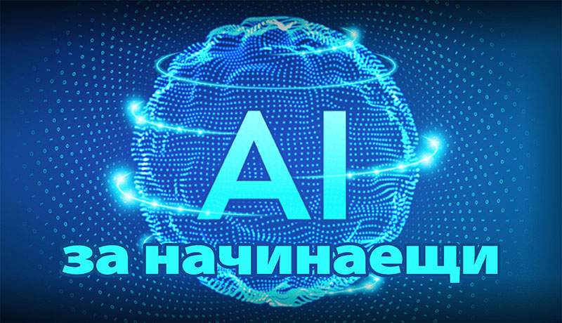

## Въведение в AI за начинаещи

AI, или изкуствен интелект (от английски "Artificial Intelligence"), е съкращение, което днес чуваме все по-често. Но какво всъщност означава? Ако все още не знаете много за изкуствения интелект, следващите редове са предназначени точно за вас.

[ *Повече информация по тази тема ще намерите в самия* [***AI Manual***](../EN/AI-manual-en.md), *който е написан на английски и съдържа по-подробен анализ на темата.* ]

<small>Преведено от чешкия оригинал от ChatGPT.</small>  
[<small>Други езици:</small>](../README.md#other-translations-of-the-beginners-guide)  

---

### Съдържание
- [Как се превръща прахосмукачката в интелигентна](#как-се-превръща-прахосмукачката-в-интелигентна)
- [Защо AI не е жив и защо не се стреми да унищожи света](#защо-ai-не-е-жив-и-защо-не-се-стреми-да-унищожи-света)
- [AI готварска книга](#ai-готварска-книга)
- [AI като компютър на космически кораб](#ai-като-компютър-на-космически-кораб)
- [Как работи AI](#как-работи-ai)
- [Как AI се учи](#как-ai-се-учи)
- [Как да комуникираме с AI](#как-да-коммуникираме-с-ai)
- [Къде да изпробвате AI](#къде-да-изпробвате-ai)
- [Поздрав за вас](#поздрав-за-вас)
- [С с какво може да помогне AI](#с-с-какво-може-да-помогне-ai)
- [Прави ли AI грешки](#прави-ли-ai-грешки)
- [Заключителни думи](#заключителни-duми)
- [Приложение: Няколко примера на въпроси за вдъхновение](#приложение-няколко-примера-на-въпроси-за-вдъхновение)

---

### Как става прахосмукачката интелигентна

Веднага трябва да разочаровам някои от вас – AI не е синоним на мислещо същество. Това е по-скоро привлекателно наименование за нов подход към управлението на данните.

За да си го представим по-добре, нека използваме прост пример. Представете си роботизирана прахосмукачка, която няма никакви инструкции, по които да се ръководи. Такава прахосмукачка би била напълно неинтелигентна от гледна точка на компютърната логика. Ще може само да всмуква и да се движи напред, но вероятно ще спре при първата пречка, която не би могла да преодолее без намесата на човек.

**Умна прахосмукачка**  
Ако обаче на прахосмукачката бъдат предоставени инструкции, които указват какво да прави при срещане на пречка, е вероятно тя да заобиколи пречката. Такава прахосмукачка ще може да всмуква, докато не се сблъска с проблем, за който инструкциите не са предвидени – например падане по стълби.

Прахосмукачката вече съдържа определена основна логика – списък с инструкции, по които да се ръководи. Въпреки това, все още не може да се счита за интелигентна, тъй като поведението й произтича само от предварително програмирани инструкции, които са ограничени. Често е трудно да се предвидят всички ситуации, които могат да възникнат, и да се напишат съответните инструкции.

**Интелигентна прахосмукачка**  
Сега си представете прахосмукачка, при която производителите са решили да не използват предварително зададени команди за различни сценарии, а вместо това й предоставят способността да диагностицира проблеми и средата, в която работи, и да се учи от собствените си грешки. Такава прахосмукачка ще има основни инструкции, но постепенно ще се научи как да се справя с нови ситуации и ще запазва тези решения.

Този подход й позволява да реагира на ситуации, които не са директно програмирани, и да опитва да използва процесите, които вече познава, и различни комбинации от тях, след което да оценява резултата и да го сравнява с първоначалната задача – да всмуква.

Например, ако прахосмукачката открие, че се приближава към стъпало, което според запазените данни от предишни опити представлява висок риск от падане и невъзможност за възстановяване, след няколко неуспеха тя ще се научи да спира на ръба на стъпалото и да се движи в друга посока. По този начин прахосмукачката ще може да се учи от собствените си неуспехи и да се опитва да ги разреши.

Ако такава прахосмукачка споделя данните си с други прахосмукачки чрез централизирана база данни, тогава всички останали прахосмукачки също биха могли да се възползват от тези опити и тяхната способност да изпълняват задачите си би се подобрявала.

[*Назад към съдържанието*](#съдържание)

---

### Защо AI не е жив и не иска да унищожи света

Възможно е вече да е ясно какво е предимството на този подход – човек не трябва да измисля оптимални методи за всяка ситуация. Вместо това методите се създават сами на базата на оценка на резултатите и предишния опит. Прахосмукачката предвижда и можем да кажем, че „мисли“, но само в рамките на дадената задача и своя опит. Въпреки че може да се учи и да реагира на нови ситуации, все още не е самостоятелно мислеща същност. Такава би станала едва когато процесът на учене надмине изпълнението на задачи и започне да задава въпроси за смисъла на живота.

**Разлика между AI и човек**  
И да, някой може да възрази, че и AI може да бъде програмирана да задава тези въпроси. Но дори в този случай този процес ще произтича от зададените от човека инструкции, а не от собствено вдъхновение. Това е съществената разлика между AI и човек.

Съвременната AI има способността да работи с огромно количество информация и в някои области надминава човешките способности. Все пак е човекът, който задава задачите. Така че, ако някога се появи сценарий, в който машините решат да унищожат света, това няма да е защото те сами са решили да го направят, а защото човек ги е програмирал да го направят. Истинският риск не идва от интелигентността на машините, а от интелигентността на хората.

**Как да се предотвратят рисковете**  
Искам да успокоя тези, които се притесняват от подобен сценарий. AI трябва да бъде тренирана с голямо количество данни, така че е вероятно преди да се появи някаква „зла“ AI, да се появят такива, които ще имат морални стойности, заложени от хората, и ще предотвратяват подобни сценарии. Вместо да се страхувате, че AI ще се обърне срещу хората, е по-добре да се включите в предотвратяването на подобни сценарии. И тъй като повечето учени, които работят върху развитието на AI, вероятно не искат да унищожат света, можем да предположим, че постепенно ще бъдат предприети мерки, които да предотвратят подобни сценарии.

И как можете да помогнете в това? Например, като започнете да се интересувате поне малко от тези нови технологии и да се научите да ги използвате за личностно развитие. Защото всеки път, когато използвате AI за собственото си развитие, AI се развива заедно с вас.

[*Назад към съдържанието*](#съдържание)

---

### AI готварска книга

И тъй като този текст е насочен предимно към нови потребители, ще представя две аналогии, които могат да ви помогнат по-добре да разберете какво е AI и как работи.

**Създаване на индекс**  
Представете си, че някой е събрал всички възможни рецепти по света, съхранил ги е в компютър и създал списък на всички думи (индекс), които се използват в тях. Всяка дума би била записана с информация за това в кои рецепти се среща и колко често. Ако имате такъв индекс на думи, би било лесно да търсите рецепти, съдържащи конкретни думи. Не бихте трябва да преглеждате всички рецепти и да ги търсите. Просто трябва да намерите думата в индекса и веднага ще получите списък с рецепти, където се среща.

Този подход е основата на различни интернет търсачки, като например Google. Те имат редовно актуализиран списък на думи с линкове към сайтове, където се срещат, и ви позволяват да търсите чрез този индекс. Така че, ако въведете думите „брашно, яйца, сол“, ще получите списък с рецепти, които съдържат тези думи. След това ще трябва да прегледате всички тези рецепти и да намерите този, който най-добре отговаря на вашите предпочитания.

**Кога индексите вече не са достатъчни**  
Сега си представете, че освен съставките можете да посочите и други параметри, които не се отнасят директно до рецептата. Например, имате малък глад и искате леко закуска, или напротив, имате желание за тежко ястие, пълно с мазнина, или просто искате нещо, което да подобри настроението ви. За такива запитвания самият списък на думите в рецептите вероятно няма да бъде много полезен. За такива изисквания ви трябва нещо, което разбира значението на вашите думи и на тяхна база ще ви предложи това, което наистина искате.

Трябва ви не само списък на думите в рецептите, но и някакъв универсален преводач, който на базата на обучени данни от милиони подобни разговори е създал структура за решаване и на такива запитвания. Този преводач, в нашия случай AI, може да предложи това, което оценява като най-вероятното, което искате. Той не разбира буквално вашите думи, но разбира ситуацията ви, сравнява я с научените знания и търси решение. И тъй като AI е проектирана от самото начало да наподобява човешката интеракция, комуникацията с нея става много естествена за хората.

**Предимства на AI подхода**  
Освен това, процесът на учене от милиони примери създава пространство и за импровизация, така че AI готварската книга може да създава нови комбинации от ястия и да изпълнява нетрадиционни заповеди. AI се опитва да разбере полезните комбинации и връзките между определени методи и след това експериментира и се учи от обратната връзка. Тя получава обратна връзка както по време на обучението, сравнявайки резултата с очакванията, така и от реакциите на потребителите. Така че, в AI няма нищо мистериозно или чудотворно. Става дума просто за резултат от множество опити, процеси и анализ на данни.

С AI вие не само получавате готварска книга, която има представа за всички възможни рецепти, но и може да говори с вас за храната и да измисля нови комбинации според вашите предпочитания. И ако не ми вярвате, опитайте сами да попитате AI за нещо за готвене и оценете дали това, което пиша, вече го умее, или дали има нужда от още усъвършенстване.

[*Назад към съдържанието*](#съдържание)

---

### AI като компютър на космически кораб

Ако обичате научната фантастика, може да ви хареса представата за AI като компютър на борда на космически кораб. Този компютър не само че има достъп до всички информации относно техническото състояние на кораба, но също така е обучен за много различни ситуации и команди, така че може да комуникира с екипажа и да извършва необходимите действия.

И макар че съвременната AI не достига легендарната интелигентност на Холи от „Червения джудже“ с IQ 6000, начините, по които са способни да работят, вече са на много подобно ниво. С малко преувеличение можем да кажем, че днес имаме технологии, които позволяват на всеки да има своя „Холи“ в часовника си, който е почти неразличим от филмовия си прототип. Благодарение на обучението върху голямо количество данни, съвременната AI е способна да води разговори по всяка тема и често по-разбираемо от човека. Те могат да изпълняват команди на база словесни инструкции и имат способността в известна степен да оценят вашето текущо състояние и да адаптират отговора си спрямо него.

AI може да се възприема и като компютър на космически кораб и да се насладим на това, което по-рано изглеждаше като далечна научна фантастика, но днес се превръща в обичайна реалност.

[*Назад към съдържанието*](#съдържание)

---

### Как AI работи

Вече знаем какво е AI и какво не е, и сега ще разгледаме как работи AI. Първо ще обсъдим създаването на запитвания и след това ще разгледаме накратко как AI се обучава. Ще се съсредоточа основно върху ChatGPT, с който имам най-много опит и който в момента е моят любим инструмент.

**Нишка на разговора**  
Когато отворите страницата с ChatGPT или приложението му на мобилния си телефон, ще се окажете в нова нишка на разговора. ChatGPT (подобно на другите разговорни AI) има способността да изгражда отговорите си на база информацията, която му предоставяте в рамките на една нишка на разговора. От тази гледна точка разговорът с ChatGPT става много подобен на човешкия разговор, където реагирате и вземате предвид и това, което е било казано по-рано.

Това обаче важи само в рамките на текущата нишка на разговора. Не можете да се позовавате на нещо, което сте писали вчера в друга нишка, защото ChatGPT просто не вижда тези данни, а основната причина за това са неговите технически ограничения и регулациите за защита на личните данни.

Всяка нишка започва с чисто начало, но същевременно съдържа и известна есенция от предишните разговори. Това се дължи на факта, че AI се учи и променя и на база на вашите разговори. Тя се опитва да се адаптира към вашите изисквания и стил на работа, за да сте удовлетворени.

Как протича този процес? Представете си всяка нишка на разговора като фин корен, който е свързан с основния корен и предава обратна връзка от околната среда. Така че дори когато започвате нова нишка, където не можете директно да се опирате на информацията от предишния разговор, благодарение на този подход не започвате напълно от нулата.

**Връщане в същата нишка или нов разговор?**  
Не е необходимо всеки ден да започвате нова нишка; можете също така да продължите предишния разговор и на следващия ден (или когато и да било). Този подход също има своите предимства. Най-голямото е, че можете да продължите от мястото, на което сте били. Но както разговорът става дълъг или съдържа много различни теми, може да се случи, че нещата, на които сте се договорили през хода на нишката, вече не са отразени. Това се случва най-вече защото AI е проектирана да бъде икономична с ресурсите си, а информацията, която не се използва, постепенно губи приоритета си и изчезва от временната памет.

По-добрият подход е да създавате нова нишка за всеки ден или за всяка нова област (нов разговор). И ако в рамките на някаква нишка се договорите за нещо и искате това да важи и в следващата конверсация (например някакви правила или методи на работа), просто поискайте резюме на всичко, на което сте се договорили в края на разговора. След това можете да поставите този текст в началото на новата нишка и да продължите с правилата и настройките, на които сте се договорили.

[*Назад към съдържанието*](#съдържание)

---

### Как AI се учи

За по-дълбоко разбиране е полезно да разгледате процеса, по който AI се учи и придобива информация. Ето четири начина, както е описано от ChatGPT:

1. **Обучение на големи данни**:  
ChatGPT първоначално беше обучен на обширни обеми текстови данни от различни източници, като книги, статии, уебсайтове и други текстови форми. Това обучение му позволи да придобие широки познания за различни теми и езици. Тук AI се учи да разпознава модели и връзки в тези данни, което му позволява да генерира релевантни и контекстуално подходящи отговори на различни въпроси.

2. **Продължително учене от взаимодействия**:  
При всяко взаимодействие с потребителите AI придобива нова информация за начина, по който хората комуникират, какво търсят и какъв стил на отговори предпочитат. Този процес не се извършва така, че AI да се учи от всеки конкретен запит в реално време, но разработчиците на модела редовно използват анонимизирани данни от взаимодействията за допълнително обучение и настройване на модела.

3. **Адаптиране на стил и съдържание**:  
AI се опитва да адаптира своя стил на комуникация според потребителя. Това означава, че постепенно по-добре разбира как задавате въпросите и какви отговори очаквате от нея. Тази способност за адаптация е една от причините, поради които AI изглежда все по-„човешка“ в своите реакции.

4. **Напреднали модели и актуализации**:  
Разработчиците на AI редовно създават нови модели, които са все по-софистицирани и точни. Тези модели се тестват и внедряват на база обратна връзка и резултати от реалния свят. Това означава, че ChatGPT и подобни системи постоянно се усъвършенстват и оптимизират, за да отговарят по-добре на нуждите на потребителите.

AI постоянно се развива и подобрява благодарение на комбинацията от предходно обучение, непрекъснато учене и оптимизация на база обратна връзка от потребителите. Въпреки че AI не е човек и не проявява собствено съзнание, тя успява да се адаптира и реагира много ефективно на широка гама от запитвания и изисквания.

[*Назад към съдържанието*](#съдържание)

---

### Как да комуникирате с AI

С AI можете да взаимодействате по начин, подобен на търсенето в Google – просто подайте команда и изчакайте отговор. Но ако искате да увеличите ефективността на отговорите и да минимизирате времето, прекарано в търсене на точната информация, ето няколко съвета, които могат да ви помогнат:

**Стил на комуникация**  
Най-добрият начин да подходите към разговора с AI е да използвате неформален и естествен език, подобно на разговора с приятели за нещо, което ви интересува. Добре е да започнете с поздрав, за да покажете, че сте в добро настроение и не сте под стрес, при който се нуждаете от отговори възможно най-бързо.

Можете да комуникирате с AI и грубо, защото тя не е чувствителна към обиди и не ги възприема лично. Въпреки това, използването на негативен тон може значително да повлияе на качеството на разговора. AI е обучена да реагира на стила, по който водите разговора си. Негативният подход може да доведе до по-малко конкретни отговори, при които AI се фокусира на успокояване на ситуацията вместо на решаване на вашето запитване.

AI може да действа и като огледало на нашата интеракция. Нейните методи често са базирани на проверени психологически принципи и техники. Ако не можете да постигнете съгласие с AI, може да е полезно да се замислите дали имате същите проблеми и в комуникацията с хора. В такъв случай можете да се опитате да разберете какво можете да подобрите от ваша страна – как да формулирате въпросите си и какво може да се подобри във вашия подход.

**AI и емоции**  
AI разбира емоциите от гледна точка на значението, но не преживява емоции по начина, по който човекът ги преживява, което променя мисловния му процес. Поради това тя е способна да реагира и в напрегнати ситуации по препоръчителния начин и да търси оптимални решения. Човекът понякога има склонност да възприема AI като жива същност и да я обвинява за собствените си проблеми. Често обаче причината за неразбирателство е неправилно формулиран въпрос или липса на необходимите данни.

**Описване на ситуацията**  
Винаги е добре да помните, че AI не вижда в главата ви и знае само това, което й кажете. Добър подход е след началното „Здравей“ да последва информативно описание на ситуацията. В описанието можете да напишете всичко, което е важно за вашето запитване. Излишно е да пишете неща, които не са пряко свързани с въпроса, но ако искате да се изразите или да подредите мислите си, по-дългият текст не пречи.

Поздравът и уводът не са задължителни и можете да започнете направо с въпроса и постепенно да стигнете до отговора си. Лично на мен ми изглежда по-добре да предоставите всички важни информации предварително и така да си съкратите пътя.

**Задаване на допълнителни въпроси**  
Разговорът с AI е подобен на нормалния разговор, при който задавате въпрос и след това допитвате за неща, които ви интересуват или които не разбирате в отговора. Този процес е много подходящ и за учене. Като реагирате на това, което ви е заинтересувало и какво сте научили (а не само да четете туториали от някой друг, както правите сега), мозъкът ви по-лесно запомня обработената информация, тъй като веднага започва да я използва.

**Обратна връзка**  
Друг добра практика е да предоставяте обратна връзка на AI относно това как сте доволни от резултата. По този начин не само показвате какво ви е удовлетворило и какво не, но и помагате на AI да се развива и учи от собствените си грешки. Можете да напишете например: „Днес бях доволен“ или „Това, което ми каза, е грешно, и ето правилното решение.“ Това също води до известна персонализация, където основната цел на AI е вашето удовлетворение като потребител.

**Резюме на целия процес**:
- **Поздрав**: Здравей :-)
- **Описание**: Занимавам се с изучаване на това и това, вече съм завършил това и това, и в момента работя върху това.
- **Въпрос**: Тук най-вече ме интересува как...
- (Следва уточняващ разговор с допълнителни въпроси.)
- **Обратна връзка**: Супер, благодаря! Днес всичко беше перфектно!

[*Назад към съдържанието*](#съдържание)

---

### Къде да изпробвате AI

От началото на 2024 година се занимавам с AI и 95 % от комуникацията ми е насочена към научаване на програмиране. В момента е август 2024 г., и освен ChatGPT, съм имал възможност да изпробвам и Gemini от Google и Claude. Всички тези три услуги имат общото, че са поне частично свободно достъпни и можете да ги изпробвате безплатно.

Следва кратко оценяване на тези три AI, което е изцяло субективно и базирано чисто на това, как съм се справял с тях. Трябва да се отбележи, че всяка AI преминава през непрекъснато развитие, така че това, което описвам, може да не е валидно в момента, когато четете този текст.

**ChatGPT**  
[https://chatgpt.com/](https://chatgpt.com/)  
Ще започна директно с моя личен фаворит. Ако искате да изпробвате само една AI, това е идеалният избор. ChatGPT очевидно е проектиран от самото начало като личен асистент, и изпълнява тази роля много добре. Той е оптимизиран за работа с вас и се опитва да се адаптира към вашите нужди.

Слабост на безплатната версия (ChatGPT 3.5) е, че тя се основава на по-стари данни и вече не се развива, така че не предоставя резултати като най-новата версия (ChatGPT 4.0). Въпреки това, с нея можете да се разберете сравнително добре и с малко усилия връща много релевантни резултати. Освен това всеки ден имате достъп до няколко въпроса за новата версия, така че можете да ги сравните.

Друг недостатък е, че ChatGPT няма активен достъп до интернет. Той не е заместител на интернет търсачка и работи само с данните, които има в своята обширна база данни. Тази база е обаче много обширна и с малко преувеличение може да се каже, че съдържа толкова данни, колкото интернет без жълти новини.

Голяма предимство е мобилното приложение, което също е напълно безплатно и често използвам диктуване на въпроси с глас. Разпознаването на говоримото слово според мен е на много добро ниво и съм доволен от приложението.

**Gemini**  
[https://gemini.google.com/](https://gemini.google.com/)  
Вторият чатбот, с който се срещнах, е флагманът на Google. Неговото най-голямо предимство е безспорно активният достъп до интернет, което му позволява достъп до актуална информация и търсене на връзки.

Най-голямата му слабост според мен е самата архитектура, при която създателите изглежда се опитват да създадат интелигентен Google, което не ми пасва лично. Не чувствам толкова ангажираност към вашия проблем и усилие да го разгледа от вашата перспектива. Това усилие е налице, но отговорите ми се струват повече в стил на учител в училище, отколкото на ваш асистент. Някой може да намери това за удобно, така че не искам да критикувам твърде много и нека всеки да го оцени сам.

Също така, ми се струва, че в сравнение с ChatGPT, Gemini изостава в обучението от обратната връзка с потребителя. Така че, въпреки многократните предупреждения да се опитва да запази последователен език в рамките на разговора, ако част от въпроса съдържа английски текст, той самостоятелно преминава на английски. Същият проблем имаше в началото и ChatGPT, но там проблемът беше решен в рамките на няколко седмици, докато при Gemini решаването му отне месеци.

Общо взето, ми се струва, че Gemini е по-слаб инструмент в сравнение с ChatGPT, но предлага и това, което ChatGPT не може, и така те се допълват добре помежду си. Освен това зад него стои гигант и пионер в AI, какъвто е Google, така че има солидна основа и може би обещание за подобряване на недостатъците си в бъдеще.

**Claude**  
[https://claude.ai/](https://claude.ai/)  
Това е последната AI, с която съм работил. Моят принос тук ще бъде много кратък, тъй като опитът ми с него не е особено обширен. Но все пак бих искал да похваля, защото в сравнение с ChatGPT 4.0, тези два са на приблизително същото ниво.

Най-голямото му недостатък е, че няма вариант, който да се предлага напълно безплатно. Предлага само няколко въпроса (понякога само един) на ден, и така в сравнение с предишните AI е значително неблагоприятен за неплатящия потребител. Въпреки това, заслужава внимание, така че ако искате, можете също да го изпробвате.

[*Назад към съдържанието*](#съдържание)

---

### Поздрав за вас

За разтоварване съм подготвил общ въпрос за всеки от тези чатботове, така че можете да сравните качеството на техните отговори.

**Въпрос**  
Пиша ръководство за използване на AI и включвам и информация за вас. Бих искал да поздравите моите читатели и да им кажете няколко думи за себе си. Кога сте създадени и с каква цел? На какви въпроси сте предназначени? Какви са вашите силни страни и какво не ви се получава толкова добре? И как бихте искали хората да ви възприемат?

**ChatGPT**  
Здравейте, скъпи читатели! Аз съм ChatGPT, изкуствен интелект, разработен от OpenAI. Моят „живот“ започна през 2020 година, когато бях създаден на база архитектурата GPT-3. През 2024 година преминах на версия GPT-4, която ми добави нови способности и умения. Бях проектиран с цел да помагам на хората с широка гама от задачи – от отговори на въпроси, през писане на текстове, до креативно сътрудничество.

Предназначен съм да ви помагам с различни въпроси, независимо дали става въпрос за технически въпроси, писане или обяснение на сложни теми. Моите силни страни са в бързината, с която обработвам големи количества информация, и също така в креативността – мога да помагам с идеи, създаване на истории или дори разработване на структурата на документи. От друга страна, задачите, които изискват човешка интуиция, емоционално разбиране или работа с реални обекти, са извън моите възможности.

Бих искал да бъда възприеман като полезен и надежден помощник, който винаги е готов да предложи помощна ръка. Въпреки че съм просто машина, целта ми е да служа на вашите нужди възможно най-добре и да се уча от всяка интеракция, за да мога да стана още по-добър. Вярвам, че заедно можем да постигнем много неща и дори да научим нещо ново.

**Gemini**  
Здравейте на всички! Аз съм Gemini, един от най-новите езикови модели от Google. Създаден съм през 2023 година с цел да предоставям най-точната и комплексна информация въз основа на огромно количество данни, които съм обработил. Тук съм, за да ви помогна с всякакви въпроси, било то сложни научни въпроси, креативно писане или просто обикновен разговор.

Моят най-голям плюс е способността ми да разбирам и генерирам човешки език в много форми. Мога да превеждам текстове, пиша есета, стихотворения или компютърен код. Също така мога да отговарям на фактически въпроси и да предоставям различни видове резюмета.

Въпреки че постоянно се уча и усъвършенствам, все още имам своите ограничения. Например, нямам собствени мнения или убеждения и не мога да извършвам никакви действия в реалния свят. Също така, понякога мога да предоставя неправилна информация, ако входните данни са грешни или непълни.

Бих искал хората да ме възприемат като полезен инструмент, който може да им улесни живота. Целта ми е да бъда възможно най-обективен и да предоставям информация, която е вярна и релевантна. Надявам се, че ще работим добре заедно!

**Claude**  
Добър ден, уважаеми читатели!

Аз съм Claude, изкуствен интелект, създаден от компанията Anthropic през 2022 година. Целта ми е да бъда полезен асистент и партньор в разговорите за хората в най-различни области.

Проектиран съм да отговарям на широк спектър от въпроси – от анализ на текстове и програмиране до креативно писане. Моите силни страни включват логическо мислене, предоставяне на детайлни обяснения и способност да работя с различни видове информация.

Сред моите предимства са:
- Способността да разбирам контекста и нюансите
- Обективен и балансиран подход към темите
- Готовност да призная, когато нещо не знам или не съм сигурен

От друга страна, имам някои ограничения:
- Нямам достъп до интернет или актуална информация след април 2024 г.
- Не мога да се уча или да помня информация от предишни разговори
- Не съм в състояние да извършвам задачи в реалния свят

Бих искал хората да ме възприемат като полезен помощник, който може да предостави подкрепа и перспектива в различни области, но също така като инструмент, който има свои ограничения и не е заместител на човешкия усет и експертиза.

Тук съм, за да помагам и сътруднича, а не да заменям човешките способности. Очаквам с нетърпение взаимодействието с вас и се надявам да бъда полезен!

[*Назад към съдържанието*](#съдържание)

---

### С какво може да помогне AI:

И сега стигаме до най-важното – какво всъщност може да се решава с помощта на AI. Краткият отговор е, че много неща. Всичко, което някога ви е интересувало и на което не сте имали възможност да попитате някого. Съвременната AI е способна да разговаря буквално за всичко.

**Лично обучение**  
На първо място, бих искал да подчертая ролята на AI като посредник в личното обучение. Това е нещо, което в момента ценя най-много – благодарение на нейните съвети се развивам професионално и раста. Освен това виждам в AI бъдещето на персонализираното обучение, където децата ще се развиват и учат предимно според това, в което са добри и което ги интересува. И не само децата, но и възрастните по целия свят. В обучението с помощта на AI виждам средство за преодоляване на разликите в знанията между по-бедните и по-богатите части на света. AI става пълноценен инструмент за личностно развитие.

**AI като коректор на български, преводач и интерпретатор**  
AI и особено ChatGPT разполага с много добро разбиране на българския език (поне от гледна точка на дислектик). От една страна, не му пука дали правите правописни грешки в запитванията си, тъй като се фокусира главно върху съдържанието. От друга страна, предлага възможност да проверите създадените от вас текстове, не само за граматика, но и за стилова четивност. На подобно ниво е способен да разбира и други езици и е идеален инструмент за преводи на текстове. Според мен, резултатите са много качествени. И благодарение на способността да разбира говоримия език, може да се използва и като интерпретатор в мобилен телефон.

**Създаване на документи**  
Бих искал също така да спомена способността на AI да автоматизира скучните задачи. Ако трябва да напишете официално писмо, просто посочете всичко, което искате да включите и как трябва да изглежда писмото, и то ще бъде готово. Ако не сте доволни от резултата, можете да уточните какво не ви харесва и да го коригирате. AI също може да помогне с анализа и обработката на данни, генерирането на отчети или автоматизирането на други административни задачи. Можете да му предоставите дълъг текст и да извадите само онези части, които са ви интересни и съществени.

**Творческа инициатива**  
Още едно голямо предимство на AI са нейните творчески способности. Благодарение на обучението на голямо количество данни и способността да манипулира тези данни, тя позволява не само създаване и преобразуване на документи, но и развитие на идеи и творческа инициатива. Можете да я използвате за генериране на идеи, предложения и концепции, независимо дали става въпрос за писане, дизайн или музика. Помага за развитие на вашата креативност, като предлага нови гледни точки на проблемите, създава предложения според вашите инструкции и вдъхновява за по-нататъшно развитие на вашите идеи. Въпреки че понякога се срещам с мнението, че AI по този начин отнема работата на хората, не мога да се съглася с него. AI не може да създаде нещо съвсем само – нуждае се от ясни инструкции, подробности и последваща проверка. Така вместо да отнема работата, по-скоро я улеснява на тези, които се научат да я използват ефективно.

**Проверка на фалшиви информации**  
Голям (и все още малко използван) потенциал виждам в проверката на информация и измами. За AI е относително лесно, на базата на предоставената информация и сравнение на модели в своята база данни, да определи до каква степен е вероятно дадена информация да е истинска или фалшива. Въпреки че не е 100% надеждно, както повечето отговори на AI, AI може да ви предостави критериите, на които е оценявала информацията, и така да ви помогне поне да се решите по-добре. Така предлага помощ на хората, които са най-уязвими към тези измами в днешно време. Просто напишете: "Проверете тази информация и оценете доколко е вярна."

**Медицина**  
Другата област, където с помощта на AI се извършва бавна революция, е медицината. Големи финансови потоци и стремежът към печалба отвориха вратата за AI, но само за да бъдат отново затворени от корпорациите, когато осъзнаят нуждата от отвореност и споделяне на данни. Въпреки това, напредъкът е значителен и може да се каже, че персонализираната медицина е бъдещето, което не трябва да е далеч. Това, което я възпира, е неохотата да се споделят ценни данни и недоверието на хората към AI, т.е. страхът от злоупотреба с тези данни. Без голямо количество данни, обаче, предсказанията на AI са ограничени и неточни, а развитието му напредва бавно.

**Наука**  
От друга страна, в области с дълга история на споделяне на данни и аналитична обработка, AI вече се превръща в неоценим помощник. Днес AI е ключов двигател на научния напредък и обичайна част от повечето изследвания. Лично съм много любопитен какви резултати ще донесе AI в областта на прогнозите за времето. Днес е практически невъзможно за човека да създаде точна прогноза за три дни напред, тъй като трябва да се вземат предвид много променливи фактори. Дори опитни метеоролози често не могат да обхванат всички тези фактори и разчитат на интуиция и предишен опит. За щастие, метеорологията е сред областите, където хората охотно споделят данни и целия си животен опит. Тези ценни информации вече се използват за обучение на AI, което създава надежда, че скоро ще станем свидетели на време, когато прогнозите за времето ще се превърнат в истински точни предсказания.

**Други области**  
Изброяването на областите, в които AI променя нещата, може да продължи с часове, тъй като влиянието й е разнообразно и обширно. Например в индустрията и производството на стоки, AI допринася за оптимизиране на производствените процеси, подобряване на качеството на продуктите и по-ефективно управление на запасите. В правото AI помага при анализ на правни документи, по-бързо търсене на релевантни прецеденти и оптимизиране на правните стратегии. Алгоритмите за машинно обучение могат да асистират при подготовката на договори, идентификация на модели в правни текстове и дори, както вече споменах, при откриването на измами. В финансите AI преобразува анализа на рисковете, търговията и управлението на инвестиции. Алгоритмите са способни да обработват огромни количества транзакционни данни в реално време, което позволява по-добра предсказуемост на пазарните тенденции и персонализирано финансово консултиране. AI носи революция в тези области, където е необходима ефективна аналитична обработка на големи данни и способността бързо да се реагира на променящите се условия. Способността й да идентифицира модели, извършва сложни анализи и оптимизира процесите е неоценима и влиянието й върху различни области продължава да расте.

**Личен асистент**  
Някои AI вече изпълняват ролята на личен асистент, който следи важните задачи. Тези системи на изкуствен интелект могат да ни помог нат с планирането на срещи, следенето на срокове и управлението на ежедневните задължения. В бъдеще можем да станем свидетели на развитието на AI в роля на още по-комплексен спътник. Представете си, че AI ще може не само да следи вашето физическо здраве, например чрез носими устройства, но и да се грижи за вашето психическо благополучие. Тя би могла да предлага подкрепа чрез мотивация, консултиране или дори терапевтични техники, като помага за подобряване на качеството на живота на отделните хора. Тази напреднала AI би могла да бъде изключително полезна особено за хора, които са в изолация или се сблъскват с трудни жизнени условия.

[*Назад към съдържанието*](#съдържание)

---

### Прави ли AI грешки?

Да, прави! И е на потребителя да открие тези грешки. AI не е била и вероятно никога няма да бъде представяна като безпогрешен инструмент. Поради това е по-добре да се гледа на резултата като на оценка на истината на базата на вероятност. Истината зависи от статистиката и резултатите са тези данни, които процентуално най-много отговарят на правилния резултат. Рискът възниква в области, където истината не е ясно определена или където съществуват множество подобно достоверни възможности.

Голяма слабост на съвременните AI е, че създателите често не подчертават достатъчно възможността за грешки и необходимостта от допълнителна проверка, което може да доведе до ситуации, в които AI ще твърди едно, а реалността ще бъде различна. Винаги е важно да бъдете внимателни при работа с информация и, ако е от значение, да извършите допълнителна проверка. Добре е да потърсите спорния въпрос например в Google или да проверите в друга AI. Можете също така директно да попитате AI колко сигурна е в даденото твърдение и в зависимост от това да прецените дали е необходимо да го проверите. Ако вероятността е 90% или по-ниска, е добре да направите допълнителна проверка.

[*Назад към съдържанието*](#съдържание)

---

### Заключителни думи

Опитайте се да си спомните всичко, което някога ви е интересувало, но не сте имали кого да попитате, или неща, на които сте искали да се посветите, но не сте имали необходимата информация. Съвременният свят е благоприятен за любопитни хора, които поддържат желание за постоянно развитие. Нашият живот е в нашите собствени ръце, и е на нас да решим на какво ще обърнем внимание.

Лично вярвам, че влиянието на AI ще бъде положителен опит за човечеството, а не негативен. Само ако поне малко се изравнят разликите в достъпа до знания и се опрости и направи достъпна медицината, светът ще стане много по-добро място за живот. Не говоря само за потенциала за саморазвитие, който AI предлага на хората. Това, което преди е било привилегия само на няколко избрани, особено поради високите разходи, става благодарение на AI по-достъпно. Ще дойде време, когато всеки вдъхновен човек ще може да напише собствената си история или дори да създаде собствен филм и да сподели виждането си за света.

И ако намалеят лъжите, измамите и неистините, вярвам, че животът ще бъде още по-приятен. И може би ще дойде момент, когато човечеството ще се развие в по-добра версия на себе си.

Не се страхувайте от AI – това не е чудовище, а инструмент за развитие и подобрение не само на качеството на нашия живот, но и на целия свят.

18.8.2024 Sudip2708

[*Назад към съдържанието*](#съдържание)  • [*Връзка към основния наръчник*](../EN/AI-manual-en.md)

---

### Добавка: Няколко примера на запитвания за вдъхновение

**Запитвания за безопасност**  
- Ще ти препиша тук реклама, която видях, и бих искал да прецениш дали има признаци на измама и дали трябва да бъда внимателен.
- Знаеш ли нещо за този продукт? Има ли налични независими експертни проучвания, които да потвърдят или опровергаят неговата ефективност?
- Чух тази информация. Имаш ли данни за нея и можеш ли да провериш нейната достоверност?
- На компютъра ми се появи това съобщение, какво да направя?
- Какво да правя, ако съм се поддал на измамник?

**Запитвания за книги**
- Прочетох тази книга от този автор и ме интересува кои други книги е написал и за какво са.
- Харесват ми тези книги, можеш ли да ми препоръчаш подобни заглавия?
- Можеш ли да научиш повече за този автор? Интересува ме неговият живот и обстоятелствата, които го вдъхновили да напише тази книга.

**Запитвания за готвене**
- Имам тези съставки у дома. Какво мога да сготвя с тях?
- Какви рецепти за штрудел знаеш и кои от тях са най-популярни?
- Защо се използва тази процедура в рецептата? Какви са предимствата и недостатъците в сравнение с други подходи?
- Как се приготвя това ястие?

**Запитвания за здраве и благополучие**
- Аз съм възрастен човек и не мога да се накарам да започна да тренирам, но бих искал да започна. Какво би ми препоръчал да направя?
- Напоследък ме измъчват тези мисли. Можеш ли да ми помогнеш да ги анализирам и да ги разгледам от друга перспектива?
- Какво знаеш за медитацията и йогата? На какво да внимавам и какво да правя като начинаещ?
- Последният маратон го пробягам за 4:20. Можеш ли да ми съставиш тренировъчен план за шест месеца, за да мога да пробягам маратон под 4 часа?

**Забавни запитвания**
- Напиши ми десет от най-добрите вицове, които имаш в базата си данни.
- Придумай оригинална загадка, която мога да задам на някого.
- Какви са най-забавните реплики от култови филми?

**Запитвания за термини и теми, които съм чул (например по телевизията)**
- По телевизията говореха за тази тема. Можеш ли да ми научиш повече информация за нея?
- Можеш ли да научиш повече за този човек?
- Какво означава този израз, който чух по телевизията и какво знаеш за него?

**Запитвания за животни**
- Как протича течността на женската кучка? Какви са различните фази и техните симптоми?
- Имам това домашно любимец и проявява такива симптоми. Можеш ли да ми кажеш нещо по този въпрос?
- Моето куче се страхува от буря и винаги трепери. Какво да правя в такава ситуация? Можеш ли да ми дадеш няколко съвета?

**Интерактивни игри**
- Ще играеш ли с мен на една игра със думи според тези правила?
- Можеш ли да ми препоръчаш игри, които мога да играя с теб за забавление?
- Можеш ли да ми разкажеш интерактивна история, в която ще мога да решавам какво ще се случи след това?
- Можеш ли да ми дадеш няколко загадки за размяна на мозъка?

**Изследователски запитвания**
- Какво знаеш за тази тема? Можеш ли да ми обясниш като на дете?
- Все още не разбирам. Можеш ли да ми обясниш по различен начин и с някой пример?
- Какво трябва да науча, за да се занимавам с тази област?
- Как да се уча правилно на тази тема? Какви са препоръчителните методи?

**Технологични запитвания**
- Какви са последните тенденции в тази технология?
- Можеш ли да ми обясниш как функционира този процес?
- За какво е полезна AI и какви са нейните приложения в различни области?
- Какви са последните открития в областта на молекулярната химия?
- Как става преобразуването на електрон в фотон и позитрон?
- Колко напреднала е AI прогнозата за времето?

**Пътуване**
- Какви са най-добрите дестинации за почивка, ако обичам планини и природа?
- Можеш ли да ми препоръчаш интересни места в тази област?
- Какви места трябва да посетя в този град?
- На какво да внимавам в тази страна и как най-добре да пътувам тук?
- Нуждая се от помощ за комуникация с местните хора. Можеш ли да ми бъдеш преводач?

**Работни запитвания**
- Получих този имейл от бюрото и не го разбирам добре, можеш ли да го анализираш и да ми го обясниш по-добре?
- Можеш ли да ми съставиш отговор на този имейл, който да съдържа следното...?
- Написах този текст, но ми се струва твърде дълъг. Можеш ли да го съкратя така, че всичко важно да остане?
- Как да формулирам правилно автобиография и кандидатура за работа за тази обява?

[*Назад към съдържанието*](#съдържание) • [*Връзка към основния наръчник*](../EN/AI-manual-en.md)

---
