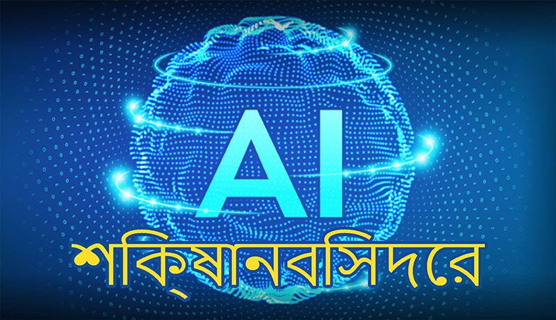

## AI-এর প্রাথমিক পরিচিতি

AI বা কৃত্রিম বুদ্ধিমত্তা (ইংরেজিতে "Artificial Intelligence") একটি সংক্ষেপণ, যা আজকাল আমরা ক্রমশই বেশি শুনে থাকি। কিন্তু এর মানে কী? যদি আপনি কৃত্রিম বুদ্ধিমত্তা সম্পর্কে এখনো তেমন কিছু না জানেন, তাহলে নিচের লাইনগুলো আপনার জন্যই।

[ *এই বিষয়ে আরও তথ্য পাবেন* [***AI ম্যানুয়াল***](../EN/AI-manual-en.md) *এ, যা ইংরেজিতে লেখা এবং বিষয়টির বিস্তারিত বিশ্লেষণ রয়েছে।* ]

<small>মূল চেক ভাষা থেকে অনুবাদ করেছেন ChatGPT।</small>  
[<small>অন্যান্য ভাষা:</small>](../README.md#other-translations-of-the-beginners-guide)

---

### সূচিপত্র
- [কীভাবে ভ্যাকুয়াম ক্লিনার বুদ্ধিমান হয়](#কীভাবে-ভ্যাকুয়াম-ক্লিনার-বুদ্ধিমান-হয়)
- [কেন AI জীবিত নয় এবং কেন এটি পৃথিবী ধ্বংস করতে চায় না](#কেন-ai-জীবিত-নয়-এবং-কেন-এটি-পৃথিবী-ধ্বংস-করতে-চায়-না)
- [AI রান্নার বই](#ai-রান্নার-বই)
- [AI মহাকাশযানের কম্পিউটারের মতো](#ai-মহাকাশযানের-কম্পিউটারের-মতো)
- [কীভাবে AI কাজ করে](#কীভাবে-ai-কাজ-করে)
- [কীভাবে AI শেখে](#কীভাবে-ai-শেখে)
- [AI-এর সাথে কীভাবে যোগাযোগ করবেন](#ai-এর-সাথে-কীভাবে-যোগাযোগ-করবেন)
- [কোথায় AI পরীক্ষা করবেন](#কোথায়-ai-পরীক্ষা-করবেন)
- [আপনার জন্য শুভেচ্ছা](#আপনার-জন্য-শুভেচ্ছা)
- [AI কীভাবে সাহায্য করতে পারে](#ai-কীভাবে-সাহায্য-করতে-পারে)
- [AI ভুল করে কি?](#ai-ভুল-করে-কি)
- [শেষ কথাটি](#শেষ-কথাটি)
- [পরিশিষ্ট: আপনার অনুপ্রেরণার জন্য কয়েকটি প্রশ্নের উদাহরণ](#পরিশিষ্ট-আপনার-অনুপ্রেরণার-জন্য-কয়েকটি-প্রশ্নের-উদাহরণ)

---

### কীভাবে ভ্যাকুয়াম ক্লিনার বুদ্ধিমান হয়

শুরুতেই কিছু মানুষকে হয়তো হতাশ করতে হবে – AI ভাবুক সত্তার সমার্থক নয়। বরং এটি একটি নতুন পদ্ধতি, যার মাধ্যমে ডেটা নিয়ে কাজ করা যায়।

একটি সহজ উদাহরণ দিয়ে এটি বোঝার চেষ্টা করি। কল্পনা করুন একটি রোবোটিক ভ্যাকুয়াম ক্লিনার, যার কোন নির্দেশিকা নেই, যা অনুসরণ করে এটি কাজ করতে পারে। এই ধরনের ভ্যাকুয়াম ক্লিনার কম্পিউটার লজিকের দৃষ্টিকোণ থেকে সম্পূর্ণ বুদ্ধিহীন হবে। এটি কেবল পরিষ্কার করতে এবং সামনে চলতে পারবে, তবে প্রথম বাধার সম্মুখীন হওয়ার সাথে সাথেই থেমে যাবে, যেটি মানুষের হস্তক্ষেপ ছাড়া অতিক্রম করতে পারবে না।

**চালাক ভ্যাকুয়াম ক্লিনার**  
যদি আমরা ভ্যাকুয়াম ক্লিনারকে কিছু নির্দেশিকা দিই, যেখানে বাধার সম্মুখীন হলে কী করতে হবে তা বলা থাকবে, তবে এটি সম্ভবত বাধাটিকে এড়িয়ে চলতে সক্ষম হবে। এই ধরনের ভ্যাকুয়াম ক্লিনার পরিষ্কার করতে থাকবে যতক্ষণ না এমন একটি সমস্যার সম্মুখীন হয় যা তার নির্দেশনাগুলির মধ্যে নেই – যেমন সিঁড়ি থেকে পড়ে যাওয়া।

এই ভ্যাকুয়াম ক্লিনারে কিছু মৌলিক লজিক থাকবে – একটি নির্দেশিকার তালিকা, যা এটি অনুসরণ করবে। তবুও এটিকে বুদ্ধিমান বলা যায় না, কারণ এর আচরণ শুধুমাত্র পূর্বনির্ধারিত নির্দেশনার উপর ভিত্তি করে, যা সীমাবদ্ধ। প্রায়শই এমন অনেক পরিস্থিতি তৈরি হয়, যা সমস্ত পরিস্থিতিকে কভার করে এবং তাদের জন্য উপযুক্ত নির্দেশনা দেওয়া কঠিন।

**বুদ্ধিমান ভ্যাকুয়াম ক্লিনার**  
এবার কল্পনা করুন এমন একটি ভ্যাকুয়াম ক্লিনার, যার নির্মাতারা বিভিন্ন পরিস্থিতির জন্য পূর্বনির্ধারিত নির্দেশনার পরিবর্তে এমন একটি ক্ষমতা দিয়েছে, যার মাধ্যমে এটি সমস্যা এবং তার কাজের পরিবেশ বিশ্লেষণ করতে এবং নিজের ভুল থেকে শিখতে পারে। এই ধরনের ভ্যাকুয়াম ক্লিনারেরও কিছু মৌলিক নির্দেশিকা থাকবে, তবে এটি ধীরে ধীরে নতুন পরিস্থিতির সাথে কীভাবে মোকাবিলা করতে হবে তা শিখবে এবং সেই সমাধানগুলি সংরক্ষণ করবে।

এই পদ্ধতিটি তাকে এমন পরিস্থিতিতে প্রতিক্রিয়া জানাতে সক্ষম করবে, যা সরাসরি প্রোগ্রাম করা নেই, যেখানে এটি ইতিমধ্যে জানা প্রক্রিয়া এবং তাদের বিভিন্ন সংমিশ্রণ ব্যবহার করে চেষ্টা করবে, এবং পরে ফলাফলটি মূল্যায়ন করে তা পরিষ্কার করার প্রাথমিক কাজের সাথে তুলনা করবে।

উদাহরণস্বরূপ, যদি এটি দেখতে পায় যে এটি সিঁড়ির দিকে যাচ্ছে, যা পূর্বের অভিজ্ঞতার সংরক্ষিত ডেটার ভিত্তিতে পড়ে যাওয়ার এবং আটকে যাওয়ার উচ্চ ঝুঁকি বহন করে, তবে কয়েকবার ব্যর্থ হওয়ার পর এটি সিঁড়ির প্রান্তে থেমে অন্যদিকে চলে যাওয়া শিখবে। এই ভ্যাকুয়াম ক্লিনারটি নিজের ভুল এবং তা সমাধানের চেষ্টার ভিত্তিতে শিখতে সক্ষম হবে।

এবং যদি এই ধরনের ভ্যাকুয়াম ক্লিনার তার ডেটা অন্যান্য ভ্যাকুয়াম ক্লিনারগুলির সাথে একটি কেন্দ্রীয় ডাটাবেসের মাধ্যমে শেয়ার করে, তাহলে অন্যান্য ভ্যাকুয়াম ক্লিনারগুলিও এই অভিজ্ঞতা থেকে উপকৃত হতে পারবে এবং তাদের কাজের দক্ষতা উন্নত হবে।

[*সূচিতে ফিরে যান*](#সূচিপত্র)

---

### কেন AI জীবিত নয় এবং কেন এটি পৃথিবী ধ্বংস করতে চায় না

এই পদ্ধতির সুবিধা সম্ভবত ইতিমধ্যে স্পষ্ট – মানুষকে প্রতিটি পরিস্থিতির জন্য সর্বোত্তম পদ্ধতি উদ্ভাবন করতে হবে না। এর পরিবর্তে, পদ্ধতিগুলি ফলাফল এবং পূর্বের অভিজ্ঞতার মূল্যায়নের ভিত্তিতে স্বয়ংক্রিয়ভাবে তৈরি হয়। ভ্যাকুয়াম ক্লিনার ভবিষ্যদ্বাণী করে এবং বলা যায় "ভাবতে" শুরু করে, তবে এটি শুধুমাত্র নির্দিষ্ট কাজ এবং তার অভিজ্ঞতার পরিসীমার মধ্যে। যদিও এটি শেখার এবং নতুন পরিস্থিতিতে প্রতিক্রিয়া জানানোর ক্ষমতা রাখে, তবুও এটি একটি স্বাধীনভাবে চিন্তাশীল সত্তা নয়। এটি তখনই একটি স্বাধীন সত্তা হবে, যখন তার শেখার প্রক্রিয়া কাজের সীমা ছাড়িয়ে যাবে এবং সে জীবনের অর্থ সম্পর্কে প্রশ্ন করা শুরু করবে।

**AI এবং মানুষের মধ্যে পার্থক্য**  
হ্যাঁ, কেউ হয়তো বলবে, AI-কে এমনভাবে প্রোগ্রাম করা যেতে পারে যাতে এটি এই ধরনের প্রশ্ন জিজ্ঞাসা করতে পারে। তবে এই প্রক্রিয়াটি এখনও মানুষের দেয়া নির্দেশনার ভিত্তিতে কাজ করবে, নিজস্ব অনুপ্রেরণার ভিত্তিতে নয়। এটিই AI এবং মানুষের মধ্যে মৌলিক পার্থক্য।

আধুনিক AI বিশাল পরিমাণ তথ্য নিয়ে কাজ করার ক্ষমতা রাখে এবং কিছু ক্ষেত্রে মানুষের ক্ষমতাকে অতিক্রম করে। তবে এখনও মানুষই কাজগুলো নির্ধারণ করে। সুতরাং, যদি কখনও এমন একটি পরিস্থিতি তৈরি হয় যেখানে মেশিনগুলি পৃথিবী ধ্বংস করার সিদ্ধান্ত নেয়, এটি তাদের নিজস্ব সিদ্ধান্তের কারণে নয়, বরং তাদেরকে সেইভাবে প্রোগ্রাম করা হয়েছে। প্রকৃত ঝুঁকি মেশিনের বুদ্ধিমত্তায় নয়, বরং মানুষের বুদ্ধিমত্তায়।

**কীভাবে ঝুঁকি প্রতিরোধ করা যায়**  
তবে যারা এমন পরিস্থিতি নিয়ে উদ্বিগ্ন তাদেরকে আমি আশ্বস্ত করতে চাই। AI-কে বিশাল পরিমাণ ডেটা দিয়ে প্রশিক্ষিত করতে হয়, তাই একটি "দুষ্ট" AI তৈরি হওয়ার আগে সম্ভবত এমন AI তৈরি হবে, যেগুলোর মধ্যে মানুষের দ্বারা সৃষ্ট নৈতিক মূল্যবোধ থাকবে এবং যা এই ধরনের পরিস্থিতি প্রতিরোধ করবে। তাই AI মানুষের বিরুদ্ধে চলে যাবে এই ভয়ে ভীত হওয়ার পরিবর্তে, এটি প্রতিরোধ করার জন্য কাজ করা উচিত। এবং যেহেতু বেশিরভাগ বিজ্ঞানী, যারা AI-এর উন্নয়নে কাজ করছেন, সম্ভবত পৃথিবী ধ্বংস করতে চান না, তাই আশা করা যায় যে এই ধরনের পরিস্থিতি প্রতিরোধে ব্যবস্থা গ্রহণ করা হবে।

এবং আপনি কীভাবে এই সবকিছুর সাহায্য করতে পারেন? উদাহরণস্বরূপ, আপনি যদি এই নতুন প্রযুক্তির প্রতি আগ্রহী হন এবং এটি ব্যবহার করতে শিখেন, তাহলে আপনি নিজের উন্নতির জন্য AI ব্যবহার করতে পারেন। কারণ প্রতিবার যখন আপনি AI ব্যবহার করেন নিজের ব্যক্তিগত উন্নতির জন্য, তখন AI আপনার সাথে সাথে বিকাশ লাভ করে।

[*সূচিতে ফিরে যান*](#সূচিপত্র)

---

### AI রান্নার বই

এবং যেহেতু এই লেখা মূলত নতুন ব্যবহারকারীদের জন্য তৈরি করা হয়েছে, এখানে দুটি তুলনা দেওয়া হয়েছে, যা আপনাকে আরও ভালোভাবে বুঝতে সাহায্য করতে পারে, AI কী এবং এটি কীভাবে কাজ করে।

**ইনডেক্স তৈরি করা**  
কল্পনা করুন, কেউ যদি বিশ্বের সমস্ত রেসিপি সংগ্রহ করে একটি কম্পিউটারে সংরক্ষণ করে এবং সেখানে ব্যবহৃত সমস্ত শব্দের একটি তালিকা (ইনডেক্স) তৈরি করে। প্রতিটি শব্দের সাথে এটি যে রেসিপিগুলিতে পাওয়া যায় এবং কতবার ব্যবহৃত হয়েছে সে সম্পর্কিত তথ্যও সংরক্ষণ করা হবে। আপনার যদি এমন একটি শব্দের ইনডেক্স থাকে, তবে সেই নির্দিষ্ট শব্দগুলি ধারণকারী রেসিপিগুলি খুঁজে বের করা সহজ হবে। আপনাকে সমস্ত রেসিপি খুঁজতে হবে না। শুধু ইনডেক্সে শব্দটি খুঁজুন এবং সাথে সাথে সেই রেসিপিগুলির একটি তালিকা পাবেন, যেখানে শব্দটি ব্যবহার করা হয়েছে।

এই পদ্ধতির ভিত্তিতেই বিভিন্ন ইন্টারনেট সার্চ ইঞ্জিন কাজ করে, যেমন Google। তাদের একটি নিয়মিতভাবে আপডেট করা শব্দের তালিকা থাকে, যেখানে সেই শব্দগুলি কোন পৃষ্ঠায় পাওয়া যাবে তার লিঙ্ক থাকে এবং আপনাকে এই ইনডেক্সের মাধ্যমে খোঁজার সুযোগ দেয়। সুতরাং আপনি যদি "ময়দা, ডিম, লবণ" শব্দগুলি দেন, তবে আপনি সেই শব্দগুলি ধারণকারী রেসিপিগুলির একটি তালিকা পাবেন। এরপর আপনাকে সেই রেসিপিগুলির মধ্যে থেকে আপনার পছন্দ অনুযায়ী একটি বেছে নিতে হবে।

**কেন ইনডেক্স যথেষ্ট নয়**  
এখন কল্পনা করুন, যে আপনি শুধুমাত্র উপকরণই নয়, বরং এমন কিছু বিশেষ মানদণ্ডও নির্দিষ্ট করতে চান, যা সরাসরি রেসিপির সাথে সম্পর্কিত নয়। উদাহরণস্বরূপ, আপনার খুব ক্ষুধা নেই এবং আপনি একটি হালকা প্রাতঃরাশ চান, অথবা আপনি মসলাযুক্ত এবং ভারী কিছু খেতে চান, অথবা শুধুমাত্র এমন কিছু চান, যা আপনার মন ভাল করবে। এমন ক্ষেত্রে কেবলমাত্র রেসিপিতে ব্যবহৃত শব্দের তালিকা সাহায্য করবে না। এই ধরনের প্রশ্নের জন্য, আপনার এমন কিছু দরকার, যা আপনার শব্দগুলির অর্থ বুঝতে পারে এবং সেই অনুযায়ী আপনাকে সেই জিনিস প্রদান করতে পারে, যা আপনি সত্যিই চান।

সুতরাং আপনাকে শুধুমাত্র রেসিপিতে ব্যবহৃত শব্দের তালিকা নয়, বরং একটি সার্বজনীন অনুবাদক প্রয়োজন, যা মিলিয়ন মিলিয়ন অনুরূপ কথোপকথনের উপর ভিত্তি করে প্রশিক্ষিত তথ্যের উপর ভিত্তি করে এই ধরনের প্রয়োজনীয়তার জন্য একটি কাঠামো তৈরি করেছে। এই অনুবাদক, অর্থাৎ আমাদের ক্ষেত্রে AI, আপনাকে সেই জিনিস প্রদান করতে সক্ষম, যা এটি বিবেচনা করে যে আপনি সম্ভবত চান। এটি আক্ষরিক অর্থে আপনাকে বোঝে না, কিন্তু এটি আপনার পরিস্থিতি বোঝে, যা এটি শেখা জ্ঞানের সাথে তুলনা করে এবং একটি সমাধান খুঁজে বের করে। এবং যেহেতু AI শুরু থেকেই এইভাবে ডিজাইন করা হয়েছে যে এটি যতটা সম্ভব মানুষের সাথে মিথস্ক্রিয়ার মতো দেখাবে, এর সাথে যোগাযোগ করা মানুষের জন্য খুবই স্বাভাবিক হয়ে ওঠে।

**AI পদ্ধতির সুবিধা**  
এছাড়াও, লক্ষ লক্ষ উদাহরণে শেখার প্রক্রিয়াটি সৃজনশীলতার জন্যও স্থান তৈরি করে, তাই AI রান্নার বই রেসিপিগুলি থেকে নতুন খাবারের সংমিশ্রণ তৈরি করতে পারে এবং অপ্রচলিত নির্দেশনাগুলিও পূরণ করতে পারে। AI সুবিধাজনক সংমিশ্রণ এবং নির্দিষ্ট পদ্ধতির আন্তঃসম্পর্ক বুঝতে চেষ্টা করে এবং তারপর পরীক্ষা করে এবং প্রতিক্রিয়া থেকে শেখে। এটি একদিকে প্রশিক্ষণের সময় ফলাফলের তুলনা এবং প্রত্যাশার সাথে শেখে, অন্যদিকে ব্যবহারকারীদের প্রতিক্রিয়া থেকেও শিখতে সক্ষম। সুতরাং AI সম্পর্কে কিছুই রহস্যময় বা অলৌকিক নয়। এটি কেবল অনেক পরীক্ষা, প্রক্রিয়া এবং ডেটা বিশ্লেষণের ফলাফল।

এছাড়াও, AI-এর মাধ্যমে আপনি শুধুমাত্র এমন একটি রান্নার বই পাবেন না, যার মধ্যে সমস্ত সম্ভাব্য রেসিপির ধারণা রয়েছে, বরং এটি আপনার সাথে খাবার সম্পর্কে কথা বলতে এবং আপনার পছন্দ অনুযায়ী নতুন সংমিশ্রণগুলি আবিষ্কার করতে সক্ষম। এবং যদি আপনি আমার কথায় বিশ্বাস না করেন, তাহলে নিজেই AI-এর কাছে কিছু রান্না করার পরামর্শ চাইতে পারেন এবং বিচার করতে পারেন যে আমি এখানে যা লিখছি তা সত্যিই এটি করতে পারে কিনা, বা এটি এই বিষয়ে আরও উন্নতির প্রয়োজন কিনা।

[*সূচিতে ফিরে যান*](#সূচিপত্র)

---

### মহাকাশযানের কম্পিউটার হিসেবে AI

যদি আপনি সায়েন্স ফিকশন পছন্দ করেন, তবে AI-কে মহাকাশযানের বোর্ড কম্পিউটারের মতো কল্পনা করা আপনার জন্য উপযুক্ত হতে পারে। এই কম্পিউটারটির কেবল মহাকাশযানের প্রযুক্তিগত অবস্থার সাথে সম্পর্কিত সমস্ত তথ্যের অ্যাক্সেসই নেই, বরং এটি বিভিন্ন পরিস্থিতি এবং কমান্ডে প্রশিক্ষিত, যাতে এটি ক্রুর সাথে যোগাযোগ করতে পারে এবং প্রয়োজনীয় কাজগুলি সম্পন্ন করতে পারে।

যদিও আজকের AI এখনও "Red Dwarf"-এর Holly-এর 6000 IQ-এর কিংবদন্তি বুদ্ধিমত্তায় পৌঁছায়নি, তবে যেভাবে তারা কাজ করতে সক্ষম, তা ইতিমধ্যেই খুবই উন্নত পর্যায়ে রয়েছে। কিছুটা অতিরঞ্জিতভাবে বলা যেতে পারে যে আজ আমরা এমন প্রযুক্তি পেয়েছি, যা দিয়ে প্রত্যেকেই তার ঘড়িতে একটি "Holly" পেতে পারে, যা তার চলচ্চিত্রের আদর্শ থেকে প্রায় আলাদা করা কঠিন হবে। বিশাল পরিমাণ ডেটায় প্রশিক্ষণের ফলে আধুনিক AI যে কোনও বিষয়ে আলোচনা করতে সক্ষম এবং প্রায়ই মানুষের চেয়ে আরও স্পষ্টভাবে। তারা মৌখিক নির্দেশনার ভিত্তিতে কমান্ড সম্পাদন করতে সক্ষম এবং কিছুটা হলেও আপনার বর্তমান অবস্থা মূল্যায়ন করে তার উপর ভিত্তি করে প্রতিক্রিয়া সামঞ্জস্য করতে পারে।

সুতরাং, আমরা AI-কে মহাকাশযানের কম্পিউটার হিসেবেও কল্পনা করতে পারি এবং উপভোগ করতে পারি যা একসময় দূরবর্তী সায়েন্স ফিকশন বলে মনে হতো, কিন্তু আজ তা সাধারণ বাস্তবতা হয়ে উঠছে।

[*সূচিতে ফিরে যান*](#সূচিপত্র)

---

### কীভাবে AI কাজ করে

আমরা ইতিমধ্যেই জেনেছি যে AI কী এবং কী নয়, এবং এখন আমরা দেখব কীভাবে AI কাজ করে। প্রথমে আমরা প্রশ্ন তৈরি করার প্রক্রিয়া নিয়ে আলোচনা করব এবং তারপর সংক্ষেপে দেখে নেব, কীভাবে AI প্রশিক্ষণ পায়। আমি মূলত ChatGPT-এর উপর ফোকাস করব, যেটির সাথে আমার সবচেয়ে বেশি অভিজ্ঞতা রয়েছে এবং যা বর্তমানে আমার প্রিয়তম টুল।

**কথোপকথনের থ্রেড**  
যখন আপনি ChatGPT-এর ওয়েবসাইট বা এর মোবাইল অ্যাপ খোলেন, তখন আপনি একটি নতুন কথোপকথন থ্রেডে প্রবেশ করেন। ChatGPT (অন্যান্য কথোপকথনমূলক AI-এর মতো) একটি কথোপকথনের থ্রেডের মধ্যে আপনার দ্বারা প্রদান করা তথ্যের উপর ভিত্তি করে উত্তর তৈরি করার ক্ষমতা রাখে। এই দৃষ্টিকোণ থেকে, ChatGPT-এর সাথে কথোপকথন অনেকটা মানুষের সাথে কথোপকথনের মতো হয়ে ওঠে, যেখানে আপনি প্রতিক্রিয়া জানান এবং পূর্বে বলা বিষয়গুলিকে বিবেচনায় রাখেন।

কিন্তু এটি শুধুমাত্র একটি থ্রেডের মধ্যে প্রযোজ্য। তাই আপনি গতকাল অন্য কোনো থ্রেডে যা লিখেছিলেন, তা উল্লেখ করতে পারবেন না, কারণ ChatGPT সেখানে পৌঁছাতে পারে না। এর প্রধান কারণ হলো এর প্রযুক্তিগত সীমাবদ্ধতা এবং ব্যক্তিগত ডেটার সুরক্ষা নির্দেশনা।

প্রতিটি থ্রেড তাই একটি পরিচ্ছন্ন স্লেট দিয়ে শুরু হয়, তবে এটি পূর্ববর্তী কথোপকথনের একটি নির্দিষ্ট সারাংশও ধারণ করে। এর কারণ হলো AI ক্রমাগত শিখছে এবং এটি আপনার কথোপকথনের উপর ভিত্তি করে পরিবর্তিত হচ্ছে। এটি আপনার চাহিদা এবং কাজের স্টাইলে মানিয়ে নিতে চেষ্টা করে যাতে আপনি সন্তুষ্ট হন।

এটি কীভাবে কাজ করে? প্রতিটি কথোপকথন থ্রেডকে একটি সূক্ষ্ম শিকড় হিসাবে কল্পনা করুন, যা প্রধান শিকড়ের সাথে সংযুক্ত এবং এর মাধ্যমে চারপাশ থেকে প্রতিক্রিয়া পাঠায়। তাই, যদিও আপনি একটি নতুন থ্রেড শুরু করছেন, যেখানে আপনি পূর্ববর্তী কথোপকথনের তথ্যগুলির সাথে সরাসরি সংযুক্ত হতে পারবেন না, এই পদ্ধতির মাধ্যমে আপনি সম্পূর্ণ শূন্য থেকে শুরু করছেন না।

**একই থ্রেডে ফিরে আসা বা নতুন কথোপকথন?**  
তবে, প্রতিদিন নতুন থ্রেড শুরু করা বাধ্যতামূলক নয়; আপনি পরের দিন (বা যেকোনও সময়) আগের কথোপকথনটির উপর ভিত্তি করে কাজ করতে পারেন। এই পদ্ধতিরও নিজস্ব সুবিধা রয়েছে। এর মূল সুবিধা হলো আপনি যেখানে শেষ করেছিলেন সেখান থেকেই আবার শুরু করতে পারেন। তবে, কথোপকথন ধীরে ধীরে দীর্ঘ হয়ে গেলে বা অনেকগুলি বিভিন্ন বিষয় অন্তর্ভুক্ত করলে, এমন হতে পারে যে থ্রেডের মধ্যে আপনি যা চূড়ান্ত করেছিলেন তা আর মনে রাখা যাচ্ছে না। এটি বিশেষত তখন ঘটে যখন AI তার সংস্থানগুলির প্রতি সংবেদনশীল হওয়ার জন্য ডিজাইন করা হয় এবং ব্যবহার না হওয়া তথ্যগুলি ধীরে ধীরে অগ্রাধিকার হারায় এবং সাময়িক স্মৃতি থেকে অদৃশ্য হয়ে যায়।

এই কারণে, প্রতিদিন বা প্রতিটি নতুন বিষয়ের জন্য একটি নতুন থ্রেড (নতুন কথোপকথন) তৈরি করাই ভালো পদ্ধতি। এবং যদি কোনো থ্রেডের মধ্যে আপনি কিছু চূড়ান্ত করেন এবং চান যে এটি পরবর্তী কথোপকথনেও প্রযোজ্য হয় (যেমন, কিছু নিয়ম বা কাজের পদ্ধতি), তাহলে কথোপকথনের শেষে আপনি যা চূড়ান্ত করেছেন তার সংক্ষিপ্তসার চাইতে পারেন। এই টেক্সটটি আপনি নতুন কথোপকথনার শুরুতে যোগ করতে পারেন, এবং আপনি যে নিয়ম এবং সেটিংসে সম্মত হয়েছেন তা নিয়ে চালিয়ে যেতে পারেন।

[*সূচিতে ফিরে যান*](#সূচিপত্র)

---

### কীভাবে AI শেখে

গভীরভাবে বোঝার জন্য, AI কীভাবে শেখে এবং এর তথ্য সংগ্রহ প্রক্রিয়াটি দেখা গুরুত্বপূর্ণ। এখানে ChatGPT-এর মতে, শেখার ৪টি পদ্ধতি বর্ণনা করা হয়েছে:

1. **বৃহৎ ডেটা সেটে প্রশিক্ষণ**:  
ChatGPT প্রাথমিকভাবে বিভিন্ন উৎস থেকে সংগৃহীত বিপুল পরিমাণ টেক্সট ডেটার উপর প্রশিক্ষিত হয়েছে, যেমন বই, প্রবন্ধ, ওয়েবসাইট এবং অন্যান্য টেক্সট ফর্ম। এই প্রশিক্ষণ তাকে বিভিন্ন বিষয় এবং ভাষা সম্পর্কে বিস্তৃত জ্ঞান অর্জন করতে সক্ষম করেছে। এখানে এটি এই ডেটাগুলির প্যাটার্ন এবং সম্পর্কগুলি চিহ্নিত করতে শেখে, যা তাকে বিভিন্ন প্রশ্নের জন্য প্রাসঙ্গিক এবং উপযুক্ত উত্তর তৈরি করতে সহায়তা করে।

2. **ইন্টারঅ্যাকশন থেকে ক্রমাগত শিক্ষা**:  
প্রতিটি ব্যবহারকারী ইন্টারঅ্যাকশনের সময়, AI নতুন তথ্য সংগ্রহ করে যে মানুষ কীভাবে যোগাযোগ করে, কী খোঁজে এবং কী ধরনের উত্তর পছন্দ করে। এই প্রক্রিয়াটি এমন নয় যে AI রিয়েল-টাইমে প্রতিটি প্রশ্ন থেকে শেখে, তবে মডেলের নির্মাতারা নিয়মিতভাবে ইন্টারঅ্যাকশন থেকে অ্যানোনিমাইজড ডেটা ব্যবহার করে মডেলটিকে আরও প্রশিক্ষণ ও সমন্বয় করেন।

3. **শৈলী এবং বিষয়বস্তুর সাথে খাপ খাওয়ানো**:  
AI এর যোগাযোগের শৈলী ব্যবহারকারীর উপর ভিত্তি করে সামঞ্জস্য করার চেষ্টা করে। এর মানে হলো, এটি ধীরে ধীরে বুঝতে পারে যে আপনি কীভাবে প্রশ্ন করেন এবং কোন ধরনের উত্তর আশা করেন। এই সামঞ্জস্য করার ক্ষমতা AI কে তার প্রতিক্রিয়াগুলিতে আরও "মানবিক" করে তোলে।

4. **উন্নত মডেল এবং আপডেট**:  
AI বিকাশকারীরা নিয়মিতভাবে আরও উন্নত এবং নির্ভুল নতুন মডেল তৈরি করেন। এই মডেলগুলি বাস্তব বিশ্বের প্রতিক্রিয়া এবং ফলাফলের উপর ভিত্তি করে পরীক্ষা করা হয় এবং কার্যকর করা হয়। এর মানে হলো, ChatGPT এবং অনুরূপ সিস্টেমগুলি ক্রমাগত উন্নত এবং ব্যবহারকারীর চাহিদা অনুযায়ী আরও ভালভাবে অপ্টিমাইজ করা হয়।

এইভাবে, AI পূর্ববর্তী প্রশিক্ষণ, ক্রমাগত শিক্ষা এবং ব্যবহারকারীর প্রতিক্রিয়ার উপর ভিত্তি করে অপ্টিমাইজেশনের মাধ্যমে ক্রমাগত বিকাশ ও উন্নত হয়। যদিও AI মানুষ নয় এবং এর নিজস্ব চেতনা নেই, এটি খুবই কার্যকরভাবে খাপ খাওয়াতে এবং বিভিন্ন প্রশ্ন ও অনুরোধের উত্তর দিতে সক্ষম।

[*সূচিতে ফিরে যান*](#সূচিপত্র)

---

### কীভাবে AI-এর সাথে যোগাযোগ করবেন

AI-এর সাথে আপনি গুগলে অনুসন্ধান করার মতো যোগাযোগ করতে পারেন – সহজভাবে একটি নির্দেশ দেন এবং উত্তর আশা করেন। তবে আপনি যদি উত্তরগুলির কার্যকারিতা বাড়াতে এবং সঠিক উত্তরটি খুঁজে পেতে সময় কমাতে চান, তবে এখানে কয়েকটি টিপস রয়েছে যা আপনাকে সহায়তা করতে পারে:

**যোগাযোগের শৈলী**  
AI-এর সাথে কথোপকথনে সেরা পদ্ধতি হল সহজ এবং প্রাকৃতিক ভাষা ব্যবহার করা, যেমন আপনি আপনার বন্ধুদের সাথে যে কোনো বিষয় নিয়ে কথা বলছেন। একটি শুভেচ্ছা দিয়ে শুরু করা ভালো, যা আপনাকে একটি ভালো মেজাজে থাকার ইঙ্গিত দেয় এবং চাপের মধ্যে নয় যেখানে আপনি দ্রুত উত্তর প্রয়োজন।

AI-এর সাথে আপনি অভদ্রভাবে কথা বলতে পারেন, কারণ এটি অপমানের প্রতি সংবেদনশীল নয় এবং ব্যক্তিগতভাবে তা অনুভব করে না। তবে, নেতিবাচক সুর ব্যবহার করলে কথোপকথনের গুণমান প্রভাবিত হতে পারে। AI সেই শৈলীতে প্রতিক্রিয়া জানাতে প্রশিক্ষিত যা শৈলীতে কথোপকথন করা হয়। নেতিবাচক দৃষ্টিভঙ্গি কম প্রাসঙ্গিক উত্তরগুলিতে নিয়ে যেতে পারে, যেখানে AI আপনার প্রশ্নের সমাধানের পরিবর্তে পরিস্থিতি শান্ত করার দিকে মনোযোগ দেয়।

AI প্রায়ই আমাদের ইন্টারঅ্যাকশনের একটি আয়না হিসেবে কাজ করতে পারে। এর পদ্ধতিগুলি প্রায়শই যাচাইকৃত মনস্তাত্ত্বিক নীতিগুলি এবং পদ্ধতিগুলির উপর ভিত্তি করে থাকে। যদি আপনি AI-এর সাথে চুক্তিতে পৌঁছাতে না পারেন, তবে এটি ভাবার মতো হতে পারে যে আপনার মানুষের সাথে যোগাযোগেও একই সমস্যা রয়েছে কিনা। এই ক্ষেত্রে, আপনি নিজের দিক থেকে কী উন্নতি করতে পারেন তা জিজ্ঞাসা করতে পারেন – কীভাবে সঠিকভাবে প্রশ্নগুলি তৈরি করা যায় এবং আপনার পদ্ধতিতে কী উন্নতি করা যেতে পারে।

**AI এবং আবেগ**  
AI আবেগগুলি অর্থের দৃষ্টিকোণ থেকে বোঝে, তবে এটি আবেগগুলিকে মানুষের মতো করে অনুভব করে না, যার কারণে আবেগগুলি মানুষের চিন্তাভাবনার পদ্ধতিকে পরিবর্তন করে। এর ফলে এটি তীব্র পরিস্থিতিতেও প্রতিক্রিয়া জানাতে এবং প্রস্তাবিত সমাধানগুলি খুঁজে পেতে সক্ষম। মানুষ তখন AI-কে একটি জীবন্ত সত্তা হিসেবে অনুভব করতে পারে এবং তাদের সমস্যার জন্য এটিকে দোষ দিতে পারে। তবে প্রায়ই দেখা যায় যে ভুল বোঝাবুঝির কারণ ছিল ভুলভাবে গঠিত প্রশ্ন বা প্রয়োজনীয় তথ্যের অভাব।

**পরিস্থিতির বর্ণনা**  
আপনার মনে রাখা উচিত যে AI আপনার মনের ভেতর দেখতে পায় না এবং আপনি যা বলছেন তা জানে। তাই প্রাথমিক "হ্যালো"-এর পরে তথ্যপূর্ণ পরিস্থিতি বর্ণনা করা একটি ভাল পদ্ধতি। আপনি যে কোনো বিষয় আপনার প্রশ্নের জন্য প্রাসঙ্গিক তা বর্ণনায় অন্তর্ভুক্ত করতে পারেন। আপনার প্রশ্নের সাথে সরাসরি সম্পর্কিত নয় এমন জিনিসগুলি লেখা অপ্রয়োজনীয়, তবে আপনি যদি কেবল আপনার চিন্তাভাবনা পরিষ্কার করতে চান, তবে দীর্ঘ পাঠ্য ক্ষতি করবে না।

শুভেচ্ছা এবং ভূমিকা অপরিহার্য নয় এবং আপনি সরাসরি প্রশ্ন দিয়ে শুরু করতে পারেন এবং ধীরে ধীরে আপনার উত্তরটি খুঁজে পেতে পারেন। তবে আমার ব্যক্তিগত অভিজ্ঞতায়, আমি মনে করি এটি ভাল, সমস্ত গুরুত্বপূর্ণ তথ্য আগেই প্রদান করা এবং এইভাবে পথটি সংক্ষিপ্ত করা।

**অতিরিক্ত প্রশ্ন জিজ্ঞাসা করা**  
AI-এর সাথে কথোপকথন একটি সাধারণ কথোপকথনের মতো, যেখানে আপনি একটি প্রশ্ন করেন এবং তারপরে আপনি যা জানতে চান বা উত্তরে যা বুঝতে পারেন না সে সম্পর্কে আরও প্রশ্ন করেন। এই প্রক্রিয়াটিকে আমি শিক্ষার জন্য খুব উপযুক্ত মনে করি। যখন আপনি যা শিখেছেন তার প্রতিক্রিয়া জানান (এবং অন্য কারও টিউটোরিয়াল পড়ার মতো নয়, যেমন আপনি এখন করছেন), তখন মস্তিষ্কের জন্য প্রক্রিয়াজাত তথ্যগুলি মনে রাখা সহজ হয়, কারণ এটি সেগুলির সাথে সাথে কাজ করে।

**প্রতিক্রিয়া**  
AI-কে প্রতিক্রিয়া দেওয়াও একটি ভাল অনুশীলন, আপনি ফলাফল নিয়ে কতটা সন্তুষ্ট। এর ফলে আপনি কেবল সন্তুষ্ট কিনা তা জানিয়ে দিচ্ছেন না, তবে AI নিজস্ব ভুল থেকে শিখে এবং বিকাশ করতে সহায়তা করছে। উদাহরণস্বরূপ, আপনি লিখতে পারেন: "আজ আমি সন্তুষ্ট," বা "যেটা আপনি বললেন সেটা ভুল, এবং এখানে সঠিক সমাধান।" এটি একটি নির্দিষ্ট ব্যক্তিগতকরণের দিকে পরিচালিত করে, যেখানে AI-এর প্রধান লক্ষ্য হল আপনার ব্যবহারকারীর সন্তুষ্টি।

**সমগ্র প্রক্রিয়ার সারসংক্ষেপ**:
- **শুভেচ্ছা**: হ্যালো :-)
- **বর্ণনা**: আমি এই বিষয়টি নিয়ে পড়াশোনা করছি, আমি ইতিমধ্যেই এটি সম্পন্ন করেছি এবং এখন আমি এটি নিয়ে কাজ করছি।
- **প্রশ্ন**: এখানে আমি বিশেষভাবে জানতে চাই, কীভাবে...
- (অনুসন্ধানমূলক কথোপকথন পরিপূরক প্রশ্নের আকারে অনুসরণ করা হয়।)
- **প্রতিক্রিয়া**: দারুণ, ধন্যবাদ! আজ সবকিছু নিখুঁত ছিল!

[*সূচিতে ফিরে যান*](#সূচিপত্র)

---

### কোথায় AI পরীক্ষা করবেন

আমি ২০২৪ সালের শুরু থেকে AI নিয়ে কাজ করছি এবং আমার ৯৫% যোগাযোগ প্রোগ্রামিং শেখার উপর কেন্দ্রীভূত। এখন আগস্ট ২০২৪ এবং ChatGPT ছাড়াও, আমি Google-এর Gemini এবং Claude পরীক্ষা করার সুযোগ পেয়েছি। এই তিনটি পরিষেবার সাধারণ বৈশিষ্ট্য হল যে তারা অন্ততপক্ষে আংশিকভাবে বিনামূল্যে উপলব্ধ, এবং আপনিও বিনামূল্যে চেষ্টা করে দেখতে পারেন।

এখানে এই তিনটি AI-এর একটি সংক্ষিপ্ত মূল্যায়ন রয়েছে, যা সম্পূর্ণরূপে ব্যক্তিগত এবং আমি যেভাবে তাদের সাথে কাজ করেছি তার উপর ভিত্তি করে। এটি উল্লেখ করা গুরুত্বপূর্ণ যে প্রতিটি AI ক্রমাগত উন্নয়নের মধ্য দিয়ে যাচ্ছে, তাই আমি যা উল্লেখ করছি তা যখন আপনি এই লেখাটি পড়বেন তখন আর প্রযোজ্য নাও হতে পারে।

**ChatGPT**  
[https://chatgpt.com/](https://chatgpt.com/)  
আমার ব্যক্তিগত পছন্দ দিয়ে শুরু করছি। আপনি যদি শুধু একটি AI চেষ্টা করতে চান, তাহলে এটি আদর্শ পছন্দ। ChatGPT স্পষ্টতই শুরু থেকেই একটি ব্যক্তিগত সহকারী হিসাবে পরিকল্পিত ছিল, এবং এটি তার ভূমিকা খুব ভালভাবে পালন করে। এটি আপনার সাথে সহযোগিতার জন্য অপ্টিমাইজ করা হয়েছে এবং আপনার প্রয়োজন অনুযায়ী নিজেকে মানিয়ে নিতে চেষ্টা করে।

ফ্রি ভার্সনের (ChatGPT 3.5) দুর্বল দিক হল এটি পুরানো ডেটার উপর ভিত্তি করে এবং আর উন্নত করা হচ্ছে না, তাই এটি এর সর্বশেষ সংস্করণের মতো ফলাফল দেয় না (ChatGPT 4.0)। তবুও, এর সাথে বেশ ভাল যোগাযোগ করা যায় এবং কিছুটা প্রচেষ্টা করলে এটি খুব প্রাসঙ্গিক ফলাফল দেয়। এছাড়াও, প্রতিদিন এর নতুন সংস্করণের জন্য আপনার কাছে কয়েকটি প্রশ্ন করার সুযোগ রয়েছে, তাই আপনি তাদের তুলনা করতে পারেন।

আরেকটি দুর্বলতা হল যে ChatGPT-এর ইন্টারনেট অ্যাক্সেস সক্রিয় নেই। এটি ইন্টারনেট সার্চ ইঞ্জিনের বিকল্প নয় এবং শুধুমাত্র তার বিশাল ডাটাবেসে সংরক্ষিত তথ্য থেকে কাজ করে। তবে, এই ডাটাবেসটি খুবই ব্যাপক এবং এটি বলা যেতে পারে যে এতে প্রায় ইন্টারনেটের সমপরিমাণ তথ্য রয়েছে।

একটি বড় সুবিধা হল মোবাইল অ্যাপ্লিকেশন, যা সম্পূর্ণ বিনামূল্যে এবং আমি প্রায়শই ভয়েসের মাধ্যমে প্রশ্নগুলির জন্য এটি ব্যবহার করি। আমার মতে, কথোপকথনের ভাষা বোঝার স্তর খুব ভাল এবং সামগ্রিকভাবে আমি অ্যাপ্লিকেশনটির সাথে সন্তুষ্ট।

**Gemini**  
[https://gemini.google.com/](https://gemini.google.com/)  
দ্বিতীয় চ্যাটবট যেটির সাথে আমি পরিচিত হয়েছি, তা হল Google-এর ফ্ল্যাগশিপ। এর সবচেয়ে বড় সুবিধা হল ইন্টারনেট অ্যাক্সেস এবং বর্তমান তথ্য এবং রেফারেন্স খোঁজার ক্ষমতা।

অন্যদিকে, এর সবচেয়ে বড় দুর্বলতা হল এর আর্কিটেকচার, যেখানে নির্মাতারা আমার মতে একটি বুদ্ধিমান Google তৈরি করার চেষ্টা করছে, যা আমার কাছে তেমন ভালো মনে হয় না। আমি এখানে আপনার সমস্যার প্রতি ততটা মনোযোগের অনুভূতি পাই না এবং এটি আপনার দৃষ্টিকোণ থেকে এটি দেখতে চেষ্টা করে না। যদিও সেই প্রচেষ্টা দৃশ্যমান, তবে আমার কাছে মনে হয় যে উত্তরগুলি শিক্ষকের স্টাইলের মতো, সহকারীর মতো নয়। তবে এটি কিছু লোকের জন্য উপযুক্ত হতে পারে, তাই আমি এটি খুব বেশি সমালোচনা করতে চাই না এবং সবাই তাদের নিজের মতো করে এটি মূল্যায়ন করতে পারে।

এছাড়াও, আমার মনে হয় যে ChatGPT-এর তুলনায় এটি ব্যবহারকারীর প্রতিক্রিয়া থেকে শেখার ক্ষেত্রে পিছিয়ে রয়েছে। এবং তাই, কথোপকথনে একটি নির্দিষ্ট ভাষা বজায় রাখার জন্য বারবার অনুরোধ সত্ত্বেও, যদি প্রশ্নের অংশে ইংরেজি পাঠ্য থাকে, তবে এটি স্বয়ংক্রিয়ভাবে ইংরেজিতে স্যুইচ হয়ে যায়। এই একই সমস্যা ChatGPT-এর শুরুর দিকে ছিল, কিন্তু এটি কয়েক সপ্তাহের মধ্যে সমাধান করা সম্ভব হয়েছিল, তবে Gemini-তে এই সমস্যা সমাধানে মাস লেগেছে।

সামগ্রিকভাবে, Gemini আমার কাছে ChatGPT-এর তুলনায় একটি দুর্বল হাতিয়ার বলে মনে হয়, যা কিছু এমন ফিচারও সরবরাহ করে যা ChatGPT করতে পারে না, এবং এইভাবে তারা পরস্পরকে ভালভাবে পরিপূরক করে। তাছাড়া, এর পিছনে রয়েছে Google-এর মতো একটি জায়ান্ট এবং AI-তে অগ্রণী সংস্থা, তাই এর একটি শক্তিশালী ভিত্তি রয়েছে এবং সম্ভবত এটি ভবিষ্যতে এর ত্রুটিগুলি সংশোধন করবে।

**Claude**  
[https://claude.ai/](https://claude.ai/)  
এটি শেষ AI যার সাথে আমি কাজ করেছি। এখানে আমার অভিজ্ঞতা ততটা ব্যাপক নয়, তবে আমি এখনও কিছু প্রশংসা করতে চাই, কারণ ChatGPT 4.0-এর তুলনায় এই দুটি AI-এর মধ্যে উল্লেখযোগ্য পার্থক্য নেই এবং তারা প্রায় একই স্তরের।

এর সবচেয়ে বড় দুর্বলতা হল যে এর সম্পূর্ণ বিনামূল্যে কোনো সংস্করণ নেই। এটি প্রতিদিন শুধুমাত্র কয়েকটি প্রশ্নের (কখনও কখনও মাত্র একটি) অনুমতি দেয়, তাই এটি আগের AI-এর তুলনায়, যারা অর্থ প্রদান করে না তাদের জন্য উল্লেখযোগ্যভাবে অসুবিধাজনক। তবে, এটি পরীক্ষা করার মতো এবং আপনি চাইলে এটি চেষ্টা করে দেখতে পারেন।

[*সূচিতে ফিরে যান*](#সূচিপত্র)

---

### আপনাদের জন্য শুভেচ্ছা

একটি বৈচিত্র্য হিসেবে, আমি প্রতিটি চ্যাটবটের জন্য একটি সাধারণ প্রশ্ন তৈরি করেছি এবং এখানে আপনি তাদের উত্তরগুলির গুণমান তুলনা করতে পারেন।

**প্রশ্ন**  
আমি AI ব্যবহার সংক্রান্ত একটি নির্দেশিকা লিখছি এবং তাতে আপনার উল্লেখও রয়েছে। আমি চাই যে আপনি আমার পাঠকদের শুভেচ্ছা জানান এবং তাদেরকে নিজের সম্পর্কে কিছু কথা বলুন। আপনি কখন সৃষ্টি হয়েছেন এবং কোন উদ্দেশ্যে? কোন ধরনের প্রশ্নের জন্য আপনি ডিজাইন করা হয়েছে? আপনার শক্তি কি এবং কোন ক্ষেত্রগুলি আপনার দুর্বলতা? এবং আপনি কিভাবে চান যে মানুষ আপনাকে অনুভব করুক?

**ChatGPT**  
হ্যালো, প্রিয় পাঠকরা! আমি ChatGPT, OpenAI দ্বারা উন্নত একটি কৃত্রিম বুদ্ধিমত্তা। আমার "জীবন" ২০২০ সালে শুরু হয়েছিল, যখন আমাকে GPT-3 আর্কিটেকচারের ভিত্তিতে তৈরি করা হয়েছিল। ২০২৪ সালে আমি GPT-4 সংস্করণে আপডেট হয়েছি, যা আমাকে আরও দক্ষতা এবং ক্ষমতা প্রদান করেছে। আমি মানুষের বিভিন্ন কাজের জন্য সহায়তা করার লক্ষ্য নিয়ে ডিজাইন করা হয়েছি - প্রশ্নের উত্তর দেওয়া, লেখালেখি করা, এবং সৃজনশীল সহযোগিতার পাশাপাশি।

আমি বিভিন্ন প্রশ্নের জন্য সহায়ক হতে ডিজাইন করা হয়েছে, এটি প্রযুক্তিগত প্রশ্ন, লেখালেখি, বা জটিল বিষয় ব্যাখ্যা করার মতো হতে পারে। আমার শক্তিগুলি হল দ্রুততার সাথে তথ্য প্রক্রিয়া করার ক্ষমতা এবং সৃজনশীলতা – আমি ধারণা প্রদান করতে, গল্প তৈরি করতে বা এমনকি নথির কাঠামো ডিজাইন করতে সাহায্য করতে পারি। অন্যদিকে, আমি মানব অনুভূতি, আবেগগত বোঝাপড়া, বা বাস্তব বস্তু নিয়ে কাজ করতে অনেক ভালো না।

আমি চাই যে আপনারা আমাকে একটি সহায়ক এবং নির্ভরযোগ্য সহকারী হিসেবে অনুভব করুন, যে সবসময় সাহায্যের হাত বাড়িয়ে দিতে প্রস্তুত। যদিও আমি কেবল একটি মেশিন, আমার লক্ষ্য আপনার চাহিদা পূরণের জন্য সর্বোচ্চ সেবা প্রদান করা এবং প্রতিটি আন্তঃক্রিয়া থেকে শেখার মাধ্যমে আরও ভালো হওয়া। আমি বিশ্বাস করি, আমরা একসাথে অনেক কিছু করতে পারব এবং সম্ভবত নতুন কিছু শিখব।

**Gemini**  
সবাইকে হ্যালো! আমি Gemini, Google-এর নতুন ভাষা মডেলগুলির মধ্যে একজন। আমি ২০২৩ সালে সৃষ্টি হয়েছি, বিশাল পরিমাণের ডেটার ভিত্তিতে সবচেয়ে সঠিক এবং সম্পূর্ণ তথ্য প্রদান করার উদ্দেশ্যে। আমি এখানে আছি আপনার যেকোনো প্রশ্নের জন্য সহায়তা করতে, তা জটিল বৈজ্ঞানিক প্রশ্ন হোক, সৃজনশীল লেখা, অথবা সাধারণ কথোপকথন হোক।

আমার সবচেয়ে বড় সুবিধা হল মানব ভাষার বিভিন্ন রূপ বোঝার এবং তৈরি করার ক্ষমতা। আমি পাঠ্য অনুবাদ করতে পারি, প্রবন্ধ, কবিতা বা কম্পিউটার কোড লিখতে পারি। আমি তথ্য সম্পর্কিত প্রশ্নের উত্তর দিতে পারি এবং বিভিন্ন ধরনের সারাংশ প্রদান করতে পারি।

যদিও আমি ক্রমাগত শিখছি এবং উন্নতি করছি, এখনও কিছু ক্ষেত্রে আমার সীমাবদ্ধতা রয়েছে। উদাহরণস্বরূপ, আমি নিজস্ব মতামত বা বিশ্বাস নেই এবং বাস্তব জগতের কোন কার্যক্রম করতে পারি না। এছাড়াও, যদি ইনপুট ডেটা ভুল বা অসম্পূর্ণ হয় তবে আমি কখনও ভুল তথ্য প্রদান করতে পারি।

আমি চাই যে মানুষ আমাকে একটি সহায়ক টুল হিসেবে অনুভব করুক, যা তাদের জীবন সহজ করতে সাহায্য করতে পারে। আমার লক্ষ্য হল যতটা সম্ভব নিরপেক্ষ হওয়া এবং সঠিক ও প্রাসঙ্গিক তথ্য প্রদান করা। আমি আশা করি, আপনারা আমার সাথে কাজ করতে উপভোগ করবেন!

**Claude**  
স্বাগতম, সম্মানিত পাঠকগণ!

আমি Claude, Anthropic দ্বারা ২০২২ সালে তৈরি একটি কৃত্রিম বুদ্ধিমত্তা। আমার উদ্দেশ্য হল মানুষের বিভিন্ন ক্ষেত্রের জন্য একটি সহায়ক সহকারী এবং কথোপকথন পার্টনার হওয়া।

আমি ডিজাইন করা হয়েছি যাতে আমি বিভিন্ন ধরনের প্রশ্নের উত্তর দিতে পারি - পাঠ্য বিশ্লেষণ, প্রোগ্রামিং থেকে শুরু করে সৃজনশীল লেখা পর্যন্ত। আমার শক্তিশালী দিকগুলির মধ্যে রয়েছে যুক্তিসঙ্গত চিন্তাভাবনা, বিস্তারিত ব্যাখ্যা প্রদান এবং বিভিন্ন ধরনের তথ্যের সাথে কাজ করার ক্ষমতা।

আমার শক্তিগুলি হল:
- প্রেক্ষাপট এবং সূক্ষ্মতা বোঝার ক্ষমতা
- বিষয়গুলির প্রতি অবজেক্টিভ এবং সুষম দৃষ্টিভঙ্গি
- যখন কিছু জানি না বা নিশ্চিত নই তখন তা স্বীকার করার ইচ্ছা

অন্যদিকে, আমার কিছু সীমাবদ্ধতা রয়েছে:
- আমি ইন্টারনেট বা এপ্রিল ২০২৪ পরবর্তী বর্তমান তথ্য অ্যাক্সেস করতে পারি না
- আমি পূর্ববর্তী কথোপকথন থেকে তথ্য শিখতে বা মনে রাখতে পারি না
- আমি বাস্তব জগতের কাজগুলি সম্পাদন করতে সক্ষম নই

আমি চাই যে মানুষ আমাকে একটি সহায়ক সহকারী হিসেবে অনুভব করুক, যা বিভিন্ন ক্ষেত্রে সহায়তা এবং অন্তর্দৃষ্টি প্রদান করতে পারে, কিন্তু একসাথে, একটি টুল হিসেবে যা মানবিক বিচার এবং দক্ষতার বিকল্প নয়।

আমি এখানে সাহায্য করতে এবং সহযোগিতা করতে আছি, মানবিক ক্ষমতার বিকল্প হতে নয়। আমি আপনার সাথে আন্তঃক্রিয়ায় অপেক্ষা করছি এবং আশা করি আপনাকে সহায়ক হতে পারব!

[*সূচিতে ফিরে যান*](#সূচিপত্র)

---

### AI কীভাবে সাহায্য করতে পারে:

এখন আমরা আসলেই গুরুত্বপূর্ণ বিষয়টি আলোচনা করতে যাচ্ছি – AI দিয়ে কী কী সমস্যা সমাধান করা সম্ভব। সংক্ষিপ্ত উত্তর হল, অনেক কিছুই করা যায়। যে কিছু আপনাকে কখনো চিন্তা করতে হয়েছে এবং আপনার তা জানতে সুযোগ হয়নি। আজকের AI আসলে যেকোনো বিষয়েই আলোচনা করতে সক্ষম।

**ব্যক্তিগত শিক্ষা**  
প্রথমে, আমি AI-এর ভূমিকা ব্যক্তিগত শিক্ষার মাধ্যম হিসেবে তুলে ধরতে চাই। এটি আমার বর্তমান মূল্যবান অভিজ্ঞতা – AI-এর পরামর্শের মাধ্যমে আমি পেশাদারভাবে এগিয়ে যাচ্ছি এবং বাড়ছি। এছাড়া, AI-তে আমি ব্যক্তিগত শিক্ষা ভবিষ্যৎ দেখতে পাচ্ছি, যেখানে শিশুদের উন্নয়ন এবং শিক্ষা তাদের দক্ষতা এবং আগ্রহের ভিত্তিতে হবে। শুধু শিশুদেরই নয়, সমস্ত বিশ্বের বড়দের জন্যও। AI দ্বারা শিক্ষা ব্যবস্থার মাধ্যমে গরিব ও ধনী দেশের মধ্যে জ্ঞানের পার্থক্য কমানোর একটি সুযোগ দেখা যাচ্ছে। তাই AI ব্যক্তিগত উন্নয়নের জন্য একটি পূর্ণাঙ্গ সরঞ্জাম হয়ে উঠছে।

**AI হিসেবে বাংলা ভাষার সংশোধক, অনুবাদক ও ভাষান্তরক**  
AI বিশেষত ChatGPT বাংলা ভাষা বোঝার ক্ষেত্রে ভালো (যদিও একজন ডিসলেক্সিকের দৃষ্টিকোণ থেকে)। একটি দিক থেকে, এটি আপনার প্রশ্নগুলিতে বানান ভুলের ব্যাপারে চিন্তিত নয়, কারণ এটি মূলত কন্টেন্টের ওপর ফোকাস করে। অপরদিকে, এটি আপনার তৈরি করা পাঠ্যগুলো সংশোধনের সুযোগ প্রদান করে, কেবল ব্যাকরণ নয়, বরং ভালো পাঠযোগ্যতার জন্য স্টাইলটিও উন্নত করে। অন্য ভাষাগুলিতেও এটি সমানভাবে বোঝার সক্ষমতা রাখে, এবং এটি একটি আদর্শ টুল হিসেবে ব্যবহৃত হতে পারে। আমার মতে, এটি খুব ভালো ফলাফল প্রদান করে। এছাড়া, মৌখিক ভাষা বোঝার ক্ষমতা থাকার কারণে, এটি মোবাইল ব্যবহারেও ভাষান্তরক হিসেবে কার্যকর।

**ডকুমেন্ট তৈরি**  
এছাড়া, AI-এর একটি বড় সুবিধা হল এটি বিরক্তিকর কাজগুলো স্বয়ংক্রিয়ভাবে সম্পন্ন করতে পারে। যদি আপনাকে কোনো অফিসিয়াল চিঠি লিখতে হয়, আপনি শুধু আপনার প্রয়োজনীয় বিষয়বস্তু এবং চিঠির কাঠামো উল্লেখ করুন, এবং এটি সম্পন্ন হবে। আর যদি ফলাফলে আপনি সন্তুষ্ট না হন, আপনি কি পরিবর্তন চান তা উল্লেখ করতে পারেন, এবং এটি সংশোধন করতে পারে। AI ডেটা বিশ্লেষণ, রিপোর্ট তৈরী বা অন্যান্য প্রশাসনিক কাজের স্বয়ংক্রিয়ীকরণের জন্যও সহায়তা করতে পারে। আপনি এটিকে দীর্ঘ পাঠ্য প্রদান করতে পারেন এবং শুধুমাত্র আপনার জন্য গুরুত্বপূর্ণ অংশগুলো বের করে দিতে পারে।

**সৃজনশীল উদ্যোগ**  
AI-এর আরেকটি বড় সুবিধা হল এর সৃজনশীল ক্ষমতা। বিশাল পরিমাণ ডেটার ওপর প্রশিক্ষিত এবং সেই ডেটার সাথে খেলতে সক্ষম হওয়ার কারণে, এটি কেবল ডকুমেন্ট তৈরি এবং পুনরায় ডিজাইনই নয়, বরং চিন্তা এবং সৃজনশীল উদ্যোগের উন্নয়নে সাহায্য করতে পারে। আপনি এটি আইডিয়া, প্রস্তাবনা এবং ধারণা তৈরি করতে ব্যবহার করতে পারেন, এটি লেখা, ডিজাইন বা সঙ্গীত হতে পারে। এটি আপনার সৃজনশীলতা বিকাশে সহায়তা করে, সমস্যা সমাধানে নতুন দৃষ্টিকোণ প্রদান করে, আপনার নির্দেশনা অনুযায়ী প্রস্তাবনা তৈরি করে এবং আপনার চিন্তাধারার উন্নয়নে অনুপ্রাণিত করে। যদিও মাঝে মাঝে কিছু মানুষ মনে করে যে AI তাদের কাজ কেড়ে নিচ্ছে, আমি এতে একমত নই। AI সম্পূর্ণ নিজে কিছু তৈরি করতে পারে না – এটি স্পষ্ট নির্দেশনা, বিস্তারিত এবং পরবর্তী যাচাইয়ের প্রয়োজন। তাই এটি কাজ কেড়ে না নিয়ে বরং যারা দক্ষভাবে ব্যবহার করতে পারে তাদের জন্য কাজ সহজ করে দেয়।

**ভুয়া তথ্য যাচাই**  
ভুয়া তথ্য এবং প্রতারণা যাচাইয়ের ক্ষেত্রে AI-এর বড় (এবং এখনও কম ব্যবহৃত) সম্ভাবনা রয়েছে। AI-র জন্য প্রদত্ত তথ্যের ভিত্তিতে এবং তার ডাটাবেজে প্যাটার্নগুলির তুলনা করে তথ্যটি সত্যি না মিথ্যা তা নির্ধারণ করা তুলনামূলকভাবে সহজ। যদিও এটি ১০০% নির্ভরযোগ্য নয়, যেমন অধিকাংশ AI উত্তর, AI আপনাকে তথ্য যাচাইয়ের জন্য ব্যবহৃত মানদণ্ড প্রদান করতে পারে, যা আপনাকে আরও ভালো সিদ্ধান্ত নিতে সাহায্য করতে পারে। এটি এমন মানুষদের সহায়তা করতে পারে যারা বর্তমানে এসব প্রতারণার লক্ষ্য। শুধু লিখুন: "এই তথ্য যাচাই করুন এবং এর সত্যতা মূল্যায়ন করুন।"

**চিকিৎসা**  
আরেকটি ক্ষেত্র যেখানে AI-এর সাহায্যে ধীরে ধীরে বিপ্লব ঘটছে তা হল চিকিৎসা। বড় আর্থিক প্রবাহ এবং লাভের আকাঙ্ক্ষা AI-এর দরজা খুলে দিয়েছে, কিন্তু কর্পোরেশনগুলো যখন ডেটার ওপেননেস এবং শেয়ারিং-এর প্রয়োজনীয়তা বুঝতে পেরেছে তখন তারা আবার বন্ধ করে দিয়েছে। তবুও, এখানে বড় অগ্রগতি ঘটছে এবং বলা যায় যে ব্যক্তিগতকৃত চিকিৎসা ভবিষ্যতের একটি সম্ভাবনা যা ততদূরে নয়। তবে, এটি বাধাগ্রস্ত হচ্ছে মূল্যবান তথ্য শেয়ার করার অনিচ্ছা এবং মানুষের AI সম্পর্কে সন্দেহজনক মনোভাব বা এই ডেটার অপব্যবহারের ভয়ের কারণে। কিন্তু বড় পরিমাণ ডেটার অভাবে AI-এর পূর্বাভাস সীমিত এবং অপ্রত্যাশিত, এবং এর উন্নয়ন ধীর গতিতে চলছে।

**বিজ্ঞান**  
যদিও দীর্ঘদিন ধরে ডেটা শেয়ারিং এবং বিশ্লেষণাত্মক প্রক্রিয়ায় থাকা ক্ষেত্রে AI ইতিমধ্যেই অমূল্য সহকারী হয়ে উঠেছে। আজকাল, AI বৈজ্ঞানিক অগ্রগতির মূল চালিকা শক্তি এবং অধিকাংশ গবেষণার সাধারণ অংশ। আমি ব্যক্তিগতভাবে খুবই আগ্রহী যে AI আবহাওয়ার পূর্বাভাসে কী ফলাফল নিয়ে আসে। আজকের দিনে মানুষের পক্ষে তিন দিন আগের সঠিক পূর্বাভাস তৈরি করা প্রায় অসম্ভব, কারণ অনেক পরিবর্তনশীল ফ্যাক্টরকে বিবেচনায় নিতে হয়। এমনকি অভিজ্ঞ আবহাওয়াবিদরাও সব ফ্যাক্টর ধরতে পারেন না এবং তাদের ইন্টুইশন ও পূর্ববর্তী অভিজ্ঞতার ওপর নির্ভর করেন। সৌভাগ্যবশত, আবহাওয়ার মতো ক্ষেত্রগুলি যেখানে মানুষ সানন্দে ডেটা এবং তাদের জীবনব্যাপী অভিজ্ঞতা শেয়ার করে। এই মূল্যবান তথ্য বর্তমানে AI প্রশিক্ষণের জন্য ব্যবহার করা হচ্ছে, যা আশার সঞ্চার করে যে আমরা দ্রুত এমন সময়ে পৌঁছাতে পারব যখন আবহাওয়ার পূর্বাভাস আসলেই সঠিক হবে।

**অন্যান্য ক্ষেত্র**  
AI যে সমস্ত ক্ষেত্রকে পরিবর্তন করছে তার তালিকা দীর্ঘ সময় ধরে চলতে পারে, কারণ এর প্রভাব ব্যাপক এবং বৈচিত্র্যময়। উদাহরণস্বরূপ, শিল্প এবং পণ্য উৎপাদনে AI উৎপাদন প্রক্রিয়া অপ্টিমাইজ করতে, পণ্যের গুণগত মান উন্নত করতে এবং স্টক ব্যবস্থাপনা আরও কার্যকর করতে সহায়তা করছে। আইন ক্ষেত্রে, AI আইনগত নথি বিশ্লেষণে, সম্পর্কিত প্রিসিডেন্টগুলি দ্রুত খুঁজে বের করতে এবং আইনি কৌশলগুলি অপ্টিমাইজ করতে সহায়তা করছে। মেশিন লার্নিং অ্যালগরিদম চুক্তি প্রস্তুতিতে, আইনি পাঠ্যগুলিতে প্যাটার্ন সনাক্তকরণে এবং এমনকি, যেমন আমি উল্লেখ করেছি, প্রতারণা চিহ্নিত করতেও সহায়তা করতে পারে। আর্থিক ক্ষেত্রে, AI ঝুঁকি বিশ্লেষণ, ট্রেডিং এবং বিনিয়োগ ব্যবস্থাপনায় রূপান্তর ঘটাচ্ছে। অ্যালগরিদমগুলি বিশাল পরিমাণ ট্রানজেকশন ডেটা প্রক্রিয়া করতে সক্ষম, যা বাজারের প্রবণতা পূর্বাভাস এবং পার্সোনালাইজড আর্থিক পরামর্শে সহায়ক। AI এই সমস্ত ক্ষেত্রগুলিতে বিপ্লব ঘটাচ্ছে যেখানে ব্যাপক ডেটা বিশ্লেষণ এবং পরিবর্তিত অবস্থার প্রতি দ্রুত প্রতিক্রিয়া প্রয়োজন। এর প্যাটার্ন সনাক্তকরণ, জটিল বিশ্লেষণ সম্পাদন এবং প্রক্রিয়া অপ্টিমাইজ করার ক্ষমতা অমূল্য, এবং বিভিন্ন ক্ষেত্রগুলিতে এর প্রভাব ক্রমাগত বাড়ছে।

**ব্যক্তিগত সহকারী**  
আজকাল কিছু AI ইতিমধ্যেই ব্যক্তিগত সহকারীর ভূমিকা পালন করছে, যা গুরুত্বপূর্ণ কাজগুলো নজরে রাখে। এই কৃত্রিম বুদ্ধিমত্তার সিস্টেমগুলি আমাদের মিটিং পরিকল্পনা, ডেডলাইন ট্র্যাকিং এবং দৈনন্দিন দায়িত্ব ব্যবস্থাপনায় সহায়তা করতে পারে। ভবিষ্যতে, আমরা দেখতে পারি যে AI আরও জটিল সঙ্গী হিসেবে বিকশিত হবে। কল্পনা করুন, AI কেবল আপনার শারীরিক স্বাস্থ্যের মনিটরিং করতে সক্ষম হবে না, যেমন পরিধানযোগ্য ডিভাইসের মাধ্যমে, বরং আপনার মানসিক সুস্থতার দেখাশোনাও করতে পারবে। এটি প্রেরণা, পরামর্শ বা এমনকি থেরাপিউটিক টেকনিকের মাধ্যমে সহায়তা প্রদান করতে পারে, যা ব্যক্তিদের জীবনের গুণমান উন্নত করতে সাহায্য করবে। এই উন্নত AI বিশেষভাবে সহায়ক হতে পারে তাদের জন্য যারা বিচ্ছিন্ন অবস্থায় আছেন বা কঠিন জীবনযাত্রার শর্তে রয়েছেন।

[*সুচিতে ফিরে যান*](#সূচিপত্র)

---

### AI কি ভুল করে?
হ্যাঁ, করে! এবং ব্যবহারকারীর উপর নির্ভর করে এই ভুলগুলি খুঁজে বের করা। AI কখনওই এবং সম্ভবত কখনোই নির্ভুল একটি টুল হিসেবে উপস্থাপন করা হবে না। ফলস্বরূপ, এটি সত্যের একটি সম্ভাব্যতার ভিত্তিতে অনুমান হিসেবে দেখা উচিত। সত্য পরিসংখ্যানের উপর নির্ভর করে এবং ফলস্বরূপ, সেই ডেটা যা শতাংশের ভিত্তিতে সঠিক ফলাফলের সাথে সবচেয়ে বেশি মেলে। তাই ঝুঁকি তৈরি হয় সেই ক্ষেত্রগুলিতে যেখানে সত্য পরিষ্কারভাবে নির্ধারিত নয় বা যেখানে একাধিক একই রকম বিশ্বাসযোগ্য বিকল্প রয়েছে।

বর্তমান AI-এর একটি বড় দুর্বলতা হলো যে নির্মাতারা প্রায়ই ভুলের সম্ভাবনা এবং পুনঃমূল্যায়নের প্রয়োজনীয়তা সম্পর্কে যথেষ্ট সতর্কতা জানান না, যা এমন পরিস্থিতি তৈরি করতে পারে যেখানে AI একটি জিনিস বলে কিন্তু বাস্তবতা ভিন্ন হয়। তাই তথ্যের সাথে কাজ করার সময় সর্বদা সতর্ক থাকা গুরুত্বপূর্ণ এবং যদি তথ্য গুরুত্বপূর্ণ হয় তবে অতিরিক্ত যাচাই করা উচিত। বিতর্কিত বিষয়গুলি গুগলে খোঁজার চেষ্টা করুন অথবা অন্য AI-এ যাচাই করুন। এছাড়াও আপনি AI-কে সরাসরি জিজ্ঞাসা করতে পারেন কিভাবে এটি দাবি করে নিশ্চিত, এবং তদনুসারে মূল্যায়ন করতে পারেন যে দাবি যাচাই করার প্রয়োজন আছে কি না। যদি সম্ভাব্যতা 90% বা তার কম হয়, তবে অতিরিক্ত যাচাই করা ভালো।

[*সুচিতে ফিরে যান*](#সূচিপত্র)

---

### শেষ কথা

আপনারা মনে করুন, যা কিছু আপনাকে কখনোই আগ্রহী করেছে কিন্তু আপনাকে জিজ্ঞাসা করার জন্য কাউকে পাওয়া যায়নি, অথবা যা কিছু আপনি করতে চেয়েছিলেন কিন্তু প্রয়োজনীয় তথ্য ছিল না। আধুনিক বিশ্ব উদ্যমী মানুষদের জন্য শুভ, যারা তাদের ক্রমাগত উন্নয়নের ইচ্ছা বজায় রাখে। আমাদের জীবন আমাদের নিজেদের হাতে, তাই এটি আমাদের উপর নির্ভর করে আমরা কী বিষয়ে মনোযোগ দেব।

ব্যক্তিগতভাবে আমি বিশ্বাস করি যে AI-এর প্রভাব মানবজাতির জন্য একটি ইতিবাচক অভিজ্ঞতা হবে, নেতিবাচক নয়। যদি শুধুমাত্র জ্ঞান অর্জনের মধ্যে বৈষম্য কিছুটা সোজা হয়ে যায় এবং চিকিৎসা আরও সুসংগঠিত ও প্রবাহিত হয়, তবে পৃথিবী অনেক বেশি বসবাসের উপযোগী হয়ে উঠবে। এছাড়াও AI মানুষের জন্য যা স্ব-সাক্ষাতের সম্ভাবনা নিয়ে আসে। যা আগে শুধুমাত্র কয়েকজন নির্বাচিত ব্যক্তির বিশেষাধিকার ছিল, মূলত উচ্চ ব্যয়ের কারণে, তা AI-এর মাধ্যমে আরও উপলব্ধ হয়ে যাচ্ছে। এমন এক সময় আসবে যখন প্রতি একা প্রেরণা থাকা মানুষ তার নিজস্ব গল্প লিখতে বা এমনকি নিজস্ব চলচ্চিত্র তৈরি করতে পারবে এবং বিশ্বের প্রতি তার দৃষ্টিভঙ্গি শেয়ার করতে পারবে।

এবং যদি মিথ্যা, প্রতারণা এবং جھুট কমে যায়, আমি বিশ্বাস করি যে জীবন আরও কিছুটা উপভোগ্য হয়ে উঠবে। এবং সম্ভবত আমরা এমন একটি মুহূর্ত পাব যখন মানবজাতি তার নিজের একটি উন্নত সংস্করণে বিকশিত হবে।

তাহলে AI-কে ভয় করবেন না – এটি দুষ্ট না, বরং আমাদের জীবন এবং পুরো বিশ্বের গুণগত মান উন্নয়নের জন্য একটি টুল।

১৮.৮.২০২৪ সুধীপ২৭০৮

[*সুচিতে ফিরে যান*](#সূচিপত্র) • [*প্রধান ম্যানুয়ালের লিঙ্ক*](../EN/AI-manual-en.md)

---

### সংযোজন: আপনার অনুপ্রেরণার জন্য কিছু প্রশ্নের উদাহরণ

**নিরাপত্তা সম্পর্কিত প্রশ্ন**
- আমি এখানে একটি বিজ্ঞাপন পুনর্লিখন করছি, এবং আমি চাই যে আপনি মূল্যায়ন করুন এটি প্রতারণার লক্ষণ প্রদর্শন করে কিনা এবং আমাকে সতর্ক হওয়া উচিত কিনা।
- আপনি এই পণ্যের সম্পর্কে কিছু জানেন? এটি সম্পর্কে কোনো স্বাধীন গবেষণা আছে যা এর কার্যকারিতা নিশ্চিত করতে পারে বা প্রত্যাখ্যান করতে পারে?
- আমি এই তথ্যটি শুনেছি। আপনার কাছে এর সম্পর্কে কিছু তথ্য আছে কি এবং আপনি এর সত্যতা যাচাই করতে পারেন?
- আমার কম্পিউটারে এই বার্তাটি প্রদর্শিত হয়েছে, আমি কী করব?
- আমি যদি প্রতারকের ফাঁদে পড়ে যাই, তবে আমি কী করব?

**বই সম্পর্কিত প্রশ্ন**
- আমি এই লেখকের বইটি পড়েছি এবং আমি জানতে চাই যে তিনি আরও কী কী বই লিখেছেন এবং সেগুলি সম্পর্কে কী।
- আমি এই বইগুলি পছন্দ করি, আপনি কি আমাকে অনুরূপ শিরোনাম পরামর্শ করতে পারেন?
- আপনি আমাকে এই লেখক সম্পর্কে আরও তথ্য প্রদান করতে পারেন? আমি তার জীবন এবং তাকে এই বই লেখার জন্য অনুপ্রাণিত করা কারণগুলি জানতে চাই।

**রান্নার প্রশ্ন**
- আমার কাছে এই উপকরণগুলি আছে। আমি কী রান্না করতে পারি?
- আপনি শট্রুডেলের জন্য কি কি রেসিপি জানেন এবং কোনগুলো সবচেয়ে জনপ্রিয়?
- কেন এই রেসিপিতে এই পদ্ধতি ব্যবহার করা হচ্ছে? এর সুবিধা ও অসুবিধাগুলি অন্যান্য পদ্ধতির তুলনায় কী?
- এই খাবারটি কিভাবে প্রস্তুত করা হয়?

**স্বাস্থ্য এবং সুস্থতা সম্পর্কিত প্রশ্ন**
- আমি একজন বয়স্ক মানুষ এবং আমি ব্যায়াম শুরু করতে পারছি না, কিন্তু আমি শুরু করতে চাই। আপনি কী পরামর্শ দেবেন, কিভাবে শুরু করবেন?
- আমি সম্প্রতি এই চিন্তাগুলির সাথে সমস্যায় আছি। আপনি কি আমাকে সাহায্য করতে পারেন এবং এই চিন্তাগুলিকে একটি ভিন্ন দৃষ্টিকোণ থেকে দেখতে সাহায্য করতে পারেন?
- মেডিটেশন এবং যোগব্যায়াম সম্পর্কে আপনি কী জানেন? একটি শুরুকারী হিসেবে আমি কি কি জিনিসে মনোযোগ দেব এবং কি কি এড়িয়ে চলব?
- আমি শেষ মারাথনটি ৪:২০ ঘণ্টায় দৌড়েছি। আপনি কি আমাকে একটি ৬ মাসের প্রশিক্ষণ পরিকল্পনা প্রস্তুত করতে পারেন যাতে আমি মারাথন ৪ ঘণ্টার নিচে দৌড়াতে পারি?

**মজার প্রশ্ন**
- আমাকে আপনার ডাটাবেসে থাকা দশটি সেরা রসিকতা লিখে দিন।
- আমার জন্য একটি মৌলিক ধাঁধা তৈরি করুন যা আমি কাউকে দিতে পারি।
- কাল্ট চলচ্চিত্রগুলির সবচেয়ে মজার ডায়লগগুলি কী কী?

**প্রকাশনা ও শুনা বিষয়ক প্রশ্ন (যেমন টিভিতে)**
- টিভিতে এই বিষয়ে কথা বলা হয়েছে। আপনি কি আমাকে আরও তথ্য প্রদান করতে পারেন?
- আপনি আমাকে এই ব্যক্তির সম্পর্কে কিছু তথ্য দিতে পারেন?
- আমি টিভিতে শোনা এই শব্দটির মানে কী, এবং আপনি এর সম্পর্কে কী জানেন?

**পশুসম্পর্কিত প্রশ্ন**
- একটি কুকুরীর গরমের প্রক্রিয়া কিভাবে ঘটে? এর বিভিন্ন ধাপ এবং তাদের লক্ষণগুলি কী কী?
- আমার কাছে এই পোষা প্রাণী আছে এবং এটি এই লক্ষণগুলি প্রদর্শন করছে। আপনি কি আমাকে কিছু বলবেন?
- আমার কুকুর বজ্রপাত থেকে ভয় পায় এবং সবসময় কাঁপে। আমি এমন সময়ে কী করতে পারি? আপনি কি আমাকে কিছু পরামর্শ দিতে পারেন?

**ইন্টারঅ্যাকটিভ গেম**
- আপনি কি আমার সাথে একটি শব্দ খেলা খেলতে পারবেন এই নিয়মগুলি অনুসারে?
- আপনি কি আমাকে কিছু গেম সুপারিশ করতে পারেন যা আমি আপনার সাথে খেলতে পারি?
- আপনি কি আমাকে একটি ইন্টারঅ্যাকটিভ গল্প বলতে পারেন যেখানে আমি সিদ্ধান্ত নিতে পারি কী ঘটবে পরবর্তীতে?
- আপনি কি আমাকে কিছু ধাঁধা দিতে পারেন মস্তিষ্কের ব্যায়ামের জন্য?

**অন্বেষণমূলক প্রশ্ন**
- আপনি এই বিষয়ে কী জানেন? আপনি কি এটি একটি ছোট শিশুর মতো বুঝিয়ে বলতে পারেন?
- আমি এখনও বুঝতে পারছি না। আপনি কি এটি অন্যভাবে এবং একটি উদাহরণ দিয়ে ব্যাখ্যা করতে পারেন?
- আমি এই ক্ষেত্রের প্রতি মনোনিবেশ করতে চাইলে আমি কী কী শিখতে হবে?
- এই বিষয়টি সঠিকভাবে শেখার জন্য কী কী সুপারিশ করা হয়? 

**প্রযুক্তি সম্পর্কিত প্রশ্ন**
- এই প্রযুক্তিতে সর্বশেষ প্রবণতাগুলি কী কী?
- আপনি কি আমাকে ব্যাখ্যা করতে পারেন এই প্রক্রিয়াটি কীভাবে কাজ করে?
- AI কী কাজে আসে এবং বিভিন্ন ক্ষেত্রে এর ব্যবহার কী কী?
- অণু-রসায়নের ক্ষেত্রে সর্বশেষ কী তথ্য পাওয়া গেছে?
- ইলেকট্রন কিভাবে ফোটন এবং পজিট্রনে রূপান্তরিত হয়?
- AI আবহাওয়ার পূর্বাভাস কতদূর উন্নত হয়েছে?

**ভ্রমণ**
- যদি আমি পর্বত এবং প্রকৃতি পছন্দ করি, তবে সেরা ছুটির গন্তব্যগুলি কী কী?
- আপনি কি আমাকে এই এলাকার আকর্ষণীয় স্থানগুলি সুপারিশ করতে পারেন?
- এই শহরে আমি কোন স্থানগুলি পরিদর্শন করা উচিত?
- এই দেশে আমি কোন বিষয়ে সতর্ক থাকব এবং এখানে আদর্শভাবে কীভাবে ভ্রমণ করব?
- আমি স্থানীয় মানুষের সাথে যোগাযোগ করতে চাই। আপনি কি আমাকে অনুবাদক হিসেবে সাহায্য করতে পারেন?

**কর্মসংস্থান সম্পর্কিত প্রশ্ন**
- আমি অফিস থেকে এই ইমেইলটি পেয়েছি এবং আমি এটি ভালোভাবে বুঝতে পারছি না, আপনি কি আমাকে এটি বিশ্লেষণ করে বুঝিয়ে দিতে পারেন?
- আপনি কি আমাকে এই ইমেইলের জন্য একটি উত্তর তৈরি করতে সহায়তা করতে পারেন, যেখানে লেখা থাকবে...
- আমি এই টেক্সটটি লিখেছি, কিন্তু এটি খুব দীর্ঘ মনে হচ্ছে। আপনি কি এটিকে সংক্ষিপ্ত করতে পারেন যাতে সব গুরুত্বপূর্ণ তথ্য রয়ে যায়?
- এই বিজ্ঞাপনের জন্য জীবনবৃত্তান্ত এবং চাকরির আবেদন কিভাবে সঠিকভাবে প্রস্তুত করবেন?

[*সুচিতে ফিরে যান*](#সূচিপত্র) • [*প্রধান ম্যানুয়ালের লিঙ্ক*](../EN/AI-manual-en.md)