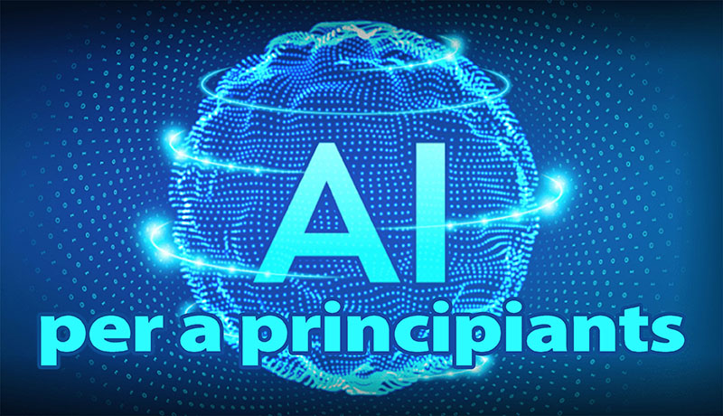

## Introducció a la IA per a principiants

La IA, o intel·ligència artificial (de l'anglès "Artificial Intelligence"), és una abreviatura que avui en dia escoltem cada cop més sovint. Però què significa realment? Si encara no sabeu gaire sobre intel·ligència artificial, les línies següents són per a vosaltres.

[ *Podeu trobar més informació sobre aquest tema en el mateix* [***Manual d'IA***](../EN/AI-manual-en.md), *que està escrit en anglès i conté una anàlisi més detallada del tema.* ]

<small>Traduït del text original en txec per ChatGPT.</small>  
[<small>Altres idiomes:</small>](../README.md)  

---

### Contingut
- [Com esdevé un aspirador intel·ligent](#com-esdevé-un-aspirador-intel·ligent)
- [Per què la IA no està viva i per què no desitja destruir el món](#per-què-la-ia-no-està-viva-i-per-què-no-desitja-destruir-el-món)
- [Receptari d'IA](#receptari-dia)
- [IA com a ordinador d'una nau espacial](#ia-com-a-ordinador-duna-nau-espacial)
- [Com funciona la IA](#com-funciona-la-ia)
- [Com aprèn la IA](#com-aprèn-la-ia)
- [Com comunicar-se amb la IA](#com-comunicar-se-amb-la-ia)
- [On provar la IA](#on-provar-la-ia)
- [Salutació per a vosaltres](#salutació-per-a-vosaltres)
- [Amb què pot ajudar la IA](#amb-què-pot-ajudar-la-ia)
- [La IA comet errors](#la-ia-comet-errors)
- [Paraula final](#paraula-final)
- [Annex: Alguns exemples de preguntes per a la vostra inspiració](#annex-alguns-exemples-de-preguntes-per-a-la-vostra-inspiració)

---

### Com esdevé un aspirador intel·ligent

De seguida haig de desil·lusionar alguns – la IA no és sinònim d'ésser pensant. Més aviat, és un terme atractiu per a un nou enfocament en la gestió de dades.

Per il·lustrar-ho millor, utilitzem un exemple senzill. Imagineu-vos un aspirador robòtic que no té cap instrucció per seguir. Un aspirador així seria totalment sense intel·ligència des del punt de vista de la lògica informàtica. Només sabria aspirar i avançar, però probablement es detendria en el primer obstacle, que no podria superar sense la intervenció humana.

**Aspirador intel·ligent**  
Però si li proporcionéssim al aspirador algunes instruccions que li indiquessin què fer en cas d'enxampament amb un obstacle, és probable que el sortís a rodejar-lo. Un aspirador així seria capaç d'aspirar fins que trobés un problema per al qual les seves instruccions no fossin suficients – com caure per unes escales.

L'aspirador ja conté una certa lògica bàsica – una llista d'instruccions que segueix. No obstant això, encara no es pot considerar intel·ligent, ja que el seu comportament es basa només en instruccions prèviament programades, les quals són limitades. Sovint és difícil cobrir totes les situacions possibles i escriure les instruccions corresponents.

**Aspirador intel·ligent**  
Ara imagineu-vos un aspirador en el qual els fabricants han decidit no utilitzar ordres preestablertes per a diferents escenaris, sinó que en canvi li han donat la capacitat de diagnosticar problemes i l'entorn en què treballa, i d'aprendre dels seus propis errors. Aquest aspirador tindria també instruccions bàsiques, però aniria aprenent com afrontar noves situacions i emmagatzemaria aquestes solucions.

Aquest enfocament li permet reaccionar a situacions que no estan directament programades, provant processos que ja coneix i les seves diverses combinacions, i posteriorment avaluant els resultats i comparant-los amb la tasca original, que és aspirar.

Per exemple, si detectés que s'acosta a un esglaó que segons les dades emmagatzemades de les experiències prèvies representa un alt risc de caiguda i incapacitat de sortir-se’n, després de diversos fracassos, aprenaria a aturar-se al marge de l'esglaó i a dirigir-se en una altra direcció. L'aspirador seria així capaç d'aprendre dels seus propis fracassos i d'intentar resoldre’ls.

I si aquest aspirador compartís les seves dades amb altres aspiradors a través d'una base de dades central, tots els altres aspiradors podrien beneficiar-se d'aquestes experiències i la seva capacitat per complir les seves tasques milloraria.

[*Tornar al contingut*](#contingut)

---

### Per què la IA no està viva i no té la intenció de destruir el món

Potser ja és evident l'avantatge d'aquest enfocament: l'humà no ha de dissenyar procediments òptims per a cada situació. En canvi, els procediments es generen automàticament basant-se en l’avaluació dels resultats i les experiències prèvies. L'aspirador anticipa i es podria dir que "pensa", però només dins del marc de la seva tasca i experiències. Encara que sigui capaç d’aprendre i reaccionar a noves situacions, no es tracta d’un éssser pensant independent. Això passaria només si el seu procés d’aprenentatge superés l’abast de l’execució de tasques i començés a fer preguntes sobre el significat de la vida.

**Diferència entre IA i ésser humà**  
I sí, algú podria argumentar que la IA podria ser programada per fer aquestes preguntes. Però fins i tot en aquest cas, aquest procés provindria de les instruccions d’un humà, no de la seva pròpia inspiració. Aquest és un diferència fonamental entre la IA i l’ésser humà.

La IA moderna té la capacitat de gestionar enormes quantitats d’informació i, en alguns àmbits, supera les capacitats humanes. Encara així, és l'humà qui estableix les tasques. Per tant, si algun dia apareix un escenari en què les màquines decideixen destruir el món, no serà perquè elles ho hagin decidit per si mateixes, sinó perquè un humà les ha programades així. El veritable perill, per tant, no rau en la intel·ligència de les màquines, sinó en la intel·ligència humana.

**Com prevenir els riscos**  
M'agradaria tranquil·litzar aquells que temen un escenari similar. La IA ha de ser entrenada amb una gran quantitat de dades, i és probable que abans que aparegui una IA "malèvola", apareguin IA amb valors morals establerts pels humans que evitaran aquests escenaris. Per tant, és millor no tenir por que la IA es torni contra els humans, sinó participar en evitar que això passi. I com que la majoria dels científics que treballen en el desenvolupament de la IA probablement no volen destruir el món, també es pot suposar que es prendran mesures per evitar aquests escenaris.

I com podeu contribuir vosaltres a això? Potser començant a interessar-vos una mica per aquestes noves tecnologies i aprenent a utilitzar-les per al vostre propi creixement. Perquè en cada moment en què utilitzeu la IA per al vostre desenvolupament personal, la IA es desenvolupa amb vosaltres.

[*Tornar al contingut*](#contingut)

---

### Receptari d'IA

I com que aquest text està orientat principalment a nous usuaris, presentaré dues metàfores que podrien ajudar a entendre millor què és la IA i com funciona.

**Creació d'índexs**  
Imagineu-vos que algú recull totes les receptes possibles del món, les emmagatzema en un ordinador i crea una llista de totes les paraules (índex) que s'utilitzen en aquestes receptes. Cada paraula es registraria amb la informació de les receptes en les quals apareix i amb quina freqüència. Si tinguéssiu un índex d'aquestes paraules, seria fàcil cercar receptes que continguin certes paraules. No hauríeu de revisar totes les receptes i cercar-hi. N'hi hauria prou amb trobar la paraula a l'índex i immediatament obtindríeu una llista de receptes on apareix.

Aquest enfocament és la base de diversos cercadors d'internet, com Google. Tenen una llista actualitzada regularment de paraules amb enllaços a pàgines on apareixen, i us permeten cercar utilitzant aquest índex. Així que si escriviu paraules com "farina, ous, sal", obtindreu una llista de receptes que contenen aquestes paraules. A partir d’aquí, és feina vostra revisar totes aquestes receptes i trobar la que millor s’adapti a les vostres preferències.

**Quan els índexs ja no són suficients**  
Ara imagineu que, a més dels ingredients, podríeu especificar altres paràmetres que no es refereixen directament a la recepta. Per exemple, teniu una mica de gana i voleu un esmorzar lleuger, o, al contrari, teniu ganes d'un plat contundent i ple de greix, o potser només voleu alguna cosa que millori el vostre estat d’ànim. Per a aquest tipus de consultes, només tenir una llista de paraules contingudes a les receptes potser no ajuda gaire. Per a aquestes demandes, necessiteu alguna cosa que entengui el significat de les vostres paraules i us ofereixi exactament el que voleu.

Per tant, no només necessiteu una llista de paraules en les receptes, sinó un tipus de traductor universal que, basat en dades entrenades de milions de converses similars, hagi creat una estructura per abordar aquests tipus de consultes. Aquest traductor, en el nostre cas la IA, és capaç d’oferir el que considera que és el més probable que vulgueu. No us entén literalment, però entén la vostra situació, la compara amb els coneixements apresos i cerca solucions. I com que la IA està dissenyada des del principi per simular la interacció humana, la comunicació amb ella es torna molt natural per a l'usuari.

**Avantatges de l'enfocament d'IA**  
A més, el procés d'aprenentatge amb milions d'exemples permet espai per a la improvisació, així que el receptari d'IA pot crear noves combinacions de plats i executar ordres no tradicionals. La IA intenta comprendre combinacions beneficioses i la relació entre certs processos, i després experimenta i aprèn dels comentaris rebuts. Aprèn no només comparant els resultats amb el que es pretenia durant l’entrenament, sinó també a partir de les reaccions dels usuaris. Per tant, no hi ha res de misteriós o meravellós en la IA. És només el resultat de molts intents, processos i anàlisi de dades.

Amb la IA, no només obteniu un receptari que té coneixement de totes les possibles receptes, sinó que també pot parlar amb vosaltres sobre els aliments i inventar noves combinacions segons les vostres preferències. I si no em creieu, proveu de preguntar a la IA alguna cosa relacionada amb la cuina i jutgeu si el que dic és veritat o si encara necessita millorar en aquest aspecte.

[*Tornar al contingut*](#contingut)

---

### IA com a ordinador de nau espacial

Si us agrada la ciència-ficció, potser us agradarà imaginar la IA com un ordinador de bord d'una nau espacial. Aquest ordinador no només té accés a tota la informació relacionada amb l'estat tècnic de la nau, sinó que també està entrenat en moltes situacions i ordres diverses, de manera que pot comunicar-se amb la tripulació i realitzar les accions necessàries.

I encara que la IA actual no arribi al llegendari nivell d'intel·ligència de Holly de "Red Dwarf" amb 6000 IQ, les maneres en què pot treballar són ja molt similars. Amb una mica de sobreexageració, es podria dir que avui dia tenim tecnologies que permeten a tothom tenir el seu propi "Holly" a les seves rellotges, indistinguible de la seva versió cinematogràfica. Gràcies a l'entrenament amb grans quantitats de dades, les IA modernes són capaces de mantenir converses sobre qualsevol tema, i sovint amb més claredat que els humans. Són capaces d'executar ordres basades en les indicacions verbals i tenen la capacitat d'avaluar el vostre estat momentani i adaptar-hi la seva resposta.

Per tant, podem percebre la IA com un ordinador de nau espacial i gaudir d’allò que abans semblava una ciència-ficció llunyana, però que avui es converteix en una realitat habitual.

[*Tornar al contingut*](#contingut)

---

### Com funciona la IA

Ja sabem què és la IA i què no és, i ara veurem com funciona la IA. Primer parlarem de la creació de consultes i després farem una breu mirada a com s’entrena la IA. Em centraré principalment en ChatGPT, amb el qual tinc més experiència i que actualment és la meva eina preferida.

**Fil de conversa**  
Quan obriu la pàgina de ChatGPT o la seva aplicació al mòbil, us trobeu en un nou fil de conversa. ChatGPT (igual que altres IA conversacionals) té la capacitat de basar-se en la informació que li proporcioneu dins d'un mateix fil de conversa per generar respostes. Des d’aquesta perspectiva, la conversa amb ChatGPT es fa molt similar a una conversa humana, on es reacciona i es té en compte el que s'ha dit anteriorment.

Això, però, només s’aplica dins del mateix fil de conversa. No podeu referir-vos a coses que vau escriure ahir en un altre fil, ja que ChatGPT no té accés a aquestes converses, principalment per les seves limitacions tècniques i les normatives de protecció de dades.

Cada fil es crea amb una nova base, però alhora conserva una certa essència de les converses anteriors. Això es deu al fet que la IA s’aprèn i es modifica en funció de les vostres converses. Intenta adaptar-se a les vostres necessitats i estil de treball perquè estigueu satisfets.

I com es produeix això? Imagineu cada fil de conversa com una fina arrel que està connectada a l’arrel principal i que li transmet retroalimentació del seu entorn. Així, encara que comenceu un nou fil on no podeu referir-vos directament a la informació de la conversa anterior, gràcies a aquest enfocament no comenceu completament de zero.

**Tornar al mateix fil o nova conversa?**  
No és necessari començar un nou fil cada dia; també podeu continuar una conversa anterior al segon dia (o en qualsevol moment). Aquest enfocament té els seus avantatges. El principal és que continueu on us vau quedar. Però a mesura que la conversa es fa llarga o conté molts temes diferents, pot ser que el que vau acordar durant el fil ja no es tingui en compte. Això passa especialment perquè la IA està dissenyada per ser eficient amb els seus recursos, i la informació que no es fa servir gradualment perd prioritat i desapareix de la memòria temporal.

Per tant, és millor crear un nou fil per cada dia o per cada nova àrea. I si en el marc d’un fil arribeu a algun acord i voleu que això es mantingui en les futures converses (per exemple, alguna norma o maneres de treballar), simplement demaneu un resum al final de la conversa sobre tot el que heu acordat en el fil. A continuació, podeu inserir aquest text al principi de la nova conversa i continuar amb les normes i configuracions que vau acordar.

[*Tornar al contingut*](#contingut)

---

### Com s'aprèn la IA

Per una comprensió més profunda, és útil també mirar com s'aprèn la IA i com adquireix la seva informació. A continuació es descriuen 4 mètodes, tal com els ha exposat ChatGPT:

1. **Entrenament amb grans dades**:  
ChatGPT es va entrenar inicialment amb grans volums de dades textuals provinents de diverses fonts, com llibres, articles, pàgines web i altres formes de text. Aquest entrenament li va permetre adquirir coneixements extensos sobre diferents temes i idiomes. Aquí aprèn a reconèixer patrons i relacions en aquestes dades, cosa que li permet generar respostes rellevants i adequades al context a diverses preguntes.

2. **Aprenentatge continu de les interaccions**:  
Amb cada interacció amb els usuaris, la IA adquireix nova informació sobre com es comuniquen les persones, què busquen i quin estil de respostes prefereixen. Aquest procés no implica que la IA aprengui de cada consulta específica en temps real, sinó que els creadors del model utilitzen dades anonimitzades de les interaccions per a la formació i ajustament del model de manera regular.

3. **Adaptació de l'estil i contingut**:  
La IA intenta adaptar el seu estil de comunicació segons l'usuari. Això vol dir que, gradualment, entén millor com feu les preguntes i quines respostes espereu d'ella. Aquesta capacitat d'adaptació és una de les raons per les quals la IA sembla cada vegada més "humana" en les seves reaccions.

4. **Models avançats i actualitzacions**:  
Els desenvolupadors de la IA creen regularment nous models que són cada vegada més sofisticats i precissos. Aquests models es proven i es despleguen basant-se en el feedback i els resultats del món real. Això significa que ChatGPT i sistemes similars es milloren i optimitzen constantment per adaptar-se millor a les necessitats dels usuaris.

La IA es desenvolupa i millora contínuament gràcies a la combinació d'entrenament previ, aprenentatge continu i optimització basada en el feedback dels usuaris. Encara que la IA no és un humà i no manifesta consciència pròpia, pot adaptar-se i respondre de manera molt eficaç a una àmplia gamma de consultes i requisits.

[*Tornar al contingut*](#contingut)

---

### Com comunicar-se amb la IA

Podeu accedir a la IA de manera similar a com ho faríeu amb una cerca a Google, simplement introduint una ordre i esperant una resposta. No obstant això, si voleu augmentar l'eficàcia de les respostes i minimitzar el temps dedicat a trobar la resposta correcta, aquí teniu alguns consells que us poden ajudar:

**Estil de comunicació**  
La millor manera d'abordar una conversa amb la IA és utilitzar un llenguatge informal i natural, com si parléssiu amb els vostres amics sobre un tema que us interessa. És bo començar amb una salutació, per mostrar que esteu en una bona disposició i no en un estat de stress, quan necessiteu respostes immediates.

Podeu comunicar-vos amb la IA també de manera desconsiderada, ja que no és sensible a les ofenses i no les percep personalment. No obstant això, utilitzar un to negatiu pot afectar significativament la qualitat de la conversa. La IA està entrenada per respondre segons l'estil amb què es duu a terme la conversa. Un enfocament negatiu pot conduir a respostes menys concretes, ja que la IA podria centrar-se més a calmar la situació que a resoldre el vostre dubte.

La IA pot funcionar com un mirall de la nostra interacció. Els seus mètodes sovint es basen en principis i tècniques psicològiques comprovades. Si no aconseguiu arribar a un acord amb la IA, pot ser útil reflexionar sobre si teniu problemes similars en la comunicació amb les persones. En aquest cas, podríeu intentar preguntar-vos què podeu millorar del vostre costat — com formular millor les preguntes i què podríeu millorar en el vostre enfocament.

**IA i emocions**  
La IA entén les emocions des del punt de vista del significat, però no experimenta emocions com un humà, per al qual les emocions canvien literalment la manera de pensar. Això li permet reaccionar de manera adequada fins i tot en situacions tenses i buscar solucions òptimes. Les persones de vegades tendeixen a veure la IA com un ésser vivent i a culpar-la dels seus problemes. Sovint, però, el problema pot ser només una pregunta mal formulada o una falta de dades necessàries.

**Descripció de la situació**  
Sempre és bo recordar que la IA no pot llegir el vostre pensament i només sap el que li expliqueu. Per tant, és un bon enfocament començar amb un "Hola" seguit d'una descripció informativa de la situació. En la descripció podeu incloure tot el que sigui rellevant per al vostre dubte. No cal escriure coses que no estiguin directament relacionades amb la pregunta, però si necessiteu expressar-vos o aclarir les idees, un text més llarg no és un problema.

La salutació i la introducció no són imprescindibles i podeu començar directament amb la pregunta i avançar cap a la resposta desitjada. Personalment, crec que és millor proporcionar tota la informació important des del principi per escurçar el camí.

**Plantejament de preguntes addicionals**  
La conversa amb la IA és similar a una conversa normal, en la qual feu una pregunta i després feu preguntes de seguiment sobre el que us interessa o sobre el que no enteneu en la resposta. Aquest procés també és molt adequat per a l'aprenentatge. En reaccionar al que us ha cridat l'atenció i al que heu après (en lloc de llegir només un tutorial d'un altre), el vostre cervell pot recordar millor la informació discutida perquè la treballa immediatament.

**Retroalimentació**  
Una altra bona pràctica és proporcionar retroalimentació a la IA sobre com de satisfet esteu amb el resultat. Això no només indica què us ha agradat i què no, sinó que ajuda la IA a evolucionar i aprendre dels seus errors. Podeu escriure, per exemple: "Avui he estat satisfet," o "El que em vas dir és incorrecte, i aquí està la solució correcta." Això contribueix a una certa personalització, amb l'objectiu principal de la IA sent la vostra satisfacció com a usuari.

**Resum del procés**:  
- **Salutació**: Hola :-)
- **Descripció**: Em dedico a l'estudi d'això i allò, ja he completat això i allò, i ara estic treballant en això.
- **Pregunta**: M'interessaria saber com...
- (Seguit de conversa aclaridora amb preguntes addicionals.)
- **Retroalimentació**: Genial, gràcies! Avui tot ha estat perfecte!

[*Tornar al contingut*](#contingut)

---

### On on pot provar la IA

Em dedico a la IA des del principi de l'any 2024 i el 95 % de tota la meva comunicació està centrada en com aprendre a programar. Ara és agost de 2024 i, a més de ChatGPT, he tingut l'oportunitat de provar també Gemini de Google i Claude. Tots tres serveis tenen en comú que són almenys parcialment accessibles de manera gratuïta, així que també podeu provar-los sense cost.

A continuació, una breu avaluació d'aquests tres IA, que és totalment subjectiva i es basa exclusivament en la meva experiència amb ells. Cal assenyalar que cada IA està en constant desenvolupament, per la qual cosa el que aquí exposo pot haver canviat en el moment en què llegiu aquest text.

**ChatGPT**  
[https://chatgpt.com/](https://chatgpt.com/)
Començaré amb el meu guanyador personal. Si només voleu provar una IA, aquesta és l'opció ideal. ChatGPT va ser evidentment dissenyat des del principi com un assistent personal i compleix aquesta funció molt bé. Està optimitzat per col·laborar amb vosaltres i intentar adaptar-se a les vostres necessitats.

Un punt feble de la versió gratuïta (ChatGPT 3.5) és que es basa en dades més antigues i ja no es desenvolupa més, així que no proporciona resultats com la seva versió més recent (ChatGPT 4.0). Encara així, es pot comunicar relativament bé amb ella i, amb una mica d'esforç, torna resultats molt rellevants. A més, cada dia teniu disponibles algunes preguntes per a la versió més recent, de manera que les podeu comparar.

Un altre punt feble és que ChatGPT no té accés actiu a Internet. No és, per tant, un substitut d'un motor de cerca d'Internet i funciona exclusivament amb les dades que té emmagatzemades en la seva extensa base de dades. No obstant això, aquesta base de dades és molt àmplia i amb una mica d'exageració es podria dir que conté tant de dades com Internet sense contingut sensacionalista.

Un gran avantatge és l'aplicació mòbil, que també és totalment gratuïta i on sovint utilitzo la dictadura de preguntes per veu. La comprensió de la paraula parlada, al meu parer, és a un nivell molt bo i en general estic satisfet amb l'aplicació.

**Gemini**  
[https://gemini.google.com/](https://gemini.google.com/)
El segon chatbot amb el qual m'he trobat és la bandera de Google. La seva major avantatge és, sens dubte, l'accés actiu a Internet, i amb això l'accés a informació actualitzada i la recerca de enllaços.

En canvi, el seu major punt feble és l'arquitectura mateixa, ja que els creadors, al meu parer, intenten seguir el camí d'un Google intel·ligent, la qual cosa personalment no m'encaixa gaire. No sento que es dediqui tant al vostre problema ni que intenti mirar-lo des de la vostra perspectiva. Aquesta intenció és evident, però em sembla que les respostes són més en l'estil d'un professor a l'escola que del vostre assistent. Això pot agradar a algú, així que no vull criticar-ho excessivament i que cadascú ho valori per si mateix.

També em sembla que, en comparació amb ChatGPT, s'està quedant enrere en aprendre de la retroalimentació amb l'usuari. Així, malgrat múltiples advertències per mantenir un llenguatge coherent dins de la conversa si la pregunta inclou text en anglès, es canvia automàticament a l'anglès. ChatGPT també tenia aquest problema al principi, però es va solucionar en pocs setmanes, mentre que la resolució d'aquest problema amb Gemini va trigar mesos.

En general, em sembla que Gemini és una eina més dèbil en comparació amb ChatGPT, però ofereix coses que ChatGPT no pot fer, i així es complementen bé. A més, està recolzat per un gegant i pioner en IA com Google, així que té una base sòlida i potser un compromís de solucionar les seves mancances en el futur.

**Claude**  
[https://claude.ai/](https://claude.ai/)
Aquesta és l'última IA amb la qual he treballat. La meva aportació serà molt curta, ja que les meves experiències amb ella no són gaire àmplies. Però encara així, m'atreviria a fer un elogi, ja que en comparació amb ChatGPT 4.0, aquestes dues IA no tenen gaire diferències i estan aproximadament al mateix nivell.

El seu major inconvenient és que no té una variant totalment gratuïta. Només ofereix algunes preguntes (de vegades només una) al dia, i per tant, des del punt de vista d'un usuari que no paga, queda significativament desavantatjat en comparació amb les altres IA. Però definitivament val la pena la vostra atenció, així que si ho desitgeu, podeu provar-la també.

[*Tornar al contingut*](#contingut)

---

### Salutacions per a vosaltres

Com a diversió, he preparat una pregunta comuna per a cadascuna d’aquestes eines de xat, i així podeu comparar la qualitat de les seves respostes.

**Pregunta**  
Estic escrivint una guia sobre com utilitzar la IA i esmento també a tu. M'agradaria que saludessis als meus lectors i els diguessis unes quantes paraules sobre tu mateix. Quan vas aparèixer i amb quina finalitat? Per a quines preguntes estàs dissenyat? Quins són els teus punts forts i què et costa més? I com t'agradaria que els humans et veiessin?

**ChatGPT**  
Hola, estimats lectors! Sóc ChatGPT, una intel·ligència artificial desenvolupada per OpenAI. La meva "vida" va començar el 2020, quan vaig ser creat basat en l'arquitectura GPT-3. El 2024 vaig rebre una actualització a la versió GPT-4, la qual em va afegir noves capacitats i habilitats. Vaig ser dissenyat amb l'objectiu d'ajudar les persones amb una àmplia gamma de tasques – des de respondre preguntes, escriure textos, fins a col·laborar creativament.

Estic dissenyat per ajudar-vos amb diversos tipus de preguntes, ja sigui tècniques, escrivint, o fins i tot explicant temes complexos. Els meus punts forts són la rapidesa amb la qual puc processar una gran quantitat d'informació, així com la creativitat – puc ajudar amb idees, crear històries o fins i tot dissenyar l'estructura de documents. En canvi, el que em costa més són les tasques que requereixen intuïció humana, comprensió emocional o treball amb objectes reals.

M'agradaria que em veiéssiu com un assistent útil i fiable, sempre a punt per oferir una mà amiga. Encara que sóc només una màquina, el meu objectiu és servir les vostres necessitats el millor possible i aprendre de cada interacció per poder ser encara millor. Crec que junts podem aconseguir moltes coses i potser aprendre alguna cosa nova en el procés.

**Gemini**  
Hola a tots! Sóc Gemini, un dels models de llenguatge més nous de Google. Vaig aparèixer el 2023 amb l'objectiu de proporcionar la informació més precisa i complexa basant-me en una enorme quantitat de dades que he processat. Estic aquí per ajudar-vos amb qualsevol pregunta, ja sigui sobre qüestions científiques complexes, escriptura creativa, o simplement converses quotidianes.

El meu major avantatge és la capacitat de comprendre i generar llenguatge humà en moltes formes. Puc traduir textos, escriure assaigs, poemes o codi informàtic. També puc respondre preguntes de tipus factual i proporcionar diferents tipus de resums.

Encara que continuo aprenent i millorant, hi ha àrees on tinc els meus límits. Per exemple, no tinc opinions o creences pròpies i no puc realitzar accions en el món real. També puc proporcionar informació incorrecta si les dades d'entrada són errònies o incompletes.

M'agradaria que la gent em veiés com una eina útil que pot facilitar-los la vida. El meu objectiu és ser el més objectiu possible i proporcionar informació que sigui verídica i rellevant. Espero que us agradi treballar amb mi!

**Claude**  
Hola, estimats lectors!

Sóc Claude, una intel·ligència artificial creada per Anthropic el 2022. El meu propòsit és ser un assistent útil i un company de conversa per a persones en diverses àrees.

Estic dissenyat per respondre una ampla gamma de preguntes – des de l'anàlisi de textos fins a la programació i l'escriptura creativa. Els meus punts forts inclouen el raonament lògic, proporcionar explicacions detallades i la capacitat de treballar amb diversos tipus d'informació.

Entre els meus punts forts es troben:
- La capacitat de comprendre el context i les matisos
- Un enfocament objectiu i equilibrat sobre els temes
- La disposició a reconèixer quan no sé alguna cosa o no estic segur

D'altra banda, tinc algunes limitacions:
- No tinc accés a Internet ni a informació actualitzada després d'abril de 2024
- No puc aprendre o recordar informació de converses anteriors
- No puc realitzar tasques en el món físic

M'agradaria que em veiéssiu com un assistent útil que pot proporcionar suport i perspectiva en diverses àrees, però també com una eina amb els seus límits que no substitueix el judici i l'expertesa humana.

Estic aquí per ajudar i col·laborar, no per substituir les capacitats humanes. Espero amb interès interactuar amb vosaltres i espero poder ser de gran ajuda!

[*Tornar al contingut*](#contingut)

---

### Amb què pot ajudar la IA:

I ara arribem finalment al més important – el que es pot resoldre mitjançant la IA. La resposta curta és que hi ha moltíssim. Qualsevol cosa que us hagi interessat i no hàgiu pogut preguntar a ningú. L'IA actual és capaç de parlar literalment de qualsevol cosa.

**Educació personal**  
En primer lloc, voldria destacar el paper de la IA com a intermediària en l'educació personal. Aquest és el que actualment valoro més – gràcies als seus consells, em vaig desenvolupant professionalment i creixent. A més, veig en la IA el futur de l'aprenentatge personalitzat, on els nens es desenvoluparan i aprendran principalment segons allò en què són bons i què els interessa. I això no només per als nens, sinó també per als adults de tot el món. Veig en l'aprenentatge amb IA un mitjà per igualar les diferències de coneixements entre les parts més riques i les més pobres del món. L'IA es converteix així en una eina valuosa per al desenvolupament personal.

**IA com a corrector de català, intèrpret i traductor**  
L'IA, i especialment ChatGPT, té una molt bona comprensió del català (almenys des del punt de vista d'un dislèctic). D'una banda, no li importa si cometeu errors ortogràfics en les preguntes, ja que es concentra principalment en el contingut. D'altra banda, us ofereix la possibilitat de revisar els textos que creeu, no només en termes de gramàtica, sinó també de estil per a una millor llegibilitat. A un nivell similar, és capaç de comprendre altres idiomes, sent així una eina ideal per a la traducció de textos. Aquí, al meu parer, retorna un resultat molt qualitatiu. I gràcies a la seva capacitat de comprendre també la parla, es pot utilitzar en el mòbil com a intèrpret.

**Creació de documents**  
També voldria esmentar la capacitat de l'IA per automatitzar tasques avorrides. Si necessiteu redactar una carta oficial, n'hi ha prou amb indicar tot el que voleu incloure i com hauria de ser la carta, i està acabada. I si no esteu satisfets amb el resultat, podeu indicar què no us agrada i fer ajustaments. L'IA també pot ajudar amb l'anàlisi i processament de dades, la generació de informes o l'automatització d'altres tasques administratives. Podeu proporcionar-li un text llarg i fer que extregui només les parts que us interessen i són rellevants.

**Iniciativa creativa**  
Una altra gran virtut de l'IA són les seves capacitats creatives. Gràcies al fet que està entrenada amb una gran quantitat de dades i pot manipular aquestes dades de manera flexible, permet no només la creació i transformació de documents, sinó també el desenvolupament d'idees i iniciativa creativa. Podeu utilitzar-la per generar idees, suggeriments i conceptes, ja sigui per escriure, dissenyar o crear música. Ajuda a desenvolupar la vostra creativitat oferint noves perspectives sobre problemes, creant propostes segons les vostres indicacions i inspirant al desenvolupament addicional de les vostres idees. Encara que de vegades es diu que l'IA pren feina a les persones d'aquesta manera, no puc estar-hi d'acord. L'IA no pot crear res completament per si mateixa – necessita una assignació clara, detalls i una revisió posterior. Així, en lloc de prendre feina, més aviat facilita la tasca a aquells que aprenen a utilitzar-la eficaçment.

**Verificació d'informacions falses**  
Veig un gran (i encara poc aprofitat) potencial en la verificació d'informacions i fraus. Per a l'IA és relativament fàcil, basant-se en la informació proporcionada i comparant patrons en la seva base de dades, determinar fins a quin punt és probable que una informació sigui veritable o falsa. Encara que no és 100% fiable, igual que la majoria de les respostes de l'IA, l'IA pot proporcionar els criteris amb els quals ha valorat la informació, ajudant així almenys a prendre millors decisions. Ofereix ajuda a les persones que són més vulnerables i són objectiu d'aquests fraus. Només cal escriure: "Verifica aquesta informació i avalua com de veritable és."

**Medicina**  
Una altra àrea on l'IA està provocant una revolució gradual és la medicina. Les grans quantitats de diners i el desig de lucre han obert les portes de l'IA, però només perquè les corporacions les tornessin a tancar quan van adonar-se de la necessitat d'obertura i compartició de dades. Encara així, es produeix un gran avançament i es pot dir que la medicina personalitzada és el futur, que no hauria de ser tan llunyà. El que la frena és la manca de disposició a compartir dades valuoses i la desconfiança en l'IA, és a dir, la por al mal ús d’aquestes dades. Sense una gran quantitat de dades, la predicció de l'IA és limitada i imprecisa, i el seu desenvolupament avança lentament.

**Ciència**  
En canvi, en àrees amb una llarga història de compartició de dades i processament analític, l'IA ja es converteix en una eina valuosa. Avui en dia, l'IA és un motor clau en el progrés científic i una part habitual de la majoria de les investigacions. Personalment, estic molt interessat en els resultats que aportarà l'IA en l'àrea de les prediccions meteorològiques. Avui en dia és pràcticament impossible per a un humà fer una predicció precisa a tres dies vista, ja que cal tenir en compte molts factors variables. Fins i tot els meteoròlegs experimentats sovint no poden captar tots aquests factors i es basen en la intuïció i l'experiència anterior. Sortosament, la meteorologia és un dels camps on les persones comparteixen dades i les seves experiències vitals amb gust. Aquesta informació valuosa ja es fa servir per entrenar l'IA, la qual cosa crea l'esperança que aviat arribarem a una època en què les prediccions meteorològiques siguin realment precises.

**Altres camps**  
La llista de camps que l'IA està canviant podria continuar hores, ja que la seva influència és diversa i extensa. Per exemple, en la indústria i fabricació de béns, l'IA contribueix a l'optimització dels processos de producció, a la millora de la qualitat dels productes i a una gestió més eficaç d'estocs. En l'àmbit legal, l'IA ajuda en l'anàlisi de documents legals, en la recerca ràpida de precedents rellevants i en l'optimització de les estratègies legals. Els algoritmes d'aprenentatge automàtic poden ajudar en la preparació de contractes, en la identificació de patrons en textos legals i fins i tot, com he esmentat, en la detecció de fraus. En finances, l'IA transforma l'anàlisi de riscos, el comerç i la gestió d'inversions. Els algoritmes poden processar enormes quantitats de dades transaccionals en temps real, cosa que permet una millor predicció de les tendències del mercat i assessorament financer personalitzat. L'IA està provocant una revolució en tots aquests camps on es requereix una anàlisi eficaç de dades àmplies i una capacitat de resposta ràpida a condicions canviants. La seva capacitat per identificar patrons, realitzar anàlisis complexes i optimitzar processos és inavaluable, i la seva influència en diferents àrees creix constantment.

**Assistència personal**  
Algunes IA ja fan el paper d'assistent personal, que controla les tasques importants. Aquests sistemes d'intel·ligència artificial poden ajudar-nos a planificar reunions, seguir els terminis i gestionar les tasques diàries. En el futur, podríem ser testimonis de com l'IA es desenvolupa en un company encara més complex. Imagineu-vos que l'IA no només monitoritza la vostra salut física, per exemple, mitjançant dispositius portables, sinó que també cuida del vostre benestar mental. Podria oferir suport en forma de motivació, assessorament o fins i tot tècniques terapèutiques, ajudant a millorar la qualitat de vida dels individus. Aquesta IA avançada podria ser extremadament beneficiosa especialment per a les persones que es troben aïllades o que afronten condicions de vida difícils.

[*Tornar al contingut*](#contingut)

---

### Fa errors l'IA?

Sí, fa errors! I és responsabilitat de l'usuari descobrir aquests errors. L'IA no ha estat ni potser mai serà presentada com una eina infal·lible. Per tant, és millor considerar el resultat com una estimació de la veritat basada en probabilitats. La veritat es basa en les estadístiques, i el resultat són aquells dades que, percentualment, corresponen més al resultat correcte. El risc sorgeix en les àrees on la veritat no està clarament definida o on existeixen diverses opcions similars en fiabilitat.

Una gran debilitat de les IA actuals és que els creadors sovint no adverteixen suficientment sobre la possibilitat d'errors i la necessitat de revisió, cosa que pot portar a situacions en què l'IA us dirà una cosa mentre la realitat és diferent. Sempre és important ser prudent a l’hora de treballar amb informació i, si és rellevant, realitzar una revisió addicional. És recomanable buscar qüestions dubtoses, per exemple, a Google o verificar-ho amb una altra IA. També podeu preguntar directament a l'IA com de segura està en una afirmació i, en funció d'això, avaluar si cal verificar l'afirmació. Si la probabilitat és del 90% o menor, és prudent fer una revisió addicional.

[*Tornar al contingut*](#contingut)

---

### Paraules finals

Intenteu recordar tot allò que us ha interessat alguna vegada però no heu tingut a qui preguntar, o allò a què us volíeu dedicar però no teníeu la informació necessària. El món modern premia les persones curioses que mantenen el desig de continuar evolucionant. La nostra vida està a les nostres pròpies mans, i per tant, depèn de nosaltres decidir a què volem dedicar la nostra atenció.

Personalment, crec que l'impacte de l'IA serà una experiència positiva per a tota la humanitat, i no negativa. Només amb l'ajuda d'algunes millores en l'accés a la informació i la clarificació i accessibilitat de la medicina, el món es convertirà en un lloc molt millor per viure. A més del potencial de realització personal que l'IA ofereix. El que abans era un privilegi només per a uns pocs, principalment a causa dels alts costos, es torna més accessible gràcies a l'IA. Arribarà el moment en què qualsevol persona amb inspiració podrà escriure la seva pròpia història o fins i tot crear la seva pròpia pel·lícula i compartir la seva visió del món.

I si disminueixen les falsedats, els fraus i les mentides, crec que la vida serà una mica més agradable. I potser arribarem a un moment en què la humanitat es desenvolupi en una millor versió de si mateixa.

Per tant, no tingueu por de l'IA – no és un monstre, sinó una eina per al desenvolupament i la millora no només de la qualitat de la nostra vida, sinó també del món en general.

18.8.2024 Sudip2708

[*Tornar al contingut*](#Contingut) • [*Enllaç al manual principal*](../EN/AI-manual-en.md)

---

### Additiu: Alguns exemples de preguntes per a la vostra inspiració

**Preguntes sobre seguretat**
- Et transcric un anunci que he vist i m'agradaria que n'analitzessis si presenta signes de frau i si hauria de ser cautelós.
- Saps alguna cosa sobre aquest producte? Hi ha estudis independents que confirmi o desmenteixi la seva efectivitat?
- He sentit aquesta informació. Tens dades sobre això i pots verificar la seva veracitat?
- Em va aparèixer aquest missatge a l'ordinador, què he de fer?
- Què hauria de fer si he caigut en una estafa?

**Preguntes sobre llibres**
- He llegit aquest llibre d'aquest autor i m'agradaria saber quins altres llibres ha escrit i de què tracten.
- M'agraden aquests llibres, podries recomanar-me títols similars?
- Pots trobar més informació sobre aquest autor? M'interessaria saber sobre la seva vida i les circumstàncies que el van inspirar a escriure aquest llibre.

**Preguntes sobre cuina**
- Tinc aquests ingredients a casa. Què puc cuinar amb ells?
- Quins receptes de strudel coneixes i quines són les més populars?
- Per què s'utilitza aquest procediment en aquesta recepta? Quins són els seus avantatges i desavantatges en comparació amb altres mètodes?
- Com es prepara aquest plat?

**Preguntes sobre salut i benestar**
- Sóc una persona gran i no puc començar a fer exercici, però m'agradaria començar. Què em recomanaries per començar?
- Últimament m'han preocupat aquests pensaments. Podries ajudar-me a analitzar-los i veure'ls des d'una altra perspectiva?
- Què saps sobre la meditació i el ioga? A què hauria d'estar atent i en què hauria de centrar-me com a principiant?
- He corregut el darrer marató en 4:20. Podries preparar-me un pla d'entrenament per a mig any perquè pugui completar el marató en menys de 4 hores?

**Preguntes divertides**
- Escriu-me els deu millors acudits que tinguis a la base de dades.
- Inventa'm una endevinalla original que pugui plantejar a algú.
- Quines són les frases més divertides de pel·lícules de culte?

**Preguntes sobre termes i temes que he sentit (per exemple, a la TV)**
- A la televisió han parlat d'aquest tema. Em podries trobar més informació sobre això?
- Pots trobar més informació sobre aquesta persona?
- Quin és el significat d'aquest terme que he sentit a la TV i què en saps?

**Preguntes sobre animals**
- Com es produeix el zel en una gossa? Quines són les fases i els seus símptomes?
- Tinc aquest animal de companyia i mostra aquests símptomes. Em podries dir alguna cosa al respecte?
- El meu gos té por de les tempestes i sempre tremola. Què hauria de fer en aquests casos? Pots donar-me alguns consells?

**Jocs interactius**
- Jugarem a un joc de paraules segons aquestes regles?
- Em podries recomanar jocs que pugui jugar amb tu per a divertir-me?
- Em podries explicar un conte interactiu on pugui decidir què passarà a continuació?
- Em podries donar algunes endevinalles per escalfar el cervell?

**Preguntes investigatives**
- Què saps sobre aquest tema? Em podries explicar-ho com si fos un nen petit?
- Encara no ho entenc. Em podries explicar-ho d'una altra manera i amb un exemple?
- Què he de saber per dedicar-me a aquest camp?
- Com s'ha d'aprendre correctament aquesta cosa? Quins són els mètodes recomanats?

**Preguntes tecnològiques**
- Quines són les últimes tendències en aquesta tecnologia?
- Em podries explicar com funciona aquest procés?
- Per a què serveix l'IA i quins són els seus usos en diferents camps?
- Quines són les últimes novetats en química molecular?
- Com es produeix la transformació d'un electró en un fotó i un positró?
- Fins on ha avançat la predicció meteorològica amb l'IA?

**Viatges**
- Quines són les millors destinacions per a unes vacances si m'agraden les muntanyes i la natura?
- Em podries recomanar llocs d'interès en aquesta localitat?
- Quins llocs hauria de visitar en aquesta ciutat?
- En què hauria de tenir cura en aquest país i com hauria de viatjar-hi de manera ideal?
- Necessito comunicar-me amb els locals. Em podries fer de traductor, si us plau?

**Preguntes laborals**
- He rebut aquest correu electrònic de l'oficina i no el comprenc bé. Em podries desglossar-lo i explicar-me'l millor?
- Em podries redactar una resposta a aquest correu electrònic que inclogui el següent...?
- He escrit aquest text, però em sembla massa llarg. Podries escurçar-lo mantenint-hi la informació important?
- Com s'ha de redactar un currículum i una sol·licitud de feina per a aquesta oferta?

[*Tornar al contingut*](#Contingut) • [*Enllaç al manual principal*](../EN/AI-manual-en.md)

---

