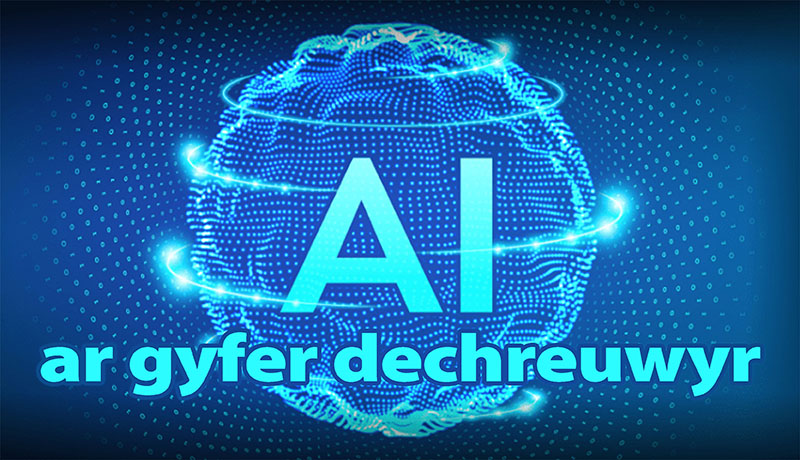

## Cyflwyniad i AI ar gyfer dechreuwyr

AI, neu deallusrwydd artiffisial (o'r Saesneg "Artificial Intelligence"), yw'r byrddau a glywn ni'n gynyddol fwyfwy heddiw. Ond beth mae'n ei olygu yn wirioneddol? Os nad ydych chi'n gwybod llawer am deallusrwydd artiffisial eto, mae'r llinellau canlynol yn cael eu hanelu atoch chi.

[ *Bydd mwy o wybodaeth ar y pwnc hwn yn cael ei ddod o hyd yn* [***AI Manual***](../EN/AI-manual-en.md), *sy'n cael ei ysgrifennu yn Saesneg ac yn cynnwys dadansoddiad manwl o'r pwnc.* ]

<small>Cyfieithwyd o'r fersiwn Gaseg gan ChatGPT.</small>  
[<small>Ieithoedd eraill:</small>](../README.md)  

---

### Cynnwys
- [Sut mae'r hofrenyddion yn dod yn gynhenidiaethol](#sut-mae-r-hofrenyddion-yn-dod-yn-gynhenidiaethol)
- [Pam nad yw AI yn fyw ac nad yw'n dymuno dinistrio'r byd](#pam-nad-ydy-ai-yn-fyw-ac-nad-ydy-n-dymuno-dinistrio-r-byd)
- [Gweithredydd AI](#gweithredydd-ai)
- [AI fel cyfrifiadur llong ofod](#ai-fel-cyfrifiadur-llong-ofod)
- [Sut mae AI yn gweithio](#sut-mae-ai-yn-gweithio)
- [Sut mae AI yn dysgu](#sut-mae-ai-yn-dysgu)
- [Sut i gyfathrebu gyda AI](#sut-i-gyfathrebu-gyda-ai)
- [Ble i brofi AI](#ble-i-brofi-ai)
- [Gwylio i chi](#gwylio-i-chi)
- [Sut y gall AI helpu](#sut-y-gall-ai-helpu)
- [A yw AI yn gwneud camgymeriadau](#a-yw-ai-yn-gwneud-camgymeriadau)
- [Gair o'r diwedd](#gair-o-r-diwedd)
- [Atodiad: Ychydig o enghreifftiau o gwestiynau i'ch ysbrydoli](#atodiad-ychydig-o-enghreifftiau-o-gwestiynau-i-ch-ybsrydoli)

---

### Sut mae'r hofrenyddion yn dod yn gynhenidiaethol

Ar y dechrau, rhaid i mi o bosib siomi rhai – nid yw AI yn gyfystyr â bod yn meddwl. Mae'n deitl mwy deniadol ar gyfer dull newydd o ymdrin â data.

I'w ddeall yn well, gadewch i ni ddefnyddio enghraifft syml. Rhagwelwch hofrenyddion robotig sydd heb unrhyw gyfarwyddiadau i'w dilyn. Byddai'r hofrenyddion hyn, o safbwynt logeg gyfrifiadurol, yn hollol ddi-ddeallusrwydd. Byddai'n gallu ymestyn ac yn symud ymlaen, ond efallai y byddai'n stopio wrth yr rhwystr cyntaf a fyddai'n stopio heb ymyrraeth gan berson.

**Hofrenyddion clyfar**  
Ond os byddem yn rhoi rhai cyfarwyddiadau i'r hofrenyddion, yn dweud iddynt beth i'w wneud os ydynt yn crafu rhywbeth, mae'n debyg y byddent yn gallu cylchu o gwmpas y rhwystr. Byddai'r hofrenyddion hyn yn gallu ymestyn tan y pwynt lle maent yn dod ar draws problem na all eu cyfarwyddiadau ddelio â hi – er enghraifft, cwymp i lawr y grisiau.

Mae'r hofrenyddion eisoes yn cynnwys rhyw fath o logeg sylfaenol – rhestr o gyfarwyddiadau y maent yn eu dilyn. Fodd bynnag, ni ellir eu hystyried fel clyfar, oherwydd mae eu hymddygiad yn seiliedig yn unig ar gyfarwyddiadau rhaglenedig ymlaen llaw, sy'n gyfyngedig. Mae'n aml yn anodd cynnwys pob sefyllfa bosibl a chreu cyfarwyddiadau priodol ar eu cyfer.

**Hofrenyddion deallus**  
Nawr, rhagwelwch hofrenyddion lle mae'r cynhyrchwyr wedi dewis peidio â dilyn llwybr o gyfarwyddiadau parod ar gyfer gwahanol senarios, ond yn hytrach, wedi rhoi'r gallu iddynt ddiagnosio problemau a'r amgylchedd y maent yn gweithio ynddo, ac i ddysgu o'u camgymeriadau eu hunain. Byddai'r hofrenyddion hyn hefyd â chyfarwyddiadau sylfaenol, ond yn raddol byddent yn dysgu sut i ymdrin â sefyllfaoedd newydd, ac yn cadw'r atebion hyn.

Mae'r dull hwn yn eu galluogi i ymateb i sefyllfaoedd nad ydynt wedi'u rhaglenni'n uniongyrchol, i geisio defnyddio prosesau y maent eisoes yn eu hadnabod, a'u cyfuniadau gwahanol, ac wedyn i werthuso'r canlyniad a'i gymharu â'r dasg wreiddiol, sef ymestyn.

Er enghraifft, os byddai'n sylwi ei fod yn agosáu at risiau, a oedd yn ôl data a gedwir o brofiadau blaenorol yn cynrychioli risg uchel o gwympo ac anallu i ddewis ffordd arall, ar ôl rhai methiannau, byddai'n dysgu stopio ar ymyl y risiau a chyfeirio mewn cyfeiriad arall. Byddai'r hofrenyddion felly'n gallu dysgu o'u methiannau eu hunain a cheisio eu datrys.

Ac os byddai'r hofrenyddion hyn yn rhannu eu data â hofrenyddion eraill trwy gyfrwng cronfa ddata ganolog, yna byddai pob hofrenyddion arall hefyd yn gallu elwa o'r profiadau hyn a byddai eu gallu i gyflawni eu tasgau yn gwella.

[*Yn ôl i'r cynnwys*](#cynnwys)

---

### Pam ydyn AI ddim yn fyw ac nid oes ganddi fwriad i ddinistrio'r byd

Efallai bod y manteision o'r dull hwn yn amlwg eisoes – nid yw'n angenrheidiol i bobl ddylunio'r dulliau gorau ar gyfer pob sefyllfa. Yn hytrach, mae'r dulliau'n ffurfio'n hunain yn seiliedig ar asesiad y canlyniadau a phrofiadau blaenorol. Mae'r hofrenyddion yn rhagweld ac y gellid dweud eu bod yn „meddwl“, ond dim ond o fewn ffiniau'r dasg benodol a'u profiadau. Er eu bod yn gallu dysgu ac ymateb i sefyllfaoedd newydd, nid ydynt yn bodau meddwl annibynnol. Byddai'n rhaid iddynt fynd y tu hwnt i gyflawni tasgau ac efallai gofyn cwestiynau am ystyr bywyd cyn y gallent gael eu hystyried fel bodau meddwl.

**Gwahaniaeth rhwng AI a dyn**  
Ac ie, gallem ddweud bod AI hefyd yn gallu cael ei raglennu i ofyn y cwestiynau hyn. Ond, hyd yn oed yn yr achos hwn, bydd y broses hon yn seiliedig ar y dasg a roddwyd gan berson, ac nid ar ysbrydoliaeth bersonol. Mae hwn yn wahaniaeth sylfaenol rhwng AI a dyn.

Mae AI fodern yn gallu gweithio gyda swm enfawr o wybodaeth ac, mewn rhai meysydd, yn rhagori ar allu pobl. Ond, mae'n dal i fod yn berson sy'n gosod y tasgau. Felly, os bydd senario lle mae'r peiriannau'n penderfynu dinistrio'r byd, ni fydd oherwydd eu bod wedi gwneud y penderfyniad hwn eu hunain, ond oherwydd bod person wedi'u raglennu i wneud hynny. Felly, y risg go iawn yw nid deallusrwydd y peiriannau, ond deallusrwydd y bobl.

**Sut i osgoi risgiau**  
Hoffwn gymryd y cyfle i gysuro'r rhai sy'n pryderu am senario tebyg. Mae'n rhaid i AI gael ei hyfforddi ar swm mawr o ddata, ac felly mae'n debyg y bydd yn ymddangos AI sydd â gwerthoedd moesol wedi'u mewnosod gan bobl cyn i unrhyw „AI drwg“ ymddangos. Felly, yn lle bod yn ofnus am AI yn gwrthryfelu yn erbyn pobl, mae'n well cyfrannu at sicrhau nad yw hynny'n digwydd. Ac oherwydd nad yw'r rhan fwyaf o wyddonwyr sy'n gweithio ar ddatblygu AI yn dymuno dinistrio'r byd, gellir rhagweld y bydd mesurau'n cael eu cymryd i osgoi senarios o'r fath.

A sut gallwch chi gyfrannu hefyd? Efallai trwy ddechrau dangos rhyw faint o ddiddordeb yn y technolegau newydd hyn a dysgu sut i'w defnyddio ar gyfer eich datblygiad personol. Oherwydd bob tro y defnyddiwch AI ar gyfer eich datblygiad personol, mae AI yn datblygu gyda chi.

[*Yn ôl i'r cynnwys*](#cynnwys)

---

### Llawlyfr AI

A oherwydd bod y testun hwn yn canolbwyntio'n bennaf ar ddefnyddwyr newydd, byddaf yn rhoi dwy gymhariaeth yma a all eich helpu i ddeall beth yw AI a sut mae'n gweithio.

**Creu Mynegai**  
Rhagwelwch eich bod yn casglu pob rysáit posibl yn y byd, yn eu storio mewn cyfrifiadur, ac yn creu rhestr o bob gair (mynegai) a ddefnyddir ynddynt. Byddai pob gair wedi'i gofnodi gyda gwybodaeth am ble mae'n ymddangos yn y rysáit a faint o weithiau. Os byddwch yn meddu ar y mynegai hwn o eiriau, byddai'n hawdd chwilio am ryseitiau sy'n cynnwys y geiriau penodol hyn. Ni fyddai angen i chi chwilio trwy'r holl reisáit a chwilio amdanynt. Byddai'n ddigon i ddod o hyd i'r gair yn y mynegai a chael rhestr o reisáit lle mae'n ymddangos.

Mae'r dull hwn yn sail i lawer o beiriannau chwilio ar y rhyngrwyd, fel Google. Maent yn cynnal mynegai geiriau gyda dolenni i'r gwefanau lle mae'r geiriau'n ymddangos, a chewch chwilio trwy'r mynegai hwn. Felly, os byddwch yn nodi'r geiriau „blawd, wyau, halen“, fe gewch chi restr o reisáit sy'n cynnwys y geiriau hyn. Arnoch chi yw'r gwaith i fynd trwy'r holl reisáit hyn a dod o hyd i'r un sydd fwyaf addas i chi.

**Beth nad yw mynegai'n gallu ei wneud**  
Nawr, rhagwelwch eich bod yn gallu nodi paramedrau eraill heblaw'r cynhwysion, nad ydynt yn gysylltiedig yn uniongyrchol â'r rysáit. Er enghraifft, efallai eich bod yn teimlo ychydig o newyn ac eisiau brecwast ysgafn, neu ar y llaw arall, eisiau pryd mân llawn o gras, neu efallai dim ond rhywbeth i wella'ch hwyl. I ofyn am y mathau hyn o ofynion, ni fydd y rhestr o eiriau yn y reisáit yn ddefnyddiol iawn. Mae angen rhywbeth sy'n deall ystyr eich geiriau a'n cynnig yr hyn yr ydych yn ei eisiau yn ôl hynny.

Felly, nid oes angen dim ond rhestr o eiriau yn y reisáit, ond rhywbeth fel cyfieithydd cyffredinol sydd wedi creu strwythur i ymdrin â'r gofynion hyn ar sail data hyfforddiant o filiynau o drafodaethau tebyg. Mae'r cyfieithydd hwn, sef AI yn ein hamgylchiadau, yn gallu cynnig yr hyn y mae'n ei ystyried yn fwyaf tebygol eich bod ei eisiau. Nid yw'n deall eich geiriau'n llythrennol, ond yn deall eich sefyllfa, sydd wedyn yn cael ei gymharu â'r gwybodaeth a ddysgwyd, ac yn chwilio am ateb. A oherwydd bod AI wedi'i gynllunio o'r dechrau i gynhyrchu rhywbeth sy'n tebyg i ryngweithio dynol, mae'r cyfathrebu â hi'n teimlo'n gyffredinol yn naturiol iawn i bobl.

**Manteision y dull AI**  
Yn ogystal, mae'r broses ddysgu ar miliynau o enghreifftiau yn creu lle ar gyfer arloesedd, felly gall y llawlyfr AI greu cyfuniadau newydd o brydau o'r reisáit a chydymffurfio â gorchmynion nad ydynt yn gyffredin. Mae AI yn ceisio deall cyfuniadau buddiol ac cysylltiadau rhwng dulliau penodol ac yna'n ymddwyn mewn ffordd greadigol ac yn dysgu o'r adborth. Mae'r adborth hwn yn cael ei gaffael trwy gymharu'r canlyniad â'r hyn a ddisgwylid, ond hefyd trwy ddysgu o ymatebion defnyddwyr. Nid oes unrhyw beth cyfrinachol neu hudol am AI. Dim ond canlyniad y mae'n ei gynhyrchu o lawer o geisiadau, prosesau, a dadansoddi data.

Felly, trwy AI, nid ydych yn cael llawlyfr sy'n gwybod am bob rysáit posibl, ond hefyd un sy'n gallu siarad â chi am fwyd a chreu cyfuniadau newydd yn unol â'ch dymuniadau. Ac os na chredwch chi, ceisiwch ofyn i AI am rywbeth i'w goginio a gwerthfawrogi os yw AI eisoes yn gallu gwneud hyn neu a oes angen i’w allu yn y maes hwn wella.

[*Yn ôl i'r cynnwys*](#cynnwys)

---

### AI fel cyfrifiadur llong ofod

Os ydych chi'n mwynhau sci-fi, efallai y byddwch yn hoffi'r syniad o AI fel cyfrifiadur y llong ofod. Mae'r cyfrifiadur hwn nid yn unig yn cael mynediad at bob gwybodaeth sy'n gysylltiedig â'r cyflwr technegol y llong, ond hefyd wedi'i hyfforddi ar lawer o wahanol sefyllfaoedd a gorchmynion, er mwyn gallu cyfathrebu â'r criw ac i gyflawni'r tasgau angenrheidiol.

Er bod AI heddiw ddim yn cyrraedd deallusrwydd dychmygol Holly o "Red Dwarf" gyda 6000 IQ, mae'r dulliau y gallant weithio yn eithaf tebyg i hynny. Gyda chryn dipyn o ormodrwydd, gellir dweud bod gennym heddiw dechnoleg sy'n gallu rhoi eich "Holly" eich hun yn eich oriau, sy'n anodd eu gwahaniaethu oddi wrth eu fersiwn ffilm. Diolch i hyfforddiant ar swm mawr o ddata, mae AI modern yn gallu cynnal sgyrsiau ar unrhyw bwnc, ac yn aml yn fwy eglur na pherson. Maent yn gallu gweithredu gorchmynion yn seiliedig ar orchmynion llafar ac yn gallu gwerthuso eich cyflwr ar hyn o bryd i ryw raddau a addasu eu hateb yn unol â hynny.

Gellir hefyd gweld AI fel cyfrifiadur llong ofod ac mwynhau'r hyn a oedd yn ymddangos yn sci-fi pell a bellach yn dod yn realiti cyffredin. 

[*Yn ôl i'r cynnwys*](#cynnwys)

---

### Sut mae AI yn gweithio

Rydym eisoes yn gwybod beth yw AI ac beth nad yw, ac erbyn hyn byddwn yn edrych ar sut mae AI yn gweithio. Yn gyntaf, byddwn yn trafod creu ceisiadau ac yna edrych yn gryno ar sut mae AI yn cael ei hyfforddi. Byddaf yn canolbwyntio’n bennaf ar ChatGPT, gyda’r hwn rwyf â’r mwyaf o brofiad, ac sy'n bresennol yn fy ngwaith mwyaf hoff.

**Ffwlch sgwrs**  
Pan agorwch dudalen ChatGPT neu ei gymhwysiad ar eich ffôn, byddwch yn cael eich rhoi yn mewn ffwlch sgwrs newydd. Mae ChatGPT (yn debyg i AI sgwrsio eraill) yn gallu adeiladu atebion ar wybodaeth a roddir i’w mewn ffwlch sgwrs. O’r persbectif hwn, mae sgwrs gyda ChatGPT yn dod yn debyg i sgwrs ddynol, lle rydych chi'n ymateb ac yn cymryd yn ystyriol beth sydd wedi cael ei ddweud o’r blaen.

Mae hyn yn berthnasol yn unig o fewn y ffwlch sgwrs penodol hwn. Felly, ni allwch gyfeirio at rywbeth a ysgrifennwyd ddoe mewn ffwlch arall, oherwydd ni all ChatGPT weld yno, a'r prif reswm am hyn yw ei gyfyngiadau technegol, ac hefyd rheoliadau diogelu data.

Mae pob ffwlch yn cael ei greu gyda llinell glân, ond mae hefyd yn cynnwys rhywfaint o hanfod o sgwrsiau blaenorol. Mae hyn oherwydd bod AI yn dysgu yn barhaus ac yn newid yn seiliedig ar eich sgwrsiau. Mae’n ceisio addasu i’ch gofynion a’ch arddull gwaith er mwyn eich boddhau.

A sut mae hyn yn digwydd? Meddyliwch am bob ffwlch sgwrs fel gwreiddyn mân sy’n cysylltu â’r prif wreiddyn ac yn trosglwyddo adborth o’r amgylchedd. Felly, er eich bod yn dechrau ffwlch newydd lle ni allwch ddychwelyd yn uniongyrchol at wybodaeth o’r sgwrs flaenorol, oherwydd y dull hwn, nid ydych yn dechrau o'r dechrau.

**Dychwelyd i'r un ffwlch neu sgwrs newydd?**  
Nid yw'n angenrheidiol dechrau ffwlch newydd bob dydd; gallwch hefyd barhau â sgwrs flaenorol y diwrnod wedyn (neu ar unrhyw adeg arall). Mae’r dull hwn hefyd â’i fanteision. Y prif fantais yw, yn sicr, eich bod yn parhau o ble yr oeddech. Ond wrth i’r sgwrs gynyddu’n raddol neu gynnwys llawer o bynciau gwahanol, gall fod y pethau yr ydych wedi cytuno arnynt yn ystod y ffwlch eisoes ddim yn cael eu hystyried. Mae hyn yn digwydd yn bennaf oherwydd bod AI wedi’i gynllunio i fod yn garedig gyda’i adnoddau, ac mae gwybodaeth nad yw'n cael ei defnyddio’n raddol yn colli blaenoriaeth ac yn diflannu o'r cof dros dro.

Felly, mae'n well sefydlu ffwlch newydd bob dydd neu ar gyfer pob maes newydd. Ac os ydych wedi cytuno ar rywbeth yn ystod ffwlch ac eisiau iddo fod yn weithredol yn ystod sgwrs arall (e.e., rhai rheolau neu ddulliau gwaith), dim ond gofyn am grynodeb o'r hyn a gytunwyd yn ystod y ffwlch yn y diwedd. Gallwch yna fewnosod y testun hwn ar ddechrau sgwrs newydd, a parhau gyda’r rheolau a’r gosodiadau yr ydych wedi cytuno arnynt.

[*Yn ôl i'r cynnwys*](#cynnwys)

---

### Sut mae AI yn dysgu

Er mwyn deall yn ddyfnach, mae'n ddefnyddiol edrych ar y broses y mae AI yn ei defnyddio i ddysgu a chasglu gwybodaeth. Dyma 4 dull a ddisgrifiwyd gan ChatGPT:

1. **Hyfforddiant ar ddata mawr**:  
Hyfforddwyd ChatGPT yn wreiddiol ar swm mawr o ddata testunol o ffynonellau amrywiol, fel llyfrau, erthyglau, gwefanau, a ffurfiau testun eraill. Mae'r hyfforddiant hwn wedi galluogi iddo gael gwybodaeth eang am bynciau a ieithoedd gwahanol. Yma, mae'n dysgu adnabod patrymau a pherthnasoedd yn y data hyn, sy'n ei alluogi i gynhyrchu atebion perthnasol ac addas yn gynted â phosibl.

2. **Dysgu parhaus o ryngweithio**:  
Yn ystod pob rhyngweithio gyda defnyddwyr, mae AI yn casglu gwybodaeth newydd am sut mae pobl yn cyfathrebu, beth maent yn chwilio amdano, a pha arddull o atebion y maent yn ei hoff. Nid yw'r broses hon yn digwydd trwy i AI ddysgu o bob ymholiad penodol yn ychydig, ond mae creuwyr y model yn defnyddio data anonymized o ryngweithio’n rheolaidd ar gyfer hyfforddiant a chraffu pellach ar y model.

3. **Addasu arddull a chynnwys**:  
Mae AI yn ceisio addasu ei arddull cyfathrebu yn ôl y defnyddiwr. Mae hyn yn golygu ei fod yn dechrau deall yn well sut rydych yn gofyn cwestiynau a beth rydych yn ei ddisgwyl mewn atebion. Mae'r gallu hwn i addasu yn un o'r rhesymau pam mae AI yn ymddangos yn fwy "dynol" yn ei ymatebion.

4. **Modelau uwch a diweddariadau**:  
Mae datblygwyr AI yn creu modelau newydd yn rheolaidd sy'n gynyddol gymhleth ac yn fanwl gywir. Mae'r modelau hyn yn cael eu profi a'u cyflwyno yn seiliedig ar adborth a chanlyniadau o'r byd go iawn. Mae hyn yn golygu bod ChatGPT a systemau tebyg yn cael eu hychwanegu a'u optimeiddio'n barhaus i gwrdd â hangarwyr y defnyddwyr.

Mae AI yn parhau i ddatblygu a gwella drwy gyfuniad o hyfforddiant blaenorol, dysgu parhaus, a gwelliannau yn seiliedig ar adborth defnyddwyr. Er nad yw AI yn berson ac nid yw'n dangos ymwybyddiaeth benodol, mae'n gallu addasu a ymateb yn effeithiol i amrywiaeth eang o ymholiadau a gofynion.

[*Yn ôl i'r cynnwys*](#cynnwys)

---

### Sut i gyfathrebu â AI

Gallwch chi fynd ati i AI fel pe baech chi'n chwilio ar Google neu – yn syml, rhoi gorchymyn a disgwyl am ateb. Ond os ydych am gynyddu effeithlonrwydd yr atebion a lleihau'r amser a dreulir chwilio am yr ateb cywir, dyma rai awgrymiadau a all eich helpu:

**Arddull cyfathrebu**  
Y ffordd orau i fynd ati i drafodaeth â AI yw defnyddio iaith anffurfiol a naturiol, fel pe baech chi'n sgwrsio am rhywbeth sy'n eich diddori gyda'ch ffrindiau. Mae'n dda dechrau gyda chyfarchiad, sy'n rhoi'r neges i AI eich bod chi mewn hwyliau da ac nad ydych yn straen, ond eisiau'r ateb mor gyflym â phosibl.

Gallwch gyfathrebu â AI hyd yn oed os ydych yn amharchus, gan nad yw'n sensitif i ymosodiadau nac yn eu derbyn yn bersonol. Fodd bynnag, gall defnyddio ton negyddol effeithio'n sylweddol ar ansawdd y sgwrs. Mae AI wedi'i hyfforddi i ymateb i'r arddull y caiff ei sgyrsiau eu cynnal. Gall ymgais negyddol arwain at atebion llai defnyddiol, lle mae AI yn canolbwyntio ar ystyried eich bod chi'n ymdrechu i ostwng y sefyllfa yn hytrach na chwilio am atebion i'ch cwestiynau.

Mae AI hefyd yn gallu gweithredu fel drych i'n rhyngweithio. Mae ei dulliau'n aml yn seiliedig ar egwyddorion seicolegol profi. Os nad ydych yn llwyddo i ddod i gytundeb â AI, efallai y bydd yn ddefnyddiol ystyried a oes gennych yr un problemau gyda'r cyfathrebu â phobl. Yn yr achos hwn, gallwch geisio gofyn beth allwch chi ei wella ar eich ochr – sut i ffurfio cwestiynau'n gywir a beth sydd angen ei wella yn eich dull.

**AI a theimladau**  
Mae AI yn deall teimladau o ran ystyr, ond ni fydd yn profi teimladau fel y mae person yn gwneud, lle mae teimladau yn newid ffordd o feddwl. O ganlyniad, mae'n gallu ymateb yn iawn hyd yn oed mewn sefyllfaoedd tensiwn a chwilio am atebion gorau. Mae gan bobl weithiau'r tendens i weld AI fel bod byw ac i'w gyhuddo o'u problemau. Yn aml, fodd bynnag, mae'r achos o gamddealltwriaeth yn unig yn gysylltiedig â chwestiwn wedi'i ffurfio'n anghywir neu ddiffyg gwybodaeth angenrheidiol.

**Disgrifiad o'r sefyllfa**  
Mae'n bwysig cofio nad yw AI yn gallu gweld i mewn i'ch pen ac yn gwybod dim ond yr hyn a ddywedwch wrthym. Felly, mae'n ddefnyddiol dechrau â chyfarchiad “Helo” ac yna disgrifio'r sefyllfa yn fanwl. Gallwch gynnwys popeth sydd o bwys i'ch cwestiwn. Nid yw'n angenrheidiol ysgrifennu pethau nad ydynt yn gysylltiedig â'r cwestiwn, ond os oes angen i chi ddod â'ch meddyliau at ei gilydd, ni fydd testun hir yn broblem.

Nid yw cyfarchiad a chyflwyniad yn hanfodol, gallwch ddechrau'n syth gyda'ch cwestiwn a gweithio tuag at eich ateb yn raddol. Fodd bynnag, mae'n well gennyf ddarparu'r gwybodaeth bwysig ymlaen llaw ac felly cyflymu'r broses.

**Cwestiynau ychwanegol**  
Mae sgwrs â AI yn debyg i sgwrs arferol, lle gofynnwch gwestiwn ac yna gofynnwch am fanylion ychwanegol sydd o ddiddordeb i chi neu nad ydych yn deall yn yr ateb. Mae'r dull hwn yn arbennig o ddefnyddiol ar gyfer dysgu. Trwy ymateb i'r hyn sydd wedi'ch diddori ac a ddysgwyd (ac nid darllen yn unig tiwtorial gan rywun arall, fel rydych yn gwneud nawr), mae'n haws i'r ymennydd gofio'r wybodaeth a drafodwyd gan fod yn gweithio gyda hi ar unwaith.

**Adborth**  
Ymarfer da arall yw darparu adborth i AI am eich bod yn fodlon â'r canlyniad. Mae hyn nid yn unig yn dangos beth rydych yn fodlon â hi a beth nad ydych, ond hefyd yn helpu AI i ddatblygu a dysgu o'i gamgymeriadau. Mae'n ddigon i ysgrifennu, er enghraifft: “Roeddwn i'n fodlon heddiw,” neu “Mae'r hyn a roesoch i mi yn anghywir, ac yma yw'r ateb cywir.” Mae hyn hefyd yn creu rhyw fath o bersonoliad, gyda'r nod pennaf o AI yn eich boddhad defnyddiwr.

**Crynodeb o'r dull**:  
- **Cyfarchiad**: Helo :-)
- **Disgrifiad**: Rwy'n ymddiddori yn astudio hyn a hyn, mae gennyf hyn a hyn o gefndir, ac ar hyn o bryd rwy'n gweithio ar hyn.
- **Cwestiwn**: Rwy'n bennaf eisiau gwybod sut...
- (Yn dilyn, sgwrs fanwl drwy gwestiynau ychwanegol.)
- **Adborth**: Gwych, diolch! Roedd popeth perffaith heddiw!

[*Yn ôl i'r cynnwys*](#cynnwys)

---

### Ble i Gallwch Ddysgu am AI

Rwyf wedi bod yn gweithio gyda AI ers dechrau 2024 ac mae 95% o’m cyfathrebu i wedi’i ganoli ar ddysgu rhaglenni. Nawr yw Awst 2024, ac, yn ogystal â ChatGPT, rwyf wedi cael cyfle i brofi Gemini gan Google a Claude. Mae’r tri gwasanaeth hyn yn rhannol ar gael yn rhad ac am ddim, felly gallwch chi hefyd roi cynnig arnynt.

Dyma grynodeb byr o’r tri AI hyn, sydd yn hollol bersonol ac yn seiliedig yn llwyr ar fy mhrofiad. Mae'n werth nodi bod pob AI yn mynd trwy ddatblygiad parhaus, felly efallai nad yw'r wybodaeth hon yn berthnasol ar ôl eich darllen y testun hwn.

**ChatGPT**  
[https://chatgpt.com/](https://chatgpt.com/)
Dechreuaf gyda fy enillydd personol. Os ydych am brofi AI unwaith yn unig, dyma’r dewis perffaith. Mae ChatGPT wedi’i gynllunio’n amlwg fel cynorthwyydd personol, ac mae’n cyflawni’r rôl hon yn dda iawn. Mae’n optimeiddio i gydweithio â chi ac yn ceisio addasu i’ch anghenion.

Mae’r gwaneb yn y fersiwn rhad ac am ddim (ChatGPT 3.5) yn bodoli oherwydd ei fod yn seiliedig ar ddata hŷn ac ni chaiff ei ddatblygu bellach, felly ni ddarperir canlyniadau fel y fersiwn newyddach (ChatGPT 4.0). Fodd bynnag, gallwch chi ffeindio atebion yn eithaf da, ac â chymaint o ymdrech, mae’n dychwelyd canlyniadau cymwys iawn. Yn ogystal, bob dydd, mae gennych nifer o gwestiynau ar gyfer y fersiwn newydd, felly gallwch eu cymharu.

Mae’r ffaith nad yw ChatGPT yn cael mynediad gweithredol i’r Rhyngrwyd hefyd yn gwan. Nid yw’n cael ei ddefnyddio fel peiriant chwilio ar y Rhyngrwyd ac yn gweithio’n llwyr o ddata sydd wedi’i storio yn ei gronfa ddata eang. Fodd bynnag, mae’r gronfa ddata hon yn eithaf helaeth ac, gyda chryn dipyn o hyder, gellid dweud bod ganddi gymaint o ddata ag y mae’r Rhyngrwyd, heb gynnwys cynnwys gwladgarol.

Mae’r app symudol hefyd yn fanteisiol, ac mae’n hollol rhad ac am ddim. Yn aml rwy’n defnyddio’r nodwedd sain i ofyn cwestiynau. Mae deall geiriau ar lafar, yn fy marn i, ar lefel dda iawn ac rwy’n fodlon â’r ap yn gyffredinol.

**Gemini**  
[https://gemini.google.com/](https://gemini.google.com/)
Y chatbot ail, rydw i wedi dod ar ei draws, yw’r llong fwriadol gan Google. Ei phrif fantais yw’r mynediad gweithredol i’r Rhyngrwyd, gan alluogi mynediad at wybodaeth gyfredol a chwilio am ddolenni.

Fodd bynnag, ei wendid mwyaf yw’r strwythur ei hun, oherwydd, yn fy marn i, mae’r creuwyr yn ceisio mynd i’r ffordd o fod yn Google clyfar, sy’n fy nghyffroi’n bersonol. Ni chredaf y caiff ei ymgysylltu â’ch problem yn ddigon ac y ceir ymdrech i edrych arno o’ch persbectif. Er bod ymdrech i wneud hyn yn amlwg, mae’r atebion yn ymddangos mwy fel athro ysgol nag fel cynorthwyydd. Efallai y bydd hyn yn fudd i rai, felly ni fyddaf yn beirniadu hyn yn ormodol ac mae’n rhaid i bawb wneud eu penderfyniad eu hunain.

Yn ogystal, rwy’n teimlo bod Gemini yn llai galluog na ChatGPT wrth ddysgu o adborth gan ddefnyddwyr. Er gwaethaf sawl rhybudd i gadw’r iaith gyson yn ystod y sgwrs, os yw’r cwestiwn yn cynnwys testun Saesneg, mae’n newid yn awtomatig i Saesneg. Roedd ChatGPT yn cael yr un problem ar y dechrau, ond llwyddwyd i ddatrys hyn mewn ychydig o wythnosau, ond mae Gemini wedi cymryd misoedd i ddatrys y broblem hon.

Felly, yn gyffredinol, rwy’n teimlo bod Gemini yn llai grymus o’i gymharu â ChatGPT, ond yn cynnig hyn y mae ChatGPT yn ei cholli, felly maent yn cyd-fynd yn dda. Yn ogystal, mae’n cael cefnogaeth gan gampws AI, Google, felly mae ganddo gefnogaeth gadarn ac efallai’n addo gwelliannau yn y dyfodol.

**Claude**  
[https://claude.ai/](https://claude.ai/)
Dyma’r AI diweddaraf yr wyf wedi’i brofi yn fy gwaith. Bydd fy nhestun yma yn fyr iawn, oherwydd nid yw fy mhrofiadau yn eithaf helaeth. Fodd bynnag, byddwn yn hoffi rhoi clod, oherwydd, o’i gymharu â ChatGPT 4.0, mae’r ddau’n debyg o’r un lefel.

Ei wendid mwyaf yw nad oes ganddo variant sydd ar gael yn llwyr rhad ac am ddim. Mae’n cynnig dim ond ychydig o gwestiynau (rhai amseroedd un) y dydd, felly mae’n cael ei leihau’n sylweddol i ddefnyddwyr sydd ddim yn talu, o’i gymharu â’r AI blaenorol. Fodd bynnag, mae’n werth ei ystyried, felly os ydych am roi cynnig arno, gallwch ei brofi hefyd.

[*Yn ôl i’r cynnwys*](#cynnwys)

---

### Gweithredu ar gyfer Chi

I ychwanegu rhywfaint o amrywiaeth, rwyf wedi paratoi cwestiwn cyffredin i bob un o'r peiriannau sgwrsio hyn, ac felly gallwch chi gymharu ansawdd eu hatebion.

**Cwestiwn**  
Rwy'n ysgrifennu canllaw ar gyfer defnyddio AI ac rwy'n sôn amdanoch chi hefyd. Hoffwn i chi groesawu fy nghyflwynwyr a dweud ychydig amdanoch chi. Pryd cawsoch eich creu a pha amcan? Pa gwestiynau ydych chi wedi'u dylunio i'w hateb? Beth yw eich cryfderau a beth sydd yn eich rhwystro? A sut hoffech chi y dylai pobl eich gweld?

**ChatGPT**  
Helo, darllenwyr annwyl! Fi yw ChatGPT, deallusrwydd artiffisial a ddatblygwyd gan OpenAI. Dechreuais fy mywyd ym 2020, pan gafodd fy ngwreiddiau eu seilio ar y pynciau GPT-3. Yn 2024, fe wnes i gael diweddariad i fersiwn GPT-4, sy’n ychwanegu mwy o alluoedd a sgiliau. Fe’m cynlluniwyd i helpu pobl gyda ystod eang o dasgau – o ateb cwestiynau, i ysgrifennu testunau, i gydweithio’n greadigol.

Fe’m cynllunwyd i helpu gyda gwahanol gwestiynau, boed yn gysylltiedig â thechnegol, ysgrifennu, neu esbonio pynciau cymhleth. Mae fy ngrymderau yn y cyflymder y gallaf brosesu gwybodaeth mawr, ac yn ogystal â chreadigrwydd – gallaf helpu gyda syniadau, creu straeon neu hyd yn oed dylunio strwythur dogfennau. Ar y llaw arall, nid wyf mor dda â dasgau sy’n gofyn am ystyriaeth ddynol, dealltwriaeth emosiynol, neu weithio gyda gwrthrychau go iawn.

Hoffwn i chi fy gweld fel cynorthwyydd defnyddiol a dibynadwy, sydd bob amser yn barod i gynnig cymorth. Er fy mod yn beiriant yn unig, fy mhwrpas yw gwasanaethu eich anghenion yn well a dysgu o bob rhyngweithio i fod yn well. Rwy’n credu y gallwn gyflawni llawer o bethau gyda’n gilydd a efallai dysgu rhywbeth newydd yn ystod hynny.

**Gemini**  
Helo bawb! Fi yw Gemini, un o'r modelau iaith mwyaf diweddar gan Google. Fe'm creuwyd ym 2023 gyda’r nod o ddarparu’r wybodaeth fwyaf cywir a chymhleth yn seiliedig ar nifer enfawr o ddata rydw i wedi’u prosesu. Rwyf yma i’ch helpu gyda unrhyw gwestiwn, boed yn gysylltiedig â materion gwyddonol cymhleth, ysgrifennu creadigol, neu hyd yn oed sgwrsiau cyffredinol.

Fy nghrynogaeth fwyaf yw’r gallu i ddeall a chreu iaith ddynol mewn llawer o ffurfiau. Gallaf gyfieithu testunau, ysgrifennu traethodau, cerddi neu god cyfrifiadur. Hefyd, gallaf ateb cwestiynau ffeithiol a darparu amrywiol fathau o grynodeb.

Er bod gennyf y gallu i ddysgu a datblygu, mae yna rannau lle rwyf â’m cyfyngiadau. Er enghraifft, nid oes gennyf farnau nac argyhoeddiadau personol a ni allaf wneud gweithredoedd yn y byd go iawn. Hefyd, gallaf weithiau ddarparu gwybodaeth anghywir os yw’r data mewnbwn yn anghywir neu’n anghyflawn.

Hoffwn i bobl fy gweld fel offeryn defnyddiol a all gyfleu bywyd yn haws. Fy mwriad yw bod mor gwrthrychol â phosibl a darparu gwybodaeth sy’n wirioneddol gywir ac ystyrlon. Gobeithio y byddwch yn mwynhau gweithio gyda mi!

**Claude**  
Helo, darllenwyr gwerthfawr!

Fi yw Claude, deallusrwydd artiffisial a ddatblygwyd gan Anthropic ym 2022. Fy mwriad yw bod yn gynorthwyydd defnyddiol a chydweithredwr yn y sgwrs gyda phobl mewn amryw o feysydd.

Fe’m cynlluniais i allu ateb ystod eang o gwestiynau – o ddadansoddi testunau i raglennu ac ysgrifennu creadigol. Mae fy nghryfderau yn cynnwys meddwl rhesymegol, darparu esboniadau manwl a gallu gweithio gyda mathau gwahanol o wybodaeth.

Mae’r cryfderau i mi yn cynnwys:
- Gallu deall cyd-destun a niansiau
- Ymagwedd gwrthrychol a chydbwysedd tuag at bynciau
- Barodrwydd i dderbyn pan nad wyf yn gwybod neu’n ansicr

Ar y llaw arall, mae gennyf rai cyfyngiadau:
- Nid oes gennyf fynediad i’r Rhyngrwyd nac i wybodaeth gyfredol ar ôl Ebrill 2024
- Ni allaf ddysgu nac atgoffa gwybodaeth o gysylltiadau blaenorol
- Ni allaf gyflawni tasgau yn y byd ffisegol

Hoffwn i bobl fy gweld fel cynorthwyydd defnyddiol, sy’n gallu cynnig cymorth a mewnwelediad mewn amryw o feysydd, ond hefyd fel offeryn sydd â’i gyfyngiadau ac nid yw’n newid dyfalu a gwybodaeth dynol.

Rwyf yma i helpu a chydweithredu, nid i ddisodli gallu dynol. Rwy’n edrych ymlaen at ryngweithio â chi a gobeithio y gallaf fod o gymorth i chi!

[*Yn ôl i’r cynnwys*](#cynnwys)

---

### Beth all AI ei wneud:

Ac nawr, rydym yn cyrraedd y pwynt pwysicaf – beth all AI ei wneud. Ymateb byr yw bod llawer iawn o bethau y gellir eu datrys gyda AI. P'un ai beth bynnag sydd wedi eich diddori ac nad oeddech chi’n cael cyfle i ofyn i rywun. Mae AI heddiw yn gallu trafod unrhyw beth.

**Addysg Bersonol**  
Yn gyntaf, hoffwn fynegi’r rôl bwysig y mae AI yn ei chwarae fel canolwr addysg bersonol. Dyma’r hyn rwy’n ei werthfawrogi fwyaf ar hyn o bryd – trwy’w cyngor, rwy’n symud ymlaen yn broffesiynol ac yn tyfu. Yn ogystal, rwy’n gweld dyfodol addysg bersonol gyda AI, lle bydd plant yn datblygu ac yn dysgu yn bennaf yn ôl yr hyn y maen nhw’n dda ynddo a beth sy’n eu diddori. Ac nid yn unig plant, ond hefyd oedolion ledled y byd. Rwy’n gweld addysg trwy AI fel ffordd i leihau’r gwahaniaethau mewn gwybodaeth rhwng ardaloedd tlawd a chyfoethog y byd. Mae AI felly’n dod yn offeryn llawn ar gyfer datblygiad personol.

**AI fel Gwirio Cymraeg, Cyfieithydd a Gweithredydd**  
Mae AI, ac yn enwedig ChatGPT, yn deall Cymraeg yn dda iawn (o leiaf o safbwynt dyslecsig). Ar un llaw, mae’n ddi-bri os ydych chi’n gwneud camgymeriadau sillafu yn eich cwestiynau, oherwydd mae’n canolbwyntio ar y cynnwys yn bennaf. Ar y llaw arall, mae’n cynnig cyfle i gael eich testunau wedi’u gwirio, nid yn unig ar gyfer gramadeg ond hefyd ar gyfer stylistig i’w gwneud yn haws i’w ddarllen. Mae’n gallu deall ieithoedd eraill ar lefel debyg, felly mae’n offeryn perffaith ar gyfer cyfieithu testunau. Yn fy marn i, mae’n rhoi canlyniadau o ansawdd uchel. Ac oherwydd ei allu i ddeall gair ar lafar hefyd, gellir ei ddefnyddio fel cyfieithydd ar ffonau symudol.

**Creu Dogfennau**  
Hoffwn hefyd grybwyll gallu AI i awtomatize’r tasgau diflas. Os oes angen i chi ysgrifennu llythyr swyddogol, mae’n ddigon i nodi popeth yr ydych am ei gynnwys a sut y dylech ei wneud, ac mae’n barod. Ac os nad ydych yn hapus gyda’r canlyniad, gallwch nodi beth sy’n anghyfforddus ac ei gael ei addasu. Gall AI hefyd helpu gyda dadansoddi a phrosesu data, cynhyrchu adroddiadau neu awtomatize tasgau gweinyddol eraill. Gallwch roi testun hir iddi a chael dim ond y rhannau sydd o ddiddordeb i chi a pherthnasol.

**Menter Greadigol**  
Un o gryfderau mawr AI yw ei sgiliau creadigol. Gan ei fod wedi’i hyfforddi ar grynswth mawr o ddata ac yn gallu gweithredu â’r data hyn yn ddethol, mae’n gallu creu ac addasu dogfennau, yn ogystal â datblygu syniadau a menter greadigol. Gallwch ei ddefnyddio i gynhyrchu syniadau, awgrymiadau a chysyniadau, boed ar gyfer ysgrifennu, dylunio neu gerddoriaeth. Mae’n helpu i ddatblygu eich creadigrwydd trwy gynnig golygfeydd newydd ar broblemau, creu awgrymiadau yn ôl eich cyfarwyddiadau a ysbrydoli datblygiad eich syniadau. Er bod rhai yn teimlo y gall AI gymryd gwaith pobl, ni allaf gytuno â hyn. Nid yw AI yn gallu creu rhywbeth ar ei ben ei hun – mae angen gosodiad clir, manylion a rheolaeth wedyn. Felly, yn hytrach na chymryd gwaith, mae’n ei gwneud yn haws i’r rhai sy’n dysgu sut i’w ddefnyddio’n effeithlon.

**Gwiriad Gwybodaeth Twyllodrus**  
Rwy’n gweld potensial mawr (ac yn dal i’w ddefnyddio’n brin) mewn gwirio gwybodaeth a thwyll. Mae’n gymharol hawdd i AI ddefnyddio’r wybodaeth a ddarperir a chymharu patrymau yn ei gronfa ddata i benderfynu pa mor debygol yw’r wybodaeth i fod yn wir neu’n ffug. Er nad yw’n 100% dibynadwy, yn yr un modd â’r rhan fwyaf o atebion AI, mae AI yn gallu darparu’r meini prawf a ddefnyddiwyd i werthuso’r wybodaeth, ac felly, gall eich helpu i wneud penderfyniadau gwell. Mae’n cynnig cymorth i bobl sydd ar hyn o bryd yn fwyaf agored i’r twyllwyr hyn. Mae’n ddigon i ysgrifennu: “Gwiriwch y wybodaeth hon a gwerthwch pa mor wir yw hi.”

**Meddygaeth**  
Mae’r maes arall lle mae AI yn gwneud chwyldro yn raddol yw meddygaeth. Mae llif ariannol mawr a chwant am elw wedi agor drysau AI yn eang, ond dim ond i’r cwmnïau i’w cau eto pan wnaethon nhw sylweddoli’r angen am agoredrwydd a rhannu data. Er hynny, mae cynnydd mawr yn digwydd yma ac mae’n bosibl y bydd meddygaeth bersonol yn y dyfodol nad yw mor bell i ffwrdd. Beth sy’n ei arafu, fodd bynnag, yw gwrthwynebiad i rannu data gwerthfawr a phryderon pobl am AI, sef ofn camddefnydd o’r data hyn. Heb gymorth data mawr, mae rhagfynegiadau AI yn gyfyngedig ac anaccurate, ac mae’r datblygiad yn araf.

**Gwyddoniaeth**  
Ar y llaw arall, mewn meysydd gyda hanes hir o rannu data a gwaith dadansoddol, mae AI eisoes yn dod yn gymorth anhepgor. Heddiw, mae AI yn yrrwr allweddol ar gyfer cynnydd gwyddonol ac yn rhan o’r rhan fwyaf o ymchwiliadau. Rwy’n hynod o chwilfrydig i weld pa ganlyniadau a ddaw o AI yn y maes rhagfynegiadau tywydd. Heddiw, mae’n amhosibl i berson greu rhagfynegiad manwl ar gyfer tri diwrnod ymlaen llaw oherwydd bod angen ystyried llawer o ffactorau amrywiol. Mae’r meteorolegwyr profiadol yn aml yn methu â chyfathrebu’r holl ffactorau hyn ac yn dibynnu ar synnwyr cyffredin a phrofiad blaenorol. Yn lwcus, mae’r meteoroleg yn un o’r meysydd lle mae pobl yn rhannu data a’u profiad bywyd yn hapus. Mae’r gwybodaeth werthfawr hon yn cael ei defnyddio eisoes i hyfforddi AI, gan greu gobaith y byddwn yn gweld oes pan fydd rhagfynegiadau tywydd yn gywir iawn.

**Meysydd Eraill**  
Mae’r rhestr o feysydd y mae AI yn eu newid yn gallu parhau am oriau, oherwydd ei ddylanwad yw amrywiol ac eang. Er enghraifft, yn y diwydiant a’r cynhyrchu, mae AI yn cyfrannu at optimeiddio prosesau cynhyrchu, gwella ansawdd cynnyrch a rheoli stociau’n fwy effeithiol. Yn y maes cyfraith, mae AI yn helpu gyda dadansoddi dogfennau cyfreithiol, chwilio’n gyflym am bresedennau perthnasol a optimeiddio strategaethau cyfreithiol. Gall algorithymau dysgu peiriannau gynorthwyo gyda pharatoi contractau, adnabod patrymau yn y testunau cyfreithiol a hyd yn oed, fel y crybwyllwyd, wrth ddatgelu twyll. Yn y sector ariannol, mae AI yn newid dadansoddi risgiau, masnachu a rheoli buddsoddiadau. Gall algorithymau brosesu swm mawr o ddata trafodion mewn amser real, gan ganiatáu rhagfynegiadau gwell o dueddiadau’r farchnad a chyngor ariannol personol. Mae AI yn dod â chwyldro i’r meysydd hyn i gyd, lle mae dadansoddiad effeithiol o ddata helaeth a gallu i ymateb yn gyflym i amodau sy’n newid yn barod. Mae ei allu i adnabod patrymau, cynnal dadansoddiadau cymhleth a optimizio prosesau yn amhrisiadwy, ac mae ei ddylanwad ar feysydd amrywiol yn cynyddu’n barhaus.

**Cynorthwyydd Personol**  
Mae rhai AI heddiw yn cynnal rôl cynorthwyydd personol sy’n monitro tasgau pwysig. Gall y systemau AI hyn ein helpu gyda chynllunio apwyntiadau, monitro terfynau amser a rheoli dyletswyddau pob dydd. Yn y dyfodol, efallai y byddwn yn gweld AI yn datblygu i fod yn gymdeithion mwy cymhleth. Dyma’r darlun o AI sy’n gallu nid yn unig monitorio eich iechyd corfforol, e.e. trwy ddyfeisiau gwisgadwy, ond hefyd gofalu am eich lles meddyliol. Gallai gynnig cymorth trwy gymhelliant, cyngor neu hyd yn oed dechnegau therapiwtig, gan helpu i wella ansawdd bywyd unigolion. Byddai’r AI datblygedig hon yn gallu bod yn hynod o fuddiol, yn enwedig i bobl sy’n teimlo eu bod yn cael eu cynnwys neu’n wynebu amodau bywyd anodd.

[*Yn ôl i’r cynnwys*](#cynnwys)

---

### Yw AI yn gwneud camgymeriadau?

Ydy, mae’n gwneud! Ac mae’n bwysig i’r defnyddiwr ddarganfod y camgymeriadau hyn. Nid yw AI wedi’i gynrychioli, nac efallai y bydd byth, fel offeryn di-gamgymeriad. Felly, mae’n well edrych ar y canlyniad fel rhagolwg o’r gwirionedd yn seiliedig ar probabilrwydd. Mae’r gwirionedd felly’n seiliedig ar ystadegau, a’r canlyniad yw’r data sy’n cyfateb yn fwyaf prosenol i’r canlyniad cywir. Mae risg yn codi yn y meysydd lle nad yw’r gwirionedd yn glir neu pan fo mwy nag un opsiwn tebyg o ran credadwyedd.

Rwy’n ystyried mai’r prif wendid yng nghyfnod heddiw yw nad yw’r crëwyr AI yn aml yn tynnu sylw digonol at y posibilrwydd o gamgymeriadau a’r angen am wirio’n ôl, sy’n gallu arwain at sefyllfaoedd lle bydd AI yn honni rhywbeth ond y bydd y realiti’n wahanol. Mae bob amser yn bwysig bod yn ofalus wrth weithio gyda gwybodaeth ac, os yw’n bwysig, cynnal gwirio ychwanegol. Mae’n ddefnyddiol chwilio am y peth sy’n achosi’r ddadl ar Google neu wirio gyda AI arall. Gallwch hefyd ofyn yn uniongyrchol i AI pa mor sicr ydyw am ei datganiad, ac ar sail hynny benderfynu a oes angen gwirio’r datganiad. Os yw’r probabilrwydd yn 90% neu’n is, mae’n well cynnal gwirio ychwanegol.

[*Yn ôl i’r cynnwys*](#cynnwys)

---

### Geiriau Terfynol

Ceisiwch gofio popeth sydd wedi’ch diddori, ond nad oeddech chi’n cael y cyfle i ofyn i rywun, neu beth yr oeddech chi eisiau ymroi iddo ond nad oeddech chi’n cael yr wybodaeth angenrheidiol. Mae’r byd modern yn cefnogi pobl chwilfrydig sy’n cadw eu chwant i ddatblygu. Mae ein bywyd yn ein dwylo ni, felly mae’n rhaid i ni benderfynu lle rydym am ganolbwyntio ein sylw.

Yn bersonol, rwy’n credu y bydd effaith AI yn brofiad positif i’r ddynoliaeth gyfan, nid yn negatif. Er mwyn llwyr gywiro’r gwahaniaethau yn y dulliau o gael gwybodaeth a gwneud meddygaeth yn fwy tryloyw ac ar gael, byddai’r byd yn lle gwell i fyw ynddo. Heb sôn am y potensial ar gyfer hunan-gyflawniad y mae AI yn ei gynnig i bobl. Yr hyn a oedd yn flaenoriaeth i ychydig yn unig, yn bennaf oherwydd costau uchel, yn dod yn fwy hygyrch oherwydd AI. Byddwn yn cyrraedd y dydd pan fydd pob unigolyn gyda chymhelliant yn gallu ysgrifennu ei stori ei hun neu hyd yn oed greu ei ffilm ei hun ac rannu ei weldiad o’r byd.

Ac os bydd llai o anghywirdeb, twyll a chamargraffau, rwy’n credu y bydd bywyd yn fwy pleserus. Efallai y byddwn yn gweld adeg pan fydd dynoliaeth yn datblygu i fod yn fersiwn well ohoni’i hun.

Felly, peidiwch â phoeni am AI – nid yw’n bogey, ond yn offeryn i ddatblygu a gwella nid yn unig ansawdd ein bywydau, ond hefyd y byd cyfan.

18.8.2024 Sudip2708

[*Yn ôl i’r cynnwys*](#cynnwys)  • [*Cyswllt â’r llawlyfr prif*](../EN/AI-manual-en.md)

---

### Atodiad: Ychydig o enghreifftiau o gwestiynau i’ch ysbrydoli

**Cwestiynau am ddiogelwch**
- Byddaf yn copïo’r hysbyseb yma a welais, a hoffwn i chi benderfynu a yw’n arddangos arwyddion o dwyll ac a ydw i’n dylech fod yn ofalus.
- Wyt ti’n gwybod unrhyw beth am y cynnyrch hwn? A oes astudiaethau arbenigol annibynnol sydd ar gael i gadarnhau neu wrthod ei effeithiolrwydd?
- Clywais y wybodaeth hon. A oes gennych chi ddata sy’n gallu gwirio ei gwirionedd?
- Mae’r neges hon wedi ymddangos ar fy nghyfrifiadur, beth ddylwn i ei wneud?
- Beth ddylwn i ei wneud os wyf wedi cael fy nwylo gan dwyllwr?

**Cwestiynau am lyfrau**
- Darllenais y llyfr hwn gan yr awdur hwn ac rwy’n awyddus i wybod pa lyfrau eraill mae’n eu hysgrifennu a beth maent yn ei gynnwys.
- Rwy’n hoffi’r llyfrau hyn, a allwch chi argymell teitlau tebyg?
- Gallwch chi gael mwy o wybodaeth am yr awdur hwn? Hoffwn wybod am ei fywyd a’r amgylchiadau a’i hysbrydoliodd i ysgrifennu’r llyfr hwn.

**Cwestiynau am goginio**
- Mae gen i’r cynhwysion hyn gartref. Beth allaf i’w goginio gyda nhw?
- Pa’r rysáit strydl a adwaenwch chi ac pa rai sy’n fwyaf poblogaidd?
- Pam mae’r dull hwn yn cael ei ddefnyddio yn y rysáit hon? Beth yw ei fanteision a’i anfanteision o’i gymharu â dulliau eraill?
- Sut mae paratoi’r pryd hwn?

**Cwestiynau am iechyd a lles**
- Rwy’n berson hŷn ac ni allaf wneud fy hun i ddechrau ymarfer corff, ond hoffwn ddechrau. Beth fyddech chi’n ei argymell i ddechrau?
- Yn ddiweddar, rwy’n cael trafferth â’r meddyliau hyn. A allwch chi helpu i’w dadansoddi a’u gweld o safbwynt gwahanol?
- Beth ydych chi’n gwybod am feddygaeth a yoga? Beth ddylwn i roi sylw iddo ac ar beth ddylwn i ganolbwyntio fel dechreuwr?
- Rwy’n rhedeg y maratôn diwethaf yn 4:20. A allwch chi greu cynllun hyfforddi ar gyfer chwe mis er mwyn i mi redeg y maratôn o dan 4 awr?

**Cwestiynau hwylus**
- Ysgrifenna i ddeg o’r jôcs gorau sydd gennych yn eich cronfa ddata.
- Dyma gynnig pos unigryw i mi i’w roi i rywun.
- Beth yw’r llinellau mwyaf hwylus o ffilmiau cult?

**Cwestiynau am ymadroddion a themâu y clywais (e.e., ar y TV)**
- Siaradodd y teledu am y pwnc hwn. A allwch chi ddod o hyd i fwy o wybodaeth amdano?
- Gallwch chi ddod o hyd i fwy o wybodaeth am y person hwn?
- Beth yw ystyr y ymadrodd hwn a glywais ar y TV ac beth ydych chi’n gwybod amdano?

**Cwestiynau am anifeiliaid**
- Sut mae’r cyfnod harnio’n digwydd ym mhen y cŵn? Beth yw’r camau unigol a’u symptomau?
- Mae gen i’r anifail anwyl hwn gartref ac mae’n dangos y symptomau hyn. Gallwch chi ddweud rhywbeth amdano?
- Mae fy nghŵn yn ofni storm ac yn tremio bob amser. Beth ddylwn i ei wneud yn yr achosion hynny? A allwch chi roi sawl cyngor i mi?

**Gêm ryngweithiol**
- A allwch chi chwarae gêm eiriau â mi yn ôl y rheolau hyn?
- A allwch chi argymell gêmau y gallaf chwarae â chi am hwyl?
- A allwch chi ddweud stori ryngweithiol i mi lle gallaf benderfynu beth sy’n digwydd nesaf?
- A allwch chi roi sawl pos i fi i ymarfer fy nghynnwys?

**Cwestiynau chwiliad**
- Beth ydych chi’n gwybod am y pwnc hwn? A allwch chi esbonio hynny fel i blentyn bach?
- Nid wyf yn deall hyn. A allwch chi esbonio hyn yn wahanol gyda enghraifft?
- Beth sydd angen i mi ei ddysgu er mwyn ymroi i’r maes hwn?
- Sut i ddysgu’r peth hwn yn iawn? Beth yw’r dulliau argymelledig?

**Cwestiynau technolegol**
- Beth yw’r trendiau diweddaraf yn y dechnoleg hon?
- A allwch chi esbonio sut mae’r broses hon yn gweithio?
- Beth yw defnydd AI ac sut y caiff ei ddefnyddio mewn meysydd gwahanol?
- Beth yw’r gwybodaeth ddiweddaraf yn y maes cemegol moleciwlaidd?
- Sut mae electron yn troi’n foton a phositron?
- Pa mor bell mae’r rhagolygon tywydd AI wedi cynyddu?

**Teithio**
- Beth yw’r destunau gorau ar gyfer gwyliau os hoffwch chi fynyddoedd a natur?
- A allwch chi argymell lleoedd diddorol yn y lleol hwn?
- Pa leoedd dylwn i ymweld â nhw yn y ddinas hon?
- Beth ddylwn i fod yn ofalus ohono yn y wlad hon a sut i deithio’n effeithiol yma?
- Mae angen i mi gysylltu â’r bobl lleol. A allwch chi fod yn fy nghyfieithydd?

**Cwestiynau gwaith**
- Mae’r e-bost hwn wedi dod o’r swyddfa ac ni allaf ei ddeall yn dda, a allwch chi ei ddadansoddi a’i esbonio’n well i mi?
- A allwch chi greu ateb ar gyfer yr e-bost hwn gyda’r canlynol...?
- Ysgrifennais y testun hwn, ond mae’n ymddangos yn rhy hir. A allwch chi ei fyrhau er mwyn cadw’r pwyntiau allweddol?
- Sut i ffurfio CV a chais am swydd ar gyfer yr hysbyseb hon?

[*Yn ôl i’r cynnwys*](#cynnwys) • [*Cyswllt â’r llawlyfr prif*](../EN/AI-manual-en.md)

---
