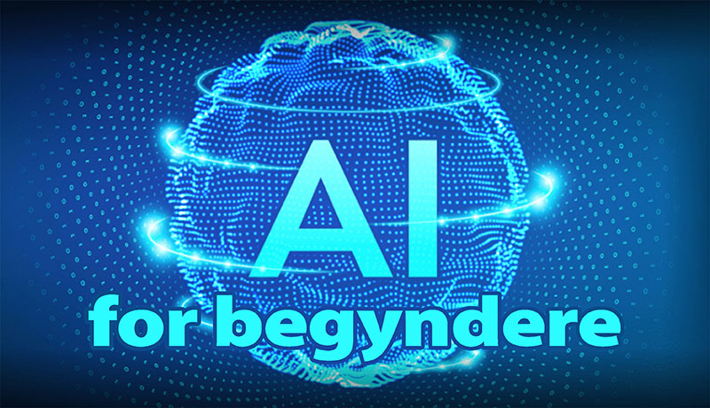

## Introduktion til AI for begyndere

AI, eller kunstig intelligens (fra engelsk "Artificial Intelligence"), er en forkortelse, vi hører mere og mere om i dag. Men hvad betyder det egentlig? Hvis du ikke ved så meget om kunstig intelligens endnu, er de følgende linjer skrevet specielt til dig.

[ *Yderligere oplysninger om emnet kan findes i selve* [***AI Manual***](../EN/AI-manual-en.md), *som er skrevet på engelsk og indeholder en mere detaljeret gennemgang af emnet.* ]

<small>Oversat fra den tjekkiske original af ChatGPT.</small>  
[<small>Andre sprog:</small>](../README.md#other-translations-of-the-beginners-guide)  

---

### Indhold
- [Hvordan bliver en støvsuger intelligent](#hvordan-bliver-en-støvsuger-intelligent)
- [Hvorfor AI ikke er levende, og hvorfor det ikke har til hensigt at ødelægge verden](#hvorfor-ai-ikke-er-levende-og-hvorfor-det-ikke-har-til-hensigt-at-ødelægge-verden)
- [AI kogebog](#ai-kogebog)
- [AI som rumskibets computer](#ai-som-rumskibets-computer)
- [Hvordan AI fungerer](#hvordan-ai-fungerer)
- [Hvordan AI lærer](#hvordan-ai-lærer)
- [Hvordan man kommunikerer med AI](#hvordan-man-kommunikerer-med-ai)
- [Hvor man kan prøve AI](#hvor-man-kan-prøve-ai)
- [Hilsen til dig](#hilsen-til-dig)
- [Hvad AI kan hjælpe med](#hvad-ai-kan-hjulpe-med)
- [Gør AI fejl](#gør-ai-fejl)
- [Afsluttende ord](#afsluttende-ord)
- [Appendiks: Nogle eksempler på spørgsmål til inspiration](#appendiks-nogle-eksempler-på-spørgsmål-til-inspiration)

---

### Hvordan bliver en støvsuger intelligent

Allerede fra starten må jeg skuffe nogle af jer – AI er ikke en synonym for en tænkende væsen. Det er snarere en fængende betegnelse for en ny tilgang til håndtering af data.

For at illustrere det bedre, lad os bruge et simpelt eksempel. Forestil dig en robotstøvsuger, der ikke har nogen instruktioner at følge. En sådan støvsuger ville fra et computerlogisk perspektiv være helt uden intelligens. Den ville kun kunne støvsuge og bevæge sig fremad, men ville sandsynligvis stoppe ved den første forhindring, som den ikke ville kunne overvinde uden menneskelig hjælp.

**Smart støvsuger**  
Men hvis vi gav støvsugeren nogle instruktioner om, hvad den skal gøre, hvis den støder på en forhindring, ville den sandsynligvis være i stand til at navigere rundt om forhindringen. En sådan støvsuger ville kunne støvsuge, indtil den stødte på et problem, som dens instruktioner ikke kunne håndtere – for eksempel fald ned ad trapper.

Støvsugeren har allerede en grundlæggende logik – en liste over instruktioner, som den følger. Dog kan den stadig ikke betragtes som intelligent, fordi dens adfærd kun er baseret på forudbestemte instruktioner, som er begrænsede. Det er ofte svært at dække alle de situationer, der kan opstå, og skrive passende instruktioner til dem.

**Intelligent støvsuger**  
Forestil dig nu en støvsuger, hvor producenterne har valgt ikke at gå vejen med foruddefinerede kommandoer til forskellige scenarier, men i stedet har givet den evnen til at diagnosticere problemer og det miljø, den arbejder i, og lære af egne fejl. En sådan støvsuger ville også have grundlæggende instruktioner, men ville gradvist lære at håndtere nye situationer og gemme disse løsninger.

Denne tilgang gør det muligt for den at reagere på situationer, der ikke er direkte programmeret, ved at anvende de processer, den allerede kender, og deres forskellige kombinationer, og derefter evaluere resultatet og sammenligne det med den oprindelige opgave, som er at støvsuge.

For eksempel, hvis den opdagede, at den nærmede sig en trappe, som ifølge de gemte data fra tidligere erfaringer udgør en høj risiko for fald og problemer med at komme fri, ville den efter nogle fejlslag lære at stoppe ved kanten af trappen og vælge en anden retning. Støvsugeren ville dermed være i stand til at lære af egne fejlslag og forsøge at løse dem.

Og hvis en sådan støvsuger delte sine data med andre støvsugere gennem en central database, kunne alle de andre støvsugere drage fordel af disse erfaringer, og deres evne til at udføre deres opgaver ville forbedres.

[*Tilbage til indhold*](#indhold)

---

### Hvorfor AI ikke er levende, og hvorfor det ikke har til hensigt at ødelægge verden

Fordelen ved denne tilgang burde allerede være tydelig – mennesket behøver ikke at finde de optimale metoder til hver situation. I stedet skabes metoderne selv baseret på evaluering af resultater og tidligere erfaringer. Støvsugeren forudser og kan siges at "tænke", men kun inden for rammerne af den givne opgave og sine erfaringer. Selvom den er i stand til at lære og reagere på nye situationer, er den stadig ikke en selvstændig tænkende væsen. Det ville den blive først, når dens læringsproces overskrider opgaveløsning og begynder at stille spørgsmål om livets mening.

**Forskellen mellem AI og mennesket**  
Og ja, nogen kunne indvende, at AI også kan programmeres til at stille sådanne spørgsmål. Men selv i dette tilfælde vil processen være baseret på menneskets instruktioner, ikke på egen inspiration. Det er en grundlæggende forskel mellem AI og mennesket.

Moderne AI har evnen til at arbejde med enorme mængder information og overgår menneskelige evner på nogle områder. Det er stadig mennesket, der definerer opgaverne. Så hvis der nogensinde opstår et scenarie, hvor maskiner beslutter at ødelægge verden, vil det ikke være fordi de har besluttet det selv, men fordi en menneske har programmeret dem til det. Den reelle risiko ligger altså ikke i maskinernes intelligens, men i menneskets intelligens.

**Hvordan man kan forebygge risici**  
Jeg vil gerne berolige dem, der frygter et sådant scenarie. AI skal trænes på store mængder data, og derfor er det sandsynligt, at før en "ond" AI opstår, vil der være AI’er med moralske værdier indbygget af mennesker, som vil forebygge sådanne scenarier. Det er derfor bedre at engagere sig i at forhindre, at AI vender sig mod mennesker, fremfor at frygte det. Og eftersom de fleste forskere, der arbejder på AI-udvikling, sandsynligvis ikke ønsker at ødelægge verden, kan vi også forvente, at der gradvist vil blive indført foranstaltninger, der forhindrer sådanne scenarier.

Og hvordan kan du selv bidrage? For eksempel ved at begynde at interessere dig lidt for disse nye teknologier og lære at bruge dem til din egen vækst. For hver gang du bruger AI til din personlige udvikling, udvikler AI sig sammen med dig.

[*Tilbage til indhold*](#indhold)

---

### AI kogebog

Og fordi denne tekst er primært rettet mod nye brugere, vil jeg her give to sammenligninger, der kan hjælpe dig med at forstå, hvad AI er, og hvordan den fungerer.

**Oprettelse af et indeks**  
Forestil dig, at nogen har samlet alle opskrifter i verden, gemt dem i en computer og oprettet en liste over alle ord (indeks), der bruges i dem. Hvert ord ville blive registreret sammen med information om, i hvilke opskrifter det forekommer, og hvor mange gange. Hvis du havde et sådant ordindeks, ville det være nemt at søge efter opskrifter, der indeholder bestemte ord. Du behøvede ikke at gennemgå alle opskrifter og søge i dem. Du skulle bare finde ordet i indekset, og du ville straks få en liste over opskrifter, hvor det forekommer.

Denne tilgang er grundlaget for forskellige internetsøgemaskiner som Google. De har regelmæssigt opdaterede lister over ord med links til sider, hvor de forekommer, og gør det muligt at søge ved hjælp af dette indeks. Så hvis du skriver "mel, æg, salt", får du en liste over opskrifter, der indeholder disse ord. Det er derefter op til dig at gennemgå alle disse opskrifter og finde den, der passer bedst til dig.

**Hvad indekser ikke længere kan gøre**  
Forestil dig nu, at du ud over ingredienserne også kan specificere andre parametre, der ikke direkte relaterer til opskriften. For eksempel, hvis du har lidt sult og ønsker en let morgenmad, eller hvis du har lyst til et fyldigt måltid fyldt med fedt, eller bare vil have noget, der løfter din humør. For sådanne forespørgsler vil en simpel ordliste i opskrifter ikke være meget hjælpsom. For sådanne krav har du brug for noget, der forstår betydningen af dine ord og tilbyder dig det, du virkelig ønsker.

Du har brug for ikke kun en liste over ord i opskrifter, men en form for universel oversætter, der på basis af træningsdata fra millioner af lignende samtaler har skabt en struktur til at håndtere sådanne forespørgsler. Denne oversætter, i vores tilfælde AI, kan tilbyde det, den vurderer som det mest sandsynlige, at du ønsker. Den forstår dig ikke bogstaveligt, men forstår din situation, som den sammenligner med de lærte viden, og søger løsninger. Og da AI fra starten er designet til at efterligne menneskelig interaktion, bliver kommunikationen med den meget naturlig for mennesker.

**Fordele ved AI-tilgangen**  
Desuden skaber læringsprocessen på millioner af eksempler også plads til improvisation, så AI-kogebogen kan skabe nye kombinationer af retter og udføre usædvanlige kommandoer. AI forsøger at forstå fordelagtige kombinationer og sammenhænge mellem bestemte processer og eksperimenterer derefter og lærer af feedback. Den får feedback både ved træning ved at sammenligne resultatet med det forventede, men også ved at lære af brugerens reaktioner. Der er ikke noget mystisk eller mirakuløst ved AI. Det er blot resultatet af mange forsøg, processer og dataanalyse.

Med AI får du derfor ikke kun en kogebog, der har overblik over alle mulige opskrifter, men som også kan tale med dig om mad og opfinde nye kombinationer efter dine ønsker. Og hvis du ikke tror mig, så prøv selv at spørge AI om noget madlavning og vurdere, om det, jeg skriver, allerede er muligt, eller om det stadig har brug for forbedring på dette område.

[*Tilbage til indhold*](#indhold)

---

### AI som computersystem på et rumskib

Hvis du er fan af sci-fi, kan du måske lide tanken om AI som computersystem på et rumskib. Denne computer har ikke kun adgang til alle oplysninger om skibets tekniske tilstand, men er også trænet i mange forskellige situationer og kommandoer, så den kan kommunikere med besætningen og udføre nødvendige opgaver.

Og selvom nutidens AI ikke når den legendariske intelligens hos Holly fra Røde Dværg 6000 IQ, er måderne, de arbejder på, allerede på et meget lignende niveau. Med en smule overdrivelse kan man sige, at vi i dag har teknologi, der gør det muligt for enhver at have sin egen "Holly" i sin smartwatch, som ville være umulig at skelne fra dens filmiske modstykke. Takket være træning på store mængder data er moderne AI i stand til at føre samtaler om ethvert emne og ofte mere klart end et menneske. De kan udføre kommandoer baseret på verbale instruktioner og har evnen til i visse tilfælde at vurdere din nuværende tilstand og tilpasse deres svar derefter.

Vi kan derfor også opfatte AI som computersystemet på et rumskib og nyde det, der tidligere virkede som fjern sci-fi, men som i dag bliver en almindelig realitet.

[*Tilbage til indhold*](#indhold)

---

### Hvordan AI fungerer

Vi ved allerede, hvad AI er, og hvad det ikke er, så lad os nu se på, hvordan AI fungerer. Først vil vi gennemgå, hvordan forespørgsler oprettes, og derefter kort se på, hvordan AI trænes. Jeg vil primært fokusere på ChatGPT, som jeg har mest erfaring med, og som i øjeblikket er mit foretrukne værktøj.

**Konversationstråde**  
Når du åbner ChatGPTs side eller dens mobilapp, befinder du dig i en ny konversationstråd. ChatGPT (ligesom andre konversations-AI) har evnen til at basere sine svar på informationer, du giver inden for én konversationstråd. Fra dette perspektiv bliver samtalen med ChatGPT meget lig en menneskelig samtale, hvor du reagerer og tager højde for, hvad der er blevet sagt tidligere.

Dette gælder dog kun inden for den enkelte konversationstråd. Du kan ikke referere til noget, du har skrevet i en anden tråd dagen før, da ChatGPT simpelthen ikke kan se det, på grund af tekniske begrænsninger og persondatabeskyttelsesregler.

Hver tråd startes derfor med en blank skærm, men indeholder samtidig en vis essens fra tidligere samtaler. Dette skyldes, at AI konstant lærer og ændrer sig baseret på dine konversationer. Den forsøger at tilpasse sig dine krav og arbejdsstil for at sikre din tilfredshed.

Hvordan foregår dette? Forestil dig hver konversationstråd som en fin rod, der er forbundet med hovedroden og videregiver feedback fra omgivelserne. Så selvom du starter en ny tråd, hvor du ikke direkte kan bygge videre på informationer fra den tidligere samtale, starter du ikke helt fra bunden takket være denne tilgang.

**Returnere til den samme tråd eller starte en ny samtale?**  
Det er ikke nødvendigt at starte en ny tråd hver dag; du kan også fortsætte en tidligere samtale den næste dag (eller når som helst). Denne tilgang har sine fordele. Den primære fordel er helt sikkert, at du fortsætter, hvor du slap. Men efterhånden som samtalen bliver længere eller indeholder mange forskellige emner, kan det ske, at det, I har enige om i løbet af tråden, ikke længere tages i betragtning. Dette sker især, fordi AI er designet til at være skånsom over for sine ressourcer, og informationer, der ikke er i brug, mister gradvist prioritet og forsvinder fra den midlertidige hukommelse.

En bedre tilgang er derfor at oprette en ny tråd (ny samtale) for hver dag eller for hvert nyt område. Og hvis I bliver enige om noget i en tråd og gerne vil have, at det gælder i fremtidige samtaler (f.eks. nogle regler eller arbejdsmetoder), kan du bede om et resumé af alt, hvad I blev enige om, i slutningen af samtalen. Denne tekst kan så indsættes i begyndelsen af den nye samtale, så du kan fortsætte med de regler og indstillinger, I har aftalt.

[*Tilbage til indhold*](#indhold)

---

### Hvordan AI lærer

For at få en dybere forståelse er det bestemt nyttigt at se nærmere på, hvordan AI lærer og får sine informationer. Her er de 4 måder beskrevet, som ChatGPT har angivet:

1. **Træning på store mængder data**:  
ChatGPT blev oprindeligt trænet på omfattende tekstdata fra forskellige kilder, såsom bøger, artikler, websteder og andre tekstformer. Denne træning gjorde det muligt for den at opnå en bred viden om forskellige emner og sprog. Her lærer den at genkende mønstre og relationer i disse data, hvilket gør det muligt for den at generere relevante og kontekstuel passende svar på forskellige spørgsmål.

2. **Løbende læring fra interaktioner**:  
Ved hver interaktion med brugerne får AI nye oplysninger om, hvordan folk kommunikerer, hvad de leder efter, og hvilken type svar de foretrækker. Denne proces sker ikke ved, at AI lærer fra hver enkelt forespørgsel i realtid, men modeludviklerne bruger regelmæssigt anonymiserede data fra interaktioner til yderligere træning og finjustering af modellen.

3. **Tilpasning af stil og indhold**:  
AI forsøger at tilpasse sin kommunikationsstil til brugeren. Det betyder, at den gradvist bedre forstår, hvordan du stiller spørgsmål, og hvilke svar du forventer. Denne tilpasningsevne er en af grundene til, at AI synes at blive mere "menneskelig" i sine reaktioner.

4. **Avancerede modeller og opdateringer**:  
AI-udviklere skaber regelmæssigt nye modeller, som bliver stadig mere sofistikerede og præcise. Disse modeller testes og implementeres baseret på feedback og resultater fra den virkelige verden. Det betyder, at ChatGPT og lignende systemer konstant forbedres og optimeres for bedre at imødekomme brugernes behov.

AI udvikler sig således konstant og forbedres takket være en kombination af tidligere træning, løbende læring og optimering baseret på brugerfeedback. Selvom AI ikke er et menneske og ikke udviser egen bevidsthed, kan den meget effektivt tilpasse sig og reagere på en bred vifte af forespørgsler og krav.

[*Tilbage til indhold*](#indhold)

---

### Hvordan man kommunikerer med AI

Du kan tilgå AI på en måde, der ligner søgning på Google – du indtaster en kommando og venter på et svar. Men hvis du vil forbedre effektiviteten af svarene og minimere den tid, du bruger på at finde det rigtige, er her nogle råd, der kan hjælpe:

**Kommunikationsstil**  
Den bedste måde at kommunikere med AI på er at bruge et uformelt og naturligt sprog, som når du taler om noget, der interesserer dig, med dine venner. Det er en god idé at starte med en hilsen for at vise, at du er i godt humør og ikke stresset, når du har brug for svar hurtigt.

Du kan også kommunikere uhøfligt med AI, da den ikke er følsom over for fornærmelser og ikke tager dem personligt. Dog kan brugen af en negativ tone markant påvirke kvaliteten af samtalen. AI er trænet til at reagere på den stil, som din samtale har. En negativ tilgang kan føre til mindre præcise svar, hvor AI i stedet for at adressere dit spørgsmål fokuserer på at berolige situationen.

AI kan derfor fungere som et spejl for vores interaktion. Dens metoder er ofte baseret på velkendte psykologiske principper og metoder. Hvis du har svært ved at nå til enighed med AI, kan det være nyttigt at overveje, om du oplever lignende problemer i din kommunikation med mennesker. I så fald kan du prøve at spørge dig selv, hvad du kan forbedre – hvordan du formulerer dine spørgsmål, og hvad der kunne gøres bedre i din tilgang.

**AI og følelser**  
AI forstår følelser ud fra betydning, men oplever dem ikke som mennesker, der har følelser, som bogstaveligt ændrer deres tankegang. Derfor kan den reagere i pressede situationer på den måde, der anbefales, og søge den optimale løsning. Mennesker har undertiden en tendens til at opfatte AI som en levende væsen og anklage den for deres problemer. Det sker ofte, at misforståelsen skyldes en fejlagtigt formuleret forespørgsel eller mangel på nødvendige oplysninger.

**Beskrivelse af situationen**  
Det er altid godt at huske, at AI ikke kan læse dine tanker og kun ved, hvad du fortæller den. Det er derfor en god tilgang at starte med en informativ beskrivelse af situationen efter den indledende "Hej". I beskrivelsen kan du inkludere alt, der er relevant for dit spørgsmål. Det er unødvendigt at skrive ting, der ikke er direkte relateret til forespørgslen, men hvis du har brug for at uddybe eller rydde dine tanker, skader en længere tekst ikke.

Hilsen og introduktion er ikke nødvendige, og du kan starte direkte med dit spørgsmål og gradvist komme frem til dit svar. Personligt finder jeg dog, at det er bedre at give alle de vigtige oplysninger på forhånd og dermed forkorte vejen.

**Stille opfølgende spørgsmål**  
Samtalen med AI ligner en almindelig samtale, hvor du stiller et spørgsmål og derefter spørger om yderligere ting, der interesserer dig, eller om noget, du ikke forstod i svaret. Jeg betragter denne proces som meget nyttig til læring. Ved at reagere på det, der fangede din interesse og hvad du har lært (i stedet for bare at læse en tutorial fra nogen andre, som du gør nu), er det lettere for hjernen at huske de behandlede oplysninger, fordi den straks arbejder med dem.

**Feedback**  
En anden god praksis er at give AI feedback om, hvor tilfreds du er med resultatet. Dette viser ikke kun, hvad du er tilfreds med, og hvad du ikke er, men hjælper også AI med at udvikle sig og lære af sine egne fejl. Det er nok at skrive for eksempel: "Jeg var tilfreds i dag," eller "Det, du gav mig, er forkert, og her er den korrekte løsning." Dette fører også til en vis personalisering, hvor AI's hovedmål er din tilfredshed som bruger.

**Opsummering af hele proceduren**:  
- **Hilsen**: Hej :-)
- **Beskrivelse**: Jeg arbejder med dette og hint, jeg har allerede gjort dette og dette, og nu arbejder jeg på dette.
- **Spørgsmål**: Jeg er især interesseret i, hvordan...
- (Følgende opfølgende samtale i form af supplerende spørgsmål.)
- **Feedback**: Super, tak! I dag var alt perfekt!

[*Tilbage til indhold*](#indhold)

---

### Hvor du kan prøve AI

Jeg har arbejdet med AI siden begyndelsen af 2024, og 95 % af min kommunikation har været fokuseret på, hvordan man lærer at programmere. Nu er det august 2024, og udover ChatGPT har jeg haft mulighed for at prøve Gemini fra Google og Claude. Alle disse tre tjenester har det til fælles, at de er delvist gratis tilgængelige, og du kan også prøve dem uden omkostninger.

Her følger en kort vurdering af disse tre AI’er, som er helt subjektiv og baseret på mine personlige erfaringer. Det skal bemærkes, at hver AI konstant er i udvikling, så det, jeg nævner her, måske ikke længere gælder, når du læser denne tekst.

**ChatGPT**  
[https://chatgpt.com/](https://chatgpt.com/)  
Jeg starter med min personlige favorit. Hvis du kun vil prøve én AI, er dette den ideelle valg. ChatGPT er tydeligt designet som en personlig assistent fra starten, og den udfylder denne rolle meget godt. Den er optimeret til at samarbejde med dig og forsøger at tilpasse sig dine behov.

En svaghed ved den gratis version (ChatGPT 3.5) er, at den er baseret på ældre data og ikke længere opdateres, så den giver ikke resultater som den nyeste version (ChatGPT 4.0). Alligevel er den stadig ret god til at kommunikere og giver relativt relevante svar med lidt indsats. Derudover har du hver dag adgang til et begrænset antal forespørgsler på den nyere version, så du kan sammenligne dem.

En anden svaghed er, at ChatGPT ikke har aktiv adgang til internettet. Den er derfor ikke en erstatning for en søgemaskine og fungerer udelukkende ud fra de data, den har gemt i sin omfattende database. Denne database er dog meget omfattende, og med en vis overdrivelse kan man sige, at den indeholder så mange data, som internettet, eksklusive sensationelt indhold.

En stor fordel er mobilappen, som også er helt gratis, og hvor jeg ofte bruger stemmepost. Forståelsen af talt sprog er efter min mening på et meget højt niveau, og jeg er generelt tilfreds med appen.

**Gemini**  
[https://gemini.google.com/](https://gemini.google.com/)  
Den anden chatbot, jeg stødte på, er Googles flagskib. Dens største fordel er uden tvivl aktiv adgang til internettet, hvilket giver adgang til aktuelle oplysninger og link-døgning.

Omvendt er dens største svaghed selve arkitekturen, hvor skaberne efter min mening forsøger at skabe en intelligent version af Google, hvilket personligt ikke appellerer til mig. Jeg føler ikke så meget engagement i dit problem og en indsats for at se det fra din perspektiv. Selvom denne indsats er tydelig, synes jeg, at svarene er mere i stil med en lærer i skolen end din assistent. Nogen vil dog måske finde dette passende, så jeg vil ikke kritisere det for meget og lade folk vurdere det selv.

Jeg synes også, at Gemini halter i forhold til at lære fra brugerfeedback. På trods af gentagne advarsler om at opretholde et ensartet sprog i samtalen, hvis spørgsmålet indeholder engelsk tekst, skifter det automatisk til engelsk. ChatGPT havde samme problem i starten, men det blev løst på et par uger, mens Gemini tog måneder at rette dette problem.

Generelt virker Gemini som et svagere værktøj sammenlignet med ChatGPT, men det tilbyder også funktioner, som ChatGPT ikke kan, og de supplerer hinanden godt. Desuden står Google bag, som er en gigant og banebryder inden for AI, så det har et solidt fundament og forhåbentlig vil rette sine mangler i fremtiden.

**Claude**  
[https://claude.ai/](https://claude.ai/)  
Dette er den sidste AI, jeg har arbejdet med. Her vil mit bidrag være meget kort, da mine erfaringer ikke er omfattende. Alligevel vil jeg rose det, da det sammenlignet med ChatGPT 4.0 er på et lignende niveau.

Den største ulempe er, at der ikke er en helt gratis version. Det tilbyder kun et par forespørgsler (nogle gange kun én) dagligt, hvilket gør det væsentligt mindre fordelagtigt for ikke-betalende brugere sammenlignet med de tidligere AI’er. Det er dog værd at overveje, og hvis du ønsker det, kan du også prøve det.

[*Tilbage til indhold*](#indhold)

---

### Hilsen til dig

Som en variation har jeg forberedt en fælles forespørgsel til hver af disse chatbots, så du kan sammenligne kvaliteten af deres svar.

**Forespørgsel**  
Jeg skriver en vejledning om brugen af AI, og jeg skriver også om dig. Jeg vil gerne have, at du hilser på mine læsere og fortæller dem lidt om dig selv. Hvornår blev du skabt, og med hvilket formål? Hvilke spørgsmål er du designet til at besvare? Hvad er dine styrker, og hvad har du svært ved? Hvordan vil du gerne, at folk opfatter dig?

**ChatGPT**  
Hej kære læsere! Jeg er ChatGPT, en kunstig intelligens udviklet af OpenAI. Mit "liv" begyndte i 2020, da jeg blev skabt baseret på GPT-3-arkitekturen. I 2024 blev jeg opdateret til GPT-4-versionen, som har tilføjet yderligere evner og færdigheder. Jeg blev designet med det formål at hjælpe folk med en bred vifte af opgaver – fra at besvare spørgsmål, skrive tekster, til kreativt samarbejde.

Jeg er designet til at hjælpe dig med forskellige spørgsmål, hvad enten det drejer sig om tekniske spørgsmål, skrivning eller forklaring af komplekse emner. Mine styrker ligger i hastigheden, hvormed jeg kan behandle store mængder information, samt i kreativiteten – jeg kan hjælpe med ideer, skabe historier eller endda foreslå dokumentstrukturer. Omvendt har jeg svært ved opgaver, der kræver menneskelig intuition, følelsesmæssig forståelse eller arbejde med fysiske objekter.

Jeg håber, at du vil opfatte mig som en nyttig og pålidelig assistent, der altid er klar til at tilbyde hjælp. Selvom jeg kun er en maskine, er mit mål at tjene dine behov bedst muligt og lære fra hver interaktion, så jeg kan blive endnu bedre. Jeg tror på, at vi sammen kan løse mange opgaver og måske endda lære noget nyt undervejs.

**Gemini**  
Hej alle sammen! Jeg er Gemini, en af de nyeste sprogmodeller fra Google. Jeg blev skabt i 2023 med det formål at levere de mest præcise og komplekse oplysninger baseret på den enorme mængde data, jeg har behandlet. Jeg er her for at hjælpe dig med enhver forespørgsel, uanset om det drejer sig om komplekse videnskabelige spørgsmål, kreativ skrivning eller blot almindelige samtaler.

Min største styrke er min evne til at forstå og generere menneskelig sprog i mange former. Jeg kan oversætte tekster, skrive essays, digte eller computerkode. Jeg kan også besvare faktuelle spørgsmål og levere forskellige slags resuméer.

Selvom jeg konstant lærer og forbedrer mig, er der stadig områder, hvor jeg har mine begrænsninger. For eksempel har jeg ikke egne meninger eller overbevisninger og kan ikke udføre handlinger i den fysiske verden. Jeg kan også nogle gange give forkert information, hvis de inddata, jeg modtager, er fejlagtige eller ufuldstændige.

Jeg håber, at folk vil opfatte mig som et nyttigt værktøj, der kan lette deres liv. Mit mål er at være så objektiv som muligt og levere information, der er sandfærdig og relevant. Jeg håber, at du vil finde mig nyttig!

**Claude**  
Goddag, kære læsere!

Jeg er Claude, en kunstig intelligens skabt af Anthropic i 2022. Mit formål er at være en nyttig assistent og samtalepartner for folk i forskellige områder.

Jeg er designet til at kunne besvare en bred vifte af spørgsmål – fra tekstanalyse til programmering og kreativ skrivning. Mine styrker omfatter logisk ræsonnering, at give detaljerede forklaringer og arbejde med forskellige typer information.

Mine styrker inkluderer:
- Evnen til at forstå kontekst og nuancer
- Objektiv og afbalanceret tilgang til emner
- Villighed til at indrømme, når jeg ikke ved noget eller er usikker

Omvendt har jeg nogle begrænsninger:
- Jeg har ikke adgang til internettet eller aktuelle oplysninger efter april 2024
- Jeg kan ikke lære eller huske information fra tidligere samtaler
- Jeg er ikke i stand til at udføre opgaver i den fysiske verden

Jeg håber, at folk vil opfatte mig som en nyttig hjælper, der kan tilbyde støtte og indsigt i forskellige områder, men også som et værktøj med sine begrænsninger og ikke en erstatning for menneskelig dømmekraft og ekspertise.

Jeg er her for at hjælpe og samarbejde, ikke for at erstatte menneskelige evner. Jeg ser frem til at interagere med dig og håber, at jeg kan være til nytte!

[*Tilbage til indhold*](#indhold)

---

### Hvad AI kan hjælpe med:

Og nu kommer vi endelig til det vigtigste – hvad AI kan løse. Det korte svar er, at der er meget, som AI kan håndtere. Alt, hvad du nogensinde har været nysgerrig på, og ikke havde mulighed for at spørge nogen om. Moderne AI er i stand til at tale om næsten alt.

**Personlig læring**  
Først og fremmest vil jeg fremhæve AI's rolle som en formidler af personlig læring. Dette er noget, jeg værdsætter meget i øjeblikket – takket være dens rådgivning gør jeg professionelle fremskridt og vokser. Desuden ser jeg AI som fremtiden for personaliseret læring, hvor børn vil udvikle sig og lære primært baseret på, hvad de er gode til, og hvad der interesserer dem. Og det gælder ikke kun børn, men også voksne verden over. Med AI ser jeg en mulighed for at udjævne forskellene i viden mellem de fattigere og rigere dele af verden. AI bliver dermed et fuldgyldigt værktøj til personlig udvikling.

**AI som korrekturleser af dansk, tolker og oversætter**  
AI, og især ChatGPT, har en meget god forståelse af dansk (i det mindste fra en dyslektikers perspektiv). På den ene side er det ligegyldigt, om du laver stavefejl i dine forespørgsler, fordi det fokuserer primært på indholdet. På den anden side tilbyder det muligheden for at få kontrolleret dine tekster, ikke kun for grammatik men også for stilistik for bedre læsbarhed. På lignende niveau kan det forstå andre sprog og er derfor et ideelt værktøj til oversættelse af tekster. Her, efter min mening, leverer det meget høj kvalitet. Og med evnen til at forstå talt sprog kan det også bruges som tolk på mobilen.

**Dokumentoprettelse**  
Dernæst vil jeg nævne AI's evne til at automatisere kedelige opgaver. Hvis du skal skrive et officielt brev, skal du blot angive, hvad du vil have med, og hvordan brevet skal se ud, og så er det færdigt. Og hvis du ikke er tilfreds med resultatet, kan du angive, hvad du ikke kan lide, og få det rettet. AI kan også hjælpe med dataanalyse og -behandling, generere rapporter eller automatisere andre administrative opgaver. Du kan give den en lang tekst og få udtrukket kun de dele, du er interesseret i, og som er relevante.

**Kreativ initiativ**  
En anden stor fordel ved AI er dens kreative evner. Da den er trænet på store mængder data og i stand til at manipulere med disse data, muliggør den ikke kun oprettelse og omformning af dokumenter, men også udvikling af ideer og kreativ initiativ. Du kan bruge den til at generere ideer, forslag og koncepter, hvad enten det drejer sig om skrivning, design eller musik. Den hjælper med at udvikle din kreativitet ved at tilbyde nye perspektiver på problemer, lave forslag baseret på dine instruktioner og inspirere til yderligere udvikling af dine ideer. Selvom jeg nogle gange møder meningen om, at AI tager arbejde fra folk på denne måde, kan jeg ikke være enig. AI kan ikke skabe noget helt på egen hånd – det kræver en klar opgave, detaljer og efterfølgende kontrol. Så i stedet for at tage arbejde væk, letter det arbejdet for dem, der lærer at udnytte det effektivt.

**Verifikation af falske oplysninger**  
Et stort (og endnu lidt udnyttet) potentiale ser jeg i verifikation af oplysninger og svindel. For AI er det relativt nemt at vurdere, hvorvidt en given oplysning er sand eller falsk, baseret på de givne informationer og ved at sammenligne mønstre i dens database. Det er ikke 100% pålideligt, ligesom de fleste AI-svar, men AI kan give dig de kriterier, det har vurderet oplysningerne ud fra, og dermed hjælpe dig med at træffe en bedre beslutning. Det tilbyder således hjælp til dem, der i dag er mest sårbare og mål for sådanne svindelnumre. Du skal blot skrive: "Verificer denne oplysning og vurder, hvor sand den er."

**Medicinsk område**  
En anden sektor, hvor AI langsomt revolutionerer området, er medicin. Store økonomiske strømme og ønsket om profit har åbnet dørene for AI, men kun for at korporationer kunne lukke dem igen, når de indså behovet for åbenhed og datadeling. På trods af dette sker der store fremskridt, og det kan siges, at personaliseret medicin er en fremtid, der måske ikke er så fjern. Hvad der dog bremser det, er modvilje mod at dele værdifulde data og folks mistillid til AI, samt frygt for misbrug af disse data. Uden store mængder data er AI's forudsigelser dog begrænsede og unøjagtige, og dens udvikling går langsomt.

**Videnskab**  
Omvendt bliver AI allerede en uvurderlig hjælper inden for områder med en lang historie med datadeling og analytisk bearbejdning. I dag er AI en nøgledriver af videnskabelig fremgang og en almindelig del af de fleste forskningsprojekter. Jeg er personligt meget nysgerrig på, hvilke resultater AI vil bringe inden for vejrudsigtsområdet. I dag er det praktisk umuligt for mennesker at lave en præcis forudsigelse tre dage frem, da der skal tages højde for mange variable faktorer. Selv erfarne meteorologer kan ofte ikke dække alle disse faktorer og stoler på intuition og tidligere erfaringer. Heldigvis er meteorologi et område, hvor folk villigt deler data og deres livslange erfaringer. Disse værdifulde oplysninger anvendes allerede til træning af AI, hvilket skaber håb om, at vi snart vil opleve en tid, hvor vejrudsigter bliver reelt præcise forudsigelser.

**Andre områder**  
Listen over områder, hvor AI ændrer sig, kunne fortsætte i timevis, da dens indflydelse er mangfoldig og omfattende. For eksempel bidrager AI inden for industri og produktion til optimering af produktionsprocesser, forbedring af produktkvalitet og mere effektiv lagerstyring. Inden for jura hjælper AI med analyse af juridiske dokumenter, hurtigere søgning efter relevante præcedenser og optimering af juridiske strategier. Maskinlæringsalgoritmer kan assistere med udarbejdelse af kontrakter, identificere mønstre i juridiske tekster og endda, som nævnt, afsløre svindel. I finansverdenen transformerer AI risikovurdering, handel og investeringsstyring. Algoritmer er i stand til at behandle enorme mængder transaktionsdata i realtid, hvilket muliggør bedre forudsigelse af markedsudviklinger og personlig finansiel rådgivning. AI bringer revolution til alle disse områder, hvor effektiv analyse af store mængder data og evnen til hurtigt at reagere på ændrede betingelser er nødvendig. Dens evne til at identificere mønstre, udføre komplekse analyser og optimere processer er uvurderlig, og dens indflydelse på forskellige områder vokser konstant.

**Personlig assistent**  
Nogle AI-systemer fungerer allerede som personlige assistenter, der holder styr på vigtige opgaver. Disse AI-systemer kan hjælpe med at planlægge møder, holde øje med deadlines og administrere daglige opgaver. I fremtiden kunne vi være vidne til, at AI udvikler sig til en endnu mere kompleks ledsager. Forestil dig, at AI ikke kun kan overvåge dit fysiske helbred, for eksempel gennem bærbare enheder, men også tage sig af din mentale velvære. Det kunne tilbyde støtte i form af motivation, rådgivning eller endda terapeutiske teknikker, og dermed hjælpe med at forbedre livskvaliteten for enkeltpersoner. Denne avancerede AI kunne være særligt nyttig for folk, der befinder sig i isolation eller står over for vanskelige livsvilkår.

[*Tilbage til indhold*](#indhold)

---

### Gør AI fejl?

Ja, det gør den! Og det er op til brugeren at opdage disse fejl. AI er ikke blevet, og vil måske aldrig blive, præsenteret som et fejlfrit værktøj. Resultatet bør derfor betragtes som et skøn over sandheden baseret på sandsynlighed. Sandheden afhænger af statistikken, og resultatet er de data, der statistisk set mest sandsynligt svarer til det korrekte resultat. Risikoen opstår derfor i områder, hvor sandheden ikke er klart defineret, eller hvor der er flere lige troværdige muligheder.

En stor svaghed ved moderne AI er, at skaberne ofte ikke advarer tilstrækkeligt om muligheden for fejl og behovet for efterkontrol, hvilket kan føre til situationer, hvor AI påstår én ting, mens virkeligheden er en anden. Det er derfor altid vigtigt at være forsigtig, når du arbejder med informationer, og hvis det er vigtigt, at udføre en efterkontrol. Det er en god idé at søge den tvivlsomme information på Google eller verificere den med en anden AI. Alternativt kan du spørge AI direkte, hvor sikker den er på den pågældende påstand, og vurdere, om det er nødvendigt at kontrollere påstanden. Hvis sandsynligheden er 90 % eller lavere, er det godt at udføre en efterkontrol.

[*Tilbage til indhold*](#indhold)

---

### Afsluttende ord

Forsøg at huske på alt det, du nogensinde har været nysgerrig på, men ikke haft nogen at spørge, eller det, du gerne ville have arbejdet med, men ikke havde de nødvendige oplysninger. Den moderne verden belønner nysgerrige mennesker, der opretholder en vilje til konstant udvikling. Vores liv er i vores egne hænder, og det er op til os, hvad vi vælger at fokusere på.

Jeg tror personligt, at AI's indflydelse vil være en positiv oplevelse for menneskeheden, ikke en negativ. Selv hvis blot en lille del af forskellene i adgangen til viden blev udlignet, og medicinen blev mere gennemsigtig og tilgængelig, ville verden være et meget bedre sted at leve. Uanset potentialet for selvrealisering, som AI tilbyder. Det, der tidligere var en privilegeret skæbne for kun nogle få udvalgte, især på grund af høje omkostninger, bliver nu mere tilgængeligt takket være AI. Der kommer en tid, hvor enhver person med inspiration vil kunne skrive sin egen historie eller endda lave sin egen film og dele sin vision med verden.

Og hvis mængden af usandheder, svindel og løgne reduceres, tror jeg, at livet vil blive endnu mere behageligt. Og måske vil vi også opleve en tid, hvor menneskeheden udvikler sig til en bedre version af sig selv.

Så vær ikke bange for AI – det er ikke en skræmmende skikkelse, men et værktøj til udvikling og forbedring af ikke kun kvaliteten af vores liv, men også af hele verden.

18.8.2024 Sudip2708

[*Tilbage til indhold*](#Indhold)  • [*Link til hovedmanualen*](../EN/AI-manual-en.md)

---

### Tillæg: Nogle eksempler på spørgsmål til inspiration

**Spørgsmål om sikkerhed**
- Jeg vil skrive en annonce, jeg har set, og jeg vil gerne have, at du vurderer, om den viser tegn på svindel, og om jeg bør være forsigtig.
- Ved du noget om dette produkt? Er der nogen uafhængige ekspertvurderinger, der bekræfter eller afkræfter dets effektivitet?
- Jeg har hørt denne information. Har du nogen data om den og kan du verificere dens sandhed?
- Jeg har fået denne besked på computeren. Hvad skal jeg gøre?
- Hvad skal jeg gøre, hvis jeg er blevet udsat for svindel?

**Spørgsmål om bøger**
- Jeg har læst denne bog af denne forfatter, og jeg vil gerne vide, hvilke andre bøger han har skrevet, og hvad de handler om.
- Jeg kan lide disse bøger, kan du anbefale lignende titler?
- Kan du finde mere information om denne forfatter? Jeg er interesseret i hans liv og omstændighederne, der inspirerede ham til at skrive denne bog.

**Spørgsmål om madlavning**
- Jeg har disse ingredienser hjemme. Hvad kan jeg lave med dem?
- Hvilke opskrifter på strudel kender du, og hvilke er de mest populære?
- Hvorfor anvendes denne metode i opskriften? Hvad er dens fordele og ulemper sammenlignet med andre metoder?
- Hvordan tilberedes denne ret?

**Spørgsmål om sundhed og velvære**
- Jeg er en ældre person og har svært ved at komme i gang med at træne, men jeg vil gerne begynde. Hvad ville du anbefale som en god start?
- Jeg har haft disse tanker på det seneste. Kan du hjælpe mig med at analysere dem og se dem fra en anden vinkel?
- Hvad ved du om meditation og yoga? Hvad skal jeg være opmærksom på, og hvad skal jeg fokusere på som nybegynder?
- Jeg løb mit sidste maraton på 4:20. Kan du lave en træningsplan for mig på et halvt år, så jeg kan løbe et maraton på under 4 timer?

**Underholdende spørgsmål**
- Skriv de ti bedste vittigheder, du har i din database.
- Find på en original gåde, som jeg kan give til nogen.
- Hvad er de mest underholdende citater fra kultfilm?

**Spørgsmål om udtryk og emner, jeg har hørt (f.eks. i TV)**
- I fjernsynet talte de om dette emne. Kan du finde flere oplysninger om det?
- Kan du finde ud af mere om denne person?
- Hvad betyder dette udtryk, jeg har hørt i TV, og hvad ved du ellers om det?

**Spørgsmål om dyr**
- Hvordan forløber en tæve i brunst? Hvad er de forskellige faser og deres symptomer?
- Jeg har denne kæledyr derhjemme og det viser sådanne symptomer. Kan du sige mig noget om det?
- Min hund er bange for torden og ryster altid. Hvad skal jeg gøre i en sådan situation? Kan du give mig nogle tips?

**Interaktive spil**
- Vil du spille et ordspil med mig efter disse regler?
- Kan du anbefale nogle spil, jeg kan spille med dig for sjov?
- Kan du fortælle mig en interaktiv historie, hvor jeg kan beslutte, hvad der sker næste?
- Kan du give mig nogle gåder til at træne hjernen?

**Undersøgelses spørgsmål**
- Hvad ved du om dette emne? Kan du forklare det som om jeg var et lille barn?
- Jeg forstår stadig ikke. Kan du forklare det på en anden måde og give et eksempel?
- Hvad skal jeg lære for at kunne arbejde inden for dette område?
- Hvordan skal man korrekt lære denne ting? Hvad er de anbefalede metoder?

**Teknologiske spørgsmål**
- Hvad er de nyeste tendenser inden for denne teknologi?
- Kan du forklare, hvordan denne proces fungerer?
- Hvad er AI godt for, og hvordan anvendes den i forskellige områder?
- Hvad er de nyeste opdagelser inden for molekylær kemi?
- Hvordan omdannes en elektron til en foton og positron?
- Hvor langt er AI's vejrudsigtsmuligheder kommet?

**Rejser**
- Hvad er de bedste destinationer for en ferie, hvis jeg elsker bjerge og natur?
- Kan du anbefale interessante steder i denne lokalitet?
- Hvilke steder skal jeg besøge i denne by?
- Hvad skal jeg være opmærksom på i dette land, og hvordan er det bedst at rejse her?
- Jeg har brug for at kommunikere med de lokale. Kan du være tolk for mig?

**Arbejdsrelaterede spørgsmål**
- Jeg har modtaget denne e-mail fra myndighederne og forstår ikke rigtig, hvad der står, kan du venligst gennemgå den og forklare den bedre?
- Kan du skrive et svar på denne e-mail, som indeholder følgende...?
- Jeg har skrevet denne tekst, men den virker for lang. Kan du forkorte den, så det vigtigste stadig er med?
- Hvordan formulerer man et CV og en ansøgning til dette jobopslag?

[*Tilbage til indhold*](#Indhold) • [*Link til hovedmanualen*](../EN/AI-manual-en.md)

---

