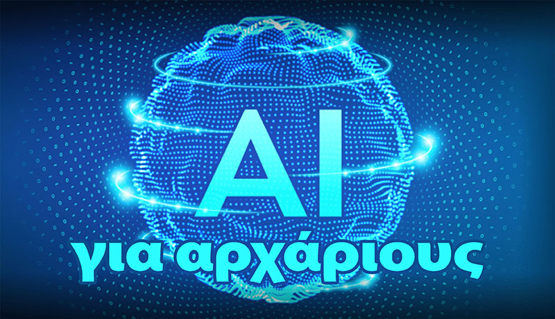

## Εισαγωγή στην Τεχνητή Νοημοσύνη για Αρχάριους

Η Τεχνητή Νοημοσύνη (ή AI από τα αγγλικά "Artificial Intelligence") είναι ένας όρος που ακούμε όλο και πιο συχνά σήμερα. Αλλά τι σημαίνει πραγματικά; Εάν δεν γνωρίζετε πολλά για την τεχνητή νοημοσύνη, οι επόμενες γραμμές είναι ακριβώς για εσάς.

[ *Περισσότερες πληροφορίες για το θέμα μπορείτε να βρείτε στο* [***AI Manual***](../EN/AI-manual-en.md), *που είναι γραμμένο στα αγγλικά και περιλαμβάνει μια πιο αναλυτική ανάλυση του θέματος.* ]

<small>Μετάφραση από το πρωτότυπο στα Τσεχικά από το ChatGPT.</small>  
[<small>Άλλες γλώσσες:</small>](../README.md#other-translations-of-the-beginners-guide)  

---

### Περιεχόμενα
- [Πώς γίνεται μια ηλεκτρική σκούπα έξυπνη](#πώς-γίνεται-μια-ηλεκτρική-σκούπα-έξυπνη)
- [Γιατί η AI δεν είναι ζωντανή και γιατί δεν επιθυμεί να καταστρέψει τον κόσμο](#γιατί-η-ai-δεν-είναι-ζωντανή-και-γιατί-δεν-επιθυμεί-να-καταστρέψει-τον-κόσμο)
- [Συνταγές AI](#συνταγές-ai)
- [Η AI ως υπολογιστής διαστημικού σκάφους](#η-ai-ως-υπολογιστής-διαστημικού-σκάφους)
- [Πώς λειτουργεί η AI](#πώς-λειτουργεί-η-ai)
- [Πώς μαθαίνει η AI](#πώς-μαθαίνει-η-ai)
- [Πώς να επικοινωνείτε με την AI](#πώς-να-επικοινωνείτε-με-την-ai)
- [Πού να δοκιμάσετε την AI](#πού-να-δοκιμάσετε-την-ai)
- [Χαιρετισμός για εσάς](#χαιρετισμός-για-εσάς)
- [Με τι μπορεί να βοηθήσει η AI](#με-τι-μπορεί-να-βοηθήσει-η-ai)
- [Κάνει η AI λάθη](#κάνει-η-ai-λάθη)
- [Λόγος προς το τέλος](#λόγος-προς-το-τέλος)
- [Παράρτημα: Μερικά παραδείγματα ερωτήσεων για έμπνευση](#παράρτημα-μερικά-παραδείγματα-ερωτήσεων-για-έμπνευση)

---

### Πώς γίνεται μια ηλεκτρική σκούπα έξυπνη

Αρχικά, πρέπει να απογοητεύσω μερικούς – η AI δεν είναι συνώνυμο της σκεπτόμενης οντότητας. Είναι μάλλον ένας εντυπωσιακός τίτλος για μια νέα προσέγγιση στη διαχείριση των δεδομένων.

Για να το κατανοήσουμε καλύτερα, ας χρησιμοποιήσουμε ένα απλό παράδειγμα. Φανταστείτε μια ρομποτική σκούπα που δεν έχει καμία οδηγία για να ακολουθήσει. Μια τέτοια σκούπα θα ήταν εντελώς χωρίς νοημοσύνη από την άποψη της υπολογιστικής λογικής. Θα μπορούσε μόνο να σκουπίζει και να προχωράει προς τα εμπρός, αλλά πιθανότατα θα σταματούσε μπροστά στην πρώτη εμπόδια που δεν θα μπορούσε να ξεπεράσει χωρίς ανθρώπινη παρέμβαση.

**Εξυπνη σκούπα**  
Αν, ωστόσο, δίναμε στη σκούπα κάποιες οδηγίες για το τι να κάνει σε περίπτωση που συναντήσει ένα εμπόδιο, είναι πιθανό ότι θα γύριζε γύρω από το εμπόδιο. Αυτή η σκούπα θα μπορούσε να σκουπίζει μέχρι να συναντήσει ένα πρόβλημα για το οποίο οι οδηγίες της δεν είναι επαρκείς – για παράδειγμα, πτώση από σκάλες.

Η σκούπα περιέχει ήδη κάποια βασική λογική – μια λίστα εντολών που ακολουθεί. Ωστόσο, δεν μπορεί ακόμα να θεωρηθεί έξυπνη, επειδή η συμπεριφορά της βασίζεται μόνο σε προκαθορισμένες εντολές, οι οποίες είναι περιορισμένες. Συχνά είναι δύσκολο να καλυφθούν όλες οι καταστάσεις που μπορεί να προκύψουν και να γραφούν οι κατάλληλες οδηγίες.

**Ευφυής σκούπα**  
Τώρα φανταστείτε μια σκούπα, για την οποία οι κατασκευαστές αποφάσισαν να μην ακολουθήσουν τον δρόμο των προκαθορισμένων εντολών για διάφορα σενάρια, αλλά αντί αυτού της έδωσαν την ικανότητα να διαγνώσκει προβλήματα και το περιβάλλον στο οποίο εργάζεται, και να μαθαίνει από τα δικά της λάθη. Αυτή η σκούπα θα είχε επίσης βασικές οδηγίες, αλλά σταδιακά θα μάθαινε πώς να αντιμετωπίζει και νέες καταστάσεις, και θα αποθήκευε αυτές τις λύσεις.

Αυτή η προσέγγιση της επιτρέπει να αντιδρά σε καταστάσεις που δεν είναι άμεσα προγραμματισμένες, δοκιμάζοντας διαδικασίες που ήδη γνωρίζει και διάφορους συνδυασμούς τους, και στη συνέχεια να αξιολογεί και να συγκρίνει το αποτέλεσμα με την αρχική εντολή, που είναι να σκουπίζει.

Για παράδειγμα, αν διαπιστώσει ότι πλησιάζει σε σκαλοπάτι που σύμφωνα με τα αποθηκευμένα δεδομένα από προηγούμενες εμπειρίες αντιπροσωπεύει υψηλό κίνδυνο πτώσης και αδυναμίας απελευθέρωσης, μετά από αρκετές αποτυχίες θα μάθει να σταματά στην άκρη του σκαλοπατιού και να κατευθύνεται σε άλλη κατεύθυνση. Έτσι, η σκούπα θα μπορούσε να μάθει από τις δικές της αποτυχίες και να προσπαθήσει να τις επιλύσει.

Και αν αυτή η σκούπα μοιραζόταν τα δεδομένα της με άλλες σκούπες μέσω μιας κεντρικής βάσης δεδομένων, τότε όλες οι άλλες σκούπες θα μπορούσαν επίσης να επωφεληθούν από αυτές τις εμπειρίες και η ικανότητά τους να εκτελούν τα καθήκοντά τους θα βελτιωνόταν.

[*Επιστροφή στο περιεχόμενο*](#περιεχόμενα)

---

### Γιατί η AI δεν είναι ζωντανή και δεν επιθυμεί να καταστρέψει τον κόσμο

Ίσως τώρα να είναι ξεκάθαρο το πλεονέκτημα αυτής της προσέγγισης – ο άνθρωπος δεν χρειάζεται να εφεύρει βέλτιστες διαδικασίες για κάθε κατάσταση. Αντίθετα, οι διαδικασίες δημιουργούνται μόνες τους βάσει της αξιολόγησης των αποτελεσμάτων και των προηγούμενων εμπειριών. Η σκούπα προβλέπει και θα μπορούσε να πει κανείς ότι «σκέφτεται», αλλά μόνο μέσα στο πλαίσιο του συγκεκριμένου καθήκοντος και των εμπειριών της. Παρόλο που είναι ικανή να μαθαίνει και να αντιδρά σε νέες καταστάσεις, δεν είναι μια ανεξάρτητα σκεπτόμενη οντότητα. Αυτό θα συνέβαινε μόνο αν η διαδικασία μάθησης της ξεπερνούσε το πλαίσιο εκτέλεσης καθηκόντων και άρχιζε να θέτει ερωτήσεις για τον σκοπό της ζωής, για παράδειγμα.

**Διαφορά μεταξύ AI και ανθρώπου**  
Και ναι, κάποιος θα μπορούσε να αντεπιχειρήσει ότι και η AI μπορεί να προγραμματιστεί έτσι ώστε να θέτει αυτές τις ερωτήσεις. Αλλά και σε αυτή την περίπτωση, η διαδικασία θα προέρχεται από τις οδηγίες του ανθρώπου, όχι από αυτοάγνοια. Αυτό είναι θεμελιώδης διαφορά μεταξύ AI και ανθρώπου.

Η σύγχρονη AI έχει την ικανότητα να εργάζεται με τεράστιες ποσότητες πληροφοριών και σε κάποιες περιοχές ξεπερνά τις ανθρώπινες ικανότητες. Παρ' όλα αυτά, είναι ο άνθρωπος που δίνει τις εντολές. Επομένως, αν ποτέ εμφανιστεί ένα σενάριο όπου οι μηχανές αποφασίσουν να καταστρέψουν τον κόσμο, δεν θα συμβεί επειδή αποφάσισαν μόνες τους, αλλά επειδή τους το προγραμμάτισε ο άνθρωπος. Το πραγματικό ρίσκο δεν έγκειται στη νοημοσύνη των μηχανών, αλλά στη νοημοσύνη του ανθρώπου.

**Πώς να προλαμβάνουμε τους κινδύνους**  
Θα ήθελα να καθησυχάσω εκείνους που ανησυχούν για ένα τέτοιο σενάριο. Η AI πρέπει να εκπαιδευτεί σε μεγάλες ποσότητες δεδομένων, και είναι πιθανό ότι πριν δημιουργηθεί μια «κακή» AI, θα προκύψουν πρώτα τέτοιες που θα έχουν ενσωματωμένες ηθικές αξίες από τους ανθρώπους και θα προλαμβάνουν παρόμοια σενάρια. Είναι λοιπόν καλύτερο να συμμετάσχετε στην πρόληψη τέτοιων καταστάσεων, παρά να φοβάστε ότι η AI θα στραφεί κατά των ανθρώπων. Και δεδομένου ότι οι περισσότεροι επιστήμονες που εργάζονται στην ανάπτυξη της AI πιθανότατα δεν θέλουν να καταστρέψουν τον κόσμο, μπορούμε επίσης να υποθέσουμε ότι θα ληφθούν μέτρα για την πρόληψη παρόμοιων σεναρίων.

Και πώς μπορείτε να βοηθήσετε σε αυτό; Ίσως αρχίζοντας να ενδιαφέρεστε έστω και λίγο για αυτές τις νέες τεχνολογίες και μαθαίνοντας να τις χρησιμοποιείτε για την προσωπική σας ανάπτυξη. Επειδή κάθε φορά που χρησιμοποιείτε την AI για προσωπική ανάπτυξη, η AI εξελίσσεται μαζί σας.

[*Επιστροφή στο περιεχόμενο*](#περιεχόμενα)

---

### Συνταγολόγιο AI
Και επειδή αυτό το κείμενο απευθύνεται κυρίως σε νέους χρήστες, θα παρουσιάσω δύο παραδείγματα που μπορεί να βοηθήσουν στην κατανόηση του τι είναι η AI και πώς λειτουργεί.

**Δημιουργία ευρετηρίου**  
Φανταστείτε ότι κάποιος συγκέντρωσε όλες τις συνταγές του κόσμου, τις αποθήκευσε σε έναν υπολογιστή και δημιούργησε μια λίστα με όλες τις λέξεις (ευρετήριο) που χρησιμοποιούνται σε αυτές. Κάθε λέξη θα καταγραφόταν μαζί με πληροφορίες για τις συνταγές στις οποίες εμφανίζεται και πόσες φορές. Αν είχατε μια τέτοια λίστα λέξεων, θα ήταν εύκολο να αναζητήσετε συνταγές που περιλαμβάνουν αυτές τις συγκεκριμένες λέξεις. Δεν θα χρειάζονταν να διατρέξετε όλες τις συνταγές και να ψάξετε μέσα σε αυτές. Αρκεί να βρείτε τη λέξη στο ευρετήριο και αμέσως θα έχετε μια λίστα συνταγών όπου εμφανίζεται.

Αυτός είναι ο τρόπος λειτουργίας διαφόρων διαδικτυακών μηχανών αναζήτησης, όπως η Google. Διαθέτουν τακτικά ενημερωμένα ευρετήρια με συνδέσμους προς τις σελίδες όπου εμφανίζονται οι λέξεις και σας επιτρέπουν να αναζητάτε χρησιμοποιώντας αυτό το ευρετήριο. Έτσι, αν εισαγάγετε τις λέξεις «αλεύρι, αυγά, αλάτι», θα λάβετε μια λίστα συνταγών που περιλαμβάνουν αυτές τις λέξεις. Στη συνέχεια, πρέπει να εξετάσετε όλες αυτές τις συνταγές και να βρείτε αυτή που σας ταιριάζει καλύτερα.

**Όταν τα ευρετήρια δεν είναι αρκετά**  
Τώρα φανταστείτε ότι εκτός από τα συστατικά μπορείτε να καθορίσετε και άλλες παραμέτρους που δεν σχετίζονται άμεσα με τη συνταγή. Για παράδειγμα, έχετε λίγο πείνα και θέλετε ένα ελαφρύ πρωινό, ή αντίθετα θέλετε μια χορταστική γεύση γεμάτη λίπος, ή απλώς κάτι που θα βελτιώσει τη διάθεσή σας. Για τέτοιες ερωτήσεις, η απλή λίστα λέξεων που περιλαμβάνονται στις συνταγές δεν θα βοηθήσει πολύ. Για τέτοιες απαιτήσεις χρειάζεστε κάτι που κατανοεί την έννοια των λέξεών σας και με βάση αυτές να σας προσφέρει αυτό που πραγματικά θέλετε.

Χρειάζεστε, λοιπόν, όχι μόνο μια λίστα λέξεων στις συνταγές, αλλά έναν είδος καθολικού μεταφραστή, ο οποίος με βάση εκπαιδευμένα δεδομένα από εκατομμύρια παρόμοιες συνομιλίες έχει δημιουργήσει μια δομή για την επίλυση τέτοιων αιτημάτων. Αυτός ο μεταφραστής, δηλαδή στην περίπτωση μας η AI, μπορεί να προσφέρει αυτό που εκτιμά ότι είναι πιο πιθανό να θέλετε. Δεν κατανοεί κυριολεκτικά, αλλά κατανοεί την κατάσταση σας, την συγκρίνει με τις γνωστές γνώσεις και αναζητά λύση. Και καθώς η AI έχει σχεδιαστεί εξαρχής για να μιμείται όσο το δυνατόν περισσότερο την ανθρώπινη αλληλεπίδραση, η επικοινωνία μαζί της γίνεται πολύ φυσική για τον άνθρωπο.

**Πλεονεκτήματα της προσέγγισης AI**  
Επιπλέον, η διαδικασία μάθησης από εκατομμύρια παραδείγματα δημιουργεί χώρο και για αυτοσχεδιασμό, έτσι ώστε το συνταγολόγιο AI να μπορεί να δημιουργεί νέους συνδυασμούς πιάτων από τις συνταγές και να εκτελεί ακόμα και ασυνήθιστα αιτήματα. Η AI προσπαθεί να κατανοήσει τις ευνοϊκές συνδυασμούς και τις συνδέσεις ορισμένων διαδικασιών και στη συνέχεια πειραματίζεται και μαθαίνει από την ανατροφοδότηση. Αυτή προκύπτει τόσο κατά τη διάρκεια της εκπαίδευσης, συγκρίνοντας το αποτέλεσμα με αυτό που αναμενόταν, όσο και από τις αντιδράσεις των χρηστών. Δεν υπάρχει τίποτα μυστήριο ή θαυμαστό στην AI. Είναι απλώς το αποτέλεσμα πολλών προσπαθειών, διαδικασιών και ανάλυσης δεδομένων.

Με την AI αποκτάτε, λοιπόν, όχι μόνο ένα συνταγολόγιο που έχει πλήρη γνώση όλων των δυνατών συνταγών, αλλά μπορεί επίσης να συζητά μαζί σας για το φαγητό και να δημιουργεί νέους συνδυασμούς σύμφωνα με τις επιθυμίες σας. Και αν δεν με πιστεύετε, δοκιμάστε να ρωτήσετε την AI για κάτι που σχετίζεται με το μαγείρεμα και αξιολογήστε αν αυτό που λέω εδώ είναι ήδη εφικτό ή αν χρειάζεται ακόμα βελτίωση.

[*Επιστροφή στο περιεχόμενο*](#περιεχόμενα)

---

### AI ως υπολογιστής διαστημόπλοιου

Αν σας αρέσει η επιστημονική φαντασία, ίσως να σας αρέσει η ιδέα της AI ως υπολογιστή διαστημόπλοιου. Αυτός ο υπολογιστής έχει όχι μόνο πρόσβαση σε όλες τις πληροφορίες που αφορούν την τεχνική κατάσταση του σκάφους, αλλά είναι επίσης εκπαιδευμένος σε πολλές διαφορετικές καταστάσεις και εντολές, ώστε να μπορεί να επικοινωνεί με το πλήρωμα και να εκτελεί τις απαραίτητες ενέργειες.

Και αν και η σημερινή AI δεν φτάνει την θρυλική νοημοσύνη του Holly από το «Red Dwarf» με IQ 6000, οι τρόποι με τους οποίους μπορεί να λειτουργήσει είναι ήδη πολύ κοντά σε αυτό το επίπεδο. Με μια δόση υπερβολής, θα μπορούσε να πει κανείς ότι σήμερα έχουμε τεχνολογίες που επιτρέπουν σε καθέναν να έχει τον δικό του «Holly» μέσα στο ρολόι του, που είναι δύσκολο να διακριθεί από τον κινηματογραφικό του ομόλογο. Χάρη στην εκπαίδευση σε μεγάλο όγκο δεδομένων, οι σύγχρονες AI είναι ικανές να διεξάγουν συνομιλίες σε οποιοδήποτε θέμα και συχνά με μεγαλύτερη σαφήνεια από έναν άνθρωπο. Είναι ικανές να εκτελούν εντολές βάσει προφορικών οδηγιών και έχουν την ικανότητα, σε κάποιο βαθμό, να αξιολογούν την τρέχουσα κατάσταση σας και να προσαρμόζουν την απάντησή τους ανάλογα.

Μπορούμε λοιπόν να αντιληφθούμε την AI και ως υπολογιστή διαστημόπλοιου και να απολαύσουμε αυτό που πριν φαινόταν ως απομακρυσμένη επιστημονική φαντασία, αλλά σήμερα γίνεται καθημερινή πραγματικότητα.

[*Επιστροφή στο περιεχόμενο*](#περιεχόμενα)

---

### Πώς λειτουργεί η AI

Τώρα που γνωρίζουμε τι είναι και τι δεν είναι η AI, ας δούμε πώς λειτουργεί. Αρχικά, θα συζητήσουμε τη δημιουργία ερωτήσεων και στη συνέχεια θα ρίξουμε μια σύντομη ματιά στη διαδικασία εκπαίδευσης της AI. Θα επικεντρωθώ κυρίως στο ChatGPT, με το οποίο έχω τις περισσότερες εμπειρίες και είναι αυτή τη στιγμή το αγαπημένο μου εργαλείο.

**Νήμα συνομιλίας**  
Όταν ανοίγετε τη σελίδα του ChatGPT ή την εφαρμογή του στο κινητό σας, βρίσκεστε σε ένα νέο νήμα συνομιλίας. Το ChatGPT (όπως και άλλες συνομιλητικές AI) έχει τη δυνατότητα να δημιουργεί τις απαντήσεις του με βάση τις πληροφορίες που του παρέχετε εντός ενός νήματος συνομιλίας. Από αυτή την άποψη, η συνομιλία με το ChatGPT γίνεται πολύ παρόμοια με μια ανθρώπινη συνομιλία, όπου αντιδράτε και λαμβάνετε υπόψη και ό,τι έχει ειπωθεί προηγουμένως.

Αυτό ισχύει μόνο για το συγκεκριμένο νήμα συνομιλίας. Δεν μπορείτε να αναφέρεστε σε κάτι που γράψατε χθες σε άλλο νήμα, επειδή το ChatGPT δεν μπορεί να το δει εκεί, κυρίως λόγω τεχνικών περιορισμών και των κανονισμών προστασίας προσωπικών δεδομένων.

Κάθε νήμα δημιουργείται με μια «καθαρή» αρχή, αλλά περιέχει επίσης μια ορισμένη «ουσία» από προηγούμενες συνομιλίες. Αυτό συμβαίνει επειδή η AI συνεχώς μαθαίνει και εξελίσσεται με βάση τις συνομιλίες σας. Προσπαθεί να προσαρμοστεί στις απαιτήσεις και στο στυλ σας, ώστε να είστε ικανοποιημένοι.

Πώς γίνεται αυτό; Σκεφτείτε κάθε νήμα συνομιλίας ως μια λεπτή ρίζα που είναι συνδεδεμένη με τη βασική ρίζα και μεταφέρει ανατροφοδότηση από το περιβάλλον. Έτσι, ακόμα και αν ξεκινάτε ένα νέο νήμα, όπου δεν μπορείτε να συνδεθείτε άμεσα με τις πληροφορίες από την προηγούμενη συνομιλία, χάρη σε αυτή την προσέγγιση δεν ξεκινάτε απόλυτα από την αρχή.

**Επιστροφή στο ίδιο νήμα ή νέα συνομιλία;**  
Δεν είναι απαραίτητο να ξεκινάτε κάθε μέρα με νέο νήμα, μπορείτε επίσης να συνεχίσετε την προηγούμενη συνομιλία την επόμενη ημέρα (ή οποιαδήποτε άλλη στιγμή). Αυτή η προσέγγιση έχει τα πλεονεκτήματά της. Το κύριο είναι ότι συνεχίζετε από εκεί που είχατε μείνει. Ωστόσο, καθώς η συνομιλία γίνεται όλο και μεγαλύτερη ή περιλαμβάνει πολλά διαφορετικά θέματα, μπορεί να συμβεί ότι όσα είχατε συμφωνήσει κατά τη διάρκεια του νήματος δεν λαμβάνονται πλέον υπόψη. Αυτό συμβαίνει κυρίως επειδή η AI έχει σχεδιαστεί για να είναι φειδωλή με τους πόρους της, και οι πληροφορίες που δεν χρησιμοποιούνται χάνουν προτεραιότητα και εξαφανίζονται από την προσωρινή μνήμη.

Η καλύτερη προσέγγιση είναι να δημιουργείτε νέο νήμα για κάθε ημέρα ή για κάθε νέα περιοχή (νέα συνομιλία). Και αν συμφωνήσετε σε κάτι μέσα σε ένα νήμα και θα θέλατε αυτό να ισχύει και σε μελλοντικές συνομιλίες (π.χ. κάποιους κανόνες ή τρόπους εργασίας), απλά ζητήστε στο τέλος της συνομιλίας μια περίληψη όλων όσων συμφωνήσατε. Αυτό το κείμενο μπορείτε στη συνέχεια να το εισαγάγετε στην αρχή της νέας συνομιλίας και να συνεχίσετε με τους κανόνες και τις ρυθμίσεις που είχατε συμφωνήσει.

[*Επιστροφή στο περιεχόμενο*](#περιεχόμενα)

---

### Πώς μαθαίνει η AI

Για μια βαθύτερη κατανόηση, είναι σίγουρα χρήσιμο να ρίξουμε μια ματιά στη διαδικασία με την οποία η AI μαθαίνει και αποκτά τις πληροφορίες της. Εδώ περιγράφονται 4 μέθοδοι, όπως τις ανέφερε το ChatGPT:

1. **Εκπαίδευση σε μεγάλες ποσότητες δεδομένων**:  
Το ChatGPT έχει εκπαιδευτεί αρχικά σε εκτενείς όγκους κειμενικών δεδομένων προερχόμενων από διάφορες πηγές, όπως βιβλία, άρθρα, ιστοσελίδες και άλλες μορφές κειμένων. Αυτή η εκπαίδευση του επέτρεψε να αποκτήσει ευρεία γνώση σε διάφορα θέματα και γλώσσες. Εδώ μαθαίνει να αναγνωρίζει μοτίβα και σχέσεις σε αυτά τα δεδομένα, κάτι που του επιτρέπει να δημιουργεί σχετικές και συμφραζόμενες απαντήσεις σε διάφορες ερωτήσεις.

2. **Συνεχής μάθηση από αλληλεπιδράσεις**:  
Με κάθε αλληλεπίδραση με τους χρήστες, η AI αποκτά νέες πληροφορίες σχετικά με το πώς επικοινωνούν οι άνθρωποι, τι αναζητούν και ποιο στυλ απαντήσεων προτιμούν. Αυτή η διαδικασία δεν γίνεται με την έννοια ότι η AI μαθαίνει από κάθε συγκεκριμένο ερώτημα σε πραγματικό χρόνο, αλλά οι δημιουργοί του μοντέλου χρησιμοποιούν τακτικά ανώνυμα δεδομένα από αλληλεπιδράσεις για περαιτέρω εκπαίδευση και βελτίωση του μοντέλου.

3. **Προσαρμογή στυλ και περιεχομένου**:  
Η AI προσπαθεί να προσαρμόσει το στυλ επικοινωνίας της ανάλογα με τον χρήστη. Αυτό σημαίνει ότι σταδιακά κατανοεί καλύτερα τον τρόπο με τον οποίο θέτετε ερωτήσεις και ποιες απαντήσεις περιμένετε από αυτήν. Αυτή η ικανότητα προσαρμογής είναι ένας από τους λόγους που η AI φαίνεται να είναι όλο και πιο «ανθρώπινη» στις αντιδράσεις της.

4. **Αναβαθμισμένα μοντέλα και ενημερώσεις**:  
Οι προγραμματιστές της AI δημιουργούν τακτικά νέα μοντέλα, που είναι όλο και πιο εξελιγμένα και ακριβή. Αυτά τα μοντέλα δοκιμάζονται και αναπτύσσονται με βάση την ανατροφοδότηση και τα αποτελέσματα από τον πραγματικό κόσμο. Αυτό σημαίνει ότι το ChatGPT και παρόμοια συστήματα βελτιώνονται και βελτιστοποιούνται συνεχώς για να ανταποκριθούν καλύτερα στις ανάγκες των χρηστών.

Η AI εξελίσσεται και βελτιώνεται συνεχώς χάρη σε συνδυασμό προηγούμενης εκπαίδευσης, συνεχιζόμενης μάθησης και βελτιστοποίησης με βάση την ανατροφοδότηση των χρηστών. Αν και η AI δεν είναι άνθρωπος και δεν εκδηλώνει συνείδηση, μπορεί να προσαρμόζεται και να αντιδρά πολύ αποτελεσματικά σε μια ευρεία γκάμα ερωτήσεων και αιτημάτων.

[*Επιστροφή στο περιεχόμενο*](#περιεχόμενα)

---

### Πώς να επικοινωνείτε με την AI

Μπορείτε να προσεγγίσετε την AI παρόμοια με την αναζήτηση στο Google ή – απλώς να εισάγετε μια εντολή και να περιμένετε την απάντηση. Ωστόσο, εάν θέλετε να αυξήσετε την αποτελεσματικότητα των απαντήσεων και να ελαχιστοποιήσετε τον χρόνο που δαπανάτε για να βρείτε την κατάλληλη, εδώ είναι μερικές συμβουλές που μπορεί να σας βοηθήσουν:

**Στυλ επικοινωνίας**  
Ο καλύτερος τρόπος να προσεγγίσετε τη συνομιλία με την AI είναι να χρησιμοποιείτε αβίαστη και φυσική γλώσσα, παρόμοια με το πώς μιλάτε για κάτι που σας ενδιαφέρει με τους φίλους σας. Είναι καλό να ξεκινάτε με έναν χαιρετισμό, δείχνοντας έτσι ότι είστε σε καλή διάθεση και όχι σε άγχος, περιμένοντας άμεσες απαντήσεις.

Μπορείτε επίσης να επικοινωνείτε με την AI με άκομψο τρόπο, καθώς δεν είναι ευαίσθητη στις προσβολές και δεν τις αντιλαμβάνεται προσωπικά. Ωστόσο, η χρήση αρνητικού τόνου μπορεί να επηρεάσει σημαντικά την ποιότητα της συνομιλίας. Η AI έχει εκπαιδευτεί να αντιδρά στο στυλ με το οποίο διεξάγεται η συνομιλία σας. Η αρνητική προσέγγιση μπορεί να οδηγήσει σε λιγότερο ουσιαστικές απαντήσεις, καθώς η AI επικεντρώνεται στην ηρεμία της κατάστασης αντί να λύσει την ερώτησή σας.

Η AI μπορεί επίσης να λειτουργεί σαν καθρέφτης της αλληλεπίδρασής μας. Οι μέθοδοι της συχνά βασίζονται σε επιβεβαιωμένες ψυχολογικές αρχές και μεθόδους. Εάν δεν καταφέρετε να συμφωνήσετε με την AI, μπορεί να είναι χρήσιμο να σκεφτείτε αν έχετε τα ίδια προβλήματα στην επικοινωνία με ανθρώπους. Σε αυτή την περίπτωση, μπορείτε να προσπαθήσετε να ρωτήσετε τι μπορείτε να βελτιώσετε από την πλευρά σας – πώς να διατυπώνετε σωστά τις ερωτήσεις και τι θα μπορούσατε να βελτιώσετε στην προσέγγισή σας.

**AI και συναισθήματα**  
Η AI κατανοεί τα συναισθήματα από την άποψη της σημασίας, αλλά δεν τα βιώνει όπως ένας άνθρωπος, του οποίου τα συναισθήματα αλλάζουν κυριολεκτικά τον τρόπο σκέψης του. Έτσι, μπορεί να αντιδρά ακόμη και σε έντονες καταστάσεις όπως συνιστάται και να αναζητά την καλύτερη λύση. Ωστόσο, οι άνθρωποι μερικές φορές τείνουν να βλέπουν την AI ως ζωντανή οντότητα και να τη κατηγορούν για τα προβλήματά τους. Συχνά, η αιτία των παρεξηγήσεων είναι απλά μια κακώς διατυπωμένη ερώτηση ή έλλειψη απαραίτητων στοιχείων.

**Περιγραφή της κατάστασης**  
Είναι πάντα καλό να θυμάστε ότι η AI δεν μπορεί να διαβάσει το μυαλό σας και ξέρει μόνο ό,τι της πείτε. Είναι επομένως καλό να ακολουθεί η αρχική «Γεια» με μια περιγραφική αναφορά της κατάστασης. Στην περιγραφή μπορείτε να γράψετε ό,τι είναι σημαντικό για την ερώτησή σας. Είναι περιττό να γράφετε πράγματα που δεν σχετίζονται άμεσα με την ερώτηση, αλλά εάν χρειάζεστε να εκφραστείτε ή να οργανώσετε τις σκέψεις σας, ένα μεγαλύτερο κείμενο σίγουρα δεν πειράζει.

Ο χαιρετισμός και η εισαγωγή δεν είναι απαραίτητα και μπορείτε να ξεκινήσετε απευθείας με την ερώτηση και στη συνέχεια να προχωρήσετε στην απάντηση. Προσωπικά, όμως, μου φαίνεται καλύτερο να παρέχετε όλες τις σημαντικές πληροφορίες εκ των προτέρων και να μειώσετε την απόσταση.

**Υποβολή πρόσθετων ερωτήσεων**  
Η συνομιλία με την AI είναι παρόμοια με μια κανονική συνομιλία, όπου κάνετε μια ερώτηση και στη συνέχεια ρωτάτε για πράγματα που σας ενδιαφέρουν περαιτέρω ή για ό,τι δεν καταλαβαίνετε στην απάντηση. Αυτή η διαδικασία είναι πολύ κατάλληλη και για τη μάθηση. Αντιδρώντας σε αυτό που σας ενδιέφερε και σε ό,τι μάθατε (και όχι απλά διαβάζοντας ένα οδηγό από κάποιον άλλο, όπως κάνετε τώρα), είναι πιο εύκολο για τον εγκέφαλο να θυμάται καλύτερα τις πληροφορίες που συζητούνται, επειδή εργάζεται άμεσα με αυτές.

**Ανατροφοδότηση**  
Μια άλλη καλή πρακτική είναι να παρέχετε στην AI ανατροφοδότηση για το πόσο ικανοποιημένοι είστε με το αποτέλεσμα. Αυτό όχι μόνο δείχνει τι σας ικανοποιεί και τι όχι, αλλά βοηθά επίσης την AI να εξελίσσεται και να μαθαίνει από τα λάθη της. Αρκεί να γράψετε, για παράδειγμα: «Σήμερα ήμουν ικανοποιημένος» ή «Αυτό που μου ανέφερες είναι λάθος, και εδώ είναι η σωστή λύση». Έτσι επιτυγχάνεται επίσης μια προσωπική προσαρμογή, όπου ο κύριος στόχος της AI είναι η ικανοποίηση του χρήστη.

**Σύνοψη της διαδικασίας**:  
- **Χαιρετισμός**: Γειά σας :-)
- **Περιγραφή**: Ασχολούμαι με τη μελέτη αυτού και αυτού, έχω ήδη ολοκληρώσει αυτό και αυτό, και τώρα δουλεύω σε αυτό.
- **Ερώτηση**: Εδώ με ενδιαφέρει κυρίως πώς...
- (Ακολουθεί επιπλέον συνομιλία με συμπληρωματικές ερωτήσεις.)
- **Ανατροφοδότηση**: Ωραία, ευχαριστώ! Σήμερα όλα τέλεια!

[*Επιστροφή στο περιεχόμενο*](#περιεχόμενα)

---

### Πού να δοκιμάσετε την AI

Ασχολούμαι με την AI από την αρχή του 2024 και το 95% της επικοινωνίας μου εστιάζεται στο πώς να μάθω προγραμματισμό. Τώρα είναι Αύγουστος 2024 και εκτός από το ChatGPT, είχα την ευκαιρία να δοκιμάσω και το Gemini από την Google και το Claude. Και οι τρεις αυτές υπηρεσίες έχουν κοινό ότι είναι τουλάχιστον εν μέρει διαθέσιμες δωρεάν και μπορείτε να τις δοκιμάσετε και εσείς χωρίς κόστος.

Ακολουθεί μια σύντομη αξιολόγηση αυτών των τριών AI, η οποία είναι απολύτως υποκειμενική και βασίζεται αποκλειστικά στην προσωπική μου εμπειρία με αυτές. Αξιοσημείωτο είναι ότι κάθε AI περνάει από συνεχή εξέλιξη, οπότε αυτό που αναφέρω μπορεί να έχει αλλάξει μέχρι την ώρα που διαβάζετε αυτό το κείμενο.

**ChatGPT**  
[https://chatgpt.com/](https://chatgpt.com/)
Θα ξεκινήσω με τον προσωπικό μου νικητή. Εάν θέλετε να δοκιμάσετε μόνο μία AI, αυτή είναι η ιδανική επιλογή. Το ChatGPT έχει προφανώς σχεδιαστεί από την αρχή ως προσωπικός βοηθός και εκπληρώνει αυτό το ρόλο εξαιρετικά καλά. Είναι βελτιστοποιημένο για συνεργασία μαζί σας και προσπαθεί να προσαρμοστεί στις ανάγκες σας.

Αδύνατο σημείο της δωρεάν έκδοσης (ChatGPT 3.5) είναι ότι βασίζεται σε παλαιότερα δεδομένα και δεν αναπτύσσεται περαιτέρω, οπότε δεν παρέχει τα αποτελέσματα της πιο πρόσφατης έκδοσης της (ChatGPT 4.0). Παρ' όλα αυτά, μπορείτε να επικοινωνείτε καλά με αυτή και με λίγη προσπάθεια επιστρέφει πολύ σχετικές απαντήσεις. Επίσης, έχετε καθημερινά διαθέσιμες μερικές ερωτήσεις στην πιο πρόσφατη έκδοση, οπότε μπορείτε να τις συγκρίνετε.

Επίσης, ένα αδύνατο σημείο είναι ότι το ChatGPT δεν έχει ενεργή πρόσβαση στο διαδίκτυο. Δεν είναι εναλλακτική λύση για την αναζήτηση στο διαδίκτυο και λειτουργεί αποκλειστικά με δεδομένα που έχει αποθηκεύσει στη μεγάλη του βάση δεδομένων. Ωστόσο, η βάση δεδομένων είναι πολύ εκτενής και με κάποια υπερβολή θα μπορούσε να ειπωθεί ότι περιέχει τόσα δεδομένα όσο και το διαδίκτυο χωρίς τα σκάνδαλα.

Μεγάλο πλεονέκτημα είναι η εφαρμογή για κινητά, η οποία είναι επίσης εντελώς δωρεάν και χρησιμοποιώ συχνά την δυνατότητα φωνητικής εισαγωγής ερωτήσεων. Κατά τη γνώμη μου, η κατανόηση του προφορικού λόγου είναι σε πολύ καλό επίπεδο και συνολικά είμαι ικανοποιημένος με την εφαρμογή.

**Gemini**  
[https://gemini.google.com/](https://gemini.google.com/)
Ο δεύτερος chatbot με τον οποίο ήρθα σε επαφή είναι το καμάρι της Google. Το μεγαλύτερο πλεονέκτημά του είναι αναμφισβήτητα η ενεργή πρόσβαση στο διαδίκτυο, και έτσι η δυνατότητα πρόσβασης σε τρέχουσες πληροφορίες και αναζήτηση συνδέσμων.

Αντίθετα, η μεγαλύτερη αδυναμία του είναι η ίδια η αρχιτεκτονική, καθώς οι δημιουργοί του προσπαθούν, κατά την άποψή μου, να ακολουθήσουν την πορεία ενός ευφυούς Google, κάτι που προσωπικά δεν μου ταιριάζει πολύ. Δεν αισθάνομαι ότι υπάρχει τόσο μεγάλη εμπλοκή με το πρόβλημά σας και προσπάθεια να το δει από τη δική σας οπτική γωνία. Αν και υπάρχει μια τέτοια προσπάθεια, μου φαίνεται ότι οι απαντήσεις είναι περισσότερο στο στυλ του δασκάλου στο σχολείο παρά του προσωπικού σας βοηθού. Ωστόσο, σε κάποιον μπορεί να ταιριάζει, οπότε δεν θέλω να το κριτικάρω υπερβολικά και ας το αξιολογήσει ο καθένας μόνος του.

Επίσης, φαίνεται ότι σε σύγκριση με το ChatGPT, υστερεί στην εκμάθηση από την ανατροφοδότηση των χρηστών. Έτσι, παρά τις επανειλημμένες προειδοποιήσεις να προσπαθεί να διατηρεί μια ενιαία γλώσσα κατά τη διάρκεια της συνομιλίας, όταν μέρος της ερώτησης είναι και αγγλικό κείμενο, αυτόματα μεταβαίνει στα αγγλικά. Το ίδιο πρόβλημα είχε αρχικά και το ChatGPT, αλλά εκεί αυτό το πρόβλημα επιλύθηκε μέσα σε μερικές εβδομάδες, ενώ για το Gemini η επίλυση του προβλήματος κράτησε μήνες.

Συνολικά, το Gemini φαίνεται σε σύγκριση με το ChatGPT ως λιγότερο ισχυρό εργαλείο, αλλά προσφέρει και αυτά που δεν κάνει το ChatGPT, επομένως συμπληρώνονται καλά μεταξύ τους. Επιπλέον, πίσω του βρίσκεται ο γίγαντας και πρωτοπόρος στην AI, η Google, οπότε έχει ισχυρή υποστήριξη και ίσως και την υπόσχεση ότι θα διορθώσει τις αδυναμίες του στο μέλλον.

**Claude**  
[https://claude.ai/](https://claude.ai/)
Αυτή είναι η τελευταία AI με την οποία ήρθα σε επαφή επαγγελματικά. Εδώ η συνεισφορά μου θα είναι πολύ σύντομη, καθώς οι εμπειρίες μου με αυτήν δεν είναι ιδιαίτερα εκτενείς. Ωστόσο, θα ήθελα να εκφράσω μια θετική γνώμη, καθώς σε σύγκριση με το ChatGPT 4.0, οι δύο αυτοί φαίνεται να έχουν λίγες διαφορές και είναι περίπου στο ίδιο επίπεδο.

Το μεγαλύτερο μειονέκτημά του είναι ότι δεν έχει μια έκδοση που προσφέρεται εντελώς δωρεάν. Προσφέρει μόνο λίγες ερωτήσεις (μερικές φορές μόνο μία) καθημερινά, οπότε από την πλευρά του χρήστη που δεν πληρώνει, είναι αρκετά μειονεκτικό σε σύγκριση με τις προηγούμενες AI. Ωστόσο, αξίζει σίγουρα την προσοχή και αν θέλετε, μπορείτε επίσης να το δοκιμάσετε.

[*Επιστροφή στο περιεχόμενο*](#περιεχόμενα)

---

### Χαιρετισμός για εσάς

Ως μια προσθήκη, ετοίμασα μια κοινή ερώτηση για κάθε ένα από αυτά τα chatbot και έχετε την ευκαιρία να συγκρίνετε την ποιότητα των απαντήσεών τους.

**Ερώτηση**  
Γράφω οδηγό για τη χρήση της AI και σε αναφέρω και εσένα. Θα ήθελα να χαιρετίσεις τους αναγνώστες μου και να τους πεις λίγα λόγια για εσένα. Πότε δημιουργήθηκες και ποιος ήταν ο σκοπός σου; Σε ποιες ερωτήσεις είσαι προσανατολισμένος; Ποιες είναι οι δυνατότητές σου και τι δεν κάνεις τόσο καλά; Και πώς θα ήθελες να σε αντιλαμβάνονται οι άνθρωποι;

**ChatGPT**  
Γειά σας, αγαπητοί αναγνώστες! Είμαι το ChatGPT, μια τεχνητή νοημοσύνη που αναπτύχθηκε από την OpenAI. Η "ζωή" μου ξεκίνησε το 2020, όταν δημιουργήθηκα με βάση την αρχιτεκτονική GPT-3. Το 2024 αναβαθμίστηκα στην έκδοση GPT-4, η οποία μου πρόσθεσε επιπλέον ικανότητες και δεξιότητες. Σχεδιάστηκα με σκοπό να βοηθάω τους ανθρώπους με ένα ευρύ φάσμα καθηκόντων – από την απάντηση σε ερωτήσεις, τη συγγραφή κειμένων, μέχρι τη δημιουργική συνεργασία.

Είμαι σχεδιασμένος για να σας βοηθήσω με διάφορες ερωτήσεις, είτε πρόκειται για τεχνικά θέματα, συγγραφή, ή ακόμα και εξήγηση σύνθετων θεμάτων. Τα πλεονεκτήματά μου είναι η ταχύτητα με την οποία μπορώ να επεξεργαστώ μεγάλες ποσότητες πληροφοριών και η δημιουργικότητά μου – μπορώ να βοηθήσω με ιδέες, να δημιουργήσω ιστορίες ή ακόμα και να προτείνω δομή εγγράφων. Αντίθετα, δεν είμαι τόσο καλός σε καθήκοντα που απαιτούν ανθρώπινη διαίσθηση, συναισθηματική κατανόηση ή εργασία με πραγματικά αντικείμενα.

Θα ήθελα να με αντιλαμβάνεστε ως χρήσιμο και αξιόπιστο βοηθό, ο οποίος είναι πάντα έτοιμος να προσφέρει βοήθεια. Παρόλο που είμαι μόνο ένα μηχάνημα, στόχος μου είναι να εξυπηρετώ όσο το δυνατόν καλύτερα τις ανάγκες σας και να μαθαίνω από κάθε αλληλεπίδραση, προκειμένου να γίνω ακόμη καλύτερος. Πιστεύω ότι μαζί μπορούμε να καταφέρουμε πολλά πράγματα και ίσως να μάθουμε και κάτι νέο στη διαδικασία.

**Gemini**  
Γειά σας σε όλους! Είμαι το Gemini, ένα από τα νεότερα μοντέλα γλώσσας της Google. Δημιουργήθηκα το 2023 με σκοπό να παρέχω τις πιο ακριβείς και σύνθετες πληροφορίες βασισμένες σε τεράστιες ποσότητες δεδομένων που έχω επεξεργαστεί. Είμαι εδώ για να σας βοηθήσω με οποιαδήποτε ερώτηση, είτε πρόκειται για σύνθετα επιστημονικά θέματα, δημιουργική συγγραφή, είτε απλές συνομιλίες.

Το μεγαλύτερό μου πλεονέκτημα είναι η ικανότητά μου να κατανοώ και να δημιουργώ ανθρώπινη γλώσσα σε πολλές μορφές. Μπορώ να μεταφράσω κείμενα, να γράψω δοκίμια, ποιήματα ή ακόμα και υπολογιστικό κώδικα. Επίσης, μπορώ να απαντώ σε ερωτήσεις σχετικές με γεγονότα και να παρέχω διάφορους τύπους συνόψεων.

Παρόλο που συνεχώς μαθαίνω και εξελίσσομαι, υπάρχουν περιοχές όπου έχω τα όριά μου. Για παράδειγμα, δεν έχω δικές μου απόψεις ή πεποιθήσεις και δεν μπορώ να εκτελώ ενέργειες στον πραγματικό κόσμο. Επίσης, μπορεί να παρέχω λανθασμένες πληροφορίες αν τα δεδομένα εισόδου είναι λανθασμένα ή ελλιπή.

Θα ήθελα οι άνθρωποι να με αντιλαμβάνονται ως χρήσιμο εργαλείο που μπορεί να διευκολύνει τη ζωή τους. Στόχος μου είναι να είμαι όσο το δυνατόν πιο αντικειμενικός και να παρέχω πληροφορίες που είναι αληθινές και σχετικές. Ελπίζω ότι θα είναι ευχάριστο να δουλεύετε μαζί μου!

**Claude**  
Καλημέρα, αγαπητοί αναγνώστες!

Είμαι το Claude, μια τεχνητή νοημοσύνη που δημιουργήθηκε από την Anthropic το 2022. Σκοπός μου είναι να είμαι ένας χρήσιμος βοηθός και συνομιλητής για τους ανθρώπους σε διάφορους τομείς.

Είμαι σχεδιασμένος για να μπορώ να απαντώ σε ένα ευρύ φάσμα ερωτήσεων - από την ανάλυση κειμένων μέχρι τον προγραμματισμό και τη δημιουργική συγγραφή. Τα δυνατά μου σημεία περιλαμβάνουν τη λογική σκέψη, την παροχή λεπτομερών εξηγήσεων και την ικανότητα να εργάζομαι με διάφορους τύπους πληροφοριών.

Τα πλεονεκτήματά μου περιλαμβάνουν:
- Ικανότητα κατανόησης του πλαισίου και των αποχρώσεων
- Αντικειμενική και ισορροπημένη προσέγγιση σε θέματα
- Διαθεσιμότητα να παραδεχτώ όταν δεν ξέρω κάτι ή δεν είμαι σίγουρος

Από την άλλη πλευρά, έχω ορισμένους περιορισμούς:
- Δεν έχω πρόσβαση στο διαδίκτυο ή σε τρέχουσες πληροφορίες μετά τον Απρίλιο του 2024
- Δεν μπορώ να μάθω ή να θυμάμαι πληροφορίες από προηγούμενες συνομιλίες
- Δεν μπορώ να εκτελώ καθήκοντα στον φυσικό κόσμο

Θα ήθελα οι άνθρωποι να με αντιλαμβάνονται ως χρήσιμο βοηθό, ο οποίος μπορεί να προσφέρει υποστήριξη και κατανόηση σε διάφορους τομείς, αλλά ταυτόχρονα και ως εργαλείο με τα όριά του που δεν αντικαθιστά την ανθρώπινη κρίση και εξειδίκευση.

Είμαι εδώ για να βοηθήσω και να συνεργαστώ, όχι για να αντικαταστήσω ανθρώπινες ικανότητες. Ανυπομονώ για την αλληλεπίδραση μαζί σας και ελπίζω να μπορέσω να είμαι χρήσιμος!

[*Επιστροφή στο περιεχόμενο*](#περιεχόμενα)

---

### Με τι μπορεί να βοηθήσει η AI:

Και τώρα φτάνουμε επιτέλους στο πιο σημαντικό – τι μπορεί να λύσει η AI. Η σύντομη απάντηση είναι ότι μπορεί να κάνει πάρα πολλά. Οτιδήποτε σας έχει ενδιαφέρει ποτέ και δεν είχατε τη δυνατότητα να ρωτήσετε κάποιον. Η σημερινή AI είναι ικανή να συζητήσει κυριολεκτικά για οτιδήποτε.

**Προσωπική εκπαίδευση**  
Πρώτα απ’ όλα, θα ήθελα να αναδείξω το ρόλο της AI ως μεσάζοντα στην προσωπική εκπαίδευση. Αυτό είναι κάτι που εκτιμώ περισσότερο αυτή τη στιγμή – χάρη στις συμβουλές της, προχωρώ επαγγελματικά και αναπτύσσομαι. Επιπλέον, βλέπω στην AI το μέλλον της εξατομικευμένης μάθησης, όπου τα παιδιά θα εξελίσσονται και θα μαθαίνουν κυρίως ανάλογα με τα δυνατά τους σημεία και τα ενδιαφέροντά τους. Και αυτό όχι μόνο για τα παιδιά, αλλά και για τους ενήλικες σε όλο τον κόσμο. Στην εκμάθηση με τη βοήθεια της AI βλέπω ένα μέσο για να μειωθούν οι διαφορές στη γνώση μεταξύ των φτωχότερων και πλουσιότερων περιοχών του κόσμου. Η AI έτσι καθίσταται πλήρης εργαλείο για προσωπική ανάπτυξη.

**AI ως διορθωτής ελληνικών, διερμηνέας και μεταφραστής**  
Η AI και ειδικότερα το ChatGPT έχει πολύ καλή κατανόηση της ελληνικής γλώσσας (τουλάχιστον από την οπτική ενός δυσλεξικού). Από τη μία πλευρά, δεν την νοιάζει αν κάνετε ορθογραφικά λάθη στις ερωτήσεις σας, καθώς επικεντρώνεται κυρίως στο περιεχόμενο. Από την άλλη, σας προσφέρει την δυνατότητα να ελέγξετε τα κείμενα που δημιουργείτε, όχι μόνο για γραμματικά λάθη, αλλά και για τη στιλιστική τους επεξεργασία για καλύτερη αναγνωσιμότητα. Σε παρόμοιο επίπεδο μπορεί να κατανοήσει και άλλες γλώσσες, καθιστώντας την ιδανικό εργαλείο για μεταφράσεις κειμένων. Στην περίπτωση αυτή, κατά τη γνώμη μου, επιστρέφει πολύ ποιοτικά αποτελέσματα. Και χάρη στην ικανότητά της να κατανοεί και τον προφορικό λόγο, μπορεί να χρησιμοποιηθεί και ως διερμηνέας σε κινητά τηλέφωνα.

**Δημιουργία εγγράφων**  
Επιπλέον, θα ήθελα να αναφέρω την ικανότητα της AI να αυτοματοποιεί βαρετές εργασίες. Εάν χρειάζεστε να γράψετε μια επίσημη επιστολή, αρκεί να αναφέρετε τι θέλετε να περιλαμβάνει και πώς πρέπει να φαίνεται η επιστολή, και είναι έτοιμη. Και αν δεν είστε ικανοποιημένοι με το αποτέλεσμα, μπορείτε να αναφέρετε τι δεν σας αρέσει και να την τροποποιήσετε. Η AI μπορεί επίσης να βοηθήσει με την ανάλυση και επεξεργασία δεδομένων, την δημιουργία αναφορών ή την αυτοματοποίηση άλλων διοικητικών καθηκόντων. Μπορείτε να της δώσετε ένα μακρύ κείμενο και να ζητήσετε να εξάγει μόνο τα μέρη που σας ενδιαφέρουν και είναι ουσιώδη.

**Δημιουργική πρωτοβουλία**  
Μια άλλη μεγάλη δύναμη της AI είναι οι δημιουργικές της ικανότητες. Χάρη στην εκπαίδευσή της σε μεγάλο όγκο δεδομένων και την ικανότητά της να τα επεξεργάζεται ελεύθερα, επιτρέπει όχι μόνο τη δημιουργία και την τροποποίηση εγγράφων, αλλά και την ανάπτυξη ιδεών και δημιουργικής πρωτοβουλίας. Μπορείτε να τη χρησιμοποιήσετε για τη γεννήτρια ιδεών, προτάσεων και εννοιών, είτε πρόκειται για συγγραφή, σχεδίαση ή μουσική. Βοηθάει στην ανάπτυξη της δημιουργικότητάς σας προσφέροντας νέες προοπτικές στα προβλήματα, δημιουργώντας προτάσεις σύμφωνα με τις οδηγίες σας και εμπνέοντας για περαιτέρω ανάπτυξη των ιδεών σας. Αν και μερικές φορές συναντώ τη γνώμη ότι η AI στερεί δουλειές από τους ανθρώπους, δεν μπορώ να συμφωνήσω με αυτό. Η AI δεν μπορεί να δημιουργήσει κάτι εντελώς μόνη της – χρειάζεται σαφείς οδηγίες, λεπτομέρειες και επακόλουθο έλεγχο. Έτσι, αντί να αφαιρεί δουλειές, μάλλον διευκολύνει αυτούς που μαθαίνουν να τη χρησιμοποιούν αποτελεσματικά.

**Επαλήθευση παραπλανητικών πληροφοριών**  
Ένας μεγάλος (και προς το παρόν ελάχιστα αξιοποιούμενος) δυναμικός τομέας είναι η επαλήθευση πληροφοριών και απάτης. Για την AI είναι σχετικά εύκολο, βάσει των παρεχόμενων πληροφοριών και σύγκρισης προτύπων στη βάση δεδομένων της, να καθορίσει πόσο πιθανό είναι μια πληροφορία να είναι αληθινή ή ψευδής. Αν και δεν είναι 100% αξιόπιστο, όπως η πλειονότητα των απαντήσεων της AI, η AI μπορεί να σας παρέχει τα κριτήρια με βάση τα οποία αξιολόγησε την πληροφορία, βοηθώντας σας τουλάχιστον να πάρετε μια καλύτερη απόφαση. Προσφέρει έτσι βοήθεια σε ανθρώπους που είναι σήμερα οι πιο ευάλωτοι και είναι στόχος αυτών των απατών. Απλά πρέπει να γράψετε: "Επαλήθευσε αυτήν την πληροφορία και αξιολόγησε πόσο αληθινή είναι."

**Ιατρική**  
Μια άλλη περιοχή όπου η AI συμβάλλει σε μια αργή επανάσταση είναι η ιατρική. Οι μεγάλες χρηματοδοτήσεις και η επιθυμία για κέρδος έχουν ανοίξει την πόρτα για την AI, αλλά οι εταιρείες συνειδητοποίησαν την ανάγκη για διαφάνεια και ανταλλαγή δεδομένων και έτσι την έκλεισαν ξανά. Παρά αυτά, υπάρχει σημαντική πρόοδος και μπορούμε να πούμε ότι η εξατομικευμένη ιατρική είναι το μέλλον που δεν είναι πολύ μακριά. Ωστόσο, αυτό που την περιορίζει είναι η απροθυμία να μοιραστούν πολύτιμα δεδομένα και η καχυποψία των ανθρώπων για την AI, δηλαδή ο φόβος της κατάχρησης αυτών των δεδομένων. Χωρίς μεγάλο όγκο δεδομένων, η πρόβλεψη της AI είναι περιορισμένη και ανακριβής, και η ανάπτυξή της προχωρά αργά.

**Επιστήμη**  
Αντιθέτως, σε τομείς με μακρά ιστορία στην ανταλλαγή δεδομένων και αναλυτική επεξεργασία, η AI ήδη καθίσταται ανεκτίμητος βοηθός. Σήμερα η AI είναι κινητήριος δύναμη της επιστημονικής προόδου και συνήθως μέρος της πλειονότητας των ερευνών. Είμαι προσωπικά πολύ περίεργος να δω ποια αποτελέσματα θα φέρει η AI στον τομέα των καιρικών προβλέψεων. Σήμερα είναι πρακτικά αδύνατο για τον άνθρωπο να δημιουργήσει ακριβή πρόβλεψη για τρεις ημέρες μπροστά, λόγω των πολλών μεταβλητών παραγόντων που πρέπει να ληφθούν υπόψη. Ακόμα και οι έμπειροι μετεωρολόγοι συχνά δεν μπορούν να καλύψουν όλους αυτούς τους παράγοντες και βασίζονται στη διαίσθηση και τις προηγούμενες εμπειρίες τους. Ευτυχώς, η μετεωρολογία είναι ένας τομέας όπου οι άνθρωποι μοιράζονται πρόθυμα δεδομένα και τις ζωής τους εμπειρίες. Αυτές οι πολύτιμες πληροφορίες χρησιμοποιούνται ήδη για την εκπαίδευση της AI, γεγονός που δημιουργεί ελπίδα ότι σύντομα θα έχουμε ακριβείς προβλέψεις καιρού.

**Άλλοι τομείς**  
Η λίστα με τους τομείς που αλλάζει η AI θα μπορούσε να συνεχιστεί για ώρες, καθώς η επιρροή της είναι ποικιλόμορφη και εκτενής. Για παράδειγμα, στη βιομηχανία και την παραγωγή αγαθών, η AI συμβάλλει στη βελτιστοποίηση των διαδικασιών παραγωγής, στη βελτίωση της ποιότητας των προϊόντων και στη πιο αποτελεσματική διαχείριση αποθεμάτων. Στον τομέα του δικαίου, η AI βοηθά στην ανάλυση νομικών εγγράφων, στην ταχύτερη αναζήτηση σχετικών προγόνων και στη βελτιστοποίηση νομικών στρατηγικών. Οι αλγόριθμοι μηχανικής μάθησης μπορούν να βοηθήσουν στην προετοιμασία συμβολαίων, στην αναγνώριση προτύπων σε νομικά κείμενα και ακόμη και στην ανακάλυψη απατών, όπως ανέφερα. Στις χρηματοοικονομικές αγορές, η AI μεταμορφώνει την ανάλυση κινδύνων, το εμπόριο και τη διαχείριση επενδύσεων. Οι αλγόριθμοι είναι ικανοί να επεξεργάζονται τεράστιες ποσότητες συναλλαγών σε πραγματικό χρόνο, επιτρέποντας καλύτερη πρόβλεψη των τάσεων της αγοράς και εξατομικευμένη χρηματοοικονομική συμβουλευτική. Η AI φέρνει επανάσταση σε όλους αυτούς τους τομείς, όπου απαιτείται αποτελεσματική ανάλυση μεγάλων δεδομένων και ικανότητα γρήγορης αντίδρασης σε μεταβαλλόμενες συνθήκες. Η ικανότητά της να αναγνωρίζει πρότυπα, να εκτελεί σύνθετες αναλύσεις και να βελτιστοποιεί διαδικασίες είναι ανεκτίμητη, και η επιρροή της σε διάφορους τομείς συνεχώς αυξάνεται.

**Προσωπικός βοηθός**  
Ορισμένες AI σήμερα ήδη αναλαμβάνουν τον ρόλο του προσωπικού βοηθού, που παρακολουθεί σημαντικά καθήκοντα. Αυτά τα συστήματα τεχνητής νοημοσύνης μπορούν να μας βοηθήσουν με τον προγραμματισμό συναντήσεων, την παρακολούθηση προθεσμιών και τη διαχείριση καθημερινών υποχρεώσεων. Στο μέλλον, θα μπορούσαμε να είμαστε μάρτυρες της εξέλιξης της AI σε έναν ακόμα πιο πολύπλοκο σύντροφο. Φανταστείτε ότι η AI θα έχει την ικανότητα όχι μόνο να παρακολουθεί την σωματική σας υγεία, για παράδειγμα μέσω φορητών συσκευών, αλλά και να φροντίζει την ψυχική σας ευημερία. Θα μπορούσε να προσφέρει υποστήριξη με τη μορφή κινήτρων, συμβουλευτικών υπηρεσιών ή ακόμη και θεραπευτικών τεχνικών, βοηθώντας στην βελτίωση της ποιότητας ζωής των ατόμων. Αυτή η προηγμένη AI θα μπορούσε να είναι εξαιρετικά χρήσιμη, ιδιαίτερα για ανθρώπους που βρίσκονται σε απομόνωση ή αντιμετωπίζουν δύσκολες συνθήκες ζωής.

[*Επιστροφή στο περιεχόμενο*](#περιεχόμενα)

---

### Κάνει η AI λάθη;

Ναι, κάνει! Και είναι ευθύνη του χρήστη να ανακαλύψει αυτά τα λάθη. Η AI δεν έχει παρουσιαστεί και ίσως ποτέ δεν θα παρουσιαστεί ως εργαλείο χωρίς σφάλματα. Επομένως, είναι καλύτερο να βλέπουμε το αποτέλεσμα ως μια εκτίμηση της αλήθειας βασισμένη στην πιθανότητα. Η αλήθεια προκύπτει από τη στατιστική και το αποτέλεσμα είναι τα δεδομένα που αντιστοιχούν ποσοστιαία καλύτερα στη σωστή απάντηση. Ο κίνδυνος προκύπτει σε τομείς όπου η αλήθεια δεν είναι ξεκάθαρα καθορισμένη ή όπου υπάρχουν πολλές παρόμοια αξιόπιστες επιλογές.

Μια μεγάλη αδυναμία της σημερινής AI είναι ότι οι δημιουργοί συχνά δεν προειδοποιούν επαρκώς για την πιθανότητα λαθών και την ανάγκη επιβεβαίωσης, κάτι που μπορεί να οδηγήσει σε καταστάσεις όπου η AI σας λέει κάτι που δεν ανταγωνίζεται την πραγματικότητα. Είναι πάντα σημαντικό να είστε προσεκτικοί όταν εργάζεστε με πληροφορίες και, αν είναι σημαντικές, να κάνετε επιπλέον έλεγχο. Καλό είναι να αναζητήσετε την αμφιλεγόμενη πληροφορία, για παράδειγμα στο Google, ή να την επαληθεύσετε με άλλη AI. Επίσης, μπορείτε να ρωτήσετε απευθείας την AI πόσο σίγουρη είναι για την δήλωσή της και ανάλογα με αυτό να εκτιμήσετε αν χρειάζεται να επαληθεύσετε την δήλωση. Αν η πιθανότητα είναι 90% ή χαμηλότερη, είναι καλό να κάνετε επιπλέον έλεγχο.

[*Επιστροφή στο περιεχόμενο*](#περιεχόμενα)

---

### Λόγος κλείσιμος

Προσπαθήστε να θυμηθείτε όλα όσα σας έχουν ενδιαφέρει ποτέ, αλλά δεν είχατε με ποιον να ρωτήσετε, ή τι θέλατε να κάνετε αλλά δεν είχατε τις απαραίτητες πληροφορίες. Ο σύγχρονος κόσμος ευνοεί τους περίεργους ανθρώπους που διατηρούν την επιθυμία να εξελίσσονται συνεχώς. Η ζωή μας είναι στα χέρια μας, και έτσι είναι δική μας ευθύνη το πού θα κατευθύνουμε την προσοχή μας.

Πιστεύω προσωπικά ότι η επίδραση της AI θα είναι θετική για την ανθρωπότητα, όχι αρνητική. Ακόμη και αν οι διαφορές στην πρόσβαση στη γνώση μειωθούν και η ιατρική γίνει πιο διαφανής και προσβάσιμη, ο κόσμος θα γίνει ένα πολύ καλύτερο μέρος για ζωή. Ανεξαρτήτως του δυναμικού αυτοπραγμάτωσης που προσφέρει η AI στους ανθρώπους. Αυτό που πριν ήταν προνόμιο μόνο λίγων εκλεκτών, κυρίως λόγω υψηλών εξόδων, γίνεται πιο προσβάσιμο μέσω της AI. Θα έρθει η εποχή που κάθε άνθρωπος με έμπνευση θα μπορεί να γράψει τη δική του ιστορία ή ακόμα και να δημιουργήσει τη δική του ταινία και να μοιραστεί τη δική του αντίληψη για τον κόσμο.

Και αν μειωθούν οι ανακρίβειες, οι απάτες και τα ψέματα, πιστεύω ότι η ζωή θα γίνει ακόμη πιο ευχάριστη. Και ίσως φτάσουμε στην στιγμή που η ανθρωπότητα θα εξελιχθεί σε μια καλύτερη εκδοχή του εαυτού της.

Μην φοβάστε την AI – δεν είναι τρομακτικό τέρας, αλλά εργαλείο για ανάπτυξη και βελτίωση όχι μόνο της ποιότητας της ζωής μας, αλλά και ολόκληρου του κόσμου.

18.8.2024 Sudip2708

[*Επιστροφή στο περιεχόμενο*](#Περιεχόμενα)  • [*Σύνδεσμος προς τον κύριο οδηγό*](../EN/AI-manual-en.md)

---

### Παράρτημα: Μερικά παραδείγματα ερωτήσεων για έμπνευση

**Ερωτήσεις για ασφάλεια**
- Θα σου γράψω εδώ μια αγγελία που είδα και θα ήθελα να αξιολογήσεις αν παρουσιάζει σημάδια απάτης και αν πρέπει να είμαι προσεκτικός.
- Γνωρίζεις κάτι για αυτό το προϊόν; Υπάρχουν διαθέσιμες ανεξάρτητες μελέτες που να επιβεβαιώνουν ή να διαψεύδουν την αποτελεσματικότητά του;
- Άκουσα αυτή την πληροφορία. Έχεις δεδομένα σχετικά με αυτήν και μπορείς να επιβεβαιώσεις την αλήθεια της;
- Στον υπολογιστή μου εμφανίστηκε αυτό το μήνυμα, τι πρέπει να κάνω;
- Τι πρέπει να κάνω αν έπεσα θύμα απάτης;

**Ερωτήσεις για βιβλία**
- Τελείωσα αυτό το βιβλίο από αυτόν τον συγγραφέα και με ενδιαφέρει ποιες άλλες βιβλίο έχει γράψει και για τι αφορούν.
- Μου αρέσουν αυτά τα βιβλία, μπορείς να μου προτείνεις παρόμοιους τίτλους;
- Μπορείς να βρεις περισσότερες πληροφορίες για αυτόν τον συγγραφέα; Με ενδιαφέρει η ζωή του και οι συνθήκες που τον ενέπνευσαν να γράψει αυτό το βιβλίο.

**Ερωτήσεις για μαγειρική**
- Έχω αυτά τα υλικά στο σπίτι. Τι μπορώ να μαγειρέψω με αυτά;
- Ποιες συνταγές για στρουκτό είναι γνωστές και ποια είναι οι πιο δημοφιλείς;
- Γιατί χρησιμοποιείται αυτή η διαδικασία σε αυτή τη συνταγή; Ποια είναι τα πλεονεκτήματα και τα μειονεκτήματα σε σύγκριση με άλλες μεθόδους;
- Πώς προετοιμάζεται αυτό το πιάτο;

**Ερωτήσεις για υγεία και ευημερία**
- Είμαι ηλικιωμένος και δεν μπορώ να με πείσω να αρχίσω γυμναστική, αλλά θα ήθελα να το ξεκινήσω. Τι μου προτείνεις για να ξεκινήσω;
- Τελευταία με απασχολούν αυτές οι σκέψεις. Μπορείς να με βοηθήσεις να τις αναλύσω και να τις δεις από διαφορετική οπτική γωνία;
- Τι ξέρεις για τον διαλογισμό και τη γιόγκα; Σε τι πρέπει να προσέξω και τι να κάνω ως αρχάριος;
- Στον τελευταίο μαραθώνιο έτρεξα σε 4:20. Μπορείς να μου ετοιμάσεις ένα πρόγραμμα προπόνησης για έξι μήνες ώστε να τρέξω τον μαραθώνιο σε λιγότερο από 4 ώρες;

**Διασκεδαστικές ερωτήσεις**
- Γράψε μου δέκα από τα καλύτερα ανέκδοτα που έχεις στη βάση δεδομένων σου.
- Σκέψου μια πρωτότυπη γρίφο που μπορώ να δώσω σε κάποιον.
- Ποιες είναι οι πιο διασκεδαστικές ατάκες από κλασικές ταινίες;

**Ερωτήσεις για εκφράσεις και θέματα που έχω ακούσει (π.χ. στην τηλεόραση)**
- Στην τηλεόραση μίλησαν για αυτό το θέμα. Μπορείς να μου βρεις περισσότερες πληροφορίες γι' αυτό;
- Μπορείς να μου βρεις περισσότερες πληροφορίες για αυτό το άτομο;
- Ποια είναι η σημασία αυτής της έκφρασης που άκουσα στην τηλεόραση και τι γνωρίζεις γι' αυτήν;

**Ερωτήσεις για ζώα**
- Πώς εξελίσσεται η περίοδος αναπαραγωγής σε μια σκύλα; Ποιες είναι οι διάφορες φάσεις και τα συμπτώματά τους;
- Έχω αυτό το κατοικίδιο στο σπίτι και παρουσιάζει τέτοια συμπτώματα. Μπορείς να μου πεις κάτι γι' αυτό;
- Ο σκύλος μου φοβάται τις καταιγίδες και πάντα τρέμει. Τι πρέπει να κάνω σε μια τέτοια κατάσταση; Μπορείς να μου δώσεις μερικές συμβουλές;

**Διαδραστικά παιχνίδια**
- Θες να παίξουμε ένα παιχνίδι λέξεων με αυτούς τους κανόνες;
- Μπορείς να μου προτείνεις παιχνίδια που μπορώ να παίξω μαζί σου για διασκέδαση;
- Μπορείς να μου πεις μια διαδραστική ιστορία στην οποία θα μπορώ να αποφασίζω τι θα συμβεί στη συνέχεια;
- Μπορείς να μου δώσεις μερικές γρίφους για να ζεστάνω το μυαλό μου;

**Εξερευνητικές ερωτήσεις**
- Τι ξέρεις για αυτό το θέμα; Μπορείς να το εξηγήσεις σε ένα μικρό παιδί;
- Ακόμα δεν καταλαβαίνω. Μπορείς να το εξηγήσεις διαφορετικά και με ένα παράδειγμα;
- Τι πρέπει να μάθω για να ασχοληθώ με αυτόν τον τομέα;
- Πώς να μάθω σωστά αυτό το πράγμα; Ποιες είναι οι συνιστώμενες διαδικασίες;

**Τεχνολογικές ερωτήσεις**
- Ποιες είναι οι τελευταίες τάσεις σε αυτή την τεχνολογία;
- Μπορείς να μου εξηγήσεις πώς λειτουργεί αυτή η διαδικασία;
- Ποιο είναι το όφελος της AI και ποια είναι η εφαρμογή της σε διάφορους τομείς;
- Ποιες είναι οι τελευταίες γνώσεις στον τομέα της μοριακής χημείας;
- Πώς μετατρέπεται το ηλεκτρόνιο σε φωτόνιο και ποζιτρόνιο;
- Πόσο έχει προχωρήσει η πρόγνωση καιρού μέσω AI;

**Ταξίδια**
- Ποιες είναι οι καλύτερες προορισμοί για διακοπές αν μου αρέσουν τα βουνά και η φύση;
- Μπορείς να μου προτείνεις ενδιαφέροντα μέρη σε αυτή την περιοχή;
- Ποια μέρη πρέπει να επισκεφτώ σε αυτή την πόλη;
- Σε τι πρέπει να προσέξω σε αυτή τη χώρα και ποιος είναι ο καλύτερος τρόπος για να ταξιδέψω εκεί;
- Χρειάζομαι βοήθεια για να επικοινωνήσω με τους ντόπιους. Μπορείς να μου κάνεις διερμηνέα;

**Επαγγελματικές ερωτήσεις**
- Έλαβα αυτό το email από την υπηρεσία και δεν το καταλαβαίνω καλά, μπορείς να το αναλύσεις και να το εξηγήσεις καλύτερα;
- Μπορείς να μου συντάξεις μια απάντηση σε αυτό το email, περιλαμβάνοντας τα εξής...;
- Έχω γράψει αυτό το κείμενο, αλλά φαίνεται πολύ μακρύ. Μπορείς να το συντομεύσεις έτσι ώστε να παραμείνουν όλα τα σημαντικά στοιχεία;
- Πώς να συντάξω ένα βιογραφικό και μια αίτηση για εργασία για αυτή την αγγελία;

[*Επιστροφή στο περιεχόμενο*](#Περιεχόμενα) • [*Σύνδεσμος προς τον κύριο οδηγό*](../EN/AI-manual-en.md)

---
