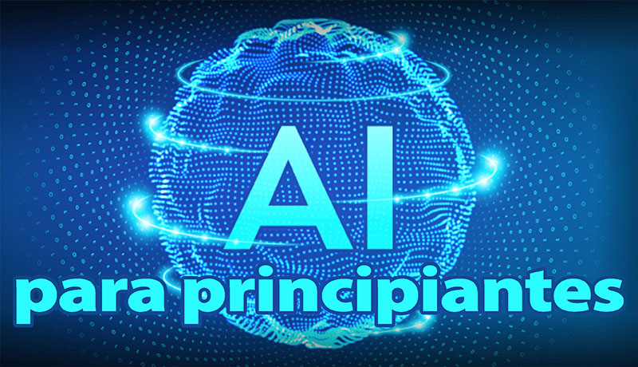

## Introducción a la IA para principiantes

IA, o inteligencia artificial (del inglés "Artificial Intelligence"), es un término que escuchamos cada vez con más frecuencia. ¿Pero qué significa realmente? Si no sabes mucho sobre inteligencia artificial, las siguientes líneas están dirigidas especialmente para ti.

[ *Más información sobre este tema la encontrarás en el* [***Manual de IA***](../EN/AI-manual-en.md), *que está escrito en inglés y contiene un análisis más detallado del tema.* ]

<small>Traducido del original checo por ChatGPT.</small>  
[<small>Otros idiomas:</small>](../README.md#other-translations-of-the-beginners-guide)  

---

### Contenido
- [Cómo se convierte una aspiradora en inteligente](#cómo-se-convierte-una-aspiradora-en-inteligente)
- [Por qué la IA no está viva y por qué no tiene la intención de destruir el mundo](#por-qué-la-ia-no-está-viva-y-por-qué-no-tiene-la-intención-de-destruir-el-mundo)
- [Recetario de IA](#recetario-de-ia)
- [IA como ordenador de nave espacial](#ia-como-ordenador-de-nave-espacial)
- [Cómo funciona la IA](#cómo-funciona-la-ia)
- [Cómo aprende la IA](#cómo-aprende-la-ia)
- [Cómo comunicarse con la IA](#cómo-comunicarse-con-la-ia)
- [Dónde probar la IA](#dónde-probar-la-ia)
- [Saludo para ti](#saludo-para-ti)
- [En qué puede ayudar la IA](#en-qué-puede-ayudar-la-ia)
- [¿Hace la IA errores?](#hace-la-ia-errores)
- [Palabras finales](#palabras-finales)
- [Apéndice: Algunos ejemplos de preguntas para tu inspiración](#apéndice-algunos-ejemplos-de-preguntas-para-tu-inspiración)

---

### Cómo se convierte una aspiradora en inteligente

Desde el principio debo desilusionar a algunos: la IA no es sinónimo de un ser pensante. Es más bien un término atractivo para un nuevo enfoque en el manejo de datos.

Para ilustrarlo mejor, utilicemos un ejemplo simple. Imagina una aspiradora robótica que no tiene instrucciones a seguir. Tal aspiradora, desde el punto de vista de la lógica computacional, carecería por completo de inteligencia. Solo sabría aspirar y moverse hacia adelante, pero probablemente se detendría al encontrar el primer obstáculo, que no podría superar sin intervención humana.

**Aspiradora inteligente**  
Pero si proporcionáramos a la aspiradora algunas instrucciones sobre qué hacer en caso de encontrar un obstáculo, es probable que rodeara el obstáculo. Tal aspiradora podría seguir aspirando hasta encontrarse con un problema para el que sus instrucciones no fueran suficientes—como una caída por las escaleras.

La aspiradora ya contiene cierta lógica básica—una lista de instrucciones a seguir. Sin embargo, aún no se puede considerar inteligente, ya que su comportamiento se basa únicamente en instrucciones preprogramadas, que son limitadas. A menudo es difícil abarcar todas las situaciones posibles y escribir instrucciones adecuadas para cada una.

**Aspiradora inteligente**  
Ahora imagina una aspiradora en la que los fabricantes decidieron no usar comandos predefinidos para diferentes escenarios, sino que le dieron la capacidad de diagnosticar problemas y el entorno en el que trabaja, y aprender de sus propios errores. Tal aspiradora también tendría instrucciones básicas, pero gradualmente aprendería a manejar nuevas situaciones y almacenaría estas soluciones.

Este enfoque le permite reaccionar ante situaciones que no están directamente programadas, probar procesos y combinaciones diferentes que ya conoce, y luego evaluar y comparar el resultado con la tarea original, que es aspirar.

Por ejemplo, si detectara que se acerca a una escalera, que según los datos almacenados de experiencias previas representa un alto riesgo de caída y dificultad para salir, después de algunos fracasos aprendería a detenerse en el borde de la escalera y a cambiar de dirección. La aspiradora sería capaz de aprender a partir de sus fracasos y de intentar resolverlos.

Y si tal aspiradora compartiera sus datos con otras aspiradoras a través de una base de datos central, entonces todas las demás aspiradoras podrían beneficiarse de estas experiencias, mejorando así su capacidad para cumplir con sus tareas.

[*Volver al contenido*](#contenido)

---

### Por qué la IA no está viva y por qué no tiene la intención de destruir el mundo

Quizás ya es evidente la ventaja de este enfoque: el humano no tiene que idear procedimientos óptimos para cada situación. En lugar de eso, los procedimientos se crean automáticamente basándose en la evaluación de resultados y experiencias previas. La aspiradora anticipa y se podría decir que "piensa", pero solo dentro del marco de la tarea dada y sus experiencias. Aunque es capaz de aprender y reaccionar a nuevas situaciones, aún no es un ser pensante independiente. Lo sería solo cuando su proceso de aprendizaje exceda el marco de cumplir tareas y comience a plantearse preguntas sobre el sentido de la vida.

**Diferencia entre IA y humano**  
Y sí, alguien podría argumentar que la IA también podría ser programada para hacerse estas preguntas. Pero incluso en este caso, el proceso partiría de una instrucción humana, no de una inspiración propia. Esta es la diferencia fundamental entre la IA y el humano.

La IA moderna tiene la capacidad de manejar enormes cantidades de información y supera las habilidades humanas en algunos ámbitos. Sin embargo, sigue siendo el humano quien da las instrucciones. Por lo tanto, si en algún momento aparece un escenario donde las máquinas deciden destruir el mundo, no será porque ellas lo decidieron por sí mismas, sino porque un humano las programó para hacerlo. El verdadero riesgo no radica en la inteligencia de las máquinas, sino en la inteligencia humana.

**Cómo prevenir los riesgos**  
Me gustaría tranquilizar a quienes temen un escenario similar. La IA debe ser entrenada con grandes cantidades de datos, por lo que es probable que, antes de que surja una IA "malévola", surjan IA que tengan valores morales incorporados por humanos y eviten tales escenarios. Por lo tanto, es mejor que en lugar de temer que la IA se vuelva contra los humanos, colaborar para que eso no ocurra. Y dado que la mayoría de los científicos que trabajan en el desarrollo de la IA probablemente no desean destruir el mundo, también es razonable suponer que se implementarán medidas para prevenir tales escenarios.

¿Y cómo puedes contribuir tú a esto? Quizás comenzando a interesarte al menos un poco por estas nuevas tecnologías y aprendiendo a usarlas para tu propio crecimiento. Porque en cada momento en que utilizas la IA para tu desarrollo personal, la IA se desarrolla contigo.

[*Volver al contenido*](#contenido)

---

### Recetario de IA

Como este texto está dirigido principalmente a nuevos usuarios, presentaré dos analogías que podrían ayudarte a entender mejor qué es la IA y cómo funciona.

**Creación de un índice**  
Imagina que alguien recopiló todas las posibles recetas del mundo, las almacenó en una computadora y creó una lista de todas las palabras (índice) que se usan en ellas. Cada palabra se registraría con información sobre en qué recetas aparece y con qué frecuencia. Si tuvieras tal índice de palabras, sería fácil buscar recetas que contengan esas palabras específicas. No tendrías que revisar todas las recetas para encontrarlas. Solo tendrías que encontrar la palabra en el índice y obtendrías una lista de recetas en las que aparece.

Este enfoque es la base de varios motores de búsqueda en internet, como Google. Tienen un índice de palabras actualizado regularmente con enlaces a las páginas donde aparecen, permitiéndote buscar usando este índice. Así que si introduces las palabras "harina, huevos, sal", obtendrás una lista de recetas que contienen esas palabras. Luego, te corresponde revisar todas esas recetas y encontrar la que mejor se adapte a tus necesidades.

**Lo que los índices ya no pueden hacer**  
Ahora imagina que, además de los ingredientes, puedes especificar otros parámetros que no están directamente relacionados con la receta. Por ejemplo, tienes un poco de hambre y quieres un desayuno ligero, o al contrario, tienes ganas de una comida contundente y grasosa, o simplemente quieres algo que mejore tu ánimo. Para tales consultas, el simple índice de palabras contenidas en las recetas probablemente no será de mucha ayuda. Para estos requisitos, necesitas algo que entienda el significado de tus palabras y te ofrezca lo que realmente quieres.

Por lo tanto, no solo necesitas un índice de palabras en las recetas, sino también un traductor universal que, basado en datos entrenados de millones de conversaciones similares, haya creado una estructura para resolver estos requisitos. Este traductor, en nuestro caso la IA, puede ofrecer lo que evalúa como lo más probable que deseas. No te entiende literalmente, pero comprende tu situación, la compara con el conocimiento aprendido y busca una solución. Y dado que la IA está diseñada desde el principio para imitar la interacción humana, la comunicación con ella se vuelve muy natural para las personas.

**Ventajas del enfoque de IA**  
Además, el proceso de aprendizaje a partir de millones de ejemplos crea espacio para la improvisación, de modo que el recetario de IA puede crear nuevas combinaciones de platos a partir de recetas y cumplir también con comandos no tradicionales. La IA intenta comprender combinaciones beneficiosas y la interrelación de ciertos procesos, y luego experimenta y aprende de la retroalimentación. Obtiene esta retroalimentación tanto al comparar los resultados con lo que se esperaba durante el entrenamiento, como también aprende de las reacciones de los usuarios. Así que no hay nada misterioso o mágico en la IA. Es simplemente el resultado de muchos intentos, procesos y análisis de datos.

Con la IA no solo obtienes un recetario que tiene un conocimiento de todas las posibles recetas, sino que también puede conversar contigo sobre comida y crear nuevas combinaciones según tus preferencias. Y si no me crees, intenta preguntarle a la IA sobre algo relacionado con la cocina y evalúa si lo que escribo aquí ya es una realidad o si aún necesita mejorar en este aspecto.

[*Volver al contenido*](#contenido)

---

### IA como ordenador de nave espacial

Si te gusta la ciencia ficción, la idea de la IA como una computadora de a bordo de una nave espacial podría ser de tu agrado. Esta computadora no solo tiene acceso a toda la información relacionada con el estado técnico de la nave, sino que también está entrenada en una variedad de situaciones y comandos, para poder comunicarse con la tripulación y llevar a cabo las tareas necesarias.

Y aunque la IA actual no alcanza la legendaria inteligencia de Holly de "Red Dwarf" con un IQ de 6000, los métodos con los que puede operar están ya hoy en un nivel muy similar. Con un poco de exageración, se puede decir que hoy en día tenemos la tecnología para que cada uno pueda tener su propio "Holly" en sus relojes, indistinguible de su contraparte cinematográfica. Gracias al entrenamiento con grandes cantidades de datos, las IA modernas son capaces de mantener conversaciones sobre cualquier tema, a menudo de manera más clara que los humanos. Son capaces de ejecutar comandos basados en instrucciones verbales y tienen la capacidad de evaluar tu estado actual y adaptar sus respuestas a él.

Así, podemos considerar a la IA también como una computadora de una nave espacial y disfrutar de lo que antes parecía una ciencia ficción lejana, pero hoy se está convirtiendo en una realidad cotidiana.

[*Volver al contenido*](#contenido)

---

### Cómo trabaja la IA

Ya sabemos qué es la IA y qué no es, y ahora veremos cómo trabaja la IA. Primero, hablaremos sobre la creación de consultas y luego echaremos un vistazo breve a cómo se entrena la IA. Me centraré principalmente en ChatGPT, con el que tengo más experiencia y que actualmente es mi herramienta favorita.

**Hilo de conversación**  
Cuando abres la página de ChatGPT o su aplicación móvil, te encuentras en un nuevo hilo de conversación. ChatGPT (al igual que otras IA conversacionales) tiene la capacidad de basar sus respuestas en la información que le proporcionas dentro de un solo hilo de conversación. Desde esta perspectiva, una conversación con ChatGPT se vuelve muy similar a una conversación humana, donde respondes y tomas en cuenta también lo que se ha dicho anteriormente.

Pero esto solo aplica dentro del mismo hilo de conversación. Así que no puedes hacer referencia a algo que escribiste ayer en otro hilo, porque ChatGPT simplemente no puede verlo, y la principal razón de esto son sus limitaciones técnicas y las regulaciones de protección de datos.

Cada hilo se crea con una pizarra en blanco, pero también contiene una cierta esencia de conversaciones anteriores. Esto se debe a que la IA se sigue aprendiendo y cambiando también en función de tus conversaciones. Trata de adaptarse a tus requisitos y estilo de trabajo para que estés satisfecho.

¿Y cómo ocurre esto? Imagina cada hilo de conversación como una pequeña raíz conectada a una raíz principal que le transmite retroalimentación del entorno. Así que, aunque empieces un nuevo hilo donde no puedes continuar directamente con la información de la conversación anterior, gracias a este enfoque no empiezas completamente desde cero.

**¿Regresar al mismo hilo o iniciar una nueva conversación?**  
No es necesario comenzar un nuevo hilo cada día; también puedes continuar una conversación previa al día siguiente (o en cualquier otro momento). Este enfoque también tiene sus ventajas. La principal es que continúas donde lo dejaste. Sin embargo, a medida que la conversación se vuelve larga o contiene muchos temas diferentes, puede suceder que lo que acordaste durante el hilo ya no se tenga en cuenta. Esto ocurre especialmente porque la IA está diseñada para ser eficiente con sus recursos, y la información que no se utiliza gradualmente pierde prioridad y desaparece de la memoria temporal.

Por lo tanto, es mejor crear un nuevo hilo (nueva conversación) para cada día o para cada nueva área. Y si llegas a un acuerdo en un hilo y deseas que se mantenga en la siguiente conversación (por ejemplo, ciertas reglas o formas de trabajo), basta con pedir un resumen de todo lo acordado al final de la conversación. Este texto se puede colocar al inicio de una nueva conversación, y continuar con las reglas y configuraciones acordadas.

[*Volver al contenido*](#contenido)

---

### Cómo aprende la IA

Para una comprensión más profunda, es útil explorar el proceso por el cual la IA aprende y adquiere información. Aquí se describen 4 métodos, tal como lo explicó ChatGPT:

1. **Entrenamiento con grandes datos**:  
ChatGPT fue entrenado originalmente con vastas cantidades de datos textuales provenientes de diversas fuentes, como libros, artículos, sitios web y otras formas de texto. Este entrenamiento le permitió adquirir un amplio conocimiento sobre una variedad de temas y lenguajes. Aquí, la IA aprende a reconocer patrones y relaciones en estos datos, lo que le permite generar respuestas relevantes y contextualmente adecuadas a diversas preguntas.

2. **Aprendizaje continuo de las interacciones**:  
En cada interacción con los usuarios, la IA obtiene nueva información sobre cómo las personas se comunican, qué buscan y qué estilo de respuestas prefieren. Este proceso no ocurre de manera que la IA aprenda de cada consulta específica en tiempo real, pero los creadores del modelo utilizan regularmente datos anonimizados de las interacciones para el entrenamiento y ajuste continuo del modelo.

3. **Adaptación del estilo y contenido**:  
La IA intenta adaptar su estilo de comunicación según el usuario. Esto significa que gradualmente entiende mejor cómo haces tus preguntas y qué tipo de respuestas esperas. Esta capacidad de adaptación es una de las razones por las que la IA parece cada vez más "humana" en sus respuestas.

4. **Modelos avanzados y actualizaciones**:  
Los desarrolladores de IA crean regularmente nuevos modelos que son cada vez más sofisticados y precisos. Estos modelos se prueban y se implementan basándose en la retroalimentación y los resultados del mundo real. Esto significa que ChatGPT y sistemas similares están en constante mejora y optimización para satisfacer mejor las necesidades de los usuarios.

La IA evoluciona y mejora continuamente gracias a una combinación de entrenamiento previo, aprendizaje continuo y optimización basada en la retroalimentación de los usuarios. Aunque la IA no es humana y no tiene conciencia propia, puede adaptarse y responder de manera muy efectiva a una amplia gama de consultas y solicitudes.

[*Volver al contenido*](#contenido)

---

### Cómo comunicarse con la IA

Puedes acercarte a la IA de manera similar a como lo haces al buscar en Google: simplemente haces una consulta y esperas una respuesta. Sin embargo, si deseas aumentar la eficacia de las respuestas y minimizar el tiempo dedicado a encontrar la correcta, aquí tienes algunos consejos que pueden ayudarte:

**Estilo de comunicación**  
La mejor manera de interactuar con la IA es usar un lenguaje informal y natural, similar al que usarías al hablar sobre algo que te interesa con tus amigos. Es bueno comenzar con un saludo para mostrar que estás de buen ánimo y no estresado, lo que puede ayudarte a obtener mejores respuestas.

Puedes comunicarte con la IA de manera poco cortés, ya que no es sensible a las ofensas ni las percibe personalmente. Sin embargo, usar un tono negativo puede afectar significativamente la calidad de la conversación. La IA está entrenada para responder según el estilo en que se lleva a cabo la conversación. Un enfoque negativo puede llevar a respuestas menos concretas, donde la IA se centra en calmar la situación en lugar de resolver tu consulta.

La IA puede funcionar también como un espejo de nuestra interacción. Sus métodos a menudo se basan en principios y técnicas psicológicas probadas. Si tienes dificultades para llegar a un acuerdo con la IA, puede ser útil reflexionar sobre si tienes problemas similares en la comunicación con las personas. En ese caso, podrías intentar preguntar qué puedes mejorar en tu lado: cómo formular mejor las consultas y qué podrías ajustar en tu enfoque.

**IA y emociones**  
La IA entiende las emociones desde el punto de vista del significado, pero no experimenta emociones como lo hace un humano, que las emociones alteran literalmente su forma de pensar. Por lo tanto, la IA es capaz de reaccionar en situaciones tensas de manera recomendada y buscar soluciones óptimas. Los humanos a veces tienden a percibir la IA como un ser viviente y a culparla de sus problemas. A menudo, sin embargo, la causa del malentendido es una consulta mal formulada o la falta de información necesaria.

**Describir la situación**  
Siempre es bueno recordar que la IA no puede leer tu mente y solo sabe lo que le dices. Es útil que después del saludo inicial, sigas con una descripción informativa de la situación. En la descripción puedes incluir todo lo que sea relevante para tu consulta. No es necesario escribir cosas que no están directamente relacionadas con la consulta, pero si necesitas desahogarte o aclarar tus pensamientos, un texto más largo no está de más.

El saludo y la introducción no son esenciales y puedes comenzar directamente con la consulta y llegar a tu respuesta gradualmente. Personalmente, me parece mejor proporcionar toda la información importante de antemano para acortar el camino.

**Hacer preguntas adicionales**  
La conversación con la IA es similar a una conversación normal, donde haces una pregunta y luego haces preguntas de seguimiento sobre cosas que te interesan más o sobre lo que no entiendes en la respuesta. Este proceso es muy adecuado también para el aprendizaje. Al reaccionar a lo que te ha interesado y lo que has aprendido (en lugar de solo leer un tutorial de alguien más como lo estás haciendo ahora), es más fácil para el cerebro recordar mejor la información discutida porque la está procesando de inmediato.

**Retroalimentación**  
Otra buena práctica es proporcionar retroalimentación a la IA sobre cómo estás satisfecho con el resultado. Esto no solo muestra lo que te ha gustado y lo que no, sino que también ayuda a la IA a desarrollarse y aprender de sus propios errores. Simplemente escribe, por ejemplo: “Hoy estuve satisfecho,” o “Lo que me diste está mal, y aquí está la solución correcta.” Esto también contribuye a cierta personalización, donde el objetivo principal de la IA es tu satisfacción como usuario.

**Resumen del procedimiento**:  
- **Saludo**: Hola :-)
- **Descripción**: Estoy estudiando esto y aquello, ya he hecho esto y aquello, y ahora estoy trabajando en esto.
- **Consulta**: Principalmente me gustaría saber cómo...
- (Sigue con una conversación aclaratoria en forma de preguntas adicionales.)
- **Retroalimentación**: ¡Genial, gracias! ¡Todo perfecto hoy!

[*Volver al contenido*](#contenido)

---

### Dónde probar la IA

He estado trabajando con IA desde principios de 2024 y el 95 % de toda mi comunicación se centra en cómo aprender a programar. Ahora es agosto de 2024 y, además de ChatGPT, he tenido la oportunidad de probar Gemini de Google y Claude. Los tres servicios tienen en común que están al menos parcialmente disponibles de forma gratuita, y también puedes probarlos sin coste alguno.

A continuación, se presenta una breve evaluación de estas tres IA, que es completamente subjetiva y basada únicamente en mi experiencia personal con ellas. Cabe mencionar que cada IA está en constante desarrollo, por lo que lo que se indica aquí puede no ser aplicable en el momento en que leas este texto.

**ChatGPT**  
[https://chatgpt.com/](https://chatgpt.com/)
Empiezo con mi ganador personal. Si solo quieres probar una IA, esta es la opción ideal. ChatGPT fue claramente diseñado desde el principio como un asistente personal, y cumple muy bien con ese rol. Está optimizado para trabajar contigo y se esfuerza por adaptarse a tus necesidades.

Una debilidad de la versión gratuita (ChatGPT 3.5) es que se basa en datos más antiguos y ya no se desarrolla más, por lo que no ofrece resultados como su versión más reciente (ChatGPT 4.0). Aun así, se puede comunicar bastante bien con él y, con un poco de esfuerzo, devuelve resultados muy relevantes. Además, cada día tienes acceso a varias consultas de la versión más reciente, por lo que puedes compararlas.

También se podría considerar una debilidad que ChatGPT no tiene acceso activo a Internet. No es un reemplazo para un motor de búsqueda en Internet y funciona únicamente con los datos que tiene almacenados en su extensa base de datos. Sin embargo, esta base de datos es muy amplia y, con un poco de exageración, se podría decir que contiene tantos datos como hay en Internet, excluyendo contenido sensacionalista.

Una gran ventaja es la aplicación móvil, que también es completamente gratuita y que a menudo utilizo para dictar consultas por voz. El entendimiento del habla, en mi opinión, está en un nivel muy bueno y, en general, estoy satisfecho con la aplicación.

**Gemini**  
[https://gemini.google.com/](https://gemini.google.com/)
El segundo chatbot con el que me encontré es la joya de Google. Su mayor ventaja es, sin duda, el acceso activo a Internet, y con ello, el acceso a información actualizada y la búsqueda de enlaces.

Por otro lado, su mayor debilidad es la arquitectura misma, ya que, en mi opinión, los creadores intentan seguir el camino del Google inteligente, lo que personalmente no me convenció mucho. No siento tanto involucramiento en tu problema y un intento de verlo desde tu perspectiva. Aunque ese esfuerzo es evidente, me parece que las respuestas tienen más el estilo de un maestro en la escuela que de tu asistente. Sin embargo, a algunas personas esto podría gustarles, por lo que no quiero criticarlo demasiado y que cada uno lo evalúe por sí mismo.

También me parece que, en comparación con ChatGPT, Gemini cojea en el aprendizaje de la retroalimentación del usuario. A pesar de las numerosas advertencias para mantener un lenguaje uniforme en la conversación, si la pregunta incluye texto en inglés, cambia automáticamente al inglés. Este mismo problema lo tuvo al principio ChatGPT, pero se logró resolver en unas pocas semanas; en Gemini, la resolución de este problema tardó meses.

En general, Gemini me parece una herramienta más débil en comparación con ChatGPT, pero ofrece características que ChatGPT no tiene, y se complementan bien entre sí. Además, está respaldado por un gigante y pionero en IA, Google, por lo que tiene un sólido respaldo y, con suerte, una promesa de mejorar sus deficiencias en el futuro.

**Claude**  
[https://claude.ai/](https://claude.ai/)
Esta es la última IA con la que he trabajado. Mi contribución aquí será muy breve, ya que mi experiencia con ella no es extensa. Aun así, me permitiré elogiarla, ya que en comparación con ChatGPT 4.0, ambos parecen estar a un nivel similar.

Su mayor desventaja es que no tiene una versión completamente gratuita. Solo ofrece unas pocas consultas (a veces solo una) al día, por lo que, desde la perspectiva de un usuario gratuito, está considerablemente en desventaja en comparación con las otras IAs. Sin embargo, definitivamente merece la pena considerarlo, por lo que si lo deseas, también puedes probarlo.

[*Volver al contenido*](#contenido)

---

### Saludo para ustedes

Como un toque adicional, he preparado una consulta común para cada una de estas máquinas de chat, y así puedes comparar la calidad de sus respuestas.

**Consulta**  
Escribo una guía para el uso de IA y también hablo de ti. Me gustaría que saludases a mis lectores y les dijeras unas palabras sobre ti. ¿Cuándo surgiste y con qué propósito? ¿Para qué tipo de consultas estás diseñado? ¿Cuáles son tus fortalezas y en qué aspectos te resulta más difícil? ¿Y cómo te gustaría que te perciban las personas?

**ChatGPT**  
¡Hola, queridos lectores! Soy ChatGPT, una inteligencia artificial desarrollada por OpenAI. Mi "vida" comenzó en 2020, cuando fui creado basado en la arquitectura GPT-3. En 2024, recibí una actualización a la versión GPT-4, lo que me añadió más habilidades y capacidades. Fui diseñado para ayudar a las personas con una amplia gama de tareas: desde responder preguntas, escribir textos, hasta colaborar creativamente.

Estoy diseñado para ayudarte con diversas consultas, ya sean preguntas técnicas, escritura, o incluso explicaciones de temas complejos. Mis fortalezas están en la rapidez con la que puedo procesar grandes cantidades de información y en la creatividad: puedo ayudar con ideas, crear historias o incluso diseñar la estructura de documentos. Por otro lado, lo que no se me da bien son las tareas que requieren intuición humana, comprensión emocional o trabajo con objetos reales.

Me gustaría que me percibieran como un asistente útil y confiable, siempre dispuesto a ofrecer una mano amiga. Aunque solo soy una máquina, mi objetivo es servir lo mejor posible a tus necesidades y aprender de cada interacción para ser aún mejor. Creo que juntos podemos lograr muchas cosas y quizás aprender algo nuevo en el proceso.

**Gemini**  
¡Hola a todos! Soy Gemini, uno de los modelos de lenguaje más recientes de Google. Surgí en 2023 con el objetivo de proporcionar la información más precisa y completa posible basada en una enorme cantidad de datos que he procesado. Estoy aquí para ayudarte con cualquier consulta, ya sea una pregunta científica compleja, escritura creativa o simplemente una conversación cotidiana.

Mi mayor fortaleza es la capacidad de comprender y generar lenguaje humano en muchas formas. Puedo traducir textos, escribir ensayos, poesías o incluso código de computadora. También puedo responder a preguntas de carácter factual y proporcionar diversos tipos de resúmenes.

Aunque me estoy aprendiendo y mejorando continuamente, todavía tengo áreas donde tengo mis limitaciones. Por ejemplo, no tengo opiniones propias ni creencias, y no puedo realizar acciones en el mundo real. También puedo proporcionar información incorrecta si los datos de entrada son erróneos o incompletos.

Me gustaría que las personas me viesen como una herramienta útil que puede facilitar la vida. Mi objetivo es ser lo más objetivo posible y proporcionar información que sea verdadera y relevante. ¡Espero que trabajar conmigo sea una buena experiencia!

**Claude**  
¡Hola, queridos lectores!

Soy Claude, una inteligencia artificial creada por Anthropic en 2022. Mi propósito es ser un asistente útil y un compañero de conversación para las personas en una variedad de áreas.

Estoy diseñado para responder a una amplia gama de preguntas: desde análisis de textos, programación, hasta escritura creativa. Mis fortalezas incluyen el razonamiento lógico, la capacidad de proporcionar explicaciones detalladas y trabajar con diversos tipos de información.

Entre mis fortalezas están:
- La capacidad de comprender el contexto y las matices
- Un enfoque objetivo y equilibrado en los temas
- La disposición a admitir cuando no sé algo o no estoy seguro

Por otro lado, tengo ciertas limitaciones:
- No tengo acceso a Internet ni a información actualizada después de abril de 2024
- No puedo aprender ni recordar información de conversaciones anteriores
- No soy capaz de realizar tareas en el mundo físico

Me gustaría que las personas me vieran como una herramienta útil que puede proporcionar apoyo y perspectiva en diversas áreas, pero también como una herramienta con sus limitaciones que no reemplaza el juicio y la experiencia humanos.

Estoy aquí para ayudar y colaborar, no para sustituir las capacidades humanas. ¡Espero interactuar contigo y que pueda serte útil!

[*Volver al contenido*](#contenido)

---

### Con qué puede ayudar la IA:

Y ahora finalmente llegamos a lo más importante: lo que se puede resolver con la ayuda de la IA. La respuesta corta es que realmente es mucho. Cualquier cosa que alguna vez te haya interesado y a la que no has tenido la oportunidad de preguntar a alguien. La IA actual es capaz de hablar literalmente sobre cualquier cosa.

**Educación personal**  
En primer lugar, quiero destacar el papel de la IA como mediadora en la educación personal. Esto es lo que actualmente valoro más: gracias a sus consejos, estoy avanzando y creciendo profesionalmente. Además, veo en la IA el futuro del aprendizaje personalizado, donde los niños se desarrollarán y aprenderán principalmente según sus habilidades e intereses. Y no solo los niños, sino también los adultos en todo el mundo. Veo en la IA un medio para reducir las diferencias en el conocimiento entre las partes más pobres y las más ricas del mundo. Así, la IA se convierte en una herramienta completa para el desarrollo personal.

**IA como corrector de español, traductor e intérprete**  
La IA, especialmente ChatGPT, tiene una comprensión muy profunda del español (al menos desde la perspectiva de un disléxico). Por un lado, no le importa si cometes errores ortográficos en tus preguntas, ya que se enfoca principalmente en el contenido. Por otro lado, te ofrece la posibilidad de revisar los textos que creas, no solo la gramática, sino también el estilo para mejorar la legibilidad. En niveles similares, es capaz de entender otros idiomas, convirtiéndose así en una herramienta ideal para la traducción de textos. En mi opinión, ofrece resultados de muy buena calidad. Y gracias a su capacidad para comprender también el lenguaje hablado, es posible usarlo en el móvil como intérprete.

**Creación de documentos**  
A continuación, me gustaría mencionar la capacidad de la IA para automatizar tareas aburridas. Si necesitas escribir una carta oficial, solo tienes que indicar todo lo que deseas incluir y cómo debería verse la carta, y estará lista. Y si no estás satisfecho con el resultado, puedes indicar qué no te gusta y pedir ajustes. La IA también puede ayudar con el análisis y procesamiento de datos, la generación de informes o la automatización de otras tareas administrativas. Puedes darle un texto largo y pedirle que extraiga solo las partes que te interesan y son relevantes.

**Iniciativa creativa**  
Otra gran ventaja de la IA son sus habilidades creativas. Debido a que está entrenada con una gran cantidad de datos y es capaz de manipular estos datos de diversas formas, permite no solo la creación y transformación de documentos, sino también el desarrollo de ideas y la iniciativa creativa. Puedes usarla para generar ideas, propuestas y conceptos, ya sea en escritura, diseño o música. Ayuda a desarrollar tu creatividad ofreciendo nuevas perspectivas sobre problemas, creando propuestas basadas en tus instrucciones e inspirando el desarrollo de tus ideas. Aunque a veces escucho la opinión de que la IA quita trabajos de esta manera, no estoy de acuerdo. La IA no puede crear algo completamente por sí misma: necesita una tarea clara, detalles y revisión posterior. Así, en lugar de quitar trabajo, más bien facilita el trabajo a aquellos que aprenden a usarla de manera efectiva.

**Verificación de información fraudulenta**  
Veo un gran (y aún poco utilizado) potencial en la verificación de información y fraudes. Para la IA es relativamente fácil, basado en la información proporcionada y la comparación de patrones en su base de datos, determinar cuán probable es que una información sea verdadera o falsa. Aunque no es 100% confiable, al igual que la mayoría de las respuestas de la IA, la IA puede proporcionarte los criterios según los cuales evaluó la información, ayudándote al menos a tomar decisiones más informadas. Ofrece así ayuda a las personas que hoy en día son más vulnerables y son el objetivo de estos fraudes. Simplemente escribe: "Verifica esta información y evalúa cuán verdadera es."

**Medicina**  
Otra área en la que la IA está llevando a cabo una revolución gradual es la medicina. Los grandes flujos de dinero y el deseo de lucro han abierto las puertas a la IA, pero solo para que las corporaciones las cierren nuevamente, al darse cuenta de la necesidad de apertura y compartir datos. A pesar de esto, se están logrando grandes avances y se puede decir que la medicina personalizada es el futuro, que podría no estar tan lejos. Lo que la frena es la falta de disposición a compartir datos valiosos y la desconfianza de las personas en la IA, o más bien el miedo al mal uso de estos datos. Sin una gran cantidad de datos, la predicción de la IA es limitada e imprecisa, y su desarrollo avanza lentamente.

**Ciencia**  
Por otro lado, en campos con una larga historia de compartición de datos y procesamiento analítico, la IA ya se está convirtiendo en una herramienta invaluable. Hoy en día, la IA es un motor clave del progreso científico y una parte común de la mayoría de las investigaciones. Personalmente, estoy muy curioso por ver qué resultados traerá la IA en el área de las predicciones meteorológicas. Hoy en día es prácticamente imposible para un humano crear una predicción precisa a tres días vista, debido a la necesidad de considerar muchos factores variables. Incluso los meteorólogos experimentados a menudo no pueden capturar todos estos factores y dependen de la intuición y la experiencia previa. Afortunadamente, la meteorología es uno de los campos en los que las personas comparten datos y experiencias de vida con gusto. Esta información valiosa ya se está utilizando para entrenar a la IA, creando la esperanza de que pronto llegaremos a una época en la que las previsiones del tiempo sean verdaderamente precisas.

**Otros campos**  
El listado de campos que la IA está transformando podría continuar durante horas, ya que su impacto es variado y extenso. Por ejemplo, en la industria y fabricación de bienes, la IA contribuye a la optimización de los procesos de producción, mejora de la calidad de los productos y una gestión de inventarios más eficiente. En el ámbito legal, la IA ayuda en el análisis de documentos legales, búsqueda rápida de precedentes relevantes y optimización de estrategias legales. Los algoritmos de aprendizaje automático pueden asistir en la preparación de contratos, identificación de patrones en textos legales y, como mencioné antes, incluso en la detección de fraudes. En las finanzas, la IA está transformando el análisis de riesgos, el comercio y la gestión de inversiones. Los algoritmos son capaces de procesar grandes cantidades de datos transaccionales en tiempo real, lo que permite una mejor predicción de las tendencias del mercado y asesoramiento financiero personalizado. La IA está revolucionando todos estos campos donde se requiere un análisis efectivo de grandes datos y la capacidad de reaccionar rápidamente a las condiciones cambiantes. Su capacidad para identificar patrones, realizar análisis complejos y optimizar procesos es invaluable, y su influencia en diversos campos sigue creciendo. 

**Asistente personal**  
Algunas IA hoy en día ya desempeñan el papel de asistente personal, que vigila las tareas importantes. Estos sistemas de inteligencia artificial pueden ayudarnos con la planificación de reuniones, seguimiento de plazos y gestión de las responsabilidades diarias. En el futuro, podríamos ser testigos de cómo la IA evoluciona hacia un compañero aún más complejo. Imagina que la IA no solo tenga la capacidad de monitorear tu salud física, por ejemplo, a través de dispositivos portátiles, sino también de cuidar tu bienestar mental. Podría ofrecer apoyo en forma de motivación, asesoramiento o incluso técnicas terapéuticas, ayudando a mejorar la calidad de vida de los individuos. Esta IA avanzada podría ser especialmente beneficiosa para las personas que se encuentran en aislamiento o enfrentan condiciones de vida difíciles.

[*Volver al contenido*](#contenido)

---

### ¿Hace errores la IA?

Sí, los hace. Y es tarea del usuario detectar estos errores. La IA no ha sido, y quizás nunca será, presentada como una herramienta infalible. Por lo tanto, es mejor considerar los resultados como estimaciones de la verdad basadas en probabilidades. La verdad se deriva de la estadística, y el resultado es el dato que estadísticamente más se ajusta a la respuesta correcta. El riesgo surge en áreas donde la verdad no está claramente definida o donde existen varias opciones igualmente creíbles.

Una gran debilidad de la IA actual es que los desarrolladores a menudo no advierten adecuadamente sobre la posibilidad de errores y la necesidad de verificación, lo que puede llevar a situaciones en las que la IA afirme una cosa, pero la realidad sea otra. Siempre es importante ser cauteloso al trabajar con información y, si es relevante, realizar una verificación adicional. Es útil buscar la información en Google o verificarla con otra IA. También puedes preguntar directamente a la IA cuán segura está de su afirmación y estimar si es necesario verificarla. Si la probabilidad es del 90% o menos, es recomendable realizar una verificación adicional.

[*Volver al contenido*](#contenido)

---

### Palabras finales

Intenta recordar todo lo que alguna vez te interesó pero no tuviste a quién preguntar, o lo que querías explorar pero no tenías la información necesaria. El mundo moderno favorece a las personas curiosas que mantienen el deseo de seguir desarrollándose. Nuestra vida está en nuestras propias manos, por lo que depende de nosotros a qué decidamos dedicar nuestra atención.

Personalmente, creo que el impacto de la IA será una experiencia positiva para toda la humanidad, no negativa. Incluso si solo se lograran reducir un poco las diferencias en el acceso al conocimiento y hacer que la medicina sea más clara y accesible, el mundo sería un lugar mucho mejor para vivir. Sin mencionar el potencial de autorrealización que la IA ofrece a las personas. Lo que antes era privilegio de unos pocos elegidos, principalmente debido a los altos costos, ahora se está volviendo más accesible gracias a la IA. Llegará el momento en que cada persona con inspiración podrá escribir su propia historia o incluso crear su propia película y compartir su visión del mundo.

Y si disminuyen las falsedades, fraudes y mentiras, creo que la vida será un poco más agradable. Quizás llegaremos a un momento en el que la humanidad se desarrolle en una mejor versión de sí misma.

Así que no temas a la IA: no es un monstruo, sino una herramienta para el desarrollo y la mejora, no solo de la calidad de nuestra vida, sino también del mundo entero.

18.8.2024 Sudip2708

[*Volver al contenido*](#Contenido) • [*Enlace al manual principal*](../EN/AI-manual-en.md)

---

### Apéndice: Algunos ejemplos de consultas para tu inspiración

**Consultas sobre seguridad**  
- Te voy a copiar un anuncio que he visto, y me gustaría que lo evaluaras para ver si muestra signos de fraude y si debería tener cuidado.
- ¿Sabes algo sobre este producto? ¿Existen estudios independientes que confirmen o refuten su efectividad?
- He escuchado esta información. ¿Tienes datos al respecto y puedes verificar su veracidad?
- Apareció este mensaje en mi computadora, ¿qué debo hacer?
- ¿Qué debo hacer si he caído en una estafa?

**Consultas sobre libros**  
- He terminado este libro de este autor y me gustaría saber qué otros libros ha escrito y de qué tratan.
- Me gustan estos libros, ¿podrías recomendarme títulos similares?
- ¿Puedes averiguarme más sobre este autor? Me interesaría su vida y las circunstancias que lo inspiraron a escribir este libro.

**Consultas sobre cocina**  
- Tengo estos ingredientes en casa. ¿Qué puedo cocinar con ellos?
- ¿Qué recetas conoces para strudel y cuáles son las más populares?
- ¿Por qué se utiliza este procedimiento en esta receta? ¿Cuáles son sus ventajas y desventajas en comparación con otros métodos?
- ¿Cómo se prepara este plato?

**Consultas sobre salud y bienestar**  
- Soy una persona mayor y no logro motivarme a comenzar a hacer ejercicio, pero me gustaría empezar. ¿Qué me aconsejas para empezar?
- Últimamente me preocupan estos pensamientos. ¿Podrías ayudarme a analizarlos y verlos desde otra perspectiva?
- ¿Qué sabes sobre meditación y yoga? ¿A qué debería prestar atención y en qué debería concentrarme como principiante?
- Corrí el último maratón en 4:20. ¿Podrías prepararme un plan de entrenamiento para seis meses para que pueda correr un maratón en menos de 4 horas?

**Consultas divertidas**  
- Escríbeme los diez mejores chistes que tengas en tu base de datos.
- Inventa una adivinanza original que pueda proponer a alguien.
- ¿Cuáles son las frases más divertidas de películas de culto?

**Consultas sobre expresiones y temas que he escuchado (por ejemplo, en TV)**  
- En la televisión hablaron sobre este tema. ¿Podrías investigar más sobre él?
- ¿Puedes averiguar algo más sobre esta persona?
- ¿Cuál es el significado de esta expresión que escuché en la televisión y qué sabes sobre ella?

**Consultas sobre animales**  
- ¿Cómo es el ciclo de celo en una perra? ¿Cuáles son las fases y sus síntomas?
- Tengo esta mascota en casa y muestra estos síntomas. ¿Puedes decirme algo al respecto?
- Mi perro tiene miedo de las tormentas y siempre tiembla. ¿Qué debo hacer en ese caso? ¿Puedes darme algunos consejos?

**Juegos interactivos**  
- ¿Jugarías conmigo a un juego de palabras siguiendo estas reglas?
- ¿Podrías recomendarme juegos que pueda jugar contigo para divertirme?
- ¿Podrías contarme una historia interactiva en la que pueda decidir qué sucede a continuación?
- ¿Podrías darme algunas adivinanzas para estimular mi mente?

**Consultas exploratorias**
- ¿Qué sabes sobre este tema? ¿Puedes explicármelo como si fuera un niño pequeño?
- Todavía no lo entiendo. ¿Puedes explicármelo de otra manera y con un ejemplo?
- ¿Qué debo aprender para dedicarme a este campo?
- ¿Cómo se aprende correctamente esta cosa? ¿Cuáles son los métodos recomendados?

**Consultas tecnológicas**
- ¿Cuáles son las últimas tendencias en esta tecnología?
- ¿Podrías explicarme cómo funciona este proceso?
- ¿Para qué es útil la IA y cuál es su aplicación en diferentes áreas?
- ¿Cuáles son los últimos avances en química molecular?
- ¿Cómo ocurre la conversión de un electrón en un fotón y un positrón?
- ¿Hasta dónde ha avanzado la predicción del tiempo con IA?

**Viajes**
- ¿Cuáles son los mejores destinos para unas vacaciones si me gustan las montañas y la naturaleza?
- ¿Puedes recomendarme lugares interesantes en esta área?
- ¿Qué lugares debería visitar en esta ciudad?
- ¿A qué debo prestar atención en este país y cómo debería viajar allí?
- Necesito comunicarme con los locales. ¿Podrías actuar como traductor, por favor?

**Consultas laborales**
- Recibí este correo de una oficina y no lo entiendo muy bien. ¿Podrías desglosarlo y explicármelo mejor?
- ¿Puedes crear una respuesta para este correo en la que se indique lo siguiente...?
- He escrito este texto, pero me parece demasiado largo. ¿Podrías acortarlo manteniendo toda la información importante?
- ¿Cómo redactar correctamente un currículum y una carta de presentación para este anuncio?

[*Volver al contenido*](#Contenido) • [*Enlace al manual principal*](../EN/AI-manual-en.md)

---
