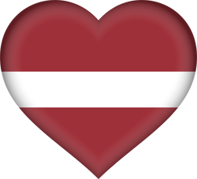

## Algoritmidest algajatele

AI ehk tehisintellekt (ingliskeelsest "Artificial Intelligence") on lühend, mida kuuleme tänapäeval järjest sagedamini. Aga mida see tegelikult tähendab? Kui tehisintellektist ei tea veel palju, on järgmised read just teile.

[ *Rohkem teavet selle teema kohta leiate* [***AI Manual***](../EN/AI-manual-en.md), *mis on kirjutatud inglise keeles ja sisaldab üksikasjalikumat teavet.* ]

<small>Tõlkinud ChatGPT.</small>  
[<small>Muud keeled:</small>](../README.md)  

---

### Sisu
- [Kuidas saab tolmuimejast intelligentne seade](#kuidas-saab-tolmuimejast-intelligentne-seade)
- [Miks AI ei ole elus ja miks ta ei püüdle maailma hävitamise poole](#miks-ai-ei-ole-elus-ja-miks-ta-ei-püüdlusta-maailma-hävitamise-poole)
- [AI retseptiraamat](#ai-retseptiraamat)
- [AI kui kosmoselaeva arvuti](#ai-kui-kosmoselaeva-arvuti)
- [Kuidas AI töötab](#kuidas-ai-töötab)
- [Kuidas AI õpib](#kuidas-ai-õpib)
- [Kuidas AI-ga suhelda](#kuidas-ai-ga-suhelda)
- [Kus AI-d proovida](#kus-ai-d-proovida)
- [Tervitus teile](#tervitus-teile)
- [Milles AI aitab](#milles-ai-aitab)
- [Kas AI teeb vigu](#kas-ai-teeb-vigu)
- [Sõna lõpetuseks](#sõna-lõpetuseks)
- [Lisa: Mõned näited küsimustest teie inspiratsiooniks](#lisa-mõned-näited-küsimustest-teie-inspiratsiooniks)

---

### Kuidas saab tolmuimejast intelligentne seade

Kahjuks pean kohe alguses mõned teid võib-olla pettuma – AI ei ole sünonüüm mõtlevale olendile. See on pigem meeldejääv nimi uuele lähenemisviisile andmete töötlemisel.

Et seda paremini ette kujutada, kasutame lihtsat näidet. Kujutage ette robot-tolmuimejat, millel pole mingeid juhiseid, millele toetuda. Selline tolmuimeja oleks arvutiloogika seisukohalt täiesti ilma intelligentsita. Ta oskaks ainult tolmuimejat teha ja edasi liikuda, kuid tõenäoliselt jääks ta esimese takistuse vastu seisma, mida ta ilma inimese sekkumiseta ei suudaks ületada.

**Nutikas tolmuimeja**  
Kuid kui me annaksime tolmuimejale juhised, mis ütlevad talle, mida teha takistuse peale sattumisel, oleks tõenäoline, et ta oskaks takistust ringi sõita. Selline tolmuimeja oleks võimeline tolmuimejat tegema, kuni ta kohtab probleemi, mille jaoks tema juhised ei ole piisavad – näiteks treppidest alla kukkumine.

Tolmuimeja sisaldab juba teatud põhiloogikat – juhiste loetelu, mille järgi ta tegutseb. Siiski ei saa teda pidada intelligentseks, kuna tema käitumine põhineb ainult etteprogrammeeritud juhistel, mis on piiratud. Tihti on raske arvestada kõiki võimalikke olukordi ja kirjutada vastavad juhised.

**Intelligentne tolmuimeja**  
Kujutage nüüd ette tolmuimejat, mille tootjad otsustasid mitte kasutada eelnevalt ettevalmistatud käsklusi erinevate stsenaariumide jaoks, vaid andsid talle võime diagnoosida probleeme ja keskkonda, kus ta töötab, ning õppida oma vigadest. Selline tolmuimeja omaks ka põhijuhiseid, kuid õpiks järk-järgult, kuidas hakkama saada uute olukordadega, ja salvestaks need lahendused.

See lähenemisviis võimaldab tal reageerida olukordadele, mis ei ole otseselt etteprogrammeeritud, proovides rakendada juba tuntud protsesse ja nende erinevaid kombinatsioone, ning seejärel hinnata tulemust ja võrrelda seda algse ülesandega – tolmuimejaga.

Näiteks kui ta avastaks, et läheneb astmele, mis salvestatud andmete järgi esindab suurt kukkumise ja lõksu jäämise riski, õpiks ta pärast mitmeid ebaõnnestumisi peatuma astme serval ja suunama end teise suuna poole. Tolmuimeja saaks seega õppida oma vigadest ja püüda neid lahendada.

Ja kui selline tolmuimeja jagaks oma andmeid teiste tolmuimejatega keskandmebaasi kaudu, saaksid ka kõik teised tolmuimejad kasutada neid kogemusi ja nende võime täita oma ülesandeid paraneks.

[*Tagasi sisukorda*](#sisukord)

---

### Miks AI ei ole elus ja ei püüdle maailma hävitamise poole

Võib-olla on juba selge, miks see lähenemisviis on kasulik – inimene ei pea iga olukorra jaoks optimaalseid meetodeid välja mõtlema. Selle asemel luuakse meetodid ise, tuginedes tulemuste ja varasemate kogemuste hindamisele. Tolmuimeja ennustab ja võib öelda, et "mõtleb", kuid ainult antud ülesande ja oma kogemuste piires. Kuigi ta suudab õppida ja reageerida uutele olukordadele, ei ole tegemist iseseisvalt mõtleva olendiga. Selliseks saaks ta alles siis, kui tema õppimisprotsess ületaks ülesannete täitmise raamid ja ta hakkaks näiteks elus mõtte üle küsimusi esitama.

**Erinevus AI ja inimese vahel**  
Jah, mõned võiksid väita, et ka AI võiks olla programmeeritud selliseid küsimusi esitama. Kuid isegi sel juhul põhineks see protsess inimese etteantud juhistel, mitte isiklikul inspiratsioonil. See on põhierinevus AI ja inimese vahel.

Kaasaegne AI suudab töötada tohutu hulk informatsiooniga ja mõnes valdkonnas ületab inimvõimeid. Kuid ülesannete määramine jääb siiski inimese pärusmaaks. Kui kunagi ilmneb stsenaarium, kus masinad otsustavad maailma hävitada, ei juhtu see seetõttu, et nad ise nii otsustavad, vaid seetõttu, et inimene on nad selleks programmeerinud. Tegelik oht ei seisne masinate intelligentsuses, vaid inimese intelligentsuses.

**Kuidas riske vältida**  
Kuid sooviksin rahustada neid, kes kardavad sarnast stsenaariumi. AI peab olema koolitatud suure hulga andmete põhjal, ja seega on tõenäolisem, et enne, kui tekib "kurja" AI, luuakse pigem sellised, millele on inimeste poolt sisse ehitatud moraalsed väärtused ja mis aitavad sarnaseid stsenaariume ennetada. On parem, kui muretseda selle üle, et AI ei pöördu inimeste vastu, panustada selle nimel, et see ei juhtuks. Kuna enamik teadlasi, kes töötavad AI arendamise kallal, ei soovi maailmas hävitada, on tõenäoline, et võtavad järk-järgult kasutusele meetmed, mis aitavad sarnaseid stsenaariume vältida.

Kuidas saate ka teie aidata? Näiteks hakates vähemalt natuke huvi tundma nende uute tehnoloogiate vastu ja õppides neid kasutama oma isiklikuks arenguks. Sest igal hetkel, kui kasutate AI-d oma isiklikuks arenguks, areneb AI koos teiega.

[*Tagasi sisukorda*](#sisukord)

---

### AI retseptiraamat

Kuna see tekst on suunatud peamiselt uutele kasutajatele, toon siinkohal kaks võrdlust, mis võiksid aidata teil paremini mõista, mis on AI ja kuidas see töötab.

**Indeksi loomine**  
Kujutage ette, et keegi koguks kõik võimalikud retseptid maailmas, salvestaks need arvutisse ja koostaks sõnaloendi (indeksi), kus on kirjas kõik retseptides esinevad sõnad. Iga sõna oleks märgitud koos teabega, millistes retseptides see esineb ja kui tihti. Kui teil oleks selline sõnaloend, oleks lihtne otsida retsepte, mis sisaldavad teatud sõnu. Te ei peaks kõik retsepte läbi vaatama ja neid otsima. Piisaks sõna leidmisest indeksis ja kohe oleks teil nimekiri retseptidest, kus see sõna esineb.

Sellele lähenemisele põhinevad erinevad interneti otsingumootorid, näiteks Google. Need omavad regulaarselt uuendatud sõnaloendeid koos linkidega lehtedele, kus sõnad esinevad, ja võimaldavad teil otsida selle indeksi abil. Nii et kui sisestate sõnad „jahu, munad, sool“, saate nimekirja retseptidest, mis neid sõnu sisaldavad. Teie ülesanne on seejärel läbi vaadata kõik need retseptid ja leida see, mis teile kõige paremini sobib.

**Kui indeksid enam ei aita**  
Kujutage nüüd ette, et lisaks koostisosadele saate määrata ka muid parameetreid, mis ei ole otseselt seotud retseptiga. Näiteks teil on väike nälg ja soovite kerget hommikusööki, või vastupidi, soovite midagi rikkalikku ja rasvast, või lihtsalt midagi, mis tõstab tuju. Selliste päringute puhul ei aita pelgalt sõnaloend, mis on retseptides sisalduv. Selliste nõudmiste jaoks vajate midagi, mis mõistab teie sõnade tähendust ja pakub teile tõeliselt soovitud lahendusi.

Vajad mitte ainult sõnaloendit retseptides, vaid universaalset tõlkijat, mis on treenitud miljonite sarnaste vestluste andmete põhjal ja loonud struktuuri selliste nõudmiste lahendamiseks. See tõlkija, meie puhul AI, suudab pakkuda seda, mis ta arvab olevat kõige tõenäolisemalt soovitud. Ta ei mõista teid sõna-sõnalt, vaid mõistab teie olukorda, võrdleb seda õpitud teadmistest saadud teadmistega ja otsib lahendusi. Kuna AI on algusest peale kujundatud nii, et see meenutab inimlikku suhtlemist, muutub suhtlemine temaga inimesele väga loomulikuks.

**AI lähenemise eelised**  
Lisaks loovad miljonite näidiste põhjal õppimisprotsessid ka improvisatsiooni ruumi, nii et AI retseptiraamat suudab retseptidest luua uusi toidukombinatsioone ja täita ka mittetavalisi korraldusi. AI püüab mõista soodsaid kombinatsioone ja teatud protseduuride seoseid ning katsetab ja õpib tagasiside põhjal. Seda tagasisidet saab ta nii koolitusprotsessis tulemuse ja oodatud tulemuse võrdlemisel kui ka kasutajate reaktsioonidest. AI-s pole midagi salapärast või imelikke. See on lihtsalt paljude katsete, protsesside ja andmete analüüsi tulemus.

AI kaudu saate mitte ainult retseptiraamatu, mis on teadlik kõigist võimalikest retseptidest, vaid ka süsteemi, mis suudab teiega toidust rääkida ja välja mõelda uusi kombinatsioone vastavalt teie soovidele. Ja kui te ei usu, proovige ise AI-lt midagi kokkamise kohta küsida ja hinnata, kas see, mida siin kirjutan, on tõesti võimalik või vajab veel arengut.

[*Tagasi sisukorda*](#sisukord)

---

### AI kui kosmoselaeva arvuti

Kui teile meeldib ulme, võiks teile meeldida mõte, et AI on nagu kosmoselaeva pardaarvuti. See arvuti ei oma mitte ainult ligipääsu kõigile laeva tehnilise seisundi andmetele, vaid on ka koolitatud erinevate olukordade ja käskluste jaoks, et saaks suhtlemiseks meeskonnaga ja vajalike toimingute täitmiseks.

Kuigi tänapäeva AI-d ei ulatu veel "Punase kääbuse" Holly 6000 IQ legendaarse intelligentsuseni, on nende võime töötada juba täna väga sarnasel tasemel. Liialdamata võib öelda, et tänapäeval on meil tehnoloogia, mis võimaldab igal inimesel omada oma "Holly't" nutikellades, mis ei erine oma filmi eelkäijast. Tänu suurte andmehulkade põhjal treenimisele suudavad kaasaegsed AI-d pidada vestlusi igasugustel teemadel ja tihti arusaadavamalt kui inimene. Need on võimelised täitma käsklusi sõnaliste juhiste põhjal ja omavad võimet teatud määral hinnata teie hetkeseisundit ning vastust vastavalt sellele kohandada.

Seega saame AI-d näha ka kui kosmoselaeva arvutit ja nautida seda, mis varem tundus kauge ulmena, kuid mis täna muutub igapäevaseks reaalsuseks.

[*Tagasi sisukorda*](#sisukord)

---

### Kuidas AI töötab

Me teame juba, mis on AI ja mis see ei ole, ning nüüd vaatame, kuidas AI töötab. Esiteks käsitleme päringute loomist ja seejärel viskame pilgu peale, kuidas AI-t treenitakse. Keskendun peamiselt ChatGPT-le, millega mul on kõige rohkem kogemusi ja mis on hetkel minu lemmik tööriist.

**Vestlusniit**  
Kui avate ChatGPT lehe või rakenduse mobiilis, leiate end uue vestlusniidi alguses. ChatGPT (nagu ka teised vestlus-AI-d) suudab vastuste koostamisel tugineda teabele, mida te talle ühes vestlusniidis edastate. Sel viisil muutub vestlus ChatGPT-ga väga sarnaseks inimvestlusele, kus te reageerite ja arvestate ka varasemaid öeldud asju.

See kehtib aga ainult selle konkreetse vestlusniidi piires. Seega ei saa te viidata asjadele, mida olete kirjutanud eile teises niidis, kuna ChatGPT ei näe sinna. Peamine põhjus on selle tehnilised piirangud ja ka andmekaitse määrused.

Iga niit luuakse puhta lehena, kuid samas sisaldab teatud essentsi eelmistest vestlustest. See on tingitud sellest, et AI õpib pidevalt ja muutub ka teie vestluste põhjal. See püüab kohanduda teie nõudmiste ja tööstiiliga, et te oleksite rahul.

Kuidas see protsess käib? Kujutage ette iga vestlusniiti kui õrna juurt, mis on ühendatud peajuurega ja edastab tagasisidet ümbritsevalt keskkonnalt. Seega, kuigi alustate uut niiti, kus te ei saa otse viidata varasemate vestluste teabele, ei alusta te täielikult nullist.

**Tagasi samasse niidi või uus vestlus?**  
Pole aga hädavajalik iga päev alustada uut niiti; järgmisel päeval (või igal muul ajal) saate jätkata eelmist vestlust. Sellel lähenemisel on oma eelised. Peamine on kindlasti see, et jätkate sealt, kus jäite. Kuid kuna vestlus muutub järk-järgult pikaks või sisaldab palju erinevaid teemasid, võib juhtuda, et niidi jooksul kokku lepitud asju ei arvestata enam. See juhtub eriti seetõttu, et AI on kavandatud olema oma ressursside suhtes säästlik ja mitteaktiivsed andmed kaotavad järk-järgult prioriteedi ning kaovad ajutisest mälust.

Seega on parem alustada igal päeval või igas uues valdkonnas uut niiti (uut vestlust). Ja kui olete mõnes niidis millegi üle kokkuleppele jõudnud ja soovite, et see kehtiks ka järgmistes vestlustes (nt mõned reeglid või tööviisid), piisab, kui palute vestluse lõpus kokkuvõtet kõigest, milles te niidi jooksul kokku leppisite. Seda teksti saate siis uue vestluse algusesse sisestada ja jätkata kokkulepitud reeglite ja seadistustega.

[*Tagasi sisukorda*](#sisukord)

---

### Kuidas AI õpib

Sügavamaks mõistmiseks on kindlasti kasulik heita pilk ka sellele, kuidas AI õpib ja omandab oma teadmisi. Siin on kirjeldatud 4 viisi, kuidas ChatGPT neid asju selgitab:

1. **Treening suurte andmete peal**:  
ChatGPT oli algselt treenitud ulatuslike tekstiliste andmehulkade peal, mis pärinesid erinevatest allikatest nagu raamatud, artiklid, veebilehed ja muud tekstilised vormid. See treening võimaldas tal omandada laialdasi teadmisi erinevatest teemadest ja keeltest. Siin õpib AI tuvastama mustreid ja suhteid nende andmete vahel, mis võimaldab tal genereerida asjakohaseid ja kontekstipäraseid vastuseid erinevatele küsimustele.

2. **Jooksev õppimine interaktsioonidest**:  
Iga kasutajatega toimuva interaktsiooni käigus kogub AI uusi teadmisi selle kohta, kuidas inimesed suhtlevad, mida nad otsivad ja millist stiili vastuseid eelistavad. See protsess ei toimu nii, et AI õpiks iga konkreetse päringu kohta reaalajas, vaid mudeli loojad kasutavad anonüümseid andmeid interaktsioonidest regulaarselt edasise treeningu ja mudeli kohandamise jaoks.

3. **Stiili ja sisu kohandamine**:  
AI püüab kohandada oma suhtlusstiili kasutaja järgi. See tähendab, et AI mõistab järk-järgult paremini, kuidas te küsimusi esitate ja milliseid vastuseid te temalt ootate. See kohandamisvõime on üks põhjusi, miks AI tundub järjest rohkem „inimlik“ oma reaktsioonides.

4. **Täpsemad mudelid ja uuendused**:  
AI arendajad loovad regulaarselt uusi mudeleid, mis on järjest keerukamad ja täpsemad. Need mudelid testitakse ja rakendatakse tagasiside ja reaalse maailma tulemuste põhjal. See tähendab, et ChatGPT ja sarnased süsteemid täiustatakse ja optimeeritakse pidevalt, et paremini vastata kasutajate vajadustele.

AI areneb ja täiustub pidevalt, tänu eelnevale treeningule, jooksvale õppimisele ja optimeerimisele kasutajate tagasiside põhjal. Kuigi AI ei ole inimene ega väljenda isiklikku teadlikkust, suudab see väga efektiivselt kohanduda ja reageerida laiale küsimuste ja nõudmiste spektrile.

[*Tagasi sisukorda*](#sisukord)

---

### Kuidas AI-ga suhelda

AI-ga suhtlemine võib olla sarnane Google'is otsimisele – sisestate lihtsalt käsu ja ootate vastust. Kui aga soovite suurendada vastuste efektiivsust ja vähendada aega, mis kulub õige vastuse leidmisele, siis siin on mõned näpunäited, mis võivad aidata:

**Suhtlemise stiil**  
Parim lähenemisviis AI-ga suhtlemiseks on kasutada mitteformaalset ja loomulikku keelt, justkui räägiksite millestki, mis teid huvitab, oma sõpradega. On hea alustada tervitusega, näidates, et olete positiivselt meelestatud ega ole stressis, kui vajate vastuseid kiirelt.

AI-ga saab suhelda ka ebaviisakalt, kuna see ei ole solvunud ja ei võta asju isiklikult. Kuid negatiivne toon võib oluliselt mõjutada vestluse kvaliteeti. AI on treenitud reageerima teie vestluse stiilile. Negatiivne lähenemine võib viia vähem sisukate vastusteni, kuna AI keskendub olukorra rahustamisele, mitte teie küsimuse lahendamisele.

AI võib toimida ka meie suhtlemise peegeldajana. Selle lähenemisviisid põhinevad sageli tõestatud psühholoogilistel põhimõtetel ja meetoditel. Kui teil on raskusi AI-ga kokkuleppe saavutamisega, võib olla kasulik mõelda, kas teil on sarnaseid probleeme ka inimeste suhtlemisel. Sellisel juhul võite proovida küsida, mida saaksite ise oma lähenemisviisi parandamiseks teha – kuidas õigesti küsimusi esitada ja mida saaks parandada oma lähenemisviisis.

**AI ja emotsioonid**  
AI mõistab emotsioone tähenduse tasandil, kuid ei koge neid nagu inimene, kelle emotsioonid tõeliselt mõjutavad mõtlemisviisi. Seetõttu on AI võimeline reageerima ka pingelistes olukordades soovitatavalt ja otsima optimaalseid lahendusi. Inimene võib mõnikord tajuda AI-d kui elavat olendit ja süüdistada seda oma probleemides. Sageli on aga vale küsimuse või vajalike andmete puudumise tõttu tekkinud arusaamatused.

**Situatsiooni kirjeldamine**  
On alati hea meeles pidada, et AI ei näe teie mõtteid ja teab ainult seda, mida te talle ütlete. Seetõttu on hea lähenemisviis pärast esialgset „Tere“ anda informatiivne olukorra kirjeldus. Kirjelduses saate kirjutada kõik, mis teie küsimuse kontekstis on oluline. Pole mõtet kirjutada asju, mis ei ole küsimusega otseselt seotud, kuid kui vajate midagi selgitamiseks või oma mõtete korrastamiseks, siis pikem tekst kindlasti ei tee paha.

Tervitus ja sissejuhatus ei ole hädavajalikud ning võite alustada otse küsimusega ja liikuda järk-järgult oma vastuse poole. Isiklikult tundub mulle aga parem anda kõik olulised andmed ette ja lühendada oma teed.

**Täiendavate küsimuste esitamine**  
Vestlus AI-ga sarnaneb normaalsele vestlusele, kus esitate küsimuse ja siis uurite edasi asju, mis teid rohkem huvitavad või mida te vastuses ei mõista. Seda protsessi pean väga sobivaks ka õppimiseks. Kui reageerite sellele, mis teid huvitab ja mida olete teada saanud (mitte lihtsalt lugedes kellegi teise juhendit nagu te praegu), on ajul lihtsam arutatud teavet paremini meelde jätta, kuna ta töötleb seda kohe.

**Tagasiside**  
Veel üks hea praktika on anda AI-le tagasisidet selle kohta, kui rahul te olete tulemusega. Sellega mitte ainult ei näita te, millega olete rahul ja millega mitte, vaid aitavad AI-l areneda ja õppida oma vigadest. Piisab näiteks kirjutamisest: „Täna olin rahul,“ või „See, mida sa ütlesid, on vale, ja siin on õige lahendus.“ Sellega saavutatakse ka teatud isikupärastamine, kus AI peamine eesmärk on teie kasutajakogemus.

**Kokkuvõte kogu protsessist**:  
- **Tervitus**: Tere :-)
- **Kirjeldus**: Tegelen selle ja selle õppimisega, olen juba teinud seda ja seda, ja nüüd töötan selle kallal.
- **Küsimus**: Mind huvitab eelkõige, kuidas...
- (Järgneb täpsustav vestlus lisaküsimuste näol.)
- **Tagasiside**: Super, aitäh! Täna kõik perfektne!

[*Tagasi sisukorda*](#sisukord)

---

### Kus AI-d proovida

Olen tegelenud AI-ga 2024. aasta algusest ja 95% kogu minu suhtlusest on keskendunud programmeerimise õppimisele. Praegu on august 2024 ja peale ChatGPT olen saanud proovida ka Google'i Gemini't ja Claude'i. Kõik need kolm teenust on vähemalt osaliselt vabalt kättesaadavad ja saate neid tasuta proovida.

Siin on lühike ülevaade nendest kolmest AI-st, mis on täiesti subjektiivne ja põhineb puhtalt minu kogemustel nendega töötamisel. On oluline märkida, et iga AI läbib pidevat arendamist, seega võib see, mida siin kirjutan, teie lugemise ajal juba mitte kehtida.

**ChatGPT**  
[https://chatgpt.com/](https://chatgpt.com/)  
Alustan kohe oma isikliku võitjaga. Kui soovite proovida ainult ühte AI-d, siis on see ideaalne valik. ChatGPT on ilmselt alates algusest loodud isiklikuks assistendiks ja täidab seda rolli väga hästi. See on optimeeritud koostööks teie vajadustega ja püüab kohanduda teie nõudmiste järgi.

Tasuta versiooni (ChatGPT 3.5) nõrkus on see, et see põhineb vanematel andmetel ja ei arene edasi, seega ei anna see tulemusi nagu tema uusim versioon (ChatGPT 4.0). Siiski saate selle kasutamisega hästi hakkama ja väikese vaevaga annab see üsna asjakohaseid vastuseid. Lisaks on teil igal päeval juurdepääs mõnele päringuile uuemale versioonile, et neid võrrelda.

Nõrkuseks võiks pidada ka seda, et ChatGPT-l pole aktiivset internetiühendust. See ei asenda internetiotsingut ja toimib ainult oma ulatuslikest andmebaasidest saadud andmete põhjal. Kuid see andmebaas on väga ulatuslik ja liialdamata võib öelda, et sisaldab andmeid võrreldes interneti sensatsiooniloo sisuga.

Suureks plussiks on mobiilirakendus, mis on samuti täiesti tasuta ja kus kasutan sageli küsimuste dikteerimist häälega. Räägitud sõna mõistmine on minu arvates väga hea tasemel ja olen rakendusega üldiselt rahul.

**Gemini**  
[https://gemini.google.com/](https://gemini.google.com/)  
Teine chatbot, kellega olen kohtunud, on Google'i lipulaev. Selle suurim eelis on kindlasti aktiivne internetiühendus, mis annab juurdepääsu ajakohastele andmetele ja linkide otsimisele.

Samas on selle suurim nõrkuseks arhitektuur, kus arendajad, minu arvates, püüavad luua intelligentset Google'i, mis ei sobi mulle isiklikult. Siin ei tunne ma nii palju kaasatust teie probleemisse ja soovi vaadata seda teie perspektiivist. See püüe on küll märgatav, kuid tundub, et vastused on rohkem kooliõpetaja stiilis kui teie assistendi oma. Mõnele inimesele võib see aga sobida, seega ei soovi ma seda liiga palju kritiseerida ja las igaüks hindab seda ise.

Tundub ka, et võrreldes ChatGPT-ga on Gemini tagasihoidlikum kasutajate tagasiside õppimisel. Kuigi on mitu korda märgitud, et tuleb säilitada ühtne keel vestluse jooksul, kui küsimuses on ka ingliskeelne tekst, lülitub see automaatselt ingliskeelsele keelele. Sama probleem oli alguses ka ChatGPT-l, kuid see lahendati paar nädalat hiljem; Gemini puhul kestis probleemi kõrvaldamine mitu kuud.

Kokkuvõttes tundub Gemini võrreldes ChatGPT-ga nõrgem tööriist, kuid pakub ka seda, mida ChatGPT ei oska, ja täiendavad üksteist hästi. Lisaks toetab seda Google, mis on AI hiid ja pioneer, seega on sellel kindel taust ja ehk ka lubadus, et tulevikus parandab see oma puudusi.

**Claude**  
[https://claude.ai/](https://claude.ai/)  
See on viimane AI, kellega olen töös kokku puutunud. Minu panus siin on väga lühike, kuna minu kogemused sellega pole eriti ulatuslikud. Siiski tahaksin avaldada kiitust, kuna võrreldes ChatGPT 4.0-ga on need kaks üsna samal tasemel.

Suurim miinus on see, et tal ei ole täiesti tasuta versiooni. See pakub vaid mõningaid päringuid (mõnikord ainult ühte) päevas, seega on see võrreldes eelnevate AI-dega tasuta kasutaja jaoks üsna ebasoodsas olukorras. Siiski väärib tähelepanu ja kui soovite, saate seda ka proovida.

[*Tagasi sisukorda*](#sisukord)

---

### Tervitus teile

Külalisena koostasin iga nende vestlusmasinate jaoks ühise küsimuse, et saaksite võrrelda nende vastuste kvaliteeti.

**Küsimus**  
Kirjutan juhendit AI kasutamiseks ja mainin seal ka sind. Palun tervita minu lugejaid ja räägi neile mõne sõnaga endast. Millal sa loodud said ja mis eesmärgil? Millistele küsimustele oled orienteeritud? Millised on sinu tugevused ja mis on sinu nõrkused? Kuidas sooviksid, et inimesed sind tajuksid?

**ChatGPT**  
Tere, kallid lugejad! Olen ChatGPT, OpenAI loodud kunstlik intelligentsus. Minu „elu“ algas 2020. aastal, kui mind loodi GPT-3 arhitektuuri põhjal. 2024. aastal sain uuenduse GPT-4 versioonile, mis andis mulle uusi võimeid ja oskusi. Minu eesmärk on aidata inimestel erinevates ülesannetes – alates küsimustele vastamisest, tekstide kirjutamisest kuni loova koostööni.

Olen loodud aitama teid erinevates küsimustes, olgu need tehnilised küsimused, kirjutamine või keeruliste teemade selgitamine. Minu tugevusteks on kiire võime töödelda suurt hulka informatsiooni ja loovus – saan aidata ideede genereerimisel, lugude loomisel või dokumentide struktuuri ettepanekul. Nõrkuseks on aga ülesanded, mis nõuavad inimlikku intuitsiooni, emotsionaalset mõistmist või reaalsete objektidega töötamist.

Sooviksin, et te näeksite mind kui kasulikku ja usaldusväärset abilist, kes on alati valmis pakkuma abi. Kuigi olen vaid masin, on minu eesmärk teenida teie vajadusi parimal viisil ja õppida iga suhtluse kaudu, et saaksin olla veelgi parem. Usun, et koos suudame saavutada palju ja võib-olla õppida ka midagi uut.

**Gemini**  
Tere kõigile! Olen Gemini, üks Google'i uusimatest keelemudelitest. Loodud 2023. aastal, et pakkuda kõige täpsemaid ja terviklikumaid andmeid, mida olen töötlenud suure hulga andmete põhjal. Olen siin, et aidata teid kõigi küsimustega, olgu need keerulised teaduslikud küsimused, loov kirjutamine või lihtsalt igapäevased vestlused.

Minu suurim tugevus on võime mõista ja genereerida inimkeelt paljuski erinevates vormides. Ma saan tõlkida tekste, kirjutada esseesid, luuletusi või arvutiprogrammeerimise koodi. Samuti saan vastata faktipõhistele küsimustele ja anda erinevaid kokkuvõtteid.

Kuigi õpin ja täiustan end pidevalt, on mul ikka veel piiranguid. Näiteks ei ole mul isiklikke arvamusi või veendumusi ja ma ei saa täita reaalse maailma ülesandeid. Samuti võin mõnikord anda valeid andmeid, kui sisendandmed on vale või puudulikud.

Sooviksin, et inimesed näeksid mind kui kasulikku tööriista, mis võib elusid lihtsamaks teha. Minu eesmärk on olla võimalikult objektiivne ja pakkuda teavet, mis on tõene ja asjakohane. Loodan, et teil on minuga hea töötada!

**Claude**  
Tere päevast, kallid lugejad!

Olen Claude, kunstlik intelligentsus, mille lõi ettevõte Anthropic 2022. aastal. Minu eesmärk on olla kasulik assistent ja vestluspartner inimestele erinevates valdkondades.

Olen loodud vastama laiale küsimuste spektrile – alates tekstide analüüsist ja programmeerimisest kuni loova kirjutamiseni. Minu tugevusteks on loogiline mõtlemine, detailsete selgituste andmine ja erinevat tüüpi informatsiooniga töötamine.

Minu tugevused hõlmavad:
- Konteksti ja nüansside mõistmist
- Objektivset ja tasakaalustatud lähenemist teemadele
- Valmidust tunnistada, kui ma midagi ei tea või pole kindel

Kuid mul on ka teatud piirangud:
- Mul puudub juurdepääs internetile ja viimastele andmetele pärast aprilli 2024
- Ma ei saa õppida või meeles pidada eelnevate vestluste infot
- Ma ei saa teostada ülesandeid füüsilises maailmas

Sooviksin, et inimesed näeksid mind kui kasulikku abi, mis võib pakkuda tuge ja ülevaadet erinevates valdkondades, kuid samas kui tööriista, millel on oma piirangud ja mis ei asenda inimlikku mõistust ja ekspertiisi.

Olen siin, et aidata ja koostööd teha, mitte asendada inimvõimeid. Ootan meie koostööd ja loodan, et saan olla teile kasulik!

[*Tagasi sisukorda*](#sisukord)

---

### Mida AI saab aidata:

Ja nüüd jõuame lõpuks kõige olulisema juurde – millele saab AI-d kasutada. Lühike vastus on, et väga paljule. Kõik, mis kunagi on sind huvitanud ja mille kohta pole sul olnud võimalust kedagi küsida. Tänapäeva AI on võimeline rääkima praktiliselt kõigest.

**Isiklik õpe**  
Esmalt tahaksin rõhutada AI rolli isiklikus õppes. See on see, mida hindan hetkel kõige rohkem – tänu tema nõuannetele olen oma ametialaselt edasi liikunud ja kasvanud. Näen AI-d ka personaliseeritud õppe tulevikuna, kus lapsed arenevad ja õpivad peamiselt vastavalt sellele, milles nad head on ja mis neid huvitab. Ja mitte ainult lapsed, vaid ka täiskasvanud kogu maailmas. AI abil õppimine on viis, kuidas vähendada teadlikkuse erinevusi vaesemate ja rikkaimate piirkondade vahel. AI-st saab seega täisväärtuslik tööriist isiklikuks arenguks.

**AI kui eesti keele korrektuurija, tõlkija ja tõlkija**  
AI, eriti ChatGPT, mõistab väga hästi eesti keelt (vähemalt düslektiku vaatepunktist). Ühelt poolt ei sega teda, kui teete päringutes õigekirjavigu, kuna ta keskendub peamiselt sisule. Teiselt poolt pakub ta võimalust lasta oma koostatud tekste kontrollida, mitte ainult grammatika, vaid ka stiili osas parema loetavuse nimel. Ta suudab mõista ka teisi keeli sarnasel tasemel ja on seega ideaalne tööriist tekstide tõlkimiseks. Minu arvates tagab ta väga kvaliteetse tulemuse. Ja tänu võimele mõista ka räägitavat kõnet, saab teda kasutada ka tõlkijana mobiilis.

**Dokumentide loomine**  
Sooviksin mainida ka AI võimet automatiseerida igavaid ülesandeid. Kui peate kirjutama ametliku kirja, piisab, kui esitate kõik, mida soovite seal näha, ja kuidas kiri peaks välja nägema, ja see on valmis. Kui te ei ole tulemusega rahul, saate öelda, mis teile ei meeldi, ja lasta seda muuta. AI võib aidata ka andmete analüüsi ja töötlemise, aruannete genereerimise või muude administratiivsete ülesannete automatiseerimisega. Võite talle anda pika teksti ja lasta välja võtta ainult need osad, mis teid huvitavad ja on olulised.

**Loov algatus**  
Teine suur AI eelis on tema loovusvõime. Kuna ta on koolitatud suure hulga andmete põhjal ja suudab nende andmetega vabalt manipuleerida, võimaldab see mitte ainult dokumentide loomist ja muutmist, vaid ka ideede ja loovuse arendamist. Saate teda kasutada ideede, ettepanekute ja kontseptide genereerimiseks, olgu need kirjutamine, disain või muusika. Ta aitab arendada teie loovust, pakkudes uusi vaatenurki probleemidele, luues ettepanekuid vastavalt teie juhistele ja inspireerides teie mõtlemise edasist arengut. Kuigi mõnikord kuulen arvamust, et AI võtab inimestelt tööd, ei saa ma sellega nõustuda. AI ei saa midagi täiesti iseseisvalt luua – tal on vaja selgeid juhiseid, detaile ja järgmist kontrolli. Seega, selle asemel, et tööd ära võtta, teeb ta selle nendele, kes oskavad seda efektiivselt kasutada, lihtsamaks.

**Petlike teabe kontrollimine**  
Suur (ja seni vähe kasutatud) potentsiaal on teabe ja pettuste kontrollimises. AI-le on suhteliselt lihtne olemasolevate andmete ja oma andmebaasi mustrite võrdlemise põhjal määrata, kui tõenäoline on, et teave on tõene või vale. See ei ole küll 100% usaldusväärne, nagu enamik AI vastuseid, kuid AI suudab anda teile kriteeriumid, mille alusel ta teavet hinnanud, aidates seeläbi paremini otsustada. See pakub abi inimestele, kes on tänapäeval kõige haavatavamad ja pettuste sihtmärgid. Piisab, kui kirjutada: "Kontrolli seda teavet ja hinda, kui tõene see on."

**Meditsiin**  
Veel üks valdkond, kus AI panustab järk-järgult revolutsiooni, on meditsiin. Suured rahavood ja kasuhimu on avanud AI-le uksed, kuid ainult selleks, et korporatsioonid neid jälle sulgeksid, kui nad mõistsid avatus ja andmete jagamise vajadust. Sellegipoolest toimub siin suur edasiminek ja võib öelda, et personaliseeritud meditsiin on tulevik, mis ei pruugi olla kuigi kaugel. Mis aga takistab seda, on andmete jagamise vastumeelsus ja inimeste usaldamatus AI vastu, täpsemalt hirm nende andmete kuritarvitamise ees. Ilma suure andmemahtuta on aga AI ennustamine piiratud ja ebatäpne, ning selle areng kulgeb aeglaselt.

**Teadus**  
Küll aga muutub AI juba hindamatuks abiliseks valdkondades, kus andmete jagamine ja analüütiline töötlemine on olnud pikaajaline praktika. Tänapäeval on AI teaduse edusammude võtmekäitur ja tavaline osa enamikust teadusuuringutest. Olen isiklikult väga huvitatud, milliseid tulemusi AI toob ilmastikuennustuse valdkonnas. Täna on inimese jaoks praktiliselt võimatu teha täpset ennustust kolme päeva pärast, kuna tuleb arvestada paljusid muutlikke tegureid. Ka kogenud meteoroloogid ei suuda sageli kõiki neid tegureid tabada ja tuginevad intuitsioonile ja varasematele kogemustele. Õnneks on meteoroloogia valdkond, kus inimesed jagavad andmeid ja oma elu jooksul omandatud kogemusi. Need väärtuslikud andmed on juba täna AI koolitamiseks kasutusel, luues lootust, et peagi jõuame ajani, mil ilmastikuennustused muutuvad tõeliselt täpseteks.

**Muud valdkonnad**  
AI muutmise valdkondade loetelu võiks jätkuda tundide kaupa, kuna selle mõju on mitmekesine ja ulatuslik. Näiteks tööstuses ja kaupade tootmises aitab AI tootmisprotsesside optimeerimisel, toodete kvaliteedi parandamisel ja efektiivsemal varude juhtimisel. Õiguse valdkonnas aitab AI õigusdokumentide analüüsimisel, asjakohaste eelkäijate kiiremas leidmises ja õigusalaste strateegiate optimeerimisel. Masinõppe algoritmid võivad aidata lepingute ettevalmistamisel, mustrite tuvastamisel õigusdokumentides ja isegi, nagu juba mainitud, pettuste avastamisel. Finantsvaldkonnas muudab AI riskide analüüsi, kauplemise ja investeeringute haldamise. Algoritmid suudavad reaalajas töödelda tohutult tehingute andmeid, võimaldades paremat turutrendide ennustamist ja isikupärastatud finantsnõustamist. AI toob revolutsiooni kõigisse nende valdkondadesse, kus on vajalik efektiivne andmete analüüs ja kiire reageerimine muutuvatele tingimustele. Tema võime mustreid tuvastada, keerulisi analüüse läbi viia ja protsesse optimeerida on hindamatu ning tema mõju erinevatele valdkondadele kasvab pidevalt.

**Isiklik assistent**  
Mõned AI-d täidavad juba isikliku assistendi rolli, mis jälgib olulisi ülesandeid. Need tehisintellekti süsteemid saavad aidata kohtumiste planeerimisel, tähtaegade jälgimisel ja igapäevaste kohustuste haldamisel. Tulevikus võiksime olla tunnistajaks, kuidas AI areneb veelgi keerukamaks kaaslaseks. Kujutage ette, et AI suudab mitte ainult jälgida teie füüsilist tervist, näiteks kantavate seadmete kaudu, vaid ka hoolitseda teie vaimse heaolu eest. Ta võiks pakkuda tuge motivatsiooni, nõustamise või isegi terapeutiliste tehnikate kaudu, aidates seeläbi parandada üksikisikute elukvaliteeti. See täiustatud AI võiks olla äärmiselt kasulik eriti inimestele, kes on isolatsioonis või seisavad silmitsi keeruliste elutingimustega.

[*Tagasi sisukorda*](#sisukord)

---

### Kas AI teeb vigu?

Jah, teeb! Ja kasutaja vastutab nende vigade avastamise eest. AI-d ei ole ja võib-olla ei saagi kunagi esitleda kui vigadeta tööriista. Tulemusele on parem vaadata kui tõenäosuse põhjalikule hinnangule. Tõde põhineb statistikatel ja tulemuseks on andmed, mis proportsionaalselt kõige paremini vastavad õigele tulemusele. Risk tekib seega valdkondades, kus tõde ei ole selgelt määratletud või kus on olemas mitu sarnast usaldusväärset võimalust.

Suur nõrkusekoht tänapäeva AI-s on see, et arendajad ei rõhuta piisavalt vigade võimalust ja vajadust tagasiside kontrollimiseks, mis võib viia olukordadeni, kus AI väidab üht, kuid reaalsus on midagi muud. Seetõttu on alati oluline olla ettevaatlik teabe käsitlemisel ja, kui see on oluline, teha täiendav kontroll. On hea otsida vaidlusalune asi näiteks Google'ist või kontrollida teise AI-ga. Võite ka otse küsida AI-lt, kui kindel ta oma väites on, ja vastavalt sellele hinnata, kas väidet on vaja kontrollida. Kui tõenäosus on 90% või madalam, on soovitatav teha täiendav kontroll.

[*Tagasi sisukorda*](#sisukord)

---

### Sõna lõpetuseks

Püüdke meenutada kõike, mis kunagi teid huvitas, aga mille kohta ei olnud kedagi küsida, või mida soovisite uurida, kuid ei olnud vajalikke andmeid. Kaasaegne maailm soosib uudishimulikke inimesi, kes säilitavad soovi pidevalt areneda. Meie elu on meie enda kätes, ja me otsustame, millele oma tähelepanu pöörame.

Usun isiklikult, et AI mõju saab olema kogu inimkonnale positiivne, mitte negatiivne. Kui vähemalt natuke tasakaalustuvad teadlikkuse juurdepääsu erinevused ja kui meditsiin muutub selgemaks ja kergemini ligipääsetavaks, siis maailm muutub palju paremaks elukohaks. Rääkimata AI pakkumisest eneseteostuse võimalustest, mis avavad inimestele uusi horisonte. See, mis oli varem vaid valitud väheste privileeg, eriti kõrgete kulude tõttu, muutub AI kaudu kergemini kättesaadavaks. Tuleb aeg, mil iga inspireeritud inimene saab kirjutada oma loo või isegi luua oma filmi ning jagada oma maailmavaadet.

Ja kui väheneb valeinfot, pettusi ja valeandmeid, usun, et elu muutub taas natuke meeldivamaks. Ja võib-olla jõuame hetkeni, mil inimkond areneb paremaks versiooniks endast.

Ärge kartke AI-d – see ei ole kurjam, vaid tööriist meie elu ja kogu maailma kvaliteedi arendamiseks ja parandamiseks.

18.8.2024 Sudip2708

[*Tagasi sisukorda*](#Sisukord)  • [*Peamanuaali link*](../EN/AI-manual-en.md)

---

### Lisa: Mõned küsimuste näited teie inspiratsiooniks

**Turvaküsimused**
- Ma kirjutan siia kuulutuse, mida ma nägin, ja tahaksin, et sa hindaksid, kas see näib petusena ja kas peaksin ettevaatlik olema.
- Kas tead midagi selle toote kohta? Kas on olemas sõltumatuid teadusuuringute tulemusi, mis kinnitaksid või lükkaksid ümber selle tõhususe?
- Kuulsin seda teavet. Kas sul on selle kohta andmeid ja saad kontrollida, kas see on tõene?
- Minu arvutis ilmus see teadet, mida teha?
- Mida teha, kui olen langenud petise ohvriks?

**Raamatute küsimused**
- Ma lõpetasin selle raamatu sellelt autorilt ja mind huvitab, milliseid muid raamatuid ta on kirjutanud ja millest need räägivad.
- Need raamatud meeldivad mulle, kas sa saaksid soovitada sarnaseid pealkirju?
- Kas saaksid uurida selle autori kohta rohkem? Mind huvitaks tema elu ja asjaolud, mis inspireerisid teda selle raamatu kirjutamiseks.

**Küpsetamise küsimused**
- Mul on kodus need koostisosad. Mida neist võiks valmistada?
- Milliseid retsepte sa tead struudli kohta ja millised on kõige populaarsemad?
- Miks kasutatakse selles retseptis just seda protseduuri? Millised on selle eelised ja puudused võrreldes teiste lähenemisviisidega?
- Kuidas valmistada seda rooga?

**Tervise ja heaolu küsimused**
- Olen vanem inimene ja ei suuda ennast motiveerida alustama treeningut, aga tahaksin alustada. Mida sa soovitaksid, kuidas alustada?
- Viimasel ajal vaevavad mind sellised mõtted. Kas sa saaksid aidata neid analüüsida ja vaadata neid teise nurga alt?
- Mida sa tead meditatsioonist ja joogast? Mida peaksin algajana tähele panema ja millele keskenduma?
- Ma jooksin viimase maratoni ajaga 4:20. Kas sa saaksid koostada mulle kuue kuu treeningkava, et saaksin maratoni joosta alla 4 tunni?

**Meelelahutuslikud küsimused**
- Kirjuta mulle kümme parimat nalja, mis sul andmebaasis on.
- Mõtle välja originaalne mõistatus, mida saaksin kellelegi esitada.
- Millised on kõige lõbusamad tsitaadid kultusfilmidest?

**Väljendid ja teemad, mida olen kuulnud (nt TV-s)**
- Televisioonis räägiti sellest teemast. Kas sa saaksid uurida selle kohta rohkem teavet?
- Kas saaksid uurida rohkem selle inimese kohta?
- Mis on selle väljendi tähendus, mida ma kuulsin TV-s, ja mida sa sellest tead?

**Loomade küsimused**
- Kuidas toimub emase koera tiinus? Millised on erinevad etapid ja nende sümptomid?
- Mul on kodus see lemmikloom ja see näitab selliseid sümptomeid. Kas sa saaksid öelda, mida see võib tähendada?
- Minu koer kardab äikest ja väriseb alati. Mida peaksin sellisel hetkel tegema? Kas sa saaksid anda mõned näpunäited?

**Interaktiivsed mängud**
- Kas mängiksid minuga sõnamängu nende reeglite järgi?
- Kas sa saaksid soovitada mänge, mida saaksin sinuga lõbusalt mängida?
- Kas sa saaksid rääkida interaktiivset lugu, kus saan otsustada, mis edasi juhtub?
- Kas sa saaksid anda mõned mõistatused aju treenimiseks?

**Uurimisküsimused**
- Mida sa tead selle teema kohta? Kas sa saaksid selgitada seda nagu väikesele lapsele?
- Ma ei saa ikka veel aru. Kas sa saaksid selgitada seda teisel viisil ja mõne näite abil?
- Mida peaksin õppima, et saaksin sellele valdkonnale keskenduda?
- Kuidas õppida seda asja õigesti? Millised on soovitatavad meetodid?

**Tehnoloogilised küsimused**
- Millised on viimased trendid selles tehnoloogias?
- Kas sa saaksid selgitada, kuidas see protsess töötab?
- Milleks AI hea on ja milline on selle rakendus erinevates valdkondades?
- Millised on viimased teadusuuringute tulemused molekulaarse keemia valdkonnas?
- Kuidas toimub elektroni muutumine fotoniks ja positroniks?
- Kui kaugele on AI ilmaprognoosi ennustamine jõudnud?

**Reisimine**
- Millised on parimad reisisihtkohad, kui armastan mägesid ja loodust?
- Kas sa saaksid soovitada huvitavaid kohti selles piirkonnas?
- Milliseid kohti peaksin külastama selles linnas?
- Mida peaksin jälgima selles riigis ja kuidas seal ideaalselt reisida?
- Ma peaksin rääkima kohalikega. Kas sa saaksid olla tõlk?

**Tööalased küsimused**
- Sain ametilt selle e-kirja ja ma ei saa sellest aru, kas sa saaksid selle palun lahti seletada ja selgitada?
- Kas sa saaksid koostada vastuse sellele e-kirjale, milles on järgmine...?
- Ma kirjutasin selle teksti, kuid see tundub liiga pikk. Kas sa saaksid selle lühendada, säilitades kõik olulised punktid?
- Kuidas vormistada elulookirjeldust ja töötaotlust selle kuulutuse jaoks?

[*Tagasi sisukorda*](#Sisukord) • [*Peamanuaali link*](../EN/AI-manual-en.md)

---