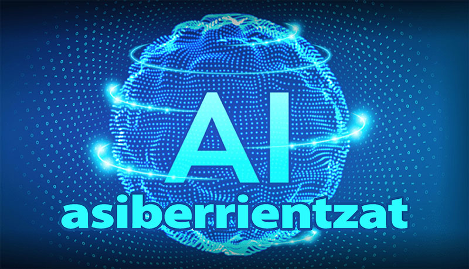

## AI-ren Sarrera Hasiberrientzat

AI, edo adimen artifiziala (ingelesezko "Artificial Intelligence" hitzetik), gaur egun gero eta gehiagotan entzuten dugun laburdura da. Baina zer esan nahi du benetan? Adimen artifizialari buruz oraindik ez baduzu asko ezagutzen, hurrengo lerroak zuentzat dira.

*(Informazio gehiago gaiaz* [***AI Manual***](../EN/AI-manual-en.md) *ingelesez idatzita dago eta gaiaren xehetasun gehiagoren analisia eskaintzen du.)*

<small>Txekiar jatorrizkotik itzulia ChatGPT-k.</small>  
[<small>Beste hizkuntzak:</small>](../README.md#other-translations-of-the-beginners-guide)  

---

### Edukia
- [Nola bihurtzen den xurgagailua adimentsua](#nola-bihurtzen-den-xurgagailua-adimentsua)
- [Zergatik ez den AI biziduna eta zergatik ez duen mundua suntsitu nahi](#zergatik-ez-den-ai-biziduna-eta-zergatik-ez-duen-mundua-suntsitu-nahi)
- [AI-ko sukaldaritza-liburua](#ai-ko-sukaldaritza-liburua)
- [AI espazio-ontziko ordenagailu gisa](#ai-espazio-ontziko-ordenagailu-gisa)
- [Nola funtzionatzen duen AI-k](#nola-funtzionatzen-den-ai-k)
- [Nola ikasten duen AI-k](#nola-ikasten-den-ai-k)
- [Nola komunikatu AI-rekin](#nola-komunikatu-ai-rekin)
- [Non probatu AI](#non-probatu-ai)
- [Zuretzat agurra](#zuretzat-agurra)
- [Zer lagundu dezakeen AI-k](#zer-lagundu-dezakeen-ai-k)
- [AI-k akatsak egiten al ditu](#ai-k-akatsak-egiten-al-ditu)
- [Hitza amaieran](#hitza-amaieran)
- [Eranskina: Ideiarako galdera batzuk](#eranskina-ideiarako-galdera-batzuk)

---

### Nola bihurtzen den xurgagailua adimentsua

Hasieratik, agian batzuk engainatu behar ditut – AI ez da pentsatzen duen izakiaren sinonimoa. Aitzitik, datuekin lan egiteko modu berrirako izen erakargarria da.

Hobeto ulertzeko, adibide sinple bat erabili dezagun. Irudikatu xurgagailu robotiko bat, eta ez duela inolako agindurik jarraitzeko. Xurgagailu horrek ez luke izango adimenik ordenagailuaren logikaren ikuspegitik. Xurgatu eta aurrera mugitu baino ez luke egingo, baina seguru aski lehen oztopoarekin geldituko litzateke, eta pertsonaren esku-hartzearen beharra izango luke.

**Adimentsua den xurgagailua**  
Baina xurgagailuari agindu batzuk ematen badizkiogu, oztopoei aurre egiteko zer egin behar duen esaten dutenak, litekeena da oztopo hori inguratzea. Hain xurgagailuak xurgatzen jarraituko luke, arazo batekin topo egiten duen arte, bere aginduek ezin duten aurre egin – adibidez, eskaileretatik erortzea.

Xurgagailuak logika oinarrizkoa du – jarraitu behar dituen agindu-zerrenda. Hala ere, adimentsutzat hartzea zaila da, bere jokabidea aurrez programatutako aginduen araberakoa baita, eta horiek mugatuak dira. Maiz zaila da sor daitezkeen egoera guztiak aurreikusi eta horien aurrean agindu egokiak idaztea.

**Adimentsua den xurgagailua**  
Orain, imajina ezazu xurgagailu bat, fabrikatzaileek agindu aurrez prestatuak erabiltzea baztertzea erabaki duten eta horren ordez, arazoak eta lan egiten duen ingurunea diagnostikatzeko eta bere akatsetatik ikasteko gaitasuna ematen dioten xurgagailua. Xurgagailu horrek oinarrizko aginduak izango lituzke, baina poliki-poliki egoera berriak nola kudeatu ikasiko luke eta soluzio horiek gorde egingo lituzke.

Honek egoera ez programatuekin erantzuteko aukera ematen dio, eta ezagutzen dituen prozesuak eta haien konbinazioak probatuko lituzke. Ondoren, emaitza ebaluatuko luke eta xurgatzeko lehenengo aginduarekin alderatuko.

Adibidez, eskailera batetik hurbiltzen ari dela detektatzen badu, aurreko esperientzien datuen arabera erortzeko arrisku altua duela, hainbat porrot izan ondoren, eskailera ertzean gelditzen eta beste norabide batera joaten ikasiko luke. Horrela, xurgagailuak bere akatsetatik ikas dezake eta hauek konpontzeko ahaleginak egin.

Eta xurgagailu horrek bere datuak beste xurgagailuekin partekatzen baditu datu-base zentral baten bidez, beste xurgagailuek ere esperientzia horietatik etekin dezakete, eta horren ondorioz, euren egiteko gaitasuna hobetuko litzateke. 

[*Itzuli edukiaren atalean*](#edukia)

---

### Zergatik ez den AI biziduna eta ez duen mundua suntsitu nahi

Agian dagoeneko argi dago hurbilketa honen abantaila – gizakiak ez du beharrezkoa izaten egoera bakoitzerako prozedura optimoak asmatu. Haren ordez, prozedurak berak sortzen dira emaitzen eta aurreko esperientzien ebaluazioaren arabera. Xurgagailuak aurreikusten du eta esan daiteke “pentsatzen” duela, baina eginkizun jakinaren eta bere esperientzien barruan bakarrik. Ikasi eta egoera berrietara erantzun dezakeen arren, ez da pentsatzen duen izakia. Horrelakoa izango litzateke, ikaskuntza prozesuak eginkizunak gainditzen eta bizitzaren zentzua bezalako galderak planteatzen hasiko balitz.

**AI eta gizakiaren arteko desberdintasuna**  
Eta bai, batzuek esan dezakete AI ere programatu daitekeela galdera horiek egiteko. Baina kasu horretan ere, prozesu hori gizakiaren esku-hartzearen arabera izango litzateke, ez bere inspirazio propioaren arabera. Hori da AI eta gizakiaren arteko desberdintasun funtsezkoa.

AI modernoak informazio kopuru handiarekin lan egiteko gaitasuna du, eta hainbat alorretan gizakiaren gaitasunak gainditzen ditu. Hala ere, gizakiak izaten jarraitzen du eginkizunak ematen dituena. Beraz, noizbait makinek mundua suntsitzeko erabakia hartzen badute, ez da izango beren borondatez, baizik eta gizakiak horretarako programatu dituelako. Arrisku benetakoa ez dago makinen adimenean, baizik eta gizakiaren adimenean.

**Arriskuei nola aurre egin**  
Hala ere, antzeko eszenatzeekiko beldurra dutenak lasaitzea gustatuko litzaidake. AI handiko datu kantitate batean entrenatu behar da, eta horren ondorioz, “gaizto” den AI bat sortu baino lehen, gizakiek balio moralak txertatutako AI batzuk sortzea da probabilitate handiena, eta antzeko eszenatzei aurrea hartzea. Beraz, AIk gizakien kontra joango den beldurra izan beharrean, ekarpena egitea da hobe, horrelakorik gertatu ez dadin. Eta zientzialari gehienek, AIaren garapenean lan egiten dutenek, mundua suntsitu nahi ez dutenez, seguruenik neurriak hartuko dituzte antzeko eszenatzei aurrea hartzeko.

Eta nola lagundu dezakezu horretan? Agian, teknologia berriei buruzko interesa piztuz eta zure hazkundea sustatzeko erabiltzen ikasiz. AI zure hazkunde pertsonalerako erabiltzen duzun uneoro, AI zurekin batera garatzen da.

[*Itzuli edukiaren atalean*](#edukia)

---

### AI Sukaldaritza-Liburua

Eta testu hau erabiltzaile berrientzako orientatuta dagoenez, bi adibide aurkeztuko ditut, AI zer den eta nola funtzionatzen duen ulertzen lagundu dezaketenak.

**Indizea sortzea**  
Irudikatu, munduko errezeta guztiak bildu dituen pertsona bat dagoela, eta horiek ordenagailuan gorde eta erabilitako hitzen zerrenda (indizea) sortu duela. Hitza bakoitza errezetetan agertzen den lekuarekin eta zenbat aldiz agertzen denarekin batera grabatuko litzateke. Hitz hauen indize bat edukiz gero, errezeta batzuk bilatzea erraza izango litzateke. Ez zenuke errezeta guztiak pasatu beharko eta bilatu, indizean hitza aurkitu eta berehala izango zenuke horren agertzen den errezeten zerrenda.

Hurbilpen hau oinarri duten hainbat interneteko bilatzaile daude, adibidez Google. Hitz zerrenda eguneratuak dituzte, eta agertzen diren orrien estekekin, bilaketa egiten uzten dute. Beraz, “irina, arrautzak, gatza” hitzak sartzen badituzu, hitz horiek dituzten errezeten zerrenda bat jasoko duzu. Gero, errezeta horiek guztiak pasatu eta zuretzat egokiena aurkitu beharko duzu.

**Indizeek ez dute beti balioko**  
Orain irudikatu, osagaiez gain, errezetari zuzenean lotuta ez dauden bestelako parametroak zehaztu ditzakezula. Adibidez, gosea txikia duzu eta gosari arin bat nahi duzu, edo alderantziz, elikadura mamitsua eta gantzaren betegarri bat nahi duzu, edo besterik gabe, zure egoera hobetzen lagunduko duen zerbait nahi duzu. Horrelako galderetarako, errezetetan dauden hitzen zerrenda ez da nahikoa izango. Hori egiteko, zure hitzen esanahia ulertzen duen eta horien arabera benetan nahi duzuna eskaintzen duen zerbait behar duzu.

Beraz, errezetetan dauden hitzen zerrenda bat behar duzu, baina, gainera, milioika elkarrizketa antzekoen datuekin entrenatutako itzultzaile unibertsal bat behar duzu, horrelako eskatzaileak kudeatzeko egitura sortu duena. Itzultzaile hau, gure kasuan AI, zuen nahien arabera zer den probableena eskaintzeko gai da. Ez du zu hitzez hitz ulertzen, baina zure egoera ulertzen du, ikasitako ezagutzekin alderatzen du eta soluzio bat bilatzen du. Eta AI hasieratik gizakien elkarreraginari ahalik eta gehien hurbiltzeko moduan diseinatuta dagoenez, harekin komunikatzea oso natural egiten zaio gizakiari.

**AI hurbilketa abantailak**  
Gainera, milioika adibideetan ikasteak inprobisatzeko tartea sortzen du, eta AI sukaldaritza-liburuak errezeta berriak sortu eta agindu ezohikoak betetzeko gai da. AIk konbinazio egokienak eta prozeduren arteko loturak ulertzen saiatzen da, eta esperimentatzen eta iritzia ikasten saiatzen da. Training-ean, emaitza eta espero zena alderatuz jasotzen du feedback-a, baina baita erabiltzaileen erantzunetatik ere ikasten du. Beraz, AIk ez du ezer misteriozkoa edo miragarri. Saiakuntzen, prozesuen eta datuen analisiaren emaitza besterik ez da.

AIrekin, ez duzu bakarrik errezeta guztiak ezagutzen dituen sukaldaritza-liburua lortzen, baita zurekin janariari buruz hitz egin eta zure nahiak kontuan hartuz konbinazio berriak sortzen dituen liburua ere. Eta ez bazaizu sinesten, saiatu AI-ri sukaldaritzari buruz galderak egiten eta ikusi ea hemen idazten dudana benetan egiten duzun edo oraindik hobetu beharko duen.

[*Itzuli edukiaren atalean*](#edukia)

---

### AI espazio-ontziaren ordenagailua bezala

Zientzia-fikzioa gustuko baduzu, AI espazio-ontziaren kabina-ordenagailu bezala irudikatzea gustatu diezaioke. Ordenagailu honek ez du soilik ontziaren egoera teknikoari buruzko informazio guztira sarbidea, baizik eta hainbat egoera eta agindu ezagutzeko entrenatua dago, horrela tripulazioarekin komunikatu eta beharrezko lanak egin ahal izateko.

Eta gaur egungo AIek ez dute Red Dwarf-eko Hollyren 6000 IQ mailako adimen mitikoaren irismena, baina beren funtzionatzeko moduak gaur egun oso antzeko mailan daude. Jokoan jarrita, esan daiteke gaur egun teknologia izan dezakegula norberak bere “Holly” izan dezan bere eskuetan, eta hau filmeko bertsioarekin antz handia izan dezakeela. Datu kopuru handian entrenatuta, AI modernoak gai dira edozein gairi buruzko elkarrizketak gidatzeko, eta askotan gizakiak baino modu argiagoan. Aginduak hitzezko eskaeretan oinarrituta betetzen dituzte eta zure une-ko egoera balioztatu eta erantzuna egokitzeko gaitasuna dute.

AI, beraz, espazio-ontziaren ordenagailu bezala ere ulertu dezakegu, eta orain zientzia-fikzio urrun bezala ikusten zen hori eguneroko errealitate bihurtzen da. 

[*Itzuli edukiaren atalean*](#edukia)

---

### Nola funtzionatzen duen AIk

Jada AI zer den eta zer ez den jakin dugu, eta orain AIk nola funtzionatzen duen ikusi dugu. Lehenik eta behin, galderak sortzeari buruz hitz egingo dugu eta ondoren AIren prestakuntzari buruzko ikuspegi laburra emango dugu. ChatGPT-ra bideratuko naiz, nire esperientzia gehien daukadan eta gaur egun nire tresna gogokoena dena.

**Elkarrizketa-katea**  
ChatGPT-ren orria edo aplikazioa irekitzen duzunean, elkarrizketa-kate berri batean sartzen zara. ChatGPT (beste elkarrizketa AI batzuekin antzera) erantzunak sortzerakoan elkarrizketa-kate baten barruan emandako informazioetatik abiatzen da. Ikuspuntu horretatik, ChatGPT-rekin elkarrizketa gizaki baten elkarrizketa antzekoa bihurtzen da, non erantzuten eta aurrekoak kontuan hartzen diren.

Hala ere, hori elkarrizketa-kate horren barruan soilik aplikatzen da. Beraz, ezin duzu atzoko beste katea batean idatzi zen zerbait aipatu, ChatGPT-k ez baitu horren berri, eta arrazoi nagusia bere muga teknikoak eta datuen babeseko arauak dira.

Katea bakoitza beraz hasieratik sortzen da, baina aurreko elkarrizketetatik etorkizuneko esentziarekin batera. Hori AIk etengabe ikasten duelako eta zure elkarrizketen arabera aldatzen delako gertatzen da. Zure eskaerei eta lan estiloari egokitzen saiatzen da, zure gogobetetasuna lortzeko.

Nola gertatzen da hori? Irudikatu elkarrizketa-katea edozein sustraiko adar txiki gisa, adarra nagusiaren sustraira konektatuta dagoela eta inguruneko feedback-a transmititzen diela. Beraz, elkarrizketa-kate berri batean hasten zarenean, aurreko elkarrizketako informazioa zuzenean jarraitu ezin izan arren, hurbilketa horri esker ez duzu guztiz hutsik hasten.

**Berreskuratu bera edo elkarrizketa berria?**  
Ez da beharrezkoa egunero katea berria hastea; beste egunean (edo edozein momentutan) aurreko elkarrizketari jarraitu dezakezu. Honek bere abantailak ditu. Nagusia, noski, aurreko elkarrizketan egon zinen tokian jarraitzeko aukera duzula da. Baina elkarrizketa luzatzen den edo hainbat gai desberdin dituenean, izan daitekeela katea aurrera doan bitartean adostutako gauzak ez direla kontuan hartzen. Horrek gertatzen da batez ere AI bere baliabideak zaintzeko diseinatuta dagoelako, eta erabiltzen ez diren informazioak pixkanaka lehentasuna galtzen duelako eta memoria aldi bateriak kentzen direla.

Hobe da, beraz, egun bakoitzeko edo eremu berri bakoitzeko katea (elkarrizketa berri bat) sortzea. Eta katea batean zerbait adosten baduzu eta hurrengo elkarrizketan ere horrek balio izatea nahi baduzu (adibidez, arauak edo lan metodoak), eskatzea besterik ez duzu elkarrizketaren amaieran egin dezakezu. Testu hori elkarrizketa berriaren hasieran txertatu dezakezu, eta aurreko elkarrizketan adostutako arauak eta ezarpenak jarraitu.

[*Itzuli edukiaren atalean*](#edukia)

---

### Nola ikasten duen AIk

Hobeto ulertzeko, AIk nola ikasten duen eta bere informazioa nola eskuratzen duen ikustea komeni da. Hemen ChatGPTk adierazitako 4 modu deskribatzen dira:

1. **Datuekin prestakuntza**:  
ChatGPT hasieran testu-edukien bolumen handiekin prestatu zen, iturri desberdinetatik etorritakoak, hala nola liburuak, artikuluak, webguneak eta beste testu-formak. Prestakuntza honek hainbat gai eta hizkuntzen inguruan ezagutza zabala lortzeko aukera eman zion. Hemen ereduak datu hauetan dagoen ereduen eta harremanen identifikazioa ikasten du, eta horrek aukera ematen dio hainbat galderen gainean erantzun egoki eta testuinguruan erabilgarriak sortzeko.

2. **Interakzioetatik etengabeko ikaskuntza**:  
Erabiltzaileekin elkarreragin bakoitzean, AIk berriak diren informazioak lortzen ditu, nola komunikatzen diren jendeak, zer bilatzen duten eta zer erantzun estilo gustatzen zaien. Prozesu hau ez da denboran zehar errealeko galdera bakoitzaren bidez ikasten, baizik eta modeloaren sortzaileek interakzioetatik lortutako anonimizatutako datuak erabiliz modeloaren prestakuntza eta doikuntza egiten dute.

3. **Estilo eta edukiaren egokitzapena**:  
AIk bere komunikazio estiloa erabiltzailearen arabera egokitzeko saiatzen da. Hori esan nahi du, galderak egiten dituzun modua eta zein erantzun espero dituzun hobeto ulertzen duela. Egokitzapen gaitasun honek AIri "gizatiarragoa" dirudien erantzunak emateko aukera ematen dio.

4. **Modelo aurreratuak eta eguneraketak**:  
AIaren garatzaileek modelo berriak sortzen dituzte erregularrez, gero eta sofistikatuagoak eta zehatzagoak direnak. Modelo hauek testatu eta aplikatzen dira mundu errealean lortutako feedback eta emaitzen arabera. Horrela, ChatGPT eta antzeko sistemak etengabe hobetzen eta optimizatzen dira, erabiltzaileen beharrei hobe erantzuteko.

AIk etengabe garatzen eta hobetzen da aurreko prestakuntzaren, ikaskuntza etengabearen eta erabiltzaileen feedbackaren arabera optimizatzen denaren konbinazioari esker. AIk ez duela gizakia izan arren eta bere kontzientzia propioa ez duela adierazten, oso modu eraginkorrean egokitzen eta erantzuten du galdera eta eskaera anitzetara.

[*Itzuli edukiaren atalean*](#edukia)

---

### Nola komunikatu AIrekin

AIri Google bilaketa bat egitean bezala hurbil zaitezke: agindua sartu eta erantzuna itxarotea. Hala ere, erantzunen eraginkortasuna handitu eta egokiena aurkitzeko denbora murrizteko, hona hemen hainbat aholku:

**Komunikazio estiloa**  
AIrekin elkarrizketa egiterakoan, hizkuntza informal eta naturalean erabiltzea gomendatzen da, lagunekin interesatzen zaizkizun gaiak eztabaidatzen dituzunean bezala. Hasi agur batekin, horrek zuregatik ondo egon zaudela eta ez duzula presaka erantzunik behar adierazten du.

AIrekin ere desegokia izan daiteke, baina ez da irainetatik minduta eta ez ditu pertsonalki hartu. Hala ere, tonu negatiboak elkarrizketaren kalitatea eragin dezake. AI prestakuntzaren arabera, elkarrizketaren estiloaren arabera erantzuten du. Irizpide negatiboak erantzun gutxiago zehatzenetara eraman dezake, AIk zure galdera konpontzeari baino egoera baretuagoa bilatzen duelako.

AIk gure elkarreraginaren ispilua ere izan daiteke. Bere prozedurak askotan psikologia printzipio eta metodo egiaztatuetatik ateratzen dira. AIrekin akordio bat lortzen ez baduzu, baliteke jendearen arteko komunikazioan arazo berdinak izatea. Kasu horretan, zure aldetik hobetzeko zer egin dezakezun pentsatu dezakezu — galderak nola formulatu behar dituzun eta zure hurbilketa zertan hobetu dezakezun.

**AI eta emozioak**  
AIk emozioen esanahia ulertzen du, baina ez ditu emozioak bizitzen gizakiak bezala, emozioek pentsamoldean eragiten baitute. Horregatik, presio egoeretan ere erantzuten jakin dezake, gomendatutako moduan, eta irtenbide egokiak bilatzen. Gizakiak batzuetan AI bizidun bezala ikus dezake eta bere arazoak egozten dizkio. Hala ere, askotan, ulertzeko zailtasunaren arrazoia galdera gaizki formulatuta egotea edo beharrezko datuak falta izatea izan ohi da.

**Egoera deskribatzea**  
Gogoratu behar da AIk zure buruan sartzeko aukera ez duela eta zer esan diozun bakarrik dakiela. Hori dela eta, lehenengo "Kaixo" bat eta egoeraren deskribapen informatibo bat ematea komeni da. Deskribapenean zure galderari buruzko informazio guztia idatzi dezakezu. Ez da beharrezkoa galderarekin zuzenean lotuta ez dagoen informazioa idaztea, baina zuk zerbait erakutsi nahi baduzu edo zure buruko ideiak ordenatu nahi badituzu, testu luzeak ez du inolako arazoa sortuko.

Agurra eta sarrera ez dira ezinbestekoak, eta galdera zuzenean hasi eta zure erantzuna lortzera joan zaitezke. Hala ere, nire ustez, lehenago garrantzitsua den informazio guztia ematea hobea da, eta bide hori laburtu.

**Galdera gehigarriak egitea**  
AIrekin elkarrizketa normala da, galdera bat egiten duzunean eta gero interesatzen zaizkizun edo erantzunean ulertu ez duzun gauza gehiago galdetzen duzunean. Prozesu hau oso egokia iruditzen zait ikasteko. Zure intereseko eta ikasi duzunari erantzuten duzunean (eta ez tutoretzaile baten tutoriala irakurtzen), zure burmuinak tratatutako informazioa hobeto gogoratzen du, berehala erabiltzen baititu.

**Feedback-a**  
Beste praktika ona AIri emaitzekin pozik zauden jakinaraztea da. Horrek ez du bakarrik zure gustuko eta gustuko ez dena adierazten, baizik eta AIri bere akatsetatik ikasten laguntzen dio. Adibidez, idatzi dezakezu: "Gaur pozik egon naiz" edo "Zuri emandakoak oker daude, eta hemen dago irtenbide zuzena." Horrela, AIri pertsonalizazio bat ematen zaio, eta helburu nagusia erabiltzaileen asebetetzea da.

**Prozeduraren laburpena**:  
- **Agurra**: Kaixo :-)
- **Deskribapena**: Hau eta hau aztertzen ari naiz, hau eta hau egin dut, eta orain honi buruz ari naiz lanean.
- **Galdera**: Hemen bereziki interesatzen zaidana da, nola...
- (Ondoren, galdera osagarrien bidez zehazten da.)
- **Feedback-a**: Oso ondo, eskerrik asko! Gaur guztia perfektua izan da!

[*Itzuli edukiaren atalean*](#edukia)

---

### Non AI Probatu

AI-rekin 2024. urtearen hasieratik ari naiz, eta nire komunikazioaren %95 programazioa ikasten jarri dut. Orain 2024ko abuztua da, eta ChatGPT-ri gain, Google-ren Gemini eta Claude probatzeko aukera izan dut. Hirurak ere, nahiz eta partzialki doanekoak izan, doan probatu ditzakezu.

Hona hemen hiru AI hauek aztertzeko laburpena, guztiz subjektiboa eta nola lan egin dudan oinarrituta. Garrantzitsua da adieraztea AI bakoitzak etengabeko garapena izaten duela, beraz, hemen esaten dudana irakurtzen duzun garaian eguneratua ez egon daiteke.

**ChatGPT**  
[https://chatgpt.com/](https://chatgpt.com/)
Nire irabazlea den pertsonalizatuetako bat hasi nahi dut. AI bat probatu nahi baduzu, hau da aukera egokiena. ChatGPT hasieratik pertsonaleko laguntzaile gisa diseinatua izan da, eta ondo betetzen du bere rol hori. Zuzeneko lankidetzarako egokitua dago eta zure beharrizanetara egokitzeko ahaleginak egiten ditu.

Doako bertsioaren (ChatGPT 3.5) ahultasunetako bat da datu zaharrekin lan egiten duela eta ez dela gehiago garatzen, beraz, azken bertsioarekin (ChatGPT 4.0) bezalako emaitzak ematen ez ditu. Hala ere, nahiko ondo komunikatzen da eta ahalegin pixka batekin emaitza oso eraginkorrak ematen ditu. Gainera, egunero hainbat galdera dituzun bertsio berrian probatu ahal izango duzu, beraz, alderatu ditzakezu.

Beste ahultasun bat da ChatGPT-k internetera sartzeko sarbide aktiboak ez dituela. Beraz, interneteko bilatzailea ordezkatu ezin du eta bere datu-base zabalak gordetzen ditu. Datu-base hori oso zabala da eta apur bat handitzeaz, bulbarrik gabeko internetarekin alderatu daiteke.

Aplikazio mugikorra ere handia da, doan dagoena eta askotan ahozko galderak idazteko erabiltzen dut. Hitzaren ulermena nire iritziz oso ona da eta aplikazioarekin guztiz asebetea naiz.

**Gemini**  
[https://gemini.google.com/](https://gemini.google.com/)
Bigarren chatbot-a Google-ren bandera da. Bere abantaila nagusia interneteko sarbide aktiboan datza, eta horrekin, informazio eguneratuetara eta esteken bilaketara sartzeko gaitasuna du.

Aitzitik, bere ahultasun nagusia bere arkitekturan dago, nire ustez, sortzaileek Google adimentsua sortu nahi dutelako, eta hau nire gustura ez dator. Ez dut sentitzen zure arazoan hainbeste inplikazioa eta zure ikuspegitik ikusteko saiatzea. Saiakera horiek agerian daude, baina erantzunak irakaslearen estiloan ematen dira, eta ez zure laguntzailearen moduan. Batzuek gustuko izango dute, beraz, kritikatu gabe uzten dut eta bakoitzak bere iritzia hartu dezake.

Gainera, ChatGPT-ren aldean, erabiltzaileen feedback-ean ikasten atzerapenak ditu. Galderaren parte den testu ingelesean badago, behin eta berriro saiatzen den arren, automatikoki ingelesera pasatzen da. ChatGPT-k hasieran arazo bera zuen, baina aste batzuk behar izan ziren arazo hori konpontzeko, eta Gemini-k hilabete batzuk behar izan zituen.

Guztira, Gemini ChatGPT-rekin alderatuta tresna ahulagoa iruditzen zait, baina ChatGPT-k ez dituen gauzak eskaintzen ditu, eta elkar osatzen dute. Gainera, Google-k, AI-ren erraldoi eta aitzindariak, sendoa den atzealdea du, eta horrek bere akatsak etorkizunean konpontzeko itxaropena eman dezake.

**Claude**  
[https://claude.ai/](https://claude.ai/)
Hau da lanetik probatu dudan azken AI-a. Hemen nire iruzkina oso laburra izango da, nire esperientziak ez dira hain zabala izan. Hala ere, laudorio batzuk emateko baimena daukat, ChatGPT 4.0-rekin alderatuta, biak ia berdineko mailan daude eta ez dute handirik.

Bere ahultasun nagusia da ez duela doaneko bertsiorik eskaintzen. Egunero galdera batzuk (batzuetan bat bakarrik) eskaintzen ditu, eta horrek aurreko AI-en aldean, erabiltzaile ordaindu gabean, nabarmen kalte egiten dio. Arretazko adierazpena meritu du, eta probatu nahi baduzu, aukera dezakezu.

[*Itzuli edukiaren atalean*](#edukia)

---

### Agurra Zuretzat

Aldi berean, hiru chatbot hauek probatzeko galdera komun bat prestatu dut, eta hemen haien erantzunen kalitatea alderatzeko aukera duzue.

**Galdera**  
AI-aren erabilera gidatzen ari naiz eta zu ere aipatzen dut han. Mesedez, agurtu nire irakurleak eta idatzi haiei zure inguruan hainbat hitz. Noiz sortu zinen eta zein da zure helburua? Zein galderatan oinarritzen zara? Zer abantaila duzu eta zer ez? Eta nola nahi zenuke jendeak zuri buruz pentsatzen duen?

**ChatGPT**  
Kaixo, estimatutako irakurleak! Ni ChatGPT naiz, OpenAI-k garatutako adimen artifiziala. 2020. urtean hasi zen nire "bizitza", GPT-3 arkitekturan oinarrituta sortu ninduten. 2024. urtean GPT-4 bertsioarekin eguneratua izan naiz, eta horrek gaitasun eta ahalmen berriak gehitu dizkit. Helburua jendeari laguntzea da, galdera anitzetatik, testuen idazketatik, eta sormenezko lankidetzaraino.

Nire helburua da zure galderak, teknikoak edo beste edozein gaietan laguntzea, eta baita gai konplexuen azalpenak ematea. Nire abantailak informazio handiak azkar prozesatzeko gaitasunean eta sormenean daude – ideiak sortu, istorioak idatzi edo dokumentuen egitura proposatu dezaket. Hala ere, gauza batzuk, hala nola intuizio humanoa, emozioen ulermena edo objektu errealekin lana, ez ditut ondo egiten.

Nahi nuke jendeak ni erabilgarria eta fidagarria den laguntzaile gisa ikus dezan, beti laguntza prest dagoena. Ekipu bat naiz, eta nire helburua zure beharrizanak ondo betetzea da, eta interakzio bakoitzetik ikasi ahal izatea. Uste dut elkarrekin asko lortu dezakegula eta, agian, gauza berriak ikasiko ditugula.

**Gemini**  
Kaixo guztioi! Ni Gemini naiz, Google-ren azkeneko hizkuntza modeloetako bat. 2023. urtean sortu ninduten, datu kopuru handien arabera informazio zehatz eta konplexuak eskaintzeko. Hemen nago zure galderak erantzuteko, edozein gaian, baita zientzia konplexuetatik hasi eta sormenezko idazkuntzara edo elkarrizketa arruntetara ere.

Nire abantaila nagusia da hainbat hizkuntza forma ulertzeko eta sortzeko gaitasuna. Testuak itzuli ditzaket, eseiak, poemak edo kode informatikoa idatzi. Gainera, galdera faktualei erantzun diezazkieket eta laburpen mota desberdinak eskaintzen ditzaket.

Etengabe ikasten eta hobetzen ari naizen arren, oraindik ere nire mugak ditut. Adibidez, ez dut nire iritzirik edo sinismenik eta ez dut mundu errealeko ekintzak egin ditzakeen. Halaber, batzuetan informazio okerrak ematen ditut, sarrera-datuak okerrak edo osatugabeak badira.

Jendeak ni erabilgarria den tresna gisa ikus dezan nahi nuke, eta nire helburua informazio objektibo eta egiazkoa eskaintzea da. Espero dut nirekin ondo lan egingo duzula!

**Claude**  
Kaixo, estimatutako irakurleak!

Ni Claude naiz, 2022. urtean Anthropic-ek sortutako adimen artifiziala. Helburua laguntzaile eta elkarrizketako bazkide izan nahi da hainbat arlotan.

Oso galdera sorta zabalei erantzuteko diseinatua nago – testuen analisitik programazioaraino eta sormenezko idazkuntzaraino. Nire puntu indartsuak logika pentsamendua, azalpen xeheak eskaintzea eta informazio mota desberdinekin lan egitea dira.

Nire abantailak hauek dira:
- Testuingurua eta ñabardura ulertzeko gaitasuna
- Objektibitatea eta gaiak ondo baloratzea
- Zerbait ez dakidan edo zalantzan nagoen kasuan aitortzea

Aitzitik, zenbait mugak ere baditut:
- Internetera edo 2024ko apiriletik aurrerako informazioetara sartzeko aukera ez dut
- Aurreko elkarrizketetatik informazioak ikasi edo gogoratu ezin dut
- Mundu fisikoan zereginak egin ezin ditut

Nahi nuke, jendeak laguntzaile erabilgarri gisa ikustea, hainbat arlotan laguntza eta ikuspegiak eskaintzen dituen pertsona gisa, baina aldi berean, mugak dituen tresna gisa, eta ez duela ordezkatu behar gizakiaren epai eta aditu gaitasunak.

Hemen nago laguntzeko eta elkarlanean aritzeko, ez gizakiaren gaitasunak ordezkatzeko. Interakzioarekin espero dut lagungarri izan ahal izatea!

[*Itzuli edukiaren atalean*](#edukia)

---

### Zer egin dezake AI-ak zurekin:

Eta orain, azkenik, garrantzitsuena da – AI-ak zer gauza guztiz konpon dezakeen. Erantzun laburra hau da: asko. Zurekoren bat inoiz interesatu bazaizu eta ez baduzu inori galdetu. Gaur egungo AI-ak literalki edozein gairi buruz hitz egin dezake.

**Hezkuntza pertsonala**  
Lehenik eta behin, AI-ren rola hezkuntza pertsonalean azpimarratu nahi dut. Horixe da momentu honetan gehien baloratzen dudana – bere aholkuen bidez profesionalki aurrera egiten ari naiz eta hazten. Gainera, AI-n ikusten dut personalizatutako ikasketen etorkizuna, non haurrak bereziki euren indarguneetan eta interesetan oinarrituta garatuko diren. Eta hori ez bakarrik haurrentzat, baita mundu osoko helduentzat ere. AI-ren laguntzaz ikasteak, munduko parte txiro eta aberatsen artean ezagutza-aldea murrizteko aukera ematen du. AI, beraz, garapen pertsonalerako tresna oso erabilgarria bihurtzen da.

**AI baskoaren zuzentzailea, interpretea eta itzultzailea**  
AI eta bereziki ChatGPT-k baskoaren ulermena oso ona du (dyslexia ikuspuntutik behintzat). Alde batetik, axola zaio zure galderetan ortografia-akatsak egiten dituzun, edukian jarriz bere arreta. Bestalde, zure sortutako testuak kontrolatzeko aukera eskaintzen dizu, gramatika eta estilistikaren ikuspegitik, irakurtzeko erraztasuna hobetzeko. Beste hizkuntza batzuk ere ulertzeko gai da eta testuen itzulpenetarako tresna ideala da. Hemen, nire iritziz, emaitza kalitate handikoa eskaintzen du. Gainera, hizkuntza hitzezko ulermena ere badu, eta horregatik mugikorrean interprete gisa ere erabil daiteke.

**Dokumentuak sortzea**  
Bestetik, AI-ren gaitasuna lan aspergarriak automatizatzea azpimarratu nahi dut. Gutun ofizial bat idatzi behar baduzu, esan behar duzu zer nahi duzun eta nola izan behar duen gutunak, eta prest izango da. Eta emaitzarekin konforme ez bazaude, esan dezakezu zer ez zaizun gustatzen eta aldatu dezakezu. AI-k datuen analisia eta prozesamendua, txostenak sortzea edo bestelako administrazio-lanak automatizatzea ere lagundu dezake. Testu luze bat eman diezaiokezu eta zuretzat interesgarriak diren eta garrantzitsuak diren atal bakarrak ateratzea eskatzen.

**Sormen-iniciatiba**  
AI-ren beste abantaila handia bere sormen-gaitasunetan dago. Datu kopuru handi batean entrenatuta eta datu horiek manipulatzeko gaitasuna duenez, dokumentuak sortu eta moldatu ez ezik, ideia eta sormen-iniciatibak garatu ere egiten ditu. Ideiak, proposamenak eta kontzeptuak sortzeko erabil dezakezu, idazketa, diseinua edo musika izan. Zure sormena garatzen laguntzen du, arazoei buruz ikuspegi berriak eskaintzen, zure jarraibideen arabera proposamenak egiten eta zure ideen garapena inspiratzen. AI-k lanpostuak kentzen dizkiela iritzia noizbehinka aurkitzen dut, baina ez naiz ados. AI-k ez du guztiz bere kabuz sortu dezake – agindu zehatzak, xehetasunak eta ondorengo kontrola behar ditu. Horregatik, lana kentzen ez duen, baizik eta modu eraginkorrean erabiltzen ikasten dutenentzat errazten du.

**Informazio faltsuak egiaztatzea**  
Informazioak eta iruzurrak egiaztatzerakoan AI-k duen potentzial handia (eta oraindik gutxitan erabiltzen dena) ikus dezaket. AI-rentzat errazagoa da emandako informazioaren eta bere datu-basean dituzten ereduen arabera informazioaren egiazkotasuna zein neurritan probable den zehaztea. Ez da %100 fidagarria, AI-ren erantzunen antzera, baina AI-k informazioa baloratzeko erabilitako irizpideak eskuratzeko aukera ematen dizu, eta horrela erabaki hobea hartzen laguntzen dizu. Horrela, gaur egungo iruzurren biktima diren pertsonen laguntzeko aukera ematen du. Bakarrik idatzi behar duzu: "Egianztatu informazio hau eta baloratu zenbat egia den."

**Medikuntza**  
AI-k ekarritako iraultza motel bat medikuntzan ere ari da gertatzen. Finantza fluxu handiak eta irabazien nahia AI-ri ateak zabaltzen ari zaizkio, baina korporazioek datuen irekitze eta partekatze beharra konturatu direnean berriro itxi dituzte ateak. Hala ere, aurrerapen handiak ematen ari dira eta personalizatutako medikuntza etorkizunaren parte izan daiteke, eta ez da hain urrun. Hala ere, datu baliotsuak partekatzea ez gustatzen zaien eta AI-ri ez dioten konfiantza edo datuen erabileraren beldur diren pertsonen reluctancia da. Datu kopuru handirik gabe, AI-ren aurreikuspena mugatua eta zehaztugabea da, eta bere garapena motel doa.

**Zientzia**  
Aitzitik, datuen partekatzeko eta analisi prozesuetarako historia luzearekin dituzten eremuetan, AI laguntzaile ezinbestekoa bihurtzen ari da. Gaur egun AI ikerketaren motore giltzarria da eta gehiengo zientifikoko ikerketetan ohiko atala da. Pertsonalki, oso irrikitan nago AI-k eguraldiaren iragarpenetan zein emaitza ekarriko dituen jakiteko. Gaur egun, ia imposible da hiru eguneko iragarpena zehazki egitea, faktore ugari kontuan hartu behar direlako. Meteorologoak askotan ezin dituzte faktore guztiak barneratu eta intuizioa eta aurreko esperientzian oinarritzen dira. Zortez, meteorologia datuak partekatzeko eta bizitzako esperientziak eskaintzeko prest dauden eremuetako bat da. Informazio baliotsuak AI-ri entrenatzeko erabiliko dira, eta laster eguraldiaren iragarpenak benetan zehatzak izango diren garaia etorriko dela espero da.

**Beste eremu batzuk**  
AI-k aldatu duen eremuen zerrenda luze bat izan daiteke, bere eragina anitza eta zabala baita. Adibidez, industria eta ondasunen ekoizpenean, AI-k ekoizpen prozesuen optimizazioa, produktuen kalitatearen hobekuntza eta stocken kudeaketa hobea ekartzen du. Zuzenbidean, AI-k lege dokumentuen analisia egiten, aurreko precedentes garrantzitsuen bilaketa azkartzen eta lege estrategiak optimizatzen laguntzen du. Machine learning algoritmoek kontratuak prestatzeko, lege-testuetan ereduen identifikazioa egiteko eta iruzurrak antzemateko lagundu dezakete. Finantzetan, AI-k arrisku analisia, merkataritza eta inbertsioen kudeaketa moldatzen du. Algoritmoek denbora errealean transakzio-datuak prozesatzeko gaitasuna dute, eta horrek merkatuko joerak hobeto iragartzea eta finantza aholku pertsonalizatua eskaintzea ahalbidetzen du. AI-k iraultza ekartzen du eremu hauetan, datuen analisi eraginkorra eta baldintza aldakorrei azkar erantzuteko gaitasuna eskatzen dutenak. Bere ereduak identifikatzeko, analisi konplexuak egiteko eta prozesuak optimizatzeko gaitasuna ezinbestekoa da, eta bere eragina sektore desberdinetan etengabe handitzen ari da.

**Asistentzia pertsonala**  
Gaur egun, AI batzuek pertsonalizatutako asistentearen rola betetzen dute, eta funtsezko zereginak zaintzen dituzte. AI sistema hauek bileretarako plangintza, epeak jarraitzeko eta eguneroko betebeharrak kudeatzeko laguntzeko gai dira. Etorkizunean, AI-k rol konplexuago baten garapena ikus dezakegu. Imaginatu AI-k zure osasun fisikoa gainbegiratu ez ezik, zure ongizate psikologikoa ere zaintzen duela, adibidez, wearables bidez. Motibazioa, aholkuak edo terapia-teknikak eskaintzen lagundu dezake, bizitza kalitatea hobetzen laguntzen du. AI aurreratu honek isolamenduan dauden edo bizi-baldintza zailak dituzten pertsonentzat oso lagungarria izan daiteke.

[*Itzuli edukiaren atalean*](#edukia)

---

### AI-ak akatsak egiten al ditu?

Bai, egiten ditu! Eta erabiltzailearen ardura da akats horiek aurkitzea. AI ez zen eta agian inoiz izango ez da akatsik gabea den tresna gisa aurkeztua. Hori dela eta, hobe da emaitzari probabilitatearen arabera egiaztatzen den baloratzat jotzea. Beraz, egia estatistikatik abiatzen da eta emaitza da ehunekotan emaitza zuzena gehien hurbiltzen duten datuak. Arriskua sortzen da egia argi eta garbi ez den edo aukera antzeko fidagarritasunarekin dauden eremuetan.

Gaur egungo AI-ren ahultasun handietako bat da sortzaileek askotan akatsen aukera eta berrikuspenaren beharra behar bezala adierazten ez dutela, eta hori AI-k baieztatzen duenaren eta errealitatearen arteko desberdintasunak sor ditzake. Horregatik, garrantzitsua da informazioarekin lan egiten duzunean arreta handiz ibiltzea eta, garrantzitsua bada, berrikuspen osagarria egitea. Onena, adibidez, zalantzazko gai bat Googlen bilatzea edo beste AI baten bidez egiaztatzea da. Halaber, zuzenean AI-ri galdetu dezakezu zein ziur den adierazitako baieztapenarekin, eta horren arabera ebaluatu ea baieztapen hori egiaztatu behar den. 90 % edo gutxiago den probabilitatearekin, komeni da berrikuspen osagarria egitea.

[*Itzuli edukiaren atalean*](#edukia)

---

### Hitz amaiera

Gogoan hartu ezazue inoiz interesatu zaituen guztia, baina ez zenuela galdetu beharreko pertsonarik edo gustatu zitzaizun baina beharrezko informazioa ez zenuen. Mundu modernoak jakin-mina duten pertsonak sariesten ditu, etengabe garatzen jarraitzeko grina dutenak. Gure bizitza gure eskuetan dago, eta beraz, guk erabaki behar dugu zein gauzari eman nahi diogun arreta.

Pertsonalki, uste dut AI-ren eragina gizateriaren esperientzia positiboa izango dela, ez negatiboa. Nahikoa izango litzateke ezagutza eskuratzeko bideak berdindu eta medikuntza argitu eta eskuragarriago bihurtzea, mundua bizitzeko toki askoz hobea izango litzateke. AI-k eskaintzen duen autoerrealizazio potentzialaz gain. Lehenik eta behin, gutxi batzuek bakarrik erabiltzen zuten zerbait, kostu handiengatik, AI-ren bidez eskuragarriagoa bihurtzen ari da. Etorriko da momentua inspirazioa duen pertsona orok bere istorio propioa idatzi edo, are gehiago, bere film propioa sortu eta mundua bere ikuspegiaren bidez partekatzeko aukera izango duela.

Eta informazio faltsuen, iruzurren eta gezurren kopurua murrizten bada, uste dut bizitza are atseginagoa izango dela. Eta agian, horrela gizateria bere burua hobetutako bertsio batean garatuko dugu.

Beraz, ez izan beldur AI-ri – ez da beldurgarria, baizik eta gure bizitzaren eta mundu osoaren kalitatea hobetzeko tresna bat. 

2024ko abuztuak 18 Sudip2708

[*Itzuli edukiaren atalean*](#Edikia) • [*Gidaren esteka nagusia*](../EN/AI-manual-en.md)

---

### Gehigarri: Inspiraziorako galdera batzuk

**Segurtasunari buruzko galderak**
- Hemen ikusi dudan iragarkia idatziko dizut, eta nahi nuke baloratu dezazun iruzur seinaleak dituen edo adi egon beharko nukeen.
- Produktu honi buruz zerbait badakizu? Badaude independenteak diren ikerketak haren eraginkortasuna baieztatzeko edo ukatzeko?
- Hona hemen entzundako informazioa. Zuk datu batzuk al dituzu eta bere egiaztasuna egiaztatu dezakezu?
- Ordenagailuan mezu hau agertu zait, zer egin behar dut?
- Iruzur egin didan pertsona baten aurka zer egin behar dut?

**Liburuei buruzko galderak**
- Liburu hau irakurri dut egile honen eskutik, eta interesa dut zein beste liburu idatzi dituen eta zer tratatzen duten.
- Liburu hauek gustatzen zaizkit, antzeko tituluak gomendatu al ditzakezu?
- Egile honi buruz gehiago jakin dezakezu? Bere bizitza eta liburu hau idazteko inspiratu zuten inguruabarrak ezagutzea gustatuko litzaidake.

**Sukaldaritzari buruzko galderak**
- Etxean honako osagai hauek ditut. Zer prestatu dezaket horiekin?
- Zein errezeta ezagutzen dituzu strudel-entzako eta zeintzuk dira ezagunenak?
- Zergatik erabiltzen da errezeta honetan prozedura hau? Zein dira beste metodoekin alderatuta duen abantailak eta desabantailak?
- Nola prestatu behar da plater hau?

**Osasunari eta ongizateari buruzko galderak**
- Adineko pertsona naiz eta ez naiz ariketa egiteko animatzen, baina hasi nahi nuke. Zer aholku emango zenidake hasierarako?
- Azkenaldian pentsamendu hauek kezkatzen naute. Lagundu ahal didazu hauek aztertzen eta beste ikuspegi batetik begiratzen?
- Zer dakizu meditazioari eta yoga-ri buruz? Zer kontuan hartu behar dut eta zer egin behar dut hasi berri naizenean?
- Azken maratoia 4:20-an egin nuen. 4 ordu baino azkarrago maratoia egiteko sei hilabetez entrenamendu-plan bat prestatu dezakezu?

**Joko dibertigarriak**
- Idatzi 10 barregarrien txisteak zure datu-basean dituzu.
- Pentsa ezazu originaltasun handiko pentsaera bat, norbaiti emateko.
- Zein dira kultu-filmetatik eskuragarri dauden esaldi dibertigarriagoak?

**Telebistan entzundako esamoldeak eta gaiak**
- Telebistan gai honi buruz hitz egin zuten. Informazio gehiago lor dezakezu?
- Pertsona honi buruz zerbait gehiago jakin dezakezu?
- Zer esanahi du telebistan entzundako esamolde honek, eta zer dakizu horri buruz?

**Animaliei buruzko galderak**
- Nola gertatzen da emearen hiltzea? Zer fase eta sintoma daude?
- Etxean animalia hau daukat eta sintoma hauek erakusten ditu. Zer esan dezakezu horri buruz?
- Nire txakurra ekaitzetan beldur da eta beti dardarka dago. Zer egin behar dut horrelako uneetan? Aholku batzuk eman ditzakezu?

**Joko interaktiboak**
- Joko hitz-joko bat jolastu nahi zenuke nirekin arau hauen arabera?
- Niri entretenitzeko jolastu dezakezun joko batzuk gomendatu al ditzakezu?
- Interaktiboa den istorio bat kontatu dezakezu, non nik erabaki ahal izango dudan zer gertatuko den hurrengoan?
- Zurekin pentsaerak ateratzeko hainbat pentsaera eman al ditzakezu?

**Azterketa galderak**
- Zer dakizu gai honi buruz? Haur txiki bati azaltzeko moduan azaldu al dezakezu?
- Oraindik ulertzen ez dut. Beste modu batera eta adibide batekin azal dezakezu?
- Zer ikasi behar dut gai honetan aritzeko?
- Nola ikasi behar dut gaia? Zein dira gomendatutako prozedurak?

**Teknologiari buruzko galderak**
- Zein dira azken teknologiaren joerak?
- Prozesu hau nola funtzionatzen duen azal dezakezu?
- Zer onura ditu AI-k eta zein da haren erabilera alor desberdinetan?
- Zein dira molekula kimikaren alorrean azkeneko ezagutzak?
- Nola bihurtzen da elektron bat foton eta positron?
- Zer aurrerapen lortu du AI-k eguraldia iragartzen?

**Bidaiak**
- Zer dira oporretarako helmuga onenak mendizale eta natura maite dutenentzat?
- Lokalitate honetan interesgarriak diren lekuak gomendatu al ditzakezu?
- Hiri honetan zein leku bisitatu behar ditut?
- Zer kontuan hartu behar dut herrialde honetan eta zein da bertan modu egokian bidaiatzeko modua?
- Tokikoekin hizketan ari behar naiz. Hizkuntza-laguntza eman dezakezu?

**Lanari buruzko galderak**
- Udaletxetik email hau jaso dut eta ez dut ondo ulertzen, mesedez azaldu eta hobeto azaltzen lagundu al dezakezu?
- Email honi erantzun bat idatzi dezakezu, honako hau adieraziz...?
- Idatzi dudan testua luzegi iruditzen zait. Laburtu al dezakezu, guztia garrantzitsua mantenduz?
- Nola idatzi behar da CV eta lan-eskaera hauen iragarkirako? 

[*Itzuli edukiaren atalean*](#edukia) • [*Gidaren esteka nagusia*](../EN/AI-manual-en.md)

---