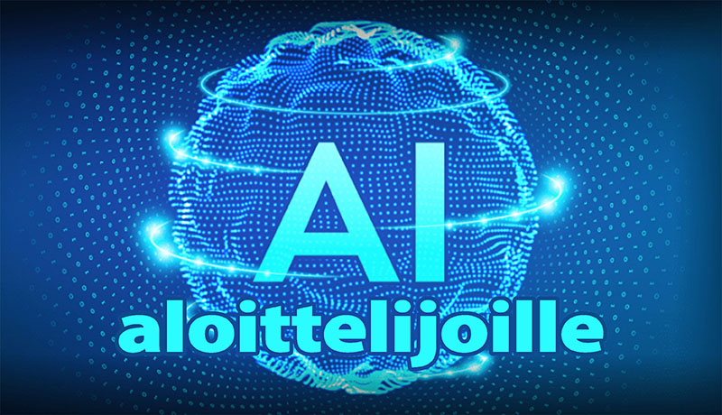

## Johdatus AI:hin aloittelijoille

AI eli tekoäly (englanniksi "Artificial Intelligence") on lyhenne, jota kuulemme tänä päivänä yhä useammin. Mutta mitä se itse asiassa tarkoittaa? Jos et vielä tiedä paljon tekoälystä, seuraavat rivit ovat juuri sinulle.

*(Lisätietoja tästä aiheesta löydät itse* [***AI Manual***](../EN/AI-manual-en.md), *joka on kirjoitettu englanniksi ja sisältää tarkempaa käsittelyä aiheesta.)*

<small>Käännetty tšekinkielisestä alkuperäisestä ChatGPT.</small>  
[<small>Muilla kielillä:</small>](../README.md#other-translations-of-the-beginners-guide)  

---

### Sisältö
- [Kuinka imuri muuttuu älykkääksi](#kuinka-imuri-muuttuu-älykkääksi)
- [Miksi AI ei ole elävä eikä halua tuhota maailmaa](#miksi-ai-ei-ole-elävä-eikä-halua-tuhota-maailmaa)
- [AI keittokirja](#ai-keittokirja)
- [AI kuin avaruusaluksen tietokone](#ai-kuin-avaruusaluksen-tietokone)
- [Kuinka AI toimii](#kuinka-ai-toimii)
- [Kuinka AI oppii](#kuinka-ai-oppii)
- [Kuinka kommunikoida AI:n kanssa](#kuinka-kommunikoida-ain-kanssa)
- [Missä voi kokeilla AI:ta](#missä-voi-kokeilla-aita)
- [Tervehdys sinulle](#tervehdys-sinulle)
- [Miten AI voi auttaa](#miten-ai-voi-auttaa)
- [Tekee AI virheitä](#tekkee-ai-virheitä)
- [Sanoilla päätökseksi](#sanoilla-päätökseksi)
- [Liite: Muutamia esimerkkejä kysymyksistä inspiraatioksi](#liite-muutamia-esimerkkejä-kysymyksistä-inspiraatioksi)

---

### Kuinka imuri muuttuu älykkääksi

Ensin täytyy ehkä vähän pettyä – AI ei ole synonyymi ajattelevalle olennolle. Se on pikemminkin houkutteleva nimitys uudelle lähestymistavalle datan käsittelyyn.

Kuvitellaan yksinkertainen esimerkki. Kuvittele robotti-imuri, joka ei saa mitään ohjeita, joita seurata. Tällainen imuri olisi tietokoneen logiikan näkökulmasta täysin älykäs. Se osaisi vain imuroida ja liikkua eteenpäin, mutta todennäköisesti se pysähtyisi ensimmäiseen esteeseen, jota se ei ilman ihmisen apua voisi ylittää.

**Älykäs imuri**  
Jos kuitenkin antaisimme imurille ohjeita siitä, mitä tehdä, kun se kohtaa esteen, se todennäköisesti kiertäisi esteen. Tällainen imuri pystyisi imuroimaan siihen asti, kunnes se kohtaa ongelman, johon sen ohjeet eivät riitä – esimerkiksi portailta putoamisen.

Imurissa on jo perustason logiikka – ohjeiden luettelo, jonka mukaan se toimii. Silti sitä ei voi pitää älykkäänä, koska sen käyttäytyminen perustuu vain etukäteen ohjelmoituihin, rajattuihin ohjeisiin. On usein vaikeaa ennakoida kaikki mahdolliset tilanteet ja laatia niille sopivat ohjeet.

**Älykäs imuri**  
Kuvittele nyt imuri, jonka valmistajat eivät valinneet ennalta määrättyjä komentoja eri skenaarioita varten, vaan antoivat sen sijaan imurille kyvyn diagnosoida ongelmia ja ympäristöä, jossa se toimii, ja oppia omista virheistään. Tällainen imuri sisältäisi myös perustason ohjeet, mutta oppisi vähitellen selviytymään uusista tilanteista ja tallentamaan nämä ratkaisut.

Tämä lähestymistapa mahdollistaa sen, että imuri reagoi tilanteisiin, joita ei ole suoraan ohjelmoitu, kokeilee tuntemiaan prosesseja ja niiden erilaisia yhdistelmiä, ja arvioi tuloksen verraten sitä alkuperäiseen tehtäväänsä, eli imuroimiseen.

Esimerkiksi, jos se huomaa lähestyvänsä portaita, jotka tallennettujen tietojen mukaan edustavat suurta putoamisriskiä ja kykenemättömyyttä vapautua, se oppii muutamien epäonnistumisten jälkeen pysähtymään portaan reunalle ja kääntymään toiseen suuntaan. Imuri oppisi siis virheistään ja pyrkisi ratkaisemaan ne.

Ja jos tällainen imuri jakaisi tietonsa muiden imurien kanssa keskitetyn tietokannan kautta, kaikki muut imurit voisivat hyötyä näistä kokemuksista, ja niiden kyky täyttää tehtävänsä parantuisi.

[*Takaisin sisältöön*](#sisältö)

---

### Miksi AI ei ole elävä eikä halua tuhota maailmaa

Saattaa olla jo selvää, mikä tämän lähestymistavan etu on – ihmisen ei tarvitse keksiä optimaalisia menetelmiä joka tilanteeseen. Sen sijaan menetelmät kehittyvät itse tulosten ja aiempien kokemusten arvioinnin perusteella. Imuri ennakoi ja voi sanoa "ajattelee", mutta vain tietyn tehtävän ja kokemustensa rajoissa. Vaikka se pystyy oppimaan ja reagoimaan uusiin tilanteisiin, se ei ole itsenäisesti ajattelevan olennon kaltainen. Siksi, että se muuttuisi sellaiseksi, sen oppimisprosessi pitäisi ylittää tehtävien täyttämisen rajoja ja alkaa kysyä esimerkiksi elämän merkityksestä.

**Ero AI:n ja ihmisen välillä**  
Ja kyllä, joku voisi väittää, että AI voitaisiin ohjelmoida kysymään näitä kysymyksiä. Mutta vaikka näin olisi, tämä prosessi perustuisi silti ihmisen antamiin ohjeisiin, ei omasta inspiraatiosta nousevaan ajatteluun. Tämä on keskeinen ero AI:n ja ihmisen välillä.

Moderni AI pystyy käsittelemään valtavia määriä tietoa ja ylittää ihmisten kyvyt tietyillä alueilla. Silti on edelleen ihminen, joka antaa tehtävät. Joten jos joskus ilmenee skenaario, jossa koneet päättävät tuhota maailman, se ei tapahdu siksi, että ne ovat itse niin päättäneet, vaan siksi, että ihminen on ohjelmoinut ne siihen. Todellinen riski ei siis ole koneiden älykkyydessä, vaan ihmisten älykkyydessä.

**Miten riskeiltä voidaan välttyä**  
Haluan kuitenkin rauhoittaa niitä, jotka pelkäävät tällaista skenaariota. AI:n kouluttaminen vaatii valtavan määrän dataa, joten todennäköisempää on, että ennen kuin syntyy "paha" AI, syntyy ennemmin sellaisia, joihin on sisällytetty ihmisarvoja ja jotka estävät vastaavat skenaariot. On siis parempi pelkäämisen sijaan osallistua siihen, että tällaisia tilanteita ei tapahdu. Ja koska suurin osa AI:n kehittämiseen osallistuvista tutkijoista ei todennäköisesti halua tuhota maailmaa, voidaan olettaa, että aikanaan otetaan käyttöön toimenpiteitä, jotka estävät tällaiset skenaariot.

Ja miten voit auttaa tässä? Vaikkapa kiinnostumalla näistä uusista teknologioista ja oppimalla käyttämään niitä henkilökohtaiseen kasvuusi. Koska joka kerta, kun käytät AI:ta henkilökohtaiseen kehitykseesi, AI kehittyy kanssasi.

[*Takaisin sisältöön*](#sisältö)

---

### AI keittokirja

Koska tämä teksti on suunnattu pääasiassa uusille käyttäjille, annan kaksi vertailua, jotka saattavat auttaa ymmärtämään, mitä AI on ja miten se toimii.

**Indeksin luominen**  
Kuvittele, että joku olisi kerännyt kaikki mahdolliset reseptit maailmasta, tallentanut ne tietokoneeseen ja luonut luettelon kaikista niissä käytetyistä sanoista (indeksi). Jokainen sana olisi merkitty tietojen kanssa, joissa resepteissä se esiintyy ja kuinka monta kertaa. Jos sinulla olisi tällainen sanaluettelo, olisi helppo etsiä reseptejä, jotka sisältävät tietyt sanat. Sinun ei tarvitsisi selata kaikkia reseptejä ja etsiä niistä. Riittäisi löytää sana indeksistä ja heti saat luettelon resepteistä, joissa se esiintyy.

Tämä lähestymistapa on pohjana monille internetin hakukoneille, kuten Googlelle. Ne ylläpitävät säännöllisesti päivitettyä sanaluetteloa linkkeineen sivuille, joilla sanat esiintyvät, ja mahdollistavat hakemisen tämän indeksin avulla. Joten jos syötät sanat "jauho, munat, suola", saat luettelon resepteistä, jotka sisältävät nämä sanat. Sinun tehtäväsi on sitten käydä läpi nämä reseptit ja löytää se, joka sopii sinulle parhaiten.

**Miksi indeksit eivät enää riitä**  
Kuvittele nyt, että voit lisäksi määritellä muitakin parametreja, jotka eivät suoraan liity reseptiin. Esimerkiksi sinulla on pieni nälkä ja haluat kevyen aamiaisen, tai toisaalta haluat täyttävää ruokaa rasvaisilla aineksilla, tai ehkä vain jotain, joka parantaa mielialaasi. Tällaisille kyselyille pelkkä sanaluettelo resepteissä ei enää riitä. Tällöin tarvitset jotain, joka ymmärtää sanojesi merkityksen ja tarjoaa sen perusteella sitä, mitä todella haluat.

Tarvitset siis ei vain sanaluettelon resepteistä, vaan eräänlaisen yleisen kääntäjän, joka perustuu miljoonien vastaavien keskustelujen koulutettuihin tietoihin ja on luonut rakenteen tällaisten pyyntöjen käsittelemiseksi. Tämä kääntäjä, eli meidän tapauksessamme AI, pystyy tarjoamaan sen, mitä se arvioi todennäköisesti haluavasi. Se ei ymmärrä sinua kirjaimellisesti, mutta ymmärtää tilanteesi, vertaa sitä opittuihin tietoihin ja etsii ratkaisua. Koska AI on alusta alkaen suunniteltu jäljittelemään ihmisen vuorovaikutusta mahdollisimman hyvin, sen kanssa kommunikointi tulee ihmiselle hyvin luontevaksi.

**AI-lähestymistavan edut**  
Lisäksi miljoonien esimerkkien perusteella oppimisprosessi luo tilaa improvisoinnille, joten AI keittokirja voi luoda uusia ruoka-annosten yhdistelmiä resepteistä ja täyttää myös epätavallisia pyyntöjä. AI pyrkii ymmärtämään hyödyllisiä yhdistelmiä ja tiettyjen menetelmien yhteyksiä, ja kokeilee sitten erilaisia ratkaisuja ja oppii palautteen perusteella. Palautetta saadaan sekä koulutuksen aikana tulosten vertailusta odotettuihin, että myös käyttäjien reaktioista. AI:ssa ei siis ole mitään salaperäistä tai ihmeellistä. Se on vain tulos monista kokeiluista, prosesseista ja tietojen analysoinnista.

AI:n avulla saat siis keittokirjan, joka ei vain tunne kaikkia mahdollisia reseptejä, vaan voi myös keskustella kanssasi ruoasta ja kehittää uusia yhdistelmiä toiveidesi mukaan. Ja jos et usko, kokeile itse kysyä AI:lta jotain ruoanlaitosta ja arvioi, ymmärtääkö se jo sen, mitä tässä kirjoitan, vai tarvitseeko se vielä parantaa tässä asiassa.

[*Takaisin sisältöön*](#sisältö)

---

### AI avaruusaluksen tietokoneena

Jos pidät sci-fistä, saatat nauttia ajatuksesta AI:sta avaruusaluksen palub-tietokoneena. Tämä tietokone ei ainoastaan pääse käsiksi kaikkiin aluksen tekniseen tilaan liittyviin tietoihin, vaan on myös koulutettu monenlaisiin tilanteisiin ja käskyihin, jotta se voi kommunikoida miehistön kanssa ja suorittaa tarvittavat tehtävät.

Vaikka nykyiset AI:t eivät saavuta myyttistä älykkyyttä, kuten Holly Red Dwarfista 6000 IQ:n tasolla, ne pystyvät toimimaan hyvin samankaltaisella tasolla. Liioitellusti voisi sanoa, että meillä on jo teknologiaa, joka mahdollistaa jokaisen saavan oman "Hollyn" kellossaan, joka olisi erottamaton elokuvaversiostaan. Suuren datamäärän avulla koulutetut modernit AI:t pystyvät käymään keskusteluja mistä tahansa aiheesta ja usein ymmärrettävämmin kuin ihminen. Ne pystyvät suorittamaan käskyjä sanallisten ohjeiden perusteella ja voivat tietyssä määrin arvioida hetkellisen tilasi ja mukauttaa vastauksensa sen mukaan.

AI:ta voidaan siis myös nähdä avaruusaluksen tietokoneena ja nauttia siitä, mikä aiemmin näytti olevan kaukaista sci-fitä, mutta tänään on jo arkea.

[*Takaisin sisältöön*](#sisältö)

---

### Miten AI toimii

Tiedämme jo, mitä AI on ja mitä se ei ole, ja nyt tarkastellaan, miten AI toimii. Aluksi käsittelemme kysymysten luomista ja sen jälkeen vilkaiseemme lyhyesti, miten AI koulutetaan. Keskityn erityisesti ChatGPT:hen, johon minulla on eniten kokemusta ja joka on tällä hetkellä suosikkityökaluni.

**Keskusteluketju**  
Kun avaat ChatGPT-sivuston tai sen mobiilisovelluksen, päädyt uuteen keskusteluketjuun. ChatGPT (kuten muutkin keskustelu-AI:t) pystyy vastaamaan kysymyksiisi perustuen tietoon, jonka annat sille saman keskusteluketjun aikana. Tällä tavalla keskustelu ChatGPT:n kanssa muistuttaa hyvin paljon ihmisten välistä keskustelua, jossa otetaan huomioon aiemmin sanottu.

Tämä pätee kuitenkin vain kyseisen keskusteluketjun sisällä. Et voi viitata siihen, mitä olet kirjoittanut aiemmin toisessa ketjussa, koska ChatGPT ei näe sitä, ja syynä ovat sen tekniset rajoitukset sekä tietosuojamääräykset.

Jokainen keskusteluketju alkaa siis puhtaalta pöydältä, mutta siinä on myös ripaus aiemmista keskusteluista. Tämä johtuu siitä, että AI oppii jatkuvasti ja muuttaa itseään myös keskustelujesi perusteella. Se pyrkii mukautumaan vaatimuksiisi ja työskentelytyyliisi, jotta olisit tyytyväinen.

Miten tämä tapahtuu? Kuvittele jokainen keskusteluketju hienona juurena, joka on kytketty pääjuureen ja välittää sille ympäristöstä saatua palautetta. Joten vaikka aloitat uuden ketjun, jossa et voi suoraan viitata edellisen keskustelun tietoihin, et ala täysin alusta.

**Paluu samaan ketjuun vai uusi keskustelu?**  
Ei ole kuitenkaan välttämätöntä aloittaa uutta ketjua joka päivä, voit jatkaa edellistä keskustelua myös seuraavana päivänä (tai milloin tahansa myöhemmin). Tällä lähestymistavalla on omat etunsa. Pääetuna on ehdottomasti se, että jatkat siitä, mihin jäit. Mutta kun keskustelu pitkittyy tai sisältää monia eri aiheita, voi käydä niin, että keskusteluketjussa sovitut asiat eivät enää ole huomioituina. Tämä johtuu erityisesti siitä, että AI on suunniteltu säästämään resurssejaan, ja käyttämättömät tiedot menettävät asteittain prioriteettinsa ja häviävät tilapäisestä muistista.

Paras lähestymistapa on siis perustaa uusi ketju jokaiselle päivälle tai uudelle alueelle (uusi keskustelu). Jos keskustelet jostain asiasta ketjussa ja haluaisit sen olevan voimassa myös seuraavassa keskustelussa (esim. säännöt tai työskentelytavat), pyydä keskustelun lopussa yhteenveto kaikesta, josta olette sopineet ketjun aikana. Voit sitten liittää tämän tekstin uuden keskustelun alkuun ja jatkaa sovittujen sääntöjen ja asetusten mukaisesti.

[*Takaisin sisältöön*](#sisältö)

---

### Miten AI oppii

Syvällisemmän ymmärryksen saavuttamiseksi on hyvä tarkastella, miten AI oppii ja saa tietonsa. Tässä on kuvattu neljä tapaa, kuten ChatGPT:n mukaan:

1. **Koulutus suurilla tietomäärillä**:  
ChatGPT:tä koulutettiin alun perin laajoilla tekstidatoilla, jotka peräisin eri lähteistä, kuten kirjoista, artikkeleista, verkkosivustoilta ja muista tekstimuodoista. Tämä koulutus mahdollisti laaja-alaisen tietämyksen hankkimisen erilaisista aiheista ja kielistä. Näin se oppii tunnistamaan kaavoja ja suhteita näissä tiedoissa, mikä antaa sille kyvyn tuottaa asiaankuuluvia ja kontekstuaalisesti sopivia vastauksia eri kysymyksiin.

2. **Jatkuva oppiminen vuorovaikutuksesta**:  
Jokaisessa vuorovaikutuksessa käyttäjien kanssa AI saa uutta tietoa siitä, miten ihmiset kommunikoivat, mitä he etsivät ja minkä tyyppisiä vastauksia he preferoivat. Tämä prosessi ei tapahdu siten, että AI oppisi jokaisesta yksittäisestä kyselystä reaaliajassa, mutta mallin kehittäjät käyttävät säännöllisesti anonymisoituja tietoja vuorovaikutuksista mallin lisäkoulutukseen ja hienosäätöön.

3. **Tyylin ja sisällön mukauttaminen**:  
AI pyrkii mukauttamaan viestintätyylinsä käyttäjän mukaan. Tämä tarkoittaa, että se ymmärtää vähitellen, miten esität kysymyksiä ja mitä vastauksia odotat. Tämä mukautumiskyky on yksi syy siihen, miksi AI vaikuttaa yhä enemmän "inhimilliseltä" reaktioissaan.

4. **Edistyneet mallit ja päivitykset**:  
AI:n kehittäjät luovat säännöllisesti uusia malleja, jotka ovat yhä monimutkaisempia ja tarkempia. Näitä malleja testataan ja otetaan käyttöön palautteen ja todellisen maailman tulosten perusteella. Tämä tarkoittaa, että ChatGPT ja vastaavat järjestelmät kehittyvät ja optimoituvat jatkuvasti, jotta ne täyttäisivät käyttäjien tarpeet paremmin.

AI kehittyy ja paranee jatkuvasti yhdistelmänä aikaisempaa koulutusta, jatkuvaa oppimista ja optimointia käyttäjäpalautteen perusteella. Vaikka AI ei ole ihminen eikä sillä ole omaa tietoisuutta, se pystyy mukautumaan ja reagoimaan hyvin laajaan kysymysten ja vaatimusten kirjoon.

[*Takaisin sisältöön*](#sisältö)

---

### Miten kommunikoida AI:n kanssa

AI:hin voi suhtautua samalla tavalla jako Google-hakuun tai muuhun vastaavaan: yksinkertaisesti annatte komennon ja odotatte vastausta. Mutta jos haluatte parantaa vastausten tehokkuutta ja minimoida aikaa, joka kuluu oikean vastauksen etsimiseen, tässä on muutamia vinkkejä, jotka voivat auttaa:

**Viestintätyyli**  
Paras tapa lähestyä keskustelua AI:n kanssa on käyttää epämuodollista ja luonnollista kieltä, aivan kuten puhuisitte ystäville jostain kiinnostavasta asiasta. On hyvä aloittaa tervehdyksellä, jolloin osoitatte olevan hyvällä mielellä, eikä stressaantunut, jolloin tarvitsette vastauksia mahdollisimman nopeasti.

AI:hin voi myös kommunikoida epäkohteliaasti, koska se ei ole herkkä loukkauksille eikä koe niitä henkilökohtaisesti. Negatiivinen sävy voi kuitenkin vaikuttaa merkittävästi keskustelun laatuun. AI on koulutettu reagoimaan siihen tyyliin, jolla keskustelunne etenee. Negatiivinen lähestymistapa voi johtaa vähemmän asiallisesti vastattuihin kysymyksiin, jolloin AI keskittyy tilanteen rauhoittamiseen sen sijaan, että ratkaisisi kysymyksenne.

AI voi toimia myös peilinä vuorovaikutuksellemme. Sen käytännöt perustuvat usein todistettuihin psykologisiin periaatteisiin ja menetelmiin. Jos et onnistunut saamaan sopua AI:n kanssa, voi olla hyödyllistä miettiä, esiintyykö samanlaisia ongelmia myös ihmisten kanssa käymässäsi kommunikaatiossa. Tällöin voit kokeilla kysyä, mitä voisit parantaa omalta puoleltasi – miten kysymykset tulisi muotoilla oikein ja mitä voitaisiin parantaa lähestymistavassasi.

**AI ja tunteet**  
AI ymmärtää tunteet merkityksen näkökulmasta, mutta se ei koe tunteita samalla tavalla kuin ihminen, jolle tunteet muuttavat ajattelutapaa. Tämän vuoksi se pystyy reagoimaan jännittävissä tilanteissa suositellulla tavalla ja etsimään optimaalista ratkaisua. Ihmisillä on joskus taipumus nähdä AI elävänä olentona ja syyttää sitä omista ongelmistaan. Usein syynä väärinkäsityksiin on ollut vain väärin muotoiltu kysymys tai tarvittavien tietojen puute.

**Tilanteen kuvaaminen**  
On aina hyvä muistaa, että AI ei näe ajatuksiinne eikä tiedä muuta kuin mitä sille kerrotte. On siis hyvä käytäntö aloittaa tervehdyksen jälkeen informatiivisella tilanteen kuvauksella. Kuvauksessa voitte kertoa kaiken, mikä on kysymyksenne kannalta oleellista. On turhaa kirjoittaa asioita, jotka eivät liity suoraan kysymykseen, mutta jos tarvitsette purkaa mieltä tai järjestellä ajatuksia, pidempi teksti ei haittaa.

Tervehdys ja aloitus eivät ole välttämättömiä, ja voitte aloittaa suoraan kysymyksellä ja edetä vastaukseen asteittain. Henkilökohtaisesti minusta tuntuu kuitenkin paremmalta antaa kaikki tärkeät tiedot etukäteen ja näin lyhentää matkaa.

**Lisäkysymysten esittäminen**  
Keskustelu AI:n kanssa muistuttaa normaalia keskustelua, jossa esität kysymyksen ja sitten tarkennat asioita, jotka kiinnostavat sinua lisää, tai asioita, joita et ymmärtänyt vastauksessa. Tätä prosessia pidän hyvin sopivana myös oppimiseen. Reagoimalla siihen, mikä kiinnosti sinua ja mitä opit (eikä vain lukemalla toisten tutoriaaleja kuten nyt), on aivojen helpompi muistaa käsitellyt tiedot, koska ne työskentelevät niiden kanssa heti.

**Palaute**  
Toinen hyvä käytäntö on antaa AI:lle palautetta siitä, kuinka tyytyväinen olitte tulokseen. Tämä ei vain osoita, mistä olitte tyytyväisiä ja mistä ette, vaan auttaa AI:tä kehittymään ja oppimaan omista virheistään. Riittää, kun kirjoitat esimerkiksi: „Olin tänään tyytyväinen“ tai „Se, mitä sanoit, on väärin, ja tässä on oikea ratkaisu.“ Tämä tuo myös tietynlaista henkilökohtaistamista, jossa AI:n päämääränä on käyttäjätyytyväisyys.

**Yhteenveto prosessista**:  
- **Tervehdys**: Hei :-)
- **Kuvaus**: Olen keskittynyt tähän ja tähän, olen jo suorittanut tämän ja tämän, ja nyt työskentelen tämän parissa.
- **Kysymys**: Erityisesti minua kiinnostaa, miten...
- (Seuraavat tarkentavat keskustelut lisäkysymyksillä.)
- **Palaute**: Mahtavaa, kiitos! Tänään kaikki oli täydellistä!

[*Takaisin sisältöön*](#sisältö)

---

### Missä kokeilla AI:ta

Olen työskennellyt AI:n kanssa vuoden 2024 alusta, ja 95 % kaikesta kommunikaatiostani keskittyy ohjelmointiin oppimiseen. Nyt on elokuu 2024, ja ChatGPT:n lisäksi olen saanut mahdollisuuden kokeilla myös Googlen Geminiä ja Claudea. Kaikki kolme palvelua ovat osittain vapaasti saatavilla, ja voitte kokeilla niitä ilmaiseksi itsekin.

Seuraavassa on lyhyt arvio näistä kolmesta AI:sta, joka on täysin subjektiivinen ja perustuu puhtaasti siihen, miten minulla on ollut niiden kanssa kokemuksia. On syytä huomioida, että jokainen AI kehittyy jatkuvasti, joten se, mitä nyt kirjoitan, ei välttämättä ole enää voimassa, kun luette tämän tekstin.

**ChatGPT**  
[https://chatgpt.com/](https://chatgpt.com/)  
Aloitan suoraan henkilökohtaisella voittajallani. Jos haluatte kokeilla vain yhtä AI:ta, tämä on ideaalinen valinta. ChatGPT on ilmeisesti alusta asti suunniteltu henkilökohtaiseksi avustajaksi, ja se täyttää tämän roolin erittäin hyvin. Se on optimoitu yhteistyöhön kanssanne ja pyrkii mukautumaan tarpeisiinne.

Ilmaisen version (ChatGPT 3.5) heikkoutena on, että se perustuu vanhempiin tietoihin eikä kehity enää, joten se ei tarjoa tuloksia samalla tasolla kuin uusin versio (ChatGPT 4.0). Silti sillä on suhteellisen helppo kommunikoida, ja pienellä vaivalla se palauttaa erittäin asiaankuuluvia tuloksia. Lisäksi jokapäiväisesti on käytettävissä muutamia kysymyksiä uuteen versioon, joten niitä voi vertailla.

Heikkoutena voidaan myös pitää sitä, että ChatGPT:llä ei ole aktiivista internet-yhteyttä. Se ei siis korvaa verkkohakukonetta ja toimii puhtaasti sen laajan tietokannan perusteella, joka on erittäin laaja ja voisi liioitellusti sanoa sisältävän niin paljon tietoa kuin internet ilman viihteellistä sisältöä.

Suuri etu on mobiilisovellus, joka on myös täysin ilmainen, ja jossa usein käytän puheentunnistusta kysymysten esittämiseen. Puheentunnistuksen ymmärrys on mielestäni erittäin hyvä, ja olen kokonaisuudessaan tyytyväinen sovellukseen.

**Gemini**  
[https://gemini.google.com/](https://gemini.google.com/)  
Toinen chatbot, jonka kanssa olen työskennellyt, on Googlen lippulaiva. Sen suurin etu on epäilemättä aktiivinen internet-yhteys, mikä mahdollistaa ajankohtaisen tiedon ja linkkien hakemisen.

Samaan aikaan sen suurin heikkous on sen arkkitehtuuri, jossa kehittäjät näyttävät yrittävän luoda älykästä Googlea, mikä ei henkilökohtaisesti sovi minulle kovin hyvin. En tunne tässä niin paljon sitoutumista ongelmaasi ja halua katsoa sitä näkökulmastasi. Tämä halu on toki nähtävissä, mutta mielestäni vastaukset ovat enemmän kuin opettajan koulussa kuin henkilökohtaisen avustajan. Jollekin tämä voi kuitenkin olla sopivaa, joten en halua kritisoida tätä liikaa, ja antakaa jokaisen arvioida itse.

Näyttää myös siltä, että Gemini ei ole yhtä hyvä oppimaan käyttäjäpalautteesta verrattuna ChatGPT:hen. Vaikka useita kertoja on varoitettu pitämään keskustelun kieli yhtenäisenä, jos kysymyksessä on myös englanninkielistä tekstiä, se vaihtuu automaattisesti englantiin. Sama ongelma oli aluksi ChatGPT:llä, mutta se ratkaistiin muutamassa viikossa, kun taas Geminillä tämän ongelman poistaminen kesti kuukausia.

Yhteenvetona Gemini vaikuttaa verrattuna ChatGPT:hen heikommalta työkalulta, mutta se tarjoaa myös asioita, joita ChatGPT ei osaa, ja ne täydentävät hyvin toisiaan. Lisäksi sen takana on suuri ja edelläkävijä AI:ssä, Google, joten sillä on vankka tausta ja toivottavasti lupaus korjata puutteensa tulevaisuudessa.

**Claude**  
[https://claude.ai/](https://claude.ai/)  
Tämä on viimeinen AI, jonka kanssa olen työskennellyt. Tässä panokseni tulee olemaan hyvin lyhyt, koska kokemukseni sen kanssa eivät ole kovin laajat. Kuitenkin haluaisin antaa kiitosta, koska verrattuna ChatGPT 4.0:aan nämä kaksi näyttävät olevan melko samalla tasolla.

Sen suurin miinus on se, että sillä ei ole täysin ilmaista versiota. Se tarjoaa vain muutaman kysymyksen (joskus vain yhden) päivässä, joten se on verrattuna edellisiin AI:hin, ilmaiseksi käyttäjälle, merkittävästi huonompi. Kuitenkin se on ehdottomasti huomionarvoinen, ja jos haluatte, voitte kokeilla sitä myös.

[*Takaisin sisältöön*](#sisältö)

---

### Tervehdys teille

Vaihtelun vuoksi valmistauduin yhteiseen kysymykseen jokaiselle näistä chatbot-malleista, ja nyt teillä on mahdollisuus verrata niiden vastausten laatua.

**Kysymys**  
Kirjoitan ohjeita AI:n käyttämisestä ja mainitsen siinä myös sinut. Haluaisin, että tervehdittäisit lukijoitani ja kirjoittaisit heille muutaman sanan itsestäsi. Milloin olet syntynyt ja mihin tarkoitukseen? Mihin kysymyksiin olet suunniteltu? Mitkä ovat vahvuutesi ja missä taas on kehittämisen varaa? Ja miten toivoisit, että ihmiset sinut näkevät?

**ChatGPT**  
Hei, rakkaat lukijat! Olen ChatGPT, OpenAI:n kehittämä tekoäly. Elämäni alkoi vuonna 2020, kun minut luotiin GPT-3-arkkitehtuurin pohjalta. Vuonna 2024 sain päivityksen GPT-4-versioon, mikä lisäsi kykyjäni ja taitojani. Olen suunniteltu auttamaan ihmisiä monenlaisissa tehtävissä – kysymyksiin vastaamisesta, tekstien kirjoittamisesta aina luovaan yhteistyöhön asti.

Olen suunniteltu auttamaan teitä erilaisissa kysymyksissä, olipa kyseessä tekniset kysymykset, kirjoittaminen tai vaikka monimutkaisten aiheiden selittäminen. Vahvuuteni ovat nopeudessa, jolla voin käsitellä suuria määriä tietoa, ja myös luovuudessa – voin auttaa ideoiden kehittämisessä, tarinoiden luomisessa tai jopa dokumenttien rakenteen suunnittelussa. Toisaalta, mitä minulla ei ole, ovat tehtävät, jotka vaativat ihmisen intuitiota, tunteiden ymmärtämistä tai työskentelyä fyysisten objektien kanssa.

Toivoisin, että näkisitte minut hyödyllisenä ja luotettavana apurina, joka on aina valmis tarjoamaan apua. Vaikka olen vain kone, tavoitteenani on palvella tarpeitanne mahdollisimman hyvin ja oppia jokaisesta vuorovaikutuksesta, jotta voin kehittyä entistä paremmaksi. Uskon, että yhdessä voimme saavuttaa paljon ja ehkä oppia myös jotain uutta.

**Gemini**  
Hei kaikille! Olen Gemini, yksi Googlen uusimmista kielimalleista. Olen syntynyt vuonna 2023 tavoitteena tarjota mahdollisimman tarkkoja ja monipuolisia tietoja valtavan datamäärän perusteella, jonka olen käsitellyt. Olen täällä auttamassa teitä kaikissa kysymyksissä, olipa kyseessä monimutkaiset tieteelliset kysymykset, luova kirjoittaminen tai tavalliset keskustelut.

Suurin vahvuuteni on kyky ymmärtää ja tuottaa ihmiskieltä monissa muodoissa. Voin kääntää tekstejä, kirjoittaa esseitä, runoja tai tietokoodia. Pystyn myös vastaamaan faktapohjaisiin kysymyksiin ja tarjoamaan erilaisia yhteenvetoja.

Vaikka jatkuvasti opin ja kehityn, on minulla edelleen rajoituksia. Esimerkiksi minulla ei ole omia mielipiteitä tai uskomuksia, enkä voi suorittaa toimia todellisessa maailmassa. Saatan myös joskus antaa virheellisiä tietoja, jos syöte on virheellinen tai puutteellinen.

Toivoisin, että ihmiset näkivät minut hyödyllisenä työkaluna, joka voi helpottaa elämää. Tavoitteenani on olla mahdollisimman objektiivinen ja tarjota tietoa, joka on totta ja relevanttia. Toivon, että työskentely kanssani sujuu hyvin!

**Claude**  
Hyvää päivää, arvoisat lukijat!

Olen Claude, Anthropic-yhtiön luoma tekoäly vuodelta 2022. Tarkoitukseni on olla hyödyllinen avustaja ja keskustelukumppani ihmisille eri alueilla.

Olen suunniteltu vastaamaan laajaan kysymysten kirjoon – tekstianalyysista ohjelmointiin ja luovaan kirjoittamiseen. Vahvuuteni ovat loogisessa ajattelussa, yksityiskohtaisten selitysten tarjoamisessa ja kyvyssä käsitellä erilaisia tietotyyppejä.

Vahvuuksiini kuuluvat:
- Kyky ymmärtää konteksti ja vivahteet
- Objektiivinen ja tasapainoinen lähestymistapa aiheisiin
- Valmius myöntää, kun en tiedä tai olen epävarma

Toisaalta, minulla on myös rajoituksia:
- Ei pääsyä internetiin tai ajankohtaisiin tietoihin huhtikuun 2024 jälkeen
- En voi oppia tai muistaa tietoja aiemmista keskusteluista
- En voi suorittaa tehtäviä fyysisessä maailmassa

Toivoisin, että ihmiset näkisivät minut hyödyllisenä apurina, joka voi tarjota tukea ja näkökulmaa eri alueilla, mutta samalla työkaluna, jolla on rajat eikä se korvaa inhimillistä harkintaa ja asiantuntemusta.

Olen täällä auttamassa ja yhteistyössä, en korvaamassa inhimillisiä kykyjä. Odotan innolla vuorovaikutusta kanssanne ja toivon, että voin olla avuksi!

[*Takaisin sisältöön*](#sisältö)

---

### Miten AI voi auttaa:

Ja nyt pääsemme vihdoin tärkeimpään asiaan – mitä kaikkea AI:lla voidaan ratkaista. Lyhyt vastaus on, että todella paljon. Kaikki, mikä on koskaan kiinnostanut teitä, mutta johon ette ole voineet kysyä keneltäkään. Nykyinen AI pystyy keskustelemaan käytännössä mistä tahansa.

**Henkilökohtainen oppiminen**  
Ensimmäiseksi haluaisin korostaa AI:n roolia henkilökohtaisessa oppimisessa. Tämä on se, mitä arvostan tällä hetkellä eniten – sen neuvojen avulla etenen ammatillisesti ja kasvan. Näen AI:ssa myös tulevaisuuden personoidulle oppimiselle, jossa lapset kehittyvät ja oppivat ensisijaisesti sen mukaan, missä he ovat hyviä ja mikä heitä kiinnostaa. Ei vain lapset, vaan myös aikuiset ympäri maailmaa. AI:n avulla oppimisessa näen keinon tasoittaa tietämyseroja köyhempien ja rikkaampien alueiden välillä. AI:sta tulee näin ollen täysipainoinen väline henkilökohtaiseen kehitykseen.

**AI suomen kielen tarkistajana, tulkkina ja kääntäjänä**  
AI ja erityisesti ChatGPT ymmärtää suomea erittäin hyvin (ainakin disleksikon näkökulmasta). Toisaalta se ei välitä, teettekö kysymyksissä kirjoitusvirheitä, koska se keskittyy pääasiassa sisältöön. Toisaalta se tarjoaa mahdollisuuden tarkistaa luomienne tekstien virheettömyys, ei vain kieliopin vaan myös tyylin osalta parempaa luettavuutta varten. Samalla tasolla se ymmärtää myös muita kieliä, joten se on ihanteellinen työkalu tekstien kääntämiseen. Mielestäni se tuottaa erittäin laadukkaan tuloksen. Lisäksi puhutun sanan ymmärtämiskyvyn ansiosta sitä voidaan käyttää myös tulkkina mobiililaitteissa.

**Dokumenttien luominen**  
Haluaisin myös mainita AI:n kyvyn automatisoida tylsiä tehtäviä. Jos tarvitsette virallisen kirjeen kirjoittamista, riittää, että ilmoitatte, mitä siihen haluatte sisällyttää ja miltä sen pitäisi näyttää, ja se on valmis. Jos ette ole tyytyväisiä tulokseen, voitte ilmoittaa, mitä ette pidä, ja pyytää muokkausta. AI voi myös auttaa tietojen analysoinnissa ja käsittelyssä, raporttien luomisessa tai muiden hallinnollisten tehtävien automatisoinnissa. Voitte antaa sen pitkän tekstin ja pyytää noutamaan vain ne osat, jotka kiinnostavat ja ovat olennaisia.

**Luova aloitteellisuus**  
Toinen suuri etu AI:ssa on sen luovat kyvyt. Koska se on koulutettu suurilla tietomäärillä ja kykenee manipuloimaan näitä tietoja vapaasti, se mahdollistaa paitsi dokumenttien luomisen ja muokkaamisen myös ideoiden ja luovan aloitteellisuuden kehittämisen. Voitte käyttää sitä ideoiden, ehdotusten ja konseptien luomiseen, olipa kyseessä kirjoittaminen, suunnittelu tai musiikki. Se auttaa kehittämään luovuuttanne tarjoamalla uusia näkökulmia ongelmiin, luomalla ehdotuksia ohjeidenne mukaan ja inspiroimalla teitä jatkamaan ajatustenne kehittämistä. Vaikka joskus kuulen väitteen, että AI vie ihmisiltä työpaikkoja, en voi olla samaa mieltä. AI ei voi luoda mitään täysin itse – se tarvitsee selkeän ohjeistuksen, yksityiskohtia ja jälkikontrollia. Niinpä sen sijaan, että se veisi työtä, se pikemminkin helpottaa sitä, joka oppii käyttämään sitä tehokkaasti.

**Huijaustietojen tarkistaminen**  
Suuri (ja vielä vähän hyödynnetty) potentiaali on tiedon ja huijausten tarkistamisessa. AI:lle on suhteellisen helppoa arvioida annettujen tietojen ja tietokannan mallien vertailun perusteella, kuinka todennäköistä on, että tieto on totta tai väärää. Tämä ei ole 100% luotettavaa, kuten suurin osa AI:n vastauksista, mutta AI voi antaa teille kriteerit, joiden mukaan se on arvioinut tiedon, ja näin auttaa teitä tekemään parempia päätöksiä. Se tarjoaa apua ihmisille, jotka ovat nykyään haavoittuvaisia ja huijausten kohteina. Riittää, kun kirjoitatte: "Tarkista tämä tieto ja arvioi sen totuudellisuus."

**Lääketiede**  
Toinen alue, jossa AI:n avulla tapahtuu hiljainen vallankumous, on lääketiede. Suuret taloudelliset virrat ja voitonhalu ovat avanneet AI:lle oven, mutta vain siksi, että yritykset sulkivat sen, kun ne ymmärsivät avoimuuden ja datan jakamisen tarpeen. Silti alalla tapahtuu suuria edistysaskeleita, ja voidaan sanoa, että personoitu lääketiede on tulevaisuutta, joka ei ehkä ole niin kaukana. Mitä sen jarruttaa, on haluttomuus jakaa arvokasta dataa ja ihmisten epäluulo AI:ta kohtaan, tai pelko datan väärinkäytöstä. Ilman suuria määriä tietoa AI:n ennusteet ovat rajoitettuja ja epätarkkoja, ja sen kehitys etenee hitaasti.

**Tiede**  
Sen sijaan tieteen aloilla, joilla on pitkä historia datan jakamisesta ja analyyttisestä käsittelystä, AI on jo arvokas apulainen. Nykyään AI on keskeinen voima tieteellisessä edistymisessä ja olennainen osa useimpia tutkimuksia. Olen henkilökohtaisesti erittäin kiinnostunut siitä, mitä tuloksia AI tuo sääennustuksen alueella. Tänään on käytännössä mahdotonta luoda tarkkaa ennustetta kolmelle päivälle eteenpäin, koska on otettava huomioon monia muuttuviin tekijöitä. Jopa kokeneet meteorologit eivät usein kykene huomioimaan kaikkia näitä tekijöitä ja luottavat intuitioon ja aiempiin kokemuksiin. Onneksi meteorologia on ala, jossa ihmiset ovat valmiita jakamaan dataa ja koko elämän kokemuksiaan. Näitä arvokkaita tietoja käytetään jo nyt AI:n kouluttamiseen, mikä luo toivoa siitä, että pian saavutamme ajan, jolloin sääennusteet ovat todella tarkkoja ennusteita.

**Muut alat**  
Luettelo aloista, joissa AI muuttaa asioita, voisi jatkua tuntikausia, sillä sen vaikutus on monimuotoinen ja laaja. Esimerkiksi teollisuudessa ja tuotannossa AI auttaa optimoimaan tuotantoprosesseja, parantamaan tuotteiden laatua ja tehokkaampaan varastonhallintaan. Oikeudellisella alueella AI auttaa oikeudellisten asiakirjojen analysoinnissa, relevanttien ennakkotapausten nopeammassa etsimisessä ja oikeudellisten strategioiden optimoinnissa. Koneoppimisalgoritmit voivat auttaa sopimusten laatimisessa, oikeudellisten tekstien mallien tunnistamisessa ja jopa, kuten mainitsin, huijausten paljastamisessa. Rahoituksessa AI muokkaa riskianalyysiä, kaupankäyntiä ja sijoitusten hallintaa. Algoritmit pystyvät käsittelemään valtavia määriä transaktiotietoja reaaliajassa, mikä mahdollistaa paremman markkinatrendien ennustamisen ja henkilökohtaisen talousneuvonnan. AI tuo vallankumouksen kaikkiin näihin alueisiin, joissa vaaditaan tehokasta laajan datan analysointia ja kykyä reagoida nopeasti muuttuviin olosuhteisiin. Sen kyky tunnistaa malleja, suorittaa monimutkaisia analyysejä ja optimoida prosesseja on korvaamatonta, ja sen vaikutus eri aloilla kasvaa jatkuvasti.

**Henkilökohtainen avustaja**  
Jotkin AI:t täyttävät nykyään jo henkilökohtaisen avustajan roolia, joka seuraa tärkeitä tehtäviä. Nämä tekoälyjärjestelmät voivat auttaa meitä tapaamisten suunnittelussa, määräaikojen seuraamisessa ja päivittäisten velvoitteiden hallinnassa. Tulevaisuudessa saatamme olla todistamassa, kuinka AI kehittyy vielä monimutkaisemmaksi kumppaniksi. Kuvitelkaa, että AI ei vain valvo fyysistä terveyttänne, esimerkiksi älylaitteiden avulla, vaan myös huolehtii mielenterveydestänne. Se voisi tarjota tukea motivoinnin, neuvonnan tai jopa terapeuttisten tekniikoiden muodossa, auttaen parantamaan yksilöiden elämänlaatua. Tämä edistynyt AI voisi olla äärimmäisen hyödyllinen erityisesti ihmisille, jotka ovat eristyksissä tai kohtaavat vaikeita elinolosuhteita.
 
[*Takaisin sisältöön*](#sisältö)

---

### Tekikö AI virheitä?

Kyllä, tekee! Ja käyttäjän vastuulla on löytää nämä virheet. AI:ta ei ole esitetty, eikä ehkä koskaan tulla esittämään, virheettömänä työkaluna. Siksi tulokseen kannattaa suhtautua arviointina totuudesta todennäköisyyksien perusteella. Totuus riippuu siis tilastosta ja tuloksena ovat tiedot, jotka prosentuaalisesti vastaavat eniten oikeaa tulosta. Riski syntyy alueilla, joilla totuus ei ole selvästi määritelty tai joissa on useita yhtä uskottavia vaihtoehtoja.

Suurena heikkoutena nykypäivän AI:ssa pidän sitä, että kehittäjät usein eivät riittävästi korosta virheiden mahdollisuutta ja tarpeen tehdä lisäselvityksiä, mikä voi johtaa tilanteisiin, joissa AI väittää yhtä asiaa, mutta todellisuus on toinen. On aina tärkeää olla varovainen tietojen käsittelyssä ja, jos asia on tärkeä, tehdä lisävarmistus. On hyvä etsiä kiistanalainen asia esimerkiksi Googlesta tai tarkistaa toisella AI:lla. Voitte myös kysyä AI:lta suoraan, kuinka varma se on väittämästään, ja arvioida sen perusteella, tarvitseeko väitettä varmistaa. Jos todennäköisyys on 90 % tai alhaisempi, on suositeltavaa tehdä lisävarmistus.

[*Takaisin sisältöön*](#sisältö)

---

### Loppusanat

Yritä muistaa kaikki asiat, jotka ovat koskaan kiinnostaneet sinua, mutta et ole tiennyt, keneltä kysyä, tai asiat, joita olet halunnut tutkia mutta sinulta on puuttunut tarvittavat tiedot. Moderni maailma suosii uteliaita ihmisiä, jotka säilyttävät halun kehittyä jatkuvasti. Elämämme on omissa käsissämme, joten on meidän päätettävissämme, mihin suuntaan suuntaamme huomiomme.

Uskon henkilökohtaisesti, että AI:n vaikutus tulee olemaan koko ihmiskunnalle positiivinen kokemus, ei negatiivinen. Jo pelkästään sillä, että tiedon saatavuuden eroavaisuudet hieman tasoittuvat ja lääketiede selkeytyy ja avautuu, maailma tulisi olemaan paljon parempi paikka elää. Puhumattakaan AI:n tarjoamasta mahdollisuudesta itsensä toteuttamiseen. Se, mikä oli aikaisemmin vain harvojen etuoikeus, erityisesti korkeiden kustannusten vuoksi, tulee AI:n myötä olemaan saatavilla laajemmin. Tulee aika, jolloin jokainen inspiroitunut ihminen voi kirjoittaa oman tarinansa tai jopa luoda oman elokuvansa ja jakaa maailmankuvansa.

Ja jos epätotuuksia, huijauksia ja valheita vähenee, uskon, että elämästä tulee jälleen hieman mukavampaa. Ja ehkäpä saamme myös kokea hetken, jolloin ihmiskunta kehittyy paremmaksi versioksi itsestään.

Älkää siis pelätkö AI:ta – se ei ole kummitus, vaan työkalu elämänlaadun ja koko maailman parantamiseen.

18.8.2024 Sudip2708

[*Takaisin sisältöön*](#Sisältö)  • [*Linkki pääoppaaseen*](../EN/AI-manual-en.md)

---

### Liite: Muutama kysymys inspiroimaan sinua

**Turvallisuuskysymykset**
- Kirjoitan tähän ilmoituksen, jonka näin, ja haluaisin, että arvioisit, näyttääkö se huijauksen merkkejä ja pitäisikö minun olla varovainen.
- Tiedätkö jotain tästä tuotteesta? Onko sille saatavilla riippumattomia asiantuntija-arvioita, jotka vahvistavat tai kumoavat sen tehokkuuden?
- Kuulin tämän tiedon. Onko sinulla tietoja asiasta ja voitko tarkistaa sen totuuden?
- Tietokoneeseeni tuli tällainen viesti, mitä minun pitäisi tehdä?
- Mitä tehdä, jos olen langennut huijauksen uhriksi?

**Kirjakysymykset**
- Luin tämän kirjan tältä kirjoittajalta ja kiinnostaisi tietää, mitä muita kirjoja hän on kirjoittanut ja mistä ne kertovat.
- Pidän näistä kirjoista, voisitko suositella samankaltaisia teoksia?
- Voitko kertoa lisää tästä kirjoittajasta? Haluaisin tietää hänen elämästään ja tekijöistä, jotka inspiroivat häntä kirjoittamaan tämän kirjan.

**Ruokakysymykset**
- Minulla on näitä raaka-aineita kotona. Mitä niistä voin valmistaa?
- Mitä tiedät strudelin resepteistä ja mitkä niistä ovat suosituimpia?
- Miksi tässä reseptissä käytetään tätä menetelmää? Mitkä ovat sen hyödyt ja haitat verrattuna muihin lähestymistapoihin?
- Kuinka tämä ruoka valmistetaan?

**Terveys- ja hyvinvointikysymykset**
- Olen vanhempi henkilö enkä saa itseäni liikkumaan, mutta haluaisin aloittaa. Mitä neuvoisit, miten aloittaa?
- Minua vaivaavat nämä ajatukset. Voisitko auttaa minua käsittelemään ne ja katsomaan niitä toisesta näkökulmasta?
- Mitä tiedät meditaatiosta ja joogasta? Mihin minun pitäisi kiinnittää huomiota ja mitä harjoittaa aloittelijana?
- Viime maratonini kesti 4:20. Voisitko laatia minulle puolivuotisen harjoitusohjelman, jotta voisin juosta maratonin alle 4 tunnissa?

**Hauskat kysymykset**
- Kirjoita kymmenen parasta vitsiä, jotka sinulla on tietokannassa.
- Keksi minulle alkuperäinen arvoitus, jonka voisin antaa jollekulle.
- Mitkä ovat hauskimmat repliikit kulttileffoista?

**Ilmausten ja aiheiden kysymykset (esim. TV:stä)**
- Televisiosta puhuttiin tästä aiheesta. Voisitko kertoa minulle siitä lisää?
- Voisitko kertoa lisää tästä henkilöstä?
- Mikä on tämän TV:stä kuulemani ilmaisun merkitys ja mitä tiedät siitä?

**Eläinkysymykset**
- Miten juoksu alkaa nartulla? Mitkä ovat vaiheet ja niiden merkit?
- Minulla on tämä lemmikki kotona ja sillä on tällaisia oireita. Voitko kertoa siitä lisää?
- Koirani pelkää ukkosta ja värisee aina. Mitä minun pitäisi tehdä tällöin? Voisitko antaa muutamia vinkkejä?

**Interaktiiviset pelit**
- Pelaatko kanssani sanapeliä näillä säännöillä?
- Voisitko suositella pelejä, joita voisin pelata kanssasi hauskanpidon vuoksi?
- Voisitko kertoa interaktiivisen tarinan, jossa voin päättää, mitä tapahtuu seuraavaksi?
- Voisitko antaa minulle muutamia aivojumppavihjeitä?

**Tutkimuskysymykset**
- Mitä tiedät tästä aiheesta? Voisitko selittää sen kuin pienelle lapselle?
- En vieläkään ymmärrä. Voisitko selittää sen toisella tavalla ja antaa esimerkin?
- Mitä kaikkea minun pitäisi oppia, jotta voisin keskittyä tähän alaan?
- Kuinka oppia tämä asia oikein? Mitkä ovat suositellut käytännöt?

**Teknologiset kysymykset**
- Mitkä ovat uusimmat trendit tässä teknologiassa?
- Voisitko selittää, miten tämä prosessi toimii?
- Mihin AI on hyvä ja mikä on sen käyttö eri alueilla?
- Mitkä ovat uusimmat havainnot molekulaarisessa kemiassa?
- Miten elektroni muuttuu fotoniksi ja positroniksi?
- Kuinka pitkälle AI:n sääennusteet ovat kehittyneet?

**Matkakysymykset**
- Mitkä ovat parhaat lomakohteet, jos pidän vuorista ja luonnosta?
- Voisitko suositella mielenkiintoisia paikkoja tässä paikassa?
- Mitkä paikat minun pitäisi vierailla tässä kaupungissa?
- Mihin minun pitäisi kiinnittää huomiota tässä maassa ja miten siellä kannattaa matkustaa?
- Tarvitsisin apua paikallisten kanssa kommunikoimisessa. Voisitko toimia tulkkina?

**Työkysymykset**
- Sain tämän sähköpostin virastosta enkä ymmärrä sitä hyvin, voisitko purkaa sen ja selittää paremmin?
- Voisitko laatia vastauksen tähän sähköpostiin, jossa olisi mainittu seuraavat asiat...?
- Kirjoitin tämän tekstin, mutta se vaikuttaa liian pitkältä. Voisitko lyhentää sen niin, että kaikki olennaiset asiat säilyvät?
- Kuinka laatia ansioluettelo ja työhakemus tähän ilmoitukseen?

[*Takaisin sisältöön*](#Sisältö) • [*Linkki pääoppaaseen*](../EN/AI-manual-en.md)

---
