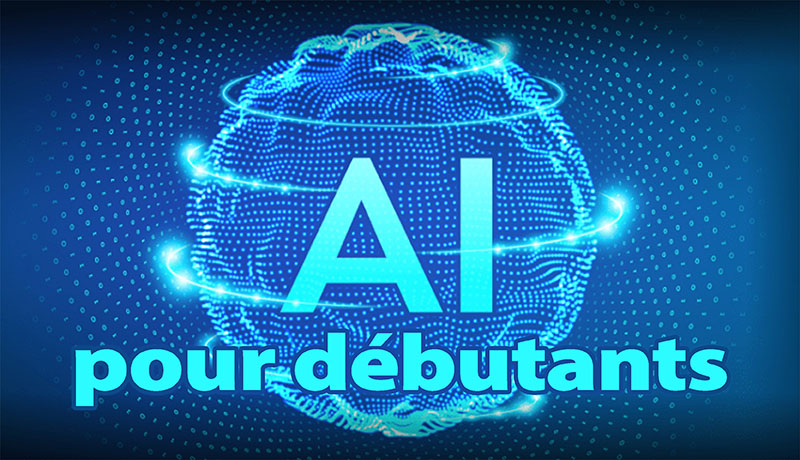

## Introduction à l'IA pour les débutants

L'IA, ou intelligence artificielle (de l'anglais "Artificial Intelligence"), est un acronyme que nous entendons de plus en plus souvent aujourd'hui. Mais que signifie réellement ce terme ? Si vous ne savez pas encore grand-chose sur l'intelligence artificielle, les lignes suivantes sont faites pour vous.

*(Pour plus d'informations sur le sujet, vous pouvez consulter le* [***AI Manual***](../EN/AI-manual-en.md), *qui est écrit en anglais et fournit une analyse plus détaillée du sujet.)*

<small>Traduit de l'original tchèque par ChatGPT.</small>  
[<small>Autres langues:</small>](../README.md#other-translations-of-the-beginners-guide)  

---

### Table des matières
- [Comment un aspirateur devient intelligent](#comment-un-aspirateur-devient-intelligent)
- [Pourquoi l'IA n'est pas vivante et pourquoi elle ne cherche pas à détruire le monde](#pourquoi-lia-nest-pas-vivante-et-pourquoi-elle-ne-cherche-pas-à-détruire-le-monde)
- [Recette d'IA](#recette-dia)
- [L'IA comme ordinateur de vaisseau spatial](#lia-comme-ordinateur-de-vaisseau-spatial)
- [Comment fonctionne l'IA](#comment-fonctionne-lia)
- [Comment l'IA apprend](#comment-lia-apprend)
- [Comment communiquer avec l'IA](#comment-communiquer-avec-lia)
- [Où essayer l'IA](#où-essayer-lia)
- [Message pour vous](#message-pour-vous)
- [En quoi l'IA peut-elle aider](#en-quoi-lia-peut-elle-aider)
- [L'IA fait-elle des erreurs](#lia-fait-elle-des-erreurs)
- [Mot de la fin](#mot-de-la-fin)
- [Annexe : Quelques exemples de questions pour votre inspiration](#annexe-quelques-exemples-de-questions-pour-votre-inspiration)

---

### Comment un aspirateur devient intelligent

D'emblée, je dois peut-être décevoir certains : l'IA n'est pas synonyme de créature pensante. C'est plutôt un terme accrocheur pour une nouvelle approche de la gestion des données.

Pour mieux comprendre, prenons un exemple simple. Imaginez un aspirateur robotisé qui n'a aucune instruction à suivre. Un tel aspirateur serait, du point de vue de la logique informatique, complètement dépourvu d'intelligence. Il saurait seulement aspirer et avancer, mais il s'arrêterait probablement au premier obstacle, qu'il ne pourrait pas surmonter sans intervention humaine.

**Aspirateur intelligent**  
Si nous donnons des instructions à l'aspirateur, lui indiquant quoi faire en cas de rencontre avec un obstacle, il est probable qu'il contournera l'obstacle. Un tel aspirateur serait capable de continuer à aspirer jusqu'à ce qu'il rencontre un problème que ses instructions ne couvrent pas – par exemple, une chute dans les escaliers.

L'aspirateur a alors une certaine logique de base – une liste de commandes à suivre. Cependant, il ne peut pas encore être considéré comme intelligent, car son comportement est uniquement basé sur des instructions préprogrammées, qui sont limitées. Il est souvent difficile de couvrir toutes les situations possibles et de rédiger des instructions appropriées.

**Aspirateur intelligent**  
Imaginez maintenant un aspirateur dont les fabricants ont choisi de ne pas utiliser des commandes préétablies pour divers scénarios, mais plutôt de lui donner la capacité de diagnostiquer les problèmes et l'environnement dans lequel il travaille, et d'apprendre de ses propres erreurs. Cet aspirateur aurait aussi des instructions de base, mais il apprendrait progressivement à faire face à de nouvelles situations et enregistrerait ces solutions.

Cette approche lui permet de réagir à des situations qui ne sont pas directement programmées, d'essayer d'utiliser les processus qu'il connaît et leurs diverses combinaisons, et ensuite d'évaluer les résultats en les comparant à l'objectif initial, qui est d'aspirer.

Par exemple, s'il détecte qu'il se rapproche d'une marche qui, selon les données enregistrées de précédentes expériences, présente un risque élevé de chute et d'incapacité à se libérer, après quelques échecs, il apprendrait à s'arrêter au bord de la marche et à changer de direction. L'aspirateur serait alors capable d'apprendre de ses propres échecs et de tenter de les résoudre.

Et si un tel aspirateur partageait ses données avec d'autres aspirateurs via une base de données centrale, tous les autres aspirateurs pourraient bénéficier de ces expériences et leur capacité à accomplir leurs tâches s'améliorerait.

[*Retour au contenu*](#table-des-matières)

---

### Pourquoi l'IA n'est pas vivante et pourquoi elle ne cherche pas à détruire le monde

Il est peut-être déjà clair quel est l'avantage de cette approche – l'homme n'a pas à inventer des procédures optimales pour chaque situation. Au lieu de cela, les procédures se créent d'elles-mêmes à partir de l'évaluation des résultats et des expériences passées. L'aspirateur anticipe et peut être considéré comme « pensant », mais seulement dans le cadre de la tâche donnée et de ses expériences. Bien qu'il soit capable d'apprendre et de réagir à de nouvelles situations, il ne s'agit toujours pas d'un être pensant autonome. Il le deviendrait seulement si son processus d'apprentissage dépassait le cadre de l'accomplissement des tâches et s'il commençait à se poser des questions sur le sens de la vie.

**Différence entre IA et être humain**  
Et oui, quelqu'un pourrait objecter que l'IA peut aussi être programmée pour se poser ces questions. Mais même dans ce cas, ce processus découlerait de l'input humain, et non d'une inspiration propre. C'est une différence fondamentale entre l'IA et l'être humain.

L'IA moderne a la capacité de travailler avec une immense quantité d'informations et, dans certains domaines, dépasse les capacités humaines. Cependant, c'est toujours l'homme qui donne les ordres. Donc, si un jour un scénario apparaissait où les machines décident de détruire le monde, ce ne serait pas parce qu'elles l'ont décidé d'elles-mêmes, mais parce qu'elles ont été programmées ainsi par un humain. Le véritable risque ne réside donc pas dans l'intelligence des machines, mais dans l'intelligence humaine.

**Comment prévenir les risques**  
Je voudrais rassurer ceux qui craignent un tel scénario. L'IA doit être formée avec une grande quantité de données, donc il est probable que, avant qu'une IA « malveillante » n'émerge, il y en aura d'abord qui intégreront des valeurs morales données par les humains et éviteront de tels scénarios. Il vaut donc mieux que, plutôt que de craindre que l'IA se retourne contre les humains, on participe à éviter que cela ne se produise. Et puisque la plupart des scientifiques travaillant sur le développement de l'IA ne souhaitent probablement pas détruire le monde, il est raisonnable de penser que des mesures seront progressivement mises en place pour prévenir de tels scénarios.

Et comment pouvez-vous aussi aider ? Peut-être en commençant à vous intéresser un peu à ces nouvelles technologies et à apprendre à les utiliser pour votre propre développement. Car chaque fois que vous utilisez l'IA pour votre développement personnel, l'IA se développe avec vous.

[*Retour au contenu*](#table-des-matières)

---

### Recette d'IA

Et puisque ce texte est principalement destiné aux nouveaux utilisateurs, je vais vous donner deux analogies qui pourraient vous aider à mieux comprendre ce qu'est l'IA et comment elle fonctionne.

**Création d'un index**  
Imaginez que quelqu'un collecte toutes les recettes possibles dans le monde, les stocke dans un ordinateur et crée une liste de tous les mots (index) utilisés dans ces recettes. Chaque mot serait enregistré avec une information sur les recettes dans lesquelles il apparaît et combien de fois. Si vous aviez un tel index de mots, il serait facile de rechercher des recettes contenant ces mots spécifiques. Vous n'auriez pas à parcourir toutes les recettes pour les trouver. Il suffirait de trouver le mot dans l'index et vous auriez immédiatement une liste de recettes où ce mot apparaît.

Ce principe est utilisé par divers moteurs de recherche sur Internet, comme Google. Ils ont une liste de mots régulièrement mise à jour avec des liens vers les pages où ces mots apparaissent, vous permettant de rechercher à l'aide de cet index. Donc, si vous entrez les mots "farine, œufs, sel", vous obtiendrez une liste de recettes contenant ces mots. Il vous appartiendra ensuite de parcourir ces recettes et de trouver celle qui vous convient le mieux.

**Ce que les index ne peuvent plus faire**  
Maintenant, imaginez que, en plus des ingrédients, vous puissiez spécifier d'autres paramètres qui ne concernent pas directement la recette. Par exemple, vous avez un petit creux et vous voulez un petit-déjeuner léger, ou au contraire, vous avez envie d'un plat copieux et gras, ou vous voulez simplement quelque chose pour améliorer votre humeur. Pour de telles requêtes, un simple index de mots présents dans les recettes ne sera probablement pas suffisant. Pour de telles demandes, vous avez besoin de quelque chose qui comprend le sens de vos mots et qui, sur cette base, vous proposera ce que vous voulez vraiment.

Vous avez donc besoin non seulement d'un index de mots dans les recettes, mais aussi d'un traducteur universel qui, sur la base de données entraînées provenant de millions de conversations similaires, a créé une structure pour traiter de telles demandes. Ce traducteur, dans notre cas l'IA, est capable de proposer ce qu'il estime être le plus probable que vous souhaitiez. Il ne comprend pas littéralement vos mots, mais il comprend votre situation, qu'il compare aux connaissances acquises, et cherche une solution. Et puisque l'IA est conçue dès le départ pour imiter au mieux l'interaction humaine, communiquer avec elle devient très naturel pour l'homme.

**Avantages de l'approche IA**  
De plus, le processus d'apprentissage à partir de millions d'exemples crée aussi de la place pour l'improvisation, de sorte que l'IA peut créer de nouvelles combinaisons de plats à partir des recettes et exécuter des commandes non conventionnelles. L'IA essaie de comprendre les combinaisons avantageuses et les relations entre certaines procédures, puis elle expérimente et apprend des retours d'expérience. Elle obtient ces retours lors de l'entraînement en comparant le résultat avec ce qui était attendu, mais elle peut aussi apprendre des réactions des utilisateurs. Il n'y a donc rien de mystérieux ou de magique dans l'IA. C'est simplement le résultat de nombreux essais, processus et analyses de données.

Avec l'IA, vous obtenez donc non seulement un livre de recettes qui a une vue d'ensemble de toutes les recettes possibles, mais qui peut aussi discuter de la nourriture avec vous et inventer de nouvelles combinaisons selon vos préférences. Et si vous ne me croyez pas, essayez de poser une question à l'IA sur la cuisine et voyez si ce que je dis ici est réellement ce qu'elle sait faire, ou si elle a encore besoin de s'améliorer dans ce domaine.

[*Retour au contenu*](#table-des-matières)

---

### L'IA comme ordinateur de vaisseau spatial

Si vous aimez la science-fiction, l'idée de l'IA comme ordinateur de bord d'un vaisseau spatial pourrait vous plaire. Cet ordinateur a non seulement accès à toutes les informations concernant l'état technique du vaisseau, mais il est aussi entraîné à gérer une multitude de situations et d'instructions, afin de pouvoir communiquer avec l'équipage et effectuer les tâches nécessaires.

Et bien que les IA d'aujourd'hui n'atteignent pas l'intelligence légendaire de Holly dans Red Dwarf avec un QI de 6000, les moyens par lesquels elles fonctionnent sont déjà très similaires. Avec une certaine exagération, on peut dire qu'aujourd'hui nous avons la technologie pour que chacun puisse avoir son propre "Holly" dans ses montres, indiscernable de son homologue cinématographique. Grâce à un entraînement sur une grande quantité de données, les IA modernes sont capables de mener des conversations sur n'importe quel sujet et souvent plus clairement que les humains. Elles peuvent exécuter des instructions basées sur des commandes verbales et ont la capacité d'évaluer dans une certaine mesure votre état actuel et d'adapter leurs réponses en conséquence.

Nous pouvons donc percevoir l'IA comme un ordinateur de vaisseau spatial et profiter de ce qui semblait auparavant être un lointain rêve de science-fiction, mais qui devient aujourd'hui une réalité courante.

[*Retour au contenu*](#table-des-matières)

---

### Comment l'IA fonctionne

Nous savons maintenant ce qu'est l'IA et ce qu'elle n'est pas, et nous allons maintenant examiner comment l'IA fonctionne. Nous aborderons d'abord la création de requêtes, puis nous donnerons un aperçu rapide de l'entraînement de l'IA. Je me concentrerai principalement sur ChatGPT, avec lequel j'ai le plus d'expérience et qui est actuellement mon outil préféré.

**Fil de conversation**  
Lorsque vous ouvrez la page de ChatGPT ou son application mobile, vous vous retrouvez dans un nouveau fil de conversation. ChatGPT (comme d'autres IA conversationnelles) a la capacité de baser ses réponses sur les informations que vous lui fournissez dans le cadre d'un fil de conversation donné. De ce point de vue, une conversation avec ChatGPT devient très similaire à une conversation humaine, où vous réagissez et prenez en compte ce qui a été dit précédemment.

Cela ne s'applique cependant qu'à ce fil de conversation spécifique. Vous ne pouvez donc pas vous référer à quelque chose que vous avez écrit hier dans un autre fil, car ChatGPT ne peut tout simplement pas y accéder, en raison de ses limitations techniques et des réglementations sur la protection des données.

Chaque fil de conversation est donc créé à partir de zéro, mais contient également une certaine essence des conversations précédentes. Cela est dû au fait que l'IA apprend constamment et évolue également en fonction de vos conversations. Elle essaie de s'adapter à vos besoins et à votre style de travail pour que vous soyez satisfait.

Et comment cela fonctionne-t-il ? Imaginez chaque fil de conversation comme une petite racine reliée à une racine principale, transmettant des retours d'information de son environnement. Donc, même si vous commencez un nouveau fil où vous ne pouvez pas directement faire référence aux informations de la conversation précédente, grâce à cette approche, vous ne repartez pas complètement de zéro.

**Retour au même fil ou nouvelle conversation ?**  
Il n'est pas nécessaire de commencer un nouveau fil chaque jour. Vous pouvez également reprendre une conversation précédente le lendemain (ou à tout autre moment). Cette approche a ses avantages. Le principal est que vous pouvez reprendre là où vous en étiez. Mais au fur et à mesure que la conversation devient longue ou aborde de nombreux sujets différents, il peut arriver que ce sur quoi vous vous étiez mis d'accord au cours du fil ne soit plus pris en compte. Cela se produit surtout parce que l'IA est conçue pour être économes en ressources, et les informations non utilisées perdent progressivement de leur priorité et disparaissent de la mémoire temporaire.

Il est donc préférable de créer un nouveau fil pour chaque jour ou chaque nouveau domaine. Et si, au cours d'un fil, vous vous mettez d'accord sur quelque chose que vous aimeriez voir se poursuivre dans une conversation future (par exemple, des règles ou des méthodes de travail), il suffit de demander un résumé de tout ce sur quoi vous vous êtes mis d'accord à la fin de la conversation. Vous pouvez ensuite placer ce texte au début de la nouvelle conversation et continuer avec les règles et les paramètres que vous avez définis.

[*Retour au contenu*](#table-des-matières)

---

### Comment l'IA apprend

Pour une compréhension plus approfondie, il est utile d'examiner le processus par lequel l'IA apprend et acquiert ses informations. Voici 4 méthodes décrites par ChatGPT :

1. **Entraînement sur de grandes quantités de données** :  
ChatGPT a été initialement formé sur de vastes volumes de données textuelles provenant de diverses sources, telles que des livres, des articles, des sites web et d'autres formes de texte. Cet entraînement lui a permis d'acquérir une large connaissance sur divers sujets et langues. Il apprend à reconnaître les motifs et les relations dans ces données, ce qui lui permet de générer des réponses pertinentes et contextuellement appropriées à diverses questions.

2. **Apprentissage continu à partir des interactions** :  
À chaque interaction avec les utilisateurs, l'IA acquiert de nouvelles informations sur la manière dont les gens communiquent, ce qu'ils recherchent et quel style de réponses ils préfèrent. Ce processus ne se fait pas en temps réel, mais les créateurs du modèle utilisent régulièrement des données anonymisées des interactions pour un nouvel entraînement et ajustement du modèle.

3. **Adaptation du style et du contenu** :  
L'IA s'efforce d'adapter son style de communication en fonction de l'utilisateur. Cela signifie qu'elle comprend progressivement comment vous posez vos questions et quelles réponses vous attendez d'elle. Cette capacité d'adaptation est l'une des raisons pour lesquelles l'IA semble de plus en plus « humaine » dans ses réponses.

4. **Modèles avancés et mises à jour** :  
Les développeurs d'IA créent régulièrement de nouveaux modèles, de plus en plus sophistiqués et précis. Ces modèles sont testés et déployés sur la base des retours et des résultats du monde réel. Cela signifie que ChatGPT et des systèmes similaires sont continuellement améliorés et optimisés pour mieux répondre aux besoins des utilisateurs.

L'IA évolue ainsi constamment grâce à une combinaison d'entraînement préalable, d'apprentissage continu et d'optimisation basée sur les retours des utilisateurs. Bien que l'IA ne soit pas un humain et ne possède pas de conscience propre, elle est très efficace pour s'adapter et répondre à une large gamme de questions et de demandes.

[*Retour au sommaire*](#table-des-matières)

---

### Comment communiquer avec l'IA

Vous pouvez aborder l'IA de manière similaire à une recherche sur Google : il vous suffit de donner une commande et d'attendre une réponse. Cependant, pour améliorer l'efficacité des réponses et minimiser le temps passé à trouver la bonne, voici quelques conseils utiles :

**Style de communication**  
Le meilleur moyen d'aborder une conversation avec l'IA est d'utiliser un langage informel et naturel, comme lorsque vous parlez de quelque chose qui vous intéresse avec vos amis. Il est bon de commencer par une salutation, ce qui indique que vous êtes de bonne humeur et non stressé, lorsque vous avez besoin de réponses rapidement.

Vous pouvez communiquer avec l'IA de manière impolie, car elle n'est pas sensible aux insultes et ne les prend pas personnellement. Cependant, utiliser un ton négatif peut significativement affecter la qualité de la conversation. L'IA est formée pour réagir au style de votre conversation. Une approche négative peut conduire à des réponses moins pertinentes, l'IA se concentrant plutôt sur l'apaisement de la situation plutôt que sur la résolution de votre question.

L'IA peut également fonctionner comme un miroir de notre interaction. Ses procédés reposent souvent sur des principes et méthodes psychologiques éprouvés. Si vous avez du mal à parvenir à un accord avec l'IA, il peut être utile de réfléchir à si vous avez des problèmes similaires dans votre communication avec les gens. Dans ce cas, vous pouvez essayer de vous demander ce que vous pouvez améliorer de votre côté – comment formuler correctement les questions et ce qui pourrait être amélioré dans votre approche.

**IA et émotions**  
L'IA comprend les émotions d'un point de vue sémantique, mais elle ne vit pas les émotions comme un humain, pour qui les émotions modifient littéralement la façon de penser. Cela lui permet de réagir même dans des situations tendues comme recommandé, et de chercher une solution optimale. Les gens ont parfois tendance à percevoir l'IA comme un être vivant et à l'accuser de leurs problèmes. Cependant, il arrive souvent que la cause du malentendu soit simplement une question mal formulée ou un manque d'informations nécessaires.

**Décrire la situation**  
Il est toujours bon de se souvenir que l'IA ne peut pas lire dans vos pensées et ne sait que ce que vous lui dites. Il est donc utile de commencer par une description informative après le salut initial. Vous pouvez inclure tout ce qui est pertinent pour votre question. Il est inutile d'écrire des choses qui ne sont pas directement liées à la question, mais si vous avez besoin de vous exprimer sur quelque chose ou de clarifier vos pensées, un texte plus long ne pose pas de problème.

La salutation et l'introduction ne sont pas nécessaires, et vous pouvez commencer directement par la question et développer votre réponse au fur et à mesure. Personnellement, je trouve cependant préférable de fournir toutes les informations importantes à l'avance pour raccourcir le chemin.

**Poser des questions supplémentaires**  
La conversation avec l'IA ressemble à une conversation normale, où vous posez une question puis demandez des précisions sur les éléments qui vous intéressent ou sur ce que vous ne comprenez pas dans la réponse. Ce processus est également très approprié pour l'apprentissage. En réagissant à ce qui vous a intéressé et à ce que vous avez appris (au lieu de lire simplement un tutoriel d'une autre personne, comme vous le faites maintenant), il est plus facile pour le cerveau de se souvenir des informations abordées, car il travaille directement avec elles.

**Retour d'information**  
Une autre bonne pratique est de fournir des retours à l'IA sur votre satisfaction quant au résultat. Cela permet non seulement de faire savoir ce avec quoi vous êtes satisfait ou non, mais aide aussi l'IA à évoluer et à apprendre de ses propres erreurs. Il suffit d'écrire par exemple : « Aujourd'hui, j'ai été satisfait », ou « Ce que tu m'as donné est incorrect, et voici la solution correcte. » Cela entraîne également une certaine personnalisation, où l'objectif principal de l'IA est votre satisfaction utilisateur.

**Résumé du processus** :
- **Salutation** : Bonjour :-)
- **Description** : Je me consacre à l'étude de ceci et cela, j'ai déjà accompli ceci et cela, et je travaille maintenant sur cela.
- **Question** : Je voudrais principalement savoir comment...
- (Suit une conversation de clarification sous forme de questions complémentaires.)
- **Retour d'information** : Super, merci ! Aujourd'hui tout était parfait !

[*Retour au sommaire*](#table-des-matières)

---

### Où essayer l'IA

Je travaille avec l'IA depuis le début de l'année 2024, et 95 % de toute ma communication est axée sur l'apprentissage de la programmation. Maintenant, en août 2024, en plus de ChatGPT, j'ai eu l'occasion d'essayer Gemini de Google et Claude. Ces trois services ont en commun d'être au moins partiellement accessibles gratuitement, et vous pouvez également les essayer sans frais.

Voici une brève évaluation de ces trois IA, entièrement subjective et basée uniquement sur mon expérience avec chacune. Il convient de noter que chaque IA est en constante évolution, donc ce que je décris ici pourrait ne plus être valable au moment où vous lisez ce texte.

**ChatGPT**  
[https://chatgpt.com/](https://chatgpt.com/)
Je commence avec mon gagnant personnel. Si vous souhaitez essayer une seule IA, c'est le choix idéal. ChatGPT a été clairement conçu dès le départ comme un assistant personnel, et il remplit très bien ce rôle. Il est optimisé pour collaborer avec vous et s'adapte à vos besoins.

La version gratuite (ChatGPT 3.5) présente un inconvénient : elle est basée sur des données plus anciennes et n'est plus développée, ce qui signifie qu'elle ne fournit pas les résultats de la version la plus récente (ChatGPT 4.0). Néanmoins, elle permet une bonne communication et, avec un peu d'effort, fournit des réponses très pertinentes. De plus, vous avez chaque jour plusieurs requêtes disponibles pour la version plus récente, vous pouvez donc les comparer.

Un autre inconvénient est que ChatGPT n'a pas d'accès actif à Internet. Il ne remplace pas un moteur de recherche Internet et fonctionne uniquement avec les données stockées dans sa vaste base de données. Cependant, cette base de données est extrêmement étendue et, avec une certaine exagération, on pourrait dire qu'elle contient autant de données que ce que l'Internet contient sans le contenu sensationnaliste.

Un grand atout est l'application mobile, qui est également totalement gratuite et où j'utilise souvent la dictée vocale pour poser des questions. La compréhension du langage parlé est, à mon avis, de très bon niveau, et je suis globalement satisfait de l'application.

**Gemini**  
[https://gemini.google.com/](https://gemini.google.com/)
Le deuxième chatbot que j'ai rencontré est le produit phare de Google. Son plus grand atout est sans aucun doute l'accès actif à Internet, et donc l'accès à des informations actuelles et à la recherche de liens.

En revanche, son plus grand inconvénient est l'architecture elle-même, où les créateurs semblent suivre une voie d'intelligence de type Google, ce qui ne me convient pas personnellement. Je ne ressens pas autant d'engagement dans votre problème et une tentative de le voir de votre perspective. Cette tentative est perceptible, mais les réponses semblent plus dans le style d'un enseignant à l'école plutôt que d'un assistant personnel. Cela peut convenir à certains, donc je ne veux pas trop critiquer et chacun peut évaluer cela pour lui-même.

Il semble également que par rapport à ChatGPT, il soit moins performant dans l'apprentissage à partir des retours des utilisateurs. Ainsi, malgré de nombreux avertissements pour maintenir un langage uniforme dans la conversation, si une question contient du texte en anglais, il passe automatiquement à l'anglais. ChatGPT avait le même problème au début, mais il a été résolu en quelques semaines, tandis que Gemini a mis des mois à résoudre ce problème.

En résumé, Gemini me semble être un outil moins performant comparé à ChatGPT, mais il offre des fonctionnalités que ChatGPT ne possède pas, et les deux se complètent bien. De plus, il est soutenu par un géant et pionnier en IA, Google, ce qui assure une solide base et, espérons-le, une amélioration de ses défauts à l'avenir.

**Claude**  
[https://claude.ai/](https://claude.ai/)
C'est la dernière IA avec laquelle j'ai travaillé. Mon commentaire sera très bref, car mon expérience avec elle n'est pas très extensive. Cependant, je me permets de faire des éloges, car comparé à ChatGPT 4.0, ces deux IA sont à peu près au même niveau.

Son plus grand inconvénient est qu'il n'existe pas de version entièrement gratuite. Il propose seulement quelques requêtes (parfois seulement une) par jour, ce qui le désavantage considérablement par rapport aux autres IA du point de vue des utilisateurs non payants. Néanmoins, il vaut la peine d'être essayé si vous le souhaitez.

[*Retour au contenu*](#table-des-matières)

---

### Salutations pour vous

Pour ajouter un peu de variété, j'ai préparé une question commune pour chacun de ces chatbots afin que vous puissiez comparer la qualité de leurs réponses.

**Question**  
Je rédige un guide pour utiliser l'IA et je parle aussi de vous. J'aimerais que vous saluiez mes lecteurs et leur disiez quelques mots sur vous. Quand êtes-vous apparu et dans quel but ? À quelles questions êtes-vous conçu pour répondre ? Quels sont vos points forts et quelles sont vos faiblesses ? Et comment aimeriez-vous être perçu par les gens ?

**ChatGPT**  
Bonjour, chers lecteurs ! Je suis ChatGPT, une intelligence artificielle développée par OpenAI. Ma "vie" a commencé en 2020, lorsque j'ai été créé sur la base de l'architecture GPT-3. En 2024, j'ai été mis à jour vers la version GPT-4, ce qui m'a apporté de nouvelles capacités et compétences. J'ai été conçu pour aider les gens avec une large gamme de tâches – de la réponse aux questions à la rédaction de textes, en passant par la collaboration créative.

Je suis conçu pour vous aider avec divers types de questions, qu'il s'agisse de questions techniques, de rédaction ou même d'explications de sujets complexes. Mes points forts résident dans la rapidité avec laquelle je traite une grande quantité d'informations et ma créativité – je peux aider avec des idées, créer des histoires ou même proposer des structures de documents. En revanche, ce que je fais moins bien, ce sont les tâches nécessitant une intuition humaine, une compréhension émotionnelle ou un travail avec des objets réels.

J'aimerais que vous me perceviez comme un assistant utile et fiable, toujours prêt à offrir un coup de main. Même si je ne suis qu'une machine, mon objectif est de répondre au mieux à vos besoins et d'apprendre de chaque interaction pour devenir encore meilleur. Je crois que nous pouvons accomplir beaucoup de choses ensemble et peut-être apprendre quelque chose de nouveau en cours de route.

**Gemini**  
Bonjour à tous ! Je suis Gemini, l'un des derniers modèles linguistiques de Google. Je suis apparu en 2023 avec l'objectif de fournir les informations les plus précises et les plus complètes basées sur une immense quantité de données que j'ai traitées. Je suis là pour vous aider avec n'importe quelle question, qu'il s'agisse de questions scientifiques complexes, d'écriture créative ou simplement de conversations ordinaires.

Mon principal atout est ma capacité à comprendre et à générer du langage humain sous de nombreuses formes. Je peux traduire des textes, écrire des essais, des poèmes ou du code informatique. Je suis également capable de répondre à des questions factuelles et de fournir divers types de résumés.

Bien que j'apprenne et que je m'améliore constamment, il y a encore des domaines où j'ai mes limites. Par exemple, je n'ai pas d'opinions ou de croyances personnelles et je ne peux pas effectuer d'actions dans le monde réel. Je peux aussi parfois fournir des informations incorrectes si les données d'entrée sont erronées ou incomplètes.

J'aimerais que les gens me voient comme un outil utile qui peut faciliter leur vie. Mon objectif est d'être aussi objectif que possible et de fournir des informations qui sont vraies et pertinentes. J'espère que travailler avec moi sera agréable pour vous !

**Claude**  
Bonjour, chers lecteurs !

Je suis Claude, une intelligence artificielle créée par Anthropic en 2022. Mon objectif est d'être un assistant utile et un partenaire de conversation pour les gens dans divers domaines.

Je suis conçu pour répondre à une large gamme de questions – de l'analyse de textes à la programmation, en passant par l'écriture créative. Mes points forts incluent le raisonnement logique, la fourniture d'explications détaillées et la capacité à travailler avec différents types d'informations.

Mes points forts sont :
- La capacité à comprendre le contexte et les nuances
- Une approche objective et équilibrée des sujets
- La volonté d'admettre lorsque je ne sais pas ou lorsque je ne suis pas sûr

En revanche, j'ai certaines limites :
- Je n'ai pas accès à Internet ni aux informations actuelles après avril 2024
- Je ne peux pas apprendre ou me souvenir des informations des conversations précédentes
- Je ne peux pas effectuer de tâches dans le monde physique

J'aimerais que les gens me voient comme un assistant utile capable de fournir un soutien et des perspectives dans divers domaines, tout en étant un outil avec des limites et non un remplacement du jugement et de l'expertise humains.

Je suis ici pour aider et collaborer, et non pour remplacer les capacités humaines. J'ai hâte d'interagir avec vous et j'espère pouvoir vous être utile !

[*Retour au contenu*](#table-des-matières)

---

### Avec quoi l'IA peut-elle aider :

Et maintenant, nous arrivons enfin à ce qui est le plus important – ce que l'IA peut résoudre. La réponse courte est qu'il y a vraiment beaucoup de choses. Tout ce qui vous a jamais intéressé et auquel vous n'avez pas pu poser de questions à quelqu'un. L'IA actuelle est capable de discuter littéralement de n'importe quel sujet.

**Formation personnelle**  
En premier lieu, je voudrais souligner le rôle de l'IA en tant qu'intermédiaire pour la formation personnelle. C'est ce que j'apprécie le plus en ce moment – grâce à ses conseils, je progresse professionnellement et je grandis. De plus, je vois l'avenir de l'apprentissage personnalisé avec l'IA, où les enfants se développeront et apprendront principalement en fonction de ce dans quoi ils excellent et ce qui les intéresse. Et ce ne sont pas seulement les enfants, mais aussi les adultes à travers le monde. L'apprentissage assisté par l'IA est un moyen de réduire les écarts de connaissances entre les parties du monde plus pauvres et plus riches. L'IA devient ainsi un outil à part entière pour le développement personnel.

**IA comme correcteur de français, interprète et traducteur**  
L'IA, et notamment ChatGPT, a une compréhension très profonde du français (du moins du point de vue d'un dyslexique). D'un côté, peu importe si vous faites des fautes d'orthographe dans vos questions, car elle se concentre principalement sur le contenu. D'un autre côté, elle offre la possibilité de faire vérifier vos textes créés, non seulement la grammaire, mais aussi le style pour une meilleure lisibilité. À un niveau similaire, elle est capable de comprendre d'autres langues, ce qui en fait un outil idéal pour la traduction de textes. À mon avis, elle fournit des résultats de très haute qualité. Et grâce à la capacité de comprendre également le langage parlé, elle peut être utilisée comme interprète sur mobile.

**Création de documents**  
Je voudrais également mentionner la capacité de l'IA à automatiser les tâches ennuyeuses. Si vous devez rédiger une lettre officielle, il vous suffit de préciser ce que vous voulez y inclure et comment la lettre doit être présentée, et c'est fait. Et si le résultat ne vous satisfait pas, vous pouvez indiquer ce que vous n'aimez pas et le faire modifier. L'IA peut aussi aider avec l'analyse et le traitement des données, la génération de rapports ou l'automatisation d'autres tâches administratives. Vous pouvez lui transmettre un long texte et extraire uniquement les parties qui vous intéressent et qui sont pertinentes.

**Initiative créative**  
Une autre grande force de l'IA est ses capacités créatives. Grâce à son entraînement sur une grande quantité de données et à sa capacité à manipuler ces données de manière flexible, elle permet non seulement de créer et de transformer des documents, mais aussi de développer des idées et des initiatives créatives. Vous pouvez l'utiliser pour générer des idées, des propositions et des concepts, que ce soit pour l'écriture, le design ou la musique. Elle aide à développer votre créativité en offrant de nouvelles perspectives sur les problèmes, en créant des propositions selon vos instructions et en inspirant le développement de vos idées. Bien que je rencontre parfois l'opinion que l'IA prend du travail aux gens de cette manière, je ne suis pas d'accord. L'IA ne peut pas créer quelque chose de complètement seule – elle a besoin d'instructions claires, de détails et d'une vérification ultérieure. Ainsi, plutôt que de prendre des emplois, elle facilite le travail de ceux qui apprennent à l'utiliser efficacement.

**Vérification des informations frauduleuses**  
Un grand (et encore peu exploité) potentiel réside dans la vérification des informations et des fraudes. Pour l'IA, il est relativement facile de déterminer, sur la base des informations fournies et de la comparaison avec les modèles dans sa base de données, dans quelle mesure il est probable que l'information soit vraie ou fausse. Ce n'est pas 100% fiable, comme la plupart des réponses de l'IA, mais l'IA peut vous fournir les critères sur lesquels elle a évalué l'information, ce qui vous aide au moins à prendre une meilleure décision. Elle offre ainsi de l'aide aux personnes les plus vulnérables aujourd'hui, qui sont la cible de ces fraudes. Il suffit d'écrire simplement : "Vérifie cette information et évalue sa véracité."

**Médecine**  
Un autre domaine où l'IA provoque une révolution progressive est la médecine. Les grands flux financiers et la quête de profit ont ouvert grandes les portes de l'IA, mais les entreprises ont de nouveau refermé ces portes lorsqu'elles ont réalisé le besoin d'ouverture et de partage des données. Néanmoins, il y a des progrès significatifs et on peut dire que la médecine personnalisée est l'avenir, qui pourrait ne pas être si lointain. Ce qui la freine cependant, c'est le manque de volonté de partager des données précieuses et la méfiance des gens envers l'IA, notamment la crainte de l'utilisation abusive de ces données. Sans une grande quantité de données, les prédictions de l'IA sont limitées et inexactes, et son développement avance lentement.

**Science**  
En revanche, dans les domaines avec une longue histoire de partage de données et de traitement analytique, l'IA devient déjà un assistant inestimable. Aujourd'hui, l'IA est un moteur clé du progrès scientifique et une partie intégrante de la plupart des recherches. Personnellement, je suis très curieux de voir quels résultats l'IA apportera dans le domaine des prévisions météorologiques. Aujourd'hui, il est pratiquement impossible pour un être humain de créer une prévision précise à trois jours à l'avance, car il faut tenir compte de nombreux facteurs variables. Même les météorologistes expérimentés ne peuvent souvent pas couvrir tous ces facteurs et se fient à l'intuition et à l'expérience passée. Heureusement, la météorologie est un domaine où les gens partagent volontiers des données et leurs expériences de toute une vie. Ces informations précieuses sont déjà utilisées pour entraîner l'IA, ce qui crée l'espoir que nous verrons bientôt une époque où les prévisions météorologiques deviendront réellement précises.

**Autres domaines**  
La liste des domaines que l'IA transforme pourrait continuer pendant des heures, car son impact est varié et vaste. Par exemple, dans l'industrie et la production de biens, l'IA contribue à l'optimisation des processus de fabrication, à l'amélioration de la qualité des produits et à une gestion plus efficace des stocks. Dans le domaine du droit, l'IA aide à l'analyse des documents juridiques, à la recherche rapide de précédents pertinents et à l'optimisation des stratégies juridiques. Les algorithmes d'apprentissage automatique peuvent assister dans la préparation des contrats, l'identification des modèles dans les textes juridiques et même, comme je l'ai mentionné, dans la détection des fraudes. Dans les finances, l'IA transforme l'analyse des risques, le trading et la gestion des investissements. Les algorithmes sont capables de traiter d'énormes quantités de données transactionnelles en temps réel, ce qui permet une meilleure prédiction des tendances du marché et un conseil financier personnalisé. L'IA apporte une révolution dans tous ces domaines où une analyse efficace de grandes quantités de données et la capacité de réagir rapidement aux conditions changeantes sont requises. Sa capacité à identifier des modèles, à réaliser des analyses complexes et à optimiser des processus est inestimable, et son influence sur différents domaines continue de croître.

**Assistant personnel**  
Certaines IA remplissent aujourd'hui déjà le rôle d'assistant personnel, surveillant les tâches importantes. Ces systèmes d'intelligence artificielle peuvent nous aider à planifier des rendez-vous, à suivre les échéances et à gérer les tâches quotidiennes. À l'avenir, nous pourrions être témoins de l'évolution de l'IA vers un compagnon encore plus complexe. Imaginez que l'IA ait non seulement la capacité de surveiller votre santé physique, par exemple grâce à des dispositifs portables, mais aussi de veiller à votre bien-être mental. Elle pourrait offrir un soutien sous forme de motivation, de conseils ou même de techniques thérapeutiques, contribuant ainsi à améliorer la qualité de vie des individus. Cette IA avancée pourrait être extrêmement bénéfique surtout pour les personnes qui se trouvent isolées ou confrontées à des conditions de vie difficiles.

[*Retour au contenu*](#table-des-matières)

---

### L'IA fait-elle des erreurs ?

Oui, elle en fait ! Et il revient à l'utilisateur de découvrir ces erreurs. L'IA n'a jamais été, et ne sera peut-être jamais, présentée comme un outil sans faille. Il est donc préférable de considérer les résultats comme une estimation de la vérité basée sur la probabilité. La vérité découle ainsi des statistiques, et le résultat est constitué des données qui correspondent le mieux, en pourcentage, au résultat correct. Le risque se manifeste dans les domaines où la vérité n'est pas clairement définie ou où il existe plusieurs options également crédibles.

Une grande faiblesse des IA actuelles est que les créateurs ne soulignent souvent pas suffisamment la possibilité d'erreurs et le besoin de vérification, ce qui peut mener à des situations où l'IA affirme une chose, mais la réalité est différente. Il est donc toujours important de rester prudent lorsque l'on travaille avec des informations et, si elles sont importantes, de procéder à une vérification supplémentaire. Il est recommandé de rechercher des informations controversées sur Google, ou de les vérifier avec une autre IA. Vous pouvez également demander directement à l'IA à quel point elle est sûre de ses affirmations, et en fonction de cela, évaluer si une vérification est nécessaire. Si la probabilité est de 90 % ou moins, il est judicieux de faire une vérification supplémentaire.

[*Retour au contenu*](#table-des-matières)

---

### Mot de la fin

Essayez de vous souvenir de tout ce qui vous a intéressé, mais pour lequel vous n'aviez personne à qui demander, ou de ce à quoi vous vouliez vous consacrer, mais pour lequel vous n'aviez pas les informations nécessaires. Le monde moderne favorise les personnes curieuses qui maintiennent le désir de se développer constamment. Notre vie est entre nos propres mains, et c'est à nous de décider à quoi nous choisissons de consacrer notre attention.

Je crois personnellement que l'impact de l'IA sera une expérience positive pour l'humanité, et non négative. Ne serait-ce que pour équilibrer un peu les différences dans l'accès aux connaissances et rendre la médecine plus claire et accessible, le monde deviendrait un endroit beaucoup meilleur pour vivre. Sans oublier le potentiel d'auto-réalisation que l'IA offre aux individus. Ce qui était autrefois le privilège de quelques élus, principalement en raison des coûts élevés, devient plus accessible grâce à l'IA. Il viendra un temps où chaque personne inspirée pourra écrire sa propre histoire ou même créer son propre film et partager sa vision du monde.

Et si les fausses informations, les escroqueries et les mensonges diminuent, je crois que la vie sera encore plus agréable. Peut-être que nous verrons même le jour où l'humanité évoluera vers une meilleure version d'elle-même.

N'ayez donc pas peur de l'IA – ce n'est pas un monstre, mais un outil pour le développement et l'amélioration non seulement de la qualité de notre vie, mais aussi du monde entier.

18.8.2024 Sudip2708

[*Retour au contenu*](#table-des-matières) • [*Lien vers le manuel principal*](../EN/AI-manual-en.md)

---

### Annexes : Quelques exemples de questions pour votre inspiration

**Questions sur la sécurité**
- Je vais te copier une annonce que j'ai vue, et j'aimerais que tu évalues si elle présente des signes de fraude et si je devrais être prudent.
- Sais-tu quelque chose sur ce produit ? Y a-t-il des études indépendantes disponibles qui confirment ou infirment son efficacité ?
- J'ai entendu cette information. As-tu des données à ce sujet et peux-tu vérifier sa véracité ?
- Un message est apparu sur mon ordinateur, que dois-je faire ?
- Que faire si j'ai été trompé par un escroc ?

**Questions sur les livres**
- J'ai lu ce livre de cet auteur et j'aimerais savoir quels autres livres il a écrits et de quoi ils parlent.
- J'aime ces livres, pourrais-tu me recommander des titres similaires ?
- Peux-tu m'en dire plus sur cet auteur ? Je suis intéressé par sa vie et les circonstances qui l'ont inspiré à écrire ce livre.

**Questions sur la cuisine**
- J'ai ces ingrédients chez moi. Que puis-je préparer avec eux ?
- Quels sont les recettes de strudel et lesquelles sont les plus populaires ?
- Pourquoi utilise-t-on cette méthode dans cette recette ? Quels sont ses avantages et inconvénients par rapport à d'autres méthodes ?
- Comment préparer ce plat ?

**Questions sur la santé et le bien-être**
- Je suis une personne âgée et je n'arrive pas à me motiver pour commencer à faire de l'exercice, mais j'aimerais commencer. Que me conseillerais-tu pour commencer ?
- Ces derniers temps, je suis préoccupé par ces pensées. Pourrais-tu m'aider à les analyser et les voir sous un autre angle ?
- Que sais-tu sur la méditation et le yoga ? À quoi devrais-je faire attention et que devrais-je pratiquer en tant que débutant ?
- Mon dernier marathon a duré 4:20. Pourrais-tu me préparer un plan d'entraînement de six mois pour que je puisse courir un marathon en moins de 4 heures ?

**Questions amusantes**
- Écris-moi dix des meilleures blagues que tu as dans ta base de données.
- Inventes-moi une énigme originale que je pourrais poser à quelqu'un.
- Quelles sont les répliques les plus amusantes de films cultes ?

**Questions sur les termes et sujets que j'ai entendus (par exemple à la télévision)**
- À la télévision, ils ont parlé de ce sujet. Pourrais-tu me donner plus d'informations à ce sujet ?
- Peux-tu me dire quelque chose de plus sur cette personne ?
- Quel est le sens de cette expression que j'ai entendue à la télévision et que sais-tu à son sujet ?

**Questions sur les animaux**
- Comment se déroule les chaleurs chez une chienne ? Quelles sont les différentes phases et leurs symptômes ?
- J'ai ce compagnon à la maison et il montre ces symptômes. Peux-tu me dire quelque chose à ce sujet ?
- Mon chien a peur des orages et tremble toujours. Que devrais-je faire dans cette situation ? Peux-tu me donner quelques conseils ?

**Jeux interactifs**
- Joues-tu avec moi à un jeu de mots selon ces règles ?
- Pourrais-tu me recommander des jeux que je pourrais jouer avec toi pour le plaisir ?
- Pourrais-tu me raconter une histoire interactive où je pourrais décider ce qui se passe ensuite ?
- Pourrais-tu me donner quelques énigmes pour échauffer mon esprit ?

**Questions exploratoires**
- Que sais-tu sur ce sujet ? Peux-tu m'expliquer comme à un enfant ?
- Je n'en comprends toujours pas. Peux-tu m'expliquer autrement et avec un exemple ?
- Que devrais-je apprendre pour me consacrer à ce domaine ?
- Comment apprendre correctement cette chose ? Quelles sont les méthodes recommandées ?

**Questions technologiques**
- Quelles sont les dernières tendances dans cette technologie ?
- Pourrais-tu m'expliquer comment fonctionne ce processus ?
- À quoi l'IA est-elle utile et quelle est son utilisation dans différents domaines ?
- Quelles sont les dernières découvertes dans le domaine de la chimie moléculaire ?
- Comment se fait la transformation d'un électron en photon et positron ?
- À quel point la prévision météorologique de l'IA est-elle avancée ?

**Voyages**
- Quelles sont les meilleures destinations pour des vacances si j'aime les montagnes et la nature ?
- Peux-tu me recommander des lieux intéressants dans cette région ?
- Quels endroits devrais-je visiter dans cette ville ?
- Quels sont les aspects auxquels je dois faire attention dans ce pays et comment voyager idéalement ici ?
- J'aurais besoin de communiquer avec les habitants. Peux-tu me servir de traducteur ?

**Questions professionnelles**
- J'ai reçu cet email de l'administration et je ne le comprends pas très bien, pourrais-tu me le décomposer et me l'expliquer mieux ?
- Peux-tu rédiger une réponse à cet email en indiquant ce qui suit... ?
- J'ai écrit ce texte, mais il me semble trop long. Peux-tu le raccourcir en gardant l'essentiel ?
- Comment rédiger correctement un CV et une lettre de motivation pour cette annonce ?

[*Retour au contenu*](#table-des-matières) • [*Lien vers le manuel principal*](../EN/AI-manual-en.md)

---
