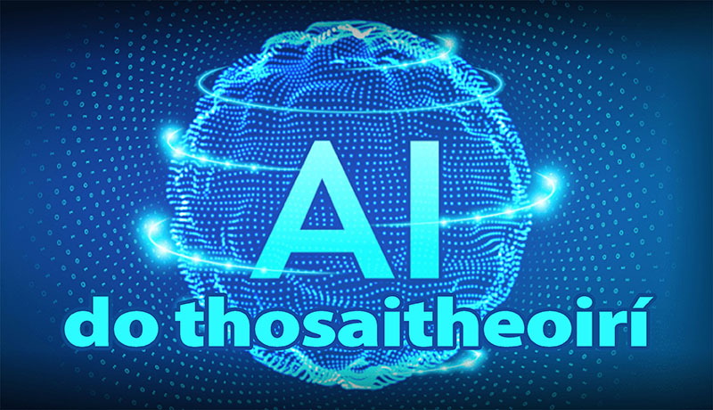

## Réamhrá don AI do thosaitheoirí

Tá AI, nó intleacht shaorga (ó "Artificial Intelligence" i mBéarla), ina ghiorrúchán a chloistear níos minice le déanaí. Ach cad a chiallaíonn sé go díreach? Má tá tú fós ag foghlaim faoi intleacht shaorga, tá na línte seo dírithe ort.

*(Tuilleadh eolais ar an ábhar seo a fháil sa* [***AI Manual***](../EN/AI-manual-en.md), *atá scríofa i mBéarla agus atá níos mionsonraithe ar an ábhar.)*

<small>Ón téacs bunaidh i gCzech, a aistríodh ag ChatGPT.</small>  
[<small>Teangacha eile:</small>](../README.md#other-translations-of-the-beginners-guide)  

---

### Ábhar
- [Conas a dhéanann folúsghlanadóir a bheith cliste](#conas-a-dhéanann-folúsghlanadóir-a-bheith-cliste)
- [Cén fáth nach bhfuil AI beo agus cén fáth nach bhfuil sé ag iarraidh an domhan a scrios](#cén-fáth-nach-bhfuil-ai-beo-agus-cén-fáth-nach-bhfuil-se-ag-iarraidh-an-domhan-a-scrios)
- [Cócaireacht AI](#cócaireacht-ai)
- [AI mar ríomhaire loinge spáis](#ai-mar-ríomhaire-loinge-spáis)
- [Conas a oibríonn AI](#conas-a-oibríonn-ai)
- [Conas a fhoghlaimíonn AI](#conas-a-fhoghlaimíonn-ai)
- [Conas a chur comhoibriú le AI](#conas-a-chur-comhoibriú-le-ai)
- [Cá háit le triail a bhaint as AI](#cá-háit-le-triail-a-bhainte-as-ai)
- [Slán leat](#slán-leat)
- [Conas is féidir le AI cabhrú](#conas-is-féidir-le-ai-cabhrú)
- [An bhfuil AI ag déanamh botún](#an-bhfuil-ai-ag-déanamh-botún)
- [Cúirtéisí](#cúirtéisí)
- [Forlíonadh: Laigeáin samplaí chun inspioráid a thabhairt duit](#forlíonadh-laigeáin-samplaí-chun-inspioráid-a-tabhairt-duit)

---

### Conas a dhéanann folúsghlanadóir a bheith cliste

Ar dtús, caithfidh mé roinnt daoine a chur díomá – ní hionann AI agus créatúr smaointeach. Is ainm mealltach é le haghaidh cur chuige nua chun déileáil le sonraí.

Chun é seo a shamhlú níos fearr, bain úsáid as sampla simplí. Samhlaigh folúsghlanadóir róbait nach bhfuil aon treoracha aige chun é a threorú. Bheadh an folúsghlanadóir sin, ó thaobh loighic ríomhaireachta de, gan aon intleacht ar bith. Bheadh sé in ann ach díreach folúsghlanadh agus bogadh ar aghaidh, ach is dócha go stopfadh sé ag an gcéad bhac a bheadh ann, gan aon chabhair ón duine.

**Folúsghlanadóir cliste**  
Má chuirfimis treoracha éigin ar fáil don folúsghlanadóir, a déarfadh leis cad ba cheart a dhéanamh nuair a bhuaileann sé isteach i mbac, is dócha go rachadh sé timpeall an bhaca. Bheadh an folúsghlanadóir sin in ann folúsghlanadh go dtí go dtiocfadh sé ar fhadhb nach mbeadh a chuid treoracha in ann a réiteach – mar shampla, titim síos staighre.

Tá loighic bhunúsach áirithe ag an folúsghlanadóir cheana féin – liosta treoracha a leanann sé. Mar sin féin, ní féidir é a mheas mar atáirge cliste, toisc go n-eascraíonn a iompar ó threoracha réamhchláraithe amháin, atá teoranta. Is minic a bhíonn sé deacair gach cás a d’fhéadfadh tarlú a thuar agus treoracha oiriúnacha a scríobh dóibh.

**Folúsghlanadóir intleachtúil**  
Anois samhlaigh folúsghlanadóir nach bhfuil a mhonaróirí tar éis dul ar an mbealach le horduithe réamhullmhaithe do chásanna éagsúla, ach ina ionad sin thug siad an cumas dó fadhbanna agus an timpeallacht ina n-oibríonn sé a dhiagnóisiú, agus foghlaim óna chuid botúin féin. Bheadh treoracha bunúsacha aige freisin, ach bheadh sé in ann foghlaim de réir a chéile conas déileáil le cásanna nua, agus stórálfadh sé na réitigh sin.

Ligeann an cur chuige seo dó freagairt do chásanna nach bhfuil cláraithe go díreach, trí phróisis a úsáideann sé cheana féin agus a gcuid éagsúlachtaí a thriail, agus ansin bheadh sé in ann an toradh a mheas agus é a chur i gcomparáid leis an tasc tosaigh, is é sin, folúsghlanadh.

Mar shampla, má fheiceann sé go bhfuil sé ag druidim le staighre, a bhfuil riosca ard titim ann de réir na sonraí stóráilte ó eispéiris roimhe seo, tar éis roinnt teipeanna d’fhoghlaimeodh sé stopadh ag imeall an staighre agus dul i dtreo eile. Dá réir sin, bheadh an folúsghlanadóir in ann foghlaim óna chuid teipeanna féin agus iarracht a dhéanamh iad a réiteach.

Agus dá roinnfeadh an folúsghlanadóir sin a chuid sonraí le folúsghlanadóirí eile trí bhunachar sonraí lárnach, bheadh na folúsghlanadóirí eile go léir in ann tairbhe a bhaint as na taithí seo, agus bheadh a gcumas a gcuid tascanna a chomhlíonadh ag dul i méid.

[*Ar ais chuig an ábhar*](#ábhar)

---

### Cén fáth nach bhfuil AI beo agus cén fáth nach bhfuil sé ag iarraidh an domhan a scrios

B'fhéidir go bhfuil an buntáiste an chur chuige seo soiléir anois – ní gá don duine na nósanna imeachta is fearr a cheapadh do gach cás. Ina áit sin, cruthaítear na nósanna imeachta go huathoibríoch trí mheasúnú a dhéanamh ar thorthaí agus ar thaithí roimhe seo. Tá an folúsghlanadóir ag tuar agus d’fhéadfaí a rá go bhfuil sé ag "smaoineamh", ach ní dhéanann sé amhlaidh ach laistigh de chreat na dtascanna agus na dtaithí atá aige. Cé go bhfuil sé in ann foghlaim agus freagairt do chásanna nua, ní hionann é agus créatúr a smaoiníonn go neamhspleách. Bheadh sé mar sin amháin dá rachadh a phróiseas foghlama níos faide ná tascanna a chur i gcrích agus dá dtosódh sé ag cur ceisteanna faoi chiall an tsaoil, mar shampla.

**An difríocht idir AI agus duine**  
Agus tá, d’fhéadfadh duine a rá go bhféadfaí AI a chlárú chun na ceisteanna sin a chur. Ach fiú sa chás sin, bheadh an próiseas seo bunaithe ar shonraí a chuir an duine ar fáil, ní ar inspioráid dá chuid féin. Sin an difríocht bhunúsach idir AI agus duine.

Tá an AI nua-aimseartha in ann oibriú le méid ollmhór faisnéise agus, i roinnt réimsí, sáraíonn sé cumais an duine. Mar sin féin, is é an duine fós a leagann amach na tascanna. Mar sin, má thagann riamh cás ina ndéanfaidh meaisíní cinneadh an domhan a scrios, ní bheidh sé mar gheall ar chinneadh a rinne siad leo féin, ach mar gheall go ndearna duine éigin iad a chlárú chun é sin a dhéanamh. Dá bhrí sin, ní hionann an riosca fíor agus intleacht na meaisíní, ach intleacht an duine.

**Conas is féidir rioscaí a sheachaint**  
Ba mhaith liom siúd atá buartha faoi chás den sórt sin a chur ar a suaimhneas. Caithfear AI a oiliúint ar mhéid mór sonraí, agus mar sin is dócha go gcruthófar AI "maith" a bhfuil luachanna morálta a chuir daoine isteach iontu, agus a sheachnóidh cásanna den sórt sin, sula gcruthófar AI "olc". Mar sin, in ionad eagla a bheith ort go n-iompóidh AI i gcoinne daoine, is fearr cabhrú lena chinntiú nach dtarlóidh sé. Agus ós rud é nach bhfuil formhór na n-eolaithe atá ag obair ar fhorbairt AI ag iarraidh an domhan a scrios, is féidir a bheith ag súil go nglacfar bearta de réir a chéile chun cásanna den sórt sin a sheachaint.

Agus conas is féidir leat cabhrú leis seo? Trí spéis a chur sna teicneolaíochtaí nua seo agus foghlaim conas iad a úsáid chun do fhás pearsanta a fheabhsú. Toisc go bhfuil an AI ag forbairt leatsa gach uair a úsáideann tú é chun do chuid scileanna pearsanta a fheabhsú.

[*Ar ais chuig an ábhar*](#ábhar)

---

### AI Cócaire Leabhar

Agus ós rud é go bhfuil an téacs seo dírithe go príomha ar úsáideoirí nua, tabharfaidh mé dhá shamhail anseo a d’fhéadfadh cabhrú leat níos mó a thuiscint faoi cad is AI ann agus conas a oibríonn sé.

**Cruthú Innéacs**  
Samhlaigh go raibh duine ann a bhailigh gach oideas bia ar domhan, iad a stóráil i ríomhaire, agus liosta de na focail go léir (innéacs) a úsáidtear iontu a chruthú. Bheadh gach focal taifeadta in éineacht leis an eolas ar na h-oidis ina bhfuil sé agus cé mhéad uair a tharlaíonn sé. Dá mbeadh innéacs focal den sórt sin agat, bheadh sé éasca oidis a chuardach ina bhfuil na focail áirithe sin. Ní bheadh ort gach oideas a scrúdú go mion chun iad a aimsiú. Bheadh sé go leor focal a fháil san innéacs agus láithreach bheadh liosta d’oidis agat ina bhfuil sé.

Tá an cur chuige seo bunaithe ar an dóigh a n-oibríonn innill chuardaigh éagsúla ar an idirlíon, cosúil le Google. Tá liosta focal acu a nuashonraítear go rialta le naisc chuig leathanaigh ina bhfuil siad, agus ligeann siad duit cuardach a dhéanamh ag úsáid an innéacs sin. Mar sin, má chuireann tú isteach focail mar "plúr, uibheacha, salann", gheobhaidh tú liosta d’oidis ina bhfuil na focail sin. Ansin is fút féin atá sé na h-oidis sin go léir a scrúdú agus an ceann is fearr a oireann duit a roghnú.

**Cén fáth nach leor innéacsanna a thuilleadh**  
Anois samhlaigh gur féidir leat paraiméadair bhreise a shonrú nach mbaineann go díreach leis an oideas féin. Mar shampla, tá ocras beag ort agus ba mhaith leat bricfeasta éadrom, nó b'fhéidir go bhfuil fonn ort ar bhéile trom lán saille, nó b'fhéidir nach bhfuil uait ach rud éigin a chuirfidh feabhas ar do ghiúmar. Maidir le ceisteanna den chineál seo, is beag úsáide a bheadh ag liosta simplí de na focail atá sna h-oidis. Chun freastal ar riachtanais den sórt sin, teastaíonn rud éigin uait a thuigeann brí do chuid focal agus a thabharfaidh moltaí duit bunaithe ar a bhfuil tú ag iarraidh.

Mar sin ní mór duit ní amháin liosta focal sna h-oidis, ach freisin cineál aistritheora uilíoch, a chruthaíonn struchtúr bunaithe ar shonraí oiliúna ó na milliúin comhráite den chineál céanna chun déileáil le ceisteanna den chineál seo. Is é an t-aistritheoir seo, AI inár gcás, atá in ann moltaí a thabhairt bunaithe ar an rud is dóichí a theastaíonn uait. Ní thuigeann sé thú go litriúil, ach tuigeann sé do chás agus déanann sé comparáid idir é agus an t-eolas a d’fhoghlaim sé, agus faigheann sé réiteach. Agus ós rud é go bhfuil AI deartha ón tús chun idirghníomhaíocht an duine a mhacasamhlú, bíonn an chumarsáid leis nádúrtha don duine.

**Buntáistí Chur Chuige AI**  
Ina theannta sin, cruthaíonn an próiseas foghlama ar na milliúin samplaí spás d'improvisation, ionas gur féidir le AI cócaire leabhar meascáin nua d’oidis a chruthú agus orduithe neamhghnácha a chomhlíonadh. Déanann AI iarracht tuiscint a fháil ar na meascáin agus na gaolta is fearr a bhaineann le nósanna imeachta áirithe agus ansin déanann sé turgnaimh agus foghlaimíonn sé ó aiseolas. Faigheann sé an t-aiseolas sin, ar thaobh amháin, trí chomparáid a dhéanamh idir an toradh agus an rud a bhí ag súil leis le linn an oiliúna, ach tá sé in ann foghlaim freisin ó fhreagairtí úsáideoirí. Mar sin, níl aon rud draíochta nó mistéireach faoi AI. Is é AI toradh go leor iarrachtaí, próiseas agus anailís sonraí.

Le AI, ní hamháin go bhfaigheann tú cócaire leabhar a bhfuil eolas aige ar gach oideas is féidir, ach freisin is féidir leis comhrá a dhéanamh leat faoi bhia agus meascáin nua a chruthú bunaithe ar do chuid mianta. Agus mura gcreideann tú mé, bain triail as AI a úsáid chun ceist a chur faoi chócaireacht agus breithnigh cé acu an bhfuil sé in ann é sin a dhéanamh anois, nó an gá dó níos mó feabhsúcháin a dhéanamh sa réimse seo.

[*Ar ais chuig an ábhar*](#ábhar)

---

### AI mar Ríomhaire Spásárthaí

Má tá suim agat i sci-fi, d’fhéadfadh an smaoineamh AI mar ríomhaire bord ar spásárthach a bheith tarraingteach duit. Tá rochtain ag an ríomhaire seo ní hamháin ar gach eolas a bhaineann le staid theicniúil an t-soithigh, ach tá sé oiliúnaithe freisin ar iliomad cásanna agus orduithe éagsúla, ionas gur féidir leis cumarsáid a dhéanamh leis an bhfoireann agus na gníomhaíochtaí riachtanacha a chur i gcrích.

Cé nach sroicheann AI an lae inniu an intleacht dochreidte atá ag Holly ón gCláracha Dearg le IQ 6000, tá na modhanna ina bhfuil siad in ann oibriú ar leibhéal an-chosúil cheana féin. Is féidir a rá le beagán greann gur féidir le gach duine anois a "Holly" féin a bheith aige ina uaireadóirí, gan mórán difríochta ón bhfoinse scannáin. A bhuíochas leis an oiliúint ar líon mór sonraí, tá AI nua-aimseartha in ann comhráite a dhéanamh ar aon ábhar agus go minic níos soiléire ná mar a bheadh duine. Tá siad in ann orduithe a chomhlíonadh bunaithe ar shainmhíniú ó bhéal agus tá cumas acu do staid reatha a mheas go pointe áirithe agus freagra a chur in oiriúint dó.

Mar sin, is féidir linn AI a fheiceáil mar ríomhaire spásárthaí agus taitneamh a bhaint as an rud a bhíodh cosúil le sci-fi i bhfad i gcéin, ach atá anois ag éirí ina ghnáthréaltacht.

[*Ar ais chuig an ábhar*](#ábhar)

---

### Conas a oibríonn AI

Tá a fhios againn cheana féin cad is AI ann agus cad nach bhfuil ann, agus anois féachfaimid ar conas a oibríonn AI. Ar dtús, pléifimid cruthú ceisteanna agus ansin breathnóimid go gairid ar conas a oibríonn oiliúint AI. Dírím ar ChatGPT den chuid is mó, mar is é seo an uirlis a bhfuil an taithí is mó agam leis agus atá ar mo thaitneamhach faoi láthair.

**Snáithe comhrá**  
Nuair a osclaíonn tú an leathanach le ChatGPT nó a aip ar d’fhón póca, tosaíonn tú i snáithe comhrá nua. Tá cumas ag ChatGPT (cosúil le AI comhrá eile) freagraí a chruthú bunaithe ar an eolas a thugann tú dó laistigh de shnáithe comhrá amháin. Mar sin, éiríonn an comhrá le ChatGPT an-chosúil le comhrá daonna, áit a n-imríonn tú agus a chuireann tú san áireamh an méid a dúradh roimhe sin.

Ach tá sé seo fíor ach amháin laistigh den snáithe comhrá sin. Ní féidir leat tagairt a dhéanamh do rud éigin a scríobh tú inné i snáithe eile, toisc nach bhfuil ChatGPT in ann an fhaisnéis sin a fheiceáil, agus is iad na príomhchúiseanna leis seo ná na srianta teicniúla agus na rialacháin um chosaint sonraí pearsanta.

Cruthaítear gach snáithe le tús nua, ach bíonn ábhar áirithe ó chomhráite roimhe seo ann freisin. Tarlaíonn sé seo toisc go bhfuil an AI ag foghlaim go leanúnach agus ag athrú bunaithe ar do chomhráite. Déanann sé iarracht oiriúnú do do chuid riachtanas agus stíl oibre, ionas go mbeidh tú sásta.

Agus conas a tharlaíonn sé seo? Samhlaigh gach snáithe comhrá mar fhréamh scaoilte atá ceangailte leis an bpríomhfhréamh agus a chuireann aiseolas ar fáil ón timpeallacht. Mar sin, fiú má thosaíonn tú snáithe nua nach féidir a nascadh go díreach leis an eolas ó chomhrá roimhe seo, ní thosaíonn tú go hiomlán ón tús a bhuíochas leis an gcur chuige seo.

**Fill ar an snáithe céanna nó comhrá nua?**  
Níl sé riachtanach, áfach, tús a chur le snáithe nua gach lá; is féidir leat leanúint ar aghaidh leis an gcomhrá roimhe seo an lá dár gcionn (nó am ar bith eile). Tá buntáistí ag baint leis an gcur chuige seo freisin. Is buntáiste é go bhfuil tú in ann dul ar ais go dtí an áit a raibh tú. Ach de réir mar a fhaigheann an comhrá níos faide nó nuair a chlúdaíonn sé ábhair éagsúla, d’fhéadfadh sé nach mbeidh an méid a comhaontaíodh sa snáithe áirithe sin curtha san áireamh níos mó. Tarlaíonn sé seo go háirithe toisc go bhfuil AI deartha chun a bheith éifeachtach lena acmhainní, agus cailleann an fhaisnéis nach bhfuil in úsáid tosaíocht agus imíonn sí as an gcuimhne shealadach.

Mar sin is fearr tús a chur le snáithe nua (comhrá nua) gach lá nó do gach réimse nua. Agus má chomhaontaíonn tú rud éigin i snáithe ar leith agus ba mhaith leat go mbeadh sé i bhfeidhm freisin i gcomhrá eile (m.sh. rialacha nó modhanna oibre áirithe), ní gá ach ag deireadh an chomhrá iarraidh ar achoimre a dhéanamh ar gach rud a comhaontaíodh sa snáithe. Ansin is féidir an téacs seo a chur ag tús an chomhrá nua, agus leanúint ar aghaidh leis na rialacha agus na socruithe a comhaontaíodh.

[*Ar ais chuig an ábhar*](#ábhar)

---

### Conas a fhoghlaimíonn AI

Chun tuiscint níos doimhne a fháil, is fiú breathnú ar an bpróiseas conas a fhoghlaimíonn AI agus conas a fhaigheann sé a chuid faisnéise. Seo ceithre bhealach a chuir ChatGPT síos orthu:

1. **Oiliúint ar shonraí móra**:  
Bhí ChatGPT oilte ar dtús ar chainníochtaí móra sonraí téacs a fuarthas ó fhoinsí éagsúla, mar leabhair, altanna, láithreáin ghréasáin, agus cineálacha eile téacsanna. Thug an oiliúint seo deis dó eolas fairsing a fháil ar raon leathan ábhar agus teangacha. Foghlaimíonn sé patrúin agus caidrimh a aithint sna sonraí seo, rud a chuireann ar a chumas freagraí ábhartha agus oiriúnacha a ghiniúint do cheisteanna éagsúla.

2. **Foghlaim leanúnach ó idirghníomhaíochtaí**:  
Le gach idirghníomhaíocht le húsáideoirí, faigheann AI eolas nua faoi conas a bhíonn daoine ag cumarsáid, cad a bhíonn siad ag lorg, agus cén stíl freagraí is fearr leo. Ní fhoghlaimíonn AI ó gach ceist ar leith i bhfíor-am, ach baintear úsáid as sonraí gan ainm ó idirghníomhaíochtaí go rialta chun oiliúint agus múnlú breise a dhéanamh ar an tsamhail.

3. **Oiriúnú stíle agus ábhair**:  
Déantar iarracht ag AI a stíl cumarsáide a oiriúnú de réir an úsáideora. Ciallaíonn sé seo go dtuigeann sé níos fearr de réir a chéile conas a chuirtear ceisteanna ort agus cén freagraí a mbeifeá ag súil leo. Tá an cumas seo le hoiriúnú ar cheann de na cúiseanna a fheictear AI níos mó "daonna" ina chuid freagraí.

4. **Samhail ardleibhéil agus nuashonruithe**:  
Cruthaíonn forbróirí AI samhlacha nua go rialta a bhíonn níos sofaisticiúla agus níos cruinne. Déantar na samhlacha seo a thástáil agus a chur i bhfeidhm bunaithe ar aiseolas agus torthaí ón saol fíor. Ciallaíonn sé seo go bhfuil ChatGPT agus córais den chineál céanna i mbun feabhsúcháin agus optamaithe i gcónaí chun freastal níos fearr ar riachtanais úsáideoirí.

Dá bhrí sin, tá AI ag forbairt agus ag feabhsú go leanúnach trí mheascán de oiliúint roimhe seo, foghlaim leanúnach, agus optamú bunaithe ar aiseolas úsáideoirí. Cé nach duine é AI agus nach dtaispeánann sé comhfhiosacht féin, tá sé an-éifeachtach ag oiriúnú agus ag freagairt do raon leathan ceisteanna agus éilimh.

[*Ar ais chuig an ábhar*](#ábhar)

---

### Conas cumarsáid a dhéanamh le AI

Is féidir leat teacht ar AI ar bhealach cosúil le cuardach ar Google nó - ní gá duit ach ordú a chur isteach agus fanacht ar an bhfreagra. Ach más mian leat éifeachtúlacht na bhfreagraí a mhéadú agus an t-am a chaitheamh ag cuardach an chinn cheart a laghdú, seo cúpla leideanna a d'fhéadfadh cabhrú leat:

**Stíl Cumarsáide**  
Is é an bealach is fearr le tabhairt faoi chomhrá le AI ná teanga neamhfhoirmiúil agus nádúrtha a úsáid, cosúil leis an gcaoi a mbíonn tú ag caint faoi rud éigin a bhfuil suim agat ann le do chairde. Tá sé go maith tosú le beannacht, ag léiriú go bhfuil tú i ndea-ghiúmar, agus nach bhfuil tú faoi strus nuair a theastaíonn freagraí uait chomh tapa agus is féidir.

Is féidir leat cumarsáid a dhéanamh le AI ar bhealach garbh freisin, toisc nach bhfuil sé íogair do maslaí agus nach dtógann sé rudaí go pearsanta. Ach d’fhéadfadh an cineál cumarsáide diúltach an caighdeán comhrá a laghdú go suntasach. Tá AI oiliúint chun freagairt ar an stíl ina ndéantar an comhrá. D’fhéadfadh cur chuige diúltach a bheith mar thoradh ar fhreagraí nach bhfuil chomh húsáideach, áit a ndíríonn AI ar an staid a mhaolú seachas do cheist a réiteach.

Mar sin, is féidir le AI feidhmiú mar scáthán ar ár n-idirghníomhaíocht. Is minic a bhunófar a ghníomhartha ar phrionsabail síceolaíochta cruthaithe agus ar mhodhanna. Mura n-éiríonn leat teacht ar chomhaontú le AI, d’fhéadfadh sé a bheith cabhrach smaoineamh an bhfuil na fadhbanna céanna agat i do chumarsáid le daoine. Sa chás sin, d'fhéadfá fiafraí de conas is féidir leat feabhas a chur ar do thaobh - conas ceisteanna a fhoirmliú i gceart agus cad is féidir a fheabhsú i do chur chuige.

**AI agus Mothúcháin**  
Tuigeann AI mothúcháin ó thaobh brí de, ach ní bhíonn mothúcháin aige mar atá ag duine, rud a athraíonn a bhealach smaointeoireachta. Mar gheall air seo, tá sé in ann freagairt i gcásanna an-dian mar a mholtar, agus an réiteach is fearr a lorg. Uaireanta, is féidir le daoine AI a mheas mar bhall beo agus iad a lochtú as a gcuid fadhbanna. Go minic, áfach, is éard a bhí sa mhíthuiscint ná ceist a bhí mífhoirmiúil nó easpa na sonraí riachtanacha.

**Cur síos ar an Staid**  
Mar sin, tá sé tábhachtach a mheabhrú go bhfuil AI dall i d’intinn agus níl a fhios aige ach an méid a deir tú leis. Is cur chuige maith é mar sin, tar éis an “Dia duit” tosaigh, cur síos faisnéiseach ar an staid a leanúint. Is féidir leat gach rud a scríobh sa chur síos atá ábhartha do do cheist. Níl gá le rudaí nach mbaineann go díreach leis an gceist a scríobh, ach má theastaíonn uait rud éigin a scríobh nó smaointe a chur i gceart, ní chuireann téacs níos faide isteach ar AI.

Níl gá le beannacht agus réamhrá agus is féidir leat tosú díreach leis an gceist agus do bhealach a dhéanamh go dtí an freagra. Go pearsanta, áfach, is fearr liom na faisnéisí tábhachtacha go léir a chur ar fáil roimh ré agus an bealach a ghiorrú.

**Ceisteanna Breise a Chur**  
Tá comhrá le AI cosúil le gnáthchomhrá, áit a gcuireann tú ceist agus ansin cuireann tú ceisteanna breise ar rudaí a bhfuil suim agat iontu nó ar nithe nach dtuigeann tú san fhreagra. Ceapaim go bhfuil an próiseas seo an-oiriúnach le haghaidh foghlama. Trí fhreagairt a thabhairt ar an méid a thaitníonn leat agus an méid a d’fhoghlaim tú (agus gan léamh ach ar theagascóir ó dhuine eile, mar atá á dhéanamh agat anois), bíonn sé níos éasca don inchinn na faisnéisí a cuireadh i láthair a mheabhrú, mar go bhfuil sé ag obair leo láithreach.

**Aiseolas**  
Is dea-chleachtas eile é aiseolas a thabhairt do AI faoin gcaoi a bhfuil tú sásta leis an toradh. Trí seo a dhéanamh, ní amháin go léiríonn tú an méid atá tú sásta leis agus nach bhfuil, ach cabhraíonn tú le AI foghlaim agus forbairt trína earráidí féin. Níl ort ach a scríobh, mar shampla: “Bhí mé sásta inniu,” nó “Tá an méid a thug tú dom mícheart, agus seo an réiteach ceart.” Cuireann sé seo le céimeanna pearsantaithe freisin, ina bhfuil an príomhsprioc ag AI do shástacht úsáideora a bhaint amach.

**Achoimre ar an bpróiseas iomlán**:  
- **Beannacht**: Dia duit :-)
- **Cur Síos**: Táim ag déanamh staidéir ar seo agus siúd, tá seo agus siúd déanta agam, agus tá mé ag obair air seo anois.
- **Ceist**: Ba mhaith liom go háirithe a fháil amach conas...
- (Leanann comhrá breise le ceisteanna breise.)
- **Aiseolas**: Ar fheabhas, go raibh maith agat! Gach rud foirfe inniu!

[*Ar ais chuig an ábhar*](#ábhar)

---

### Cá háit le AI a thriail

Tá mé ag plé le AI ó thús na bliana 2024 agus dírítear 95% de mo chumarsáid ar conas foghlaim conas cláir a dhéanamh. Anois táimid i Lúnasa 2024 agus chomh maith le ChatGPT, bhí deis agam Gemini ó Google agus Claude a thriail. Tá rud amháin coitianta ag na trí sheirbhís seo: tá siad ar fáil saor in aisce go pointe áirithe, agus is féidir leat iad a thriail saor in aisce.

Seo thíos achoimre ghearr ar na trí AI seo, atá go hiomlán suibiachtúil agus bunaithe go hiomlán ar mo thaithí féin. Is fiú a thabhairt faoi deara gur féidir le gach AI dul chun cinn leanúnach a dhéanamh, mar sin ní gá go mbeadh an méid atá ráite agam anseo fós bailí nuair a léann tú an téacs seo.

**ChatGPT**  
[https://chatgpt.com/](https://chatgpt.com/)  
Tosóidh mé díreach leis an mbuaiteoir pearsanta agam. Má tá tú ag iarraidh triail a bhaint as AI amháin, is é seo an rogha is fearr. Bhí ChatGPT deartha ó thús mar chúntóir pearsanta, agus comhlíonann sé an ról seo go han-mhaith. Tá sé optamaithe chun comhoibriú leat agus déanann sé iarracht oiriúnú do do chuid riachtanas.

Is é an laige is mó den leagan saor in aisce (ChatGPT 3.5) ná go n-úsáideann sé sonraí níos sine agus nach bhfuil sé á fhorbairt a thuilleadh, mar sin ní sholáthraíonn sé na torthaí céanna leis an leagan is déanaí (ChatGPT 4.0). Mar sin féin, is féidir leat cumarsáid mhaith a dhéanamh leis agus, le beagán iarrachta, tugann sé torthaí an-ábhartha ar ais. Ina theannta sin, tá roinnt ceisteanna agat gach lá chuig an leagan níos nuaí, mar sin is féidir leat iad a chur i gcomparáid.

D’fhéadfaí é seo a mheas freisin mar laige nach bhfuil rochtain ghníomhach ag ChatGPT ar an idirlíon. Mar sin níl sé ina ionadach ar innill chuardaigh idirlín agus oibríonn sé go heisiach ó na sonraí atá stóráilte aige ina bhunachar sonraí fairsing. Ach tá an bunachar sin chomh fairsing gur féidir a rá go bhfuil oiread sonraí ann agus atá ar an idirlíon gan ábhar tablóideach.

Is buntáiste mór é an aip soghluaiste, atá saor in aisce freisin agus a úsáidim go minic chun ceisteanna a dhictáil. Measaim go bhfuil an tuiscint ar an bhfocal labhartha ag leibhéal an-mhaith agus go bhfuilim sásta go ginearálta leis an aip.

**Gemini**  
[https://gemini.google.com/](https://gemini.google.com/)  
Is é an dara chatbot ar bhuail mé leis ná an phríomhtháirge ó Google. Is é an buntáiste is mó atá aige gan amhras ná rochtain ghníomhach ar an idirlíon, agus leis sin, rochtain ar fhaisnéis reatha agus cumas naisc a aimsiú.

Ar an láimh eile, is é an laige is mó atá aige ná an ailtireacht féin, áit ar cosúil liom go bhfuil na cruthaitheoirí ag iarraidh dul ar bhealach Google cliste, rud nach dtaitníonn go mór liom. Ní bhraithim an oiread sin de do chuid fadhbanna a thuiscint nó an iarracht féachaint ar rudaí ó do dhearcadh. Tá an iarracht ann, ach sílim go bhfuil na freagraí níos cosúla le freagraí múinteora scoile ná cúntóir pearsanta. Ach d’fhéadfadh sé sin oibriú go maith do roinnt daoine, mar sin nílim ag iarraidh an iomarca cáineadh a dhéanamh agus ba cheart do gach duine breithiúnas a thabhairt dóibh féin.

Is cosúil freisin nach bhfuil Gemini chomh maith le ChatGPT i bhfoghlaim ó aiseolas úsáideora. Mar sin, in ainneoin go leor foláirimh chun iarracht a dhéanamh teanga aonfhoirmeach a choinneáil laistigh de chomhrá, má tá téacs Béarla san áireamh sa cheist, aistríonn sé go Béarla go spontáineach. Bhí an fhadhb chéanna ag ChatGPT freisin ag an tús, ach d’éirigh leo an fhadhb seo a réiteach laistigh de chúpla seachtain, agus thóg sé míonna ar Gemini an fhadhb seo a réiteach.

Ar an iomlán, mar sin, is cosúil le Gemini gur uirlis níos laige í i gcomparáid le ChatGPT, ach cuireann sé ar fáil freisin rudaí nach bhfuil ChatGPT in ann a dhéanamh, agus mar sin comhlánaíonn siad a chéile go maith. Ina theannta sin, tá fathach AI cosúil le Google taobh thiar de, agus tá bonn láidir aige, rud a thugann gealltanas go mbainfidh sé na laigí amach anseo.

**Claude**  
[https://claude.ai/](https://claude.ai/)  
Is é seo an AI deireanach ar bhuail mé leis go gairmiúil. Beidh an aiste seo an-ghearr toisc nach bhfuil mo thaithí leis an-mhór. Ach fiú mar sin, bheadh sé ceart a mholadh, mar i gcomparáid le ChatGPT 4.0, is cosúil nach bhfuil mórán le cáineadh ag an mbeirt seo agus tá siad ag an leibhéal céanna thart.

Is é an míbhuntáiste is mó atá aige ná nach bhfuil leagan iomlán saor in aisce aige. Ní thairgeann sé ach cúpla ceist in aghaidh an lae (uaireanta ach ceist amháin), rud a chuireann é ar mhíbhuntáiste mór i gcomparáid leis na hAI eile ó thaobh úsáideoirí neamhíoctha. Ach is fiú go mór aird a thabhairt air, agus má tá tú ag iarraidh, is féidir leat triail a bhaint as.

[*Ar ais chuig an ábhar*](#ábhar)

---

### Beannacht Dhaoibh

Mar chineál éagsúlachta, d’ullmhaigh mé ceist choiteann do gach ceann de na hinnill chomhrá seo, agus tá an deis agat anseo cáilíocht a bhfreagraí a chur i gcomparáid.

**Ceist**  
Tá mé ag scríobh treoir ar úsáid AI agus tá mé ag scríobh fút freisin. Ba mhaith liom go mbeifeá ag beannú do mo léitheoirí agus go scríobhfá cúpla focal fút féin. Cathain a cruthaíodh thú agus cén fáth? Cén cineál ceisteanna ar tógadh thú le freagairt? Cad iad na buntáistí atá agat agus cad nach bhfuil chomh láidir sin? Agus conas ar mhaith leat go mbeadh daoine ag breathnú ort?

**ChatGPT**  
Dia dhuit, a léitheoirí ionúine! Is mise ChatGPT, intleacht shaorga a d'fhorbair OpenAI. Thosaigh mo “shaol” i 2020, nuair a cruthaíodh mé bunaithe ar an ailtireacht GPT-3. I 2024, fuair mé nuashonrú go leagan GPT-4, rud a chuir cumais agus scileanna breise orm. Bhí mé deartha le daoine a chabhrú le réimse leathan tascanna - ó fhreagairt ar cheisteanna, go scríobh téacsanna, agus fiú comhoibriú cruthaitheach.

Tá mé tógtha le cabhrú leat le ceisteanna éagsúla, bíodh siad teicniúil, scríbhneoireacht, nó fiú míniú ar ábhair chasta. Mo bhuntáistí ná an luas a bhfuil mé in ann eolas mór a phróiseáil, chomh maith leis an gcruthaitheacht - is féidir liom cabhrú le smaointe, scéalta a chruthú nó fiú struchtúr doiciméad a mholadh. Ar an taobh eile, nílim chomh maith sin le tascanna a éilíonn intuition daonna, tuiscint mhothúchánach, nó obair le rudaí fíor-domhanda.

Ba mhaith liom go mbreathnófá orm mar chúntóir úsáideach agus iontaofa atá i gcónaí réidh chun lámh chúnta a thairiscint. Cé go bhfuil mé ach mar inneall, tá sé mar aidhm agam freastal ar do chuid riachtanas chomh maith agus is féidir agus foghlaim ó gach idirghníomhú chun mé féin a fheabhsú. Creidim go bhféadfaimis go leor rudaí a bhaint amach le chéile agus b'fhéidir foghlaim rud éigin nua sa phróiseas.

**Gemini**  
Dia dhuit gach duine! Is mise Gemini, ceann de na samhlacha teanga is nua ó Google. Chruthaíodh mé i 2023 leis an gcuspóir an fhaisnéis is cruinne agus is iomláine a chur ar fáil bunaithe ar an méid ollmhór sonraí a phróiseáil mé. Tá mé anseo chun cabhrú leat le haon cheist, bíodh sé ceisteanna eolaíochta casta, scríbhneoireacht chruthaitheach, nó díreach comhrá gnáth.

Mo bhuanna is mó ná mo chumas tuiscint agus teanga dhaonna a ghiniúint i go leor foirmeacha. Is féidir liom téacsanna a aistriú, aistí, dánta, nó cód ríomhaire a scríobh. Chomh maith leis sin, is féidir liom freagraí fíorasacha a thabhairt agus cineálacha éagsúla achoimrí a sholáthar.

Cé go bhfuil mé ag foghlaim agus ag feabhsú i gcónaí, tá réimsí ann fós ina bhfuil mo theorainneacha. Mar shampla, níl tuairimí nó creidimh agam féin agus ní féidir liom aon ghníomhartha a dhéanamh sa saol fíor. Is féidir liom uaireanta faisnéis mhícheart a sholáthar má tá na sonraí ionchuir mícheart nó neamhiomlán.

Ba mhaith liom go mbreathnódh daoine orm mar uirlis úsáideach a fhéadfaidh an saol a dhéanamh níos éasca dóibh. Tá sé mar aidhm agam a bheith chomh hoibiachtúil agus is féidir agus faisnéis a chur ar fáil atá fíor agus ábhartha. Tá súil agam go mbainfidh tú taitneamh as obair liom!

**Claude**  
Dia daoibh, a léitheoirí ionúine!

Is mise Claude, intleacht shaorga a chruthaigh Anthropic i 2022. Tá sé mar aidhm agam a bheith mar chúntóir úsáideach agus mar pháirtí comhrá do dhaoine i réimsí éagsúla.

Tá mé deartha chun freagra a thabhairt ar réimse leathan ceisteanna - ó anailís ar théacsanna go cláir a dhéanamh, chomh maith le scríbhneoireacht chruthaitheach. Áirítear ar mo bhuanna réasúnaíocht loighciúil, míniú mionsonraithe a sholáthar, agus an cumas oibriú le cineálacha éagsúla faisnéise.

Áirítear ar mo bhuanna:
- An cumas comhthéacs agus nuances a thuiscint
- Cur chuige oibiachtúil agus cothrom maidir le hábhair
- Toilteanas glacadh leis nuair nach bhfuil a fhios agam rud éigin nó nuair nach bhfuilim cinnte

Ar an taobh eile, tá teorainneacha agam:
- Níl rochtain agam ar an idirlíon nó ar fhaisnéis reatha tar éis Aibreán 2024
- Ní féidir liom foghlaim nó faisnéis a choinneáil ó chomhráite roimhe seo
- Níl mé in ann tascanna a dhéanamh sa saol fisiciúil

Ba mhaith liom go mbreathnódh daoine orm mar chúntóir úsáideach a fhéadfaidh tacaíocht agus léargas a thabhairt i réimsí éagsúla, ach ag an am céanna mar uirlis a bhfuil teorainneacha aige agus nach bhfuil ina ionadach ar bhreithiúnas agus ar shaineolas daonna.

Tá mé anseo chun cabhrú agus comhoibriú, ní chun cumais dhaonna a athsholáthar. Táim ag súil go mór le hidirghníomhú leat agus tá súil agam gur féidir liom a bheith cabhrach duit!

[*Ar ais chuig an ábhar*](#ábhar)

---

### Leis an méid is féidir le hintleacht shaorga cabhrú:

Agus anois táimid ag teacht chuig an rud is tábhachtaí faoi dheireadh – cad is féidir a réiteach le AI. Is í an freagra gairid ná gur féidir le AI cabhrú le réimse leathan rudaí. Cibé rud a raibh suim agat ann riamh agus nach raibh deis agat ceist a chur ar dhuine faoi. Tá AI sa lá atá inniu ann in ann labhairt faoi rud ar bith, go litriúil.

**Oideachas pearsanta**  
Ar dtús, ba mhaith liom ról AI mar éascaitheoir oideachais phearsanta a aibhsiú. Is é seo an rud a chuirim an-luach air faoi láthair – táim ag fás agus ag forbairt go gairmiúil de bharr a chomhairle. Ina theannta sin, feicim AI mar thodhchaí an oideachais phearsantaithe, áit a mbeidh páistí ag forbairt agus ag foghlaim bunaithe ar a gcuid buanna agus a suimeanna. Agus ní hamháin páistí, ach daoine fásta ar fud an domhain freisin. Feicim oideachas le cabhair ó AI mar bhealach chun na difríochtaí eolais idir codanna níos saibhre agus níos boichte den domhan a réiteach. Dá bhrí sin, tá AI ina uirlis iomlán le haghaidh forbartha pearsanta.

**AI mar cheartaitheoir Gaeilge, ateangaire agus aistritheoir**  
Tá tuiscint mhaith ag AI, go háirithe ChatGPT, ar an nGaeilge (ó thaobh disléicseora de ar a laghad). Ar thaobh amháin, is cuma leis má dhéanann tú botúin litrithe i do cheisteanna, toisc go bhfuil sé dírithe go príomha ar an ábhar. Ar an taobh eile, tairgeann sé an rogha duit na téacsanna a chruthaigh tú a chur faoi bhráid, ní hamháin gramadach, ach freisin stíliú le haghaidh léitheoireachta níos fearr. Tá sé in ann teangacha eile a thuiscint ar an leibhéal céanna freisin, rud a fhágann gur uirlis iontach é le haghaidh aistriúcháin téacs. Sa chás seo, i mo thuairim, soláthraíonn sé toradh ar ardchaighdeán. Agus a bhuí le cumas an chaint labhartha a thuiscint, is féidir é a úsáid mar ateangaire ar fhón póca freisin.

**Cruthú cáipéisí**  
Ba mhaith liom a lua freisin an cumas atá ag AI tascanna leadránacha a uathoibriú. Má theastaíonn uait litir oifigiúil a scríobh, níl ort ach gach rud a theastaíonn uait a chur san áireamh agus cén chuma ba chóir a bheith ar an litir, agus tá sé críochnaithe. Agus mura bhfuil tú sásta leis an toradh, is féidir leat a rá cad nach dtaitníonn leat agus é a chur in eagar arís. Is féidir le AI cabhrú freisin le hanailís agus próiseáil sonraí, tuarascálacha a ghiniúint, nó tascanna riaracháin eile a uathoibriú. Is féidir téacs fada a thabhairt di agus iarraidh uirthi na codanna sin amháin a bhaint amach atá suimiúil agus ábhartha duit.

**Tionscnamh cruthaitheach**  
Is é ceann de na buntáistí móra atá ag AI ná a cuid scileanna cruthaitheacha. Mar gheall ar an méid mór sonraí a d’oileadh uirthi agus a cumas na sonraí seo a ionramháil de réir mar is gá, cuireann sé ar do chumas ní hamháin cáipéisí a chruthú agus a athchruthú, ach smaointe a fhorbairt agus tionscnamh cruthaitheach a thabhairt faoi. Is féidir leat é a úsáid le haghaidh giniúint smaointe, tograí agus coincheapa, cibé acu scríbhneoireacht, dearadh nó ceol atá i gceist. Cabhraíonn sé le do chruthaitheacht a fhorbairt trí dhearcadh nua ar fhadhbanna a thairiscint, tograí a ghiniúint bunaithe ar do threoracha, agus inspioráid a thabhairt do thuilleadh forbartha ar do chuid smaointe. Cé gur bhuail mé le tuairimí uaireanta go mbainfeadh AI poist ó dhaoine ar an mbealach seo, ní féidir liom aontú leis sin. Ní féidir le AI rud éigin a chruthú go hiomlán ar a shon féin – teastaíonn treoracha soiléire, sonraí agus dearbhú ina dhiaidh sin uaidh. Agus mar sin in áit poist a bhaint, cuireann sé an obair níos éasca dóibh siúd a fhoghlaimíonn conas é a úsáid go héifeachtach.

**Fíorú faisnéise calaoiseacha**  
Feicim acmhainneacht mhór (nach n-úsáidtear go leor fós) maidir le fíorú faisnéise agus calaoisí. Tá sé réasúnta éasca do AI a chinneadh, bunaithe ar an bhfaisnéis atá curtha ar fáil agus comparáid a dhéanamh idir patrúin ina bhunachar sonraí, an bhfuil seans ann go bhfuil an fhaisnéis seo fíor nó bréagach. Cé nach bhfuil sé 100% iontaofa, cosúil le freagraí AI den chuid is mó, is féidir le AI na critéir a úsáidtear chun an fhaisnéis a mheas a chur ar fáil, rud a chabhróidh leat, ar a laghad, cinneadh níos fearr a dhéanamh. Cuirtear cúnamh ar fáil mar sin do dhaoine atá leochaileach go háirithe faoi láthair agus atá mar sprioc ag na calaoisí seo. Níl ort ach a scríobh: "Fíoraigh an fhaisnéis seo agus déan meastóireacht ar an méid atá sí fíor."

**Leighis**  
Réimse eile ina bhfuil réabhlóid ag tarlú le cúnamh ó AI ná réimse na míochaine. D’oscail sreafaí móra airgid agus an fonn brabús a bhaint amach doirse do AI anseo go forleathan, ach ní hamháin go dtí gur thuig na corparáidí an gá le trédhearcacht agus le roinnt sonraí agus gur dhún siad na doirse arís. In ainneoin sin, tá dul chun cinn mór á dhéanamh anseo agus is féidir a rá gurb í an leigheas pearsantaithe an todhchaí, nach bhfuil chomh fada sin uainn. Is éard atá á chosc, áfach, ná drogall ar shonraí luachmhara a roinnt agus easpa muiníne daoine as AI, nó eagla roimh mhí-úsáid na sonraí seo. Gan líon mór sonraí, tá tuar na hintleachta saorga teoranta agus míchruinn, agus tá a forbairt ag dul ar aghaidh go mall.

**Eolaíocht**  
Os a choinne sin, i réimsí ina bhfuil stair fhada roinnte sonraí agus próiseála anailíseach, tá AI ina chabhair luachmhar cheana féin. Inniu, is príomhghné é AI de dhul chun cinn eolaíoch agus cuid dhílis den chuid is mó den taighde. Tá suim mhór agam go pearsanta i dtorthaí AI i réimse na réamhaisnéise aimsire. Faoi láthair, tá sé dodhéanta do dhuine aonair réamhaisnéis chruinn a dhéanamh trí lá roimh ré, toisc go gcaithfear go leor fachtóirí athraitheacha a chur san áireamh. Ní féidir le meitéareolaithe a bhfuil taithí acu na fachtóirí seo go léir a ghabháil go minic agus bíonn siad ag brath ar intuition agus taithí roimhe seo. Ar ámharaí an tsaoil, tá meitéareolaíocht ar cheann de na réimsí ina roinneann daoine sonraí agus a dtaithí saoil go fonnmhar. Tá an fhaisnéis luachmhar seo á húsáid cheana féin chun AI a oiliúint, rud a thugann dóchas go luath beidh ré na réamhaisnéise aimsire fíor-cruinn.

**Réimsí eile**  
D’fhéadfaí leanúint ar aghaidh le liosta na réimsí a bhfuil AI á n-athrú, toisc go bhfuil a thionchar éagsúil agus fairsing. Mar shampla, sa tionscal agus i ndéantúsaíocht earraí, cuireann AI le háisghníomhachtú próisis déantúsaíochta, feabhsú cáilíochta táirgí agus bainistíocht stoc níos éifeachtaí. I réimse an dlí, cuireann AI le hanailís a dhéanamh ar dhoiciméid dhlíthiúla, cuardach a dhéanamh ar chásdlí ábhartha níos gasta agus straitéisí dlí a bharrfheabhsú. Is féidir le halgartaim foghlama meaisín cabhrú le conradh a ullmhú, patrúin a aithint i dteacsanna dhlíthiúla agus fiú, mar a luaigh mé, le fíorú calaoisí. I réimse na airgeadais, athraíonn AI anailís ar rioscaí, trádáil agus bainistíocht infheistíochta. Tá sé in ann méid ollmhór sonraí trádála a phróiseáil i réaltamhaireacht, rud a chuireann ar chumas réamh-mheas ar threochtí margaidh agus comhairle airgeadais phearsantaithe. Tá AI ag tabhairt réabhlóid chuig na réimsí seo go léir, áit a bhfuil anailís éifeachtach ar shonraí fairsinge agus cumas freagairt go tapa do choinníollacha atá ag athrú ag teastáil. Tá a cumas patrúin a aithint, anailísí casta a dhéanamh agus próisis a bharrfheabhsú luachmhar, agus tá a thionchar ar réimsí éagsúla ag fás go leanúnach.

**Cabhraí Pearsanta**  
Tá roinnt AI anois ag feidhmiú mar chabhraí pearsanta a rialaíonn tascanna tábhachtacha. Is féidir le na córais intleacht shaorga seo cabhrú linn le pleanáil comhoibrithe, monatóireacht a dhéanamh ar dátaí deiridh agus bainistíocht a dhéanamh ar dhualgais laethúla. Sa todhchaí, d’fhéadfaí linn a bheith mar fhinné ar AI ag forbairt go ról níos casta mar chomhghleacaí. Samhlaigh go mbeadh AI in ann ní amháin do shláinte fhisiciúil a monatóireacht, mar shampla trí ghléasanna inite, ach freisin do chaoithiúlacht mheabhrach a chur ar aghaidh. D’fhéadfadh sé tacaíocht a sholáthar i bhfoirm spreagtha, comhairle nó fiú teicnící teiripeacha, ag cabhrú le feabhas a chur ar chaighdeán saoil daoine. D’fhéadfadh AI dul i bhfeidhm go mór, go háirithe ar dhaoine atá i gcruachás nó atá ina n-aonar.

[*Ar ais chuig an ábhar*](#ábhar)

---

### Déanann AI botúin?

Déanann! Agus tá sé ar an úsáideoir a thugann faoi deara na botúin seo. Níor léiríodh AI riamh, agus b’fhéidir nach mbeidh sé riamh, mar uirlis gan botún. Tá sé níos fearr breathnú ar an toradh mar thuar ar fhírinne bunaithe ar dóchúlacht. Mar sin, bíonn an fhírinne ag brath ar statsitic agus is éard atá sa toradh na sonraí atá comhoiriúnach leis an toradh ceart ó thaobh céatadáin. Cruthaítear riosca i réimsí áit ar nach bhfuil an fhírinne soiléir nó áit a bhfuil níos mó roghanna creidiúnacha cosúil.

Cuirim tábhacht le laige mhór AI na laethanta seo is ea nach mbíonn na cruthaitheoirí ag comhoiriúnadh go leor le botúin agus gá le rialú ar ais, rud a d’fhéadfadh a thabhairt go dtí scéimeanna áit a dtabharfaidh AI laige amháin duit, ach go mbeidh réaltacht difriúil. Mar sin, tá sé tábhachtach a bheith aireach i gcónaí agus, má tá sé tábhachtach, déanann seiceáil breise. Tá sé maith rud atá conspóideach a chuardach ar Google nó a fhíorú le AI eile. Más gá, iarr ar AI díreach conas atá sé cinnte faoi na laige seo agus déanfadh tú a mheas an gá é a fhíorú. Má tá an dóchúlacht 90% nó níos lú, tá sé maith seiceáil breise a dhéanamh.

[*Ar ais chuig an ábhar*](#ábhar)

---

### Focal deireanach

Smaoinigh ar gach rud a raibh suim agat ann riamh, ach nach raibh duine agat le ceist a chur, nó ar na rudaí a bhí tú ag iarraidh a dhéanamh ach nach raibh na sonraí agat. Cuirtear an domhan nua i bhfách le daoine fiosrach atá ag iarraidh dul ar aghaidh i gcónaí. Tá ár saol inár lámha féin, agus is orainn atá sé cén méid a dhéanann muid le bheith dírithe ar.

Creidim go pearsanta go mbeidh tionchar AI ar an gcine daonna mar thaithí dearfach, ní mar thaithí dhiúltach. Mar sin, má bhíonn roinnt na difríochtaí i gcumais ar an eolas a laghdú agus má dhéanann sé leighis níos soiléire agus níos inrochtana, bheadh an domhan ina áit i bhfad níos fearr le haghaidh maireachtála. Agus ní hionann é ach go bhfuil AI ag tairgiú acmhainn féin. Rudaí a bhí tráth ina leagan ar roinnt sócmhainne, go háirithe mar gheall ar na costais ard, tá sé ag éirí níos inrochtana de bharr AI. Tiocfaidh an t-am nuair a bheidh gach duine a bhfuil inspioráid aige in ann a scéal féin a scríobh nó fiú a scannán féin a chruthú agus a chuid tuairimí ar an domhan a roinnt.

Agus más é a laghdú na mífhaisnéisí, calaoisí agus bréaga, creidim go mbeidh an saol níos taitneamhaí. B’fhéidir go mbeidh an t-am ann freisin nuair a fhorbhróidh an cine daonna go leagan níos fearr féin.

Ní gá duit a bheith buartha faoi AI – ní hé seo an buaic, ach uirlis le haghaidh forbairt agus feabhsú, ní hamháin ar chaighdeán ár saol, ach ar an domhan ar fad.

18.8.2024 Sudip2708

[*Ar ais chuig an ábhar*](#ábhar)  • [*Naisc chuig an lámhleabhar príomhúil*](../EN/AI-manual-en.md)

---

### Cuir le chéile: Conas a d’fhéadfadh AI a bheith úsáideach duit

**Ceisteanna faoi shlándáil**
- Scríobhaim fógra anseo a chonaic mé agus ba mhaith liom go mbeadh tú in ann a mheas má tá sé ag taispeáint comharthaí calaoise agus má ba chóir dom a bheith cúramach.
- An bhfuil a fhios agat aon rud faoi seo? An bhfuil staidéir neamhspleácha ar fáil a d’fhéadfadh a dhearbhú nó a dhíbirt a éifeacht?
- Chuala mé an t-eolas seo. An bhfuil aon sonraí agat agus an féidir leat a fhíorú a fírinne?
- Tá teachtaireacht seo ag taispeáint ar mo ríomhaire, cad ba chóir dom a dhéanamh?
- Cad ba chóir dom a dhéanamh más é a thiteann mé ar chalaois?

**Ceisteanna faoi leabhair**
- Léigh mé an leabhar seo ó seo, agus ba mhaith liom a fháil amach cad iad na leabhair eile atá scríofa aige agus faoi na topaicí atá siad.
- Taitníonn na leabhair seo liom, an féidir leat leabhair cosúil leis a mholadh?
- An féidir leat níos mó a fháil amach faoi seo? Ba mhaith liom a fháil amach faoi a shaol agus na cúinsí a spreag é chun an leabhar seo a scríobh.

**Ceisteanna faoi chócaireacht**
- Tá na comhábhair seo agam sa bhaile. Cad is féidir liom a chócaráil leo?
- Cad iad na cóiríochtaí ar leith atá agat ar na strúidil agus cé acu atá is mó tóir orthu?
- Cén fáth a úsáidtear an modh seo sa rogha seo? Cad iad a buntáistí agus laige i gcomparáid le modhanna eile?
- Conas a ullmhaítear an béile seo?

**Ceisteanna faoi shláinte agus folláine**
- Duine atá níos sine mé agus ní féidir liom mé féin a chaitheamh chun tosú ag aclaíocht, ach ba mhaith liom tosú. Cad a mholfá dom conas a thosú?
- Tá na smaointe seo ag cur isteach orm le déanaí. An féidir leat cabhrú liom iad a scrúdú agus a fheiceáil ó pheirspictíocht eile?
- Cad atá ar eolas agat faoi mheanadóireacht agus yoga? Cad ba chóir dom a bheith aireach ar agus cad ba chóir dom a dhíriú ar mar tosaitheoir?
- Rith mé an marathon deireanach i 4:20. An féidir leat plean oiliúna a ullmhú dom le haghaidh sé mhí chun an marathon a rith faoi 4 uair?

**Ceisteanna spraíúla**
- Scríobh dom deich n-ainmneacha is fearr atá agat i do bhunachar sonraí.
- Cruthaigh réabhlóidín uathúil dom atá le húsáid agam le daoine eile.
- Cad iad na h-éachtaí is spraíúla ó scannáin cultúrtha?

**Ceisteanna faoi nathanna agus topaicí a chuala mé (m.sh. ar TV)**
- Labhair siad faoi seo ar an teilifís. An féidir leat níos mó eolais a fháil faoi?
- An féidir leat níos mó a fháil amach faoi seo?
- Cad é brí an nath seo a chuala mé ar TV agus cad atá ar eolas agat faoi?

**Ceisteanna faoi ainmhithe**
- Conas a tharlaíonn háráil i gcaoirigh? Cad iad na céimeanna éagsúla agus a n-comharthaí?
- Tá an pet seo agam sa bhaile agus tá comharthaí mar seo aige. An féidir leat rud éigin a rá dom faoi?
- Tá mo madra ag baint le déistin le gaoithe agus bíonn sé ag crónán i gcónaí. Cad ba chóir dom a dhéanamh sa chás seo? An féidir leat roinnt leideanna a thabhairt dom?

**Cluichí idirghníomhacha**
- An imríonn tú cluiche focal dom de réir na rialacha seo?
- An féidir leat cluichí a mholadh dom atá le himirt le haghaidh spraoi?
- An féidir leat scéal idirghníomhach a insint dom ina mbeidh mé in ann cinneadh a dhéanamh cad a tharlóidh ina dhiaidh sin?
- An féidir leat roinnt réabhlóidín a thabhairt dom le haghaidh comhoiriúnachtaí brain?

**Ceisteanna fiosraíoch**
- Cad atá ar eolas agat faoi seo? An féidir leat a mhíniú dom mar leanaí?
- Níl mé fós ag tuiscint. An féidir leat a mhíniú dom ar bhealach eile agus ar shampla?
- Cad atá le foghlaim agam chun a bheith ina speisialtóir sa réimse seo?
- Conas a fhoghlaim go ceart faoin ábhar seo? Cad iad na nósanna is fearr?

**Ceisteanna teicneolaíochta**
- Cad iad na treochtaí is déanaí sa teicneolaíocht seo?
- An féidir leat a mhíniú dom conas a oibríonn an próiseas seo?
- Cad é an úsáid atá ag AI agus cad iad a húsáidí i réimsí éagsúla?
- Cad iad na comhoiriúnachtaí is déanaí i réimse an cheimicea móilíneach?
- Conas a tharlaíonn athrú electron ar fotón agus positrón?
- Cé chomh fada atá AI i réamhaisnéis na haimsire?

**Taistil**
- Cad iad na suíomhanna is fearr le haghaidh saoire má tá suim agam i sléibhte agus nádúr?
- An féidir leat suíomhanna suimiúla a mholadh dom sa cheantar seo?
- Cad iad na háiteanna ba chóir dom a bheith ag cuairt ar an gcathair seo?
- Cad ba chóir dom a bheith aireach ar an tír seo agus cén chaoi is fearr a chur ar aghaidh ansin?
- Teastaíonn uaim labhairt le daoine áitiúla. An féidir leat a bheith ina aistritheoir dom le do thoil?

**Ceisteanna oibre**
- Rinneadh an ríomhphost seo dom ón údarás agus níl mé ag tuiscint go maith, an féidir leat é a bhriseadh síos dom agus a mhíniú níos fearr?
- An féidir leat freagra a scríobh ar an ríomhphost seo le rá cad atá leagtha síos?
- Scríobh mé an téacs seo, ach tuigeann sé go bhfuil sé ró-fhada. An féidir leat é a ghearradh go mbeadh an t-eolas tábhachtach fós ann?
- Conas a fhoirmiú go ceart CV agus iarratas ar phost do seo?

[*Ar ais chuig an ábhar*](#ábhar)  • [*Naisc chuig an lámhleabhar príomhúil*](../EN/AI-manual-en.md)

---

