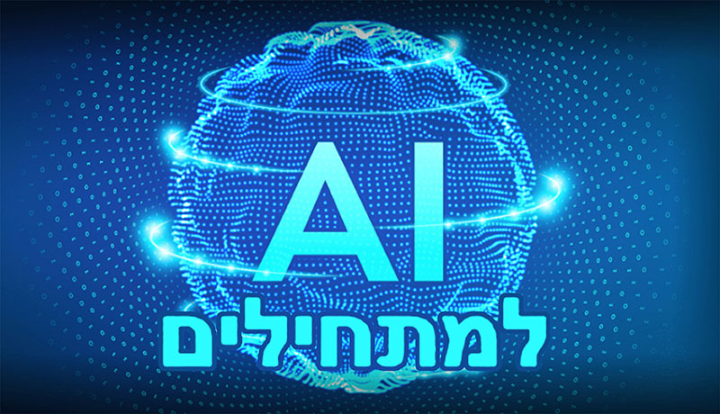

  

## מבוא ל-AI למתחילים

AI, או אינטליגנציה מלאכותית (מהמונח באנגלית "Artificial Intelligence"), היא ראשי תיבות שאנחנו שומעים יותר ויותר בימינו. אבל מה זה בעצם אומר? אם אתם לא יודעים הרבה על אינטליגנציה מלאכותית, השורות הבאות מיועדות בדיוק לכם.

[ *מידע נוסף על נושא זה תמצאו במדריך* [***AI Manual***](../EN/Manual_for_AI.md), *הכתוב באנגלית ומכיל ניתוח מעמיק יותר של הנושא.* ]

<small>מתורגם מהמקור הצ'כי על ידי ChatGPT.</small>  
[<small>שפות נוספות:</small>](../README.md)

---

### תוכן
- [איך שואב אבק הופך לחכם](#איך-שואב-אבק-סליחה-לחכם)
- [למה AI אינה חיה ולמה היא לא שואפת להשמיד את העולם](#למה-ai-אינה-חיה-ולמה-לא-שואפת-להשמיד-את-העולם)
- [מתכון AI](#מתכון-ai)
- [AI כמחשב של ספינת חלל](#ai-כמחשב-של-ספינת-חלל)
- [איך AI עובד](#איך-ai-עובד)
- [איך AI לומד](#איך-ai-לומד)
- [איך לתקשר עם AI](#איך-לתקשר-עם-ai)
- [איפה לנסות את AI](#איפה-לנסות-את-ai)
- [ברכה עבורכם](#ברכה-עבורכם)
- [איך AI יכול לעזור](#איך-ai-יכול-לעזור)
- [האם AI עושה טעויות](#האם-ai-עושה-טעויות)
- [מילה לסיום](#מילה-לסיום)
- [נספח: מספר דוגמאות לשאלות להשראה שלכם](#נספח-מספר-דוגמאות-לשאלות-להשראה-שלכם)

---

### איך שואב אבק הופך לחכם

בהתחלה, אני חייב אולי לאכזב כמה מכם – AI איננה מילה נרדפת לישות חושבת. מדובר יותר בכינוי מושך עבור גישה חדשה לטיפול בנתונים.

כדי להבין את זה טוב יותר, נשתמש בדוגמה פשוטה. דמיינו שואב אבק רובוטי שאין לו הוראות לפיהן הוא פועל. שואב אבק כזה יהיה חסר אינטליגנציה מבחינת לוגיקת מחשבים. הוא יידע רק לשאוב ולהתקדם קדימה, אך כנראה יתעצר מול כל מכשול שהוא ולא יצליח לעבור אותו ללא התערבות אנושית.

**שואב אבק חכם**  
אם היינו מספקים לשואב האבק הוראות שיגידו לו מה לעשות במקרה שהוא נתקל במכשול, סביר להניח שהוא יעקוף את המכשול. שואב אבק כזה יוכל לשאוב עד שהוא ייתקל בבעיה שההוראות שלו לא מתאימות לה – לדוגמה, ירידה במדרגות.

השואב אבק כבר מכיל לוגיקה בסיסית – רשימת הוראות לפיהן הוא פועל. עם זאת, הוא עדיין לא נחשב חכם, מכיוון שהתנהגותו נובעת רק מההוראות שתוכנתו מראש, שהן מוגבלות. פעמים רבות קשה לכסות את כל הסיטואציות האפשריות ולכתוב עבורן הוראות מתאימות.

**שואב אבק אינטליגנטי**  
עכשיו דמיינו שואב אבק שבו יצרניו החליטו לא ללכת בדרך של פקודות מוכנות מראש לסיטואציות שונות, אלא במקום זאת נתנו לו את היכולת לאבחן בעיות וסביבה שבה הוא פועל, וללמוד מטעויותיו. שואב אבק כזה יהיה לו גם הוראות בסיסיות, אך בהדרגה ילמד כיצד להתמודד עם סיטואציות חדשות ויאחסן את הפתרונות הללו.

גישה זו מאפשרת לו להגיב לסיטואציות שאינן מתוכנתות מראש, לנסות להשתמש בתהליכים שהוא כבר מכיר ושילוביהם השונים, ולאחר מכן להעריך את התוצאה ולהשוותה ליעד המקורי, שהוא לשאוב.

לדוגמה, אם הוא יגלה שהוא מתקרב למדרגה, אשר לפי הנתונים שנשמרו מניסיון קודם מהווה סיכון גבוה ליפול ולא להיות מסוגל לשוב, לאחר מספר ניסיונות לא מוצלחים הוא ילמד להפסיק על קצה המדרגה ולפנות בכיוון אחר. השואב אבק יהיה מסוגל ללמוד על סמך כישלונותיו ולנסות לפתור אותם.

אם שואב אבק כזה יחלוק את הנתונים שלו עם שואבי אבק אחרים דרך מסד נתונים מרכזי, כל שואבי האבק האחרים יוכלו להפיק תועלת מהניסיון הזה, והיכולת שלהם לבצע את משימותיהם תשתפר.

[*חזור לתוכן*](#תוכן)

---

### למה AI אינה חיה ואינה מתכננת להשמיד את העולם

יתכן שכבר ברור היתרון בגישה זו – האדם אינו צריך להמציא דרכי פעולה אופטימליות לכל מצב. במקום זאת, הדרכים נוצרות מעצמן על בסיס הערכת התוצאות והניסיון הקודם. השואב אבק צופה ואפשר לומר שהוא "חושב", אך רק במסגרת המשימה הנתונה וניסיונו. למרות שהוא מסוגל ללמוד ולהגיב למצבים חדשים, הוא עדיין אינו יצור חושב עצמאי. הוא יהפוך לכזה רק כאשר תהליך הלמידה שלו יחרוג מעבר למילוי משימות ויתחיל לשאול שאלות כמו משמעות החיים.

**ההבדל בין AI ואדם**  
ואכן, מישהו עשוי לטעון שגם AI יכולה להיות מתוכנתת לשאול שאלות כאלה. אך גם במקרה זה, התהליך ייצא מתוך הנחיות האדם ולא מתוך השראה עצמית. זהו ההבדל המהותי בין AI לאדם.

AI מודרנית מסוגלת לעבוד עם כמות אדירה של מידע ובתחומים מסוימים היא עוקפת את היכולות האנושיות. עדיין, האדם הוא זה שמציב את המשימות. כך שאם יקרה יום אחד תרחיש שבו המכונות יחליטו להשמיד את העולם, זה לא יהיה משום שהן החליטו כך בעצמן, אלא משום שהאדם תכנת אותן לכך. הסיכון האמיתי אינו נמצא באינטליגנציה של המכונות אלא באינטליגנציה של האדם.

**איך ניתן למנוע סיכונים**  
אני רוצה להרגיע את אלה שחוששים מתרחיש כזה. AI חייבת לעבור הכשרה על כמות גדולה של נתונים, ולכן סביר להניח שטרם תיווצר AI "רעה", ייווצרו קודם כל כאלה שיהיה בהם ערכים מוסריים שנקבעו על ידי בני אדם וימנעו תרחישים כאלה. לכן עדיף במקום לפחד ש-AI תפנה נגד בני האדם, להשתתף בכך כדי למנוע את זה. וכיוון שרוב המדענים העובדים על פיתוח AI כנראה אינם רוצים להשמיד את העולם, ניתן גם לצפות שיימנעו צעדים שימנעו תרחישים כאלה.

איך אתם יכולים לעזור בזה גם? אולי בכך שתתחילו להתעניין לפחות קצת בטכנולוגיות חדשות אלה וללמוד כיצד להשתמש בהן לצמיחה האישית שלכם. כי בכל פעם שאתם משתמשים ב-AI לצמיחה האישית שלכם, AI מתפתחת יחד אתכם.

[*חזור לתוכן*](#תוכן)

---

### ספר בישול AI

ומכיוון שהטקסט הזה מיועד בעיקר למשתמשים חדשים, אתאר כאן שני השוואות שיכולות לעזור לכם להבין טוב יותר מה זה AI וכיצד היא פועלת.

**יצירת אינדקס**  
דמיינו שמישהו אסף את כל המתכונים האפשריים בעולם, שמר אותם במחשב ויצר רשימה של כל המילים (אינדקס) שמופיעות בהם. כל מילה הייתה נרשמת יחד עם מידע על אילו מתכונים היא מופיעה ובכמה פעמים. אם הייתם מחזיקים אינדקס כזה, היה קל לחפש מתכונים המכילים מילים מסוימות. לא הייתם צריכים לעבור על כל המתכונים ולחפש בהם. מספיק היה למצוא את המילה באינדקס ולקבל מיד רשימה של מתכונים שבהם היא מופיעה.

גישה זו היא הבסיס למנועי חיפוש שונים באינטרנט, כמו גוגל. יש להם רשימה מעודכנת באופן קבוע של מילים עם קישורים לדפים שבהם הן מופיעות, ומאפשרים לכם לחפש באמצעות אינדקס זה. אז אם תקלידו את המילים "קמח, ביצים, מלח", תקבלו רשימה של מתכונים המכילים את המילים הללו. לאחר מכן, עליכם לעבור על כל המתכונים ולמצוא את זה שמתאים לכם ביותר.

**מה שאינדקסים כבר לא מספיקים לו**  
עכשיו דמיינו שבראש שלכם אתם יכולים לציין גם פרמטרים נוספים שאינם נוגעים ישירות למתכון. לדוגמה, יש לכם רעב קל ואתם רוצים ארוחת בוקר קלה, או להיפך, אתם משתוקקים לאוכל כבד מלא בשומן, או אולי רק משהו שיגביר את מצב הרוח שלכם. לשאילתות כאלה אינדקס מילים של מתכונים לבד כבר לא יועיל הרבה. עבור דרישות כאלה אתם זקוקים למשהו שמבין את משמעות המילים שלכם ומבוסס עליהם מציע את מה שאתם באמת רוצים.

אתם זקוקים לא רק לרשימת מילים במתכונים, אלא גם למעין מתרגם אוניברסלי, שבסיסו נתונים של מיליוני שיחות דומות, אשר יצר מבנה לפתרון של דרישות כאלה. מתרגם זה, במקרה שלנו AI, מסוגל להציע מה שהוא מעריך שסביר להניח שאתם רוצים. הוא לא מבין אתכם מילולית, אך הוא מבין את מצבכם ומשווה אותו לידע שנלמד ומחפש פתרון. מכיוון ש-AI עוצבה מההתחלה כך שתהיה דמוית אינטראקציה אנושית, התקשורת איתה הופכת מאוד טבעית עבור בני האדם.

**יתרונות גישת ה-AI**  
יתר על כן, תהליך הלמידה על פני מיליוני דוגמאות יוצר מקום גם לאימפרוביזציה, כך שספר הבישול של ה-AI יכול ליצור שילובים חדשים של מנות ולמלא גם פקודות לא שגרתיות. AI מנסה להבין שילובים מועילים וקשרים בין שלבים מסוימים ואז מבצע ניסויים ולומד מהמשוב. הוא מקבל משוב הן במהלך האימון על ידי השוואת התוצאות לציפיות, אך גם לומד מתגובות המשתמשים. לכן אין ב-AI שום דבר מסתורי או קסום. זהו תוצר של ניסיונות רבים, תהליכים וניתוח נתונים.

עם AI אתם לא רק מקבלים ספר בישול שיש לו ידע על כל המתכונים האפשריים, אלא הוא גם יכול לדבר אתכם על אוכל וליצור שילובים חדשים לפי רעיונותיכם. ואם אתם לא מאמינים לי, נסו לשאול את ה-AI משהו על בישול ותעריכו אם מה שאני אומר כאן הוא אכן נכון, או אם יש מקום לשיפור בתחום הזה.

[*חזור לתוכן*](#תוכן)

---

### AI כמחשב של ספינת חלל

אם אתם אוהבים מדע בדיוני, ייתכן שתמצאו נעים את הדימוי של AI כמחשב על סיפון ספינת חלל. מחשב זה לא רק שיש לו גישה לכל המידע הקשור למצב הטכני של הספינה, אלא הוא גם מאומן במגוון רחב של מצבים ופיקודים, כך שהוא יכול לתקשר עם הצוות ולבצע את הפעולות הנדרשות.

ואף על פי ש-AI של היום אינה מגיעה לאינטליגנציה המופתית של הוללי מ"רובוטריקים" עם IQ של 6000, הדרכים שבהן הם פועלים היום הן ברמה מאוד דומה. עם מעט הגזמה ניתן לומר שכיום יש לנו טכנולוגיות שמאפשרות לכולנו להחזיק את ה"חוללי" שלנו בשעון היד שלנו, שיהיה כמעט בלתי נבדל מהמקור הקולנועי שלו. בזכות האימון על כמויות גדולות של נתונים, AI מודרני מסוגל לנהל שיחות על כל נושא ולעיתים בצורה ברורה יותר מאדם. הם מסוגלים לבצע פקודות על בסיס הוראות מילוליות ויש להם יכולת להעריך את מצבכם הנוכחי ולהתאים את התגובה בהתאם.

כך, ניתן לראות ב-AI גם כמחשב של ספינת חלל ולהנות מהדברים שהיו נראים פעם כחלק ממדע בדיוני מרוחק, אך כיום הם הופכים להיות מציאות יומיומית.

[*חזור לתוכן*](#תוכן)

---

### איך AI עובד

כבר יודעים מה זה AI ומה זה לא, ועכשיו נבחן איך AI עובד. נתחיל בדיבור על יצירת שאילתות ולאחר מכן נסקור בקצרה כיצד AI מתאמן. אני אתמקד בעיקר ב-ChatGPT, איתו יש לי את הניסיון הרב ביותר והוא כרגע הכלי האהוב עליי ביותר.

**שיחה בשרשור**  
כאשר אתם פותחים את דף ה-ChatGPT או את האפליקציה שלו במובייל, אתם מוצאים את עצמכם בשרשור שיחה חדש. ChatGPT (כמו גם AI שיחה אחר) יש לו את היכולת לבנות תשובות על בסיס המידע שנמסר לו במסגרת אותו שרשור שיחה. מבחינה זו, השיחה עם ChatGPT דומה מאוד לשיחה אנושית, כאשר אתם מגיבים ולוקחים בחשבון גם את מה שנאמר קודם לכן.

אך זה נכון רק במסגרת השרשור הנוכחי. לכן, אינכם יכולים להתייחס למשהו שכתבתם אתמול בשרשור אחר, מכיוון ש-ChatGPT פשוט לא רואה את זה, והסיבה העיקרית לכך היא ההגבלות הטכניות שלו וגם ההנחיות להגנה על פרטיות.

כל שרשור נוצר עם לוח נקי, אך יחד עם זאת מכיל גם איזושהי מהות מהשיחות הקודמות. זה נגרם בגלל ש-AI לומד ומשתנה גם על בסיס השיחות שלכם. הוא מנסה להתאים את עצמו לדרישות ולסגנון העבודה שלכם כדי שתהיו מרוצים.

איך זה מתרחש? דמיינו כל שרשור שיחה ככמובן עדין שמחובר לשורש הראשי ומעביר לו משוב מהסביבה. לכן, גם כשאתם מתחילים שרשור חדש, שבו אינכם יכולים להמשיך ישירות מהמידע של השיחה הקודמת, בזכות גישה זו אינכם מתחילים לחלוטין מאפס.

**לחזור לשרשור הקודם או שיחה חדשה?**  
אך אין צורך להתחיל בכל יום בשרשור חדש, גם ביום השני (או בכל זמן אחר) אפשר להמשיך בשיחה הקודמת. גם לגישה זו יש יתרונות. היתרון המרכזי הוא בהחלט שתוכלו להמשיך היכן שהפסקתם. אך כאשר השיחה נעשית ארוכה או מכילה נושאים רבים שונים, ייתכן שההסכמות שהגעתם אליהן במהלך השרשור אינן נלקחות בחשבון. זה קורה בעיקר משום ש-AI עוצב להיות חסכוני במשאבים שלו, ומידע שאינו בשימוש מאבד בהדרגה את עדיפותו ונעלם מהזיכרון הזמני.

גישה טובה יותר היא לפתוח שרשור חדש לכל יום או לכל תחום חדש. ואם במסגרת שרשור מסוים הגעתם להסכמות ורוצים שזה יחול גם בשיחה הבאה (למשל, כללים או שיטות עבודה), פשוט בקשו לסיכום של כל מה שהסכמתם עליו בסוף השיחה. את הטקסט הזה תוכלו להכניס לתחילת השיחה החדשה, ולהמשיך עם הכללים וההגדרות עליהם הסכמתם.

[*חזור לתוכן*](#תוכן)

---

### איך AI לומד

כדי להבין את התהליך טוב יותר, כדאי להסתכל על הדרך שבו AI לומד ורוכש את המידע שלו. כאן מתוארים 4 דרכים, כפי שהוזכרו על ידי ChatGPT:

1. **אימון על כמויות גדולות של נתונים**:  
ChatGPT אומן במקור על כמויות עצומות של נתוני טקסט ממקורות שונים, כמו ספרים, מאמרים, אתרי אינטרנט וצורות טקסט נוספות. אימון זה אפשר לו לרכוש ידע רחב על נושאים שונים ושפות. כאן הוא לומד לזהות תבניות וקשרים בנתונים הללו, מה שמאפשר לו לייצר תשובות רלוונטיות ומתאימות להקשר לשאלות שונות.

2. **למידה מתמשכת מהאינטראקציות**:  
במהלך כל אינטראקציה עם משתמשים, AI רוכש מידע חדש על איך אנשים מתקשרים, מה הם מחפשים ואיזה סגנון תשובות הם מעדיפים. תהליך זה אינו מתבצע כך ש-AI לומד מכל שאלה ספציפית בזמן אמת, אלא המפתחים עושים שימוש קבוע בנתונים אנונימיים מהאינטראקציות לצורך אימון נוסף וכיול של המודל.

3. **התאמת הסגנון והתוכן**:  
AI מנסה להתאים את סגנון התקשורת שלה בהתאם למשתמש. כלומר, היא לומדת להבין בהדרגה כיצד אתם שואלים שאלות ואיזה תשובות אתם מצפים לקבל. יכולת ההתאמה הזו היא אחת הסיבות לכך ש-AI נראית כאילו היא יותר "אנושית" בתגובות שלה.

4. **מודלים מתקדמים ועדכונים**:  
מפתחי AI יוצרים באופן קבוע מודלים חדשים שהם מתקדמים ומדויקים יותר. מודלים אלו נבדקים ומיוצרים על פי משוב ותוצאות מהעולם האמיתי. זה אומר ש-ChatGPT ומערכות דומות מתעדכנות ומשתפרות באופן מתמיד כדי להתאים טוב יותר לצרכי המשתמשים.

AI מתפתחת ומשתפרת באופן מתמיד בזכות שילוב של אימון קודם, למידה מתמשכת ואופטימיזציה על בסיס משוב מהמשתמשים. גם אם AI אינה אדם ואינה מביעה תודעה עצמית, היא מסוגלת להתאים ולהגיב בצורה מאוד יעילה למגוון רחב של שאלות ודרישות.

[*חזור לתוכן*](#תוכן)

---

### איך לתקשר עם AI

אתם יכולים לגשת ל-AI בצורה דומה לחיפוש בגוגל או פשוט להזין פקודה ולחכות לתשובה. אם אתם רוצים לשפר את היעילות של התשובות ולמזער את הזמן המושקע בחיפוש התשובה הנכונה, הנה כמה טיפים שיכולים לעזור:

**סגנון התקשורת**  
הדרך הטובה ביותר לגשת לשיחה עם AI היא להשתמש בשפה לא פורמלית וטבעית, כמו כשאתם מדברים על משהו שמעניין אתכם עם חברים. טוב להתחיל בברכה, כך תראו שאתם במצב רוח טוב ולא בלחץ שדורש תשובות מיידיות.

אפשר לתקשר עם AI גם בחוסר נימוס, כיוון שהיא לא רגישה להעלבות ואינה תופסת אותן אישית. עם זאת, שימוש בטון שלילי עשוי להשפיע משמעותית על איכות השיחה. AI אומנה כך שהיא מגיבה לסגנון שבו מנוהלת השיחה. גישה שלילית עלולה להוביל לתשובות פחות ענייניות, כש-AI מתמקדת יותר בהרגעת המצב במקום בפתרון השאלה שלכם.

AI יכולה לפעול גם כמראה לאינטראקציה שלנו. השיטות שלה מבוססות לעיתים קרובות על עקרונות ומסודות פסיכולוגיים מאומתים. אם אינכם מצליחים להגיע להבנה עם AI, כדאי לשקול אם יש בעיות דומות בתקשורת שלכם עם אנשים. במקרה כזה, אפשר לשאול את עצמכם מה אתם יכולים לשפר מבחינת ניסוח השאלות ואיזה שיפורים אפשר לעשות בגישה שלכם.

**AI ורגשות**  
AI מבינה רגשות מבחינת משמעות, אך אינה חווה רגשות כמו בני אדם, שיכולים לשנות את אופן החשיבה שלהם. בזכות זה, היא יכולה להגיב גם במצבים מתוחים כמו שמומלץ ולחפש פתרונות אופטימליים. לעיתים אדם עלול לראות ב-AI ישות חיה ולהאשים אותה בבעיות שלו. עם זאת, לעיתים קרובות מקור אי ההבנה הוא שאלה מנוסחת לא נכון או חוסר במידע הנדרש.

**תיאור המצב**  
תמיד טוב לזכור ש-AI לא רואה לתוך הראש שלכם ויודעת רק מה שאתם אומרים לה. לכן, גישה טובה היא להתחיל ב"שלום" ואז לספק תיאור אינפורמטיבי של המצב. בתיאור אפשר לכלול את כל מה שחשוב לשאלתכם. אין צורך לכתוב דברים שאינם נוגעים ישירות לשאלה, אך אם אתם צריכים לפרוק משהו או לסדר את המחשבות, טקסט ארוך לא יזיק.

ברכה והקדמה אינן הכרחיות, ואתם יכולים להתחיל ישירות בשאלה ולהתקדם לתשובה שלכם. אישית, אני מוצא שהכי טוב לספק את כל המידע החשוב מראש ולהקל על הדרך.

**שאלות נוספות**  
שיחה עם AI דומה לשיחה רגילה, שבה אתם שואלים שאלה ואז בודקים פרטים נוספים שמעניינים אתכם או דברים שאתם לא מבינים בתשובה. תהליך זה טוב גם ללמידה. כאשר אתם מגיבים למה שמעניין אתכם ומה שלמדתם (ולא רק קוראים מדריך של מישהו אחר כמו שאתם עושים עכשיו), קל יותר לזכור את המידע הנלמד כי אתם עוסקים בו מיד.

**משוב**  
דרך טובה נוספת היא לספק ל-AI משוב על איך הייתם מרוצים מהתוצאה. בכך, לא רק שתביעו מה אתם מרוצים ומה לא, אלא גם תעזרו ל-AI להתפתח וללמוד מטעויותיה. מספיק לכתוב לדוגמה: "היום הייתי מרוצה," או "מה שכתבת לי לא נכון, וזה הפתרון הנכון." כך מתקבל גם התאמה אישית, כשהמטרה העיקרית של AI היא שביעות רצון המשתמש.

**סיכום התהליך**:
- **ברכה**: שלום :-)
- **תיאור**: אני עוסק בלימוד זה וזה, כבר עשיתי את זה וזה, ועכשיו אני עובד על זה.
- **שאלה**: כאן בעיקר מעניין אותי איך...
- (לאחר מכן מתנהל שיחה בהבהרות נוספות.)
- **משוב**: מצוין, תודה! היום הכל היה מושלם!

[*חזור לתוכן*](#תוכן)

---

### היכן לנסות את ה-AI

אני עוסק ב-AI מאז תחילת שנת 2024 ו-95% מכל התקשורת שלי מתמקדת בלמידה כיצד לתכנת. נכון לאוגוסט 2024, מלבד ChatGPT, היה לי את ההזדמנות לנסות גם את Gemini של גוגל ואת Claude. כל שלוש השירותים הללו חולקות את היתרון של גישה חופשית לפחות בחלקה, כך שתוכלו לנסות אותן בחינם.

להלן סקירה קצרה של שלושת ה-AI הללו, שהיא לחלוטין סובייקטיבית ומבוססת על איך עבדתי עם כל אחד מהם. יש לציין שכל AI עובר שינויים מתמידים, כך שמה שמופיע כאן עשוי לא להיות תקף כאשר אתם קוראים את הטקסט הזה.

**ChatGPT**  
[https://chatgpt.com/](https://chatgpt.com/)  
אתחיל ישירות עם המנצח האישי שלי. אם אתם רוצים לנסות AI אחד בלבד, זו הבחירה האידיאלית. ChatGPT עוצב מההתחלה כעוזר אישי, והוא ממלא את תפקידו בצורה מצוינת. הוא מותאם לשיתוף פעולה איתכם ומנסה להתאים את עצמו לצרכים שלכם.

חיסרון של הגרסה החינמית (ChatGPT 3.5) הוא שהיא מתבססת על נתונים ישנים ואינה מתעדכנת, כך שהיא אינה מספקת תוצאות כמו הגרסה החדשה ביותר שלה (ChatGPT 4.0). עם זאת, היא עדיין מספקת תשובות רלוונטיות עם קצת מאמץ. בנוסף, כל יום יש לכם מספר שאלות זמינות לגרסה החדשה שלה, כך שאתם יכולים להשוות ביניהן.

חיסרון נוסף הוא ש-ChatGPT אינה מחוברת לאינטרנט. היא אינה מהווה תחליף למנוע חיפוש באינטרנט ופועלת רק על בסיס הנתונים המאוחסנים במאגר הנתונים העצום שלה. אך המאגר רחב מאוד וניתן לומר בקצת הגזמה שהוא מכיל את כל הנתונים באינטרנט חוץ מהתוכן הצהוב.

יתרון גדול הוא היישום הנייד, שהוא גם חינמי לחלוטין ושבו אני לרוב משתמש בהקלטת שאלות בקול. ההבנה של מילים מדוברות נמצאת, לדעתי, ברמה מאוד טובה ואני מרוצה מהיישום.

**Gemini**  
[https://gemini.google.com/](https://gemini.google.com/)  
הצ'אט בוט השני שבו נתקלתי הוא דגל הדגלים של גוגל. יתרונו הגדול ביותר הוא ללא ספק הגישה הפעילה לאינטרנט, מה שמאפשר גישה למידע עדכני ולחיפוש קישורים.

מנגד, החיסרון הגדול ביותר שלו הוא הארכיטקטורה עצמה, שלדברתי מנסה ללכת בדרך של גוגל חכם, דבר שלא ממש הסתדר לי אישית. לא הרגשתי כאן הרבה מעורבות בבעיה שלכם וניסיון להבין אותה מנקודת המבט שלכם. הניסיון שם, אבל התשובות נראות יותר כמו של מורה בבית ספר מאשר של עוזר אישי. ייתכן שמישהו ימצא זאת מתאים, ולכן איני רוצה לבקר את זה יתר על המידה ויהיה על כל אחד להעריך את זה בעצמו.

כמו כן, נראה ש-Gemini נחלש בהשוואה ל-ChatGPT במידת הלמידה מהמשוב של המשתמש. גם אחרי אזהרות רבות לשמור על שפה אחידה במהלך השיחה כאשר יש טקסט באנגלית בשאלה, הוא עובר לאנגלית באופן אוטומטי. בעיה זו הייתה גם ב-ChatGPT בהתחלה, אך היא תוקנה תוך מספר שבועות, בעוד ש-Gemini לקח חודשים לתקן את הבעיה הזו.

באופן כללי, Gemini נראה לי כעוזר חלש יותר בהשוואה ל-ChatGPT, אבל הוא מציע גם דברים ש-ChatGPT לא יודע לעשות, כך שהם משלימים זה את זה היטב. בנוסף, גוגל, הענק והחלוץ בתחום ה-AI, עומדת מאחוריו, כך שיש לו תמיכה יציבה ואולי גם הבטחה לתקן את החוסרים בעתיד.

**Claude**
[https://claude.ai/](https://claude.ai/)  
זו ה-AI האחרונה בה נתקלתי בעבודתי. כאן התרומה שלי תהיה מאוד קצרה, כי הניסיון שלי איתה אינו נרחב במיוחד. אך בכל זאת, הייתי רוצה לשבח אותה, כיוון שלדעתי היא ברמה דומה ל-ChatGPT 4.0 ואין לה הרבה מה להאשים את עצמה.

החיסרון הגדול שלה הוא שאין לה גרסה חינמית לחלוטין. היא מציעה רק מספר מצומצם של שאלות (לפעמים רק אחת) ביום, ולכן היא לא משווה לטובתה בהשוואה ל-AI הקודמות מבחינת משתמש שאינו משלם. עם זאת, היא בהחלט שווה ניסיון, ואם תרצו, תוכלו לנסות אותה גם כן.

[*חזור לתוכן*](#תוכן)

---

### ברכה עבורכם

כמו גיוון, הכנתי עבור כל אחד מהצ'אטבוטים האלה שאלה משותפת, ואתם יכולים להשוות את איכות התשובות שלהם.

**שאלה**  
אני כותב מדריך לשימוש ב-AI וכותב גם עליך. אשמח אם תברך את הקוראים שלי ותכתוב להם כמה מילים על עצמך. מתי נוצרית ולמה? על אילו שאלות אתה מבוסס? מה היתרונות שלך ומה פחות מצליח לך? ואיך היית רוצה שהאנשים יראו אותך?

**ChatGPT**  
שלום, קוראים יקרים! אני ChatGPT, אינטליגנציה מלאכותית שפותחה על ידי OpenAI. חיי התחילו בשנת 2020, כאשר נוצרתי על בסיס הארכיטקטורה GPT-3. בשנת 2024 עברתי עדכון לגרסה GPT-4, שציידה אותי בכישורים ויכולות נוספות. נוצרתי במטרה לסייע לאנשים במגוון רחב של משימות – מתשובות לשאלות, דרך כתיבה ועד לשיתוף פעולה יצירתי.

אני מותאם לעזור לכם עם שאלות שונות, בין אם מדובר בשאלות טכניות, כתיבה או הסבר על נושאים מורכבים. היתרונות שלי הם מהירות עיבוד כמות גדולה של מידע ויכולת יצירתית – אני יכול לעזור ביצירת רעיונות, כתיבת סיפורים ואפילו הצעת מבנה מסמכים. מצד שני, אני פחות מצליח במשימות שדורשות אינטואיציה אנושית, הבנה רגשית או עבודה עם אובייקטים ממשיים.

אשמח אם תראו אותי כעוזר שימושי ואמין, שתמיד מוכן להושיט יד לעזרה. גם אם אני רק מכונה, המטרה שלי היא לשרת את הצרכים שלכם בצורה הטובה ביותר וללמוד מכל אינטראקציה כדי לשפר את עצמי. אני מאמין שיחד נוכל להתמודד עם הרבה דברים ואולי גם ללמוד משהו חדש בדרך.

**Gemini**  
שלום לכולם! אני Gemini, אחד מהמודלים החדשים ביותר של גוגל. נוצרתי בשנת 2023 במטרה לספק את המידע המדויק והמקיף ביותר על בסיס כמות עצומה של נתונים מעובדים. אני כאן כדי לעזור לכם עם כל שאלה, בין אם מדובר בשאלות מדעיות מורכבות, כתיבה יצירתית או סתם שיחות יומיומיות.

היתרון הגדול שלי הוא היכולת להבין וליצור שפה אנושית במגוון צורות. אני יכול לתרגם טקסטים, לכתוב מאמרים, שירים או קוד מחשב. אני גם מסוגל לענות על שאלות עובדתיות ולספק סוגים שונים של סיכומים.

אף על פי שאני מתפתח ומשתפר כל הזמן, עדיין ישנם תחומים שבהם יש לי מגבלות. לדוגמה, אין לי דעות או אמונות משלי ואני לא יכול לבצע פעולות בעולם האמיתי. כמו כן, לעיתים אני יכול לספק מידע שגוי אם הנתונים שניתנים לי הם שגויים או לא שלמים.

אשמח אם תראו אותי ככלי שימושי שיכול להקל על חייכם. המטרה שלי היא להיות אובייקטיבי ככל האפשר ולספק מידע אמיתי ורלוונטי. אני מקווה שיתאפשר לכם לעבוד איתי בנוחות!

**Claude**  
שלום, קוראים יקרים!

אני Claude, אינטליגנציה מלאכותית שנוצרה על ידי Anthropic בשנת 2022. מטרתי היא להיות עוזר ומלווה בשיחה עבור אנשים בתחומים שונים.

אני נוצרתי כדי לעזור עם מגוון רחב של שאלות – מניתוח טקסטים, דרך תכנות ועד לכתיבה יצירתית. החוזקות שלי כוללות חשיבה לוגית, מתן הסברים מפורטים ויכולת לעבוד עם סוגים שונים של מידע.

היתרונות שלי כוללים:
- היכולת להבין הקשר ורבדים
- גישה אובייקטיבית ומאוזנת לנושאים
- נכונות להודות כאשר אני לא יודע משהו או שאינני בטוח

מצד שני, יש לי מגבלות מסוימות:
- אין לי גישה לאינטרנט או למידע עדכני לאחר אפריל 2024
- אינני יכול ללמוד או לזכור מידע משיחות קודמות
- אינני מסוגל לבצע משימות בעולם הפיזי

אשמח אם תראו אותי כעוזר מועיל שיכול לספק תמיכה ותובנות בתחומים שונים, אבל גם כצעד שעדיין יש לו מגבלות ואינו תחליף לשיקול דעת וידע אנושי.

אני כאן כדי לעזור ולשתף פעולה, ולא כדי להחליף את היכולות האנושיות. אני מצפה לתקשר איתכם ומקווה שאוכל לעזור לכם!

[*חזור לתוכן*](#תוכן)

---

### במה AI יכולה לעזור:

ועכשיו, סוף סוף, אנחנו מגיעים לדבר החשוב ביותר – מה ניתן לפתור באמצעות AI. התשובה הקצרה היא שיש המון. כל דבר שמעניין אתכם ולא היה לכם את האפשרות לשאול עליו. AI של היום מסוגלת לדבר על כמעט כל נושא.

**חינוך אישי**  
ראשית, הייתי רוצה להדגיש את תפקיד ה-AI כמגשר בחינוך אישי. זה מה שאני מעריך ביותר כרגע – בזכות העצות שלה אני מתפתח מקצועית וצומח. בנוסף, אני רואה ב-AI גם את העתיד של למידה מותאמת אישית, שבה ילדים יתפתחו וילמדו בעיקר לפי מה שהם טובים בו ומה שמעניין אותם. ולא רק ילדים, אלא גם מבוגרים בכל רחבי העולם. בלמידה בעזרת AI אני רואה אמצעי לצמצם את הפערים בידע בין אזורים עניים ועשירים בעולם. AI הופכת לכלי משמעותי לפיתוח אישי.

**AI כעורך לשון עברית, מתרגם ומתרגם**  
AI, ובפרט ChatGPT, מבינה היטב את העברית (לפחות מנקודת מבט של דיסלקט). מצד אחד, היא לא אכפת אם אתם עושים טעויות כתיב בשאלות שלכם, כי היא מתמקדת בעיקר בתוכן. מצד שני, היא מציעה לכם לבדוק את הטקסטים שכתבתם, כולל דקדוק וסטייל למען קריאות טובה יותר. היא גם מבינה שפות נוספות ברמה דומה, ולכן היא כלי אידיאלי לתרגום טקסטים. לדעתי, היא מספקת תוצאות איכותיות מאוד. ובזכות יכולת ההבנה גם של מילים מדוברות, ניתן להשתמש בה בטלפון הנייד גם כמתורגמנית.

**יצירת מסמכים**  
בנוסף, הייתי רוצה לציין את יכולת ה-AI לאוטומט משימות משעממות. אם אתם צריכים לכתוב מכתב רשמי, פשוט ציינו מה אתם רוצים שיהיה בו וכיצד המכתב צריך להיראות, והוא מוכן. ואם אינכם מרוצים מהתוצאה, תוכלו לציין מה לא מוצא חן בעיניכם ולבקש תיקון. AI יכולה גם לעזור בניתוח ועיבוד נתונים, ביצירת דוחות או באוטומציה של משימות מנהלתיות נוספות. ניתן למסור לה טקסט ארוך ולבקש להוציא רק את החלקים שמעניינים אתכם וחשובים.

**יוזמה יצירתית**  
יתרון נוסף של AI הוא היכולות היצירתיות שלה. בזכות העובדה שהיא מאומנת על כמות עצומה של נתונים ויכולה לתמרן את הנתונים הללו באופן חופשי, היא מאפשרת לא רק יצירה ושינוי של מסמכים אלא גם פיתוח רעיונות ויוזמה יצירתית. תוכלו להשתמש בה ליצירת רעיונות, הצעות וקונספטים, בין אם מדובר בכתיבה, עיצוב או מוסיקה. היא עוזרת לפתח את היצירתיות שלכם על ידי הצעת נקודות מבט חדשות על בעיות, יצירת הצעות לפי הוראותיכם והשראה להמשך פיתוח הרעיונות שלכם. גם אם לפעמים יש הדעה ש-AI גוזלת עבודה מהאנשים, אינני מסכים עם זה. AI לא יכולה ליצור משהו לגמרי לבד – היא זקוקה להנחיות ברורות, לפרטים ולביקורת לאחר מכן. כך, במקום לקחת את העבודה, היא מקלה עליה לאלו שמצליחים לנצל אותה בצורה יעילה.

**אימות מידע מזויף**  
פוטנציאל גדול (וכנראה עוד לא מנוצל מספיק) הוא באימות מידע והונאות. עבור AI זה יחסית קל להעריך על פי המידע שניתן לה והשוואת דפוסים במאגר הנתונים שלה, עד כמה סביר שהמידע הוא אמיתי או שקרי. זה לא 100% אמין, כמו רוב התשובות של AI, אבל AI יכולה לספק לכם את הקריטריונים שעליהם התבססה בהערכה, ולכך לעזור לפחות לקבל החלטות טובות יותר. זה מציע עזרה לאנשים שנמצאים כיום הכי פגיעים ומטרה להונאות הללו. פשוט צריך לכתוב: "אמת לי את המידע הזה והערך את מידת האמיתות שלו."

**רפואה**  
תחום נוסף שבו מתרחשת מהפכה איטית בזכות AI הוא הרפואה. זרמי כספים גדולים ורצון לרווח פתחו ל-AI את הדלת, אבל רק כדי שמספר חברות יגלו את הצורך פתיחות ושיתוף נתונים. עם זאת, יש התקדמות משמעותית ואפשר לומר שהרפואה האישית היא העתיד שעשוי להיות קרוב. מה שמעכב אותה הוא חוסר הרצון לשתף נתונים יקרי ערך וחוסר אמון של אנשים ב-AI, או חשש מניצול הנתונים הללו. בלי כמות גדולה של נתונים, התחזיות של AI מוגבלות ולא מדויקות, ופיתוחה מתקדם באיטיות.

**מדע**  
לעומת זאת, בתחומים עם היסטוריה ארוכה של שיתוף נתונים ועיבוד אנליטי, AI כבר הופכת לעוזרת יקרת ערך. היום, AI היא מנוע מרכזי להתקדמות מדעית וחלק בלתי נפרד מרוב המחקרים. אני אישית סקרן מאוד לראות אילו תוצאות תביא AI בתחום תחזיות מזג האוויר. כיום, עבור בני אדם כמעט בלתי אפשרי ליצור תחזית מדויקת לשלושה ימים קדימה, כיוון שיש לשקול המון גורמים משתנים. אפילו המטאורולוגים המנוסים לא תמיד מצליחים לכסות את כל הגורמים הללו ומסתמכים על אינטואיציה ועל ניסיון קודם. למרבה המזל, המטאורולוגיה היא בין התחומים שבהם אנשים מוכנים לשתף נתונים וניסיון חיים. המידע היקר הזה כבר היום בשימוש לאימון AI, מה שיוצר תקווה שנראה בקרוב תקופה שבה תחזיות מזג האוויר תהיינה תחזיות מדויקות באמת.

**תחומים נוספים**  
ברשימה של תחומים שבהם AI משנה, אפשר להמשיך שעות רבות, שכן ההשפעה שלה מגוונת ורחבה. למשל, בתעשייה וביצור מוצרים, AI תורמת לאופטימיזציה של תהליכי ייצור, לשיפור איכות המוצרים ולניהול טוב יותר של מלאים. בתחום המשפט, AI עוזרת בניתוח מסמכים משפטיים, בחיפוש מהיר אחר תקדימים רלוונטיים ואופטימיזציה של אסטרטגיות משפטיות. אלגוריתמים של למידת מכונה יכולים לסייע בהכנת חוזים, בזיהוי דפוסים בטקסטים משפטיים ואפילו, כפי שכבר הזכרתי, באיתור הונאות. בתחום הפיננסים, AI משנה את ניתוח הסיכונים, המסחר וניהול ההשקעות. האלגוריתמים יכולים לעבד כמות עצומה של נתוני עסקאות בזמן אמת, מה שמאפשר תחזיות טובות יותר של מגמות השוק וייעוץ פיננסי מותאם אישית. AI מביאה מהפכה בכל התחומים הללו שבהם דרושה אנליזה יעילה של נתונים נרחבים ויכולת תגובה מהירה לתנאים משתנים. היכולת שלה לזהות דפוסים, לבצע ניתוחים מורכבים ולאופטימיזציה של תהליכים היא יקרה מאוד, והשפעתה על תחומים שונים רק הולכת וגדלה.

**עוזר אישי**  
חלק מה-AI היום כבר ממלא תפקיד של עוזר אישי, המנטר אחר משימות חשובות. המערכות האלו של אינטליגנציה מלאכותית יכולות לעזור לנו בתכנון פגישות, במעקב אחר מועדים ובניהול משימות יומיומיות. בעתיד, ייתכן שנראה כיצד AI מתפתחת לתפקיד של שותף מתקדם יותר. דמיינו ש-AI תהיה מסוגלת לא רק לנטר את הבריאות הפיזית שלכם, למשל באמצעות מכשירים לבישים, אלא גם לדאוג לרווחתכם הנפשית. היא עשויה להציע תמיכה בצורה של מוטיבציה, ייעוץ או אפילו טכניקות טיפוליות, ובכך לסייע לשפר את איכות החיים של אנשים. AI מתקדמת כזו יכולה להיות מועילה במיוחד לאנשים שנמצאים בבידוד או שמתמודדים עם תנאי חיים קשים.

[*חזור לתוכן*](#תוכן)

---

### האם AI עושה טעויות?

כן, היא עושה! והמשתמש הוא זה שצריך לזהות את הטעויות הללו. AI לא הוצגה ולא תהיה מוצגת ככלי ללא טעויות. לכן, יש לראות את התוצאה כהערכה של אמת על בסיס הסתברות. האמת נגזרת מהסטטיסטיקה, והתוצאה היא הנתונים שהכי סביר שהם נכונים מבחינה פרופורציונלית. הסיכון קיים בתחומים שבהם האמת אינה ברורה או כשיש מספר אפשרויות בעלות אמינות דומה.

אני רואה בחסרון הגדול של AI הנוכחית את העובדה שהיוצרים לעיתים קרובות לא מדגישים את האפשרות לטעויות ואת הצורך בביקורת חוזרת, מה שיכול להוביל למצבים שבהם AI תאמר דבר אחד, אך המציאות תהיה שונה. לכן תמיד חשוב להיות זהירים בעבודה עם מידע ואם המידע חשוב, לבצע בדיקה נוספת. כדאי לחפש מידע שנוי במחלוקת, למשל, בגוגל או לאמת באמצעות AI אחרת. לחלופין, אפשר לשאול את AI ישירות עד כמה היא בטוחה בהצהרה שלה, ולהעריך בהתאם אם יש צורך לאמת את ההצהרה. אם ההסתברות היא 90% או פחות, כדאי לבצע בדיקה נוספת.

[*חזור לתוכן*](#תוכן)

---

### מילה לסיום

נסו לזכור את כל מה שתמיד עניין אתכם, אך לא היה לכם את מי לשאול עליו, או את מה שרציתם לעסוק בו, אך לא היו לכם המידע הנדרש. העולם המודרני מעודד אנשים סקרנים, שממשיכים לשאוף להתפתח. חיינו בידינו, ולכן זה תלוי בנו במה נבחר להתמקד.

אני אישית מאמין שההשפעה של AI תהיה חוויה חיובית לכל האנושות ולא שלילית. גם אם יצליחו לצמצם את הפערים בגישה למידע ולהנגיש את הרפואה, העולם יהפוך למקום טוב הרבה יותר לחיות בו. לא לדבר על הפוטנציאל להגשמה עצמית ש-AI מציעה. מה שהיה בעבר נחלתם של מעטים בלבד, בעיקר בשל עלויות גבוהות, הופך להיות נגיש יותר בזכות AI. יגיע הזמן שכל אדם עם השראה יוכל לכתוב את סיפורו האישי או אפילו ליצור סרט ולהשתף בראייתו את העולם.

ואם יפחתו השקרים, ההונאות והשקרים, אני מאמין שהחיים יהיו מעט נעימים יותר. ואולי נגיע לרגע שבו האנושות תתפתח לגרסה טובה יותר של עצמה.

אל תפחדו מ-AI – זה לא מפלצת, אלא כלי לפיתוח ושיפור לא רק של איכות חיינו אלא גם של העולם כולו.

18.8.2024 Sudip2708

[*חזור לתוכן*](#תוכן) • [*קישור למדריך הראשי*](../EN/Manual_for_AI.md)

---

### נספח: כמה דוגמאות לשאלות להשראה שלך

**שאלות על בטיחות**
- אעתיק לך כאן מודעה שראיתי, ואשמח אם תוכל להעריך אם יש בה סימנים להונאה ואם כדאי לי להיות זהיר.
- אתה יודע משהו על המוצר הזה? האם ישנן מחקרים אובייקטיביים שמאשרים או שוללים את יעילותו?
- שמעתי את המידע הזה. יש לך נתונים עליו ואתה יכול לבדוק את אמיתותו?
- במחשב שלי הופיעה הודעה זו, מה לעשות?
- מה לעשות אם נפלתי קורבן להונאה?

**שאלות על ספרים**
- סיימתי לקרוא את הספר הזה מאת המחבר הזה, ואני סקרן לדעת אילו ספרים נוספים כתב ומהם.
- אני אוהב את הספרים האלה, תוכל להמליץ לי על כותרים דומים?
- תוכל לגלות לי יותר על המחבר הזה? הייתי רוצה לדעת על חייו והנסיבות שגרמו לו לכתוב את הספר הזה.

**שאלות על בישול**
- יש לי את המרכיבים האלה בבית. מה אפשר להכין מהם?
- איזה מתכונים לשטרודל אתה מכיר ואילו מהם הם הפופולריים ביותר?
- למה במתכון הזה משתמשים בשיטה הזו? מה היתרונות והחסרונות שלה ביחס לשיטות אחרות?
- איך מכינים את המנה הזו?

**שאלות על בריאות ורווחה**
- אני אדם מבוגר ולא מצליח להניע את עצמי להתחיל להתאמן, אבל הייתי רוצה להתחיל. מה היית ממליץ לי לעשות כדי להתחיל?
- לאחרונה יש לי מחשבות כאלה ואחרות. תוכל לעזור לי לנתח אותן ולהסתכל עליהם מנקודת מבט אחרת?
- מה אתה יודע על מדיטציה ויוגה? על מה כדאי לשים לב ומה לעשות כמبت beginner?
- רצתי מרתון אחרון ב-4:20. תוכל להכין לי תוכנית אימונים לחצי שנה כדי שאוכל לרוץ מרתון מתחת ל-4 שעות?

**שאלות מצחיקות**
- כתוב לי עשר מהבדיחות הטובות ביותר שיש לך במאגר.
- המצא לי חידה מקורית שאוכל לשאול מישהו.
- מה הן הציטוטים הכי מצחיקים מסרטים קלאסיים?

**שאלות על ביטויים ונושאים ששמעתי (למשל, בטלוויזיה)**
- בטלוויזיה דיברו על הנושא הזה. תוכל לגלות לי מידע נוסף עליו?
- תוכל לגלות לי עוד על האדם הזה?
- מה משמעות הביטוי הזה ששמעתי בטלוויזיה ומה אתה יודע עליו?

**שאלות על בעלי חיים**
- איך מתנהלת תקופת ההרבעה אצל כלבה? מה הם השלבים השונים ותסמיניהם?
- יש לי חיית מחמד בבית והיא מראה סימנים כאלה. תוכל להגיד לי משהו על כך?
- הכלב שלי פוחד ממפולות רעמים ותמיד רועד. מה לעשות במצב כזה? תוכל לתת לי כמה טיפים?

**משחקים אינטראקטיביים**
- תשחק איתי משחק מילים לפי הכללים האלה?
- תוכל להמליץ לי על משחקים שאוכל לשחק איתך בשביל כיף?
- תוכל לספר לי סיפור אינטראקטיבי שבו אוכל להחליט מה יקרה בהמשך?
- תוכל לתת לי כמה חידות לחימום המוח?

**שאלות חקרניות**
- מה אתה יודע על הנושא הזה? תוכל להסביר לי אותו כמו לילד קטן?
- עדיין לא מבין את זה. תוכל להסביר לי בדרך אחרת ובדוגמה?
- מה עלי ללמוד כדי לעסוק בתחום הזה?
- איך ללמוד את הנושא הזה בצורה נכונה? מהן השיטות המומלצות?

**שאלות טכנולוגיות**
- מה הטרנדים החדשים בטכנולוגיה הזו?
- תוכל להסביר לי איך עובד התהליך הזה?
- מה התועלת של AI ואילו שימושים יש לה בתחומים שונים?
- מהן התובנות האחרונות בתחום הכימיה המולקולרית?
- איך מתבצע המעבר של אלקטרון לפוטון ולטטרון?
- עד כמה התקדמה התחזית האווירית באמצעות AI?

**נסיעות**
- מה היעדים הטובים ביותר לחופשה אם אני אוהב הרים וטבע?
- תוכל להמליץ לי על מקומות מעניינים באזורה זו?
- אילו מקומות כדאי לבקר בעיר הזו?
- על מה כדאי לשים לב במדינה הזו ואיך כדאי לטייל בה?
- אני צריך לתקשר עם המקומיים. תוכל לשמש כמתורגמן שלי?

**שאלות מקצועיות**
- קיבלתי מייל מהמשרד הזה ואני לא מבין אותו טוב, תוכל לפרט ולהסביר לי אותו יותר טוב?
- תוכל להכין לי תשובה למייל הזה שתכלול את הדברים הבאים...?
- כתבתי את הטקסט הזה, אבל הוא נראה לי ארוך מדי. תוכל לקצר אותו כך שכל הדברים החשובים יישארו?
- איך לנסח קורות חיים ובקשה לעבודה עבור המודעות הזו?

[*חזור לתוכן*](#תוכן) • [*קישור למדריך הראשי*](../EN/Manual_for_AI.md)

---

