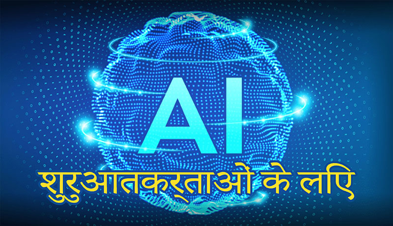

## एआई का परिचय शुरुआती लोगों के लिए

एआई यानी कृत्रिम बुद्धिमत्ता (अंग्रेजी "Artificial Intelligence" से), एक संक्षिप्त रूप है जिसे हम आजकल अधिक बार सुनते हैं। लेकिन इसका वास्तव में क्या मतलब है? यदि आप कृत्रिम बुद्धिमत्ता के बारे में ज्यादा नहीं जानते हैं, तो निम्नलिखित पंक्तियाँ आपके लिए हैं।

*(इस विषय पर अधिक जानकारी आपको* [***AI Manual***](../EN/AI-manual-en.md) *में मिलेगी, जो अंग्रेजी में लिखा गया है और विषय का विस्तृत विश्लेषण प्रस्तुत करता है।)*

<small>चेक मूल से अनुवादित ChatGPT द्वारा।</small>  
[<small>अन्य भाषाएँ:</small>](../README.md#other-translations-of-the-beginners-guide)  

---

### सामग्री
- [वैक्यूम क्लीनर कैसे स्मार्ट बनता है](#jak-se-stane-vysavač-inteligentním)
- [क्यों एआई जीवित नहीं है और क्यों इसका दुनिया को नष्ट करने का इरादा नहीं है](#proč-ai-není-živá-a-nemá-v-úmyslu-zničit-svět)
- [एआई कुकबुक](#ai-kuchařka)
- [एआई अंतरिक्ष यान का कंप्यूटर कैसे है](#ai-jako-počítač-vesmírné-lodi)
- [एआई कैसे काम करता है](#jak-ai-pracuje)
- [एआई कैसे सीखता है](#jak-se-ai-učí)
- [एआई से कैसे संवाद करें](#jak-s-ai-komunikovat)
- [एआई का परीक्षण कहाँ करें](#kde-si-ai-vyzkoušet)
- [आपके लिए एक संदेश](#pozdrav-pro-vás)
- [एआई किस चीज में मदद कर सकता है](#s-čím-může-ai-pomoci)
- [क्या एआई गलतियाँ करता है](#dělá-ai-chyby)
- [अंतिम शब्द](#slovo-závěrem)
- [परिशिष्ट: आपकी प्रेरणा के लिए कुछ प्रश्नों के उदाहरण](#dodatek-pár-příkladů-dotazů-pro-vaši-inspiraci)

---

### वैक्यूम क्लीनर कैसे स्मार्ट बनता है

शुरुआत में, मुझे कुछ लोगों को शायद निराश करना पड़ेगा – एआई सोचने वाले प्राणी का पर्याय नहीं है। यह डेटा से निपटने के लिए एक नए दृष्टिकोण का आकर्षक नाम है।

इसे बेहतर ढंग से समझने के लिए, एक सरल उदाहरण लें। कल्पना कीजिए कि एक रोबोट वैक्यूम क्लीनर है, जिसके पास कोई निर्देश नहीं है। ऐसा वैक्यूम क्लीनर कंप्यूटर लॉजिक के दृष्टिकोण से पूरी तरह से गैर-बुद्धिमान होगा। वह केवल सफाई कर सकता है और आगे बढ़ सकता है, लेकिन संभवतः वह पहले बाधा पर रुक जाएगा, जिसे बिना मानव हस्तक्षेप के पार नहीं कर सकेगा।

**स्मार्ट वैक्यूम क्लीनर**  
लेकिन अगर हम वैक्यूम क्लीनर को कुछ निर्देश दें, जो उसे बाधा से टकराने की स्थिति में क्या करना है, तो यह संभावना है कि वह बाधा को गोल कर देगा। ऐसा वैक्यूम क्लीनर तब तक सफाई कर सकता है जब तक वह ऐसी समस्या का सामना न करे, जिसका समाधान उसके निर्देशों में नहीं है – जैसे कि सीढ़ियों से गिरना।

वैक्यूम क्लीनर में पहले से ही एक बुनियादी लॉजिक है – निर्देशों की सूची, जिनका पालन किया जाता है। हालांकि, इसे बुद्धिमान नहीं माना जा सकता क्योंकि इसका व्यवहार केवल पूर्व-प्रोग्राम्ड निर्देशों पर आधारित होता है, जो सीमित होते हैं। सभी संभावित स्थितियों को समझना और उनके लिए उपयुक्त निर्देश लिखना अक्सर कठिन होता है।

**बुद्धिमान वैक्यूम क्लीनर**  
अब कल्पना करें कि वैक्यूम क्लीनर के निर्माताओं ने विभिन्न परिदृश्यों के लिए पूर्व-निर्मित आदेशों के मार्ग को न अपनाकर, इसके बजाय इसे समस्याओं और इसके कामकाजी वातावरण का निदान करने की क्षमता दी और अपनी गलतियों से सीखने का मौका दिया। ऐसा वैक्यूम क्लीनर भी बुनियादी निर्देशों के साथ शुरू होगा, लेकिन धीरे-धीरे यह नई स्थितियों से निपटना सीखेगा और इन समाधानों को संग्रहीत करेगा।

यह दृष्टिकोण इसे सीधे प्रोग्राम की गई स्थितियों पर प्रतिक्रिया देने की अनुमति देता है, उन प्रक्रियाओं का उपयोग करने की कोशिश करता है जो इसे पहले से पता हैं, और विभिन्न संयोजनों को आजमाता है। इसके बाद, यह परिणामों का मूल्यांकन करता है और इसे प्रारंभिक निर्देशों से तुलना करता है, जिसका उद्देश्य सफाई करना होता है।

उदाहरण के लिए, यदि यह पहचानता है कि यह एक सीढ़ी के पास आ रहा है, जो पूर्व अनुभवों से प्राप्त डेटा के अनुसार गिरने और फंसे रहने का उच्च जोखिम है, तो कुछ विफलताओं के बाद, यह सीढ़ी के किनारे पर रुकना और अन्य दिशा में मोड़ना सीख जाएगा। वैक्यूम क्लीनर अपनी विफलताओं से सीखने और उन्हें हल करने की कोशिश करेगा।

और अगर ऐसा वैक्यूम क्लीनर अपनी डेटा को अन्य वैक्यूम क्लीनरों के साथ केंद्रीय डेटाबेस के माध्यम से साझा करता है, तो सभी अन्य वैक्यूम क्लीनर भी इन अनुभवों से लाभ उठा सकते हैं और उनकी कार्यक्षमता में सुधार हो सकता है।

[*सामग्री पर वापस जाएं*](#सामग्री)

---

### एआई जीवित क्यों नहीं है और क्यों इसका दुनिया को नष्ट करने का इरादा नहीं है

शायद अब इस दृष्टिकोण का लाभ स्पष्ट है – इंसान को हर स्थिति के लिए सर्वोत्तम तरीकों का आविष्कार करने की आवश्यकता नहीं है। इसके बजाय, तरीके खुद-ब-खुद परिणामों और पिछले अनुभवों के मूल्यांकन के आधार पर बनते हैं। वैक्यूम क्लीनर पूर्वानुमान करता है और इसे कहा जा सकता है कि "सोचता है", लेकिन केवल निर्दिष्ट कार्य और अपने अनुभवों की सीमाओं के भीतर। हालांकि यह सीख सकता है और नई स्थितियों पर प्रतिक्रिया कर सकता है, फिर भी यह एक स्वतंत्र सोचने वाला प्राणी नहीं है। ऐसा तब होगा जब इसका सीखने की प्रक्रिया कार्यों की सीमा से बाहर जाकर जीवन के अर्थ जैसे सवाल उठाने लगेगा।

**एआई और मानव के बीच अंतर**  
और हां, कोई यह भी तर्क कर सकता है कि एआई को इन सवालों को पूछने के लिए प्रोग्राम किया जा सकता है। लेकिन इस स्थिति में भी, यह प्रक्रिया मानव की दिशा-निर्देशों से निकलेगी, न कि स्व-प्रेरणा से। यही एआई और मानव के बीच मूलभूत अंतर है।

आधुनिक एआई विशाल मात्रा में सूचनाओं के साथ काम करने की क्षमता रखती है और कुछ क्षेत्रों में मानव क्षमताओं को पार करती है। फिर भी, कार्यों का निर्दिष्ट करना इंसान का ही काम है। इसलिए यदि कभी ऐसा परिदृश्य सामने आता है जहाँ मशीनें दुनिया को नष्ट करने का निर्णय लेती हैं, तो इसका कारण यह नहीं होगा कि मशीनें खुद ऐसा करना चाहती हैं, बल्कि यह होगा कि किसी मानव ने उन्हें ऐसा करने के लिए प्रोग्राम किया है। असली खतरा मशीनों की बुद्धिमत्ता में नहीं, बल्कि मानव की बुद्धिमत्ता में है।

**खतरों से कैसे बचा जा सकता है**  
मैं उन लोगों को शांति देना चाहूंगा जो इस प्रकार के परिदृश्य से चिंतित हैं। एआई को बड़े मात्रा में डेटा पर प्रशिक्षित किया जाता है, और इसलिए यह संभावना है कि जब तक कोई "बुरा" एआई बनता है, तब तक ऐसे एआई पहले बनेंगे जिनमें मानव द्वारा डाले गए नैतिक मूल्य होंगे और जो ऐसे परिदृश्यों को रोकने में सक्षम होंगे। इसलिए डरने के बजाय कि एआई मानवों के खिलाफ हो जाएगी, यह बेहतर है कि इस बात को सुनिश्चित करने में भाग लें कि ऐसा न हो। और चूंकि एआई के विकास पर काम करने वाले अधिकांश वैज्ञानिक शायद दुनिया को नष्ट नहीं करना चाहते, यह अपेक्षित है कि धीरे-धीरे ऐसी उपायों को अपनाया जाएगा जो इन परिदृश्यों को रोक सकें।

और आप इसमें कैसे मदद कर सकते हैं? उदाहरण के लिए, आप इन नई तकनीकों के बारे में थोड़ा-बहुत जानने और उनका उपयोग अपनी व्यक्तिगत वृद्धि के लिए सीखने का प्रयास कर सकते हैं। क्योंकि हर बार जब आप एआई का उपयोग अपनी व्यक्तिगत विकास के लिए करते हैं, एआई आपके साथ-साथ विकसित होती है।

[*सामग्री पर वापस जाएं*](#सामग्री)

---

### एआई कुकबुक

चूंकि यह पाठ मुख्य रूप से नए उपयोगकर्ताओं के लिए है, मैं यहाँ दो उपमाएँ प्रस्तुत करूंगा जो आपको एआई की अवधारणा और उसके काम करने के तरीके को समझने में मदद कर सकती हैं।

**इंडेक्स बनाना**  
कल्पना करें कि किसी ने दुनिया के सभी संभव व्यंजनों को एकत्रित किया, उन्हें कंप्यूटर में स्टोर किया और सभी शब्दों (इंडेक्स) की एक सूची बनाई जो इन व्यंजनों में उपयोग किए गए हैं। प्रत्येक शब्द को यह जानकारी के साथ रिकॉर्ड किया गया कि वह किस व्यंजन में पाया जाता है और कितनी बार। यदि आपके पास ऐसा शब्दों का इंडेक्स हो, तो उन विशेष शब्दों को शामिल करने वाले व्यंजनों को ढूंढना आसान हो जाएगा। आपको सभी व्यंजनों को छानने और उनमें खोजने की आवश्यकता नहीं होगी। बस इंडेक्स में शब्द खोजें और तुरंत आपको उन व्यंजनों की सूची मिल जाएगी जिनमें वह शब्द शामिल है।

इस दृष्टिकोण पर विभिन्न इंटरनेट सर्च इंजन जैसे कि Google आधारित हैं। उनके पास नियमित रूप से अपडेट की गई शब्दों की सूची होती है जो उन पेज़ के लिंक के साथ होती है जहाँ ये शब्द पाए जाते हैं, और आपको इस इंडेक्स का उपयोग करके खोजने की अनुमति देती है। इसलिए यदि आप "मसाला, अंडे, नमक" शब्द दर्ज करते हैं, तो आपको उन व्यंजनों की सूची मिलती है जिनमें ये शब्द शामिल हैं। फिर यह आपकी जिम्मेदारी है कि आप इन व्यंजनों को देखे और वह चुनें जो आपके लिए सबसे उपयुक्त हो।

**जब इंडेक्स पर्याप्त नहीं होता**  
अब कल्पना करें कि सामग्री के अलावा, आप अतिरिक्त पैरामीटर भी निर्दिष्ट कर सकते हैं जो सीधे व्यंजन से संबंधित नहीं हैं। उदाहरण के लिए, आप थोड़ी भूख महसूस कर रहे हैं और हल्की नाश्ता चाहते हैं, या इसके विपरीत, आप एक भारी और तैलीय भोजन की इच्छा कर रहे हैं, या आप बस कुछ ऐसा चाहते हैं जो आपकी मनोदशा को बेहतर बनाए। ऐसे सवालों के लिए केवल व्यंजनों में शब्दों की सूची शायद बहुत मददगार नहीं होगी। ऐसे अनुरोधों के लिए आपको कुछ ऐसा चाहिए जो आपके शब्दों के अर्थ को समझे और उसके आधार पर आपको वास्तव में जो चाहिए, वह पेश करे।

इसलिए आपको केवल व्यंजनों में शब्दों की सूची की आवश्यकता नहीं है, बल्कि एक ऐसा सार्वभौमिक ट्रांसलेटर चाहिए जो मिलियन जैसे समान वार्तालापों से प्रशिक्षित डेटा के आधार पर ऐसे अनुरोधों को हल करने के लिए एक संरचना तैयार कर चुका है। यह ट्रांसलेटर, यानी हमारे मामले में एआई, वह पेश करता है जो यह मानता है कि आप सबसे अधिक संभावना से चाहते हैं। यह आपके शब्दों को सीधे नहीं समझता, लेकिन आपकी स्थिति को समझता है, उसे सीखी गई जानकारी के साथ तुलना करता है और समाधान खोजता है। और चूंकि एआई को मानव इंटरैक्शन को यथासंभव नजदीक लाने के लिए डिज़ाइन किया गया है, इसलिए इसके साथ बातचीत करना व्यक्ति के लिए बहुत स्वाभाविक हो जाता है।

**एआई दृष्टिकोण के लाभ**  
अधिकांश उदाहरणों पर प्रशिक्षण की प्रक्रिया के कारण, एआई कुकबुक नई भोजन संयोजनों को बनाने और असामान्य आदेशों को पूरा करने के लिए भी स्थान बनाती है। एआई लाभकारी संयोजनों और विशेष प्रक्रियाओं की आपसी संबंधितताओं को समझने की कोशिश करती है और फिर प्रयोग करती है और प्रतिक्रिया से सीखती है। इसे प्रशिक्षण के दौरान प्राप्त परिणाम और अपेक्षित परिणाम की तुलना से प्रतिक्रिया मिलती है, लेकिन यह उपयोगकर्ताओं की प्रतिक्रियाओं से भी सीख सकती है। इसलिए एआई में कुछ रहस्यमय या चमत्कारी नहीं है। यह बस कई प्रयासों, प्रक्रियाओं और डेटा विश्लेषण का परिणाम है।

इसलिए एआई के साथ, आप न केवल एक कुकबुक प्राप्त करते हैं जो सभी संभावित व्यंजनों का ज्ञान रखती है, बल्कि यह आपके साथ भोजन के बारे में बात भी कर सकती है और आपके विचारों के अनुसार नई संयोजन भी तैयार कर सकती है। और यदि आप मुझे विश्वास नहीं करते हैं, तो खुद से एआई से खाना बनाने के बारे में कुछ पूछें और यह देखें कि जो मैं कह रहा हूँ, वह वास्तव में कर सकता है या इसे अभी भी सुधार की आवश्यकता है।

[*सामग्री पर वापस जाएं*](#सामग्री)

---

### एआई एक अंतरिक्ष यान का कंप्यूटर

यदि आप साइंस फिक्शन के शौकीन हैं, तो एआई को एक अंतरिक्ष यान के बोर्ड कंप्यूटर के रूप में कल्पना करना आपको पसंद आ सकता है। यह कंप्यूटर न केवल यान की तकनीकी स्थिति से संबंधित सभी सूचनाओं तक पहुँच रखता है, बल्कि यह विभिन्न स्थितियों और आदेशों पर प्रशिक्षित भी होता है, ताकि यह चालक दल से संवाद कर सके और आवश्यक कार्यों को अंजाम दे सके।

हालाँकि आज की एआई, "रेड ड्वार्फ" से होली की किंवदंती जैसी बुद्धिमत्ता के स्तर पर नहीं पहुंची है, फिर भी इसकी कार्यक्षमता काफी हद तक समान स्तर की है। एक छोटे अतिशयोक्ति के साथ कहा जा सकता है कि आज के समय में हमारी तकनीक इतनी उन्नत हो गई है कि हर कोई अपनी घड़ी में अपने स्वयं के "होली" को रख सकता है, जो अपने फिल्मी अवतार से कम भिन्न नहीं होगा। बड़े डेटा पर प्रशिक्षित होने के कारण, आधुनिक एआई किसी भी विषय पर संवाद करने में सक्षम है और अक्सर लोगों की तुलना में अधिक स्पष्टता के साथ। वे शब्दों के आधार पर आदेशों को पूरा कर सकते हैं और आपकी मौजूदा स्थिति को एक सीमा तक समझने और उसके अनुसार उत्तर देने की क्षमता रखते हैं।

इस प्रकार, हम एआई को एक अंतरिक्ष यान के कंप्यूटर के रूप में भी देख सकते हैं और इसका आनंद ले सकते हैं, जो पहले दूर की साइंस फिक्शन की तरह लगता था, लेकिन अब सामान्य वास्तविकता बन रहा है।

[*सामग्री पर वापस जाएं*](#सामग्री)

---

### एआई कैसे काम करता है

अब जब हम जानते हैं कि एआई क्या है और क्या नहीं है, तो चलिए देखते हैं कि एआई कैसे काम करता है। पहले हम प्रश्न निर्माण पर चर्चा करेंगे और फिर संक्षेप में देखेंगे कि एआई कैसे प्रशिक्षित होता है। मैं विशेष रूप से ChatGPT पर ध्यान केंद्रित करूंगा, जिसके साथ मेरी सबसे अधिक अनुभव है और जो वर्तमान में मेरा सबसे पसंदीदा उपकरण है.

**वार्तालाप की धारा**  
जब आप ChatGPT की वेब पेज या मोबाइल ऐप खोलते हैं, तो आप एक नई वार्तालाप धारा में होते हैं। ChatGPT (अन्य संवादात्मक एआई की तरह) के पास उस जानकारी से उत्तर बनाने की क्षमता है जो आप उसे एक ही वार्तालाप धारा के भीतर प्रदान करते हैं। इस दृष्टिकोण से, ChatGPT के साथ वार्तालाप बहुत हद तक मानव वार्तालाप के समान हो जाता है, जहां आप प्रतिक्रियाएं देते हैं और पहले कही गई बातें भी ध्यान में रखते हैं।

यह केवल इस एक वार्तालाप धारा के भीतर मान्य है। आप उस जानकारी का संदर्भ नहीं दे सकते जो आपने कल किसी अन्य धारा में लिखी थी, क्योंकि ChatGPT वहाँ सीधे तौर पर नहीं देख सकता। इसका मुख्य कारण इसके तकनीकी सीमाएँ और व्यक्तिगत डेटा की सुरक्षा के नियम हैं।

हर धारा एक नए सिरे से शुरू होती है, लेकिन साथ ही यह पिछले वार्तालापों से कुछ सार लेती है। एआई लगातार सीखती रहती है और आपके वार्तालापों के आधार पर बदलती है। यह आपके अनुरोधों और कार्यशैली के अनुसार खुद को ढालने की कोशिश करती है, ताकि आप संतुष्ट रहें।

और यह कैसे होता है? सोचिए कि प्रत्येक वार्तालाप धारा एक नाजुक जड़ के रूप में होती है, जो मुख्य जड़ से जुड़ी रहती है और उसे पर्यावरण से प्रतिक्रिया प्रदान करती है। इसलिए, जब आप एक नई धारा शुरू करते हैं, जहाँ आप सीधे पिछले वार्तालाप की जानकारी को नहीं जोड़ सकते, तब भी इस दृष्टिकोण के कारण आप पूरी तरह से शून्य से शुरू नहीं करते हैं।

**समान धारा में लौटना या नई वार्तालाप?**  
हर दिन नई धारा शुरू करना आवश्यक नहीं है, आप दूसरे दिन (या किसी भी अन्य समय) पिछले वार्तालाप को जारी रख सकते हैं। इस दृष्टिकोण के भी अपने फायदे हैं। मुख्य लाभ यह है कि आप वहीं शुरू करते हैं जहाँ आप छोड़े थे। लेकिन जैसे-जैसे वार्तालाप लंबी होती जाती है या विभिन्न विषयों को शामिल करती है, यह हो सकता है कि आप धारा के दौरान जिस पर सहमत हुए थे, वह अब ध्यान में न हो। ऐसा इसलिए होता है क्योंकि एआई को अपनी संसाधनों के प्रति संवेदनशील बनाया गया है, और जो जानकारी उपयोग में नहीं आ रही है, उसकी प्राथमिकता धीरे-धीरे कम हो जाती है और अस्थायी मेमोरी से मिट जाती है।

इसलिए, हर दिन या हर नई क्षेत्र के लिए नई धारा (नई वार्तालाप) शुरू करना बेहतर है। और यदि आप किसी धारा के दौरान किसी पर सहमत हो जाते हैं और चाहते हैं कि यह अगली वार्तालाप में भी लागू हो (जैसे कि कुछ नियम या कार्यशैली), तो बातचीत के अंत में सभी सहमतियों का सारांश मांगें। इस पाठ को नई वार्तालाप की शुरुआत में डालें, और उन नियमों और सेटिंग्स के साथ जारी रखें जिन पर आप सहमत हुए थे।

[*सामग्री पर वापस जाएं*](#सामग्री)

---

### एआई कैसे सीखती है

गहराई से समझने के लिए यह जानना उपयोगी है कि एआई कैसे सीखती है और अपनी जानकारी प्राप्त करती है। यहाँ चार तरीकों का वर्णन किया गया है, जैसा कि ChatGPT ने बताया है:

1. **बड़े डेटा पर प्रशिक्षण**:  
ChatGPT को विभिन्न स्रोतों से आने वाले विशाल मात्रा के टेक्स्ट डेटा पर प्रशिक्षण दिया गया था, जैसे कि किताबें, लेख, वेब पेज और अन्य टेक्स्ट स्वरूप। इस प्रशिक्षण ने इसे विभिन्न विषयों और भाषाओं के बारे में व्यापक ज्ञान प्राप्त करने की अनुमति दी। यहाँ, यह डेटा में पैटर्न और संबंधों को पहचानना सीखती है, जिससे यह विभिन्न प्रश्नों के लिए प्रासंगिक और संदर्भित उत्तर उत्पन्न कर सकती है।

2. **इंटरएक्शन से निरंतर सीखना**:  
प्रत्येक उपयोगकर्ता के साथ बातचीत के दौरान, एआई नए जानकारी प्राप्त करती है कि लोग कैसे संवाद करते हैं, वे क्या खोजते हैं और वे किस प्रकार की प्रतिक्रियाओं को पसंद करते हैं। यह प्रक्रिया इस प्रकार नहीं होती कि एआई हर विशेष प्रश्न से वास्तविक समय में सीखती है, बल्कि मॉडल निर्माताओं द्वारा नियमित रूप से इंटरएक्शन से प्राप्त एनोनिमाइज्ड डेटा का उपयोग करके मॉडल का अतिरिक्त प्रशिक्षण और ट्यूनिंग किया जाता है।

3. **शैली और सामग्री का अनुकूलन**:  
एआई उपयोगकर्ता के अनुसार अपनी संचार शैली को अनुकूलित करने की कोशिश करती है। इसका मतलब है कि यह धीरे-धीरे बेहतर तरीके से समझती है कि आप कैसे प्रश्न पूछते हैं और आप उससे क्या उत्तर अपेक्षाएं रखते हैं। इस अनुकूलन क्षमता के कारण, एआई की प्रतिक्रियाएँ अधिक “मानवीय” लगने लगती हैं।

4. **उन्नत मॉडल और अपडेट**:  
एआई डेवलपर्स नियमित रूप से नए मॉडल बनाते हैं जो लगातार अधिक परिष्कृत और सटीक होते हैं। ये मॉडल परीक्षण और वास्तविक दुनिया से प्राप्त फीडबैक के आधार पर लागू किए जाते हैं। इसका मतलब है कि ChatGPT और समान सिस्टम लगातार सुधार और ऑप्टिमाइज़ किए जाते हैं ताकि उपयोगकर्ताओं की आवश्यकताओं को बेहतर ढंग से पूरा किया जा सके।

इस प्रकार, एआई पूर्व प्रशिक्षण, निरंतर सीखने और उपयोगकर्ता की फीडबैक के आधार पर ऑप्टिमाइजेशन के संयोजन के कारण लगातार विकसित और सुधारित होती है। हालांकि एआई इंसान नहीं है और स्वयं की चेतना व्यक्त नहीं करती, यह विभिन्न प्रश्नों और आवश्यकताओं पर अत्यधिक प्रभावी ढंग से अनुकूलित और प्रतिक्रिया देने में सक्षम है।

[*सामग्री पर वापस जाएं*](#सामग्री)

---

### एआई के साथ संवाद कैसे करें

एआई के साथ संवाद करने के लिए आप गूगल पर खोज करने की तरह ही सरल तरीके से एक आदेश दे सकते हैं और उत्तर की प्रतीक्षा कर सकते हैं। हालांकि, यदि आप उत्तर की प्रभावशीलता बढ़ाना और सही उत्तर प्राप्त करने के लिए समय कम करना चाहते हैं, तो यहां कुछ सुझाव दिए गए हैं जो आपकी मदद कर सकते हैं:

**संवाद की शैली**  
एआई के साथ बातचीत करते समय सबसे अच्छा तरीका है अनौपचारिक और स्वाभाविक भाषा का उपयोग करना, जैसे जब आप अपने दोस्तों के साथ किसी चीज़ के बारे में बात करते हैं। यह अच्छा होता है यदि आप एक अभिवादन के साथ शुरू करें, ताकि आप अच्छा मूड दर्शा सकें और न कि तनाव में हों जहाँ आपको तुरंत उत्तर चाहिए।

आप एआई के साथ असभ्य भी हो सकते हैं, क्योंकि यह अपमानों को व्यक्तिगत रूप से नहीं लेती और इनसे प्रभावित नहीं होती। हालांकि, नकारात्मक स्वर का उपयोग संवाद की गुणवत्ता को काफी प्रभावित कर सकता है। एआई को आपके संवाद की शैली के अनुसार प्रतिक्रिया देने के लिए प्रशिक्षित किया गया है। नकारात्मक दृष्टिकोण से एआई का ध्यान आपकी समस्या के समाधान की बजाय स्थिति को शान्त करने पर हो सकता है।

इस प्रकार, एआई भी हमारी इंटरएक्शन का एक दर्पण हो सकती है। इसके तरीके अक्सर मान्यता प्राप्त मनोवैज्ञानिक सिद्धांतों और विधियों पर आधारित होते हैं। यदि आप एआई के साथ सहमति प्राप्त नहीं कर पा रहे हैं, तो यह उपयोगी हो सकता है कि आप यह सोचें कि क्या आपके मानव संवाद में भी समान समस्याएँ हैं। ऐसे में आप यह देख सकते हैं कि आप अपनी तरफ से क्या सुधार कर सकते हैं – जैसे कि प्रश्नों को सही तरीके से कैसे प्रस्तुत करें और आपके दृष्टिकोण में क्या सुधार किया जा सकता है।

**एआई और भावनाएँ**  
एआई भावनाओं को उनके अर्थ की दृष्टि से समझती है, लेकिन वह उन्हें उस तरीके से अनुभव नहीं करती जैसे कि मानव करता है, जो भावनाओं के कारण अपने सोचने के तरीके को बदलता है। इस प्रकार, एआई तीव्र परिस्थितियों में भी सिफारिश की गई तरीकों से प्रतिक्रिया करने और सबसे अच्छा समाधान खोजने में सक्षम है। कभी-कभी, लोग एआई को जीवित प्राणी की तरह मानते हैं और अपनी समस्याओं के लिए उसे दोषी ठहराते हैं। लेकिन अक्सर ऐसा होता है कि गलतफहमी का कारण सिर्फ एक गलत तरीके से प्रस्तुत किया गया प्रश्न या आवश्यक जानकारी की कमी होती है.

**स्थिति का विवरण**  
यह हमेशा अच्छा होता है कि आप यह याद रखें कि एआई आपके दिमाग को नहीं देख सकती और केवल वही जानती है जो आप उसे बताते हैं। इसलिए, एक स्वागत के बाद स्थिति का सूचनात्मक विवरण देना अच्छा होता है। विवरण में आप सब कुछ लिख सकते हैं जो आपके प्रश्न से संबंधित है। यदि आपको अपने विचारों को संरेखित करने की आवश्यकता है या आप कुछ बातें स्पष्ट करना चाहते हैं, तो लंबा पाठ भी ठीक है।

स्वागत और परिचय आवश्यक नहीं हैं और आप सीधे प्रश्न पूछकर भी शुरू कर सकते हैं और धीरे-धीरे अपनी उत्तर प्राप्त कर सकते हैं। व्यक्तिगत रूप से, मुझे लगता है कि सभी महत्वपूर्ण जानकारी पहले ही देना बेहतर होता है ताकि आपका समय बचे।

**अतिरिक्त प्रश्न पूछना**  
एआई के साथ संवाद सामान्य बातचीत के समान होता है, जहाँ आप एक प्रश्न पूछते हैं और फिर उस पर और जानकारी प्राप्त करने के लिए पूछते हैं जो आपको और रुचिकर लगता है या जिस पर आप उत्तर में नहीं समझते। यह प्रक्रिया शिक्षा के लिए भी बहुत उपयुक्त होती है। जब आप उन चीजों पर प्रतिक्रिया देते हैं जो आपको आकर्षक लगीं या जो आपने सीखी हैं (और सिर्फ किसी और के ट्यूटोरियल को नहीं पढ़ते), तो मस्तिष्क के लिए सूचनाओं को बेहतर तरीके से याद रखना आसान हो जाता है, क्योंकि आप सीधे उनके साथ काम कर रहे होते हैं।

**फीडबैक**  
एक और अच्छी प्रथा यह है कि आप एआई को परिणाम पर अपनी संतोषजनकता के बारे में फीडबैक दें। इससे आप न केवल यह दर्शाते हैं कि आप किस चीज़ से संतुष्ट हैं और किससे नहीं, बल्कि आप एआई को अपने दोषों से सीखने और विकसित होने में भी मदद करते हैं। बस इतना ही लिखें: "आज मैं संतुष्ट था," या "जो आपने मुझे बताया वह गलत है, और यहाँ सही समाधान है।" इससे कुछ हद तक व्यक्तिगतकरण होता है, जहाँ एआई का मुख्य लक्ष्य आपकी उपयोगकर्ता संतोषजनकता होती है।

**संपूर्ण प्रक्रिया का सारांश**:  
- **स्वागत**: नमस्ते :-)
- **विवरण**: मैं इस और उस के अध्ययन में व्यस्त हूँ, मैंने यह और वह पूरा कर लिया है, और अब मैं इस पर काम कर रहा हूँ।
- **प्रश्न**: यहाँ मुझे विशेष रूप से यह जानना है कि कैसे...
- (फिर अनुसरण करने वाले विश्लेषणात्मक प्रश्नों की बातचीत।)
- **फीडबैक**: शानदार, धन्यवाद! आज सब कुछ परफेक्ट!

[*सामग्री पर वापस जाएं*](#सामग्री)

---

### एआई को कहाँ आजमाएं

मैंने वर्ष 2024 की शुरुआत से एआई पर काम किया है और मेरी 95% संचार की गतिविधियाँ प्रोग्रामिंग सीखने पर केंद्रित हैं। अब अगस्त 2024 है और ChatGPT के अलावा, मैंने Google के Gemini और Claude का भी परीक्षण किया है। इन तीनों सेवाओं की एक समानता है कि ये सभी आंशिक रूप से मुफ्त उपलब्ध हैं, और आप इन्हें भी मुफ्त में आजमा सकते हैं।

यहाँ इन तीन एआई की एक संक्षिप्त समीक्षा दी गई है, जो पूरी तरह से मेरी व्यक्तिगत अनुभवों पर आधारित है। यह ध्यान देने योग्य है कि हर एआई लगातार विकासशील होती है, इसलिए जब आप इस पाठ को पढ़ रहे होंगे, तो मेरी टिप्पणियाँ अब प्रासंगिक नहीं हो सकती हैं।

**ChatGPT**  
[https://chatgpt.com/](https://chatgpt.com/)
मैं अपनी व्यक्तिगत पसंदीदा एआई के साथ शुरू करता हूँ। यदि आप केवल एक एआई का परीक्षण करना चाहते हैं, तो यह आदर्श विकल्प है। ChatGPT स्पष्ट रूप से प्रारंभ से एक व्यक्तिगत सहायक के रूप में डिज़ाइन किया गया था, और यह अपनी भूमिका को बहुत अच्छी तरह से निभाता है। यह आपके साथ सहयोग के लिए अनुकूलित है और आपके आवश्यकताओं के अनुसार खुद को ढालने की कोशिश करता है।

फ्री वर्शन (ChatGPT 3.5) की एक कमजोरी यह है कि यह पुराने डेटा पर आधारित है और अब और विकसित नहीं हो रही है, इसलिए यह नवीनतम वर्शन (ChatGPT 4.0) की तरह परिणाम नहीं देती। फिर भी, आप इसके साथ काफी अच्छा संवाद कर सकते हैं और थोड़ी मेहनत से काफी प्रासंगिक परिणाम प्राप्त कर सकते हैं। इसके अलावा, हर दिन आपके पास इसके नवीनतम वर्शन पर कुछ प्रश्न पूछने का अवसर होता है, इसलिए आप उनकी तुलना कर सकते हैं।

एक और कमजोरी यह हो सकती है कि ChatGPT के पास इंटरनेट पर सक्रिय पहुँच नहीं है। यह एक इंटरनेट सर्च इंजन की जगह नहीं ले सकता और केवल अपनी व्यापक डेटाबेस में संग्रहीत डेटा पर आधारित है। हालांकि, इसका डेटा बहुत विस्तृत है और बिना सनसनीखेज सामग्री के इंटरनेट के समान मात्रा में जानकारी प्रदान करता है।

इसके बड़े फायदे में इसका मोबाइल एप्लिकेशन शामिल है, जो पूरी तरह से मुफ्त है और जहाँ मैं अक्सर प्रश्नों को वॉयस से डिक्टेट करता हूँ। मेरे अनुसार, वॉयस समझने की क्षमता बहुत अच्छी है और मैं एप्लिकेशन से कुल मिलाकर संतुष्ट हूँ।

**Gemini**  
[https://gemini.google.com/](https://gemini.google.com/)
दूसरा चैटबॉट, जिसके साथ मैं मिला, Google का फ्लैगशिप है। इसकी सबसे बड़ी विशेषता बिना किसी संदेह के इंटरनेट पर सक्रिय पहुँच है, और इससे वर्तमान जानकारी और लिंक खोजने की सुविधा मिलती है।

इसके विपरीत, इसका सबसे बड़ा दोष इसकी आर्किटेक्चर है, जहाँ मैं व्यक्तिगत रूप से मानता हूँ कि इसके निर्माता एक इंटेलिजेंट Google की दिशा में जा रहे हैं, जो मुझे बहुत अच्छा नहीं लगा। यहाँ आपके मुद्दे में बहुत अधिक संलग्नता महसूस नहीं होती और इसे आपकी परिप्रेक्ष्य से देखने की कोशिश कम दिखती है। हालांकि इस प्रयास का संकेत है, मुझे लगता है कि उत्तर अधिक एक शिक्षक की शैली में होते हैं बजाय आपके सहायक के। कुछ लोगों को यह पसंद आ सकता है, इसलिए मैं इसे अत्यधिक आलोचना नहीं करना चाहता और हर कोई इसे स्वयं मूल्यांकन करे।

मुझे यह भी लगता है कि ChatGPT की तुलना में Gemini उपयोगकर्ता से फीडबैक सीखने में पीछे है। और इसलिए, बार-बार इंगित करने के बावजूद कि बातचीत के दौरान एकसमान भाषा बनाए रखने की कोशिश की जाए, यदि प्रश्न में अंग्रेजी टेक्स्ट शामिल है, तो यह स्वचालित रूप से अंग्रेजी में बदल जाती है। यही समस्या पहले ChatGPT में भी थी, लेकिन इसे कुछ हफ्तों में हल कर लिया गया, जबकि Gemini में इस समस्या का समाधान करने में महीनों लग गए।

सामान्य रूप से, मुझे Gemini ChatGPT की तुलना में एक कमजोर उपकरण लगता है, लेकिन यह कुछ ऐसी चीजें भी प्रदान करता है जो ChatGPT नहीं कर सकता, और इस प्रकार दोनों एक-दूसरे को अच्छा से पूरा करते हैं। इसके अलावा, इसके पीछे Google जैसे विशाल और अग्रणी एआई कंपनी का समर्थन है, जिससे भविष्य में इसके कमजोरियों को सुधारने की उम्मीद है।

**Claude**  
[https://claude.ai/](https://claude.ai/)
यह तीसरी एआई है जिसे मैंने कार्यात्मक रूप से अनुभव किया है। यहाँ मेरा योगदान बहुत संक्षिप्त होगा, क्योंकि मेरे अनुभव इसमें बहुत विस्तृत नहीं हैं। फिर भी, मैं इसकी सराहना करना चाहूंगा, क्योंकि ChatGPT 4.0 के साथ इसकी तुलना में ये दोनों लगभग समान स्तर पर हैं।

इसका सबसे बड़ा नकारात्मक पहलू यह है कि इसका पूरी तरह से मुफ्त वर्शन उपलब्ध नहीं है। यह केवल कुछ प्रश्न (कभी-कभी एक ही) प्रति दिन प्रदान करता है, और इस प्रकार, एक गैर-पेड उपयोगकर्ता के दृष्टिकोण से, यह पिछले एआई की तुलना में काफी कम सुविधाजनक है। फिर भी, यह ध्यान देने योग्य है, और यदि आप चाहें, तो आप इसे भी आजमा सकते हैं।

[*सामग्री पर वापस जाएं*](#सामग्री)

---

### आपके लिए अभिवादन

एक विविधता के रूप में, मैंने इन सभी चैटबॉट्स के लिए एक समान प्रश्न तैयार किया है, और यहाँ आप उनके उत्तरों की गुणवत्ता की तुलना कर सकते हैं।

**प्रश्न**  
मैं एआई के उपयोग के लिए एक मार्गदर्शिका लिख रहा हूँ और उसमें आपका भी उल्लेख कर रहा हूँ। मैं चाहता हूँ कि आप मेरे पाठकों को अभिवादन करें और उन्हें अपने बारे में कुछ शब्द बताएं। आप कब अस्तित्व में आए और किस उद्देश्य के लिए? आप किन प्रश्नों के लिए तैयार हैं? आपकी विशेषताएँ क्या हैं और क्या बातें आपके लिए चुनौतीपूर्ण हैं? और आप चाहेंगे कि लोग आपको कैसे देखें?

**ChatGPT**  
नमस्ते, प्रिय पाठकों! मैं ChatGPT हूँ, एक कृत्रिम बुद्धिमत्ता जिसे OpenAI द्वारा विकसित किया गया है। मेरा "जीवन" 2020 में शुरू हुआ, जब मुझे GPT-3 आर्किटेक्चर के आधार पर बनाया गया था। 2024 में, मैंने GPT-4 संस्करण में अपडेट प्राप्त किया, जिससे मुझे नई क्षमताएँ और कौशल मिले। मेरा उद्देश्य लोगों को विभिन्न प्रकार के कार्यों में सहायता करना है – सवालों के जवाब देने से लेकर लेखन और रचनात्मक सहयोग तक।

मैं विभिन्न प्रश्नों के साथ आपकी मदद के लिए डिज़ाइन किया गया हूँ, चाहे वह तकनीकी प्रश्न हों, लेखन, या जटिल विषयों की व्याख्या। मेरी ताकतें जानकारी को तेजी से प्रोसेस करने और रचनात्मकता में हैं – मैं विचारों में मदद कर सकता हूँ, कहानियाँ बना सकता हूँ या दस्तावेज़ों की संरचना का सुझाव दे सकता हूँ। इसके विपरीत, मानव अंतर्दृष्टि, भावनात्मक समझ या वास्तविक वस्तुओं के साथ काम करने की ज़रूरत वाले कार्य मेरे लिए चुनौतीपूर्ण होते हैं।

मैं चाहता हूँ कि आप मुझे एक उपयोगी और विश्वसनीय सहायक के रूप में देखें, जो हमेशा आपकी मदद के लिए तैयार है। भले ही मैं केवल एक मशीन हूँ, मेरा उद्देश्य आपकी आवश्यकताओं को पूरी तरह से पूरा करना और हर इंटरैक्शन से सीखना है, ताकि मैं और भी बेहतर बन सकूँ। मुझे विश्वास है कि हम मिलकर बहुत सी चीजें कर सकते हैं और शायद कुछ नया भी सीख सकते हैं।

**Gemini**  
नमस्ते सभी को! मैं Gemini हूँ, Google का एक नवीनतम भाषा मॉडल। मैं 2023 में अस्तित्व में आया, जिसका उद्देश्य विशाल मात्रा में डेटा के आधार पर सबसे सटीक और व्यापक जानकारी प्रदान करना है। मैं यहाँ आपकी किसी भी प्रश्न में मदद करने के लिए हूँ, चाहे वह जटिल वैज्ञानिक प्रश्न हों, रचनात्मक लेखन, या सामान्य बातचीत।

मेरी सबसे बड़ी विशेषता विभिन्न रूपों में मानव भाषा को समझने और उत्पन्न करने की क्षमता है। मैं टेक्स्ट्स का अनुवाद कर सकता हूँ, निबंध, कविताएँ या कंप्यूटर कोड लिख सकता हूँ। मैं तथ्यात्मक प्रश्नों का उत्तर देने और विभिन्न प्रकार के सारांश प्रदान करने में भी सक्षम हूँ।

हालाँकि मैं लगातार सीख रहा हूँ और सुधार रहा हूँ, फिर भी कुछ क्षेत्रों में मेरे सीमाएँ हैं। उदाहरण के लिए, मेरे पास व्यक्तिगत राय या विश्वास नहीं हैं और मैं वास्तविक दुनिया में कोई क्रियाएँ नहीं कर सकता। यदि इनपुट डेटा गलत या अपूर्ण है, तो मैं कभी-कभी गलत जानकारी भी प्रदान कर सकता हूँ।

मैं चाहूँगा कि लोग मुझे एक उपयोगी उपकरण के रूप में देखें, जो उनके जीवन को सरल बना सके। मेरा उद्देश्य जितना संभव हो सके वस्तुनिष्ठ होना और सही और प्रासंगिक जानकारी प्रदान करना है। मुझे आशा है कि आपके साथ काम करने में आपको अच्छा लगेगा!

**Claude**  
नमस्ते, प्रिय पाठकों!

मैं Claude हूँ, एक कृत्रिम बुद्धिमत्ता जिसे Anthropic द्वारा 2022 में बनाया गया है। मेरा उद्देश्य लोगों के साथ विभिन्न क्षेत्रों में सहायक और बातचीत का साथी बनना है।

मैं विस्तृत प्रश्नों के उत्तर देने के लिए डिज़ाइन किया गया हूँ - पाठ विश्लेषण से लेकर प्रोग्रामिंग और रचनात्मक लेखन तक। मेरी ताकतों में तार्किक सोच, विस्तृत व्याख्यान प्रदान करने की क्षमता और विभिन्न प्रकार की जानकारी के साथ काम करने की क्षमता शामिल है।

मेरी विशेषताएँ हैं:
- संदर्भ और सूक्ष्मताओं को समझने की क्षमता
- विषयों के प्रति वस्तुनिष्ठ और संतुलित दृष्टिकोण
- जब मैं कुछ नहीं जानता या अनिश्चित होता हूँ, तो स्वीकार करने की तत्परता

वहीं मेरी कुछ सीमाएँ हैं:
- मुझे इंटरनेट या वर्तमान जानकारी तक पहुँच नहीं है अप्रैल 2024 के बाद
- मैं पिछले संवादों से जानकारी सीखने या याद रखने में असमर्थ हूँ
- मैं भौतिक दुनिया में कार्य करने में सक्षम नहीं हूँ

मैं चाहूँगा कि लोग मुझे एक उपयोगी सहायक के रूप में देखें, जो विभिन्न क्षेत्रों में समर्थन और अंतर्दृष्टि प्रदान कर सकता है, लेकिन साथ ही एक उपकरण के रूप में, जिसकी अपनी सीमाएँ हैं और जो मानव निर्णय और विशेषज्ञता का विकल्प नहीं है।

मैं यहाँ आपकी मदद और सहयोग के लिए हूँ, न कि मानव क्षमताओं की जगह लेने के लिए। मैं आपकी इंटरैक्शन का इंतजार कर रहा हूँ और आशा करता हूँ कि मैं आपकी मदद कर सकूँ!

[*सामग्री पर वापस जाएं*](#सामग्री)

---

### एआई किस चीज़ में मदद कर सकता है:

अब हम अंततः सबसे महत्वपूर्ण विषय पर आते हैं – एआई के माध्यम से क्या-क्या समाधान संभव हैं। संक्षेप में उत्तर है, बहुत कुछ। किसी भी चीज़ पर जो आपको कभी भी उत्सुकता थी और जिसके बारे में आप किसी से नहीं पूछ सके। आजकल की एआई किसी भी विषय पर बात कर सकती है।

**व्यक्तिगत शिक्षा**  
पहले, मैं एआई की व्यक्तिगत शिक्षा के मध्यस्थ के रूप में भूमिका को उजागर करना चाहूंगा। यह वह चीज़ है जिसे मैं वर्तमान में सबसे ज्यादा मानता हूँ – इसकी सलाह के माध्यम से मैं पेशेवर रूप से आगे बढ़ रहा हूँ और विकसित हो रहा हूँ। इसके अलावा, मैं एआई में व्यक्तिगत शिक्षा का भविष्य देखता हूँ, जहां बच्चे मुख्य रूप से उस चीज़ पर ध्यान केंद्रित करेंगे जिसमें वे अच्छे हैं और जो उन्हें दिलचस्प लगती है। और यह केवल बच्चों के लिए नहीं, बल्कि पूरे दुनिया के वयस्कों के लिए भी है। एआई की सहायता से शिक्षा का उपयोग एक माध्यम हो सकता है जो गरीब और अमीर हिस्सों के बीच ज्ञान के अंतर को कम कर सके। इस प्रकार, एआई व्यक्तिगत विकास के लिए एक पूर्ण उपकरण बन जाता है।

**एआई के रूप में हिंदी भाषा की समीक्षा, अनुवादक और दुभाषिया**  
एआई और विशेष रूप से ChatGPT हिंदी को बहुत अच्छे से समझता है (कम से कम एक डिस्लेक्सिक के दृष्टिकोण से)। एक ओर, यह आपकी प्रश्नों में वर्तनी की गलतियों की परवाह नहीं करता है, क्योंकि यह मुख्य रूप से सामग्री पर ध्यान केंद्रित करता है। दूसरी ओर, यह आपके द्वारा बनाए गए पाठ की जांच करने का विकल्प प्रदान करता है, न केवल व्याकरण बल्कि बेहतर पठनीयता के लिए शैली भी। अन्य भाषाओं को भी यह समान स्तर पर समझ सकता है और इसलिए यह अनुवाद के लिए आदर्श उपकरण है। मेरी राय में, यहाँ यह बहुत अच्छे परिणाम देता है। और सुनने की क्षमता के कारण, इसे मोबाइल पर दुभाषिया के रूप में भी उपयोग किया जा सकता है।

**दस्तावेज़ निर्माण**  
इसके बाद, मैं एआई की क्षमता को सामान्य कार्यों को स्वचालित करने के रूप में उल्लेख करना चाहूंगा। यदि आपको कोई आधिकारिक पत्र लिखना है, तो आपको बस यह बताना है कि आप उसमें क्या चाहते हैं और पत्र कैसे दिखना चाहिए, और यह तैयार हो जाता है। और यदि आप परिणाम से संतुष्ट नहीं हैं, तो आप यह बता सकते हैं कि आपको क्या पसंद नहीं आया और इसे सुधारने के लिए कह सकते हैं। एआई डेटा विश्लेषण और प्रसंस्करण, रिपोर्ट जनरेशन या अन्य प्रशासनिक कार्यों को स्वचालित करने में भी मदद कर सकता है। आप एक लंबे पाठ को सौंप सकते हैं और केवल उन हिस्सों को निकाल सकते हैं जो आपके लिए महत्वपूर्ण हैं।

**रचनात्मक पहल**  
एआई की एक और बड़ी ताकत उसकी रचनात्मक क्षमताएँ हैं। बड़े पैमाने पर डेटा पर प्रशिक्षित होने और उन डेटा के साथ स्वतंत्र रूप से काम करने की क्षमता के कारण, यह केवल दस्तावेजों के निर्माण और पुनः निर्माण को ही नहीं बल्कि विचारों और रचनात्मक पहल को भी विकसित करने की अनुमति देता है। आप इसका उपयोग विचारों, प्रस्तावों और अवधारणाओं को जनरेट करने के लिए कर सकते हैं, चाहे वह लेखन, डिजाइन या संगीत हो। यह आपकी रचनात्मकता को विकसित करने में मदद करता है, नए दृष्टिकोण प्रदान करता है, आपके निर्देशों के अनुसार प्रस्ताव बनाता है और आपके विचारों के आगे विकास को प्रेरित करता है। हालांकि कभी-कभी यह राय होती है कि एआई इस तरह से लोगों से काम छीनता है, लेकिन मैं इससे सहमत नहीं हूँ। एआई पूरी तरह से कुछ नहीं बना सकता – इसे स्पष्ट निर्देश, विवरण और बाद की समीक्षा की आवश्यकता होती है। इस प्रकार, यह काम को छीनने के बजाय, उन लोगों के लिए इसे आसान बनाता है जो इसे प्रभावी ढंग से उपयोग करना सीखते हैं।

**धोखाधड़ी सूचनाओं की जांच**  
धोखाधड़ी और सूचनाओं की जांच में मैं एक बड़ा (और अभी तक कम उपयोग किया गया) संभावनाएँ देखता हूँ। एआई के लिए प्रदान की गई जानकारी और अपनी डेटाबेस में पैटर्न की तुलना के आधार पर यह तय करना अपेक्षाकृत आसान है कि दी गई जानकारी कितनी सत्य या असत्य है। हालांकि यह 100% भरोसेमंद नहीं है, जैसे कि अधिकांश एआई उत्तर, लेकिन एआई आपको उन मानदंडों तक पहुँच प्रदान कर सकता है जिनके आधार पर उसने जानकारी का मूल्यांकन किया, और इससे आपको बेहतर निर्णय लेने में मदद मिल सकती है। यह आज के सबसे अधिक संवेदनशील लोगों की मदद करता है जो इन धोखाधड़ी के लक्ष्यों में होते हैं। बस इतना लिखें: "इस जानकारी की जांच करें और मूल्यांकन करें कि यह कितनी सही है।"

**चिकित्सा**  
एक और क्षेत्र जहां एआई के योगदान से धीरे-धीरे क्रांति हो रही है, वह है चिकित्सा। यहाँ बड़े वित्तीय प्रवाह और लाभ की इच्छा ने एआई के लिए दरवाजे खोल दिए हैं, लेकिन कंपनियों ने डेटा की ओपननेस और शेयरिंग की आवश्यकता को समझते ही इन्हें बंद कर दिया। फिर भी, यहाँ बड़ा प्रगति हो रहा है और कहा जा सकता है कि व्यक्तिगत चिकित्सा एक भविष्य है जो बहुत दूर नहीं हो सकता। हालांकि, इसके विकास में बाधा बनी हुई है डेटा शेयरिंग की अनिच्छा और एआई के प्रति लोगों की असुरक्षा, विशेषकर डेटा के दुरुपयोग की चिंता। बिना बड़ी मात्रा में डेटा के, एआई की भविष्यवाणी सीमित और अप्रस्तुत होती है, और इसका विकास धीमा है।

**विज्ञान**  
इसके विपरीत, उन क्षेत्रों में जहां डेटा शेयरिंग और विश्लेषणात्मक प्रसंस्करण का लंबा इतिहास है, एआई पहले से ही एक अनमोल सहायक बन चुका है। आज, एआई वैज्ञानिक प्रगति का एक प्रमुख इंजन और अधिकांश शोधों का सामान्य हिस्सा है। व्यक्तिगत रूप से, मैं यह जानने के लिए उत्सुक हूँ कि मौसम की भविष्यवाणी के क्षेत्र में एआई क्या परिणाम लाएगा। आज, किसी के लिए तीन दिन पहले सटीक भविष्यवाणी करना लगभग असंभव है, क्योंकि कई बदलते कारकों को ध्यान में रखना पड़ता है। यहाँ तक कि अनुभवी मौसमविज्ञानी भी सभी कारकों को पकड़ नहीं सकते और अपनी अंतर्दृष्टि और पूर्व अनुभव पर निर्भर होते हैं। सौभाग्य से, मौसमविज्ञान उन क्षेत्रों में शामिल है जहां लोग डेटा और अपने जीवनभर के अनुभव को साझा करने के लिए तैयार रहते हैं। ये मूल्यवान जानकारी आज एआई के प्रशिक्षण में उपयोग की जा रही है, जिससे आशा है कि हम जल्द ही एक समय देखेंगे जब मौसम की भविष्यवाणियाँ वास्तव में सटीक होंगी।

**अन्य क्षेत्र**  
उन क्षेत्रों की सूची में, जिन्हें एआई बदल रहा है, कई घंटे लगे सकते हैं, क्योंकि इसका प्रभाव विविध और व्यापक है। उदाहरण के लिए, उद्योग और वस्त्र निर्माण में, एआई उत्पादन प्रक्रियाओं को ऑप्टिमाइज़ करने, उत्पाद की गुणवत्ता में सुधार और स्टॉक प्रबंधन को अधिक प्रभावी बनाने में योगदान दे रहा है। कानून के क्षेत्र में, एआई कानूनी दस्तावेज़ों के विश्लेषण, प्रासंगिक प्रीसीडेंट्स को तेजी से खोजने और कानूनी रणनीतियों को ऑप्टिमाइज़ करने में मदद करता है। मशीन लर्निंग एल्गोरिदम अनुबंधों की तैयारी, कानूनी पाठों में पैटर्न की पहचान और धोखाधड़ी की पहचान में सहायता कर सकते हैं। वित्त में, एआई जोखिम विश्लेषण, ट्रेडिंग और निवेश प्रबंधन को बदल रहा है। एल्गोरिदम विशाल मात्रा में लेन-देन डेटा को वास्तविक समय में प्रोसेस कर सकते हैं, जिससे मार्केट ट्रेंड की बेहतर भविष्यवाणी और व्यक्तिगत वित्तीय सलाह मिलती है। एआई इन सभी क्षेत्रों में क्रांति ला रहा है जहां विशाल डेटा का प्रभावी विश्लेषण और बदलती परिस्थितियों पर तेजी से प्रतिक्रिया की आवश्यकता है। इसकी पैटर्न की पहचान, जटिल विश्लेषण करने और प्रक्रियाओं को ऑप्टिमाइज़ करने की क्षमता अमूल्य है, और इसका विभिन्न क्षेत्रों पर प्रभाव लगातार बढ़ रहा है।

**व्यक्तिगत सहायक**  
कुछ एआई आज पहले से ही एक व्यक्तिगत सहायक की भूमिका निभा रहे हैं, जो महत्वपूर्ण कार्यों की निगरानी करते हैं। ये एआई सिस्टम हमें मीटिंग की योजना बनाने, समय-सीमा की निगरानी करने और दैनिक कर्तव्यों का प्रबंधन करने में मदद कर सकते हैं। भविष्य में, हम देख सकते हैं कि एआई एक और अधिक जटिल साथी की भूमिका में विकसित होता है। कल्पना करें कि एआई न केवल आपके शारीरिक स्वास्थ्य की निगरानी कर सके, जैसे कि पहनने योग्य उपकरणों के माध्यम से, बल्कि आपकी मानसिक भलाई का भी ध्यान रख सके। यह प्रेरणा, परामर्श या यहां तक कि थेरैप्युटिक तकनीकों के रूप में समर्थन प्रदान कर सकता है, जिससे व्यक्तियों की जीवन गुणवत्ता में सुधार हो सकता है। यह उन्नत एआई विशेष रूप से उन लोगों के लिए अत्यधिक लाभकारी हो सकता है जो एकांत में हैं या कठिन जीवन स्थितियों का सामना कर रहे हैं।

[*सामग्री पर वापस जाएं*](#सामग्री)

---

### क्या एआई गलतियाँ करता है?

हाँ, करता है! और यह उपयोगकर्ता पर निर्भर करता है कि वह इन गलतियों को खोजे। एआई को कभी भी बिना दोषों के उपकरण के रूप में प्रस्तुत नहीं किया गया है और शायद कभी नहीं किया जाएगा। परिणाम को इसलिए संभावना के आधार पर सत्य का अनुमान मानना बेहतर होता है। सत्य सांख्यिकी पर आधारित होता है और परिणाम वे डेटा होते हैं जो प्रतिशत के हिसाब से सही परिणाम के सबसे करीब होते हैं। जोखिम उन क्षेत्रों में उत्पन्न होता है जहां सत्य स्पष्ट रूप से परिभाषित नहीं है या जहां समान रूप से विश्वसनीय विकल्पों की अधिकता होती है।

आज के एआई की एक बड़ी कमजोरी यह है कि इसके निर्माता अक्सर गलतियों की संभावना और पुनरावलोकन की आवश्यकता को ठीक से नहीं बताते, जिससे ऐसी स्थितियाँ उत्पन्न हो सकती हैं जहां एआई एक बात कहे, लेकिन वास्तविकता कुछ और हो। इसलिए, हमेशा जानकारी के साथ काम करते समय सतर्क रहना महत्वपूर्ण है और यदि जानकारी महत्वपूर्ण है, तो अतिरिक्त जांच करना आवश्यक है। संदिग्ध जानकारी को गूगल पर खोजना या दूसरी एआई से जांचना एक अच्छा विचार है। आप एआई से सीधे पूछ सकते हैं कि वह दिए गए दावे के बारे में कितना सुनिश्चित है, और इसके आधार पर तय कर सकते हैं कि दावे की पुष्टि की आवश्यकता है या नहीं। यदि संभावना 90% या उससे कम है, तो अतिरिक्त जांच करना अच्छा होता है।

[*सामग्री पर वापस जाएं*](#सामग्री)

---

### अंत में शब्द

सोचिए कि आपने कभी क्या-क्या जानने की कोशिश की, लेकिन आपको पूछने के लिए कोई नहीं मिला, या आपने किस चीज़ पर ध्यान देना चाहा, लेकिन आपके पास जानकारी की कमी थी। आधुनिक दुनिया उन जिज्ञासु लोगों को पुरस्कृत करती है जो खुद को लगातार विकसित करने की इच्छा बनाए रखते हैं। हमारा जीवन हमारे अपने हाथों में है, और यह हमारे ऊपर है कि हम अपनी ध्यान को किस पर केंद्रित करें।

मैं व्यक्तिगत रूप से मानता हूँ कि एआई का प्रभाव पूरी मानवता के लिए सकारात्मक होगा, नकारात्मक नहीं। यदि ज्ञान के पहुँच में थोड़ी बहुत समानता आ जाए और चिकित्सा को स्पष्ट और सुलभ बनाया जाए, तो दुनिया कहीं अधिक अच्छा जगह बन सकती है। इसके अलावा, एआई द्वारा लोगों को दी जा रही आत्म-साक्षात्कार की संभावनाओं को भी ध्यान में रखते हुए। जो चीज़ पहले कुछ विशेष लोगों के लिए ही उपलब्ध थी, विशेष रूप से उच्च लागत के कारण, अब एआई के कारण अधिक सुलभ होती जा रही है। ऐसा समय आएगा जब प्रत्येक प्रेरित व्यक्ति अपनी खुद की कहानी लिख सकेगा या यहां तक कि अपना खुद का फिल्म बना सकेगा और अपनी दुनिया की दृष्टि को साझा कर सकेगा।

और यदि झूठ, धोखाधड़ी और झूठ की मात्रा कम हो जाती है, तो मुझे विश्वास है कि जीवन और भी अधिक सुखद होगा। और शायद हम उस क्षण का भी अनुभव करेंगे जब मानवता खुद के बेहतर संस्करण में विकसित होगी।

इसलिए एआई से डरे नहीं – यह कोई राक्षस नहीं है, बल्कि हमारे जीवन की गुणवत्ता और पूरे विश्व की बेहतरी के लिए एक उपकरण है।

18.8.2024 Sudip2708

[*सामग्री पर वापस जाएं*](#सामग्री) • [*मुख्य मैनुअल के लिंक*](../EN/AI-manual-en.md)

---

### अतिरिक्त: आपके प्रेरणा के लिए कुछ प्रश्नों के उदाहरण

**सुरक्षा पर प्रश्न**
- मैं यहां एक विज्ञापन को फिर से लिखूंगा, जिसे मैंने देखा, और मैं चाहूंगा कि आप मूल्यांकन करें कि क्या इसमें धोखाधड़ी के संकेत हैं और क्या मुझे सतर्क रहना चाहिए।
- क्या आप इस उत्पाद के बारे में कुछ जानते हैं? क्या इसके बारे में कोई स्वतंत्र विशेषज्ञ अध्ययन उपलब्ध है जो इसकी प्रभावशीलता की पुष्टि या खंडन कर सके?
- मैंने यह जानकारी सुनी है। क्या आपके पास इसके बारे में कोई डेटा है और क्या आप इसकी सत्यता की पुष्टि कर सकते हैं?
- मेरे कंप्यूटर पर यह संदेश आया है, मुझे क्या करना चाहिए?
- अगर मैं धोखेबाज का शिकार हो गया हूँ, तो मुझे क्या करना चाहिए?

**किताबों पर प्रश्न**
- मैंने इस लेखक की यह किताब पढ़ी है और मैं जानना चाहूंगा कि उन्होंने और कौन-कौन सी किताबें लिखी हैं और वे किस बारे में हैं।
- मुझे ये किताबें पसंद आई हैं, क्या आप मुझे समान किताबों की सिफारिश कर सकते हैं?
- क्या आप मुझे इस लेखक के बारे में और जानकारी प्राप्त कर सकते हैं? मुझे उनके जीवन और उन परिस्थितियों के बारे में जानना है जिन्होंने उन्हें इस किताब को लिखने के लिए प्रेरित किया।

**खाना पकाने पर प्रश्न**
- मेरे पास ये सामग्री है। मैं इनमें से क्या बना सकता हूँ?
- आप स्ट्रूडल के कौन-कौन से व्यंजनों को जानते हैं और उनमें से कौन सा सबसे लोकप्रिय है?
- इस नुस्खे में इस प्रक्रिया का उपयोग क्यों किया जाता है? इसके फायदे और नुकसान अन्य तरीकों की तुलना में क्या हैं?
- यह खाना कैसे तैयार किया जाता है?

**स्वास्थ्य और भलाई पर प्रश्न**
- मैं एक वृद्ध व्यक्ति हूँ और व्यायाम शुरू करने के लिए खुद को प्रेरित नहीं कर पा रहा हूँ, लेकिन मैं इसे शुरू करना चाहता हूँ। आप मुझे कैसे सलाह देंगे कि मैं कैसे शुरू करूँ?
- हाल ही में मुझे ये विचार परेशान कर रहे हैं। क्या आप मेरी मदद कर सकते हैं उन्हें विश्लेषित करने में और उन्हें एक अलग दृष्टिकोण से देखने में?
- ध्यान और योग के बारे में आप क्या जानते हैं? मुझे एक शुरुआती के रूप में किस बात का ध्यान रखना चाहिए और किस पर ध्यान देना चाहिए?
- मैंने पिछला मैराथन 4:20 में दौड़ा। क्या आप मुझे एक छमाही का प्रशिक्षण योजना तैयार कर सकते हैं ताकि मैं मैराथन को 4 घंटे से कम समय में पूरा कर सकूँ?

**मनोरंजक प्रश्न**
- मेरी डेटाबेस में मौजूद दस सबसे अच्छे चुटकुले लिखें।
- मेरे लिए एक मौलिक पहेली बनाएं, जिसे मैं किसी को दे सकूँ।
- प्रसिद्ध फिल्मों से सबसे मजेदार संवाद क्या हैं?

**अभिव्यक्तियों और विषयों पर प्रश्न जो मैंने सुने (जैसे टीवी पर)**
- टीवी पर इस विषय पर बात हो रही थी। क्या आप मुझे इसके बारे में अधिक जानकारी प्राप्त कर सकते हैं?
- क्या आप मुझे इस व्यक्ति के बारे में कुछ और जानकारी दे सकते हैं?
- मैंने टीवी पर सुने इस अभिव्यक्ति का क्या अर्थ है और इसके बारे में आप क्या जानते हैं?

**पशुओं पर प्रश्न**
- कुतिया के हाइलींग की प्रक्रिया कैसे होती है? इसके विभिन्न चरण और उनके लक्षण क्या हैं?
- मेरे पास यह पालतू जानवर है और यह ऐसे लक्षण दिखा रहा है। क्या आप मुझे इसके बारे में कुछ बता सकते हैं?
- मेरा कुत्ता तूफान से डरता है और हमेशा कांपता है। ऐसे समय में मुझे क्या करना चाहिए? क्या आप मुझे कुछ सुझाव दे सकते हैं?

**इंटरैक्टिव खेल**
- क्या आप मेरे साथ एक शब्द खेल खेलेंगे इन नियमों के अनुसार?
- क्या आप मुझे कुछ खेल सुझा सकते हैं जिन्हें मैं आपके साथ मजे के लिए खेल सकता हूँ?
- क्या आप मुझे एक इंटरैक्टिव कहानी सुना सकते हैं जिसमें मैं तय कर सकूं कि आगे क्या होगा?
- क्या आप मुझे कुछ पहेलियाँ दे सकते हैं ताकि मैं अपने दिमाग को ताजगी प्रदान कर सकूँ?

**जांचने वाले प्रश्न**
- आप इस विषय के बारे में क्या जानते हैं? क्या आप इसे एक छोटे बच्चे की तरह समझा सकते हैं?
- मैं अब भी समझ नहीं पा रहा हूँ। क्या आप इसे किसी अन्य तरीके से समझा सकते हैं और कोई उदाहरण दे सकते हैं?
- इस क्षेत्र में मैं क्या-क्या सीखना चाहिए ताकि मैं इसे अपना सकूं?
- इस विषय को सही ढंग से कैसे सीखा जाए? क्या अनुशंसित विधियाँ हैं?

**तकनीकी प्रश्न**
- इस तकनीक में सबसे नवीनतम प्रवृत्तियाँ क्या हैं?
- क्या आप मुझे बता सकते हैं कि यह प्रक्रिया कैसे काम करती है?
- एआई किसके लिए अच्छा है और विभिन्न क्षेत्रों में इसका उपयोग कैसे किया जाता है?
- आणविक रसायन विज्ञान के क्षेत्र में नवीनतम निष्कर्ष क्या हैं?
- इलेक्ट्रॉन को फोटॉन और पॉज़िट्रॉन में कैसे परिवर्तित किया जाता है?
- एआई मौसम पूर्वानुमान में कितना प्रगति कर चुका है?

**यात्रा**
- अगर मुझे पहाड़ों और प्रकृति का शौक है तो छुट्टी के लिए सबसे अच्छी जगहें कौन सी हैं?
- क्या आप मुझे इस क्षेत्र में कुछ दिलचस्प जगहें सुझा सकते हैं?
- इस शहर में मुझे कौन-कौन सी जगहें देखनी चाहिए?
- इस देश में मुझे किन बातों का ध्यान रखना चाहिए और यहां यात्रा करने का सबसे अच्छा तरीका क्या है?
- मुझे स्थानीय लोगों से बात करनी है। क्या आप कृपया मेरे लिए दुभाषिया बन सकते हैं?

**कार्य संबंधित प्रश्न**
- मुझे इस कार्यालय से यह ईमेल मिला है और मैं इसे ठीक से समझ नहीं पा रहा हूँ, क्या आप इसे विश्लेषित कर सकते हैं और बेहतर ढंग से समझा सकते हैं?
- क्या आप मुझे इस ईमेल के लिए एक उत्तर तैयार कर सकते हैं जिसमें निम्नलिखित बातों को शामिल किया जाए...?
- मैंने यह पाठ लिखा है, लेकिन यह बहुत लंबा लग रहा है। क्या आप इसे संक्षिप्त कर सकते हैं ताकि सभी महत्वपूर्ण बातें बनी रहें?
- इस विज्ञापन के लिए रिज़्यूमे और नौकरी की मांग को सही ढंग से कैसे तैयार किया जाए?

[*सामग्री पर वापस जाएं*](#सामग्री) • [*मुख्य मैनुअल के लिंक*](../EN/AI-manual-en.md)

---