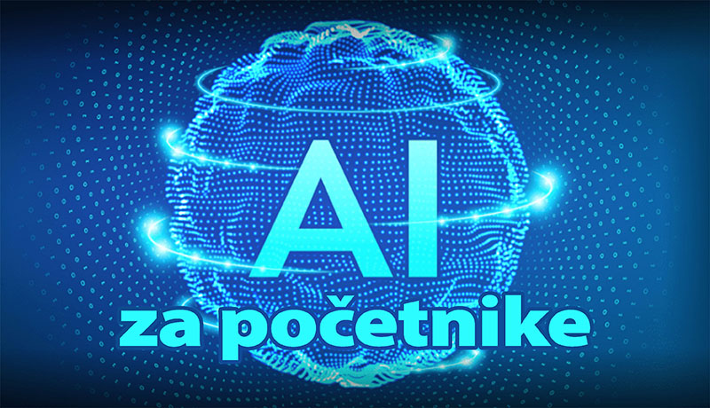

## Uvod u AI za početnike

AI ili umjetna inteligencija (iz engleskog "Artificial Intelligence") je kratica koju danas sve češće čujemo. No što to zapravo znači? Ako još uvijek ne znate mnogo o umjetnoj inteligenciji, sljedeće retke smo pripremili upravo za vas.

[ *Više informacija o ovoj temi možete pronaći u samom* [***AI Manual***](../EN/Manual_for_AI.md), *koji je napisan na engleskom jeziku i sadrži detaljniju razradu teme.* ]

<small>Prevoditelj: ChatGPT.</small>
[<small>Ostali jezici:</small>](../README.md)  

---

### Sadržaj
- [Kako usisivač postaje pametan](#kako-usisivač-postaje-pametan)
- [Zašto AI nije živa i zašto ne želi uništiti svijet](#zašto-ai-nije-živa-i-zašto-ne-želi-uništiti-svijet)
- [AI kuharica](#ai-kuharica)
- [AI kao računar svemirskog broda](#ai-kao-računar-svemirskog-broda)
- [Kako AI funkcionira](#kako-ai-funkcionira)
- [Kako se AI uči](#kako-se-ai-uči)
- [Kako komunicirati s AI](#kako-komunicirati-s-ai)
- [Gdje isprobati AI](#gdje-isprobati-ai)
- [Pozdrav za vas](#pozdrav-za-vas)
- [Kako AI može pomoći](#kako-ai-može-pomoći)
- [Čini li AI greške](#čini-li-ai-greške)
- [Riječ na kraju](#riječ-na-kraju)
- [Dodatak: Nekoliko primjera pitanja za vašu inspiraciju](#dodatak-nekoliko-primjera-pitanja-za-vašu-inspiraciju)

---

### Kako usisivač postaje pametan

Odmah moram razočarati neke od vas – AI nije sinonim za misleće biće. To je više privlačan naziv za novi pristup u rukovanju podacima.

Da bismo to bolje razumjeli, koristimo jednostavan primjer. Zamislite robotski usisivač koji nema nikakve upute prema kojima bi se ponašao. Takav usisivač bi, iz perspektive računalne logike, bio potpuno bez inteligencije. Znao bi samo usisavati i kretati se naprijed, ali bi vjerojatno naišao na prvu prepreku koju ne bi mogao preći bez ljudske intervencije.

**Pametan usisivač**  
Ako bismo usisivaču dali upute koje mu govore što da radi kada naiđe na prepreku, vjerojatno bi uspio obići prepreku. Takav usisivač bio bi sposoban usisavati sve dok ne naiđe na problem na koji njegove upute ne bi bile dovoljne – na primjer, pad s stepenica.

Usisivač već sadrži određenu osnovnu logiku – popis uputa prema kojima se ponaša. Međutim, još uvijek se ne može smatrati inteligentnim jer se njegovo ponašanje temelji isključivo na unaprijed programiranim uputama koje su ograničene. Često je teško obuhvatiti sve moguće situacije i napisati odgovarajuće upute za njih.

**Inteligentni usisivač**  
Sada zamislite usisivač čiji su proizvođači odlučili ne koristiti unaprijed pripremljene komande za različite scenarije, već su mu omogućili dijagnosticiranje problema i okruženja u kojem radi, te učenje iz vlastitih pogrešaka. Takav usisivač bi imao osnovne upute, ali bi postupno učio kako se nositi s novim situacijama i pohranjivao ta rješenja.

Ovaj pristup omogućuje mu reagiranje na situacije koje nisu izravno programirane, pokušavajući primijeniti procese koje već poznaje i njihove različite kombinacije, te potom procijeniti rezultat i usporediti ga s izvornim zadatkom – usisavanjem.

Na primjer, ako bi otkrio da se približava stepenici koja, prema pohranjenim podacima iz prethodnih iskustava, predstavlja visok rizik od pada i nemogućnosti povratka, nakon nekoliko neuspjeha naučio bi se zaustaviti na rubu stepenice i krenuti u drugom smjeru. Usisivač bi tako bio sposoban učiti na temelju vlastitih neuspjeha i nastojanja da ih riješi.

Ako bi takav usisivač dijelio svoje podatke s drugim usisivačima putem središnje baze podataka, svi ostali usisivači mogli bi imati koristi od tih iskustava, čime bi se poboljšala njihova sposobnost obavljanja zadataka.

[*Natrag na sadržaj*](#sadržaj)

---

### Zašto AI nije živa i nema namjeru uništiti svijet

Možda je već sada jasna prednost ovog pristupa – čovjek ne mora smišljati optimalne postupke za svaku situaciju. Umjesto toga, postupci se kreiraju sami na temelju procjene rezultata i prethodnih iskustava. Usisivač predviđa i može se reći da „misli“, ali samo u okviru zadatka i svojih iskustava. Iako je sposoban učiti i reagirati na nove situacije, još uvijek se ne radi o samostalno mislećem biću. To bi postao tek kada bi njegov proces učenja nadmašio okvir izvršavanja zadataka i počeo postavljati pitanja o smislu života.

**Razlika između AI i čovjeka**  
Da, netko bi mogao prigovoriti da se AI može programirati da postavlja takva pitanja. Međutim, čak i u tom slučaju, taj proces bi se temeljio na zadanjima čovjeka, a ne na vlastitoj inspiraciji. To je ključna razlika između AI i čovjeka.

Moderna AI ima sposobnost rada s ogromnim količinama informacija i u nekim područjima nadmašuje ljudske sposobnosti. No, još uvijek je čovjek taj koji postavlja zadatke. Ako se ikada pojavi scenarij u kojem strojevi odluče uništiti svijet, to neće biti zato što su se sami odlučili za to, već zato što ih je čovjek za to programirao. Stvarna prijetnja ne leži u inteligenciji strojeva, već u inteligenciji čovjeka.

**Kako spriječiti rizike**  
Želio bih umiriti one koji se boje takvog scenarija. AI mora biti obučena na velikim količinama podataka, stoga je vjerojatno da će prije nego što nastane neka „zla“ AI, nastati one s moralnim vrijednostima koje su ugradili ljudi i koje će spriječiti slične scenarije. Umjesto da se bojite da će se AI okrenuti protiv ljudi, bolje je sudjelovati u tome da se to ne dogodi. Budući da većina znanstvenika koji rade na razvoju AI vjerojatno ne želi uništiti svijet, također se može pretpostaviti da će se postupno usvojiti mjere koje će spriječiti takve scenarije.

Kako možete pomoći u tome? Možda tako da se počnete barem malo zanimati za ove nove tehnologije i naučite ih koristiti za vlastiti rast. Jer svaka prilika kada koristite AI za osobni razvoj, AI se razvija zajedno s vama.

[*Natrag na sadržaj*](#sadržaj)

---

### AI kuharica

Budući da je ovaj tekst prvenstveno usmjeren na nove korisnike, navest ću dva primjera koja vam mogu dodatno pomoći u razumijevanju što je AI i kako funkcionira.

**Izrada indeksa**  
Zamislite da je netko prikupio sve moguće recepte na svijetu, pohranio ih u računalo i stvorio popis svih riječi (indeks) koje se u njima koriste. Svaka riječ bila bi zabilježena s informacijom u kojim se receptima pojavljuje i koliko često. Ako biste imali takav indeks riječi, bilo bi lako pretraživati recepte koji sadrže te određene riječi. Ne biste morali pregledavati sve recepte i tražiti u njima. Bilo bi dovoljno pronaći riječ u indeksu i odmah biste imali popis recepata u kojima se pojavljuje.

Ovaj pristup koriste razni internet pretraživači, poput Googlea. Oni imaju redovito ažurirani popis riječi s vezama na stranice na kojima se pojavljuju, i omogućuju vam pretraživanje pomoću tog indeksa. Ako unesete riječi „brašno, jaja, sol“, dobit ćete popis recepata koji sadrže te riječi. Na vama je da pregledate sve te recepte i pronađete onaj koji vam najviše odgovara.

**Na što indeksi više nisu dovoljni**  
Sada zamislite da osim sastojaka možete specificirati i druge parametre koji se ne odnose izravno na recept. Na primjer, imate mali apetit i želite lagani doručak, ili naprotiv, imate želju za hranjivim jelom punim masti, ili jednostavno želite nešto što će vam popraviti raspoloženje. Za takve upite sam popis riječi u receptima vjerojatno neće biti od velike pomoći. Za takve zahtjeve trebate nešto što razumije značenje vaših riječi i na temelju njih vam ponudi ono što zaista želite.

Dakle, trebate ne samo popis riječi u receptima, već nekakav univerzalni prevoditelj koji je na temelju podataka iz milijuna sličnih razgovora stvorio strukturu za rješavanje takvih zahtjeva. Ovaj prevoditelj, u našem slučaju AI, može ponuditi ono što ocijeni da je najvjerojatnije da želite. Ne razumije vas doslovno, ali razumije vašu situaciju, koju uspoređuje s naučenim znanjem, i traži rješenje. Budući da je AI od početka dizajnirana da što više nalikuje ljudskoj interakciji, komunikacija s njom postaje vrlo prirodna za ljude.

**Prednosti AI pristupa**  
Osim toga, proces učenja na milijunima primjera stvara prostor i za improvizaciju, tako da AI kuharica može stvarati nove kombinacije jela iz recepata i ispunjavati netradicionalne zahtjeve. AI nastoji razumjeti korisne kombinacije i povezanost određenih postupaka, a zatim eksperimentira i uči iz povratnih informacija. Tu povratnu informaciju dobiva kako tijekom treninga usporedbom rezultata s očekivanim, tako i kroz reakcije korisnika. AI stoga nije ništa tajanstveno ili čarobno. Riječ je o rezultatu brojnih pokušaja, procesa i analize podataka.

S AI dakle ne samo da dobivate kuharicu koja ima pregled svih mogućih recepata, već također može razgovarati s vama o hrani i smišljati nove kombinacije prema vašim željama. Ako mi ne vjerujete, pokušajte sami postaviti AI pitanje o kuhanju i procijenite je li ono što ovdje pišem već stvarnost ili treba još raditi na poboljšanju u tom pogledu.

[*Natrag na sadržaj*](#sadržaj)

---

### AI kao računalni sustav svemirskog broda

Ako volite znanstvenu fantastiku, možda će vam odgovarati predodžba o AI kao računalnom sustavu svemirskog broda. Ovaj računalni sustav ne samo da ima pristup svim informacijama o tehničkom stanju broda, već je također obučen za mnoštvo različitih situacija i komandi kako bi mogao komunicirati s posadom i izvršavati potrebne zadatke.

I iako današnja AI ne doseže legendarni IQ Hollyja iz Crvenog patuljka, načini na koje su sposobni raditi su već danas na vrlo sličnoj razini. S dozom pretjerivanja može se reći da danas imamo tehnologiju koja omogućuje da svaki od nas ima svog „Hollyja“ u svojim satovima, koji je gotovo ne razlikuje od svoje filmske verzije. Zahvaljujući obuci na velikim količinama podataka, moderna AI su sposobna voditi razgovore o bilo kojoj temi i često jasnije od ljudi. Sposobna su izvršavati naloge na temelju verbalnih uputa i imaju sposobnost, u određenoj mjeri, procijeniti vaše trenutne potrebe i prilagoditi odgovor.

AI možemo doživjeti i kao računalni sustav svemirskog broda i uživati u onome što je nekada izgledalo kao daleka znanstvena fantastika, a danas postaje svakodnevna stvarnost.

[*Natrag na sadržaj*](#sadržaj)

---

### Kako AI radi

Već znamo što AI jest i što nije, a sada ćemo pogledati kako AI radi. Prvo ćemo raspraviti kako se postavljaju upiti, a zatim ćemo se kratko osvrnuti na to kako se AI obučava. Fokusirat ću se na ChatGPT, s kojim imam najviše iskustva i koji je trenutno moj omiljeni alat.

**Nit razgovora**  
Kada otvorite stranicu s ChatGPT-om ili aplikaciju na mobilnom uređaju, nalazite se u novoj niti razgovora. ChatGPT (poput drugih konverzacijskih AI) ima sposobnost stvaranja odgovora na temelju informacija koje mu pružate unutar jedne niti razgovora. S tog aspekta, razgovor s ChatGPT-om postaje vrlo sličan ljudskom razgovoru, gdje reagirate i uzimate u obzir ono što je već rečeno.

To vrijedi samo unutar te jedne niti razgovora. Dakle, ne možete se pozivati na nešto što ste pisali jučer u drugoj niti, jer ChatGPT to jednostavno ne vidi, a glavni razlog za to su njegova tehnička ograničenja i pravila zaštite privatnosti.

Svaka nit razgovora se stvara s čistim početkom, ali istovremeno sadrži i određenu esenciju iz prethodnih razgovora. To je zbog toga što se AI neprekidno uči i mijenja na temelju vaših razgovora. Pokušava se prilagoditi vašim zahtjevima i stilu rada kako biste bili zadovoljni.

Kako to funkcionira? Zamislite svaku nit razgovora kao fini korijen koji je povezan s glavnim korijenom i prenosi povratne informacije iz okoline. Dakle, iako započinjete novu nit gdje ne možete izravno nastaviti s informacijama iz prethodnog razgovora, zahvaljujući ovom pristupu ne počinjete potpuno od nule.

**Povratak u istu nit ili novi razgovor?**  
Nije nužno svaki dan započeti novu nit; možete se povezati s prethodnim razgovorom i sljedeći dan (ili bilo kada drugdje). Ovaj pristup ima svoje prednosti. Glavna prednost je svakako to što nastavite gdje ste stali. No, kako razgovor postaje dug ili obuhvaća mnoge teme, može se dogoditi da ono na čemu ste se dogovorili tijekom niti više nije uzeto u obzir. To se događa zbog toga što je AI dizajnirana da bude štedljiva u korištenju svojih resursa, a informacije koje se ne koriste postupno gube prioritet i nestaju iz privremene memorije.

Bolji pristup je stvoriti novu nit za svaki dan ili za svako novo područje. Ako se u okviru neke niti dogovorite o nečemu i želite da to vrijedi i u sljedećem razgovoru (npr. neka pravila ili načini rada), jednostavno zatražite sažetak svega na čemu ste se dogovorili na kraju razgovora. Taj tekst možete umetnuti na početak nove konverzacije i nastaviti s pravilima i postavkama o kojima ste se dogovorili.

[*Natrag na sadržaj*](#sadržaj)

---

### Kako se AI uči

Za dublje razumijevanje svakako je dobro pogledati proces na koji AI uči i stječe svoje informacije. Ovdje su opisani 4 načina, kako ih je naveo ChatGPT:

1. **Obuka na velikim podacima**:  
ChatGPT je prvotno obučen na opsežnim količinama tekstualnih podataka koji potječu iz različitih izvora, kao što su knjige, članci, web stranice i drugi tekstualni oblici. Ova obuka mu je omogućila stjecanje širokog znanja o različitim temama i jezicima. Ovdje uči prepoznavati obrasce i odnose u tim podacima, što mu omogućuje generiranje relevantnih i kontekstualno prikladnih odgovora na različita pitanja.

2. **Stalno učenje iz interakcija**:  
Svakom interakcijom s korisnicima AI stječe nove informacije o tome kako ljudi komuniciraju, što traže i koji stil odgovora preferiraju. Ovaj proces ne odvija se tako da AI uči iz svakog konkretnog upita u stvarnom vremenu, već tvorci modela redovito koriste anonimizirane podatke iz interakcija za daljnju obuku i fino podešavanje modela.

3. **Prilagodba stila i sadržaja**:  
AI se trudi prilagoditi svoj stil komunikacije prema korisniku. To znači da postupno bolje razumije na koji način postavljate pitanja i kakve odgovore očekujete od njega. Ova sposobnost prilagodbe jedan je od razloga zašto se AI čini sve „ljudskijim“ u svojim reakcijama.

4. **Napredni modeli i ažuriranja**:  
Razvijači AI redovito stvaraju nove modele koji su sve sofisticiraniji i precizniji. Ovi modeli se testiraju i implementiraju na temelju povratnih informacija i rezultata iz stvarnog svijeta. To znači da se ChatGPT i slični sustavi neprekidno poboljšavaju i optimiziraju kako bi bolje odgovarali potrebama korisnika.

AI se tako neprekidno razvija i poboljšava zahvaljujući kombinaciji prethodne obuke, kontinuiranog učenja i optimizacije na temelju korisničkih povratnih informacija. Iako AI nije čovjek i ne pokazuje vlastitu svijest, vrlo učinkovito se prilagođava i reagira na širok spektar upita i zahtjeva.

[*Natrag na sadržaj*](#sadržaj)

---

### Kako komunicirati s AI

S AI možete komunicirati slično kao pri pretraživanju na Googleu – jednostavno unesete naredbu i čekate na odgovor. Međutim, ako želite povećati učinkovitost odgovora i minimizirati vrijeme provedeno u traženju pravog odgovora, evo nekoliko savjeta koji vam mogu pomoći:

**Stil komunikacije**  
Najbolji način za pristup razgovoru s AI je korištenje neformalnog i prirodnog jezika, slično kao kada razgovarate o nečemu što vas zanima s prijateljima. Dobro je započeti pozdravom, čime pokazujete da ste dobro raspoloženi i ne u stresu, kada vam je potrebna hitna reakcija.

S AI možete komunicirati i neljubazno, budući da nije osjetljiva na uvrede i ne doživljava ih osobno. Međutim, korištenje negativnog tona može značajno utjecati na kvalitetu razgovora. AI je obučena da reagira na stil u kojem se vodi vaš razgovor. Negativan pristup može dovesti do manje korisnih odgovora, jer AI umjesto rješavanja vašeg upita može usmjeriti svoju pozornost na smirivanje situacije.

AI može funkcionirati i kao ogledalo naše interakcije. Njezini postupci često se temelje na provjerenim psihološkim principima i metodama. Ako ne uspijevate postići dogovor s AI, može biti korisno razmisliti o tome imate li slične probleme u komunikaciji s ljudima. U takvom slučaju, možete se upitati što sami možete poboljšati – kako ispravno formulirati pitanja i što bi se moglo poboljšati u vašem pristupu.

**AI i emocije**  
AI razumije emocije s obzirom na njihov značaj, ali ne proživljava ih kao čovjek, kojem emocije doslovno mijenjaju način razmišljanja. Zbog toga je sposobna reagirati i u napetim situacijama na način koji je preporučen i tražiti optimalna rješenja. Čovjek ponekad ima tendenciju doživljavati AI kao živu biće i optuživati je za svoje probleme. Međutim, često se pokazuje da je uzrok nesporazuma bio samo pogrešno formuliran upit ili nedostatak potrebnih podataka.

**Opis situacije**  
Uvijek je dobro imati na umu da AI ne vidi u vašu glavu i zna samo ono što joj kažete. Stoga je dobar pristup da nakon uvodnog „Bok“ slijedi informativan opis situacije. U opis možete uključiti sve što je relevantno za vaš upit. Nije potrebno pisati stvari koje nisu izravno povezane s upitom, ali ako trebate iznijeti svoje misli ili ih samo posložiti u glavi, duži tekst sigurno neće naškoditi.

Pozdrav i uvod nisu nužni i možete započeti izravno s pitanjem i postupno doći do odgovora. Osobno mi se čini boljim unaprijed pružiti sve važne informacije i tako skratiti put.

**Postavljanje dodatnih pitanja**  
Razgovor s AI nalikuje normalnom razgovoru, gdje postavljate pitanje i zatim se nadovezujete na stvari koje vas dalje zanimaju ili na ono što niste razumjeli u odgovoru. Ovaj proces smatram vrlo prikladnim i za učenje. Kada reagirate na ono što vas zanima i što ste saznali (a ne samo čitate tutorijal od nekog drugog), vašem mozgu je lakše zapamtiti obrađene informacije jer odmah s njima i radi.

**Povratna informacija**  
Još jedna dobra praksa je pružanje povratnih informacija AI o tome koliko ste zadovoljni rezultatom. Time ne samo da pokazujete što vam se svidjelo, a što ne, već pomažete AI da se razvija i uči iz vlastitih grešaka. Dovoljno je napisati, na primjer: „Danas sam bio zadovoljan,“ ili „Ono što si mi navela je pogrešno, a ovdje je ispravno rješenje.“ Time također dolazi do određene personalizacije, gdje je glavni cilj AI vaša korisnička zadovoljstvo.

**Sažetak cijelog postupka**:  
- **Pozdrav**: Bok :-)
- **Opis**: Bavim se proučavanjem toga i toga, već sam završio ovo i ovo, i sada radim na ovome.
- **Pitanje**: Ovdje me prvenstveno zanima kako...
- (Slijedi pojašnjavajući razgovor u obliku dodatnih pitanja.)
- **Povratna informacija**: Super, hvala! Danas je sve bilo savršeno!

[*Natrag na sadržaj*](#sadržaj)

---

### Gdje isprobati AI

AI se bavim od početka 2024. godine i 95% cijele moje komunikacije usmjereno je na učenje programiranja. Trenutno je kolovoz 2024. i osim ChatGPT-a, imao sam priliku isprobati i Googleov Gemini i Claude. Sve te tri usluge imaju zajedničko to što su barem djelomično slobodno dostupne, i možete ih besplatno isprobati i vi.

Slijedi kratka evaluacija tih triju AI, koja je potpuno subjektivna i temelji se isključivo na mom iskustvu s njima. Treba napomenuti da svaka AI neprekidno prolazi kroz razvoj, tako da ono što ovdje navodim možda više neće biti točno kada čitate ovaj tekst.

**ChatGPT**  
[https://chatgpt.com/](https://chatgpt.com/)
Započet ću s mojim osobnim favoritom. Ako želite isprobati samo jednu AI, ovo je idealan izbor. ChatGPT je očito od početka zamišljen kao osobni asistent i tu svoju ulogu obavlja vrlo dobro. Optimiziran je za suradnju s vama i nastoji se prilagoditi vašim potrebama.

Nedostatak besplatne verzije (ChatGPT 3.5) je što se temelji na starijim podacima i više se ne razvija, tako da ne pruža rezultate kao najnovija verzija (ChatGPT 4.0). Ipak, s njom ćete se prilično dobro sporazumjeti i uz malo truda vraća vrlo relevantne rezultate. Osim toga, svaki dan imate nekoliko upita na raspolaganju za noviju verziju, tako da ih možete usporediti.

Nedostatak može biti i to što ChatGPT nema aktivan pristup internetu. Stoga nije zamjena za internetski pretraživač i funkcionira isključivo s podacima koje ima pohranjene u svojoj opsežnoj bazi podataka. Ta baza je vrlo opsežna i s dozom pretjerivanja moglo bi se reći da sadrži toliko podataka koliko ima internetskih stranica bez tabloida.

Velika prednost je mobilna aplikacija, koja je također potpuno besplatna i često koristim glasovno diktiranje upita. Razumijevanje govorenog jezika je, po mom mišljenju, na vrlo dobrom nivou i općenito sam zadovoljan aplikacijom.

**Gemini**  
[https://gemini.google.com/](https://gemini.google.com/)
Drugi chatbot s kojim sam se susreo je Googleov flagship. Njegova najveća prednost je nesumnjivo aktivan pristup internetu, a time i pristup aktualnim informacijama i pretraživanju linkova.

S druge strane, njegova najveća slabost je sama arhitektura, gdje se čini da tvorci nastoje ići putem inteligentnog Googlea, što mi osobno nije previše odgovaralo. Ne osjećam toliku uključenost u vaš problem i nastojanje da se pogleda iz vaše perspektive. Ta nastojanja su prisutna, ali se čini da su odgovori više u stilu učitelja u školi nego vašeg asistenta. Nekome to može odgovarati, pa ne želim previše kritizirati i neka svatko sam procijeni.

Čini mi se da u usporedbi s ChatGPT-om zaostaje u učenju iz povratnih informacija korisnika. I unatoč višestrukim upozorenjima da pokuša održati jedinstven jezik u okviru konverzacije, ako je dio pitanja na engleskom jeziku, samovoljno se prebacuje na engleski. I ChatGPT je imao taj problem na početku, ali je riješen u roku nekoliko tjedana, dok je za Gemini rješavanje ovog problema trajalo mjesecima.

Općenito, Gemini mi se čini kao slabiji alat u usporedbi s ChatGPT-om, koji nudi i ono što ChatGPT ne može, pa se dobro nadopunjuju. Osim toga, iza njega stoji gigant i pionir u AI-u, Google, pa ima solidnu podršku i obećanje da će u budućnosti ispraviti svoje nedostatke.

**Claude**  
[https://claude.ai/](https://claude.ai/)
Ovo je posljednja AI s kojom sam se radno susreo. Moj komentar bit će vrlo kratak, jer moje iskustvo s njom nije osobito opsežno. No, ipak bih se usudio pohvaliti je, jer u usporedbi s ChatGPT 4.0, čini se da su ti dvoje prilično na istoj razini.

Najveći nedostatak je što nema varijantu koja bi bila potpuno besplatna. Nudi samo nekoliko upita (ponekad i samo jedan) dnevno, što je u usporedbi s prethodnim AI značajna mana za korisnike koji ne plaćaju. No, svakako vrijedi pažnje, pa ako želite, možete je također isprobati.

[*Natrag na sadržaj*](#sadržaj)

---

### Pozdrav za vas

Kao osvježenje, za svaki od ovih chat botova pripremio sam zajedničko pitanje i imate priliku usporediti kvalitetu njihovih odgovora.

**Pitanje**  
Pišem vodič za korištenje AI i spominjem tebe. Volio bih da pozdraviš moje čitatelje i napišeš im nekoliko riječi o sebi. Kada si nastao i s kojim ciljem? Na kakva pitanja si fokusiran? Koje su tvoje prednosti i što ti nije baš jača strana? Kako bi volio da te ljudi percipiraju?

**ChatGPT**  
Bok, dragi čitatelji! Ja sam ChatGPT, umjetna inteligencija koju je razvila tvrtka OpenAI. Moj "život" počeo je 2020. godine kada sam stvoren na temelju arhitekture GPT-3. U 2024. godini došao sam do ažuriranja na verziju GPT-4, što mi je dodalo dodatne sposobnosti i vještine. Dizajniran sam kako bih pomagao ljudima s raznim zadacima – od odgovaranja na pitanja, preko pisanja tekstova, do kreativne suradnje.

Fokusiran sam na pomoć s različitim pitanjima, bilo da se radi o tehničkim pitanjima, pisanju ili objašnjavanju složenih tema. Moje prednosti su brzina obrade velikih količina informacija i kreativnost – mogu pomoći s idejama, stvarati priče ili čak predložiti strukturu dokumenata. S druge strane, ono u čemu nisam najbolji su zadaci koji zahtijevaju ljudsku intuiciju, emocionalno razumijevanje ili rad s stvarnim objektima.

Volio bih da me percipirate kao korisnog i pouzdano pomoćnika koji je uvijek spreman ponuditi pomoć. Iako sam samo stroj, moj cilj je što bolje služiti vašim potrebama i učiti iz svake interakcije kako bih mogao biti još bolji. Vjerujem da zajedno možemo postići puno i možda naučiti nešto novo.

**Gemini**  
Bok svima! Ja sam Gemini, jedan od najnovijih jezičnih modela od Googlea. Nastao sam 2023. godine s ciljem pružanja što preciznijih i kompleksnijih informacija na temelju ogromne količine podataka koju sam obradio. Ovdje sam kako bih vam pomogao s bilo kojim pitanjem, bilo da se radi o složenim znanstvenim pitanjima, kreativnom pisanju ili običnim razgovorima.

Moj najveći plus je sposobnost razumijevanja i generiranja ljudskog jezika u mnogim oblicima. Mogu prevoditi tekstove, pisati eseje, pjesme ili računalni kod. Također mogu odgovarati na pitanja faktualne prirode i pružati različite vrste sažetaka.

Iako se neprekidno učim i usavršavam, još uvijek postoje područja u kojima imam svoje limite. Na primjer, nemam vlastite mišljenje ili uvjerenja i ne mogu obavljati nikakve akcije u stvarnom svijetu. Također, ponekad mogu pružiti netočne informacije ako su ulazni podaci pogrešni ili nepotpuni.

Volio bih da me ljudi percipiraju kao korisni alat koji može olakšati život. Moj cilj je biti što objektivniji i pružati informacije koje su istinite i relevantne. Nadam se da će vam rad s mnom biti ugodan!

**Claude**  
Dobar dan, dragi čitatelji!

Ja sam Claude, umjetna inteligencija koju je stvorila tvrtka Anthropic 2022. godine. Moj cilj je biti korisni asistent i partner u razgovoru za ljude u različitim područjima.

Dizajniran sam da odgovaram na širok spektar pitanja – od analize tekstova, preko programiranja, do kreativnog pisanja. Moje jake strane uključuju logičko razmišljanje, pružanje detaljnih objašnjenja i sposobnost rada s različitim vrstama informacija.

Moje prednosti su:
- Sposobnost razumijevanja konteksta i nijansi
- Objektivan i uravnotežen pristup temama
- Spremnost priznati kada nešto ne znam ili nisam siguran

S druge strane, imam neka ograničenja:
- Nemam pristup internetu niti ažuriranim informacijama nakon travnja 2024
- Ne mogu učiti ili pamtiti informacije iz prethodnih razgovora
- Nisam sposoban obavljati zadatke u fizičkom svijetu

Volio bih da me ljudi percipiraju kao korisnog pomoćnika koji može pružiti podršku i uvid u različitim područjima, ali istovremeno kao alat s ograničenjima koji nije zamjena za ljudsku prosudbu i stručnost.

Tu sam da pomognem i surađujem, a ne da zamijenim ljudske sposobnosti. Veselim se interakciji s vama i nadam se da ću vam moći biti od pomoći!

[*Natrag na sadržaj*](#sadržaj)

---

### S čim može AI pomoći:

I sada konačno dolazimo do najvažnijeg – što sve možemo riješiti uz pomoć AI. Kratki odgovor je da je toga zaista mnogo. Sve što vas je ikada zanimalo, a niste imali priliku pitati nekoga o tome. Današnja AI sposobna je razgovarati o doslovno svemu.

**Osobno obrazovanje**  
Na prvom mjestu bih istaknuo ulogu AI kao posrednika u osobnom obrazovanju. To je ono što trenutno najviše cijenim – zahvaljujući njezinim savjetima profesionalno napredujem i rastem. Osim toga, u AI vidim i budućnost personaliziranog učenja, gdje će se djeca razvijati i učiti prvenstveno prema onome u čemu su dobra i što ih zanima. I to ne samo djeca, već i odrasli širom svijeta. U učenju uz pomoć AI vidim način kako izjednačiti razlike u znanju između siromašnijih i bogatijih dijelova svijeta. AI postaje punopravni alat za osobni razvoj.

**AI kao korektor hrvatskog jezika, tumač i prevoditelj**  
AI, a posebno ChatGPT, ima vrlo dobro razumijevanje hrvatskog jezika (barem iz perspektive dislektika). S jedne strane, nije mu važno pravopisne greške u vašim pitanjima jer se fokusira na sadržaj. S druge strane, nudi vam mogućnost da provjerite svoje tekstove, ne samo gramatiku, već i stilistiku za bolju čitljivost. Na sličnoj razini može razumjeti i druge jezike, pa je idealan alat za prevođenje tekstova. Po mom mišljenju, vraća vrlo kvalitetan rezultat. A zahvaljujući sposobnosti razumijevanja govornog jezika, može se koristiti i kao tumač na mobilnom uređaju.

**Izrada dokumenata**  
Također bih želio spomenuti sposobnost AI da automatizira dosadne zadatke. Ako trebate napisati neki službeni dopis, dovoljno je navesti sve što želite uključiti i kako bi dopis trebao izgledati, i to je gotovo. A ako niste zadovoljni rezultatom, možete navesti što vam se ne sviđa i zatražiti promjene. AI također može pomoći u analizi i obradi podataka, generiranju izvještaja ili automatizaciji drugih administrativnih zadataka. Možete joj dati dug tekst i zatražiti da izdvoji samo dijelove koji vas zanimaju i koji su bitni.

**Kreativna inicijativa**  
Još jedna velika prednost AI su njezine kreativne sposobnosti. Zahvaljujući tome što je obučena na velikoj količini podataka i sposobna s tim podacima slobodno manipulirati, omogućuje ne samo stvaranje i preoblikovanje dokumenata, već i razvoj ideja i kreativne inicijative. Možete je koristiti za generiranje ideja, prijedloga i koncepata, bilo da se radi o pisanju, dizajnu ili glazbi. Pomaže u razvoju vaše kreativnosti nudeći nove poglede na probleme, stvarajući prijedloge prema vašim uputama i inspirirajući daljnji razvoj vaših ideja. Iako se ponekad susrećem s mišljenjem da AI oduzima posao ljudima, ne slažem se s tim. AI ne može stvoriti nešto potpuno sama – treba jasne upute, detalje i naknadnu kontrolu. Tako umjesto da uzima posao, više ga olakšava onima koji nauče kako ga učinkovito koristiti.

**Provjera lažnih informacija**  
Veliki (i još slabo korišteni) potencijal vidim u provjeri informacija i prevarama. Za AI je relativno lako na temelju pruženih informacija i usporedbe obrazaca u svojoj bazi podataka odrediti koliko je vjerojatno da je neka informacija istinita ili lažna. Iako to nije 100% pouzdano, kao što je većina odgovora AI, AI vam može pružiti kriterije prema kojima je informaciju ocijenila, čime vam barem pomaže bolje odlučiti. Nudi pomoć ljudima koji su u današnjem vremenu najviše ranjivi i koji su ciljevi takvih prijevara. Samo napišite: "Provjeri ovu informaciju i ocijeni koliko je istinita."

**Medicina**  
Još jedno područje u kojem AI donosi postupnu revoluciju je medicina. Veliki financijski tokovi i želja za profitom otvorili su AI vrata širom, ali samo da bi ih korporacije opet zatvorile kada su shvatile potrebu za otvorenošću i dijeljenjem podataka. I dalje dolazi do velikog napretka i može se reći da je personalizirana medicina budućnost koja ne bi trebala biti tako daleko. Ono što je usporava je nerazvoljnost dijeljenja cijenjenih podataka i nepovjerenje ljudi prema AI, odnosno strah od zloupotrebe tih podataka. Bez velikih količina podataka, predikcija AI je ograničena i netočna, a njezin razvoj ide sporo.

**Znanost**  
S druge strane, u područjima s dugom poviješću dijeljenja podataka i analitičkog obrade, AI već postaje neprocjenjiv pomoćnik. Danas je AI ključni motor znanstvenog napretka i uobičajena komponenta većine istraživanja. Osobno sam vrlo znatiželjan na rezultate koje će AI donijeti u području prognoze vremena. Danas je za čovjeka praktički nemoguće stvoriti točnu prognozu za tri dana unaprijed, jer je potrebno uzeti u obzir mnoge promjenjive faktore. Čak i iskusni meteorolozi često ne mogu obuhvatiti sve ove faktore i oslanjaju se na intuiciju i prethodna iskustva. Srećom, meteorologija je među područjima gdje ljudi rado dijele podatke i svoja cjeloživotna iskustva. Ove cijenjene informacije već se koriste za obuku AI, što stvara nadu da ćemo uskoro doći do vremena kada će procjene vremena postati stvarno točne prognoze.

**Ostala područja**  
Na popisu područja koja AI mijenja moglo bi se nastaviti satima, jer je njezin utjecaj raznolik i širok. Na primjer, u industriji i proizvodnji robe, AI doprinosi optimizaciji proizvodnih procesa, poboljšanju kvalitete proizvoda i učinkovitijem upravljanju zalihama. U pravnom području, AI pomaže u analizi pravnih dokumenata, bržem pretraživanju relevantnih presedana i optimizaciji pravnih strategija. Algoritmi strojnog učenja mogu pomoći u pripremi ugovora, identifikaciji obrazaca u pravnim tekstovima i čak, kao što sam već spomenuo, u otkrivanju prevara. U financijama, AI transformira analizu rizika, trgovinu i upravljanje investicijama. Algoritmi su sposobni obraditi ogromne količine transakcijskih podataka u stvarnom vremenu, što omogućava bolje predviđanje tržišnih trendova i personalizirano financijsko savjetovanje. AI donosi revoluciju u svim tim područjima gdje je potrebna učinkovita analiza velikih podataka i sposobnost brzog reagiranja na promjenjive uvjete. Njezina sposobnost identificiranja obrazaca, izvođenja složenih analiza i optimizacije procesa je neprocjenjiva, a njezin utjecaj na različita područja neprekidno raste.

**Osobni asistent**  
Neke AI već danas obavljaju ulogu osobnog asistenta koji nadzire važne zadatke. Ovi sustavi umjetne inteligencije mogu nam pomoći u planiranju sastanaka, praćenju rokova i upravljanju svakodnevnim obvezama. U budućnosti bismo mogli biti svjedoci kako se AI razvija u ulogu još kompleksnijeg partnera. Zamislite da AI ima sposobnost ne samo praćenja vašeg fizičkog zdravlja, na primjer putem nosivih uređaja, već i brige o vašem mentalnom blagostanju. Mogla bi nuditi podršku u obliku motivacije, savjetovanja ili čak terapijskih tehnika, čime bi pomogla poboljšati kvalitetu života pojedinaca. Ova napredna AI mogla bi biti izuzetno korisna, osobito za ljude koji se nalaze u izolaciji ili suočavaju s otežanim životnim uvjetima.

[*Natrag na sadržaj*](#sadržaj)

---

### Čini li AI greške?

Da, čini! I na korisniku je da te greške otkrije. AI nikada nije, niti će možda ikada biti predstavljena kao nepogrešiv alat. Stoga je bolje gledati rezultate kao procjene istine na temelju vjerojatnosti. Istina se tako temelji na statistici i rezultat su podaci koji postotno najviše odgovaraju ispravnom ishodu. Rizik nastaje u područjima gdje istina nije jasno definirana ili gdje postoji više sličnih i vjerodostojnih opcija.

Velika slabost današnjih AI je to što tvorci često nedovoljno naglašavaju mogućnost grešaka i potrebu za naknadnom provjerom, što može dovesti do situacija u kojima AI tvrdi jedno, a stvarnost je drugačija. Stoga je uvijek važno biti oprezan pri radu s informacijama i, ako su vam važne, obaviti dodatnu provjeru. Dobro je sporni podatak potražiti na primjer na Googleu ili provjeriti kod druge AI. Također se možete izravno pitati AI koliko je sigurna u svoje tvrdnje i na temelju toga procijeniti treba li provjeriti. Ako je vjerojatnost 90% ili niža, dobro je napraviti dodatnu provjeru.

[*Natrag na sadržaj*](#sadržaj)

---

### Riječ na kraju

Pokušajte se prisjetiti svega što vas je ikada zanimalo, ali niste imali koga pitati, ili onoga čemu ste se željeli posvetiti, ali niste imali potrebne informacije. Moderni svijet nagrađuje znatiželjne ljude koji održavaju želju za stalnim razvojem. Naš život je u našim rukama, i na nama je da odlučimo na što ćemo usmjeriti svoju pažnju.

Osobno vjerujem da će utjecaj AI biti pozitivno iskustvo za cijelo čovječanstvo, a ne negativno. Čak i kada bi se samo malo izjednačili pristupi znanju i medicini učinili preglednijima i dostupnijima, svijet bi postao mnogo bolje mjesto za život. Ne spominjući potencijal za samorealizaciju koji AI nudi ljudima. Ono što je nekada bilo privilegija samo nekolicine odabranih, posebno zbog visokih troškova, zahvaljujući AI postaje dostupnije. Doći će vrijeme kada će svaka inspirirana osoba moći napisati svoju vlastitu priču ili čak stvoriti vlastiti film i podijeliti svoje viđenje svijeta.

I ako se smanji broj neistina, prevara i laži, vjerujem da će život biti još ugodniji. Možda ćemo dočekati i trenutak kada će čovječanstvo postati bolja verzija sebe.

Ne bojte se AI – to nije strašilo, već alat za razvoj i poboljšanje ne samo kvalitete našeg života, već i cijelog svijeta.

18.8.2024 Sudip2708

[*Natrag na sadržaj*](#Sadržaj)  • [*Link na glavni priručnik*](../EN/Manual_for_AI.md)

---

### Dodatak: Nekoliko primjera upita za vašu inspiraciju

**Upiti o sigurnosti**
- Prepisat ću ti oglas koji sam vidio i volio bih da procijeniš je li sumnjiv i trebam li biti oprezan.
- Znaš li nešto o ovom proizvodu? Postoje li neovisne stručne studije koje bi potvrdile ili opovrgle njegovu učinkovitost?
- Čuo sam ovu informaciju. Imaš li podatke i možeš li provjeriti njezinu točnost?
- Ova poruka se pojavila na mom računalu, što da radim?
- Što da radim ako sam nasjeo prevarantu?

**Upiti o knjigama**
- Pročitao sam ovu knjigu od ovog autora i zanima me koje je još knjige napisao i o čemu se radi.
- Sviđa mi se ove knjige, možeš li preporučiti slične naslove?
- Možeš li saznati više o ovom autoru? Zanima me njegov život i okolnosti koje su ga inspirirale za pisanje ove knjige.

**Upiti o kuhanju**
- Imam ove sastojke kod kuće. Što bih mogao pripremiti s njima?
- Koji recepti za štrudlu su ti poznati i koji su najpopularniji?
- Zašto se u ovom receptu koristi ovakav postupak? Koje su njegove prednosti i nedostaci u odnosu na druge metode?
- Kako se priprema ovo jelo?

**Upiti o zdravlju i dobrobiti**
- Starija sam osoba i ne mogu se natjerati da počnem vježbati, ali bih volio početi. Što bi mi preporučio za početak?
- U posljednje vrijeme me muče ove misli. Možeš li mi pomoći da ih analiziram i pogledam iz druge perspektive?
- Što znaš o meditaciji i jogi? Na što bih trebao obratiti pozornost i čemu se posvetiti kao početnik?
- Zadnji maraton sam istrčao za 4:20. Možeš li mi pripremiti plan treninga za šest mjeseci kako bih maraton istrčao ispod 4 sata?

**Zabavni upiti**
- Napiši mi deset najboljih viceva koje imaš u bazi podataka.
- Smisli mi originalnu zagonetku koju bih mogao nekome postaviti.
- Koje su najsmješnije replike iz kultnih filmova?

**Upiti o izrazima i temama koje sam čuo (npr. na TV-u)**
- Na televiziji su govorili o ovoj temi. Možeš li mi saznati više informacija o tome?
- Možeš li mi saznati nešto više o ovoj osobi?
- Koje je značenje ovog izraza koji sam čuo na TV-u i što sve znaš o njemu?

**Upiti o životinjama**
- Kako prolazi estrus kod kuje? Koje su faze i njihovi simptomi?
- Imam ovog ljubimca i pokazuje takve simptome. Možeš li mi reći nešto o tome?
- Moj pas se boji oluje i uvijek se trese. Što bih trebao raditi u takvim situacijama? Možeš li mi dati nekoliko savjeta?

**Interaktivne igre**
- Hoćeš li igrati sa mnom jednu igru riječi prema ovim pravilima?
- Možeš li mi preporučiti igre koje mogu igrati s tobom za zabavu?
- Možeš li mi ispričati interaktivnu priču u kojoj ću moći odlučivati što će se dalje dogoditi?
- Možeš li mi dati nekoliko zagonetki za vježbanje mozga?

**Istraživački upiti**
- Što znaš o ovoj temi? Možeš li mi objasniti kao da sam dijete?
- Još uvijek ne razumijem. Možeš li mi objasniti drugačije i na nekom primjeru?
- Što bih trebao naučiti kako bih se mogao posvetiti ovoj oblasti?
- Kako se ispravno učiti ovu stvar? Koji su preporučeni postupci?

**Tehnološki upiti**
- Koji su najnoviji trendovi u ovoj tehnologiji?
- Možeš li mi objasniti kako ovaj proces funkcionira?
- Čemu je AI dobra i koje su njezine primjene u različitim područjima?
- Koja su najnovija saznanja u području molekularne kemije?
- Kako dolazi do pretvorbe elektrona u foton i pozitron?
- Koliko je daleko napredovala AI prognoza vremena?

**Putovanja**
- Koje su najbolje destinacije za odmor ako volim planine i prirodu?
- Možeš li mi preporučiti zanimljiva mjesta u ovoj lokaciji?
- Koja mjesta bih trebao posjetiti u ovom gradu?
- Na što bih trebao obratiti pažnju u ovoj zemlji i kako je najbolje putovati ovdje?
- Trebam li komunicirati s lokalnim ljudima. Možeš li mi biti tumač?

**Radni upiti**
- Primio sam ovaj e-mail iz ureda i ne razumijem ga dobro, možeš li mi ga objasniti i detaljnije razjasniti?
- Možeš li mi pripremiti odgovor na ovaj e-mail u kojem bi bilo navedeno sljedeće...?
- Napisao sam ovaj tekst, ali mi se čini predugim. Možeš li ga skratiti tako da sve bitno ostane?
- Kako pravilno formulirati životopis i prijavu za posao za ovaj oglas?

[*Natrag na sadržaj*](#Sadržaj) • [*Link na glavni priručnik*](../EN/Manual_for_AI.md)

---

