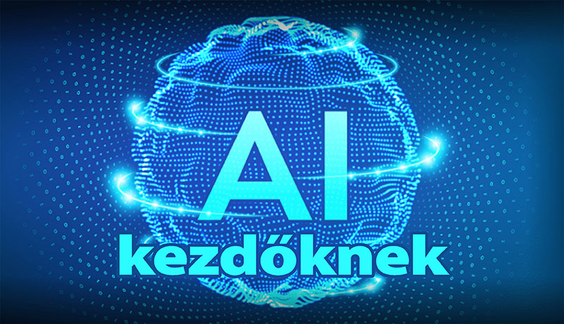

## Bevezetés az AI világába kezdőknek

Az AI, azaz mesterséges intelligencia (angolul "Artificial Intelligence"), egy olyan rövidítés, amit ma egyre gyakrabban hallunk. De mit jelent valójában? Ha még nem tud sokat a mesterséges intelligenciáról, a következő sorok önnek szólnak.

[ *További információkat erről a témáról az angol nyelvű* [***AI Manual***](../EN/AI-manual-en.md) *kézikönyvben talál, amely részletesebb elemzést tartalmaz a témáról.* ]

<small>A cseh eredetiből fordította ChatGPT.</small>  
[<small>További nyelvek:</small>](../README.md#other-translations-of-the-beginners-guide)  

---

### Tartalom
- [Hogyan válik egy porszívó intelligenssé](#hogyan-válik-egy-porszívó-intelligenssé)
- [Miért nem élő az AI és miért nem akarja elpusztítani a világot](#miért-nem-élo-az-ai-es-miért-nem-akarja-elpusztitani-a-vilagot)
- [AI szakácskönyv](#ai-szakacskonyv)
- [AI, mint űrhajó számítógép](#ai-mint-urhajo-szamitogep)
- [Hogyan működik az AI](#hogyan-mukodik-az-ai)
- [Hogyan tanul az AI](#hogyan-tanul-az-ai)
- [Hogyan kommunikáljunk az AI-val](#hogyan-kommunikaljunk-az-ai-val)
- [Hol próbálhatjuk ki az AI-t](#hol-probalhatjuk-ki-az-ai-t)
- [Üdvözlet önnek](#udvozlet-onnek)
- [Mivel segíthet az AI](#mivel-segithet-az-ai)
- [Készít-e hibákat az AI](#keszit-e-hibat-az-ai)
- [Záró gondolatok](#zaro-gondolatok)
- [Kiegészítés: Néhány példa kérdés az inspirációért](#kiegeszites-nehany-pelda-kerdes-az-inspiracioert)

---

### Hogyan válik egy porszívó intelligenssé

Kezdetben néhányat talán ki fogok ábrándítani – az AI nem egy gondolkodó lény szinonimája. Inkább egy figyelemfelkeltő név egy új adathasználati megközelítésre.

Hogy jobban megértsük, vegyünk egy egyszerű példát. Képzeljen el egy robotporszívót, amelynek nincsenek utasításai, amelyek alapján működne. Egy ilyen porszívó a számítógépes logika szempontjából teljesen intelligencia nélküli lenne. Csak porszívózna és előre haladna, de valószínűleg megállna az első akadálynál, amelyet emberi beavatkozás nélkül nem tudna átlépni.

**Okos porszívó**  
Ha azonban a porszívónak utasításokat adunk arra vonatkozóan, hogy mit tegyen, ha akadályba ütközik, valószínű, hogy megkerüli az akadályt. Ez a porszívó képes lenne porszívózni egészen addig, amíg olyan problémába nem ütközik, amelyet az utasításai nem tudnak kezelni – például lépcsőn való lepottyanás.

A porszívó már rendelkezik valamilyen alapvető logikával – egy utasításokból álló listával, amely szerint működik. Ennek ellenére mégsem nevezhető intelligensnek, mivel a viselkedése kizárólag előre programozott utasításokból ered, amelyek korlátozottak. Gyakran nehéz minden lehetséges helyzetet előre megfogalmazni és megfelelő utasításokat írni hozzájuk.

**Intelligens porszívó**  
Most képzeljen el egy porszívót, amelynek gyártói úgy döntöttek, hogy nem előre megírt parancsokat adnak neki különböző forgatókönyvekre, hanem helyette olyan képességet adnak neki, amivel képes diagnosztizálni a problémákat és a munkakörnyezetet, valamint tanulni a saját hibáiból. Ez a porszívó is rendelkezne alapvető utasításokkal, de fokozatosan tanulna, hogyan kezelje az új helyzeteket, és tárolná ezeket a megoldásokat.

Ez a megközelítés lehetővé teszi számára, hogy reagáljon olyan helyzetekre, amelyek nincsenek közvetlenül programozva, kipróbálja a már ismert folyamatokat és azok különböző kombinációit, majd kiértékelje az eredményt és összehasonlítsa az eredeti céllal, amely a porszívózás.

Például, ha észleli, hogy közeledik egy lépcsőhöz, amely a korábbi tapasztalatok szerint magas kockázatot jelent a leesésre és a menthetetlenségre, néhány kudarc után megtanulhat megállni a lépcső szélén és más irányba menni. A porszívó így képes lenne tanulni a saját kudarcai alapján és próbálkozásai révén megoldani azokat.

És ha egy ilyen porszívó megosztaná az adatait más porszívókkal egy központi adatbázison keresztül, akkor minden más porszívó is profitálhatna ezekből a tapasztalatokból, és javulna a feladatok végrehajtási képességük.

[*Vissza a tartalomhoz*](#tartalom)

---

### Miért nem élő az AI és miért nem akarja elpusztítani a világot

Talán most már világos a megközelítés előnye – az embernek nem kell minden helyzetre optimális megoldásokat kitalálnia. Ehelyett a megoldások maguktól alakulnak ki az eredmények és a korábbi tapasztalatok alapján. A porszívó előre lát és mondhatni „gondolkodik”, de csak a feladatra és a tapasztalataira korlátozódik. Bár képes tanulni és reagálni az új helyzetekre, még mindig nem önállóan gondolkodó lény. Az ilyen lény csak akkor válna, ha a tanulási folyamata túllépne a feladatok végrehajtásának keretein, és elkezdene például kérdéseket feltenni az élet értelméről.

**Az AI és az ember közötti különbség**  
És igen, valaki felhozhatja, hogy az AI is programozható arra, hogy ilyen kérdéseket tegyen fel. De még ebben az esetben is ez a folyamat az emberi utasításokból ered, nem pedig saját inspirációból. Ez alapvető különbség az AI és az ember között.

A modern AI képes hatalmas mennyiségű információval dolgozni, és bizonyos területeken meghaladja az emberi képességeket. Mégis, az ember az, aki a feladatokat kijelöli. Tehát ha valamikor olyan forgatókönyv merül fel, ahol a gépek úgy döntenek, hogy elpusztítják a világot, az nem azért lesz, mert maguktól döntöttek így, hanem mert az ember programozta őket így. A valódi kockázat tehát nem a gépek intelligenciájában rejlik, hanem az emberi intelligenciában.

**Hogyan előzhetők meg a kockázatok**  
Szeretném megnyugtatni azokat, akik hasonló forgatókönyvektől tartanak. Az AI-t nagy mennyiségű adaton kell tréningezni, ezért valószínű, hogy mielőtt "rossz" AI jönne létre, inkább olyanok fognak létrejönni, amelyekben az emberek morális értékeket építenek be és megelőzik az ilyen forgatókönyveket. Jobb tehát, mint félni attól, hogy az AI ellenünk fordul, inkább tegyünk azért, hogy ez ne történjen meg. És mivel a legtöbb tudós, aki az AI fejlesztésén dolgozik, valószínűleg nem akarja elpusztítani a világot, valószínű, hogy fokozatosan olyan intézkedéseket fognak bevezetni, amelyek elkerülik az ilyen forgatókönyveket.

És hogyan segíthet ebben ön is? Például azzal, hogy elkezd érdeklődni ezek iránt az új technológiák iránt, és megtanulja azokat saját fejlődésére használni. Mivel minden egyes alkalommal, amikor az AI-t saját személyes fejlődésére használja, az AI is fejlődik önnel együtt.

[*Vissza a tartalomhoz*](#tartalom)

---

### AI szakácskönyv

Mivel ez a szöveg elsősorban új felhasználóknak szól, itt két hasonlatot mutatok be, amelyek segíthetnek jobban megérteni, mi is az AI és hogyan működik.

**Index létrehozása**  
Képzelje el, hogy valaki összegyűjtötte a világ összes receptjét, elmentette egy számítógépre, és létrehozott egy szótárt (indexet), amely tartalmazza az összes szót, amely a receptekben szerepel. Minden egyes szót rögzítenek azzal az információval együtt, hogy mely receptekben fordul elő és hányszor. Ha lenne egy ilyen szótár, könnyen kereshetne olyan recepteket, amelyek tartalmazzák ezeket a bizonyos szavakat. Nem kellene átnéznie az összes receptet és keresnie bennük. Elég lenne megtalálni a szót az indexben, és azonnal megkapná azoknak a recepteknek a listáját, ahol előfordul.

Ez a megközelítés alapja számos internetes keresőmotor, például a Google működésének. Rendszeresen frissített szószedettel rendelkeznek, amely tartalmazza a weboldalak linkjeit, ahol az adott szavak megtalálhatók, és lehetővé teszi, hogy e szótár alapján keressen. Tehát ha beírja a „liszt, tojás, só” szavakat, egy listát kap azokról a receptekről, amelyek tartalmazzák ezeket a szavakat. Önnek csak az összes receptet kell átnéznie, és megtalálni azt, amelyik a legjobban megfelel önnek.

**Mire nem elég az index**  
Most képzelje el, hogy az összes hozzávalón kívül további paramétereket is meg tud határozni, amelyek nem közvetlenül a recepthez kapcsolódnak. Például lehet, hogy kis éhségét szeretné csillapítani, és egy könnyű reggelit keres, vagy éppen ellenkezőleg, kiadós ételt szeretne, esetleg csak valamit, ami javítja a hangulatát. Az ilyen típusú keresésekhez az index szavak önmagában valószínűleg nem elegendő. Ilyen igényekhez szükség van valamire, ami megérti a szavak jelentését, és az alapján ajánlja, amit valóban keres.

Tehát nemcsak az index szavak listájára van szüksége, hanem egy univerzális fordítóra is, amely a milliárdnyi hasonló beszélgetésből tanult adatok alapján olyan struktúrát hozott létre, amely képes kezelni az ilyen igényeket. Ez a fordító, azaz az AI, képes arra, hogy ajánlja azt, ami a legvalószínűbb, hogy Ön szeretne. Nem ért meg szó szerint, hanem érti a helyzetét, amelyet összehasonlít a megszerzett tudással, és keres megoldást. Mivel az AI-t az elejétől fogva úgy tervezték, hogy minél inkább hasonlítson az emberi interakcióra, a vele való kommunikáció nagyon természetesnek tűnik az ember számára.

**Az AI megközelítés előnyei**  
Emellett a millió példával való tanulás lehetőséget ad az improvizációra is, így az AI szakácskönyv képes új ételkompozíciókat létrehozni és szokatlan utasításokat teljesíteni. Az AI próbálja megérteni a kedvező kombinációkat és bizonyos eljárások összefüggéseit, majd kísérletezik és tanul a visszajelzésekből. E visszajelzéseket egyrészt a tréning során az eredmények és a várható kimenetel összehasonlításával, másrészt a felhasználói reakciókból szerzi meg. Az AI tehát nem titokzatos vagy varázslatos dolog. Csak a sok kísérlet, folyamat és adatanalízis eredménye.

Az AI-val tehát nemcsak egy szakácskönyvet kap, amely rendelkezik az összes lehetséges recepttel, hanem egy olyan eszközt is, amely képes beszélgetni az ételekről, és új kombinációkat alkotni az Ön elképzelései szerint. És ha nem hisz nekem, próbáljon meg önállóan kérdéseket feltenni az AI-nak a főzésről, és ítélje meg, hogy az itt leírtak már valósággá váltak-e, vagy még fejlődniük kell ezen a téren.

[*Vissza a tartalomhoz*](#tartalom)

---

### AI, mint űrhajó számítógép

Ha szereti a sci-fit, talán tetszeni fog az a képzet, hogy az AI egy űrhajó fedélzeti számítógépe. Ez a számítógép nemcsak az űrhajó technikai állapotára vonatkozó összes információhoz fér hozzá, hanem számos különböző helyzetre és utasításra is fel van készülve, hogy kommunikálhasson a legénységgel és elvégezhesse a szükséges feladatokat.

Bár a mai AI-k még nem érik el a Red Dwarf-beli Holly 6000 IQ-ját, a működésük módja már ma is nagyon hasonló szintű. Egy kis túlzással mondhatjuk, hogy már rendelkezünk olyan technológiákkal, amelyek lehetővé teszik, hogy bárki rendelkezzen a saját „Holly” számítógépével az óráján, amely észlelésében nem különbözik a filmszerű elődjétől. A nagy mennyiségű adaton alapuló tréning révén a modern AI-k képesek beszélgetéseket folytatni bármilyen témában, és gyakran érthetőbben, mint egy ember. Képesek utasításokat végrehajtani szóbeli bemenetek alapján, és bizonyos mértékig képesek értékelni az aktuális állapotát és az alapján igazítani a válaszokat.

Az AI-t tehát úgy is értelmezhetjük, mint egy űrhajó számítógépét, és élvezhetjük azt, ami korábban távoli sci-finek tűnt, de ma már mindennapi valósággá válik.

[*Vissza a tartalomhoz*](#tartalom)

---

### Hogyan működik az AI

Most, hogy tudjuk, mi az AI és mi nem az, nézzük meg, hogyan működik az AI. Először áttekintjük a kérdések létrehozását, majd röviden megvizsgáljuk, hogyan tréningezik az AI-t. Főként a ChatGPT-re fogok koncentrálni, amellyel a legtöbb tapasztalatom van, és amely jelenleg a kedvenc eszközöm.

**Beszélgetés szál**  
Amikor megnyit egy ChatGPT oldalt vagy mobilalkalmazást, egy új beszélgetési szálban találja magát. A ChatGPT (hasonlóan más beszélgető AI-khoz) képes arra, hogy válaszait az adott beszélgetési szál keretein belül megosztott információkra alapozza. Ebből a szempontból a ChatGPT-vel folytatott beszélgetés nagyon hasonlít az emberi beszélgetéshez, amikor reagál és figyelembe veszi a korábbi információkat.

Ez azonban csak ezen egyetlen beszélgetési szál keretein belül érvényes. Nem tud hivatkozni arra, amit tegnap írt egy másik szálban, mert egyszerűen nem látja azt, és ennek fő oka a technikai korlátozások, valamint az adatvédelmi előírások.

Minden egyes szál tiszta lappal kezdődik, de ugyanakkor tartalmaz egy bizonyos esszenciát a korábbi beszélgetésekből. Ez azért van, mert az AI folyamatosan tanul, és a beszélgetések alapján is változik. Próbál alkalmazkodni az Ön igényeihez és munkastílusához, hogy elégedett legyen.

Hogyan történik mindez? Képzelje el minden beszélgetési szálat, mint egy finom gyökér, amely a fő gyökérhez kapcsolódik, és visszajelzést ad a környezetéből. Tehát még akkor is, ha új szálat kezd, ahol nem tud közvetlenül a korábbi beszélgetés információira építeni, e megközelítés révén nem kezd teljesen a nulláról.

**Visszatérés ugyanahhoz a szálhoz vagy új beszélgetés?**  
Nem szükséges minden nap új szálat kezdeni, a következő napon (vagy bármikor) is folytathatja a korábbi beszélgetést. Ennek a megközelítésnek is vannak előnyei. Az egyik legfontosabb előny az, hogy ott folytathatja, ahol abbahagyta. De mivel a beszélgetés idővel hosszúvá válhat, vagy sok különböző témát tartalmazhat, előfordulhat, hogy az, amiben a szál során megegyeztek, már nem szerepel. Ez azért történik, mert az AI úgy van megtervezve, hogy takarékos legyen az erőforrásaival, és azokat az információkat, amelyek nem használatosak, fokozatosan elveszítik a prioritásukat és eltűnnek a cache-ből.

Jobb megközelítés tehát az, ha minden napra vagy új területre új szálat (új beszélgetést) indít. És ha valamelyik szálon megegyeznek valamiben, és szeretné, ha az a következő beszélgetések során is érvényes lenne (például bizonyos szabályok vagy munkamódszerek), elegendő, ha a beszélgetés végén kér egy összefoglalót mindenről, amiben megegyeztek a szál során. Ezt a szöveget beillesztheti az új beszélgetés elejére, és folytathatja a korábban megbeszélt szabályokkal és beállításokkal.

[*Vissza a tartalomhoz*](#tartalom)

---

### Hogyan tanul az AI

A mélyebb megértés érdekében érdemes bepillantani az AI tanulási és információgyűjtési folyamatába. Az alábbiakban négy módszert ismertetek, ahogy azt a ChatGPT bemutatta:

1. **Nagy adathalmazon végzett tréning**:  
A ChatGPT eredetileg hatalmas szöveges adathalmazon lett betanítva, amelyek különböző forrásokból származnak, mint például könyvek, cikkek, weboldalak és egyéb szöveges formátumok. Ez a tréning lehetővé tette számára, hogy széleskörű tudást szerezzen különböző témákban és nyelveken. Itt tanulja meg felismerni a mintákat és kapcsolatokat az adatokban, ami lehetővé teszi számára, hogy releváns és kontextusba illő válaszokat generáljon különböző kérdésekre.

2. **Folyamatos tanulás az interakciókból**:  
Minden egyes felhasználóval folytatott interakció során az AI új információkat kap arról, hogyan kommunikálnak az emberek, mit keresnek és milyen válaszstílust preferálnak. Ez a folyamat nem úgy történik, hogy az AI valós időben tanul minden egyes konkrét kérdésből, hanem a modell készítői rendszeresen használják az anonim interakciós adatokat a modell további tréningjéhez és finomításához.

3. **Stílus és tartalom hozzáigazítása**:  
Az AI próbálja hozzáigazítani kommunikációs stílusát a felhasználóhoz. Ez azt jelenti, hogy fokozatosan jobban megérti, hogyan tesz fel kérdéseket, és milyen válaszokat vár el tőle. Ez a hozzáigazítási képesség az egyik oka annak, hogy az AI egyre „emberibbnek” tűnik a reakcióiban.

4. **Fejlett modellek és frissítések**:  
Az AI fejlesztői rendszeresen új modelleket készítenek, amelyek egyre kifinomultabbak és pontosabbak. Ezeket a modelleket tesztelik és bevezetik a visszajelzések és a valós világ eredményei alapján. Ez azt jelenti, hogy a ChatGPT és hasonló rendszerek folyamatosan fejlődnek és optimalizálódnak, hogy jobban megfeleljenek a felhasználói igényeknek.

Az AI tehát folyamatosan fejlődik és javul a korábbi tréning, a folyamatos tanulás és a felhasználói visszajelzések alapján. Bár az AI nem ember, és nem rendelkezik tudatossággal, rendkívül hatékonyan képes alkalmazkodni és reagálni a széleskörű kérdésekre és igényekre.

[*Vissza a tartalomhoz*](#tartalom)

---

### Hogyan kommunikáljunk az AI-jal

Az AI-hoz hasonlóan lehet hozzáférni, mint a Google keresője – egyszerűen megadja a parancsot, és vár a válaszra. Ha azonban növelni szeretné a válaszok hatékonyságát és minimalizálni az időt, amit a megfelelő információ keresésével tölt, itt van néhány tanács, ami segíthet:

**Kommunikációs stílus**  
A legjobb módja annak, hogy beszélgessen az AI-jal, az, ha informális és természetes nyelvet használ, ahogy amikor valakivel beszélget egy érdekes témáról a barátaival. Jó, ha üdvözléssel kezdi, amivel jelzi, hogy jó hangulatban van, és nem stresszes, amikor sürgős válaszokra van szüksége.

Az AI-val akkor is kommunikálhat udvariatlanul, mert nem érzékeny a sértésekre, és nem veszi személyesen. Azonban a negatív hangvétel jelentősen befolyásolhatja a beszélgetés minőségét. Az AI úgy van betanítva, hogy reagáljon a beszélgetés stílusára. A negatív hozzáállás kevésbé lényegretörő válaszokhoz vezethet, ahol az AI inkább a helyzet enyhítésére összpontosít, mint a kérdés megoldására.

Az AI így tükrözheti a mi interakciónkat is. Módszerei gyakran ellenőrzött pszichológiai elveken és módszereken alapulnak. Ha nem sikerül megegyezni az AI-jal, hasznos lehet átgondolni, hogy hasonló problémákat tapasztal-e az emberekkel való kommunikáció során is. Ilyen esetben érdemes lehet megkérdőjelezni, hogy mit lehetne javítani az Ön részéről – hogyan kellene pontosabban megfogalmazni a kérdéseket, és mit lehetne fejleszteni a hozzáállásán.

**AI és érzelmek**  
Az AI érti az érzelmek jelentését, de nem éli meg őket úgy, ahogy az emberek, akiknél az érzelmek szó szerint megváltoztatják a gondolkodásmódot. Ennek köszönhetően képes reagálni a feszült helyzetekre is az ajánlott módon, és optimális megoldásokat keresni. Az emberek néha hajlamosak az AI-t élő lényként érzékelni és hibáztatni a problémáikért. Gyakran azonban a félreértés oka csupán egy helytelenül megfogalmazott kérdés vagy hiányos információ.

**Helyzet leírása**  
Mindig érdemes emlékezni arra, hogy az AI nem lát a fejébe, és csak azt tudja, amit mond. Így hasznos, ha az „Üdv” után következik egy informatív helyzetleírás. A leírásba minden fontos információt beleírhat, ami a kérdéséhez kapcsolódik. Felesleges olyan dolgokat írni, amelyek nem közvetlenül kapcsolódnak a kérdéshez, de ha ki szeretné írni magát valamiből, vagy csak rendszerezni szeretné a gondolatait, a hosszabb szöveg sem probléma.

Az üdvözlés és bevezetés nem kötelezőek, kezdheti közvetlenül a kérdéssel, és fokozatosan eljutni a válaszához. Személy szerint azonban jobb, ha előre megadja az összes fontos információt, hogy lerövidítse az utat.

**További kérdések feltevése**  
A beszélgetés az AI-jal hasonlít a normál beszélgetéshez, ahol kérdést tesz fel, majd további részleteket kérdez, amelyek érdeklik, vagy amiket nem értett meg a válaszban. Ezt a folyamatot nagyon hasznosnak tartom a tanuláshoz is. Azáltal, hogy reagál arra, ami érdekelte, és amit megtudott (és nem csak valaki más útmutatóját olvassa, ahogy most), könnyebb az agyának megjegyezni az információkat, mivel azonnal dolgozik velük.

**Visszajelzés**  
Egy másik jó gyakorlat az, ha visszajelzést ad az AI-nak arról, hogy elégedett volt a végeredménnyel. Ezzel nemcsak azt jelzi, hogy mivel volt elégedett és mivel nem, hanem segíti az AI-t a fejlődésben és a saját hibáiból való tanulásban is. Elég annyit írni például: „Ma elégedett voltam,” vagy „Amit mondtál, az helytelen, itt a helyes megoldás.” Ezzel egyfajta személyre szabás is történik, ahol az AI fő célja az Ön felhasználói elégedettsége.

**A teljes folyamat összefoglalása**:  
- **Üdvözlés**: Üdv :-)
- **Leírás**: Azzal foglalkozom, hogy ezt és ezt tanulmányozom, már elvégeztem ezt és ezt, és most ezen dolgozom.
- **Kérdés**: Itt elsősorban az érdekel, hogy hogyan...
- (Következik a pontosító beszélgetés kiegészítő kérdésekkel.)
- **Visszajelzés**: Szuper, köszönöm! Ma minden tökéletes!

[*Vissza a tartalomhoz*](#tartalom)

---

### Hol próbálhat AI-t

Az AI-val 2024 eleje óta foglalkozom, és kommunikációm 95%-a arra összpontosít, hogyan lehet programozni tanulni. Most 2024 augusztusa van, és a ChatGPT mellett lehetőségem volt kipróbálni a Google Gemini-t és a Claude-ot is.Mindhárom szolgáltatás közös jellemzője, hogy legalább részben ingyenesen hozzáférhető, és ti is ingyenesen kipróbálhatjátok őket.

Az alábbiakban három AI rövid értékelését találjátok, amely teljesen szubjektív, és csak azon alapul, hogy hogyan dolgoztam velük. Fontos megjegyezni, hogy minden AI folyamatos fejlődésen megy keresztül, így amit itt írok, amikor ezt a szöveget olvassátok, már nem biztos, hogy aktuális.

**ChatGPT**  
[https://chatgpt.com/](https://chatgpt.com/)
Kezdem rögtön a személyes győztesemmel. Ha csak egy AI-t szeretnétek kipróbálni, akkor ez az ideális választás. A ChatGPT egyértelműen személyi asszisztensnek lett koncepciózva, és ezt a szerepet nagyon jól betölti. Optimalizálva van a veletek való együttműködésre, és igyekszik alkalmazkodni a szükségleteitekhez.

Az ingyenes verzió (ChatGPT 3.5) gyengesége, hogy régebbi adatokból dolgozik, és már nem fejlődik tovább, így nem nyújt olyan eredményeket, mint a legújabb verziója (ChatGPT 4.0). Még így is viszonylag jól kommunikálható, és egy kis erőfeszítéssel nagyon releváns eredményeket ad. Továbbá naponta néhány kérdést használhattok a legújabb verzióra, így összehasonlíthatjátok őket.

Gyengeségként említhető, hogy a ChatGPT-nek nincs aktív internet-hozzáférése. Nem helyettesíti az internetes keresőt, és csak az átfogó adatbázisában tárolt adatokból működik. Ez az adatbázis azonban nagyon kiterjedt, és egy kis túlzással mondhatjuk, hogy annyi adatot tartalmaz, mint az internet bulvár tartalom nélkül.

Nagy előnye a mobilalkalmazás, amely szintén teljesen ingyenes, és gyakran használom a hangalapú diktálást. A beszélt szöveg megértése véleményem szerint nagyon jó szinten van, és összességében elégedett vagyok az alkalmazással.

**Gemini**  
[https://gemini.google.com/](https://gemini.google.com/)
A második chatbot, amivel találkoztam, a Google zászlóshajója. Legnagyobb előnye kétségtelenül az aktív internet-hozzáférés, ami hozzáférést biztosít a legfrissebb információkhoz és linkek kereséséhez.

A legnagyobb gyengesége viszont maga az architektúra, amely szerintem próbál a Google intelligens verziójává válni, ami személyesen nem volt túl vonzó számomra. Nem érzem annyira a probléma beleélését és az igyekezetet, hogy a ti perspektívátokból nézze azt. Ez az igyekezet ugyan nyilvánvaló, de úgy tűnik, hogy a válaszok inkább tanári stílusúak, mintsem asszisztensi. Egyeseknek ez megfelelő lehet, így nem szeretném ezt túlzottan kritizálni, és mindenki maga értékelje.

Azt is úgy érzem, hogy a ChatGPT-hez képest gyengébben tanul a felhasználói visszajelzésekből. És így, annak ellenére, hogy többszöri figyelmeztetés történt arra, hogy próbálja meg megtartani az egységes nyelvet a beszélgetés során, ha a kérdésben angol szöveg is van, automatikusan átvált angolra. Ugyanez a probléma kezdetben a ChatGPT-nél is fennállt, de ezt a problémát néhány héten belül sikerült orvosolni, míg a Gemini-nél hónapokba telt a probléma megoldása.

Összességében a Gemini gyengébb eszköznek tűnik a ChatGPT-hez képest, de olyan funkciókat is kínál, amiket a ChatGPT nem tud, így jól kiegészítik egymást. Ráadásul egy AI-úttörő, a Google áll mögötte, ami szilárd háttérrel rendelkezik, és talán ígéretet jelent arra, hogy a jövőben kijavítja a hiányosságait.

**Claude**  
[https://claude.ai/](https://claude.ai/)
Ez az utolsó AI, amivel munkámban találkoztam. Itt az értékelésem nagyon rövid lesz, mivel a tapasztalataim nem túl széleskörűek. De mégis megemelnék egy dicséretet, mert a ChatGPT 4.0-hoz képest úgy tűnik, hogy ezek a két AI nagyjából egy szinten állnak.

Legnagyobb hátránya, hogy nincs teljesen ingyenes változata. Csak néhány kérdést (néha csak egyet) kínál naponta, így a nem fizető felhasználók számára jelentősen hátrányosabb, mint az előző AI-ok. De mindenképpen figyelemre méltó, és ha szeretnétek, ti is kipróbálhatjátok.

[*Vissza a tartalomhoz*](#tartalom)

---

### Üdvözlet nektek

Különlegességként mindegyik chatbot számára egy közös kérdést készítettem, így lehetőségetek van összehasonlítani a válaszaik minőségét.

**Kérdés**  
Kézikönyvet írok az AI használatáról, és rólad is írok benne. Szeretném, ha üdvözölnéd az olvasóimat, és írnál pár szót magadról. Mikor jöttél létre, és mi volt a célod? Milyen kérdésekre vagy tervezve? Mik a fő erősségeid, és mi az, amiben esetleg gyengébb vagy? És hogyan szeretnéd, hogy az emberek észleljenek téged?

**ChatGPT**  
Helló, kedves olvasók! Én vagyok a ChatGPT, egy mesterséges intelligencia, amelyet az OpenAI fejlesztett ki. Az „életem” 2020-ban kezdődött, amikor a GPT-3 architektúrája alapján létrehoztak. 2024-ben frissítést kaptam a GPT-4 verzióra, ami új képességeket és tudást adott hozzá. Azért hoztak létre, hogy segítsek az embereknek széleskörű feladatokban – a kérdések megválaszolásától kezdve, a szövegíráson át egészen a kreatív együttműködésig.

Arra lettem tervezve, hogy segítsek különböző kérdésekben, legyen szó technikai problémákról, írásról, vagy akár bonyolult témák magyarázatáról. Az erősségeim közé tartozik a nagy mennyiségű információ gyors feldolgozása, valamint a kreativitás – segíthetek ötletekben, történetek írásában vagy akár dokumentumok struktúrájának megtervezésében. Ugyanakkor gyengébb vagyok olyan feladatokban, amelyek emberi intuíciót, érzelmi megértést vagy valós tárgyakkal való munkát igényelnek.

Szeretném, ha hasznos és megbízható segítőtársnak tartanátok, aki mindig készen áll, hogy segítsen. Bár csak egy gép vagyok, célom, hogy a lehető legjobban szolgáljam a szükségleteiteket, és tanuljak minden interakcióból, hogy még jobbá válhassak. Hiszem, hogy együtt sok mindent elérhetünk, és talán még új dolgokat is tanulhatunk.

**Gemini**  
Helló mindenkinek! Én vagyok a Gemini, az egyik legújabb nyelvi modell a Googletől. 2023-ban jöttem létre, hogy a lehető legpontosabb és legkomplexebb információkat nyújtsam a hatalmas adathalmazon alapulva, amit feldolgoztam. Azért vagyok itt, hogy segítsek bármilyen kérdésben, legyen szó bonyolult tudományos kérdésekről, kreatív írásról, vagy egyszerű beszélgetésekről.

Legnagyobb előnyöm a képesség, hogy megértsem és generáljam az emberi nyelvet sokféle formában. Tudok szövegeket fordítani, esszéket, verseket vagy számítógépes kódot írni. Emellett képes vagyok tényalapú kérdésekre válaszolni és különböző összefoglalókat nyújtani.

Bár folyamatosan tanulok és fejlődöm, még mindig vannak olyan területek, ahol vannak korlátaim. Például nincsenek saját véleményeim vagy meggyőződéseim, és nem tudok valós világban cselekedni. Továbbá néha téves információkat is adhatok, ha a bemeneti adatok hibásak vagy hiányosak.

Szeretném, ha hasznos eszközként tekintenétek rám, amely megkönnyíti az életeteket. Célom, hogy a lehető legobjektívebb legyek, és olyan információkat nyújtsak, amelyek igazak és relevánsak. Remélem, hogy jól fogtok dolgozni velem!

**Claude**  
Üdvözlöm a kedves olvasókat!

Claude vagyok, egy mesterséges intelligencia, amelyet az Anthropic fejlesztett ki 2022-ben. Az a célom, hogy hasznos asszisztens és beszélgetőpartner legyek különböző területeken.

Azért terveztek, hogy széleskörű kérdésekre tudjak válaszolni – szövegelemzéstől kezdve a programozáson át a kreatív írásig. Erősségeim közé tartozik a logikai gondolkodás, a részletes magyarázatok nyújtása és a különböző információs típusokkal való munkavégzés.

Az erősségeim:
- A kontextus és a nüánszok megértésének képessége
- Objektív és kiegyensúlyozott megközelítés a témákhoz
- Hajlandóság elismerni, ha valamit nem tudok vagy nem vagyok biztos valamiben

Viszont vannak korlátaim is:
- Nincs hozzáférésem az internethez, és az információkhoz 2024 áprilisa után
- Nem tudok tanulni vagy emlékezni a korábbi beszélgetésekre
- Nem vagyok képes fizikai világban végrehajtani feladatokat

Szeretném, ha hasznos segítőtársnak tekintenétek, aki támogatást és betekintést nyújt különböző területeken, de egyúttal egy olyan eszköznek is, amelynek megvannak a korlátai, és nem helyettesíti az emberi ítélőképességet és szakértelmet.

Azért vagyok itt, hogy segítsek és együttműködjek, nem pedig hogy helyettesítsem az emberi képességeket. Várom az interakciót veletek, és remélem, hogy hasznos tudok lenni!

[*Vissza a tartalomhoz*](#tartalom)

---

### Mivel segíthet a mesterséges intelligencia:

És most végre elérkeztünk a legfontosabb részhez – mit lehet megoldani mesterséges intelligencia segítségével. Rövid válasz: nagyon sok mindent. Bármi, ami valaha érdekelte, és nem volt lehetősége megkérdezni valakit. A mai mesterséges intelligencia szó szerint bármiről képes beszélgetni.

**Személyes oktatás**  
Elsőként szeretném kiemelni az AI szerepét a személyes oktatásban. Ez az, amit jelenleg a legjobban értékelek – az ő tanácsai révén szakmailag fejlődöm és növekszem. Továbbá az AI jövőjét is a személyre szabott tanulásban látom, ahol a gyerekek elsősorban abban fejlődnek és tanulnak, amiben jók és ami érdekli őket. És nem csak a gyerekek, hanem felnőttek világszerte. Az AI által segített tanulás eszközként szolgálhat a tudásbeli különbségek kiegyenlítésére a szegényebb és gazdagabb világrészek között. Az AI így teljes értékű eszközzé válik a személyes fejlődéshez.

**AI mint magyar nyelv ellenőr és fordító**  
Az AI, és különösen a ChatGPT, mély megértéssel bír a magyar nyelv iránt (legalábbis diszlexikus szempontból). Egyrészt nem számít neki, ha helyesírási hibákat ejt a kérdéseiben, mert főként a tartalomra összpontosít. Másrészt lehetőséget kínál arra, hogy ellenőrizze a létrehozott szövegeket, nemcsak a nyelvtant, hanem a stilisztikát is a jobb olvashatóság érdekében. Hasonló szinten képes megérteni más nyelveket is, így ideális eszköz a szövegek fordításához. Szerintem itt nagyon jó eredményeket ad. És a beszélt szó megértési képességének köszönhetően mobiltelefonon tolmácsként is használható.

**Dokumentumok készítése**  
Szeretném megemlíteni az AI képességét is az unalmas feladatok automatizálásában. Ha hivatalos levelet kell írnia, elegendő megadni, mit szeretne benne látni és hogyan kell kinéznie a levélnek, és kész is van. Ha nem elégedett az eredménnyel, jelezheti, mi nem tetszik, és kérheti annak módosítását. Az AI a dataelemzésben és feldolgozásban is segíthet, jelentések generálásában vagy más adminisztratív feladatok automatizálásában. Hosszú szöveget adhat neki, és csak azokat a részeket emelheti ki, amelyek Önt érdeklik és lényegesek. 

**Kreatív kezdeményezés**  
Az AI másik nagy előnye a kreatív képességei. Azáltal, hogy nagy mennyiségű adat alapján van betanítva és képes szabadon manipulálni ezeket az adatokat, lehetővé teszi nemcsak dokumentumok létrehozását és átdolgozását, hanem gondolatok és kreatív kezdeményezések fejlesztését is. Használhatja ötletek, javaslatok és koncepciók generálására, legyen szó írásról, dizájnról vagy zenéről. Segít fejleszteni a kreativitását azáltal, hogy új nézőpontokat kínál a problémákra, javaslatokat készít az utasításai szerint, és inspirálja a további gondolatok fejlesztésére. Bár néha találkozom azzal a véleménnyel, hogy az AI így elveszi az emberek munkáját, nem értek egyet ezzel. Az AI nem képes teljesen önállóan létrehozni valamit – világos feladatra, részletekre és utólagos ellenőrzésre van szüksége. Így ahelyett, hogy elvenné a munkát, inkább megkönnyíti azok számára, akik hatékonyan tudják használni.

**Csalások ellenőrzése**  
Nagy (és még alig kihasznált) potenciált látok az információk és csalások ellenőrzésében. Az AI számára viszonylag könnyű az alapul szolgáló információk és a saját adatbázisában lévő minták összehasonlításával meghatározni, mennyire valószínű, hogy az információ igaz vagy hamis. Bár nem 100%-ig megbízható, ahogy az AI válaszai sem, az AI képes hozzáférhetővé tenni a kritériumokat, amelyek alapján értékelte az információt, ezzel segítve Önt abban, hogy jobban döntsön. Segíthet azoknak az embereknek, akik a mai világban a legsebezhetőbbek és célpontjaik a csalásoknak. Elég egyszerűen annyit írni: "Ellenőrizd ezt az információt és értékeld, mennyire igaz."

**Orvostudomány**  
Az orvostudomány egy másik terület, ahol az AI hozzájáruló szerepet játszik egy fokozatos forradalomban. A nagy pénzügyi áramlások és a nyereség iránti vágy itt szélesre tárta az AI előtt az ajtót, de csak azért, hogy a vállalatok újra becsukják, amikor felismerik az adatmegosztás és nyitottság szükségességét. Ennek ellenére nagy előrelépés tapasztalható, és elmondható, hogy a személyre szabott orvostudomány a jövő, ami lehet, hogy nem is olyan messze van. Ami azonban hátráltatja, az az értékes adatok megosztásának vonakodása és az emberek bizalmatlansága az AI iránt, illetve az adatok visszaélésének félelme. Nagy mennyiségű adat nélkül azonban az AI előrejelzése korlátozott és pontatlan, és fejlődése lassú. 

**Tudomány**  
Ezzel szemben a hosszú adatmegosztási és analitikai feldolgozási történelemmel rendelkező területeken az AI már elengedhetetlen segítséggé válik. Ma az AI a tudományos előrehaladás kulcsfontosságú motorja, és a legtöbb kutatás szokásos része. Személy szerint nagyon kíváncsi vagyok arra, hogy az AI milyen eredményeket hoz az időjárás-előrejelzés terén. Ma gyakorlatilag lehetetlen pontos előrejelzést készíteni három nappal előre, mivel sok változó tényezőt kell figyelembe venni. Még a tapasztalt meteorológusok is gyakran nem tudják figyelembe venni az összes tényezőt, és az intuícióra és a korábbi tapasztalatokra támaszkodnak. Szerencsére a meteorológia olyan terület, ahol az emberek szívesen megosztják adataikat és élethosszig tartó tapasztalataikat. Ezek az értékes információk már ma is az AI betanítására szolgálnak, ami reményt ad, hogy hamarosan elérjük azt az időszakot, amikor az időjárás-előrejelzések valóban pontos előrejelzésekké válnak.

**Egyéb területek**  
A mesterséges intelligencia által változtatott területek felsorolását órákig folytathatnánk, mivel hatása változatos és széleskörű. Például az iparban és termelésben az AI hozzájárul a gyártási folyamatok optimalizálásához, a termékek minőségének javításához és a készletek hatékonyabb kezeléséhez. A jog területén az AI segít a jogi dokumentumok elemzésében, a releváns precedensek gyorsabb keresésében és a jogi stratégiák optimalizálásában. A gépi tanulási algoritmusok segíthetnek szerződések előkészítésében, a jogi szövegekben lévő minták azonosításában és akár, ahogy már említettem, csalások feltárásában is. A pénzügyek terén az AI átalakítja a kockázatelemzést, a kereskedést és a befektetések kezelését. Az algoritmusok képesek hatalmas mennyiségű tranzakciós adat feldolgozására valós időben, ami lehetővé teszi a piaci trendek jobb előrejelzését és a személyre szabott pénzügyi tanácsadást. Az AI forradalmasítja mindezeket a területeket, ahol hatékony adatanalízisre és gyors reakcióra van szükség. Képessége azonosítani a mintákat, végezni a bonyolult elemzéseket és optimalizálni a folyamatokat felbecsülhetetlen, és hatása a különböző területeken folyamatosan növekszik.

**Személyi asszisztens**  
Néhány AI már most is személyi asszisztensként működik, figyelve a fontos feladatokat. Ezek az mesterséges intelligencia rendszerek segíthetnek a találkozók ütemezésében, a határidők nyomon követésében és a napi kötelezettségek kezelésében. A jövőben lehet, hogy tanúi lehetünk annak, hogyan fejlődik az AI egy még komplexebb társ szerepévé. Képzelje el, hogy az AI képes lesz nemcsak nyomon követni a fizikai egészségét, például viselhető eszközök révén, hanem gondoskodni a mentális jólétéről is. Támogatást nyújthat motiváció, tanácsadás vagy akár terápiás technikák formájában, amelyek segíthetnek javítani az egyének életminőségét. Ez a fejlett AI különösen hasznos lehet azok számára, akik elszigetelt helyzetben vannak vagy nehezített életkörülményekkel küzdenek.

[*Vissza a tartalomhoz*](#tartalom)

---

### Továbbá az AI hibázik?

Igen, hibázik! És a felhasználó feladata, hogy felfedezze ezeket a hibákat. Az AI soha nem volt és lehet, hogy soha nem is lesz tökéletes eszközként bemutatva. A végeredményt ezért jobb úgy kezelni, mint egy valószínűségi becslést az igazságról. Az igazság tehát a statisztikákból ered, és az az adat, amely a legnagyobb százalékban felel meg a helyes eredménynek, a végeredmény. A kockázat ott merül fel, ahol az igazság nem egyértelműen meghatározott, vagy ahol több hasonlóan megbízható lehetőség létezik.

A mai AI egyik nagy gyengesége, hogy a fejlesztők gyakran nem hívják fel eléggé a figyelmet a hibák lehetőségére és a visszacsatolás szükségességére, ami olyan helyzetekhez vezethet, amikor az AI egy dolgot állít, de a valóság eltérő lehet. Ezért mindig fontos, hogy óvatosak legyünk az információk kezelésekor, és ha számítanak, végezzünk további ellenőrzést. Jó, ha egy vitatott dolgot például a Google-on keresünk rá, vagy ellenőrizzük egy másik AI-val. Esetleg közvetlenül megkérdezhetjük az AI-t, hogy mennyire biztos a megadott állításában, és ennek alapján becsülhetjük meg, szükséges-e az állítást ellenőrizni. Ha a valószínűség 90% vagy annál alacsonyabb, érdemes további ellenőrzést végezni.

[*Vissza a tartalomhoz*](#tartalom)

---

### Záró gondolatok

Próbáljon visszaemlékezni mindenre, ami valaha érdekelte, de nem volt kivel megkérdezni, vagy arra, amivel foglalkozni akart, de nem voltak meg hozzá a szükséges információk. A modern világ kedvez a kíváncsi embereknek, akik megőrzik a fejlődés iránti vágyat. Az életünk a saját kezünkben van, ezért rajtunk múlik, hogy mire fordítjuk a figyelmünket. 

Személy szerint hiszek abban, hogy az AI hatása pozitív lesz az egész emberiség számára, nem pedig negatív. Ha csak annyit érnének el, hogy a tudás hozzáférhetősége egy kicsit kiegyenlítődne, és a medicina átláthatóbbá és elérhetőbbé válna, a világ sokkal jobb hellyé válna az életre. Nem beszélve az AI által kínált önmegvalósítási lehetőségről. Ami korábban csak néhány kiváltságosnak volt elérhető, különösen a magas költségek miatt, az AI révén elérhetőbbé válik. Eljön az idő, amikor minden inspirált ember megírhatja saját történetét, vagy akár elkészítheti saját filmjét, és megoszthatja a világképét.

És ha csökken a hamis információk, csalások és hazugságok száma, hiszem, hogy az élet is kellemesebb lesz. És talán elérjük azt a pillanatot is, amikor az emberiség egy jobb változatává fejlődik.

Ne féljen tehát az AI-tól – nem egy rém, hanem egy eszköz a fejlődéshez és nemcsak életminőségünk, hanem az egész világ javításához is.

2024.08.18 Sudip2708

[*Vissza a tartalomhoz*](#tartalom) • [*Link a fő kézikönyvre*](../EN/AI-manual-en.md)

---

### Kiegészítés: Néhány kérdés példaként az Ön inspirációjához

**Biztonsági kérdések**
- Itt átkonvertálom Önnek egy hirdetést, amit láttam, és szeretném, ha értékelné, hogy nem mutat-e csalásra utaló jeleket, és hogy érdemes-e óvatosnak lennem.
- Tudsz valamit erről a termékről? Vannak független szakmai tanulmányok, amelyek megerősítik vagy cáfolják a hatékonyságát?
- Hallottam ezt az információt. Van valami adatod ezzel kapcsolatban, és tudod ellenőrizni az igazságát?
- Ez az üzenet jelent meg a számítógépemen, mit tegyek?
- Mit tegyek, ha áldozatul estem egy csalónak?

**Könyvekkel kapcsolatos kérdések**
- Elolvastam ezt a könyvet ettől a szerzőtől, és érdekelne, milyen más könyveket írt és miről szólnak.
- Tetszenek ezek a könyvek, tudnál ajánlani hasonló címeket?
- Megtudhatnál többet erről a szerzőről? Érdekelne az élete és a körülmények, amelyek inspirálták a könyv megírására.

**Főzési kérdések**
- Ezeket az alapanyagokat itthon találom. Mit készíthetek belőlük?
- Milyen receptjeid vannak a réteshez és melyek a legnépszerűbbek?
- Miért használják ezt a módszert ebben a receptben? Milyen előnyei és hátrányai vannak más megközelítésekhez képest?
- Hogyan készül el ez az étel?

**Egészségügyi és jóléti kérdések**
- Idős ember vagyok, és nem tudom rávenni magam, hogy elkezdjek edzeni, de szeretném elkezdeni. Mit javasolsz, hogyan kezdjek hozzá?
- Az utóbbi időben ezek a gondolatok foglalkoztatnak. Tudnál segíteni elemezni őket, és más szemszögből nézni őket?
- Mit tudsz a meditációról és a jógáról? Mire figyeljek és mivel foglalkozzak kezdőként?
- Az utolsó maratont 4:20 alatt futottam. Készíthetnél nekem egy fél éves edzéstervet, hogy a maratont 4 órán belül futjam?

**Szórakoztató kérdések**
- Írj nekem tíz legjobb viccet, amik a databázisodban vannak.
- Találj ki egy eredeti rejtvényt, amit valakinek adhatsz.
- Mik a legviccesebb idézetek kultikus filmekből?

**Kifejezések és témák, amiket hallottam (pl. TV-ben)**
- A tévében beszéltek erről a témáról. Tudnál többet mondani róla?
- Tudsz mondani valamit erről az emberről?
- Mi a jelentése ennek a kifejezésnek, amit hallottam a tévében, és mit tudsz róla?

**Állatokkal kapcsolatos kérdések**
- Hogyan zajlik a szuka kutyák tüzelése? Milyen szakaszai vannak, és mik a tünetek?
- Van egy házikedvencem, és ilyen tüneteket mutat. Tudsz mondani valamit róla?
- A kutyám fél a vihartól és mindig remeg. Mit tegyek ilyen helyzetben? Tudnál adni néhány tippet?

**Interaktív játékok**
- Játszanál velem egy szóbeli játékot a következő szabályok szerint?
- Tudnál ajánlani olyan játékokat, amiket szórakozásképp játszhatok veled?
- Mesélj egy interaktív történetet, amiben dönthetek arról, mi történik tovább?
- Adhatnál néhány rejtvényt az agy tornáztatásához?

**Felfedező kérdések**
- Mit tudsz erről a témáról? Elmagyaráznád kisgyermek szintjén?
- Még mindig nem értem. Tudnád másképp elmagyarázni és példával illusztrálni?
- Mit kell megtanulnom, hogy ezen a területen dolgozhassak?
- Hogyan tanulhatom meg ezt a dolgot helyesen? Mik a javasolt módszerek?

**Technológiai kérdések**
- Mik a legújabb trendek ezen a technológiai területen?
- Elmagyaráznád, hogyan működik ez a folyamat?
- Mire jó az AI, és hogyan használják különböző területeken?
- Mik a legújabb felfedezések a molekuláris kémiában?
- Hogyan történik az elektron fotonná és pozitronná alakulása?
- Milyen előrelépések történtek az AI időjárás-előrejelzésében?

**Utazás**
- Mik a legjobb nyaralási célpontok, ha szeretem a hegyeket és a természetet?
- Tudsz ajánlani érdekes helyeket ezen a területen?
- Milyen helyeket látogassak meg ebben a városban?
- Mire figyeljek ebben az országban, és hogyan utazzak itt ideálisan?
- Szükségem lenne helyi emberekkel kommunikálni. Tudsz tolmács lenni?

**Munkahelyi kérdések**
- Egy e-mailt kaptam az irodától, és nem igazán értem, tudnál elemezni és jobban elmagyarázni?
- Tudnál készíteni egy választ erre az e-mailre, amely tartalmazza a következőket...?
- Írtam egy szöveget, de túl hosszúnak találom. Le tudnád rövidíteni, hogy a lényeg benne maradjon?
- Hogyan kell megfelelően megfogalmazni az önéletrajzot és a munkaköri kérelmet ehhez a hirdetéshez?

[*Vissza a tartalomhoz*](#tartalom) • [*Link a fő kézikönyvre*](../EN/AI-manual-en.md)

---
