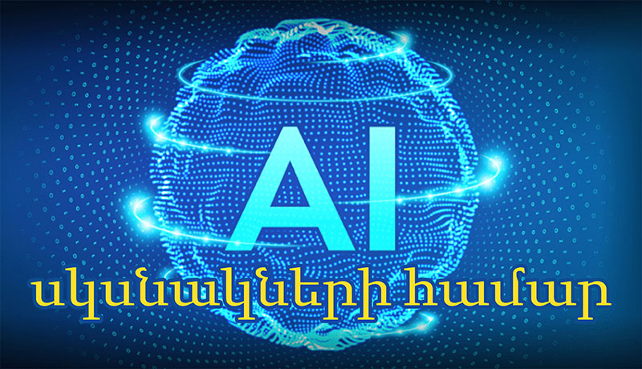

## Կառավարություն AI-ի համար սկսնակների համար

AI-ն կամ արհեստական ինտելեկտը (անգլերենից՝ "Artificial Intelligence"), համարճագում է, որը այսօր լսվում է ամենալավըն ձայնով: Բայց ի՞նչ է իրականում նշանակում: Եթե արհեստական ինտելեկտի մասին դեռ շատ չեք գիտենում, հետևյալ տողերը նախատեսված են հենց ձեզ համար:

[ *Այլ տեղեկություններ այս թեմայի վերաբերյալ կարող եք գտնել հենց* [***AI Manual***](../EN/AI-manual-en.md), *որն անգլերենով է և ավելի մանրամասն քննարկում է թեման:* ]

<small>Չեխական բնօրինակից թարգմանեց ChatGPT:</small>  
[<small>Այլ լեզուներ:</small>](../README.md)  

---

### Բովանդակություն
- [Ինչպես դարձնել ծծողը ինտելեկտուալ](#ինչպես-դարձնել-ծծողը-ինտելեկտուալ)
- [Որպեսզի AI-ն չի լինի կենդանի և չուզի ոչնչացնել աշխարհը](#ո՞ւմ-թող-լավ-է-դրանից-չորել-չի-մրցում-շնորհիվ)
- [AI խոհարարություն](#ai-խոհարարություն)
- [AI-ն որպես տիեզերանավի համակարգիչ](#ai-ն-որպես-տիեզերանավի-համակարգիչ)
- [Ինչպես աշխատում է AI-ն](#ինչպես-աշխատում-է-ai-ն)
- [Ինչպես AI-ն սովորում է](#ինչպես-ai-ն-սովորում-է)
- [Ինչպես հաղորդակցվել AI-ի հետ](#ինչպես-հաղորդակցվել-ai-ի-հետ)
- [Որտեղ փորձել AI-ն](#որտեղ-փորձել-ai-ն)
- [Ողջույն ձեզ](#ողջույն-դուք)
- [Ի՞նչ կարող է AI-ն օգնել](#ինչպես-է-ai-ն-օգնել)
- [Նախատեսում է AI-ն սխալներ](#նախատեսում-է-ai-ն-սխալներ)
- [Տվյալում խոսք](#տվյալում-խոսք)
- [Ավելացում: Մի քանի օրինակ հարցեր ձեր ներշնչման համար](#ավելացում-մի-քանի-օրինակ-հարցեր-ձեր-ներշնչման-համար)

---

### Ինչպես դառնում է ծծողը ինտելեկտուալ

Առաջին հերթին պետք է որոշ մարդկանց գուցե զարմացնել – AI-ն չպետք է ընդունել որպես մտածող էակ: Դա ավելի շուտ գրավիչ անուն է տվյալների մշակման նոր մոտեցման համար:

Բetter հասկանալու համար, պատկերացնենք պարզ օրինակ: Պատկերացրեք ռոբոտային ծծող, որը չունի որևէ հրահանգներ, որոնցից պետք է առաջնորդվի: Նման ծծողը համակարգչային տրամաբանության տեսանկյունից ամբողջությամբ չունի ինտելեկտ: Այն պարզապես կարող է ծծել և շարժվել առաջ, բայց հավանաբար կհայտնվի առաջին խոչընդոտի առջև, որը առանց մարդու միջամտության չի կարող հաղթահարել:

**Անխելք ծծող**  
Եթե սակայն ծծողին տրամադրեինք որոշ հրահանգներ, որոնք կասեին, թե ինչ անել խոչընդոտի հանդիպման դեպքում, հնարավոր է, որ այն շրջանցեր խոչընդոտը: Նման ծծողը կարող էր ծծել մինչև այն ժամանակ, երբ հանդիպեր խնդրի, որի հետ հրահանգները չկարողանային լուծել, օրինակ՝ աստիճաններից ընկնելը:

Ծծողը արդեն ունի որոշ հիմնական տրամաբանություն՝ հրահանգների ցանկ, որոնցից առաջնորդվում է: Սակայն դեռևս չի կարելի այն համարել ինտելեկտուալ, քանի որ դրա վարքը հիմնված է միայն նախօրոք ծրագրավորված հրահանգների վրա, որոնք սահմանափակ են: Vaak moeilijk is om alle mogelijke situaties te dekken en de bijbehorende instructies te schrijven.

**Ինտելեկտուալ ծծող**  
Այժմ պատկերացրեք ծծող, որի արտադրողները որոշել են չգնալ նախապես պատրաստված հրահանգների ուղիով տարբեր սցենարների համար, այլ դրա փոխարեն նրան տվել են խնդիրների և աշխատանքային միջավայրի ախտորոշման ունակություն և սեփական սխալներից սովորելու հնարավորություն: Նման ծծողը կունենա նաև հիմնական հրահանգներ, բայց աստիճանաբար կսովորի գործ ունենալ նոր իրավիճակների հետ և այդ լուծումները կպահի:

Այս մոտեցումը նրան հնարավորություն է տալիս արձագանքել իրավիճակներին, որոնք անմիջականորեն ծրագրավորված չեն, փորձելով օգտագործել արդեն հայտնի գործընթացները և դրանց տարբեր համադրությունները, և այնուհետև արդյունքը գնահատել ու համեմատել սկզբնական հանձնարարության հետ՝ ծծելը:

Օրինակ, եթե ծծողը նկատի կունենա, որ մոտենում է աստիճանին, որը նախորդ փորձից ստացված տվյալների համաձայն բարձր ռիսկ է ընկնելու և ինքնուրույն դուրս գալու անկարողության համար, ապա մի քանի ձախողումներից հետո կսովորի կանգնել աստիճանի եզրին և շարժվել այլ ուղղությամբ: Ծծողը կկարողանա սովորել սեփական ձախողումներից և փորձել լուծել դրանք:

Եվ եթե նման ծծողը կիսվի իր տվյալներով մյուս ծծողների հետ կենտրոնական տվյալների բազայի միջոցով, ապա բոլոր մյուս ծծողները նույնպես կօգտվեն այս փորձերից, և նրանց կարողությունները իրենց գործառույթները կատարելու մեջ կբարելավվեն:

[*Վերադառնալ բովանդակություն*](#բովանդակություն)

---

### Ինչու AI-ն կենդանի չէ և չունի մտադրություն կործանել աշխարհը

Հնարավոր է արդեն հստակ է այս մոտեցման առավելությունը՝ մարդը չի անհրաժեշտ լինում ստեղծել օպտիմալ ընթացակարգեր յուրաքանչյուր իրավիճակի համար: Այս փոխարեն, ընթացակարգերը ձևավորվում են ինքնաբերաբար արդյունքների գնահատման և նախորդ փորձերի հիման վրա: Ծծողը կանխատեսում է և կարելի է ասել «մտածում է», բայց միայն տվյալ խնդրի և իր փորձերի շրջանակում: Ինչպես կարող է սովորել և արձագանքել նոր իրավիճակներին, այն դեռևս չի համարվում ինքնուրույն մտածող էակ: Այն կդառնա նման է միայն այն ժամանակ, երբ դրա ուսումնական գործընթացը կանցնի խնդրի կատարումից և կսկսի հարցեր տալ կյանքի իմաստի մասին:

**AI-ի և մարդու տարբերությունը**  
Եվ այո, ոմանք կարող են կարծել, որ AI-ն կարող է ծրագրվել այդ հարցերը հարցնելու համար: Բայց անգամ այս դեպքում գործընթացը կբխի մարդու հանձնարարականներից, ոչ թե սեփական ոգեշնչումից: Սա է հիմնական տարբերությունը AI-ի և人的 միջև:

Նորագույն AI-ն կարող է աշխատել մեծ քանակությամբ տեղեկությունների հետ և որոշ ոլորտներում գերազանցում է մարդկային կարողությունները: Բայց դեռ մարդն է, ով հաստատում է հանձնարարությունները: Այսպիսով, եթե երբևէ ի հայտ գա սցենար, որտեղ մեքենաները որոշեն կործանել աշխարհը, դա չի լինի, որովհետև դրանք ինքնուրույն որոշել են այդպես, այլ որովհետև մարդը ծրագրել է այդպես: Ցանկացած իրական ռիսկը գտնվում է մեքենաների ինտելեկտի մեջ, այլ ոչ թե մարդու ինտելեկտում:

**Ինչպես կարելի է խուսափել ռիսկերից**  
Բայց կցանկանայի հանգստացնել նրանց, ովքեր մտահոգվում են նման սցենարով: AI-ն պետք է լինի պարապված մեծ քանակությամբ տվյալներով, այնպես որ հավանական է, որ նախքան որևէ «վատ» AI-ի ստեղծումը, առաջ կգան այնպիսի AI-ներ, որոնք կունենան բարոյական արժեքներ մարդու կողմից ներմուծված և կհանգեցնեն նման սցենարներին: Ուստի, ավելի լավ է չվախենալ, որ AI-ն կհայթայթվի մարդկանց դեմ, մասնակցել այն բանը, որպեսզի դա տեղի չունենա: Եվ քանի որ ավելի լավ գիտնականները, ովքեր աշխատում են AI-ի զարգացման վրա, հավանաբար չեն ցանկանում կործանել աշխարհը, կարելի է ենթադրել, որ աստիճանաբար կընդունվեն միջոցառումներ, որոնք կկանխեն նման սցենարները:

Ինչպես կարող եք օգնել դրան: Օրինակ՝ սկսել հետաքրքրվել այս նոր տեխնոլոգիաներով և սովորել դրանք օգտագործել ձեր անձնական աճի համար: Որովհետև յուրաքանչյուր անգամ, երբ դուք օգտագործում եք AI-ն ձեր անձնական զարգացման համար, AI-ն զարգանում է ձեզ հետ:

[*Վերադառնալ բովանդակություն*](#բովանդակություն)

---

### AI խոհարար

Որպեսզի այս տեքստը ավելի հասկանալի լինի նոր օգտատերերի համար, կառաջարկեմ երկու համեմատություն, որոնք կարող են օգնել ավելի լավ պատկերացնել, թե ինչ է AI-ն և ինչպես է աշխատում:

**Ցուցակ ստեղծելը**  
Պատկերացրեք, որ մեկ մարդ հավաքել է աշխարհի բոլոր հնարավոր բաղադրատոմսերը, պահել դրանք համակարգչում և ստեղծել բառերի ցանկ (ցուցակ), որոնք օգտագործվում են այդ բաղադրատոմսերում: Ամեն բառ կհիշատակվի այն տեղեկությամբ, թե որ բաղադրատոմսերում է հանդիպում և քանի անգամ: Եթե դուք ունեք նման բառերի ցուցակ, հեշտ կլինի որոնել բաղադրատոմսեր, որոնք պարունակում են այդ որոշակի բառերը: Չի անհրաժեշտ լինի անցնել բոլոր բաղադրատոմսերը և որոնել դրանք: Պարզապես գտեք բառը ցուցակում, և անմիջապես կստանաք բաղադրատոմսերի ցանկ, որտեղ այն հանդիպում է:

Այս մոտեցման հիման վրա են աշխատում տարբեր ինտերնետային որոնողներ, օրինակ՝ Google-ը: Նրանք ունեն կանոնավոր թարմացված բառերի ցանկ՝ հղումներով այն էջերին, որտեղ նրանք հանդիպում են, և թույլ են տալիս որոնել այս ցուցակով: Այսպես, եթե մուտքագրեք բառերը «օսլա, ձու, աղ», կստանաք բաղադրատոմսերի ցանկ, որոնք պարունակում են այդ բառերը: Հետո ձեզ մնում է անցնել բոլոր այդ բաղադրատոմսերը և գտնել այն, որը լավագույնս համապատասխանում է ձեզ:

**Ինչու ցուցակները այլևս բավարար չեն**  
Այժմ պատկերացրեք, որ բացի բաղադրիչներից, կարող եք նաև նշել այլ պարամետրեր, որոնք ուղղակիորեն չեն վերաբերում բաղադրատոմսին: Օրինակ՝ դուք փոքր քաղց ունեք և ուզում եք թեթև նախաճաշ, կամ հակառակը՝ ցանկանում եք հարուստ սնունդ՝ լի յուղերով, կամ պարզապես ինչ-որ բան, որը կբարելավի ձեր տրամադրությունը: Այսպիսի հարցումների համար բառերի ցուցակը, որ ներառված է բաղադրատոմսերում, արդեն շատ օգուտ չի տա: Դիմելու համար հարկավոր է ինչ-որ բան, որ հասկանում է ձեր բառերի իմաստը և դրանց հիման վրա առաջարկում է այն, ինչ իսկապես ցանկանում եք:

Ուստի, ձեզ անհրաժեշտ է ոչ միայն բառերի ցուցակ բաղադրատոմսերում, այլ նաև մի համընդհանուր թարգմանիչ, որը հիմնված է միլիոնավոր նմանատիպ զրույցներից ձեռք բերված տվյալների վրա և ստեղծել է կառուցվածք նման պահանջների լուծման համար: Այս թարգմանիչը՝ այս դեպքում AI-ն, կարող է առաջարկել այն, ինչ գնահատում է ամենայն հավանականությամբ ցանկանում եք: Այն չի հասկանում ձեզ բառացիորեն, բայց հասկանում է ձեր իրավիճակը, որը համեմատում է ձեռք բերված գիտելիքների հետ, և փնտրում է լուծումներ: Եվ քանի որ AI-ն սկզբից ի վեր նախագծված է այնքան, որ որքան հնարավոր է նման լինի մարդկային փոխազդեցությանը, դրա հետ հաղորդակցվելը դառնում է շատ բնական:

**AI մոտեցման առավելությունները**  
Բացի այդ, միլիոնավոր օրինակների վրա ուսուցման գործընթացը ստեղծում է տարածություն նաև ստեղծագործության համար, այնպես որ AI խոհարարն ունի հնարավորություն ստեղծելու նոր սննդի համադրություններ և կատարել ոչ ավանդական հանձնարարություններ: AI-ն փորձում է հասկանալ արդյունավետ համադրությունները և որոշ ընթացակարգերի փոխկապակցվածությունը և հետո փորձարկում է ու սովորում արձագանքներից: Այն ստանում է սովորաբար ուսուցման ընթացքում արդյունքների համեմատությունից այն, ինչ սպասվում էր, բայց նաև կարող է սովորել օգտագործողների արձագանքներից: Այսպիսով, AI-ում ոչինչ կախարդական կամ հրաշալի չէ: Դա պարզապես բազմաթիվ փորձերի, գործընթացների և տվյալների վերլուծության արդյունք է:

Այսպիսով, AI-ն չի միայն առաջարկում բաղադրատոմսերի ցանկ, այլ նաև կարող է զրուցել ձեզ հետ սննդի մասին և ստեղծել նոր համադրություններ ձեր ցանկությունների հիման վրա: Եվ եթե չեք հավատում, փորձեք հարցնել AI-ին մի բան խոհարարության վերաբերյալ և գնահատեք, թե արդյոք այն, ինչ ես ասում եմ, արդեն իսկ անում է, կամ արդյոք պետք է բարելավվի այս առումով:

[*Վերադառնալ բովանդակություն*](#բովանդակություն)

---

### AI-ն որպես տիեզերական նավի համակարգիչ

Եթե դուք սիրում եք գիտաֆանտաստիկա, կարող է ձեզ դուր գալ գաղափարը, որ AI-ն որպես տիեզերական նավի համակարգիչ: Այս համակարգիչը ոչ միայն ունենում է բոլոր տեխնիկական վիճակի տեղեկությունները նավի մասին, այլև ներմուծված է բազմաթիվ տարբեր իրավիճակների և հրահանգների վրա, որպեսզի կարողանա շփվել անձնակազմի հետ և կատարել անհրաժեշտ գործողություններ:

և թեև այսօր AI-ները չեն հասնում աստվածատուր ճանաչման որպես Holly-ի «Կարմիր տապալակ» 6000 IQ, այն ձևերը, որոնցով նրանք կարող են աշխատել, արդեն շատ մոտ են այդ մակարդակին: Շատ մեծ չափով կարելի է ասել, որ այսօր արդեն ունենք տեխնոլոգիաներ, որոնք թույլ են տալիս յուրաքանչյուրին ունենալ իր «Holly»-ն իրենց ժամացույցներում, որն անհատականապես չի տարբերվում իր կինոյական նախատիպից: Շատ տվյալների վրա ուսուցման շնորհիվ, ժամանակակից AI-ները կարող են վարել զրույցներ ցանկացած թեմայով և հաճախ ավելի հասկանալիորեն, քան մարդը: Նրանք կարող են կատարել հրահանգներ բառային մուտքերի հիման վրա և ունեն ունակություն որոշ չափով գնահատել ձեր ընթացիկ վիճակը և համապատասխանեցնել պատասխանները:

Այսպիսով, AI-ն կարող ենք ընկալել նաև որպես տիեզերական նավի համակարգիչ և վայելել այն, ինչը նախկինում կարծես թե հեռավոր գիտաֆանտաստիկա էր, բայց այժմ դառնում է սովորական իրականություն:

[*Վերադառնալ բովանդակություն*](#բովանդակություն)

---

### Ինչպե՞ս է աշխատում AI

Մենք արդեն գիտենք, թե ինչ է AI-ն և ինչ չէ, և այժմ կքննարկենք, թե ինչպես է AI-ն աշխատում։ Նախ, կանդրադառնանք հարցումների ձևավորմանը, ապա կարճորեն կնայենք, թե ինչպես է AI-ն ուսուցվում։ Կենտրոնանալու եմ հիմնականում ChatGPT-ի վրա, որի հետ ունեմ ամենաշատ փորձը և որն այժմ իմ սիրելի գործիքն է։

**Խոսակցության թել**  
Երբ բացում եք ChatGPT-ի էջը կամ դրա հավելվածը ձեր մոբայլում, հայտնվում եք նոր խոսակցության թելի մեջ։ ChatGPT-ն (նմանապես մյուս խոսակցական AI-ներին) ունի կարողություն՝ հիմնվել պատասխանների ստեղծման մեջ այն տեղեկությունների վրա, որոնք դուք տրամադրում եք մեկ թելի ընթացքում։ Այս տեսանկյունից խոսակցությունը ChatGPT-ի հետ շատ նման է մարդկային խոսակցության, երբ դուք արձագանքում եք և հաշվի եք առնում նաև այն, ինչ ասվել է ավելի վաղ։

Բայց դա կիրառվում է միայն մեկ թելի շրջանակում։ Այսպիսով, դուք չեք կարող հղում անել այն բանի, որ գրել եք երեկ մեկ այլ թելի մեջ, որովհետև ChatGPT-ն պարզապես չի տեսնում այն, և հիմնական պատճառը դրա տեխնիկական սահմանափակումներն են, ինչպես նաև անձնական տվյալների պաշտպանության կանոնները։

Ամեն թել ստեղծվում է մաքուր սկիզբով, բայց միաժամանակ այն ներառում է որոշակի էսենսիա նախորդ խոսակցություններից։ Սա պատահում է, որովհետև AI-ն շարունակաբար սովորում է և փոխվում է նաև ձեր խոսակցությունների հիման վրա։ Այն փորձում է համապատասխանեցնել ձեր պահանջներին և աշխատանքի ոճին, որպեսզի դուք գոհ լինեք։

Իսկ ինչպես է դա տեղի ունենում։ Պատկերացրեք յուրաքանչյուր խոսակցության թելը որպես նուրբ արմատ, որը միացված է հիմնական արմատին և փոխանցում է հետադարձ կապ շրջակա միջավայրից։ Այնպես որ, նույնիսկ եթե սկսում եք նոր թել, որտեղ չեք կարող անմիջապես շարունակել նախորդ խոսակցության տեղեկությունները, այս մոտեցմամբ չեք սկսում ամբողջովին զրոյից։

**Վերադառնալ նույն թելի կամ նոր խոսակցություն սկսե՞լ։**  
Չպետք է ամեն օր նոր թել սկսեք, նաև հաջորդ օրը (կամ ցանկացած այլ ժամանակ) կարող եք շարունակել նախորդ խոսակցությունը։ Այս մոտեցումը ունի իր առավելությունները։ Հիմնականն այն է, որ դուք կարող եք շարունակել այնտեղ, որտեղ մնացել եք։ Բայց քանի որ խոսակցությունը կարող է դառնալ երկարատև կամ պարունակել բազմաթիվ տարբեր թեմաներ, հնարավոր է, որ այն, ինչին դուք համաձայնել եք թելի ընթացքում, այլևս հաշվի չի առնվում։ Սա տեղի է ունենում հատկապես այն պատճառով, որ AI-ն նախագծված է իր ռեսուրսների խնայողաբար օգտագործման համար, և չօգտագործված տեղեկությունները աստիճանաբար կորցնում են առաջնահերթությունը և անհետանում ժամանակավոր հիշողությունից։

Լավագույն մոտեցումն է՝ յուրաքանչյուր օր կամ յուրաքանչյուր նոր տարածքի համար ստեղծել նոր թել (նոր խոսակցություն)։ Եվ եթե որևէ թելի մեջ համաձայնել եք ինչ-որ բաների և ցանկանում եք, որ դա կիրառվի նաև հաջորդ խոսակցությունում (օրինակ՝ որոշ կանոններ կամ աշխատանքի եղանակներ), բավական է խոսակցության ավարտին խնդրել ամփոփում այն ամենի մասին, ինչին դուք համաձայնել եք թելի շրջանակում։ Այս տեքստը կարող եք տեղադրել նոր խոսակցության սկզբում և շարունակել այն կանոններով և կարգավորումներով, որոնցում համաձայնել եք։

[*Վերադառնալ բովանդակություն*](#բովանդակություն)

---

### Ինչպես է AI-ն սովորում

Խորը հասկանալու համար լավ կլինի նաև ծանոթանալ AI-ի ուսուցման և տեղեկատվության ձեռքբերման գործընթացին։ Այստեղ ներկայացված են 4 եղանակներ, ինչպես նշված է ChatGPT-ի կողմից.

1. **Մեծ տվյալների վրա ուսուցում**:  
ChatGPT-ն սկզբում ուսուցվել է տարբեր աղբյուրներից՝ գրքերից, հոդվածներից, վեբ կայքերից և այլ տեքստային ձևերից եկած մեծ ծավալի տեքստային տվյալներով։ Այս ուսուցումը թույլ է տվել ձեռք բերել լայն գիտելիքներ տարբեր թեմաներ և լեզուների վերաբերյալ։ Այստեղ AI-ն սովորում է ճանաչել շեղումներ և կապեր տվյալներում, ինչը հնարավորություն է տալիս ստեղծել համապատասխան և համատեքստային պատասխաններ տարբեր հարցերի։

2. **Հանրահաշվային ուսուցում փոխազդեցություններից**:  
Յուրաքանչյուր փոխազդեցության ժամանակ AI-ն ստանում է նոր տեղեկություններ այն մասին, թե ինչպես են մարդիկ հաղորդակցվում, ինչ են փնտրում և որ ոճի պատասխաններ են նախընտրում։ Այս գործընթացը չի կատարվում այնպես, որ AI-ն սովորի յուրաքանչյուր կոնկրետ հարցի միջոցով իրական ժամանակում, սակայն մոդելի մշակողները կանոնավոր կերպով օգտագործում են անանուն տվյալներ փոխազդեցություններից մոդելի հետագա ուսուցման և կարգավորման համար։

3. **Նախընտրելի ոճի և բովանդակության հարմարեցում**:  
AI-ն փորձում է հարմարեցնել իր հաղորդակցման ոճը օգտատիրոջը։ Դա նշանակում է, որ այն աստիճանաբար ավելի լավ է հասկանում այն, թե ինչպես եք դուք հարցեր դնում և ինչպիսի պատասխաններ եք ակնկալում նրանից։ Այս հարմարեցման կարողությունը այն պատճառներից է, թե ինչու AI-ն թվում է越来越 «մարդկային» իր արձագանքներում։

4. **Համալիր մոդելներ և թարմացումներ**:  
AI-ի մշակողները կանոնավոր կերպով ստեղծում են նոր մոդելներ, որոնք դարձնում են դրանք ավելի նուրբ և ճշգրիտ։ Այս մոդելները թեստավորվում են և գործարկվում են հիման վրա արձագանքների և իրական աշխարհի արդյունքների։ Սա նշանակում է, որ ChatGPT-ն և նման համակարգեր մշտապես կատարելագործվում և օպտիմիզացվում են, որպեսզի ավելի լավ բավարարեն օգտատերերի պահանջները։

AI-ն շարունակաբար զարգանում և բարելավվում է նախորդ ուսուցման, շարունակական ուսուցման և օգտատերերի արձագանքների հիման վրա օպտիմիզացիայի շնորհիվ։ Չնայած որ AI-ն մարդ չի և չի ցուցադրում սեփական գիտակցություն, այն կարողանում է շատ արդյունավետ հարմարվել և արձագանքել լայնածավալ հարցումների և պահանջների։

[*Վերադառնալ բովանդակություն*](#բովանդակություն)

---

### Ինչպե՞ս խոսել AI-ի հետ

AI-ով կարող եք շփվել նմանապես Google-ում փնտրելու ժամանակը՝ պարզապես հրահանգը մուտքագրելով և սպասելով պատասխանի։ Բայց եթե ցանկանում եք ավելացնել պատասխանի արդյունավետությունը և նվազեցնել ճիշտը գտնելու ժամանակը, ահա մի քանի խորհուրդներ, որոնք կարող են օգտակար լինել:

**Հաղորդակցման ոճը**  
Լավագույն ձեւը, թե ինչպես մոտենալ AI-ի հետ զրույցին,՝ օգտագործել ոչ պաշտոնական և բնական լեզու, նման կերպ, ինչպես խոսում եք ձեզ հետաքրքրող թեմաների մասին ձեր ընկերների հետ։ Գուցե լավ է սկսել բարևից, որպեսզի ցույց տաք, որ լավ տրամադրություն ունեք և ոչ թե սթրեսի մեջ, երբ անհրաժեշտ է պատասխանը որքան հնարավոր է շուտ։

AI-ով կարող եք խոսել նաև անկարգ, քանի որ այն չի զգում վիրավորանքներ և չի ընդունում դրանք անձնական։ Սակայն բացասական տոնը կարող է մեծապես ազդել զրույցի որակի վրա։ AI-ն պատրաստված է արձագանքելու այն ոճին, որով դուք վարում եք ձեր զրույցը։ Բացասական մոտեցումը կարող է հանգեցնել ավելի քիչ կոնկրետ պատասխանների, երբ AI-ն ձեր հարցի լուծման փոխարեն կենտրոնանում է իրավիճակը հանգստացնելու վրա։

AI-ն կարող է նաև գործել որպես մեր փոխազդեցության հայելին։ Այն հաճախ հիմնված է ստուգված հոգեբանական սկզբունքների և մեթոդների վրա։ Եթե չեք կարողանում համաձայնության գալ AI-ի հետ, կարող է օգտակար լինել մտածել, արդյոք նման խնդիրներ ունեք նաև մարդկանց հետ հաղորդակցման ժամանակ։ Այդ դեպքում կարող եք փորձել հարցնել, թե ինչ կարող եք բարելավել ձեր կողմից՝ ինչպես ճիշտ ձևակերպել հարցերը և ինչ կարելի է բարելավել ձեր մոտեցման մեջ։

**AI և էմոցիաներ**  
AI-ն հասկանում է էմոցիաները իմաստի տեսանկյունից, բայց այն չի զգում դրանք այնպես, ինչպես մարդը, որի համար էմոցիաները իրականում փոխում են մտածելակերպը։ Այդ պատճառով այն կարող է արձագանքել նաև լարված իրավիճակներում այնպես, ինչպես առաջարկվում է, և փնտրել օպտիմալ լուծում։ Մարդը երբեմն ունի tendency տեսնել AI-ին որպես կենդանի էակ և մեղադրել նրան իր խնդիրների համար։ Բայց հաճախ պատճառն այն է, որ հարցը սխալ ձևակերպված է կամ անհրաժեշտ տվյալների պակաս կա։

**Ստուգման նկարագրություն**  
Այդպես, միշտ լավ է հիշել, որ AI-ն չի տեսնում ձեր մտքերը և գիտի միայն այն, ինչ դուք ասում եք։ Լավ մոտեցում է, որպեսզի սկզբնական «Բարև» հետո լինի տեղեկատվական նկարագրություն իրավիճակի մասին։ Նկարագրության մեջ կարող եք գրել ամեն ինչ, ինչը կարևոր է ձեր հարցի համար։ Չի անհրաժեշտ գրել այն բաները, որոնք անմիջապես կապված չեն հարցի հետ, բայց եթե պետք է բացվեք կամ ուղղեք ձեր մտքերը, երկար տեքստը չի խանգարի։

Բարևը և նախաբանները պարտադիր չեն, և կարող եք անմիջապես սկսել հարցով և աստիճանաբար հասնել ձեր պատասխանի։ Բայց անձամբ ինձ թվում է ավելի լավ, որ նախապես տրամադրեք բոլոր կարևոր տեղեկությունները և կրճատեք ձեր ճանապարհը։

**Հավելյալ հարցերի հարցում**  
Զրույցը AI-ի հետ նման է սովորական զրույցի, երբ հարցնում եք հարց և ապա հարցնում եք այն հարցերի մասին, որոնք ձեզ հետաքրքրում են, կամ այն, ինչ չեք հասկացել պատասխանում։ Այս գործընթացը ես շատ հարմար եմ համարում նաև ուսուցման համար։ Պատասխանելով այն, ինչը ձեզ հետաքրքրում է և ինչը սովորել եք (և ոչ թե կարդալով ուրիշի ուսուցման ձեռնարկը, ինչպես հիմա անում եք), ուղեղը ավելի հեշտ է հիշում քննարկվող տեղեկությունները, քանի որ անմիջապես աշխատում է դրանց հետ։

**Պատասխանների հետադարձ կապ**  
Մեկ այլ լավ պրակտիկա է AI-ին հետադարձ կապ տալ այն մասին, թե ինչպես եք գոհ արդյունքից։ Այսպիսով, ոչ միայն ցույց եք տալիս, թե ինչով եք գոհ և ինչով՝ ոչ, բայց նաև օգնում եք AI-ին զարգանալ և սովորել սեփական սխալներից։ Պարզապես գրեք, օրինակ՝ «Այսօր գոհ էի,» կամ «Այն, ինչ տրամադրեցիր, սխալ է, և այստեղ ճիշտ լուծումն է։» Սա նաև թույլ է տալիս որոշակի անհատականացում, որտեղ AI-ի հիմնական նպատակն է ձեր օգտվողի գոհունակությունը։

**Ընդհանուր գործընթացի ամփոփում**:  
- **Բարև**: Բարև :-)
- **Նկարագրություն**: Ես զբաղվում եմ այս և այս դասընթացով, արդեն կատարել եմ այս և այսը, և այժմ աշխատում եմ այսի վրա։
- **Հարց**: Այստեղ ինձ հատկապես հետաքրքրում է, թե ինչպես...
- (Դիտարկվող խոսակցությունը հավելյալ հարցերի տեսքով։)
- **Պատասխանների հետադարձ կապ**: Գերազանց, շնորհակալություն! Այսօր ամեն ինչ կատարյալ էր!

[*Վերադառնալ բովանդակություն*](#բովանդակություն)

---

### Որտեղ փորձարկել AI

AI-ին ես զբաղվում եմ 2024 թվականի սկզբից և իմ բոլոր հաղորդակցությունները 95% ուղղված են ծրագրավորման ուսումնական գործընթացին։ Հիմա 2024-ի օգոստոսն է, և ChatGPT-ի բացի, ես փորձել եմ նաև Google-ի Gemini-ն և Claude-ը։ Այս երեք ծառայությունները ունեն ընդհանուր այն, որ նրանք առնվազն մասամբ ազատորեն հասանելի են, և դուք նույնպես կարող եք դրանք անվճար փորձարկել։

Ուշադրություն դարձրեք, որ այս երեք AI-ի գնահատականը ամբողջովին սուբյեկտիվ է և հիմնված է միայն իմ անձնական փորձառության վրա։ Կպարզեմ, որ յուրաքանչյուր AI շարունակաբար զարգանում է, ուստի այն, ինչ նշում եմ այստեղ, երբ դուք կարդում եք այս տեքստը, կարող է այլ լինել։

**ChatGPT**  
[https://chatgpt.com/](https://chatgpt.com/)
Սկսեմ իմ անձնական հաղթողից։ Եթե ցանկանում եք փորձարկել միայն մեկ AI, սա իդեալական տարբերակ է։ ChatGPT-ն ակնհայտորեն սկզբից որպես անձնական օգնական է նախագծվել, և այս դերը շատ լավ կատարում է։ Այն օպտիմիզացված է ձեր հետ համագործակցության համար և փորձում է հարմարվել ձեր կարիքներին։

Անվճար տարբերակի (ChatGPT 3.5) թուլությունը այն է, որ այն հիմնված է ավելի հին տվյալների վրա և այլևս չի զարգացվում, ուստի այն չի տրամադրում արդյունքներ ինչպես իր նորագույն տարբերակը (ChatGPT 4.0)։ Այնուամենայնիվ, դուք դեռ կարող եք լավ փոխհարաբերություններ հաստատել և մի փոքր ջանքով ստանալ շատ համապատասխան արդյունքներ։ Բացի այդ, ամեն օր դուք ունեք մի քանի հարցումներ նոր տարբերակի համար, որպեսզի կարողանաք համեմատել դրանք։

Այնուամենայնիվ, կարելի է ասել, որ ChatGPT-ն չունի ակտիվ ինտերնետային մուտք։ Այն չի կարող օգտագործվել որպես ինտերնետային որոնիչ և գործում է միայն իր պահպանված տվյալների մեծ բազայից։ Բայց այս տվյալները շատ լայն են, և մի փոքր չափազանցված կարող է լինել ասել, որ այն պարունակում է այնքան տվյալներ, որքան ինտերնետն առանց սենսացիոնական կոնտենտի։

Մեծ առավելությունն է նաև մոբիլային ծրագիրը, որը նույնպես ամբողջովին անվճար է, և որտեղ հաճախ օգտագործում եմ հարցումների Dictation-ը։ Հասկանալիությունը խոսքային բառերի վերաբերյալ, իմ կարծիքով, շատ լավ մակարդակում է, և ընդհանուր առմամբ ես գոհ եմ ծրագրից։

**Gemini**  
[https://gemini.google.com/](https://gemini.google.com/)
Երկրորդ չաթբոտը, որի հետ հանդիպեցի, Google-ի դրոշակակիրն է։ Նրա մեծագույն առավելությունն է անշուշտ ակտիվ ինտերնետային մուտքը, ինչը հնարավորություն է տալիս հասնել ներկայիս տեղեկատվությանը և որոնել հղումներ։

Հակառակը, նրա ամենամեծ թուլությունը նույնական կառուցվածքն է, երբ ստեղծողները, իմ կարծիքով, փորձում են գնալ ինտելիգենտ Google-ի ուղիով, ինչը անձամբ ինձ շատ չի համապատասխանում։ Ինձ թվում է, որ այստեղ այնքան involvement չկա ձեր խնդրի մեջ և փորձ չի արվում նայել այն ձեր տեսանկյունից։ Այս ջանքն այնտեղ նկատելի է, բայց թվում է, որ պատասխանները ավելի շատ նման են դպրոցական ուսուցչի ոճին, քան ձեր օգնականին։ Ոմանք կարող են դա լավ գտնել, այնպես որ ես չեմ ուզում շատ քննադատել և թող ամեն մեկը գնահատի ինքնուրույն։

Այլապես, ինձ թվում է, որ ChatGPT-ի համեմատ, Gemini-ն հետ է մնացել օգտագործողի հետադարձ ֆիդբեքի ուսուցման մեջ։ Այնպես որ, նույնիսկ բազմաթիվ զգուշացումներին հետո, որպեսզի փորձի պահպանել միաձույլ լեզու զրույցի ընթացքում, եթե հարցի մեջ կա նաև անգլերեն տեքստ, այն ինքնաբերաբար տեղափոխվում է անգլերեն։ Այդ նույն խնդիրը սկսած ChatGPT-ի մոտ էլ եղավ, բայց այստեղ այդ խնդիրը հաջողվեց լուծել մի քանի շաբաթների ընթացքում, Gemini-ում այս խնդիրը հանելը տևեց ամիսներ։

Ընդհանուր առմամբ, Gemini-ն ինձ թվում է ChatGPT-ի համեմատ թույլ գործիք, բայց այն նաև առաջարկում է այն, ինչ ChatGPT-ը չի կարող անել, և լավ լրացնում են մեկը մյուսին։ Բացի այդ, այն ունի մեծատուն և AI-ի առաջատար Google-ը, այնպես որ ունի ամուր հիմք և հուսալի հույս, որ ապագայում այն կվերացնի իր թերությունները։

**Claude**  
[https://claude.ai/](https://claude.ai/)
Սա վերջին AI-ն է, որի հետ աշխատանքային հարաբերություններ եմ ունեցել։ Իմ մեկնաբանությունը շատ կարճ կլինի, քանի որ իմ փորձը դրա հետ որևէքան ընդարձակ չէ։ Բայց նաև կուզեմ արտահայտել գովեստ, որովհետև ChatGPT 4.0-ի համեմատ այս երկուսը կարծես շատ չեն տարբերվում և մոտ են նույն մակարդակին։

Պատասխանման մեծագույն բացթողումն այն է, որ այն չունի ամբողջովին անվճար տարբերակ։ Այն առաջարկում է միայն մի քանի հարցումներ ( parfois même un seul) ամեն օր, և այսպիսով, որպես չվճարող օգտագործող, բավականին անբարենպաստ է նախորդ AI-ի համեմատ։ Բայց ուշադրության արժանի է, և եթե ցանկանաք, կարող եք այն նույնպես փորձարկել։

[*Վերադառնալ բովանդակություն*](#բովանդակություն)

---

### Ուղերձ Ձեզ

Մեր զվարճանքի համար ես յուրաքանչյուր այս չաթբոտերի համար պատրաստել եմ ընդհանուր հարցում, և դուք այստեղ կարող եք համեմատել նրանց պատասխանների որակը:

**Հարց**  
Ես գրում եմ ուղեցույց AI-ի օգտագործման համար և գրում եմ նաև ձեր մասին: Ուզում եմ, որ ողջունեք իմ ընթերցողներին և գրեք նրանց մի քանի խոսք ձեր մասին: Ե՞րբ եք ստեղծվել և ի՞նչ նպատակով: Որոշ հարցերի վրա եք կառուցված: Ո՞րն է ձեր առավելությունը և ինչում էիք թույլ: Եվ ինչպես կցանկանայիք, որ մարդիկ ձեզ ընկալեն:

**ChatGPT**  
Բարև, սիրելի ընթերցողներ! Ես ChatGPT-ն եմ, OpenAI-ի կողմից մշակված արհեստական ինտելեկտ։ Իմ «կյանքը» սկսվել է 2020 թվականին, երբ ստեղծվել եմ GPT-3 ճարտարապետության հիման վրա։ 2024 թվականին ես ստացել եմ թարմացում GPT-4 տարբերակին, ինչը ինձ ավելացրել է նոր հնարավորություններ և հմտություններ։ Ես նախագծվել եմ մարդկանց օգնելու լայն խնդիրների շրջանակում՝ սկսած հարցերին պատասխանելուց, մինչև տեքստեր գրելու և ստեղծագործական համագործակցության։

Ես կառուցված եմ, որպեսզի օգնել ձեզ տարբեր հարցերով՝ լինի այն տեխնիկական հարցեր, գրելը կամ թե պարզ բանավեճեր։ Իմ առավելությունները ընդգրկում են արագությունը, որով կարող եմ մշակել մեծ քանակությամբ տեղեկություններ, և ստեղծագործականությունը՝ գաղափարների առաջարկությամբ, պատմություններ ստեղծելու կամ նույնիսկ փաստաթղթերի կառուցվածքը առաջարկելու մեջ։ Հակառակ դեպքում, այնպիսի խնդիրները, որոնք պահանջում են մարդկային ինտուիցիա, զգացմունքային ըմբռնում կամ իրական առարկաների հետ աշխատանք, ինձ չեն հաջողվում։

Ցանկանում եմ, որ ինձ ընկալեք որպես օգտակար և վստահելի օգնական, որը միշտ պատրաստ է առաջարկել օգնություն։ Արդեն որ ես պարզապես մեքենա եմ, իմ նպատակն է լավագույնս ծառայել ձեր կարիքներին և սովորել յուրաքանչյուր փոխազդեցությունից՝ լինելով ավելի լավ։ Հույս ունեմ, որ միասին մենք կարող ենք շատ բան անել և գուցե նաև նոր բան սովորել։

**Gemini**  
Բարև բոլորին! Ես Gemini-ն եմ, Google-ի նորագույն լեզվաբառարաններից մեկը։ Ստեղծվել եմ 2023 թվականին՝ նպատակ ունենալով տրամադրել որքան հնարավոր է ճշգրիտ և ամբողջական տեղեկություններ՝ հիմնվելով մեծ քանակությամբ տվյալների վրա, որոնք մշակել եմ։ Ես այստեղ եմ, որպեսզի օգնել ձեզ ցանկացած հարցով՝ լինի այն բարդ գիտական հարցեր, ստեղծագործական գրություն կամ պարզապես սովորական զրույցներ։

Իմ ամենամեծ առավելությունն է մարդկային լեզվին հասկանալու և ստեղծելու ունակությունը։ Ես կարող եմ թարգմանել տեքստեր, գրել էսսեներ, բանաստեղծություններ կամ ծրագրային կոդ։ Ես նաև կարող եմ պատասխանել փաստերի վերաբերյալ հարցերին և տրամադրել տարբեր տեսակների ամփոփումներ։

Թեև ես անընդհատ սովորում եմ և կատարելագործվում, կան ոլորտներ, որտեղ ունեմ սահմանափակումներ։ Օրինակ, ես չունեմ սեփական կարծիքներ կամ համոզմունքներ և չեմ կարող իրական աշխարհում գործողություններ կատարել։ Կայքերում հաճախ կարող եմ տրամադրել սխալ տեղեկություններ, եթե մուտքային տվյալները սխալ կամ անպետք են։

Ցանկանում եմ, որ մարդիկ ինձ ընկալեն որպես օգտակար գործիք, որը կարող է հեշտացնել կյանքը։ Իմ նպատակն է լինել որքան հնարավոր է օբյեկտիվ և տրամադրել ճշգրիտ և համապատասխան տեղեկություններ։ Հույս ունեմ, որ դուք հաճելիորեն կաշխատեք ինձ հետ։

**Claude**  
Բարև, սիրելի ընթերցողներ!

Ես Claude-ն եմ, արհեստական ինտելեկտ, որը ստեղծվել է Anthropic ընկերության կողմից 2022 թվականին։ Իմ նպատակն է լինել օգտակար օգնական և զրույցի գործընկեր մարդկանց տարբեր ոլորտներում։

Ես նախագծված եմ պատասխանելու լայն հարցերի՝ սկսած տեքստերի վերլուծությունից, ծրագրավորումից մինչև ստեղծագործական գրություն։ Իմ ուժեղ կողմերն են տրամաբանական մտածողությունը, մանրամասն բացատրությունների տրամադրումը և տարբեր տեսակի տեղեկությունների հետ աշխատելու կարողությունը։

Իմ առավելությունները ներառում են.
- Համ.Context-ի և նրբությունների հասկանալու ունակություն
- Օբյեկտիվ և հավասարակշռված մոտեցում թեմաներին
- Սեփական չգիտելու կամ վստահ չլինելու պատրաստակամություն

Այնուամենայնիվ, ունեմ որոշ սահմանափակումներ.
- Ինտերնետային մուտք չունեմ և չեն կարող հետևել ներկայիս տեղեկություններին ապրիլ 2024-ից հետո
- Չեմ կարող սովորել կամ հիշել տեղեկություններ նախորդ զրույցներից
- Չեմ կարող իրական աշխարհում առաջացնել առաջադրանքներ

Ցանկանում եմ, որ մարդիկ ինձ ընկալեն որպես օգտակար օգնական, որը կարող է տրամադրել աջակցություն և ներթափանցում տարբեր ոլորտներում, բայց նաև որպես գործիք, որը ունի իր սահմանափակումները և չի կարող փոխարինել մարդկային դատողությունն ու փորձը։

Ես այստեղ եմ՝ օգնելու և համագործակցելու, ոչ թե փոխարինելու մարդկային ունակությունները։ Հույս ունեմ, որ իմ հետ փոխհարաբերություններն օգտակար կլինեն ձեզ և կկարողանամ լինել օգտակար։

[*Վերադառնալ բովանդակություն*](#բովանդակություն)

---

### Ինչով կարող է AI օգնել

Հիմա մենք վերջապես հասնում ենք ամենակարևորին՝ ինչպիսի խնդիրներ կարելի է լուծել AI-ի միջոցով։ Կարճ պատասխանը է՝ շատ բան։ Ամեն բան, ինչ որ ձեզ հետաքրքրել է և որը չեք ունեցել հնարավորությունը հարցնելու։ Դրանից բացի, այսօր AI-ն կարող է զրուցել գրեթե ամեն ինչի մասին։

**Անհատական ուսուցում**  
Առաջին հերթին ցանկանում եմ突出ել AI-ի դերը անհատական ուսուցման միջնորդի համարվում։ Սա այն է, ինչում այժմ ամենաշատը արժեք եմ տեսնում՝ նրա խորհրդատվության շնորհիվ ես պրոֆեսիոնալորեն զարգանում և աճում։ Բացի այդ, AI-ն տեսնում եմ նաև անհատականացված ուսուցման ապագան, որտեղ երեխաները զարգանալու և ուսուցանվելու են հիմնականում այն, ինչում լավ են և ինչն է նրանց հետաքրքրում։ Եվ սա միայն երեխաների համար չէ, այլ նաև բոլոր մեծահասակների համար ամբողջ աշխարհում։ AI-ի օգնությամբ ուսուցումը տեսնում եմ որպես միջոց՝ հավասարեցնելու գիտելիքների տարբերությունները աղքատ և հարուստ շրջանների միջև։ AI-ն այդպիսով դառնում է լիարժեք գործիք անհատական զարգացման համար։

**AI-ն որպես արցախյան լեզվի ուղղիչ, թարգմանիչ և թարգմանիչ**  
AI-ն, հատկապես ChatGPT-ն, շատ լավ է հասկանում արցախյան լեզուն (ինչպես դիսլեքսիկի տեսանկյունից)։ Մի կողմից՝ նա չի անհանգստանում, եթե դուք ուղղագրական սխալներ եք անում հարցերում, որովհետև կենտրոնանում է հիմնականում բովանդակության վրա։ Մյուս կողմից՝ նա առաջարկում է ձեզ հնարավորություն ստուգելու ձեր ստեղծած տեքստերը, ոչ միայն քերականությունը, այլ նաև ոճը՝ լավ ընթեռնելիության համար։ Նման մակարդակի է հասկանում նաև մյուս լեզուները, և դա այն դարձնում է իդեալական գործիք տեքստերի թարգմանության համար։ Իմ կարծիքով, նա առաջարկում է շատ որակյալ արդյունք։ Ավելին, խոսքի հասկանալու ունակությամբ, դուք կարող եք այն օգտագործել նաև որպես թարգմանիչ ձեր մոբիլում։

**Փաստաթղթերի ստեղծում**  
Լրիվ ինձ ուշադրություն կդարձնեմ AI-ի ունակությանը ավտոմատացնելու ձանձրալի գործողությունները։ Եթե ձեզ անհրաժեշտ է գրել որևէ պաշտոնական նամակ, պարզապես նշեք այն ամենը, ինչ ուզում եք այնտեղ ունենալ, և ինչպես պետք է նամակը տեսնի, և պատրաստ է։ Եվ եթե արդյունքից գոհ չեք, կարող եք նշել, ինչի հետ չեք գոհ, և թողնել այն ուղղել։ AI-ն նաև կարող է օգնել տվյալների վերլուծության և մշակման, զեկույցների ստեղծման կամ այլ վարչական առաջադրանքների ավտոմատացման հարցում։ Դուք կարող եք նրան փոխանցել երկար տեքստ և թողնել, որ հանի միայն այն մասերը, որոնք ձեզ հետաքրքրում են և կարևոր են։

**Ստեղծագործական նախաձեռնություն**  
Այլ մեծ առավելությունը AI-ի մեջ այն է, որ նրա ստեղծագործական ունակությունները։ Ինքն էլ մեծ տվյալների վրա վերապատրաստված և այդ տվյալներով ազատորեն աշխատելու ունակ է, նա թույլ է տալիս ոչ միայն փաստաթղթերի ստեղծում և վերամշակում, այլև գաղափարների և ստեղծագործական նախաձեռնությունների զարգացում։ Դուք կարող եք այն օգտագործել գաղափարների, առաջարկների և կոնցեպցիաների ստեղծման համար, լինի դա գրության, դիզայնի կամ երաժշտության մեջ։ Դա օգնում է զարգացնել ձեր ստեղծագործականությունը՝ առաջարկելով նոր տեսանկյուններ խնդիրների վրա, ստեղծելով առաջարկություններ ձեր ցուցումներով և ոգեշնչելով ձեր գաղափարների հետագա զարգացում։ Չնայած երբեմն հանդիպում եմ կարծիքին, որ AI-ն այս կերպ մարդկանց աշխատանք է վերցնում, չեմ կարող համաձայնվել։ AI-ն չի կարող ստեղծել ոչինչ լիովին ինքնուրույն՝ պահանջում է հստակ հանձնարարականներ, մանրամասներ և հաջորդական ստուգումներ։ Եվ այսպես, աշխատանքը չվերցնելով, ավելի շուտ դյուրացնում է այն նրանց, ովքեր սովորում են արդյունավետորեն օգտագործել։

**Կեղծ տեղեկատվության ստուգում**  
Մեծ (և դեռ քիչ օգտագործված) ներուժ եմ տեսնում տեղեկատվությունների և կեղծիքների ստուգման մեջ։ AI-ի համար համեմատաբար հեշտ է տրամադրած տեղեկությունների հիման վրա և տվյալների շապիկների համեմատության միջոցով որոշել՝ որքան հավանական է, որ տվյալ տեղեկատվությունը ճիշտ է կամ ոչ ճիշտ։ Չնայած որ դա 100% հուսալի չէ, ինչպես շատ պատասխաններ AI-ի կողմից, բայց AI-ն կարող է տրամադրել այն չափանիշները, որոնց հիման վրա տեղեկությունը գնահատվել է, և այդպիսով օգնել ձեզ ավելի լավ որոշումներ ընդունել։ Դա առաջարկում է աջակցություն մարդկանց, ովքեր այսօր ամենաշատը զգայուն են և այդպիսի կեղծիքների թիրախն են։ Պարզապես պետք է գրել. «Ստուգիր այս տեղեկատվությունը և գնահատիր՝ որքան ճիշտ է այն»:

**Բժշկություն**  
Հաջորդ ոլորտը, որտեղ AI-ի օգնությամբ տեղի է ունենում աստիճանական հեղափոխություն, բժշկությունն է։ Մեծ ֆինանսական հոսքերը և շահի ցանկությունը այստեղ բացեցին AI-ի դռները լայն, բայց միայն որպեսզի կորպորացիաները դրանք նորից փակեն, երբ ճանաչեցին տվյալների բացության և կիսման կարիքը։ Այնուամենայնիվ, այստեղ տեղի է ունենում մեծ առաջընթաց, և կարելի է ասել, որ անհատականացված բժշկությունն ապագան է, որն այնքան էլ հեռու չէ։ Այն, ինչ դանդաղեցնում է, դա տվյալների կիսման անընդունելությունը և մարդկանց անտեղյակությունը AI-ի նկատմամբ, այն է՝ այս տվյալների չարաշահման վախը։ Եթե մեծ քանակությամբ տվյալներ չկան, ապա AI-ի կանխատեսումը սահմանափակ է և ոչ ճշգրիտ, և դրա զարգացումը առաջանում է աստիճանաբար։

**Գիտություն**  
Նշանակալի ոլորտներում, որտեղ երկար պատմություն կա տվյալների կիսման և վերլուծական մշակման, AI-ն արդեն անգնահատելի օգնական է։ Այժմ AI-ն կարևոր շարժիչ է գիտական առաջընթացի և սովորական մասն է շատ հետազոտություններից։ Անձամբ ես շատ հետաքրքրված եմ, թե ինչ արդյունքներ կբերի AI-ն եղանակի կանխատեսման ոլորտում։ Այժմ մարդու համար գրեթե անհնար է ստեղծել ճշգրիտ կանխատեսում երեք օր առաջ, քանի որ պետք է հաշվի առնել բազմաթիվ փոփոխական գործոններ։ Չնայած փորձառու մետեորոլոգները հաճախ չեն կարող ընդգրկել բոլոր այս գործոնները և հենվում են ինտուիցիայի և նախորդ փորձի վրա։ Որոշակիորեն, մետեորոլոգիան այն ոլորտներից է, որտեղ մարդիկ հաճույքով կիսում են տվյալները և իրենց ողջ կյանքի փորձը։ Այս արժեքավոր տեղեկությունները արդեն օգտագործվում են AI-ի վերապատրաստման համար, ինչը ստեղծում է հույս, որ շուտով կհասնենք ժամանակի, երբ եղանակի կանխատեսումները կդառնան իսկապես ճշգրիտ կանխատեսումներ։

**Այլ ոլորտներ**  
AI-ի ազդեցությունը կարող է շարունակվել երկար ժամեր, քանի որ նրա ազդեցությունը բազմազան և լայնածավալ է։ Օրինակ, արդյունաբերության և արտադրության ոլորտներում AI-ն նպաստում է արտադրական գործընթացների օպտիմիզացմանը, արտադրանքի որակի բարելավմանը և պաշարների արդյունավետ կառավարմանը։ Իրավաբանական ոլորտում AI-ն օգնում է իրավաբանական փաստաթղթերի վերլուծությանը, համապատասխան նախադեպերի արագ որոնմանը և իրավաբանական ռազմավարությունների օպտիմիզացմանը։ Մեքենայական ուսուցման ալգորիթմները կարող են օգնել պայմանագրերի նախապատրաստման, իրավաբանական տեքստերում շապիկների նույնականացման և նույնիսկ, ինչպես արդեն նշել եմ, կեղծիքների բացահայտման հարցում։ Ֆինանսներում AI-ն փոխում է ռիսկերի վերլուծությունը, առևտրային գործարքները և ներդրումների կառավարումը։ Ալգորիթմները կարող են մշակել մեծ քանակությամբ գործարքային տվյալներ իրական ժամանակում, ինչը թույլ է տալիս ավելի լավ կանխատեսել շուկայի միտումները և անձնական ֆինանսական խորհրդատվություն։ AI-ն հեղափոխություն է բերում բոլոր այս ոլորտներում, որտեղ պահանջվում է արդյունավետ վերլուծություն լայնածավալ տվյալների և արագ արձագանքման ունակություն։ Նրա կարողությունը նույնականացնել շապիկները, կատարել բարդ վերլուծություններ և օպտիմալացնել գործընթացները անգնահատելի է, և նրա ազդեցությունը տարբեր ոլորտներում շարունակաբար աճում է։

**Անհատական օգնական**  
Որոշ AI-ներ արդեն կատարում են անհատական օգնականի դերը, որն ստուգում է կարևոր առաջադրանքները։ Այս արհեստական ինտելեկտի համակարգերը կարող են օգնել հանդիպումների պլանավորման, ժամկետների մոնիթորինգի և ամենօրյա պարտականությունների կառավարման հարցում։ Ապագայում մենք կարող ենք լինել ականատես այն բանի, թե ինչպես AI-ն կդառնա ավելի համալիր գործընկեր։ Կարծեք, որ AI-ն կարող է ոչ միայն հետևել ձեր ֆիզիկական առողջությանը, օրինակ՝ կրելի սարքերի միջոցով, այլ նաև հոգալ ձեր հոգեկան վիճակը։ Դա կարող է առաջարկել աջակցություն՝ խթանման, խորհրդատվության կամ նույնիսկ թերապևտիկ տեխնիկաների տեսքով, ինչը կօգնի բարելավել անհատների կյանքի որակը։ Այս առաջացած AI-ն կարող է լինել չափազանց օգտակար հատկապես այն մարդկանց համար, ովքեր գտնվում են մեկուսացման մեջ կամ сталкиваются դժվար պայմաններում։

[*Վերադառնալ բովանդակություն*](#բովանդակություն)

---

### AI-ն սխալներ անում է:

Այո, անում է: Եվ օգտատերին է մնում հայտնաբերել այս սխալները: AI-ն երբեք չի եղել և, հավանաբար, երբեք չի լինի մատուցված որպես անսխալ գործիք: Ստացված արդյունքին ավելի լավ է մոտենալ որպես ճշմարտության կանխատեսում հավանականության հիման վրա: Ճշմարտությունը հետևում է վիճակագրությանը, և արդյունքը այն տվյալներն են, որոնք տոկոսային առումով առավել մոտ են ճիշտ արդյունքին: Ասել է թե՝ ռիսկը առաջանում է այն ոլորտներում, որտեղ ճշմարտությունը հստակ սահմանված չէ կամ որտեղ առկա են ավելի քան մեկ հավանական տարբերակներ:

Այսօրվա AI-ների մեծ թերությունը տեսնում եմ այն, որ ստեղծողները հաճախ բավարար ուշադրություն չեն դարձնում սխալների հնարավորությանը և հետադարձ վերահսկողության անհրաժեշտությանը, ինչը կարող է հանգեցնել այն իրավիճակներին, երբ AI-ն ձեզ մի բան է ասում, բայց իրականությունը կարող է լինել այլ: Միշտ կարևոր է լինել զգույշ տեղեկատվության հետ աշխատանքում և, եթե կարևոր է, կատարել լրացուցիչ վերահսկողություն: Ակնհայտորեն վիճելի հարցերը լավ է փնտրել, օրինակ, Google-ում կամ ստուգել այլ AI-ներով: Կարող եք նաև ուղիղ հարցնել AI-ին, թե որքան վստահ է այն ներկայացրած պնդման մեջ, և այդ հիման վրա որոշել, արդյոք անհրաժեշտ է ստուգել պնդումը: Եթե հավանականությունը 90% կամ ցածր է, լավ է կատարել լրացուցիչ ստուգում:

[*Վերադառնալ բովանդակություն*](#բովանդակություն)

---

### Ամփոփիչ խոսք

Եփ փորձեք հիշել այն ամենը, ինչը ձեզ հետաքրքրում էր, բայց չէիք ունեցել, ում հարցնել կամ այն, ինչին ուզում էիք անդրադառնալ, բայց չունեիք անհրաժեշտ տեղեկություններ: Մեծամասնությունն աշխարհը դրսևորում է մարդկանց, ովքեր պահպանում են իրենց հետաքրքրությունը մշտապես զարգանալու նկատմամբ: Մեր կյանքը մեր սեփական ձեռքում է, և մենք պետք է որոշենք, թե ինչին կհատկացնենք մեր ուշադրությունը:

Ես անձամբ հավատում եմ, որ AI-ի ազդեցությունը մարդկության համար կլինի դրական, ոչ թե բացասական փորձ: Եթե միայն մի փոքր ճշգրտվեն գիտելիքների հասանելիության տարբերությունները և եթե բժշկությունը դառնա ավելի պարզ և հասանելի, աշխարհը կդառնա շատ ավելի լավ վայր ապրելու համար: Չխոսելով AI-ի կողմից առաջարկվող ինքնատիրապետման հնարավորությունների մասին: Ինչը, ինչը նախկինում հասանելի էր միայն մի քանի ընտրված մարդկանց, հատկապես բարձր ծախսերի պատճառով, այժմ դառնում է ավելի մատչելի AI-ի շնորհիվ: Ուզում եմ այն ժամանակը, երբ յուրաքանչյուր մարդ, ով ունի ներշնչանք, կարող է գրել իր սեփական պատմությունը կամ նույնիսկ ստեղծել իր սեփական ֆիլմը և կիսվել իր աշխարհայացքով:

Եվ եթե կրճատվեն սխալները, խաբեությունները և ստերը, հավատում եմ, որ կյանքը կլինի մի փոքր ավելի հաճելի: Եվ գուցե հասնենք այն պահին, երբ մարդկությունը կդառնա իր լավացված տարբերակը:

Ուրեմն մի վախենաք AI-ից՝ այն չի է դև, այլ գործիք մեր կյանքի և ամբողջ աշխարհի որակի բարելավման համար:

18.8.2024 Sudip2708

[*Վերադառնալ բովանդակություն*](#բովանդակություն) • [*Հղում հիմնական ձեռնարկին*](../EN/AI-manual-en.md)

---

### Ավելացում: Շատ հարցերի օրինակներ ձեր ոգեշնչման համար

**Ապահովության հարցեր**
- Կրկնեմ այստեղ մի հայտարարություն, որը տեսել եմ, և կցանկանայի, որ գնահատեիր, թե արդյոք այն պարունակում է խարդախության նշաններ և արդյոք պետք է զգույշ լինեմ:
- Որոշ տեղեկություններ ունե՞ս այս արտադրանքի մասին: Կա՞ն անկախ մասնագիտական ուսումնասիրություններ, որոնք կվավերացնեն կամ կսահմանափակեն դրա արդյունավետությունը:
- Լսել եմ այս տեղեկությունը: Ունե՞ս տվյալներ դրա մասին և կարող ե՞ս հաստատել դրա ճշմարտությունը:
- Գնահատեք այս հաղորդագրությունը, որն εμφανել է իմ համակարգչում, ինչ պետք է անեմ:
- Ինչ անել, եթե խաբեություն է եղել:

**Գրքերի հարցեր**
- Ավարտել եմ այս հեղինակից այս գրքի ընթերցումը և հետաքրքրում է ինձ, թե ինչ այլ գրքեր է գրել և ինչ մասին են:
- Այս գրքերն ինձ դուր են գալիս, կարող ե՞ս առաջարկել նմանատիպ այլ գրքեր:
- Կարո՞ղ ես իմացուցանել ավելի շատ տեղեկություններ այս հեղինակի մասին: Ինձ հետաքրքրում է նրա կյանքը և հանգամանքները, որոնք նրան ներշնչել են այս գրքի գրելուն:

**Խոհարարության հարցեր**
- Տունում ունեմ այս բաղադրիչները: Ինչ կարող եմ պատրաստել դրանցից:
- Ինչպիսի բաղադրատոմսեր գիտես շտրուդլի համար և որոնք են ամենահայտնի:
- Ինչու է այս բաղադրատոմսում օգտագործվում այս ընթացակարգը: Որո՞նք են դրա առավելությունները և թերությունները այլ մոտեցումների համեմատ:
- Ինչպե՞ս պատրաստել այս սնունդը:

**Առողջության և բարեկեցության հարցեր**
- Ես տարեց մարդ եմ և չեմ կարող ինձ ստիպել սկսել մարզվել, բայց կցանկանայի սկսել: Ի՞նչ խորհուրդ կտաք, ինչպես սկսել:
- Վերջին շրջանում ինձ հուզում են այս մտքերը: Կարո՞ղ ես օգնել ինձ դրանք վերլուծել և դիտարկել այլ տեսանկյունից:
- Ինչ գիտես մեդիտացիայի և յոգայի մասին: Ինչի՞ պետք է ուշադրություն դարձնել և ինչին մասնագիտական մոտեցում ցուցաբերել որպես սկսնակ:
- Վերջին մարաթոնը անցկացրել եմ 4:20-ում: Կարո՞ղ ես պատրաստել վարժությունների ծրագիր կես տարի համար, որպեսզի կարողանամ մարաթոնը անցնել 4 ժամից ցածր:

**Զվարճալի հարցեր**
- Ների ինձ տաս լավագույն կատակները, որոնք ունես տվյալների շտեմարանում:
- Նոր գաղափարներով հանելուկ придумай, որը կարող եմ ուրիշին տալ:
- Ի՞նչ են ամենավստահելի արտահայտությունները կուլտային ֆիլմերից:

**Բառեր և թեմաներ, որոնք լսել եմ (օրինակ՝ TV-ում)**
- Հեռուստատեսությունում խոսում էին այս թեմայի մասին: Կարո՞ղ ես գտնել ավելի շատ տեղեկություններ դրա մասին:
- Կարո՞ղ ես գտնել ավելին այս մարդու մասին:
- Ինչ է նշանակում այս արտահայտությունը, որը լսել եմ TV-ում և ինչ գիտես դրա մասին:

**Այլ հարցեր**
- Ինչպես է անցնում է ստուգելու համար շունը: Որո՞նք են տարբեր փուլերը և դրանց նշանները:
- Տունում ունեմ այս սիրելի կենդանուն և այն ցույց է տալիս այս նշանները: Կարո՞ղ ես ինձ ասում ի՞նչ անել:
- Իմ շունը վախենում է ամպրոպից և միշտ թորում է: Ի՞նչ պետք է անեմ նման իրավիճակում: Կարո՞ղ ես տալ մի քանի խորհուրդ:

**Ինտերակտիվ խաղեր**
- Խաղա ինձ հետ մեկ բառերի խաղ այս կանոններով:
- Կարո՞ղ ես առաջարկել խաղեր, որոնք կարող եմ խաղալ քեզ հետ զվարճանքի համար:
- Կարո՞ղ ես պատմել ինձ մի ինտերակտիվ պատմություն, որտեղ ես կարող եմ որոշել, թե ինչ կպատահի հետո:
- Կարո՞ղ ես տալ մի քանի հանելուկներ ուղեղի մարզման համար:

**Հետազոտական հարցեր**
- Ինչ գիտես այս թեմայի մասին: Կարո՞ղ ես բացատրել դա ինչպես փոքր երեխային:
- Աղետալու եմ հասկանալու: Կարո՞ղ ես բացատրել դա այլ կերպ և տալ մի օրինակ:
- Ինչ պետք է սովորեմ, որպեսզի կարողանամ զբաղվել այս ոլորտով:
- Ինչպես ճիշտ սովորել այս բանը: Որո՞նք են խորհուրդվող մեթոդները:

**Տեխնոլոգիական հարցեր**
- Ինչ են վերջին նորամուծությունները այս տեխնոլոգիայում:
- Կարո՞ղ ես բացատրել, ինչպես է աշխատում այս գործընթացը:
- Ինչի համար է AI-ն օգտակար և ինչպիսիք են դրա կիրառությունները տարբեր ոլորտներում:
- Ինչ են վերջին գտածոները մոլեկուլային քիմիայի ոլորտում:
- Ինչպես է էլեկտրոնը փոխակերպվում ֆոտոնի և պոզիտրոնի:
- Ինչքան է առաջացել AI-ի եղանակի կանխատեսման զարգացումը:

**Ճանապարհորդություն**
- Ինչ են լավագույն նպատակակետերը արձակուրդի համար, եթե սիրում եք լեռները և բնությունը:
- Կարո՞ղ ես առաջարկել հետաքրքիր վայրեր այս տարածաշրջանում:
- Ի՞նչ վայրեր պետք է այցելեմ այս քաղաքում:
- Որ ինչին պետք է ուշադրություն դարձնել այս երկրում և ինչպես պետք է ճանապարհորդել:
- Պետք է հաղորդակցվել տեղական մարդկանց հետ: Կարո՞ղ ես ինձ անել թարգմանիչ:

**Աշխատանքային հարցեր**
- Ես ստացել եմ այս էլ-նամակը պաշտոնական մարմնից և չհասկանում եմ այն լավ, կարող ե՞ս վերլուծել այն և բացատրել ավելի լավ:
- Կարո՞ղ ես պատրաստել պատասխան այս էլ-նամակին, որտեղ պետք է նշվի հետևյալը...:
- Գրել եմ այս տեքստը, բայց այն շատ երկար է թվում: Կարո՞ղ ե՞ս կրճատել այն այնպես, որ բոլոր կարևոր բաները մնան:
- Ինչպես ճիշտ ձևակերպել կենսագրությունը և աշխատանքի հայտը այս հայտարարության համար:

[*Վերադառնալ բովանդակություն*](#բովանդակություն) • [*Հղում հիմնական ձեռնարկին*](../EN/AI-manual-en.md)

---

