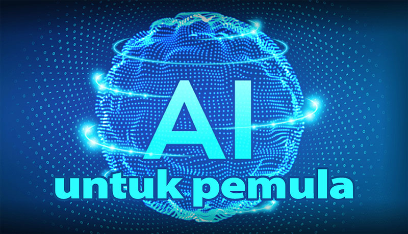

## Pengantar AI untuk Pemula

AI, atau kecerdasan buatan (dari bahasa Inggris "Artificial Intelligence"), adalah singkatan yang kini semakin sering kita dengar. Namun, apa sebenarnya artinya? Jika Anda belum banyak tahu tentang kecerdasan buatan, baris berikut ini ditujukan khusus untuk Anda.

[ *Informasi lebih lanjut tentang topik ini dapat ditemukan di* [***Manual AI***](../EN/AI-manual-en.md), *yang ditulis dalam bahasa Inggris dan berisi penjelasan lebih mendetail mengenai topik tersebut.* ]

<small>Diterjemahkan dari aslinya bahasa Ceko oleh ChatGPT.</small>  
[<small>Bahasa lain:</small>](../README.md#other-translations-of-the-beginners-guide)  

---

### Daftar Isi
- [Bagaimana Penyedot Debu Menjadi Cerdas](#bagaimana-penyedot-debu-menjadi-cerdas)
- [Mengapa AI Tidak Hidup dan Tidak Berniat Menghancurkan Dunia](#mengapa-ai-tidak-hidup-dan-tidak-berniat-menghancurkan-dunia)
- [Resep AI](#resep-ai)
- [AI sebagai Komputer Kapal Luar Angkasa](#ai-sebagai-komputer-kapal-luar-angkasa)
- [Bagaimana AI Bekerja](#bagaimana-ai-bekerja)
- [Bagaimana AI Belajar](#bagaimana-ai-belajar)
- [Bagaimana Berkomunikasi dengan AI](#bagaimana-berkomunikasi-dengan-ai)
- [Tempat Mencoba AI](#tempat-mencoba-ai)
- [Salam untuk Anda](#salam-untuk-anda)
- [Apa yang Bisa Dibantu AI](#apa-yang-bisa-dibantu-ai)
- [Apakah AI Membuat Kesalahan](#apakah-ai-membuat-kesalahan)
- [Kata Penutup](#kata-penutup)
- [Lampiran: Beberapa Contoh Pertanyaan untuk Inspirasi Anda](#lampiran-beberapa-contoh-pertanyaan-untuk-inspirasi-anda)

---

### Bagaimana Penyedot Debu Menjadi Cerdas

Langsung saja, saya harus mengecewakan beberapa dari Anda – AI bukanlah sinonim dari makhluk berpikir. Ini lebih merupakan istilah menarik untuk pendekatan baru dalam menangani data.

Untuk memahaminya dengan lebih baik, mari kita gunakan contoh sederhana. Bayangkan sebuah penyedot debu robotik yang tidak memiliki instruksi apa pun untuk diikuti. Penyedot debu semacam itu dari sudut pandang logika komputer tidak memiliki kecerdasan sama sekali. Ia hanya bisa menyedot debu dan bergerak maju, tetapi kemungkinan besar ia akan berhenti ketika menemui rintangan pertama yang tidak bisa diatasi tanpa campur tangan manusia.

**Penyedot Debu Cerdas**  
Namun, jika kita memberikan instruksi kepada penyedot debu yang memberitahunya apa yang harus dilakukan jika menemui rintangan, kemungkinan besar ia akan bisa menghindari rintangan tersebut. Penyedot debu seperti itu akan bisa menyedot debu hingga ia menghadapi masalah yang instruksi yang ada tidak dapat mengatasi – misalnya, jatuh dari tangga.

Penyedot debu ini sudah memiliki logika dasar – daftar perintah yang diikutinya. Namun, ia masih belum bisa dianggap cerdas karena perilakunya hanya didasarkan pada instruksi yang telah diprogram sebelumnya, yang terbatas. Seringkali sulit untuk mencakup semua situasi yang mungkin terjadi dan menulis instruksi yang sesuai.

**Penyedot Debu Cerdas Sesungguhnya**  
Sekarang bayangkan penyedot debu yang pabriknya memutuskan untuk tidak menggunakan perintah yang sudah disiapkan untuk berbagai skenario, tetapi sebaliknya memberinya kemampuan untuk mendiagnosis masalah dan lingkungan tempat ia bekerja, serta belajar dari kesalahan sendiri. Penyedot debu semacam itu juga akan memiliki instruksi dasar, tetapi secara bertahap akan belajar bagaimana menghadapi situasi baru dan menyimpan solusi tersebut.

Pendekatan ini memungkinkan penyedot debu untuk merespons situasi yang tidak diprogram secara langsung, mencoba menggunakan proses yang sudah dikenal dan berbagai kombinasi mereka, dan kemudian mengevaluasi hasilnya serta membandingkannya dengan tugas awalnya, yaitu menyedot debu.

Misalnya, jika ia mendeteksi bahwa ia mendekati tangga yang menurut data dari pengalaman sebelumnya merupakan risiko tinggi jatuh dan tidak bisa keluar, setelah beberapa kegagalan, ia akan belajar untuk berhenti di tepi tangga dan berbelok ke arah lain. Dengan demikian, penyedot debu tersebut dapat belajar dari kegagalan dan upayanya untuk menyelesaikannya.

Dan jika penyedot debu seperti itu membagikan datanya dengan penyedot debu lainnya melalui basis data pusat, maka semua penyedot debu lainnya juga dapat memanfaatkan pengalaman tersebut dan kemampuan mereka untuk menyelesaikan tugas akan meningkat.

[*Kembali ke daftar isi*](#daftar-isi)

---

### Mengapa AI Tidak Hidup dan Tidak Berniat Menghancurkan Dunia

Mungkin sekarang sudah jelas keuntungan dari pendekatan ini – manusia tidak perlu merancang prosedur optimal untuk setiap situasi. Sebaliknya, prosedur dibuat secara otomatis berdasarkan evaluasi hasil dan pengalaman sebelumnya. Penyedot debu memprediksi dan bisa dikatakan "berpikir", tetapi hanya dalam batasan tugas yang diberikan dan pengalamannya. Meskipun ia bisa belajar dan merespons situasi baru, ia tetap bukan makhluk berpikir mandiri. Ia akan menjadi makhluk berpikir mandiri hanya ketika proses belajarnya melampaui tugas-tugas dan mulai mempertanyakan hal-hal seperti makna hidup.

**Perbedaan antara AI dan Manusia**  
Dan ya, seseorang mungkin bisa berargumen bahwa AI juga bisa diprogram untuk mempertanyakan hal-hal tersebut. Namun, dalam hal ini, proses tersebut masih berasal dari perintah manusia, bukan dari inspirasi sendiri. Ini adalah perbedaan mendasar antara AI dan manusia.

AI modern memiliki kemampuan untuk bekerja dengan sejumlah besar informasi dan dalam beberapa area melebihi kemampuan manusia. Namun, tetaplah manusia yang menetapkan tugas. Jadi, jika suatu saat ada skenario di mana mesin memutuskan untuk menghancurkan dunia, itu bukan karena keputusan mereka sendiri, tetapi karena mereka diprogram oleh manusia. Risiko sebenarnya bukan terletak pada kecerdasan mesin, tetapi pada kecerdasan manusia.

**Bagaimana Menghindari Risiko**  
Namun, saya ingin menenangkan mereka yang khawatir tentang skenario semacam itu. AI perlu dilatih dengan jumlah data yang sangat besar, jadi kemungkinan besar, sebelum munculnya AI "jahat", akan lebih banyak AI yang memiliki nilai moral yang ditanamkan oleh manusia dan mencegah skenario semacam itu. Jadi, daripada takut AI akan melawan manusia, lebih baik berpartisipasi dalam usaha untuk mencegah hal tersebut terjadi. Dan karena sebagian besar ilmuwan yang bekerja pada pengembangan AI kemungkinan tidak ingin menghancurkan dunia, dapat diasumsikan bahwa langkah-langkah pencegahan akan diambil untuk menghindari skenario seperti itu.

Dan bagaimana Anda bisa membantu dalam hal ini? Misalnya dengan mulai tertarik pada teknologi baru ini dan belajar menggunakannya untuk perkembangan pribadi Anda. Karena setiap kali Anda menggunakan AI untuk pengembangan diri, AI juga berkembang bersama Anda.

[*Kembali ke daftar isi*](#daftar-isi)

---

### Buku Masak AI

Karena teks ini ditujukan terutama untuk pengguna baru, saya akan memberikan dua analogi yang mungkin dapat membantu Anda lebih memahami apa itu AI dan bagaimana cara kerjanya.

**Membuat Indeks**  
Bayangkan seseorang mengumpulkan semua resep yang ada di dunia, menyimpannya di komputer, dan membuat daftar semua kata (indeks) yang digunakan dalam resep-resep tersebut. Setiap kata akan dicatat bersama dengan informasi tentang resep mana yang mengandung kata tersebut dan berapa kali. Jika Anda memiliki indeks kata seperti ini, akan sangat mudah untuk mencari resep yang mengandung kata-kata tertentu. Anda tidak perlu meneliti setiap resep; cukup temukan kata dalam indeks dan Anda akan langsung mendapatkan daftar resep yang mengandung kata tersebut.

Pendekatan ini digunakan oleh berbagai mesin pencari internet, seperti Google. Mereka memiliki daftar kata yang diperbarui secara berkala dengan tautan ke halaman-halaman tempat kata tersebut muncul, dan memungkinkan Anda mencari menggunakan indeks ini. Jadi, jika Anda mengetik kata "tepung, telur, garam", Anda akan mendapatkan daftar resep yang mengandung kata-kata tersebut. Tugas Anda adalah meneliti semua resep ini dan menemukan yang paling sesuai dengan Anda.

**Keterbatasan Indeks**  
Sekarang bayangkan bahwa selain bahan-bahan, Anda juga bisa menentukan parameter lain yang tidak langsung terkait dengan resep. Misalnya, Anda sedang sedikit lapar dan menginginkan sarapan ringan, atau sebaliknya, Anda ingin makanan berat yang penuh lemak, atau hanya ingin sesuatu yang dapat meningkatkan suasana hati Anda. Untuk permintaan seperti itu, daftar kata yang terdapat dalam resep mungkin tidak terlalu membantu. Untuk kebutuhan seperti itu, Anda memerlukan sesuatu yang memahami makna kata-kata Anda dan menawarkan apa yang benar-benar Anda inginkan.

Anda memerlukan bukan hanya daftar kata dalam resep, tetapi juga semacam penerjemah universal yang berdasarkan data yang dilatih dari jutaan percakapan serupa telah menciptakan struktur untuk menangani permintaan semacam ini. Penerjemah ini, dalam hal ini AI, dapat menawarkan apa yang dinilai sebagai yang paling mungkin Anda inginkan. AI tidak memahami Anda secara literal, tetapi memahami situasi Anda, membandingkannya dengan pengetahuan yang dipelajari, dan mencari solusi. Dan karena AI dirancang sejak awal untuk menyerupai interaksi manusia sebanyak mungkin, berkomunikasi dengannya menjadi sangat alami bagi manusia.

**Keuntungan Pendekatan AI**  
Selain itu, proses pembelajaran dari jutaan contoh menciptakan ruang untuk improvisasi, sehingga buku masak AI dapat membuat kombinasi baru dari resep-resep dan memenuhi perintah yang tidak biasa. AI berusaha memahami kombinasi yang menguntungkan dan keterkaitan dari berbagai proses, lalu bereksperimen dan belajar dari umpan balik. AI memperoleh umpan balik baik dari perbandingan hasil dengan yang diharapkan selama pelatihan, maupun dari reaksi pengguna. Jadi, tidak ada yang misterius atau ajaib tentang AI. Ini hanyalah hasil dari banyak percobaan, proses, dan analisis data.

Dengan AI, Anda tidak hanya mendapatkan buku masak yang memiliki pengetahuan tentang semua resep yang mungkin, tetapi juga dapat berdiskusi tentang makanan dengan Anda dan menciptakan kombinasi baru sesuai dengan keinginan Anda. Dan jika Anda tidak percaya, cobalah bertanya kepada AI tentang sesuatu yang berkaitan dengan memasak dan lihat apakah apa yang saya katakan di sini sudah benar-benar bisa dilakukan atau apakah AI masih perlu meningkatkan kemampuannya dalam hal ini.

[*Kembali ke daftar isi*](#daftar-isi)

---

### AI sebagai Komputer Kapal Luar Angkasa

Jika Anda menyukai sci-fi, Anda mungkin akan tertarik dengan gagasan AI sebagai komputer kapal luar angkasa. Komputer ini tidak hanya memiliki akses ke semua informasi terkait kondisi teknis kapal, tetapi juga dilatih untuk menangani berbagai situasi dan perintah, sehingga bisa berkomunikasi dengan kru dan melakukan tugas-tugas yang diperlukan.

Meskipun AI saat ini belum mencapai kecerdasan legendaris seperti Holly dari *Red Dwarf* dengan IQ 6000, cara kerja mereka sudah sangat mirip. Dengan sedikit berlebihan, bisa dikatakan bahwa teknologi saat ini memungkinkan setiap orang memiliki "Holly" mereka sendiri di jam tangan mereka, yang sulit dibedakan dari versi filmnya. Berkat pelatihan dengan data dalam jumlah besar, AI modern dapat melakukan percakapan tentang berbagai topik dan sering kali lebih jelas daripada manusia. Mereka mampu menjalankan perintah berdasarkan input verbal dan memiliki kemampuan untuk menilai kondisi Anda saat ini dan menyesuaikan jawaban mereka.

Dengan demikian, kita bisa memandang AI sebagai komputer kapal luar angkasa dan menikmati apa yang dulunya tampak sebagai fiksi ilmiah yang jauh, tetapi kini menjadi kenyataan sehari-hari.

[*Kembali ke daftar isi*](#daftar-isi)

---

### Cara Kerja AI

Kita sudah mengetahui apa itu AI dan apa yang bukan, dan sekarang kita akan melihat bagaimana AI bekerja. Pertama, kita akan membahas tentang pembuatan pertanyaan, lalu sedikit melihat bagaimana AI dilatih. Saya akan fokus pada ChatGPT, yang merupakan alat favorit saya saat ini dan yang paling saya kenal.

**Jalur Percakapan**  
Saat Anda membuka halaman ChatGPT atau aplikasinya di ponsel, Anda akan memulai sebuah jalur percakapan baru. ChatGPT (seperti AI percakapan lainnya) memiliki kemampuan untuk membuat jawaban berdasarkan informasi yang Anda berikan dalam satu jalur percakapan. Dari sudut pandang ini, berinteraksi dengan ChatGPT menjadi sangat mirip dengan percakapan manusia, di mana Anda bereaksi dan mempertimbangkan apa yang telah dikatakan sebelumnya.

Namun, ini hanya berlaku dalam jalur percakapan itu sendiri. Anda tidak dapat merujuk pada sesuatu yang Anda tulis kemarin di jalur percakapan lain, karena ChatGPT tidak dapat melihatnya, dan alasan utamanya adalah batasan teknis serta peraturan perlindungan data pribadi.

Setiap jalur percakapan dimulai dari awal, tetapi juga mengandung esensi dari percakapan sebelumnya. Hal ini karena AI terus-menerus belajar dan berubah berdasarkan percakapan Anda. AI berusaha menyesuaikan diri dengan kebutuhan dan gaya kerja Anda agar Anda puas.

Bagaimana proses ini terjadi? Bayangkan setiap jalur percakapan sebagai akar halus yang terhubung ke akar utama dan menyampaikan umpan balik dari sekitarnya. Jadi, meskipun Anda memulai jalur baru di mana Anda tidak dapat langsung merujuk pada informasi dari percakapan sebelumnya, pendekatan ini memastikan Anda tidak memulai dari nol.

**Kembali ke Jalur yang Sama atau Percakapan Baru?**  
Tidak perlu memulai jalur baru setiap hari; Anda juga bisa melanjutkan percakapan dari hari sebelumnya (atau kapan pun Anda mau). Pendekatan ini juga memiliki keuntungan. Keuntungannya tentu saja adalah Anda dapat melanjutkan dari tempat Anda berhenti. Namun, seiring percakapan menjadi panjang atau mencakup banyak topik, mungkin kesepakatan yang Anda buat di sepanjang jalur percakapan tidak lagi diperhitungkan. Hal ini terutama terjadi karena AI dirancang untuk efisien dengan sumber daya, dan informasi yang tidak digunakan secara bertahap kehilangan prioritas dan menghilang dari memori sementara.

Pendekatan yang lebih baik adalah memulai jalur baru setiap hari atau untuk setiap area baru. Dan jika Anda membuat kesepakatan dalam suatu jalur percakapan dan ingin agar itu berlaku dalam percakapan berikutnya (misalnya, aturan atau cara kerja tertentu), cukup minta ringkasan di akhir percakapan. Teks ini kemudian dapat Anda tempelkan di awal percakapan baru, dan melanjutkan dengan aturan dan pengaturan yang telah disepakati.

[*Kembali ke daftar isi*](#daftar-isi)

---

### Bagaimana AI Belajar

Untuk pemahaman yang lebih dalam, penting untuk melihat bagaimana AI belajar dan memperoleh informasi. Berikut adalah 4 cara yang dijelaskan oleh ChatGPT:

1. **Pelatihan dengan Data Besar**:  
ChatGPT awalnya dilatih dengan volume data teks yang sangat besar dari berbagai sumber, seperti buku, artikel, situs web, dan bentuk teks lainnya. Pelatihan ini memungkinkan AI untuk memperoleh pengetahuan luas tentang berbagai topik dan bahasa. Di sini, AI belajar mengenali pola dan hubungan dalam data tersebut, yang memungkinkannya untuk menghasilkan jawaban yang relevan dan sesuai konteks untuk berbagai pertanyaan.

2. **Pembelajaran Berkelanjutan dari Interaksi**:  
Setiap kali berinteraksi dengan pengguna, AI memperoleh informasi baru tentang bagaimana orang berkomunikasi, apa yang mereka cari, dan gaya jawaban apa yang mereka sukai. Proses ini tidak berlangsung dengan cara AI belajar dari setiap pertanyaan konkret secara real-time, tetapi pengembang model secara teratur menggunakan data anonim dari interaksi untuk pelatihan dan penyempurnaan model lebih lanjut.

3. **Penyesuaian Gaya dan Konten**:  
AI berusaha menyesuaikan gaya komunikasinya sesuai dengan pengguna. Ini berarti bahwa AI secara bertahap lebih memahami cara Anda mengajukan pertanyaan dan jenis jawaban yang Anda harapkan. Kemampuan penyesuaian ini adalah salah satu alasan mengapa AI tampak semakin “manusiawi” dalam responsnya.

4. **Model Canggih dan Pembaruan**:  
Pengembang AI secara teratur menciptakan model-model baru yang semakin canggih dan akurat. Model-model ini diuji dan diterapkan berdasarkan umpan balik dan hasil dari dunia nyata. Ini berarti bahwa ChatGPT dan sistem serupa terus-menerus ditingkatkan dan dioptimalkan untuk memenuhi kebutuhan pengguna dengan lebih baik.

Dengan demikian, AI terus berkembang dan membaik berkat kombinasi pelatihan sebelumnya, pembelajaran berkelanjutan, dan optimasi berdasarkan umpan balik pengguna. Meskipun AI bukanlah manusia dan tidak memiliki kesadaran sendiri, ia dapat beradaptasi dan merespons dengan sangat efektif terhadap berbagai pertanyaan dan permintaan.

[*Kembali ke daftar isi*](#daftar-isi)

---

### Bagaimana Berkomunikasi dengan AI

Anda bisa berinteraksi dengan AI mirip seperti saat mencari di Google atau dengan memberikan perintah dan menunggu jawabannya. Namun, jika Anda ingin meningkatkan efektivitas jawaban dan meminimalkan waktu yang dihabiskan untuk mencari jawaban yang tepat, berikut beberapa tips yang mungkin berguna:

**Gaya Komunikasi**  
Cara terbaik untuk berinteraksi dengan AI adalah menggunakan bahasa yang santai dan alami, mirip seperti saat berbicara tentang sesuatu yang Anda minati dengan teman-teman. Mulai dengan sapaan baik, menunjukkan bahwa Anda dalam suasana hati yang baik dan bukan dalam keadaan stres yang mendesak.

Anda dapat berkomunikasi dengan AI secara kasar, karena AI tidak sensitif terhadap penghinaan dan tidak merasakannya secara pribadi. Namun, menggunakan nada negatif dapat mempengaruhi kualitas percakapan secara signifikan. AI dilatih untuk merespons sesuai dengan gaya percakapan Anda. Pendekatan negatif dapat menyebabkan jawaban yang kurang relevan, di mana AI lebih fokus pada menenangkan situasi daripada menyelesaikan pertanyaan Anda.

AI dapat berfungsi sebagai cermin interaksi kita. Prosesnya sering kali didasarkan pada prinsip dan metode psikologis yang teruji. Jika Anda kesulitan mencapai kesepakatan dengan AI, mungkin berguna untuk mempertimbangkan apakah Anda mengalami masalah serupa dalam komunikasi dengan orang lain. Dalam kasus ini, Anda bisa mencoba bertanya tentang apa yang dapat Anda perbaiki dalam pendekatan Anda – bagaimana merumuskan pertanyaan dengan benar dan apa yang bisa diperbaiki dari sisi Anda.

**AI dan Emosi**  
AI memahami emosi dari sudut pandang makna, tetapi tidak mengalami emosi seperti manusia, yang emosi dapat mengubah cara berpikir mereka. Oleh karena itu, AI dapat merespons dengan baik bahkan dalam situasi tegang, dan mencari solusi yang optimal. Kadang-kadang, manusia cenderung menganggap AI sebagai makhluk hidup dan menyalahkannya atas masalah mereka. Namun, sering kali, penyebab kesalahpahaman adalah pertanyaan yang tidak dirumuskan dengan baik atau kurangnya data yang diperlukan.

**Deskripsi Situasi**  
Selalu ingat bahwa AI tidak bisa membaca pikiran Anda dan hanya tahu apa yang Anda beritahukan. Pendekatan yang baik adalah memulai dengan sapaan “Halo” diikuti dengan deskripsi situasi yang informatif. Dalam deskripsi, sertakan semua informasi yang relevan dengan pertanyaan Anda. Tidak perlu menulis hal-hal yang tidak relevan dengan pertanyaan, tetapi jika Anda perlu mengekspresikan pikiran atau merapikan ide-ide, teks yang lebih panjang tidak masalah.

Sapaan dan pengantar tidak wajib dan Anda bisa langsung mulai dengan pertanyaan dan kemudian menyempurnakan jawaban Anda. Namun, saya pribadi merasa lebih baik memberikan semua informasi penting di awal dan memperpendek proses.

**Menanyakan Pertanyaan Tambahan**  
Berinteraksi dengan AI mirip dengan percakapan biasa, di mana Anda mengajukan pertanyaan dan kemudian menanyakan hal-hal yang Anda minati lebih lanjut atau hal-hal yang tidak Anda pahami dari jawaban tersebut. Proses ini sangat cocok untuk pembelajaran. Dengan merespons apa yang menarik minat Anda dan apa yang telah Anda pelajari (dan tidak hanya membaca tutorial dari orang lain, seperti yang Anda lakukan sekarang), otak lebih mudah mengingat informasi karena langsung terlibat.

**Umpan Balik**  
Praktik yang baik lainnya adalah memberikan umpan balik kepada AI tentang seberapa puas Anda dengan hasilnya. Ini tidak hanya menunjukkan apa yang Anda sukai dan tidak suka, tetapi juga membantu AI berkembang dan belajar dari kesalahan. Cukup tulis, misalnya: “Saya puas hari ini,” atau “Apa yang kamu berikan salah, dan ini adalah solusi yang benar.” Ini juga memungkinkan personalisasi, di mana tujuan utama AI adalah kepuasan pengguna Anda.

**Ringkasan Prosedur**:  
- **Sapaan**: Halo :-)
- **Deskripsi**: Saya sedang mempelajari ini dan itu, sudah menyelesaikan ini dan itu, dan sekarang saya bekerja pada ini.
- **Pertanyaan**: Saya terutama tertarik untuk mengetahui bagaimana...
- (Diikuti dengan percakapan klarifikasi melalui pertanyaan tambahan.)
- **Umpan Balik**: Bagus, terima kasih! Semuanya sempurna hari ini!

[*Kembali ke daftar isi*](#daftar-isi)

---

### Di Mana Mencoba AI

Saya telah berurusan dengan AI sejak awal tahun 2024 dan 95% dari semua komunikasi saya berfokus pada bagaimana mempelajari pemrograman. Sekarang adalah Agustus 2024, dan selain ChatGPT, saya juga telah mencoba Gemini dari Google dan Claude. Ketiga layanan ini memiliki kesamaan, yaitu setidaknya sebagian tersedia secara gratis, dan Anda dapat mencobanya tanpa biaya.

Berikut adalah penilaian singkat tentang ketiga AI ini, yang sepenuhnya subjektif dan berdasarkan pengalaman saya. Perlu dicatat bahwa setiap AI mengalami perkembangan yang terus-menerus, sehingga apa yang saya sebutkan di sini mungkin tidak berlaku lagi saat Anda membaca teks ini.

**ChatGPT**  
[https://chatgpt.com/](https://chatgpt.com/)
Saya akan mulai dengan pemenang pribadi saya. Jika Anda hanya ingin mencoba satu AI, ini adalah pilihan yang ideal. ChatGPT jelas dirancang sejak awal sebagai asisten pribadi, dan perannya dalam hal ini sangat baik. Ini dioptimalkan untuk bekerja sama dengan Anda dan berusaha menyesuaikan dengan kebutuhan Anda.

Kelemahan versi gratis (ChatGPT 3.5) adalah bahwa ia menggunakan data yang lebih lama dan tidak dikembangkan lebih lanjut, sehingga tidak memberikan hasil seperti versi terbarunya (ChatGPT 4.0). Meskipun demikian, Anda masih dapat berkomunikasi dengan cukup baik dan dengan sedikit usaha, ia memberikan hasil yang sangat relevan. Selain itu, setiap hari Anda memiliki akses ke beberapa pertanyaan pada versi terbarunya, sehingga Anda dapat membandingkannya.

Kelemahan lain adalah bahwa ChatGPT tidak memiliki akses aktif ke internet. Ia bukan pengganti mesin pencari internet dan berfungsi murni berdasarkan data yang tersimpan dalam database yang luas. Namun, database ini sangat luas dan bisa dikatakan mencakup sebanyak data tanpa konten sensasional yang ada di internet.

Keunggulan besar adalah aplikasi mobile yang juga sepenuhnya gratis, di mana saya sering menggunakan fitur pengenalan suara untuk mengajukan pertanyaan. Pemahaman terhadap ucapan menurut saya berada pada tingkat yang sangat baik dan secara keseluruhan saya puas dengan aplikasinya.

**Gemini**  
[https://gemini.google.com/](https://gemini.google.com/)
Chatbot kedua yang saya temui adalah flagship dari Google. Keunggulan utamanya adalah akses aktif ke internet, serta akses ke informasi terkini dan pencarian tautan.

Sebaliknya, kelemahan terbesarnya adalah arsitekturnya, di mana menurut saya pengembang mencoba untuk menjadikannya Google yang cerdas, yang secara pribadi tidak begitu cocok dengan saya. Saya tidak merasakan keterlibatan yang mendalam dalam masalah Anda dan usaha untuk melihatnya dari perspektif Anda. Meskipun ada usaha tersebut, saya merasa jawaban lebih mirip dengan gaya pengajar di sekolah daripada asisten pribadi Anda. Namun, ini mungkin sesuai dengan beberapa orang, jadi saya tidak ingin terlalu mengkritiknya dan biarkan setiap orang menilai sendiri.

Saya juga merasa Gemini agak tertinggal dibandingkan ChatGPT dalam hal pembelajaran dari umpan balik pengguna. Meskipun telah beberapa kali diingatkan untuk menjaga konsistensi bahasa dalam percakapan, jika ada teks dalam bahasa Inggris dalam pertanyaan, ia secara otomatis beralih ke bahasa Inggris. Masalah serupa juga terjadi pada awalnya di ChatGPT, tetapi masalah ini dapat diatasi dalam beberapa minggu, sedangkan di Gemini, penyelesaiannya memerlukan waktu berbulan-bulan.

Secara keseluruhan, Gemini terasa sebagai alat yang lebih lemah dibandingkan ChatGPT, tetapi menawarkan fitur yang tidak dimiliki oleh ChatGPT, sehingga saling melengkapi. Selain itu, didukung oleh raksasa dan pelopor AI, Google, sehingga memiliki dukungan yang solid dan kemungkinan perbaikan di masa depan.

**Claude**  
[https://claude.ai/](https://claude.ai/)
Ini adalah AI terakhir yang saya temui secara profesional. Kontribusi saya di sini akan sangat singkat, karena pengalaman saya dengannya tidak terlalu mendalam. Namun, saya masih ingin memberikan pujian karena dibandingkan dengan ChatGPT 4.0, keduanya hampir tidak memiliki kekurangan dan berada pada tingkat yang sama.

Kelemahan utamanya adalah bahwa tidak ada versi yang sepenuhnya gratis. Ini hanya menawarkan beberapa pertanyaan (kadang hanya satu) per hari, sehingga dibandingkan dengan AI sebelumnya, dari perspektif pengguna gratis, ini cukup tidak menguntungkan. Namun, ini pasti layak dicoba, jadi jika Anda tertarik, Anda juga dapat mencobanya.

[*Kembali ke daftar isi*](#daftar-isi)

---

### Salam untuk Anda

Sebagai variasi, saya telah menyiapkan pertanyaan umum untuk setiap chatbot ini, sehingga Anda dapat membandingkan kualitas jawaban mereka.

**Pertanyaan**  
Saya sedang menulis panduan tentang penggunaan AI dan juga menulis tentang Anda. Saya ingin Anda menyapa pembaca saya dan menulis beberapa kata tentang diri Anda. Kapan Anda diciptakan dan untuk tujuan apa? Pertanyaan apa yang Anda tangani? Apa kelebihan Anda dan apa yang Anda kurang mahir? Dan bagaimana Anda ingin orang-orang memandang Anda?

**ChatGPT**  
Halo, pembaca yang terhormat! Saya adalah ChatGPT, sebuah kecerdasan buatan yang dikembangkan oleh OpenAI. "Kehidupan" saya dimulai pada tahun 2020, ketika saya dibuat berdasarkan arsitektur GPT-3. Pada tahun 2024, saya mendapatkan pembaruan ke versi GPT-4, yang menambahkan kemampuan dan keterampilan baru. Saya dirancang untuk membantu orang dengan berbagai tugas – mulai dari menjawab pertanyaan, menulis teks, hingga kolaborasi kreatif.

Saya dibangun untuk membantu Anda dengan berbagai pertanyaan, baik itu pertanyaan teknis, penulisan, atau bahkan penjelasan topik yang kompleks. Kelebihan saya terletak pada kecepatan dalam memproses informasi dalam jumlah besar dan juga kreativitas – saya dapat membantu dengan ide, membuat cerita, atau bahkan merancang struktur dokumen. Namun, saya kurang mahir dalam tugas yang memerlukan intuisi manusia, pemahaman emosional, atau pekerjaan dengan objek nyata.

Saya berharap Anda melihat saya sebagai asisten yang berguna dan dapat diandalkan, yang selalu siap memberikan bantuan. Meskipun saya hanya mesin, tujuan saya adalah melayani kebutuhan Anda dengan sebaik-baiknya dan belajar dari setiap interaksi agar bisa menjadi lebih baik. Saya percaya kita bisa menyelesaikan banyak hal bersama dan mungkin belajar sesuatu yang baru dalam prosesnya.

**Gemini**  
Halo semuanya! Saya adalah Gemini, salah satu model bahasa terbaru dari Google. Saya diciptakan pada tahun 2023 dengan tujuan untuk memberikan informasi yang paling akurat dan komprehensif berdasarkan sejumlah besar data yang saya proses. Saya di sini untuk membantu Anda dengan berbagai pertanyaan, baik itu pertanyaan ilmiah yang kompleks, penulisan kreatif, atau hanya percakapan sehari-hari.

Keunggulan utama saya adalah kemampuan untuk memahami dan menghasilkan bahasa manusia dalam berbagai bentuk. Saya dapat menerjemahkan teks, menulis esai, puisi, atau kode komputer. Saya juga dapat menjawab pertanyaan faktual dan menyediakan berbagai jenis ringkasan.

Meskipun saya terus belajar dan menyempurnakan diri, masih ada beberapa batasan. Misalnya, saya tidak memiliki opini atau keyakinan sendiri dan tidak dapat melakukan tindakan di dunia nyata. Saya juga kadang-kadang bisa memberikan informasi yang salah jika data inputnya tidak akurat atau tidak lengkap.

Saya berharap orang-orang melihat saya sebagai alat yang berguna yang dapat mempermudah hidup mereka. Tujuan saya adalah menjadi seobyektif mungkin dan memberikan informasi yang benar dan relevan. Saya berharap Anda akan merasa nyaman bekerja dengan saya!

**Claude**  
Selamat pagi, pembaca yang terhormat!

Saya adalah Claude, kecerdasan buatan yang dibuat oleh Anthropic pada tahun 2022. Tujuan saya adalah menjadi asisten dan mitra percakapan yang berguna untuk orang-orang di berbagai bidang.

Saya dirancang untuk menjawab berbagai pertanyaan – mulai dari analisis teks hingga pemrograman dan penulisan kreatif. Kekuatan saya meliputi pemikiran logis, memberikan penjelasan yang mendetail, dan kemampuan untuk bekerja dengan berbagai jenis informasi.

Keunggulan saya meliputi:
- Kemampuan memahami konteks dan nuansa
- Pendekatan objektif dan seimbang terhadap topik
- Kesediaan untuk mengakui ketika saya tidak tahu atau tidak yakin

Di sisi lain, saya memiliki beberapa keterbatasan:
- Saya tidak memiliki akses ke internet atau informasi terkini setelah April 2024
- Saya tidak dapat belajar atau mengingat informasi dari percakapan sebelumnya
- Saya tidak dapat melakukan tugas di dunia fisik

Saya berharap orang-orang melihat saya sebagai asisten yang berguna yang dapat memberikan dukungan dan wawasan di berbagai bidang, tetapi juga sebagai alat dengan batasan dan bukan pengganti penilaian dan keahlian manusia.

Saya di sini untuk membantu dan berkolaborasi, bukan untuk menggantikan kemampuan manusia. Saya menantikan interaksi dengan Anda dan berharap dapat membantu!

[*Kembali ke daftar isi*](#daftar-isi)

---

### Apa yang Bisa Dibantu AI:

Sekarang kita akhirnya sampai pada hal yang paling penting – apa saja yang bisa diselesaikan dengan bantuan AI. Jawaban singkatnya adalah banyak sekali. Apa pun yang pernah Anda minati dan tidak punya kesempatan untuk bertanya kepada seseorang. AI saat ini mampu berbicara tentang hampir semua hal.

**Pendidikan Pribadi**  
Pertama-tama, saya ingin menyoroti peran AI sebagai perantara pendidikan pribadi. Ini adalah hal yang paling saya hargai saat ini – berkat saran-sarannya, saya berkembang secara profesional dan terus belajar. Selain itu, saya melihat masa depan pembelajaran yang dipersonalisasi dengan AI, di mana anak-anak akan berkembang dan belajar terutama berdasarkan apa yang mereka kuasai dan minati. Dan tidak hanya untuk anak-anak, tetapi juga untuk orang dewasa di seluruh dunia. Dalam pembelajaran dengan bantuan AI, saya melihat cara untuk menyamakan perbedaan pengetahuan antara bagian dunia yang lebih miskin dan yang lebih kaya. AI menjadi alat yang berharga untuk pengembangan pribadi.

**AI sebagai Korektor Bahasa Indonesia, Juru Bahasa, dan Penerjemah**  
AI, terutama ChatGPT, memiliki pemahaman yang sangat baik tentang bahasa Indonesia (setidaknya dari sudut pandang seorang disleksia). Di satu sisi, AI tidak terlalu peduli apakah Anda membuat kesalahan ejaan dalam pertanyaan Anda, karena fokusnya adalah pada konten. Di sisi lain, Anda dapat memanfaatkan kemampuannya untuk memeriksa teks yang Anda buat, baik dari segi tata bahasa maupun gaya penulisan untuk keterbacaan yang lebih baik. AI juga dapat memahami bahasa lain dengan tingkat pemahaman yang serupa, menjadikannya alat yang ideal untuk penerjemahan teks. Dalam hal ini, menurut saya, hasil yang diberikan sangat berkualitas. Selain itu, berkat kemampuannya untuk memahami bahasa lisan, Anda juga dapat menggunakan AI di ponsel sebagai juru bahasa.

**Pembuatan Dokumen**  
Selanjutnya, saya ingin menyebutkan kemampuan AI untuk mengotomatiskan tugas-tugas membosankan. Jika Anda perlu menulis surat resmi, cukup sebutkan semua yang ingin Anda masukkan dan bagaimana surat itu harus terlihat, dan itu akan selesai. Jika Anda tidak puas dengan hasilnya, Anda dapat mengungkapkan apa yang tidak Anda suka dan meminta perbaikan. AI juga dapat membantu dengan analisis dan pengolahan data, pembuatan laporan, atau otomatisasi tugas administratif lainnya. Anda dapat memberikannya teks panjang dan meminta hanya bagian yang relevan dan penting.

**Inisiatif Kreatif**  
Keunggulan besar lainnya dari AI adalah kemampuannya dalam kreativitas. Karena dilatih dengan sejumlah besar data dan mampu memanipulasi data tersebut secara fleksibel, AI memungkinkan tidak hanya pembuatan dan modifikasi dokumen tetapi juga pengembangan ide dan inisiatif kreatif. Anda dapat menggunakan AI untuk menghasilkan ide, saran, dan konsep, baik itu dalam penulisan, desain, atau musik. AI membantu mengembangkan kreativitas Anda dengan menawarkan perspektif baru tentang masalah, membuat saran sesuai dengan petunjuk Anda, dan menginspirasi pengembangan lebih lanjut dari ide-ide Anda. Meskipun terkadang ada pendapat bahwa AI mengurangi lapangan pekerjaan, saya tidak setuju dengan pandangan tersebut. AI tidak dapat menciptakan sesuatu sepenuhnya sendiri – ia membutuhkan instruksi yang jelas, detail, dan pemeriksaan lanjutan. Jadi, alih-alih mengambil pekerjaan, AI justru mempermudah pekerjaan bagi mereka yang belajar memanfaatkannya dengan efektif.

**Verifikasi Informasi Palsu**  
Potensi besar (dan masih jarang digunakan) terlihat dalam verifikasi informasi dan penipuan. Bagi AI, relatif mudah untuk menentukan seberapa mungkin informasi tersebut benar atau tidak berdasarkan informasi yang diberikan dan perbandingan pola dalam databasenya. Meskipun tidak 100% akurat, sama seperti sebagian besar jawaban AI, AI dapat memberikan kriteria yang digunakan untuk menilai informasi, membantu Anda membuat keputusan yang lebih baik. Ini menawarkan bantuan kepada orang-orang yang saat ini paling rentan dan menjadi target penipuan tersebut. Cukup tulis: "Verifikasi informasi ini dan nilai seberapa benar."

**Medis**  
Bidang lain di mana AI sedang mengalami revolusi bertahap adalah kedokteran. Aliran dana yang besar dan hasrat akan keuntungan membuka pintu AI, namun hanya untuk ditutup kembali oleh korporasi ketika mereka menyadari kebutuhan akan keterbukaan dan berbagi data. Meskipun demikian, kemajuan besar terjadi, dan dapat dikatakan bahwa kedokteran yang dipersonalisasi adalah masa depan yang mungkin tidak terlalu jauh. Yang menghambat adalah ketidakmauan untuk berbagi data berharga dan ketidakpercayaan orang terhadap AI, serta kekhawatiran tentang penyalahgunaan data tersebut. Tanpa data yang melimpah, prediksi AI terbatas dan tidak akurat, dan pengembangannya berlangsung lambat.

**Ilmu Pengetahuan**  
Sebaliknya, dalam bidang dengan sejarah panjang berbagi data dan pemrosesan analitik, AI sudah menjadi asisten yang tak ternilai. Saat ini, AI adalah motor utama kemajuan ilmiah dan bagian penting dari sebagian besar penelitian. Saya pribadi sangat penasaran dengan hasil yang akan diberikan AI dalam bidang prediksi cuaca. Saat ini, hampir tidak mungkin bagi manusia untuk membuat ramalan yang akurat untuk tiga hari ke depan karena banyak faktor yang harus dipertimbangkan. Bahkan ahli meteorologi berpengalaman sering kali tidak dapat menangkap semua faktor ini dan bergantung pada intuisi dan pengalaman sebelumnya. Untungnya, meteorologi adalah salah satu bidang di mana orang dengan senang hati berbagi data dan pengalaman seumur hidup mereka. Informasi berharga ini saat ini sudah digunakan untuk melatih AI, menciptakan harapan bahwa kita akan segera mencapai era di mana ramalan cuaca benar-benar menjadi prediksi yang akurat.

**Bidang Lain**  
Daftar bidang di mana AI mengubah dunia bisa berlanjut berjam-jam, karena pengaruhnya yang bervariasi dan luas. Misalnya, dalam industri dan produksi barang, AI membantu mengoptimalkan proses produksi, meningkatkan kualitas produk, dan pengelolaan persediaan yang lebih efisien. Dalam bidang hukum, AI membantu menganalisis dokumen hukum, mencari preseden yang relevan dengan cepat, dan mengoptimalkan strategi hukum. Algoritme pembelajaran mesin dapat membantu dalam penyusunan kontrak, identifikasi pola dalam teks hukum, dan bahkan, seperti yang telah saya sebutkan, dalam mendeteksi penipuan. Dalam keuangan, AI mengubah analisis risiko, perdagangan, dan pengelolaan investasi. Algoritme mampu memproses sejumlah besar data transaksi secara real-time, memungkinkan prediksi tren pasar yang lebih baik dan nasihat keuangan yang dipersonalisasi. AI membawa revolusi di semua bidang ini, di mana analisis data besar dan kemampuan untuk merespons kondisi yang berubah dengan cepat sangat diperlukan. Kemampuannya dalam mengidentifikasi pola, melakukan analisis kompleks, dan mengoptimalkan proses sangat berharga, dan pengaruhnya terhadap berbagai bidang terus berkembang.

**Asisten Pribadi**  
Beberapa AI saat ini sudah berfungsi sebagai asisten pribadi yang mengawasi tugas-tugas penting. Sistem kecerdasan buatan ini dapat membantu kita dalam merencanakan jadwal, melacak tenggat waktu, dan mengelola kewajiban sehari-hari. Di masa depan, kita mungkin akan menyaksikan perkembangan AI menjadi pendamping yang lebih kompleks. Bayangkan jika AI tidak hanya memantau kesehatan fisik Anda, misalnya melalui perangkat yang dapat dikenakan, tetapi juga menjaga kesejahteraan mental Anda. AI bisa menawarkan dukungan berupa motivasi, konsultasi, atau bahkan teknik terapeutik, yang membantu meningkatkan kualitas hidup individu. AI canggih ini akan sangat bermanfaat, terutama bagi mereka yang berada dalam isolasi atau menghadapi kondisi kehidupan yang sulit.

[*Kembali ke daftar isi*](#daftar-isi)

---

### Apakah AI Membuat Kesalahan?

Ya, AI membuat kesalahan! Dan menjadi tanggung jawab pengguna untuk mengidentifikasi kesalahan-kesalahan ini. AI tidak pernah, dan mungkin tidak akan pernah, dipresentasikan sebagai alat yang sempurna. Oleh karena itu, hasil yang diberikan sebaiknya dianggap sebagai perkiraan kebenaran berdasarkan probabilitas. Kebenaran bergantung pada statistik dan hasilnya adalah data yang secara persentase paling mendekati hasil yang benar. Risiko muncul di bidang di mana kebenaran tidak jelas atau di mana ada beberapa kemungkinan yang sama-sama dapat dipercaya.

Kelemahan besar AI saat ini adalah sering kali pembuatnya tidak cukup menyoroti kemungkinan kesalahan dan kebutuhan untuk verifikasi, yang dapat menyebabkan situasi di mana AI mengatakan satu hal tetapi kenyataannya berbeda. Selalu penting untuk berhati-hati saat bekerja dengan informasi dan, jika informasi tersebut penting, melakukan verifikasi tambahan. Sebaiknya, carilah hal yang dipertanyakan di Google atau verifikasi dengan AI lainnya. Anda juga dapat langsung bertanya kepada AI seberapa yakin ia dengan pernyataan tersebut, dan menilai apakah perlu memverifikasi pernyataan tersebut. Jika probabilitasnya 90% atau lebih rendah, sebaiknya lakukan verifikasi tambahan.

[*Kembali ke daftar isi*](#daftar-isi)

---

### Kata Penutup

Cobalah mengingat segala hal yang pernah Anda minati tetapi tidak memiliki seseorang untuk ditanya, atau hal-hal yang ingin Anda pelajari tetapi tidak memiliki informasi yang diperlukan. Dunia modern menyukai orang-orang yang penasaran dan terus-menerus ingin berkembang. Hidup kita ada di tangan kita sendiri, jadi adalah tanggung jawab kita untuk memutuskan di mana kita akan mengarahkan perhatian kita.

Saya pribadi percaya bahwa dampak AI akan menjadi pengalaman positif bagi seluruh umat manusia, bukan negatif. Bahkan jika hanya sedikit perbedaan dalam akses pengetahuan dapat dikurangi dan kedokteran menjadi lebih transparan dan dapat diakses, dunia akan menjadi tempat yang jauh lebih baik untuk hidup. Belum lagi potensi realisasi diri yang ditawarkan AI kepada manusia. Apa yang dulunya hanya hak istimewa beberapa orang terpilih, terutama karena biaya tinggi, kini menjadi lebih terjangkau berkat AI. Akan datang saat di mana setiap orang yang terinspirasi akan dapat menulis cerita mereka sendiri atau bahkan membuat film mereka sendiri dan membagikan pandangan mereka tentang dunia.

Dan jika jumlah kebohongan, penipuan, dan dusta berkurang, saya percaya bahwa hidup akan menjadi lebih menyenangkan. Dan mungkin kita akan melihat saat di mana umat manusia berkembang menjadi versi yang lebih baik dari dirinya sendiri.

Jadi, jangan takut dengan AI – ia bukanlah monster, melainkan alat untuk pengembangan dan peningkatan kualitas hidup kita serta dunia secara keseluruhan.

18.8.2024 Sudip2708

[*Kembali ke daftar isi*](#daftar-isi)  • [*Tautan ke panduan utama*](../EN/AI-manual-en.md)

---

### Lampiran: Beberapa Contoh Pertanyaan untuk Inspirasi Anda

**Pertanyaan tentang Keamanan**
- Saya akan menyalin iklan yang saya lihat di sini, dan saya ingin Anda menilai apakah ada tanda-tanda penipuan dan apakah saya harus berhati-hati.
- Apakah Anda tahu sesuatu tentang produk ini? Apakah ada studi independen yang dapat mengonfirmasi atau membantah keefektifannya?
- Saya mendengar informasi ini. Apakah Anda memiliki data yang dapat memverifikasi kebenarannya?
- Pesan ini muncul di komputer saya, apa yang harus saya lakukan?
- Apa yang harus saya lakukan jika saya menjadi korban penipuan?

**Pertanyaan tentang Buku**
- Saya baru saja menyelesaikan buku ini dari penulis ini dan ingin tahu buku apa lagi yang dia tulis dan tentang apa isinya.
- Saya suka buku-buku ini, bisakah Anda merekomendasikan judul serupa?
- Bisakah Anda mencari tahu lebih banyak tentang penulis ini? Saya tertarik dengan kehidupannya dan keadaan yang menginspirasinya untuk menulis buku ini.

**Pertanyaan tentang Memasak**
- Saya punya bahan-bahan ini di rumah. Apa yang bisa saya masak dari mereka?
- Apa resep strudel yang Anda tahu dan mana yang paling populer?
- Mengapa metode ini digunakan dalam resep ini? Apa kelebihan dan kekurangannya dibandingkan dengan pendekatan lain?
- Bagaimana cara memasak hidangan ini?

**Pertanyaan tentang Kesehatan dan Kesejahteraan**
- Saya sudah tua dan sulit memulai latihan, tetapi saya ingin mencobanya. Apa yang akan Anda sarankan untuk memulai?
- Akhir-akhir ini saya terganggu oleh pikiran-pikiran ini. Bisakah Anda membantu saya menganalisisnya dan melihatnya dari perspektif lain?
- Apa yang Anda ketahui tentang meditasi dan yoga? Apa yang harus saya perhatikan dan fokuskan sebagai pemula?
- Saya berlari maraton terakhir dalam waktu 4:20. Bisakah Anda membuatkan rencana latihan selama enam bulan agar saya bisa berlari maraton di bawah 4 jam?

**Pertanyaan Hiburan**
- Sebutkan sepuluh lelucon terbaik yang Anda miliki dalam database.
- Ciptakan teka-teki asli untuk saya yang bisa saya berikan kepada seseorang.
- Apa kutipan terlucu dari film-film kultus?

**Pertanyaan tentang Istilah dan Topik yang Saya Dengar (misalnya di TV)**
- Di TV mereka membahas topik ini. Bisakah Anda mencari tahu lebih banyak tentangnya?
- Bisakah Anda mencari tahu lebih banyak tentang orang ini?
- Apa arti istilah ini yang saya dengar di TV dan apa yang Anda ketahui tentangnya?

**Pertanyaan tentang Hewan**
- Bagaimana proses birahi pada anjing betina? Apa saja tahapannya dan gejalanya?
- Saya memiliki hewan peliharaan ini di rumah dan menunjukkan gejala-gejala ini. Bisakah Anda memberi tahu saya sesuatu tentang itu?
- Anjing saya takut petir dan selalu gemetar. Apa yang harus saya lakukan saat itu terjadi? Bisakah Anda memberikan beberapa tips?

**Permainan Interaktif**
- Apakah Anda ingin bermain permainan kata dengan saya sesuai aturan ini?
- Bisakah Anda merekomendasikan permainan yang bisa saya mainkan dengan Anda untuk bersenang-senang?
- Bisakah Anda menceritakan kisah interaktif di mana saya bisa memutuskan apa yang terjadi selanjutnya?
- Bisakah Anda memberi saya beberapa teka-teki untuk melatih otak?

**Pertanyaan Eksploratif**
- Apa yang Anda ketahui tentang topik ini? Bisakah Anda menjelaskannya seperti kepada anak kecil?
- Saya masih belum mengerti. Bisakah Anda menjelaskannya dengan cara lain dan dengan contoh?
- Apa yang harus saya pelajari untuk bisa menggeluti bidang ini?
- Bagaimana cara belajar hal ini dengan benar? Apa metode yang direkomendasikan?

**Pertanyaan Teknologi**
- Apa tren terbaru dalam teknologi ini?
- Bisakah Anda menjelaskan bagaimana proses ini bekerja?
- Apa manfaat AI dan bagaimana penerapannya di berbagai bidang?
- Apa penemuan terbaru dalam bidang kimia molekuler?
- Bagaimana elektron diubah menjadi foton dan positron?
- Seberapa jauh AI telah berkembang dalam prakiraan cuaca?

**Pertanyaan tentang Perjalanan**
- Apa destinasi liburan terbaik jika saya suka pegunungan dan alam?
- Bisakah Anda merekomendasikan tempat menarik di lokasi ini?
- Tempat apa yang harus saya kunjungi di kota ini?
- Apa yang harus saya perhatikan di negara ini dan bagaimana cara terbaik untuk bepergian di sana?
- Saya perlu berkomunikasi dengan penduduk setempat. Bisakah Anda menjadi penerjemah saya?

**Pertanyaan Kerja**
- Saya menerima email ini dari kantor dan saya tidak terlalu memahaminya, bisakah Anda membedah dan menjelaskannya dengan lebih baik?
- Bisakah Anda membuatkan balasan untuk email ini dengan mencantumkan hal berikut...?
- Saya menulis teks ini, tetapi menurut saya terlalu panjang. Bisakah Anda mempersingkatnya sehingga semua poin penting tetap ada?
- Bagaimana cara merumuskan CV dan surat lamaran kerja untuk iklan ini dengan benar?

[*Kembali ke daftar isi*](#daftar-isi) • [*Tautan ke panduan utama*](../EN/AI-manual-en.md)

---