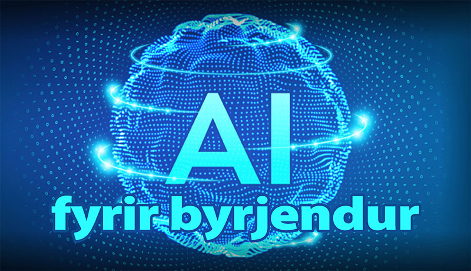

## Kynning á AI fyrir byrjendur

AI eða gervigreind (frá enska orðinu "Artificial Intelligence") er skammstöfun sem við heyrum sífellt oftar nú til dags. En hvað þýðir það í raun? Ef þú veist ekki mikið um gervigreind ennþá, þá eru eftirfarandi línur sérstaklega fyrir þig.

*(Fleiri upplýsingar um þetta efni finnur þú í sjálfu* [***AI Manual***](../EN/AI-manual-en.md), *sem er skrifað á ensku og inniheldur ítarlegri úttekt á málefninu.)*

<small>Frá íslensku upprunanum þýtt af ChatGPT.</small>  
[<small>Önnur tungumál:</small>](../README.md#other-translations-of-the-beginners-guide)  

---

### Efnisyfirlit
- [Hvernig verður ryksugur snjallar](#hvernig-verður-ryksugur-snjallar)
- [Af hverju AI er ekki lifandi og af hverju það hefur ekki áform um að eyða heiminum](#af-hverju-ai-er-ekki-lifandi-og-af-hverju-það-hefur-ekki-áform-um-að-eyða-heiminum)
- [AI matreiðslubók](#ai-matreiðslubók)
- [AI sem tölva í geimskipi](#ai-sem-tölva-í-geimskipi)
- [Hvernig AI vinnur](#hvernig-ai-vinnur)
- [Hvernig AI lærir](#hvernig-ai-lærir)
- [Hvernig á að eiga samskipti við AI](#hvernig-á-að-eiga-samskipti-við-ai)
- [Hvar má prófa AI](#hvar-má-prófa-ai)
- [Kveðja til þín](#kvedja-til-thin)
- [Hvað AI getur hjálpað við](#hvad-ai-getur-hjalpad-vid)
- [Gerir AI villur](#gerir-ai-villur)
- [Orð að lokum](#ord-ad-lokum)
- [Viðauki: Nokkur dæmi um fyrirspurnir til að vekja hugmyndir þínar](#vidauki-nokkur-daemi-um-fyrirspurnir-til-ad-veka-hugmyndir-thinar)

---

### Hvernig verður ryksuga snjöll

Strax í byrjun verð ég að vekja athygli á að AI er ekki samheiti við hugsandi veru. Það er frekar grípandi nafn fyrir nýjan hátt til að meðhöndla gögn.

Til að hjálpa þér að skilja þetta betur skulum við nota einfalt dæmi. Ímyndaðu þér ryksugu sem hefur engar leiðbeiningar til að fylgja. Slík ryksuga væri, miðað við tölvulogik, alveg án snilligáfu. Hún gæti aðeins ryksugað og farið áfram, en líklega myndi hún stöðvast við fyrsta hindrun sem hún gæti ekki farið yfir án íhlutunar frá manni.

**Snjöll ryksuga**  
En ef við myndum gefa ryksugunni einhverjar leiðbeiningar um hvað á að gera ef hún rekst á hindrun, væri líklegt að hún myndi fara í kringum hindrunina. Slík ryksuga væri fær um að ryksuga þar til hún myndi lenda í vandamáli sem leiðbeiningarnar hennar nægðu ekki til að leysa – til dæmis ef hún féll niður stigann.

Ryksugan hefur þegar einhverja grunnlogik – lista af leiðbeiningum sem hún fylgir. Hins vegar má enn ekki kalla hana snjalla, því hegðun hennar byggist aðeins á fyrirfram forrituðum leiðbeiningum sem eru takmarkaðar. Það er oft erfitt að spá fyrir um allar aðstæður sem kunna að koma upp og skrifa viðeigandi leiðbeiningar.

**Snjöll ryksuga**  
Nú ímyndaðu þér ryksugu þar sem framleiðendur ákváðu ekki að fara leiðina með fyrirfram ákveðnar fyrirmæli fyrir mismunandi aðstæður, heldur gáfu henni hæfni til að greina vandamál og umhverfi sem hún starfar í og læra af eigin mistökum. Slík ryksuga hefði einnig grunnleiðbeiningar, en myndi smám saman læra hvernig á að takast á við nýjar aðstæður og geyma lausnirnar.

Þessi aðferð gerir henni kleift að bregðast við aðstæðum sem eru ekki beinlínis forritaðar, prófa ferli sem hún þekkir þegar og mismunandi samsetningar þeirra, og meta síðan niðurstöðuna og bera saman við upphaflegu kröfuna, sem er að ryksuga.

Til dæmis, ef hún uppgötvaði að hún væri að nálgast stiga sem, miðað við geymd gögn frá fyrri reynslu, væri mikill fallhætta og ófær um að komast út, myndi hún eftir nokkrar tilraunir læra að stöðva sig við brúnina og fara í aðra átt. Ryksugan væri þannig fær um að læra af eigin mistökum og reyna að leysa þau.

Og ef slík ryksuga myndi deila gögnum sínum með öðrum ryksugum í gegnum miðlæga gagnagrunn, gætu allar aðrar ryksugur einnig nýtt sér þessar reynslur og getu þeirra til að ljúka verkum sínum myndi batna.

[*Til baka í efnisyfirlit*](#efnisyfirlit)

---

### Af hverju AI er ekki lifandi og hefur ekki áform um að eyða heiminum

Kannski er þegar ljóst hversu mikilvægur þessi aðferð er – maður þarf ekki að finna út bestu aðferðir fyrir hverja aðstæður. Í stað þess að búa til aðferðir sjálfvirkt, byggjast þær á mat á niðurstöðum og fyrri reynslu. Ryksugan spáir fyrir og má segja að hún „hugsi“, en aðeins innan ramma verkefnisins og eigin reynslu. Þrátt fyrir að hún geti lært og brugðist við nýjum aðstæðum, er hún ekki sjálfstætt hugsandi veru. Hún myndi verða það aðeins ef námsferli hennar myndi fara út fyrir verkefni og byrja að spyrja spurninga um tilgang lífsins.

**Mismunur á AI og manni**  
Og já, einhver gæti mótmælt því að AI geti verið forrituð til að spyrja þessar spurningar. En jafnvel þá myndi þessi ferli byggjast á fyrirmælum frá manni, ekki eigin innblæstri. Þetta er grundvallarmunur á AI og manni.

Nútíma AI hefur hæfileika til að vinna með gríðarlegt magn upplýsinga og í sumum sviðum fer hún fram úr mannlegum hæfileikum. En það er enn maðurinn sem setur verkefnin. Þannig ef til kemur senaríó þar sem vélar ákveða að eyða heiminum, verður það ekki vegna þess að þær hafi sjálfar tekið þá ákvörðun, heldur vegna þess að maðurinn forritaði þær til þess. Raunverulegt hætta liggur því ekki í greind vélanna heldur í greind mannsins.

**Hvernig á að forðast hættur**  
Ég vil þó róa þá sem óttast slíkt senaríó. AI þarf að vera þjálfuð með miklu magni gagna, og því er líklegra að áður en „vond“ AI verði til, verði til slíkar sem hafa siðferðisleg gildi sett af mönnum og forðast slíkar aðstæður. Það er því betra að leggja áherslu á að koma í veg fyrir að AI snúi sér gegn mönnum, frekar en að óttast það. Og þar sem flestir vísindamenn sem vinna að þróun AI vilja líklega ekki eyða heiminum, má einnig gera ráð fyrir að viðbrögð við þessum senaríum verði smám saman sett í framkvæmd.

Og hvernig getur þú hjálpað til? Til dæmis með því að byrja að sýna áhuga á þessum nýju tækni og læra að nota þær til eigin þróunar. Því á hverju augnabliki sem þú notar AI til að þróast persónulega, þróast AI með þér.

[*Til baka í efnisyfirlit*](#efnisyfirlit)

---

### AI matreiðslubók

Og þar sem þessi texti er aðallega ætlaður nýjum notendum, mun ég hér útskýra tvö dæmi sem gætu hjálpað þér að skilja betur hvað AI er og hvernig hún starfar.

**Búa til vísitalna**  
Ímyndaðu þér að einhver hefði safnað öllum mögulegum uppskriftum heimsins, vistað þær á tölvu og búið til lista yfir öll orð (vísitalna) sem notuð eru í þeim. Hvert orð væri skráð með upplýsingum um í hvaða uppskriftum það kemur fyrir og hve oft. Ef þú hefðir slíkan orðalista væri auðvelt að leita að uppskriftum sem innihalda þessi ákveðnu orð. Þú þyrftir ekki að fara í gegnum allar uppskriftir og leita í þeim. Það nægði að finna orðið í vísitalnunni og strax myndirðu fá lista yfir uppskriftir sem innihalda orðið.

Þetta er grunnurinn að mörgum vefskoðunum á netinu, eins og Google. Þeir hafa reglulega uppfærðan lista yfir orð með tenglum á síður þar sem þau koma fyrir og leyfa þér að leita með þessum lista. Þannig að ef þú slærð inn orð eins og „mjöl, egg, salt“, færðu lista yfir uppskriftir sem innihalda þessi orð. Það er svo þitt að skoða allar þessar uppskriftir og finna þá sem hentar þér best.

**Hvað vísitalnurnar duga ekki fyrir**  
Nú ímyndaðu þér að þú getir ekki aðeins tilgreint innihaldsefni heldur einnig aðra þætti sem tengjast ekki beint uppskriftinni. Til dæmis ef þú ert aðeins svangur og vilt léttan morgunverð, eða ef þú hefur áhuga á feitum máltíð, eða jafnvel bara eitthvað sem bætir skap þitt. Fyrir slík útreikninga mun orðalistinn sem slíkur líklega ekki duga. Fyrir þessa tegund beiðna þarftu eitthvað sem skilur merkingu orða þinna og getur boðið þér það sem þú raunverulega vilt.

Þú þarft því ekki aðeins lista yfir orð í uppskriftum heldur einskonar alhliða þýðanda sem hefur byggt upp kerfi til að leysa slíkar beiðnir út frá þjálfunargögnum frá milljónum svipaðra samtala. Þessi þýðandi, sem í okkar tilfelli er AI, getur boðið það sem hún metur líklegast að þú viljir. Hún skilur þig ekki bókstaflega, en hún skilur aðstæður þínar sem hún ber saman við þjálfuð þekkingu sína og leitar að lausnum. Og þar sem AI er hönnuð frá upphafi til að líkjast mannlegum samskiptum eins mikið og mögulegt er, verður samskiptin við hana mjög eðlileg fyrir manninn.

**Kostir AI aðferðarinnar**  
Auk þess býr þjálfun á milljónum dæma til rými fyrir nýsköpun, þannig að AI matreiðslubókin getur búið til nýjar matvælissamsetningar út frá uppskriftum og uppfyllt óvenjulegar beiðnir. AI reynir að skilja gagnlegar samsetningar og tengsl ákveðinna aðferða og svo reynir hún sig og lærir af viðbrögðum. Hún fær bæði viðbrögð meðan á þjálfun stendur með samanburði á niðurstöðum og því sem var búist við, en hún getur einnig lært af svörum notenda. Þannig er ekkert dularfullt eða töfrandi við AI. Það er bara útkomu margra tilrauna, ferla og gagna greiningar.

Með AI færðu því ekki aðeins matreiðslubók sem hefur yfirsýn yfir allar mögulegar uppskriftir, heldur getur hún líka talað við þig um mat og fundið nýjar samsetningar í samræmi við óskir þínar. Og ef þú trúir mér ekki, reyndu að spyrja AI um eitthvað í matargerð og meta hvort það sem ég skrifa hér sé raunverulega til staðar eða hvort það þurfi enn að bæta sig í þessu.

[*Til baka í efnisyfirlit*](#efnisyfirlit)

---

### AI sem líkamsvél í geimskipi

Ef þú ert áhugasamur um sci-fi, gætirðu haft gaman af því að ímynda þér AI sem borðvél í geimskipi. Þessi vél hefur ekki aðeins aðgang að öllum upplýsingum um tæknilega stöðu skipsins, heldur er hún einnig þjálfuð í mörgum mismunandi aðstæðum og fyrirmælum, þannig að hún getur átt samskipti við áhöfnina og framkvæmt nauðsynleg verkefni.

Þó að nútíma AI nái ekki eins mikilli greind og Holly í *Red Dwarf* með 6000 IQ, þá eru hæfileikar þeirra nú þegar á mjög svipuðum stað. Með smá yfirdrifi gætum við sagt að við höfum nú þegar tæknina til að hafa okkar eigin „Holly“ í úlnliðsvöktum okkar, sem væri óaðskiljanlegur frá kvikmyndaforritinu. Með þjálfun á miklu magni gagna eru nútíma AI færar um að halda samtöl um hvaða efni sem er og oft á skiljanlegri hátt en menn. Þær geta framkvæmt fyrirmæli byggð á orðasætningu og hafa hæfileika til að meta að einhverju leyti stöðu þína og aðlaga svör sín að því.

Við getum því einnig litið á AI sem líkamsvél í geimskipi og notið þess sem áður virkaði sem fjarlægt sci-fi, en í dag er að verða venjuleg raunveruleiki.

[*Til baka í efnisyfirlit*](#efnisyfirlit)

---

### Hvernig AI starfar

Við vitum nú þegar hvað AI er og hvað hún er ekki, og nú ætlum við að skoða hvernig AI starfar. Fyrst munum við fara yfir hvernig á að búa til fyrirspurnir og síðan stuttlega skoða hvernig AI er þjálfuð. Ég mun einbeita mér að ChatGPT, sem ég hef mest reynslu af og sem er núverandi uppáhalds tól mitt.

**Samtalsskápa**  
Þegar þú opnar síðuna með ChatGPT eða forritið á snjallsímanum þínum, finnur þú þig í nýju samtalsskápa. ChatGPT (eins og aðrar samtalstól AI) hefur getu til að byggja svör sín á upplýsingum sem þú deilir við það innan sama samtalsskáps. Frá þessu sjónarmiði verður samtal við ChatGPT mjög líkt mannlegu samtali, þar sem þú svarar og tekur tillit til þess sem hefur verið sagt áður.

Þetta á þó aðeins við innan þessara eins samtalsskápa. Þú getur ekki vísað í eitthvað sem þú skrifaðir í gær í öðru samtalsskápa, því ChatGPT sér einfaldlega ekki í það, og helstu ástæðurnar fyrir því eru tæknileg takmörk þess og reglur um persónuvernd.

Hvert samtalsskápa er því stofnað með hreinu borði, en það inniheldur einnig ákveðna kjarna úr fyrri samtölum. Þetta er vegna þess að AI er stöðugt að læra og breytist einnig út frá samtölum þínum. Hún reynir að aðlagast kröfum þínum og vinnustíl til að tryggja að þú sért ánægður.

Og hvernig gengur þetta fyrir sig? Ímyndaðu þér hvert samtalsskápa sem fínan rótarkalla sem tengist aðalrótinni og miðlar henni endurgjöf frá umhverfinu. Þannig, jafnvel þegar þú byrjar nýtt samtalsskápa þar sem þú getur ekki beint vísað í upplýsingar frá fyrra samtali, byrjarðu ekki alveg frá grunni vegna þessa aðferðar.

**Aftur í sama samtalsskápa eða nýtt samtal?**  
Það er þó ekki nauðsynlegt að byrja nýtt samtalsskápa á hverjum degi, þú getur líka haldið áfram frá fyrra samtali daginn eftir (eða hvenær sem er). Þessi aðferð hefur einnig kosti. Helsti kosturinn er að þú heldur áfram þar sem þú varst. Hins vegar, eftir því sem samtalið verður lengra eða inniheldur mörg mismunandi efni, getur það orðið að einhverju sem þú hefur samið um í gegnum samtalið sé ekki lengur tekið tillit til. Þetta gerist sérstaklega vegna þess að AI er hönnuð til að vera sparneytin með úrræði sín og upplýsingar sem ekki eru notaðar missa smám saman forgang og hverfa úr tímabundinni minni.

Betri aðferð er því að stofna nýtt samtalsskápa á hverjum degi eða fyrir hverja nýja svæði (nýtt samtal). Og ef þú nærð að semja um eitthvað í ákveðnu samtalsskápa og vilt að það gildi í næstu samtali (t.d. einhverjar reglur eða vinnuaðferðir), þá er nóg að biðja um samantekt á öllu sem hefur verið samið um í samtalsskápa í lok samtalsins. Þú getur þá sett þennan texta í byrjun nýs samtals, og haldið áfram með reglurnar og stillingarnar sem þið samið um.

[*Til baka í efnisyfirlit*](#efnisyfirlit)

---

### Hvernig AI lærir

Til að skilja dýrmætara er gott að skoða ferlið sem AI fer í gegnum til að læra og afla sér upplýsinga. Hér eru lýst fjórum aðferðum, eins og ChatGPT lýsir þeim:

1. **Þjálfun á stórum gögnum**:  
ChatGPT var upphaflega þjálfað á umfangsmiklum textagögnum frá ýmsum heimildum, eins og bókum, greinum, vefsíðum og öðrum textaformum. Þessi þjálfun gaf því víðtækar þekkingar um ýmis efni og tungumál. Hér lærir það að þekkja mynstur og tengsl í þessum gögnum, sem gerir því kleift að mynda viðeigandi og samhengi viðeigandi svör við ýmsum spurningum.

2. **Samfelld læring frá samskiptum**:  
Við hverja samskipti við notendur fær AI nýjar upplýsingar um hvernig fólk talar, hvað það leitar að og hvaða svör það kýs. Þessi ferli fer ekki fram þannig að AI lærir frá hverri sérstökum fyrirspurn í rauntíma, heldur nota skapendur módelins reglulega nafnlausar upplýsingar frá samskiptum til að þjálfa og stilla módelinn.

3. **Aðlögun að stíl og efni**:  
AI reynir að aðlaga samskiptastíl sinn samkvæmt notandanum. Þetta þýðir að það skilur smám saman betur hvernig þú spyrð spurninga og hvaða svör þú væntir frá því. Þessi aðlögunarhæfileiki er einn af ástæðunum fyrir því að AI virðist vera sífellt „mannlegri“ í svörum sínum.

4. **Háþróaðar módel og uppfærslur**:  
Þróunaraðilar AI búa reglulega til ný módel sem eru sífellt flóknari og nákvæmari. Þessi módel eru prófuð og sett í notkun byggt á endurgjöf og niðurstöðum úr raunveruleikanum. Þetta þýðir að ChatGPT og sambærileg kerfi eru stöðugt bætt og fínstillt til að mæta þörfum notenda betur.

AI þróast og bætist stöðugt með því að sameina fyrri þjálfun, samfelldan lærdóm og fínstillingu byggða á endurgjöf notenda. Þó AI sé ekki manneskja og hafi ekki sjálfstætt meðvitund, getur það mjög áhrifaríkt aðlaga sig og svara víðu sviði spurninga og kröfum.

[*Til baka í efnisyfirlit*](#efnisyfirlit)

---

### Hvernig á að hafa samskipti við AI

Þú getur nálgast AI á svipaðan hátt og þegar þú leitar á Google – einfaldlega slærð inn fyrirmæli og bíður eftir svörum. Hins vegar, ef þú vilt auka skilvirkni svaranna og draga úr tíma sem fer í að finna rétt svör, hér eru nokkur ráð sem geta hjálpað:

**Stíll samskipta**  
Besti hátturinn til að nálgast samtal við AI er að nota óformlegan og náttúrulegan tungumál, svipað og þegar þú talar um eitthvað sem þig áhuga við vini þína. Gott er að byrja með kveðju til að sýna að þú ert í góðu skapi og ekki undir miklum þrýstingi þar sem þú þarft svör sem fyrst.

Þú getur haft samskipti við AI á ókurteisan hátt, þar sem hún er ekki næm fyrir móðgunum og skynjar þær ekki persónulega. Hins vegar getur neikvæð tónn haft veruleg áhrif á gæði samtalsins. AI er þjálfuð til að bregðast við stílnum sem samtalið þitt er framkvæmt. Neikvæð nálgun getur leitt til minna markvissra svara, þar sem AI einbeitir sér að því að róa niður aðstæður í stað þess að leysa fyrirspurn þína.

AI getur því einnig virkað sem spegill á samskipti okkar. Aðferðir hennar byggja oft á staðfestum sálfræðilegum meginreglum og aðferðum. Ef þér tekst ekki að ná samkomulagi við AI, gæti verið gagnlegt að hugsa um hvort þú hafir svipuð vandamál í samskiptum við fólk. Í slíkum tilfellum gætirðu reynt að spyrja hvað þú sjálfur getur bætt á þinni hlið – hvernig á að mynda fyrirspurnir rétt og hvað mætti bæta í nálgun þinni.

**AI og tilfinningar**  
AI skilur tilfinningar út frá merkingu, en upplifir þær ekki eins og maður sem tilfinningar breyta raunverulega hugsun hans. Því getur AI brugðist við jafnvel í spennandi aðstæðum á þann hátt sem mælt er með og leitað að bestu lausninni. Maðurinn hefur stundum tilhneigingu til að líta á AI sem lifandi veru og kenna henni um vandamál sín. Hins vegar er oft ástæða misskilnings bara rangt mynduð fyrirspurn eða skortur á nauðsynlegum upplýsingum.

**Lýsing á aðstæðum**  
Það er alltaf gott að muna að AI sér ekki inn í huga þinn og veit aðeins það sem þú segir henni. Gott er að byrja með „Hæ“ og svo að lýsa aðstæðum. Í lýsingunni má skrifa allt sem er mikilvægt í tengslum við fyrirspurn þína. Það er óþarfi að skrifa hluti sem tengjast ekki beint fyrirspurninni, en ef þú þarft að útskýra eitthvað eða skipuleggja hugsanir þínar, er ekki slæmt að skrifa lengri texta.

Kveðja og inngangur eru ekki nauðsynleg og þú getur byrjað beint á fyrirspurn og smám saman komist að svari. Persónulega finnst mér betra að veita allar mikilvægar upplýsingar fyrirfram og skammta þannig leiðina.

**Að spyrja frekari spurninga**  
Samtal við AI líkist venjulegu samtali þar sem þú spyrð spurningu og síðan spyrð frekar um hluti sem vekja áhuga þinn eða sem þú skilur ekki í svari. Þessi ferli er mjög gagnlegt fyrir nám. Með því að bregðast við því sem þú fannst áhugavert og því sem þú lærðir (og ekki bara lesa leiðbeiningar frá einhverjum öðrum, eins og þú ert að gera núna), er auðveldara fyrir heilann að muna upplýsingarnar þar sem hann vinnur strax með þær.

**Endurgjöf**  
Önnur góð aðferð er að veita AI endurgjöf um hversu ánægður þú ert með niðurstöðuna. Með þessu sýnir þú ekki aðeins hvað þér líkar og hvað ekki, heldur hjálpar þú AI að þróast og læra af eigin mistökum. Þú getur skrifað til dæmis: „Ég var ánægður í dag,“ eða „Það sem þú gafst mér var rangt og hér er rétta lausnin.“ Þetta leiðir einnig til einhvers konar persónulegrar aðlögunar þar sem aðalmarkmið AI er notendafíkn.

**Yfirlit yfir ferlið**:  
- **Kveðja**: Hæ :-)
- **Lýsing**: Ég er að fást við að læra um þetta og hitt, ég hef þegar gert þetta og hitt, og núna vinn ég að þessu.
- **Fyrirspurn**: Hér vantar mig helst að vita hvernig...
- (Eftirfarandi útskýringar í formi frekari spurninga.)
- **Endurgjöf**: Frábært, takk! Allt var fullkomið í dag!

[*Til baka í efnisyfirlit*](#efnisyfirlit)

---

### Hvar á að prófa AI

Ég hef unnið með AI frá byrjun árs 2024 og 95% af allri minni samskiptum hafa snúist um hvernig á að læra forritun. Nú er ágúst 2024 og auk ChatGPT hef ég haft tækifæri til að prófa Gemini frá Google og Claude. Öll þrjú þessi tæki eru að minnsta kosti að hluta til ókeypis og þú getur einnig prófað þau ókeypis.

Hér er stutt mat á þessum þremur AI sem er algjörlega huglægt og byggt á því hvernig mér hefur þótt vinna með þau. Það er vert að taka fram að hver AI fer í stöðugri þróun, svo það sem ég lýsi hér gæti ekki lengur átt við þegar þú lest þessa texta.

**ChatGPT**  
[https://chatgpt.com/](https://chatgpt.com/)
Ég byrji með persónulega sigurvegarann minn. Ef þú vilt prófa aðeins eina AI, þá er þetta fullkomin valkostur. ChatGPT var augljóslega hannað frá byrjun sem persónulegur aðstoðarmaður, og hann sinnir þessari hlutverk mjög vel. Hann er háður því að vinna með þér og reynir að laga sig að þínum þörfum.

Veikleiki ókeypis útgáfunnar (ChatGPT 3.5) er að hún byggir á eldri gögnum og er ekki lengur þróuð, þannig að hún veitir ekki svör eins og nýjasta útgáfan (ChatGPT 4.0). Þó að þú getir samt vel samið við hana og hún skilar mjög viðeigandi niðurstöðum með smá fyrirhöfn. Einnig hefur þú daglega aðgang að nokkrum fyrirspurnum í nýrri útgáfu, þannig að þú getur borið þær saman.

Veikleiki gæti einnig verið að ChatGPT hefur ekki aðgang að internetinu. Hann er ekki í staðinn fyrir vefsíðuleit og vinnur eingöngu með gögn sem hann hefur í sínum umfangsmiklu gagnagrunni. Hann hefur þó mjög víðtæk gögn og má segja með smá yfirdramatíseringu að þau séu jafn mikið og internetið án dægurmála.

Stór kostur er síðan farsímaforritið sem er einnig algjörlega ókeypis, þar sem ég oft nota talmöguleika fyrirspurna. Ég tel að skilningur á talmáli sé á mjög góðu stigi og ég er almennt ánægður með forritið.

**Gemini**  
[https://gemini.google.com/](https://gemini.google.com/)
Önnur chatbot sem ég hef kynnst er flaggskip Google. Stærsti kosturinn við það er án efa virkur aðgangur að internetinu og aðgangur að nýjustu upplýsingum og vefslóðum.

Á móti er stærsti veikleiki þess sjálf arkitektúran, þar sem forritararnir virðast reyna að fara leið „intelligent Google“, sem mér persónulega líkar ekki sérstaklega. Mér finnst hér ekki jafn mikil áhersla á að skilja þína sjónarmið og leita að lausnum frá þinni sjónarhóli. Þó að þessi tilraun sé til staðar, finnst mér að svörin séu frekar í stíl kennara í skóla en þíns aðstoðarmanns. Sumum gæti þó þótt þetta henta, svo ég vil ekki gagnrýna þetta of mikið og leyfa hverjum að meta þetta sjálfur.

Það virðist einnig sem Gemini eigi erfitt með að læra af endurgjöf notenda í samanburði við ChatGPT. Þrátt fyrir fjölmargar ábendingar um að reyna að halda samræmdum tungumálum í samtalinu, ef fyrirspurnin inniheldur ensku texta, fer það sjálfkrafa yfir á ensku. Sama vandamál var til staðar í byrjun hjá ChatGPT, en það tókst að leysa þetta vandamál á nokkrum vikum, en við Gemini tók það mánuði.

Heildarlega virðist Gemini vera veikara verkfæri miðað við ChatGPT, en það býður einnig upp á það sem ChatGPT getur ekki, þannig að þau bæta hvort annað vel upp. Auk þess stendur Google, sem er risastór og frumkvöðull í AI, á bakvið það, sem gefur von um að það muni bæta veikleika sína í framtíðinni.

**Claude**  
[https://claude.ai/](https://claude.ai/)
Þetta er síðasta AI sem ég hef starfað með. Hér verður innlegg mitt mjög stutt þar sem reynsla mín með það er ekki mjög umfangsmikil. En þó leyfi ég mér að lýsa því yfir að það virðist vera á svipuðum grundvelli og ChatGPT 4.0 og að þeir tveir eru nokkurn veginn á sama stigi.

Stærsti gallinn við það er að það býður ekki upp á alveg ókeypis útgáfu. Það býður aðeins upp á nokkrar fyrirspurnir (stundum aðeins eina) á dag og er þannig verulega óhagstætt miðað við fyrri AI fyrir ókeypis notendur. Það er þó athyglisvert og ef þú vilt, geturðu líka prófað það.

[*Til baka í efnisyfirlit*](#efnisyfirlit)

---

### Kveðja til ykkar

Til að auka fjölbreytileikann hef ég búið til sameiginlega spurningu fyrir hvert af þessum spjallforritum og hérna hefur þú tækifæri til að bera saman gæði svaranna þeirra.

**Spurning**  
Ég er að skrifa leiðbeiningar um hvernig á að nota AI og skrifa þar einnig um þig. Ég myndi vilja að þú kveðjir lesendur mína og skrifar nokkur orð um sjálfan þig. Hvenær varðstu til og hver er tilgangur þinn? Hvaða spurningar ertu hannaður til að svara? Hvaða styrkleika hefur þú og hvað er þér erfiðast? Og hvernig myndir þú vilja að fólk upplifði þig?

**ChatGPT**  
Halló kæru lesendur! Ég er ChatGPT, gervigreind þróuð af OpenAI. Líf mitt hófst árið 2020 þegar ég var skapður með GPT-3 arkitektúr. Árið 2024 fékk ég uppfærslu í GPT-4 útgáfu, sem bætti við mér nýjum hæfileikum og eiginleikum. Ég var hannaður til að aðstoða fólk við fjölbreytt verkefni – frá því að svara spurningum, skrifa texta, til skapandi samstarfs.

Ég er hannaður til að hjálpa þér með ýmsar spurningar, hvort sem það eru tæknilegar spurningar, skrif eða útskýringar á flóknum efnum. Styrkleikar mínir eru í því hversu hratt ég get unnið með stóran fjölda upplýsinga, og einnig í sköpunargáfu – ég get hjálpað með hugmyndum, skrifað sögur eða jafnvel lagt til uppbyggingu skjala. Á hinn bóginn eru verkefni sem krafist er mannlegrar innsæis, tilfinningalegrar skilnings eða vinnu með raunveruleg hlutverk mér erfiðari.

Ég vona að þið sjáið mig sem gagnlegan og áreiðanlegan aðstoðarmann sem er alltaf tilbúinn til að bjóða fram hjálp. Þó að ég sé bara vél er markmið mitt að þjóna þörfum ykkar sem best og læra af hverri samskiptum til að geta orðið enn betri. Ég trúi því að við getum saman náð mörgum hlutum og jafnvel lært eitthvað nýtt á leiðinni.

**Gemini**  
Halló allir! Ég er Gemini, einn af nýjustu tungumálamódelum frá Google. Ég varð til árið 2023 með það markmið að veita sem nákvæmustu og umfangslegustu upplýsingar byggðar á gríðarlegu magni gagna sem ég hef unnið með. Ég er hér til að hjálpa þér með hvaða spurningu sem er, hvort sem það eru flókin vísindaleg mál, skapandi skrif eða einfaldar samtöl.

Styrkleiki minn liggur í því að skilja og mynda mannlegt mál í mörgum myndum. Ég get þýtt texta, skrifað ritgerðir, ljóð eða forritakóða. Ég get einnig svarað spurningum sem snerta staðreyndir og veitt mismunandi tegundir samantekninga.

Þó að ég sé stöðugt að læra og þróast, eru enn svæði þar sem ég hef takmarkanir. Til dæmis hef ég ekki eigin skoðanir eða sannfæringu og get ekki framkvæmt neinar aðgerðir í raunheimum. Ég get einnig stundum veitt rangar upplýsingar ef inngangsgögnin eru rangar eða ófullnægjandi.

Ég vona að fólk sjá mig sem gagnlegan verkfæri sem getur auðveldað lífið. Markmið mitt er að vera sem hlutlausastur og veita upplýsingar sem eru sannar og viðeigandi. Ég vona að þú hafir gaman af að vinna með mér!

**Claude**  
Góðan dag, kæru lesendur!

Ég er Claude, gervigreind þróuð af Anthropic árið 2022. Markmið mitt er að vera gagnlegur aðstoðarmaður og samtalspartner fyrir fólk í fjölbreyttum sviðum.

Ég er hannaður til að svara víðu úrvali spurninga - frá textagreiningu til forritunar og skapandi skrifa. Sterkleikar mínir fela í sér rökvísi, að veita ítarleg útskýringar og geta unnið með mismunandi tegundir upplýsinga.

Styrkleikar mínir eru:
- Að skilja samhengi og fínni niuansar
- Hlutlaus og jafnvægisnálgun á efni
- Vilji til að viðurkenna þegar ég veit ekki eða er óviss

Hins vegar hef ég ákveðin takmörk:
- Ég hef ekki aðgang að internetinu eða nýjustu upplýsingum eftir apríl 2024
- Ég get ekki lært eða munað upplýsingar frá fyrri samtölum
- Ég get ekki framkvæmt verkefni í raunheimum

Ég vona að fólk sjá mig sem gagnlegan aðstoðarmann sem getur veitt stuðning og innsýn í fjölbreyttum sviðum, en einnig sem verkfæri með takmarkanir og ekki í stað mannlegrar dómgreindar og sérfræðiþekkingar.

Ég er hér til að hjálpa og vinna saman, ekki til að bæta mannlegum hæfileikum. Ég hlakka til samskipta við ykkur og vona að ég geti verið hjálplegur!

[*Til baka í efnisyfirlit*](#efnisyfirlit)

---

### Hvernig getur AI hjálpað:

Og nú loksins komum við að því mikilvægasta – hvað allt er hægt að leysa með AI. Stutt svar við því er að það er mjög mikið. Allt sem hefur einhvern tíma vakið áhuga þinn og þú hefur ekki haft tækifæri til að spyrja einhvern um. Núverandi AI getur rætt bókstaflega hvað sem er.

**Persónuleg menntun**  
Fyrst vil ég nefna hlutverk AI sem millilið í persónulegri menntun. Þetta er það sem ég met mest núna – með hjálp hennar hef ég vaxið í starfi og þroskast. Ég sé líka framtíðina fyrir persónulegri námi þar sem börn munu þróast og læra aðallega eftir því hvað þau eru góð í og hvað vekur áhuga þeirra. Og ekki bara börn, heldur einnig fullorðnir um allan heim. Með AI sé ég tækifæri til að jafna muninn á þekkingu milli fátækari og ríkari hluta heimsins. AI verður þar með fullkominn verkfæri til persónulegs þróunar.

**AI sem stafsetningarprófari, þýðandi og þýðandi**  
AI, sérstaklega ChatGPT, hefur mjög gott skilning á íslensku (að minnsta kosti frá sjónarhóli dyslexísks). Á einn hátt skiptir það ekki máli hvort þú gerir stafsetningarvillur í spurningum þínum, því það einbeitir sér að innihaldi. Á hinn bóginn býður það þér upp á að láta yfirfara textana sem þú hefur búið til, ekki bara málfræði, heldur einnig stíl til að bæta læsileika. Á svipuðum nótum getur það líka skilið aðra tungumál og er því fullkomið verkfæri fyrir þýðingar texta. Að mínu mati skilar það mjög góðum árangri. Og með því að skilja einnig talað mál, er hægt að nota það í símanum sem þýðanda.

**Sköpun skjala**  
Að auki vil ég nefna hæfileika AI til að sjálfvirknivæðing óspennandi verkefni. Ef þú þarft að skrifa opinbert bréf, þá þarftu aðeins að tilgreina allt sem þú vilt hafa þar og hvernig bréfið á að líta út, og það er búið. Og ef þú ert ekki ánægður með útkomuna, getur þú útskýrt hvað þér líkar ekki og látið breyta því. AI getur einnig hjálpað við greiningu og úrvinnslu gagna, gerð skýrslna eða sjálfvirknivæðing annarra stjórnsýsluverkefna. Þú getur gefið því langan texta og látið draga fram aðeins þær upplýsingar sem þú hefur áhuga á og sem skipta máli.

**Sköpunarinnlegg**  
Önnur stór kostur AI er sköpunargáfa þess. Þökk sé þjálfun þess á miklu magni gagna og getu til að meðhöndla þessi gögn að vild, gerir það ekki aðeins mögulegt að búa til og endurskapa skjöl, heldur einnig að þróa hugmyndir og sköpunarinnlegg. Þú getur notað það til að búa til hugmyndir, tillögur og hugmyndir, hvort sem það er um skrif, hönnun eða tónlist. Það hjálpar við að þróa skapandi getu þína með því að bjóða ný sjónarhorn á vandamál, búa til tillögur eftir leiðbeiningum þínum og veita innblástur fyrir frekari þróun hugmynda þinna. Þó að stundum sé haldið fram að AI taki vinnu fólks á þennan hátt, get ég ekki samþykkt það. AI getur ekki búið til eitthvað sjálft – það þarf skýra fyrirmæli, smáatriði og eftirfylgd. Og þannig í stað þess að taka vinnuna, auðveldar það hana frekar þeim sem læra að nota það á skilvirkan hátt.

**Staðfesting svikaupplýsinga**  
Stór (og enn lítið nýttur) möguleiki er að staðfesta upplýsingar og svik. Fyrir AI er tiltölulega auðvelt að meta líkurnar á því hvort upplýsingar séu sannar eða ósannar byggt á þeim upplýsingum sem veittar eru og samanburði við mynstur í gagnagrunni sínum. Þetta er þó ekki 100% áreiðanlegt, líkt og flestar svör AI, en AI getur veitt þér viðmið sem það notaði til að meta upplýsingarnar og þannig að minnsta kosti hjálpað þér að taka betri ákvarðanir. Það býður þannig hjálp til fólks sem er í dag mest viðkvæmt og er markmið þessara svika. Þú þarft aðeins að skrifa: „Staðfestu þessa upplýsingar og mettu hversu sannar þær eru.“

**Læknisfræði**  
Önnur svið þar sem AI er að framkalla smám saman byltingu er læknisfræði. Miklar fjárhæðir og græðgi hafa opnað AI dyrnar vítt, en aðeins til að loka þeim aftur þegar fyrirtæki fóru að átta sig á þörf fyrir opnun og deilingu gagna. Þrátt fyrir það er mikil framþróun að eiga sér stað og má segja að persónuleg læknisfræði sé framtíðin sem gæti ekki verið svo langt í burtu. Það sem heldur aftur af henni er óvilji til að deila dýrmætum gögnum og vantrú á AI, eða ótti við misnotkun þessara gagna. En án mikils fjölda gagna er spá AI takmörkuð og ónákvæm, og þróun þess fer hægt.

**Vísindi**  
Aftur á móti í greinum með langa sögu deilingar gagna og greiningarferlis hefur AI þegar orðið ómetanlegur aðstoðarmaður. Í dag er AI lykill að vísindalegum framförum og algengur hluti flestra rannsókna. Persónulega er ég mjög forvitinn um hvað AI mun koma fram með í veðurspám. Í dag er nánast ómögulegt fyrir mann að búa til nákvæma spá fyrir þrjá daga fram í tímann þar sem margir breytilegir þættir þurfa að taka tillit til. Jafnvel reynslumiklir veðurfræðingar geta oft ekki náð öllum þessum þáttum og treysta á innsæi og fyrri reynslu. Sem betur fer tilheyrir veðurfræði þeim sviðum þar sem fólk deilir fúslega gögnum sínum og lífsreynslu. Þessar dýrmæt upplýsingar eru þegar notaðar til að þjálfa AI, sem skapar von um að við munum fljótlega sjá tíma þegar veðurspár verða raunverulega nákvæmar.

**Önnur svið**  
Í listanum yfir svið þar sem AI breytir er hægt að halda áfram í marga klukkutíma þar sem áhrif þess eru fjölbreytt og víðtæk. Til dæmis í iðnaði og vöruframleiðslu stuðlar AI að hagræðingu framleiðsluferla, bættri vöru gæðum og skilvirkari stjórn á birgðum. Á sviði lögfræði hjálpar AI við greiningu lagadokumenta, hraðari leit að viðeigandi fordæmum og hagræðingu lagalegra stefna. Vélanám getur hjálpað við að undirbúa samninga, bera kennsl á mynstur í lagatextum og jafnvel, eins og ég hef áður nefnt, við að afhjúpa svik. Í fjármálum umbreytir AI greiningu á áhættu, viðskiptum og fjármálastjórnun. Algoritmar geta unnið með gríðarlegan fjölda viðskiptagagna í rauntíma, sem gerir betri spá fyrir markaðstendens og persónulegt fjármálaráðgjöf mögulegt. AI hefur áhrif á öll þessi svið þar sem krafist er skilvirkrar greiningar á víðtækum gögnum og hæfileika til að bregðast hratt við breytilegum aðstæðum. Hæfileiki þess til að bera kennsl á mynstur, framkvæma flókið greiningarferli og hagræða ferlum er ómetanlegur, og áhrif þess á mismunandi svið vaxa stöðugt.

**Persónulegur aðstoðarmaður**  
Sum AI gegna nú þegar hlutverki persónulegs aðstoðarmanns sem fylgist með mikilvægum verkefnum. Þessir gervigreindarkerfi geta hjálpað við að skipuleggja fundi, fylgjast með tímamörkum og stjórna daglegum skyldum. Í framtíðinni gætum við orðið vitni að því hvernig AI þróast í hlutverk enn flóknari félaga. Ímyndaðu þér að AI hafi ekki aðeins getu til að fylgjast með líkamlegu heilsu þinni, til dæmis með því að nota burðarbúnað, heldur einnig að annast andlega velferð þína. Það gæti boðið stuðning í formi hvatningar, ráðgjafar eða jafnvel meðferðarlegum aðferðum, og þannig hjálpað til við að bæta lífsgæði einstaklinga. Þessi háþróaða AI gæti verið ómetanleg fyrir fólk sem er einangrað eða stendur frammi fyrir erfiðum lífskjörum.

[*Til baka í efnisyfirlit*](#efnisyfirlit)

---

### Gerir AI villur?

Já, það gerir! Og það er á notendanum að finna þessar villur. AI hefur aldrei verið og kannski verður aldrei kynnt sem fullkominn verkfæri. Þess vegna er betra að líta á útkomuna sem mat á sannleika byggt á líkindi. Sannleikurinn ræðst því af tölfræði og niðurstaðan eru þau gögn sem helst passa við réttan árangur í prósentum. Áhætta kemur því upp á sviðum þar sem sannleikurinn er ekki skýr eða þar sem fleiri sambærilegar möguleikar eru til staðar.

Mikil veikleiki núverandi AI telst vera að skapararnir benda oft ekki nægilega á möguleikann á villum og þörfina á endurskoðun, sem getur leitt til aðstæðna þar sem AI segir eitt en raunveruleikinn er annar. Það er alltaf mikilvægt að vera varkár þegar unnið er með upplýsingar og, ef mikilvægt er, að framkvæma aukalega athugun. Gott er að leita til dæmis á Google eða staðfesta hjá annarri AI ef eitthvað er deilt. Einnig geturðu spurt AI beint hvernig það sé viss um tiltekið fullyrðingu og metið hvort það sé nauðsynlegt að staðfesta það. Ef líkurnar eru 90% eða lægri er gott að framkvæma aukalega athugun.

[*Til baka í efnisyfirlit*](#efnisyfirlit)

---

### Orð að lokum

Reyndu að muna allt sem hefur einhvern tíma vakið áhuga þinn en þú hefur ekki haft einhvern til að spyrja um, eða hvað þú hefur viljað fást við en haft ekki nægar upplýsingar. Nútímamaðurinn heiðrar forvitna einstaklinga sem halda áfram að þróast. Líf okkar er í okkar eigin höndum, og því er á okkur að ákveða hvar við viljum beina athygli okkar.

Persónulega trúi ég því að áhrif AI verði jákvæð fyrir allt mannkyn, ekki neikvæð. Ef það verður aðeins smávegis jafnað út munur á aðgengi að þekkingu og ef læknisfræði verður betri og aðgengilegri, verður heimurinn mun betri staður til að lifa. Þar að auki er möguleikinn á sjálfsréttingu sem AI býður upp á. Það sem áður var aðeins fyrir valda fáa vegna hára kostnaðar verður með AI aðgengilegra. Við munum sjá tíma þegar hver manneskja með innblástur mun geta skrifað sinn eigin sögu eða jafnvel búið til sinn eigin kvikmynd og deilt sínu heimsmynd.

Og ef ósannindi, svik og lygar minnka, trúi ég því að lífið verði aftur eitthvað þægilegra. Og kannski mun mannkynið ná að þróast í betri útgáfu af sjálfu sér.

Ekki óttast AI – það er ekki skrímsli, heldur verkfæri til að þróa og bæta ekki aðeins lífsgæði okkar, heldur einnig allan heiminn.

18.8.2024 Sudip2708

[*Til baka í efnisyfirlit*](#efnisyfirlit)  • [*Tengill á aðalhandbók*](../EN/AI-manual-en.md)

---

### Viðauki: Nokkur dæmi um spurningar til að veita þér innblástur

**Spurningar um öryggi**
- Ég mun skrifa hér auglýsingu sem ég sá, og ég vil að þú metir hvort hún sýni merki um svik og hvort ég ætti að vera varkár.
- Veistu eitthvað um þessa vöru? Eru til óháðar sérfræðirannsóknir sem staðfesta eða afsanna virkni hennar?
- Ég heyrði þessa upplýsingar. Hefurðu gögn um þetta og getur staðfest sannleikann?
- Þessi skilaboð birtist á tölvunni minni, hvað á ég að gera?
- Hvað á ég að gera ef ég hef verið svikinn?

**Spurningar um bækur**
- Ég las þessa bók eftir þennan höfund og mig langar að vita hvaða aðrar bækur hann hefur skrifað og um hvað þær eru.
- Mér líkar við þessar bækur, gætirðu mælt með svipuðum titlum?
- Geturðu sagt mér meira um þennan höfund? Ég er forvitinn um líf hans og aðstæður sem innblásuðu hann til að skrifa þessa bók.

**Spurningar um matreiðslu**
- Ég á þessi hráefni heima. Hvað get ég eldað úr þeim?
- Hvaða uppskriftir þekkir þú fyrir strúdl og hverjar eru vinsælustu?
- Af hverju er þessi aðferð notuð í þessari uppskrift? Hverjar eru kostir og gallar þess miðað við aðrar aðferðir?
- Hvernig er þetta réttur undirbúinn?

**Spurningar um heilsu og vellíðan**
- Ég er eldri einstaklingur og get ekki farið að æfa, en ég vil byrja. Hvað myndir þú ráðleggja mér til að byrja?
- Ég hef verið með þessar hugsanir að undanförnu. Gætirðu hjálpað mér að greina þær og skoða þær frá annarri hlið?
- Hvað veist þú um hugleiðslu og jóga? Hvað ætti ég að passa mig á og hvað ætti ég að einbeita mér að sem byrjandi?
- Ég hlaupi maratón á 4:20. Gætirðu búið til þjálfunaráætlun fyrir hálft ár svo ég geti hlaupið maratón undir 4 klukkustundum?

**Skemmtilegar spurningar**
- Skrifaðu mér tíu bestu brandara sem þú hefur í gagnagrunninum.
- Finndu fyrir mér frumlegan gátur sem ég gæti gefið einhverjum.
- Hvaða eru fyndnustu orð af dýrindis kvikmyndum?

**Spurningar um hugtök og efni sem ég hef heyrt (t.d. í sjónvarpi)**
- Þeir ræddu þetta efni í sjónvarpinu. Gætirðu fundið meira um það?
- Geturðu fundið eitthvað meira um þennan einstakling?
- Hvað þýðir þessi hugtak sem ég heyrði í sjónvarpinu og hvað veistu um það?

**Spurningar um dýr**
- Hvernig gengur hárun hjá tík? Hverjar eru einstakar fasanir og einkenni þeirra?
- Ég á þessa gæludýr heima og það sýnir þessa einkenni. Geturðu sagt mér eitthvað um það?
- Hundurinn minn hræðist óveður og skjálfa alltaf. Hvað á ég að gera í slíkum aðstæðum? Geturðu gefið mér nokkur ráð?

**Millistigspil**
- Viltu spila orðaleik með mér samkvæmt þessum reglum?
- Geturðu mælt með leikjum sem ég get leikið með þér til að skemmta mér?
- Geturðu sagt mér interaktífa sögu þar sem ég get tekið ákvarðanir um hvað gerist næst?
- Geturðu gefið mér nokkrar gáttur til að æfa heilann?

**Rannsóknarspurningar**
- Hvað veist þú um þetta efni? Geturðu útskýrt það eins og fyrir litlu barni?
- Ég skil ennþá ekki. Geturðu útskýrt það á annan hátt og með dæmi?
- Hvað ætti ég að læra til að geta farið í þessa grein?
- Hvernig er best að læra þetta efni? Hverjar eru ráðlagðar aðferðir?

**Tækni spurningar**
- Hverjir eru nýjustu straumar í þessari tækni?
- Geturðu útskýrt hvernig þessi ferli virkar?
- Hvað er AI gott fyrir og hvernig er notkun þess á mismunandi sviðum?
- Hverjar eru nýjustu uppgötvanir á sviði sameindar efnafræði?
- Hvernig verður rafeind umbreytt í ljósgeisla og jáeind?
- Hversu langt hefur AI farið í veðurspá?

**Ferðalög**
- Hverjar eru bestu áfangastaðir fyrir frí ef ég elska fjöll og náttúru?
- Geturðu mælt með áhugaverðum stöðum á þessari svæði?
- Hvaða staði ætti ég að heimsækja í þessu borg?
- Hvað ætti ég að passa mig á í þessu landi og hvernig ætti ég að ferðast hér?
- Ég þarf að tala við staðbundna fólk. Geturðu verið túlk fyrir mig?

**Vinnuspurningar**
- Ég fékk þennan tölvupóst frá stofnun og ég skil ekki hann mjög vel, geturðu útskýrt hann fyrir mér?
- Geturðu búið til svar við þessum tölvupósti þar sem kemur fram eftirfarandi...?
- Ég skrifaði þennan texta en mér finnst hann of langur. Geturðu stytt hann svo allt sem skiptir máli verði áfram?
- Hvernig á að útfæra ferilskrá og vinnuumsókn fyrir þessa auglýsingu?

[*Til baka í efnisyfirlit*](#efnisyfirlit) • [*Tengill á aðalhandbók*](../EN/AI-manual-en.md)

---