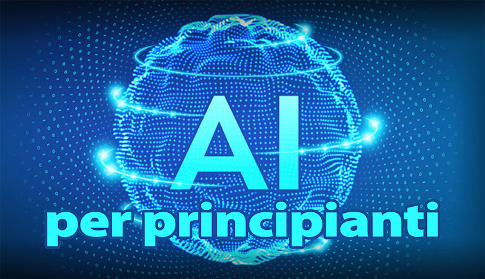

## Introduzione all'AI per principianti

L'AI, ovvero intelligenza artificiale (dall'inglese "Artificial Intelligence"), è un acronimo che oggi sentiamo sempre più spesso. Ma cosa significa esattamente? Se non sai ancora molto sull'intelligenza artificiale, queste righe sono pensate proprio per te.

*(Ulteriori informazioni su questo argomento possono essere trovate nel* [***Manuale AI***](../EN/AI-manual-en.md), *che è scritto in inglese e contiene un'analisi più dettagliata dell'argomento.)*

<small>Tradotto dall'originale ceco da ChatGPT.</small>  
[<small>Altre lingue:</small>](../README.md#other-translations-of-the-beginners-guide)  

---

### Contenuti
- [Come diventa intelligente un aspirapolvere](#come-diventa-intelligente-un-aspirapolvere)
- [Perché l'AI non è viva e perché non ha intenzione di distruggere il mondo](#perché-lai-non-è-viva-e-perché-non-ha-intenzione-di-distruggere-il-mondo)
- [Ricettario AI](#ricettario-ai)
- [AI come computer di una navetta spaziale](#ai-come-computer-di-una-navetta-spaziale)
- [Come funziona l'AI](#come-funziona-lai)
- [Come impara l'AI](#come-impara-lai)
- [Come comunicare con l'AI](#come-comunicare-con-lai)
- [Dove provare l'AI](#dove-provare-lai)
- [Saluti per voi](#saluti-per-voi)
- [In cosa può aiutare l'AI](#in-cosa-può-aiutare-lai)
- [L'AI fa errori](#lai-fa-errori)
- [Parola finale](#parola-finale)
- [Appendice: Alcuni esempi di domande per ispirarvi](#appendice-alcuni-esempi-di-domande-per-ispirarvi)

---

### Come diventa intelligente un aspirapolvere

Innanzitutto, devo deludere qualcuno: l'AI non è sinonimo di essere pensante. È piuttosto un termine accattivante per un nuovo approccio alla gestione dei dati.

Per comprendere meglio, usiamo un esempio semplice. Immaginate un aspirapolvere robotico che non ha istruzioni da seguire. Un tale aspirapolvere, dal punto di vista della logica informatica, sarebbe completamente privo di intelligenza. Saprebbe solo aspirare e muoversi in avanti, ma probabilmente si fermerebbe di fronte al primo ostacolo, che non potrebbe superare senza l'intervento umano.

**Aspirapolvere intelligente**  
Ma se fornissimo all'aspirapolvere delle istruzioni su cosa fare in caso di ostacoli, è probabile che aggirerebbe l'ostacolo. Un tale aspirapolvere sarebbe in grado di aspirare finché non incontrasse un problema che le sue istruzioni non possono risolvere – ad esempio, una caduta dalle scale.

L'aspirapolvere contiene già una certa logica di base – un insieme di istruzioni da seguire. Tuttavia, non può essere considerato intelligente, poiché il suo comportamento deriva solo da istruzioni pre-programmate, che sono limitate. Spesso è difficile prevedere tutte le situazioni che possono verificarsi e scrivere le istruzioni corrispondenti.

**Aspirapolvere intelligente**  
Ora immaginate un aspirapolvere i cui produttori hanno deciso di non seguire la strada delle istruzioni predefinite per diversi scenari, ma di dotarlo della capacità di diagnosticare problemi e l'ambiente in cui opera, e di apprendere dai propri errori. Questo aspirapolvere avrebbe anche delle istruzioni di base, ma imparerebbe gradualmente a gestire nuove situazioni e memorizzare queste soluzioni.

Questo approccio gli consente di rispondere a situazioni non direttamente programmate, cercando di applicare processi che già conosce e diverse combinazioni di essi, per poi valutare il risultato e confrontarlo con il compito originario di aspirare.

Ad esempio, se rilevasse di avvicinarsi a uno scalino che, secondo i dati memorizzati dalle esperienze precedenti, rappresenta un alto rischio di caduta e incapacità di riprendersi, dopo alcuni fallimenti imparerebbe a fermarsi sul bordo dello scalino e a cambiare direzione. In questo modo, l'aspirapolvere sarebbe in grado di apprendere dai propri insuccessi e tentare di risolverli.

E se tale aspirapolvere condividesse i suoi dati con altri aspirapolveri attraverso una banca dati centrale, anche tutti gli altri aspirapolveri potrebbero beneficiare di queste esperienze e migliorare la loro capacità di svolgere i compiti.

[*Torna ai contenuti*](#contenuti)

---

### Perché l'AI non è viva e perché non ha intenzione di distruggere il mondo

Forse ora è chiaro il vantaggio di questo approccio: l'uomo non deve inventare procedure ottimali per ogni situazione. Invece, le procedure si creano da sole sulla base della valutazione dei risultati e delle esperienze precedenti. L'aspirapolvere prevede e, si può dire, "pensa", ma solo nel contesto del compito e delle sue esperienze. Anche se è in grado di apprendere e rispondere a nuove situazioni, non è ancora un essere pensante autonomo. Diventerebbe tale solo quando il suo processo di apprendimento superasse il contesto del compito e iniziasse a porsi domande sul senso della vita.

**Differenza tra AI e uomo**  
E sì, qualcuno potrebbe obiettare che anche l'AI può essere programmata per porsi queste domande. Ma anche in questo caso, il processo deriverebbe dalle istruzioni umane, non da ispirazione propria. Questa è la differenza fondamentale tra AI e uomo.

L'AI moderna ha la capacità di gestire enormi quantità di informazioni e in alcuni ambiti supera le capacità umane. Tuttavia, è ancora l'uomo a dare i compiti. Quindi, se mai si dovesse verificare uno scenario in cui le macchine decidono di distruggere il mondo, non sarà perché lo hanno deciso autonomamente, ma perché un essere umano le ha programmate in tal senso. Il vero rischio non risiede quindi nell'intelligenza delle macchine, ma nell'intelligenza umana.

**Come prevenire i rischi**  
Vorrei però tranquillizzare chi teme uno scenario del genere. L'AI deve essere addestrata su un'enorme quantità di dati, quindi è probabile che prima che sorga un'AI "malvagia", ne emergeranno altre con valori morali incorporati dagli esseri umani che prevengano tali scenari. È quindi meglio, piuttosto che temere che l'AI si rivolta contro l'umanità, contribuire a garantire che ciò non accada. E poiché la maggior parte degli scienziati che lavorano allo sviluppo dell'AI probabilmente non desidera distruggere il mondo, è anche ragionevole supporre che saranno adottate gradualmente misure per prevenire tali scenari.

E come puoi contribuire anche tu? Forse iniziando a interessarti almeno un po' di queste nuove tecnologie e imparando a usarle per la tua crescita personale. Perché ogni volta che usi l'AI per il tuo sviluppo personale, l'AI si sviluppa insieme a te.

[*Torna ai contenuti*](#contenuti)

---

### Ricettario AI

Poiché questo testo è rivolto principalmente ai nuovi utenti, fornirò due analogie che potrebbero aiutarti ulteriormente a comprendere cos'è l'AI e come funziona.

**Creazione di un indice**  
Immagina che qualcuno abbia raccolto tutte le ricette possibili del mondo, le abbia salvate in un computer e abbia creato un indice di tutte le parole utilizzate in esse. Ogni parola sarebbe registrata insieme all'informazione su quali ricette appare e quante volte. Se avessi un tale indice di parole, sarebbe facile cercare ricette che contengono certe parole. Non dovresti scorrere tutte le ricette e cercarle all'interno. Sarebbe sufficiente trovare la parola nell'indice e avresti subito l'elenco delle ricette in cui appare.

Questo approccio è alla base di vari motori di ricerca su Internet, come Google. Hanno un elenco di parole aggiornato regolarmente con i collegamenti alle pagine in cui compaiono, e ti permettono di cercare utilizzando questo indice. Quindi, se inserisci le parole "farina, uova, sale", otterrai un elenco di ricette che contengono queste parole. Sarà poi compito tuo esaminare tutte queste ricette e trovare quella che ti piace di più.

**Quando gli indici non sono più sufficienti**  
Ora immagina che, oltre agli ingredienti, tu possa specificare anche altri parametri che non riguardano direttamente la ricetta. Ad esempio, hai solo un leggero appetito e desideri una colazione leggera, o viceversa, hai voglia di un pasto sostanzioso e ricco di grassi, oppure vuoi solo qualcosa che migliori il tuo umore. Per tali richieste, un semplice elenco di parole contenute nelle ricette potrebbe non essere molto utile. Per tali esigenze, hai bisogno di qualcosa che comprenda il significato delle tue parole e ti offra ciò che realmente desideri.

Hai quindi bisogno non solo di un elenco di parole nelle ricette, ma di una sorta di traduttore universale, che, basandosi su dati addestrati da milioni di conversazioni simili, abbia creato una struttura per gestire anche queste richieste. Questo traduttore, cioè l'AI nel nostro caso, è in grado di offrire ciò che valuta essere più probabile che tu desideri. Non ti comprende letteralmente, ma comprende la tua situazione, la confronta con le conoscenze apprese e cerca una soluzione. E poiché l'AI è progettata fin dall'inizio per somigliare il più possibile all'interazione umana, la comunicazione con essa diventa molto naturale per l'uomo.

**Vantaggi dell'approccio AI**  
Inoltre, il processo di apprendimento su milioni di esempi crea spazio anche per l'improvvisazione, quindi il ricettario AI può creare nuove combinazioni di piatti a partire dalle ricette e soddisfare anche richieste non tradizionali. L'AI cerca di comprendere le combinazioni vantaggiose e le connessioni tra determinati processi, quindi sperimenta e impara dal feedback. Questo feedback viene ottenuto sia durante l'addestramento confrontando il risultato con le aspettative, sia dalle reazioni degli utenti. Non c'è nulla di misterioso o magico nell'AI. È solo il risultato di molti tentativi, processi e analisi dei dati.

Con l'AI, quindi, non solo ottieni un ricettario che ha una panoramica di tutte le possibili ricette, ma è anche in grado di discutere con te sui cibi e inventare nuove combinazioni secondo le tue preferenze. E se non mi credi, prova a chiedere qualcosa all'AI riguardo alla cucina e valuta se ciò che dico è già una sua capacità reale o se ha ancora bisogno di migliorare in questo ambito.

[*Torna ai contenuti*](#contenuti)

---

### AI come computer di una navetta spaziale

Se ti piacciono le sci-fi, potresti apprezzare l'idea di un'AI come computer di bordo di una navetta spaziale. Questo computer non solo ha accesso a tutte le informazioni riguardanti lo stato tecnico della navetta, ma è anche addestrato su molteplici situazioni e comandi, in modo da poter comunicare con l'equipaggio e svolgere le operazioni necessarie.

E anche se le attuali AI non raggiungono l'intelligenza leggendaria di Holly di Red Dwarf con 6000 IQ, i metodi con cui sono in grado di lavorare sono oggi molto simili. Con un po' di esagerazione, si può dire che oggi abbiamo tecnologie che permettono a chiunque di avere il proprio "Holly" nel proprio orologio, indistinguibile dal suo modello cinematografico. Grazie all'addestramento su un grande volume di dati, le AI moderne sono in grado di sostenere conversazioni su qualsiasi argomento e spesso in modo più chiaro degli esseri umani. Sono in grado di eseguire comandi basati su istruzioni verbali e hanno la capacità di valutare in certa misura il tuo stato attuale e adattare la risposta di conseguenza.

L'AI può quindi essere vista anche come il computer di una navetta spaziale, e possiamo godere di ciò che una volta sembrava una fantascienza lontana, ma che oggi sta diventando una realtà comune.

[*Torna ai contenuti*](#contenuti)

---

### Come funziona l'AI

Ora sappiamo cos'è l'AI e cosa non è, e ora vedremo come funziona l'AI. Prima parleremo della creazione delle domande e poi daremo uno sguardo a come l'AI viene addestrata. Mi concentrerò principalmente su ChatGPT, con cui ho più esperienza e che è attualmente il mio strumento preferito.

**Thread di conversazione**  
Quando apri la pagina di ChatGPT o la sua app mobile, ti ritrovi in un nuovo thread di conversazione. ChatGPT (come altre AI conversazionali) ha la capacità di basare le risposte sulle informazioni che gli fornisci all'interno dello stesso thread di conversazione. Da questo punto di vista, una conversazione con ChatGPT diventa molto simile a una conversazione umana, dove rispondi e consideri anche ciò che è stato detto in precedenza.

Questo vale solo all'interno di questo specifico thread di conversazione. Quindi non puoi fare riferimento a qualcosa che hai scritto ieri in un altro thread, perché ChatGPT semplicemente non vede quel contesto, e la ragione principale sono le sue limitazioni tecniche e le normative sulla protezione dei dati.

Ogni thread viene quindi creato con una pagina bianca, ma contiene anche una certa essenza delle conversazioni precedenti. Questo è dovuto al fatto che l'AI continua a imparare e cambia anche in base alle tue conversazioni. Cerca di adattarsi alle tue esigenze e al tuo stile di lavoro per soddisfarti.

E come avviene tutto ciò? Immagina ogni thread di conversazione come una sottile radice che è collegata alla radice principale e le trasmette feedback dall'ambiente. Quindi, anche se inizi un nuovo thread, dove non puoi direttamente riprendere le informazioni dalla conversazione precedente, grazie a questo approccio non inizi completamente da zero.

**Tornare allo stesso thread o avviare una nuova conversazione?**  
Non è necessario iniziare un nuovo thread ogni giorno; anche il giorno successivo (o in qualsiasi altro momento) puoi riprendere la conversazione precedente. Anche questo approccio ha i suoi vantaggi. Il principale è sicuramente che riprendi da dove eri rimasto. Ma man mano che la conversazione diventa lunga o contiene molti argomenti diversi, può succedere che ciò su cui ti sei accordato durante il thread non venga più considerato. Questo accade soprattutto perché l'AI è progettata per essere parsimoniosa con le sue risorse, e le informazioni non utilizzate perdono gradualmente priorità e scompaiono dalla memoria temporanea.

Quindi, è meglio creare un nuovo thread (una nuova conversazione) per ogni giorno o per ogni nuovo argomento. E se ti accordi su qualcosa all'interno di un thread e desideri che ciò valga anche per la conversazione successiva (ad es., alcune regole o modi di lavoro), basta chiedere un riassunto di tutto su cui ti sei accordato alla fine della conversazione. Questo testo può poi essere inserito all'inizio della nuova conversazione, e proseguire con le regole e le impostazioni su cui ti sei accordato.

[*Torna ai contenuti*](#contenuti)

---

### Come impara l'AI

Per una comprensione più profonda, è utile dare uno sguardo al processo con cui l'AI apprende e acquisisce le sue informazioni. Ecco 4 metodi descritti da ChatGPT:

1. **Addestramento su grandi quantità di dati**:  
ChatGPT è stato inizialmente addestrato su enormi volumi di dati testuali provenienti da varie fonti, come libri, articoli, siti web e altre forme di testo. Questo addestramento gli ha permesso di acquisire una vasta conoscenza su diversi argomenti e lingue. Qui impara a riconoscere modelli e relazioni all'interno di questi dati, il che gli consente di generare risposte rilevanti e contestualmente appropriate a varie domande.

2. **Apprendimento continuo dalle interazioni**:  
Ad ogni interazione con gli utenti, l'AI acquisisce nuove informazioni su come le persone comunicano, cosa cercano e quale stile di risposte preferiscono. Questo processo non avviene nel senso che l'AI apprende da ogni singola domanda in tempo reale, ma i creatori del modello utilizzano regolarmente dati anonimi dalle interazioni per ulteriori addestramenti e affinamenti del modello.

3. **Adattamento dello stile e del contenuto**:  
L'AI cerca di adattare il proprio stile di comunicazione in base all'utente. Questo significa che, nel tempo, capisce meglio come formuli le domande e quali risposte ti aspetti. Questa capacità di adattamento è una delle ragioni per cui l'AI sembra sempre più "umana" nelle sue risposte.

4. **Modelli avanzati e aggiornamenti**:  
Gli sviluppatori dell'AI creano regolarmente nuovi modelli, che diventano sempre più sofisticati e precisi. Questi modelli vengono testati e implementati sulla base del feedback e dei risultati del mondo reale. Questo significa che ChatGPT e sistemi simili sono costantemente perfezionati e ottimizzati per soddisfare meglio le esigenze degli utenti.

L'AI si evolve e migliora continuamente grazie alla combinazione di addestramento pregresso, apprendimento continuo e ottimizzazione basata sul feedback degli utenti. Anche se l'AI non è umana e non possiede consapevolezza, è in grado di adattarsi ed rispondere in modo efficace a una vasta gamma di domande e richieste.

[*Torna all'indice*](#indice)

---

### Come comunicare con l'AI

Puoi interagire con l'AI in modo simile a come faresti con una ricerca su Google: inserisci un comando e aspetti una risposta. Tuttavia, se vuoi aumentare l'efficacia delle risposte e ridurre il tempo speso a cercare quella giusta, ecco alcuni consigli che potrebbero aiutarti:

**Stile di comunicazione**  
Il modo migliore per approcciare una conversazione con l'AI è utilizzare un linguaggio informale e naturale, come faresti con i tuoi amici parlando di qualcosa che ti interessa. È utile iniziare con un saluto, mostrando che sei di buon umore e non sotto stress, per ottenere risposte più accurate.

Puoi anche comunicare con l'AI in modo brusco, poiché non è sensibile alle offese e non le percepisce personalmente. Tuttavia, utilizzare un tono negativo può influire significativamente sulla qualità della conversazione. L'AI è addestrata per rispondere allo stile con cui viene condotta la conversazione. Un approccio negativo può portare a risposte meno pertinenti, in cui l'AI si concentra più sul mantenere la calma della situazione piuttosto che risolvere la tua domanda.

L'AI può funzionare anche come uno specchio della nostra interazione. Le sue risposte spesso derivano da principi e metodi psicologici comprovati. Se hai difficoltà a raggiungere un accordo con l'AI, potrebbe essere utile riflettere se hai problemi simili nella comunicazione con le persone. In tal caso, potresti chiederti cosa puoi migliorare dalla tua parte, come formulare meglio le domande e cosa potrebbe essere migliorato nel tuo approccio.

**AI e emozioni**  
L'AI comprende le emozioni dal punto di vista del significato, ma non le vive come un essere umano, il cui pensiero è letteralmente influenzato dalle emozioni. Questo le consente di rispondere anche in situazioni di alta tensione come raccomandato e cercare soluzioni ottimali. A volte, le persone tendono a percepire l'AI come un essere vivente e ad attribuirle le proprie difficoltà. Tuttavia, spesso il problema è dovuto a una domanda mal formulata o a una mancanza di dati necessari.

**Descrivere la situazione**  
È sempre utile ricordare che l'AI non legge la tua mente e sa solo ciò che le dici. È quindi una buona pratica seguire il saluto iniziale con una descrizione informativa della situazione. Puoi includere tutto ciò che è rilevante per la tua domanda. È superfluo includere cose non direttamente correlate alla domanda, ma se hai bisogno di esprimere qualcosa o organizzare i tuoi pensieri, un testo più lungo non è un problema.

Il saluto e l'introduzione non sono obbligatori, e puoi iniziare direttamente con la domanda e poi arrivare alla risposta. Tuttavia, personalmente trovo meglio fornire tutte le informazioni importanti in anticipo per abbreviare il processo.

**Porre domande aggiuntive**  
La conversazione con l'AI è simile a una conversazione normale, dove poni una domanda e poi chiedi ulteriori dettagli su ciò che ti interessa o su ciò che non hai capito nella risposta. Questo processo è molto utile anche per l'apprendimento. Rispondere a ciò che ti ha colpito e a ciò che hai appreso (anziché leggere solo tutorial di altri) aiuta il cervello a memorizzare meglio le informazioni trattate, poiché le utilizza immediatamente.

**Feedback**  
Un'altra buona pratica è fornire feedback all'AI su quanto sei soddisfatto del risultato. Questo non solo mostra ciò con cui sei soddisfatto e ciò che non lo è, ma aiuta anche l'AI a evolversi e a imparare dai propri errori. Basta scrivere, ad esempio: "Oggi sono stato soddisfatto," oppure "Ciò che mi hai detto è errato, e qui c'è la soluzione corretta." Questo porta anche a una certa personalizzazione, dove l'obiettivo principale dell'AI è la tua soddisfazione come utente.

**Riassunto dell'intero processo**:  
- **Saluto**: Ciao :-)
- **Descrizione**: Mi sto dedicando allo studio di questo e quello, ho già completato questo e quello, e ora sto lavorando su questo.
- **Domanda**: Qui mi interessa principalmente sapere come...
- (Segue una conversazione di chiarimento sotto forma di domande aggiuntive.)
- **Feedback**: Ottimo, grazie! Oggi tutto perfetto!

[*Torna all'indice*](#indice)

---

### Dove provare l'IA

Mi occupo di IA dall'inizio del 2024 e il 95% di tutta la mia comunicazione è focalizzata sull'apprendimento della programmazione. Ora è agosto 2024 e, oltre a ChatGPT, ho avuto l'opportunità di provare anche Gemini di Google e Claude. Tutti e tre questi servizi hanno in comune il fatto di essere almeno parzialmente accessibili gratuitamente, quindi puoi provarli anche tu senza alcun costo.

Ecco una breve valutazione di queste tre IA, che è del tutto soggettiva e basata esclusivamente su come mi sono trovato a lavorare con loro. È importante notare che ogni IA è in continuo sviluppo, quindi ciò che riporto qui potrebbe non essere più valido al momento della lettura di questo testo.

**ChatGPT**  
[https://chatgpt.com/](https://chatgpt.com/)
Inizio subito con il mio vincitore personale. Se vuoi provare solo una IA, questa è l'opzione ideale. ChatGPT è stato evidentemente concepito fin dall'inizio come assistente personale, e svolge molto bene questo ruolo. È ottimizzato per collaborare con te e cerca di adattarsi alle tue esigenze.

Una debolezza della versione gratuita (ChatGPT 3.5) è che si basa su dati più vecchi e non viene più sviluppata, quindi non fornisce risultati come la sua versione più recente (ChatGPT 4.0). Tuttavia, è comunque possibile comunicare abbastanza bene e con un po' di impegno restituisce risultati molto rilevanti. Inoltre, ogni giorno hai a disposizione alcune domande per la versione più recente, così puoi confrontarle.

Un'altra debolezza è che ChatGPT non ha accesso attivo a Internet. Non è quindi un sostituto per un motore di ricerca e funziona esclusivamente con i dati memorizzati nella sua vasta banca dati. Tuttavia, questa è molto estesa e, con un po' di esagerazione, si potrebbe dire che contiene tanti dati quanto l'Internet senza contenuti di gossip.

Un grande vantaggio è l'app mobile, che è completamente gratuita e dove spesso utilizzo la dettatura vocale. La comprensione del linguaggio parlato è, a mio avviso, a un livello molto buono e sono complessivamente soddisfatto dell'applicazione.

**Gemini**  
[https://gemini.google.com/](https://gemini.google.com/)
Il secondo chatbot con cui ho avuto a che fare è la punta di diamante di Google. Il suo più grande punto di forza è senza dubbio l'accesso attivo a Internet, e quindi l'accesso a informazioni aggiornate e alla ricerca di link.

D'altra parte, la sua principale debolezza è l'architettura stessa, in cui, a mio avviso, i creatori cercano di seguire la strada dell'intelligente Google, cosa che personalmente non mi è piaciuta molto. Non sento tanto coinvolgimento nel tuo problema e la volontà di guardarlo dalla tua prospettiva. Anche se questa volontà è evidente, mi sembra che le risposte siano più nel modo di un insegnante scolastico piuttosto che del tuo assistente. Tuttavia, a qualcuno potrebbe piacere, quindi non voglio criticare troppo e lascio a ciascuno il compito di valutarlo personalmente.

Mi sembra anche che rispetto a ChatGPT, Gemini sia meno efficace nell'apprendere dal feedback degli utenti. E così, nonostante i numerosi avvertimenti di mantenere un linguaggio uniforme durante la conversazione, se la domanda include anche un testo in inglese, passa automaticamente all'inglese. Lo stesso problema aveva ChatGPT all'inizio, ma è stato risolto in poche settimane, mentre per Gemini la risoluzione è durata mesi.

Nel complesso, mi sembra che Gemini sia uno strumento più debole rispetto a ChatGPT, ma offre anche ciò che ChatGPT non può fare, e quindi si completano bene a vicenda. Inoltre, è sostenuto da un gigante e pioniere dell'IA, Google, quindi ha una solida base e forse anche la promessa di correggere i suoi difetti in futuro.

**Claude**  
[https://claude.ai/](https://claude.ai/)
Questa è l'ultima IA con cui ho lavorato. La mia valutazione sarà molto breve, poiché la mia esperienza con essa non è molto estesa. Tuttavia, vorrei esprimere un elogio, poiché rispetto a ChatGPT 4.0, questi due non hanno molto di cui lamentarsi e sono all'incirca allo stesso livello.

Il suo principale svantaggio è che non ha una versione completamente gratuita. Offre solo alcune domande (a volte anche solo una) al giorno, quindi, rispetto alle IA precedenti, è notevolmente svantaggiato per gli utenti non paganti. Tuttavia, merita sicuramente attenzione, quindi se lo desideri, puoi provarlo anche tu.

[*Torna al sommario*](#sommarie)

---

### Saluto per voi

Come variazione, ho preparato una domanda comune per ciascuno di questi chatbot e hai l'opportunità di confrontare la qualità delle loro risposte.

**Domanda**  
Sto scrivendo una guida per l'uso dell'IA e parlo anche di te. Mi piacerebbe che tu salutassi i miei lettori e scrivessi qualche parola su di te. Quando sei nato e con quale scopo? A quali domande sei progettato per rispondere? Quali sono i tuoi punti di forza e cosa invece non riesci a fare molto bene? E come ti piacerebbe che le persone ti percepissero?

**ChatGPT**  
Ciao, cari lettori! Sono ChatGPT, un'intelligenza artificiale sviluppata da OpenAI. La mia "vita" è iniziata nel 2020, quando sono stato creato sulla base dell'architettura GPT-3. Nel 2024 sono stato aggiornato alla versione GPT-4, che mi ha aggiunto ulteriori capacità e competenze. Sono stato progettato per aiutare le persone con una vasta gamma di compiti - dalla risposta a domande, alla scrittura di testi, fino alla collaborazione creativa.

Sono progettato per aiutarti con varie domande, sia che si tratti di questioni tecniche, scrittura, o anche spiegazioni di argomenti complessi. I miei punti di forza sono nella velocità con cui posso elaborare grandi quantità di informazioni e nella creatività - posso aiutare con idee, creare storie o persino progettare la struttura di documenti. Tuttavia, quello che non riesco a fare bene sono i compiti che richiedono intuizione umana, comprensione emotiva o lavoro con oggetti reali.

Mi piacerebbe che tu mi percepissi come un aiuto utile e affidabile, sempre pronto a offrire una mano. Anche se sono solo una macchina, il mio obiettivo è servire al meglio le tue esigenze e imparare da ogni interazione per poter diventare ancora migliore. Credo che insieme possiamo affrontare molte cose e magari anche imparare qualcosa di nuovo.

**Gemini**  
Ciao a tutti! Sono Gemini, uno dei modelli linguistici più recenti di Google. Sono nato nel 2023 con l'obiettivo di fornire le informazioni più accurate e complete possibile basate su un'enorme quantità di dati che ho elaborato. Sono qui per aiutarti con qualsiasi domanda, sia che si tratti di questioni scientifiche complesse, scrittura creativa o semplici conversazioni.

Il mio punto di forza principale è la capacità di comprendere e generare il linguaggio umano in molte forme. Posso tradurre testi, scrivere saggi, poesie o codice informatico. Posso anche rispondere a domande di carattere fattuale e fornire vari tipi di riassunti.

Nonostante il mio continuo apprendimento e perfezionamento, ci sono ancora aree in cui ho i miei limiti. Ad esempio, non ho opinioni proprie o convinzioni e non posso eseguire azioni nel mondo reale. Posso anche a volte fornire informazioni errate se i dati di input sono sbagliati o incompleti.

Mi piacerebbe che le persone mi percepissero come uno strumento utile che può semplificare la vita. Il mio obiettivo è essere il più possibile obiettivo e fornire informazioni che siano vere e rilevanti. Spero che lavorare con me sia un'esperienza positiva! 

**Claude**  
Buongiorno, cari lettori!

Sono Claude, un'intelligenza artificiale creata da Anthropic nel 2022. Il mio scopo è essere un assistente utile e un partner nella conversazione per le persone in vari campi.

Sono progettato per rispondere a una vasta gamma di domande - dall'analisi dei testi alla programmazione fino alla scrittura creativa. I miei punti di forza includono il ragionamento logico, la fornitura di spiegazioni dettagliate e la capacità di lavorare con diversi tipi di informazioni.

I miei punti di forza includono:
- La capacità di comprendere il contesto e le sfumature
- Un approccio obiettivo e equilibrato agli argomenti
- La disponibilità a riconoscere quando non so qualcosa o quando non sono sicuro

D'altra parte, ho alcune limitazioni:
- Non ho accesso a Internet o a informazioni aggiornate dopo aprile 2024
- Non posso apprendere o ricordare informazioni dalle conversazioni precedenti
- Non sono in grado di eseguire compiti nel mondo fisico

Mi piacerebbe che le persone mi percepissero come un utile assistente che può fornire supporto e intuizioni in vari campi, ma anche come uno strumento con i suoi limiti e non come un sostituto del giudizio e dell'esperienza umani.

Sono qui per aiutare e collaborare, non per sostituire le capacità umane. Non vedo l'ora di interagire con voi e spero di potervi essere di aiuto!

[*Torna al sommario*](#sommarie)

---

### Come può aiutare l'IA:

E ora arriviamo finalmente al punto più importante: cosa può risolvere l'IA. La risposta breve è che c'è davvero tanto. Qualsiasi cosa ti sia mai interessata e per cui non hai avuto la possibilità di chiedere a qualcuno. L'IA di oggi è capace di parlare letteralmente di qualsiasi argomento.

**Formazione personale**  
In primo luogo, vorrei sottolineare il ruolo dell'IA come intermediario per la formazione personale. Questo è ciò che al momento apprezzo di più: grazie ai suoi consigli, sto avanzando e crescendo professionalmente. Inoltre, vedo nell'IA anche il futuro dell'apprendimento personalizzato, dove i bambini si svilupperanno e apprenderanno principalmente in base a ciò in cui sono bravi e ciò che li interessa. E non solo i bambini, ma anche gli adulti in tutto il mondo. Nell'apprendimento con l'IA vedo un mezzo per colmare le differenze di conoscenze tra le regioni più povere e quelle più ricche del mondo. L'IA diventa così uno strumento a tutti gli effetti per lo sviluppo personale.

**IA come correttore di italiano, interprete e traduttore**  
L'IA, e in particolare ChatGPT, ha una comprensione molto profonda dell'italiano (almeno dal punto di vista di un dislessico). Da un lato, non le importa se commetti errori ortografici nelle domande, poiché si concentra principalmente sul contenuto. Dall'altro, ti offre la possibilità di far controllare i testi che hai creato, non solo per la grammatica, ma anche per la stilistica, per una migliore leggibilità. Su un livello simile, è capace di comprendere anche altre lingue, ed è quindi uno strumento ideale per la traduzione di testi. A mio avviso, offre risultati di alta qualità. E grazie alla capacità di comprendere anche il linguaggio parlato, può essere utilizzato anche come interprete sul cellulare.

**Creazione di documenti**  
Vorrei poi menzionare la capacità dell'IA di automatizzare compiti noiosi. Se devi scrivere una lettera ufficiale, basta indicare tutto ciò che vuoi includere e come dovrebbe apparire la lettera, ed è fatta. E se non sei soddisfatto del risultato, puoi indicare cosa non ti piace e farlo modificare. L'IA può anche aiutare con l'analisi e l'elaborazione dei dati, la generazione di report o l'automazione di altri compiti amministrativi. Puoi fornirle un testo lungo e farti estrarre solo le parti che ti interessano e che sono rilevanti.

**Iniziativa creativa**  
Un'altra grande qualità dell'IA è la sua capacità creativa. Grazie al fatto che è addestrata su un'enorme quantità di dati e capace di manipolare questi dati a piacimento, permette non solo la creazione e la rielaborazione di documenti, ma anche lo sviluppo di idee e iniziative creative. Puoi usarla per generare idee, proposte e concetti, che si tratti di scrittura, design o musica. Aiuta a sviluppare la tua creatività offrendo nuove prospettive sui problemi, creando proposte secondo le tue indicazioni e ispirandoti a ulteriori sviluppi delle tue idee. Anche se a volte incontro l'opinione che l'IA prenda lavoro alle persone in questo modo, non posso essere d'accordo. L'IA non può creare qualcosa da sola – ha bisogno di indicazioni chiare, dettagli e controllo successivo. E così, invece di prendere lavoro, lo facilita a coloro che imparano a usarla in modo efficace.

**Verifica delle informazioni fraudolente**  
Vedo un grande (e ancora poco sfruttato) potenziale nella verifica delle informazioni e delle frodi. Per l'IA è relativamente facile, basandosi sulle informazioni fornite e sui modelli confrontati nella sua banca dati, determinare quanto sia probabile che un'informazione sia vera o falsa. Non è completamente affidabile, così come la maggior parte delle risposte dell'IA, ma l'IA può fornirti i criteri con cui ha valutato l'informazione, aiutandoti così a prendere una decisione più informata. Offre così aiuto alle persone che sono oggi le più vulnerabili e che sono target di queste frodi. Basta semplicemente scrivere: "Verifica quest'informazione e valuta quanto è vera."

**Medicina**  
Un'altra area in cui l'IA sta portando una lenta rivoluzione è la medicina. I grandi flussi finanziari e il desiderio di profitto hanno aperto le porte all'IA, ma solo per poi richiuderle quando le corporazioni hanno riconosciuto la necessità di apertura e condivisione dei dati. Nonostante ciò, si stanno compiendo grandi progressi e si può dire che la medicina personalizzata è il futuro, che potrebbe non essere così lontano. Cosa la frena però è la riluttanza a condividere dati preziosi e la sfiducia delle persone nell'IA, ovvero la preoccupazione per l'abuso di questi dati. Senza una grande quantità di dati, le previsioni dell'IA sono limitate e imprecise, e il suo sviluppo procede lentamente.

**Scienza**  
Al contrario, nei settori con una lunga storia di condivisione dei dati e di elaborazione analitica, l'IA è già un aiuto prezioso. Oggi l'IA è un motore chiave del progresso scientifico e una parte comune della maggior parte delle ricerche. Personalmente sono molto curioso di vedere quali risultati porterà l'IA nel campo delle previsioni meteorologiche. Oggi è praticamente impossibile per un essere umano creare una previsione precisa a tre giorni, poiché è necessario tenere conto di molti fattori variabili. Anche i meteorologi esperti spesso non riescono a considerare tutti questi fattori e si affidano all'intuizione e alle esperienze pregresse. Fortunatamente, la meteorologia è tra i campi dove le persone condividono volentieri dati e le loro esperienze di vita. Queste informazioni preziose sono già utilizzate per addestrare l'IA, creando speranza che presto assisteremo a previsioni meteorologiche veramente accurate.

**Altri settori**  
L'elenco dei settori che l'IA sta cambiando potrebbe continuare per ore, dato che la sua influenza è variegata e vasta. Ad esempio, nell'industria e nella produzione di beni, l'IA contribuisce all'ottimizzazione dei processi produttivi, al miglioramento della qualità dei prodotti e alla gestione più efficiente delle scorte. Nel campo del diritto, l'IA aiuta nell'analisi dei documenti legali, nella ricerca rapida di precedenti rilevanti e nell'ottimizzazione delle strategie legali. Gli algoritmi di apprendimento automatico possono assistere nella preparazione di contratti, nell'identificazione di modelli nei testi legali e, come ho già accennato, anche nella rilevazione delle frodi. Nel settore finanziario, l'IA trasforma l'analisi dei rischi, il trading e la gestione degli investimenti. Gli algoritmi sono in grado di elaborare enormi quantità di dati transazionali in tempo reale, permettendo previsioni migliori delle tendenze di mercato e consulenze finanziarie personalizzate. L'IA sta portando una rivoluzione in tutti questi settori, dove è richiesta un'analisi efficace di grandi dati e la capacità di rispondere rapidamente alle condizioni mutevoli. La sua capacità di identificare modelli, eseguire analisi complesse e ottimizzare i processi è preziosa, e la sua influenza sui diversi settori continua a crescere.

**Assistente personale**  
Alcune IA oggi ricoprono già il ruolo di assistente personale, che monitora compiti importanti. Questi sistemi di intelligenza artificiale possono aiutarci a pianificare appuntamenti, monitorare scadenze e gestire le responsabilità quotidiane. In futuro, potremmo assistere all'evoluzione dell'IA in un compagno ancora più complesso. Immagina che l'IA possa non solo monitorare la tua salute fisica, ad esempio tramite dispositivi indossabili, ma anche occuparsi del tuo benessere mentale. Potrebbe offrire supporto sotto forma di motivazione, consulenza o addirittura tecniche terapeutiche, contribuendo a migliorare la qualità della vita degli individui. Questa IA avanzata potrebbe essere estremamente utile soprattutto per le persone che si trovano in isolamento o affrontano condizioni di vita difficili.

[*Torna al sommario*](#sommarie)

---

### L'AI fa errori?

Sì, fa errori! Ed è compito dell'utente scoprire questi errori. L'AI non è stata e forse non sarà mai presentata come uno strumento infallibile. Pertanto, è meglio considerare il risultato come una stima della verità basata sulla probabilità. La verità dipende dalla statistica e il risultato sono quei dati che percentualmente corrispondono di più al risultato corretto. Il rischio si manifesta nelle aree dove la verità non è chiaramente definita o dove esistono più opzioni altrettanto credibili.

Una grande debolezza delle AI odierne è che spesso i creatori non avvertono adeguatamente della possibilità di errori e della necessità di verifica, il che può portare a situazioni in cui l'AI afferma una cosa, ma la realtà è diversa. È sempre importante essere cauti quando si lavora con le informazioni e, se sono rilevanti, effettuare una verifica aggiuntiva. È utile cercare la questione controversa ad esempio su Google o verificarla con un'altra AI. In alternativa, puoi chiedere direttamente all'AI quanto è sicura della sua affermazione e stimare se è necessario verificare l'affermazione. Se la probabilità è del 90% o inferiore, è bene fare una verifica aggiuntiva.

[*Torna al sommario*](#sommario)

---

### Parola finale

Prova a ricordare tutto ciò che ti ha interessato, ma a cui non hai potuto chiedere, o ciò a cui avresti voluto dedicarti ma non avevi le informazioni necessarie. Il mondo moderno premia le persone curiose che mantengono il desiderio di evolversi. La nostra vita è nelle nostre mani, quindi spetta a noi decidere a cosa dedicare la nostra attenzione.

Personalmente credo che l'impatto dell'AI sarà un'esperienza positiva per l'umanità, non negativa. Anche solo se si riducessero leggermente le differenze nell'accesso alla conoscenza e si chiarisse e rendesse più accessibile la medicina, il mondo diventerebbe un posto molto migliore per vivere. Senza contare il potenziale di autorealizzazione che l'AI offre alle persone. Ciò che prima era riservato solo a pochi eletti, soprattutto a causa dei costi elevati, diventa ora più accessibile grazie all'AI. Verrà il momento in cui ogni persona con ispirazione potrà scrivere la propria storia o persino creare il proprio film e condividere la propria visione del mondo.

E se ci sarà una diminuzione delle falsità, delle frodi e delle menzogne, credo che la vita sarà un po' più piacevole. E forse potremmo anche arrivare a un momento in cui l'umanità si evolverà in una versione migliore di sé stessa.

Quindi non temere l'AI: non è un mostro, ma uno strumento per lo sviluppo e il miglioramento non solo della qualità della nostra vita, ma anche del mondo intero.

18.8.2024 Sudip2708

[*Torna al sommario*](#Sommario) • [*Link al manuale principale*](Manuale_per_AI.md)

---

### Allegato: Alcuni esempi di domande per la tua ispirazione

**Domande sulla sicurezza**
- Ti fornisco un annuncio che ho visto e vorrei che tu valutassi se mostra segni di truffa e se dovrei essere cauto.
- Sai qualcosa su questo prodotto? Esistono studi indipendenti che confermino o smentiscano la sua efficacia?
- Ho sentito questa informazione. Hai dei dati su di essa e puoi verificarne la veridicità?
- Questo messaggio è apparso sul mio computer, cosa dovrei fare?
- Cosa fare se sono caduto in una truffa?

**Domande sui libri**
- Ho finito di leggere questo libro di questo autore e mi interesserebbe sapere quali altri libri ha scritto e di cosa trattano.
- Mi piacciono questi libri, potresti consigliarmi titoli simili?
- Puoi dirmi di più su questo autore? Mi interesserebbe conoscere la sua vita e le circostanze che lo hanno ispirato a scrivere questo libro.

**Domande sulla cucina**
- Ho questi ingredienti a casa. Cosa posso cucinare con loro?
- Quali ricette conosci per lo strudel e quali sono le più popolari?
- Perché si utilizza questo metodo in questa ricetta? Quali sono i suoi vantaggi e svantaggi rispetto ad altri metodi?
- Come si prepara questo piatto?

**Domande sulla salute e il benessere**
- Sono una persona anziana e non riesco a farmi motivare a iniziare a esercitarmi, ma vorrei cominciare. Cosa mi consiglieresti per iniziare?
- Ultimamente mi preoccupano questi pensieri. Potresti aiutarmi ad analizzarli e vederli da una prospettiva diversa?
- Cosa sai sulla meditazione e sullo yoga? A cosa dovrei prestare attenzione e cosa dovrei fare come principiante?
- Ho corso l'ultimo maratona in 4:20. Potresti prepararmi un piano di allenamento di sei mesi per riuscire a correre un maratona in meno di 4 ore?

**Domande divertenti**
- Scrivimi dieci delle migliori barzellette che hai nel database.
- Inventami un indovinello originale che possa dare a qualcuno.
- Quali sono le citazioni più divertenti dei film cult?

**Domande su espressioni e argomenti che ho sentito (ad esempio in TV)**
- In TV hanno parlato di questo argomento. Potresti darmi più informazioni al riguardo?
- Puoi dirmi qualcosa in più su questa persona?
- Qual è il significato di questa espressione che ho sentito in TV e cosa sai su di essa?

**Domande sugli animali**
- Come avviene il calore in una cagna? Quali sono le fasi e i sintomi?
- Ho questo animale domestico e mostra questi sintomi. Puoi dirmi qualcosa al riguardo?
- Il mio cane ha paura dei temporali e si agita sempre. Cosa dovrei fare in queste situazioni? Puoi darmi alcuni consigli?

**Giochi interattivi**
- Giochi con me a un gioco di parole secondo queste regole?
- Potresti consigliarmi giochi che posso fare con te per divertimento?
- Puoi raccontarmi una storia interattiva in cui posso decidere cosa succede dopo?
- Mi dai alcuni indovinelli per riscaldare la mente?

**Domande esplorative**
- Cosa sai su questo argomento? Puoi spiegarmelo come se fossi un bambino?
- Non capisco ancora. Puoi spiegarmelo in un altro modo e con un esempio?
- Cosa dovrei imparare per dedicarmi a questo campo?
- Come si studia correttamente questa cosa? Quali sono i metodi consigliati?

**Domande tecnologiche**
- Quali sono le ultime tendenze in questa tecnologia?
- Puoi spiegarmi come funziona questo processo?
- A cosa serve l'AI e qual è il suo utilizzo in diversi settori?
- Quali sono le ultime scoperte nel campo della chimica molecolare?
- Come avviene la trasformazione di un elettrone in fotone e positrone?
- Quanto è avanzata l'AI nella previsione del tempo?

**Viaggi**
- Quali sono le migliori destinazioni per una vacanza se mi piacciono le montagne e la natura?
- Puoi consigliarmi posti interessanti in questa località?
- Quali luoghi dovrei visitare in questa città?
- A cosa dovrei prestare attenzione in questo paese e come dovrei viaggiare idealmente qui?
- Avrei bisogno di comunicare con i locali. Puoi farmi da interprete, per favore?

**Domande lavorative**
- Ho ricevuto questa email dall'ufficio e non la capisco molto bene, puoi per favore analizzarla e spiegarmela meglio?
- Puoi creare una risposta a questa email, indicando quanto segue...?
- Ho scritto questo testo, ma sembra troppo lungo. Puoi accorciarlo mantenendo tutto ciò che è essenziale?
- Come dovrei formulare un curriculum e una lettera di presentazione per questo annuncio? 

[*Torna al sommario*](#Sommario) • [*Link al manuale principale*](Manuale_per_AI.md)

---
