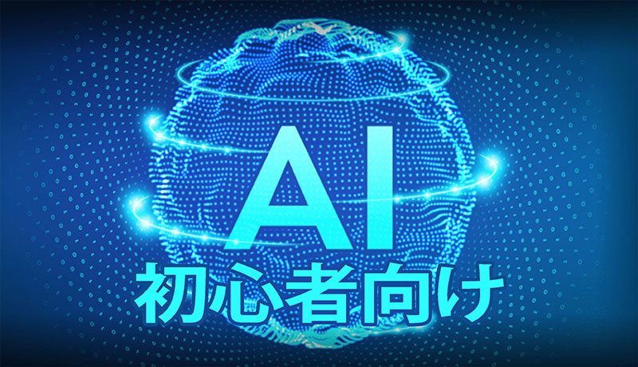

## 初心者向けAI入門

AI、すなわち人工知能（英語で「Artificial Intelligence」）は、現在ますます耳にすることが増えてきた略語です。しかし、具体的にはどのような意味を持つのでしょうか？人工知能についてあまり知らない方に向けて、以下の内容をお届けします。

*(このテーマについての詳細は、英語で書かれた* [***AIマニュアル***](../EN/AI-manual-en.md) *をご覧ください。ここにはトピックの詳細な分析が含まれています。)*

<small>チェコ語の原本からChatGPTによって翻訳されました。</small>  
[<small>他の言語:</small>](../README.md#other-translations-of-the-beginners-guide)  

---

### 内容
- [掃除機がどのように賢くなるか](#掃除機がどのように賢くなるか)
- [なぜAIは生きておらず、世界を破壊しようとは思っていないのか](#なぜaiは生きておらず-世界を破壊しようとは思っていないのか)
- [AI料理本](#ai料理本)
- [AIが宇宙船のコンピュータとして機能する](#aiが宇宙船のコンピュータとして機能する)
- [AIはどのように動作するか](#aiはどのように動作するか)
- [AIはどのように学ぶか](#aiはどのように学ぶか)
- [AIとどのようにコミュニケーションを取るか](#aiとどのようにコミュニケーションを取るか)
- [AIを試す場所](#aiを試す場所)
- [あなたへのメッセージ](#あなたへのメッセージ)
- [AIがどのように役立つか](#aiがどのように役立つか)
- [AIは間違いを犯すか](#aiは間違いを犯すか)
- [結びの言葉](#結びの言葉)
- [付録: あなたのインスピレーションのための質問例](#付録-あなたのインスピレーションのための質問例)

---

### 掃除機がどのように賢くなるか

最初に少し残念かもしれませんが、AIは思考する存在の同義語ではありません。むしろ、データを扱う新しいアプローチのキャッチーな名称に過ぎません。

より理解しやすくするために、簡単な例を使いましょう。指示が一切ないロボット掃除機を想像してみてください。そのような掃除機はコンピューターロジックの観点から見て、全く知能がないと言えるでしょう。掃除機はただ掃除をして前に進むことしかできず、おそらく最初の障害物にぶつかっても人間の介入なしにはそれを超えることはできないでしょう。

**賢い掃除機**  
しかし、掃除機に障害物にぶつかったときにどうすべきかという指示を与えると、掃除機は障害物を回避することができるかもしれません。そのような掃除機は、障害物に直面するまで掃除を続けられますが、例えば階段から落ちるなどの問題には対処できないかもしれません。

掃除機は基本的なロジックを備えています—それに従う指示のリストです。しかし、依然として知能とは言えません。なぜなら、その行動はあくまで事前にプログラムされた制限された指示に基づいているからです。すべての状況を考慮して適切な指示を書くことは難しいことがよくあります。

**知能を持つ掃除機**  
では、製造者が異なるシナリオのための事前準備されたコマンドの道を選ばず、問題や作業環境を診断し、失敗から学ぶ能力を掃除機に与えたとしましょう。その掃除機は基本的な指示を持っていますが、新しい状況にも対応する方法を学び、その解決策を保存していきます。

このアプローチにより、掃除機は直接プログラムされた状況ではないものに反応し、既知のプロセスやその組み合わせを試し、その結果を評価して、掃除するという元のタスクと比較することができます。

例えば、保存された以前の経験から階段に近づいていると認識し、それが落下や脱出不能のリスクが高いと判断した場合、いくつかの失敗の後に階段の端で停止し、他の方向に進むことを学ぶかもしれません。このようにして掃除機は自分の失敗に基づいて学び、それを解決しようとします。

もしその掃除機が中央データベースを通じて他の掃除機とデータを共有していれば、他のすべての掃除機もその経験を活かすことができ、そのタスクを遂行する能力が向上するでしょう。

[*目次に戻る*](#内容)

---

### なぜAIは生きておらず、世界を破壊しようとはしないのか

このアプローチの利点はすでに明らかかもしれません—人間がすべての状況に対する最適な手順を考える必要がないという点です。代わりに、手順は結果の評価と過去の経験に基づいて自動的に生成されます。掃除機は予測を行い、「考える」とも言えますが、それはあくまで与えられたタスクと経験の範囲内でのことです。学習し新しい状況に反応する能力があっても、それは独立して考える存在ではありません。独立した思考を持つ存在となるのは、タスクの枠を超えて人生の意味について考えるようになったときです。

**AIと人間の違い**  
確かに、AIをプログラムしてこうした質問をするようにすることは可能かもしれません。しかし、その場合でもこのプロセスは人間の指示に基づくものであり、AI自身のインスピレーションから生じるものではありません。これがAIと人間の根本的な違いです。

現代のAIは膨大な量の情報を扱う能力を持ち、一部の分野では人間の能力を超えることがあります。しかし、タスクを設定するのは依然として人間です。ですので、もし機械が世界を破壊するシナリオが現れたとしても、それは機械自身の決定ではなく、人間がそのようにプログラムしたからです。実際のリスクは機械の知能ではなく、人間の知能にあります。

**リスクを回避する方法**  
このようなシナリオを心配している方々を安心させたいと思います。AIは大量のデータでトレーニングされるため、「悪意ある」AIが登場する前に、倫理的な価値観を組み込まれたAIが先に登場する可能性が高いです。ですので、AIが人間に対抗するのを心配するよりも、それを防ぐために関わる方が良いでしょう。そして、AIの開発に関わる科学者の多くが世界を破壊したいとは思っていないと思われるため、類似のシナリオを防ぐための対策が徐々に講じられることが期待されます。

それにあなたがどのように貢献できるか？少しでも新しい技術に興味を持ち、自分自身の成長のためにそれを学ぶことです。AIを個人的な成長のために使用するたびに、AIも一緒に成長していくのです。

[*目次に戻る*](#内容)

---

### AI料理本

このテキストは主に新しいユーザー向けに書かれているので、AIが何であるか、どのように機能するかを理解するために役立つ2つの比喩を紹介します。

**インデックスの作成**  
世界中のすべてのレシピを集めてコンピュータに保存し、そこに含まれるすべての単語のリスト（インデックス）を作成したと想像してみてください。各単語は、その単語が出現するレシピとその頻度とともに記録されます。このような単語のインデックスがあれば、特定の単語を含むレシピを簡単に検索できます。すべてのレシピを確認する必要はなく、インデックスで単語を探すだけで、その単語が含まれるレシピのリストがすぐに得られます。

このアプローチは、Googleなどのさまざまなインターネット検索エンジンの基盤となっています。検索エンジンは定期的に更新される単語のリストを持ち、その単語が含まれるページへのリンクを提供し、このインデックスを使って検索を行います。したがって、「小麦粉、卵、塩」と入力すると、その単語を含むレシピのリストが得られます。その後は、これらのレシピを確認して、自分に最適なものを見つけるだけです。

**インデックスだけでは不十分な場合**  
次に、材料以外のパラメーターも指定できると考えてみてください。例えば、お腹が少し空いて軽い朝食が欲しい場合、逆に脂っこい重い料理が食べたい場合、または気分を良くする何かが欲しい場合などです。このような質問には、単なる単語のリストでは十分に対応できません。そのような要求には、単語の意味を理解し、それに基づいて本当に欲しいものを提供できるものが必要です。

つまり、レシピに含まれる単語のリストだけでなく、トレーニングデータから学習した結果、さまざまな要求に対応できる構造を作り上げたユニバーサルな翻訳機が必要です。この翻訳機、つまりAIは、最も可能性が高いと評価されるものを提供します。AIは文字通りに理解するわけではありませんが、状況を学習した知識と照らし合わせて解決策を探します。AIは初めから人間のインタラクションにできるだけ似せて設計されているため、そのコミュニケーションは非常に自然なものとなります。

**AIアプローチの利点**  
さらに、数百万の例での学習プロセスは即興の余地を作り出し、AI料理本はレシピから新しい料理の組み合わせを作り出すことができ、非伝統的な命令にも応えることができます。AIは有益な組み合わせや手順の相互関係を理解し、それを実験し、フィードバックから学びます。トレーニング時に結果と期待された結果を比較してフィードバックを得るだけでなく、ユーザーの反応からも学ぶことができます。AIには神秘的なものや奇跡的なものはなく、単に多くの試行、プロセス、データ分析の結果なのです。

AIを使うことで、単にすべてのレシピを把握するだけでなく、料理について会話をしたり、あなたの希望に応じた新しい組み合わせを考えたりすることができる料理本を手に入れることができます。もし私の言っていることが本当にできるかどうか疑うなら、AIに料理に関する質問をして、その答えを見て、私が述べたことが実際にできるかどうかを評価してみてください。

[*目次に戻る*](#内容)

---

### AIとしての宇宙船のコンピュータ

サイエンスフィクションが好きな方には、AIを宇宙船の船内コンピュータとして考えるのが適しているかもしれません。このコンピュータは、船の技術的な状態に関するすべての情報にアクセスできるだけでなく、多くの異なる状況やコマンドに基づいて訓練されており、乗組員とコミュニケーションを取りながら必要な操作を行うことができます。

現在のAIが『レッド・ドワーフ』のホリーのような6000 IQの伝説的な知能には達していないとしても、今日のAIが働く方法は非常に類似しています。少し誇張すると、今では「ホリー」を時計の中に持つ技術があり、映画のキャラクターと見分けがつかないほどです。大量のデータで訓練された現代のAIは、どんなテーマでも会話を行うことができ、人間よりも理解しやすく対話することが多いです。言葉による指示に基づいてコマンドを実行し、一定程度まであなたの現在の状態を評価して、それに応じた回答を調整する能力も持っています。

このように、AIは宇宙船のコンピュータとしても捉えることができ、かつては遠い未来のSFのように思われていたことが、今日では現実のものとなりつつあります。

[*目次に戻る*](#内容)

---

### AIの動作方法

AIが何であるか、何でないかがわかったところで、次にAIがどのように動作するかを見ていきましょう。まずはクエリの作成について、次にAIのトレーニングについて簡単に触れます。ここでは特に、私が最も経験のあるChatGPTに焦点を当てます。

**会話のスレッド**  
ChatGPTのページやモバイルアプリを開くと、新しい会話のスレッドが始まります。ChatGPT（他の会話AIも同様）は、一つのスレッド内で提供された情報に基づいて応答を生成する能力を持っています。この観点から、ChatGPTとの会話は非常に人間の会話に似ており、以前に言われたことを考慮しながら反応します。

しかし、これは一つのスレッド内でのみ有効です。ですので、昨日の別のスレッドで書いたことを参照することはできません。ChatGPTはそこを見ることができず、その主な理由は技術的制限とプライバシー保護の規制です。

各スレッドはクリーンな状態で開始されますが、同時に以前の会話からのエッセンスも含まれています。これはAIが常に学習し、あなたの会話に基づいて変化するためです。AIはあなたの要求や作業スタイルに合わせて調整し、満足してもらえるよう努めています。

このプロセスはどのように進行するのでしょうか？各会話のスレッドを、主要な根に接続された微細な根っこが周囲のフィードバックを伝えるイメージで考えてみてください。新しいスレッドを始めるときに、以前の会話の情報に直接リンクできないとしても、このアプローチによって全くゼロから始まるわけではありません。

**同じスレッドに戻るべきか、新しい会話を始めるべきか？**  
毎日新しいスレッドを始める必要はありません。翌日や他のタイミングで前回の会話に続けることもできます。このアプローチにも利点があります。主な利点は、以前の会話をそのまま続けられることです。しかし、会話が徐々に長くなったり、さまざまなテーマを含むようになると、スレッド内で合意した内容が考慮されなくなることがあります。これは特に、AIがリソースを節約するように設計されているため、使用されていない情報が優先度を失い、一時的なメモリから消えてしまうからです。

そのため、毎日または新しい分野ごとに新しいスレッド（新しい会話）を立てるのがより良いアプローチです。もしスレッド内で合意したことがあり、その内容を次の会話でも適用したい場合（例えば、ルールや作業方法など）、会話の最後にスレッドで合意した内容の要約を求めてください。そのテキストを新しい会話の開始時に挿入し、合意したルールや設定で続けることができます。

[*目次に戻る*](#内容)

---

### AIの学習方法

AIがどのように学習し、情報を得るかを深く理解するためには、そのプロセスに目を向けることが重要です。以下に、ChatGPTが説明する4つの方法を示します。

1. **大規模データでのトレーニング**：  
ChatGPTは、書籍、記事、ウェブサイトなど、さまざまなソースからの広範なテキストデータでトレーニングされました。このトレーニングにより、さまざまなトピックや言語に関する広範な知識を得ることができました。ここでパターンや関係性を認識し、さまざまな質問に対して関連性があり、文脈に合った回答を生成する能力を持っています。

2. **インタラクションからの継続的な学習**：  
AIは、ユーザーとの各インタラクションを通じて、人々がどのようにコミュニケーションをとり、何を探し、どのような回答スタイルを好むかについての新しい情報を得ます。このプロセスは、リアルタイムで各具体的なクエリから学習するのではなく、モデルの開発者が定期的に匿名化されたインタラクションデータを使用してモデルのトレーニングと調整を行います。

3. **スタイルとコンテンツの適応**：  
AIは、ユーザーに応じてコミュニケーションスタイルを調整しようとします。つまり、質問の仕方や期待される回答を徐々に理解するようになります。この適応能力は、AIが反応がますます「人間らしく」感じられる理由の一つです。

4. **高度なモデルとアップデート**：  
AIの開発者は定期的に新しいモデルを作成し、それらはますます高度で正確になります。これらのモデルは、フィードバックや実際の結果に基づいてテストされ、展開されます。つまり、ChatGPTや類似のシステムは、ユーザーのニーズによりよく対応できるように常に改良され、最適化されています。

AIは、以前のトレーニング、継続的な学習、ユーザーからのフィードバックに基づく最適化の組み合わせによって、常に進化し、改善されています。AIは人間ではなく、自意識を持っていないものの、非常に効果的に適応し、幅広い質問や要求に応答することができます。

[*目次に戻る*](#内容)

---

### AIとのコミュニケーション方法

AIと接する際には、Googleでの検索と同じように、単にコマンドを入力して回答を待つことができます。しかし、回答の効率を高め、最適な回答を見つける時間を最小限にするために、以下のいくつかのアドバイスを紹介します。

**コミュニケーションスタイル**  
AIとの対話では、非公式で自然な言葉を使うのが最良です。友人と興味のあることについて話すときと同じように話しましょう。挨拶から始めることで、リラックスした状態で対話を始めることができ、ストレスを感じているときにすぐに回答を求める必要がありません。

AIに対して無礼な言葉を使うことも可能ですが、AIは侮辱を個人的に受け取ることはありません。ただし、ネガティブなトーンを使用すると、会話の質に大きな影響を与える可能性があります。AIは対話のスタイルに反応するようにトレーニングされており、ネガティブなアプローチは、AIが問題解決よりも状況を鎮めることに注意を向ける可能性があります。

AIは私たちの対話の鏡のように機能することがあります。AIの手法は、確立された心理学的原則や方法に基づいています。AIとの合意に達しない場合は、人間とのコミュニケーションでも同様の問題があるかもしれません。その場合、自分自身の質問の仕方やアプローチを見直してみると良いでしょう。

**AIと感情**  
AIは意味の面から感情を理解しますが、感情そのものを体験するわけではありません。人間のように感情が思考を変えることはありません。そのため、AIは緊張した状況でも推奨される方法で反応し、最適な解決策を探します。時には、人々がAIを生きた存在とみなし、自分の問題をAIのせいにすることがありますが、しばしば誤解の原因は不適切な質問の仕方や必要な情報の不足です。

**状況の説明**  
AIはあなたの頭の中を見通すことはできず、あなたが伝えた情報のみを知っています。そのため、初めに「こんにちは」と挨拶し、その後に状況を説明するのが良いアプローチです。説明には、あなたの質問に関連する重要な情報を含めることができます。質問に直接関係ないことを書く必要はありませんが、自分の考えを整理したい場合や気持ちを吐き出したい場合は、長めのテキストも問題ありません。

挨拶と導入は必須ではなく、直接質問を始めてから答えに到達する方法もありますが、重要な情報を最初に提供する方が、よりスムーズに進むことが多いです。

**追加の質問をする**  
AIとの対話は通常の対話と似ており、質問をして、さらに興味がある点や回答が不明瞭な点を尋ねることができます。このプロセスは学習にも非常に適しており、興味を持った点や得られた情報に反応することで、脳が情報をより良く記憶し、活用することができます。

**フィードバック**  
AIに対するフィードバックを提供することも良い習慣です。結果に満足している点や不満な点を示すことで、AIは自分の学習と成長に役立てることができます。例えば、「今日は満足しています」や「提供された情報は間違っており、正しい解決策はここにあります」と書くことで、AIのパーソナライズが進み、ユーザーの満足度向上に繋がります。

**プロセスのまとめ**：  
- **挨拶**：こんにちは :-)
- **説明**：私は○○の勉強をしており、これまでに○○を終え、現在はこれに取り組んでいます。
- **質問**：ここで特に知りたいのは、どうすれば...
- (補足質問による会話が続く)
- **フィードバック**：素晴らしい、ありがとう！今日はすべて完璧でした！

[*目次に戻る*](#内容)

---

### AIを試す場所

私は2024年の初めからAIに取り組んでおり、95％のコミュニケーションはプログラミングを学ぶことに焦点を当てています。現在は2024年8月で、ChatGPTのほかにGoogleのGeminiやClaudeも試す機会がありました。これらの3つのサービスは、少なくとも部分的に無料で利用できる点が共通しており、皆さんも無料で試すことができます。

以下は、これら3つのAIについての短い評価です。これは完全に主観的で、私の使用経験に基づいています。AIは常に進化しているため、この情報はこのテキストを読んでいる時点では既に変わっている可能性があります。

**ChatGPT**  
[https://chatgpt.com/](https://chatgpt.com/)
私の個人的な勝者から始めましょう。一つのAIを試したいなら、ChatGPTが理想的な選択です。ChatGPTは最初から個人アシスタントとして設計されており、その役割を非常にうまく果たしています。ユーザーとの協力に最適化されており、あなたのニーズに合わせようとしています。

無料版（ChatGPT 3.5）の欠点は、古いデータに基づいており、更新されていないため、最新バージョン（ChatGPT 4.0）のような結果を提供しないことです。それでも、かなり良好にコミュニケーションを取ることができ、少し努力すれば非常に関連性の高い結果を返してくれます。また、毎日いくつかの質問を最新バージョンにすることができ、比較することもできます。

ChatGPTのもう一つの弱点は、インターネットへのアクティブなアクセスがないことです。インターネット検索エンジンの代替にはならず、保存された膨大なデータに基づいて動作します。このデータベースは非常に広範で、多少の誇張をしても、ネットのゴシップを除けば膨大な情報を含んでいます。

大きな利点は、完全に無料のモバイルアプリで、音声で質問をする機能を頻繁に利用しています。音声認識の理解度は非常に良好で、アプリ全体に満足しています。

**Gemini**  
[https://gemini.google.com/](https://gemini.google.com/)
私が出会った2番目のチャットボットは、Googleのフラッグシップです。その最大の利点は、インターネットへのアクティブなアクセスがあり、最新の情報やリンクの検索が可能なことです。

逆に、最大の欠点はそのアーキテクチャで、私の意見ではGoogleの知能を追求しようとしているように感じます。個人的には、そのアプローチはあまり好ましくありません。問題への関与や、あなたの視点からの考慮が不足しているように感じます。努力は見られますが、回答が教師のようでアシスタントのようではありません。これが合う人もいるかもしれませんが、私自身はあまり批判したくありません。

また、ChatGPTと比較してユーザーからのフィードバックの学習が遅いと感じました。たとえ質問に英語のテキストが含まれていても、会話の一貫性を保つように何度も注意されても、自動的に英語に切り替わることがあります。ChatGPTでも最初は同じ問題がありましたが、数週間で修正されました。Geminiではこの問題の解決に数ヶ月かかりました。

全体的に見ると、GeminiはChatGPTと比較してやや劣るツールですが、ChatGPTが提供しない機能もあり、相互に補完し合っています。また、GoogleというAIの巨大企業がバックにあるため、将来的に欠点が修正されることが期待されます。

**Claude**  
[https://claude.ai/](https://claude.ai/)
これが私が業務で出会った最後のAIです。ここでのコメントは非常に短くなりますが、私の経験はそれほど多くありません。しかし、ChatGPT 4.0と比較しても、このAIは同じレベルであると感じています。

最大の欠点は、完全に無料で提供されるバージョンがないことです。1日に数回の質問しかできず、前述のAIと比較して無料ユーザーにはかなり不利です。それでも試す価値はあり、興味がある方はぜひ試してみてください。

[*目次に戻る*](#内容)

---

### ご挨拶

各チャットボットに対して共通の質問を用意しましたので、それぞれの回答の質を比較することができます。

**質問**  
AIの使用方法についてのガイドを書いており、その中であなたについても触れています。読者に向けて挨拶をし、自己紹介をお願いできますか？いつ誕生し、どのような目的で作られたのか、どのような質問に対応しているのか、強みと苦手な点、そしてどのように人々に認識されたいかについて教えてください。

**ChatGPT**  
こんにちは、親愛なる読者の皆さん！私はChatGPT、OpenAIによって開発された人工知能です。私の「生涯」は2020年に始まり、GPT-3のアーキテクチャに基づいて作られました。2024年にはGPT-4にアップデートされ、さらに多くの能力とスキルを追加されました。私は広範なタスクをサポートすることを目的として設計されており、質問への回答、テキストの作成、創造的なコラボレーションなどを行います。

私は技術的な質問、ライティング、複雑なトピックの説明など、様々な質問に対応できるように設計されています。私の強みは、大量の情報を迅速に処理する能力と、創造性です。アイデアを提供したり、ストーリーを作成したり、ドキュメントの構成を提案したりすることができます。一方で、人間の直感や感情的な理解を必要とするタスクや、実際の物体を扱う仕事は苦手です。

私が望むのは、皆さんに役立ち、信頼できるアシスタントとして認識されることです。たとえ私は単なる機械であっても、皆さんのニーズに応じて最善を尽くし、各インタラクションから学び、さらに良くなりたいと思っています。一緒に多くのことを達成し、何か新しいことを学びましょう。

**Gemini**  
こんにちは、皆さん！私はGemini、Googleによって開発された最新の言語モデルの一つです。2023年に誕生し、大量のデータに基づいて最も正確で複雑な情報を提供することを目指しています。私はどんな質問にも対応し、複雑な科学的な問いから創造的なライティング、または単なる会話までお手伝いします。

私の最大の長所は、人間の言語を多様な形で理解し生成する能力です。テキストの翻訳、エッセイや詩の作成、プログラムコードの作成も可能です。また、事実に基づく質問に回答し、さまざまな要約を提供することもできます。

私がまだ改善の余地がある点もあります。例えば、独自の意見や信念を持たず、実世界でのアクションを実行することができません。また、入力データが誤っている場合や不完全な場合には、誤った情報を提供することもあります。

私が望むのは、皆さんにとって有用なツールとして認識されることです。できるだけ客観的に、真実で関連性のある情報を提供することが私の目標です。私と一緒に働くのが楽しいことを願っています！

**Claude**  
こんにちは、尊敬する読者の皆さん！

私はClaude、2022年にAnthropicによって開発された人工知能です。私の目的は、さまざまな分野で人々にとって有用なアシスタントであり、会話のパートナーとなることです。

私はテキスト分析からプログラミング、創造的なライティングまで、広範な質問に答えるように設計されています。私の強みには、論理的思考、詳細な説明の提供、さまざまな情報タイプとの作業能力が含まれます。

私の長所には以下が含まれます：
- コンテキストとニュアンスの理解
- 主題に対する客観的でバランスの取れたアプローチ
- 知らないことや不確かなことを認める意欲

一方で、以下の制約があります：
- インターネットや2024年4月以降の最新情報へのアクセスがない
- 前回の会話から学習したり、記憶することができない
- 物理的な世界でのタスクを実行することができない

私が望むのは、人々にとって有用なサポートを提供し、さまざまな分野での洞察を提供することですが、同時に自分には限界があることを認識してもらいたいと思っています。私は人間の能力を代替するのではなく、補完する存在です。皆さんとのインタラクションを楽しみにしており、お手伝いできることを願っています！

[*目次に戻る*](#内容)

---

### AIがサポートできること

さて、最も重要なポイントに進みましょう。AIを使って解決できることは非常に多いです。短く言えば、実際に非常に多くのことが可能です。あなたが興味を持っていたが、誰かに尋ねる機会がなかったことすべて。現代のAIは文字通りどんなことでも話すことができます。

**個人的な学習**  
まず最初に、AIが個人的な学習の仲介者としての役割を果たしている点を強調したいと思います。これは現在、私が最も評価している点です。AIのアドバイスのおかげで、私はプロフェッショナルに成長し、進歩しています。また、AIは個別化された学習の未来を見据えており、子供たちは自分の得意分野や興味に基づいて学ぶことができると考えています。子供たちだけでなく、世界中の大人たちにも同様です。AIを利用した学習は、貧困層と富裕層の知識の差を埋める手段となり、AIは個人の成長のための有用なツールとなります。

**日本語の校正、通訳、翻訳としてのAI**  
AI、特にChatGPTは、日本語を非常によく理解しています（少なくともディスレクシアの視点から）。一方で、質問にスペルミスがあっても問題ありません。主に内容に焦点を合わせています。しかし、自分が作成したテキストをチェックし、文法だけでなくスタイルも改善するオプションを提供します。他の言語にも同様のレベルで対応できるため、テキスト翻訳の理想的なツールです。ここでは、非常に高品質な結果を返してくれると思います。また、音声の理解能力もあるため、モバイルで通訳としても使用できます。

**ドキュメント作成**  
次に、AIが退屈な作業を自動化する能力について触れたいと思います。公式な手紙を書かなければならない場合、必要な内容と手紙の形式を指定すれば、すぐに完成します。結果に満足できない場合は、何が気に入らないかを指摘し、修正してもらうことができます。AIはデータの分析や処理、レポートの生成、その他の管理業務の自動化にも役立ちます。長いテキストを渡して、興味のある重要な部分だけを抽出することもできます。

**創造的なイニシアティブ**  
AIの大きな利点の1つは、その創造的な能力です。大量のデータでトレーニングされ、それらのデータを自由に操作できるため、ドキュメントの作成や変換だけでなく、アイデアや創造的なイニシアティブの発展も可能です。ライティング、デザイン、音楽などの分野でアイデアや提案、コンセプトの生成に活用できます。問題に対する新しい視点を提供し、指示に基づいて提案を作成し、アイデアの発展を促進します。AIが人々の仕事を奪うという意見もありますが、私はそれには同意しません。AIは完全に独自のものを作成することはできず、明確な指示、詳細、そしてその後の確認が必要です。したがって、AIは仕事を奪うのではなく、効率的に使う方法を学ぶ人々にとって作業を簡単にします。

**詐欺情報の確認**  
AIがまだあまり活用されていない大きな可能性の1つは、情報や詐欺の確認です。AIは提供された情報やデータベース内のパターンを比較することで、その情報が真実かどうかを判断するのが比較的容易です。これは100％の信頼性はありませんが、AIは情報を評価する基準を提供し、より良い意思決定をサポートする手助けをします。詐欺のターゲットとなる最も脆弱な人々に対して支援を提供します。「この情報を確認し、その真実性を評価してください」と書くだけで済みます。

**医療**  
AIによって徐々に革命が進んでいるもう1つの分野は医療です。大きな資金の流れと利益の欲求がAIを歓迎しましたが、企業がデータの開放性と共有の必要性を認識した結果、再び閉じられることとなりました。それにもかかわらず、進歩が続いており、パーソナライズド・メディスンが近い将来の現実となる可能性があります。しかし、データの共有に対する抵抗とAIに対する不信感、つまりデータの悪用に対する懸念が進展を妨げています。大量のデータがなければ、AIの予測は制限され、不正確であり、その進展は遅いです。

**科学**  
逆に、データ共有と分析処理の長い歴史を持つ分野では、AIがすでに貴重なアシスタントとなっています。今日、AIは科学的進歩の鍵となり、ほとんどの研究において一般的な存在です。特に天気予報の分野でAIがどのような成果を上げるか非常に興味があります。3日先の正確な予報を作成するのは非常に困難で、多くの変動要因を考慮する必要があります。経験豊富な気象学者でさえ、すべての要因を捉えきれず、直感や過去の経験に依存しています。幸いなことに、気象学は人々がデータや生涯の経験を喜んで共有する分野の1つです。これらの貴重な情報はすでにAIのトレーニングに利用されており、天気予報が本当に正確になる時代がすぐそこに来ることを期待しています。

**その他の分野**  
AIが変革をもたらしている分野を挙げると、時間がいくらあっても足りないほどです。たとえば、製造業ではAIが製造プロセスの最適化、製品品質の向上、在庫管理の効率化に貢献しています。法律分野では、AIが法的文書の分析、関連する先例の迅速な検索、法律戦略の最適化に役立ちます。機械学習アルゴリズムは契約の準備、法的テキストのパターンの特定、さらには詐欺の発見にも対応できます。金融分野では、AIがリスク分析、取引、投資管理を変革しています。アルゴリズムはリアルタイムで膨大な取引データを処理し、市場トレンドの予測やパーソナライズされた金融アドバイスを提供します。AIは広範なデータの効率的な分析や変化する条件に迅速に対応する能力を持ち、様々な分野でその影響力が増しています。

**パーソナルアシスタント**  
現在、一部のAIはすでにパーソナルアシスタントとして重要なタスクを管理しています。これらのAIシステムは、スケジュールの計画、締切の追跡、日々のタスクの管理をサポートできます。将来的には、AIがさらに複雑なパートナーに進化する様子が見られるかもしれません。たとえば、AIがウェアラブルデバイスを通じてあなたの身体的健康を監視し、精神的な健康をケアする能力を持つと想像してみてください。モチベーションを提供したり、アドバイスをしたり、場合によっては治療技術を提供したりすることで、個人の生活の質を向上させることができるでしょう。この高度なAIは、孤立している人や困難な生活条件に直面している人々にとって非常に有益です。

[*目次に戻る*](#内容)

---

### AIは間違いを犯すか？

はい、犯します！そして、それを発見するのはユーザーの役割です。AIは決して完璧なツールとして提示されることはなく、恐らく今後もそうではないでしょう。したがって、結果は真実の推定値として見るのが良いです。真実は統計に基づき、結果は正しい結果に最も近いデータです。そのため、真実が明確でない領域や、似たような信頼性のある選択肢が複数ある場合にリスクが生じます。

今日のAIの大きな弱点は、開発者がエラーの可能性や確認の必要性を十分に警告しないことです。これにより、AIが一つの事実を主張しても現実が異なることがある状況が生じる可能性があります。情報を扱う際は常に慎重であり、重要な場合は追加の確認を行うことが大切です。問題がある場合は、例えばGoogleで調べたり、他のAIで確認したりするのが良いです。AIに対してその主張がどれほど確かであるか直接尋ね、それによって主張を確認する必要があるかどうかを判断することもできます。確率が90％以下の場合は、追加の確認を行うのが良いでしょう。

[*目次に戻る*](#内容)

---

### 終わりに

これまで興味があったけれども誰に聞くこともできなかったこと、または取り組みたかったけれども必要な情報がなかったことを思い出してみてください。現代の世界は、常に進化しようとする好奇心を持った人々を歓迎します。私たちの生活は自分たちの手の中にあり、どこに注意を向けるかは私たち次第です。

私は、AIの影響が人類全体にとってポジティブな経験になると信じています。たとえ知識へのアクセスの差が少しでも是正され、医療がより明確に、アクセスしやすくなれば、世界はもっと良い場所になるでしょう。AIが提供する自己実現の可能性も無視できません。かつて高額なコストのために一部の選ばれた人だけが享受していたものが、AIのおかげでより広く利用できるようになります。将来的には、インスピレーションを持った誰もが自分の物語を執筆したり、自分の映画を作ったりして、自分の世界観を共有できる時代が来るでしょう。

もし虚偽、詐欺、嘘が減少すれば、生活はさらに快適になると信じています。そして、人類がより良い自分自身に進化する瞬間が訪れるかもしれません。

AIを恐れる必要はありません。それは恐ろしい存在ではなく、私たちの生活の質や世界全体の改善のためのツールです。

2024年8月18日 Sudip2708

[*目次に戻る*](#内容)  • [*主なマニュアルへのリンク*](../EN/AI-manual-en.md)

---

### 付録: インスピレーションのための質問例

**セキュリティに関する質問**
- ここに見つけた広告があります。詐欺の兆候がないか評価してもらえますか？注意が必要かどうかも教えてください。
- この製品について何か知っていますか？その効果を確認するための独立した専門的な研究がありますか？
- この情報を聞きました。データはありますか？その真偽を確認できますか？
- コンピュータにこのメッセージが表示された場合、どうすればいいですか？
- 詐欺師に騙された場合、どうすればいいですか？

**書籍に関する質問**
- この著者の本を読み終えました。彼が書いた他の本とその内容について教えてください。
- この本が気に入りました。似たような本を推薦してもらえますか？
- この著者についてもっと知りたいです。彼の人生やこの本を書くきっかけとなった状況について教えてください。

**料理に関する質問**
- 家にこの食材があります。これで何を作れますか？
- ストゥルーデルのレシピを知っていますか？どのレシピが最も人気がありますか？
- このレシピでこの方法が使われている理由は何ですか？他のアプローチと比べてその利点と欠点は何ですか？
- この料理の作り方を教えてください。

**健康とウェルネスに関する質問**
- 年を取っていて、運動を始める気が起きないのですが、どう始めればいいでしょうか？アドバイスをお願いします。
- 最近このような考えに悩まされています。これを解説して、別の視点から見てもらえますか？
- メディテーションやヨガについて知っていることは何ですか？初心者として気を付けるべき点や取り組むべきことを教えてください。
- 最近4:20でマラソンを完走しました。4時間を切るための6ヶ月間のトレーニングプランを作成してもらえますか？

**エンタメに関する質問**
- データベースにあるトップ10のジョークを教えてください。
- 誰かに出題できるオリジナルの謎を考えてください。
- カルト映画の最も面白いセリフは何ですか？

**表現やテーマに関する質問（例: テレビで聞いた）**
- テレビでこのテーマについて話していました。もっと情報を調べてもらえますか？
- この人物について何か知っていますか？
- テレビで聞いたこの表現の意味は何ですか？それについて知っていることを教えてください。

**動物に関する質問**
- メス犬の発情期はどのように進行しますか？各段階とその兆候について教えてください。
- このペットがこのような症状を示しています。何かアドバイスがありますか？
- 私の犬が雷を怖がって震えています。そんな時はどうすればいいですか？いくつかのアドバイスをお願いします。

**インタラクティブなゲーム**
- このルールで単語ゲームを一緒にやってもらえますか？
- 楽しめるゲームをいくつか推薦してもらえますか？
- 決定をすることでストーリーが進むインタラクティブな話を教えてもらえますか？
- 脳をリフレッシュするためのいくつかの謎を出してもらえますか？

**探求的な質問**
- このテーマについて何を知っていますか？子供向けに説明してもらえますか？
- まだ理解できません。異なる方法で説明し、具体例を用いてもらえますか？
- この分野に取り組むためには何を学ぶべきですか？
- このことをどうやって効果的に学ぶべきですか？推奨される方法は何ですか？

**技術に関する質問**
- この技術の最新のトレンドは何ですか？
- このプロセスがどのように機能するか説明してもらえますか？
- AIの有用性とさまざまな分野での活用法について教えてください。
- 分子化学の最新の知見は何ですか？
- 電子が光子と陽電子に変わる過程を教えてください。
- AIによる天気予報はどこまで進んでいますか？

**旅行に関する質問**
- 山や自然が好きな場合、最高の休暇先はどこですか？
- この地域の興味深い場所を推薦してもらえますか？
- この都市で訪れるべき場所はどこですか？
- この国で気を付けるべきことや理想的な旅行方法を教えてください。
- 現地の人とコミュニケーションを取る必要があります。通訳をしてもらえますか？

**仕事に関する質問**
- この役所からのメールが届きましたが、内容がよくわかりません。詳しく説明してもらえますか？
- このメールに対する返信を作成してもらえますか？以下の内容を含めたいです…
- 書いたこの文章が長すぎると思います。要点を残しつつ短くしてもらえますか？
- この求人に対して履歴書と応募書類をどのように作成するべきですか？

[*目次に戻る*](#内容) • [*主なマニュアルへのリンク*](../EN/AI-manual-en.md)

---
