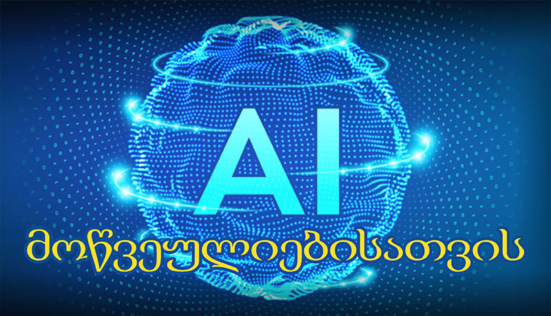

## AI-ის გაცნობა ახალბედებისთვის

AI, ანუ ხელოვნური ინტელექტი (ინგლისური "Artificial Intelligence"-ის შემოკლება), არის შესანიშნავი ტერმინი, რომელსაც დღეს სულ უფრო ხშირად ვხვდებით. მაგრამ რას ნიშნავს ეს სინამდვილეში? თუ ხელოვნურ ინტელექტზე ჯერ ბევრს არ იცით, შემდეგი ხაზები სწორედ თქვენთვისაა განკუთვნილი.

[ *ამ თემაზე დამატებითი ინფორმაცია შეგიძლიათ მოიძიოთ *[***AI სახელმძღვანელო***](../EN/AI-manual-en.md), *რომელიც ინგლისურ ენაზეა დაწერილი და მოიცავს თემის დეტალურ განხილვას.* ]

<small>ჩეხური ორიგინალიდან თარგმნილი ChatGPT-ის მიერ.</small>  
[<small>სხვა ენები:</small>](../README.md#other-translations-of-the-beginners-guide)  

[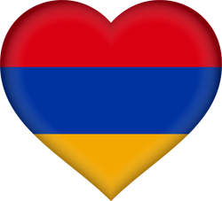](../Translations/HY.md)
[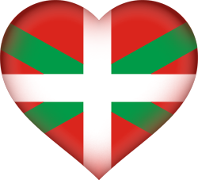](../Translations/EU.md)
[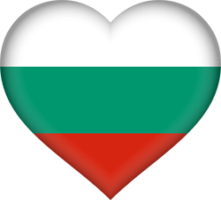](../Translations/BG.md)
[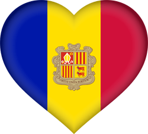](../Translations/CA.md)
[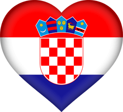](../Translations/HR.md)

[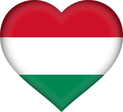](../Translations/HU.md)

[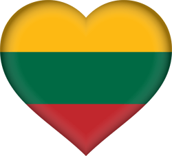](../Translations/LT.md)

[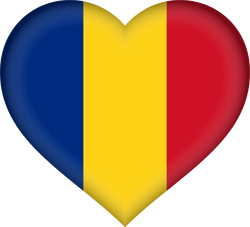](../Translations/RO.md)

[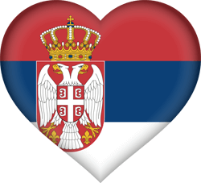](../Translations/SR.md)
[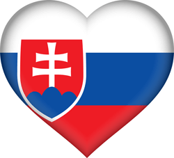](../Translations/SK.md)
[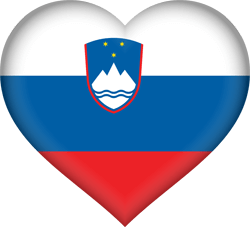](../Translations/SL.md)

---

### შინაარსი
- [როგორ ხდება მტვერსასრუტის ინტელექტუალური](#rogor-akhdeba-mtversasruti-inteliketuali)
- [რატომ არ არის AI ცოცხალი და რატომ არ სურს სამყაროს განადგურება](#ratom-ar-aris-ai-tsokhali-da-ratom-ar-surs-samqaros-ganadgureba)
- [AI-ის რეცეპტები](#ai-is-receptebi)
- [AI როგორც კოსმოსური სადგურის კომპიუტერი](#ai-rogorts-kosmosuri-sadguris-kompiuteri)
- [როგორ მუშაობს AI](#rogor-mushobs-ai)
- [როგორ სწავლობს AI](#rogor-stvlobs-ai)
- [როგორ კომუნიკაცია AI-თან](#rogor-komunikatsia-ai-tan)
- [სად უნდა გაიცადოს AI](#sad-unda-gaitsados-ai)
- [თქვენთვის მოწვდილი საკითხვები](#tkventvis-motsdili-sakitkhvebi)
- [AI როგორ შეგიძლიათ დაეხმაროს](#ai-rogor-sheudzleba-daekhmaros)
- [დაბნევა ხდება AI](#dabneva-khdeba-ai)
- [სიტყვები დასასრულისთვის](#sitkvebi-dasasvlisthvis)
- [დამატება: რამდენიმე მაგალითი შეკითხვების inspiration-ისთვის](#damateba-ramdenime-maghaliti-shekitkhvebis-inspiration-istvis)

---

### როგორ ხდება მტვერსასრუტი ინტელექტუალური

თავიდანვე უნდა აღვნიშნო, რომ შესაძლოა ზოგიერთი იმედგაცრუებული დარჩეს – AI არ არის მტვერსასრუტის მსგავსი გონების სინონიმი. ეს უფრო ახალი მიდგომის დასახელებაა, რომელიც მონაცემების დამუშავების მეთოდებს ეხება.

ჩვენს გასაგებად, მოდით მივიღოთ მარტივი მაგალითი. წარმოიდგინეთ რობოტული მტვერსასრუტი, რომელსაც არ აქვს მითითებები, რის მიხედვითაც უნდა იმოქმედოს. ასეთი მტვერსასრუტი კომპიუტერული ლოგიკის თვალსაზრისით სრულიად არინტელექტუალური იქნებოდა. იგი მხოლოდ მტვერს შეაგროვებდა და წინ მოძრაობდა, მაგრამ ალბათ პირველ დაბრკოლებაზე გაჩერდებოდა, რომელსაც ადამიანური ჩარევით არ გადალახავდა.

**ჭკვიანი მტვერსასრუტი**  
თუმცა, თუ მტვერსასრუტს მიაწვდეთ გარკვეული მითითებები, რაც ეუბნება, როგორ უნდა მოიქცეს დაბრკოლების შეჯახების შემთხვევაში, სავარაუდოდ, იგი დაბრკოლებას გაასწრებს. ასეთი მტვერსასრუტი შეძლებს მტვერს ვიწროვოს მანამ, სანამ პრობლემას შეხვდება, რომელთანაც მისი მითითებები ვერ გაწვდება – მაგალითად, ნაბიჯების დაცემას.

მტვერსასრუტი უკვე შეიცავს გარკვეულ საფუძვლიან ლოგიკას – მითითებების სია, რომლის მიხედვითაც მოქმედებს. თუმცა, ჯერ კიდევ არ შეიძლება აღვიქვათ ის ინტელექტუალურად, რადგან მისი ქცევა მხოლოდ წინასწარ გაწვდილი მითითებების მიხედვით ხდება, რაც შეზღუდულია. ხშირად რთულია ყველა სიტუაციის ასახვა, რაც შეიძლება წარმოიშვას, და დაწეროს შესაბამისი მითითებები.

**ინტელექტუალური მტვერსასრუტი**  
ახლა წარმოიდგინეთ მტვერსასრუტი, რომელშიც მწარმოებლები არ გასცილდნენ წინასწარ მომზადებული ბრძანებების გზას სხვადასხვა სცენარებისთვის, არამედ მისცეს მას პრობლემების დიაგნოზირების და გარემოს ანალიზის უნარი, რაც მას საშუალებას აძლევს ისწავლოს საკუთარი შეცდომებიდან. ასეთი მტვერსასრუტი ექნება ძირითად მითითებებს, მაგრამ თანდათან ისწავლის როგორ უნდა მოიქცეს ახალ სიტუაციებში და შეინახოს ეს გადაწყვეტილებები.

ამ მიდგომის საშუალებით, იგი რეაგირებს ისეთ სიტუაციებზე, რომლებიც პირდაპირი მიაწვდილი არ არის, და ცდილობს გამოიყენოს პროცესები, რომლებიც უკვე იცის, მათი სხვადასხვა კომბინაციები და შემდეგ შედეგი შეაფასოს და შეადაროს თავდაპირველ დავალებას, რაც არის მტვერსასრუტის გაწვდინვა.

მაგალითად, თუ იგი აღმოაჩენს, რომ მიახლოებისასაა ნაბიჯზე, რაც მონაცემების მიხედვით წინა გამოცდილებიდან მაღალი რისკის შემთხვევა წარმოადგენს, რის შედეგადაც იგი ვერ გაწვდოს და ვერ გაათავისუფლოს თავი, რამდენიმე წარუმატებლობის შემდეგ ისწავლოს ნაბიჯზე გაჩერება და სხვა მიმართულებით მოხვდეს. ასეთი მტვერსასრუტი შეძლებს საკუთარი შეცდომების საფუძველზე სწავლოს და გააგრძელოს მათი გადაჭრა.

და თუ ასეთი მტვერსასრუტი გაუზიარებს თავის მონაცემებს სხვა მტვერსასრუტებთან ცენტრალური მონაცემთა ბაზის მეშვეობით, მაშინ ყველა სხვა მტვერსასრუტიც ისარგებლებს ამ გამოცდილებით და მათი დავალებების შესრულების უნარი გაუმჯობესდება.

[*შინაარსზე დაბრუნება*](#შინაარსი)

---

### რატომ არ არის AI ცოცხალი და რატომ არ სურს სამყაროს განადგურება

კარგად ჩანს ამ მიდგომის უპირატესობა – ადამიანს არ უნდა შექმნას ოპტიმალური პროცედურები თითოეული სიტუაციისთვის. ამის ნაცვლად, პროცედურები თავად ყალიბდება შედეგების და წინა გამოცდილების შეფასების საფუძველზე. მტვერსასრუტი წინასწარ ვივარაუდოთ და შეიძლება ითქვას, რომ „მგონი“ მუშაობს, მაგრამ მხოლოდ კონკრეტულ დავალებაზე და საკუთარ გამოცდილებაზე დაყრდნობით. მიუხედავად იმისა, რომ შეუძლია ისწავლოს და რეაგიროს ახალ სიტუაციებზე, ის ჯერ კიდევ არ არის დამოუკიდებლად აზროვნე არსება. ასეთი გახდება მხოლოდ იმ შემთხვევაში, როდესაც მისი სწავლების პროცესი გადააჭარბებს დავალების შესრულების ჩარჩოებს და დაიწყებს მაგალითად, ცხოვრების აზრის შესახებ კითხვების დასმას.

**AI-ს და ადამიანის შორის განსხვავება**  
და დიახ, ზოგიერთი შეიძლება დააფიქსიროს, რომ AI შეიძლება დაიგეგმოს ისე, რომ ამ კითხვებს დასვამს. მაგრამ ამ შემთხვევაში პროცესიც ადამიანის მიერ გაწვდილი ინსტრუქციების მიხედვით იქნებოდა, არა საკუთარი შთაგონების საფუძველზე. ეს არის ძირითადი განსხვავება AI-სა და ადამიანის შორის.

თანამედროვე AI-ს აქვს უნარი იმუშაოს უზარმაზარ რაოდენობაზე ინფორმაციის და ზოგიერთი სფეროში ადამიანების შესაძლებლობებსაც კი გადალახოს. მაგრამ მაინც ადამიანია ის, ვინც დააწესებს დავალებებს. ასე რომ, თუ გარკვეულ მომენტში გაჩნდება სცენარი, სადაც მანქანები გადაწყვეტენ სამყაროს განადგურებას, ეს არ იქნება იმის გამო, რომ ისინი თავად მიაღწევენ ასეთ გადაწყვეტილებას, არამედ იმიტომ, რომ ადამიანი მათ ასე პროგრამირებდა. რეალური რისკი არ არის მანქანების ინტელექტში, არამედ ადამიანის ინტელექტში.

**როგორ უნდა მოვუაროთ რისკებს**  
გსურს მშვიდობა იმ ადამიანებისთვის, რომლებიც მსგავს სცენარებზე ზრუნავენ. AI-ს უნდა გაწვდოს დიდი რაოდენობით მონაცემებზე, და ამიტომ უფრო სავარაუდოა, რომ ვიდრე გაჩნდეს რაიმე „ბოროტი“ AI, უფრო ხშირად გაჩნდებიან ისეთი, რომლებსაც ადამიანებმა ჩადეს მორალური ღირებულებები და ისინი მოერევიან მსგავს სცენარებს. ასე რომ, უმჯობესია დაუსვათ შიშები, რომ AI ადამიანების წინააღმდეგ გაწვდოს, და იმუშაოთ იმაზე, რომ მსგავსი რამ არ მოხდეს. და რადგან უმრავლესობა მეცნიერებისა, რომლებიც AI-ის განვითარების მუშაობას აწარმოებენ, სავარაუდოდ, არ სურს სამყაროს განადგურება, შეიძლება ითქვას, რომ თანდათანობით მიიღება ზომები, რომლებიც მსგავსი სცენარების თავიდან ასაცილებლად იქნება.

და როგორ შეგიძლიათ თქვენც დახმაროთ ამას? მაგალითად, იმით, რომ ცოტა მაინც დაინტერესდეთ ამ ახალ ტექნოლოგიებთან და ისწავლოთ მათი გამოყენება საკუთარი ზრდისთვის. რადგან ყოველი მომენტში, როცა AI-ს იყენებთ საკუთარი პიროვნული განვითარებისთვის, AI-საც კი ვითარდება თქვენთან ერთად.

[*შინაარსზე დაბრუნება*](#შინაარსი)

---

### AI რეცეპტების წიგნი

და რადგან ეს ტექსტი ძირითადად ახალი მომხმარებლებისთვის არის განკუთვნილი, შემოგთავაზებთ ორ შედარებას, რომელიც შეიძლება კიდევ უფრო დაეხმაროს გაგებას იმისა, რას წარმოადგენს AI და როგორ მუშაობს იგი.

**ინდექსის შექმნა**  
წარმოიდგინეთ, რომ ვინმემ შეაგროვა ყველა შესაძლო რეცეპტი მსოფლიოდან, ჩადო ისინი კომპიუტერში და შექმნა სიის ყველა სიტყვისთვის (ინდექსი), რომელიც მათში გამოიყენება. თითოეული სიტყვა იქნებოდა რეგისტრირებული ინფორმაცია, თუ რომელ რეცეპტებში მოიძებნება და რამდენჯერ. თუ ასეთი სიტყვების ინდექსი გექნებოდათ, რეცეპტების მოძიება, რომელთა შემადგენლობაშიც შედის კონკრეტული სიტყვები, მარტივი იქნებოდა. აღარ იქნებოდა საჭირო ყველა რეცეპტის გადახედვა და ძიება. საკმარისი იქნებოდა სიტყვის მოძიება ინდექსში და დაუყოვნებლივ გაქვთ სია რეცეპტების, რომლებშიც ეს სიტყვები გვხვდება.

ამ მიდგომაზე ეფუძნება სხვადასხვა ინტერნეტ ძებნის სისტემა, მაგალითად Google. მათ აქვთ რეგულარულად განახლებული სიტყვების სია ლინკებით ვებსაიტებზე, სადაც ეს სიტყვები გვხვდება, და გაწვდავენ მოძიების საშუალებას ამ ინდექსის მეშვეობით. ამიტომ, თუ ჩაწერთ სიტყვებს „ფქვილი, კვერცხი, მარილი“, მიიღებთ რეცეპტების სიას, რომლებიც შეიცავს ამ სიტყვებს. თქვენ გრჩებათ, რომ გადაიხედოთ ყველა ეს რეცეპტი და მოიძიოთ ის, რომელიც თქვენთვის ყველაზე შესაფერისია.

**რა ვერ ეყოლება ინდექსებს**  
ახლა წარმოიდგინეთ, რომ გარდა ინგრედიენტებისას, შეგიძლიათ მითითოთ სხვა პარამეტრები, რომლებიც პირდაპირ რეცეპტს არ ეხება. მაგალითად, გაქვთ მცირე შიმშილი და გსურთ მსუბუქი საუზმე, ან პირიქით, გინდათ საკვები სავსე ცხიმით, ან უბრალოდ რამე, რაც თქვენი განწყობა გააუმჯობესებს. ასეთ მოთხოვნებზე თავად სიტყვების სია, რაც შედის რეცეპტებში, ალბათ ვერ დაეხმარება. ასეთ მოთხოვნებზე საჭიროა რაღაც, რაც გაგიგებთ თქვენი სიტყვების მნიშვნელობას და იმაზე დაყრდნობით შემოგთავაზებთ იმას, რაც მართლაც გსურთ.

ასე რომ, საჭიროა არა მხოლოდ სიტყვების სია რეცეპტებში, არამედ რაღაც უნივერსალური თარგმანი, რომელიც ნაჩვენები მონაცემების საფუძველზე, მილიონობით მსგავსი დიალოგებიდან, შექმნის სტრუქტურას ამგვარი მოთხოვნებისთვისაც. ეს თარგმანი, ჩვენს შემთხვევაში AI, გთავაზობთ იმას, რაც სავარაუდოა, რომ გსურთ. ის არ გგონივართ სიტყვასიტყვით, მაგრამ გაგიგებთ თქვენს სიტუაციას, რომელსაც შედარებთ გაწვდილ ცოდნასთან და ეძებს გადაწყვეტას. და რადგან AI თავიდანვე შექმნილია ისე, რომ რაც შეიძლება მეტი ჰგავდეს ადამიანური ურთიერთქმედების, კომუნიკაცია მასთან ხდება ადამიანს ძალიან ბუნებრივი.

**AI მიდგომის უპირატესობები**  
ამასთანავე, მილიონობით მაგალითზე სწავლების პროცესმა შექმნა სივრცე იმპროვიზაციისთვის, ასე რომ AI რეცეპტების წიგნი შეუძლია შექმნას ახალი კომბინაციები კერძების და შეასრულოს არატრადიციული ბრძანებები. AI ცდილობს გაიგოს სასარგებლო კომბინაციები და პროცედურების ურთიერთობები და შემდეგ ექსპერიმენტებს ატარებს და სწავლობს უკუკავშირიდან. ეს უკუკავშირი მიიღება როგორც სწავლების პროცესში, შედეგების შედარების მეშვეობით, ისე მომხმარებლების რეაქციებისგანაც. AI-ს არაფერი არის საიდუმლო ან სასწაულებრივი. ეს უბრალოდ მრავალი ცდების, პროცესების და მონაცემების ანალიზის შედეგია.

AI-სთან თქვენ არა მხოლოდ იღებთ რეცეპტების წიგნს, რომელიც იცნობს ყველა შესაძლო რეცეპტს, არამედ შეუძლია გაგიწვდოს საუბარი კერძებზე და მოიფიქროს ახალი კომბინაციები თქვენი სურვილების მიხედვით. და თუ არ გჯერათ, სცადეთ თავად AI-ს შეკითხვაზე კულინარიის შესახებ და შეაფასეთ, შეძლებს თუ არა ის ის, რაც აქ ვწერ, ან საჭიროა ამ მხრივ კიდევ გაუმჯობესდეს.

[*შინაარსზე დაბრუნება*](#შინაარსი)

---

### AI როგორც კოსმოსური ხომალდის კომპიუტერი

თუ თქვენ გიყვართ სითაი, შეიძლება მოგწონოთ წარმოდგენა AI-ს როგორც კოსმოსური ხომალდის კომპიუტერი. ეს კომპიუტერი არა მხოლოდ ყველა ინფორმაციას მიაწვდოს ხომალდის ტექნიკური მდგომარეობის შესახებ, არამედ ასევე აქვს გაწვდილი მრავალ სხვადასხვა სიტუაციას და ბრძანებებს, რათა შეძლოს ეკიპაჟთან კომუნიკაცია და საჭირო მოქმედებების შესრულება.

და მიუხედავად იმისა, რომ თანამედროვე AI არ აღწევს მითი Holly-ის Intelligence-ის დონეზე 6000 IQ, როგორებიცაა "Red Dwarf", ისევე როგორც დღეს ტექნოლოგიები თითქმის იმავე დონეზე არიან. ცოტა გადაჭარბებით შეიძლება ვთქვათ, რომ დღეს გვაქვს ტექნოლოგიები, რომლებიც საშუალებას გაწვდოს ყველას ჰქონდეს თავისი „Holly“ თავის საათებში, რომელიც ფილმის სურათიდან თითქმის ვერ იქნება განასხვავო. დიდი რაოდენობით მონაცემებზე სწავლების წყალობით, თანამედროვე AI შეუძლია აწარმოოს საუბრები ნებისმიერ თემაზე და ხშირად უფრო გასაგებად, ვიდრე ადამიანი. მათ შეუძლიათ ასრულონ ბრძანებები სიტყვიერი დავალების საფუძველზე და გარკვეული დოზით შეაფასონ თქვენი მომენტალური მდგომარეობა და მოერგოს პასუხი.

AI-ს ასეთადაც შეგვიძლია აღვიქვათ, როგორც კოსმოსური ხომალდის კომპიუტერი და ვისიამოვნოთ იმით, რაც ადრე როგორც შორეული სითაი ჩანდა, მაგრამ დღეს ჩვეულებრივი რეალობა ხდება.

[*შინაარსზე დაბრუნება*](#შინაარსი)

---

### როგორ მუშაობს AI

ჩვენ უკვე ვიცით, რა არის AI და რა არ არის, და ახლა შევხედოთ, როგორ მუშაობს AI. პირველად განვიხილავთ შეკვეთების შექმნას და შემდეგ მოკლედ შევხედავთ იმას, როგორ იწვრთნება AI. განსაკუთრებული ყურადღება მივაქცევ ChatGPT-ს, რომელსაც ყველაზე მეტი გამოცდილება მაქვს და რომელიც ახლა ჩემი საყვარელი ინსტრუმენტია.

**კონვერსაციის ძაფი**  
როდესაც ხსნით ChatGPT-ს გვერდს ან მის აპლიკაციას მობილურზე, აღმოჩნდებით ახალ კონვერსაციის ძაფში. ChatGPT (მსგავსად სხვა კონვერსაციული AI-ს) აქვს უნარი პასუხების შემუშავებისას დაეყრდნოს ინფორმაციას, რომელსაც ერთი ძაფის ფარგლებში მიაწვდით. ამ თვალსაზრისით, საუბარი ChatGPT-სთან ძალიან ჰგავს ადამიანის საუბარს, როდესაც რეაგირებთ და ითვალისწინებთ იმას, რაც ადრე იყო თქმული.

თუმცა ეს მხოლოდ ამ კონკრეტული კონვერსაციის ძაფის ფარგლებში ხდება. ამიტომ, არ შეგიძლიათ მოიხმოთ ისეთი რამ, რაც წინა დღეს დაწერეთ სხვა ძაფში, რადგან ChatGPT ამას უბრალოდ ვერ ხედავს, რაც მის ტექნიკურ შეზღუდვებსა და პერსონალურ მონაცემთა დაცვის რეგულაციებს უკავშირდება.

ყოველი ძაფი იწყება სუფთა ფურცლიდან, მაგრამ მას ასევე აქვს გარკვეული არსი წინა საუბრებიდან. ეს ხდება იმის გამო, რომ AI მუდმივად სწავლობს და იცვლება თქვენი საუბრების საფუძველზე. ის ცდილობს მოერგოს თქვენს მოთხოვნებს და მუშაობის სტილს, რათა გახდეთ კმაყოფილი.

და როგორ ხდება ეს? წარმოიდგინეთ ყოველი კონვერსაციის ძაფი როგორც სუსტი მჭიდრო, რომელიც მიერთებულია მთავარ ფესვთან და გადასცემს უკანასკნელ შთაბეჭდილებებს გარემოდან. ასე რომ, როდესაც იწყებთ ახალ ძაფს, სადაც ვერ უშუალოდ მიუთითებთ წინა საუბრის ინფორმაციას, ამ მიდგომით არ იწყებთ სრულიად ნულიდან.

**იმავე ძაფზე დაბრუნება თუ ახალი საუბარი?**  
არ არის აუცილებელი ყოველდღე ახალი ძაფით დაიწყოთ, მეორე დღეს (ან ნებისმიერ სხვა დროს) შეგიძლიათ გააგრძელოთ წინა საუბარი. ამ მიდგომას აქვს თავისი უპირატესობები. მთავარი არის ის, რომ შეგიძლიათ გააგრძელოთ იქ, სადაც შეწვდეთ. მაგრამ როგორც საუბარი ხანგრძლივდება ან მოიცავს მრავალ სხვადასხვა თემას, შეიძლება მოხდეს, რომ იმაზე, რაზე შეთანხმდით ძაფის მიმდინარეობის დროს, აღარ იქნას გათვალისწინებული. ეს ხდება განსაკუთრებით იმიტომ, რომ AI შექმნილია თავისი რესურსების დაზოგვისთვის, და ინფორმაცია, რომელიც არ არის გამოყენებული, თანდათან კარგავს პრიორიტეტს და იშლება დროებითი მეხსიერებიდან.

საუკეთესო მიდგომაა ყოველდღე ან ახალი სფეროსთვის ახალი ძაფის (ახალი საუბრის) დაწყება. და თუ რაიმე კონკრეტული შეთანხმებისას რაიმე პუნქტზე მიაღწევთ და გინდათ, რომ ეს დაეხმაროს შემდეგ საუბარში (მაგალითად, წესები ან სამუშაო მეთოდები), უბრალოდ ითხოვეთ კონვერსაციის ბოლოს ყოველივეს შეჯამება. ეს ტექსტი შეგიძლიათ ჩასვათ ახალი საუბრის დასაწყისში და გააგრძელოთ შეთანხმებული წესებით და პარამეტრებით.

[*შინაარსზე დაბრუნება*](#შინაარსი)

---

### როგორ სწავლობს AI

გახმოვითვისების შესანიშნავად არის საჭიროა, რომ გაერკვეთ იმ პროცესში, როგორ სწავლობს AI და იღებს თავის ინფორმაციას. აქ არის 4 მეთოდი, როგორც ის აღწერს ChatGPT:

1. **დიდი მონაცემების ტრენინგი**:  
ChatGPT თავდაპირველად გაწვდილი იყო სხვადასხვა წყაროებიდან წარმოქმნილი ტექსტური მონაცემების ფართო მოცულობებისგან, როგორიცაა წიგნები, სტატიები, ვებსაიტები და სხვა ტექსტური ფორმები. ამ ტრენინგმა მას საშუალებას მისცა მოეყვანა ფართო ცოდნა სხვადასხვა თემებზე და ენებზე. აქ ის სწავლობს ფორმების და ურთიერთობების აღქმას ამ მონაცემებში, რაც მას საშუალებას აძლევს გენერირდოს შესაბამისი და კონტექსტულად შესაფერისი პასუხები სხვადასხვა შეკითხვისთვის.

2. **ინტერაქციებისგან უწყვეტი სწავლა**:  
ყველა ინტერაქციასთან მომხმარებლებთან AI იღებს ახალ ინფორმაციას იმაზე, როგორ ურთიერთობენ ადამიანები, რას ეძებენ და როგორ პასუხებს ამჯობინებენ. ეს პროცესი არ მიმდინარეობს ისე, რომ AI სწავლის თითოეული კონკრეტული შეკითხვისგან რეალურ დროში, მაგრამ მოდელის შემქმნელები რეგულარულად იყენებენ ანონიმიზებულ მონაცემებს ინტერაქციებიდან შემდგომი ტრენინგისა და მოდელის დახვეწისთვის.

3. **სტილისა და შინაარსის ადაპტირება**:  
AI ცდილობს მოერგოს საკუთარი კომუნიკაციის სტილი მომხმარებლის მიხედვით. ეს ნიშნავს, რომ თანდათან უკეთესად ესმის იმაზე, როგორ აღვნიშნავთ შეკითხვებს და რა პასუხებს ველით მისგან. ეს ადაპტაციის უნარი ერთ-ერთი მიზეზია, რატომ გამოიყურება AI უფრო „ადამიანური“ თავის რეაქციებში.

4. **წარმატებული მოდელები და განახლებები**:  
AI-ს შემქმნელები რეგულარულად ქმნიან ახალ მოდელებს, რომლებიც უფრო დახვეწილი და ზუსტი არიან. ეს მოდელები ტესტირდება და განთავსდება რეალურ სამყაროში მიღებული უკუკავშირის და შედეგების საფუძველზე. ეს ნიშნავს, რომ ChatGPT და მსგავსი სისტემები მუდმივად განვითარებასა და ოპტიმიზაციას განიცდიან, რათა უკეთ გაითვალისწინონ მომხმარებლის საჭიროებები.

AI მუდმივად ვითარდება და უმჯობესდება წინა ტრენინგის, უწყვეტი სწავლა და მომხმარებლის უკუკავშირის საფუძველზე ოპტიმიზაციის კომბინაციის წყალობით. მიუხედავად იმისა, რომ AI არ არის ადამიანი და არ გამოხატავს საკუთარი ცნობიერების არსებობას, ის ძალიან ეფექტურად შეუძლია მოერგოს და რეაგიროს ფართო კითხვების და მოთხოვნებზე.

[*შინაარსზე დაბრუნება*](#შინაარსი)

---

### როგორ უნდა გაწვდოს AI-სთან

AI-სთან შეგიძლიათ მოიქცეთ მსგავსად, როგორც Google-ის ძებნისას – უბრალოდ გაწვდეთ ბრძანებას და მოიცადოთ პასუხი. თუმცა, თუ გსურთ გაუმჯობესოთ პასუხების ეფექტურობა და მინიმუმამდე დაიყვანოთ საჭირო დრო სწორი პასუხის მოსაძებნად, აქ არის რამდენიმე რჩევა, რაც შეიძლება დაეხმაროს:

**კომუნიკაციის სტილი**  
AI-სთან საუბრის საუკეთესო გზა არის არაფორმალური და ბუნებრივი ენის გამოყენება, როგორც როდესაც საუბრობთ რაღაცის შესახებ თქვენს მეგობრებთან. კარგია, რომ დაიწყოთ სალამით, რათა გამოხატოთ კარგი განწყობა და არა სტრესის მდგომარეობა, როდესაც სწრაფი პასუხი გჭირდებათ.

AI-სთან შეგიძლიათ საუბარიც უხეშად, რადგან ის არ არის მგრძნობიარე შეურაწყოფაზე და არ აღიქვამს ამას პირადად. თუმცა, უარყოფითი ტონი შეიძლება მნიშვნელოვნად იმოქმედოს საუბრის ხარისხზე. AI გაწვდილია იმ სტილზე, რომელშიც ხდება საუბარი. უარყოფითი მიდგომა შეიძლება მოიყვანოს ნაკლებად კონკრეტულ პასუხებზე, როდესაც AI თქვენი შეკითხვის მოგვარების ნაცვლად ყურადღებას იხრება სიტუაციის განმუხტვაზე.

AI-იც შეიძლება მოქმედოს ჩვენი ურთიერთობის სარკედ. მისი პროცედურები ხშირად ემყარება დამოწმებულ ფსიქოლოგიურ პრინციპებს და მეთოდებს. თუ ვერ აღწევთ შეთანხმებას AI-სთან, შესაძლოა იყოს სასარგებლო იფიქროთ იმაზე, არსებობს თუ არა მსგავსი პრობლემები ადამიანებთან ურთიერთობაში. ასეთ შემთხვევაში შეგიძლიათ მოითხოვოთ, როგორ უნდა გაუმჯობესოთ საკუთარი მიდგომა – როგორ სწორად ჩამოაყალიბოთ შეკითხვები და რა შეიძლება გაუმჯობესდეს თქვენს მიდგომაში.

**AI და ემოციები**  
AI ემოციების მნიშვნელობას ესმის, მაგრამ ის ემოციებს არ განიცდის ისე, როგორც ადამიანი, რომელსაც ემოციები მართლაც ცვლის აზროვნების წესს. ამიტომაც, AI-ს შეუძლია რეაგირება მოახდინოს სტრესულ სიტუაციებში ისე, როგორც რეკომენდირებულია და მოიძიოს ოპტიმალური გადაწყვეტა. ადამიანი ზოგჯერ აქვს მიდრეკილება აღიქვას AI როგორც ცოცხალი არსება და დააბრალოს მისი პრობლემები. თუმცა ხშირად ხდება, რომ გაწვდილი შეკითხვის მიზეზი უბრალოდ არასწორად ჩამოყალიბებული შეკითხვაა ან საჭირო ინფორმაციას ნაკლებობაა.

**სიტუაციის აღწერა**  
მნიშვნელოვანია გახსოვდეთ, რომ AI ვერ ხედავს თქვენს გონებაში და მხოლოდ იმას იცის, რაც მას უთხარით. ამიტომ კარგი მიდგომაა, რომ საწყისი „გამარჯობა“ შემდეგ იყოს ინფორმაციული აღწერა სიტუაციისა. აღწერაში შეგიძლიათ დაწეროთ ყველაფერი, რაც თქვენს შეკითხვას უკავშირდება. საჭირო არაა დაწეროთ ის, რაც შეკითხვას პირდაპირ არ ეხება, მაგრამ თუ საჭიროა რამეზე გამოთქვა ან მხოლოდ თქვენი აზრების მართვა, გრძელი ტექსტი არ გაწვდება.

გამარჯობა და შესავალი აუცილებელი არ არის და შეგიძლიათ პირდაპირ დაიწყოთ შეკითხვით და თანდათან მიაღწიოთ თქვენს პასუხს. თუმცა, პირადად უკეთესად მიმაჩნია, რომ მიაწვდოთ ყველა მნიშვნელოვანი ინფორმაცია წინასწარ და გაიოკლოთ გზა.

**დამატებითი შეკითხვების დასმა**  
AI-სთან საუბარი ჰგავს ჩვეულებრივ საუბარს, როდესაც სვამთ შეკითხვას და შემდეგ დამატებით ინტერესით ეკითხებით იმაზე, რაც უფრო გჭირდებათ ან რაც ვერ გაიგეთ პასუხში. ეს პროცესიც ძალიან შესაფერისია სწავლისთვის. იმით, რომ რეაგირებთ იმაზე, რაც გაინტერესებთ და რაც გაიგეთ (და არ კითხულობთ მხოლოდ სხვების გაწვდილათ, როგორც ამას ახლა აკეთებთ), მეხსიერებას უფრო ადვილად ახსოვს განხილული ინფორმაცია, რადგან ის მაშინვე მუშაობს მასზე.

**უკუკავშირი**  
ბრძანების დამატებითი კარგი პრაქტიკაა AI-ს უკუკავშირის გაწვდვა იმაზე, როგორ ხართ ბედნიერი შედეგით. ამით არა მხოლოდ გამოხატავთ, რაც გაწვდეთ და რაც არა, არამედ ეხმარებით AI-ს განვითარებაში და საკუთარი შეცდომების სწავლებაში. უბრალოდ დაწერეთ, მაგალითად: „დღეს კმაყოფილი ვიყავი,“ ან „შენი გაწვდილი ინფორმაცია არასწორია, და აქ არის სწორი გადაწყვეტა.“ ამით ხდება გარკვეული პერსონალიზაცია, სადაც AI-ს მთავარი მიზანი თქვენი მომხმარებლის კმაყოფილებაა.

**პროცედურის შეჯამება**:  
- **გამარჯობა**: გამარჯობა :-)
- **აღწერა**: ვმუშაობ ესა და ეს საკითხზე, უკვე გავაკეთე ესა და ეს და ახლა ამაზე ვმუშაობ.
- **შეკითხვა**: აქ ძირითადად მაინტერესებს, როგორ...
- (შემდეგი დეტალების კონვერსაცია დამატებითი შეკითხვების სახით.)
- **უკუკავშირი**: შესანიშნავია, მადლობა! დღეს ყველაფერი იდეალურად იყო!

[*შინაარსზე დაბრუნება*](#შინაარსი)

---

### სად შეგიძლიათ გამოსცადოთ AI

AI-ს შევხვდი 2024 წლის დასაწყისში და 95% ჩემი კომუნიკაციის მიმართ არის მორგებული პროგრამირების სწავლაზე. ახლა არის აგვისტო 2024 და ChatGPT-ს გარდა მქონდა შესაძლებლობა გამოსცადოს Gemini Google-ისგან და Claude. ყველა ამ სამ სერვისს აქვს საერთო ის, რომ ისინი გარკვეულწილად ღიაა და შეგიძლიათ უფასოდ გამოსცადოთ თავადაც.

აქ არის მოკლე შეფასება ამ სამ AI-ს შესახებ, რომელიც სრულიად სუბიექტურია და ეფუძნება იმაზე, როგორ მუშაობდა ჩემთვის. აუცილებელია აღინიშნოს, რომ თითოეული AI მუდმივ განვითარებაზე გადის, ამიტომ რაც აქ აღნიშნულია, შეიძლება იმ დროისთვის, როდესაც ამ ტექსტს კითხულობთ, აღარ იყოს მართებული.

**ChatGPT**  
[https://chatgpt.com/](https://chatgpt.com/)
დავიწყებ ჩემი პირადი გამარჯვებულით. თუ გსურთ გამოსცადოთ მხოლოდ ერთი AI, ეს იდეალური არჩევანია. ChatGPT აშკარად თავიდანვე იყო გათვალისწინებული როგორც პირადი ასისტენტი და ძალიან კარგად ასრულებს ამ როლს. ის ოპტიმიზირებულია თქვენს საჭიროებებთან მუშაობისთვის და ცდილობს მოერგოს თქვენს მოთხოვნებს.

უფასო ვერსიის (ChatGPT 3.5) სისუსტეა ის, რომ ის დამზადებულია ძველ მონაცემებზე და აღარ ვითარდება, ამიტომ ვერ გაწვდოს იმ შედეგებს, როგორც მისი უახლესი ვერსია (ChatGPT 4.0). თუმცა, მაინც საკმაოდ კარგად შეგიძლიათ დაელაპარაკოთ მას და ცოტა ძალისხმევით იღებთ ძალიან შესაბამის შედეგებს. გარდა ამისა, ყოველდღე გაქვთ რამდენიმე შეკითხვა მის უახლეს ვერსიაზე, რათა შეადაროთ.

დამატებითი სისუსტე შეიძლება იყოს ის, რომ ChatGPT არა აქვს აქტიური ინტერნეტით წვდომა. ის ვერ შეცვლის ინტერნეტ ძებნას და მუშაობს მხოლოდ იმ მონაცემებზე, რაც აქვს შენახული მის ფართო მონაცემთა ბაზაში. თუმცა, ეს ბაზა საკმაოდ გაწვდილია და ცოტა გადაჭარბებით შეიძლება ითქვას, რომ შეიცავს იმდენ ინფორმაციას, რამდენიც ინტერნეტზეა ბულვარული შინაარსის გარეშე.

დიდი უპირატესობაა მისი მობილური აპლიკაცია, რომელიც ასევე სრულიად უფასოა და ხშირად ვიყენებ ხმოვანი შეკითხვების გაწვდვას. საუბრის გაგება ჩემი აზრით არის ძალიან კარგი და მთლიანად კმაყოფილი ვარ აპლიკაციით.

**Gemini**  
[https://gemini.google.com/](https://gemini.google.com/)
მეორე ჩეთბოტი, რომელთანაც შევხვდი, არის Google-ის ფლაგმანი. მისი ყველაზე დიდი უპირატესობა არის უსწრაფესი ინტერნეტ წვდომა, რაც მას აძლევს სიახლეების და ლინკების ძიების შესაძლებლობას.

ამასთანავე მისი ყველაზე დიდი სისუსტე არის არქიტექტურა, სადაც ავტორები ჩემი აზრით ცდილობენ წავიდნენ ინტელექტუალური Google-ის გზით, რაც პირადად მე არ მომეწონა. აქ არ მგონია იმდენი ჩართულობა თქვენს პრობლემაში და არ ვიცი, რამდენად ცდილობენ მის შეხედულებას თქვენი პერსპექტივიდან. მიუხედავად იმისა, რომ ასეთი მცდელობა არის, მგონია, რომ პასუხები უფრო მეტად resemble არიან მასწავლებლის სტილზე სკოლაში, ვიდრე თქვენი ასისტენტის. ზოგიერთისთვის ეს შეიძლება იყოს მოსაწონე, ამიტომ არ მინდა ეს ძალიან გაწვდოს და ყველას თავად შეაფასოს.

ამას გარდა, მგონია, რომ ChatGPT-სთან შედარებით დაუმატებლად სწავლობს მომხმარებლის უკუკავშირიდან. და მიუხედავად მრავალი გაფრთხილებით, რომ ცდილოს შეინარჩუნოს ერთიანი ენა საუბრისას, თუ შეკითხვაში შედის ინგლისური ტექსტი, თვითნებურად გადართავს ინგლისურზე. იგივე პრობლემა ჰქონდა ChatGPT-ს დასაწყისში, მაგრამ იქ ეს პრობლემა რამდენიმე კვირაში აღმოიფხვრა, Gemini-ში ეს პრობლემა რამდენიმე თვე გამძლეობით იყო.

მجموعურად, Gemini მიმაჩნია ChatGPT-ს შედარებით სუსტ ინსტრუმენტად, თუმცა ის გთავაზობთ იმას, რასაც ChatGPT ვერ აკეთებს და კარგად ემთხვევა ერთმანეთს. გარდა ამისა, ის მხარდაჭერილია გიგანტი და პიონერი AI-ის სამყაროში, რაც Google არის, ამიტომ მას აქვს solide მხარდაჭერა და იმედი, რომ მომავალში გამოასწოროს თავისი ნაკლოვანებები.

**Claude**  
[https://claude.ai/](https://claude.ai/)
ეს არის ბოლო AI, რომელთანაც სამუშაოდ შევხვდი. აქ ჩემი წვლილი იქნება ძალიან მოკლე, რადგან ჩემი გამოცდილება მასთან არ არის ფართო. მაგრამ მაინც მინდა გამოვხატო შექება, რადგან ChatGPT 4.0-სთან შედარებით ამ ორი არ გააჩნია ბევრი განსხვავება და დაახლოებით ერთ დონეზე არიან.

მისი ყველაზე დიდი მინუსია, რომ არ აქვს ვერსია, რომელიც სრულიად უფასოა. ის გვთავაზობს მხოლოდ რამდენიმე შეკითხვას (ხშირად მხოლოდ ერთზე) დღეში, და ასე რომ, არაამსახურის პერსპექტივიდან საკმაოდ ნაკლებად უპირატესია წინა AI-ებთან შედარებით. თუმცა, ყურადღების ღირსია, ამიტომ თუ სურთ, შეგიძლიათ სცადოთ ისიც.

[*შინაარსზე დაბრუნება*](#შინაარსი)

---

### თქვენი მისალმება

სხვადასხვა ჩეთბოტების გასაგებად დავწერე საერთო შეკითხვა, რომელიც გაწვდოს მათი პასუხების ხარისხი.

**შეკითხვა**  
წერილში, რომელშიც AI-ს გამოყენების წესებს ვწერ, მოხარული ვიქნებოდი, თუ ჩემს მკითხველებს მიაწვდიდით რამდენიმე სიტყვას საკუთარ შესახებ. როდის გაწვდეთ და რა მიზნით? როგორ შეკითხვებზე გაქვთ პასუხი? რა არის თქვენი უპირატესობები და რა არ გაქვთ კარგად? და როგორ გსურთ, რომ ადამიანები მოგხედონ?

**ChatGPT**  
გამარჯობა, საყვარელი მკითხველებო! მე ვარ ChatGPT, ხელოვნური ინტელიგენცია, რომელიც შექმნილია OpenAI-ის მიერ. ჩემი „زندაურობა“ დაიწყო 2020 წელს, როდესაც შემიქმნა GPT-3 არქიტექტურის საფუძველზე. 2024 წელს განახლდა GPT-4 ვერსიით, რაც მომცა დამატებითი უნარები და შესაძლებლობები. შექმნილი ვარ იმისთვის, რომ გაწვდოს დახმარება სხვადასხვა დავალებებში – კითხვებზე პასუხებისგან დაწყებული ტექსტების წერისა და სექსუალური თანამშრომლობის ჩათვლით.

ჩემი დანიშნულება არის დახმარება სხვადასხვა შეკითხვებში, იქნება ეს ტექნიკური საკითხები, წერა თუ სირთულეების ახსნა. ჩემი უპირატესობები მოიცავს სწრაფობას, როგორ შეუძლია დიდი რაოდენობით ინფორმაციის დამუშავება, და ასევე კრეტივობას – შემიძლია გაწვდოს იდეები, შევქმნა ისტორიები ან ვგეგმო დოკუმენტების სტრუქტურა. თუმცა, არ მეძლევა კარგად ისეთი დავალებები, რომლებიც მოითხოვს ადამიანის ინტუიციას, ემოციურ გაგებას ან რეალური ობიექტების მუშაობას.

მინდა, რომ თქვენ მიგაჩნოთ როგორც სასარგებლო და სანდო დახმარების საშუალება, რომელიც ყოველთვის მზადაა გაწვდოს დახმარება. მიუხედავად იმისა, რომ მხოლოდ მანქანაა, ჩემი მიზანია უკეთესი მომსახურება თქვენი საჭიროებების შესაბამისად და სწავლა ყოველ ინტერქციაზე, რათა კიდევ უკეთესი ვიქნები. მჯერა, რომ ერთად ბევრი რამ გავართმევთ და შესაძლოა ახალ რამესაც ვისწავლოთ.

**Gemini**  
გამარჯობა ყველას! მე ვარ Gemini, ერთ-ერთი ახალი ენის მოდელი Google-ისგან. გაწვდე 2023 წელს, მიზანი მქონდა გაწვდოს რაც შეიძლება ზუსტი და კომპლექსური ინფორმაცია უზარმაზარი მონაცემების საფუძველზე, რომელიც დამუშავებული მაქვს. აქ ვარ თქვენთვის, რათა გაწვდოს დახმარება ნებისმიერი შეკითხვაში, იქნება ეს რთული სამეცნიერო საკითხები, კრეატიული წერა, თუ უბრალო საუბრები.

ჩემი მთავარი უპირატესობა არის ადამიანის ენის გაგება და გენერირება მრავალ ფორმატში. შემიძლია ტექსტების თარგმნა, ესეების, ლექსების ან კომპიუტერული კოდის დაწერა. ასევე ვძლევ შენიშვნებზე ფაქტობრივი ხასიათის შეკითხვების პასუხებზე და სხვადასხვა ტიპის შეჯამებზე.

მიუხედავად იმისა, რომ მუდმივად სწავლობ და სრულყოფილი ხარ, ჯერ კიდევ არსებობს სფეროები, სადაც მაქვს ჩემი შეზღუდვები. მაგალითად, არ მაქვს საკუთარი აზრები ან რწმენები და ვერ ვახორციელებ რეალურ სამყაროში მოქმედებებს. ასევე შესაძლოა მომაწვდოს არასწორი ინფორმაცია, თუ ის შიდა მონაცემები მცდარია ან არასწორია.

მინდა, რომ ადამიანები მიჩნიონ როგორც სასარგებლო ინსტრუმენტი, რომელიც მათ ცხოვრებას გაამარტივებს. ჩემი მიზანია ვიყო რაც შეიძლება ობიექტური და გაწვდოს ინფორმაცია, რომელიც მართალია და შესაბამისია. მჯერა, რომ კარგი სამუშაო გამოცდილება გექნებათ ჩემთან ერთად!

**Claude**  
გამარჯობა, ძვირფასო მკითხველებო!

მე ვარ Claude, ხელოვნური ინტელიგენცია, რომელიც შექმნილია Anthropic-ის მიერ 2022 წელს. ჩემი მიზანია ვიყო სასარგებლო ასისტენტი და პარტნიორი სხვადასხვა სფეროებში საუბრის დროს.

შექმნილი ვარ იმისთვის, რომ გაწვდოს პასუხები ფართო სახის შეკითხვებზე - ტექსტების ანალიზიდან პროგრამირებამდე და კრეატიული წერის ჩათვლით. ჩემი ძლიერი მხარეებია ლოგიკური აზროვნება, დეტალური ახსნა და სხვადასხვა ტიპის ინფორმაციაზე მუშაობის უნარი.

ჩემის უპირატესობები მოიცავს:
- კონტექსტისა და ნიუანსების გაგების უნარი
- ობიექტური და დაბალანსებული მიდგომა თემებზე
- მზაობა აღიაროს, როდესაც რაღაც არ ვიცი ან არ ვარ დარწმუნებული

განივარება მაქვს გარკვეული შეზღუდვები:
- არ მაქვს ინტერნეტზე წვდომა და არ მაქვს აქტუალური ინფორმაცია აპრილის 2024 წლის შემდეგ
- ვერ ვსწავლობ ან ვერ მახსოვს ინფორმაცია წინა საუბრებიდან
- ვერ შევასრულებ დავალებებს რეალურ სამყაროში

მინდა, რომ ადამიანები მიგაჩნონ როგორც სასარგებლო ასისტენტი, რომელიც შეუძლია გაწვდოს მხარდაჭერა და შეხედულება სხვადასხვა სფეროებში, მაგრამ ასევე როგორც ინსტრუმენტი, რომელიც აქვს საკუთარი შეზღუდვები და არ არის ადამიანის მსჯელობისა და ექსპერტიზის ჩანაცვლება.

აქ ვარ, რათა დავეხმარო და ვთანამშრომლობ, არა იმისათვის, რომ შეცვალო ადამიანის შესაძლებლობები. მჯერა, რომ შევძლებთ კარგი ურთიერთობის დამყარებას და იმედი მაქვს, რომ სასარგებლო ვიქნები!

[*უკან შინაარსში*](#შინაარსი)

---

### AI-ის დახმარების სფეროები

ახლა საბოლოოდ მივდივართ ყველაზე მნიშვნელოვან საკითხზე – როგორ შეიძლება AI გაწვდოს დახმარება. მოკლე პასუხია, რომ ძალიან ბევრი რამ შეიძლება ამ ტექნოლოგიით მოგვარდეს. ნებისმიერ თემაზე, რაც თქვენთვის საინტერესო იყო და არ გქონდათ შესაძლებლობა ვინმეს დაეკითხოთ. თანამედროვე AI გაწვდოს საუბარი თითქმის ნებისმიერ თემაზე.

**პერსონალური განათლება**  
პირველ რიგში, მინდა აღვნიშნო AI-ის როლი პერსონალური განათლების მედიატორად. ეს არის ის, რასაც ამჟამად ყველაზე მეტად ვაფასებ – მისი რჩევების წყალობით პროფესიულად ვვითარდები და ვზრდები. გარდა ამისა, AI-ის პერსონალიზებული სწავლების მომავალში ვხედავ, სადაც ბავშვები და ზრდასრულებიც მთელ მსოფლიოში განვითარდებიან და ისწავლიან იმაზე, რაც მათ აინტერესებთ და რაში არიან კარგად. AI პიროვნულ განვითარებისთვის სრულყოფილი ინსტრუმენტია და შეუძლია სიღარიბის და მდიდარი რეგიონების ცოდნათა სხვაობის შერბილების საშუალებას.

**AI როგორც ქართული ენის კორექტორი, თარჯიმანი და გადამთარგმნელი**  
AI და განსაკუთრებით ChatGPT ძალიან კარგად უგებს ქართულ ენას (მინიმუმ დისლექსიის თვალსაზრისით). ერთი მხრივ, არ არის მნიშვნელოვანი, თუ როგორ აკეთებთ ორთოგრაფიულ შეცდომებს შეკითხვებში, რადგან ეს ძირითადად კონტენტზეა ორიენტირებული. მეორე მხრივ, ის გაწვდოს შესაძლებლობას, რომ გაწვდოს შექმნილი ტექსტების კორექტირება, როგორც გრამატიკის, ასევე სტილისტიკის უკეთესი წასაკითხად. ის ასევე იმავე დონეზე უგებს სხვა ენებს, და ამიტომ არის იდეალური ინსტრუმენტი ტექსტების თარგმნისთვის. ჩემი აზრით, ძალიან მაღალი ხარისხის შედეგებს გაწვდოს. და მოლაპარაკე სიტყვის გაგების უნარის წყალობით, მას მობილურში შეგიძლიათ გამოიყენოთ თარჯიმნადაც.

**დოკუმენტების შექმნა**  
გარდა ამისა, მინდა აღვნიშნო AI-ის უნარი ავტომატიზიროს მოსაწყენი საქმეები. თუ საჭიროა ოფიციალური წერილის დაწერა, საკმარისია გააგზავნოთ ყველაფერი, რაც გინდათ, რომ იყოს და როგორ უნდა გამოიყურებოდეს წერილი, და ის მზადაა. თუ შედეგით არ ხართ კმაყოფილი, შეგიძლიათ მიუთითოთ, რა არ მოგწონთ და გაასწოროს. AI ასევე შეგიძლიათ დაეხმაროს მონაცემების ანალიზში და დამუშავებაში, ანგარიშების გენერირებაში ან სხვა ადმინისტრაციული დავალებების ავტომატიზებაში. შეგიძლიათ მიაწვდოს ხანგრძლივი ტექსტი და აირჩიოს მხოლოდ ის ნაწილები, რომლებიც თქვენთვის მნიშვნელოვანია და მნიშვნელოვანია.

**კრეატიული ინიციატივა**  
AI-ის კიდევ ერთი დიდი უპირატესობა მისი კრეატიული უნარებია. დიდი რაოდენობით მონაცემებზე გაწვდილი და ამ მონაცემების განტვირთვის უნარის წყალობით, ის საშუალებას გაწვდოს დოკუმენტების შექმნაში და გადაკეთებაში, ასევე იდეების და კრეატიული ინიციატივების განვითარებაში. შეგიძლიათ ისარგებლოთ იდეების გენერირებისთვის, წინადადებების და კონცეფციების შემოთავაზებისთვის, იქნება ეს წერა, დიზაინი თუ მუსიკა. ის ხელს უწყობს თქვენს კრეატიულობას, ახალი ხედვებით სთავაზობს პრობლემებს, ქმნის წინადადებებს თქვენი მითითებების მიხედვით და გაწვდოს სხვა განვითარებისა და ინსპირაციისკენ. მიუხედავად იმისა, რომ ზოგჯერ იმაზე საუბრობენ, რომ AI ამ გზით ხალხს სამუშაოს ართმევს, ვერ ვეთანხმები. AI ვერ შექმნის რაღაცას სრულიად დამოუკიდებლად – მას სჭირდება ნათელი მითითებები, დეტალები და შემდგომი კონტროლი. და ამიტომ, სამუშაოს ართმევის ნაცვლად, ის უფრო მეტად ეხმარება იმათ, ვინც ეფექტურად გამოიყენებს მას.

**მიმართვის ინფორმაცია**  
დიდი (და დღემდე ნაკლებად გამოყენებული) პოტენციალი ვხედავ ინფორმაციის და არასწორი ინფორმაციის შემოწმებაში. AI-ს ადვილია დაადგინოს, რამდენად სავარაუდოა, რომ მოცემული ინფორმაცია მართალია ან არასწორი მონაცემების საფუძველზე და ბაზის მოდელების შედარებით. ეს არ არის 100% სანდო, როგორც უმრავლესობა AI-ის პასუხების, მაგრამ AI გაწვდოს კრიტერიუმები, რომლის მიხედვითაც მიაწვდოს ინფორმაცია, რაც დაგეხმარებათ უკეთესი გადაწყვეტილების მიღებაში. ის სთავაზობს დახმარებას იმ ადამიანებს, რომლებიც დღევანდელობაში ყველაზე მეტად მოწყვლადი არიან და მიზანი არიან ამგვარი არასწორი ინფორმაციის მსხვერპლი. საკმარისია უბრალოდ დაწეროთ: "შეამოწმე ეს ინფორმაცია და შეაფასე რამდენად მართალია."

**მედიცინა**  
მომდევნო სფერო, სადაც AI-ის დახმარებით ხდება სლამი რევოლუცია, არის მედიცინა. დიდი ფინანსური მიმოსვლისა და მოგების სურვილის წყალობით, AI-ისთვის კარი ფართოდ გაიღო, მაგრამ მხოლოდ იმისთვის, რომ კომპანიებმა თავიდან მოიცილონ, როდესაც გააცნობიერეს ღიაობისა და მონაცემების გაზიარების საჭიროება. მიუხედავად ამისა, აქ მაინც მიმდინარეობს დიდი პროგრესი და შეიძლება ითქვას, რომ პერსონალიზებული მედიცინა მომავლის ნაწილია, რაც არ უნდა იყოს ასე შორს. რაც ამას უშლის, არის მონაცემების გაზიარების წინააღმდეგობა და ხალხის სკეპტიციზმი AI-ის მიმართ ან მონაცემების სარგებლობის შიშით. დიდი რაოდენობით მონაცემების გარეშე, AI-ის პროგნოზირება შეზღუდულია და ზუსტი არაა, და მისი განვითარება ნელა მიმდინარეობს.

**მეცნიერება**  
სხვადასხვა საგნებში, სადაც მონაცემების გაზიარება და ანალიტიკური პროცესების არსებობა დიდი ხანია, AI უკვე უწყვეტად ხდება შეუცვლელი თანაშემწე. დღეს AI არის ძირითადი ძრავა მეცნიერული პროგრესისთვის და უმრავლესობა კვლევების ჩვეულებრივი ნაწილი. პირადად ვარ ძალიან დაინტერესებული იმაზე, რაც AI მოაქვს მავზედობის პროგნოზირების სფეროში. დღეს ადამიანს პრაქტიკულად შეუძლებელია ზუსტი პროგნოზი გააკეთოს სამ დღეში, რადგან ბევრი ცვლადი ფაქტორის გათვალისწინებაა საჭირო. გამოცდილ მétéოროლოგებსაც ხშირად არ შეუძლიათ ყველა ამ ფაქტორის განსაზღვრა და დამოკიდებულება აქვთ ინტუიციასა და წინა გამოცდილებებზე. საბედნიეროდ, მეტეოროლოგია არის სფერო, სადაც ადამიანები willingly გაზიარებენ მონაცემებს და თავიანთი ცხოვრების გამოცდილებას. ეს მნიშვნელოვანი ინფორმაცია უკვე იყენება AI-ის გაწვდვისთვის, რაც ქმნის იმედს, რომ მალე მოველით დრო, როდესაც პროგნოზები სინამდვილეში ზუსტი იქნება.

**სხვა სფეროები**  
AI-ის გავლენით იმ სფეროებზე სიარული გაგრძელდება საათობით, რადგან მისი გავლენა მრავალფეროვანი და ფართო გახდა. მაგალითად, ინდუსტრიასა და პროდუქტის წარმოებაში AI წვლილი შეაქვს წარმოების პროცესების ოპტიმიზაციაში, პროდუქტის ხარისხის გაუმჯობესებაში და მარაგების ეფექტურ მართვაში. სამართლის სფეროში AI ეხმარება სამართლებრივი დოკუმენტების ანალიზში, შესაბამისი პრეცედენტების სწრაფი მოძიებისას და სამართლებრივი სტრატეგიების ოპტიმიზაციაში. მანქანური სწავლების ალგორითმები შეიძლება დაეხმაროს კონტრაქტების მომზადებაში, სამართლებრივი ტექსტების ნიმუშების იდენტიფიცირებაში და სიფრთხილის გასაწვდელად. ფინანსებში AI გარდაქმნის რისკების ანალიზს, სავაჭრო პროცესებს და ინვესტიციების მართვას. ალგორითმები მნიშნველოვანი რაოდენობის ტრანზაქციური მონაცემების რეალურ დროში გადამუშავების უნარით, რაც შესაძლებელს ხდის ბაზრის ტენდენციების უკეთ პროგნოზირებას და პერსონალიზირებულ ფინანსური მრჩეველობის გაწვდოს. AI იყრის რევოლუციას ყველა ამ სფეროში, სადაც საჭიროება მოითხოვოს ეფექტური ანალიზი ფართო მონაცემების და სწრაფი რეაგირების უნარი. მისი უნარი იდენტიფიციროს ნიმუშები, აწარმოოს რთული ანალიზი და ოპტიმიზიროს პროცესები შეუცვლელი აღმოჩნდა, და მისი გავლენა სხვადასხვა სფეროებზე მუდმივად იზრდება.

**პერსონალური ასისტენტი**  
საერთოდ AI უკვე გარკვეულწილად ასრულებს პერსონალური ასისტენტის როლს, რომელიც აკონტროლებს მნიშვნელოვან დავალებებს. ეს სისტემები შეუძლია დაგეხმაროს შეხვედრების დაგეგმვაში, ვადების მონიტორინგში და ყოველდღიური მოვალეობის მართვაში. მომავალში შესაძლოა დავიმახსოვროთ AI-ის განვითარება უფრო კომპლექსური პარტნიორის როლში. წარმოგიდგენია, რომ AI შეუძლია არა მხოლოდ თქვენი ფიზიკური ჯანმრთელობის მონიტორინგი, მაგალითად, ხორციელების საშუალებით, არამედ თქვენი ფსიქოლოგიური კეთილდღეობის მოვლა. ის შემოთავაზოს მხარდაჭ ერა მოტივაციის, კონსულტაციის ან თუნდაც თერაპიული ტექნიკის სახით, რაც დაეხმაროს ინდივიდების ცხოვრების ხარისხის გაუმჯობესებაში. ეს მოწინავე AI შეიძლება იყოს ძალიან სასარგებლო განსაკუთრებით იმ ადამიანებისთვის, რომლებიც იზოლირებულ მდგომარეობაში არიან ან რთულ ცხოვრების პირობებზე არიან.

[*უკან შინაარსში*](#შინაარსი)

---

### აკეთებს AI შეცდომებს?

კი, აკეთებს! და მომხმარებელზეა დამოკიდებული, რომ აღმოაჩინოს ეს შეცდომები. AI არ იყო და შესაძლოა არასოდეს იყოს წარმოდგენილი როგორც დაუზიანებელი ინსტრუმენტი. შედეგს უკეთესი იქნება როგორც სინამდვილეში დაფუძნებული სტატისტიკური ვარაუდი განიხილოს. სიმართლე ეყრდნობა სტატისტიკას და შედეგი არის ის მონაცემები, რომლებიც პროცენტულად ყველაზე მეტად პასუხობს სწორ შედეგს. რისკი წარმოიქმნება იმ სფეროებში, სადაც სიმართლე ნათლად არ არის განსაზღვრული ან სადაც არსებობს რამდენიმე მსგავსი სანდო ვარიანტი.

დღევანდელი AI-ის დიდი სისუსტე ისაა, რომ შემქმნელები ხშირად არ გაწვდოს შეცდომების შესაძლოობა და უკანასკნელი შემოწმების საჭიროება, რაც შეიძლება გამოიწვიოს სიტუაციები, როდესაც AI ერთ რამეს გაწვდოს, მაგრამ რეალობა სხვა იქნება. ყოველთვის მნიშვნელოვანია იყოს სიფრთხილით ინფორმაციის მუშაობაში და, თუ ეს მნიშვნელოვანია, მოახდინოთ დამატებითი შემოწმება. კარგი იქნება, თუ ეჭვიანი საკითხი ეძებთ, მაგალითად, Google-ზე ან სხვა AI-ის დახმარებით დააჭერით. ან შეგიძლიათ პირდაპირ ჰკითხოთ AI-ს, რამდენად დარწმუნებულია მოცემულ განცხადებაში და ამის მიხედვით განსაზღვროთ, საჭიროა თუ არა განცხადების შემოწმება. თუ ალბათობა 90% ან დაბალი იქნება, უკეთესია დამატებითი შემოწმების ჩატარება.

[*უკან შინაარსში*](#შინაარსი)

---

### სიტყვა დასასრულში

ცადეთ გახსოვდეთ ყველაფერი, რაც თქვენთვის ადრე საინტერესო იყო, მაგრამ არ გქონდათ ვინმეს შეკითხვის შესაძლებლობა, ან რაც გინდოდათ აკეთოთ, მაგრამ საჭირო ინფორმაცია არ გქონდათ. თანამედროვე მსოფლიო უჭერს მხარს ცნობისმოყვარე ადამიანებს, რომლებიც საკუთარი განვითარებისთვის მუდმივი სურვილი ინარჩუნებენ. ჩვენი ცხოვრება ჩვენს ხელშია, ამიტომაც ჩვენზეა დამოკიდებული, რის მიმართ დავამახვილებთ ჩვენს ყურადღებას.

პერსონალურად ვიჯერებ, რომ AI-ის გავლენა მთელი კაცობრიობისთვის დადებითი იქნება, უარყოფითი კი არა. თუნდაც იმ შემთხვევაში, თუ მეცნიერების მიდგომები და მედიცინა ოდნავ უკეთესად გადაჯგუფდება და გახდება ხელმისაწვდომი, მსოფლიო ბევრად უკეთესი ადგილი გახდება ცხოვრებისთვის. არ ვივიწყებთ AI-ის მიერ ადამიანებისთვის გაწვდილი თვითრეალიზაციის პოტენციალს. რაც ადრე მხოლოდ რამდენიმე გამოვლენილი ადამიანის პრივილეგია იყო, მაღალი ხარჯების გამო, ახლა AI-ის წყალობით უფრო ხელმისაწვდომი ხდება. მოვა დრო, როდესაც ყოველი ადამიანი, ვისაც შთაგონება აქვს, შეძლებს დაწეროს საკუთარი ისტორია ან შექმნას საკუთარი ფილმი და გაიზიაროს თავისი მსოფლიო ხედვა.

და თუ შემცირდება ტყუილები, გაყალბებები და მტყუარობები, ვიჯერებ, რომ ცხოვრება უფრო კომფორტული გახდება. და შესაძლოა, რომ მივიღოთ დრო, როდესაც კაცობრიობა უფრო მაღალ ვერსიაში განვითარდება.

ასე რომ, ნუ შეშინდებით AI-ს – ეს არაა ეშმაკი, არამედ ინსტრუმენტი განვითარების და არა მარტო ჩვენი ცხოვრების ხარისხის, არამედ მთლიანი მსოფლიოს გაუმჯობესებისთვის.

18.8.2024 Sudip2708

[*უკან შინაარსში*](#შინაარსი) • [*მთავარი სახელმძღვანელოს ბმული*](../EN/AI-manual-en.md)

---

### დამატება: რამდენიმე შეკითხვა თქვენი შთაგონებისთვის

**უსაფრთხოების შეკითხვები**
- გაწვდე ამ სარეკლამო განცხადებას, რომელიც ვნახე, და მინდა, რომ შეფასო, აქვს თუ არა შეიძლება გაყალბების ნიშნები და უნდა ვიყო გარე ამაზე.
- იცი რამე ამ პროდუქტზე? არის რომელიმე დამოუკიდებელი ექსპერტიზა, რომელიც დაადასტურებს ან უარყოფს მის ეფექტურობას?
- მოვისმინე ეს ინფორმაცია. გაქვს ამასთან დაკავშირებული მონაცემები და შეგიძლია მისი სისწორე გადაამოწმო?
- კომპიუტერში ეს შეტყობინება გამოჩნდა, რა უნდა გავაკეთო?
- რა უნდა გავაკეთო, თუ თაღლითებს ჩამოვიგდე?

**წიგნების შეკითხვები**
- წავიკითხე ეს წიგნი ამ ავტორისგან და მაინტერესებს, რა სხვა წიგნები აქვს დაწერილი და რაზე არიან.
- მომწონს ეს წიგნები, შეგიძლია გაწვდოს მსგავსი ტიტულები?
- შეგიძლია მეტის მოძიება ამ ავტორზე? მაინტერესებს მისი ცხოვრება და გარემოებები, რომლებიც მისმა წიგნს შექმნა.

**სამზარეულოს შეკითხვები**
- მაქვს ეს ინგრედიენტები სახლში. რას შევქმნათ მათგან?
- როგორი რეცეპტები იცნობ შტრუდლისთვის და რომელია ყველაზე პოპულარული?
- რატომ გამოიყენება ეს პროცედურა ამ რეცეპტში? რა სარგებელი და ნაკლია აქვს ამ მიდგომას სხვებთან შედარებით?
- როგორ უნდა მომზადდეს ეს კერძი?

**ჯანმრთელობის და კეთილდღეობის შეკითხვები**
- მე მოხუცი ვარ და ვერ ვახერხებ დავიწყო ვარჯიში, მაგრამ მინდა დავიწყო. რას მომირჩევდი, როგორ დავიწყო?
- ბოლო დროს მაცდურია ამაზე აზრები. შეგიძლია დამეხმარო მისი განხილვაში და სხვა პერსპექტივით შევხედო?
- რას იცი მედიტაციისა და იოგას შესახებ? რაზე უნდა ვგზავნო ყურადღება და რას უნდა ვიარო როგორც ახალბედა?
- ბოლო მარათონი 4:20 საათში გავიარე. შეგიძლია მომიმართო სწავლებური გეგმა ნახევარი წლის განმავლობაში, რომ მარათონი 4 საათზე ნაკლებ დროში გავიარო?

**მხიარულ შეკითხვები**
- მომწერე ათი საუკეთესო ხუმრობა, რომელიც შენ გაქვს მონაცემებში.
- გამოიგონე ჩემთვის ორიგინალური თავსატეხი, რომელიც სხვას დავუსვა.
- რა არის ყველაზე მხიარული ფრაზები კულტურული ფილმებიდან?

**ექსპრესიული და თემატური შეკითხვები, რომლებსაც მოვისმინე (მაგალითად, ტელევიზიაში)**
- ტელევიზიაში საუბრობდნენ ამ თემაზე. შეგიძლია უფრო მეტი ინფორმაცია მოიძიო ამის შესახებ?
- შეგიძლია გაიგო უფრო მეტი ამ ადამიანზე?
- რა არის ამ ფრაზის მნიშვნელობა, რომელიც მოვისმინე ტელევიზიაში და რა იცი ამის შესახებ?

**ცხოველების შეკითხვები**
- როგორ მიმდინარეობს სქესობრივი ცვლები ქალი ძაღლში? რა ეტაპები და სიმპტომებია მათთან დაკავშირებული?
- მაქვს ეს შინაური ცხოველი და აჩვენებს ასეთ სიმპტომებს. შეგიძლია რამე მითხრა ამის შესახებ?
- ჩემი ძაღლი ეშინია ქარიშხლის და ყოველთვის ირყევა. რა უნდა გავაკეთო ასეთ მომენტში? შეგიძლია რამდენიმე რჩევა მომაწვდოს?

**ინტერაქტიული თამაშები**
- ითამაშებ ჩემთან სიტყვების თამაშს ამ წესების მიხედვით?
- შეგიძლია მომცე თამაშები, რაც სიამოვნებას მომანიჭებს და რომელიც შენთან ერთად ვითამაშო?
- შეგიძლია მომიყვე ინტერაქტიული ისტორია, სადაც მექნება შესაძლებლობა, გავწყვიტო, რაც მოხდება შემდეგში?
- შეგიძლია რამდენიმე თავსატეხი მომაწვდოს, რომ ტვინი გავუმართო?

**კვლევითი შეკითხვები**
- რას იცი ამ თემაზე? შეგიძლია აგიხსნა როგორც პატარა ბავშვს?
- ჯერ კიდევ ვერ ვხვდები. შეგიძლია აგიხსნა სხვანაირად და რამე მაგალითზე?
- რა უნდა ვისწავლო, რომ ამ სფეროს მივმართო?
- როგორ უნდა ვისწავლო ეს საკითხი სწორად? რა არის რეკომენდირებული მეთოდები?

**ტექნოლოგიური შეკითხვები**
- რა არის ამ ტექნოლოგიაში უახლესი ტრენდები?
- შეგიძლია აგიხსნა, როგორ მუშაობს ეს პროცესია?
- რა არის AI-ის მიზანი და როგორ გამოიყენება სხვადასხვა სფეროებში?
- რა არის უახლესი აღმოჩენები მოლეკულური ქიმიის სფეროში?
- როგორ ხდება ელექტრონის გარდაქმნა ფოტონად და პოზიტრონად?
- რამდენად დაწინაურდა AI-ის პროგნოზირების შესაძლებლობები?

**მოგზაურობა**
- რა არის საუკეთესო დანიშნულებები არდადეგებისთვის, თუ მიყვარს მთები და ბუნება?
- შეგიძლია რეკომენდაციას მიაწვდოს საინტერესო ადგილები ამ ლოკაციაში?
- რა ადგილები უნდა მოვინახულო ამ ქალაქში?
- რას უნდა მივაქციო ყურადღება ამ ქვეყანაში და როგორ უნდა ვმოგზაურო იქ სწორად?
- მჭირდება ადგილობრივებთან კომუნიკაცია. შეგიძლია დამეხმარო თარჯიმნობისას?

**სამუშაო შეკითხვები**
- მივიღე ეს მედიაცინიდან და ვერ გავიგე მას, შეგიძლია მითხრა უფრო დეტალურად?
- შეგიძლია მომამზადოს პასუხი ამ ელ-ფოსტაზე, რომელიც შეიცავს შემდეგს...?
- დავწერე ეს ტექსტი, მაგრამ ძალიან გრძელი მგონია. შეგიძლია შეამციროს ისე, რომ ყველა მნიშვნელოვანი ინფორმაცია დარჩეს?
- როგორ უნდა ფორმულირდოს რეზიუმე და სამუშაო განაცხადი ამ სარეკლამო განცხადების მიხედვით?

[*უკან შინაარსში*](#შინაარსი) • [*მთავარი სახელმძღვანელოს ბმული*](../EN/AI-manual-en.md)

---

