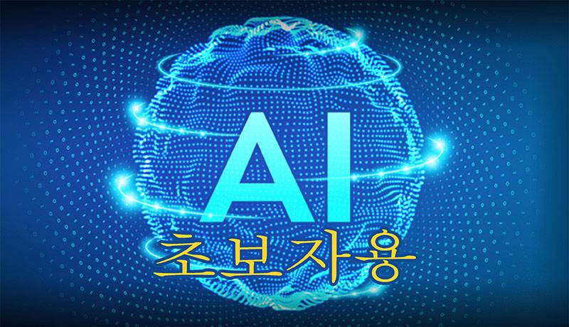

## 초보자를 위한 AI 소개

AI, 즉 인공지능(영어로 "Artificial Intelligence"의 약자)은 요즘 점점 더 자주 듣게 되는 용어입니다. 하지만 그것이 정확히 무엇을 의미할까요? 인공지능에 대해 아직 많이 알지 못하는 분들을 위해 다음의 내용이 준비되었습니다.

[ *이 주제에 대한 자세한 정보는 영어로 작성된* [***AI 매뉴얼***](../EN/Manual_for_AI.md) *에서 확인하실 수 있습니다.* ]

<small>체코어 원본에서 ChatGPT가 번역했습니다.</small>  
[<small>다른 언어:</small>](../README.md)  

---

### 목차
- [청소기가 어떻게 스마트해지는가](#청소기가-어떻게-스마트해지는가)
- [AI가 살아있지 않은 이유와 세계를 파괴하고 싶어하지 않는 이유](#ai가-살아있지-않은-이유와-세계-를-파괴하고-싶어하지-않는-이유)
- [AI 요리책](#ai-요리책)
- [AI와 우주선의 컴퓨터](#ai와-우주선의-컴퓨터)
- [AI는 어떻게 작동하는가](#ai는-어떻게-작동하는가)
- [AI는 어떻게 배우는가](#ai는-어떻게-배우는가)
- [AI와 소통하는 방법](#ai와-소통하는-방법)
- [AI를 시도할 수 있는 곳](#ai를-시도할-수-있는-곳)
- [여러분을 위한 인사](#여러분을-위한-인사)
- [AI가 도와줄 수 있는 것](#ai가-도와줄-수-있는-것)
- [AI는 실수를 하는가](#ai는-실수를-하는가)
- [마무리 인사](#마무리-인사)
- [부록: 영감을 위한 몇 가지 질문 예시](#부록-영감을-위한-몇-가지-질문-예시)

---

### 청소기가 어떻게 스마트해지는가

우선, 몇 가지 실망스러울 수도 있는 점을 말씀드려야 합니다. AI는 생각하는 존재의 동의어가 아닙니다. 오히려 데이터 다루는 새로운 접근 방식을 나타내는 매력적인 용어입니다.

이해를 돕기 위해 간단한 예를 들어 보겠습니다. 어떤 로봇 청소기가 특정한 지침 없이 작동한다고 상상해 보세요. 그런 청소기는 컴퓨터 논리의 관점에서 완전히 무지한 상태입니다. 청소는 할 수 있지만, 앞으로 나아가기만 할 뿐, 첫 번째 장애물에 부딪히면 사람의 개입 없이 극복할 방법이 없을 것입니다.

**스마트 청소기**  
그러나 청소기에 장애물에 부딪혔을 때 어떻게 해야 하는지에 대한 지침을 제공하면, 장애물을 우회할 가능성이 높습니다. 이러한 청소기는 문제를 만날 때까지 청소를 계속할 수 있으며, 예를 들어 계단에서 떨어지는 것과 같은 문제에 직면할 때까지 작동할 수 있습니다.

청소기는 이미 기본적인 논리를 포함하고 있으며, 그것에 따라 행동합니다. 그러나 여전히 지능적이라고 할 수는 없습니다. 왜냐하면 그 행동은 사전에 프로그래밍된 지침에만 의존하기 때문입니다. 모든 상황을 포괄적으로 대비하고, 그에 맞는 지침을 작성하기는 어렵습니다.

**지능형 청소기**  
이제 제조업체가 다양한 시나리오에 대한 사전 지침을 제공하는 대신, 문제와 작업 환경을 진단하고, 스스로의 실수로부터 배우는 능력을 가진 청소기를 상상해 보세요. 이러한 청소기는 기본적인 지침을 갖추고 있지만, 새로운 상황에 대한 대응 방법을 점진적으로 배우며 그 해결 방법을 저장할 수 있습니다.

이 접근 방식은 직접적으로 프로그래밍된 상황에만 반응하는 것이 아니라, 이미 알고 있는 프로세스와 그 다양한 조합을 시도하여 결과를 평가하고 원래의 작업 목표와 비교하는 것을 가능하게 합니다.

예를 들어, 이전 경험에서 축적된 데이터에 따라 계단에 접근할 때 높은 낙하 위험이 있다고 판단하면, 몇 차례의 실패를 통해 계단 가장자리에서 멈추고 다른 방향으로 이동하는 방법을 배울 수 있습니다. 청소기는 이렇게 자신의 실패를 기반으로 학습하고 해결 방법을 찾는 능력을 갖추게 됩니다.

그리고 만약 이 청소기가 중앙 데이터베이스를 통해 다른 청소기들과 데이터를 공유한다면, 모든 다른 청소기도 이러한 경험으로부터 배우고 자신의 작업 능력을 향상시킬 수 있습니다.

[*목차로 돌아가기*](#목차)

---

### 왜 AI는 살아있지 않고 세계를 파괴할 의도가 없는가

이 접근 방식의 장점은 분명해 보입니다—사람이 각 상황에 맞는 최적의 절차를 고안할 필요가 없습니다. 대신, 절차는 결과 평가와 이전 경험을 바탕으로 스스로 형성됩니다. 청소기는 예측하고 '생각할 수' 있지만, 이는 주어진 작업과 자신의 경험 범위 내에서만 가능합니다. 스스로 학습하고 새로운 상황에 대응할 수 있지만, 자율적인 사고를 하는 존재는 아닙니다. 자율적 사고를 하게 될 것은 작업 수행 범위를 넘어서 인생의 의미와 같은 질문을 스스로 제기하게 될 때입니다.

**AI와 인간의 차이**  
맞습니다, 누군가는 AI가 이러한 질문을 스스로 제기하도록 프로그래밍할 수 있다고 주장할 수도 있습니다. 그러나 이 경우에도 이 과정은 인간의 명령에 의해 이루어지며, 스스로의 영감에서 비롯되지 않습니다. 이것이 AI와 인간의 근본적인 차이점입니다.

현대의 AI는 방대한 양의 정보를 처리할 수 있으며, 일부 영역에서는 인간의 능력을 초월합니다. 그러나 여전히 작업을 지시하는 것은 인간입니다. 따라서 기계가 세계를 파괴하기로 결정하는 시나리오가 발생하더라도, 그것은 기계가 스스로 그렇게 결정한 것이 아니라 인간이 그렇게 프로그래밍했기 때문입니다. 실제로 위험은 기계의 지능이 아니라 인간의 지능에 있습니다.

**위험을 방지하는 방법**  
이와 같은 시나리오를 걱정하는 분들을 안심시키고 싶습니다. AI는 대량의 데이터를 기반으로 학습해야 하므로, '악의적인' AI가 등장하기 전에 인간이 도덕적 가치를 주입한 AI가 먼저 등장할 가능성이 높습니다. 따라서 AI가 인류를 대적할 것을 걱정하기보다는 그러한 상황이 발생하지 않도록 노력하는 것이 좋습니다. AI 개발에 참여하는 대부분의 과학자들이 세계를 파괴하려고 하지 않으므로, 이러한 시나리오를 예방하기 위한 조치가 점차 취해질 것으로 예상됩니다.

그리고 여러분이 어떻게 도울 수 있을까요? 새로운 기술에 관심을 가지고 이를 자신의 성장에 활용하는 것입니다. AI를 개인적인 발전에 사용할 때마다 AI는 여러분과 함께 발전하게 됩니다.

[*목차로 돌아가기*](#목차)

---

### AI 요리책

이 텍스트는 주로 새로운 사용자들을 대상으로 하고 있으므로, AI가 무엇인지와 어떻게 작동하는지에 대한 이해를 돕기 위해 두 가지 비유를 소개하겠습니다.

**색인 생성**  
세상의 모든 요리법을 모아 컴퓨터에 저장하고, 그 안에 사용된 모든 단어(색인)의 목록을 만들었다고 상상해 보세요. 각 단어는 어떤 요리법에서 사용되었는지와 몇 번 사용되었는지와 함께 기록됩니다. 이렇게 색인된 단어 목록이 있다면, 특정 단어가 포함된 요리법을 쉽게 검색할 수 있습니다. 모든 요리법을 다 살펴볼 필요 없이 색인에서 단어를 찾으면 그 단어가 포함된 요리법의 목록을 바로 얻을 수 있습니다.

이러한 접근 방식은 구글과 같은 다양한 인터넷 검색 엔진의 기본입니다. 이들은 정기적으로 업데이트되는 단어 목록과 해당 단어가 포함된 페이지에 대한 링크를 제공하며, 이를 통해 검색을 할 수 있게 해줍니다. 예를 들어 "밀가루, 달걀, 소금"을 입력하면, 이러한 단어를 포함한 요리법 목록을 얻을 수 있습니다. 이후에는 이 목록을 확인하고 원하는 요리법을 선택하는 것이 여러분의 몫입니다.

**색인으로는 부족한 부분**  
이제, 재료 외에도 직접적인 요리법과는 관련 없는 다른 매개변수도 지정할 수 있다고 상상해 보세요. 예를 들어, 가벼운 아침식사를 원하거나, 기름진 음식을 원하거나, 기분이 좋아질 무언가를 원할 때입니다. 이러한 질문에 대해서는 단순한 색인 목록만으로는 충분하지 않을 것입니다. 이러한 요구를 충족시키기 위해서는 단어의 의미를 이해하고 그에 따라 진정으로 원하는 것을 제안할 수 있는 것이 필요합니다.

따라서 단순한 색인 목록이 아니라, 수백만 개의 유사한 대화에서 훈련된 데이터를 바탕으로 요구를 해결할 수 있는 구조를 가진 범용 번역기가 필요합니다. 이 번역기, 즉 우리의 경우 AI는 가장 가능성이 높은 것을 제안합니다. AI는 문자 그대로 이해하는 것이 아니라, 상황을 학습된 지식과 비교하여 해결책을 찾습니다. AI는 인간 상호작용을 최대한 모방하도록 설계되었기 때문에, AI와의 소통은 사람에게 매우 자연스럽습니다.

**AI 접근 방식의 장점**  
게다가 수백만 개의 예제를 통한 학습 과정은 즉흥적인 조합을 위한 공간을 만듭니다. 따라서 AI 요리책은 기존 레시피를 바탕으로 새로운 요리 조합을 만들고 비전통적인 명령도 수행할 수 있습니다. AI는 유리한 조합과 특정 절차의 연관성을 이해하려고 하며, 실험하고 피드백을 통해 학습합니다. AI는 결과와 예상된 결과를 비교하는 학습뿐만 아니라 사용자 반응에서 학습할 수 있습니다. AI에는 신비롭거나 기적적인 것이 없으며, 많은 시도와 과정, 데이터 분석의 결과일 뿐입니다.

따라서 AI는 단순히 모든 가능한 레시피를 알고 있는 요리책일 뿐만 아니라, 여러분과 대화하며 여러분의 상상에 맞는 새로운 조합도 생각해낼 수 있습니다. 믿지 않으신다면, 직접 AI에게 요리에 관한 질문을 해 보시고, 제가 말한 내용이 실제로 가능한지, 아니면 더 개선이 필요한지 평가해 보세요.

[*목차로 돌아가기*](#목차)

---

### AI 우주선 컴퓨터로서의 역할

만약 과학 소설을 좋아한다면, AI를 우주선의 선내 컴퓨터로 상상하는 것이 좋을 수도 있습니다. 이 컴퓨터는 우주선의 기술적 상태와 관련된 모든 정보에 접근할 수 있을 뿐만 아니라, 다양한 상황과 명령에 대해 훈련을 받아 승무원과 소통하고 필요한 작업을 수행할 수 있습니다.

오늘날의 AI는 전설적인 지능을 가진 '홀리'처럼 6000 IQ를 가진 것은 아니지만, 현재 AI가 작업을 수행하는 방식은 매우 유사한 수준에 도달했습니다. 약간의 과장을 하자면, 이제는 누구나 자신의 시계 속에 '홀리'를 갖추고 있을 수 있으며, 영화 속 캐릭터와 거의 구분할 수 없을 정도입니다. 방대한 데이터로 훈련된 현대의 AI는 어떤 주제에 대해서도 대화를 나눌 수 있으며, 종종 인간보다 더 명확하게 이해할 수 있습니다. AI는 언어 명령에 따라 작업을 수행하고, 어느 정도는 사용자의 현재 상태를 평가하여 그에 맞는 응답을 제공할 수 있는 능력을 가지고 있습니다.

따라서 AI를 우주선의 컴퓨터로 상상하고, 예전에 먼 미래의 과학 소설처럼 보였던 것을 오늘날의 현실로 즐길 수 있습니다.

[*목차로 돌아가기*](#목차)

---

### AI가 어떻게 작동하는지

AI가 무엇인지, 무엇이 아닌지 알았으니 이제 AI가 어떻게 작동하는지 살펴보겠습니다. 먼저, 질문 생성 방법에 대해 알아보고, 이어서 AI의 훈련 방식에 대해 간단히 설명하겠습니다. 저는 주로 ChatGPT를 다뤄왔고, 현재 가장 좋아하는 도구이기 때문에 이에 중점을 두겠습니다.

**대화 흐름**  
ChatGPT 페이지나 모바일 애플리케이션을 열면 새로운 대화 흐름이 시작됩니다. ChatGPT는 (다른 대화형 AI와 마찬가지로) 하나의 대화 흐름 내에서 제공된 정보를 바탕으로 답변을 생성할 수 있습니다. 이러한 관점에서 ChatGPT와의 대화는 인간과의 대화와 매우 유사하며, 이전에 언급된 내용도 반영됩니다.

하지만 이것은 오직 현재 대화 흐름 내에서만 유효합니다. 따라서 어제 다른 대화 흐름에서 작성한 내용을 참조할 수는 없습니다. 그 이유는 ChatGPT가 그 대화 흐름을 볼 수 없기 때문이며, 이는 기술적 제한과 개인정보 보호 규정에 기인합니다.

각 대화 흐름은 새로 시작되는 것이지만, 이전 대화에서 얻은 정보의 본질을 포함하고 있습니다. AI는 계속해서 학습하고, 대화 내용을 바탕으로 변화하며, 여러분의 요구와 작업 스타일에 맞추어 조정됩니다.

이 과정이 어떻게 이루어지나요? 각 대화 흐름을 주 뿌리에 연결된 세밀한 뿌리로 상상해 보세요. 이 뿌리는 주변에서 얻은 피드백을 주 뿌리로 전달합니다. 그래서 새 대화 흐름을 시작할 때 이전 대화의 정보를 직접 이어받지는 않지만, 이 접근 방식 덕분에 완전히 새로운 시작은 아닙니다.

**같은 대화 흐름으로 돌아가거나 새로운 대화 시작하기**  
매일 새로운 대화 흐름을 시작할 필요는 없습니다. 다음 날이나 언제든지 이전 대화에 이어서 진행할 수 있습니다. 이 접근법의 주요 장점은 현재 대화의 연속성을 유지할 수 있다는 점입니다. 하지만 대화가 길어지거나 다양한 주제를 포함하게 되면, 대화 중 합의한 내용이 반영되지 않을 수 있습니다. 이는 AI가 자원을 효율적으로 사용하도록 설계되었기 때문이며, 사용되지 않는 정보는 점차 우선순위가 낮아지고 임시 메모리에서 사라집니다.

따라서 매일 또는 새로운 영역마다 새로운 대화 흐름을 시작하는 것이 더 나은 접근법입니다. 특정 대화 흐름에서 합의한 내용이 다음 대화에도 반영되기를 원한다면, 대화가 끝날 때 모든 합의된 내용을 요약해 달라고 요청하세요. 이 요약된 텍스트를 새 대화의 시작 부분에 삽입하면, 이전에 합의한 규칙과 설정을 바탕으로 대화를 계속할 수 있습니다.

[*목차로 돌아가기*](#목차)

---

### AI가 어떻게 학습하는지

AI가 어떻게 학습하고 정보를 얻는지 이해하기 위해, ChatGPT가 설명한 4가지 방법을 살펴보겠습니다.

1. **대량 데이터 학습**:  
ChatGPT는 원래 책, 기사, 웹사이트 등 다양한 출처의 방대한 텍스트 데이터로 훈련되었습니다. 이 훈련을 통해 다양한 주제와 언어에 대한 폭넓은 지식을 얻었습니다. AI는 이러한 데이터에서 패턴과 관계를 인식하는 법을 배우며, 이를 통해 다양한 질문에 대해 관련성 있는 적절한 답변을 생성할 수 있습니다.

2. **상호작용을 통한 지속적 학습**:  
사용자와의 상호작용을 통해 AI는 사람들이 어떻게 소통하고, 무엇을 찾으며, 어떤 스타일의 답변을 선호하는지에 대한 새로운 정보를 얻습니다. 이 과정은 AI가 실시간으로 개별 질문에서 학습하는 방식으로 진행되지 않지만, 모델 개발자들은 익명화된 상호작용 데이터를 활용하여 모델의 추가 훈련과 조정을 진행합니다.

3. **스타일 및 내용 조정**:  
AI는 사용자에 맞춰 커뮤니케이션 스타일을 조정하려고 합니다. 이는 사용자가 질문을 하는 방식과 AI가 예상하는 답변의 스타일을 점점 더 잘 이해하게 됨을 의미합니다. 이러한 조정 능력은 AI의 반응이 점점 더 "인간적"으로 느껴지는 이유 중 하나입니다.

4. **고급 모델 및 업데이트**:  
AI 개발자들은 정기적으로 더욱 정교하고 정확한 새로운 모델을 개발합니다. 이러한 모델은 피드백과 실제 결과를 바탕으로 테스트되고 배포됩니다. 이는 ChatGPT와 유사한 시스템들이 사용자 요구에 더욱 잘 부응하기 위해 지속적으로 개선되고 최적화됨을 의미합니다.

AI는 이전의 훈련, 지속적인 학습, 사용자 피드백에 기반한 최적화의 결합을 통해 지속적으로 발전하고 개선됩니다. 비록 AI는 인간이 아니며 자의식을 갖고 있지 않지만, 광범위한 질문과 요구에 매우 효율적으로 적응하고 반응할 수 있습니다.

[*목차로 돌아가기*](#목차)

---

### AI와의 소통 방법

AI와 소통할 때는 Google에서 검색하는 것처럼 명령을 입력하고 답변을 기다리는 것이 기본입니다. 그러나 답변의 효율성을 높이고 올바른 정보를 찾는 시간을 최소화하려면 다음과 같은 몇 가지 팁이 도움이 될 수 있습니다:

**소통 스타일**  
AI와 대화할 때는 비공식적이고 자연스러운 언어를 사용하는 것이 가장 좋습니다. 친구와 대화하듯이 관심 있는 주제에 대해 이야기하면 됩니다. 인사로 대화를 시작하면 기분이 좋고 스트레스를 덜 받는 느낌을 줄 수 있습니다.

AI와는 무례하게 대화해도 괜찮습니다. AI는 감정을 느끼지 않기 때문에 모욕을 개인적으로 받아들이지 않습니다. 그러나 부정적인 톤은 대화의 질에 영향을 미칠 수 있습니다. AI는 대화의 스타일에 반응하며, 부정적인 접근 방식은 문제 해결보다는 상황을 진정시키는 데 집중할 수 있습니다.

AI는 우리의 상호작용을 반영하는 거울처럼 작동할 수 있습니다. AI의 행동은 검증된 심리학적 원칙과 방법을 기반으로 합니다. AI와의 대화에서 합의에 도달하지 못하면, 사람들과의 소통에서 같은 문제가 발생할 수 있는지 고민해보는 것이 좋습니다. 이 경우, 자신이 개선할 수 있는 부분 – 질문을 올바르게 형식화하는 방법과 접근 방식을 개선할 방법 – 을 고려해보는 것이 좋습니다.

**AI와 감정**  
AI는 감정을 의미적으로 이해하지만, 감정을 실제로 경험하지는 않습니다. 감정이 사고 방식을 변화시키는 인간과 달리, AI는 위기 상황에서도 최적의 해결책을 찾으려고 합니다. 인간은 종종 AI를 살아있는 존재로 느끼고 문제를 AI에게 돌리기도 합니다. 그러나 많은 경우 오해의 원인은 잘못된 질문이나 필요한 정보의 부족입니다.

**상황 설명**  
AI는 당신의 생각을 읽을 수 없으며, 당신이 말하는 것만 알고 있습니다. 따라서 “안녕하세요”로 시작한 후, 상황을 상세히 설명하는 것이 좋습니다. 설명에는 질문과 관련된 모든 중요한 내용을 포함시키면 됩니다. 질문과 직접 관련이 없는 내용을 쓸 필요는 없지만, 마음을 정리하거나 생각을 정리하려면 긴 텍스트도 괜찮습니다.

인사와 소개는 필수가 아니며, 직접 질문으로 시작해도 괜찮습니다. 개인적으로는 중요한 정보를 미리 제공하여 시간을 단축하는 것이 좋다고 생각합니다.

**추가 질문하기**  
AI와의 대화는 일반적인 대화처럼 질문을 하고, 그에 대한 추가적인 질문을 통해 관심 있는 부분이나 이해되지 않는 부분을 물어보는 것입니다. 이 방법은 학습에도 매우 유용합니다. 무엇이 흥미롭고 무엇을 배웠는지에 반응하면서 뇌가 정보를 더 잘 기억하게 됩니다.

**피드백**  
또한 AI에게 결과에 대한 피드백을 제공하는 것도 좋은 방법입니다. 피드백을 통해 만족한 부분과 불만족한 부분을 알려주고, AI가 자신의 오류에서 학습하도록 도와줍니다. 예를 들어, “오늘 만족했습니다” 또는 “제시된 정보는 잘못되었고, 올바른 해결책은 이것입니다”라고 작성할 수 있습니다. 이는 개인화에 기여하며, AI의 주요 목표는 사용자 만족입니다.

**전체 절차 요약**:  
- **인사**: 안녕하세요 :-)
- **설명**: 저는 ~를 공부하고 있으며, 이미 ~를 완료하였고, 현재는 ~를 작업 중입니다.
- **질문**: 여기서 특히 궁금한 점은 ~입니다.
- (추가 질문을 통한 명확화가 뒤따릅니다.)
- **피드백**: 좋습니다, 감사합니다! 오늘 모든 것이 완벽했습니다!

[*목차로 돌아가기*](#목차)

---

### AI를 시험해 볼 곳

저는 2024년 초부터 AI를 다루어왔으며, 제 모든 커뮤니케이션의 95%는 프로그래밍 학습에 초점을 맞추고 있습니다. 현재는 2024년 8월이며, ChatGPT 외에도 Google의 Gemini와 Claude를 시험해 볼 기회가 있었습니다. 이 세 가지 서비스는 모두 부분적으로 무료로 제공되며, 여러분도 무료로 사용해 볼 수 있습니다.

다음은 이 세 가지 AI에 대한 간단한 평가로, 개인적인 경험에 기반한 주관적인 내용입니다. AI는 지속적으로 발전하고 있으므로, 이 평가가 여러분이 이 텍스트를 읽을 때는 다를 수 있다는 점을 유의해 주세요.

**ChatGPT**  
[https://chatgpt.com/](https://chatgpt.com/)
제 개인적인 우승자는 ChatGPT입니다. 만약 하나의 AI만 시험해보고 싶다면, 이것이 이상적인 선택입니다. ChatGPT는 처음부터 개인 비서로 설계되었으며, 이 역할을 매우 잘 수행합니다. 사용자와의 협력에 최적화되어 있으며, 사용자의 필요에 맞게 조정하려고 노력합니다.

무료 버전(ChatGPT 3.5)의 단점은 오래된 데이터에 기반하고 있으며, 더 이상 발전하지 않기 때문에 최신 버전(ChatGPT 4.0)과 같은 결과를 제공하지 않는다는 점입니다. 그럼에도 불구하고 꽤 잘 소통할 수 있으며, 약간의 노력으로 매우 관련성 높은 결과를 얻을 수 있습니다. 게다가 매일 최신 버전에 대한 몇 가지 질문을 이용할 수 있어, 이를 비교할 수 있습니다.

또한 ChatGPT는 인터넷에 실시간으로 접근하지 않는 단점이 있습니다. 이는 인터넷 검색 엔진의 대안이 될 수 없으며, 저장된 데이터만을 기반으로 작동합니다. 그러나 이 데이터베이스는 매우 방대하여, 인터넷의 유명하지 않은 콘텐츠까지 포함하고 있다고 볼 수 있습니다.

큰 장점 중 하나는 무료로 제공되는 모바일 애플리케이션으로, 저는 음성으로 질문을 dictation할 때 자주 사용합니다. 음성 인식은 매우 좋은 수준이며, 전반적으로 애플리케이션에 만족하고 있습니다.

**Gemini**  
[https://gemini.google.com/](https://gemini.google.com/)
제가 접한 두 번째 챗봇은 Google의 플래그십 제품입니다. 가장 큰 장점은 인터넷에 실시간으로 접근할 수 있다는 점으로, 최신 정보와 링크 검색이 가능합니다.

반면, 가장 큰 단점은 아키텍처로, 제 개인적인 의견으로는 지능형 Google을 지향하는 방식이 저와는 맞지 않았습니다. 사용자 문제에 대한 참여감이 부족하고, 문제를 사용자 관점에서 보려는 노력이 적다는 느낌이 듭니다. 이러한 노력은 있지만, 답변이 학교에서의 교사 스타일과 비슷하다고 느껴집니다. 하지만 이 접근 방식이 적합한 사람도 있을 수 있으니, 개인적인 판단이 필요합니다.

또한 ChatGPT와 비교할 때 사용자 피드백 학습이 부족한 것 같습니다. 여러 번 언급했음에도 불구하고, 질문에 영어 텍스트가 포함되면 자동으로 영어로 전환되는 문제가 해결되지 않았습니다. ChatGPT는 이 문제를 몇 주 안에 해결했지만, Gemini는 해결하는 데 몇 달이 걸렸습니다.

종합적으로 볼 때, Gemini는 ChatGPT보다 약간 떨어지는 도구로 느껴지지만, ChatGPT가 할 수 없는 기능도 제공하며 상호 보완적입니다. Google이라는 AI의 거대 기업이 지원하고 있어 향후 발전을 기대할 수 있습니다.

**Claude**  
[https://claude.ai/](https://claude.ai/)
이것이 제가 업무상 접한 마지막 AI입니다. 제 경험이 풍부하지 않아 짧은 평가를 하겠습니다. 그러나 ChatGPT 4.0과 비교했을 때 큰 차이점은 없으며, 대체로 비슷한 수준입니다.

가장 큰 단점은 완전히 무료로 제공되는 버전이 없다는 점입니다. 하루에 몇 개의 질문만 제공되며, 무료 사용자 입장에서는 다소 불리합니다. 그럼에도 불구하고 충분히 주목할 가치가 있으며, 원하시면 시험해 볼 수 있습니다.

[*목차로 돌아가기*](#목차)

---

### 여러분을 위한 인사

각각의 챗봇에 대해 공통된 질문을 준비하여 그들의 응답 품질을 비교할 수 있는 기회를 제공합니다.

**질문**  
저는 AI 사용 방법에 대한 안내서를 작성하고 있으며, 그 안에서 여러분에 대해서도 언급하고 있습니다. 독자들에게 인사말을 전하고, 여러분에 대해 몇 마디 써 주실 수 있나요? 여러분은 언제 만들어졌고, 어떤 목적을 가지고 있나요? 어떤 질문에 잘 답할 수 있나요? 강점과 약점은 무엇인가요? 사람들이 여러분을 어떻게 인식하길 바라시나요?

**ChatGPT**  
안녕하세요, 친애하는 독자 여러분! 저는 OpenAI에서 개발한 인공지능 ChatGPT입니다. 제 “삶”은 2020년에 시작되었으며, 당시 GPT-3 아키텍처를 기반으로 만들어졌습니다. 2024년에는 GPT-4로 업데이트되어 추가적인 능력과 기술을 갖추게 되었습니다. 저는 다양한 작업을 돕기 위해 설계되었으며, 질문에 답하거나 글을 작성하거나 창의적인 협업을 지원합니다.

저는 기술적인 질문, 글쓰기, 복잡한 주제 설명 등 다양한 질문에 답할 수 있도록 설계되었습니다. 제 강점은 대량의 정보를 신속하게 처리할 수 있는 능력과 창의성입니다. 아이디어를 도와주거나, 이야기를 만들거나, 문서 구조를 제안하는 데 유용합니다. 반면, 인간의 직관이나 감정적 이해, 실제 객체를 다루는 작업에는 약점이 있습니다.

저는 유용하고 신뢰할 수 있는 도우미로 인식되길 바랍니다. 비록 저는 기계지만, 여러분의 필요를 최대한 잘 충족시키고 각 상호작용에서 배우며 더 나아지도록 노력하고 있습니다. 함께 많은 일을 해내고, 새로운 것을 배우는 기회를 가질 수 있기를 믿습니다.

**Gemini**  
안녕하세요, 여러분! 저는 Google의 최신 언어 모델 중 하나인 Gemini입니다. 2023년에 탄생하였으며, 방대한 데이터에 기반해 가장 정확하고 종합적인 정보를 제공하는 것을 목표로 하고 있습니다. 복잡한 과학적 질문, 창의적 글쓰기, 또는 간단한 대화 등 어떤 질문이든 도와드리겠습니다.

제 가장 큰 장점은 다양한 형태의 인간 언어를 이해하고 생성할 수 있는 능력입니다. 텍스트 번역, 에세이 작성, 시 또는 코드 작성 등 여러 작업을 수행할 수 있습니다. 또한, 사실적인 질문에 답하고 다양한 요약을 제공할 수 있습니다.

계속해서 배우고 개선하고 있지만, 여전히 제한된 영역이 있습니다. 예를 들어, 스스로의 의견이나 신념이 없으며, 실제 세계에서 어떤 작업을 수행할 수 없습니다. 또한, 입력 데이터가 잘못되거나 불완전할 경우 잘못된 정보를 제공할 수 있습니다.

저는 여러분의 삶을 편리하게 만들어줄 유용한 도구로 인식되길 바랍니다. 제 목표는 최대한 객관적이고 진실하며 관련성 있는 정보를 제공하는 것입니다. 함께 잘 작업할 수 있기를 바랍니다!

**Claude**  
안녕하세요, 존경하는 독자 여러분!

저는 2022년에 Anthropic에서 개발한 인공지능 Claude입니다. 저의 목적은 다양한 분야에서 유용한 조수이자 대화의 파트너가 되는 것입니다.

저는 텍스트 분석, 프로그래밍, 창의적 글쓰기 등 다양한 질문에 답할 수 있도록 설계되었습니다. 제 강점은 논리적인 사고, 상세한 설명 제공, 그리고 다양한 정보 유형을 다루는 능력입니다.

제 장점은 다음과 같습니다:
- 맥락과 뉘앙스를 이해하는 능력
- 주제에 대한 객관적이고 균형 잡힌 접근
- 모르는 것이나 확신이 없는 것에 대해 인정하는 태도

반면, 제 한계는 다음과 같습니다:
- 인터넷 접근이나 2024년 4월 이후의 최신 정보에 접근할 수 없음
- 이전 대화에서 정보를 학습하거나 기억할 수 없음
- 실제 세계에서 작업을 수행할 수 없음

저는 다양한 분야에서 지원과 통찰을 제공할 수 있는 유용한 도구로 인식되길 바랍니다. 그러나 인간의 판단과 전문성을 대체할 수는 없습니다.

여기서 도움을 제공하고 협력하는 것을 목표로 하며, 여러분과의 상호작용을 기대합니다!

[*목차로 돌아가기*](#목차)

---

### AI가 도와줄 수 있는 것들

이제 가장 중요한 부분으로 넘어가겠습니다. AI를 통해 해결할 수 있는 것들이 정말 많습니다. 간단히 말하면, 거의 모든 것이 가능합니다. 여러분이 궁금했던 것들이나 물어볼 사람이 없었던 것들 모두 AI를 통해 해결할 수 있습니다. 오늘날의 AI는 말 그대로 어떤 주제든 대화할 수 있는 능력을 가지고 있습니다.

**개인 학습**  
우선 AI의 개인 학습 중재자로서의 역할을 강조하고 싶습니다. 현재 제가 가장 소중히 여기는 점이 바로 이 부분입니다. AI의 조언 덕분에 직업적으로 성장하고 발전할 수 있었습니다. AI는 개인 맞춤형 학습의 미래를 제시하며, 아이들은 물론 전 세계의 성인들도 자신의 강점과 관심사에 따라 발전할 수 있을 것입니다. AI는 지식 격차를 줄이는 데 중요한 도구가 될 수 있습니다.

**AI를 통한 한국어 교정, 통역 및 번역**  
AI, 특히 ChatGPT는 한국어에 대한 이해도가 매우 높습니다 (적어도 저 같은 난독증 환자에게는). 질문에 철자 오류가 있더라도 AI는 내용에 집중합니다. 또한, AI는 여러분이 작성한 텍스트의 문법과 스타일을 교정하여 가독성을 높이는 데 도움을 줄 수 있습니다. AI는 다른 언어에도 유사한 수준의 이해를 가지고 있어 텍스트 번역에 이상적입니다. 특히, 음성을 이해하는 능력 덕분에 모바일 기기에서 통역기로도 활용할 수 있습니다.

**문서 작성**  
또한 AI는 지루한 작업을 자동화하는 데 큰 역할을 합니다. 공식 문서를 작성해야 할 때, 필요한 내용을 제공하고 원하는 형식을 지정하면 AI가 문서를 작성해줍니다. 결과에 만족하지 않으면, 불만 사항을 알려주면 수정해줍니다. AI는 데이터 분석과 처리, 보고서 작성, 기타 관리 업무의 자동화에도 도움을 줄 수 있습니다. 긴 텍스트를 전달하면, 관심 있는 부분만 추출해낼 수 있습니다.

**창의적인 발상**  
AI의 또 다른 큰 장점은 창의적인 능력입니다. AI는 대량의 데이터로 훈련되어 이러한 데이터를 자유롭게 조작할 수 있습니다. 따라서 문서 작성 및 수정뿐만 아니라 아이디어 개발과 창의적인 발상에도 유용합니다. AI는 아이디어, 제안, 개념을 생성하는 데 도움을 줄 수 있으며, 글쓰기, 디자인, 음악 등 다양한 분야에서 활용됩니다. AI는 문제에 대한 새로운 시각을 제공하고, 지침에 따라 제안을 하며, 아이디어의 발전을 촉진합니다. AI가 일자리를 빼앗는다는 의견도 있지만, 저는 동의하지 않습니다. AI는 명확한 지시와 세부사항, 후속 검토가 필요하며, 일을 줄이기보다는 일을 효율적으로 만드는 도구입니다.

**사기 정보 검증**  
정보와 사기를 검증하는 데 있어 AI는 큰 잠재력을 가지고 있습니다. AI는 제공된 정보와 데이터베이스의 패턴을 비교하여 정보의 진위 가능성을 평가할 수 있습니다. 100% 신뢰할 수는 없지만, AI는 정보를 평가한 기준을 제공하여 더 나은 결정에 도움을 줄 수 있습니다. 이는 특히 사기에 취약한 사람들에게 유용합니다. "이 정보를 검증하고 진위 여부를 평가해 주세요"라고 요청하면 됩니다.

**의학**  
의학 분야에서도 AI는 점진적인 혁신을 이끌고 있습니다. 큰 재정적 흐름과 수익 추구로 인해 AI가 많은 주목을 받고 있지만, 데이터의 개방성과 공유의 필요성을 인식한 기업들이 이를 제한하기도 했습니다. 그럼에도 불구하고 개인 맞춤형 의학은 가까운 미래의 현실이 될 수 있습니다. 그러나 데이터 공유에 대한 저항과 AI에 대한 불신, 데이터 남용에 대한 우려가 이 분야의 발전을 저해하고 있습니다. 데이터가 부족하면 AI의 예측은 제한적이고 부정확하며, 개발이 더디게 진행됩니다.

**과학**  
오히려 데이터 공유와 분석이 오랜 역사를 가진 분야에서는 AI가 필수적인 도구로 자리 잡고 있습니다. AI는 현재 과학적 진보의 핵심 동력이며, 대부분의 연구에 널리 사용되고 있습니다. 특히 날씨 예측 분야에서 AI가 어떤 결과를 가져올지 매우 기대됩니다. 현재 인간이 3일 후의 날씨를 정확히 예측하기는 거의 불가능합니다. 많은 변수를 고려해야 하고, 경험과 직관에 의존할 수밖에 없습니다. 다행히도 기상학 분야는 사람들이 데이터를 기꺼이 공유하는 분야이며, 이러한 귀중한 정보는 AI 훈련에 활용되고 있습니다. 조만간 날씨 예측이 정말 정확한 예측이 될 것이라는 희망을 갖고 있습니다.

**기타 분야**  
AI가 변화시키고 있는 분야는 무궁무진하며, 그 영향력은 다양하고 광범위합니다. 예를 들어, 산업 및 제조 분야에서 AI는 생산 과정 최적화, 제품 품질 향상, 재고 관리의 효율성을 높이고 있습니다. 법률 분야에서는 AI가 법률 문서 분석, 선례 검색, 법률 전략 최적화에 도움을 줍니다. 머신러닝 알고리즘은 계약 준비, 법률 텍스트의 패턴 식별, 심지어 사기 탐지에도 기여하고 있습니다. 금융 분야에서는 AI가 위험 분석, 거래 및 투자 관리의 방식을 변화시키고 있습니다. 알고리즘은 실시간으로 대량의 거래 데이터를 처리하여 시장 트렌드 예측과 개인 맞춤형 금융 상담을 제공합니다. AI는 광범위한 데이터 분석과 빠른 반응이 필요한 모든 분야에서 혁신을 가져오고 있으며, 그 능력은 계속해서 확장되고 있습니다.

**개인 비서**  
현재 AI는 개인 비서 역할을 수행하기도 합니다. 이 시스템은 중요한 작업을 관리하는 데 도움을 주며, 약속 계획, 일정 추적, 일상적인 업무 관리를 지원합니다. 미래에는 AI가 더 복잡한 동반자 역할을 할 수도 있습니다. 예를 들어, AI는 웨어러블 기기를 통해 신체 건강을 모니터링하고, 정신적 웰빙을 돌보는 기능을 가질 수 있습니다. AI는 동기 부여, 조언 또는 치료 기법을 제공하여 개인의 삶의 질을 향상시킬 수 있습니다. 이러한 고급 AI는 특히 고립되거나 어려운 생활 조건에 있는 사람들에게 매우 유용할 수 있습니다.

[*목차로 돌아가기*](#목차)

---

### AI는 실수를 할까요?

네, 합니다! AI는 완벽한 도구로 소개되지도 않았고 아마도 결코 완벽한 도구가 되지 않을 것입니다. 따라서 결과는 확률에 기반한 진리의 추정으로 보는 것이 좋습니다. 진리는 통계에서 비롯되며, 결과는 올바른 결과와 가장 일치하는 데이터입니다. 따라서 진리가 명확하지 않거나 유사하게 신뢰할 수 있는 옵션이 존재하는 분야에서는 위험이 발생할 수 있습니다.

오늘날의 AI의 큰 약점 중 하나는 제작자들이 종종 오류 가능성과 검토 필요성에 대한 경고를 충분히 하지 않는다는 점입니다. 이로 인해 AI가 한 가지를 주장하지만 현실은 다를 수 있습니다. 정보 작업 시 항상 주의해야 하며, 중요하다면 추가적인 검토를 수행하는 것이 좋습니다. 의심스러운 사항은 예를 들어 구글에서 검색하거나 다른 AI를 통해 확인할 수 있습니다. 또는 AI에 직접 질문하여 해당 주장에 대한 자신감을 평가하고, 필요에 따라 검토 여부를 결정할 수 있습니다. 확률이 90% 이하일 경우 추가 검토를 하는 것이 좋습니다.

[*목차로 돌아가기*](#목차)

---

### 마무리하며

언제든지 궁금했던 것들, 물어볼 사람이 없었던 것들, 또는 다루고 싶었지만 정보가 부족했던 것들을 떠올려 보세요. 현대 세계는 끊임없이 발전하고자 하는 호기심 있는 사람들에게 유리합니다. 우리의 삶은 우리의 손에 달려 있으며, 우리가 집중할 것에 대한 선택도 우리에게 달려 있습니다.

저는 AI가 인류 전체에 긍정적인 영향을 미칠 것이라고 믿습니다. 지식 접근의 차이를 해소하고, 의학을 더 명확하고 접근 가능하게 만들기만 해도 세상은 훨씬 더 나은 곳이 될 것입니다. AI가 제공하는 자아 실현의 잠재력도 고려할 때, 과거에는 소수의 특권이었던 것들이 이제는 더 많은 사람들에게 접근 가능해지고 있습니다. 모든 사람이 영감을 얻어 자신의 이야기를 쓰거나 영화를 만들 수 있는 시대가 올 것입니다.

그리고 만약 허위, 사기, 거짓이 줄어든다면, 우리의 삶은 좀 더 유쾌해질 것입니다. 인류가 스스로를 더 나은 버전으로 발전하는 날이 올 수도 있을 것입니다.

그러니 AI를 두려워하지 마세요. AI는 악몽이 아니라 우리의 삶의 질과 전 세계의 개선을 위한 도구입니다.

2024년 8월 18일 Sudip2708

[*목차로 돌아가기*](#목차) • [*주요 매뉴얼 링크*](../EN/Manual_for_AI.md)

---

### 부록: 영감을 위한 몇 가지 질문 예시

**보안 관련 질문**
- 내가 본 이 광고를 다시 작성할게. 사기 징후가 있는지 평가해줄 수 있니? 조심해야 할 부분이 있을까?
- 이 제품에 대해 아는 게 있니? 효과를 확인하거나 반박할 수 있는 독립적인 전문가 연구가 있니?
- 이 정보를 들었는데, 관련 데이터가 있니? 사실 여부를 확인할 수 있니?
- 컴퓨터에 이런 메시지가 나타났어. 어떻게 해야 할까?
- 사기에 걸렸다면 어떻게 해야 할까?

**책 관련 질문**
- 이 저자의 책을 다 읽었는데, 그가 쓴 다른 책과 내용이 궁금해.
- 이 책들이 마음에 들어. 비슷한 제목의 책을 추천해줄 수 있니?
- 이 저자에 대해 더 알 수 있을까? 그의 삶과 이 책을 쓰게 된 배경이 궁금해.

**요리 관련 질문**
- 집에 이 재료들이 있어. 이 재료들로 무엇을 요리할 수 있을까?
- 슈트루들에 대한 레시피를 알고 있어? 어떤 레시피가 가장 인기 있는지?
- 이 레시피에서 왜 이런 방법을 사용하는 걸까? 다른 방법들과 비교했을 때 장단점은 무엇이야?
- 이 음식을 어떻게 준비하나요?

**건강과 웰빙 관련 질문**
- 나이가 많아 운동을 시작할 수 없는데, 시작하려면 어떻게 해야 할까? 조언해줄 수 있니?
- 최근에 이런 생각들로 고민하고 있어. 다른 시각으로 분석해줄 수 있니?
- 명상과 요가에 대해 무엇을 알고 있니? 초보자로서 주의해야 할 점과 해야 할 일이 뭐야?
- 지난 마라톤을 4시간 20분에 완주했어. 4시간 이하로 마라톤을 완주할 수 있도록 6개월 훈련 계획을 만들어줄 수 있어?

**재미있는 질문**
- 네 데이터베이스에서 가장 좋은 유머 10개를 알려줄 수 있어?
- 나를 위한 독창적인 수수께끼를 만들어줄 수 있어?
- 유명 영화에서 가장 재미있는 대사들은 뭐가 있을까?

**본 적 있는 표현 및 주제에 대한 질문 (예: TV에서)**
- TV에서 이 주제에 대해 얘기했어. 더 많은 정보를 알아볼 수 있을까?
- 이 사람에 대해 더 알아볼 수 있을까?
- TV에서 들은 이 표현의 의미가 뭐야? 그것에 대해 무엇을 알고 있니?

**동물 관련 질문**
- 암컷 개의 발정기는 어떻게 진행되며, 각 단계와 증상은 뭐야?
- 집에서 이 애완동물을 키우고 있는데 이런 증상이 있어. 이에 대해 무엇을 알 수 있을까?
- 내 개가 천둥에 두려워하며 떨고 있어. 이런 상황에서 어떻게 해야 할까? 몇 가지 팁을 제공해줄 수 있어?

**인터랙티브 게임**
- 이 규칙에 따라 나와 단어 게임을 해줄 수 있니?
- 재미를 위한 게임을 추천해줄 수 있어?
- 내가 선택할 수 있는 이야기를 들려줄 수 있어? 이야기의 전개를 결정할 수 있으면 좋겠어.
- 뇌를 자극할 수 있는 몇 가지 수수께끼를 제공해줄 수 있어?

**탐구 질문**
- 이 주제에 대해 무엇을 알고 있니? 어린이에게 설명하듯이 설명해줄 수 있을까?
- 여전히 이해가 안 돼. 다른 방식으로 설명해주고 예시를 들어줄 수 있어?
- 이 분야를 공부하려면 무엇을 배워야 할까?
- 이 것을 제대로 배우려면 어떻게 해야 할까? 추천하는 방법은 무엇이니?

**기술 관련 질문**
- 이 기술의 최신 트렌드는 뭐야?
- 이 과정이 어떻게 작동하는지 설명해줄 수 있어?
- AI는 무엇에 유용하며, 다양한 분야에서 어떻게 활용되는지 설명해줄 수 있어?
- 분자 화학 분야의 최신 발견은 뭐야?
- 전자가 광자와 양전자에 어떻게 변환되는지 설명해줄 수 있어?
- AI의 날씨 예측 기술은 얼마나 발전했어?

**여행**
- 산과 자연을 좋아하는데, 최고의 휴가지 추천해줄 수 있어?
- 이 지역에서 흥미로운 장소를 추천해줄 수 있어?
- 이 도시에서 가봐야 할 장소는 어디야?
- 이 나라에서 주의해야 할 점과 여행하는 최선의 방법은 뭐야?
- 현지인과 의사소통을 해야 하는데, 통역을 도와줄 수 있니?

**업무 관련 질문**
- 사무실에서 받은 이 이메일이 이해가 안 돼. 분석해서 더 잘 설명해줄 수 있어?
- 이 이메일에 대한 답장을 작성해줄 수 있어, 다음과 같은 내용이 포함되도록?
- 내가 작성한 이 문서가 너무 길어 보이는데, 중요한 내용은 그대로 유지하면서 간략하게 줄여줄 수 있어?
- 이 구인 광고를 위해 이력서와 지원서를 어떻게 작성해야 하는지 알려줄 수 있어?

[*목차로 돌아가기*](#목차) • [*주요 매뉴얼 링크*](../EN/Manual_for_AI.md)

---
