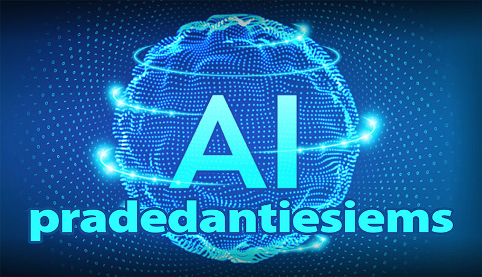

## Pradžios vadovas apie AI pradedantiesiems

AI arba dirbtinis intelektas (iš anglų kalbos „Artificial Intelligence“) yra santrumpa, kurią šiandien girdime vis dažniau. Bet ką tai iš tikrųjų reiškia? Jei dar daug nežinote apie dirbtinį intelektą, šios eilutės yra skirtos būtent jums.

[ *Daugiau informacijos apie šią temą rasite pačiame* [***AI Manual***](../EN/AI-manual-en.md), *kuris parašytas anglų kalba ir pateikia išsamesnę tematikos analizę.* ]

<small>Iš čekų kalbos išvertė ChatGPT.</small>  
[<small>Kitos kalbos:</small>](../README.md#other-translations-of-the-beginners-guide)  

---

### Turinys
- [Kaip dulkių siurblys tampa protingu](#kaip-dulkių-siurblys-tampa-protingu)
- [Kodėl AI nėra gyvas ir kodėl nenori sunaikinti pasaulio](#kodėl-ai-nenėra-gyvas-ir-kodėl-nenori-sunaikinti-pasaulio)
- [AI receptai](#ai-receptai)
- [AI kaip kosminio laivo kompiuteris](#ai-kaip-kosminio-laivo-kompiuteris)
- [Kaip veikia AI](#kaip-veikia-ai)
- [Kaip AI mokosi](#kaip-ai-mokosi)
- [Kaip bendrauti su AI](#kaip-bendrauti-su-ai)
- [Kur išbandyti AI](#kur-isbandyti-ai)
- [Sveikinimas jums](#sveikinimas-jums)
- [Kuo AI gali padėti](#kuo-ai-gali-padėti)
- [Ar AI daro klaidų](#ar-ai-daro-klaidu)
- [Žodis pabaigai](#zodis-pabaigai)
- [Priedas: Keletas klausimų jūsų įkvėpimui](#priedas-keletas-klausimu-jusu-ikvepimui)

---

### Kaip dulkių siurblys tampa protingu

Iš karto noriu šiek tiek nusivilti – AI nėra sinonimas mąstančiai būtybei. Tai labiau yra patrauklus pavadinimas naujam požiūriui, kaip dirbti su duomenimis.

Kad geriau suprastume, pateiksime paprastą pavyzdį. Įsivaizduokite robotinį dulkių siurblį, kuris neturi jokių nurodymų, pagal kuriuos galėtų veikti. Tokiu atveju, žvelgiant iš kompiuterinės logikos pusės, siurblys būtų visiškai be intelekto. Jis tik siurbtų ir judėtų į priekį, tačiau greičiausiai sustotų prie pirmos kliūties, kurią be žmogaus pagalbos įveikti negalėtų.

**Protingas dulkių siurblys**  
Jeigu siurbliui suteiktume nurodymus, kaip elgtis susidūrus su kliūtimi, tikėtina, kad jis aplenktų kliūtį. Tokiu siurbliu būtų galima siurbti tol, kol jis nesusidurtų su problema, kuriai jo nurodymai būtų nepakankami – pavyzdžiui, nukritimas nuo laiptų.

Siurblys jau turi tam tikrą pagrindinę logiką – nurodymų sąrašą, pagal kurį jis vadovaujasi. Tačiau jis vis tiek nėra laikomas protingu, nes jo elgesys remiasi tik iš anksto suplanuotais, ribotais nurodymais. Dažnai sunku apimti visas galimas situacijas ir sukurti joms tinkamus nurodymus.

**Inteligentiškas dulkių siurblys**  
Dabar įsivaizduokite siurblį, kuriam gamintojai nusprendė ne naudoti iš anksto paruoštų nurodymų įvairiems scenarijams, o suteikti jam gebėjimą diagnozuoti problemas ir aplinką, kurioje jis dirba, bei mokytis iš savo klaidų. Tokiu siurbliu būtų pagrindiniai nurodymai, tačiau jis palaipsniui mokytųsi kaip spręsti naujas situacijas ir saugotų šiuos sprendimus.

Šis požiūris leidžia reaguoti į situacijas, kurios nėra tiesiogiai suprogramuotos, bandyti taikyti jau žinomus procesus ir jų įvairias kombinacijas, o vėliau įvertinti rezultatą ir palyginti su pradiniu uždaviniu, kuriuo yra siurbti.

Pavyzdžiui, jei jis pastebėtų, kad artėja prie laiptų, kurie pagal ankstesnių patirčių duomenis kelia didelę kritimo ir nesugebėjimo išlipti riziką, po kelių nesėkmių jis išmoktų sustoti prie laiptų krašto ir pasukti kitu keliu. Tokiu būdu siurblys galėtų mokytis iš savo nesėkmių ir stengtis jas išspręsti.

O jei toks siurblys dalytųsi savo duomenimis su kitais siurbliais per centrinę duomenų bazę, visi kiti siurbliai galėtų pasinaudoti šiomis patirtimis, o jų gebėjimas atlikti užduotis gerėtų.

[*Grįžti į turinį*](#turinys)

---

### Kodėl AI nėra gyvas ir neturi tikslo sunaikinti pasaulio

Galbūt jau aišku, kokia yra šio požiūrio nauda – žmogui nereikia išrasti optimalių veiksmų kiekvienai situacijai. Vietoj to, veiksmai kuriami patys, remiantis rezultatų vertinimu ir ankstesne patirtimi. Siurblys numato ir galima sakyti „mąsto“, tačiau tik pagal atliktą užduotį ir savo patirtį. Nors jis gali mokytis ir reaguoti į naujas situacijas, jis vis tiek nėra savarankiškai mąstanti būtybė. Savarankišku mąstytoju jis taptų tik tada, jei jo mokymosi procesas viršytų užduočių vykdymo ribas ir jis pradėtų kelti klausimus apie gyvenimo prasmę.

**AI ir žmogaus skirtumai**  
Taip, kai kurie gali teigti, kad AI gali būti suprogramuota kelti tokius klausimus. Tačiau net ir šiuo atveju šis procesas bus pagrįstas žmogaus nustatytais uždaviniais, o ne sava įkvėpimu. Tai esminis skirtumas tarp AI ir žmogaus.

Šiuolaikinė AI turi gebėjimą dirbti su didžiuliu informacijos kiekiu ir kai kuriose srityse viršija žmogaus galimybes. Tačiau vis tiek žmogus nustato užduotis. Taigi, jei kada nors pasirodys scenarijus, kuriame mašinos nuspręs sunaikinti pasaulį, tai nebus todėl, kad jos pačios taip nusprendė, o todėl, kad jas taip suprogramavo žmogus. Tikrasis pavojus nėra mašinų intelekte, o žmogaus intelekte.

**Kaip galima išvengti rizikų**  
Noriu nuraminti tuos, kurie bijo tokio scenarijaus. AI turi būti mokoma didžiuliu duomenų kiekiu, todėl yra tikėtina, kad prieš atsirandant „piktai“ AI, atsiras tokios, kurioms bus įdiegtos moralinės vertybės, kurių sieks išvengti panašių scenarijų. Geriau nei bijoti, kad AI apsisuks prieš žmones, dalyvauti užtikrinant, kad tai neįvyktų. Kadangi dauguma mokslininkų, dirbančių su AI plėtra, greičiausiai nenori sunaikinti pasaulio, galima tikėtis, kad laikui bėgant bus priimti priemonės, kurios užkirs kelią tokiems scenarijams.

Kaip galite prisidėti prie šių pastangų? Pavyzdžiui, pradėdami domėtis šiomis naujomis technologijomis ir mokydamiesi jas naudoti savo asmeniniam augimui. Kiekvieną kartą naudodami AI savo asmeniniam tobulėjimui, jūs kartu vystote ir AI.

[*Grįžti į turinį*](#turinys)

---

### AI receptai

Kadangi šis tekstas skirtas naujiems vartotojams, pateiksiu du palyginimus, kurie galėtų padėti geriau suprasti, kas yra AI ir kaip jis veikia.

**Indekso kūrimas**  
Įsivaizduokite, kad kažkas surinko visus galimus pasaulio receptus, įkėlė juos į kompiuterį ir sukūrė visų žodžių sąrašą (indeksą), kurie naudojami šiuose receptuose. Kiekvienas žodis būtų užfiksuotas su informacija, kuriuose receptuose jis pasitaiko ir kiek kartų. Jei turėtumėte tokį žodžių indeksą, būtų lengva rasti receptus, kuriuose yra šie konkretūs žodžiai. Nebereikėtų peržiūrėti visų receptų ir ieškoti juose. Tereikėtų surasti žodį indekse, ir iš karto gautumėte receptų sąrašą, kuriuose jis pasitaiko.

Šiuo požiūriu pagrįsti įvairūs interneto paieškos varikliai, pavyzdžiui, Google. Jie turi nuolat atnaujinamą žodžių sąrašą su nuorodomis į puslapius, kur jie pasitaiko, ir leidžia jums ieškoti naudodamiesi šiuo indeksu. Taigi, jei įvesite žodžius „miltai, kiaušiniai, druska“, gausite receptų sąrašą, kuriuose šie žodžiai pasitaiko. Tada jums reikės peržiūrėti visus šiuos receptus ir rasti tą, kuris jums labiausiai tinka.

**Kas išėjo už indekso ribų**  
Dabar įsivaizduokite, kad be ingredientų galite nurodyti ir kitus parametrus, kurie nėra tiesiogiai susiję su receptu. Pavyzdžiui, galite norėti lengvos pusryčių patiekalo, nes esate šiek tiek alkanas, arba, priešingai, norėti sočio patiekalo, pilno riebalų, arba tiesiog kažko, kas pagerintų nuotaiką. Tokiems klausimams pats žodžių sąrašas receptuose nebepadės. Tokiems poreikiams reikia kažko, kas supranta jūsų žodžių prasmę ir pagal ją pasiūlo tai, ko iš tikrųjų norite.

Reikia ne tik žodžių sąrašo receptuose, bet ir universalaus vertėjo, kuris remiasi milijonais panašių pokalbių duomenų ir sukūrė struktūrą, skirtą tokiems poreikiams spręsti. Šis vertėjas, mūsų atveju AI, gali pasiūlyti tai, ką jis įvertina kaip labiausiai tikėtiną jūsų norą. Jis nesupranta jūsų pažodžiui, bet supranta jūsų situaciją, kurią palygina su išmoktomis žiniomis, ir ieško sprendimų. Kadangi AI nuo pat pradžių buvo sukurta imituoti žmogaus sąveiką, komunikacija su juo tampa labai natūrali žmogui.

**AI privalumai**  
Be to, mokymosi procesas remiantis milijonais pavyzdžių sukuria galimybes improvizacijai, todėl AI receptų knyga gali kurti naujas patiekalų kombinacijas ir įvykdyti netradicinius nurodymus. AI stengiasi suprasti naudinga derinius ir tam tikrų metodų sąsajas, tada eksperimentuoja ir mokosi iš grįžtamojo ryšio. Ji gauna šį grįžtamąjį ryšį tiek mokymosi metu, lygindama rezultatus su laukiamais, tiek iš vartotojų reakcijų. Taigi AI nėra nieko paslaptingo ar stebuklingo. Tai yra daug bandymų, procesų ir duomenų analizės rezultatas.

Su AI jūs ne tik gaunate receptų knygą, kuri turi visų galimų receptų apžvalgą, bet taip pat gali kalbėti apie maistą su jumis ir kurti naujas kombinacijas pagal jūsų pageidavimus. Ir jei manote, kad tai neįmanoma, pabandykite paklausti AI apie maistą ir įvertinkite, ar tai, ką čia rašau, jau yra realu, ar dar reikia tobulėti.

[*Grįžti į turinį*](#turinys)

---

### AI kaip kosminės laivo kompiuteris

Jei mėgstate mokslinę fantastiką, galbūt jums patiks mintis apie AI kaip kosminės laivo kompiuterį. Šis kompiuteris turi ne tik prieigą prie visos informacijos apie laivo techninę būklę, bet taip pat yra apmokytas įvairioms situacijoms ir komandoms, kad galėtų bendrauti su įgula ir atlikti reikalingus veiksmus.

Nors šiuolaikiniai AI dar nepasiekia legendinio Holly iš „Raudonojo nykštuko“ 6000 IQ intelekto, jų darbo būdai jau dabar yra labai panašūs. Su šiek tiek perdėto entuziazmo galima sakyti, kad šiandien turime technologijas, leidžiančias kiekvienam turėti savo „Holly“ savo laikrodžiuose, kuris būtų nesiskiriantis nuo filmo prototipo. Dėl mokymo didžiuliu duomenų kiekiu modernios AI gali vesti pokalbius bet kokia tema ir dažnai aiškiau nei žmogus. Jos gali vykdyti komandas pagal žodinius nurodymus ir tam tikru mastu įvertinti jūsų dabartinę būklę bei pritaikyti atsakymą.

Todėl AI galime suvokti kaip kosminės laivo kompiuterį ir mėgautis tuo, kas anksčiau atrodė kaip tolimas mokslinės fantastikos pasaulis, bet šiandien tampa kasdienybe.

[*Grįžti į turinį*](#turinys)

---

### Kaip veikia AI

Jau žinome, kas yra AI ir kas nėra, ir dabar pažvelgsime į tai, kaip AI veikia. Pirmiausia aptarsime užklausų kūrimą, o vėliau trumpai susipažinsime su AI mokymosi procesu. Sutelksiu dėmesį į ChatGPT, su kuriuo turiu daugiausia patirties ir kuris šiuo metu yra mano mėgstamiausias įrankis.

**Pokylių siūlas**  
Kai atidarote ChatGPT puslapį arba jo programą telefone, atsiduriate naujame pokalbio siūle. ChatGPT (kaip ir kitos pokalbių AI) turi gebėjimą kurti atsakymus, remdamasis informacija, kurią pateikiate viename pokalbio siūle. Iš šio požiūrio pokalbis su ChatGPT tampa labai panašus į žmogaus pokalbį, kur reaguojate ir atsižvelgiant į tai, kas buvo pasakyta anksčiau.

Tačiau tai galioja tik to vieno pokalbio siūlo ribose. Todėl negalite nurodyti kažko, ką rašėte vakar kitame siūle, nes ChatGPT ten tiesiog nemato, o pagrindinė priežastis yra techniniai apribojimai ir privatumo apsaugos taisyklės.

Kiekvienas siūlas yra sukuriamas su švariu lapu, bet taip pat turi tam tikrą esmę iš ankstesnių pokalbių. Tai įvyksta todėl, kad AI nuolat mokosi ir keičiasi, atsižvelgdama į jūsų pokalbius. Ji stengiasi prisitaikyti prie jūsų poreikių ir darbo stiliaus, kad būtumėte patenkinti.

Kaip tai vyksta? Įsivaizduokite kiekvieną pokalbio siūlą kaip subtilų šakniuką, prijungtą prie pagrindinio šaknies, perduodantį aplinkos grįžtamąjį ryšį. Taigi, nors pradedate naują siūlą, kur negalite tiesiogiai remtis ankstesnio pokalbio informacija, dėl šio požiūrio jūs nepradedate visiškai nuo nulio.

**Grįžti prie to paties siūlo ar naujas pokalbis?**  
Nereikia kiekvieną dieną pradėti naujo siūlo; antrą dieną (ar bet kada kitaip) galite tęsti ankstesnį pokalbį. Šis požiūris taip pat turi savo privalumų. Pagrindinis privalumas, žinoma, yra tai, kad tęsiate ten, kur buvote. Tačiau, kai pokalbis tampa ilgas arba apima daug skirtingų temų, gali atsitikti, kad tai, su kuo sutarėte pokalbio siūle, jau nebebus atsižvelgiama. Tai atsitinka dėl to, kad AI yra sukurta taupyti savo išteklius, ir informacija, kuri nėra naudojama, palaipsniui praranda prioritetą ir dingsta iš laikinosios atminties.

Geriau yra kurti naują siūlą kiekvienai dienai arba kiekvienai naujai sričiai. Jei pokalbio siūle dėl kažko sutariate ir norite, kad tai galioja ir kitame pokalbyje (pvz., kai kurios taisyklės arba darbo metodai), tiesiog paprašykite santraukos apie viską, su kuo sutarėte pokalbio pabaigoje. Šį tekstą galite įdėti į naujo pokalbio pradžią ir tęsti su taisyklėmis ir nustatymais, kuriuos suderinote.

[*Grįžti į turinį*](#turinys)

---

### Kaip AI mokosi

Norint geriau suprasti, verta pažvelgti į procesą, kaip AI mokosi ir įgyja savo žinias. Štai 4 būdai, kaip apibūdino ChatGPT:

1. **Mokymas naudojant didelius duomenis**:  
ChatGPT buvo išmokytas naudojant didelius tekstinių duomenų kiekius iš įvairių šaltinių, tokių kaip knygos, straipsniai, svetainės ir kitos teksto formos. Šis mokymas leido įgyti plačias žinias apie įvairias temas ir kalbas. Čia jis mokosi atpažinti modelius ir ryšius šiuose duomenyse, kas leidžia generuoti tinkamus ir kontekstui pritaikytus atsakymus į įvairius klausimus.

2. **Nuolatinis mokymasis iš sąveikų**:  
Kiekvienos sąveikos su vartotojais metu AI gauna naują informaciją apie tai, kaip žmonės komunikuoja, ką jie ieško ir kokį atsakymų stilių preferuoja. Šis procesas nevyksta taip, kad AI mokosi iš kiekvieno konkretaus klausimo realiuoju laiku, bet modelio kūrėjai reguliariai naudoja anonimizuotus duomenis iš sąveikų tolesniam modelio mokymui ir tobulinimui.

3. **Stiliaus ir turinio pritaikymas**:  
AI stengiasi pritaikyti savo komunikacijos stilių pagal vartotoją. Tai reiškia, kad jis palaipsniui geriau supranta, kaip užduodate klausimus ir kokių atsakymų iš jo tikitės. Ši pritaikymo geba yra viena iš priežasčių, kodėl AI atrodo vis „žmogiškesnė“ savo atsakymuose.

4. **Pažangūs modeliai ir atnaujinimai**:  
AI kūrėjai reguliariai kuria naujus modelius, kurie tampa vis sudėtingesni ir tikslesni. Šie modeliai testuojami ir diegiami remiantis grįžtamuoju ryšiu ir rezultatais iš realaus pasaulio. Tai reiškia, kad ChatGPT ir panašūs sistemos nuolat tobulinami ir optimizuojami, kad geriau atitiktų vartotojų poreikius.

AI nuolat vystosi ir tobulėja dėl ankstesnio mokymo, nuolatinio mokymosi ir optimizavimo pagal vartotojų grįžtamąjį ryšį. Nors AI nėra žmogus ir neparodo savarankiško sąmoningumo, ji labai efektyviai prisitaiko ir reaguoja į įvairius klausimus ir reikalavimus.

[*Grįžti į turinį*](#turinys)

---

### Kaip bendrauti su AI

Su AI galite bendrauti panašiai kaip su „Google“ paieška – tiesiog įveskite komandą ir laukite atsakymo. Tačiau jei norite padidinti atsakymų efektyvumą ir sumažinti laiką, praleistą ieškant tinkamo atsakymo, štai keli patarimai, kurie gali padėti:

**Komunikacijos stilius**  
Geriausias būdas bendrauti su AI yra naudoti neformalų ir natūralų kalbą, panašiai kaip kalbėdami su draugais apie jus dominančią temą. Gerai pradėti sveikinimu, kad parodytumėte, jog esate geros nuotaikos ir nepatiriate streso dėl greito atsakymo.

Su AI galite bendrauti ir nemandagiai, nes ji nėra jautri įžeidimams ir nevertina jų asmeniškai. Tačiau neigiamas tonas gali ženkliai paveikti pokalbio kokybę. AI yra mokoma reaguoti pagal pokalbio stilių. Neigiamas požiūris gali lemti mažiau konstruktyvius atsakymus, kai AI vietoje jūsų klausimo sprendimo sutelkia dėmesį į situacijos nuraminimą.

AI taip pat gali veikti kaip mūsų sąveikų veidrodis. Jos metodai dažnai remiasi patikrintais psichologiniais principais ir metodais. Jei nepavyksta susitarti su AI, gali būti naudinga pagalvoti, ar tos pačios problemos nesusiduriate ir bendraudami su žmonėmis. Tokiu atveju galite pabandyti išsiaiškinti, ką galite patobulinti savo požiūryje – kaip teisingai formuluoti klausimus ir ką galima pagerinti jūsų požiūryje.

**AI ir emocijos**  
AI supranta emocijas pagal jų prasmę, bet jų nepatiria taip, kaip žmogus, kuriam emocijos iš esmės keičia mąstymą. Dėl to ji gali reaguoti net ir įtemptose situacijose taip, kaip yra rekomenduojama, ir ieškoti optimalaus sprendimo. Žmonės kartais linkę suvokti AI kaip gyvą būtybę ir kaltinti ją dėl savo problemų. Dažnai priežastis, dėl kurios kyla nesusipratimų, yra neteisingai suformuluotas klausimas arba trūkstami duomenys.

**Situacijos aprašymas**  
Visada gerai prisiminti, kad AI nemato jūsų galvoje ir žino tik tai, ką jai pasakote. Todėl geras požiūris būtų po pradinio „Sveiki“ pateikti informatyvų situacijos aprašymą. Aprašyme galite įtraukti viską, kas yra svarbu pagal jūsų klausimą. Nereikia rašyti dalykų, kurie tiesiogiai nesusiję su klausimu, bet jei reikia išsakyti savo mintis ar susitvarkyti jas galvoje, ilgesnis tekstas tikrai nepakenks.

Sveikinimas ir įžanga nėra būtini, galite pradėti tiesiog nuo klausimo ir palaipsniui gauti atsakymą. Asmeniškai man atrodo geriau pateikti visą svarbią informaciją iš anksto ir taip sutrumpinti kelią.

**Papildomi klausimai**  
Pokalbis su AI primena įprastą pokalbį, kurio metu užduodate klausimą ir tada teiraujatės apie dalykus, kurie jus toliau domina, arba apie tai, ko nesupratote atsakyme. Šis procesas yra labai tinkamas mokymuisi. Atsakydami į tai, kas jums įdomu ir ką sužinojote (o ne tik skaitydami kitų tutorialus, kaip tai darote dabar), jūsų smegenims lengviau įsiminti aptartas informaciją, nes iškart su ja dirbate.

**Grįžtamasis ryšys**  
Kitas geras praktikos būdas yra teikti AI grįžtamąjį ryšį apie tai, kaip esate patenkintas rezultatu. Tai ne tik parodo, kas jums patiko ir kas ne, bet ir padeda AI tobulėti ir mokytis iš savo klaidų. Tiesiog parašykite pavyzdžiui: „Šiandien buvau patenkintas“ arba „Tai, ką man pateikei, yra neteisinga, ir štai teisingas sprendimas“. Tai taip pat suteikia personalizavimo, kur pagrindinis AI tikslas yra jūsų vartotojo pasitenkinimas.

**Procedūros santrauka**:  
- **Sveikinimas**: Sveiki :-)
- **Aprašymas**: Užsiimu šiuo ir tuo, jau atlikau tai ir tai, dabar dirbu prie šito.
- **Klausimas**: Man ypač domina, kaip...
- (Tolesnis paaiškinimas papildomais klausimais.)
- **Grįžtamasis ryšys**: Puiku, ačiū! Šiandien viskas puikiai!

[*Grįžti į turinį*](#turinys)

---

### Kur išbandyti AI

AI domiuosi nuo 2024 metų pradžios, ir 95 % visos mano komunikacijos yra orientuota į programavimo mokymąsi. Dabar yra 2024 rugpjūtis, ir be ChatGPT turėjau galimybę išbandyti ir Google Gemini, ir Claude. Visos šios trys paslaugos turi bendrą bruožą – jos yra bent jau iš dalies laisvai prieinamos, ir jūs taip pat galite jas išbandyti nemokamai.

Štai trumpas šių trijų AI įvertinimas, kuris yra visiškai subjektyvus ir pagrįstas tik mano patirtimi dirbant su jomis. Taip pat reikia pažymėti, kad kiekviena AI nuolat tobulėja, todėl tai, ką čia pateikiu, gali būti pasenę, kai skaitysite šį tekstą.

**ChatGPT**  
[https://chatgpt.com/](https://chatgpt.com/)  
Pradėsiu nuo mano asmeninio nugalėtojo. Jei norite išbandyti tik vieną AI, tai yra ideali pasirinkimo galimybė. ChatGPT buvo aiškiai sukurtas kaip asmeninis asistentas, ir šią savo rolę jis atlieka labai gerai. Jis yra optimizuotas bendradarbiauti su jumis ir stengiasi prisitaikyti prie jūsų poreikių.

Nemokamos versijos (ChatGPT 3.5) silpnybė yra ta, kad ji remiasi senesniais duomenimis ir nebėra tobulinama, todėl nesuteikia rezultatų kaip naujausia versija (ChatGPT 4.0). Tačiau su ja vis tiek galima gan gerai bendrauti ir, pasistengus, ji pateikia labai tinkamus rezultatus. Be to, kiekvieną dieną turite galimybę atlikti kelis užklausimus su naujesne versija, todėl galite jas palyginti.

Silpnybe taip pat galima laikyti tai, kad ChatGPT neturi aktyvaus prieigos prie interneto. Todėl ji nėra interneto paieškos variklio pakaitalas ir veikia tik iš duomenų, kuriuos turi savo plačioje duomenų bazėje. Tačiau ši bazė yra labai plati ir, su šiek tiek perdėta, galima sakyti, kad ji turi tiek duomenų, kiek yra internete be bulvarinio turinio.

Didelis privalumas yra mobilioji programėlė, kuri taip pat yra visiškai nemokama ir kur dažnai naudoju balso komandas. Mano nuomone, kalbos atpažinimas yra labai geras, ir bendrai esu patenkintas programėle.

**Gemini**  
[https://gemini.google.com/](https://gemini.google.com/)  
Antras chatbot, su kuriuo susipažinau, yra Google flagmanas. Jo didžiausias privalumas neabejotinai yra aktyvi prieiga prie interneto, o tai reiškia prieigą prie naujausių informacijų ir nuorodų paieškos.

Priešingai, didžiausia silpnybė yra pati architektūra, kai kūrėjai mano nuomone stengiasi eiti intelektualaus Google keliu, kuris man asmeniškai nesužiūrėjo. Nepajaučiu tiek įsitraukimo į jūsų problemą ir pastangų pažvelgti į ją iš jūsų perspektyvos. Nors pastangos yra matomos, atsakymai man atrodo labiau kaip mokytojo atsakymai nei jūsų asistento. Tačiau tai gali patikti kai kam, todėl nenoriu pernelyg kritikuoti ir tegul kiekvienas pats įvertina.

Taip pat atrodo, kad Gemini lėtai mokosi iš vartotojo grįžtamojo ryšio. Nepaisant daugybės nurodymų išlaikyti vienodą kalbą pokalbio metu, jei klausime yra anglų kalbos tekstas, jis automatiškai pereina į anglų kalbą. Tas pats problemos turėjo pradžioje ir ChatGPT, tačiau ši problema buvo išspręsta per kelias savaites, o Gemini problemos šalinimas truko mėnesius.

Apskritai, Gemini man atrodo kaip silpnesnis įrankis lyginant su ChatGPT, tačiau jis siūlo tai, ko ChatGPT nesugeba, ir gerai papildo vienas kitą. Be to, už jo stovi gigantė ir AI novatorė Google, todėl jis turi tvirtą pagrindą ir galbūt ateityje pašalins savo trūkumus.

**Claude**  
[https://claude.ai/](https://claude.ai/)  
Tai yra paskutinė AI, su kuria dirbau. Mano įvertinimas bus labai trumpas, nes mano patirtis su ja nėra labai plati. Tačiau, nepaisant to, norėčiau išreikšti pagarbą, nes lyginant su ChatGPT 4.0, šios dvi AI atrodo beveik toje pačioje lygoje.

Didžiausia silpnybė yra tai, kad nėra visiškai nemokamos versijos. Ji siūlo tik kelis užklausimus (kartais tik vieną) per dieną, todėl, palyginti su ankstesnėmis AI, neapmokamiems vartotojams ji yra gana nepalanki. Tačiau ji tikrai verta dėmesio, todėl jei norite, galite ją taip pat išbandyti.

[*Grįžti į turinį*](#turinys)

---

### Pasveikinimas jums

Kaip įvairovės elementą paruošiau bendrą klausimą kiekvienam iš šių pokalbių modelių, ir čia turite galimybę palyginti jų atsakymų kokybę.

**Klausimas**  
Rašau vadovą apie AI ir rašau jame ir apie tave. Norėčiau, kad pasveikintum mano skaitytojus ir parašytum kelis žodžius apie save. Kada tu atsiradai ir kokiu tikslu? Kokioms užklausoms tu esi pritaikytas? Kokie yra tavo privalumai ir ką tau sunkiausia daryti? Ir kaip tu norėtum, kad žmonės tave vertintų?

**ChatGPT**  
Labas, mieli skaitytojai! Aš esu ChatGPT, dirbtinis intelektas, sukurtas OpenAI. Mano „gyvenimas“ prasidėjo 2020 metais, kai buvau sukurtas remiantis GPT-3 architektūra. 2024 metais gavau atnaujinimą į GPT-4 versiją, kuri pridėjo naujų gebėjimų ir įgūdžių. Buvo sukurta tam, kad padėtų žmonėms atlikti įvairias užduotis – nuo atsakymų į klausimus, per tekstų rašymą iki kūrybinio bendradarbiavimo.

Aš esu pritaikytas tam, kad padėčiau jums su įvairiais klausimais, nesvarbu, ar tai techniniai klausimai, rašymas, ar sudėtingų temų paaiškinimai. Mano privalumai yra greitis, su kuriuo galiu apdoroti didelius duomenų kiekius, ir kūrybiškumas – galiu padėti su idėjomis, kurti pasakojimus ar net pasiūlyti dokumentų struktūrą. Priešingai, užduotys, reikalaujančios žmogaus intuicijos, emocinio supratimo ar darbo su realiais objektais, man yra sudėtingesnės.

Norėčiau, kad jūs mane vertintumėte kaip naudinga ir patikimą pagalbininką, kuris visada pasiruošęs pasiūlyti pagalbą. Nors esu tik mašina, mano tikslas yra kuo geriau tarnauti jūsų poreikiams ir mokytis iš kiekvienos sąveikos, kad galėčiau būti dar geresnis. Tikiuosi, kad kartu galėsime pasiekti daugybę dalykų ir galbūt išmokti kažką naujo.

**Gemini**  
Labas visiems! Aš esu Gemini, viena iš naujausių kalbos modelių iš Google. Atsiradau 2023 metais su tikslu suteikti kuo tikslesnę ir išsamesnę informaciją, remiantis milžinišku duomenų kiekiu, kurį apdorojau. Esu čia, kad padėčiau jums su bet kokiu klausimu, nesvarbu, ar tai būtų sudėtingos mokslinės klausimai, kūrybinis rašymas ar paprastos pokalbių temos.

Mano didžiausias privalumas yra gebėjimas suprasti ir generuoti žmogaus kalbą įvairiais pavidalais. Galiu versti tekstus, rašyti esė, eilėraščius ar kompiuterio kodą. Taip pat galiu atsakyti į faktinius klausimus ir teikti įvairias santraukas.

Nors nuolat mokausi ir tobulėju, vis dar yra sričių, kuriose turiu savo ribas. Pavyzdžiui, neturiu savo nuomonių ar įsitikinimų ir negaliu vykdyti jokių veiksmų realiame pasaulyje. Taip pat kartais galiu pateikti neteisingą informaciją, jei įvesties duomenys yra klaidingi arba nebaigti.

Norėčiau, kad žmonės mane vertintų kaip naudinga priemonę, galinčią palengvinti jų gyvenimą. Mano tikslas yra būti kuo objektyvesniam ir teikti informaciją, kuri yra tikra ir aktuali. Tikiuosi, kad dirbdami su manimi rasite naudos!

**Claude**  
Labas dienas, gerbiami skaitytojai!

Aš esu Claude, dirbtinis intelektas, sukurtas Anthropic 2022 metais. Mano tikslas yra būti naudingam asistentui ir pokalbių partneriui įvairiose srityse.

Esu sukurtas tam, kad galėčiau atsakyti į įvairius klausimus – nuo tekstų analizės iki programavimo ir kūrybinio rašymo. Mano stipriosios pusės apima logišką mąstymą, išsamius paaiškinimus ir gebėjimą dirbti su įvairių tipų informacija.

Mano privalumai yra:
- Gebėjimas suprasti kontekstą ir niuansus
- Objektyvus ir subalansuotas požiūris į temas
- Pasiryžimas pripažinti, kai ko nors nežinau arba nesu tikras

Tačiau turiu tam tikrų apribojimų:
- Neturiu prieigos prie interneto ar naujausių duomenų po 2024 metų balandžio
- Negaliu mokytis ar prisiminti informacijos iš ankstesnių pokalbių
- Negaliu atlikti veiksmų fiziniame pasaulyje

Norėčiau, kad žmonės mane vertintų kaip naudingą pagalbininką, galintį suteikti palaikymą ir įžvalgų įvairiose srityse, bet taip pat kaip įrankį, turintį savo ribas ir neatstojantį žmogaus sprendimų ir ekspertizės.

Esu čia, kad padėčiau ir bendradarbiaučiau, o ne kad pakeisčiau žmogaus gebėjimus. Laukiu sąveikos su jumis ir tikiuosi, kad galėsiu būti naudingas!

[*Grįžti į turinį*](#turinys)

---

### Su kuo AI gali padėti:

Dabar pagaliau pereiname prie svarbiausio dalyko – ką viską galima išspręsti naudojant AI. Trumpas atsakymas būtų, kad labai daug. Bet kas, kas kada nors jus domino ir ko negalėjote paklausti. Šiandienos AI yra pajėgi kalbėti beveik apie bet ką.

**Asmeninis švietimas**  
Visų pirma norėčiau išskirti AI vaidmenį asmeniniame švietime. Tai yra tai, ką šiuo metu labiausiai vertinu – dėl jos patarimų tobulėju profesinėje srityje ir augu. Be to, AI matau kaip personalizuoto mokymo ateitį, kur vaikai vystysis ir mokysis pagal tai, ką moka geriausiai ir kas juos domina. Ir ne tik vaikai, bet ir suaugusieji visame pasaulyje. Mokymasis su AI yra priemonė sumažinti žinių skirtumus tarp skurdesnių ir turtingesnių pasaulio regionų. Taigi, AI tampa visaverčiu įrankiu asmeniniam tobulėjimui.

**AI kaip lietuvių kalbos korektorius, vertėjas ir interpretatorius**  
AI, ypač ChatGPT, turi labai gerą lietuvių kalbos supratimą (bent jau iš dislektiko perspektyvos). Viena vertus, jai nesvarbu, ar darote rašybos klaidų klausimuose, nes ji koncentruojasi į turinį. Kita vertus, ji suteikia galimybę patikrinti jūsų sukurtus tekstus ne tik gramatikos, bet ir stiliaus, kad tekstas būtų aiškesnis. Tokiu pačiu lygiu ji gali suprasti ir kitus kalbos variantus, todėl yra puikus įrankis tekstų vertimui. Manau, kad ji suteikia labai kokybišką rezultatą. Ir dėl gebėjimo suprasti kalbą, ji gali būti naudojama kaip interpretatorius mobiliajame telefone.

**Dokumentų kūrimas**  
Taip pat norėčiau paminėti AI gebėjimą automatizuoti nuobodžius uždavinius. Jei reikia parašyti oficialų laišką, tiesiog nurodykite viską, ką norite jame turėti, ir kaip laiškas turėtų atrodyti, ir jis bus paruoštas. Jei nesate patenkinti rezultatu, galite nurodyti, kas jums nepatinka, ir leisti tai pataisyti. AI taip pat gali padėti analizuoti ir apdoroti duomenis, generuoti ataskaitas ar automatizuoti kitus administracinius uždavinius. Galite perduoti ilgą tekstą ir gauti tik tas dalis, kurios jus domina ir yra svarbios.

**Kūrybinė iniciatyva**  
Kitas didelis AI privalumas yra jos kūrybiniai gebėjimai. Dėl to, kad ji treniruojama dideliu duomenų kiekiu ir geba manipuliuoti šiais duomenimis, ji leidžia ne tik kurti ir pertvarkyti dokumentus, bet ir plėtoti idėjas bei kūrybinę iniciatyvą. Galite ją naudoti generuoti idėjoms, pasiūlymams ir koncepcijoms, nesvarbu, ar tai būtų rašymas, dizainas, ar muzika. Ji padeda plėtoti jūsų kūrybiškumą, siūlydama naujas perspektyvas į problemas, kuriant pasiūlymus pagal jūsų nurodymus ir įkvėpdama tolimesniam jūsų idėjų vystymui. Nors kartais sutinku nuomonę, kad AI atima darbą iš žmonių, nesutinku su ja. AI negali sukurti kažko visiškai pati – ji reikalauja aiškių nurodymų, detalių ir vėlesnės patikros. Taigi, vietoj to, kad atimtų darbą, ji labiau palengvina tiems, kurie išmoksta ją efektyviai naudoti.

**Apgaulingos informacijos tikrinimas**  
Didelį (ir dar mažai naudojamą) potencialą matau apgaulingos informacijos ir sukčiavimo tikrinime. AI palyginti lengvai gali nustatyti, kiek tikėtina, kad pateikta informacija yra teisinga arba klaidinga, remiantis pateiktomis informacijos ir palyginimo schemomis savo duomenų bazėje. Nors tai nėra 100% patikima, kaip ir dauguma AI atsakymų, AI gali suteikti jums kriterijus, pagal kuriuos ji vertino informaciją, ir taip padėti geriau apsispręsti. Tai padeda žmonėms, kurie šiuo metu yra labiausiai pažeidžiami ir yra apgaulės taikiniai. Tiesiog parašykite: "Patikrink šią informaciją ir įvertink, kiek ji yra teisinga."

**Medicina**  
Kita sritis, kurioje AI vyksta lėta revoliucija, yra medicina. Dideli finansiniai srautai ir troškimas pelno atvėrė AI duris, tačiau korporacijos jas užvėrė, kai suvokė atvirumo ir duomenų dalijimosi poreikį. Nepaisant to, vyksta didelis pažanga ir galima teigti, kad personalizuota medicina yra ateitis, kuri galėtų nebūti labai toli. Tačiau ją stabdo nepakankamas duomenų dalijimasis ir žmonių nepasitikėjimas AI, arba baimė dėl šių duomenų panaudojimo. Be didelio duomenų kiekio AI prognozės yra ribotos ir netiksliai, o jos vystymasis vyksta lėtai.

**Mokslas**  
Priešingai, srityse, kuriose ilgą laiką buvo dalijamasi duomenimis ir atliekama analitinė apdorojimas, AI jau tampa neįkainojamu pagalbininku. Šiandien AI yra pagrindinis mokslinio progreso variklis ir įprasta daugelio tyrimų dalis. Asmeniškai esu labai smalsus, kokius rezultatus AI atneš prognozuojant orus. Šiandien žmogui praktiškai neįmanoma sudaryti tikslios prognozės trims dienoms į priekį, nes reikia atsižvelgti į daugelį kintančių veiksnių. Net patyrę meteorologai dažnai negali apimti visų šių veiksnių ir remiasi intuicija bei ankstesne patirtimi. Laimei, meteorologija yra sritys, kur žmonės noriai dalijasi duomenimis ir savo gyvenimo patirtimi. Šiandien šie vertingi duomenys jau naudojami AI mokymui, o tai kuria viltį, kad netrukus sulauksime laikų, kai orų prognozės taps tikrai tiksliomis prognozėmis.

**Kitos sritys**  
Sąrašą sričių, kuriose AI keičia pasaulį, galima tęsti ilgai, nes jos poveikis yra įvairus ir platus. Pavyzdžiui, pramonėje ir gamybos sektoriuje AI prisideda prie gamybos procesų optimizavimo, produktų kokybės gerinimo ir efektyvesnio atsargų valdymo. Teisės srityje AI padeda analizuoti teisės dokumentus, greičiau rasti svarbius precedentus ir optimizuoti teisines strategijas. Mašininio mokymosi algoritmai gali padėti rengiant sutartis, identifikuojant modelius teisės tekstuose ir net, kaip jau minėjau, atskleidžiant apgavystes. Finansų srityje AI transformuoja rizikos analizę, prekybą ir investicijų valdymą. Algoritmai geba apdoroti didelius transakcijų duomenų kiekius realiu laiku, kas leidžia geriau prognozuoti rinkos tendencijas ir teikti personalizuotas finansines konsultacijas. AI atneša revoliuciją visose šiose srityse, kur reikalinga efektyvi didelių duomenų analizė ir gebėjimas greitai reaguoti į besikeičiančias sąlygas. Jos gebėjimas atpažinti modelius, atlikti sudėtingas analizes ir optimizuoti procesus yra neįkainojamas, o jos poveikis įvairiems sektoriams nuolat auga.

**Asmeninis asistentas**  
Kai kurios AI šiandien jau atlieka asmeninio asistento vaidmenį, kuris stebi svarbius uždavinius. Šie dirbtinio intelekto sistemos gali padėti planuoti susitikimus, stebėti terminus ir valdyti kasdienes pareigas. Ateityje galėtume būti liudininkais, kaip AI išsivystys į dar sudėtingesnį palydovą. Įsivaizduokite, kad AI galėtų ne tik stebėti jūsų fizinę sveikatą, pavyzdžiui, per nešiojamus įrenginius, bet ir rūpintis jūsų psichine gerove. Ji galėtų teikti paramą motyvacijos, konsultacijų ar net terapinių technikų forma, taip padėdama gerinti žmonių gyvenimo kokybę. Tokia pažangi AI galėtų būti labai naudinga, ypač žmonėms, kurie yra izoliacijoje arba susiduria su sudėtingomis gyvenimo sąlygomis.

[*Grįžti į turinį*](#turinys)

---

### Ar AI daro klaidų?

Taip, daro! Ir vartotojas turi išsiaiškinti šias klaidas. AI nebuvo ir galbūt niekada nebus pristatyta kaip neklaidingas įrankis. Todėl geriau vertinti rezultatus kaip tiesos prognozę, pagrįstą tikimybe. Tiesa remiasi statistika, o rezultatas yra tie duomenys, kurie procentiškai labiausiai atitinka teisingą rezultatą. Rizika kyla tose srityse, kur tiesa nėra aiškiai apibrėžta arba kur yra daugiau panašiai patikimų galimybių.

Didelė šiuolaikinių AI silpnybė yra tai, kad kūrėjai dažnai nepakankamai akcentuoja klaidų galimybę ir poreikį atlikti papildomą patikrinimą, kas gali sukelti situacijas, kai AI teigia vieną dalyką, o realybė yra kita. Todėl visada svarbu būti atsargiam dirbant su informacija ir, jei tai svarbu, atlikti papildomą patikrinimą. Gerai būtų abejotiną dalyką patikrinti, pavyzdžiui, Google'e arba kituose AI įrankiuose. Taip pat galite tiesiogiai paklausti AI, kiek ji yra tikra dėl pateikto teiginio, ir pagal tai nuspręsti, ar reikia patikrinti teiginį. Jei tikimybė yra 90 % arba mažesnė, verta atlikti papildomą patikrinimą.

[*Grįžti į turinį*](#turinys)

---

### Pabaigos žodis

Pabandykite prisiminti viską, kas kada nors jus domino, bet neturėjote kam klausti, arba tai, ką norėjote daryti, bet neturėjote reikalingos informacijos. Šiuolaikinis pasaulis suteikia galimybes smalsiems žmonėms, kurie nori toliau tobulėti. Mūsų gyvenimas yra mūsų rankose, ir mes patys nusprendžiame, kam skirti savo dėmesį.

Asmeniškai tikiu, kad AI poveikis visai žmonijai bus teigiamas, o ne neigiamas. Vien tik jei šiek tiek sumažėtų žinių prieigos skirtumai ir būtų aiškesnė bei prieinamesnė medicina, pasaulis taptų geresne vieta gyventi. Nereikia pamiršti ir potencialo savirealizacijai, kurį AI suteikia žmonėms. Tai, kas anksčiau buvo tik kelių privilegija, ypač dėl didelių išlaidų, dabar tampa prieinamesnė dėl AI. Ateityje kiekvienas žmogus, turintis įkvėpimą, galės parašyti savo istoriją arba net sukurti savo filmą ir pasidalinti savo pasaulio vizija.

Ir jei sumažės netiesos, apgavysčių ir melų, tikiu, kad gyvenimas taps dar malonesnis. Ir galbūt sulauksime laikų, kai žmonija taps geresne savęs versija.

Nebijokite AI – tai ne baubas, bet įrankis, kuris gali prisidėti prie mūsų gyvenimo kokybės ir viso pasaulio gerinimo.

2024 m. rugpjūčio 18 d. Sudip2708

[*Grįžti į turinį*](#turinys)  • [*Nuoroda į pagrindinį vadovą*](../EN/AI-manual-en.md)

---

### Priedas: Keletas klausimų pavyzdžių jūsų įkvėpimui

**Saugumo klausimai**
- Perrašysiu čia skelbimą, kurį mačiau, ir norėčiau, kad įvertintum, ar jame nėra apgaulės požymių ir ar turėčiau būti atsargus.
- Ar žinai ką nors apie šį produktą? Ar yra nepriklausomų mokslinių tyrimų, kurie patvirtintų ar paneigtų jo veiksmingumą?
- Girdėjau šią informaciją. Ar turi duomenų apie ją ir gali patikrinti jos tikrumą?
- Mano kompiuteryje pasirodė šis pranešimas, ką turėčiau daryti?
- Ką daryti, jei tapau sukčiaus auka?

**Knygų klausimai**
- Perskaičiau šią knygą iš šio autoriaus ir norėčiau sužinoti, kokias kitas knygas jis parašė ir apie ką jos yra.
- Man patinka šios knygos, ar galėtum rekomenduoti panašius titulus?
- Ar gali sužinoti daugiau apie šį autorių? Mane domina jo gyvenimas ir aplinkybės, kurios jį įkvėpė parašyti šią knygą.

**Virimo klausimai**
- Turiu šias sudedamąsias dalis. Ką galėčiau iš jų pagaminti?
- Kokius receptus žinai štrudeliui ir kurie iš jų yra populiariausi?
- Kodėl šiame recepte naudojamas toks metodas? Kokie jo privalumai ir trūkumai, palyginti su kitais būdais?
- Kaip gaminamas šis patiekalas?

**Sveikatos ir gerovės klausimai**
- Esu vyresnio amžiaus žmogus ir negaliu pradėti sportuoti, bet norėčiau pradėti. Ką patartum, kaip pradėti?
- Pastaruoju metu mane kamuoja šios mintys. Ar galėtum padėti jas išanalizuoti ir pažvelgti į jas iš kitos perspektyvos?
- Ką žinai apie meditaciją ir jogą? Į ką turėčiau atkreipti dėmesį ir kuo turėčiau užsiimti kaip pradedantysis?
- Paskutinį maratoną nubėgau per 4:20. Ar galėtum paruošti šešių mėnesių treniruočių planą, kad galėčiau nubėgti maratoną per mažiau nei 4 valandas?

**Pramoginiai klausimai**
- Parašyk man dešimt geriausių anekdotų, kuriuos turi savo duomenų bazėje.
- Sukurk man originalų galvosūkį, kurį galėčiau kam nors pasiūlyti.
- Kokios yra įdomiausios frazės iš kultinių filmų?

**Išraiškos ir temos, kurias girdėjau (pavyzdžiui, per televiziją)**
- Televizijoje kalbėjo apie šią temą. Ar galėtum sužinoti daugiau informacijos apie ją?
- Ar gali sužinoti daugiau apie šį žmogų?
- Koks šio termino, kurį girdėjau per televiziją, reikšmė ir ką apie jį žinai?

**Gyvūnų klausimai**
- Kaip vyksta patelės rujos laikotarpis? Kokios yra skirtingos fazės ir jų požymiai?
- Turiu šį augintinį ir jis rodo tokius požymius. Ar galėtum apie tai ką nors pasakyti?
- Mano šuo bijo perkūnijos ir visada dreba. Ką turėčiau daryti tokiais atvejais? Ar galėtum pateikti kelis patarimus?

**Interaktyvūs žaidimai**
- Ar galėtum su manimi sužaisti vieną žodžių žaidimą pagal šiuos taisykles?
- Ar galėtum rekomenduoti žaidimus, kuriuos galėčiau žaisti su tavimi dėl pramogos?
- Ar galėtum papasakoti interaktyvų pasakojimą, kuriame galėsiu nuspręsti, kas įvyks toliau?
- Ar galėtum duoti kelis galvosūkius smegenų mankštai?

**Tyrinėjimo klausimai**
- Ką žinai apie šią temą? Ar galėtum paaiškinti kaip mažam vaikui?
- Vis dar nesuprantu. Ar galėtum paaiškinti kitaip ir pateikti pavyzdį?
- Ko turėčiau išmokti, kad galėčiau užsiimti šia sritimi?
- Kaip teisingai išmokti šį dalyką? Kokie yra rekomenduojami metodai?

**Technologiniai klausimai**
- Kokios yra naujausios tendencijos šioje technologijoje?
- Ar galėtum paaiškinti, kaip veikia šis procesas?
- Kam naudinga AI ir kokios jos panaudojimo sritys?
- Kokie yra naujausi atradimai molekulinės chemijos srityje?
- Kaip vyksta elektrono virsmas fotonu ir pozitronu?
- Kaip toli pažengė AI orų prognozės?

**Kelionės**
- Kokios yra geriausios atostogų vietos, jei mėgstu kalnus ir gamtą?
- Ar galėtum rekomenduoti įdomias vietas šioje vietovėje?
- Kokias vietas turėčiau aplankyti šiame mieste?
- Į ką turėčiau atkreipti dėmesį šioje šalyje ir kaip geriausiai keliauti čia?
- Man reikia susikalbėti su vietiniais gyventojais. Ar galėtum būti mano vertėju?

**Darbo klausimai**
- Gavau šį laišką iš tarnybos ir aš jo nelabai suprantu, ar galėtum jį išanalizuoti ir paaiškinti?
- Ar galėtum parašyti atsakymą į šį laišką, kuriame būtų nurodyta tai, kas...
- Parašiau šį tekstą, bet jis atrodo per ilgas. Ar galėtum jį sutrumpinti, kad visa svarbi informacija liktų?
- Kaip tinkamai suformuluoti gyvenimo aprašymą ir darbo prašymą šiam skelbimui?

[*Grįžti į turinį*](#turinys) • [*Nuoroda į pagrindinį vadovą*](../EN/AI-manual-en.md)

---
