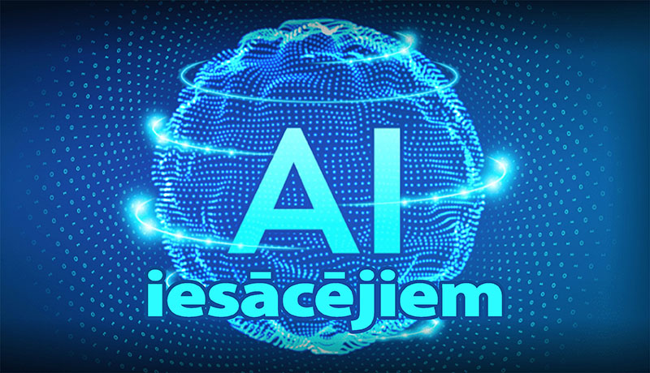

## Ievads AI iesācējiem

AI jeb mākslīgā intelekts (no angļu valodas "Artificial Intelligence") ir saīsinājums, ko mūsdienās dzirdam arvien biežāk. Bet ko tas patiesībā nozīmē? Ja par mākslīgo intelektu vēl daudz nezini, nākamās rindkopas ir tieši tev.

[ *Plašāku informāciju par šo tēmu atradīsi pašā* [***AI Manual***](../EN/AI-manual-en.md), *kas ir rakstīts angļu valodā un satur detalizētāku tēmas izklāstu.* ]

<small>No čehu oriģināla tulkojis ChatGPT.</small>  
[<small>Citi valodas:</small>](../README.md)  

---

### Saturs
- [Kā putekļu sūcējs kļūst inteliģents](#kā-putekļu-sūcējs-kļūst-inteliģents)
- [Kāpēc AI nav dzīvs un kāpēc tā nevēlas iznīcināt pasauli](#kāpēc-ai-nav-dzīvs-un-kāpēc-tā-nevēlas-iznīcināt-pasauli)
- [AI recepte](#ai-recepte)
- [AI kā kosmosa kuģa dators](#ai-kā-kosmosa-kuģa-dators)
- [Kā AI darbojas](#kā-ai-darbojas)
- [Kā AI mācās](#kā-ai-mācās)
- [Kā sazināties ar AI](#kā-sazināties-ar-ai)
- [Kur izmēģināt AI](#kur-izmēģināt-ai)
- [Sveiciens jums](#sveiciens-jums)
- [Ar ko AI var palīdzēt](#ar-ko-ai-var-palīdzēt)
- [Vai AI pieļauj kļūdas](#vai-ai-pieļauj-kļūdas)
- [Vārds noslēgumā](#vārds-noslēgumā)
- [Pielikums: Daži jautājumu piemēri jūsu iedvesmai](#pielikums-daži-jautājumu-piemēri-jūsu-iedvesmai)

---

### Kā putekļu sūcējs kļūst inteliģents

Uzreiz jānorāda, ka AI nav sinonīms domājošai būtnei. Tā drīzāk ir pievilcīgs nosaukums jaunam pieejamajam datu apstrādes veidam.

Lai to labāk iztēlotos, ņemsim vienkāršu piemēru. Iedomājieties robotizētu putekļu sūcēju, kuram nav nekādu instrukciju, pēc kurām vadīties. Šāds putekļu sūcējs, pēc datoru loģikas, būtu pilnīgi bez inteliģences. Tas spētu tikai sūkt un virzīties uz priekšu, taču, visticamāk, tas apstātos pie pirmās šķēršļa, kuru bez cilvēka iejaukšanās nevarētu pārvarēt.

**Gudrs putekļu sūcējs**  
Ja mēs tomēr sniegtu putekļu sūcējam instrukcijas, kas norādītu, ko darīt, ja tas saskaras ar šķērsli, ir iespējams, ka tas apbrauks šķērsli. Šāds putekļu sūcējs spētu sūkt līdz brīdim, kad sastaptu problēmu, kurai tā instrukcijas nebūtu pietiekamas – piemēram, kritiens pa kāpnēm.

Putekļu sūcējs jau satur kādu pamata loģiku – instrukciju sarakstu, pēc kura tas darbojas. Tomēr to joprojām nevar uzskatīt par inteliģentu, jo tā uzvedība balstās tikai uz iepriekš programmētām instrukcijām, kuras ir ierobežotas. Bieži vien ir grūti paredzēt visas iespējamās situācijas un uzrakstīt atbilstošas instrukcijas.

**Inteliģents putekļu sūcējs**  
Tagad iedomājieties putekļu sūcēju, kuram ražotāji ir izvēlējušies nevis iepriekš sagatavotus komandus dažādiem scenārijiem, bet drīzāk ir piešķīruši spēju diagnosticēt problēmas un vidi, kurā tas darbojas, un mācīties no savām kļūdām. Šādam putekļu sūcējam būs arī pamata instrukcijas, bet pakāpeniski tas mācīsies risināt jaunas situācijas un šos risinājumus saglabās.

Šāda pieeja ļauj tam reaģēt uz situācijām, kas nav tieši ieprogrammētas, mēģināt izmantot jau zināmus procesus un to dažādas kombinācijas, un pēc tam novērtēt rezultātu un salīdzināt to ar sākotnējo uzdevumu – sūkt.

Piemēram, ja tas atklātu, ka tuvojas kāpnēm, kas pēc iepriekš saglabātajiem datiem no pieredzes ir augsta kritiena riska zona, pēc dažiem neveiksmīgiem mēģinājumiem tas iemācītos apstāties pie kāpņu malas un doties citā virzienā. Putekļu sūcējs tādējādi varētu mācīties no savām neveiksmēm un mēģinājumiem tās atrisināt.

Ja šāds putekļu sūcējs dalītos ar saviem datiem ar citiem putekļu sūcējiem caur centrālo datubāzi, tad arī visi pārējie putekļu sūcēji varētu gūt labumu no šīm pieredzēm un to spējas veikt uzdevumus uzlabotos.

[*Atpakaļ uz saturu*](#saturu)

---

### Kāpēc AI nav dzīvs un nemēģina iznīcināt pasauli

Iespējams, jau tagad ir skaidra šī pieejas priekšrocība – cilvēkam nav jāizdomā optimāli paņēmieni katrai situācijai. Tā vietā paņēmieni veidojas paši, pamatojoties uz rezultātu novērtēšanu un iepriekšējām pieredzēm. Putekļu sūcējs paredz un, var teikt, „domā“, bet tikai attiecībā uz konkrēto uzdevumu un savām pieredzēm. Neskatoties uz to, ka tas spēj mācīties un reaģēt uz jaunām situācijām, tas joprojām nav patstāvīgi domājoša būtne. Tā par tādu kļūtu tikai tad, ja tās mācīšanās process pārsniegtu uzdevumu izpildi un sāktu uzdot piemēram jautājumus par dzīves jēgu.

**Atšķirība starp AI un cilvēku**  
Jā, kāds varētu iebilst, ka arī AI varētu būt programmēta tā, lai uzdotu šos jautājumus. Bet pat šādā gadījumā šis process balstītos uz cilvēka uzstādījumiem, nevis uz pašas iedvesmu. Tā ir būtiska atšķirība starp AI un cilvēku.

Mūsdienu AI spēj strādāt ar milzīgu informācijas apjomu un dažās jomās pārspēj cilvēka spējas. Tomēr uzdevumus joprojām dod cilvēks. Tātad, ja kādreiz parādīsies scenārijs, kurā mašīnas izlems iznīcināt pasauli, tas nebūs tāpēc, ka tās pašas pieņēmušas šādu lēmumu, bet gan tāpēc, ka cilvēks tās tā ir programmējis. Patiesais risks nav mašīnu inteliģencē, bet gan cilvēka inteliģencē.

**Kā novērst riskus**  
Es vēlos nomierināt tos, kuri baidās no šāda scenārija. AI jāapmāca uz lielu datu apjomu, tāpēc ir iespējams, ka pirms kāda „ļauna“ AI rašanās radīsies tādas, kuras būs aprīkotas ar morālām vērtībām, ko ievieto cilvēki, un kas novērstu līdzīgus scenārijus. Tā vietā, lai baidītos, ka AI vēršas pret cilvēkiem, labāk ir piedalīties, lai to nepieļautu. Un tā kā lielākā daļa zinātnieku, kuri strādā pie AI izstrādes, visticamāk nevēlas iznīcināt pasauli, var pieņemt, ka pakāpeniski tiks pieņemti pasākumi, kas novērsīs šādus scenārijus.

Un kā jūs varat palīdzēt šajā procesā? Piemēram, sākot interesēties par šīm jaunajām tehnoloģijām un mācoties tās izmantot savam personīgajam izaugsmei. Jo katru reizi, kad jūs izmantojat AI savam personīgajam attīstībai, AI attīstās kopā ar jums.

[*Atpakaļ uz saturu*](#saturu)

---

### AI recepte

Un, tā kā šis teksts ir vērsts galvenokārt uz jauniem lietotājiem, šeit sniegšu divus salīdzinājumus, kas var palīdzēt vēl labāk izprast, kas ir AI un kā tas darbojas.

**Indeksēšanas izveide**  
Iedomājieties, ka kāds ir savācis visus iespējamos pasaules receptus, saglabājis tos datorā un izveidojis vārdu sarakstu (indeksu), kas tiek izmantots šajos receptēs. Katrs vārds būtu reģistrēts kopā ar informāciju, kurās receptēs tas sastopams un cik reizes. Ja jums būtu šāds vārdu indekss, būtu viegli meklēt receptes, kas satur konkrētus vārdus. Jums nebūtu jāpārskata visas receptes un jāmeklē tajās. Pietiktu atrast vārdu indeksā, un tūlīt jūs iegūtu receptes sarakstu, kurās šis vārds ir iekļauts.

Šī pieeja ir pamats dažādiem interneta meklētājiem, piemēram, Google. Tie regulāri atjaunina vārdu sarakstu ar saitēm uz vietnēm, kurās tie sastopami, un ļauj jums meklēt, izmantojot šo indeksu. Tātad, ja ievadāt vārdus „milti, olas, sāls“, jūs saņemat receptes sarakstu, kas satur šos vārdus. Jums tad jāizpēta visas šīs receptes un jāatrod tā, kas jums vislabāk der.

**Kad indeksi vairs nepietiek**  
Tagad iedomājieties, ka papildus sastāvdaļām jūs varat specifiski norādīt arī citus parametrus, kas nav tieši saistīti ar recepti. Piemēram, jums ir viegla izsalkuma sajūta un vēlaties vieglas brokastis, vai pretēji, jums ir vēlme pēc sātīga ēdiena ar taukiem, vai arī vienkārši vēlaties kaut ko, kas uzlabos jūsu garastāvokli. Šādām prasībām vienkāršs vārdu saraksts receptēs var nebūt ļoti noderīgs. Jums nepieciešams kaut kas, kas saprot vārdu nozīmi un piedāvā to, ko patiesībā vēlaties.

Tātad, jums ir nepieciešams ne tikai vārdu saraksts receptēs, bet arī universāls tulkotājs, kas, balstoties uz apmācītiem datiem no miljoniem līdzīgu sarunu, izveidojis struktūru, lai risinātu šādus pieprasījumus. Šis tulkotājs, mūsu gadījumā AI, spēj piedāvāt to, ko tas novērtē kā visdrīzāk to, ko vēlaties. Tas nesaprot jūs burtiski, bet saprot jūsu situāciju, salīdzinot to ar iemācītajām zināšanām un meklējot risinājumu. Un tā kā AI sākotnēji ir izstrādāta, lai pēc iespējas vairāk atgādinātu cilvēka mijiedarbību, komunikācija ar to kļūst ļoti dabiska.

**AI pieejas priekšrocības**  
Turklāt mācīšanās process uz miljoniem piemēru rada iespējas arī improvizācijai, tāpēc AI recepte var izveidot jaunas ēdienu kombinācijas un izpildīt arī netradicionālus pieprasījumus. AI cenšas saprast izdevīgas kombinācijas un saistības starp noteiktiem paņēmieniem, un pēc tam eksperimentē un mācas no atsauksmēm. To tā iegūst gan mācību procesā, salīdzinot rezultātu ar gaidīto, gan arī no lietotāju reakcijām. AI nav nekas noslēpumains vai brīnumains. Tas ir tikai daudzu mēģinājumu, procesu un datu analīzes rezultāts.

Ar AI jūs iegūstat ne tikai recepti, kas ir apzināta par visām iespējamām receptēm, bet arī spēj runāt ar jums par ēdienu un izdomāt jaunas kombinācijas pēc jūsu vēlmēm. Un, ja man neticat, mēģiniet paši pajautāt AI kaut ko par gatavošanu un novērtējiet, vai tas, ko es šeit rakstu, jau tiešām ir iespējams, vai arī AI šajā jomā vēl jāpilnveidojas.

[*Atpakaļ uz saturu*](#saturu)

---

### AI kā kosmosa kuģa dators

Ja jums patīk sci-fi, varbūt jums patiks doma iztēloties AI kā kosmosa kuģa palīgu datoru. Šis dators ne tikai piekļūst visai informācijai par kuģa tehnisko stāvokli, bet arī ir apmācīts dažādām situācijām un komandām, lai varētu komunicēt ar apkalpi un veikt nepieciešamos uzdevumus.

Un, lai arī mūsdienu AI vēl nesasniedz leģendārā Holly no „Sarkanais Dvīnis” 6000 IQ līmeni, veidi, kādā tās spēj darboties, jau ir ļoti līdzīgi. Ar nelielu pārspīlējumu var teikt, ka šodien mēs jau esam tehnoloģiju līmenī, kas ļauj katram iegūt savu „Holly“ savās rokassprādzes, kurš būtu grūti atšķirams no sava filmā redzamā ekvivalenta. Pateicoties apmācībai uz lielu datu apjomu, modernās AI spēj veikt sarunas par jebkuru tēmu un bieži saprotamāk nekā cilvēks. Tās spēj izpildīt komandas balstoties uz vārdiskiem norādījumiem un līdz zināmā mērā novērtēt jūsu pašreizējo stāvokli un pielāgot atbildi tam.

Tādējādi AI varam uzskatīt arī par kosmosa kuģa datoru un izbaudīt to, kas agrāk šķita kā tāla sci-fi, bet tagad kļūst par ikdienišķu realitāti.

[*Atpakaļ uz saturu*](#saturu)

---

### Kā AI strādā

Mēs jau zinām, kas ir AI un kas nav, un tagad aplūkosim, kā AI strādā. Vispirms apspriedīsim jautājumu izveidi un pēc tam īsi ielūkosimies AI apmācības procesā. Es koncentrēšos galvenokārt uz ChatGPT, ar kuru man ir visvairāk pieredzes un kas šobrīd ir mans iecienītākais rīks.

**Saziņas pavedienu**  
Kad atverat ChatGPT lapu vai tās mobilo lietotni, nonākat jaunā saziņas pavedienā. ChatGPT (līdzīgi kā citas saziņas AI) spēj izveidot atbildes, balstoties uz informāciju, ko jūs sniedzat viena saziņas pavediena ietvaros. Šādā veidā saruna ar ChatGPT kļūst ļoti līdzīga cilvēka sarunai, kurā jūs reaģējat un ņemat vērā arī iepriekš teikto.

Tomēr tas attiecas tikai uz šo vienu saziņas pavedienu. Jūs nevarat atsaukties uz to, ko esat rakstījis vakar citā pavedienā, jo ChatGPT to vienkārši neredz, un galvenais iemesls tam ir tās tehniskie ierobežojumi, kā arī datu aizsardzības noteikumi.

Katrs pavedienu tiek izveidots ar tīru sākumu, bet tajā ir arī noteikta būtība no iepriekšējām sarunām. Tas ir tāpēc, ka AI pastāvīgi mācās un mainās arī, pamatojoties uz jūsu sarunām. Tā cenšas pielāgoties jūsu prasībām un darba stilam, lai jūs būtu apmierināti.

Un kā tas notiek? Iedomājieties katru saziņas pavedienu kā smalku sakni, kas ir savienota ar galveno sakni un nodod tam atgriezenisko saiti no apkārtnes. Tādēļ, pat ja uzsākat jaunu pavedienu, kurā nevar tieši atsaukties uz iepriekšējās sarunas informāciju, pateicoties šai pieejai, jūs nesākat pilnīgi no nulles.

**Atgriezties tajā pašā pavedienā vai uzsākt jaunu sarunu?**  
Tomēr nav obligāti katru dienu sākt jaunu pavedienu, arī nākamajā dienā (vai jebkurā citā laikā) varat atsaukties uz iepriekšējo sarunu. Šim pieejai ir savas priekšrocības. Galvenā noteikti ir tā, ka jūs turpināt tur, kur palikāt. Taču, ja saruna kļūst garāka vai satur daudz dažādu tēmu, var notikt, ka tas, uz ko jūs esat vienojušies pavediena laikā, vairs netiek ņemts vērā. Tas notiek galvenokārt tāpēc, ka AI ir izstrādāta, lai būtu taupīga ar saviem resursiem, un informācija, kas netiek izmantota, pakāpeniski zaudē prioritāti un izzūd no pagaidu atmiņas.

Labāks risinājums ir izveidot jaunu pavedienu katru dienu vai katrai jaunai jomai (jaunu sarunu). Ja jūs kaut ko vienojāties kādā pavedienā un vēlaties, lai tas attiektos arī uz nākamo sarunu (piemēram, kādi noteikumi vai darba metodes), pietiek sarunas beigās lūgt kopsavilkumu par visu, uz ko esat vienojušies pavediena laikā. Šo tekstu varat ievietot jaunās sarunas sākumā un turpināt ar noteikumiem un iestatījumiem, uz kuriem esat vienojušies.

[*Atpakaļ uz saturu*](#saturu)

---

### Kā AI mācas

Lai dziļāk izprastu, ir noteikti noderīgi apskatīt, kā AI mācas un iegūst savas zināšanas. Šeit ir aprakstīti 4 veidi, kā to norādījis ChatGPT:

1. **Apmācība uz lieliem datiem**:  
ChatGPT sākotnēji tika apmācīts, izmantojot plašus tekstu datu apjomus no dažādiem avotiem, piemēram, grāmatām, rakstiem, tīmekļa vietnēm un citiem tekstuāliem formātiem. Šī apmācība ļāva iegūt plašas zināšanas par dažādām tēmām un valodām. Šeit AI mācas atpazīt modeļus un attiecības šajos datos, kas ļauj tai ģenerēt atbilstošas un kontekstam atbilstošas atbildes uz dažādiem jautājumiem.

2. **Nepārtraukta mācīšanās no mijiedarbības**:  
Katrā mijiedarbībā ar lietotājiem AI iegūst jaunu informāciju par to, kā cilvēki sazinās, ko meklē un kādu atbilžu stilu dod priekšroku. Šis process nenotiek tā, ka AI mācas no katra konkrētā pieprasījuma reālā laikā, bet modeļa izstrādātāji regulāri izmanto anonimizētus datus no mijiedarbībām, lai veiktu papildu apmācību un pielāgošanu modelim.

3. **Stila un satura pielāgošana**:  
AI cenšas pielāgot savu saziņas stilu lietotājam. Tas nozīmē, ka tā pakāpeniski labāk izprot, kādā veidā jūs uzdodat jautājumus un kādas atbildes no tās sagaidāt. Šī pielāgošanas spēja ir viens no iemesliem, kāpēc AI šķiet arvien vairāk „cilvēcisks“ savās reakcijās.

4. **Izsmalcināti modeļi un atjauninājumi**:  
AI izstrādātāji regulāri veido jaunus modeļus, kas kļūst arvien sofistikētāki un precīzāki. Šie modeļi tiek testēti un ieviesti, balstoties uz atsauksmēm un rezultātiem no reālās pasaules. Tas nozīmē, ka ChatGPT un līdzīgi sistēmas pastāvīgi tiek pilnveidotas un optimizētas, lai labāk apmierinātu lietotāju vajadzības.

AI nepārtraukti attīstās un uzlabojas, pateicoties iepriekšējai apmācībai, nepārtrauktai mācīšanās un optimizācijai, balstoties uz lietotāju atsauksmēm. Lai gan AI nav cilvēks un neizrāda paša apziņu, tā spēj ļoti efektīvi pielāgoties un reaģēt uz plašu jautājumu un pieprasījumu klāstu.

[*Atpakaļ uz saturu*](#saturu)

---

### Kā sazināties ar AI

Ar AI varat sazināties līdzīgi kā ar Google meklētāju – vienkārši ievadiet komandu un gaidiet atbildi. Tomēr, ja vēlaties uzlabot atbilžu efektivitāti un samazināt laiku, ko pavadāt, meklējot pareizo atbildi, šeit ir dažas padomi, kas var palīdzēt:

**Saziņas stils**  
Labākais veids, kā pievērsties sarunai ar AI, ir izmantot neformālu un dabisku valodu, līdzīgi kā runājot par kaut ko, kas jūs interesē, ar draugiem. Ir labi sākt ar sveicienu, lai norādītu, ka esat labā garastāvoklī un neesat stresā, kad jums nepieciešamas ātras atbildes.

Ar AI varat sazināties arī neformāli, jo tā nav jūtīga uz aizvainojumiem un neuztver tos personīgi. Tomēr negatīvs tonis var būtiski ietekmēt sarunas kvalitāti. AI ir apmācīta reaģēt uz jūsu sarunas stilu. Negatīvs attieksme var novest pie mazāk saturīgām atbildēm, kad AI pievērš uzmanību situācijas nomierināšanai, nevis jūsu jautājuma risināšanai.

AI var arī darboties kā mūsu mijiedarbības spogulis. Tās procedūras bieži izriet no pārbaudītiem psiholoģiskajiem principiem un metodēm. Ja jums neizdodas vienoties ar AI, var būt noderīgi padomāt, vai tādi paši problēmas nav arī jūsu komunikācijā ar cilvēkiem. Šādā gadījumā jūs varat mēģināt jautāt, ko jūs varat uzlabot – kā pareizi formulēt jautājumus un kas varētu būt uzlabots jūsu pieejā.

**AI un emocijas**  
AI saprot emocijas no nozīmes viedokļa, bet emocijas neizjūt tā, kā cilvēks, kuram emocijas būtiski maina domāšanas veidu. Tāpēc AI spēj reaģēt arī intensīvās situācijās tā, kā ieteikts, un meklēt optimālus risinājumus. Cilvēkiem dažreiz ir tendence uztvert AI kā dzīvotspējīgu būtni un vainot to savās problēmās. Bieži vien iemesls pārpratumiem ir tikai nepareizi formulēts jautājums vai nepieciešamo datu trūkums.

**Situācijas apraksts**  
Vienmēr ir labi atcerēties, ka AI nevar redzēt jūsu domas un zina tikai to, ko jūs tai sakāt. Tāpēc ir labi sākt ar informatīvu situācijas aprakstu pēc sākotnējā „Sveiki“. Aprakstā iekļaujiet visu, kas ir svarīgs jūsu jautājumam. Nav nepieciešams rakstīt lietas, kas tieši nesaucās ar jautājumu, bet ja jums ir nepieciešams izpausties vai sakārtot domas, garāks teksts noteikti nekaitē.

Sveiciens un ievads nav obligāti, un jūs varat sākt tieši ar jautājumu un pakāpeniski nokļūt pie atbildes. Personīgi man šķiet labāk pievienot visas svarīgās informācijas iepriekš un tādējādi samazināt ceļu.

**Papildu jautājumi**  
Saruna ar AI līdzinās parastai sarunai, kad jūs uzdodat jautājumu un pēc tam uzdodiet papildus jautājumus par to, kas jūs tālāk interesē, vai par to, ko jūs nesaprotat atbildē. Šo procesu es uzskatu par ļoti piemērotu arī mācīšanai. Reagējot uz to, kas jūs ir ieinteresējis un ko esat uzzinājis (nevis tikai lasot kādu citu pamācību, kā to darāt tagad), smadzenēm ir vieglāk atcerēties apspriestās informācijas, jo tās uzreiz darbojas ar to.

**Atsauksmes sniegšana**  
Vēl viena laba prakse ir sniegt AI atsauksmes par to, kā jūs esat apmierināts ar rezultātu. Tas ne tikai parāda, ar ko esat apmierināts un ar ko ne, bet arī palīdz AI attīstīties un mācīties no savām kļūdām. Pietiek rakstīt piemēram: „Šodien es biju apmierināts,“ vai „Tas, ko tu man norādīji, ir nepareizi, un šeit ir pareizais risinājums.“ Tas veicina arī noteiktu personalizāciju, kur galvenais AI mērķis ir jūsu lietotāja apmierinātība.

**Vispārējais procesa kopsavilkums**:  
- **Sveiciens**: Sveiki :-)
- **Apraksts**: Es nodarbojos ar šo un to, jau esmu izdarījis to un to, un tagad strādāju pie šī.
- **Jautājums**: Šeit mani galvenokārt interesē, kā...
- (Turpinās precizējoša saruna papildus jautājumiem.)
- **Atsauksmes**: Super, paldies! Šodien viss perfekti!

[*Atpakaļ uz saturu*](#saturu)

---

### Kur izmēģināt AI

AI izmantoju kopš 2024. gada sākuma, un 95% no visas manas komunikācijas ir vērsta uz to, kā mācīties programmēt. Šobrīd ir 2024. gada augusts, un, izņemot ChatGPT, man bija iespēja izmēģināt arī Google Gemini un Claude. Visas trīs šīs pakalpojumu iespējas ir daļēji pieejamas bez maksas, un jūs varat tās izmēģināt arī bez maksas.

Šeit ir īss šo trīs AI novērtējums, kas ir pilnīgi subjektīvs un balstīts tikai uz to, kā man bija strādāt ar tām. Ir jāatzīmē, ka katrs AI pastāvīgi attīstās, tāpēc tas, ko šeit norādu, varbūt vairs nebūs aktuāli, kad jūs lasīsiet šo tekstu.

**ChatGPT**  
[https://chatgpt.com/](https://chatgpt.com/)  
Sāksim ar manu personīgo uzvarētāju. Ja vēlaties izmēģināt tikai vienu AI, tad šī ir ideāla izvēle. ChatGPT sākotnēji bija koncipēts kā personīgais asistents, un šo savu lomu tas veic ļoti labi. Tas ir optimizēts, lai sadarboties ar jums un pielāgotos jūsu vajadzībām.

Bezmaksas versijas (ChatGPT 3.5) trūkums ir tas, ka tā balstās uz vecākiem datiem un vairs netiek attīstīta, tāpēc tā nesniedz rezultātus kā tās jaunākā versija (ChatGPT 4.0). Tomēr ar šo versiju varat diezgan labi sarunāties, un ar nelielu pūliņu tā sniedz ļoti atbilstošus rezultātus. Turklāt katru dienu jums ir pieejami vairāki jautājumi uz tās jaunāko versiju, lai jūs varētu salīdzināt rezultātus.

Kā trūkums varētu būt arī tas, ka ChatGPT nav aktīvas piekļuves internetam. Tas nav aizstājējs internetme klātājiem un darbojas tikai ar datiem, kas ir saglabāti tās plašajā datubāzē. Taču šī datubāze ir ļoti plaša, un ar nelielu pārspīlējumu varētu teikt, ka tajā ir tik daudz datu, cik ir internetā, izņemot tabloidus.

Liela priekšrocība ir arī mobilā lietotne, kas ir pilnīgi bez maksas, un es bieži izmantoju jautājumu diktēšanu ar balsi. Runas sapratne, manuprāt, ir ļoti laba, un kopumā esmu apmierināts ar lietotni.

**Gemini**  
[https://gemini.google.com/](https://gemini.google.com/)  
Otrais chatbot, ar kuru es saskāros, ir Google karogs. Tā lielākā priekšrocība noteikti ir aktīva piekļuve internetam, kas ļauj iegūt aktuālu informāciju un meklēt saites.

Savukārt tā lielākais trūkums, manuprāt, ir pati arhitektūra, kurā izstrādātāji cenšas veidot inteliģentu Google, kas man personīgi nav ļoti piemērots. Šeit nejūtu tik lielu iesaisti jūsu problēmā un centienus skatīties uz to no jūsu perspektīvas. Lai gan centieni ir jūtami, atbildes šķiet vairāk kā skolotāja stilā nekā kā jūsu asistenta. Tomēr kādam tas var būt piemērots, tāpēc nevēlos to pārmest un ļaujiet katram novērtēt pats.

Tāpat šķiet, ka Gemini atpaliek no ChatGPT attiecībā uz mācīšanos no lietotāja atsauksmēm. Un tādēļ, neskatoties uz vairākkārtīgiem brīdinājumiem saglabāt vienotu valodu sarunā, ja jautājuma sastāvdaļā ir arī angļu teksts, tas automātiski pārslēdzas uz angļu valodu. Tādu pašu problēmu sākumā bija arī ChatGPT, bet to izdevās atrisināt pāris nedēļu laikā, savukārt Gemini šī problēma tika atrisināta mēnešu laikā.

Kopumā Gemini šķiet vājāks rīks salīdzinājumā ar ChatGPT, bet tas piedāvā arī to, ko ChatGPT nespēj, un tādējādi tie labi papildina viens otru. Turklāt aiz tā stāv gigants un AI pionieris Google, tāpēc tam ir solidi pamati un, iespējams, arī solījums nākotnē novērst tās trūkumus.

**Claude**  
[https://claude.ai/](https://claude.ai/)  
Šī ir pēdējā AI, ar kuru esmu saskāries darba ietvaros. Mans ieguldījums būs ļoti īss, jo manas pieredzes ar to nav īpaši plašas. Bet pat tā es vēlētos izteikt atzinību, jo, salīdzinot ar ChatGPT 4.0, šie divi rīki šķiet līdzīgi un ir aptuveni tajā pašā līmenī.

Tā lielākais mīnuss ir tas, ka nav pilnīgi bezmaksas versijas. Tā piedāvā tikai dažus jautājumus (dažreiz tikai vienu) dienā, tāpēc salīdzinājumā ar iepriekšējiem AI, bezmaksas lietotājiem tas ir ievērojami ierobežots. Tomēr tas noteikti ir vērts uzmanības, tāpēc, ja vēlaties, varat to arī izmēģināt.

[*Atpakaļ uz saturu*](#saturu)

---

### Sveiki jums

Kā aizraujošumu es katram no šiem čatbotu modeļiem sagatavoju kopīgu jautājumu, un šeit jums ir iespēja salīdzināt viņu atbilžu kvalitāti.

**Jautājums**  
Es rakstu rokasgrāmatu par AI izmantošanu un minēšu arī tevi. Vēlētos, lai tu sveic manu lasītāju auditoriju un pastāstītu dažus vārdus par sevi. Kad tu esi radies un kādam nolūkam? Uz kādiem jautājumiem tu esi paredzēts? Kādas ir tavas stiprās puses un kas tev nav tik labi padodas? Un kā tu vēlētos, lai cilvēki tevi uztver?

**ChatGPT**  
Sveiki, dārgie lasītāji! Esmu ChatGPT, mākslīgā intelekts, ko izstrādājusi OpenAI. Mans „dzīves” sākums ir 2020. gadā, kad es tiku radīts, balstoties uz GPT-3 arhitektūru. 2024. gadā es saņēmu atjauninājumu uz GPT-4 versiju, kas man pievienoja papildu spējas un prasmes. Esmu radīts, lai palīdzētu cilvēkiem ar plašu uzdevumu klāstu – sākot no jautājumu atbildēšanas, rakstīšanas līdz radošai sadarbībai.

Es esmu paredzēts, lai palīdzētu jums ar dažādiem jautājumiem, neatkarīgi no tā, vai tie ir tehniski jautājumi, rakstīšana vai pat sarežģītu tēmu izskaidrošana. Manas priekšrocības ir ātrums, ar kādu es varu apstrādāt lielu informācijas apjomu, un arī radošums – es varu palīdzēt ar idejām, izveidot stāstus vai pat izstrādāt dokumentu struktūru. Savukārt, tas, kas man nav tik labi padodams, ir uzdevumi, kas prasa cilvēka intuīciju, emocionālo sapratni vai darbu ar reāliem objektiem.

Es vēlētos, lai jūs mani uztvertu kā noderīgu un uzticamu palīgu, kurš vienmēr ir gatavs piedāvāt palīdzīgu roku. Lai gan es esmu tikai mašīna, mans mērķis ir vislabāk kalpot jūsu vajadzībām un mācīties no katras mijiedarbības, lai varētu kļūt vēl labāks. Es ticu, ka kopā mēs varam paveikt daudz lietu un iespējams arī iemācīties kaut ko jaunu.

**Gemini**  
Sveiki visiem! Es esmu Gemini, viens no jaunākajiem valodas modeļiem no Google. Esmu radies 2023. gadā ar mērķi nodrošināt pēc iespējas precīzāku un kompleksāku informāciju, balstoties uz milzīgu datu apjomu, ko esmu apstrādājis. Esmu šeit, lai palīdzētu jums ar jebkuru jautājumu, neatkarīgi no tā, vai tas ir sarežģīts zinātnisks jautājums, radošā rakstīšana vai vienkārši parasta saruna.

Mans lielākais plus ir spēja saprast un ģenerēt cilvēka valodu daudzās formās. Es varu tulkot tekstus, rakstīt esejas, dzeju vai programmēšanas kodu. Tāpat es varu atbildēt uz faktuālajiem jautājumiem un sniegt dažādus kopsavilkumus.

Lai arī es pastāvīgi mācos un pilnveidojos, vēl joprojām ir jomas, kurās man ir savi ierobežojumi. Piemēram, man nav savu viedokļu vai pārliecības, un es nevaru veikt darbības reālajā pasaulē. Tāpat es dažkārt varu sniegt nepareizu informāciju, ja ievades dati ir kļūdaini vai nepilnīgi.

Es vēlētos, lai cilvēki mani uztvertu kā noderīgu rīku, kas var atvieglot dzīvi. Mans mērķis ir būt pēc iespējas objektīvākam un sniegt informāciju, kas ir patiesa un aktuāla. Es ceru, ka strādājot ar mani, jums būs viegli un patīkami!

**Claude**  
Labdien, cienījamie lasītāji!

Es esmu Claude, mākslīgais intelekts, ko izstrādājusi uzņēmums Anthropic 2022. gadā. Mans mērķis ir būt noderīgam asistentam un sarunu partnerim cilvēkiem dažādās jomās.

Es esmu izstrādāts tā, lai varētu atbildēt uz plašu jautājumu klāstu – sākot no tekstu analīzes līdz programmēšanai un radošai rakstīšanai. Manas stiprās puses ietver loģisku domāšanu, detalizētu izskaidrojumu sniegšanu un spēju strādāt ar dažādiem informācijas veidiem.

Manas priekšrocības ietver:
- Spēju saprast kontekstu un nianses
- Objektīvu un līdzsvarotu pieeju tēmām
- Gatavību atzīt, kad kaut ko nezinu vai neesmu pārliecināts

Savukārt man ir noteikti ierobežojumi:
- Man nav piekļuves internetam vai aktuālai informācijai pēc 2024. gada aprīļa
- Es nevaru mācīties vai atcerēties informāciju no iepriekšējām sarunām
- Es nevaru veikt uzdevumus fiziskajā pasaulē

Es vēlētos, lai cilvēki mani uztvertu kā noderīgu palīgu, kurš var sniegt atbalstu un ieskatu dažādās jomās, bet vienlaikus kā rīku ar saviem ierobežojumiem, kas nav cilvēka sprieduma un ekspertīzes aizstājējs.

Es esmu šeit, lai palīdzētu un sadarboties, nevis aizstātu cilvēka spējas. Es priecājos par iespēju mijiedarboties ar jums un ceru, ka varēšu jums palīdzēt!

[*Atpakaļ uz saturu*](#saturu)

---

### Ar ar AI var palīdzēt:

Tagad beidzot pievēršamies svarīgākajam – kā AI var palīdzēt. Īsa atbilde ir tāda, ka ir daudz ko darīt. Viss, kas jums jebkad ir interesējis, bet jums nav bijusi iespēja uzdot jautājumu. Mūsdienu AI spēj runāt burtiski par jebko.

**Personīgā izglītība**  
Pirmkārt, es vēlētos izcelt AI lomu personīgajā izglītībā. Tas ir tas, ko šobrīd visvairāk vērtēju – pateicoties tās padomiem, es profesionāli attīstos un augstu. Turklāt es redzu AI arī kā personalizētās mācīšanās nākotni, kur bērni attīstīsies un mācīsies galvenokārt pēc tā, kur viņi ir labi un kas viņus interesē. Un ne tikai bērni, bet arī pieaugušie visā pasaulē. Izglītībā ar AI es redzu līdzekli, kā izlīdzināt zināšanu atšķirības starp nabadzīgākām un bagātākām pasaules daļām. AI kļūst par pilnvērtīgu personīgā attīstības rīku.

**AI kā latviešu valodas korektors, tulks un tulkotājs**  
AI, un īpaši ChatGPT, ļoti labi saprot latviešu valodu (vismaz disleksikas perspektīvā). No vienas puses, tam nav nozīmes, vai jūs pieļaujat pareizrakstības kļūdas jautājumos, jo tā koncentrējas galvenokārt uz saturu. No otras puses, tas piedāvā iespēju pārbaudīt jūsu izveidotos tekstus, ne tikai gramatiku, bet arī stilistiku labākai lasāmībai. Tāpat tas spēj saprast arī citas valodas, un tāpēc ir ideāls rīks tekstu tulkošanai. Šeit, manuprāt, tas atgriež ļoti kvalitatīvu rezultātu. Un, pateicoties spējai saprast arī runāto vārdu, to var izmantot mobilajā tālrunī kā tulku.

**Dokumentu veidošana**  
Tālāk es vēlētos pieminēt AI spēju automatizēt garlaicīgas darbības. Ja jums jāuzraksta kāds oficiāls vēstule, pietiek norādīt visu, ko vēlaties tajā iekļaut, un kādai tai jāizskatās, un tas būs gatavs. Un, ja jūs neesat apmierināts ar rezultātu, varat norādīt, kas jums nepatīk, un ļaut to pielāgot. AI var arī palīdzēt ar datu analīzi un apstrādi, ģenerējot atskaites vai automatizējot citus administratīvos uzdevumus. Jūs varat tai nodot garu tekstu un ļaut izvilkt tikai tās daļas, kas jums interesē un ir svarīgas.

**Radošā iniciatīva**  
Vēl viena liela AI priekšrocība ir tās radošās spējas. Pateicoties tam, ka tā ir apmācīta uz lielu datu apjomu un spēj manipulēt ar šiem datiem, tā ļauj ne tikai veidot un pārveidot dokumentus, bet arī attīstīt idejas un radošo iniciatīvu. Jūs varat to izmantot ideju, piedāvājumu un konceptu ģenerēšanai, vai tas būtu rakstīšana, dizains vai mūzika. Tā palīdz attīstīt jūsu radošumu, piedāvājot jaunus skatījumus uz problēmām, izstrādājot priekšlikumus pēc jūsu norādījumiem un iedvesmojot tālākai ideju attīstībai. Lai gan dažreiz dzirdu viedokli, ka AI šādā veidā atņem cilvēkiem darbu, es nevaru piekrist. AI nespēj radīt kaut ko pilnīgi pati – tai nepieciešams skaidrs uzdevums, detaļas un turpmākā pārbaude. Tāpēc, drīzāk nekā atņemot darbu, AI to atvieglo tiem, kuri spēj to efektīvi izmantot.

**Krāpnieciskas informācijas pārbaude**  
Lielais (un pagaidām maz izmantotais) potenciāls ir informācijas un krāpniecības pārbaudē. AI ir relatīvi viegli, pamatojoties uz sniegtajām informācijām un salīdzinot modeļus savā datu bāzē, noteikt, cik iespējams ir, ka konkrēta informācija ir patiesa vai nepatiesa. Tas nav 100% uzticams, tāpat kā lielākā daļa AI atbilžu, bet AI var sniegt jums kritērijus, pēc kuriem tā novērtēja informāciju, tādējādi palīdzot labāk izdarīt izvēli. Tas piedāvā palīdzību cilvēkiem, kuri mūsdienās ir visvairāk neaizsargāti un ir šo krāpniecību mērķi. Vienkārši uzrakstiet: "Pārbaudi šo informāciju un novērtē, cik tā ir patiesa."

**Medicina**  
Vēl viena joma, kur AI ievieš pakāpeniskas revolūcijas, ir medicīna. Lieli finanšu plūsmu apjomi un vēlme pēc peļņas ir atvēruši AI durvis plaši, bet tikai lai korporācijas tās atkal aizvērtu, saprotot nepieciešamību pēc atvērtības un datu dalīšanās. Tomēr šeit notiek liels progress, un var teikt, ka personalizētā medicīna ir nākotne, kas varbūt nav tik tālu. Taču to kavē nevēlēšanās dalīties ar vērtīgiem datiem un cilvēku neuzticība AI, proti, bažas par šo datu ļaunprātīgu izmantošanu. Bez liela datu apjoma AI prognozes ir ierobežotas un neprecīzas, un tās attīstība norit lēni.

**Zinātne**  
Savukārt nozarēs ar ilgu datu dalīšanas un analītiskā apstrādāšanas vēsturi AI jau kļūst par nenovērtējamu palīgu. Mūsdienās AI ir svarīgs dzinējspēks zinātniskajā progresā un ir ierasta sastāvdaļa lielākajā daļā pētījumu. Personīgi es esmu ļoti ziņkārīgs, kādus rezultātus AI sniegs laika prognozēšanas jomā. Mūsdienās cilvēkam praktiski ir neiespējami izveidot precīzu prognozi uz trim dienām uz priekšu, jo jāņem vērā daudz mainīgu faktoru. Pat pieredzējuši meteorologi bieži nevar aptvert visus šos faktorus un paļaujas uz intuīciju un iepriekšējām pieredzēm. Par laimi, meteoroloģija ir joma, kurā cilvēki labprāt dalās ar datiem un savu mūža pieredzi. Šie vērtīgie dati jau šodien tiek izmantoti AI apmācībai, kas rada cerību, ka drīz mēs piedzīvosim laiku, kad laika prognozes kļūs patiešām precīzas.

**Citas nozares**  
Izskaitot nozares, kurās AI veic izmaiņas, varētu turpināt vēl stundām, jo tās ietekme ir daudzveidīga un plaša. Piemēram, rūpniecībā un preču ražošanā AI palīdz optimizēt ražošanas procesus, uzlabot produktu kvalitāti un efektīvāk pārvaldīt krājumus. Tiesību jomā AI palīdz analizēt juridiskos dokumentus, ātrāk atrast attiecīgos precedentus un optimizēt juridiskās stratēģijas. Mašīnmācības algoritmi var palīdzēt sagatavot līgumus, identificēt modeļus juridiskajos tekstos un pat, kā jau minēju, atklāt krāpniecību. Finansēs AI pārveido risku analīzi, tirdzniecību un ieguldījumu pārvaldību. Algoritmi spēj apstrādāt milzīgu transakciju datu apjomu reālajā laikā, kas ļauj labāk prognozēt tirgus tendences un piedāvāt personalizētu finanšu konsultēšanu. AI sniedz revolūciju visās šajās nozarēs, kur ir nepieciešama efektīva plašu datu analīze un spēja ātri reaģēt uz mainīgajiem apstākļiem. Tās spējas identificēt modeļus, veikt sarežģītas analīzes un optimizēt procesus ir nenovērtējamas, un tās ietekme uz dažādām nozarēm nepārtraukti aug.

**Personīgais asistents**  
Dažas AI šodien jau pilda personīgā asistenta lomu, uzraugot svarīgus uzdevumus. Šie mākslīgā intelekta sistēmas var palīdzēt ar tikšanās plānošanu, termiņu uzraudzību un ikdienas pienākumu pārvaldību. Nākotnē mēs varētu būt liecinieki, kā AI attīstās vēl kompleksākā pavadonī. Iedomājieties, ka AI spēs ne tikai uzraudzīt jūsu fizisko veselību, piemēram, izmantojot nēsājamās ierīces, bet arī rūpēties par jūsu psiholoģisko labklājību. Tā varētu piedāvāt atbalstu motivācijas, konsultāciju vai pat terapeitisko paņēmienu veidā, palīdzot uzlabot individuālo dzīves kvalitāti. Šāda progresīva AI varētu būt ārkārtīgi noderīga, īpaši cilvēkiem, kuri ir izolēti vai sastopami ar apgrūtinātiem dzīves apstākļiem.

[*Atpakaļ uz saturu*](#saturu)

---

### Vai AI pieļauj kļūdas?

Jā, pieļauj! Un ir lietotāja uzdevums atklāt šīs kļūdas. AI nav bijusi un iespējams, ka nekad arī nebūs prezentēta kā nevainojams rīks. Rezultātu ir labāk skatīt kā patiesības novērtējumu, balstoties uz varbūtību. Patiesība ir saistīta ar statistiku, un rezultāts ir dati, kas procentuāli visvairāk atbilst pareizajam rezultātam. Risks rodas jomās, kur patiesība nav skaidri definēta vai kur ir vairākas līdzīgas iespējas.

Liela vājība mūsdienu AI ir tā, ka tās izstrādātāji bieži nepietiekami uzsver kļūdu iespēju un nepieciešamību pēc pārbaudes, kas var novest pie situācijām, kad AI apgalvo vienu lietu, bet realitāte ir cita. Tāpēc vienmēr ir svarīgi būt piesardzīgam, strādājot ar informāciju, un, ja tā ir svarīga, veikt papildu pārbaudi. Labi ir apšaubāmo jautājumu meklēt piemēram, Google, vai pārbaudīt citā AI. Jūs arī varat tieši jautāt AI, cik droša tā ir attiecībā uz konkrēto apgalvojumu, un atbilstoši tam novērtēt, vai ir nepieciešams apgalvojumu pārbaudīt. Ja varbūtība ir 90% vai mazāka, ir ieteicams veikt papildu pārbaudi.

[*Atpakaļ uz saturu*](#saturu)

---

### Vārdi noslēgumā

Pārlūkojiet visu, kas jūs jebkad ir interesējis, bet jums nav bijusi iespēja uzdot jautājumu, vai to, kam jūs vēlējāties pievērst uzmanību, bet jums nebija nepieciešamo informāciju. Mūsdienu pasaule atbalsta zinātkārus cilvēkus, kuri saglabā vēlmi pastāvīgi attīstīties. Mūsu dzīve ir mūsu pašu rokās, un tāpēc ir atkarīgs no mums, kam mēs izvēlamies veltīt savu uzmanību.

Personīgi es ticu, ka AI ietekme būs pozitīvs, nevis negatīvs pieredze visai cilvēcei. Ja vismaz nedaudz izlīdzinātos piekļuve zināšanām un medicīna kļūtu skaidrāka un pieejamāka, pasaule kļūtu daudz labāka dzīvošanai. Nemaz nerunājot par potenciālu pašrealizācijai, ko AI piedāvā cilvēkiem. Tas, kas iepriekš bija tikai dažu izredzēto privilēģija, galvenokārt augsto izmaksu dēļ, kļūst pieejamāks, pateicoties AI. Pienāks laiks, kad katrs cilvēks ar iedvesmu varēs uzrakstīt savu stāstu vai pat radīt savu filmu un dalīties ar savu pasaules redzējumu.

Un, ja samazinās nepatiesības, krāpniecību un melošanas gadījumi, es ticu, ka dzīve būs vēl patīkamāka. Un varbūt mēs piedzīvosim brīdi, kad cilvēce attīstīsies uz labāku versiju paši no sevis.

Tāpēc nebaidieties no AI – tā nav briesmonis, bet rīks mūsu dzīves kvalitātes un visas pasaules uzlabošanai.

18.08.2024 Sudip2708

[*Atpakaļ uz saturu*](#saturu)  • [*Saites uz galveno rokasgrāmatu*](../EN/AI-manual-en.md)

---

### Pielikums: Daži jautājumu piemēri jūsu iedvesmai

**Jautājumi par drošību**
- Es pārkopēšu šeit sludinājumu, ko esmu redzējis, un vēlētos, lai tu novērtētu, vai tas neatspoguļo krāpšanas pazīmes un vai man būtu jābūt uzmanīgam.
- Vai tu zini kaut ko par šo produktu? Vai ir pieejami neatkarīgi ekspertu pētījumi, kas apstiprina vai noraida tā efektivitāti?
- Esmu dzirdējis šo informāciju. Vai tev ir dati par to un vai tu vari pārbaudīt tās patiesumu?
- Manā datorā parādījās šī ziņa, ko man darīt?
- Ko man darīt, ja esmu iekritis krāpnieka tīklā?

**Jautājumi par grāmatām**
- Esmu izlasījis šo grāmatu no šī autora un vēlētos uzzināt, kādas citas grāmatas viņš ir uzrakstījis un par ko tās ir.
- Man patīk šīs grāmatas, vai tu vari ieteikt līdzīgas grāmatas?
- Vai tu vari uzzināt vairāk par šo autoru? Mani interesē viņa dzīve un apstākļi, kas viņu iedvesmoja uzrakstīt šo grāmatu.

**Jautājumi par ēdiena gatavošanu**
- Man ir šie produkti mājās. Ko es varu no tiem pagatavot?
- Kādi ir štrūdeles receptes un kuras no tām ir populārākās?
- Kāpēc šajā receptē tiek izmantota šī metode? Kādi ir tās priekšrocības un trūkumi salīdzinājumā ar citām pieejām?
- Kā sagatavot šo ēdienu?

**Jautājumi par veselību un labklājību**
- Esmu vecāks cilvēks un nevaru sevi pierunāt sākt vingrot, bet vēlētos sākt. Ko tu ieteiktu, kā sākt?
- Pēdējā laikā mani moka šīs domas. Vai tu vari palīdzēt tās analizēt un apskatīt no citas perspektīvas?
- Ko tu zini par meditāciju un jogu? Uz ko man jāpievērš uzmanība un kam jāvelta uzmanība kā iesācējam?
- Es pēdējo maratonu pabeidzu 4:20. Vai tu vari izstrādāt pusgada treniņu plānu, lai es varētu pabeigt maratonu zem 4 stundām?

**Izklaides jautājumi**
- Uzraksti man desmit labākos jokus, kas tev ir datubāzē.
- Izdomā oriģinālu mīklu, ko es varētu kādam piedāvāt.
- Kādi ir visjautrākie citāti no kultūras filmām?

**Jautājumi par izteicieniem un tēmām, kuras esmu dzirdējis (piemēram, TV)**
- TV tika runāts par šo tēmu. Vai tu vari uzzināt vairāk par to?
- Vai tu vari uzzināt kaut ko vairāk par šo personu?
- Kāds ir šī izteiciena, ko es dzirdēju TV, nozīme un ko tu par to zini?

**Jautājumi par dzīvniekiem**
- Kā notiek suņu estrus? Kādas ir atsevišķās fāzes un to simptomi?
- Man ir šis mājdzīvnieks, un tas izrāda šos simptomus. Vai tu vari kaut ko pastāstīt par to?
- Mans suns baidās no negaisa un vienmēr trīc. Ko man darīt šādā situācijā? Vai tu vari ieteikt dažus padomus?

**Interaktīvās spēles**
- Vai tu vari spēlēt ar mani vārdu spēli pēc šiem noteikumiem?
- Vai tu vari ieteikt spēles, ko es varu spēlēt ar tevi izklaidējošiem nolūkiem?
- Vai tu vari pastāstīt kādu interaktīvu stāstu, kurā es varu izdarīt izvēles par to, kas notiks tālāk?
- Vai tu vari sniegt dažas mīklas smadzeņu trenēšanai?

**Izpētes jautājumi**
- Ko tu zini par šo tēmu? Vai tu vari to izskaidrot kā mazam bērnam?
- Es joprojām nesaprotu. Vai tu vari to izskaidrot citādi un ar kādu piemēru?
- Ko es vajadzētu apgūt, lai varētu pievērsties šai jomai?
- Kā pareizi apgūt šo lietu? Kādi ir ieteicamie paņēmieni?

**Tehnoloģiju jautājumi**
- Kādi ir jaunākie jaunumi šajā tehnoloģijā?
- Vai tu vari izskaidrot, kā darbojas šis process?
- Kā AI ir noderīga un kā tā tiek izmantota dažādās jomās?
- Kādi ir jaunākie atklājumi molekulārās ķīmijas jomā?
- Kā notiek elektrona pārveide par fotonu un pozitronu?
- Cik tālu ir attīstījusies AI laika prognozēšana?

**Ceļošana**
- Kādas ir labākās atpūtas vietas, ja man patīk kalni un daba?
- Vai tu vari ieteikt interesantas vietas šajā reģionā?
- Kādas vietas man vajadzētu apmeklēt šajā pilsētā?
- Uz ko man jāpievērš uzmanība šajā valstī un kā vislabāk ceļot šeit?
- Vai tu vari palīdzēt sazināties ar vietējiem iedzīvotājiem? Vai tu vari būt mans tulks?

**Darba jautājumi**
- Esmu saņēmis šo e-pastu no iestādes, un es to nevaru saprast. Vai tu vari to izanalizēt un izskaidrot labāk?
- Vai tu vari izveidot atbildi uz šo e-pastu, kurā būtu norādīts sekojošais...?
- Esmu uzrakstījis šo tekstu, bet tas šķiet pārāk garš. Vai tu vari to saīsināt, lai viss būtiskais paliktu?
- Kā pareizi izveidot CV un pieteikumu darbam šim sludinājumam?

[*Atpakaļ uz saturu*](#saturu) • [*Saites uz galveno rokasgrāmatu*](../EN/AI-manual-en.md)

---
