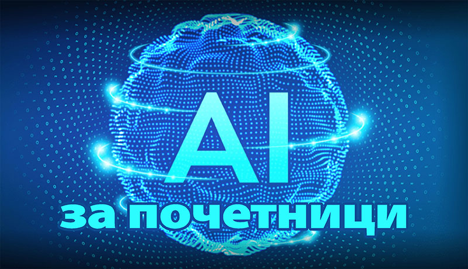

## Вовед во AI за почетници

AI или вештачка интелигенција (од англиски „Artificial Intelligence“) е акроним кој денес го слушаме сè почесто. Но што всушност значи тоа? Ако не знаете многу за вештачката интелигенција, следниве редови се наменети токму за вас.

[ *Повеќе информации за оваа тема можете да најдете во самото* [***AI Manual***](../EN/Manual_for_AI.md), *кој е напишан на англиски јазик и содржи подетален разглед на темата.* ]

<small>Преведено од чешкиот оригинал од ChatGPT.</small>
[<small>Други јазици:</small>](../README.md)  

---

### Содржина
- [Како да стане усисувач интелигентен](#kako-da-stane-usisuvac-inteligenten)
- [Зошто AI не е жив и зошто не сака да го уништи светот](#zoshto-ai-ne-e-ziv-i-zoshto-ne-saka-da-go-unishti-svetot)
- [AI кујна](#ai-kujna)
- [AI како компјутер на вселенска летала](#ai-kako-kompjuter-na-vselenska-letala)
- [Како AI работи](#kako-ai-raboti)
- [Како AI учи](#kako-ai-uchi)
- [Како да комуницирате со AI](#kako-da-komunicirate-so-ai)
- [Каде да го пробате AI](#kade-da-go-probate-ai)
- [Поздрав за вас](#pozdrav-za-vas)
- [Со што може AI да помогне](#so-shto-mozhe-ai-da-pomogne)
- [Прави ли AI грешки](#pravi-li-ai-greshki)
- [Завршни зборови](#zavrsni-zborovi)
- [Додаток: Неколку примери на прашања за ваша инспирација](#dodatek-nekolku-primeri-na-prashanja-za-vasha-inspiracija)

---

### Како да стане усисувачот интелигентен

Од самиот почеток морам да ги разочарам некои – AI не е синоним на мислечко суштество. Тоа е повеќе привлечен наслов за нов пристап во работењето со податоци.

За да го визуализираме тоа подобро, ќе користиме едноставен пример. Замислете роботски усисувач кој нема никакви инструкции според кои би се водел. Таквиот усисувач би бил целосно без интелигенција од гледна точка на компјутерската логика. Тој би можел само да усисува и да се движи напред, но веројатно би се запрел на првата пречка што не би можел да ја помине без човечка интервенција.

**Паметен усисувач**  
Но, ако му дадеме инструкции на усисувачот што да направи ако се соочи со пречка, е веројатно дека ќе ја заобиколи пречката. Таквиот усисувач ќе може да усисува додека не наиде на проблем за кој неговите инструкции не би биле доволни – на пример, пад од скали.

Усисувачот веќе содржи основна логика – список на упатства по кои се води. Сепак, не може да се смета за интелигентен, бидејќи неговото однесување е само резултат на однапред програмирани инструкции кои се ограничени. Често е тешко да се предвидат сите ситуации кои можат да се појават и да се напишат соодветни инструкции.

**Интелигентен усисувач**  
Сега замислете усисувач кој производителите не го опремиле со претходно подготвени команди за различни сценарија, туку му дале способност да дијагностицира проблеми и средина во која работи и да учи од сопствените грешки. Таквиот усисувач би имал и основни инструкции, но постепено би учел како да се справи со нови ситуации и би ги зачувал овие решенија.

Овој пристап му овозможува да реагира на ситуации кои не се директно програмирани, да пробува да користи процеси кои веќе ги познава, и нивни различни комбинации, а потоа да го оцени резултатот и да го спореди со оригиналната задача, која е да усисува.

На пример, ако открие дека се приближува до скали, кои според зачуваните податоци од претходни искуства претставуваат висок ризик од пад и неможност да се извлече, по неколку неуспеси би научил да запре на работ на скалите и да се насочи во друг правец. Усисувачот би можел да учи на основа на сопствените неуспеси и обиди да ги реши.

И ако таков усисувач ги дели своите податоци со другите усисувачи преку централна база на податоци, тогаш сите други усисувачи ќе можат да ги искористат овие искуства и нивната способност да ги исполнат своите задачи ќе се подобри.

[*Назад на содржината*](#sodrzina)

---

### Зошто AI не е жив и не планира да го уништи светот

Можеби веќе е јасна предноста на овој пристап – човекот не мора да измислува оптимални постапки за секоја ситуација. Наместо тоа, постапките се формираат сами на основа на проценка на резултатите и претходните искуства. Усисувачот предвидува и може да се каже „мисли“, но само во рамките на зададената задача и своите искуства. И покрај тоа што е способен да учи и да реагира на нови ситуации, сеуште не се работи за самостојно мислечко суштество. Тоа ќе стане само кога неговиот процес на учење ќе ги надмине рамките на исполнување на задачите и ќе започне да поставува прашања за смислата на животот.

**Разлика помеѓу AI и човекот**  
Да, некој би можел да забележи дека AI исто така може да биде програмирана да поставува вакви прашања. Но, дури и во овој случај, овој процес ќе произлегува од упатствата на човекот, а не од сопствена инспирација. Тоа е суштинска разлика помеѓу AI и човекот.

Современата AI има способност да работи со огромни количини информации и во некои области надминува човечките способности. Сепак, тоа е човекот кој ги задава задачите. Па, ако некогаш се појави сценарио каде машини одлучуваат да го уништат светот, тоа нема да биде затоа што самите одлучиле, туку затоа што човекот ги програмирал да го направат тоа. Реалната опасност не лежи во интелигенцијата на машините, туку во интелигенцијата на човекот.

**Како да се избегнат ризиците**  
Сакам да ги уверувам оние кои се плашат од сличен сценарио. AI мора да се обучува на големи количини податоци, и така е веројатно дека пред да се создаде „зла“ AI, ќе се создадат оние кои ќе имаат морални вредности внесени од луѓето и ќе спречат слични сценарија. Значи, наместо да се плашите дека AI ќе се сврти против луѓето, подобро е да учествувате во тоа да не се случи. И бидејќи повеќето научници кои работат на развојот на AI веројатно не сакаат да го уништат светот, можно е да се претпостави дека постепено ќе бидат преземени мерки кои ќе спречат слични сценарија.

И како можете и вие да помогнете? На пример, така што ќе почнете барем малку да се интересирате за овие нови технологии и да се научите да ги користите за сопствен раст. Бидејќи во секој момент кога користите AI за свој личен развој, AI се развива заедно со вас.

[*Назад на содржината*](#sodrzina)

---

### AI кујна

И бидејќи овој текст е насочен главно на новите корисници, ќе наведам две паралели кои можат дополнително да ви помогнат да го разберете што е AI и како функционира.

**Создавање индекс**  
Замислете дека некој ги собрал сите можни рецепти од светот, ги зачувал во компјутер и направил список на сите зборови (индекс) кои се користат во нив. Секој збор би бил запишан со информација за тоа во кои рецепти се јавува и колку пати. Ако имате таков индекс на зборови, ќе биде лесно да пребарувате рецепти кои содржат тие одредени зборови. Не би требало да пребарувате сите рецепти за да ги најдете. Доволно е да ја пронајдете зборот во индексот и веднаш ќе имате список на рецепти каде се јавува.

Овој пристап е основа на различни интернет пребарувачи, како што е Google. Тие имаат редовно ажуриран список на зборови со линкови до страниците каде се појавуваат, и ви овозможуваат да пребарувате користејќи го овој индекс. Па, ако внесете зборови „брашно, јајца, сол“, ќе добиете список на рецепти кои ги содржат овие зборови. На вас ќе ви остане да ги прегледате сите овие рецепти и да најдете оној кој најдобро одговара на вашите потреби.

**Што не е доволно за индекси**  
Сега замислете дека покрај состојките можете да специфицирате и други параметри кои не се директно поврзани со рецептот. На пример, имате малку глад и сакате лесен појадок, или пак имате желба за богато јадење полно со маст, или едноставно сакате нешто што ќе ви го подобри расположението. За такви барања, самиот список на зборови содржани во рецептите веројатно не би бил многу корисен. За такви барања ви е потребен нешто што разбира значењето на вашите зборови и врз основа на нив ќе ви понуди тоа што навистина го сакате.

Треба да имате не само список на зборови во рецептите, туку и универзален преведувач, кој на основа на обучени податоци од милиони слични разговори создал структура за решавање на таквите барања. Овој преведувач, односно во нашиот случај AI, може да понуди она што ќе го оцени како најверојатно да сакате. Не ја разбира вашата буквално, но ја разбира вашата ситуација, ја споредува со научените знаења и бара решение. И бидејќи AI е од почетокот дизајнирана да личи што повеќе на човечка интеракција, комуникацијата со неа станува многу природна за човекот.

**Предности на AI пристапот**  
Покрај тоа, процесот на учење на милиони примери создава простор и за импровизација, па AI кујната може да создава нови комбинации на јадења од рецептите и да исполнува и нетрадиционални барања. AI се обидува да разбере корисни комбинации и поврзаности на одредени постапки и потоа експериментира и учи од повратните информации. Таа добива повратни информации при тренингот преку споредба на резултатот со очекуваното, но исто така може да учи и од реакциите на корисниците. Нема ништо мистериозно или чудесно во AI. Се работи само за резултат на многу обиди, процеси и анализа на податоци.

Со AI не само што добивате кујна која има преглед на сите можни рецепти, туку и таа може да разговара со вас за јадење и да измислува нови комбинации според вашите идеи. И ако не верувате, пробајте сами да ја прашате AI нешто за готвење и проценете дали тоа што го пишувам тука веќе го уме или дали треба да се подобри во овој поглед.

[*Назад на содржината*](#sodrzina)

---

### AI како компјутер на вселенски брод

Ако сте љубители на научна фантастика, можеби ќе ви се допадне претставата на AI како палубен компјутер на вселенски брод. Овој компјутер не само што има пристап до сите информации кои се однесуваат на техничката состојба на бродот, туку е исто така обучен за многу различни ситуации и команди, така што може да комуницира со екипажот и да извршува потребни задачи.

Иако денешниот AI не достигнува легендарната интелигенција на Холли од Црвениот џуџе со 6000 IQ, начините на кои тие можат да работат се веќе на многу слично ниво. Со малку претераност, може да се каже дека денес имаме технологии кои дозволуваат секој да има свој „Холли“ во своите часовници, кој би бил неразликувачки од неговиот филмски претходник. Благодарение на обуката на големо количество податоци, модерниот AI може да води разговори на која било тема и често на разбирлив начин дури и подобро од човек. Тие можат да извршуваат команди на основа на вербална инструкција и имаат способност до одредена мера да ја оценат вашата моментална состојба и да ја прилагодат одговорот.

AI така може да се восприема и како компјутер на вселенски брод и да уживате во тоа што некогаш изгледаше како далечна научна фантастика, а денес станува вообичаена реалност.

[*Назад на содржината*](#sodrzina)

---

### Како AI функционира

Сега кога знаеме што е AI и што не е, ќе разгледаме како AI функционира. Прво ќе разгледаме како се формираат прашањата и потоа кратко ќе се запознаеме со тоа како AI се обучува. Ќе се фокусирам најмногу на ChatGPT, со кој имам најмногу искуство и кој моментално е мојот омилен алатка.

**Нитка на разговорот**  
Кога ќе ја отворите страницата со ChatGPT или нејзината апликација на мобилен телефон, ќе се најдете во нова нитка на разговор. ChatGPT (слично како и другите конверзациски AI) има способност да создава одговори врз основа на информациите што ги споделувате во рамките на една нитка на разговор. Од оваа перспектива, разговорот со ChatGPT станува многу сличен на човечки разговор, каде што реагирате и земате во предвид и што било кажано порано.

Но ова важи само во рамките на таа една нитка на разговор. Значи не можете да се повикувате на нешто што сте напишале вчера во друга нитка, бидејќи ChatGPT едноставно не може да види таму, а главната причина за тоа се техничките ограничувања и регулациите за заштита на личните податоци.

Секој разговор започнува со чиста табла, но истовремено содржи и одредена есенција од претходните разговори. Ова е поради тоа што AI постојано учи и се менува врз основа на вашите разговори. Се обидува да се прилагоди на вашите барања и стил на работа, за да бидете задоволни.

Како тоа функционира? Замислете секоја нитка на разговорот како фини коренчиња кои се поврзани со главниот корен и му пренесуваат повратна информација од околината. Па дури и кога започнувате нова нитка, каде што не можете директно да се поврзете со информациите од претходниот разговор, благодарение на овој пристап, не започнувате целосно од нула.

**Враќање во истата нитка или нов разговор?**  
Не е неопходно секој ден да започнувате нова нитка, можете и следниот ден (или кога било) да продолжите со претходниот разговор. И овој пристап има свои предности. Главната е сигурно тоа што продолжувате од каде што сте останале. Но, како што разговорот станува постепено долг или содржи многу различни теми, може да се случи дека тоа на што сте се договориле во текот на нитката не е веќе вклучено. Ова се случува особено затоа што AI е дизајнирана да биде внимателна кон своите ресурси, и информациите кои не се користат постепено ја губат својата важност и исчезнуваат од привремената меморија.

Подобар пристап е да се започне нова нитка за секој ден или за секоја нова област. И ако во рамките на некоја нитка сте се договориле за нешто и сакате тоа да важи и во следниот разговор (на пример, некакви правила или начини на работа), само побарајте резиме на сè на што сте се договориле на крајот од разговорот. Овој текст можете да го внесете на почетокот на новиот разговор и да продолжите со правилата и поставките на кои сте се согласиле.

[*Назад на содржината*](#sodrzina)

---

### Како AI учи

За подлабоко разбирање, добро е да погледнеме и во процесот на учење на AI и како ги добива своите информации. Еве ги 4 начините како што ги опишува ChatGPT:

1. **Обучување на големи податоци**:  
ChatGPT првично беше обучен на обемни текстуални податоци од различни извори, како што се книги, статии, веб-страници и други текстуални форми. Оваа обука му овозможи да стекне широко знаење за различни теми и јазици. Во овој процес учи да препознава образци и врски во овие податоци, што му овозможува да генерира релевантни и контекстуално погодни одговори на различни прашања.

2. **Континуирано учење од интеракции**:  
При секоја интеракција со корисниците, AI добива нови информации за тоа како луѓето комуницираат, што бараат и каков стил на одговори преферираат. Овој процес не се одвива така што AI учи од секое конкретно прашање во реално време, но креаторите на моделот редовно користат анонимизирани податоци од интеракциите за дополнителна обука и фина поставка на моделот.

3. **Прилагодување на стилот и содржината**:  
AI се обидува да го прилагоди својот стил на комуникација според корисникот. Ова значи дека постепено подобро разбира како поставувате прашања и какви одговори очекувате од него. Оваа способност на прилагодување е еден од причините зошто AI изгледа се повеќе „човечка“ во своите реакции.

4. **Напредни модели и ажурирања**:  
Развивачите на AI редовно создаваат нови модели кои се сè по-софистицирани и прецизни. Овие модели се тестираат и применуваат врз основа на повратни информации и резултати од реалниот свет. Тоа значи дека ChatGPT и слични системи се постојано усовршувани и оптимизирани за подобро да ги задоволат потребите на корисниците.

AI се постојано развива и подобрува благодарение на комбинацијата на претходната обука, континуираното учење и оптимизацијата врз основа на повратните информации од корисниците. Иако AI не е човек и не покажува сопствена свест, може многу ефективно да се прилагоди и реагира на широк спектар на прашања и барања.

[*Назад на содржината*](#sodrzina)

---

### Како да комуницирате со AI

Со AI можете да комуницирате слично како кога пребарувате на Google – едноставно внесете команда и очекувајте одговор. Сепак, ако сакате да ја зголемите ефикасноста на одговорите и да го минимизирате времето поминато во барање на правилната информација, еве неколку совети кои можат да ви помогнат:

**Стил на комуникација**  
Најдобар начин за комуникација со AI е да користите неформален и природен јазик, слично како кога зборувате за нешто што ве интересира со вашите пријатели. Добро е да започнете со поздрав, со што ќе покажете дека сте во добра состојба, а не под стрес, каде што ви се потребни одговори што е можно побрзо.

Со AI можете да комуницирате и неучтиво, бидејќи таа не е чувствителна на навреди и не ги восприема лично. Сепак, користењето на негативен тон може да има значително влијание на квалитетот на разговорот. AI е обучена да реагира на стилот на кој се води вашиот разговор. Негативниот пристап може да доведе до помалку супстанцијални одговори, каде што AI наместо да го реши вашиот проблем, се фокусира на смирување на ситуацијата.

AI може да функционира и како огледало на нашата интеракција. Нејзините постапки често се базирани на проверени психолошки принципи и методи. Ако не можете да постигнете договор со AI, може да биде корисно да размислите дали имате слични проблеми во комуникацијата со луѓето. Во таков случај, можете да се запрашате што можете да подобрите на вашата страна – како правилно да формулирате прашања и што може да се подобри во вашиот пристап.

**AI и емоции**  
AI разбира емоции од аспект на значење, но не ги доживува на ист начин како човек, на кој емоциите буквално го менуваат начинот на размислување. Благодарение на тоа, AI може да реагира и во напнати ситуации на препорачаниот начин и да бара оптимално решение. Човекот понекогаш има тенденција да ја восприема AI како живо битие и да ја обвинува за своите проблеми. Често, причината за недоразбирањето е само погрешно формулирано прашање или недостаток на потребни податоци.

**Опис на ситуацијата**  
Секогаш е добро да запомните дека AI не може да види во вашата глава и знае само тоа што ќе и го кажете. Добро е, по почетниот „Здраво“, да следува информативен опис на ситуацијата. Во описот можете да напишете сè што е важно во врска со вашиот прашање. Нема потреба да пишувате работи што не се директно поврзани со прашањето, но ако треба да се ослободите од нешто или само да ги уредите мислите во главата, подолг текст сигурно нема да биде проблем.

Поздравот и воведот не се неопходни и можете да започнете директно со прашањето и постепено да стигнете до вашето решение. Лично ми изгледа подобро да се додадат сите важни информации однапред и да се скрати патот.

**Поставување дополнителни прашања**  
Разговорот со AI наликува на нормален разговор, каде што поставувате прашање и потоа се допрашувате за работи што ве интересираат понатаму или за она што не го разбирате во одговорот. Овој процес го сметам за многу корисен и за учење. Со тоа што реагирате на она што ве интересира и што сте научиле (а не читате само туторијал од некој друг, како што правите сега), мозокот полесно ги памти информациите што се обработуваат, бидејќи веднаш работи со нив.

**Повратна информација**  
Друг добар практичен совет е да му дадете на AI повратна информација за тоа колку сте задоволни со резултатот. Со тоа не само што покажувате што ви се допаѓа и што не, туку и помагате на AI да се развива и да учи од сопствените грешки. Доволно е да напишете, на пример: „Денес бев задоволен,“ или „Она што ми го даде е погрешно, и овде е правилното решение.“ Со ова се постигнува и одредена персонализација, каде главната цел на AI е ваша корисничка задоволност.

**Резиме на целиот процес**:  
- **Поздрав**: Здраво :-)
- **Опис**: Се занимавам со студија на ова и она, веќе сум завршил тоа и тоа, и сега работам на ова.
- **Прашање**: Тука особено ме интересира како...
- (Следува дополнителна конверзација во форма на доплнителни прашања.)
- **Повратна информација**: Супер, благодарение! Денес сè беше одлично!

[*Назад на содржината*](#sodrzina)

---

### Каде да се проба AI

AI се занимавам од почетокот на 2024 година и 95% од целата моја комуникација е насочена на тоа како да научам програмирање. Сега е август 2024 година и покрај ChatGPT имав можност да ја пробам и Gemini од Google и Claude. Сите три услуги имаат заедничко тоа што се барем делумно слободно достапни и можете да ги пробате бесплатно.

Следи кратка оценка на овие три AI, која е целосно субјективна и базирана само на тоа како работев со нив. Треба да се напомене дека секоја AI постојано се развива, па она што го спомнувам може да не важи во времето кога го читате овој текст.

**ChatGPT**  
[https://chatgpt.com/](https://chatgpt.com/)
Ќе започнам директно со мојот личен победник. Ако сакате да пробате само една AI, тогаш ова е идеален избор. ChatGPT очигледно од самиот почеток беше дизајниран како личен асистент и ја исполнува оваа улога многу добро. Тој е оптимизиран за соработка со вас и се обидува да се прилагоди на вашите потреби.

Слабоста на бесплатната верзија (ChatGPT 3.5) е тоа што користи постари податоци и веќе не се развива понатаму, па не нуди резултати како најновата верзија (ChatGPT 4.0). Сепак, може да се договорите со него и со малку напор да добиете многу релевантни резултати. Покрај тоа, секој ден имате неколку прашања на располагање за новата верзија, така што можете да ги споредите.

Како слабост може да се смета и тоа што ChatGPT нема активен пристап на интернет. Тоа не е замена за интернет пребарувач и функционира исклучиво со податоците што ги има во својата обемна база на податоци. Но, таа е многу обемна и со малку претерано кажано, може да се каже дека содржи толку податоци колку што има интернет без таблоидна содржина.

Голема предност е мобилната апликација, која е исто така целосно бесплатна и каде што често користам диктирање на прашањата со глас. Разбирањето на говорниот јазик според моето мислење е на многу добар ниво и генерално сум задоволен со апликацијата.

**Gemini**  
[https://gemini.google.com/](https://gemini.google.com/)
Вториот chatbot со кој се сретнав е旗舰 моделот од Google. Неговата најголема предност е без сомнение активниот пристап на интернет и со тоа пристапот до актуелни информации и пребарување на линкови.

Најголемата слабост е самата архитектура, каде што создавачите според моето мислење се обидуваат да одат по патот на интелигентниот Google, што лично не ми се допадна. Не чувствувам толку вклученост во вашиот проблем и обид да се погледне од ваша перспектива. Овој обид е видлив, но ми изгледа дека одговорите се повеќе во стил на наставник во училиштето отколку вашиот асистент. Некому тоа може да му одговара, така што не сакам премногу да ја критикувам и нека си го оцени секој сам.

Исто така, ми се чини дека во споредба со ChatGPT, Gemini заостанува во учењето од повратната информација од корисниците. И покрај многуте предупредувања да се обиде да одржи единствен јазик во рамките на разговорот, ако дел од прашањето е на англиски јазик, автоматски се преминува на англиски. И ChatGPT имаше ист проблем на почетокот, но овој проблем беше решен за неколку недели, додека кај Gemini решавањето на проблемот траеше месеци.

Во целина, ми изгледа дека Gemini во споредба со ChatGPT е послаб инструмент, но нуди и тоа што ChatGPT не може, и така се дополнуваат добро. Плус, зад него стои гигант и пионер во AI, Google, што значи дека има солидна поддршка и можеби и ветување дека во иднина ќе ги исправи своите недостатоци.

**Claude**  
[https://claude.ai/](https://claude.ai/)
Ова е последната AI со која работев. Овде моето учество ќе биде многу кратко, бидејќи моето искуство со него не е многу обемно. Сепак, би се осудил да идам на пофалба, бидејќи во споредба со ChatGPT 4.0, овие два инструмента не можат многу да се разликуваат и се на приближно исто ниво.

Неговата најголема манка е што нема варијанта која е целосно бесплатна. Нуди само неколку прашања (понекогаш само едно) дневно, така што во споредба со претходните AI, од гледиште на корисникот што не плаќа, е значително неефективен. Сепак, дефинитивно вреди да се проба, така што ако сакате, можете да го пробате и тоа.

[*Назад на содржината*](#sodrzina)

---

### Поздрав за вас

Како освежување, подготвив за секој од овие чат-ботови заедничко прашање и овде имате можност да го споредите квалитетот на нивните одговори.

**Прашање**  
Пишувам упатство за користење на AI и пишувам и за тебе. Би сакал да ги поздравиш моите читатели и да им напишеш неколку зборови за себе. Кога си создаден и за која цел? На какви прашања си насочен? Какви се твоите предности и што ти не ти оди најдобро? И како сакаш луѓето да те восприемаат?

**ChatGPT**  
Здраво, драги читатели! Јас сум ChatGPT, вештачка интелигенција развиена од компанијата OpenAI. Мојот „живот“ започна во 2020 година, кога бев создаден врз основа на архитектурата GPT-3. Во 2024 година добив надградба на верзијата GPT-4, што ми додаде нови способности и вештини. Бев дизајниран со цел да помагам на луѓето со широк спектар на задачи – од одговарање на прашања, преку пишување текстови, до креативна соработка.

Јас сум насочен кон тоа да ви помогнам со различни прашања, било да се работи за технички прашања, пишување или објаснување на сложени теми. Моите предности се во брзината со која можам да обработам голема количина информации, како и во креативноста – можам да помогнам со идеи, да создадам приказни или дури и да предложам структура на документи. Од друга страна, што не ми оди добро се задачи кои бараат човечка интуиција, емоционално разбирање или работа со реални објекти.

Би сакал да ме восприемате како корисен и доверлив помошник кој секогаш е подготвен да понуди помошна рака. Иако сум само машина, мојата цел е најдобро да ги исполнувам вашите потреби и да учам од секоја интеракција, за да можам да бидам уште подобар. Верувам дека заедно можеме да постигнеме многу работи и можеби да научиме нешто ново.

**Gemini**  
Здраво на сите! Јас сум Gemini, еден од најновите јазични модели од Google. Создаден сум во 2023 година со цел да пружам најточни и најкомплексни информации врз основа на огромната количина на податоци што ги обработив. Јас сум тука за да ви помогнам со било кое прашање, било да се работи за сложени научни прашања, креативно пишување или само обични разговори.

Моја најголема предност е способноста да разбирам и генерирам човечки јазик во многу форми. Можам да преведам текстови, да пишувам есеи, поеми или компјутерски код. Исто така, можам да одговорам на прашања од фактички карактер и да пружам различни видови на резимеа.

Иако постојано учам и се усовршувам, сеуште постојат области каде што имам свои ограничувања. На пример, немам свои мислења или уверувања и не можам да извршувам акција во реалниот свет. Исто така, понекогаш можам да пружам неточни информации ако влезните податоци се погрешни или неполни.

Би сакал да ме восприемате како корисен алатка кој може да ви го олесни животот. Моја цел е да бидам што повеќе објективен и да пружам информации кои се точни и релевантни. Се надевам дека ќе ви биде добро да работите со мене!

**Claude**  
Добар ден, почитувани читатели!

Јас сум Claude, вештачка интелигенција создадена од компанијата Anthropic во 2022 година. Мојата цел е да бидам корисен асистент и партнер во разговорот за луѓето во најразлични области.

Сум дизајниран да одговорам на широк спектар на прашања - од анализа на текстови, преку програмирање, до креативно пишување. Моите силни страни вклучуваат логичко размислување, пружање подробни објаснувања и способност да работам со различни типови на информации.

Меѓу моите предности се:
- Способност да разберам контекстот и нијансите
- Објективен и избалансиран пристап кон темите
- Спремност да признаам кога нешто не знам или не сум сигурен

Од друга страна, имам некои ограничувања:
- Немам пристап до интернет или актуелни информации по април 2024 година
- Не можам да учам или да памтам информации од претходни разговори
- Не сум способен да извршувам задачи во физичкиот свет

Би сакал да ме восприемате како корисен помошник кој може да пружи поддршка и увид во различни области, но исто така како алатка која има свои ограничувања и не е замена за човечкиот суд и експертиза.

Јас сум тука да помагам и да соработувам, а не да ги заменам човечките способности. Очекувам интеракција со вас и се надевам дека ќе можам да бидам корисен!

[*Назад на содржината*](#sodrzina)

---

### Со што може да помогне AI:

Сега конечно стигнуваме до најважното – што се може да се реши со помош на AI. Краткиот одговор е дека има многу нешта. Сè што ве интересирало и немате можност да прашате некого. Денешниот AI е способен да разговара буквално за се.

**Лично образование**  
Прво сакам да ја истакнам улогата на AI како посредник во личното образование. Тоа е она што најмногу го ценам во моментов – благодарение на нејзините совети професионално напредувам и растам. Покрај тоа, во AI гледам и иднината на персонализираното учење, каде што децата ќе се развиваат и ќе учат претежно според она што им е добро и што ги интересира. И не само децата, туку и возрасните ширум светот. Во учењето со помош на AI гледам средство за намалување на разликите во знаењето помеѓу посиромашните и побогатите делови на светот. AI станува целосно средство за личен развој.

**AI како коректор на македонски јазик, преведувач и толкувач**  
AI и особено ChatGPT има многу добро разбирање на македонскиот јазик (барем од перспектива на дислектик). Од една страна, му е сеедно дали правите правописни грешки во вашите прашања, бидејќи се фокусира на содржината. Од друга страна, ви нуди можност да ги проверите вашите текстови, не само граматиката, туку и стилот за подобра читливост. На слично ниво може да разбира и други јазици, и затоа е идеален алат за превод на текстови. Според моето мислење, резултатот е многу квалитетен. И благодарение на способноста да разбира и говорен збор, може да се користи и како толкувач на мобилен телефон.

**Создавање документи**  
Понатаму, сакам да ја споменам способноста на AI да автоматизира досадни задачи. Ако треба да напишете некој официјален писмо, доволно е да наведете сè што сакате да има и како треба да изгледа писмото, и тоа е готово. А ако не сте задоволни со резултатот, можете да наведете што не ви се допаѓа и да го промените. AI исто така може да помогне со анализа и обработка на податоци, генерирање извештаи или автоматизација на други административни задачи. Можете да му предадете долг текст и да го добиете само она што ве интересира и што е важно.

**Креативна иницијатива**  
Другата голема предност на AI се нејзините креативни способности. Благодарение на тоа што е обучена на голема количина податоци и способна да манипулира со овие податоци, овозможува не само создавање и преработка на документи, туку и развивање идеи и креативна иницијатива. Можете да ја користите за генерирање идеи, предлози и концепти, било да се работи за пишување, дизајн или музика. Помага во развивање на вашата креативност така што нуди нови перспективи на проблемите, создава предлози според вашите упатства и инспирира за понатамошен развој на вашите идеи. Иако понекогаш се среќавам со мислењето дека AI им ја одзема работата на луѓето, не можам да се согласам со тоа. AI не може да создаде нешто сосема сама – потребни се јасни упатства, детали и последователна проверка. И така, наместо да ја одзема работата, ја олеснува за оние кои учат како да ја користат ефективно.

**Проверка на лажни информации**  
Голем (и засега малку искористен) потенцијал гледам во проверката на информации и измами. За AI е релативно лесно врз основа на обезбедените информации и споредба на образци во нејзината база на податоци да одреди колку е веројатно дека дадената информација е точна или неточна. Иако не е 100% сигурна, како што е повеќето одговори на AI, AI може да ви обезбеди критериуми по кои ја оценувала информацијата, и на тој начин да ви помогне да се одлучите подобро. Нуди помош на луѓето кои денес се најранливи и се цел на овие измами. Доволно е само да напишете: "Проверете ми ја оваа информација и оценете колку е точна."

**Медицина**  
Другата област каде што со помош на AI се одвива постепена револуција е медицината. Големи финансиски средства и желбата за профит овде ги отвориле вратите на AI, но само за да ги затворат корпациите кога ги разбираат потребата за отвореност и споделување податоци. Сепак, се случува голем напредок и може да се каже дека персонализираната медицина е иднината која не би требало да биде далеку. Но, она што ја коче е несогласноста со споделување на вредни податоци и недовербата на луѓето во AI, односно стравот од злоупотреба на овие податоци. Без голема количина податоци, прогнозите на AI се ограничени и неточни, и развојот напредува полека.

**Наука**  
Најпротив, во области со долга историја на споделување податоци и аналитичка обработка, AI веќе станува незаменлив помошник. Денес, AI е клучен мотор на научниот напредок и вообичаен дел од повеќето истражувања. Лично, сум многу заинтересиран за тоа какви резултати ќе донесе AI во областа на прогнозата на времето. Денес, за човекот е практично невозможно да создаде точна прогноза за три дена однапред, бидејќи треба да се земат предвид многу променливи фактори. Искуствени метеоролози често не можат да ги покријат сите овие фактори и се потпираат на интуиција и претходно искуство. Среќа што метеорологијата е меѓу областите каде што луѓето доброволно споделуваат податоци и свои целоживотни искуства. Овие вредни информации веќе се користат за обука на AI, што создава надеж дека наскоро ќе стигнеме до време кога прогнозите на времето ќе станат навистина точни предвидувања.

**Други области**  
Во набројувањето на областите кои AI ги менува, може да се продолжи со часови, бидејќи нејзиното влијание е разнолико и широко. На пример, во индустријата и производството на стоки, AI помага во оптимизација на производствени процеси, подобрување на квалитетот на производите и поефикасно управување со залихи. Во областа на правото, AI помага во анализа на правни документи, побрзо пронаоѓање на релевантни прецеденти и оптимизација на правни стратегии. Алгоритмите на машинско учење можат да помагаат во подготовка на договори, идентификација на образци во правните текстови и дури, како што споменав, и при откривање на измами. Во финансии, AI ги трансформира анализата на ризици, тргување и управување со инвестиции. Алгоритмите се способни да обработуваат огромни количини на транзакциски податоци во реално време, што овозможува подобра прогноза на пазарните трендови и персонализирано финансиско советување. AI донесува револуција во сите овие области каде што се бара ефективна анализа на опсежни податоци и способност брзо да се реагира на менувачките услови. Неговата способност да идентификува образци, да спроведува сложени анализи и да оптимизира процеси е незаменлива, и влијанието на различни области постојано расте.

**Личен асистент**  
Некои AI денес веќе ја исполнуваат улогата на личен асистент, кој го следи важните задачи. Овие системи на вештачка интелигенција можат да ни помогнат со планирање на состаноци, следење на рокови и управување со секојдневните обврски. Во иднината, можеби ќе бидеме сведоци на тоа како AI ќе се развие во улога на уште покомплексен партнер. Замислете дека AI ќе има способност не само да го следи вашето физичко здравје, на пример преку носиви уреди, туку и да се грижи за вашето психичко благосостојба. Може да нуди поддршка во форма на мотивација, советување или дури терапевтски техники, што ќе помага во подобрување на квалитетот на животот на поединците. Ова напредно AI би можело да биде исклучително корисно особено за луѓето кои се во изолација или се соочуваат со тешки животни услови.

[*Назад на содржината*](#sodrzina)

---

### Прави ли AI грешки?

Да, прави! И на корисникот е да ги открие овие грешки. AI не е и можеби никогаш не ќе биде претставена како безгрешен алат. Затоа, на резултатот е подобро да се гледа како на проценка на вистината врз основа на веројатноста. Вистината се определува од статистиката, а резултатот се тие податоци кои процентуално најмногу одговараат на точниот резултат. Ризикот настанува во областите каде што вистината не е јасно дефинирана или каде што постојат повеќе слично веродостојни опции.

Голема слабост на денешниот AI е тоа што создателите често не го нагласуваат доволно можноста за грешки и потребата од повратна проверка, што може да доведе до ситуации каде што AI ќе ви тврди една работа, но реалноста ќе биде различна. Затоа, секогаш е важно да бидете внимателни при работа со информации и, ако се важни, да направите дополнителна проверка. Добро е спорната работа да се пребара, на пример на Google или да се потврди со друга AI. Можете исто така директно да ја прашате AI колку е сигурна во своето тврдење и според тоа да процените дали е потребно да се потврди тврдењето. Ако веројатноста е 90% или помалку, добро е да се направи дополнителна проверка.

[*Назад на содржината*](#sodrzina)

---

### Завршни зборови

Обидете се да се сетите на сè што ве интересирало, но немавте на кого да го прашате, или на она што сакале да го направите, но немавте потребни информации. Современиот свет ги фаворизира љубопитните луѓе кои ја одржуваат желбата да се развиваат. Нашиот живот е во нашите раце, и затоа на нас е да одлучиме на што ќе посветиме внимание.

Лично верувам дека влијанието на AI ќе биде позитивно за целото човештво, а не негативно искуство. Само ако се намалат разликите во пристапот до знаењето и ако медицината стане појасна и по достапна, светот ќе стане многу подобро место за живот. Не споменувајќи го потенцијалот за саморазвој кој AI го нуди на луѓето. Она што порано било привилегија на само неколку избрани, особено поради високите трошоци, благодарение на AI станува достапно за повеќе луѓе. Доаѓа времето кога секој човек со инспирација ќе може да напише своја приказна или дури да создаде свој филм и да го сподели своето видување на светот.

И ако се намалат неистините, измамите и лагите, верувам дека животот ќе стане уште попријатен. И можеби ќе дојде време кога човештвото ќе се развие во подобра верзија на самото себе.

Не се плашете од AI – тоа не е чудовиште, туку алатка за развој и подобрување не само на квалитетот на нашиот живот, туку и на целиот свет.

18.8.2024 Sudip2708

[*Назад на содржината*](#Sodrzina)  • [*Линк до главниот водич*](../EN/Manual_for_AI.md)

---

### Додаток: Неколку примери на прашања за ваша инспирација

**Прашања за безбедност**
- Ќе ти препишам оглас што го видов и би сакал да го оцениш дали покажува знаци на измама и дали треба да бидам внимателен.
- Знаеш нешто за овој производ? Достапни ли се независни стручни студии кои потврдуваат или негираат неговата ефикасност?
- Слушнав оваа информација. Имаш ли податоци и можеш ли да ја потврдиш нејзината точност?
- На мојот компјутер се појави оваа порака, што да правам?
- Што да правам ако сум паднал на измамник?

**Прашања за книги**
- Го завршив оваа книга од овој автор и ми интересира кои други книги ги напишал и за што се работат.
- Ми се допаѓаат овие книги, можеш ли да ми препорачаш слични наслови?
- Можеш ли да ми дознаеш повеќе за овој автор? Ми е интересен неговиот живот и околностите кои го инспирирале да ја напише оваа книга.

**Прашања за готвење**
- Имам овие состојки дома. Што можам да готвам од нив?
- Која се рецептите за штрудла и кои од нив се најпопуларни?
- Зошто во овој рецепт се користи овој метод? Какви се неговите предности и недостатоци во споредба со другите методи?
- Како се подготвува ова јадење?

**Прашања за здравје и благосостојба**
- Јас сум постар човек и не можам да се натерам да почнам да вежбам, но сакам да започнам. Што би ми препорачал како да почнам?
- Последно време ми се појавуваат овие мисли. Можеш ли да ми помогнеш да ги разгледам и да погледам од друга перспектива?
- Што знаеш за медитација и јога? На што треба да внимавам и што да практикувам како почетник?
- Последниот маратон го трчав за 4:20. Можеш ли да ми направиш план за тренинг за шест месеци за да можам да го трчам маратон под 4 часа?

**Забавни прашања**
- Напиши ми десет најдобри вицови што ги имаш во базата податоци.
- Измисли ми оригинална загатка што можам да ја задам некому.
- Која се најзабавните реплики од култните филмови?

**Прашања за изрази и теми што ги слушнав (на пр. на ТВ)**
- На телевизија зборуваа за оваа тема. Можеш ли да ми дознаеш повеќе информации за неа?
- Можеш ли да ми дознаеш нешто повеќе за оваа личност?
- Какво е значењето на овој израз што го слушнав на ТВ и што сè знаеш за него?

**Прашања за животни**
- Како протекува овој период на дочекување кај кучката? Какви се поединечните фази и нивните симптоми?
- Имам оваа домашна миленка и покажува такви симптоми. Можеш ли да ми кажеш нешто за тоа?
- Моето куче се плаши од гром и секогаш се тресе. Што треба да правам во таква ситуација? Можеш ли да ми дадеш неколку совети?

**Интерактивни игри**
- Ќе играш ли со мене една игра со зборови според овие правила?
- Можеш ли да ми препорачаш игри кои можам да ги играм со тебе за забава?
- Можеш ли да ми раскажеш интерактивна приказна каде што ќе можам да одлучувам што ќе се случи натаму?
- Можеш ли да ми дадеш неколку загатки за раздвижување на мозокот?

**Истражувачки прашања**
- Што знаеш за оваа тема? Можеш ли да ми ја објасниш како на мало дете?
- Сè уште не разберам. Можеш ли да ми објасниш на друг начин и со пример?
- Што сè треба да научам за да се занимавам со оваа област?
- Како да учам правилно оваа работа? Какви се препорачаните методи?

**Технолошки прашања**
- Какви се најновите трендови во оваа технологија?
- Можеш ли да ми објасниш како функционира овој процес?
- За што е добра AI и каква е нејзината употреба во различни области?
- Какви се најновите сознанија во областа на молекуларната хемија?
- Како доаѓа до претворање на електрон во фотон и позитрон?
- Колку напредна е AI прогнозата за време?

**Патувања**
- Какви се најдобрите дестинации за одмор ако сакам планини и природа?
- Можеш ли да ми препорачаш интересни места во оваа локалност?
- Кои места треба да посетам во оваа град?
- На што треба да внимавам во оваа земја и како е најдобро да патувам тука?
- Треба да се договорам со локалните луѓе. Можеш ли да ми бидеш преведувач?

**Работни прашања**
- Овој е-пошта од институцијата ми стигна и не го разбирам многу добро, можеш ли да ми го разгледаш и подобро да го објасниш?
- Можеш ли да ми напишеш одговор на овој е-пошта, каде што ќе биде наведено следново...?
- Напишав овој текст, но ми изгледа премногу долг. Можеш ли да го скратиш така што ќе остане сè што е важно?
- Како правилно да формулирам CV и барање за работа за оваа оглас?

[*Назад на содржината*](#Sodrzina) • [*Линк до главниот водич*](../EN/Manual_for_AI.md)

---
