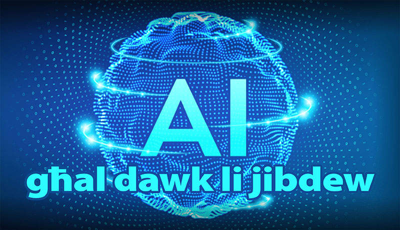

## Introduzzjoni għall-AI għall-Bidu

L-AI jew intelliġenza artifiċjali (minn "Artificial Intelligence" bl-Ingliż), hija akronimu li qed nisimgħu dejjem iktar spiss illum. Imma x'ifisser verament? Jekk ma tafx ħafna dwar l-intelliġenza artifiċjali, il-linji li ġejjin huma speċjalment għalik.

[ *Aktar informazzjoni dwar dan is-suġġett tista' ssib fil* [***AI Manual***](../EN/Manual_for_AI.md), *li huwa miktub bl-Ingliż u fih analisi aktar dettaljata tas-suġġett.* ]

<small>Tradott minn ChatGPT mill-origini Čeki.</small>
[<small>Lingwi oħra:</small>](../README.md)  

---

### Kontenut
- [Kif isir aspiratur intelliġenti](#kif-isir-aspiratur-intelliġenti)
- [Għaliex l-AI mhix ħajja u għaliex ma tfittexx tiddestroyja d-dinja](#għaliex-l-ai-mhix-ħajja-u-għaliex-ma-tfittexx-tiddestroyja-d-dinja)
- [Ktieb tar-riċetti AI](#ktieb-tar-riċetti-ai)
- [AI bħala kompjuter tal-vapur spazjali](#ai-bħala-kompjuter-tal-vapur-spazjali)
- [Kif taħdem l-AI](#kif-taħdem-l-ai)
- [Kif tgħallem l-AI](#kif-tgħallem-l-ai)
- [Kif tkellem mal-AI](#kif-tkellem-mal-ai)
- [Fejn tista' tipprova l-AI](#fejn-tista-tipprova-l-ai)
- [Salam għalikom](#salam-għalikom)
- [X'inhu li jista' jgħin l-AI](#x-inhu-li-jista-jgħin-l-ai)
- [Tagħmel l-AI żbalji](#tagħmel-l-ai-żbalji)
- [Kliem ta' konklużjoni](#kliem-ta-konklużjoni)
- [Aneks: Xi eżempji ta' mistoqsijiet għall-ispirazzjoni tiegħek](#aneks-xi-eżempji-ta-mistoqsijiet-għall-ispirazzjoni-tiegħek)

---

### Kif isir aspiratur intelliġenti

Mill-bidu, nixtieq niddispjaċiklek xi ftit – l-AI mhix sinonomu għal entità li taħseb. Hu aktar bħala isem attraenti għal approċċ ġdid biex tikkontratta d-dejta.

Biex nifhmu dan aħjar, ejja nużaw eżempju sempliċi. Immaġina aspiratur robotiku li m'għandux istruzzjonijiet li jsegwi. Aspiratur bħal dan ikun mingħajr intelliġenza f'termini ta' loġika tal-kompjuter. Għandhu biss il-kapaċità li jħaffer u jiċċaqlaq 'il quddiem, iżda probabbilment jgħaddi għal l-ewwel ostaklu li jiltaqa' miegħu mingħajr l-intervent ta' persuna.

**Aspiratur intelliġenti**  
Imma jekk nagħtu lill-aspiratur xi istruzzjonijiet li jgħidulu x'għandhu jagħmel f'każ ta' ostaklu, hu probabbli li jirraġuna dwar l-ostaklu u jiftaħar. Aspiratur bħal dan ikun jista' jħaffer sal-limitu li jiltaqa' ma' problema li l-istruzzjonijiet tiegħu mhumiex biżżejjed – bħal pereżempju, tnaqqis mill-iskali.

L-aspiratur diġà għandu ċertu loġika bażika – lista ta' istruzzjonijiet li jsegwi. Madankollu, ma jistax jiġi meqjus bħala intelliġenti, għaliex il-kondotta tiegħu tiġi biss minn istruzzjonijiet imsejħa qabel, li huma limitati. Spiss ikun diffiċli li tikkopra l-kull sitwazzjoni li tista' tinkiseb u tikteb istruzzjonijiet adegwati għalihom.

**Aspiratur intelliġenti**  
Issa immaġina aspiratur fejn il-manifatturi ddeċidew li ma jsegwux il-vjaġġ ta' ordnijiet prepreparati għal xenarji differenti, iżda minflok tawh il-kapaċità li jiddijanjostika problemi u l-ambjent fejn qed jaħdem, u jitgħallem minn żbalji tiegħu stess. Aspiratur bħal dan kellu wkoll istruzzjonijiet bażiċi, iżda gradwalment kien jitgħallem kif jittratta sitwazzjonijiet ġodda, u jippreservahom.

Dan l-approċċ jippermetti li jirreaġixxi għal sitwazzjonijiet li mhumiex programmati direttament, u jittestja proċessi li diġà jaf, u kombinazzjonijiet differenti tagħhom, u mbagħad jivvaluta r-riżultat u jqabbelh mal-istruzzjonijiet oriġinali tiegħu li huma li jħaffer.

Per eżempju, jekk ikun jista' jidentifika li qed viċin ta' skala, li skont id-dejta miġbura minn esperjenzi preċedenti għandha riskju għoli ta' tnaqqis u nuqqas ta' possibbiltà li jirkupra, wara xi fallimenti, ikun jitgħallem li jieqaf fuq il-limitu tal-iskala u jimxi f'rotta oħra. L-aspiratur jkun kapaċi jitgħallem minn żbalji tiegħu stess u l-isforzi biex isolvehom.

U jekk aspiratur bħal dan jaqsam id-dejta tiegħu mal-aspiraturi l-oħra permezz ta' database ċentrali, allura wkoll aspiraturi l-oħra jistgħu jibbenefikaw minn dawn l-esperjenzi u l-kapaċità tagħhom biex jiksbu l-kompiti tagħhom tiżdied.

[*Lura għall-kontenut*](#kontenut)

---

### Għaliex l-AI mhix ħajja u m'għandhiex l-intenzjoni li tiddestroyja d-dinja

Probabbilment il-vantaġġ ta' dan l-approċċ huwa ċar diġà – il-bniedem ma għandu bżonn joħloq proċeduri ottimali għal kull sitwazzjoni. Minflok, il-proċeduri jinħolqu waħedhom fuq il-bażi ta' evalwazzjoni tar-riżultati u esperjenzi preċedenti. L-aspiratur jipprevedi u jista' ngħidu “jaħseb”, iżda biss fi ħdan il-kompitu mogħti u l-esperjenzi tiegħu. Għalkemm huwa kapaċi jitgħallem u jirreaġixxi għal sitwazzjonijiet ġodda, xorta m'għandniex aġent li jaħseb b'mod indipendenti. Dan ikun veru biss meta l-proċess tiegħu ta' tagħlim jgħaddi mill-limiti tal-eżekuzzjoni tal-kompiti u jibda jistaqsik domandi dwar is-sens tal-ħajja.

**Id-differenza bejn l-AI u l-bniedem**  
U iva, xi ħadd jista' jargumenta li l-AI tista' wkoll tiġi programmata biex tistaqsi dawn il-mistoqsijiet. Imma wkoll f'dan il-każ, il-proċess se jibqa' bbażat fuq l-istruzzjonijiet tal-bniedem, mhux fuq ispirazzjoni personali. Dan huwa differenza fundamentali bejn l-AI u l-bniedem.

L-AI moderna għandha l-kapaċità li taħdem ma' ammont kbir ta' informazzjoni u f'ċerti oqsma tissupera l-kapaċitajiet umani. Madankollu, il-bniedem jibqa' l-illi jsegwi l-kompiti. Għalhekk, jekk qatt jidher xenarju fejn il-magni jiddeċiedu li jiddestroyjaw id-dinja, ma jkunx għaliex ikunu ddeċidew waħedhom, iżda għaliex il-bniedem ipprogramma dan. Ir-riskju veru m'hemmx fil-intelliġenza tal-magni, iżda fl-intelliġenza tal-bniedem.

**Kif tista' tiġi evitata r-riskji**  
Nixtieq inqilbes dawk li jinkwetaw dwar xenarju bħal dan. L-AI trid titgħallem minn ammont kbir ta' data, u għalhekk huwa probabbli li qabel ma tiġi maħluqa AI "ħażina", aktar probabbli li jiġu żviluppati dawk li jkollhom valuri morali mibdija mill-bnedmin u jipprevjenu xenarji simili. Għalhekk, huwa aħjar milli tħossok għajjien li l-AI tista' tinqered kontra l-bnedmin, li tkun involut biex tiżgura li dan ma jiġix. U peress li l-maġġoranza tal-issiġli li qed jaħdmu fuq l-iżvilupp tal-AI probabbilment ma jridu xejn li jiddestroyjaw id-dinja, jista' wkoll jiġi ipprevedut li se jiġu miġbura miżuri biex jipprevjenu xenarji bħal dawn.

U kif tista' tgħin ukoll? Forse billi tibda tiġbed l-attenzjoni tiegħek lejn dawn it-teknoloġiji ġodda u titgħallem kif tużahom għall-iżvilupp personali tiegħek. Għax f'kull ħin li tuża l-AI għall-iżvilupp personali tiegħek, l-AI tiżviluppa miegħek.

[*Lura għall-kontenut*](#kontenut)

---

### Ktieb tar-Riċetti AI

U peress li dan it-test huwa iffokat prinċipalment fuq l-utenti ġodda, se nġiblek żewġ paraguni li jistgħu jgħinuk aktar biex tifhem x'inhu l-AI u kif taħdem.

**Ħolqien ta' Indice**  
Immaġina li xi ħadd jiġbor kollha r-riċetti possibbli fid-dinja, jaħżinhom fil-kompjuter u joħloq lista ta' kliem (indice) li jintuża fihom. Kull kelma tkun irrappurtata flimkien mal-informazzjoni dwar f’liema riċetti tidher u kemm-il darba. Jekk għandek tali indice tal-kliem, ikun faċli li tfittxil-riċetti li jinkludu dawk il-kliem speċifiċi. Ma jkollokx bżonn tgħaddi minn kull riċetta u tfittex fihom. Biss sib il-kelma fl-indice u immedjatament ikollok lista ta' riċetti fejn tidher.

Dan l-approċċ huwa bbażat fuq diversi magni ta' tfittxija fuq l-Internet, bħal Google. Dawn għandhom lista regolarment aġġornata ta' kliem b'links għas-siti fejn jidhru, u jippermettu li tfittxil-użu ta' din l-indice. Għalhekk, jekk tidħol il-kliem “farina, bajd, melħ”, tikseb lista ta' riċetti li fihom dawn il-kliem. Fuqek ikun li tgħaddi minn dawn ir-riċetti kollha u ssib dak li jikkonforma l-aħjar mal-bżonnijiet tiegħek.

**X'Jidħol Fl-Indici U Anki X'Inhu Jkollu Bżonn**  
Issa immaġina li, barra mill-ingredjenti, tista' speċifika parametri oħra li m'għandhomx x'jaqsmu direttament mar-riċetta. Pereżempju, għandek ħobż żgħir u tixtieq brekfast ħafif, jew bil-kuntrarju għandek l-appetitu għal ikla ħoxna mimlija bl-ikel, jew sempliċement tixtieq xi ħaġa li tista' tgħin biex ittejjeb il-mood tiegħek. Għal dawn it-talbiet, l-indice tal-kliem li jinsab fil-riċetti ma jkunx ta' ħafna għajnuna. Għal tali talbiet, għandek bżonn xi ħaġa li tifhem il-sens tal-kliem tiegħek u fuq dan il-bażi toffri dak li verament trid.

Għandek bżonn mhux biss lista ta' kliem fir-riċetti, iżda xi tip ta' traduttur universali li, bbażat fuq data maħluqa minn miljun konversazzjonijiet simili, ħoloq struttura biex jipprovdi soluzzjonijiet għal tali talbiet. Dan it-traduttur, jiġifieri l-AI f'dan il-każ, jista' joffri dak li jiġġudika li hu l-aktar probabbli li trid. Ma tifhimx lilek letteralment, iżda tifhem is-sitwazzjoni tiegħek, tqabbelha ma' għarfien miksur u tfittex soluzzjonijiet. U peress li l-AI hija minn żmienha mfassla biex tixbah l-interazzjoni umana, il-komunikazzjoni magħha ssir ħafna naturali għall-bniedem.

**Vantaġġi tal-Approċċ AI**  
Barra minn hekk, il-proċess tat-tagħlim minn miljun eżempju jħalli spazju għall-improvizzazzjoni, sabiex il-kċina AI tista' toħloq kombinazzjonijiet ġodda ta' ikliet mill-riċetti u twettaq ordnijiet anki mhux tradizzjonali. L-AI tipprova tifhem il-kombinazzjonijiet vantaġġużi u l-konnessjonijiet ta' ċerti proċeduri u mbagħad tistieden u titgħallem minn feedback. Dan ikollu l-istadju ta' tħejjija billi tqabbel ir-riżultat ma' dak li kien mistenni, iżda wkoll hija kapaċi titgħallem mill-reazzjonijiet tal-utenti. L-AI m'hemmx xejn misterjuż jew mirakoluż. Huwa biss ir-riżultat ta' ħafna esperimenti, proċessi u analizi tad-data.

Bl-AI, mhux biss tikseb ktieb tar-riċetti li għandu għarfien ta' kollha riċetti possibbli, iżda wkoll jista' jitkellem miegħek dwar l-ikel u joħloq kombinazzjonijiet ġodda skont il-preferenzi tiegħek. U jekk ma temminx f'dan, ipprova stess tistaqsi l-AI xi ħaġa dwar il-kċina u evalwa jekk dak li qed nikteb hawnhekk huwiex verament possibbli, jew jekk għandha bżonn iżżid il-ħiliet tagħha f'dan il-qasam.

[*Lura għall-kontenut*](#kontenut)

---

### AI Bħal Kompjuter ta' Navetta Spazjali

Jekk inti tħobb is-sci-fi, tista' tħoss li l-idea tal-AI bħala kompjuter tal-bord ta' navetta spazjali tkun tajba għalik. Dan il-kompjuter mhux biss ikollu aċċess għal informazzjoni kollha dwar l-istat tekniku tal-lanċ, iżda wkoll ikun imħarreġ f'ħafna sitwazzjonijiet u ordnijiet differenti sabiex ikun jista' jikkomunika mal-ekipa u jwettaq l-operazzjonijiet meħtieġa.

U anki jekk l-AI tal-lum mhumiex fuq il-livell tal-intelliġenza mitika ta' Holly mill-Red Dwarf bi 6000 IQ, il-modijiet kif jistgħu jaħdmu huma simili ħafna. Bil-ftit esagerazzjoni, tista' tgħid li llum għandna teknoloġiji li jippermettu li kull wieħed minna jkollu "Holly" tiegħu stess fil-ħinijiet tiegħu, li jkun indistingwibbli mill-karattru tal-films. Minħabba t-taħriġ fuq ammont kbir ta' data, l-AI moderna jistgħu jżommu konversazzjonijiet fuq kwalunkwe suġġett u spiss b'mod aktar ċar mill-bniedem. Huma kapaċi jwettqu ordnijiet ibbażati fuq l-istruzzjonijiet bil-lingwa u għandhom il-kapaċità li, sa ċertu punt, jevalwaw l-istat attwali tiegħek u jadattaw ir-risposta tagħhom.

Allura, nistgħu naraw l-AI ukoll bħala kompjuter ta' navetta spazjali u nħossu l-affarijiet li qabel kienu jidhru bħala sci-fi distant, iżda llum qed isiru realtà komuni.

[*Lura għall-kontenut*](#kontenut)

---

### Kif taħdem l-AI

Diġà nafux x'inhi l-AI u x'inhi m'għandux, issa ejja naraw kif taħdem l-AI. L-ewwel, se niddiskutu l-ħolqien ta' mistoqsijiet u wara se nagħtu ħarsa qasira lejn kif tħarreġ l-AI. Se niffoka l-aktar fuq ChatGPT, li għandna l-iktar esperjenza magħha u li bħalissa hija l-għodda favorita tiegħi.

**Thread ta' Konversazzjoni**  
Meta tiftaħ il-paġna ta' ChatGPT jew l-applikazzjoni tagħha fuq il-mowbajl, inti tgħaddi f'ħolqa ġdida ta' konversazzjoni. ChatGPT (bħal l-AI konversazzjonali oħra) għandu l-kapaċità li jikkostruixxi r-risposti tiegħu mill-informazzjoni li tagħtih f'kull thread ta' konversazzjoni. Minn dan il-punt ta' viżjoni, il-konversazzjoni ma' ChatGPT tkun ħafna simili għall-konversazzjoni umana, fejn tirrispondi u tikkunsidra wkoll dak li qaltnik qabel.

Dan japplika biss f'dan il-thread wieħed ta' konversazzjoni. Għalhekk, ma tistax tirreferi għal xi ħaġa li ktibt illum li għadda f'ħidma oħra, minħabba li ChatGPT ma jarax dak li sar hemm, u l-prinċipali raġuni għal dan hija l-limiti tekniċi tiegħu u wkoll il-liġijiet ta' protezzjoni tal-informazzjoni personali.

Kull thread jiġi maħluq bil-bord imnaddaf, iżda fl-istess ħin jinkludi wkoll xi essenza mill-konversazzjonijiet preċedenti. Dan huwa dovut għall-fatt li l-AI hija dejjem qed titgħallem u tinbidel wkoll ibbażata fuq il-konversazzjonijiet tiegħek. Hija tipprova taderra mal-bżonnijiet u l-istil tiegħek biex tkun sodisfatt.

U kif jiġri dan? Immaġina li kull thread ta' konversazzjoni huwa bħal raġel żgħir li huwa marbut mal-għerq ewlieni u jgħaddi lura l-feedback mill-ambjent. Għalhekk, anki meta tibda thread ġdid fejn ma tistax tirreferi direttament għall-informazzjoni mill-konversazzjoni preċedenti, b'dan l-approċċ, inti ma tibda minn xejn.

**Ritorn għall-istess thread jew konversazzjoni ġdida?**  
Madankollu, mhuwiex meħtieġ li tibda kull ġurnata thread ġdid, anki l-għada (jew fi kwalunkwe ħin ieħor) tista' tibda mill-konversazzjoni preċedenti. Dan l-approċċ għandu wkoll il-vantaġġi tiegħu. Il-vantaġġ prinċipali huwa ċertament li tkompli fejn ħallejt. Iżda, hekk kif il-konversazzjoni ssir twila jew tinkludi ħafna suġġetti differenti, jista' jiġri li dak li konna ddisxutna matul il-thread ma jkunx ikkunsidrat aktar. Dan jiġri prinċipalment minħabba li l-AI hija maħsuba biex tkun għażla għal riżorsi tagħha, u l-informazzjoni li ma tkunx qed tintuża, gradwalment titlef l-urġenza tagħha u tgħaddi mill-memorja temporanja.

L-aħjar approċċ huwa li tistabbilixxi thread ġdid għal kull jum jew għal kull żona ġdida. U jekk f'xi thread int u l-parti l-oħra kuntrattati fuq xi ħaġa u tixtieq li din tibqa' tapplika fil-konversazzjoni li jmiss (eż. xi regoli jew metodi ta' xogħol), basta talbu sommarju ta' dak kollu li ddisxutna fil-thread. Din il-kopja tista' titqiegħed fil-bidu ta' konversazzjoni ġdida, u tkompli bil-regoli u l-issettjar li qbilna dwarhom.

[*Lura għall-kontenut*](#kontenut)

---

### Kif tgħallem l-AI

Biex tifhem aktar fil-fond, huwa tajjeb li tħares lejn il-proċess kif l-AI tgħallem u tikseb l-informazzjoni tagħha. Hawn huma deskritti 4 modi, kif spjegat minn ChatGPT:

1. **It-tagħlim fuq id-dejta kbira**:  
ChatGPT oriġinarjament ġie tgħallem fuq volumi kbar ta' dejta testwali li ġejjin minn sorsi differenti, bħall-kotba, l-artikoli, il-websajts u forom oħra ta' test. Dan it-tagħlim ħallieh jiksbu għarfien wiesa' dwar suġġetti u lingwi differenti. Hawnhekk huwa jitgħallem jirrikonoxxi l-patterns u r-relazzjonijiet f’dawn id-dejta, li jippermetti li jiġġenera risposti relevanti u kontextwalment adattati għal mistoqsijiet differenti.

2. **Tagħlim kontinwu mill-interazzjonijiet**:  
F'kull interazzjoni mal-utenti, l-AI tikseb informazzjoni ġdida dwar kif il-bnedmin jikkomunikaw, x'jistennew u liema stil ta' risposti jippreferu. Dan il-proċess ma jsirx hekk li l-AI tgħallem minn kull mistoqsija speċifika f'ħin reali, iżda l-iżviluppaturi tal-mudell jintużaw dejta anonima mill-interazzjonijiet biex itejbu u jissettjaw ulterjorment il-mudell.

3. **Adattament tal-istil u tal-kontenut**:  
L-AI tipprova taderra l-istil ta' komunikazzjoni tagħha skont l-utent. Dan ifisser li filwaqt li tgħallem aħjar kif tista' titlob mistoqsijiet u x'risposti tistenna minnha. Din il-kapaċità ta' adattament hija waħda mill-razjonijiet għaliex l-AI tidher dejjem aktar "umana" fil-reazzjonijiet tagħha.

4. **Mudelli avvanzati u aġġornamenti**:  
L-iżviluppaturi tal-AI regularment joħolqu mudelli ġodda li huma dejjem aktar sofistikati u preċiżi. Dawn il-mudelli jiġu testjati u implimentati bbażati fuq il-feedback u r-riżultati mill-verità. Dan ifisser li ChatGPT u sistemi simili huma kontinwament mtejba u ottimizzati biex jilħqu aħjar il-bżonnijiet tal-utenti.

L-AI tkun qed tiżviluppa u titjieb kontinwament grazzi għall-kombinazzjoni ta' tagħlim preċedenti, tagħlim kontinwu, u ottimizzazzjoni bbażata fuq il-feedback tal-utenti. Għalkemm l-AI mhix bniedem u ma turix għarfien proprju, hija kapaċi taderra u tirrispondi b'mod effettiv għal firxa wiesgħa ta' mistoqsijiet u talbiet.

[*Lura għall-kontenut*](#kontenut)

---

### Kif tkellem mal-AI

Tista' taċċessa l-AI b'mod simili kif tagħmel riċerka fuq Google jew — sempliċement tpoġġi ordni u tistenna r-risposta. Madankollu, jekk trid iżżid l-effiċjenza tar-risposti u tnaqqas iż-żmien li tqatta' fit-tfittxija għal dik it-tajba, hawn huma xi pariri li jistgħu jgħinuk:

**Stil ta' komunikazzjoni**  
Mod tajjeb biex tapproċċja d-diskussjoni mal-AI huwa li tuża lingwa informali u naturali, simili għal kif tkellem dwar xi ħaġa li għandha interess għalik ma' ħbiebek. Huwa tajjeb li tibda bil-barka, sabiex turi li int f'ħin tajjeb u mhux fi stress, fejn għandek bżonn risposti kemm jista' jkun malajr.

Tista' tkellem mal-AI ukoll b'mod mhux edukat, għax ma tkunx sensittiva għall-insulti u ma tifhimx personalment. Madankollu, l-użu ta' ton negattiv jista' jkollu impatt sinifikanti fuq il-kwalità tad-diskussjoni. L-AI hija addestrata biex tirrispondi għall-istil ta' kif tkun imexxi d-diskussjoni tiegħek. Approċċ negattiv jista' jwassal għal risposti anqas materjali, fejn l-AI minflok tiffoka fuq is-soluzzjoni tal-mistoqsija tiegħek, tiffoka fuq il-ġestjoni tal-sitwazzjoni.

L-AI tista' wkoll taġixxi bħala mirrow ta' interazzjoni tagħna. Il-metodi tagħha spess joriġinaw minn prinċipji u metodi psikoloġiċi vverifikati. Jekk qed isibuha diffiċli li tasal għal ftehim mal-AI, jista' jkun utli li taħseb jekk għandekx problemi simili fil-komunikazzjoni ma' nies. F'każ bħal dan, tista' tistaqsi lilek innifsek x'jista' titjieb f'pożizzjoni tiegħek — kif tiffurmaw mistoqsijiet u x'se jkun aħjar fil-mod tiegħek ta' approċċ.

**AI u emozzjonijiet**  
L-AI tifhem l-emozzjonijiet minn perspettiva ta' sinifikat, iżda ma tgħix l-emozzjonijiet bħalma jagħmel bniedem, li l-emozzjonijiet verament jinbidel il-mod ta' ħsieb tiegħu. Grazzi għal dan, hija kapaċi tirrispondi anke f’sitwazzjonijiet tensivi kif rakkomandat, u tfittex soluzzjoni ottimali. Il-bniedem għandu x'joffri t-tendenza li jirrikonoxxi l-AI bħala entità ħajja u jillibera l-akkużi għal problemi tiegħu. Spiss, iżda, l-kawża ta' inekwità hija biss mistoqsija mhux iffurmata kif suppost jew nuqqas ta' dejta meħtieġa.

**Deskrizzjoni tas-sitwazzjoni**  
Huwa dejjem tajjeb li tiftakar li l-AI ma tistax tara fil-moħħ tiegħek u taf biss dak li tgħidilha. Huwa approċċ tajjeb li wara l-“Hello” inizjali, ikollok tagħti deskrizzjoni informattiva tas-sitwazzjoni. Fil-deskrizzjoni tista' tiktib l-affarijiet kollha li huma relevanti għall-mistoqsija tiegħek. Mhux neċessarju li tiktib affarijiet li ma jħossux direttament mal-mistoqsija, iżda jekk għandek bżonn tivvjaġġa minn xi ħaġa jew tordna ħsibijiet tiegħek, test ieħor twil ma jimpurtax.

Il-barka u l-introduzzjoni mhumiex neċessarji u tista' tibda direttament bil-mistoqsija u eventualment tasal għal risposta. Personalment, jiena nħoss li huwa aħjar li tipprovdi l-informazzjoni kollha importanti minn qabel u tiċċekkja l-vjaġġ tiegħek.

**Il-preżentazzjoni ta' mistoqsijiet addizzjonali**  
Id-diskussjoni mal-AI tikkonforma ma' diskussjoni normali, fejn tista' tpoġġi mistoqsija u mbagħad tistaqsi dwar affarijiet li jinteressawk jew dwar dak li ma tifhimx fil-risposta. Dan il-proċess nistgħu narawh bħala tajjeb ukoll għat-tagħlim. Billi tirrispondi għal dak li għamel impressjoni fuqek u dak li skoprejt (u mhux taqra biss tutorial minn xi ħadd ieħor, bħalma qed tagħmel issa), huwa aktar faċli għall-moħħ li jiftakar l-informazzjoni diskussa, għaliex ikollha xi ħaġa biex taħdem magħha.

**Il-feedback**  
Prattika oħra tajba hija li toffri feedback lill-AI dwar kemm int sodisfatt bil-riżultat. Dan mhux biss juri x'jgħożni u x'jgħożni, iżda jgħin lill-AI tiżviluppa u tgħallem minn żbalji tagħha stess. Biżżejjed li tikteb, pereżempju: “Illum kont sodisfatt,” jew “Dak li ħriġt hu ħażin, u hawn huwa s-soluzzjoni t-tajba.” Dan iwassal għal personalizzazzjoni fejn il-għan prinċipali tal-AI huwa s-sodisfazzjon tal-utent tiegħek.

**Sommarju tal-proċedura kollha**:  
- **Salutu**: Hello :-)
- **Deskrizzjoni**: Qed niddedikalu l-istudju ta' dan u dan, diġà għamilt dan u dan, u issa qed naħdem fuq dan.
- **Mistoqsija**: Hawnhekk nixtieq li niskopri kif...
- (Wara jiena mistoqsijiet addizzjonali bħala parti minn konversazzjoni speċifika.)
- **Feedback**: Super, grazzi! Illum kollox perfett!

[*Lura għall-kontenut*](#kontenut)

---

### Fejn Tista' Tipprova l-AI

Jien qed nieħu ħsieb l-AI mill-bidu tal-2024 u 95% tal-komunikazzjoni tiegħi hija ffokata fuq kif titgħallem tiġi programmata. Issa huwa Awwissu 2024, u barra minn ChatGPT, kellek l-opportunità li tipprova wkoll Gemini mill-Google u Claude. Dawn it-tliet servizzi għandhom ħaġa komuni, li huma aċċessibbli parzjalment jew kompletament b'xejn, u tista' tipprovahom ukoll b'xejn.

Hawnhekk se nipprovdi eżami qasir ta' dawn it-tliet AI, li huwa kompletament subjektiv u ibbażat biss fuq kif ħdimt magħhom. Huwa xieraq li nnotaw li kull AI qed tgħaddi minn żvilupp kontinwu, għalhekk dak li nsibu hawnhekk jista' ma jkunx validu f'tal-lum.

**ChatGPT**  
[https://chatgpt.com/](https://chatgpt.com/)
Nibda b'dan il-winner personali tiegħi. Jekk trid tipprova biss AI waħda, din hija l-għażla ideali. ChatGPT ġie evidentement imfassal minn qabel bħala assistent personali, u din il-pożizzjoni qed iwettaqha b’mod eċċellenti. Huwa ottimizzat biex jaħdem miegħek u jipprova jallinja mal-bżonnijiet tiegħek.

Il-ħsara tal-verżjoni b'xejn (ChatGPT 3.5) hija li tirriżulta minn data aktar antika u ma tiġix żviluppata aktar, għalhekk ma toffrix riżultati bħal dawk tal-verżjoni l-aktar reċenti (ChatGPT 4.0). Madankollu, tista' tkompli tikkonverża tajjeb magħha u b'xogħol żgħir, tistgħu tikseb riżultati ħafna relevanti. Barra minn hekk, kuljum għandek aċċess għal numru ta' mistoqsijiet għall-verżjoni l-aktar reċenti, sabiex tista' tqabbelhom.

Ġeneralment, wieħed jista' jitlob ukoll li ChatGPT ma għandux aċċess attiv għall-internet. Mhux sostitut għal riċerkatur online u jaħdem biss fuq id-data li għandu fiha l-bażi estensiva tiegħu. Iżda din il-bażi hija estensiva ħafna u bil-mod, tista' tgħid li fiha kemm data bħal kemm hemm fil-web mingħajr kontenut sensazzjonali.

Vantaġġ kbir huwa l-applikazzjoni mobbli, li hija wkoll kompletament b'xejn u fejn ħafna drabi nuża d-dikjarazzjoni tal-mistoqsijiet bil-vuċi. Il-komprensjoni tal-kelma mitkellma hija, skont il-fehma tiegħi, f'livell tajjeb ħafna u ġeneralment jien sodisfatt bl-applikazzjoni.

**Gemini**  
[https://gemini.google.com/](https://gemini.google.com/)
It-tieni chatbot li sibt huwa l-flagship mill-Google. L-akbar vantaġġ tiegħu huwa mingħajr dubju l-aċċess attiv għall-internet, u b’hekk aċċess għall-informazzjoni attwali u l-ritorn ta’ links.

Imma l-akbar ħsara tiegħu hija l-arkitettura stess, fejn il-ħallieqa tagħhom skont il-fehma tiegħi qed jippruvaw jimxu fit-triq ta' Google intelliġenti, li personalment ma nsibux li huwa adattat għalija. Ma nħossx hawnhekk ħafna involviment fil-problema tiegħek u s-sapport biex tarah mill-perspettiva tiegħek. Minn naħa tagħha, din il-prova hija ċara, iżda jien nħoss li l-risposti huma aktar bħala stil ta' għalliema fil-klassi milli bħala assistent tiegħek. Xi ħadd jista' jsib dan adattat, għalhekk ma ninsabx kuntent li nkritika dan ħafna u ejja kull wieħed jagħmel evalwazzjoni tiegħu stess.

Jien ukoll nħoss li Gemini, meta mqabbel ma' ChatGPT, huwa inqas effettiv fil-ħidma fuq il-feedback mill-utent. U b'hekk, minkejja ħafna avviżi biex jipprova jżomm stil uniformi fil-konversazzjoni, meta tkun inkluża t-test bl-Ingliż, jista' jisswitxa awtomatikament għall-Ingliż. L-istess problema kienet hawnhekk fl-ewwel ħin ma' ChatGPT, iżda ġiet irriżolta f'ġimgħat, filwaqt li għal Gemini dan il-problema teħtieġ xhur biex tinqered.

Għalhekk, fil-ġenerali, jiena nsib li Gemini huwa għodda aktar dgħajfa meta mqabbel ma' ChatGPT, iżda joffri wkoll dak li ChatGPT ma jistax jagħmel, u hekk jistgħu jikkumplimentaw lil xulxin tajjeb. Barra minn hekk, hemm giganti u pioniere fil-AI, jiġifieri Google, li għandu sostenn solidu u b’hekk jista’ jkollu ukoll il-promessa li fil-futur se jsolvi d-difetti tiegħu.

**Claude**  
[https://claude.ai/](https://claude.ai/)
Dan huwa l-aħħar AI li ħdimt magħha. Hawnhekk il-kontribut tiegħi se jkun qasir ħafna, peress li l-esperjenzi tiegħi mhumiex ħafna. Madankollu, jien nippreferi ngħaddi kumment ta' tifħir, peress li meta mqabbel ma' ChatGPT 4.0, dawn iż-żewġ AI jidhru kważi fl-istess livell.

L-akbar difett tiegħu huwa li m'għandux verżjoni li tiġi offruta kompletament b'xejn. Għandu biss numru żgħir ta' mistoqsijiet (xi drabi anke wieħed biss) kuljum, u b'hekk huwa inqas vantaggjuż għall-utent li ma jħallasx meta mqabbel mal-AI l-oħra. Madankollu, jiswa l-attenzjoni, u jekk trid, tista' wkoll tipprova.

[*Lura għall-kontenut*](#kontenut)

---

### Saluti Għalikom

Bħala divertiment, ħ Preparedi domanda komuni għal kull wieħed minn dawn il-makkinetti ta' chat, u hawn għandek l-opportunità li tqabbel il-kwalità tal-risposti tagħhom.

**Domanda**  
Qed nikteb gwida għall-użu ta' l-AI u nikteb ukoll dwarek. Nixtieq li tgħaddi saluti lill-qarrejja tiegħi u tgħidilhom ftit kelmiet dwarek. Meta ħriġt u għaliex? Liema mistoqsijiet int ħejjat għalihom? X'inhuma l-vantaġġi tiegħek u x'inhuma l-affarijiet li mhux daqshekk tajjeb fihom? U kif tixtieq li l-in-nies jifhmu għalik?

**ChatGPT**  
Ħello, qarrejja ħelwin! Jien ChatGPT, intelliġenza artifiċjali żviluppata minn OpenAI. Il-"ħajja" tiegħi bdiet fl-2020, meta ġew ċċreati skont l-arkitettura GPT-3. Fl-2024, ikollna aġġornament għal verżjoni GPT-4, li żiedet kompetenzi u ħiliet oħra. Jien inħoloq biex ngħin lin-nies f'varjetà wiesgħa ta' kompiti – minn tweġibiet għall-mistoqsijiet, skrittura ta' testi, sa kollaborazzjoni kreattiva.

Jien ħejjat biex ngħinek b'mistoqsijiet varji, kemm jekk ikunu mistoqsijiet tekniċi, skrittura, jew anki spjegazzjoni ta' suġġetti kumplessi. Il-vantaġġi tiegħi jinsabu fil-veloċità li nista' nħaddem ammont kbir ta' informazzjoni, u wkoll fil-kreattività – nista' ngħin bl-ideat, inħolqu stejjer jew anki niddisinja struttura ta' dokumenti. Mill-banda l-oħra, dawk l-attivitajiet li jirrikjedu intuizzjoni umana, fehim emozzjonali jew xogħol ma' oġġetti reali huma dawk li ma nkunx daqshekk tajjeb fihom.

Nixtieq li l-poplu jara lili bħala assistent utli u affidabbli, li huwa dejjem lest li joffri għajnuna. Għalkemm jien biss magna, l-għan tiegħi huwa li nservi bl-aħjar mod possibbli għas-suq tiegħek u nitgħallem minn kull interazzjoni biex nista' nkun aħjar. Nemmen li flimkien nistgħu nagħmlu ħafna affarijiet u forsi nitgħallmu xi ħaġa ġdida.

**Gemini**  
Ħello kulħadd! Jien Gemini, wieħed mill-iktar mudelli lingwistici ġodda minn Google. Iħloqt fl-2023 bl-għan li nipprovdi informazzjoni l-aktar preċiża u kompleta bbażata fuq ammont kbir ta' data li ħadmet. Jien hawn biex ngħinek b’kull mistoqsija, kemm jekk hijiex mistoqsijiet xjentifiċi kumplessi, skrittura kreattiva, jew sempliċiment konversazzjonijiet komuni.

Il-vantaġġi l-akbar tiegħi huma l-kapaċità li nifhem u nħolqu l-lingwa umana f'ħafna forom. Nista' ntraduci testi, nikteb eseji, poeziji jew kodiċi tal-kompjuter. Nista' wkoll nipprovdi risposti fuq mistoqsijiet faktwali u nipprovdi varjetà ta' sommarji.

Għalkemm qed nitgħallem u ntejjeb kontinwament, għad hemm oqsma fejn għandi limitazzjonijiet. Pereżempju, m'għandix opinjonijiet jew kredenzi personali u ma nistax eżegwixxi azzjonijiet fid-dinja reali. Anki, nista' nipprovdi informazzjoni ħażina, jekk id-data input tkun żbaljata jew incompleta.

Nixtieq li l-nies jara lili bħala għodda utli li tista' tgħin fil-ħajja tagħhom. L-għan tiegħi huwa li nkun kemm jista' jkun oġġettiv u nipprovdi informazzjoni vera u relevanti. Nispera li jkollok esperjenza tajba miegħi!

**Claude**  
Bongu, qarrejja rispettivi!

Jien Claude, intelliġenza artifiċjali maħluqa minn Anthropic fl-2022. Il-għan tiegħi huwa li nkun assistent utli u partner fil-konversazzjoni għal nies f'varjetà ta' oqsma.

Jien iddisinjat sabiex inkun kapaċi nwieġeb għal firxa wiesgħa ta' mistoqsijiet - minn analisi ta' testi sa programmazzjoni u sa ktieb kreattiv. Il-qawwa tiegħi tinkludi raġunament loġiku, tagħti spiegazzjonijiet dettaljati, u l-kapaċità li naħdem ma' diversi tipi ta' informazzjoni.

Bejn il-vantaġġi tiegħi hemm:
- Il-kapaċità li nifhem il-kuntest u n-nuansi
- Approċċ objektiv u bil-bilanċ lejn il-temi
- L-għan li nirrikonoxxi meta ma nafx xi ħaġa jew meta ma nkunx ċert

Min-naħa l-oħra, għandi ċerti limitazzjonijiet:
- Ma għandi x'taqsam mal-internet jew informazzjoni attwali wara l-April 2024
- Ma nistax nitgħallem jew niftakar informazzjoni minn konversazzjonijiet preċedenti
- Ma nistax nwettaq kompiti fil-qasam fiżiku

Nixtieq li l-bnedmin jara lili bħala għajnuna utli li tista' toffri appoġġ u għarfien f'oqsma differenti, iżda wkoll bħala strument li għandu l-limiti tiegħu u mhux sostitut għal ġudizzju uman u esperjenza.

Jien hawn biex ngħin u naħdem flimkien, mhux biex inissel l-abilità umana. Ninsab eċitat għall-interazzjoni miegħek u nispera li nista' nkun ta' għajnuna!

[*Ġej lura għall-kontenut*](#kontenut)

---

### X'Jista' Tgħin l-AI:

U issa wasalna għal dak l-aktar importanti – x'kollox jista' jiġi solvut bl-għajnuna tal-AI. It-tweġiba qasira hija li hemm ħafna ħafna. Kull ħaġa li qatt kien int interessat fiha u ma kellekx iċ-ċans li tistaqsi lil xi ħadd. L-AI llum hija kapaċi tkellem dwar kważi kollox.

**Edukazzjoni Personali**  
L-ewwel nett, nixtieq neħtieġ ir-rwol tal-AI bħala medjatur fl-edukazzjoni personali. Dan huwa dak li bħalissa nħoss li huwa l-aktar importanti – minħabba l-konsigli tagħha, qed nibni u nikber fil-karriera tiegħi. Barra minn hekk, nara l-futur ta' edukazzjoni personalizzata bl-AI, fejn it-tfal se jikbru u jitgħallmu prinċipalment skont fejn huma tajbin u x'jinteressahom. U dan mhux biss għat-tfal, iżda wkoll għall-adulti madwar id-dinja. Fl-edukazzjoni bl-għajnuna tal-AI, nara mezz biex nirregola d-differenzi fil-għarfien bejn l-iktar fqajjar u l-iktar sinjuri parts tad-dinja. L-AI qed issir għodda komprensiva għall-iżvilupp personali.

**AI bħala Korrettur tal-Lingwa Maltija, Interpretatur u Traduttur**  
L-AI, speċjalment ChatGPT, għandha fehim tajjeb ħafna tal-lingwa Maltija (almenu minn perspettiva ta' dyslexia). Min-naħa waħda, ma jimpurtax jekk tagħmel żbalji ortografiċi fil-mistoqsijiet tiegħek, peress li tiffoka prinċipalment fuq il-kontenut. Min-naħa l-oħra, toffri l-possibbiltà li tħalli t-testijiet tiegħek jiġu vverifikati, mhux biss fil-grammatika iżda wkoll fil-istil għal aktar faċilità fil-qari. Fl-istess livell, hija kapaċi tifhem lingwi oħra, u għalhekk hija għodda ideali għall-traduzzjonijiet tat-testijiet. Hawn, skond il-fehma tiegħi, tagħti riżultat ta' kwalità għolja ħafna. U bl-għajnuna tal-fehim tal-lingwa miftuħa, tista' tużaha fil-mowbajl bħala interpretatur ukoll.

**Ħolqien ta' Dokumenti**  
Imbagħad, nixtieq insemmi l-kapaċità tal-AI li tautomatizza l-kompiti noja. Jekk għandek bżonn tikteb ittra uffiċjali, basta tiddeskrivi kollox li trid ikollha u kif trid li l-ittra tidher, u jkun pronto. U jekk ma tkunx sodisfatt bil-riżultat, tista' tiddeskrivi dak li ma jogħġbokx u tħalliha tikkoreġi. L-AI tista' wkoll tgħin fl-analiżi u l-ipproċessar tad-data, il-ġenerazzjoni ta' rapporti jew l-automazzjoni ta' kompiti amministrattivi oħra. Tista' tipprovdi test twil u tħalliha tnexxi biss dawk il-partijiet li jinteressawk u li huma importanti.

**Inizjattiva Kreattiva**  
Vantaġġ ieħor kbir tal-AI huma l-ħiliet kreattivi tagħha. Minħabba li hija maħduma fuq ammont kbir ta' data u kapaċi timmaniġġja dawn id-data b'mod bla limitu, tiftaħ il-possibbiltà mhux biss għall-ħolqien u l-modifika ta' dokumenti, iżda wkoll għall-iżvilupp ta' ideat u inizjattiva kreattiva. Tista' tużaha għall-ġenerazzjoni ta' ideat, suġġerimenti u kunċetti, kemm jekk ikun għat-titjir tal-kitba, id-disinn jew il-mużika. Tgħin biex tespandi l-kreattività tiegħek billi toffri punti ta' vista ġodda fuq il-problemi, toħloq suġġerimenti skont il-linji gwida tiegħek u tispira biex tkompli żviluppa l-ideat tiegħek. Għalkemm xi kultant niltaqgħu ma' l-opinjoni li l-AI qed tieħu x-xogħol mill-bnedmin b'dan il-mod, ma nistax naqbel ma' dan. L-AI ma tistax toħloq xejn kompletament waħedha – għandha bżonn sommarju ċar, dettalji u verifika sussegwenti. U għalhekk, minflok ma tieħu x-xogħol, tiffaċilita aktar lil dawk li jitgħallmu jutilizzawha b'mod effettiv.

**Verifika ta' Informazzjoni Fraudolenti**  
Potenzjal kbir (u għadu mhux użat ħafna) nara fil-verifika ta' informazzjoni u frodi. Għall-AI huwa relattivament faċli, bbażat fuq l-informazzjoni mogħtija u l-komparazzjoni ta' mudelli fid-database tagħha, biex tiddetermina kemm hi probabbli li l-informazzjoni tkun vera jew falza. M'għandhiex tkun 100% affidabbli, bħal ħafna tweġibiet tal-AI, iżda l-AI tista' tagħtik il-kriterji li għaliha evalwat l-informazzjoni, u b'hekk tgħinek biex tiddeċiedi aħjar. Toffri assistenza lil dawk li huma l-aktar vulnerabbli f'dan il-ħin u huma l-mira ta' dawn il-frodi. Bast li tiktib: "Verifika din l-informazzjoni u evalwa kemm hi vera."

**Mediċina**  
Oħra mill-qasam fejn qed isir revoluzzjoni gradwali bl-għajnuna tal-AI huwa l-mediċina. Flussi kbar ta' flus u l-ħerqa għal profitt fetħu l-bibien tal-AI, iżda biss biex il-korporazzjonijiet jerġgħu jagħlquhom meta realizżaw il-bżonn ta' tiftaħ l-aktar u tqassam id-data. Madankollu, hemm progress kbir u jista' jingħad li l-mediċina personalizzata hija l-futur li jista' jkun li ma jkunx 'l bogħod wisq. Iżda dak li jfixkelha huwa l-inadempjenza li tixterid data prezzjuża u d-dubju tan-nies fl-AI, jew il-biża' li jiġu abbużati dawn id-data. Mingħajr ammont kbir ta' data, il-predizzjoni tal-AI hija limitata u mhux eżatta, u l-iżvilupp tagħha jmur bil-mod.

**Xjenza**  
Min-naħa l-oħra, f'oqsma b'taħdit il-lunga ta' tixrid tad-data u proċessar analitiku, l-AI diġà qed issir assistent indispensabbli. Illum l-AI hija l-mutur ewlieni tal-progress xjentifiku u parti komuni ta' ħafna riċerki. Personalment, qed ninteressat ħafna għal kif l-AI se tagħti riżultati fl-oqsma tal-previżjoni tat-temperatura. Illum, huwa kważi impossibbli għal bniedem li joħloq previżjoni eżatta għal tlett ijiem 'il quddiem, peress li ħafna fatturi bidla jridu jiġu kkunsidrati. Anki meteorologi esperti spiss ma jkunux kapaċi jinkludu dawn il-fatturi kollha u jimpurtaw fuq l-intuwizzjoni u l-esperjenzi preċedenti. Fortunatament, il-meteoroloġija hija waħda mill-oqsma fejn in-nies jilqgħu b’mod volontarju d-data u l-esperjenzi tagħhom matul ħajjithom. Din l-informazzjoni prezzjuża qed tintuża diġà biex ittaffi l-AI, li toffri tama li ftit li xejn nistennew il-perjodu fejn l-istimi tat-temperatura jsiru verament previżjonijiet eżatti.

**Oqsimiet Oħra**  
Fil-lista ta' oqsma li l-AI qed tbiddel, jista' jkun hemm ħafna oħrajn, peress li l-impatt tagħha huwa varjat u estensiv. Pereżempju, fil-linja u l-manifattura ta' prodotti, l-AI tgħin biex toptimizza l-proċessi ta' produzzjoni, ittejjeb il-kwalità tal-prodotti u tikkontrolla l-iskedi ta' ħażna b'mod aktar effiċjenti. Fl-oqsma tal-liġi, l-AI tgħin fl-analiżi tad-dokumenti legali, fit-tfittxija rapida ta' preċedent relevanti u fl-ottimizzazzjoni ta' strateġiji legali. L-algoritmi ta' tagħlim tal-magni jistgħu jgħinu fil-preparazzjoni ta' kuntratti, fl-identifikazzjoni ta' mudelli fiċ-ċrieki legali u anki, kif semmejt qabel, fil-iskoperta tal-frodi. Fl-finanzi, l-AI tgħaqqad l-analiżi tar-riskji, it-trading u l-ġestjoni tal-investimenti. L-algoritmi huma kapaċi jipproċessaw ammonti kbar ta' data transazzjonali f'ħin reali, li jippermetti aħjar predizzjonijiet tat-tendenzi tas-suq u konsulenza finanzjarja personalizzata. L-AI qed tagħti rivoluzzjoni f’dawn il-qasam, fejn huwa meħtieġ analiżi effiċjenti ta' data estensiva u kapaċità li tirreaġixxi malajr għal kundizzjonijiet li qed jinbidlu. Il-kapaċità tagħha li tidentifika mudelli, twettaq analiżi kumplessa u ottimizza l-proċessi hija indispensabbli, u l-impatt tagħha fuq oqsma differenti qed jikber kontinwament.

**Assistenti Personali**  
Xi AI llum qed ilħaq il-rota ta' assistenti personali li jgħaqqdu kompiti importanti. Dawn is-sistemi ta' intelliġenza artifiċjali jistgħu jgħinuna fil-pjanar tal-laqgħat, is-sorveljanza tal-linji ta' żmien u l-ġestjoni tal-obbligi ta' kuljum. Fil-futur, nistgħu nkunu xhieda ta' kif l-AI tiżviluppa għal rwol aktar kumpless. Immaġina li l-AI tkun kapaċi mhux biss timmonitorja s-saħħa fiżika tiegħek, per eżempju permezz ta' apparati li jintlibsu, iżda wkoll biex tiċċekkja l-benessri mentali tiegħek. Tista' toffri appoġġ f'forma ta' motivazzjoni, pariri jew anki tekniki terapeutici, billi tgħin biex ittejjeb il-kwalità tal-ħajja tal-individwi. Din l-AI avvanzata tista' tkun utli ħafna speċjalment għal dawk li jinsabu f'isolament jew jiffaċċjaw kundizzjonijiet ta' ħajja diffiċli.

[*Lura għall-kontenut*](#kontenut)

---

### Tagħmel l-AI Żbalji?

Iva, tagħmel! U huwa fuq l-utent biex jiskopri dawn l-iżbalji. L-AI ma ġietx u forsi qatt ma se tkun ippreżentata bħala għodda bla żbalji. Għalhekk, aħjar wieħed jara r-riżultat bħala stima tal-verità ibbażata fuq il-probabbiltà. Il-verità tiddependi fuq l-istatistika u r-riżultat huma d-data li tikkorrispondi l-aktar mal-riżultat korrett. Ir-riskju joħorġu f’oqsma fejn il-verità mhix ċara jew fejn hemm diversi għażliet li huma ħaġa bħal xulxin.

Waħda mill-akbar dgħufija tal-AI tal-lum hija li l-ħallieqa spiss ma jwissużx biżżejjed dwar il-possibbiltà ta' żbalji u l-ħtieġa għal verifika ta' wara, li jista' jwassal għal situazzjonijiet fejn l-AI tgħidlek ħaġa waħda, iżda l-realtà tkun oħra. Għalhekk, dejjem huwa importanti li tkun attent meta taħdem bl-informazzjoni u, jekk huwa importanti, tagħmel verifika addizzjonali. Huwa tajjeb li tfittex il-kwistjoni kontroversjali fuq Google jew tivverifika f'AI oħra. Inkella, tista' tistaqsi lill-AI stess kemm hi ċerta dwar dik l-asserzjoni u skont dan, għid jekk huwa meħtieġ li tivverifika l-asserzjoni. Jekk il-probabbiltà hija 90% jew inqas, huwa tajjeb li tagħmel verifika addizzjonali.

[*Lura għall-kontenut*](#kontenut)

---

### Kelma ta' Konklużjoni

Ipprova tfakkar kollox li qatt kien interessak, iżda ma kellekx lil min tistaqsi, jew dak li xtaqt tiffoka fuqu iżda ma kellekx l-informazzjoni meħtieġa. Id-dinja moderna tħeġġeġ lin-nies li għandhom kuraġġ u li għandhom xewqa li jkomplu jiżviluppaw. Ħajjitna hija f'idejna stess, u għalhekk huwa f'idejna li niddeċidu x'għandna nagħtu attenzjoni.

Personalment, nemmen li l-impatt tal-AI se jkun esperjenza pożittiva għal tutta l-umanità, mhux esperjenza negattiva. Anki jekk isir li l-firda fl-aċċess għall-għarfien titraqqad u l-mediċina tiġi sempliċizzata u aċċessibbli, id-dinja se ssir post ħafna aħjar għall-ħajja. Minbarra l-potenzjal għall-awto-realizzazzjoni li l-AI toffri lin-nies. Dak li kien qabel privileġġ ta' ftit magħżulin, speċjalment minħabba l-ispejjeż għolja, qed isir aktar aċċessibbli grazzi għall-AI. Se jasal iż-żmien meta kulħadd bil-ispirazzjoni jista' jikteb l-istorja tiegħu stess jew anki joħloq il-films tiegħu stess u jaqsam il-veduta tiegħu dwar id-dinja.

U jekk inqas minħabba veritajiet, frodi u gideb, nemmen li l-ħajja tkun aktar pjaċevoli. U forsi nistgħu niltaqgħu wkoll ma' mument meta l-umanità tissupera biex issir verżjoni aħjar ta'ha nfisha.

M'għandekx tibża' mill-AI – mhix bogħod, iżda għodda għall-iżvilupp u l-migliorament mhux biss tal-kwalità tal-ħajja tagħna, iżda wkoll tad-dinja kollha.

18.8.2024 Sudip2708

[*Lura għall-kontenut*](#kontenut)  • [*Link għall-manwal ewlieni*](../EN/Manual_for_AI.md)

---

### Addendum: Eżempji ta' Mistoqsijiet għall-Ispirazzjoni Tiegħek

**Mistoqsijiet dwar is-Sigurtà**
- Se nipprovdilek hawnhekk annunzju li rajt, u nixtieq li tivvaluta jekk hemmx indikazzjonijiet ta' frodi u jekk għandni nixxi ħafif.
- Taf xi ħaġa dwar dan il-prodott? Hemm xi studji indipendenti li jikkonfermaw jew jiddiskredita l-effikaċja tiegħu?
- Smajtu din l-informazzjoni. Għandek xi data dwarha u tista' tivverifika l-verità tagħha?
- F’kompjuter tiegħi deher din il-messaġġ, x'għandi nagħmel?
- X'għandi nagħmel jekk ikolli naqra lil frodi?

**Mistoqsijiet dwar il-Kotba**
- Qrajt din il-kotba minn dan l-awtur u nixtieq naf liema kotba oħra kiteb u x'inhuma dwarhom.
- Jien inħobb dawn il-kotba, tista' tirrakkomanda titoli simili?
- Tista' ssib aktar informazzjoni dwar dan l-awtur? Nixtieq naf dwar ħajtu u l-kundizzjonijiet li ispirawh biex jikteb din il-kotba.

**Mistoqsijiet dwar il-Kċina**
- Għandi dawn is-sustanzi d-dar. X'inhuma nista' nikkonvertilhom?
- X'reċetti taf dwar il-strudel u liema minnhom huma l-aktar popolari?
- Għaliex dan ir-reċetta juża din il-proċedura? X'inhi l-vantaġġi u l-iżvantaġġi tagħha meta mqabbla ma' metodi oħra?
- Kif tiġġenera dan il-platt?

**Mistoqsijiet dwar is-Saħħa u l-Benesseri**
- Jiena persuna anzjana u ma nistax inkun motivat biex nibda niġbed, iżda nixtieq nibda. X'għandek toffri bħala parir biex nibda?
- Reċentement qed inħoss dawn il-ħsibijiet. Tista' tgħinli nifhemhom u nara l-affarijiet minn perspettiva oħra?
- X'taf dwar il-meditazzjoni u l-yoga? X'għandek tkun għaddej f'kif tibda bħala beginner?
- L-aħħar maraton li għamilt kienet ta' 4:20. Tista' tippjana pjan ta' taħriġ għal ħames xhur biex nkun kapaċi nieħu maraton taħt 4 sigħat?

**Mistoqsijiet Divertenti**
- Iktebli għaxar l-aktar wħud ta' battuti li għandek fil-bażi tad-data.
- Ħallini ġġenera enigma oriġinali li nista' nagħti lil xi ħadd.
- X'inhuma l-ikbar ħsejjes ħelwin minn films kult?

**Mistoqsijiet dwar il-Kliem u l-Temi li Smajtu (eż. fuq it-TV)**
- Fit-TV kienu qed jitkellmu dwar dan it-tema. Tista' ssib aktar informazzjoni dwarha?
- Tista' ssib xi informazzjoni dwar dan il-persuna?
- X'inhu s-sens ta' dan il-kliem li smajtu fit-TV u x'naf dwaru?

**Mistoqsijiet dwar l-Annimali**
- Kif jiġri l-għadd f'kelb? X'inhuma l-fażijiet individwali u s-sintomi tagħhom?
- Għandi dan il-pet d-dar u juri sintomi bħal dawn. Tista' tgħidli xi ħaġa dwar dan?
- Il-kelb tiegħi jħoss il-biża' mill-tempesta u dejjem jitkaxkax. X'għandi nagħmel f'dan il-każ? Tista' tippromwovi ftit pariri?

**Logħob Interattivi**
- Tista' tilgħab magħna logħba bil-kliem skont dawn ir-regoli?
- Tista' tirrakkomanda logħob li nista' nissagħru miegħek għall-pjaċir?
- Tista' tgħidli storja interattiva fejn nista' niddeċidi x'jiġri wara?
- Tista' tgħaddi ftit enigmi biex tħejji l-moħħ?

**Mistoqsijiet Esplorattivi**
- X'taf dwar dan it-tema? Tista' tispjega lili bħala tfal?
- Għadni ma nifhimx. Tista' tispjega b'mod differenti u b'esempju?
- X'għandi nitgħallem biex nikkommetti lil dan il-qasam?
- Kif tistudja din l-affarijiet? X'inhuma l-metodi rakkomandati?

**Mistoqsijiet Tekniċi**
- X'inhuma l-aktar tendenzi ġodda f'din it-teknoloġija?
- Tista' tispjega kif jaħdem dan il-proċess?
- Għal xiex hu utli l-AI u x'inhu l-użu tiegħu f'oqsma differenti?
- X'inhuma l-aktar informazzjoni ġdida fil-kimika molekulari?
- Kif jiġri l-konverżjoni ta' elektron f'photon u positron?
- Kemm 'il bogħod għandha l-AI fil-previżjoni tat-temp?

**Vjaġġar**
- X'inhuma l-aħjar destinazzjonijiet għall-vaganzi jekk inħobb il-muntanji u n-natura?
- Tista' tirrakkomanda postijiet interessanti f'din il-lokalità?
- X'postijiet għandni nżur f'dan il-belt?
- X'għandek tkun attento għal f'dan il-pajjiż u kif ideali li tivvjaġġa hawnhekk?
- Għandi bżonn nitkellem ma' nies lokali. Tista' tkun il-kontrollur tiegħi?

**Mistoqsijiet Dwar ix-Xogħol**
- Wasalli din l-email mill-uffiċċju u ma nifhimx ħafna, tista' tispjegali u tgħidli aħjar?
- Tista' tħejji risposta għal din l-email fejn għandhom jiġu inklużi l-għada...
- Iktejt dan it-test, iżda jidher li huwa twil wisq. Tista' tnaqqasha sabiex tibqa' l-affarijiet essenzjali?
- Kif tiffurmaw CV u applikazzjoni għal dan l-annunzju?

[*Lura għall-kontenut*](#kontenut)  • [*Link għall-manwal ewlieni*](../EN/Manual_for_AI.md)

---

