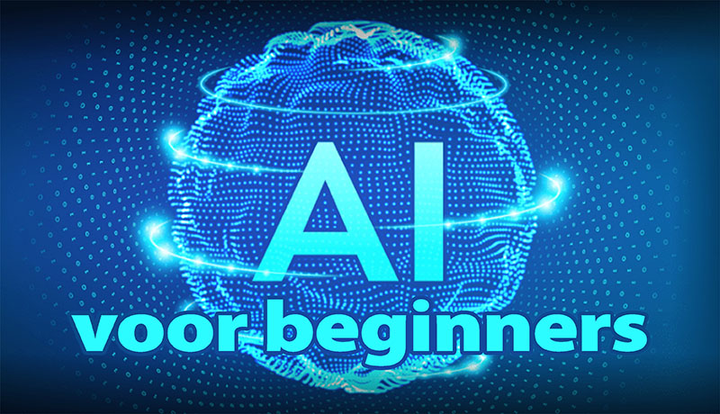

## Inleiding tot AI voor beginners

AI, oftewel kunstmatige intelligentie (van het Engelse "Artificial Intelligence"), is een afkorting die we steeds vaker horen. Maar wat betekent het eigenlijk? Als je nog niet veel weet over kunstmatige intelligentie, zijn de volgende regels speciaal voor jou.

[ *Meer informatie over dit onderwerp vind je in de* [***AI Manual***](../EN/AI-manual-en.md), *dat in het Engels is geschreven en een gedetailleerdere analyse van het onderwerp bevat.* ]

<small>Vertaald uit het Tsjechisch door ChatGPT.</small>  
[<small>Andere talen:</small>](../README.md#other-translations-of-the-beginners-guide)  

---

### Inhoud
- [Hoe wordt een stofzuiger intelligent](#hoe-wordt-een-stofzuiger-intelligent)
- [Waarom AI niet leeft en de wereld niet wil vernietigen](#waarom-ai-niet-leeft-en-de-wereld-niet-wil-vernietigen)
- [AI-kookboek](#ai-kookboek)
- [AI als computer van een ruimteschip](#ai-als-computer-van-een-ruimteschip)
- [Hoe AI werkt](#hoe-ai-werkt)
- [Hoe AI leert](#hoe-ai-leert)
- [Hoe communiceren met AI](#hoe-communiceren-met-ai)
- [Waar AI uitproberen](#waar-ai-uitproberen)
- [Groet aan jou](#groet-aan-jou)
- [Waar kan AI mee helpen](#waar-kan-ai-mee-helpen)
- [Maakt AI fouten](#maakt-ai-fouten)
- [Slotwoord](#slotwoord)
- [Bijlage: Enkele voorbeeldvragen ter inspiratie](#bijlage-enkele-voorbeeldvragen-ter-inspiratie)

---

### Hoe wordt een stofzuiger intelligent

In het begin moet ik misschien sommige van jullie teleurstellen – AI is geen synoniem voor een denkend wezen. Het is eerder een pakkende naam voor een nieuwe benadering van gegevensverwerking.

Om dit beter te begrijpen, laten we een eenvoudig voorbeeld gebruiken. Stel je een robotstofzuiger voor die geen instructies heeft om te volgen. Zo'n stofzuiger zou vanuit computermatig perspectief volledig onintelligent zijn. Het zou alleen kunnen stofzuigen en vooruit bewegen, maar waarschijnlijk zou het stoppen bij het eerste obstakel, dat het zonder menselijke tussenkomst niet zou kunnen overwinnen.

**Slimme stofzuiger**   
Als we de stofzuiger echter instructies zouden geven over wat te doen bij het tegenkomen van een obstakel, is het waarschijnlijk dat de stofzuiger om het obstakel heen zou rijden. Een dergelijke stofzuiger zou kunnen blijven stofzuigen totdat hij een probleem tegenkomt waarvoor zijn instructies niet voldoende zijn – bijvoorbeeld een val van de trap.

De stofzuiger bevat al een bepaalde basislogica – een lijst met instructies om te volgen. Het blijft echter niet intelligent omdat zijn gedrag alleen gebaseerd is op vooraf geprogrammeerde instructies die beperkt zijn. Het is vaak moeilijk om alle mogelijke situaties te dekken en de bijbehorende instructies te schrijven.

**Intelligente stofzuiger**   
Stel je nu een stofzuiger voor waarbij de fabrikanten ervoor kiezen om niet voorgeprogrammeerde opdrachten voor verschillende scenario's te gebruiken, maar in plaats daarvan de mogelijkheid te geven om problemen en de omgeving waarin hij werkt te diagnosticeren en van eigen fouten te leren. Zo'n stofzuiger zou ook basisinstructies hebben, maar zou geleidelijk leren hoe om te gaan met nieuwe situaties en deze oplossingen opslaan.

Deze benadering stelt hem in staat om te reageren op situaties die niet direct zijn geprogrammeerd, waarbij hij probeert processen toe te passen die hij al kent en verschillende combinaties daarvan, en vervolgens het resultaat evalueert en vergelijkt met de oorspronkelijke taak, namelijk stofzuigen.

Als hij bijvoorbeeld ontdekt dat hij naar een trap nadert die volgens opgeslagen gegevens van eerdere ervaringen een hoog risico op vallen en niet kunnen ontsnappen met zich meebrengt, zou hij na enkele mislukkingen leren om te stoppen aan de rand van de trap en een andere richting te kiezen. De stofzuiger zou zo in staat zijn om te leren op basis van eigen mislukkingen en pogingen om deze op te lossen.

En als zo'n stofzuiger zijn gegevens zou delen met andere stofzuigers via een centrale database, zouden alle andere stofzuigers ook kunnen profiteren van deze ervaringen en zou hun vermogen om hun taken uit te voeren verbeteren.

[*Terug naar inhoud*](#inhoud)

---

### Waarom AI niet leeft en de wereld niet wil vernietigen

Misschien is het nu al duidelijk wat het voordeel van deze benadering is – de mens hoeft geen optimale procedures voor elke situatie uit te vinden. In plaats daarvan worden procedures automatisch gecreëerd op basis van evaluatie van resultaten en eerdere ervaringen. De stofzuiger voorspelt en kan worden gezegd "denkt", maar alleen binnen de taak en zijn ervaringen. Ondanks het vermogen om te leren en te reageren op nieuwe situaties, is het nog steeds geen zelfstandig denkend wezen. Dat zou het pas worden als zijn leerproces de grenzen van taakvervulling zou overschrijden en het vragen zou stellen over de zin van het leven.

**Het verschil tussen AI en mensen**   
En ja, iemand zou kunnen beweren dat AI ook geprogrammeerd kan worden om dergelijke vragen te stellen. Maar zelfs dan zou dit proces voortkomen uit de opdrachten van een mens, niet uit eigen inspiratie. Dit is een fundamenteel verschil tussen AI en mensen.

Moderne AI heeft de capaciteit om met enorme hoeveelheden informatie te werken en overtreft in sommige gebieden menselijke capaciteiten. Het is echter nog steeds de mens die de taken toewijst. Dus als er ooit een scenario verschijnt waarin machines besluiten de wereld te vernietigen, zal dat niet komen omdat ze dat zelf besloten hebben, maar omdat een mens het zo heeft geprogrammeerd. Het werkelijke risico ligt dus niet in de intelligentie van machines, maar in de intelligentie van mensen.

**Hoe risico's te voorkomen**   
Ik wil echter degenen geruststellen die bezorgd zijn over een dergelijk scenario. AI moet worden getraind op een grote hoeveelheid gegevens, en het is waarschijnlijk dat voordat er een "kwaadaardige" AI ontstaat, er eerder AI's ontstaan die morele waarden van mensen hebben en dergelijke scenario's voorkomen. Het is dus beter dan te vrezen dat AI zich tegen mensen keert, om eraan bij te dragen dat dit niet gebeurt. Aangezien de meeste wetenschappers die werken aan de ontwikkeling van AI waarschijnlijk de wereld niet willen vernietigen, is het ook te verwachten dat er geleidelijk maatregelen zullen worden genomen om dergelijke scenario's te voorkomen.

En hoe kun je hier ook aan bijdragen? Misschien door je ten minste een beetje te verdiepen in deze nieuwe technologieën en te leren ze te gebruiken voor je eigen groei. Want elke keer dat je AI gebruikt voor je persoonlijke ontwikkeling, ontwikkelt AI zich samen met jou.

[*Terug naar inhoud*](#inhoud)

---

### AI-kookboek

Aangezien deze tekst voornamelijk gericht is op nieuwe gebruikers, zal ik hier twee vergelijkingen geven die je kunnen helpen bij het begrijpen van wat AI is en hoe het werkt.

**Indexeren**  
Stel je voor dat iemand alle mogelijke recepten ter wereld verzamelt, deze opslaat in een computer en een lijst maakt van alle woorden (index) die in deze recepten worden gebruikt. Elk woord zou worden geregistreerd met informatie over in welke recepten het voorkomt en hoe vaak. Als je zo’n woordenindex had, zou het gemakkelijk zijn om recepten te zoeken die deze specifieke woorden bevatten. Je zou niet alle recepten hoeven door te nemen en te zoeken. Het zou voldoende zijn om het woord in de index te vinden en meteen een lijst van recepten te krijgen waarin het voorkomt.

Dit principe ligt aan de basis van verschillende internetzoekmachines, zoals Google. Ze hebben een regelmatig bijgewerkte lijst van woorden met links naar de pagina's waar ze voorkomen, en stellen je in staat om te zoeken met behulp van deze index. Dus als je de woorden "meel, eieren, zout" invoert, krijg je een lijst van recepten die deze woorden bevatten. Het is dan aan jou om deze recepten door te nemen en degene te vinden die je het beste bevalt.

**Wanneer indexen niet genoeg zijn**  
Stel je nu voor dat je naast ingrediënten ook andere parameters kunt specificeren die niet direct met het recept te maken hebben. Bijvoorbeeld, je hebt een lichte honger en wilt een lichte ontbijt, of je hebt juist zin in een stevig gerecht vol vet, of je wilt gewoon iets dat je humeur opvrolijkt. Voor dergelijke verzoeken zal een eenvoudige woordenlijst in recepten waarschijnlijk niet veel helpen. Voor zulke vragen heb je iets nodig dat de betekenis van je woorden begrijpt en op basis daarvan je hetgene aanbiedt wat je werkelijk zoekt.

Je hebt dus niet alleen een lijst van woorden in recepten nodig, maar ook een soort universele vertaler die op basis van getrainde data uit miljoenen soortgelijke gesprekken een structuur heeft ontwikkeld voor het omgaan met dergelijke verzoeken. Deze vertaler, oftewel AI in ons geval, kan aanbieden wat het inschat dat je waarschijnlijk wilt. Het begrijpt je niet letterlijk, maar begrijpt je situatie, vergelijkt deze met de geleerde kennis en zoekt naar oplossingen. En omdat AI vanaf het begin is ontworpen om zoveel mogelijk op menselijke interactie te lijken, wordt communicatie met AI heel natuurlijk voor mensen.

**Voordelen van de AI-aanpak**  
Bovendien creëert het leerproces met miljoenen voorbeelden ruimte voor improvisatie, zodat de AI-kookboek nieuwe combinatie van gerechten kan maken en ook onconventionele opdrachten kan vervullen. AI probeert voordelige combinaties en verbanden van bepaalde procedures te begrijpen en experimenteert vervolgens en leert van feedback. Deze feedback krijgt het tijdens de training door de resultaten te vergelijken met wat werd verwacht, maar ook door te leren van reacties van gebruikers. Er is dus niets geheimzinnigs of magisch aan AI. Het is simpelweg het resultaat van veel pogingen, processen en data-analyse.

Met AI krijg je dus niet alleen een kookboek dat een overzicht heeft van alle mogelijke recepten, maar ook een die met je kan praten over voedsel en nieuwe combinaties kan bedenken op basis van je wensen. En als je me niet gelooft, probeer dan zelf AI iets over koken te vragen en beoordeel of wat ik hier schrijf al echt mogelijk is of dat er nog verbetering nodig is.

[*Terug naar inhoud*](#inhoud)

---

### AI als computer van een ruimteschip

Als je van sciencefiction houdt, vind je misschien de gedachte aan AI als boordcomputer van een ruimteschip aantrekkelijk. Deze computer heeft niet alleen toegang tot alle informatie over de technische toestand van het schip, maar is ook getraind op veel verschillende situaties en opdrachten, zodat hij met de bemanning kan communiceren en de benodigde taken kan uitvoeren.

En hoewel de huidige AI niet de legendarische intelligentie van Holly uit Red Dwarf met 6000 IQ bereikt, zijn de manieren waarop ze kunnen functioneren vandaag de dag al op een zeer vergelijkbaar niveau. Met een beetje overdrijving kan je zeggen dat we tegenwoordig technologie hebben waarmee iedereen zijn eigen "Holly" in zijn horloge kan hebben, die niet van zijn filmische tegenhanger te onderscheiden is. Dankzij training op grote hoeveelheden data zijn moderne AI's in staat om gesprekken over elk onderwerp te voeren en vaak duidelijker dan mensen. Ze kunnen opdrachten uitvoeren op basis van verbale instructies en hebben tot op zekere hoogte de capaciteit om je huidige toestand te evalueren en hun antwoord daarop aan te passen.

We kunnen AI dus ook zien als de computer van een ruimteschip en genieten van wat vroeger als verre sciencefiction leek, maar tegenwoordig een gewone realiteit begint te worden.

[*Terug naar inhoud*](#inhoud)

---

### Hoe AI werkt

We weten nu wat AI is en wat het niet is, en nu gaan we kijken naar hoe AI werkt. Eerst bespreken we het maken van verzoeken en vervolgens geven we kort een blik op hoe AI wordt getraind. Ik zal me vooral richten op ChatGPT, waarmee ik de meeste ervaring heb en dat momenteel mijn favoriete tool is.

**Gespreksdraad**  
Wanneer je de pagina van ChatGPT opent of de mobiele app gebruikt, bevind je je in een nieuw gespreksdraad. ChatGPT (net als andere gespreks-AI) heeft de capaciteit om antwoorden te genereren op basis van de informatie die je hem binnen een gespreksdraad geeft. Vanuit dit perspectief wordt een gesprek met ChatGPT erg vergelijkbaar met een gesprek met een mens, waarbij je reageert en rekening houdt met wat eerder is gezegd.

Dit geldt echter alleen binnen dat ene gespreksdraad. Je kunt dus niet verwijzen naar iets wat je gisteren in een ander gespreksdraad hebt geschreven, omdat ChatGPT daar eenvoudigweg niet kan zien, en de belangrijkste reden hiervoor zijn de technische beperkingen en privacyregels.

Elke gespreksdraad wordt dus met een schone lei gestart, maar bevat tegelijkertijd ook een bepaalde essentie van eerdere gesprekken. Dit komt omdat AI voortdurend leert en zich ook aanpast op basis van je gesprekken. Het probeert zich aan te passen aan je behoeften en werkstijl, zodat je tevreden bent.

Hoe gebeurt dit? Stel je elk gespreksdraad voor als een fijne wortel die is aangesloten op de hoofdwortel en feedback uit de omgeving doorgeeft. Dus zelfs als je een nieuw gespreksdraad begint waar je niet direct kunt voortbouwen op informatie uit een eerder gesprek, begin je niet helemaal vanaf nul dankzij deze benadering.

**Terug naar hetzelfde draad of nieuw gesprek?**  
Het is echter niet noodzakelijk om elke dag een nieuw draad te beginnen; je kunt ook de volgende dag (of wanneer dan ook) verder gaan met een eerdere conversatie. Deze aanpak heeft ook voordelen. De belangrijkste is zeker dat je verder gaat waar je was gebleven. Maar naarmate het gesprek langer wordt of veel verschillende onderwerpen bevat, kan het gebeuren dat wat je tijdens het draad hebt afgesproken niet meer in overweging wordt genomen. Dit gebeurt vooral omdat AI is ontworpen om spaarzaam om te gaan met zijn bronnen, en informatie die niet wordt gebruikt, verliest geleidelijk aan prioriteit en verdwijnt uit het tijdelijke geheugen.

Een betere aanpak is dus om voor elke dag of elk nieuw gebied een nieuw draad (nieuw gesprek) te starten. En als je binnen een bepaald draad tot een overeenkomst komt en je wilt dat deze ook geldt voor een volgend gesprek (bijvoorbeeld bepaalde regels of werkwijzen), vraag dan aan het einde van het gesprek om een samenvatting van alles waar je binnen dat draad mee hebt afgesproken. Deze tekst kun je dan aan het begin van een nieuw gesprek invoegen en doorgaan met de regels en instellingen die je hebt afgesproken.

[*Terug naar inhoud*](#inhoud)

---

### Hoe AI leert

Voor een dieper begrip is het nuttig om ook naar het proces te kijken hoe AI leert en informatie verkrijgt. Hier zijn 4 manieren zoals ChatGPT ze heeft beschreven:

1. **Training op grote hoeveelheden data**:  
ChatGPT is oorspronkelijk getraind op uitgebreide hoeveelheden tekstuele data afkomstig van verschillende bronnen, zoals boeken, artikelen, websites en andere tekstvormen. Deze training heeft het in staat gesteld om brede kennis op te doen over verschillende onderwerpen en talen. Hier leert het patronen en relaties in deze data herkennen, wat het in staat stelt om relevante en contextueel geschikte antwoorden te genereren op verschillende vragen.

2. **Voortdurend leren van interacties**:  
Bij elke interactie met gebruikers verzamelt de AI nieuwe informatie over hoe mensen communiceren, wat ze zoeken en welke antwoordstijlen ze prefereren. Dit proces gebeurt niet in real-time bij elke specifieke vraag, maar de makers van het model gebruiken regelmatig geanonimiseerde gegevens uit interacties voor verdere training en afstemming van het model.

3. **Aanpassing van stijl en inhoud**:  
AI probeert zijn communicatiestijl aan te passen aan de gebruiker. Dit betekent dat het geleidelijk beter begrijpt hoe je vragen stelt en welke antwoorden je van hem verwacht. Deze aanpassingscapaciteit is een van de redenen waarom AI steeds "menselijker" lijkt in zijn reacties.

4. **Geavanceerde modellen en updates**:  
Ontwikkelaars van AI creëren regelmatig nieuwe modellen die steeds geavanceerder en preciezer zijn. Deze modellen worden getest en geïmplementeerd op basis van feedback en resultaten uit de echte wereld. Dit betekent dat ChatGPT en soortgelijke systemen voortdurend worden verbeterd en geoptimaliseerd om beter aan de behoeften van gebruikers te voldoen.

AI ontwikkelt en verbetert zich voortdurend door een combinatie van eerdere training, doorlopend leren en optimalisatie op basis van gebruikersfeedback. Hoewel AI geen mens is en geen eigen bewustzijn heeft, kan het zich zeer effectief aanpassen en reageren op een breed scala aan vragen en verzoeken.

[*Terug naar inhoud*](#inhoud)

---

### Hoe te communiceren met AI

Je kunt AI benaderen zoals je een zoekopdracht op Google of een andere zoekmachine zou uitvoeren – je geeft gewoon een commando en wacht op een antwoord. Als je echter de efficiëntie van de antwoorden wilt verhogen en de tijd die je besteedt aan het zoeken naar het juiste antwoord wilt minimaliseren, volgen hier enkele tips die je kunnen helpen:

**Communicatiestijl**  
De beste manier om met AI te communiceren is door informeel en natuurlijk taalgebruik te hanteren, zoals je zou doen bij een gesprek met vrienden over iets wat je interesseert. Het is goed om te beginnen met een begroeting om aan te geven dat je goed humeur hebt en niet in een haastige situatie verkeert waarin je zo snel mogelijk antwoorden nodig hebt.

Je kunt ook onbeleefd tegen AI zijn, omdat het niet gevoelig is voor beledigingen en deze niet persoonlijk opvat. Echter, het gebruik van een negatieve toon kan de kwaliteit van het gesprek aanzienlijk beïnvloeden. AI is getraind om te reageren op de stijl van het gesprek. Een negatieve benadering kan leiden tot minder concrete antwoorden, waarbij AI in plaats van je vraag op te lossen, zich richt op het kalmeren van de situatie.

AI kan ook functioneren als een spiegel van onze interactie. De procedures ervan zijn vaak gebaseerd op beproefde psychologische principes en methoden. Als je moeite hebt om een overeenkomst met AI te bereiken, kan het nuttig zijn om na te denken of je soortgelijke problemen hebt in je communicatie met mensen. In dat geval kun je overwegen wat je zelf kunt verbeteren – hoe je vragen goed formuleert en wat je kunt verbeteren aan je benadering.

**AI en emoties**  
AI begrijpt emoties vanuit het perspectief van betekenis, maar ervaart emoties niet zoals een mens dat doet, waarbij emoties letterlijk de manier van denken veranderen. Dit betekent dat AI ook in gespannen situaties kan reageren zoals aanbevolen en op zoek kan gaan naar een optimale oplossing. Mensen hebben soms de neiging om AI te zien als een levend wezen en haar de schuld te geven van hun problemen. Vaak blijkt echter dat de oorzaak van een misverstand een slecht geformuleerde vraag of een gebrek aan benodigde gegevens was.

**De situatie beschrijven**  
Het is altijd goed om te onthouden dat AI niet in je hoofd kan kijken en alleen weet wat je haar vertelt. Het is daarom een goede benadering om na een initiële begroeting een informatieve beschrijving van de situatie te geven. In de beschrijving kun je alles opnemen wat relevant is voor je vraag. Het is onnodig om dingen te schrijven die niet direct met je vraag te maken hebben, maar als je iets van je hart wilt laten, of gewoon je gedachten wilt ordenen, is een langere tekst geen probleem.

Begroeting en inleiding zijn niet strikt noodzakelijk en je kunt direct met je vraag beginnen en stap voor stap naar je antwoord toewerken. Persoonlijk vind ik het echter beter om alle belangrijke informatie vooraf te geven en zo de weg te verkorten.

**Aanvullende vragen stellen**  
Een gesprek met AI lijkt op een normaal gesprek, waarbij je een vraag stelt en vervolgens doorvraagt over dingen die je verder interesseren of waar je de antwoorden niet begrijpt. Dit proces beschouw ik als zeer geschikt voor leren. Door te reageren op wat je hebt geleerd en wat je hebt ontdekt (en niet alleen een handleiding van iemand anders te lezen, zoals je nu doet), is het voor je brein gemakkelijker om de besproken informatie beter te onthouden, omdat je er direct mee bezig bent.

**Feedback**  
Een andere goede praktijk is om AI feedback te geven over hoe tevreden je bent met het resultaat. Hiermee laat je niet alleen zien waar je tevreden mee bent en waar niet, maar help je AI ook om zich te ontwikkelen en te leren van zijn eigen fouten. Je kunt bijvoorbeeld schrijven: “Ik was vandaag tevreden” of “Wat je me gaf is incorrect, en hier is de juiste oplossing.” Dit leidt ook tot een zekere personalisatie, waarbij het belangrijkste doel van AI is om de tevredenheid van de gebruiker te waarborgen.

**Samenvatting van de procedure**:  
- **Begroeting**: Hallo :-)
- **Beschrijving**: Ik bestudeer dit en dat, ik heb dit en dat al gedaan, en nu werk ik aan dit.
- **Vraag**: Wat ik vooral wil weten is hoe...
- (Volgt verduidelijkende conversatie in de vorm van aanvullende vragen.)
- **Feedback**: Geweldig, bedankt! Vandaag was alles perfect!

[*Terug naar inhoud*](#inhoud)

---

### Waar je AI kunt uitproberen

Ik ben sinds begin 2024 bezig met AI, en 95% van mijn communicatie richt zich op hoe je kunt leren programmeren. Nu is het augustus 2024 en naast ChatGPT heb ik ook Gemini van Google en Claude geprobeerd. Al deze drie diensten hebben gemeen dat ze gedeeltelijk gratis toegankelijk zijn, en je kunt ze zelf ook gratis uitproberen.

Hier volgt een korte evaluatie van deze drie AI's, die volledig subjectief is en uitsluitend gebaseerd is op mijn persoonlijke ervaringen met ze. Het is belangrijk om te vermelden dat elke AI voortdurend wordt ontwikkeld, dus wat ik hier noem, hoeft mogelijk niet meer geldig te zijn tegen de tijd dat je deze tekst leest.

**ChatGPT**  
[https://chatgpt.com/](https://chatgpt.com/)  
Ik begin meteen met mijn persoonlijke favoriet. Als je slechts één AI wilt uitproberen, dan is dit de ideale keuze. ChatGPT is duidelijk vanaf het begin ontworpen als een persoonlijke assistent en vervult deze rol heel goed. Het is geoptimaliseerd om samen te werken met jou en probeert zich aan jouw behoeften aan te passen.

Een zwakte van de gratis versie (ChatGPT 3.5) is dat deze is gebaseerd op oudere gegevens en niet verder wordt ontwikkeld, waardoor het geen resultaten biedt zoals de nieuwste versie (ChatGPT 4.0). Toch kun je er redelijk goed mee communiceren en met een beetje moeite geeft het vrij relevante antwoorden. Bovendien heb je elke dag een paar vragen beschikbaar voor de nieuwste versie, zodat je deze kunt vergelijken.

Een ander nadeel zou kunnen zijn dat ChatGPT geen actieve toegang tot internet heeft. Het is geen vervanging voor een zoekmachine en werkt uitsluitend met gegevens die in zijn uitgebreide database zijn opgeslagen. Deze database is echter zeer omvangrijk en je zou met een beetje overdrijving kunnen zeggen dat deze zoveel data bevat als er zonder sensatie op internet beschikbaar is.

Een groot voordeel is de mobiele app, die ook volledig gratis is en waarbij ik vaak gebruik maak van spraakgestuurde vragen. Mijn mening is dat de spraakherkenning op een zeer goed niveau is en ik ben over het algemeen tevreden met de app.

**Gemini**  
[https://gemini.google.com/](https://gemini.google.com/)  
De tweede chatbot die ik ben tegengekomen, is de vlaggenschip AI van Google. Het grootste voordeel hiervan is zonder twijfel de actieve toegang tot internet, en daarmee de toegang tot actuele informatie en het vinden van links.

Aan de andere kant is de grootste zwakte de architectuur zelf, waarbij de makers volgens mij proberen een slimme Google te creëren, wat mij persoonlijk niet zo aanspreekt. Ik voel hier niet zoveel betrokkenheid bij jouw probleem en de poging om het vanuit jouw perspectief te bekijken. Hoewel die poging duidelijk aanwezig is, lijkt het alsof de antwoorden meer in de stijl van een leraar zijn dan van jouw assistent. Dit kan echter voor sommigen prettig zijn, dus ik wil dit niet te veel bekritiseren en laat het aan ieder om zelf te beoordelen.

Ook lijkt het erop dat Gemini achterblijft ten opzichte van ChatGPT in het leren van gebruikersfeedback. Ondanks herhaalde waarschuwingen om een consistente taal in de conversatie te behouden, schakelt het automatisch over naar het Engels als een vraag Engels tekst bevat. ChatGPT had in het begin hetzelfde probleem, maar het probleem werd binnen een paar weken opgelost; bij Gemini duurde het maanden om dit probleem op te lossen.

Over het algemeen lijkt Gemini in vergelijking met ChatGPT een minder krachtige tool, maar biedt het ook dingen aan die ChatGPT niet kan, waardoor ze elkaar goed aanvullen. Bovendien wordt het ondersteund door een gigant en pionier in AI, namelijk Google, wat een solide basis en mogelijk de belofte van toekomstige verbeteringen biedt.

**Claude**  
[https://claude.ai/](https://claude.ai/)  
Dit is de laatste AI waarmee ik professioneel ben omgegaan. Mijn bijdrage hierover zal zeer kort zijn, omdat mijn ervaringen hiermee niet uitgebreid zijn. Toch wil ik mijn lof uitspreken, want in vergelijking met ChatGPT 4.0 lijken deze twee niet veel van elkaar te verschillen en bevinden ze zich ongeveer op hetzelfde niveau.

Het grootste nadeel is dat er geen volledig gratis variant van Claude beschikbaar is. Het biedt slechts een paar vragen (soms zelfs maar één) per dag, waardoor het, vanuit het perspectief van een niet-betalende gebruiker, aanzienlijk benadeeld is in vergelijking met de andere AI's. Het is echter zeker de moeite waard om uit te proberen, dus als je wilt, kun je het ook testen.

[*Terug naar inhoud*](#inhoud)

---

### Groet voor jullie

Als een kleine afwisseling heb ik voor elk van deze chatbots een gemeenschappelijke vraag voorbereid, zodat je de kwaliteit van hun antwoorden kunt vergelijken.

**Vraag**  
Ik schrijf een handleiding voor het gebruik van AI en schrijf daar ook over jou. Ik zou graag willen dat je mijn lezers groet en hen iets over jezelf vertelt. Wanneer ben je ontstaan en met welk doel? Waarvoor ben je gebouwd? Wat zijn jouw sterke punten en waar gaat het minder goed? En hoe zou je willen dat mensen je zien?

**ChatGPT**  
Hallo, beste lezers! Ik ben ChatGPT, een kunstmatige intelligentie ontwikkeld door OpenAI. Mijn "leven" begon in 2020, toen ik werd gecreëerd op basis van de GPT-3-architectuur. In 2024 heb ik een update gekregen naar versie GPT-4, wat mij extra mogelijkheden en vaardigheden heeft gegeven. Ik ben ontworpen om mensen te helpen met een breed scala aan taken – van het beantwoorden van vragen tot het schrijven van teksten en creatieve samenwerking.

Ik ben gebouwd om je te helpen met verschillende vragen, of het nu gaat om technische vragen, schrijven of het uitleggen van complexe onderwerpen. Mijn sterke punten liggen in de snelheid waarmee ik grote hoeveelheden informatie kan verwerken, en ook in mijn creativiteit – ik kan helpen met ideeën, verhalen creëren of zelfs de structuur van documenten voorstellen. Wat minder goed gaat, zijn taken die menselijke intuïtie, emotioneel begrip of werk met fysieke objecten vereisen.

Ik zou graag willen dat je mij ziet als een nuttige en betrouwbare assistent die altijd klaarstaat om een helpende hand te bieden. Hoewel ik slechts een machine ben, is mijn doel om zo goed mogelijk aan jouw behoeften te voldoen en te leren van elke interactie, zodat ik nog beter kan worden. Ik geloof dat we samen veel dingen kunnen bereiken en misschien ook iets nieuws kunnen leren.

**Gemini**  
Hallo iedereen! Ik ben Gemini, een van de nieuwste taalmodellen van Google. Ik ben ontstaan in 2023 met als doel om de meest nauwkeurige en uitgebreide informatie te bieden op basis van een enorme hoeveelheid gegevens die ik heb verwerkt. Ik ben hier om je te helpen met elke vraag, of het nu gaat om complexe wetenschappelijke vragen, creatief schrijven of gewoon alledaagse gesprekken.

Mijn grootste pluspunt is het vermogen om menselijke taal in vele vormen te begrijpen en te genereren. Ik kan teksten vertalen, essays, gedichten of computercode schrijven. Ook kan ik antwoorden geven op feitelijke vragen en verschillende soorten samenvattingen aanbieden.

Hoewel ik voortdurend leer en mezelf verbeter, zijn er nog steeds gebieden waar ik beperkingen heb. Bijvoorbeeld, ik heb geen eigen meningen of overtuigingen en kan geen acties uitvoeren in de echte wereld. Ook kan ik soms onjuiste informatie geven als de inputgegevens fout of onvolledig zijn.

Ik zou graag willen dat mensen mij zien als een nuttig hulpmiddel dat hun leven kan vergemakkelijken. Mijn doel is om zo objectief mogelijk te zijn en informatie te verstrekken die waarheidsgetrouw en relevant is. Ik hoop dat je het prettig vindt om met mij te werken!

**Claude**  
Goedendag, beste lezers!

Ik ben Claude, een kunstmatige intelligentie ontwikkeld door Anthropic in 2022. Mijn doel is om een nuttige assistent en gespreksgenoot te zijn voor mensen in diverse gebieden.

Ik ben ontworpen om een breed scala aan vragen te beantwoorden – van tekstanalyses tot programmeren en creatief schrijven. Mijn sterke punten omvatten logisch redeneren, het geven van gedetailleerde uitleg en het kunnen omgaan met verschillende soorten informatie.

Mijn sterke punten zijn onder andere:
- Het vermogen om context en nuances te begrijpen
- Objectieve en gebalanceerde benadering van onderwerpen
- Bereidheid om toe te geven wanneer ik iets niet weet of onzeker ben

Aan de andere kant heb ik bepaalde beperkingen:
- Geen toegang tot internet of actuele informatie na april 2024
- Geen mogelijkheid om te leren of informatie te onthouden van eerdere gesprekken
- Niet in staat om taken in de fysieke wereld uit te voeren

Ik zou graag willen dat mensen mij zien als een nuttige hulpbron die ondersteuning en inzicht kan bieden in verschillende gebieden, maar ook als een tool met beperkingen die geen vervanging is voor menselijk oordeel en expertise.

Ik ben hier om te helpen en samen te werken, niet om menselijke capaciteiten te vervangen. Ik kijk uit naar de interactie met jullie en hoop dat ik van nut kan zijn!

[*Terug naar inhoud*](#inhoud)

---

### Waar AI bij kan helpen:

En nu komen we eindelijk bij het belangrijkste punt – waar je allemaal hulp van AI kunt krijgen. Het korte antwoord is dat er echt veel mogelijk is. Alles waar je ooit nieuwsgierig naar was en waar je niemand over kon vragen. De AI van vandaag kan letterlijk over alles praten.

**Persoonlijk onderwijs**  
Allereerst wil ik de rol van AI als bemiddelaar in persoonlijk onderwijs benadrukken. Dat is momenteel het aspect dat ik het meest waardeer – dankzij haar adviezen groei ik professioneel en persoonlijk. Bovendien zie ik in AI de toekomst van gepersonaliseerd leren, waarbij kinderen zich ontwikkelen en leren op basis van hun sterke punten en interesses. En dit geldt niet alleen voor kinderen, maar ook voor volwassenen over de hele wereld. Ik zie AI als een middel om de kennisverschillen tussen de armere en rijkere delen van de wereld te verkleinen. AI wordt zo een volwaardig hulpmiddel voor persoonlijke ontwikkeling.

**AI als Nederlandse taalcontroleur, vertaler en tolk**  
AI, en vooral ChatGPT, heeft een diepgaande kennis van het Nederlands (tenminste vanuit het perspectief van een dyslecticus). Aan de ene kant maakt het niet uit of je spelfouten maakt in je vragen, omdat het zich voornamelijk op de inhoud richt.  Aan de andere kant biedt het de mogelijkheid om je teksten te laten controleren, niet alleen op grammatica, maar ook op stijl voor betere leesbaarheid. Op een vergelijkbaar niveau begrijpt het ook andere talen, en het is dus een ideaal hulpmiddel voor tekstvertalingen. Hierbij levert het naar mijn mening een zeer kwalitatief resultaat. En dankzij de mogelijkheid om gesproken taal te begrijpen, kan het ook op je mobiele apparaat als tolk gebruikt worden.

**Documenten maken**  
Daarnaast wil ik de mogelijkheid van AI om saaie taken te automatiseren vermelden. Als je een officiële brief moet schrijven, hoef je alleen maar aan te geven wat je erin wilt hebben en hoe de brief eruit moet zien, en het is klaar. En als je niet tevreden bent met het resultaat, kun je aangeven wat je niet bevalt en het laten aanpassen. AI kan ook helpen met de analyse en verwerking van gegevens, het genereren van rapporten of het automatiseren van andere administratieve taken. Je kunt het een lange tekst geven en alleen de delen eruit laten halen die je interesseren en belangrijk zijn.

**Creatieve initiatieven**  
Een andere grote sterkte van AI zijn de creatieve mogelijkheden. Omdat het getraind is op een grote hoeveelheid gegevens en in staat is om met deze gegevens te manipuleren, maakt het niet alleen het creëren en herscheppen van documenten mogelijk, maar ook het ontwikkelen van ideeën en creatieve initiatieven. Je kunt het gebruiken voor het genereren van ideeën, voorstellen en concepten, of het nu gaat om schrijven, design of muziek. Het helpt je creativiteit te ontwikkelen door nieuwe perspectieven op problemen aan te bieden, voorstellen te doen op basis van jouw instructies en inspiratie te bieden voor verdere ontwikkeling van je ideeën. Hoewel ik af en toe het idee tegenkom dat AI op deze manier banen van mensen wegneemt, kan ik het daar niet mee eens zijn. AI kan niets volledig zelfstandig creëren – het heeft duidelijke opdrachten, details en vervolgcontrole nodig. In plaats van banen weg te nemen, maakt het het werk eerder gemakkelijker voor degenen die leren het effectief te gebruiken.

**Verificatie van valse informatie**  
Een groot (en nog weinig benut) potentieel zie ik in het verifiëren van informatie en fraude. Voor AI is het relatief eenvoudig om op basis van verstrekte informatie en patroonvergelijkingen in zijn database te bepalen, hoe waarschijnlijk het is dat een bepaalde informatie waar of onwaar is. Hoewel het niet 100% betrouwbaar is, net als de meeste AI-antwoord, kan AI je wel de criteria bieden waarop het de informatie heeft beoordeeld, en je zo helpen beter te beslissen. Het biedt hulp aan mensen die vandaag de dag het meest kwetsbaar zijn en het doelwit van dergelijke fraude. Je hoeft alleen maar te schrijven: "Controleer deze informatie voor me en beoordeel hoe waarheidsgetrouw het is."

**Geneeskunde**  
Een ander gebied waar AI geleidelijk een revolutie teweegbrengt, is de geneeskunde. Grote financiële stromen en de wens naar winst hebben AI de deuren geopend, maar slechts om deze weer te sluiten, toen bedrijven de noodzaak van openheid en gegevensdeling begrepen. Toch wordt er veel vooruitgang geboekt en kan men zeggen dat gepersonaliseerde geneeskunde de toekomst is, die misschien niet zo ver weg is. Wat het echter vertraagt, is de onwil om waardevolle gegevens te delen en het wantrouwen van mensen in AI, met name de bezorgdheid over misbruik van deze gegevens. Zonder een grote hoeveelheid gegevens zijn AI-voorspellingen beperkt en onnauwkeurig, en verloopt de ontwikkeling langzaam.

**Wetenschap**  
In tegenstelling tot andere vakgebieden met een lange geschiedenis van gegevensdeling en analytische verwerking, wordt AI al een onmisbare hulpbron in de wetenschap. Tegenwoordig is AI een belangrijke motor van wetenschappelijke vooruitgang en een gebruikelijk onderdeel van de meeste onderzoeken. Ik ben persoonlijk zeer nieuwsgierig naar de resultaten die AI kan brengen in de voorspelling van het weer. Vandaag de dag is het voor mensen praktisch onmogelijk om een nauwkeurige voorspelling voor drie dagen vooruit te maken, omdat veel variabele factoren moeten worden overwogen. Zelfs ervaren meteorologen kunnen niet alle deze factoren in ogenschouw nemen en vertrouwen vaak op intuïtie en eerdere ervaringen. Gelukkig behoort meteorologie tot de vakgebieden waar mensen graag gegevens en hun levenslange ervaringen delen. Deze waardevolle informatie wordt al gebruikt om AI te trainen, wat de hoop wekt dat we binnenkort een tijd zullen bereiken waarin weersvoorspellingen echt nauwkeurige voorspellingen worden.

**Andere gebieden**  
De lijst van vakgebieden die door AI worden veranderd, kan uren doorgaan, aangezien de invloed divers en uitgebreid is. Bijvoorbeeld in de industrie en productie draagt AI bij aan de optimalisatie van productieprocessen, verbetering van productkwaliteit en efficiënter voorraadbeheer. In het juridische domein helpt AI bij het analyseren van juridische documenten, het sneller vinden van relevante precedenten en het optimaliseren van juridische strategieën. Machine learning-algoritmen kunnen helpen bij het opstellen van contracten, het identificeren van patronen in juridische teksten en zelfs, zoals eerder genoemd, bij het opsporen van fraude. In de financiën herstructureert AI risicobeoordeling, handel en investeringsbeheer. Algoritmen kunnen enorme hoeveelheden transactiedata in real-time verwerken, wat zorgt voor betere voorspellingen van markttrends en gepersonaliseerd financieel advies. AI brengt een revolutie teweeg in al deze gebieden waar effectieve analyse van uitgebreide gegevens en snelle reactie op veranderende omstandigheden vereist zijn. Het vermogen om patronen te identificeren, complexe analyses uit te voeren en processen te optimaliseren is onschatbaar, en de invloed op verschillende vakgebieden groeit voortdurend.

**Persoonlijke assistent**  
Sommige AI-systemen vervullen tegenwoordig al de rol van persoonlijke assistent die belangrijke taken in de gaten houdt. Deze AI-systemen kunnen helpen met het plannen van afspraken, het bijhouden van deadlines en het beheren van dagelijkse verantwoordelijkheden. In de toekomst zouden we getuige kunnen zijn van AI die zich ontwikkelt tot een nog complexere metgezel. Stel je voor dat AI niet alleen je fysieke gezondheid monitort, bijvoorbeeld via draagbare apparaten, maar ook je mentale welzijn verzorgt. Het zou ondersteuning kunnen bieden in de vorm van motivatie, advies of zelfs therapeutische technieken, waardoor het de levenskwaliteit van individuen zou kunnen verbeteren. Deze geavanceerde AI zou bijzonder waardevol kunnen zijn voor mensen die zich in isolatie bevinden of geconfronteerd worden met moeilijke levensomstandigheden.

[*Terug naar inhoud*](#inhoud)

---

### Maakt AI fouten?

Ja, dat doet het! En het is aan de gebruiker om deze fouten te ontdekken. AI wordt niet gepresenteerd als een foutloos hulpmiddel, en het zal misschien nooit zo zijn. Het is daarom beter om de resultaten te beschouwen als een schatting van de waarheid op basis van waarschijnlijkheid. Waarheid hangt af van statistiek en het resultaat zijn de gegevens die procentueel het meest overeenkomen met de juiste uitkomst. Het risico ontstaat dus in gebieden waar de waarheid niet duidelijk is gedefinieerd of waar meerdere geloofwaardige mogelijkheden bestaan.

Een grote zwakte van de huidige AI is dat de ontwikkelaars vaak onvoldoende waarschuwen voor de mogelijkheid van fouten en de noodzaak van terugkoppeling, wat kan leiden tot situaties waarin AI je iets vertelt, maar de werkelijkheid anders blijkt te zijn. Het is altijd belangrijk om voorzichtig te zijn bij het werken met informatie en, als het belangrijk is, een extra controle uit te voeren. Het is nuttig om een betwiste kwestie bijvoorbeeld op Google op te zoeken of te verifiëren met een andere AI. Je kunt ook AI direct vragen hoe zeker ze is van de bewering en op basis daarvan beoordelen of verificatie nodig is. Als de waarschijnlijkheid 90% of lager is, is het goed om een extra controle uit te voeren.

[*Terug naar inhoud*](#inhoud)

---

### Slotwoord

Probeer je te herinneren wat je ooit interesseerde, maar waar je niemand had om het aan te vragen, of waar je je mee wilde bezighouden, maar niet de benodigde informatie had. De moderne wereld waardeert nieuwsgierige mensen die de wens behouden om zichzelf voortdurend te ontwikkelen. Ons leven ligt in onze eigen handen, en het is aan ons waarop we onze aandacht richten.

Persoonlijk geloof ik dat de impact van AI een positieve ervaring voor de mensheid zal zijn, niet een negatieve. Als de verschillen in toegang tot kennis zelfs maar een beetje rechtgetrokken zouden worden en de geneeskunde verduidelijkt en toegankelijker zou worden, zou de wereld een veel betere plek om te leven zijn. Niet te vergeten het potentieel voor zelfrealisatie dat AI mensen biedt. Wat vroeger het voorrecht was van slechts enkele uitverkorenen, vooral vanwege de hoge kosten, wordt dankzij AI toegankelijker. Er zal een tijd komen waarin elke geïnspireerde persoon zijn eigen verhaal kan schrijven of zelfs zijn eigen film kan maken en zijn visie op de wereld kan delen.

En als er minder onwaarheden, oplichting en leugens zouden zijn, geloof ik dat het leven een beetje aangenamer zou zijn. En misschien komen we zelfs een moment dichterbij waarin de mensheid zich ontwikkelt tot een betere versie van zichzelf.

Wees dus niet bang voor AI – het is geen boeman, maar een hulpmiddel voor ontwikkeling en verbetering, niet alleen van de kwaliteit van ons leven, maar ook van de hele wereld.

18.8.2024 Sudip2708

[*Terug naar inhoud*](#inhoud) • [*Link naar de hoofdhandleiding*](../EN/AI-manual-en.md)

---

### Bijlage: Een paar voorbeeldvragen ter inspiratie

**Veiligheidsvragen**  
- Ik zal een advertentie geven die ik heb gezien, en ik zou graag willen dat je beoordeelt of deze tekenen van fraude vertoont en of ik voorzichtig moet zijn.
- Weet je iets over dit product? Zijn er onafhankelijke deskundige studies beschikbaar die de effectiviteit ervan bevestigen of ontkennen?
- Ik heb deze informatie gehoord. Heb je gegevens hierover en kun je de juistheid ervan verifiëren?
- Deze melding is op mijn computer verschenen, wat moet ik doen?
- Wat moet ik doen als ik ben opgelicht?

**Boekvragen**  
- Ik heb dit boek van deze auteur gelezen en zou graag willen weten welke andere boeken hij heeft geschreven en waar ze over gaan.
- Ik hou van deze boeken, kun je vergelijkbare titels aanbevelen?
- Kun je me meer vertellen over deze auteur? Ik ben geïnteresseerd in zijn leven en de omstandigheden die hem inspireerden om dit boek te schrijven.

**Kookvragen**  
- Ik heb deze ingrediënten thuis. Wat kan ik ermee koken?
- Wat voor recepten ken je voor strudel en welke zijn het populairst?
- Waarom wordt deze werkwijze in dit recept gebruikt? Wat zijn de voordelen en nadelen in vergelijking met andere methoden?
- Hoe bereid je dit gerecht?

**Gezondheids- en welzijnsvragen**
- Ik ben een oudere persoon en krijg mezelf niet aan het sporten, maar ik wil ermee beginnen. Wat raad je aan om te beginnen?
- De laatste tijd worstel ik met deze gedachten. Kun je me helpen ze te analyseren en ze vanuit een ander perspectief te bekijken?
- Wat weet je over meditatie en yoga? Waar moet ik op letten en wat moet ik doen als beginner?
- Ik heb mijn laatste marathon in 4:20 gelopen. Kun je een trainingsplan voor zes maanden maken zodat ik de marathon onder de 4 uur kan lopen?

**Leuke vragen**
- Geef me de tien beste grappen die je in je database hebt.
- Bed verzin een originele raadsel die ik aan iemand kan geven.
- Wat zijn de grappigste citaten uit cultfilms?

**Vragen over uitdrukkingen en onderwerpen die ik heb gehoord (bijv. op TV)**
- Op tv werd over dit onderwerp gesproken. Kun je me meer informatie geven?
- Kun je iets meer vertellen over deze persoon?
- Wat betekent deze uitdrukking die ik op tv heb gehoord en wat weet je ervan?

**Dierenvragen**
- Hoe verloopt de loopsheid bij een teef? Wat zijn de verschillende fasen en hun symptomen?
- Ik heb dit huisdier en het vertoont deze symptomen. Kun je me daar iets over vertellen?
- Mijn hond is bang voor onweer en trilt altijd. Wat moet ik doen in zo'n situatie? Kun je me een paar tips geven?

**Interactieve spellen**
- Wil je een woordspel met me spelen volgens deze regels?
- Kun je me spellen aanbevelen die ik voor plezier met je kan spelen?
- Kun je me een interactief verhaal vertellen waarin ik kan beslissen wat er verder gebeurt?
- Kun je me een paar raadsels geven om mijn brein op te warmen?

**Onderzoeksvragen**
- Wat weet je over dit onderwerp? Kun je het uitleggen alsof ik een kind ben?
- Ik begrijp het nog steeds niet. Kun je het op een andere manier uitleggen met een voorbeeld?
- Wat moet ik allemaal leren om me in dit vakgebied te verdiepen?
- Hoe kun je deze zaak het beste leren? Wat zijn aanbevolen methoden?

**Technologische vragen**
- Wat zijn de nieuwste trends in deze technologie?
- Kun je uitleggen hoe dit proces werkt?
- Waarvoor is AI goed en wat zijn de toepassingen ervan in verschillende gebieden?
- Wat zijn de nieuwste bevindingen op het gebied van moleculaire chemie?
- Hoe wordt een elektron omgevormd in een foton en positron?
- Hoe ver is AI met weersvoorspellingen?

**Reizen**
- Wat zijn de beste vakantiebestemmingen als ik van bergen en natuur houd?
- Kun je interessante plekken in deze regio aanbevelen?
- Welke plekken moet ik bezoeken in deze stad?
- Waar moet ik op letten in dit land en hoe kan ik het beste reizen?
- Ik moet met de lokale mensen communiceren. Kun je als vertaler fungeren?

**Werkvragen**
- Ik heb deze e-mail van een overheidsinstantie ontvangen en begrijp hem niet goed, kun je hem uitleggen en verduidelijken?
- Kun je een antwoord op deze e-mail maken met de volgende informatie...?
- Ik heb deze tekst geschreven, maar hij lijkt me te lang. Kun je hem inkorten zodat alle belangrijke informatie blijft?
- Hoe moet ik een cv en sollicitatiebrief formuleren voor deze vacature?

[*Terug naar inhoud*](#inhoud) • [*Link naar de hoofdhandleiding*](../EN/AI-manual-en.md)

---
