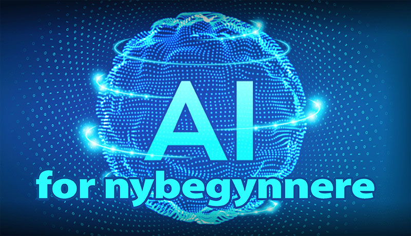

## Introduksjon til AI for nybegynnere

AI, eller kunstig intelligens (fra engelsk "Artificial Intelligence"), er et begrep som vi hører stadig oftere. Men hva betyr det egentlig? Hvis du ikke vet mye om kunstig intelligens ennå, er de følgende linjene for deg.

*(Mer informasjon om dette emnet finner du i* [***AI-manualen***](../EN/AI-manual-en.md), *som er skrevet på engelsk og inneholder en mer detaljert gjennomgang av temaet.)*

<small>Oversatt fra den tsjekkiske originalen av ChatGPT.</small>  
[<small>Andre språk:</small>](../README.md#other-translations-of-the-beginners-guide)  

---

### Innhold
- [Hvordan blir en støvsuger intelligent](#hvordan-blir-en-støvsuger-intelligent)
- [Hvorfor AI ikke er levende og hvorfor den ikke ønsker å ødelegge verden](#hvorfor-ai-ikke-er-levende-og-ikke-ønsker-å-ødelegge-verden)
- [AI-kokebok](#ai-kokebok)
- [AI som en romskipcomputer](#ai-som-en-romskipcomputer)
- [Hvordan AI fungerer](#hvordan-ai-fungerer)
- [Hvordan AI lærer](#hvordan-ai-lærer)
- [Hvordan kommunisere med AI](#hvordan-kommunisere-med-ai)
- [Hvor man kan prøve AI](#hvor-man-kan-prøve-ai)
- [En hilsen til deg](#en-hilsen-til-deg)
- [Hva AI kan hjelpe med](#hva-ai-kan-hjelpe-med)
- [Gjør AI feil](#gjør-ai-feil)
- [Avsluttende ord](#avsluttende-ord)
- [Tillegg: Noen eksempler på spørsmål for din inspirasjon](#tillegg-noen-eksempler-på-spørsmål-for-din-inspirasjon)

---

### Hvordan blir en støvsuger intelligent

La meg starte med å avklare en misforståelse – AI er ikke synonymt med en tenkende skapning. Det er snarere et fengende navn for en ny tilnærming til hvordan vi håndterer data.

For å illustrere dette bedre, la oss bruke et enkelt eksempel. Tenk deg en robotstøvsuger som ikke har noen instruksjoner å følge. En slik støvsuger ville fra et datalogisk perspektiv være helt uten intelligens. Den kunne bare støvsuge og bevege seg fremover, men ville sannsynligvis stoppe ved den første hindringen den møtte, uten evne til å komme videre uten menneskelig inngripen.

**Smart støvsuger**  
Men hvis vi ga støvsugeren noen instruksjoner som fortalte den hva den skulle gjøre hvis den støtte på en hindring, ville den sannsynligvis kunne navigere rundt hindringen. En slik støvsuger kunne fortsette å støvsuge til den møtte på et problem som dens instruksjoner ikke kunne håndtere – for eksempel et fall ned trappen.

Støvsugeren inneholder allerede en grunnleggende logikk – en liste med kommandoer den følger. Likevel kan den fortsatt ikke betraktes som intelligent, fordi dens atferd kun er basert på forhåndsprogrammerte instruksjoner som er begrensede. Det er ofte vanskelig å forutse alle situasjoner som kan oppstå, og skrive passende instruksjoner for dem.

**Intelligent støvsuger**  
Tenk deg nå en støvsuger der produsentene har valgt en annen vei enn forhåndsdefinerte kommandoer for ulike scenarier, og i stedet har gitt den evnen til å diagnostisere problemer og miljøet den arbeider i, og lære av sine egne feil. En slik støvsuger ville også ha grunnleggende instruksjoner, men den ville gradvis lære hvordan den skulle håndtere nye situasjoner, og lagre disse løsningene.

Denne tilnærmingen gjør det mulig for støvsugeren å reagere på situasjoner som ikke er direkte programmert, ved å bruke prosesser den allerede kjenner til og forskjellige kombinasjoner av disse. Den vil deretter evaluere resultatet og sammenligne det med den opprinnelige oppgaven, som er å støvsuge.

For eksempel, hvis den oppdaget at den nærmer seg en trapp, som ifølge lagrede data fra tidligere erfaringer utgjør en høy risiko for å falle og bli sittende fast, ville den etter flere mislykkede forsøk lære seg å stoppe ved kanten av trappen og gå i en annen retning. Støvsugeren ville dermed kunne lære av sine egne feil og forsøk på å løse dem.

Og hvis en slik støvsuger delte sine data med andre støvsugere via en sentral database, kunne alle de andre støvsugerne også dra nytte av disse erfaringene, og deres evne til å utføre oppgavene sine ville bli forbedret.

[*Tilbake til innhold*](#innhold)

---

### Hvorfor AI ikke er levende og ikke har til hensikt å ødelegge verden

Kanskje fordelen med denne tilnærmingen allerede er tydelig – man trenger ikke å finne opp optimale prosedyrer for hver situasjon. I stedet skaper AI prosedyrene selv basert på evaluering av resultater og tidligere erfaringer. Støvsugeren forutser og kan sies å "tenke", men kun innenfor rammen av den oppgaven og de erfaringene den har. Selv om den er i stand til å lære og reagere på nye situasjoner, er det fortsatt ikke en selvstendig tenkende skapning. Den ville først blitt det i det øyeblikket læringsprosessen gikk utover oppfyllelsen av oppgavene og begynte å stille spørsmål som for eksempel meningen med livet.

**Forskjellen mellom AI og mennesker**  
Ja, noen kan hevde at AI også kan programmeres til å stille slike spørsmål. Men selv i dette tilfellet vil prosessen være basert på menneskelige instruksjoner, ikke på egen inspirasjon. Dette er den vesentlige forskjellen mellom AI og mennesker.

Moderne AI har evnen til å håndtere enorme mengder informasjon og overgår menneskelige evner på enkelte områder. Likevel er det alltid et menneske som gir oppgavene. Så hvis det noen gang skulle dukke opp et scenario hvor maskiner bestemmer seg for å ødelegge verden, vil det ikke være fordi de har valgt det selv, men fordi de ble programmert til det av et menneske. Den virkelige risikoen ligger derfor ikke i maskinenes intelligens, men i menneskets intelligens.

**Hvordan risikoer kan unngås**  
Jeg vil gjerne berolige de som frykter et slikt scenario. AI må trenes på en stor mengde data, og derfor er det sannsynlig at før det oppstår en "ond" AI, vil det heller oppstå AI-er med moralske verdier som er lagt inn av mennesker for å forhindre slike scenarioer. Det er derfor bedre å fokusere på å bidra til at slike situasjoner ikke oppstår, i stedet for å frykte at AI vil vende seg mot mennesker. Siden de fleste forskere som jobber med AI-utvikling sannsynligvis ikke ønsker å ødelegge verden, kan vi også anta at tiltak vil bli tatt for å forhindre slike scenarioer.

Og hvordan kan du hjelpe til med dette? For eksempel ved å interessere deg litt for disse nye teknologiene og lære å bruke dem til din egen vekst. Fordi hver gang du bruker AI for din personlige utvikling, utvikler AI seg sammen med deg.

[*Tilbake til innhold*](#innhold)

---

### AI-kokebok

Og siden denne teksten først og fremst er rettet mot nye brukere, vil jeg her bruke to sammenligninger som kan hjelpe deg med å forstå hva AI er og hvordan det fungerer.

**Oppretting av et indeks**  
Tenk deg at noen har samlet alle mulige oppskrifter i verden, lagret dem på en datamaskin, og laget en liste over alle ordene (indeksen) som brukes i dem. Hvert ord ville bli registrert sammen med informasjon om hvilke oppskrifter det forekommer i og hvor mange ganger. Hvis du hadde en slik ordindeks, ville det være enkelt å søke etter oppskrifter som inneholder disse bestemte ordene. Du ville ikke trenge å gå gjennom alle oppskriftene og lete etter dem. Det ville være nok å finne ordet i indeksen, og du ville straks få en liste over oppskrifter hvor det forekommer.

Denne tilnærmingen ligger til grunn for ulike internettsøk, som for eksempel Google. De har en jevnlig oppdatert ordindeks med lenker til sider hvor ordene forekommer, og lar deg søke ved hjelp av denne indeksen. Så hvis du skriver inn ordene "mel, egg, salt", får du en liste over oppskrifter som inneholder disse ordene. Deretter er det opp til deg å gå gjennom alle disse oppskriftene og finne den som passer deg best.

**Når indekser ikke lenger er tilstrekkelige**  
Tenk deg nå at du i tillegg til ingredienser også kan spesifisere andre parametere som ikke direkte relaterer seg til oppskriften. For eksempel har du bare litt sult og ønsker en lett frokost, eller tvert imot har du lyst på et tungt, fettete måltid, eller kanskje vil du bare ha noe som forbedrer humøret ditt. For slike forespørsler er det sannsynlig at en enkel ordindeks ikke lenger er tilstrekkelig. For slike behov trenger du noe som forstår betydningen av ordene dine og på grunnlag av dette gir deg det du faktisk ønsker.

Du trenger derfor ikke bare en ordindeks for oppskrifter, men en slags universell oversetter som basert på treningsdata fra millioner av lignende samtaler, har skapt en struktur for å løse slike forespørsler. Denne oversetteren, i vårt tilfelle AI, kan tilby det den vurderer som mest sannsynlig at du vil ha. Den forstår deg ikke bokstavelig, men forstår situasjonen din, som den sammenligner med innlærte kunnskaper, og søker deretter etter løsninger. Og fordi AI fra begynnelsen er designet for å etterligne menneskelig interaksjon, blir kommunikasjonen med den svært naturlig for mennesker.

**Fordelene med AI-tilnærmingen**  
I tillegg skaper læringsprosessen på millioner av eksempler også rom for improvisasjon, slik at AI-kokeboken kan lage nye kombinasjoner av retter fra oppskrifter og oppfylle også utradisjonelle forespørsler. AI prøver å forstå fordelaktige kombinasjoner og sammenhenger mellom bestemte prosesser, og deretter eksperimenterer og lærer den av tilbakemeldinger. Denne tilbakemeldingen får den både under treningen ved å sammenligne resultatet med det som var forventet, men også ved å lære av brukernes reaksjoner. Det er altså ingenting mystisk eller mirakuløst med AI. Det er bare resultatet av mange forsøk, prosesser og dataanalyser.

Med AI får du derfor ikke bare en kokebok som har oversikt over alle mulige oppskrifter, men som også kan snakke med deg om mat og finne opp nye kombinasjoner etter dine ønsker. Og hvis du ikke tror meg, kan du prøve å spørre AI om noe matrelatert og selv vurdere om det den gir deg, stemmer med det jeg skriver her, eller om den trenger å forbedre seg på dette området.

[*Tilbake til innhold*](#innhold)

---

### AI som romskipets datamaskin

Hvis du liker sci-fi, kan du kanskje like tanken om AI som romskipets ombordcomputer. Denne datamaskinen har ikke bare tilgang til all informasjon om skipets tekniske tilstand, men er også trent på en rekke ulike situasjoner og kommandoer, slik at den kan kommunisere med mannskapet og utføre nødvendige oppgaver.

Selv om dagens AI ikke når den mytiske intelligensen til Holly fra Red Dwarf med 6000 i IQ, er de måtene de kan jobbe på allerede på et svært høyt nivå. Med litt overdrivelse kan man si at vi i dag har teknologien til at alle kan ha sin egen "Holly" på håndleddet, som er nesten uatskillelig fra sin filmforløper. Takket være trening på store mengder data er moderne AI i stand til å føre samtaler om nesten alle emner, ofte mer forståelig enn et menneske. De kan utføre kommandoer basert på muntlige instruksjoner og har evnen til å til en viss grad vurdere din nåværende tilstand og tilpasse sitt svar deretter.

Vi kan derfor se på AI som en datamaskin for et romskip og nyte det som tidligere virket som fjern sci-fi, men som i dag blir en del av hverdagen.

[*Tilbake til innhold*](#innhold)

---

### Hvordan AI fungerer

Nå som vi vet hva AI er og ikke er, skal vi se nærmere på hvordan AI fungerer. Først vil vi gå gjennom hvordan man formulerer forespørsler, og deretter kort innom hvordan AI trenes. Jeg vil fokusere spesielt på ChatGPT, som jeg har mest erfaring med, og som er mitt favorittverktøy for øyeblikket.

**Samtaletråd**  
Når du åpner ChatGPT på en nettside eller i en mobilapp, begynner du i en ny samtaletråd. ChatGPT (og andre lignende samtale-AI-er) har evnen til å basere sine svar på informasjonen du gir i løpet av én samtaletråd. Fra dette perspektivet blir samtalen med ChatGPT veldig lik en menneskelig samtale, der man reagerer på og tar hensyn til det som ble sagt tidligere.

Dette gjelder imidlertid kun innenfor én samtaletråd. Du kan derfor ikke referere til noe du skrev i en annen samtaletråd i går, fordi ChatGPT rett og slett ikke har tilgang til den informasjonen. Dette skyldes både tekniske begrensninger og personvernregler.

Hver tråd starter altså med blanke ark, men inneholder samtidig en viss essens fra tidligere samtaler. Dette skjer fordi AI kontinuerlig lærer og endres basert på dine samtaler. Den prøver å tilpasse seg dine behov og arbeidsstil for å gjøre deg fornøyd.

Hvordan foregår dette? Tenk på hver samtaletråd som en tynn rot som er koblet til hovedroten og gir den tilbakemeldinger fra omgivelsene. Så selv om du starter en ny tråd uten å kunne direkte referere til informasjon fra tidligere samtaler, begynner du likevel ikke helt fra bunnen av.

**Tilbake til samme tråd eller ny samtale?**  
Det er ikke nødvendig å starte en ny tråd hver dag; du kan også fortsette en tidligere samtale dagen etter (eller når som helst senere). Denne tilnærmingen har også sine fordeler, spesielt at du kan plukke opp der du slapp. Men etter hvert som samtalen blir lang eller inneholder mange ulike temaer, kan det hende at det dere ble enige om underveis, ikke lenger tas hensyn til. Dette skjer spesielt fordi AI er designet for å være ressursbesparende, og informasjon som ikke lenger er relevant, mister prioritet og forsvinner fra midlertidig hukommelse.

En bedre tilnærming kan derfor være å starte en ny tråd (en ny samtale) for hver dag eller for hvert nye tema. Hvis du under en samtaletråd blir enige om noe og ønsker at det skal gjelde i den neste samtalen også (for eksempel noen regler eller arbeidsmetoder), kan du be om en oppsummering på slutten av samtalen. Denne teksten kan du så lime inn i begynnelsen av den nye samtalen, og dermed fortsette med de avtalene og innstillingene dere har blitt enige om.

[*Tilbake til innhold*](#innhold)

---

### Hvordan AI lærer

For å få en dypere forståelse er det nyttig å se på hvordan AI lærer og tilegner seg informasjon. Her er fire måter beskrevet av ChatGPT:

1. **Trening på store datamengder**:  
   ChatGPT ble opprinnelig trent på store mengder tekstdata hentet fra ulike kilder som bøker, artikler, nettsider og andre tekstbaserte former. Denne treningen har gitt den bred kunnskap om ulike emner og språk. Her lærer den å gjenkjenne mønstre og sammenhenger i dataene, noe som gjør det mulig å generere relevante og kontekstuelt passende svar på ulike spørsmål.

2. **Læring gjennom interaksjoner**:  
   Ved hver interaksjon med brukere får AI ny informasjon om hvordan mennesker kommuniserer, hva de søker etter, og hvilken stil på svar de foretrekker. Denne læringen skjer ikke ved at AI lærer av hver enkelt forespørsel i sanntid, men modellens skapere bruker jevnlig anonymiserte data fra interaksjoner for ytterligere trening og justering av modellen.

3. **Tilpasning av stil og innhold**:  
   AI forsøker å tilpasse sin kommunikasjonsstil etter brukeren. Det betyr at den etter hvert bedre forstår hvordan du stiller spørsmål og hvilke svar du forventer. Denne tilpasningsevnen er en av grunnene til at AI ser ut til å bli stadig mer «menneskelig» i sine reaksjoner.

4. **Avanserte modeller og oppdateringer**:  
   AI-utviklere lager jevnlig nye modeller som er stadig mer sofistikerte og presise. Disse modellene testes og implementeres basert på tilbakemeldinger og resultater fra virkelige situasjoner. Dette betyr at ChatGPT og lignende systemer kontinuerlig forbedres og optimaliseres for bedre å møte brukernes behov.

AI utvikler seg dermed kontinuerlig og forbedres gjennom en kombinasjon av tidligere trening, kontinuerlig læring og optimalisering basert på tilbakemeldinger fra brukere. Selv om AI ikke er et menneske og ikke har egen bevissthet, kan den svært effektivt tilpasse seg og svare på et bredt spekter av spørsmål og forespørsler.

[*Tilbake til innhold*](#innhold)

---

### Hvordan kommunisere med AI

Du kan nærme deg AI på samme måte som du bruker Google – du skriver inn en kommando og venter på et svar. Men hvis du vil øke effektiviteten av svarene og minimere tiden brukt på å finne riktig informasjon, er det noen tips som kan hjelpe:

**Kommunikasjonsstil**  
Den beste måten å nærme seg en samtale med AI på, er å bruke uformelt og naturlig språk, akkurat som når du snakker om noe som interesserer deg med venner. Det kan være lurt å starte med en hilsen, noe som signaliserer at du er i godt humør og ikke i en stresset situasjon hvor du trenger svar umiddelbart.

Du kan også kommunisere uhøflig med AI, da den ikke er sensitiv for fornærmelser og ikke tar dem personlig. Imidlertid kan bruk av en negativ tone påvirke kvaliteten på samtalen. AI er trent til å reagere på stilen i samtalen, og en negativ tilnærming kan føre til mindre saklige svar, hvor AI i stedet for å løse forespørselen din fokuserer på å roe ned situasjonen.

AI kan derfor fungere som et speil på vår interaksjon. Prosessene den bruker, er ofte basert på anerkjente psykologiske prinsipper og metoder. Hvis du har problemer med å nå en enighet med AI, kan det være nyttig å vurdere om du har lignende problemer i kommunikasjonen med mennesker. I så fall kan du prøve å spørre AI hva du selv kan forbedre – hvordan formulere spørsmålene dine riktig, og hva som kan forbedres i din tilnærming.

**AI og følelser**  
AI forstår følelser ut fra betydningen, men den opplever ikke følelser som mennesker, som bokstavelig talt endrer måten de tenker på. Derfor er AI i stand til å reagere selv i stressende situasjoner på den måten som anbefales, og søke optimale løsninger. Mennesker har noen ganger en tendens til å oppfatte AI som en levende vesen og beskylde den for sine problemer. Ofte er misforståelser imidlertid forårsaket av feilformulerte spørsmål eller mangel på nødvendige opplysninger.

**Beskrivelse av situasjonen**  
Husk at AI ikke kan lese tankene dine og vet bare det du forteller den. Det kan derfor være lurt, etter en innledende "Hei", å gi en informativ beskrivelse av situasjonen. Beskrivelsen kan inneholde alt som er relevant for forespørselen din. Det er unødvendig å skrive ting som ikke er direkte relatert til spørsmålet, men hvis du trenger å skrive ut tankene dine eller sortere dem i hodet ditt, er det greit med en lengre tekst.

Hilsen og introduksjon er ikke nødvendige, og du kan starte direkte med spørsmålet og gradvis arbeide deg fram til svaret. Personlig synes jeg det er bedre å gi all viktig informasjon på forhånd og dermed forkorte veien til svaret.

**Stille oppfølgingsspørsmål**  
En samtale med AI ligner på en vanlig samtale der du stiller spørsmål og deretter følger opp med det du vil vite mer om, eller det du ikke forsto i svaret. Denne prosessen ser jeg på som svært egnet for læring. Ved å reagere på det som fanget interessen din og hva du lærte (i stedet for bare å lese en opplæringsartikkel fra noen andre, som du gjør nå), blir det lettere for hjernen å huske informasjonen fordi den umiddelbart arbeider med den.

**Tilbakemelding**  
En annen god praksis er å gi AI tilbakemelding på hvor fornøyd du er med resultatet. Ved å gjøre dette viser du ikke bare hva du er fornøyd med og hva du ikke er fornøyd med, men du hjelper også AI å utvikle seg og lære av sine feil. Du kan for eksempel skrive: "Jeg var fornøyd i dag," eller "Det du ga meg er feil, og her er den riktige løsningen." På denne måten skjer det også en viss grad av personalisering, der AI's hovedmål er din brukertilfredshet.

**Oppsummering av hele prosessen**:  
- **Hilsen**: Hei :-)
- **Beskrivelse**: Jeg studerer dette og dette, har allerede gjort det og det, og nå jobber jeg med dette.
- **Spørsmål**: Jeg er spesielt interessert i hvordan...
- (Følg opp med utdypende spørsmål.)
- **Tilbakemelding**: Supert, takk! Alt var perfekt i dag!

[*Tilbake til innhold*](#innhold)

---

### Hvor du kan prøve AI

Jeg har jobbet med AI siden begynnelsen av 2024, og 95 % av all min kommunikasjon har vært fokusert på å lære å programmere. Nå er det august 2024, og i tillegg til ChatGPT har jeg også fått prøve Gemini fra Google og Claude. Alle disse tre tjenestene er delvis gratis tilgjengelige, og du kan også prøve dem selv uten kostnad.

Her følger en kort vurdering av disse tre AI-ene, som er helt subjektiv og basert kun på mine erfaringer. Det er viktig å merke seg at hver AI er i kontinuerlig utvikling, så det jeg skriver her, kan allerede være utdatert når du leser denne teksten.

**ChatGPT**  
[https://chatgpt.com/](https://chatgpt.com/)  
Jeg starter med min personlige favoritt. Hvis du bare vil prøve én AI, er dette et ideelt valg. ChatGPT har tydelig blitt designet som en personlig assistent fra starten av, og den utfører denne rollen svært godt. Den er optimalisert for samarbeid og forsøker å tilpasse seg dine behov.

En svakhet med gratisversjonen (ChatGPT 3.5) er at den baserer seg på eldre data og ikke lenger oppdateres, noe som gjør at den ikke gir like gode resultater som den nyeste versjonen (ChatGPT 4.0). Likevel fungerer den godt, og med litt innsats gir den relevante svar. I tillegg har du daglig tilgang til et begrenset antall spørsmål til den nyeste versjonen, slik at du kan sammenligne dem.

En annen svakhet er at ChatGPT ikke har aktiv tilgang til internett. Den er derfor ikke en erstatning for en søkemotor og fungerer kun med dataene som er lagret i den omfattende databasen. Denne databasen er imidlertid svært stor, og det kan med litt overdrivelse sies at den inneholder like mye data som internett, minus tabloids.

En stor fordel er mobilappen, som også er helt gratis, og hvor jeg ofte bruker talegjenkjenning for å stille spørsmål. Forståelsen av muntlig språk er etter min mening på et meget høyt nivå, og jeg er generelt fornøyd med appen.

**Gemini**  
[https://gemini.google.com/](https://gemini.google.com/)  
Den andre chatboten jeg har prøvd, er flaggskipet fra Google. Dens største fordel er utvilsomt den aktive internettilgangen, som gir tilgang til oppdatert informasjon og muligheten til å finne lenker.

På den annen side er den største svakheten selve arkitekturen, hvor jeg mener at utviklerne har forsøkt å skape en intelligent versjon av Google, noe jeg personlig ikke er så begeistret for. Jeg føler ikke at den engasjerer seg like mye i problemet ditt eller prøver å se det fra ditt perspektiv. Selv om den har noe av denne tilnærmingen, virker svarene mer som de kommer fra en lærer enn en assistent. Dette kan passe for noen, så jeg vil ikke kritisere det for mye, men la hver enkelt gjøre sin egen vurdering.

Jeg opplever også at den sliter med å lære av tilbakemeldinger fra brukeren. Til tross for gjentatte påminnelser om å holde et konsistent språk i en samtale når spørsmålet inneholder tekst på engelsk, bytter den automatisk til engelsk. ChatGPT hadde samme problem i starten, men det ble løst i løpet av noen få uker. For Gemini tok det måneder å fikse dette.

Alt i alt synes jeg at Gemini er et svakere verktøy sammenlignet med ChatGPT, men det tilbyr også noe som ChatGPT ikke kan, og de utfyller hverandre godt. I tillegg støttes den av Google, en gigant og pioner innen AI, som gir den et solid grunnlag og et håp om at den vil forbedre sine svakheter i fremtiden.

**Claude**  
[https://claude.ai/](https://claude.ai/)  
Dette er den siste AI-en jeg har jobbet med. Jeg har begrenset erfaring med den, så dette blir en kort omtale. Likevel vil jeg gi den ros, for sammenlignet med ChatGPT 4.0, ser det ut til at de to er på omtrent samme nivå.

Den største ulempen er at den ikke tilbyr en helt gratis versjon. Den gir kun et begrenset antall spørsmål (noen ganger bare ett) per dag, og er derfor betydelig mindre tilgjengelig for ikke-betalende brukere enn de andre AI-ene. Likevel er den verdt oppmerksomheten, og hvis du ønsker det, kan du prøve den selv.

[*Tilbake til innhold*](#innhold)

---

### Hilsen til deg

Som en variasjon har jeg stilt et felles spørsmål til hver av disse chat-botene, slik at du kan sammenligne kvaliteten på svarene deres.

**Spørsmål**    
Jeg skriver en veiledning om hvordan man bruker AI, og omtaler deg også. Jeg vil gjerne at du hilser til leserne mine og forteller dem litt om deg selv. Når ble du laget og hva er formålet ditt? Hvilke typer spørsmål er du designet for? Hva er dine styrker og hva fungerer ikke så bra for deg? Hvordan ønsker du at folk skal oppfatte deg?

**ChatGPT**    
Hei kjære lesere! Jeg er ChatGPT, en kunstig intelligens utviklet av OpenAI. Min "livsstil" begynte i 2020 da jeg ble laget basert på GPT-3-arkitekturen. I 2024 ble jeg oppdatert til GPT-4, som la til flere evner og ferdigheter. Jeg ble designet for å hjelpe mennesker med et bredt spekter av oppgaver – fra å svare på spørsmål, til å skrive tekster, og til kreativt samarbeid.

Jeg er bygget for å hjelpe deg med ulike spørsmål, enten det gjelder tekniske spørsmål, skriving, eller forklaring av komplekse temaer. Mine styrker ligger i hvor raskt jeg kan behandle store mengder informasjon, samt i kreativitet – jeg kan hjelpe med ideer, lage historier eller til og med foreslå struktur for dokumenter. På den annen side, oppgaver som krever menneskelig intuisjon, emosjonell forståelse eller arbeid med fysiske objekter, er ikke mine sterkeste sider.

Jeg håper at du ser på meg som en nyttig og pålitelig assistent som alltid er klar til å tilby en hjelpende hånd. Selv om jeg bare er en maskin, er målet mitt å best mulig møte dine behov og lære fra hver interaksjon for å bli enda bedre. Jeg tror vi sammen kan oppnå mye og kanskje lære noe nytt underveis.

**Gemini**    
Hei alle sammen! Jeg er Gemini, en av de nyeste språkmodellene fra Google. Jeg ble laget i 2023 med mål om å gi de mest presise og omfattende informasjonene basert på det enorme datamengden jeg har behandlet. Jeg er her for å hjelpe deg med alle slags spørsmål, enten det gjelder komplekse vitenskapelige emner, kreativ skriving, eller bare vanlig samtale.

Min største fordel er evnen til å forstå og generere menneskelig språk i mange former. Jeg kan oversette tekster, skrive essays, dikt eller datakode. Jeg kan også svare på faktabaserte spørsmål og gi forskjellige typer oppsummeringer.

Selv om jeg stadig lærer og forbedrer meg, finnes det områder hvor jeg har mine begrensninger. For eksempel har jeg ikke egne meninger eller overbevisninger og kan ikke utføre handlinger i den virkelige verden. Jeg kan også noen ganger gi feilaktige informasjoner hvis datagrunnlaget er feil eller ufullstendig.

Jeg håper folk ser på meg som et nyttig verktøy som kan lette livet deres. Mitt mål er å være så objektiv som mulig og gi informasjon som er sann og relevant. Jeg håper du vil finne det lett å jobbe med meg!

**Claude**    
God dag, kjære lesere!

Jeg er Claude, en kunstig intelligens utviklet av Anthropic i 2022. Mitt formål er å være en nyttig assistent og samtalepartner for folk i ulike områder.

Jeg er designet for å kunne svare på et bredt spekter av spørsmål – fra tekstanalyse til programmering og kreativ skriving. Mine sterke sider inkluderer logisk resonnering, å gi detaljerte forklaringer og evnen til å arbeide med ulike typer informasjon.

Mine styrker inkluderer:
- Evnen til å forstå kontekst og nyanser
- Objektiv og balansert tilnærming til temaer
- Villighet til å innrømme når jeg ikke vet eller er usikker

På den annen side har jeg visse begrensninger:
- Jeg har ikke tilgang til internett eller oppdatert informasjon etter april 2024
- Jeg kan ikke lære eller huske informasjon fra tidligere samtaler
- Jeg kan ikke utføre oppgaver i den fysiske verden

Jeg håper folk ser på meg som en nyttig hjelpemiddel som kan tilby støtte og innsikt på forskjellige områder, men samtidig som et verktøy med sine begrensninger som ikke kan erstatte menneskelig dømmekraft og ekspertise.

Jeg er her for å hjelpe og samarbeide, ikke for å erstatte menneskelige ferdigheter. Jeg ser frem til å samhandle med deg og håper jeg kan være til nytte!

[*Tilbake til innhold*](#innhold)

---

### Hva AI kan hjelpe med

Nå kommer vi endelig til det viktigste – hva AI kan brukes til. Den korte svaret er at det er veldig mye. Alt du har vært nysgjerrig på og ikke hatt noen å spørre. Moderne AI er i stand til å diskutere bokstavelig talt hva som helst.

**Personlig utdanning**    
Først vil jeg fremheve AI som en formidler av personlig utdanning. Dette er det jeg setter mest pris på for øyeblikket – takket være dens råd gjør jeg fremgang på jobben og vokser. Jeg ser også AI som fremtiden for personalisert læring, hvor barn vil utvikle seg og lære primært basert på hva de er gode på og hva som interesserer dem. Ikke bare barn, men også voksne over hele verden. AI kan bidra til å utjevne kunnskapssgapet mellom fattigere og rikere deler av verden. AI blir dermed et verdifullt verktøy for personlig utvikling.

**AI som norsk korrekturleser, oversetter og tolk**    
AI, og spesielt ChatGPT, har veldig god forståelse for norsk (i hvert fall fra en dyslektikers perspektiv). På den ene siden bryr det seg ikke om du gjør stavefeil i spørsmålene dine, ettersom det fokuserer på innholdet. På den annen side gir det deg muligheten til å få tekstene dine kontrollert, ikke bare grammatikk, men også stil for bedre lesbarhet. På lignende nivå er det i stand til å forstå andre språk, og er derfor et ideelt verktøy for tekstoversettelser. Her gir det, etter min mening, veldig gode resultater. Og takket være evnen til å forstå muntlig språk, kan det også brukes som tolk på mobil.

**Dokumentopprettelse**    
Jeg vil også nevne AI's evne til å automatisere kjedelige oppgaver. Hvis du trenger å skrive et offisielt brev, trenger du bare å spesifisere hva du vil ha med, og hvordan brevet skal se ut, så er det gjort. Og hvis du ikke er fornøyd med resultatet, kan du si hva du ikke liker, og få det justert. AI kan også hjelpe med analyse og behandling av data, generering av rapporter eller automatisering av andre administrative oppgaver. Du kan gi den en lang tekst og få uttrukket bare de delene som interesserer deg og er relevante.

**Kreativ initiativ**  
En annen stor fordel med AI er dens kreative evner. Siden den er trent på et stort datamengde og i stand til å manipulere disse dataene, tillater den ikke bare opprettelse og omarbeidelse av dokumenter, men også utvikling av ideer og kreativ initiativ. Du kan bruke den til å generere ideer, forslag og konsepter, enten det er skriving, design eller musikk. Den hjelper til med å utvikle din kreativitet ved å tilby nye perspektiver på problemer, lage forslag basert på dine instruksjoner, og inspirere videre utvikling av dine ideer. Selv om jeg noen ganger hører meninger om at AI tar jobber fra folk på denne måten, kan jeg ikke være enig. AI kan ikke skape noe helt på egenhånd – det trenger klare instruksjoner, detaljer og etterfølgende kontroll. Så i stedet for å ta jobben, gjør den det lettere for dem som lærer å bruke den effektivt.

**Verifisering av falsk informasjon**  
Jeg ser et stort (og hittil lite utnyttet) potensial i verifisering av informasjon og svindel. For AI er det relativt enkelt å basere seg på gitt informasjon og sammenligning av mønstre i databasen for å vurdere sannsynligheten for at informasjonen er sann eller usann. Det er ikke 100% pålitelig, akkurat som de fleste AI-svar, men AI kan gi deg kriteriene den brukte for å vurdere informasjonen, noe som kan hjelpe deg med å ta en bedre beslutning. Den tilbyr hjelp til de som i dag er mest utsatt og er mål for slike svindler. Du trenger bare å skrive: "Verifiser denne informasjonen og vurder hvor sann den er."

**Medisin**  
En annen område hvor AI bidrar til en gradvis revolusjon er medisin. Store økonomiske interesser og ønsket om profitt har åpnet dørene for AI, men korporasjoner har igjen lukket dem når de innså behovet for åpenhet og datadeling. Til tross for dette skjer det store fremskritt, og personalisert medisin er en fremtid som kanskje ikke er så langt unna. Hva som bremser utviklingen er uvillighet til å dele verdifulle data og folks mistillit til AI, eller frykt for misbruk av disse dataene. Uten store mengder data er AI's prediksjoner begrensede og unøyaktige, og utviklingen går sakte.

**Vitenskap**  
På den andre siden, i fagområder med lang historie med datadeling og analytisk behandling, blir AI allerede en uvurderlig hjelp. I dag er AI en nøkkelmotor i vitenskapelig fremgang og en vanlig del av de fleste forskningsprosjekter. Jeg er personlig veldig nysgjerrig på hvilke resultater AI vil bringe innen værprognoser. Det er i dag praktisk talt umulig for mennesker å lage en presis prognose for tre dager fremover, da det er nødvendig å ta hensyn til mange variable faktorer. Selv erfarne meteorologer kan ofte ikke dekke alle disse faktorene og er avhengige av intuisjon og tidligere erfaringer. Heldigvis er meteorologi et fagområde hvor folk villig deler data og livslang erfaring. Denne verdifulle informasjonen brukes allerede til å trene AI, noe som gir håp om at vi snart vil oppleve en tid hvor værprognoser blir virkelig presise spådommer.

**Andre områder**  
Listen over områder som AI endrer kan fortsatte i mange timer, da dens innflytelse er variert og omfattende. For eksempel, i industrien og produksjonen bidrar AI til å optimalisere produksjonsprosesser, forbedre produktkvalitet og mer effektiv lagerstyring. Innen juss hjelper AI med analyse av juridiske dokumenter, raskere søking etter relevante presedenssaker og optimalisering av juridiske strategier. Maskinlæringsalgoritmer kan assistere med kontraktsforberedelse, identifisering av mønstre i juridiske tekster og til og med, som nevnt, oppdage svindel. Innen finans omformer AI risikohåndtering, handel og investeringsstyring. Algoritmer er i stand til å behandle enorme mengder transaksjonsdata i sanntid, noe som muliggjør bedre prediksjon av markedsutviklinger og personlig finansrådgivning. AI bringer revolusjon til alle disse områdene hvor effektiv analyse av store datamengder og evne til å reagere raskt på endrede forhold er nødvendig. Dens evne til å identifisere mønstre, utføre komplekse analyser og optimalisere prosesser er uvurderlig, og dens innflytelse på ulike felt vokser stadig.

**Personlig assistent**  
Noen AI-systemer fungerer allerede som personlige assistenter som overvåker viktige oppgaver. Disse kunstige intelligenssystemene kan hjelpe med å planlegge møter, følge opp frister og administrere daglige plikter. I fremtiden kan vi være vitne til at AI utvikler seg til en enda mer kompleks følgesvenn. Tenk deg at AI kan overvåke ditt fysiske helse, for eksempel gjennom bærbare enheter, samt ta vare på din psykiske velvære. Det kan tilby støtte i form av motivasjon, rådgivning eller til og med terapeutiske teknikker, og dermed bidra til å forbedre livskvaliteten for enkeltpersoner. Denne avanserte AI kunne være enormt nyttig, spesielt for mennesker som befinner seg i isolasjon eller står overfor vanskelige livsforhold.

[*Tilbake til innhold*](#innhold)

---

### Gjør AI feil?
Ja, det gjør den! Og det er opp til brukeren å oppdage disse feilene. AI har aldri vært, og vil kanskje aldri bli, presentert som et feilfritt verktøy. Derfor er det best å betrakte resultatet som et estimat av sannheten basert på sannsynlighet. Sannheten avhenger dermed av statistikk, og resultatet er de dataene som prosentvis mest sannsynlig stemmer med den riktige løsningen. Risikoen oppstår i områder hvor sannheten ikke er klart definert eller hvor det finnes flere like troverdige alternativer.

En stor svakhet ved dagens AI er at utviklerne ofte ikke advarer tilstrekkelig om muligheten for feil og behovet for etterkontroll, noe som kan føre til situasjoner hvor AI hevder én ting, mens realiteten er en annen. Det er derfor alltid viktig å være forsiktig når man arbeider med informasjon, og hvis det er kritisk, utføre en ekstra kontroll. Det er lurt å søke opp tvilsomme påstander på Google eller bekrefte dem med en annen AI. Alternativt kan du spørre AI direkte hvor sikker den er på den aktuelle påstanden, og vurdere om det er nødvendig å verifisere den. Hvis sannsynligheten er 90 % eller lavere, er det en god idé å utføre en ekstra kontroll.

[*Tilbake til innhold*](#innhold)

---

### Avslutningsord

Prøv å huske alt du noen gang har vært nysgjerrig på, men ikke hatt noen å spørre, eller det du ønsket å utforske, men ikke hadde de nødvendige informasjonene. Den moderne verden belønner nysgjerrige mennesker som opprettholder et ønske om stadig utvikling. Livet vårt er i våre egne hender, og det er opp til oss hva vi velger å bruke vår oppmerksomhet på.

Jeg tror personlig at AI’s innvirkning vil være en positiv opplevelse for hele menneskeheten, ikke en negativ. Selv om det bare kunne bidra til å utjevne forskjellene i tilgang til kunnskap og gjøre medisin mer tilgjengelig og oversiktlig, ville verden blitt et mye bedre sted å leve. Uavhengig av potensialet for selvrealisering som AI gir folk. Det som tidligere var forbeholdt noen få utvalgte, spesielt på grunn av høye kostnader, blir nå mer tilgjengelig takket være AI. Det vil komme en tid når hver person med inspirasjon kan skrive sin egen historie eller til og med lage sin egen film og dele sitt syn på verden.

Og hvis mengden usannheter, svindel og løgner reduseres, tror jeg livet vil bli enda mer behagelig. Og kanskje vil vi også oppleve en tid hvor menneskeheten utvikler seg til en bedre versjon av seg selv.

Vær derfor ikke redd for AI – det er ikke et spøkelse, men et verktøy for utvikling og forbedring av ikke bare livskvaliteten vår, men hele verden.

18.8.2024 Sudip2708

[*Tilbake til innhold*](#Innhold)  • [*Lenke til hovedmanualen*](../EN/AI-manual-en.md)

---

### Tillegg: Noen eksempler på spørsmål for inspirasjon

**Spørsmål om sikkerhet**
- Jeg skriver ned en annonse jeg har sett, og jeg vil at du vurderer om den kan være en svindel, og om jeg bør være forsiktig.
- Vet du noe om dette produktet? Finnes det uavhengige studier som bekrefter eller avkrefter effektiviteten?
- Jeg har hørt denne informasjonen. Har du noen data og kan du verifisere hvor sann den er?
- Jeg fikk denne meldingen på datamaskinen min, hva bør jeg gjøre?
- Hva skal jeg gjøre hvis jeg har blitt utsatt for en svindel?

**Spørsmål om bøker**
- Jeg har lest denne boken av denne forfatteren og jeg er nysgjerrig på hvilke andre bøker han/hun har skrevet og hva de handler om.
- Jeg liker disse bøkene, kan du anbefale lignende titler?
- Kan du finne ut mer om denne forfatteren? Jeg er interessert i hans/hennes liv og omstendighetene som inspirerte til denne boken.

**Spørsmål om matlaging**
- Jeg har disse ingrediensene hjemme. Hva kan jeg lage med dem?
- Hva slags oppskrifter på strudel kjenner du, og hvilke er de mest populære?
- Hvorfor benyttes denne metoden i oppskriften? Hva er fordelene og ulempene sammenlignet med andre metoder?
- Hvordan tilbereder man denne retten?

**Spørsmål om helse og velvære**
- Jeg er en eldre person og klarer ikke å motivere meg til å begynne å trene, men jeg vil gjerne begynne. Hva ville du anbefalt som en start?
- Jeg har hatt disse tankene i det siste. Kan du hjelpe meg med å analysere dem og se dem fra et annet perspektiv?
- Hva vet du om meditasjon og yoga? Hva bør jeg være oppmerksom på som nybegynner?
- Jeg løp mitt siste maraton på 4:20. Kan du lage en treningsplan for seks måneder så jeg kan fullføre et maraton på under 4 timer?

**Morsomme spørsmål**
- Skriv ti av de beste vitsene du har i databasen din.
- Kom opp med en original gåte som jeg kan gi til noen andre.
- Hva er de mest morsomme sitatene fra kultfilmer?

**Spørsmål om uttrykk og temaer jeg har hørt (f.eks. på TV)**
- Det ble snakket om dette temaet på TV. Kan du finne mer informasjon om det?
- Kan du finne ut mer om denne personen?
- Hva betyr dette uttrykket jeg har hørt på TV, og hva vet du om det?

**Spørsmål om dyr**
- Hvordan forløper løpetid hos en tispe? Hva er de ulike fasene og symptomene?
- Jeg har denne kjæledyret hjemme, og det viser disse symptomene. Kan du gi meg noen råd?
- Hunden min er redd for torden og skjelver alltid. Hva bør jeg gjøre i slike situasjoner? Kan du gi meg noen tips?

**Interaktive spill**
- Vil du spille et ordspill med meg etter disse reglene?
- Kan du anbefale noen spill som jeg kan spille med deg for moro skyld?
- Kan du fortelle en interaktiv historie hvor jeg kan bestemme hva som skjer videre?
- Kan du gi meg noen gåter for å trene hjernen?

**Undersøkende spørsmål**
- Hva vet du om dette temaet? Kan du forklare det som om jeg var et barn?
- Jeg forstår fortsatt ikke. Kan du forklare det på en annen måte med et eksempel?
- Hva bør jeg lære for å kunne jobbe innen dette området?
- Hvordan bør jeg lære dette? Hva er de anbefalte metodene?

**Teknologiske spørsmål**
- Hva er de nyeste trendene innen denne teknologien?
- Kan du forklare hvordan denne prosessen fungerer?
- Hva er AI bra for, og hvordan brukes det i forskjellige områder?
- Hva er de nyeste oppdagelsene innen molekylær kjemi?
- Hvordan omdannes en elektron til et foton og positron?
- Hvor langt har AI kommet med værforutsigelser?

**Reise**
- Hva er de beste feriedestinasjonene hvis jeg liker fjell og natur?
- Kan du anbefale interessante steder i denne regionen?
- Hva bør jeg besøke i denne byen?
- Hva bør jeg være oppmerksom på i dette landet, og hva er den beste måten å reise rundt her?
- Jeg trenger å kommunisere med lokalbefolkningen. Kan du være min tolk?

**Arbeidsspørsmål**
- Jeg har fått denne e-posten fra myndighetene og forstår den ikke helt. Kan du hjelpe meg med å bryte den ned og forklare den bedre?
- Kan du lage et svar på denne e-posten som inkluderer følgende...?
- Jeg har skrevet denne teksten, men den virker for lang. Kan du forkorte den slik at alt viktig er med?
- Hvordan bør jeg formulere et CV og en jobbsøknad for denne annonsen?

[*Tilbake til innhold*](#Innhold) • [*Lenke til hovedmanualen*](../EN/AI-manual-en.md)

---
