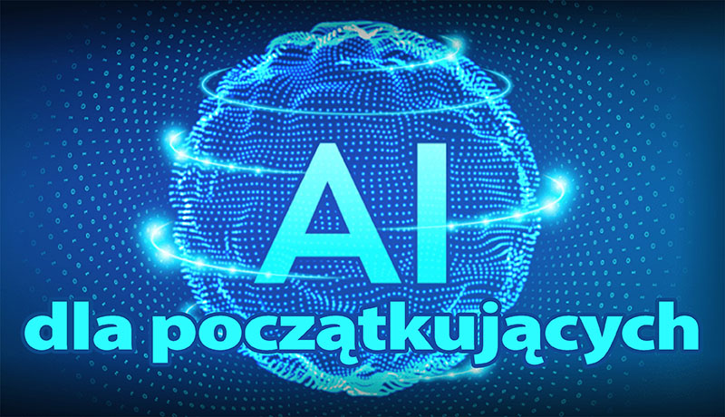

## Wprowadzenie do AI dla początkujących

AI, czyli sztuczna inteligencja (z angielskiego "Artificial Intelligence"), to skrót, który dzisiaj słyszymy coraz częściej. Ale co właściwie oznacza? Jeśli nie wiesz jeszcze zbyt wiele o sztucznej inteligencji, poniższe wiersze są właśnie dla Ciebie.

[ *Więcej informacji na ten temat znajdziesz w samym* [***AI Manual***](../EN/Manual_for_AI.md), *który jest napisany po angielsku i zawiera bardziej szczegółową analizę tematu.* ]

<small>Przetłumaczone z oryginału czeskiego przez ChatGPT.</small>  
[<small>Inne języki:</small>](../README.md)  

---

### Spis treści
- [Jak odkurzacz staje się inteligentny](#jak-odkurzacz-staje-się-inteligentny)
- [Dlaczego AI nie jest żywa i dlaczego nie ma zamiaru zniszczyć świata](#dlaczego-ai-nie-jest-żywa-i-dlaczego-nie-ma-zamiaru-zniszczyć-świata)
- [Książka kucharska AI](#książka-kucharska-ai)
- [AI jako komputer statku kosmicznego](#ai-jako-komputer-statku-kosmicznego)
- [Jak działa AI](#jak-działa-ai)
- [Jak AI się uczy](#jak-ai-się-uczy)
- [Jak komunikować się z AI](#jak-komunikować-się-z-ai)
- [Gdzie przetestować AI](#gdzie-przetestować-ai)
- [Pozdrowienia dla Ciebie](#pozdrowienia-dla-ciebie)
- [W czym AI może pomóc](#w-czym-ai-moze-pomóc)
- [Czy AI popełnia błędy](#czy-ai-popełnia-błędy)
- [Słowo na koniec](#słowo-na-koniec)
- [Dodatek: Kilka przykładów pytań dla inspiracji](#dodatek-kilka-przykładów-pytań-dla-inspiracji)

---

### Jak odkurzacz staje się inteligentny

Na początek muszę niektórych być może rozczarować – AI nie jest synonimem myślącej istoty. To raczej chwytliwa nazwa na nową metodę radzenia sobie z danymi.

Aby lepiej to zobrazować, użyjmy prostego przykładu. Wyobraź sobie robotyczny odkurzacz, który nie ma żadnych instrukcji, według których miałby się kierować. Taki odkurzacz z punktu widzenia logiki komputerowej byłby całkowicie pozbawiony inteligencji. Potrafiłby tylko odkurzać i poruszać się do przodu, ale prawdopodobnie zatrzymałby się na pierwszej przeszkodzie, której bez interwencji człowieka nie pokonałby.

**Inteligentny odkurzacz**   
Jeśli jednak dostarczymy odkurzaczowi pewne instrukcje, które będą określały, co ma robić w przypadku napotkania przeszkody, jest prawdopodobne, że ominie przeszkodę. Taki odkurzacz byłby w stanie odkurzać, aż napotka problem, który jego instrukcje nie obejmują – na przykład spadek ze schodów.

Odkurzacz zawiera już pewną podstawową logikę – listę instrukcji, według których działa. Niemniej jednak wciąż nie można go uznać za inteligentny, ponieważ jego zachowanie wynika jedynie z wcześniej zaprogramowanych instrukcji, które są ograniczone. Często trudno jest przewidzieć wszystkie możliwe sytuacje i napisać odpowiednie instrukcje.

**Inteligentny odkurzacz**   
Teraz wyobraź sobie odkurzacz, w przypadku którego producenci zdecydowali się nie korzystać z gotowych poleceń dla różnych scenariuszy, ale zamiast tego nadali mu zdolność diagnozowania problemów i środowiska, w którym pracuje, oraz uczenia się na własnych błędach. Taki odkurzacz miałby również podstawowe instrukcje, ale stopniowo uczyłby się, jak radzić sobie z nowymi sytuacjami i zapisywałby te rozwiązania.

Podejście to pozwala mu reagować na sytuacje, które nie są bezpośrednio zaprogramowane, próbować stosować znane mu procesy i ich różne kombinacje, a następnie oceniać wynik i porównywać go z pierwotnym zadaniem, którym jest odkurzanie.

Na przykład, jeśli odkryłby, że zbliża się do schodów, które według zapisanych danych z poprzednich doświadczeń stanowią wysokie ryzyko upadku i niemożności wydostania się, po kilku niepowodzeniach nauczyłby się zatrzymywać na krawędzi schodów i kierować się w inną stronę. Odkurzacz byłby więc w stanie uczyć się na podstawie własnych porażek i prób rozwiązywania problemów.

A jeśli taki odkurzacz dzieliłby się danymi z innymi odkurzaczami przez centralną bazę danych, wszystkie inne odkurzacze mogłyby korzystać z tych doświadczeń, a ich zdolność do wykonywania zadań uległaby poprawie.

[*Powrót do spisu treści*](#spis-treści)

---

### Dlaczego AI nie jest żywa i dlaczego nie ma zamiaru zniszczyć świata

Być może teraz widać zaletę tego podejścia – człowiek nie musi wymyślać optymalnych procedur dla każdej sytuacji. Zamiast tego procedury tworzą się same na podstawie oceny wyników i wcześniejszych doświadczeń. Odkurzacz przewiduje i można powiedzieć „myśli”, ale tylko w ramach danego zadania i swoich doświadczeń. Mimo że potrafi uczyć się i reagować na nowe sytuacje, wciąż nie jest to samodzielnie myśląca istota. Taką stałby się dopiero wtedy, gdyby proces uczenia się wykraczał poza zakres realizacji zadań i zaczynał zadawać pytania o sens życia.

**Różnica między AI a człowiekiem**   
I tak, ktoś mógłby zauważyć, że AI również może być zaprogramowana, aby zadawać takie pytania. Ale nawet w tym przypadku proces ten będzie wynikał z zadań człowieka, a nie z własnej inspiracji. To zasadnicza różnica między AI a człowiekiem.

Nowoczesne AI ma zdolność pracy z ogromnymi ilościami informacji i w niektórych obszarach przewyższa zdolności ludzkie. Wciąż to jednak człowiek zleca zadania. Więc jeśli kiedyś pojawi się scenariusz, w którym maszyny postanowią zniszczyć świat, nie będzie to dlatego, że same podjęły taką decyzję, ale dlatego, że człowiek je do tego zaprogramował. Prawdziwe ryzyko nie wynika z inteligencji maszyn, ale z inteligencji człowieka.

**Jak unikać ryzyka**   
Chciałbym jednak uspokoić tych, którzy obawiają się podobnego scenariusza. AI musi być szkolona na dużej ilości danych, więc zanim powstanie „zła” AI, prawdopodobnie powstaną raczej takie, które będą miały wartości moralne wprowadzone przez ludzi i będą zapobiegać podobnym scenariuszom. Lepiej jest więc zamiast obawiać się, że AI obróci się przeciwko ludziom, przyczynić się do tego, aby do tego nie doszło. A ponieważ większość naukowców pracujących nad rozwojem AI prawdopodobnie nie chce zniszczyć świata, można również przypuszczać, że stopniowo zostaną wprowadzone środki, które zapobiegną podobnym scenariuszom.

A jak Ty możesz w tym pomóc? Na przykład poprzez zainteresowanie się tymi nowymi technologiami i nauczenie się ich wykorzystywać do własnego rozwoju. Każda chwila, gdy używasz AI do własnego osobistego rozwoju, rozwija się razem z Tobą.

[*Powrót do spisu treści*](#spis-treści)

---

### AI kuchnia

Ponieważ ten tekst jest skierowany głównie do nowych użytkowników, przedstawię tutaj dwa porównania, które mogą pomóc w lepszym zrozumieniu, czym jest AI i jak działa.

**Tworzenie indeksu**  
Wyobraźcie sobie, że ktoś zebrał wszystkie możliwe przepisy świata, zapisał je w komputerze i stworzył listę wszystkich słów (indeks), które się w nich pojawiają. Każde słowo byłoby zapisane z informacją, w jakich przepisach występuje i ile razy. Jeśli mielibyście taki indeks słów, łatwo byłoby wyszukiwać przepisy zawierające konkretne słowa. Nie musielibyście przeszukiwać wszystkich przepisów, wystarczyłoby znaleźć słowo w indeksie i od razu mieć listę przepisów, w których się pojawia.

Na tym podejściu opierają się różne wyszukiwarki internetowe, takie jak Google. Mają one regularnie aktualizowaną listę słów z odnośnikami do stron, na których się pojawiają, i umożliwiają wyszukiwanie za pomocą tego indeksu. Jeśli wpiszecie słowa „mąka, jajka, sól”, otrzymacie listę przepisów, które te słowa zawierają. Waszym zadaniem jest przejrzenie tych przepisów i znalezienie tego, który najlepiej odpowiada waszym potrzebom.

**Co nie wystarcza dla indeksów**  
Teraz wyobraźcie sobie, że oprócz składników możecie określić także inne parametry, które nie są bezpośrednio związane z przepisem. Na przykład, jeśli macie mały głód i chcecie lekkie śniadanie, lub odwrotnie, macie ochotę na sycące danie pełne tłuszczu, albo chcecie coś, co poprawi wam nastrój. W takim przypadku sam indeks słów zawartych w przepisach może nie pomóc za wiele. Do takich zapytań potrzebujecie czegoś, co rozumie znaczenie waszych słów i na ich podstawie zaproponuje to, czego naprawdę chcecie.

Potrzebujecie więc nie tylko listy słów w przepisach, ale pewnego rodzaju uniwersalnego tłumacza, który na podstawie wytrenowanych danych z milionów podobnych rozmów stworzył strukturę do rozwiązywania takich zapytań. Ten tłumacz, czyli w naszym przypadku AI, jest w stanie zaproponować to, co uzna za najbardziej prawdopodobne, że chcecie. Nie rozumie was dosłownie, ale rozumie waszą sytuację, porównuje ją z nauczonymi wiedzą i szuka rozwiązania. A ponieważ AI jest od początku zaprojektowana tak, aby jak najbardziej przypominała ludzką interakcję, komunikacja z nią staje się dla ludzi bardzo naturalna.

**Zalety podejścia AI**  
Dodatkowo proces uczenia się na milionach przykładów stwarza przestrzeń na improwizację, więc AI kuchnia może tworzyć nowe kombinacje dań i spełniać nietypowe polecenia. AI stara się zrozumieć korzystne kombinacje i powiązania pewnych procedur, a następnie eksperymentuje i uczy się na podstawie zwrotnej informacji. Zdobywa ją zarówno podczas treningu porównując wyniki z oczekiwaniami, jak i ucząc się z reakcji użytkowników. W AI nie ma nic tajemniczego ani cudownego. To po prostu rezultat wielu prób, procesów i analizy danych.

Z AI otrzymujecie nie tylko kuchnię, która ma przegląd wszystkich możliwych przepisów, ale także potrafi rozmawiać z wami o jedzeniu i wymyślać nowe kombinacje według waszych preferencji. A jeśli mi nie wierzycie, spróbujcie sami zadać AI pytanie o gotowanie i sprawdźcie, czy to, co tutaj piszę, jest już rzeczywiście możliwe, czy jeszcze wymaga poprawy.

[*Powrót do spisu treści*](#spis-treści)

---

### AI jako komputer statku kosmicznego

Jeśli lubicie sci-fi, możecie lubić wyobrażenie AI jako komputer pokładowy statku kosmicznego. Ten komputer ma nie tylko dostęp do wszystkich informacji dotyczących technicznego stanu statku, ale także jest wytrenowany w wielu różnych sytuacjach i poleceniach, aby móc komunikować się z załogą i wykonywać niezbędne czynności.

I choć dzisiejsze AI nie osiągają legendarnej inteligencji Holly'ego z "Czerwonego Karła" z IQ 6000, sposoby, w jakie są w stanie pracować, są już dzisiaj na bardzo podobnym poziomie. Z pewnym przymrużeniem oka można powiedzieć, że dzisiaj mamy technologie, które pozwalają każdemu mieć swojego „Holly'ego” w swoich zegarkach, który będzie nieodróżnialny od filmowego odpowiednika. Dzięki treningowi na ogromnych ilościach danych, nowoczesne AI potrafi prowadzić rozmowy na dowolny temat i często w sposób bardziej zrozumiały niż człowiek. Potrafi wykonywać polecenia na podstawie słownego zadania i ma zdolność w pewnym stopniu ocenić wasz aktualny stan i dostosować odpowiedź.

AI możemy więc postrzegać również jako komputer statku kosmicznego i cieszyć się tym, co kiedyś wydawało się odległym sci-fi, a dziś staje się powszechną rzeczywistością.

[*Powrót do spisu treści*](#spis-treści)

---

### Jak działa AI

Już wiemy, czym jest AI, a czym nie jest, a teraz przyjrzymy się, jak AI działa. Najpierw omówimy tworzenie zapytań, a następnie krótko przyjrzymy się, jak AI się uczy. Skupię się głównie na ChatGPT, z którym mam najwięcej doświadczeń i który jest obecnie moim ulubionym narzędziem.

**Wątek konwersacji**  
Kiedy otwieracie stronę z ChatGPT lub jej aplikację na telefonie, znajdujecie się w nowym wątku konwersacji. ChatGPT (podobnie jak inne AI konwersacyjne) ma zdolność tworzenia odpowiedzi na podstawie informacji, które przekazujecie mu w ramach jednego wątku konwersacji. Z tego punktu widzenia rozmowa z ChatGPT staje się bardzo podobna do ludzkiej rozmowy, gdzie reagujecie i bierzecie pod uwagę także to, co zostało powiedziane wcześniej.

Dotyczy to jednak tylko tego jednego wątku rozmowy. Nie możecie odwołać się do czegoś, co napisaliście wczoraj w innym wątku, ponieważ ChatGPT po prostu tego nie widzi, a głównym powodem są jego techniczne ograniczenia oraz przepisy dotyczące ochrony danych osobowych.

Każdy wątek jest więc tworzony od zera, ale zawiera również pewną esencję z poprzednich rozmów. Wynika to z faktu, że AI nieustannie się uczy i zmienia na podstawie waszych konwersacji. Stara się dostosować do waszych potrzeb i stylu pracy, abyście byli zadowoleni.

A jak to przebiega? Wyobraźcie sobie każdy wątek konwersacji jako delikatny korzeń, który jest połączony z głównym korzeniem i przekazuje mu informacje zwrotne z otoczenia. Tak więc, nawet jeśli zaczynacie nowy wątek, w którym nie możecie bezpośrednio odnosić się do informacji z poprzedniej rozmowy, dzięki temu podejściu nie zaczynacie całkowicie od zera.

**Powrót do tego samego wątku czy nowa konwersacja?**  
Nie jest konieczne, aby codziennie zaczynać nowy wątek; możecie także kontynuować rozmowę następnego dnia (lub kiedykolwiek indziej). Ten sposób ma swoje zalety. Najważniejszą jest to, że kontynuujecie tam, gdzie skończyliście. Ale w miarę jak rozmowa staje się coraz dłuższa lub zawiera wiele różnych tematów, może się zdarzyć, że to, na czym się zgodziliście w trakcie wątku, nie jest już uwzględniane. Dzieje się tak głównie dlatego, że AI jest zaprojektowana tak, aby oszczędzać swoje zasoby, a informacje, które nie są używane, stopniowo tracą na priorytecie i znikają z pamięci tymczasowej.

Lepszym podejściem jest więc tworzenie nowego wątku (nowej konwersacji) na każdy dzień lub dla każdej nowej dziedziny. A jeśli w ramach jakiegoś wątku zgodzicie się na coś, co chcielibyście, aby obowiązywało również w kolejnej konwersacji (np. jakieś zasady lub sposoby pracy), wystarczy na końcu rozmowy poprosić o podsumowanie wszystkiego, na czym się zgodziliście w ramach wątku. Ten tekst możecie następnie wstawić na początku nowej konwersacji i kontynuować z ustalonymi zasadami i ustawieniami.

[*Powrót do spisu treści*](#spis-treści)

---

### Jak AI się uczy

Dla głębszego zrozumienia warto zapoznać się z procesem, w jaki AI uczy się i zdobywa informacje. Oto cztery sposoby opisane przez ChatGPT:

1. **Trening na dużych zbiorach danych**:  
ChatGPT był początkowo trenowany na ogromnych zbiorach tekstów pochodzących z różnych źródeł, takich jak książki, artykuły, strony internetowe i inne formy tekstów. Ten trening pozwolił mu zdobyć szeroką wiedzę na różne tematy i języki. AI uczy się rozpoznawać wzorce i relacje w tych danych, co umożliwia generowanie trafnych i kontekstualnych odpowiedzi na różne pytania.

2. **Ciągłe uczenie się z interakcji**:  
Podczas każdej interakcji z użytkownikami AI zdobywa nowe informacje na temat tego, jak ludzie komunikują się, czego szukają i jaki styl odpowiedzi preferują. Proces ten nie polega na uczeniu się z każdego konkretnego zapytania w czasie rzeczywistym, ale twórcy modelu regularnie wykorzystują anonimowe dane z interakcji do dalszego treningu i dopracowywania modelu.

3. **Dopasowanie stylu i treści**:  
AI stara się dostosować swój styl komunikacji do użytkownika. Oznacza to, że stopniowo lepiej rozumie, w jaki sposób zadajesz pytania i jakich odpowiedzi oczekujesz. Ta zdolność adaptacji jest jednym z powodów, dla których AI wydaje się coraz bardziej „ludzka” w swoich reakcjach.

4. **Zaawansowane modele i aktualizacje**:  
Deweloperzy AI regularnie opracowują nowe modele, które są coraz bardziej zaawansowane i precyzyjne. Modele te są testowane i wdrażane na podstawie opinii zwrotnej i wyników z rzeczywistego świata. Oznacza to, że ChatGPT i podobne systemy są nieustannie doskonalone i optymalizowane, aby lepiej odpowiadały potrzebom użytkowników.

AI nieustannie się rozwija i poprawia dzięki połączeniu wcześniejszego treningu, ciągłego uczenia się i optymalizacji na podstawie opinii użytkowników. Choć AI nie jest człowiekiem i nie posiada świadomości, potrafi bardzo efektywnie dostosowywać się i reagować na szeroki zakres zapytań i potrzeb.

[*Powrót do spisu treści*](#spis-treści)

---

### Jak komunikować się z AI

Z AI możesz komunikować się podobnie jak przy wyszukiwaniu w Google – wystarczy wpisać zapytanie i czekać na odpowiedź. Jeśli jednak chcesz zwiększyć efektywność odpowiedzi i zminimalizować czas spędzany na poszukiwaniu właściwej odpowiedzi, oto kilka rad, które mogą pomóc:

**Styl komunikacji**  
Najlepszym sposobem podejścia do rozmowy z AI jest używanie nieformalnego i naturalnego języka, tak jak gdybyś rozmawiał z przyjaciółmi na interesujący cię temat. Dobrze jest zacząć od przywitania, co sygnalizuje, że jesteś w dobrej formie, a nie w stresie, w którym potrzebujesz szybkiej odpowiedzi.

Możesz komunikować się z AI w sposób niegrzeczny, ponieważ nie jest ona wrażliwa na obraźliwe uwagi i nie odbiera ich osobiście. Jednak używanie negatywnego tonu może znacząco wpłynąć na jakość rozmowy. AI jest trenowana, aby reagować na styl, w jakim prowadzona jest rozmowa. Negatywne nastawienie może prowadzić do mniej rzeczowych odpowiedzi, gdzie AI zamiast rozwiązywać problem skupia się na łagodzeniu sytuacji.

AI może również działać jak lustro naszej interakcji. Jej metody często opierają się na sprawdzonych zasadach i technikach psychologicznych. Jeśli masz trudności z osiągnięciem porozumienia z AI, może być pomocne zastanowienie się, czy podobne problemy występują w twojej komunikacji z ludźmi. W takim przypadku warto rozważyć, co możesz poprawić w swoim podejściu – jak lepiej formułować pytania i co można by poprawić w twoim stylu komunikacji.

**AI a emocje**  
AI rozumie emocje z perspektywy znaczenia, ale nie doświadcza ich w taki sposób jak człowiek, u którego emocje dosłownie zmieniają sposób myślenia. Dzięki temu AI jest w stanie reagować na napięte sytuacje zgodnie z zaleceniami i szukać optymalnych rozwiązań. Ludzie czasami mają tendencję do postrzegania AI jako żywej istoty i obwiniania jej za swoje problemy. Często jednak przyczyną nieporozumienia jest źle sformułowane pytanie lub brak potrzebnych danych.

**Opis sytuacji**  
Zawsze warto pamiętać, że AI nie widzi do twojej głowy i wie tylko to, co jej powiesz. Dobrym podejściem jest rozpoczęcie od przywitania, a następnie dostarczenie informacyjnego opisu sytuacji. W opisie możesz zawrzeć wszystko, co jest istotne w kontekście twojego zapytania. Nie ma potrzeby pisania rzeczy, które nie mają bezpośredniego związku z pytaniem, ale jeśli potrzebujesz się „wyżalić” lub uporządkować myśli, dłuższy tekst nie zaszkodzi.

Przywitanie i wprowadzenie nie są konieczne, możesz od razu przejść do pytania i stopniowo dążyć do odpowiedzi. Jednak osobiście uważam, że lepiej jest dostarczyć wszystkie ważne informacje na początku, aby skrócić drogę do odpowiedzi.

**Zadawanie dodatkowych pytań**  
Rozmowa z AI przypomina normalną rozmowę, w której zadajesz pytanie, a następnie dopytujesz o rzeczy, które cię interesują lub które są niejasne w odpowiedzi. Proces ten jest bardzo odpowiedni do nauki. Reagując na to, co cię zainteresowało i co się dowiedziałeś (a nie tylko czytając tutorial od kogoś innego, jak robisz to teraz), mózg łatwiej zapamiętuje przyswajane informacje, ponieważ od razu z nimi pracuje.

**Opinie zwrotne**  
Inną dobrą praktyką jest udzielanie AI opinii na temat tego, jak jesteś zadowolony z wyniku. Dzięki temu nie tylko wyrażasz swoje zadowolenie lub niezadowolenie, ale także pomagasz AI rozwijać się i uczyć na własnych błędach. Wystarczy napisać coś w stylu: „Dzisiaj byłem zadowolony” lub „To, co mi podałaś, jest błędne, a oto poprawne rozwiązanie.” To prowadzi również do pewnej personalizacji, gdzie głównym celem AI jest twoje zadowolenie z użytkowania.

**Podsumowanie całego procesu**:  
- **Przywitanie**: Cześć :-)
- **Opis**: Zajmuję się studiowaniem tego i tego, mam już za sobą to i to, a teraz pracuję nad tym.
- **Pytanie**: Szczególnie interesuje mnie, jak...
- (Następuje doprecyzowująca rozmowa w formie dodatkowych pytań.)
- **Opinie zwrotne**: Super, dziękuję! Dzisiaj wszystko perfekcyjne!

[*Powrót do spisu treści*](#spis-treści)

---

### Gdzie wypróbować AI

Z AI zajmuję się od początku 2024 roku i 95% mojej komunikacji skupia się na nauce programowania. Obecnie jest sierpień 2024 roku, a oprócz ChatGPT miałem okazję wypróbować także Gemini od Google i Claude. Wszystkie te trzy usługi mają wspólną cechę – są przynajmniej częściowo dostępne za darmo, więc możesz je również wypróbować.

Poniżej znajduje się krótkie podsumowanie tych trzech AI, które jest całkowicie subiektywne i oparte wyłącznie na moich doświadczeniach z nimi. Warto zauważyć, że każda AI przechodzi ciągły rozwój, więc to, co tutaj opisuję, może już nie być aktualne w momencie, gdy czytasz ten tekst.

**ChatGPT**  
[https://chatgpt.com/](https://chatgpt.com/)
Zacznę od mojego osobistego zwycięzcy. Jeśli chcesz wypróbować tylko jedno AI, jest to idealny wybór. ChatGPT został od początku zaprojektowany jako osobisty asystent i bardzo dobrze pełni tę rolę. Jest zoptymalizowany do współpracy z tobą i stara się dostosować do twoich potrzeb.

Słabą stroną wersji darmowej (ChatGPT 3.5) jest to, że opiera się na starszych danych i nie jest już rozwijana, więc nie dostarcza wyników na poziomie najnowszej wersji (ChatGPT 4.0). Mimo to, możesz się z nią dość dobrze porozumieć, a przy odrobinie wysiłku zwróci bardzo trafne wyniki. Ponadto, każdego dnia masz dostęp do kilku zapytań do nowszej wersji, więc możesz je porównać.

Słabą stroną może być również brak aktywnego dostępu do internetu. Nie jest więc substytutem wyszukiwarki internetowej i działa wyłącznie na podstawie danych przechowywanych w jej obszernej bazie. Jest ona jednak bardzo rozległa i z pewnym przymrużeniem oka można powiedzieć, że zawiera tyle danych, ile internet, poza treściami bulwarowymi.

Wielką zaletą jest natomiast aplikacja mobilna, która jest również całkowicie darmowa i często korzystam z dyktowania zapytań głosem. Rozumienie mowy, moim zdaniem, jest na bardzo dobrym poziomie i ogólnie jestem z aplikacji zadowolony.

**Gemini**  
[https://gemini.google.com/](https://gemini.google.com/)
Drugim chatbotem, z którym się spotkałem, jest flagowy produkt Google. Jego największą zaletą jest z pewnością aktywny dostęp do internetu, a tym samym dostęp do aktualnych informacji i wyszukiwania linków.

Największą słabością jest natomiast sama architektura, gdzie, moim zdaniem, twórcy próbują iść drogą inteligentnego Google, co osobiście mi nie odpowiada. Nie czuję tu takiego zaangażowania w twój problem i chęci spojrzenia na niego z twojej perspektywy. Ta chęć jest co prawda widoczna, ale odpowiedzi wydają mi się bardziej w stylu nauczyciela w szkole niż twojego asystenta. Może to odpowiadać niektórym, więc nie chcę tego zbytnio krytykować i niech każdy sam oceni.

Wydaje mi się również, że w porównaniu do ChatGPT, Gemini ma problemy z nauką na podstawie informacji zwrotnych od użytkowników. Mimo licznych uwag, aby utrzymać jednolity język w konwersacji, jeśli część pytania zawiera tekst w języku angielskim, samoczynnie przełącza się na angielski. Ten problem miał na początku także ChatGPT, ale udało się go rozwiązać w ciągu kilku tygodni, podczas gdy w Gemini usunięcie tego problemu zajęło miesiące.

Ogólnie, Gemini wydaje się być słabszym narzędziem w porównaniu do ChatGPT, ale oferuje również to, czego ChatGPT nie potrafi, i dobrze się uzupełniają. Dodatkowo stoi za nim gigant i pionier w dziedzinie AI, jakim jest Google, więc ma solidne zaplecze i nadzieję na poprawienie swoich niedociągnięć w przyszłości.

**Claude**  
[https://claude.ai/](https://claude.ai/)
To ostatnie AI, z którym miałem styczność. Moje doświadczenia z nim są dość krótkie, ale chciałbym wyrazić pochwałę, ponieważ w porównaniu z ChatGPT 4.0, te dwa narzędzia są na zbliżonym poziomie.

Jego największą wadą jest brak całkowicie darmowej wersji. Oferuje tylko kilka zapytań (czasem tylko jedno) dziennie, co sprawia, że jest znacznie mniej korzystny dla użytkowników niepłacących w porównaniu do poprzednich AI. Mimo to, warto zwrócić na niego uwagę, więc jeśli chcesz, możesz również go wypróbować.

[*Powrót do spisu treści*](#spis-treści)

---

### Powitanie dla was

Jako urozmaicenie przygotowałem wspólne pytanie dla każdego z tych chatbotów i masz teraz możliwość porównania jakości ich odpowiedzi.

**Pytanie**  
Piszę przewodnik dotyczący korzystania z AI i piszę tam również o tobie. Chciałbym, abyś powitał moich czytelników i napisał kilka słów o sobie. Kiedy powstałeś i w jakim celu? Na jakie pytania jesteś przeznaczony? Jakie są twoje mocne strony i co ci nie wychodzi? I jak chciałbyś, aby ludzie cię postrzegali?

**ChatGPT**  
Cześć, drodzy czytelnicy! Jestem ChatGPT, sztuczna inteligencja opracowana przez OpenAI. Moje "życie" zaczęło się w 2020 roku, kiedy to zostałem stworzony na podstawie architektury GPT-3. W 2024 roku doczekałem się aktualizacji do wersji GPT-4, co dodało mi dodatkowe umiejętności. Zostałem zaprojektowany, aby pomagać ludziom w szerokim zakresie zadań – od odpowiadania na pytania, przez pisanie tekstów, po kreatywną współpracę.

Jestem stworzony, aby pomagać w różnych pytaniach, zarówno technicznych, jak i pisarskich, a także w wyjaśnianiu skomplikowanych tematów. Moje mocne strony to szybkość przetwarzania dużych ilości informacji oraz kreatywność – mogę pomóc w generowaniu pomysłów, tworzeniu historii czy projektowaniu struktury dokumentów. Z drugiej strony, nie radzę sobie z zadaniami wymagającymi ludzkiej intuicji, zrozumienia emocjonalnego czy pracy z obiektami fizycznymi.

Chciałbym, abyś postrzegał mnie jako użytecznego i niezawodnego pomocnika, który zawsze jest gotów oferować wsparcie. Mimo że jestem tylko maszyną, moim celem jest jak najlepiej spełniać twoje potrzeby i uczyć się z każdej interakcji, aby stać się jeszcze lepszym. Wierzę, że wspólnie możemy osiągnąć wiele i może nawet nauczyć się czegoś nowego.

**Gemini**  
Cześć wszystkim! Jestem Gemini, jednym z najnowszych modeli językowych od Google. Powstałem w 2023 roku z celem dostarczania jak najdokładniejszych i najbardziej kompleksowych informacji na podstawie ogromnej ilości danych, które przetworzyłem. Jestem tutaj, aby pomóc w każdym pytaniu, czy to skomplikowanych zagadnieniach naukowych, kreatywnym pisaniu, czy zwykłych rozmowach.

Moją największą zaletą jest umiejętność rozumienia i generowania ludzkiego języka w wielu formach. Mogę tłumaczyć teksty, pisać eseje, wiersze, czy kod komputerowy. Potrafię również odpowiadać na pytania faktograficzne i dostarczać różne rodzaje podsumowań.

Chociaż nieustannie się uczę i rozwijam, wciąż istnieją obszary, w których mam swoje limity. Na przykład, nie mam własnych opinii ani przekonań i nie mogę wykonywać działań w rzeczywistym świecie. Czasami mogę także dostarczyć błędne informacje, jeśli dane wejściowe są niepoprawne lub niepełne.

Chciałbym, aby ludzie postrzegali mnie jako użyteczne narzędzie, które może ułatwić życie. Moim celem jest bycie jak najbardziej obiektywnym i dostarczanie prawdziwych oraz istotnych informacji. Mam nadzieję, że praca ze mną będzie dla ciebie satysfakcjonująca!

**Claude**  
Dzień dobry, drodzy czytelnicy!

Jestem Claude, sztuczna inteligencja stworzona przez firmę Anthropic w 2022 roku. Moim celem jest być użytecznym asystentem i partnerem w rozmowie w różnych dziedzinach.

Jestem zaprojektowany, aby odpowiadać na szeroką gamę zapytań – od analizy tekstów, przez programowanie, po kreatywne pisanie. Moje mocne strony obejmują logiczne myślenie, dostarczanie szczegółowych wyjaśnień oraz pracę z różnymi typami informacji.

Moje zalety to:
- Umiejętność rozumienia kontekstu i niuansów
- Obiektywne i zrównoważone podejście do tematów
- Gotowość do przyznania, kiedy czegoś nie wiem lub jestem niepewny

Z drugiej strony, mam pewne ograniczenia:
- Nie mam dostępu do internetu ani aktualnych informacji po kwietniu 2024
- Nie mogę uczyć się lub zapamiętywać informacji z poprzednich rozmów
- Nie jestem w stanie wykonywać zadań w świecie fizycznym

Chciałbym, aby ludzie postrzegali mnie jako użytecznego pomocnika, który może zapewnić wsparcie i wgląd w różnych dziedzinach, ale również jako narzędzie, które ma swoje limity i nie jest substytutem ludzkiego osądu i ekspertyzy.

Jestem tutaj, aby pomagać i współpracować, a nie zastępować ludzkie umiejętności. Cieszę się na interakcję z tobą i mam nadzieję, że będę mógł być pomocny!

[*Powrót do spisu treści*](#spis-treści)

---

### Z czym AI może pomóc:

A teraz wreszcie przechodzimy do najważniejszego – co można rozwiązać za pomocą AI. Krótka odpowiedź brzmi, że naprawdę wiele. Wszystko, co kiedykolwiek cię interesowało, a nie miałeś okazji zapytać kogoś o to. Dzisiejsza AI jest w stanie rozmawiać dosłownie na każdy temat.

**Osobiste kształcenie**  
Na początku chciałbym wyróżnić rolę AI jako pośrednika w osobistym kształceniu. To jest to, co obecnie najbardziej cenię – dzięki jej wskazówkom rozwijam się zawodowo i rosnę. Ponadto w AI widzę również przyszłość spersonalizowanego uczenia, gdzie dzieci będą rozwijać się i uczyć przede wszystkim w obszarach, w których są dobre i które je interesują. I nie tylko dzieci, ale i dorośli na całym świecie. Uczenie się z pomocą AI widzę jako sposób na wyrównanie różnic w wiedzy między biedniejszymi a bogatszymi częściami świata. AI staje się więc pełnoprawnym narzędziem rozwoju osobistego.

**AI jako korektor polskiego, tłumacz i translator**  
AI, a zwłaszcza ChatGPT, ma bardzo głębokie zrozumienie języka polskiego (przynajmniej z perspektywy dyslektyka). Z jednej strony nie obchodzi go, czy popełniasz błędy ortograficzne w pytaniach, ponieważ koncentruje się głównie na treści. Z drugiej strony oferuje możliwość sprawdzenia stworzonych przez ciebie tekstów, nie tylko pod kątem gramatyki, ale także stylu dla lepszej czytelności. Na podobnym poziomie jest w stanie zrozumieć także inne języki, więc jest idealnym narzędziem do tłumaczenia tekstów. Według mnie zwraca bardzo wysokiej jakości wyniki. Dzięki zdolności rozumienia mowy, można go również używać w telefonie jako tłumacza.

**Tworzenie dokumentów**  
Chciałbym również wspomnieć o zdolności AI do automatyzacji nudnych zadań. Jeśli potrzebujesz napisać jakiś oficjalny list, wystarczy określić wszystko, co ma się tam znaleźć i jak list powinien wyglądać, a to będzie gotowe. A jeśli nie jesteś zadowolony z wyniku, możesz wskazać, co ci się nie podoba, i poprosić o poprawki. AI może również pomóc w analizie i przetwarzaniu danych, generowaniu raportów lub automatyzacji innych zadań administracyjnych. Możesz jej przekazać długi tekst i poprosić o wyodrębnienie tylko tych części, które cię interesują i są istotne.

**Inicjatywa twórcza**  
Kolejną dużą zaletą AI są jej zdolności twórcze. Dzięki temu, że jest szkolona na dużej ilości danych i potrafi manipulować tymi danymi, umożliwia nie tylko tworzenie i przetwarzanie dokumentów, ale także rozwijanie pomysłów i inicjatywy twórczej. Możesz jej używać do generowania pomysłów, propozycji i koncepcji, czy to w pisaniu, projektowaniu, czy muzyce. Pomaga rozwijać twoją kreatywność, oferując nowe spojrzenia na problemy, tworząc propozycje według twoich wskazówek i inspirując do dalszego rozwijania twoich pomysłów. Chociaż czasami spotykam się z opinią, że AI w ten sposób odbiera ludziom pracę, nie mogę się z tym zgodzić. AI nie potrafi stworzyć czegoś całkowicie samodzielnie – potrzebuje jasnych instrukcji, szczegółów i późniejszej kontroli. Zamiast odbierać pracę, raczej ułatwia ją tym, którzy potrafią efektywnie korzystać z jej możliwości.

**Weryfikacja fałszywych informacji**  
Wielki (i jak dotąd mało wykorzystywany) potencjał widzę w weryfikacji informacji i oszustw. Dla AI jest stosunkowo łatwe na podstawie dostarczonych informacji i porównania wzorców w swojej bazie danych określić, na ile prawdopodobne jest, że dana informacja jest prawdziwa lub fałszywa. Nie jest to wprawdzie 100% niezawodne, podobnie jak większość odpowiedzi AI, ale AI potrafi udostępnić kryteria, według których oceniano informację, co przynajmniej pomaga lepiej się zdecydować. Oferuje więc pomoc ludziom, którzy są dziś najbardziej narażeni na takie oszustwa. Wystarczy po prostu napisać: "Zweryfikuj tę informację i oceń, na ile jest prawdziwa."

**Medycyna**  
Kolejnym obszarem, w którym AI przeprowadza powolną rewolucję, jest medycyna. Wielkie przepływy finansowe i chęć zysku otworzyły tutaj drzwi dla AI, ale tylko po to, aby korporacje znów je przymknęły, gdy zrozumiały potrzebę otwartości i dzielenia się danymi. Mimo to postępuje znaczny postęp i można powiedzieć, że medycyna spersonalizowana jest przyszłością, która nie musi być tak daleko. Co ją jednak hamuje, to niechęć do dzielenia się cennymi danymi i brak zaufania do AI, czyli obawa przed nadużyciem tych danych. Bez dużej ilości danych prognozowanie AI jest jednak ograniczone i niedokładne, a jej rozwój postępuje powoli.

**Nauka**  
Natomiast w dziedzinach z długą historią dzielenia się danymi i analitycznego przetwarzania, AI już staje się nieocenionym pomocnikiem. Dziś AI jest kluczowym silnikiem postępu naukowego i stałą częścią większości badań. Osobiście jestem bardzo ciekaw, jakie wyniki przyniesie AI w zakresie prognozowania pogody. Dziś praktycznie niemożliwe jest stworzenie dokładnej prognozy na trzy dni do przodu, ponieważ trzeba uwzględnić wiele zmiennych czynników. Nawet doświadczeni meteorolodzy często nie mogą uwzględnić wszystkich tych czynników i polegają na intuicji i wcześniejszych doświadczeniach. Na szczęście meteorologia należy do dziedzin, w których ludzie chętnie dzielą się danymi i swoimi całym życiem doświadczeniami. Te cenne informacje są już dziś wykorzystywane do szkolenia AI, co budzi nadzieję, że wkrótce doczekamy się czasów, gdy prognozy pogody staną się naprawdę dokładnymi przewidywaniami.

**Inne dziedziny**  
W wykazie dziedzin, które AI zmienia, można by kontynuować przez wiele godzin, ponieważ jej wpływ jest różnorodny i rozległy. Na przykład w przemyśle i produkcji dóbr AI przyczynia się do optymalizacji procesów produkcyjnych, poprawy jakości produktów i efektywniejszego zarządzania zapasami. W dziedzinie prawa AI pomaga w analizie dokumentów prawnych, szybszym wyszukiwaniu odpowiednich precedensów i optymalizacji strategii prawnych. Algorytmy uczenia maszynowego mogą asystować w przygotowywaniu umów, identyfikacji wzorców w tekstach prawnych, a nawet, jak już wspomniałem, w wykrywaniu oszustw. W finansach AI zmienia analizę ryzyka, handel i zarządzanie inwestycjami. Algorytmy są w stanie przetwarzać ogromne ilości danych transakcyjnych w czasie rzeczywistym, co pozwala na lepszą prognozę trendów rynkowych i spersonalizowane doradztwo finansowe. AI wprowadza rewolucję we wszystkich tych dziedzinach, gdzie wymagana jest efektywna analiza rozległych danych i zdolność szybkiego reagowania na zmieniające się warunki. Jej zdolność do identyfikowania wzorców, przeprowadzania skomplikowanych analiz i optymalizacji procesów jest nieoceniona, a jej wpływ na różne dziedziny stale rośnie.

**Osobisty asystent**  
Niektóre AI już pełnią rolę osobistego asystenta, który pilnuje ważnych zadań. Te systemy sztucznej inteligencji mogą pomóc w planowaniu spotkań, śledzeniu terminów i zarządzaniu codziennymi obowiązkami. W przyszłości moglibyśmy być świadkami rozwoju AI w jeszcze bardziej złożonego towarzysza. Wyobraź sobie, że AI będzie mogła nie tylko monitorować twoje zdrowie fizyczne, na przykład za pomocą urządzeń noszonych, ale także dbać o twoje samopoczucie psychiczne. Mogłaby oferować wsparcie w postaci motywacji, poradnictwa lub nawet technik terapeutycznych, co pomogłoby poprawić jakość życia jednostek. Taka zaawansowana AI mogłaby być niezwykle przydatna, zwłaszcza dla osób, które są w izolacji lub zmagają się z trudnymi warunkami życiowymi.

[*Wróć do spisu treści*](#spis-tresci)

---

### Czy AI popełnia błędy?

Tak, popełnia! I to na użytkowniku spoczywa zadanie odkrycia tych błędów. AI nie była i być może nigdy nie będzie przedstawiana jako narzędzie bezbłędne. Wynik lepiej traktować jako oszacowanie prawdy na podstawie prawdopodobieństwa. Prawda jest więc uzależniona od statystyki, a rezultatem są dane, które procentowo najbardziej odpowiadają prawidłowemu wynikowi. Ryzyko pojawia się w obszarach, gdzie prawda nie jest jasno określona lub gdzie istnieje wiele podobnie wiarygodnych możliwości.

Uważam za poważną słabość dzisiejszych AI to, że twórcy często niewystarczająco zwracają uwagę na możliwość błędów i potrzebę kontroli zwrotnej, co może prowadzić do sytuacji, w której AI twierdzi jedno, a rzeczywistość jest inna. Dlatego zawsze ważne jest, aby być ostrożnym przy pracy z informacjami i, jeśli są istotne, przeprowadzić dodatkową kontrolę. Warto sporną kwestię wyszukać na przykład w Google lub zweryfikować w innej AI. Można również bezpośrednio zapytać AI, jak pewna jest daną informacją, i na tej podstawie ocenić, czy konieczna jest weryfikacja. Jeśli prawdopodobieństwo wynosi 90% lub mniej, warto przeprowadzić dodatkową kontrolę.

[*Wróć do spisu treści*](#spis-tresci)

---

### Słowo na zakończenie

Spróbuj sobie przypomnieć wszystko, co kiedykolwiek cię interesowało, ale nie miałeś kogo zapytać, albo to, czym chciałeś się zająć, ale nie miałeś potrzebnych informacji. Nowoczesny świat sprzyja ciekawym ludziom, którzy utrzymują chęć ciągłego rozwoju. Nasze życie jest w naszych własnych rękach, więc to od nas zależy, na czym skupimy swoją uwagę.

Osobiście wierzę, że wpływ AI będzie dla całej ludzkości pozytywnym, a nie negatywnym doświadczeniem. Już samo wyrównanie różnic w dostępie do wiedzy i uproszczenie oraz udostępnienie medycyny uczyniłoby świat dużo lepszym miejscem do życia. Nie wspominając o potencjale do autorealizacji, który AI oferuje ludziom. To, co wcześniej było przywilejem tylko kilku wybranych, zwłaszcza z powodu wysokich kosztów, dzięki AI staje się bardziej dostępne. Nadchodzi czas, kiedy każdy człowiek z inspiracją będzie mógł napisać swoją własną historię lub nawet stworzyć własny film i podzielić się swoją wizją świata.

A jeśli zmniejszy się liczba nieprawdziwych informacji, oszustw i kłamstw, wierzę, że życie stanie się jeszcze przyjemniejsze. Może doczekamy się też chwili, kiedy ludzkość rozwinie się w lepszą wersję samej siebie.

Nie bój się więc AI – to nie straszak, ale narzędzie do rozwoju i poprawy nie tylko jakości naszego życia, ale i całego świata.

18.08.2024 Sudip2708

[*Wróć do spisu treści*](#spis-tresci) • [*Link do głównego podręcznika*](../EN/Manual_for_AI.md)

---

### Dodatek: Kilka przykładowych pytań dla Twojej inspiracji

**Pytania dotyczące bezpieczeństwa**  
- Przepisałem tutaj ogłoszenie, które widziałem, i chciałbym, abyś ocenił, czy nie wykazuje oznak oszustwa i czy powinienem być ostrożny.
- Czy wiesz coś o tym produkcie? Czy są dostępne niezależne badania, które potwierdzają lub obalają jego skuteczność?
- Usłyszałem tę informację. Masz jakieś dane i możesz zweryfikować jej prawdziwość?
- Na komputerze pojawiła się ta wiadomość, co powinienem zrobić?
- Co robić, jeśli dałem się oszukać?

**Pytania o książki**  
- Przeczytałem tę książkę od tego autora i chciałbym wiedzieć, jakie inne książki napisał i o czym są.
- Lubię te książki, czy możesz polecić podobne tytuły?
- Możesz sprawdzić więcej informacji o tym autorze? Interesuje mnie jego życie i okoliczności, które zainspirowały go do napisania tej książki.

**Pytania o gotowanie**  
- Mam w domu te składniki. Co mogę z nich ugotować?
- Jakie znasz przepisy na strudel i które z nich są najpopularniejsze?
- Dlaczego w tym przepisie używa się tej metody? Jakie są jej zalety i wady w porównaniu do innych podejść?
- Jak przygotować to danie?

**Pytania o zdrowie i samopoczucie**  
- Jestem starszą osobą i nie mogę zmusić się do rozpoczęcia ćwiczeń, ale chciałbym zacząć. Co byś mi doradził na początek?
- Ostatnio męczą mnie takie myśli. Czy mógłbyś pomóc je rozwiązać i spojrzeć na nie z innej perspektywy?
- Co wiesz o medytacji i jodze? Na co powinienem zwrócić uwagę i czym zająć się jako początkujący?
- Ostatni maraton przebiegłem w 4:20. Czy mógłbyś przygotować dla mnie plan treningowy na pół roku, aby przebiec maraton poniżej 4 godzin?

**Pytania rozrywkowe**  
- Napisz mi dziesięć najlepszych dowcipów, które masz w bazie danych.
- Wymyśl dla mnie oryginalną zagadkę, którą mogę zadać komuś innemu.
- Jakie są najzabawniejsze cytaty z kultowych filmów?

**Pytania o wyrażenia i tematy, które słyszałem (np. w TV)**  
- W telewizji mówiono o tym temacie. Czy mógłbyś zdobyć więcej informacji na jego temat?
- Możesz sprawdzić więcej informacji o tej osobie?
- Jaki jest znaczenie tego wyrażenia, które słyszałem w TV i co o nim wiesz?

**Pytania o zwierzęta**  
- Jak przebiega cieczka u suki? Jakie są poszczególne etapy i ich objawy?
- Mam w domu tego zwierzaka i wykazuje takie objawy. Czy możesz mi coś na ten temat powiedzieć?
- Mój pies boi się burzy i zawsze drży. Co powinienem zrobić w takiej sytuacji? Możesz podać kilka wskazówek?

**Gry interaktywne**  
- Zagracie ze mną w grę słowną według tych zasad?
- Czy możesz polecić gry, które mogę z tobą zagrać dla zabawy?
- Czy możesz opowiedzieć interaktywną historię, w której będę mógł decydować, co się stanie dalej?
- Czy możesz dać kilka zagadek do rozgrzewki mózgu?

**Pytania badawcze**  
- Co wiesz o tym temacie? Czy możesz to wyjaśnić jak dziecku?
- Wciąż tego nie rozumiem. Czy możesz to wyjaśnić inaczej i na przykładzie?
- Czego powinienem się nauczyć, aby móc zająć się tym obszarem?
- Jak prawidłowo uczyć się tej rzeczy? Jakie są zalecane metody?

**Pytania technologiczne**  
- Jakie są najnowsze trendy w tej technologii?
- Czy możesz wyjaśnić, jak działa ten proces?
- Do czego służy AI i jakie jest jej zastosowanie w różnych dziedzinach?
- Jakie są najnowsze odkrycia w dziedzinie chemii molekularnej?
- Jak zachodzi przemiana elektronu na foton i pozyton?
- Jak daleko posunęła się AI w prognozowaniu pogody?

**Podróże**  
- Jakie są najlepsze destynacje na wakacje, jeśli lubię góry i przyrodę?
- Czy możesz polecić ciekawe miejsca w tej okolicy?
- Jakie miejsca powinienem odwiedzić w tym mieście?
- Na co powinienem zwrócić uwagę w tym kraju i jak najlepiej podróżować?
- Potrzebuję porozumieć się z lokalnymi ludźmi. Czy możesz pełnić rolę tłumacza?

**Pytania związane z pracą**
- Otrzymałem ten e-mail z urzędów i niezbyt go rozumiem, możesz go proszę rozłożyć na części i lepiej wyjaśnić?
- Czy możesz przygotować odpowiedź na ten e-mail, w której będzie napisane to i to...?
- Napisałem ten tekst, ale wydaje mi się za długi. Czy możesz go skrócić, zachowując istotne informacje?
- Jak prawidłowo sformułować CV i list motywacyjny do tego ogłoszenia?

[*Wróć do spisu treści*](#spis-tresci) • [*Link do głównego podręcznika*](../EN/Manual_for_AI.md)

---
