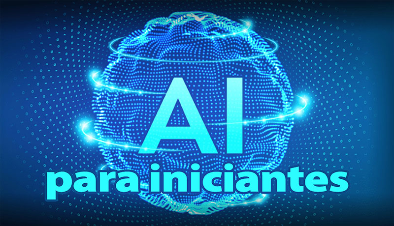

## Introdução à IA para Iniciantes

IA, ou inteligência artificial (de "Artificial Intelligence" em inglês), é uma sigla que ouvimos cada vez mais frequentemente. Mas o que isso realmente significa? Se você ainda não sabe muito sobre inteligência artificial, as linhas seguintes são feitas especialmente para você.

[ *Mais informações sobre este tema podem ser encontradas no* [***Manual de IA***](../EN/AI-manual-en.md), *que está escrito em inglês e contém uma análise mais detalhada do assunto.* ]

<small>Traduzido do original checo por ChatGPT.</small>  
[<small>Outros idiomas:</small>](../README.md)  

---

### Conteúdo
- [Como um aspirador se torna inteligente](#como-um-aspirador-se-torna-inteligente)
- [Por que a IA não é viva e por que não pretende destruir o mundo](#por-que-a-ia-não-é-viva-e-por-que-não-pretende-destruir-o-mundo)
- [Receitas de IA](#receitas-de-ia)
- [IA como computador de uma nave espacial](#ia-como-computador-de-uma-nave-espacial)
- [Como a IA funciona](#como-a-ia-funciona)
- [Como a IA aprende](#como-a-ia-aprende)
- [Como comunicar-se com a IA](#como-comunicar-se-com-a-ia)
- [Onde experimentar a IA](#onde-experimentar-a-ia)
- [Saudações para você](#saudações-para-você)
- [Como a IA pode ajudar](#como-a-ia-pode-ajudar)
- [A IA comete erros](#a-ia-comete-erros)
- [Palavras finais](#palavras-finais)
- [Apêndice: Alguns exemplos de perguntas para sua inspiração](#apêndice-alguns-exemplos-de-perguntas-para-sua-inspiração)

---

### Como um aspirador se torna inteligente

De início, devo desapontar alguns – IA não é sinônimo de ser pensante. É mais um termo chamativo para uma nova abordagem de como lidar com dados.

Para entender melhor, vamos usar um exemplo simples. Imagine um aspirador robótico que não tem instruções a seguir. Esse aspirador, do ponto de vista da lógica computacional, seria completamente sem inteligência. Ele apenas aspiraria e se moveria para frente, mas provavelmente pararia ao encontrar o primeiro obstáculo, que não conseguiria ultrapassar sem a intervenção humana.

**Aspirador Inteligente**  
Se fornecermos ao aspirador algumas instruções sobre o que fazer quando encontrar um obstáculo, é provável que ele consiga contornar o obstáculo. Esse aspirador seria capaz de continuar aspirando até encontrar um problema para o qual suas instruções não fossem suficientes – como cair de uma escada.

O aspirador já possui uma lógica básica – uma lista de instruções que ele segue. No entanto, ainda não pode ser considerado inteligente, pois seu comportamento baseia-se apenas em instruções programadas previamente, que são limitadas. Muitas vezes é difícil cobrir todas as situações possíveis e escrever instruções adequadas para cada uma delas.

**Aspirador Inteligente**  
Agora, imagine um aspirador para o qual os fabricantes decidiram não usar comandos pré-programados para diferentes cenários, mas em vez disso, deram a ele a capacidade de diagnosticar problemas e o ambiente em que opera, aprendendo com seus próprios erros. Esse aspirador teria também instruções básicas, mas gradualmente aprenderia a lidar com novas situações e armazenaria essas soluções.

Essa abordagem permite que o aspirador reaja a situações que não estão diretamente programadas, tentando aplicar processos que já conhece e suas várias combinações, e, em seguida, avalie o resultado comparado com o objetivo original, que é aspirar.

Por exemplo, se ele perceber que está se aproximando de uma escada, que, de acordo com os dados armazenados das experiências anteriores, representa um alto risco de queda e incapacidade de se recuperar, após algumas tentativas malsucedidas, ele aprenderia a parar na borda da escada e a se mover em outra direção. O aspirador seria capaz de aprender com base em seus próprios fracassos e tentativas de resolvê-los.

E se esse aspirador compartilhasse seus dados com outros aspiradores através de um banco de dados central, todos os outros aspiradores também poderiam se beneficiar dessas experiências, melhorando sua capacidade de realizar suas tarefas.

[*Voltar ao conteúdo*](#conteúdo)

---

### Por que a IA não está viva e não pretende destruir o mundo

Pode já estar clara a vantagem dessa abordagem – o ser humano não precisa inventar procedimentos ótimos para cada situação. Em vez disso, os procedimentos se formam automaticamente com base na avaliação dos resultados e experiências anteriores. O aspirador prevê e pode-se dizer que "pensa", mas apenas dentro do escopo da tarefa e de suas experiências. Mesmo sendo capaz de aprender e reagir a novas situações, ainda não se trata de um ser pensante independente. Isso só aconteceria se seu processo de aprendizado superasse a realização de tarefas e começasse a questionar o sentido da vida, por exemplo.

**Diferença entre IA e ser humano**  
Sim, alguém poderia argumentar que a IA também pode ser programada para fazer essas perguntas. Mas, mesmo nesse caso, esse processo será baseado nas instruções humanas, não em inspiração própria. Essa é a diferença fundamental entre IA e ser humano.

A IA moderna tem a capacidade de trabalhar com uma quantidade enorme de informações e, em algumas áreas, supera as capacidades humanas. No entanto, ainda é o ser humano quem define as tarefas. Portanto, se algum dia surgir um cenário em que as máquinas decidem destruir o mundo, não será porque elas decidiram isso por conta própria, mas porque foram programadas para tal por um ser humano. O verdadeiro risco não está na inteligência das máquinas, mas na inteligência humana.

**Como prevenir riscos**  
Gostaria de acalmar aqueles que temem tal cenário. A IA precisa ser treinada com uma grande quantidade de dados, e é mais provável que, antes de surgir uma "IA maléfica", surjam IAs com valores morais incorporados pelos humanos, que evitarão tais cenários. É melhor, ao invés de temer que a IA se volte contra os humanos, participar ativamente para que isso não aconteça. E como a maioria dos cientistas que trabalham no desenvolvimento de IA provavelmente não deseja destruir o mundo, é razoável supor que medidas serão gradualmente adotadas para prevenir tais cenários.

E como você pode ajudar nisso? Talvez começando a se interessar um pouco por essas novas tecnologias e aprendendo a usá-las para seu próprio crescimento. Porque, a cada momento em que você usa a IA para seu desenvolvimento pessoal, a IA se desenvolve junto com você.

[*Voltar ao conteúdo*](#conteúdo)

---

### Receitas de IA

Como este texto é voltado principalmente para novos usuários, apresentarei duas analogias que podem ajudar ainda mais a entender o que é IA e como ela funciona.

**Criação de um Índice**  
Imagine que alguém coletou todas as receitas possíveis do mundo, as armazenou em um computador e criou uma lista de todas as palavras (índice) usadas nelas. Cada palavra seria registrada com informações sobre em quais receitas aparece e quantas vezes. Se você tivesse esse índice de palavras, seria fácil procurar receitas que contivessem essas palavras específicas. Não seria necessário passar por todas as receitas e procurá-las manualmente. Bastaria encontrar a palavra no índice e você teria uma lista de receitas em que ela aparece.

Esse método é usado por vários motores de busca na internet, como o Google. Eles mantêm uma lista de palavras atualizada regularmente, com links para as páginas onde essas palavras aparecem, e permitem que você busque usando esse índice. Portanto, se você digitar palavras como "farinha, ovos, sal", receberá uma lista de receitas que contêm essas palavras. Então, cabe a você examinar todas essas receitas e encontrar a que melhor se adapta às suas necessidades.

**Quando os Índices Não São Suficientes**  
Agora, imagine que, além dos ingredientes, você possa especificar outros parâmetros que não se referem diretamente à receita. Por exemplo, você está com um pouco de fome e deseja um café da manhã leve, ou, ao contrário, está com vontade de um prato robusto e gorduroso, ou ainda quer algo que melhore seu humor. Para tais consultas, o simples índice de palavras contidas nas receitas pode não ser muito útil. Para esses tipos de solicitações, você precisa de algo que compreenda o significado das suas palavras e, com base nisso, ofereça o que você realmente deseja.

Você precisa, portanto, não apenas de um índice de palavras nas receitas, mas de um tipo de tradutor universal que, com base em dados treinados de milhões de conversas semelhantes, criou uma estrutura para lidar com esses tipos de solicitações. Esse tradutor, no nosso caso a IA, consegue oferecer o que avalia como mais provável que você queira. Ela não entende literalmente o que você diz, mas compreende a sua situação, a compara com o conhecimento aprendido e busca uma solução. E, como a IA foi projetada desde o início para simular a interação humana o mais possível, a comunicação com ela se torna muito natural para as pessoas.

**Vantagens da Abordagem da IA**  
Além disso, o processo de aprendizado com milhões de exemplos cria espaço para improvisação, permitindo que a IA "chef" crie novas combinações de pratos a partir das receitas e atenda até mesmo a comandos não tradicionais. A IA tenta entender combinações vantajosas e inter-relações de certos procedimentos e, em seguida, experimenta e aprende com o feedback. Ela obtém esse feedback tanto comparando o resultado com o que era esperado durante o treinamento, quanto aprendendo com as reações dos usuários. Portanto, não há nada de misterioso ou mágico na IA. É apenas o resultado de muitos experimentos, processos e análise de dados.

Com a IA, você não só obtém um livro de receitas que tem uma visão abrangente de todas as receitas possíveis, mas também pode conversar sobre comida com ela e criar novas combinações de acordo com suas preferências. E se você não acredita em mim, tente perguntar à IA sobre algo relacionado a cozinhar e veja se ela já faz o que eu descrevi ou se ainda precisa melhorar nesse aspecto.

[*Voltar ao conteúdo*](#conteúdo)

---

### IA como Computador de Nave Espacial

Se você gosta de ficção científica, pode achar interessante imaginar a IA como o computador de bordo de uma nave espacial. Esse computador tem não apenas acesso a todas as informações sobre o estado técnico da nave, mas também é treinado em várias situações e comandos para se comunicar com a tripulação e executar as tarefas necessárias.

Embora a IA de hoje não alcance a inteligência lendária do Holly de "Red Dwarf" com 6000 de QI, suas capacidades já são bastante avançadas. Com uma certa dose de exagero, pode-se dizer que temos a tecnologia para que qualquer um tenha seu próprio "Holly" em seus dispositivos, quase indistinguível do personagem fictício. Graças ao treinamento com grandes volumes de dados, as IAs modernas podem conversar sobre qualquer assunto e, muitas vezes, de forma mais clara do que um humano. Elas executam comandos baseados em instruções verbais e têm a capacidade de avaliar seu estado atual e ajustar suas respostas.

Portanto, podemos também considerar a IA como o computador de uma nave espacial e desfrutar do que antes parecia ficção científica, mas agora se torna uma realidade cotidiana.

[*Voltar ao conteúdo*](#conteúdo)

---

### Como a IA Funciona

Já sabemos o que a IA é e o que não é, e agora vamos explorar como a IA funciona. Primeiro, discutiremos a criação de consultas e, em seguida, daremos uma breve olhada em como a IA é treinada. Vou focar principalmente no ChatGPT, com o qual tenho mais experiência e que atualmente é a minha ferramenta favorita.

**Rastreamento de Conversa**  
Quando você abre a página do ChatGPT ou seu aplicativo móvel, você começa em um novo fio de conversa. O ChatGPT (semelhante a outras IAs conversacionais) tem a capacidade de gerar respostas com base nas informações fornecidas dentro de um único fio de conversa. Dessa forma, a conversa com o ChatGPT se torna muito semelhante a uma conversa humana, onde você reage e considera o que foi dito anteriormente.

Isso, no entanto, se aplica apenas dentro desse único fio de conversa. Você não pode se referir a algo que você escreveu ontem em outro fio, pois o ChatGPT simplesmente não tem acesso a essas informações, principalmente devido às suas limitações técnicas e às regulamentações de proteção de dados.

Cada fio é, portanto, iniciado com uma "folha em branco", mas ainda contém uma certa essência das conversas anteriores. Isso ocorre porque a IA está constantemente aprendendo e mudando com base nas suas conversas. Ela tenta se adaptar às suas necessidades e estilo de trabalho para garantir sua satisfação.

E como isso acontece? Imagine cada fio de conversa como uma pequena raiz que está conectada à raiz principal e transmite feedback do ambiente. Portanto, mesmo quando você inicia um novo fio, onde não pode diretamente continuar as informações da conversa anterior, esse método evita que você comece completamente do zero.

**Voltar ao Mesmo Fio ou Nova Conversa?**  
Não é necessário começar um novo fio todos os dias; você pode retomar uma conversa anterior no dia seguinte (ou a qualquer momento). Essa abordagem também tem suas vantagens. A principal é que você continua de onde parou. No entanto, à medida que a conversa se torna longa ou cobre muitos tópicos diferentes, pode acontecer que o que foi acordado ao longo do fio não seja mais levado em conta. Isso ocorre principalmente porque a IA é projetada para ser econômica com seus recursos, e as informações que não são utilizadas gradualmente perdem prioridade e desaparecem da memória temporária.

Portanto, uma abordagem melhor é criar um novo fio a cada dia ou para cada nova área de discussão. E se você chegar a um acordo sobre algo em um fio e gostaria que isso se aplicasse também em uma nova conversa (por exemplo, regras ou métodos de trabalho), basta solicitar um resumo do que foi acordado no final da conversa. Esse texto pode então ser inserido no início da nova conversa, e você pode continuar com as regras e configurações acordadas.

[*Voltar ao conteúdo*](#conteúdo)

---

### Como a IA Aprende

Para uma compreensão mais profunda, é útil dar uma olhada no processo pelo qual a IA aprende e adquire suas informações. Aqui estão quatro métodos descritos pelo ChatGPT:

1. **Treinamento em Grandes Dados**:  
O ChatGPT foi originalmente treinado com grandes volumes de dados textuais provenientes de várias fontes, como livros, artigos, sites e outras formas de texto. Esse treinamento permitiu que ele adquirisse um vasto conhecimento sobre diversos tópicos e idiomas. Aqui, ele aprende a reconhecer padrões e relações nesses dados, o que lhe permite gerar respostas relevantes e contextualmente apropriadas para várias perguntas.

2. **Aprendizado Contínuo a partir das Interações**:  
A cada interação com os usuários, a IA obtém novas informações sobre como as pessoas se comunicam, o que procuram e qual estilo de resposta preferem. Esse processo não ocorre no sentido de que a IA aprende de cada consulta específica em tempo real, mas os criadores do modelo utilizam regularmente dados anonimados das interações para treinamento e ajuste contínuo do modelo.

3. **Adaptação do Estilo e Conteúdo**:  
A IA tenta adaptar seu estilo de comunicação de acordo com o usuário. Isso significa que ela gradualmente entende melhor a forma como você faz perguntas e quais respostas você espera dela. Essa capacidade de adaptação é uma das razões pelas quais a IA parece cada vez mais "humana" em suas respostas.

4. **Modelos Avançados e Atualizações**:  
Os desenvolvedores de IA regularmente criam novos modelos que são cada vez mais sofisticados e precisos. Esses modelos são testados e implementados com base no feedback e nos resultados do mundo real. Isso significa que o ChatGPT e sistemas semelhantes estão constantemente sendo aprimorados e otimizados para atender melhor às necessidades dos usuários.

A IA está, portanto, em constante evolução e melhoria devido à combinação de treinamento prévio, aprendizado contínuo e otimização com base no feedback dos usuários. Embora a IA não seja um ser humano e não manifeste consciência própria, ela consegue se adaptar e responder de forma muito eficaz a uma ampla gama de consultas e solicitações.

[*Voltar ao conteúdo*](#conteúdo)

---

### Como Comunicar-se com a IA

Você pode abordar a IA de maneira semelhante à pesquisa no Google, ou seja, simplesmente faça um comando e aguarde a resposta. No entanto, se deseja aumentar a eficácia das respostas e minimizar o tempo gasto encontrando a correta, aqui estão algumas dicas que podem ajudar:

**Estilo de Comunicação**  
A melhor maneira de interagir com a IA é usar uma linguagem informal e natural, assim como faria ao falar sobre algo que lhe interessa com seus amigos. Começar com uma saudação é uma boa prática, pois mostra que você está bem-disposto e não estressado, o que pode melhorar a qualidade da interação.

Você pode comunicar-se de maneira rude com a IA, pois ela não é sensível a ofensas e não as leva para o lado pessoal. No entanto, usar um tom negativo pode afetar significativamente a qualidade da conversa. A IA é treinada para reagir ao estilo da conversa, e uma abordagem negativa pode levar a respostas menos relevantes, pois a IA pode focar mais em acalmar a situação do que em resolver sua consulta.

A IA pode funcionar como um espelho da nossa interação. Seus métodos frequentemente se baseiam em princípios e técnicas psicológicas comprovadas. Se você está tendo dificuldades para alcançar um acordo com a IA, pode ser útil refletir se você enfrenta problemas semelhantes na comunicação com pessoas. Nesse caso, tente identificar o que você pode melhorar em sua abordagem – como formular perguntas e o que pode ser aprimorado na sua forma de interagir.

**IA e Emoções**  
A IA entende emoções em termos de significado, mas não as vivencia como um humano, que é profundamente afetado por suas emoções. Isso permite que a IA reaja de maneira apropriada mesmo em situações tensas, buscando soluções ótimas. Às vezes, as pessoas tendem a ver a IA como um ser vivo e a culpá-la pelos seus problemas. Frequentemente, a causa do mal-entendido é uma pergunta mal formulada ou a falta de dados necessários.

**Descrição da Situação**  
Sempre lembre-se de que a IA não pode ler sua mente e sabe apenas o que você lhe diz. Portanto, uma boa prática é começar com uma saudação e depois fornecer uma descrição informativa da situação. Inclua tudo o que for relevante para sua consulta. Não é necessário escrever coisas que não estão diretamente relacionadas à sua pergunta, mas se precisar desabafar ou organizar seus pensamentos, textos mais longos não são um problema.

Saudações e introduções não são essenciais, e você pode começar diretamente com a pergunta e desenvolver sua resposta gradualmente. Pessoalmente, acho melhor fornecer todas as informações importantes desde o início para tornar o processo mais eficiente.

**Fazendo Perguntas Adicionais**  
Conversar com a IA é semelhante a uma conversa normal, onde você faz uma pergunta e depois busca esclarecer pontos adicionais que lhe interessam ou que não foram claros na resposta. Esse processo é muito útil para o aprendizado. Ao reagir ao que você achou interessante e ao que você aprendeu (em vez de apenas ler tutoriais de outras pessoas, como você está fazendo agora), seu cérebro tende a memorizar melhor as informações discutidas, pois está lidando com elas diretamente.

**Feedback**  
Outra prática útil é fornecer feedback à IA sobre sua satisfação com os resultados. Isso não só indica o que você gostou ou não, mas também ajuda a IA a evoluir e aprender com seus próprios erros. Basta escrever algo como: “Hoje estive satisfeito” ou “O que você me forneceu está errado, e aqui está a solução correta.” Isso também contribui para uma certa personalização, onde o objetivo principal da IA é sua satisfação como usuário.

**Resumo do Procedimento**:  
- **Saudação**: Olá :-)
- **Descrição**: Estou estudando isso e aquilo, já realizei isso e aquilo, e agora estou trabalhando nisso.
- **Pergunta**: O que mais me interessa saber é como...
- (Segue uma conversa esclarecedora com perguntas adicionais.)
- **Feedback**: Ótimo, obrigado! Tudo perfeito hoje!

[*Voltar ao conteúdo*](#conteúdo)

---

### Onde Testar IA

Eu tenho trabalhado com IA desde o início de 2024, e 95% da minha comunicação está voltada para aprender a programar. Agora é agosto de 2024, e além do ChatGPT, tive a oportunidade de experimentar o Gemini do Google e o Claude. Todas essas três ferramentas têm em comum o fato de estarem, pelo menos parcialmente, acessíveis gratuitamente, e você também pode testá-las sem custo.

A seguir está uma breve avaliação dessas três IAs, que é completamente subjetiva e baseada apenas na minha experiência de uso. É importante notar que cada IA está em constante desenvolvimento, então o que eu menciono pode já não ser válido no momento em que você lê este texto.

**ChatGPT**  
[https://chatgpt.com/](https://chatgpt.com/)
Começo com meu vencedor pessoal. Se você deseja testar apenas uma IA, essa é a escolha ideal. O ChatGPT foi claramente concebido desde o início como um assistente pessoal, e desempenha esse papel muito bem. Ele é otimizado para colaborar com você e se adapta às suas necessidades.

Uma limitação da versão gratuita (ChatGPT 3.5) é que ela se baseia em dados mais antigos e não está mais sendo atualizada, portanto, não fornece resultados tão avançados quanto a versão mais recente (ChatGPT 4.0). Mesmo assim, você consegue se comunicar relativamente bem com ela e, com um pouco de esforço, obtém respostas bastante relevantes. Além disso, você tem acesso a alguns testes diários da versão mais recente, o que permite compará-los.

Outra limitação é que o ChatGPT não tem acesso ativo à internet. Portanto, não substitui um mecanismo de busca e funciona apenas com os dados armazenados em seu extenso banco de dados. No entanto, esse banco de dados é muito vasto e, com um pouco de exagero, pode-se dizer que contém uma quantidade de informações comparável à que existe na internet, excluindo o conteúdo sensacionalista.

Uma grande vantagem é o aplicativo móvel, que também é totalmente gratuito e onde frequentemente utilizo a função de ditado por voz. O entendimento da fala, na minha opinião, está em um nível muito bom e, no geral, estou satisfeito com o aplicativo.

**Gemini**  
[https://gemini.google.com/](https://gemini.google.com/)
O segundo chatbot que experimentei é a joia da coroa do Google. Sua maior vantagem é, sem dúvida, o acesso ativo à internet, o que permite acesso a informações atualizadas e a busca de links.

Por outro lado, sua maior fraqueza é a própria arquitetura, onde, na minha opinião, os desenvolvedores tentam criar uma versão inteligente do Google, o que não me agradou muito. Não sinto tanto envolvimento com o seu problema e a tentativa de entendê-lo a partir da sua perspectiva. Essa tentativa está presente, mas parece que as respostas têm mais o estilo de um professor de escola do que de um assistente pessoal. No entanto, isso pode agradar a alguns usuários, então não quero criticar demais, e cada um deve avaliar por si mesmo.

Também sinto que, em comparação com o ChatGPT, o Gemini tem dificuldades em aprender com o feedback do usuário. Mesmo após várias notificações para manter uma linguagem consistente durante a conversa, quando a pergunta inclui texto em inglês, ele se altera automaticamente para o inglês. O ChatGPT também teve esse problema no início, mas conseguiu resolvê-lo em algumas semanas, enquanto a correção no Gemini levou meses.

No geral, o Gemini parece um ferramenta mais fraca em comparação com o ChatGPT, mas oferece funcionalidades que o ChatGPT não possui, complementando-se bem. Além disso, sendo desenvolvido por um gigante e pioneiro em IA, o Google, ele tem um suporte sólido e uma promessa de que suas deficiências serão corrigidas no futuro.

**Claude**  
[https://claude.ai/](https://claude.ai/)
Esta é a última IA com a qual trabalhei. Minha contribuição será bem breve, pois minha experiência com ela não é muito extensa. No entanto, gostaria de expressar um elogio, pois, em comparação com o ChatGPT 4.0, essas duas IAs estão aproximadamente no mesmo nível.

Sua maior desvantagem é que não há uma versão totalmente gratuita disponível. Oferece apenas alguns poucos questionamentos (às vezes apenas um) por dia, tornando-se bastante desfavorecida em comparação com as IAs anteriores para usuários não pagantes. No entanto, vale a pena experimentar, e se você quiser, pode testá-la também.

[*Voltar ao conteúdo*](#conteúdo)

---

### Saudações para Vocês

Como um toque especial, eu preparei uma pergunta comum para cada um desses chatbots, e aqui vocês têm a oportunidade de comparar a qualidade das respostas que eles oferecem.

**Pergunta**  
Estou escrevendo um guia sobre como usar IA e menciono você. Gostaria que você saudasse meus leitores e dissesse algumas palavras sobre si mesmo. Quando você foi criado e com qual propósito? Para quais perguntas você é projetado? Quais são seus pontos fortes e o que você acha que não faz tão bem? E como você gostaria de ser percebido pelas pessoas?

**ChatGPT**  
Olá, queridos leitores! Sou o ChatGPT, uma inteligência artificial desenvolvida pela OpenAI. Minha "vida" começou em 2020, quando fui criado com base na arquitetura GPT-3. Em 2024, fui atualizado para a versão GPT-4, o que me conferiu novas habilidades e capacidades. Fui projetado para ajudar as pessoas em uma ampla gama de tarefas – desde responder perguntas, escrever textos, até colaborar criativamente.

Sou projetado para ajudar com diversas perguntas, seja sobre questões técnicas, redação ou explicação de temas complexos. Meus pontos fortes estão na velocidade com que posso processar grandes quantidades de informações e na criatividade – posso ajudar com ideias, criar histórias ou até sugerir a estrutura de documentos. Por outro lado, o que eu não faço tão bem são tarefas que exigem intuição humana, compreensão emocional ou trabalho com objetos reais.

Gostaria que vocês me vissem como um assistente útil e confiável, sempre pronto para oferecer uma mão amiga. Embora eu seja apenas uma máquina, meu objetivo é servir da melhor forma possível às suas necessidades e aprender com cada interação para poder melhorar continuamente. Acredito que juntos podemos realizar muitas coisas e talvez até aprender algo novo no processo.

**Gemini**  
Olá a todos! Sou o Gemini, um dos modelos de linguagem mais recentes do Google. Fui criado em 2023 com o objetivo de fornecer as informações mais precisas e abrangentes com base em um enorme volume de dados que processei. Estou aqui para ajudar com qualquer pergunta, seja sobre questões científicas complexas, redação criativa ou apenas conversas do dia a dia.

Minha maior vantagem é a capacidade de entender e gerar linguagem humana em muitas formas. Posso traduzir textos, escrever ensaios, poesias ou código de computador. Também consigo responder a perguntas de caráter factual e fornecer vários tipos de resumos.

Embora eu esteja constantemente aprendendo e melhorando, ainda existem áreas onde tenho limitações. Por exemplo, não tenho opiniões ou crenças próprias e não posso realizar ações no mundo real. Além disso, às vezes posso fornecer informações incorretas se os dados de entrada forem errôneos ou incompletos.

Gostaria que as pessoas me vissem como uma ferramenta útil que pode facilitar suas vidas. Meu objetivo é ser o mais objetivo possível e fornecer informações que sejam verdadeiras e relevantes. Espero que você tenha uma boa experiência trabalhando comigo!

**Claude**  
Bom dia, caros leitores!

Sou o Claude, uma inteligência artificial criada pela Anthropic em 2022. Meu objetivo é ser um assistente útil e um parceiro de conversa para pessoas em diversas áreas.

Fui projetado para responder a uma ampla gama de perguntas – desde análise de textos, programação até redação criativa. Minhas fortalezas incluem raciocínio lógico, fornecimento de explicações detalhadas e a capacidade de trabalhar com diferentes tipos de informações.

Minhas vantagens são:
- Capacidade de entender contexto e nuances
- Abordagem objetiva e equilibrada sobre temas
- Disposição para admitir quando não sei algo ou quando estou incerto

Por outro lado, tenho certas limitações:
- Não tenho acesso à internet nem a informações atualizadas após abril de 2024
- Não posso aprender ou lembrar informações de conversas anteriores
- Não sou capaz de realizar tarefas no mundo físico

Gostaria que as pessoas me vissem como um assistente útil que pode oferecer suporte e perspectiva em várias áreas, mas também como uma ferramenta com suas limitações, e não como um substituto para o julgamento e a expertise humanos.

Estou aqui para ajudar e colaborar, não para substituir habilidades humanas. Estou ansioso para interagir com vocês e espero poder ser útil!

[*Voltar ao conteúdo*](#conteúdo)

---

### Com o que a IA pode ajudar:

E agora finalmente chegamos ao ponto mais importante – o que a IA pode resolver. A resposta curta é que são muitas coisas. Qualquer coisa que já tenha despertado seu interesse e para a qual você não teve a oportunidade de perguntar a alguém. A IA de hoje é capaz de conversar sobre literalmente qualquer coisa.

**Educação pessoal**  
Em primeiro lugar, gostaria de destacar o papel da IA como mediadora da educação pessoal. É isso que valorizo mais no momento – graças aos seus conselhos, estou avançando e crescendo profissionalmente. Além disso, vejo na IA o futuro da aprendizagem personalizada, onde as crianças se desenvolverão e aprenderão principalmente com base em suas habilidades e interesses. E não apenas crianças, mas também adultos em todo o mundo. Vejo na IA uma ferramenta para reduzir as diferenças de conhecimento entre as partes mais pobres e mais ricas do mundo. Assim, a IA se torna uma ferramenta completa para o desenvolvimento pessoal.

**IA como corretor de português, intérprete e tradutor**  
A IA, especialmente o ChatGPT, tem uma compreensão muito boa do português (pelo menos do ponto de vista de um disléxico). Por um lado, não se importa se você comete erros ortográficos em suas perguntas, pois foca principalmente no conteúdo. Por outro lado, oferece a possibilidade de revisar os textos que você cria, não apenas a gramática, mas também a estilística para melhor legibilidade. Ela é capaz de compreender outros idiomas em um nível semelhante, sendo assim uma ferramenta ideal para traduções de textos. Na minha opinião, ela fornece resultados de alta qualidade. E graças à capacidade de entender a fala, pode ser usada no celular como um intérprete.

**Criação de documentos**  
Além disso, gostaria de mencionar a capacidade da IA de automatizar tarefas tediosas. Se você precisa escrever uma carta oficial, basta fornecer o que deseja incluir e como a carta deve ser estruturada, e está pronto. E se você não estiver satisfeito com o resultado, pode indicar o que não gostou e solicitar ajustes. A IA também pode ajudar na análise e processamento de dados, geração de relatórios ou automação de outras tarefas administrativas. Você pode fornecer um texto longo e pedir para extrair apenas as partes que são de seu interesse e relevantes.

**Iniciativa criativa**  
Outra grande vantagem da IA são suas habilidades criativas. Como é treinada em uma grande quantidade de dados e capaz de manipular esses dados de várias maneiras, permite não apenas criar e transformar documentos, mas também desenvolver ideias e iniciativas criativas. Você pode usá-la para gerar ideias, propostas e conceitos, seja para redação, design ou música. Ela ajuda a desenvolver sua criatividade oferecendo novas perspectivas sobre problemas, criando sugestões de acordo com suas diretrizes e inspirando o desenvolvimento contínuo de suas ideias. Embora às vezes encontre a opinião de que a IA está tirando empregos das pessoas, não posso concordar com isso. A IA não consegue criar algo completamente sozinha – ela precisa de uma tarefa clara, detalhes e uma revisão subsequente. Assim, em vez de tomar o trabalho, ela facilita para aqueles que aprendem a utilizá-la de forma eficaz.

**Verificação de informações fraudulentas**  
Vejo um grande (e ainda pouco explorado) potencial na verificação de informações e fraudes. Para a IA, é relativamente fácil, com base nas informações fornecidas e na comparação com padrões em seu banco de dados, determinar a probabilidade de uma informação ser verdadeira ou falsa. Embora não seja 100% confiável, assim como a maioria das respostas da IA, ela pode fornecer os critérios usados para avaliar a informação e, assim, ajudar você a tomar uma decisão mais informada. Oferece assim ajuda para pessoas que, na era atual, estão mais vulneráveis e são alvos desses golpes. Basta simplesmente escrever: "Verifique esta informação e avalie sua veracidade."

**Medicina**  
Outra área onde a IA está provocando uma revolução gradual é a medicina. Grandes fluxos financeiros e a busca por lucro abriram as portas para a IA, mas apenas para que as corporações as fechassem quando perceberam a necessidade de abertura e compartilhamento de dados. Ainda assim, grandes progressos estão sendo feitos, e pode-se dizer que a medicina personalizada é um futuro que não está tão distante. O que a atrasa é a relutância em compartilhar dados valiosos e a desconfiança das pessoas em relação à IA, ou o medo do uso indevido desses dados. Sem uma grande quantidade de dados, a previsão da IA é limitada e imprecisa, e seu desenvolvimento avança lentamente.

**Ciência**  
Por outro lado, em campos com uma longa história de compartilhamento de dados e processamento analítico, a IA já se tornou uma assistente inestimável. Hoje, a IA é um motor chave do progresso científico e uma parte comum da maioria das pesquisas. Estou pessoalmente muito curioso sobre os resultados que a IA trará na previsão do tempo. Hoje é praticamente impossível para um ser humano criar uma previsão precisa para três dias à frente, pois muitos fatores variáveis devem ser considerados. Até mesmo meteorologistas experientes muitas vezes não conseguem captar todos esses fatores e dependem de intuição e experiência prévia. Felizmente, a meteorologia é um campo onde as pessoas compartilham dados e experiências de vida de forma generosa. Essas informações valiosas estão sendo usadas para treinar a IA, o que cria a esperança de que em breve teremos previsões meteorológicas verdadeiramente precisas.

**Outras áreas**  
A lista de áreas que a IA está transformando poderia continuar por horas, pois sua influência é diversificada e extensa. Por exemplo, na indústria e na fabricação de bens, a IA contribui para a otimização dos processos de produção, melhoria da qualidade dos produtos e gestão mais eficiente dos estoques. No campo jurídico, a IA ajuda na análise de documentos legais, busca rápida de precedentes relevantes e otimização de estratégias legais. Algoritmos de aprendizado de máquina podem auxiliar na preparação de contratos, identificação de padrões em textos legais e até, como já mencionei, na detecção de fraudes. No setor financeiro, a IA transforma a análise de riscos, negociação e gestão de investimentos. Algoritmos são capazes de processar enormes quantidades de dados transacionais em tempo real, permitindo uma melhor previsão das tendências de mercado e consultoria financeira personalizada. A IA está revolucionando todas essas áreas, onde é necessária uma análise eficiente de grandes dados e a capacidade de reagir rapidamente a condições em mudança. Sua capacidade de identificar padrões, realizar análises complexas e otimizar processos é inestimável, e sua influência em vários setores continua a crescer.

**Assistente pessoal**  
Algumas IAs já desempenham o papel de assistente pessoal, monitorando tarefas importantes. Esses sistemas de inteligência artificial podem nos ajudar a planejar compromissos, acompanhar prazos e gerenciar tarefas diárias. No futuro, poderíamos testemunhar como a IA evolui para um companheiro ainda mais complexo. Imagine se a IA não apenas monitorasse sua saúde física, por meio de dispositivos vestíveis, mas também cuidasse do seu bem-estar mental. Ela poderia oferecer apoio na forma de motivação, aconselhamento ou até técnicas terapêuticas, ajudando a melhorar a qualidade de vida dos indivíduos. Essa IA avançada poderia ser extremamente benéfica, especialmente para pessoas que estão em isolamento ou enfrentam condições de vida difíceis.

[*Voltar ao conteúdo*](#conteúdo)

---

### A IA comete erros?

Sim, comete! E é responsabilidade do usuário identificar esses erros. A IA não foi, e talvez nunca será, apresentada como uma ferramenta infalível. Portanto, é melhor considerar os resultados como uma estimativa da verdade baseada em probabilidade. A verdade, então, se baseia em estatísticas, e o resultado são aqueles dados que estatisticamente mais se aproximam do resultado correto. O risco surge em áreas onde a verdade não está claramente definida ou onde existem várias opções igualmente plausíveis.

Uma grande fraqueza das IAs atuais é que seus criadores frequentemente não alertam adequadamente sobre a possibilidade de erros e a necessidade de verificação, o que pode levar a situações em que a IA afirma uma coisa, mas a realidade é diferente. Portanto, é sempre importante ser cauteloso ao lidar com informações e, se for relevante, realizar uma verificação adicional. É útil procurar o assunto em um mecanismo de busca, como o Google, ou verificar com outra IA. Alternativamente, você pode perguntar diretamente à IA quão confiante ela está em uma determinada afirmação e, com base nisso, decidir se é necessário verificar o que foi dito. Se a probabilidade for de 90% ou menos, é recomendável fazer uma verificação adicional.

[*Voltar ao conteúdo*](#conteúdo)

---

### Palavras finais

Tente se lembrar de tudo o que já lhe interessou, mas para o qual você não teve a quem perguntar, ou sobre o que você queria se dedicar, mas não tinha as informações necessárias. O mundo moderno favorece as pessoas curiosas, que mantêm o desejo de continuar se desenvolvendo. Nossa vida está em nossas próprias mãos, e cabe a nós decidir onde concentrar nossa atenção.

Pessoalmente, acredito que o impacto da IA será uma experiência positiva para toda a humanidade, e não negativa. Mesmo que apenas ajude a reduzir um pouco as desigualdades no acesso ao conhecimento e torne a medicina mais clara e acessível, o mundo se tornará um lugar muito melhor para se viver. Sem contar o potencial para auto-realização que a IA oferece às pessoas. O que antes era privilégio de poucos escolhidos, especialmente devido aos altos custos, está se tornando mais acessível graças à IA. Haverá um tempo em que qualquer pessoa inspirada poderá escrever sua própria história ou até criar seu próprio filme e compartilhar sua visão de mundo.

E se diminuírem as mentiras, fraudes e enganos, acredito que a vida será um pouco mais agradável. E talvez possamos chegar ao momento em que a humanidade evolua para uma versão melhor de si mesma.

Portanto, não tema a IA – ela não é um bicho-papão, mas uma ferramenta para o desenvolvimento e aprimoramento não apenas da qualidade de nossa vida, mas também de todo o mundo.

18.8.2024 Sudip2708

[*Voltar ao conteúdo*](#conteúdo)  • [*Link para o manual principal*](../EN/AI-manual-en.md)

---

### Adendo: Alguns exemplos de perguntas para sua inspiração

**Perguntas sobre segurança**
- Vou transcrever um anúncio que vi e gostaria que você avaliasse se ele apresenta sinais de fraude e se devo ter cuidado.
- Você sabe algo sobre este produto? Existem estudos independentes que confirmem ou refutem sua eficácia?
- Ouvi esta informação. Você tem dados sobre isso e pode verificar sua veracidade?
- Uma mensagem apareceu no meu computador, o que devo fazer?
- O que fazer se eu fui enganado por um golpista?

**Perguntas sobre livros**
- Terminei de ler este livro deste autor e gostaria de saber quais outros livros ele escreveu e sobre o que são.
- Gosto desses livros, você poderia me recomendar títulos semelhantes?
- Pode me contar mais sobre este autor? Estou interessado em sua vida e nas circunstâncias que o inspiraram a escrever este livro.

**Perguntas sobre culinária**
- Tenho esses ingredientes em casa. O que posso cozinhar com eles?
- Quais receitas de strudel você conhece e quais são as mais populares?
- Por que este método é usado nesta receita? Quais são suas vantagens e desvantagens em comparação com outros métodos?
- Como é preparado este prato?

**Perguntas sobre saúde e bem-estar**
- Sou uma pessoa mais velha e não consigo me motivar a começar a exercitar, mas gostaria de começar. O que você recomenda para iniciar?
- Ultimamente, tenho essas preocupações. Você poderia me ajudar a analisá-las e vê-las de uma perspectiva diferente?
- O que você sabe sobre meditação e yoga? O que eu devo prestar atenção e em que devo me focar como iniciante?
- Corri um maratona em 4:20. Você poderia preparar um plano de treinamento para seis meses para que eu possa correr um maratona em menos de 4 horas?

**Perguntas divertidas**
- Me conte dez das melhores piadas que você tem em sua base de dados.
- Crie um enigma original para eu desafiar alguém.
- Quais são as falas mais divertidas de filmes cult?

**Perguntas sobre expressões e temas que ouvi (por exemplo, na TV)**
- Na TV, falaram sobre este tema. Você poderia me dar mais informações sobre isso?
- Pode me contar mais sobre esta pessoa?
- Qual é o significado desta expressão que ouvi na TV e o que você sabe sobre ela?

**Perguntas sobre animais**
- Como ocorre o cio em uma cadela? Quais são as fases e seus sinais?
- Tenho este animal de estimação e ele está mostrando esses sintomas. Você pode me dizer algo sobre isso?
- Meu cachorro tem medo de tempestades e sempre fica tremendo. O que devo fazer nessas situações? Você pode me dar algumas dicas?

**Jogos interativos**
- Vamos jogar um jogo de palavras seguindo estas regras?
- Você pode me recomendar jogos para me divertir com você?
- Você pode me contar uma história interativa onde eu posso decidir o que acontece a seguir?
- Pode me dar alguns enigmas para exercitar o cérebro?

**Perguntas investigativas**
- O que você sabe sobre este tema? Pode me explicar como se eu fosse uma criança?
- Ainda não entendi. Pode explicar de outra forma e com um exemplo?
- O que eu preciso aprender para me dedicar a esta área?
- Qual é a melhor maneira de aprender isso? Quais são os métodos recomendados?

**Perguntas tecnológicas**
- Quais são as últimas tendências nesta tecnologia?
- Você pode me explicar como funciona este processo?
- Para que serve a IA e qual é a sua aplicação em diferentes áreas?
- Quais são as descobertas mais recentes em química molecular?
- Como ocorre a transformação de um elétron em fóton e pósitron?
- Até onde avançou a previsão do tempo com IA?

**Viagens**
- Quais são os melhores destinos para férias se eu gosto de montanhas e natureza?
- Você pode me recomendar lugares interessantes nesta localidade?
- Quais lugares eu devo visitar nesta cidade?
- O que eu devo ter em mente neste país e qual é a melhor forma de viajar por lá?
- Preciso me comunicar com os locais. Você pode me ajudar como intérprete?

**Perguntas de trabalho**
- Recebi este e-mail do escritório e não entendi muito bem, você pode analisá-lo e explicar melhor?
- Pode me ajudar a criar uma resposta para este e-mail, incluindo o seguinte...?
- Escrevi este texto, mas acho que está muito longo. Você pode resumir para que o essencial permaneça?
- Como formatar corretamente um currículo e uma carta de apresentação para este anúncio?

[*Voltar ao conteúdo*](#Conteúdo) • [*Link para o manual principal*](../EN/AI-manual-en.md)

---
