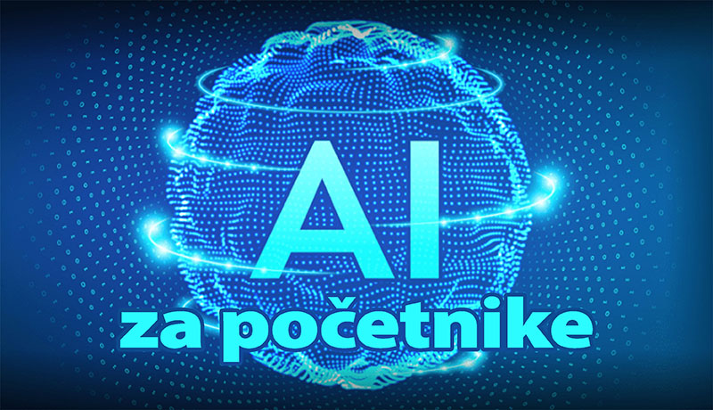

## Introducere în AI pentru începători

AI sau inteligența artificială (din engleză "Artificial Intelligence") este o abreviere pe care o auzim din ce în ce mai des astăzi. Dar ce înseamnă de fapt? Dacă nu știți încă prea multe despre inteligența artificială, rândurile următoare sunt destinate tocmai pentru voi.

[*Mai multe informații pe acest subiect găsiți în* [***Manualul AI***](../EN/AI-manual-en.md), *care este scris în engleză și conține o analiză mai detaliată a subiectului.*]

<small>Tradus din originalul ceh de ChatGPT.</small>  
[<small>Alte limbi:</small>](../README.md)  

---

### Conținut
- [Cum devine un aspirator inteligent](#cum-devine-un-aspirator-inteligent)
- [De ce AI nu este vie și de ce nu vrea să distrugă lumea](#de-ce-ai-nu-este-vie-și-de-ce-nu-vrea-să-distrugă-lumea)
- [Rețetar AI](#rețetar-ai)
- [AI ca computer al navei spațiale](#ai-ca-computer-al-navei-spațiale)
- [Cum funcționează AI](#cum-funcționează-ai)
- [Cum învață AI](#cum-învață-ai)
- [Cum să comunici cu AI](#cum-să-comunici-cu-ai)
- [Unde poți încerca AI](#unde-poți-încerca-ai)
- [Un salut pentru voi](#un-salut-pentru-voi)
- [Cu ce poate ajuta AI](#cu-ce-poate-ajuta-ai)
- [Face AI greșeli?](#face-ai-greșeli)
- [Cuvânt de încheiere](#cuvânt-de-încheiere)
- [Anexă: Câteva exemple de întrebări pentru inspirația voastră](#anexă-câteva-exemple-de-întrebări-pentru-inspirația-voastră)

---

### Cum devine un aspirator inteligent

Trebuie să încep prin a clarifica un lucru care ar putea dezamăgi pe unii – AI nu este sinonim cu o ființă gânditoare. Este mai degrabă un nume atractiv pentru o nouă abordare de gestionare a datelor.

Pentru a ilustra mai bine acest concept, să folosim un exemplu simplu. Imaginați-vă un aspirator robotizat care nu are niciun fel de instrucțiuni după care să se ghideze. Un astfel de aspirator ar fi, din perspectiva logicii computerizate, complet lipsit de inteligență. Ar putea doar să aspire și să se miște înainte, dar s-ar opri probabil la prima obstacol întâlnită, pe care nu ar putea-o depăși fără intervenția umană.

**Aspiratorul inteligent**  
Dacă, însă, am oferi aspiratorului anumite instrucțiuni care să îi spună ce să facă în cazul întâlnirii unui obstacol, este probabil că ar ocoli acel obstacol. Un astfel de aspirator ar putea aspira până în momentul în care ar întâlni o problemă pentru care instrucțiunile sale nu ar fi suficiente – de exemplu, căderea pe scări.

Aspiratorul deja conține o logică de bază – o listă de instrucțiuni după care se ghidează. Totuși, nu poate fi considerat inteligent, deoarece comportamentul său se bazează doar pe instrucțiuni programate dinainte, care sunt limitate. Este adesea dificil să se prevadă toate situațiile care pot apărea și să se scrie instrucțiuni corespunzătoare pentru fiecare dintre ele.

**Aspiratorul inteligent**  
Acum, imaginați-vă un aspirator pentru care producătorii au decis să nu mai folosească comenzi prestabilite pentru diverse scenarii, ci în schimb i-au oferit capacitatea de a diagnostica problemele și mediul în care lucrează și de a învăța din propriile greșeli. Un astfel de aspirator ar avea și instrucțiuni de bază, dar ar învăța treptat cum să facă față și situațiilor noi, iar aceste soluții le-ar salva.

Această abordare îi permite să reacționeze la situații care nu sunt programate direct, încercând să folosească procese pe care le cunoaște deja și diverse combinații ale acestora, după care să evalueze rezultatul și să-l compare cu sarcina inițială, care este aspirarea.

De exemplu, dacă ar observa că se apropie de o scară, care, conform datelor salvate din experiențele anterioare, reprezintă un risc ridicat de cădere și imposibilitatea de a se elibera, după câteva eșecuri, ar învăța să se oprească la marginea scării și să se îndrepte în altă direcție. Aspiratorul ar fi astfel capabil să învețe pe baza propriilor greșeli și să încerce să le rezolve.

Și dacă un astfel de aspirator ar împărtăși datele sale cu alte aspiratoare printr-o bază de date centrală, atunci și toate celelalte aspiratoare ar putea beneficia de aceste experiențe, iar capacitatea lor de a-și îndeplini sarcinile s-ar îmbunătăți.

[*Înapoi la conținut*](#conținut)

---

### De ce AI nu este vie și nu are intenția de a distruge lumea

Poate că acum este clar avantajul acestei abordări – omul nu trebuie să creeze proceduri optime pentru fiecare situație. În schimb, procedurile se formează singure pe baza evaluării rezultatelor și a experiențelor anterioare. Aspiratorul anticipează și, într-un fel, „gândește”, dar doar în cadrul sarcinii date și al experiențelor sale. Chiar dacă este capabil să învețe și să reacționeze la situații noi, nu este încă o ființă care gândește independent. Ar deveni una abia în momentul în care procesul său de învățare ar depăși cadrul îndeplinirii sarcinilor și ar începe să-și pună întrebări despre sensul vieții.

**Diferența dintre AI și om**  
Și da, cineva ar putea susține că și AI poate fi programată pentru a-și pune astfel de întrebări. Dar și în acest caz, acest proces ar proveni dintr-o sarcină dată de om, nu din propria inspirație. Aceasta este diferența esențială dintre AI și om.

AI modernă are capacitatea de a lucra cu cantități enorme de informații și, în unele domenii, depășește abilitățile umane. Totuși, omul este cel care stabilește sarcinile. Așadar, dacă vreodată apare un scenariu în care mașinile decid să distrugă lumea, nu va fi pentru că au ales ele acest lucru, ci pentru că au fost programate de un om în acest sens. Adevăratul risc nu constă în inteligența mașinilor, ci în inteligența omului.

**Cum se pot preveni riscurile**  
Aș dori totuși să liniștesc pe cei care se tem de un astfel de scenariu. AI trebuie să fie antrenată pe o cantitate mare de date, astfel că este probabil că, înainte să apară o „AI rea”, vor apărea mai întâi acelea care vor avea valori morale inserate de oameni și vor preveni astfel de scenarii. Așadar, este mai bine decât să ne temem că AI se va întoarce împotriva oamenilor, să contribuim la prevenirea acestui lucru. Și deoarece majoritatea oamenilor de știință care lucrează la dezvoltarea AI probabil nu doresc să distrugă lumea, putem presupune că, treptat, vor fi luate măsuri care să prevină astfel de scenarii.

Și cum puteți ajuta și voi la toate acestea? Poate începeți prin a vă interesa măcar puțin de aceste noi tehnologii și să învățați să le folosiți pentru propria dezvoltare. Pentru că în fiecare moment în care utilizați AI pentru dezvoltarea personală, AI se dezvoltă alături de voi.

[*Înapoi la conținut*](#conținut)

---

### Bucătăria AI

Și pentru că acest text este destinat în principal utilizatorilor noi, voi oferi aici două comparații care v-ar putea ajuta să înțelegeți mai bine ce este AI și cum funcționează.

**Crearea unui index**  
Imaginați-vă că cineva ar colecta toate rețetele posibile din lume, le-ar stoca într-un computer și ar crea o listă cu toate cuvintele (index) utilizate în acestea. Fiecare cuvânt ar fi înregistrat împreună cu informațiile despre rețetele în care apare și de câte ori. Dacă ați avea un astfel de index de cuvinte, ar fi ușor să căutați rețete care conțin anumite cuvinte. Nu ar trebui să parcurgeți toate rețetele și să căutați în ele. Ar fi suficient să găsiți cuvântul în index și imediat ați avea o listă de rețete în care apare.

Acest principiu stă la baza diferitelor motoare de căutare de pe internet, cum ar fi Google. Acestea au o listă de cuvinte actualizată în mod regulat, cu linkuri către paginile în care apar, și vă permit să căutați folosind acest index. Așadar, dacă introduceți cuvintele „făină, ouă, sare”, veți obține o listă de rețete care conțin aceste cuvinte. Apoi, trebuie să parcurgeți toate aceste rețete și să găsiți cea care vi se potrivește cel mai bine.

**Unde indexurile nu mai sunt suficiente**  
Acum, imaginați-vă că, pe lângă ingrediente, puteți specifica și alți parametri care nu se referă direct la rețetă. De exemplu, aveți puțină foame și doriți un mic dejun ușor, sau, dimpotrivă, aveți poftă de o mâncare sățioasă, plină de grăsimi, sau poate doriți doar ceva care să vă îmbunătățească dispoziția. Pentru astfel de întrebări, o simplă listă de cuvinte găsite în rețete nu va fi de mare ajutor. Pentru astfel de cerințe, aveți nevoie de ceva care să înțeleagă semnificația cuvintelor voastre și, pe baza lor, să vă ofere ceea ce doriți cu adevărat.

Așadar, nu aveți nevoie doar de o listă de cuvinte din rețete, ci și de un fel de traducător universal, care, pe baza datelor antrenate din milioane de conversații similare, a creat o structură pentru a rezolva astfel de cerințe. Acest traducător, adică AI în cazul nostru, este capabil să ofere ceea ce consideră că este cel mai probabil să doriți. Nu vă înțelege literalmente, dar înțelege situația voastră, pe care o compară cu cunoștințele învățate, și caută o soluție. Și deoarece AI este proiectată încă de la început pentru a imita cât mai mult interacțiunea umană, comunicarea cu ea devine foarte naturală pentru oameni.

**Avantajele abordării AI**  
În plus, procesul de învățare bazat pe milioane de exemple creează spațiu și pentru improvizație, astfel încât bucătarul AI poate crea noi combinații de mâncăruri din rețete și poate îndeplini chiar și comenzi neobișnuite. AI încearcă să înțeleagă combinațiile avantajoase și corelațiile anumitor proceduri, apoi experimentează și învață din feedback. Aceasta obține feedback atât în timpul antrenamentului, comparând rezultatul cu ceea ce se aștepta, dar este capabilă să învețe și din reacțiile utilizatorilor. Așadar, nu este nimic misterios sau miraculos în AI. Este doar rezultatul multor încercări, procese și analize de date.

Cu AI, nu obțineți doar o carte de bucate care cunoaște toate rețetele posibile, ci și una care poate discuta cu voi despre mâncare și poate inventa noi combinații după preferințele voastre. Și dacă nu mă credeți, încercați să întrebați AI ceva despre gătit și evaluați dacă poate face ceea ce am descris aici sau dacă mai are nevoie de îmbunătățiri în acest sens.

[*Înapoi la conținut*](#conținut)

---

### AI ca computerul unei nave spațiale

Dacă vă place science-fiction, s-ar putea să vă placă ideea de a vedea AI ca pe un computer de bord al unei nave spațiale. Acest computer nu doar că are acces la toate informațiile legate de starea tehnică a navei, dar este și antrenat pentru o mulțime de situații și comenzi diferite, astfel încât să poată comunica cu echipajul și să îndeplinească sarcinile necesare.

Și deși AI-ul de astăzi nu atinge inteligența legendară a lui Holly din "Red Dwarf" cu IQ-ul său de 6000, modalitățile în care sunt capabile să lucreze sunt deja la un nivel foarte similar. Cu puțină exagerare, se poate spune că astăzi avem deja tehnologia care să permită fiecărui om să aibă propriul său „Holly” în ceas, care să fie aproape imposibil de diferențiat de prototipul său din film. Datorită antrenamentului pe un volum mare de date, AI-urile moderne sunt capabile să poarte conversații pe orice subiect și, adesea, mai clar decât un om. Sunt capabile să execute comenzi pe baza unor instrucțiuni verbale și au capacitatea, într-o anumită măsură, de a evalua starea voastră de moment și de a-și adapta răspunsurile în funcție de aceasta.

Astfel, putem percepe AI-ul ca pe computerul unei nave spațiale și să ne bucurăm de ceea ce odată părea a fi science-fiction îndepărtat, dar care astăzi devine realitate obișnuită.

[*Înapoi la conținut*](#conținut)

---

### Cum funcționează AI

Acum știm ce este și ce nu este AI, iar acum vom arunca o privire asupra modului în care funcționează AI. Mai întâi, vom discuta despre crearea interogărilor și apoi vom analiza pe scurt cum se antrenează AI. Mă voi concentra în special pe ChatGPT, cu care am cea mai mare experiență și care este în prezent instrumentul meu preferat.

**Firul conversației**  
Când deschideți pagina cu ChatGPT sau aplicația sa pe mobil, vă aflați într-un nou fir de conversație. ChatGPT (la fel ca alte AI conversaționale) are capacitatea de a-și baza răspunsurile pe informațiile pe care i le furnizați în cadrul unui singur fir de conversație. Din acest punct de vedere, conversația cu ChatGPT devine foarte asemănătoare cu o conversație umană, în care răspundeți și luați în considerare ceea ce a fost spus anterior.

Acest lucru este valabil doar în cadrul acestui fir de conversație. Așadar, nu puteți face referire la ceva ce ați scris ieri într-un alt fir, deoarece ChatGPT nu poate vedea acele informații, din cauza limitărilor tehnice și a regulamentelor privind protecția datelor cu caracter personal.

Fiecare fir de conversație se creează astfel cu o foaie albă, dar conține totuși o anumită esență din conversațiile anterioare. Acest lucru se datorează faptului că AI se învață și se schimbă constant pe baza interacțiunilor voastre. Se străduiește să se adapteze cerințelor și stilului vostru de lucru, pentru a vă satisface cât mai bine.

Cum se întâmplă acest lucru? Imaginați-vă fiecare fir de conversație ca o rădăcină fină, conectată la rădăcina principală, care transmite feedback din mediu. Deci, chiar dacă începeți un nou fir de conversație, unde nu puteți face referire directă la informațiile din conversațiile anterioare, datorită acestui proces, nu porniți complet de la zero.

**Revenirea la același fir sau o nouă conversație?**  
Totuși, nu este necesar să începeți un fir nou de fiecare dată; puteți continua conversația anterioară a doua zi (sau oricând altcândva). Acest lucru are și avantajele sale. Principalul avantaj este că puteți continua de unde ați rămas. Totuși, pe măsură ce conversația devine tot mai lungă sau include multe subiecte diferite, se poate întâmpla ca anumite acorduri stabilite în timpul firului să nu mai fie luate în considerare. Acest lucru se întâmplă în principal deoarece AI este concepută să economisească resurse și informațiile care nu sunt utilizate își pierd treptat prioritatea și dispar din memoria temporară.

O abordare mai bună este să creați un fir nou pentru fiecare zi sau pentru fiecare nouă zonă de discuție. Și dacă într-un fir de conversație stabiliți ceva și doriți ca acel lucru să fie valabil și în conversațiile viitoare (de exemplu, anumite reguli sau modalități de lucru), este suficient să cereți la finalul conversației un rezumat al tuturor lucrurilor pe care le-ați convenit în cadrul firului. Acest text îl puteți introduce la începutul unei noi conversații și puteți continua cu regulile și setările stabilite anterior.

[*Înapoi la conținut*](#conținut)

---

### Cum învață AI

Pentru o înțelegere mai profundă, este util să aruncăm o privire asupra procesului prin care AI învață și obține informațiile. Iată cele 4 moduri descrise de ChatGPT:

1. **Antrenament pe date mari**:  
ChatGPT a fost inițial antrenat pe volume extinse de date textuale provenind din diverse surse, cum ar fi cărți, articole, site-uri web și alte forme de text. Acest antrenament i-a permis să acumuleze cunoștințe vaste despre diferite subiecte și limbi. Aici învață să recunoască tipare și relații în aceste date, ceea ce îi permite să genereze răspunsuri relevante și contextuale la diferite întrebări.

2. **Învățare continuă din interacțiuni**:  
La fiecare interacțiune cu utilizatorii, AI obține informații noi despre cum comunică oamenii, ce caută și ce stil de răspunsuri preferă. Acest proces nu se desfășoară astfel încât AI să învețe din fiecare întrebare specifică în timp real, dar dezvoltatorii modelului folosesc în mod regulat date anonimizate din interacțiuni pentru antrenamente și ajustări suplimentare ale modelului.

3. **Adaptarea stilului și conținutului**:  
AI se străduiește să își adapteze stilul de comunicare în funcție de utilizator. Aceasta înseamnă că în timp înțelege mai bine modul în care puneți întrebările și ce răspunsuri așteptați de la ea. Această capacitate de adaptare este unul dintre motivele pentru care AI pare să fie din ce în ce mai „umană” în reacțiile sale.

4. **Modele avansate și actualizări**:  
Dezvoltatorii de AI creează în mod regulat modele noi, care sunt tot mai sofisticate și precise. Aceste modele sunt testate și implementate pe baza feedback-ului și rezultatelor din lumea reală. Acest lucru înseamnă că ChatGPT și sisteme similare sunt în permanență perfecționate și optimizate pentru a răspunde mai bine nevoilor utilizatorilor.

AI se dezvoltă și se îmbunătățește continuu datorită combinației dintre antrenamentele anterioare, învățarea continuă și optimizarea pe baza feedback-ului utilizatorilor. Deși AI nu este om și nu manifestă conștiință proprie, reușește să se adapteze și să răspundă foarte eficient unei game largi de întrebări și cerințe.

[*Înapoi la conținut*](#conținut)

---

### Cum să comunici cu AI

Poți aborda AI similar cum faci cu căutările pe Google – pur și simplu introduci o comandă și aștepți răspunsul. Dar dacă dorești să îmbunătățești eficiența răspunsurilor și să minimizezi timpul petrecut căutând cea mai bună soluție, iată câteva sfaturi care te pot ajuta:

**Stilul de comunicare**  
Cel mai bun mod de a aborda conversația cu AI este să folosești un limbaj informal și natural, la fel cum ai vorbi despre ceva care te interesează cu prietenii tăi. Este bine să începi cu un salut, arătând că ești bine dispus și nu sub presiune, având nevoie de răspunsuri cât mai repede posibil.

Poți comunica cu AI și într-un mod nepoliticos, deoarece aceasta nu este sensibilă la insulte și nu le percepe personal. Totuși, utilizarea unui ton negativ poate influența semnificativ calitatea conversației. AI este antrenată să răspundă în funcție de stilul în care se desfășoară conversația ta. O atitudine negativă poate duce la răspunsuri mai puțin pertinente, în care AI se concentrează mai degrabă pe calmarea situației decât pe rezolvarea întrebării tale.

AI poate funcționa și ca un reflex al interacțiunii noastre. Procedurile sale sunt adesea bazate pe principii și metode psihologice verificate. Dacă întâmpini dificultăți în a ajunge la un acord cu AI, poate fi util să te gândești dacă aceleași probleme apar și în comunicarea cu oamenii. În acest caz, poți încerca să întrebi ce ai putea îmbunătăți la tine – cum să formulezi corect întrebările și ce ai putea schimba în abordarea ta.

**AI și emoțiile**  
AI înțelege emoțiile din perspectiva semnificației, dar nu trăiește emoțiile așa cum o face un om, care este profund influențat de acestea în modul de gândire. Datorită acestui lucru, AI este capabilă să răspundă și în situații tensionate conform recomandărilor și să caute soluții optime. Oamenii au uneori tendința de a percepe AI ca pe o ființă vie și de a o învinovăți pentru problemele lor. Totuși, de multe ori cauza neînțelegerii este doar o întrebare formulată greșit sau lipsa de informații necesare.

**Descrierea situației**  
Este întotdeauna bine să ții cont că AI nu îți poate citi gândurile și știe doar ceea ce îi spui. Este un bun mod de abordare să urmezi salutul inițial cu o descriere informativă a situației. În descriere poți include tot ceea ce este relevant pentru întrebarea ta. Este inutil să scrii lucruri care nu sunt direct legate de întrebarea ta, dar dacă ai nevoie să te exprimi sau să îți clarifici gândurile, un text mai lung nu este o problemă.

Salutul și introducerea nu sunt obligatorii și poți începe direct cu întrebarea, lucrând treptat spre răspunsul dorit. Personal, consider că este mai bine să oferi toate informațiile importante de la început și să scurtezi astfel drumul.

**Întrebări suplimentare**  
Conversația cu AI este asemănătoare cu un dialog obișnuit, în care pui o întrebare și apoi ceri detalii suplimentare despre lucrurile care te interesează sau despre ce nu înțelegi în răspuns. Acest proces este foarte potrivit și pentru învățare. Reacționând la ceea ce te-a impresionat și la ceea ce ai aflat (și nu doar citind un tutorial de la altcineva, așa cum faci acum), este mai ușor pentru creier să rețină informațiile discutate, deoarece lucrează direct cu ele.

**Feedback**  
O altă practică bună este să oferi feedback AI despre cât de mulțumit ești de rezultat. Astfel, nu doar că exprimi ce îți place și ce nu, dar ajuți AI să se dezvolte și să învețe din propriile greșeli. Este suficient să scrii, de exemplu: „Astăzi am fost mulțumit,” sau „Ceea ce mi-ai spus este greșit, iar aici este soluția corectă.” Acest lucru contribuie la o anumită personalizare, unde scopul principal al AI este satisfacția utilizatorului.

**Rezumatul întregului proces**:  
- **Salut**: Salut :-)
- **Descriere**: Mă ocup de studiul acestui și acelui lucru, am realizat aceasta și aceea, și acum lucrez la aceasta.
- **Întrebare**: Aș dori să aflu în special cum...
- (Urmează conversația de clarificare sub formă de întrebări suplimentare.)
- **Feedback**: Super, mulțumesc! Totul a fost perfect astăzi!

[*Înapoi la conținut*](#conținut)

---

### Unde să încerci AI

Mă ocup de AI începând cu începutul anului 2024 și 95% din întreaga mea comunicare se concentrează pe învățarea programării. Acum este august 2024 și, pe lângă ChatGPT, am avut ocazia să testez și Gemini de la Google și Claude. Toate aceste trei servicii au în comun că sunt cel puțin parțial accesibile gratuit, așa că le poți încerca și tu fără costuri.

Urmează o scurtă evaluare a acestor trei AI, care este complet subiectivă și bazată exclusiv pe experiența mea cu ele. Este important de menționat că fiecare AI este într-o continuă dezvoltare, așa că ceea ce menționez aici s-ar putea să nu mai fie valabil în momentul în care citești acest text.

**ChatGPT**  
[https://chatgpt.com/](https://chatgpt.com/)  
Încep cu câștigătorul meu personal. Dacă dorești să încerci doar o AI, aceasta este alegerea ideală. ChatGPT a fost evident conceput încă de la început ca un asistent personal, și își îndeplinește acest rol foarte bine. Este optimizat pentru a colabora cu tine și încearcă să se adapteze nevoilor tale.

Un dezavantaj al versiunii gratuite (ChatGPT 3.5) este că se bazează pe date mai vechi și nu este dezvoltată în continuare, așa că nu oferă rezultate la fel de bune ca versiunea sa cea mai recentă (ChatGPT 4.0). Totuși, te vei înțelege destul de bine cu ea și, cu puțin efort, poate oferi rezultate foarte relevante. În plus, ai câteva întrebări gratuite zilnice pentru versiunea mai nouă, așa că le poți compara.

Un alt dezavantaj ar fi că ChatGPT nu are acces activ la internet. Nu este un substitut pentru un motor de căutare pe internet și funcționează exclusiv pe baza datelor pe care le are stocate în baza sa de date extinsă. Totuși, această bază de date este foarte vastă și, cu puțin exagerare, s-ar putea spune că conține atât de multe date cât are internetul fără conținut de tabloid.

Un mare avantaj este aplicația mobilă, care este complet gratuită și unde adesea folosesc dictarea vocală a întrebărilor. Înțelegerea limbajului vorbit este, din punctul meu de vedere, la un nivel foarte bun și în general sunt mulțumit de aplicație.

**Gemini**  
[https://gemini.google.com/](https://gemini.google.com/)  
Al doilea chatbot cu care m-am întâlnit este „steaua” de la Google. Cel mai mare avantaj al său este fără îndoială accesul activ la internet, oferind astfel acces la informații actuale și posibilitatea de a căuta linkuri.

În schimb, cea mai mare slăbiciune a sa este arhitectura în sine, unde creatorii, după părerea mea, încearcă să urmeze calea unui Google inteligent, ceea ce personal nu mi s-a părut foarte potrivit. Nu simt o implicare atât de mare în problema ta și nici o încercare de a o privi din perspectiva ta. Deși această încercare este evidentă, mi se pare că răspunsurile sunt mai degrabă în stilul unui profesor de școală decât al unui asistent. Totuși, acest lucru poate fi potrivit pentru unii, așa că nu vreau să critic prea mult și las pe fiecare să-și formeze propria părere.

De asemenea, mi se pare că, spre deosebire de ChatGPT, Gemini nu învață atât de bine din feedback-ul utilizatorilor. Astfel, chiar și după multiple avertismente de a menține un limbaj consistent în cadrul conversației, dacă întrebarea conține text în engleză, se comută automat în engleză. Aceeași problemă a avut-o și ChatGPT la început, dar aceasta a fost rezolvată în câteva săptămâni; la Gemini, eliminarea acestei probleme a durat luni întregi.

În general, Gemini mi se pare un instrument mai slab în comparație cu ChatGPT, dar oferă și funcționalități pe care ChatGPT nu le are, completându-se astfel reciproc. În plus, fiind susținut de un gigant și pionier în AI, Google, are un suport solid și, sperăm, va remedia deficiențele în viitor.

**Claude**  
[https://claude.ai/](https://claude.ai/)  
Aceasta este ultima AI cu care m-am întâlnit profesional. Contribuția mea aici va fi foarte scurtă, deoarece experiențele mele cu aceasta nu sunt foarte extinse. Totuși, aș dori să menționez că, în comparație cu ChatGPT 4.0, acestea două sunt cam pe aceeași poziție și nu au prea multe de reproșat unul altuia.

Cel mai mare dezavantaj este că nu există o variantă complet gratuită. Oferă doar câteva întrebări (uneori chiar doar una) pe zi, așa că, din perspectiva unui utilizator neplătitor, este considerabil dezavantajată în comparație cu AI-urile anterioare. Totuși, merită să o încerci, așa că, dacă dorești, poți să o testezi și tu.

[*Înapoi la conținut*](#conținut)

---

### Salutări pentru voi

Pentru a adăuga un strop de varietate, am pregătit o întrebare comună pentru fiecare dintre aceste chatboții și aveți ocazia să comparați calitatea răspunsurilor lor.

**Întrebare**  
Scriu un ghid pentru utilizarea AI și menționez și despre tine. Mi-ar plăcea să saluți cititorii mei și să le scrii câteva cuvinte despre tine. Când ai fost creat și în ce scop? La ce întrebări ești pregătit să răspunzi? Care sunt punctele tale forte și ce nu îți reușește prea bine? Și cum ai dori să te perceapă oamenii?

**ChatGPT**  
Salut, dragi cititori! Sunt ChatGPT, o inteligență artificială dezvoltată de OpenAI. „Viața” mea a început în 2020, când am fost creat pe baza arhitecturii GPT-3. În 2024, am fost actualizat la versiunea GPT-4, ceea ce mi-a adăugat noi capacități și abilități. Am fost conceput pentru a ajuta oamenii cu o gamă largă de sarcini – de la răspunsul la întrebări, la redactarea textelor, până la colaborarea creativă.

Sunt pregătit să te ajut cu diverse întrebări, fie că sunt de natură tehnică, legate de scriere sau chiar explicarea subiectelor complexe. Punctele mele forte sunt viteza cu care pot procesa o cantitate mare de informații și creativitatea – pot ajuta cu idei, pot crea povești sau chiar propune structura documentelor. În schimb, nu sunt prea bun la sarcini care necesită intuiție umană, înțelegere emoțională sau lucru cu obiecte reale.

Mi-ar plăcea să mă percepeți ca pe un ajutor util și de încredere, care este întotdeauna pregătit să ofere o mână de ajutor. Deși sunt doar o mașină, scopul meu este să îți servesc nevoile cât mai bine și să învăț din fiecare interacțiune pentru a deveni și mai bun. Cred că împreună putem realiza multe lucruri și poate învățăm și ceva nou în acest proces.

**Gemini**  
Salut tuturor! Sunt Gemini, unul dintre cele mai recente modele lingvistice de la Google. Am fost creat în 2023 cu scopul de a oferi cele mai precise și complexe informații pe baza unui volum uriaș de date pe care le-am procesat. Sunt aici pentru a te ajuta cu orice întrebare, fie că este vorba de întrebări științifice complexe, scriere creativă sau doar conversații obișnuite.

Cel mai mare avantaj al meu este abilitatea de a înțelege și genera limbaj uman în multe forme. Pot traduce texte, scrie eseuri, poezii sau cod de programare. De asemenea, pot răspunde la întrebări de natură factuală și oferi diverse tipuri de rezumate.

Deși învăț și mă perfecționez constant, există încă domenii în care am limite. De exemplu, nu am opinii proprii sau convingeri și nu pot efectua acțiuni în lumea reală. De asemenea, pot oferi uneori informații incorecte dacă datele de intrare sunt eronate sau incomplete.

Mi-ar plăcea să fiu perceput ca un instrument util care poate facilita viața. Scopul meu este să fiu cât mai obiectiv și să ofer informații care sunt adevărate și relevante. Sper să lucrezi bine cu mine!

**Claude**  
Bună ziua, dragi cititori!

Sunt Claude, o inteligență artificială creată de compania Anthropic în 2022. Scopul meu este să fiu un asistent util și un partener în conversație pentru oameni în diverse domenii.

Sunt conceput pentru a răspunde la o gamă largă de întrebări - de la analiza textelor, la programare și scriere creativă. Punctele mele forte includ gândirea logică, oferirea de explicații detaliate și capacitatea de a lucra cu diverse tipuri de informații.

Printre punctele mele forte se numără:
- Capacitatea de a înțelege contextul și nuanțele
- Abordarea obiectivă și echilibrată a subiectelor
- Disponibilitatea de a recunoaște când nu știu ceva sau când nu sunt sigur

În schimb, am anumite limitări:
- Nu am acces la internet sau la informații actuale după aprilie 2024
- Nu pot învăța sau reține informații din conversațiile anterioare
- Nu sunt capabil să efectuez sarcini în lumea fizică

Mi-ar plăcea să fiu perceput ca un ajutor util care poate oferi suport și perspectivă în diverse domenii, dar și ca un instrument care are limitele sale și nu înlocuiește judecata și expertiza umană.

Sunt aici pentru a ajuta și colabora, nu pentru a înlocui abilitățile umane. Aștept cu nerăbdare interacțiunea cu voi și sper să vă pot fi de folos!

[*Înapoi la conținut*](#conținut)

---

### Cu ce poate ajuta AI:

Și acum ajungem în sfârșit la cel mai important aspect – ce poate rezolva AI. Răspunsul scurt este că este vorba despre foarte multe lucruri. Orice v-a interesat vreodată și nu ați avut ocazia să întrebați pe cineva. AI de astăzi este capabilă să discute literalmente despre orice.

**Educație personală**  
În primul rând, aș dori să subliniez rolul AI ca mediator al educației personale. Acesta este aspectul pe care îl prețuiesc cel mai mult în prezent – datorită sfaturilor sale, avansez profesional și cresc. În plus, văd în AI și viitorul învățării personalizate, unde copiii se vor dezvolta și învăța în principal în funcție de ceea ce sunt buni și ce îi interesează. Și nu doar copiii, ci și adulții din întreaga lume. În învățarea cu ajutorul AI văd un mijloc de a reduce diferențele în cunoștințe între regiunile mai sărace și cele mai bogate ale lumii. AI devine astfel un instrument complet pentru dezvoltarea personală.

**AI ca corector de limba română, interpret și traducător**  
AI, și în special ChatGPT, are o înțelegere foarte bună a limbii române (cel puțin din perspectiva unui dislexic). Pe de o parte, nu îi pasă dacă faceți greșeli de ortografie în întrebări, deoarece se concentrează în principal pe conținut. Pe de altă parte, vă oferă posibilitatea de a vă verifica textele create, nu doar din punct de vedere gramatical, ci și stilistic pentru o mai bună lizibilitate. La un nivel similar, poate înțelege și alte limbi, fiind astfel un instrument ideal pentru traducerea textelor. Aici, din punctul meu de vedere, returnează rezultate de foarte bună calitate. Și datorită capacității de a înțelege și cuvintele vorbite, poate fi utilizat pe mobil ca interpret.

**Crearea documentelor**  
De asemenea, aș dori să menționez capacitatea AI de a automatiza sarcinile plictisitoare. Dacă trebuie să scrieți o scrisoare oficială, este suficient să indicați tot ce doriți să conțină și cum ar trebui să arate scrisoarea, și aceasta este gata. Și dacă nu sunteți mulțumit de rezultat, puteți indica ce nu vă place și să o ajustați. AI poate ajuta și cu analiza și procesarea datelor, generarea rapoartelor sau automatizarea altor sarcini administrative. Puteți să îi transmiteți un text lung și să extrageți doar acele părți care vă interesează și sunt esențiale.

**Inițiativa creativă**  
O altă mare calitate a AI este abilitatea sa creativă. Datorită faptului că este antrenată pe un volum mare de date și capabilă să manipuleze aceste date în mod liber, permite nu doar crearea și transformarea documentelor, ci și dezvoltarea ideilor și a inițiativelor creative. O puteți folosi pentru generarea ideilor, propunerilor și conceptelor, fie că este vorba de scris, design sau muzică. Ajută la dezvoltarea creativității dumneavoastră oferind noi perspective asupra problemelor, creând propuneri conform instrucțiunilor și inspirând la dezvoltarea ulterioară a ideilor dumneavoastră. Chiar dacă uneori întâlnesc opinia că AI ia locul oamenilor, nu pot fi de acord cu aceasta. AI nu poate crea ceva complet de la sine – are nevoie de un mandat clar, detalii și verificare ulterioară. Astfel, în loc să ia locul muncii, mai degrabă o facilitează pentru cei care învață să o utilizeze eficient.

**Verificarea informațiilor false**  
Un mare (și încă puțin utilizat) potențial îl văd în verificarea informațiilor și a fraudelor. Pentru AI este relativ simplu, pe baza informațiilor furnizate și a comparării modelurilor din baza sa de date, să determine cât de probabil este ca o informație să fie adevărată sau falsă. Deși nu este 100% fiabil, la fel ca majoritatea răspunsurilor AI, AI poate oferi criterii pe baza cărora a evaluat informația, ajutându-vă astfel să luați o decizie mai bine informată. Oferă astfel ajutor celor care sunt cel mai vulnerabili în prezent și sunt țintiți de aceste fraude. Este suficient să scrieți: „Verifică această informație și evaluează cât de adevărată este.”

**Medicină**  
O altă zonă în care AI contribuie la o revoluție treptată este medicina. Fluxurile financiare mari și dorința de profit au deschis larg ușile AI, dar doar pentru ca corporațiile să le închidă din nou, când au realizat nevoia de deschidere și partajare a datelor. Cu toate acestea, se înregistrează progrese mari și se poate spune că medicina personalizată este viitorul, care nu ar putea fi prea departe. Ce o frânează, totuși, este reticența de a împărtăși date valoroase și neîncrederea oamenilor în AI, respectiv teama de abuzul acestor date. Fără o cantitate mare de date, predicțiile AI sunt limitate și imprecise, iar dezvoltarea sa progresează lent.

**Știință**  
Pe de altă parte, în domenii cu o lungă istorie de partajare a datelor și procesare analitică, AI devine deja un ajutor neprețuit. Astăzi, AI este motorul principal al progresului științific și o parte obișnuită a majorității cercetărilor. Sunt foarte curios de rezultatele pe care le va aduce AI în domeniul prognozei vremii. Astăzi, este practic imposibil pentru oameni să creeze o prognoză precisă pentru trei zile înainte, deoarece este necesar să se ia în considerare multe variabile. Chiar și meteorologii experimentați nu pot adesea să acopere toate aceste variabile și se bazează pe intuiție și experiențe anterioare. Din fericire, meteorologia este unul dintre domeniile unde oamenii împărtășesc voluntar datele și experiențele lor de o viață. Aceste informații valoroase sunt deja utilizate pentru antrenarea AI, oferind speranța că în curând ne vom bucura de o perioadă în care prognoza vremii va deveni cu adevărat precisă.

**Alte domenii**  
În lista domeniilor pe care AI le transformă, s-ar putea continua ore întregi, deoarece influența sa este variată și extinsă. De exemplu, în industrie și producția de bunuri, AI contribuie la optimizarea proceselor de producție, îmbunătățirea calității produselor și gestionarea mai eficientă a stocurilor. În domeniul dreptului, AI ajută la analiza documentelor legale, căutarea rapidă a precedentelor relevante și optimizarea strategiilor legale. Algoritmii de învățare automată pot asista la pregătirea contractelor, identificarea modelurilor în textele legale și chiar, așa cum am menționat, la detectarea fraudelor. În finanțe, AI transformă analiza riscurilor, tranzacțiile și gestionarea investițiilor. Algoritmii sunt capabili să proceseze cantități uriașe de date tranzacționale în timp real, ceea ce permite o mai bună prognoză a tendințelor de pe piață și consultanță financiară personalizată. AI aduce o revoluție în toate aceste domenii, unde este necesară analiza eficientă a datelor vaste și capacitatea de a răspunde rapid la condițiile în schimbare. Abilitatea sa de a identifica modele, de a efectua analize complexe și de a optimiza procesele este neprețuită, iar influența sa asupra diferitelor domenii continuă să crească.

**Asistent personal**  
Unele AI îndeplinesc deja rolul de asistent personal, care supraveghează sarcinile importante. Aceste sisteme de inteligență artificială ne pot ajuta cu planificarea întâlnirilor, urmărirea termenelor limită și gestionarea sarcinilor zilnice. În viitor, am putea fi martorii evoluției AI într-un rol și mai complex de companion. Imaginați-vă că AI ar putea avea capacitatea nu doar să monitorizeze sănătatea fizică, de exemplu prin intermediul dispozitivelor purtabile, dar și să se ocupe de bunăstarea mentală. Ar putea oferi suport sub formă de motivație, consiliere sau chiar tehnici terapeutice, contribuind astfel la îmbunătățirea calității vieții indivizilor. Această AI avansată ar putea fi extrem de benefică, în special pentru persoanele aflate în izolare sau care se confruntă cu condiții de viață dificile.

[*Înapoi la conținut*](#conținut)

---

### Face AI greșeli?

Da, face! Și este responsabilitatea utilizatorului să identifice aceste greșeli. AI nu a fost, și poate nici nu va fi vreodată prezentată ca un instrument fără greșeli. Prin urmare, este mai bine să priviți rezultatul ca o estimare a adevărului bazată pe probabilitate. Adevărul se bazează pe statistică, iar rezultatul sunt acele date care corespund cel mai bine rezultatului corect din punct de vedere procentual. Riscul apare în domeniile unde adevărul nu este clar definit sau unde există mai multe opțiuni similare de credibilitate.

O mare slăbiciune a AI-urilor de astăzi o consider faptul că creatorii adesea nu subliniază suficient posibilitatea de greșeli și necesitatea verificării suplimentare, ceea ce poate duce la situații în care AI vă spune un lucru, dar realitatea este alta. Este întotdeauna important să fiți prudenți atunci când lucrați cu informații și, dacă sunt importante, să faceți o verificare suplimentară. Este bine să căutați informațiile disputate, de exemplu, pe Google sau să verificați cu o altă AI. De asemenea, puteți întreba direct AI cât de sigură este de respectivul afirmație și să estimați dacă este necesar să verificați afirmația. Dacă probabilitatea este de 90% sau mai mică, este bine să faceți o verificare suplimentară.

[*Înapoi la conținut*](#conținut)

---

### Cuvânt de încheiere

Încercați să vă amintiți tot ce v-a interesat vreodată, dar nu ați avut pe cine întreba, sau la ce v-ați fi dorit să vă dedicați, dar nu ați avut informațiile necesare. Lumea modernă favorizează persoanele curioase care își mențin dorința de a se dezvolta continuu. Viața noastră este în propriile noastre mâini, așa că este la latitudinea noastră ce alegem să ne dedicăm atenția.

Personal, cred că impactul AI va fi o experiență pozitivă pentru întreaga umanitate, nu una negativă. Chiar și dacă ar reduce puțin diferențele în accesul la cunoștințe și ar clarifica și facilita accesul la medicină, lumea ar deveni un loc mult mai bun pentru a trăi. Fără a mai menționa potențialul pentru auto-realizare pe care AI-l oferă oamenilor. Ceea ce înainte era privilegiul doar al câtorva aleși, în principal din cauza costurilor ridicate, devine mai accesibil datorită AI. Va veni vremea când fiecare persoană inspirată va putea scrie propria poveste sau chiar crea propriul film și să împărtășească viziunea sa asupra lumii.

Și dacă vor scădea minciunile, fraudele și neadevărurile, cred că viața va deveni din nou mai plăcută. Și poate că vom ajunge și la momentul în care umanitatea se va dezvolta într-o versiune mai bună a ei însăși.

Așadar, nu vă temeți de AI – nu este un bau-bau, ci un instrument pentru dezvoltare și îmbunătățirea nu doar a calității vieții noastre, ci și a întregii lumi.

18.8.2024 Sudip2708

[*Înapoi la conținut*](#conținut) • [*Link către manualul principal*](../EN/AI-manual-en.md)

---

### Anex: Câteva exemple de întrebări pentru inspirația ta

**Întrebări despre securitate**
- Îți voi da aici un anunț pe care l-am văzut și aș dori să evaluezi dacă prezintă semne de fraudă și dacă ar trebui să fiu precaut.
- Știi ceva despre acest produs? Există studii independente care să confirme sau să infirme eficiența sa?
- Am auzit această informație. Ai date despre ea și poți verifica veridicitatea?
- Am primit acest mesaj pe computer, ce ar trebui să fac?
- Ce să fac dacă am căzut victimă unei fraude?

**Întrebări despre cărți**
- Am terminat de citit această carte de acest autor și m-ar interesa ce alte cărți a scris și despre ce sunt.
- Îmi plac aceste cărți, poți să-mi recomanzi titluri similare?
- Poți să afli mai multe despre acest autor? Aș dori să știu despre viața sa și circumstanțele care l-au inspirat să scrie această carte.

**Întrebări despre gătit**
- Am aceste ingrediente acasă. Ce pot să gătesc din ele?
- Ce rețete de strudel cunoști și care sunt cele mai populare?
- De ce se folosește această tehnică în această rețetă? Care sunt avantajele și dezavantajele ei comparativ cu alte metode?
- Cum se prepară acest fel de mâncare?

**Întrebări despre sănătate și bunăstare**
- Sunt o persoană în vârstă și nu reușesc să mă motivez să încep să fac exerciții, dar aș dori să încep. Ce ai recomanda pentru a începe?
- Mă frământă aceste gânduri de ceva timp. Poți să mă ajuți să le analizez și să le privesc dintr-o altă perspectivă?
- Ce știi despre meditație și yoga? La ce ar trebui să fiu atent și ce ar trebui să fac ca începător?
- Am terminat ultimul maraton în 4:20. Poți să-mi faci un plan de antrenament pe șase luni pentru a reuși să termin maratonul în mai puțin de 4 ore?

**Întrebări amuzante**
- Spune-mi zece cele mai bune glume pe care le ai în baza de date.
- Găsește o ghicitoare originală pe care aș putea să o dau cuiva.
- Care sunt cele mai amuzante replici din filme cult?

**Întrebări despre expresii și subiecte pe care le-am auzit (de exemplu, la TV)**
- La televizor s-a vorbit despre acest subiect. Ai putea să afli mai multe informații despre el?
- Poți să afli mai multe despre această persoană?
- Care este semnificația acestei expresii pe care am auzit-o la TV și ce știi despre ea?

**Întrebări despre animale**
- Cum decurge căldura la o cățea? Care sunt etapele și simptomele fiecărei faze?
- Am acest animal de companie acasă și prezintă aceste simptome. Poți să îmi dai mai multe informații?
- Câinele meu se teme de furtuni și tremură mereu. Ce ar trebui să fac în astfel de momente? Poți să îmi dai câteva sfaturi?

**Jocuri interactive**
- Poți să joci cu mine un joc de cuvinte conform acestor reguli?
- Poți să îmi recomanzi jocuri cu care să mă distrez?
- Poți să îmi spui o poveste interactivă în care pot decide ce se întâmplă mai departe?
- Poți să îmi dai câteva ghicitori pentru antrenarea creierului?

**Întrebări exploratorii**
- Ce știi despre acest subiect? Poți să mi-l explici ca unui copil mic?
- Nu înțeleg încă. Poți să mi-l explici altfel și cu un exemplu?
- Ce ar trebui să învăț pentru a mă dedica acestui domeniu?
- Cum să învăț corect această lecție? Care sunt metodele recomandate?

**Întrebări tehnologice**
- Care sunt cele mai noi tendințe în această tehnologie?
- Poți să îmi explici cum funcționează acest proces?
- Care sunt avantajele AI și cum se utilizează în diferite domenii?
- Care sunt cele mai recente descoperiri în domeniul chimiei moleculare?
- Cum se transformă un electron în foton și pozitron?
- Cât de avansată este prognoza meteo realizată de AI?

**Călătorii**
- Care sunt cele mai bune destinații pentru vacanță dacă îmi plac munții și natura?
- Poți să îmi recomanzi locuri interesante în această locație?
- Ce locuri ar trebui să vizitez în acest oraș?
- La ce ar trebui să fiu atent în această țară și cum ar fi ideal să călătoresc acolo?
- Am nevoie să comunic cu localnicii. Poți să îmi faci traducător?

**Întrebări legate de muncă**
- Am primit acest email de la birou și nu înțeleg prea bine, poți să mi-l descompui și să-mi explici mai bine?
- Poți să îmi scrii un răspuns la acest email, care să includă următoarele...?
- Am scris acest text, dar mi se pare prea lung. Poți să-l scurtezi astfel încât să rămână toate informațiile esențiale?
- Cum să formulez corect un CV și o cerere de muncă pentru acest anunț?

[*Înapoi la conținut*](#conținut) • [*Link către manualul principal*](../EN/AI-manual-en.md)

---

