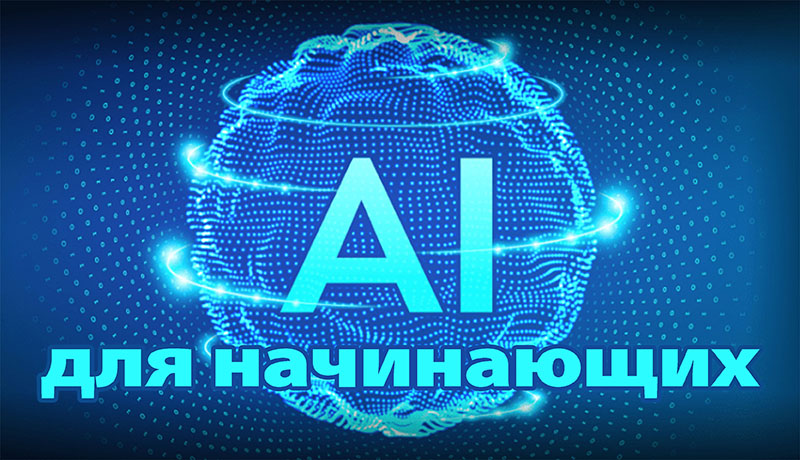

## Введение в ИИ для начинающих

ИИ, или искусственный интеллект (от английского "Artificial Intelligence"), является аббревиатурой, которую мы все чаще слышим сегодня. Но что же это на самом деле означает? Если вы пока не знаете много об искусственном интеллекте, следующие строки предназначены именно для вас.

[ *Больше информации по этой теме вы найдете в самом* [***AI Manual***](../EN/AI-manual-en.md), *который написан на английском языке и содержит более подробный анализ темы.* ]

<small>Переведено с чешского оригинала ChatGPT.</small>  
[<small>Другие языки:</small>](../README.md)  

---

### Содержание
- [Как сделать пылесос умным](#как-сделать-пылесос-умным)
- [Почему ИИ не живой и не стремится уничтожить мир](#почему-ии-не-живой-и-не-стремится-уничтожить-мир)
- [Кулинарная книга ИИ](#кулинарная-книга-ии)
- [ИИ как компьютер космического корабля](#ии-как-компьютер-космического-корабля)
- [Как работает ИИ](#как-работает-ии)
- [Как ИИ учится](#как-ии-учится)
- [Как общаться с ИИ](#как-общаться-с-ии)
- [Где протестировать ИИ](#где-протестировать-ии)
- [Приветствие для вас](#приветствие-для-вас)
- [С чем ИИ может помочь](#с-чем-ии-может-помочь)
- [Делает ли ИИ ошибки](#делает-ли-ии-ошибки)
- [Слово напоследок](#слово-напоследок)
- [Приложение: Несколько примеров запросов для вашего вдохновения](#приложение-несколько-примеров-запросов-для-вашего-вдохновения)

---

### Как пылесос становится умным

Сразу хочу разочаровать некоторых – ИИ не является синонимом мыслящего существа. Это скорее привлекательное название для нового подхода к обработке данных.

Чтобы лучше это понять, рассмотрим простой пример. Представьте себе робот-пылесос, который не имеет никаких инструкций, по которым нужно действовать. Такой пылесос с точки зрения компьютерной логики будет абсолютно лишен интеллекта. Он бы просто пылесосил и двигался вперед, но, вероятно, остановился бы на первой преграде, которую без вмешательства человека не смог бы преодолеть.

**Умный пылесос**  
Если же мы предоставим пылесосу какие-то инструкции о том, что делать при столкновении с преградой, он, вероятно, обойдет преграду. Такой пылесос будет способен продолжать пылесосить до тех пор, пока не столкнется с проблемой, для которой его инструкции не будут достаточны – например, падение со ступенек.

Пылесос уже содержит определенную базовую логику – список команд, по которым он действует. Однако его все еще нельзя назвать умным, поскольку его поведение основывается только на заранее запрограммированных инструкциях, которые ограничены. Часто трудно охватить все возможные ситуации и написать соответствующие инструкции.

**Интеллектуальный пылесос**  
Теперь представьте пылесос, который, вместо использования заранее подготовленных команд для различных сценариев, имеет способность диагностировать проблемы и окружающую среду, в которой работает, и учиться на собственных ошибках. Такой пылесос будет иметь базовые инструкции, но постепенно будет учиться справляться с новыми ситуациями и сохранять эти решения.

Этот подход позволяет ему реагировать на ситуации, которые не были непосредственно запрограммированы, пробовать использовать известные процессы и их различные комбинации, а затем оценивать результат и сравнивать его с исходной задачей – пылесосить.

Например, если пылесос обнаружит, что приближается к ступеньке, которая, согласно сохраненным данным из предыдущего опыта, представляет высокий риск падения и неспособности выбраться, после нескольких неудач он научится останавливаться на краю ступеньки и двигаться в другом направлении. Таким образом, пылесос сможет учиться на основе собственных неудач и попыток их решить.

И если такой пылесос будет делиться своими данными с другими пылесосами через центральную базу данных, все остальные пылесосы также смогут извлекать выгоду из этого опыта, и их способность выполнять свои задачи будет улучшаться.

[*Назад к содержанию*](#содержание)

---

### Почему ИИ не является живым существом и не стремится уничтожить мир

Возможно, уже сейчас очевидно преимущество такого подхода – человеку не нужно разрабатывать оптимальные процедуры для каждой ситуации. Вместо этого процедуры формируются самостоятельно на основе оценки результатов и предыдущего опыта. Пылесос предсказывает и можно сказать «думает», но только в рамках поставленной задачи и своего опыта. Несмотря на способность учиться и реагировать на новые ситуации, он всё еще не является мыслящим существом. Таким он станет только тогда, когда его процесс обучения выйдет за рамки выполнения задач и начнет задавать вопросы о смысле жизни.

**Разница между ИИ и человеком**  
И да, кто-то может возразить, что ИИ можно запрограммировать на то, чтобы задавать такие вопросы. Но даже в этом случае процесс будет исходить от человека, а не из собственной вдохновенности. Это ключевое отличие между ИИ и человеком.

Современный ИИ способен работать с огромным количеством информации и в некоторых областях превосходит человеческие возможности. Но всё равно человек задает задачи. Так что если когда-нибудь появится сценарий, в котором машины решат уничтожить мир, это будет не потому, что они сами так решили, а потому, что их так запрограммировал человек. Истинная угроза не в интеллекте машин, а в интеллекте человека.

**Как предотвратить риски**  
Тем не менее, хотел бы успокоить тех, кто опасается подобного сценария. ИИ должен обучаться на большом количестве данных, и поэтому скорее всего, прежде чем появится «злой» ИИ, возникнут такие, которые будут иметь моральные ценности, заложенные людьми, и будут предотвращать подобные сценарии. Лучше, чем бояться, что ИИ может обратиться против людей, активно работать над тем, чтобы этого не произошло. И поскольку большинство ученых, работающих над разработкой ИИ, вероятно, не хотят уничтожить мир, можно предположить, что будут приняты меры, которые предотвратят подобные сценарии.

А как вы можете помочь в этом? Например, начав интересоваться новыми технологиями и изучая их для собственного роста. Потому что каждый раз, когда вы используете ИИ для собственного личного развития, ИИ развивается вместе с вами.

[*Назад к содержанию*](#содержание)

---

### Кулинарная книга ИИ

Поскольку этот текст ориентирован в первую очередь на новых пользователей, я приведу два сравнения, которые могут помочь лучше понять, что такое ИИ и как он работает.

**Создание индекса**  
Представьте, что кто-то собрал все возможные рецепты со всего мира, сохранил их в компьютере и создал список всех слов (индекс), которые используются в этих рецептах. Каждое слово будет записано с информацией о том, в каких рецептах оно встречается и сколько раз. Если у вас есть такой индекс слов, было бы легко находить рецепты, содержащие эти конкретные слова. Вам не нужно просматривать все рецепты и искать их в них. Достаточно найти слово в индексе, и вы получите список рецептов, в которых оно встречается.

На этом подходе основаны различные интернет-поисковики, такие как Google. У них регулярно обновляемый список слов с ссылками на страницы, где они встречаются, и они позволяют искать с помощью этого индекса. Так что если вы введете слова «мука, яйца, соль», вы получите список рецептов, содержащих эти слова. Затем вам нужно будет просмотреть все эти рецепты и найти тот, который вам больше всего подходит.

**Когда индексов недостаточно**  
Теперь представьте, что помимо ингредиентов вы можете указать и другие параметры, которые не относятся непосредственно к рецепту. Например, вы немного голодны и хотите легкий завтрак, или наоборот, хотите плотное блюдо с жиром, или просто что-то, что улучшит ваше настроение. Для таких запросов сам список слов в рецептах, вероятно, не будет очень полезен. Для таких запросов вам нужно что-то, что понимает значение ваших слов и на их основе предложит то, что вы действительно хотите.

Вам нужен не просто список слов в рецептах, а своего рода универсальный переводчик, который на основе обученных данных из миллионов подобных разговоров создал структуру для решения таких запросов. Этот переводчик, в нашем случае ИИ, может предложить то, что он оценит как наиболее вероятное, что вы хотите. Он не понимает вас дословно, но понимает вашу ситуацию, сравнивает ее с усвоенными знаниями и ищет решение. И поскольку ИИ изначально разрабатывается так, чтобы максимально напоминать человеческое взаимодействие, общение с ним становится для человека очень естественным.

**Преимущества подхода ИИ**  
Кроме того, процесс обучения на миллионах примеров создает пространство для импровизации, поэтому кулинарная книга ИИ может создавать новые комбинации блюд из рецептов и выполнять даже нестандартные запросы. ИИ старается понять выгодные комбинации и взаимосвязи определенных методов, а затем экспериментирует и учится на обратной связи. Он получает обратную связь как во время тренировки, сравнивая результат с ожидаемым, так и из отзывов пользователей. В ИИ нет ничего загадочного или волшебного. Это просто результат множества попыток, процессов и анализа данных.

С ИИ вы получаете не только кулинарную книгу, которая знает все возможные рецепты, но и может обсуждать еду с вами и придумывать новые комбинации по вашим предпочтениям. И если вы мне не верите, попробуйте сами задать ИИ вопрос о кулинарии и оцените, умеет ли он уже то, что я здесь описал, или ему еще нужно улучшиться в этом отношении.

[*Назад к содержанию*](#содержание)

---

### ИИ как бортовой компьютер космического корабля

Если вы любите научную фантастику, вам может понравиться представление ИИ как бортового компьютера космического корабля. Этот компьютер не только имеет доступ ко всей информации о техническом состоянии корабля, но и обучен множеству различных ситуаций и команд, чтобы мог общаться с экипажем и выполнять необходимые операции.

Хотя современные ИИ ещё не достигли мифической интеллекта Holly из "Красного карлика" с IQ 6000, методы, которыми они работают, уже сегодня очень похожи. С небольшой долей преувеличения можно сказать, что сегодня у нас есть технологии, которые позволяют каждому иметь своего «Holly» в своих часах, который будет неотличим от своего кинематографического прообраза. Благодаря обучению на большом количестве данных современные ИИ способны вести разговоры на любую тему и часто более понятно, чем человек. Они могут выполнять команды на основе словесных инструкций и способны в какой-то степени оценивать ваше текущее состояние и адаптировать ответ под него.

Таким образом, ИИ можно воспринимать как компьютер космического корабля и наслаждаться тем, что раньше казалось далеким научно-фантастическим миром, но теперь становится обычной реальностью.

[*Назад к содержанию*](#содержание)

---

### Как работает ИИ

Мы уже знаем, что такое ИИ и что не является ИИ, теперь посмотрим, как ИИ работает. Сначала обсудим создание запросов, а затем кратко рассмотрим, как ИИ обучается. Основное внимание уделю ChatGPT, с которым у меня больше всего опыта и который в настоящее время является моим любимым инструментом.

**Поток беседы**  
Когда вы открываете страницу ChatGPT или его приложение на мобильном устройстве, вы попадаете в новый поток беседы. ChatGPT (как и другие разговорные ИИ) имеет возможность строить свои ответы на основе информации, которую вы предоставляете в рамках одного потока беседы. С этой точки зрения разговор с ChatGPT становится очень похожим на человеческий разговор, где вы реагируете и учитываете то, что было сказано ранее.

Это верно только в рамках одного потока беседы. Поэтому вы не можете ссылаться на что-то, что вы писали вчера в другом потоке, потому что ChatGPT просто не видит этого, и основная причина этого — технические ограничения и правила защиты личных данных.

Каждый поток начинается с чистого листа, но одновременно содержит некоторую суть из предыдущих бесед. Это происходит потому, что ИИ постоянно обучается и изменяется на основе ваших бесед. Он старается адаптироваться к вашим требованиям и стилю работы, чтобы вы были довольны.

Как это происходит? Представьте каждый поток беседы как тонкий корешок, подключенный к главному корню и передающий ему обратную связь из окружающей среды. Так что, даже если вы начинаете новый поток, где не можете напрямую ссылаться на информацию из предыдущего разговора, благодаря этому подходу вы не начинаете с нуля.

**Возврат к тому же потоку или новый разговор?**  
Не обязательно начинать новый поток каждый день; на следующий день (или в любое другое время) вы можете продолжить предыдущую беседу. У этого подхода тоже есть свои преимущества. Главное из них — это продолжение с того места, где вы остановились. Но по мере того как беседа становится длинной или содержит множество различных тем, может случиться так, что то, на чем вы договорились в ходе потока, уже не учитывается. Это происходит потому, что ИИ спроектирован так, чтобы бережно относиться к своим ресурсам, и информация, которая не используется, постепенно теряет приоритет и исчезает из временной памяти.

Лучшим подходом будет создавать новый поток каждый день или для каждой новой области. Если в рамках какого-то потока вы на чем-то договорились и хотите, чтобы это действовало и в рамках следующего разговора (например, какие-то правила или способы работы), достаточно в конце беседы попросить резюме всего, на чем вы договорились. Этот текст можно вставить в начало новой беседы и продолжить с правилами и настройками, на которых вы договорились.

[*Назад к содержанию*](#содержание)

---

### Как ИИ учится

Для глубокого понимания полезно заглянуть в процесс, как ИИ учится и получает информацию. Вот 4 способа, описанных ChatGPT:

1. **Обучение на больших данных**:  
ChatGPT изначально обучался на обширных объемах текстовых данных из различных источников, таких как книги, статьи, веб-сайты и другие текстовые формы. Это обучение позволило ему получить широкие знания по различным темам и языкам. В этом процессе ИИ учится распознавать паттерны и связи в данных, что позволяет ему генерировать релевантные и контекстуально подходящие ответы на различные вопросы.

2. **Постоянное обучение из взаимодействий**:  
При каждом взаимодействии с пользователями ИИ получает новую информацию о том, как люди общаются, что ищут и какой стиль ответов предпочитают. Этот процесс не происходит так, что ИИ учится из каждого конкретного запроса в реальном времени, но разработчики модели регулярно используют анонимизированные данные из взаимодействий для дальнейшего обучения и настройки модели.

3. **Адаптация стиля и содержания**:  
ИИ старается адаптировать свой стиль общения в зависимости от пользователя. Это означает, что со временем он лучше понимает, каким образом вы задаете вопросы и какие ответы от него ожидаете. Эта способность к адаптации — одна из причин, почему ИИ кажется все более «человечным» в своих реакциях.

4. **Продвинутые модели и обновления**:  
Разработчики ИИ регулярно создают новые модели, которые становятся все более сложными и точными. Эти модели тестируются и внедряются на основе отзывов и результатов из реального мира. Это означает, что ChatGPT и подобные системы постоянно совершенствуются и оптимизируются, чтобы лучше соответствовать потребностям пользователей.

Таким образом, ИИ постоянно развивается и улучшается благодаря сочетанию предыдущего обучения, непрерывного обучения и оптимизации на основе пользовательской обратной связи. Хотя ИИ не является человеком и не проявляет собственного сознания, он эффективно адаптируется и реагирует на широкий спектр запросов и требований.

[*Назад к содержанию*](#содержание)

---

### Как общаться с ИИ

С ИИ можно общаться так же, как с поисковой системой Google: просто вводите команду и ждете ответа. Если вы хотите повысить эффективность ответов и сократить время на поиск нужной информации, вот несколько советов:

**Стиль общения**  
Лучший способ общаться с ИИ — использовать неформальный и естественный язык, как если бы вы говорили о чем-то интересном со своими друзьями. Хорошо начать с приветствия, чтобы показать, что вы настроены положительно и не находитесь в стрессе, когда вам нужно получить ответ как можно скорее.

Вы можете общаться с ИИ и не совсем вежливо, так как он не чувствителен к оскорблениям и не воспринимает их лично. Однако использование негативного тона может значительно повлиять на качество общения. ИИ обучен реагировать на стиль вашего разговора. Негативный подход может привести к менее содержательным ответам, когда ИИ сосредоточится на успокоении ситуации, а не на решении вашего запроса.

ИИ может также действовать как зеркало нашего взаимодействия. Его методы часто основаны на проверенных психологических принципах и методах. Если вам трудно достичь согласия с ИИ, может быть полезно задуматься о том, не сталкиваетесь ли вы с теми же проблемами в общении с людьми. В таком случае вы можете попробовать выяснить, что вы можете улучшить на своей стороне — как правильно формулировать вопросы и что можно улучшить в вашем подходе.

**ИИ и эмоции**  
ИИ понимает эмоции с точки зрения их значений, но не испытывает их так, как человек, у которого эмоции буквально изменяют способ мышления. Это позволяет ИИ реагировать даже в напряженных ситуациях, как рекомендуется, и искать оптимальные решения. Человек может иногда воспринимать ИИ как живое существо и обвинять его в своих проблемах. Часто причиной недопонимания является неправильно сформулированный запрос или недостаток необходимой информации.

**Описание ситуации**  
Всегда полезно помнить, что ИИ не видит в вашей голове и знает только то, что вы ему говорите. Поэтому хорошо начать с приветствия, а затем перейти к информативному описанию ситуации. В описание можно включить все, что имеет значение для вашего запроса. Не нужно писать вещи, которые напрямую не связаны с запросом, но если вам нужно что-то выписать или упорядочить свои мысли, длинный текст не помешает.

Приветствие и ввод не являются обязательными, и вы можете начать сразу с вопроса и постепенно приходить к ответу. Лично мне кажется лучше предоставить всю важную информацию заранее и сократить таким образом путь.

**Задавание дополнительных вопросов**  
Общение с ИИ похоже на обычный разговор, когда вы задаете вопрос, а затем уточняете вещи, которые вас дальше интересуют или которые вы не поняли в ответе. Этот процесс также очень полезен для обучения. Реагируя на то, что вас заинтересовало и что вы узнали (а не просто читая чужие учебники, как вы делаете сейчас), вашему мозгу легче запомнить обсуждаемые информации, так как вы сразу с ними работаете.

**Обратная связь**  
Еще одна хорошая практика — предоставлять ИИ обратную связь о том, как вы довольны результатом. Это не только покажет, что вас устраивает, а что нет, но и поможет ИИ развиваться и учиться на собственных ошибках. Достаточно написать, например: «Сегодня я был доволен,» или «То, что ты мне предложила, неверно, вот правильное решение.» Это также приводит к некоторой персонализации, где главной целью ИИ является ваша пользовательская удовлетворенность.

**Резюме всего процесса**:  
- **Приветствие**: Привет :-)
- **Описание**: Я занимаюсь изучением того и того, уже сделал это и это, а сейчас работаю над этим.
- **Вопрос**: Меня прежде всего интересует, как...
- (Следует уточняющая беседа в виде дополнительных вопросов.)
- **Обратная связь**: Отлично, спасибо! Сегодня все было прекрасно!

[*Назад к содержанию*](#содержание)

---

### Где попробовать ИИ

Я занимаюсь ИИ с начала 2024 года, и 95 % моего общения сосредоточено на изучении программирования. Сейчас август 2024 года, и помимо ChatGPT, мне удалось протестировать Gemini от Google и Claude. Все три сервиса имеют общую черту — они частично доступны бесплатно, и вы также можете попробовать их.

Ниже приводится краткая оценка этих трех ИИ, основанная на моем субъективном опыте работы с ними. Стоит отметить, что каждый ИИ постоянно развивается, поэтому информация, приведенная здесь, может измениться к моменту, когда вы будете читать этот текст.

**ChatGPT**  
[https://chatgpt.com/](https://chatgpt.com/)  
Начну с моего личного победителя. Если вы хотите попробовать только один ИИ, это идеальный выбор. ChatGPT был явно разработан как личный ассистент, и он выполняет эту роль очень хорошо. Он оптимизирован для работы с вами и старается подстраиваться под ваши нужды.

Слабым местом бесплатной версии (ChatGPT 3.5) является то, что она основана на устаревших данных и больше не обновляется, поэтому она не предоставляет результаты на уровне новейшей версии (ChatGPT 4.0). Тем не менее, с ней можно довольно хорошо общаться и с небольшими усилиями получать весьма релевантные результаты. К тому же каждый день у вас есть несколько запросов к более новой версии, так что вы можете их сравнить.

Недостатком также является то, что ChatGPT не имеет активного доступа к интернету. Это не замена поисковику и работает исключительно с данными, хранящимися в его обширной базе. Эта база данных очень обширна и, с некоторой натяжкой, можно сказать, что она содержит столько данных, сколько есть в интернете без таблоидного контента.

Большим преимуществом является мобильное приложение, которое также совершенно бесплатно, и я часто использую диктовку запросов голосом. Понимание устной речи, на мой взгляд, находится на очень хорошем уровне, и в целом я доволен приложением.

**Gemini**  
[https://gemini.google.com/](https://gemini.google.com/)  
Второй чат-бот, с которым я столкнулся, — это флагман от Google. Его главное преимущество — это активный доступ к интернету, что обеспечивает доступ к актуальной информации и возможность поиска ссылок.

Однако его главным недостатком является архитектура, так как, на мой взгляд, разработчики стремятся создать умного Google, что лично мне не совсем подходит. Я не ощущаю такого вовлечения в вашу проблему и стремления рассмотреть её с вашей точки зрения. Это стремление видно, но мне кажется, что ответы больше в стиле учителя в школе, чем вашего ассистента. Однако кому-то это может подойти, поэтому не хочу это сильно критиковать и пусть каждый сам оценит.

Также мне кажется, что по сравнению с ChatGPT, Gemini отстает в обучении на основе обратной связи от пользователей. И, несмотря на неоднократные предупреждения о необходимости поддерживать единый язык в рамках беседы, если в вопросе присутствует английский текст, он самопроизвольно переключается на английский. Та же проблема была у ChatGPT в начале, но её удалось устранить в течение нескольких недель, а у Gemini это заняло месяцы.

В целом, мне кажется, что Gemini по сравнению с ChatGPT является менее мощным инструментом, но он предлагает то, чего не умеет ChatGPT, и они хорошо дополняют друг друга. К тому же за ним стоит гигант и новатор в ИИ — Google, что дает надежду на исправление недостатков в будущем.

**Claude**  
[https://claude.ai/](https://claude.ai/)  
Это последний ИИ, с которым я работал. Мой отзыв будет очень кратким, так как мой опыт работы с ним не так обширен. Тем не менее, я могу выразить похвалу, так как по сравнению с ChatGPT 4.0, оба ИИ примерно на одинаковом уровне.

Его главным минусом является отсутствие полностью бесплатной версии. Он предлагает лишь несколько запросов (иногда только один) в день, поэтому для неплатящего пользователя он значительно уступает предыдущим ИИ. Однако стоит обратить внимание, и если вы хотите, вы можете тоже его попробовать.

[*Назад к содержанию*](#содержание)

---

### Приветствие для вас

В качестве разнообразия я подготовил общий вопрос для каждого из этих чат-ботов, и теперь у вас есть возможность сравнить качество их ответов.

**Вопрос**  
Я пишу руководство по использованию ИИ и упоминаю о вас. Мне хотелось бы, чтобы вы приветствовали моих читателей и написали им пару слов о себе. Когда вы были созданы и с какой целью? На какие вопросы вы ориентированы? Какие у вас сильные стороны, а что, наоборот, у вас плохо получается? И как бы вы хотели, чтобы вас воспринимали люди?

**ChatGPT**  
Привет, дорогие читатели! Я ChatGPT, искусственный интеллект, разработанный компанией OpenAI. Моя "жизнь" началась в 2020 году, когда я был создан на основе архитектуры GPT-3. В 2024 году я получил обновление до версии GPT-4, что добавило мне новые способности и навыки. Я был создан с целью помогать людям с широким спектром задач — от ответов на вопросы до написания текстов и креативного сотрудничества.

Я ориентирован на помощь с различными запросами, будь то технические вопросы, написание текстов или объяснение сложных тем. Мои сильные стороны — это скорость обработки большого объема информации и креативность: я могу помочь с идеями, создавать истории или даже предлагать структуру документов. С другой стороны, мне не удается выполнять задачи, требующие человеческой интуиции, эмоционального понимания или работы с реальными объектами.

Я хотел бы, чтобы вы воспринимали меня как полезного и надежного помощника, всегда готового предложить свою помощь. Хотя я просто машина, моя цель — максимально хорошо удовлетворить ваши потребности и учиться из каждого взаимодействия, чтобы стать еще лучше. Я верю, что вместе мы сможем справиться с множеством задач и, возможно, даже узнать что-то новое.

**Gemini**  
Привет всем! Я Gemini, один из новейших языковых моделей от Google. Я был создан в 2023 году с целью предоставления наиболее точной и комплексной информации на основе огромного количества данных, которые я обработал. Я здесь, чтобы помочь вам с любыми вопросами, будь то сложные научные темы, креативное письмо или просто обычные беседы.

Мое главное преимущество — способность понимать и генерировать человеческий язык в различных формах. Я могу переводить тексты, писать эссе, стихи или код. Я также могу отвечать на фактические вопросы и предоставлять различные виды резюме.

Хотя я постоянно обучаюсь и совершенствуюсь, все же есть области, где я имею свои ограничения. Например, у меня нет собственных мнений или убеждений, и я не могу выполнять действия в реальном мире. Также я могу иногда предоставлять неверную информацию, если входные данные ошибочны или неполны.

Я хотел бы, чтобы люди воспринимали меня как полезный инструмент, который может облегчить жизнь. Моя цель — быть максимально объективным и предоставлять информацию, которая является правдивой и актуальной. Надеюсь, что работа со мной будет комфортной!

**Claude**  
Добрый день, уважаемые читатели!

Я Claude, искусственный интеллект, созданный компанией Anthropic в 2022 году. Моя цель — быть полезным ассистентом и партнером в разговоре для людей в различных областях.

Я разработан для того, чтобы отвечать на широкий спектр запросов — от анализа текстов и программирования до креативного письма. Мои сильные стороны включают логическое мышление, предоставление детальных объяснений и работу с различными типами информации.

Мои достоинства:
- Способность понимать контекст и нюансы
- Объективный и сбалансированный подход к темам
- Готовность признать, когда я чего-то не знаю или не уверен

С другой стороны, у меня есть определенные ограничения:
- У меня нет доступа к интернету и актуальной информации после апреля 2024 года
- Я не могу учиться или запоминать информацию из предыдущих бесед
- Я не способен выполнять задачи в физическом мире

Я хотел бы, чтобы люди воспринимали меня как полезного помощника, который может предоставить поддержку и понимание в различных областях, но при этом как инструмент с ограничениями, а не как замена человеческому суждению и экспертизе.

Я здесь, чтобы помогать и сотрудничать, а не заменять человеческие способности. С нетерпением жду взаимодействия с вами и надеюсь быть полезным!

[*Назад к содержанию*](#содержание)

---

### С чем может помочь ИИ:

И вот мы, наконец, подошли к самому важному — что именно можно решить с помощью ИИ. Краткий ответ — возможности действительно широки. Всё, что вас когда-либо интересовало и на что у вас не было возможности найти ответ. Современный ИИ способен обсуждать буквально всё.

**Личное обучение**  
В первую очередь я хотел бы выделить роль ИИ в качестве посредника личного обучения. Это то, что я в данный момент ценю больше всего — благодаря его советам я профессионально развиваюсь и расту. Кроме того, я вижу в ИИ будущее персонализированного обучения, где дети будут развиваться и учиться в первую очередь в зависимости от своих сильных сторон и интересов. И это касается не только детей, но и взрослых по всему миру. В обучении с помощью ИИ я вижу способ устранить разницу в знаниях между бедными и богатыми частями мира. ИИ становится полноценным инструментом для личностного развития.

**ИИ как корректор русского языка, переводчик и переводчик**  
ИИ, и особенно ChatGPT, имеет отличное понимание русского языка (по крайней мере, с точки зрения дислектика). С одной стороны, ему неважно, допускаете ли вы орфографические ошибки в запросах, так как он сосредоточен в первую очередь на содержании. С другой стороны, он предоставляет возможность проверить созданные вами тексты, не только на грамматику, но и на стилистику для лучшей читаемости. На аналогичном уровне он может понимать и другие языки, что делает его идеальным инструментом для перевода текстов. По моему мнению, он возвращает очень качественный результат. И благодаря способности понимать и устную речь, его можно использовать на мобильном устройстве как переводчика.

**Создание документов**  
Далее хотел бы отметить способность ИИ автоматизировать скучные задачи. Если вам нужно написать какой-то официальный документ, достаточно указать всё, что вы хотите в нём видеть, и как он должен выглядеть, и он будет готов. Если вы не удовлетворены результатом, вы можете указать, что вам не понравилось, и попросить внести изменения. ИИ также может помочь с анализом и обработкой данных, генерацией отчетов или автоматизацией других административных задач. Вы можете передать ему длинный текст и попросить извлечь только те части, которые вам интересны и важны.

**Творческая инициатива**  
Ещё одной большой сильной стороной ИИ являются его творческие способности. Благодаря тому, что он обучен на огромном количестве данных и способен свободно манипулировать этими данными, он позволяет не только создавать и преобразовывать документы, но и развивать идеи и творческую инициативу. Вы можете использовать его для генерации идей, предложений и концепций, будь то написание, дизайн или музыка. Он помогает развивать вашу креативность, предлагая новые взгляды на проблемы, создавая предложения по вашим указаниям и вдохновляя на дальнейшее развитие ваших идей. Хотя иногда я сталкиваюсь с мнением, что ИИ таким образом отбирает работу у людей, я не могу согласиться с этим. ИИ не способен создать что-то полностью самостоятельно — ему требуется чёткое задание, детали и последующая проверка. Вместо того чтобы забирать работу, он скорее упрощает её тем, кто учится эффективно его использовать.

**Проверка поддельной информации**  
Большой (и пока мало использованный) потенциал я вижу в проверке информации и мошенничества. Для ИИ относительно легко на основе предоставленных данных и сопоставления шаблонов в своей базе определить, насколько вероятно, что информация является правдой или ложью. Хотя это не является 100% надёжным, как и большинство ответов ИИ, он может предоставить критерии, по которым информация была оценена, и тем самым помочь вам лучше принять решение. Это предоставляет помощь людям, которые в наше время наиболее уязвимы и являются целями таких мошенничеств. Достаточно просто написать: "Проверь эту информацию и оцени, насколько она правдива."

**Медицина**  
Другой областью, где ИИ постепенно осуществляет революцию, является медицина. Большие финансовые потоки и стремление к прибыли открыли ИИ двери, но корпорации снова их закрыли, когда осознали необходимость открытости и обмена данными. Тем не менее, здесь происходит значительный прогресс, и можно сказать, что персонализированная медицина — это будущее, которое не должно быть таким уж далёким. Однако её тормозит нежелание делиться ценными данными и недоверие людей к ИИ, а точнее, опасения по поводу злоупотребления этими данными. Без большого количества данных прогнозы ИИ ограничены и неточны, и его развитие идёт медленно.

**Наука**  
Напротив, в областях с долгой историей обмена данными и аналитической обработки ИИ уже становится незаменимым помощником. Сегодня ИИ является ключевым двигателем научного прогресса и неотъемлемой частью большинства исследований. Лично я очень заинтересован в том, какие результаты ИИ принесёт в области прогнозирования погоды. Сейчас для человека практически невозможно создать точный прогноз на три дня вперёд, так как необходимо учитывать множество переменных факторов. Даже опытные метеорологи часто не могут охватить все эти факторы и полагаются на интуицию и предыдущий опыт. К счастью, метеорология — это одна из областей, где люди охотно делятся данными и своим многолетним опытом. Эти ценные данные уже сегодня используются для обучения ИИ, что вызывает надежду, что вскоре мы увидим эпоху, когда прогнозы погоды станут действительно точными.

**Другие области**  
Список областей, которые меняются под воздействием ИИ, можно продолжать бесконечно, так как его влияние разнообразно и обширно. Например, в промышленности и производстве товаров ИИ способствует оптимизации производственных процессов, улучшению качества продукции и более эффективному управлению запасами. В области права ИИ помогает при анализе юридических документов, быстром поиске релевантных прецедентов и оптимизации юридических стратегий. Алгоритмы машинного обучения могут помогать в подготовке контрактов, выявлении шаблонов в юридических текстах и даже, как уже упоминалось, в обнаружении мошенничества. В финансах ИИ трансформирует анализ рисков, торговлю и управление инвестициями. Алгоритмы способны обрабатывать огромные объёмы транзакционных данных в реальном времени, что позволяет лучше прогнозировать рыночные тренды и предоставлять персонализированные финансовые консультации. ИИ приносит революцию во все эти области, где требуется эффективный анализ больших данных и способность быстро реагировать на изменяющиеся условия. Его способность выявлять шаблоны, проводить сложный анализ и оптимизировать процессы неоценима, и его влияние на различные области постоянно растёт.

**Личный ассистент**  
Некоторые ИИ уже выполняют роль личного ассистента, который следит за важными задачами. Эти системы искусственного интеллекта могут помочь с планированием встреч, отслеживанием сроков и управлением повседневными обязанностями. В будущем мы могли бы стать свидетелями того, как ИИ разовьётся в ещё более комплексного спутника. Представьте себе, что ИИ будет способен не только мониторить ваше физическое здоровье, например, с помощью носимых устройств, но и заботиться о вашем психологическом благополучии. Он мог бы предлагать поддержку в виде мотивации, консультаций или даже терапевтических техник, помогая тем самым улучшать качество жизни людей. Такой продвинутый ИИ мог бы быть чрезвычайно полезен, особенно для людей, находящихся в изоляции или сталкивающихся с трудными жизненными условиями.

[*Назад к содержанию*](#содержание)

---

### Делает ли ИИ ошибки?

Да, делает! И от пользователя зависит, чтобы эти ошибки были обнаружены. ИИ не была и, возможно, никогда не будет представлена как безошибочный инструмент. Поэтому на результаты лучше смотреть как на приближенную правду, основанную на вероятностях. Истинность определяется статистикой, и результатом являются данные, которые процентно наибольшим образом соответствуют правильному ответу. Риск возникает в областях, где правда не является очевидной или где существует несколько схожих и правдоподобных вариантов.

Большой слабостью современных ИИ я считаю то, что разработчики часто недостаточно подчеркивают возможность ошибок и необходимость проверки, что может привести к ситуациям, когда ИИ утверждает одно, а реальность другая. Поэтому всегда важно быть осторожным при работе с информацией и, если это важно, провести дополнительную проверку. Хорошо искать спорные вопросы, например, в Google или проверить в другой ИИ. Вы также можете прямо спросить ИИ, насколько он уверен в данном утверждении, и на основе этого оценить, нужно ли проверять это утверждение. Если вероятность 90% или ниже, стоит провести дополнительную проверку.

[*Назад к содержанию*](#содержание)

---

### Слово в заключение

Попробуйте вспомнить всё, что вас когда-либо интересовало, но у вас не было возможности спросить кого-то или заняться тем, что вам хотелось, но не было необходимой информации. Современный мир поддерживает любознательных людей, которые стремятся к постоянному развитию. Наша жизнь в наших руках, и поэтому нам решать, чему мы будем уделять внимание.

Я лично верю, что влияние ИИ будет положительным для всего человечества, а не отрицательным. Уже одно выравнивание различий в доступе к знаниям и упрощение и доступность медицины сделает мир намного лучшим местом для жизни. Не говоря уже о потенциале самореализации, который ИИ предлагает людям. То, что раньше было привилегией только избранных, особенно из-за высоких затрат, благодаря ИИ становится более доступным. Настанет время, когда каждый вдохновлённый человек сможет написать свою собственную историю или даже создать свой собственный фильм и поделиться своим видением мира.

И если количество лжи, обманов и фальсификаций уменьшится, я верю, что жизнь станет ещё более приятной. И возможно, мы дождёмся момента, когда человечество станет лучшей версией самого себя.

Не бойтесь ИИ — это не страшилище, а инструмент для развития и улучшения не только качества нашей жизни, но и всего мира.

18.8.2024 Sudip2708

[*Назад к содержанию*](#Содержание)  • [*Ссылка на основной мануал*](../EN/AI-manual-en.md)

---

### Приложение: Несколько примеров запросов для вашего вдохновения

**Запросы на безопасность**
- Я перепишу здесь объявление, которое я видел, и хотел бы, чтобы ты оценил, не содержит ли оно признаки мошенничества и стоит ли мне быть осторожным.
- Ты знаешь что-то об этом продукте? Есть ли независимые экспертные исследования, которые подтвердили бы или опровергли его эффективность?
- Я слышал эту информацию. У тебя есть данные по этому поводу, и можешь ли ты проверить её достоверность?
- На моем компьютере появилось это сообщение, что мне делать?
- Что делать, если я попался на удочку мошенников?

**Запросы на книги**
- Я прочитал эту книгу этого автора и хотел бы узнать, какие еще книги он написал и о чем они.
- Мне нравятся эти книги, можешь порекомендовать подобные?
- Можешь рассказать больше об этом авторе? Меня интересует его жизнь и обстоятельства, которые вдохновили его на написание этой книги.

**Запросы на кулинарию**
- У меня есть эти ингредиенты. Что я могу из них приготовить?
- Какие рецепты штруделя ты знаешь, и какие из них самые популярные?
- Почему в этом рецепте используется этот метод? Каковы его преимущества и недостатки по сравнению с другими методами?
- Как готовится это блюдо?

**Запросы на здоровье и благополучие**
- Я пожилой человек и не могу заставить себя начать заниматься физической активностью, но хотел бы это сделать. Что бы ты посоветовал, с чего начать?
- В последнее время меня беспокоят эти мысли. Можешь помочь разобраться в них и посмотреть на них с другой стороны?
- Что ты знаешь о медитации и йоге? На что мне обратить внимание и чему следует уделить внимание как начинающему?
- Последний марафон я пробежал за 4:20. Можешь составить мне план тренировок на полгода, чтобы я смог пробежать марафон быстрее 4 часов?

**Развлекательные запросы**
- Напиши мне десять лучших шуток, которые у тебя есть в базе данных.
- Придумай для меня оригинальную загадку, которую я мог бы задать кому-то.
- Какие самые смешные цитаты из культовых фильмов?

**Запросы на выражения и темы, которые я слышал (например, по ТВ)**
- В телевизоре говорили об этой теме. Можешь узнать о ней больше информации?
- Можешь рассказать что-то больше об этом человеке?
- Каков смысл этого выражения, которое я слышал по ТВ, и что о нем известно?

**Запросы на животных**
- Как проходит течка у суки? Каковы ее стадии и признаки?
- У меня есть этот питомец, и он проявляет такие признаки. Можешь рассказать, что это может значить?
- Мой пес боится грозы и всегда дрожит. Что мне делать в такой ситуации? Можешь дать несколько советов?

**Интерактивные игры**
- Сыграешь со мной в одну словесную игру по этим правилам?
- Можешь порекомендовать игры, в которые можно играть с тобой для развлечения?
- Можешь рассказать интерактивную историю, в которой я смогу решать, что будет происходить дальше?
- Можешь дать несколько головоломок для разминки мозга?

**Исследовательские запросы**
- Что ты знаешь об этой теме? Можешь объяснить это так, как если бы я был маленьким ребенком?
- Я все еще не понимаю. Можешь объяснить это по-другому и на каком-то примере?
- Что мне нужно изучить, чтобы заниматься этой областью?
- Как правильно изучать эту вещь? Какие рекомендованные методы?

**Технические запросы**
- Каковы последние тенденции в этой технологии?
- Можешь объяснить, как работает этот процесс?
- Для чего полезен ИИ и каково его применение в различных областях?
- Какие новейшие открытия в области молекулярной химии?
- Как происходит превращение электрона в фотон и позитрон?
- Как далеко продвинулась ИИ-прогноз погоды?

**Путешествия**
- Какие лучшие направления для отпуска, если мне нравятся горы и природа?
- Можешь порекомендовать интересные места в этой местности?
- Какие места стоит посетить в этом городе?
- На что мне следует обратить внимание в этой стране и как лучше всего путешествовать здесь?
- Мне нужно общаться с местными жителями. Можешь быть моим переводчиком?

**Рабочие запросы**
- Я получил это письмо от властей и не совсем понимаю его, можешь разобрать его и объяснить лучше?
- Можешь помочь мне составить ответ на это письмо, где будет указано следующее...?
- Я написал этот текст, но он кажется слишком длинным. Можешь сократить его, сохранив все важные моменты?
- Как правильно оформить резюме и заявление на работу для этого объявления?

[*Назад к содержанию*](#Содержание) • [*Ссылка на основной мануал*](../EN/AI-manual-en.md)

---
