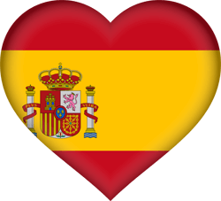
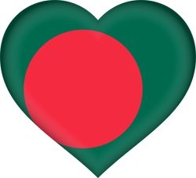

## Úvod do AI pre začiatočníkov

AI, teda umelá inteligencia (z anglického "Artificial Intelligence"), je skratka, ktorú dnes počujeme stále častejšie. Ale čo vlastne znamená? Ak o umelej inteligencii zatiaľ veľa neviete, nasledujúce riadky sú určené práve vám.

*(Viac informácií na toto téma nájdete v samotnom* [***AI Manual***](../EN/AI-manual-en.md), *ktorý je písaný v angličtine a obsahuje podrobnejší rozbor témy.)*

<small>Z českého originálu preložil ChatGPT.</small>  
[<small>Ďalšie jazyky:</small>](../README.md#other-translations-of-the-beginners-guide)  

---

### Obsah
- [Ako sa vysávač stane inteligentným](#ako-sa-vysávač-stane-inteligentným)
- [Prečo AI nie je živá a prečo netúži zničiť svet](#prečo-ai-nie-je-živá-a-prečo-netúži-zničiť-svet)
- [AI kuchárka](#ai-kuchárka)
- [AI ako počítač vesmírnej lode](#ai-ako-počítač-vesmírnej-lode)
- [Ako AI pracuje](#ako-ai-pracuje)
- [Ako sa AI učí](#ako-sa-ai-učí)
- [Ako s AI komunikovať](#ako-s-ai-komunikovať)
- [Kde si AI vyskúšať](#kde-si-ai-vyskúšať)
- [Pozdrav pre vás](#pozdrav-pre-vás)
- [S čím môže AI pomôcť](#s-čím-môže-ai-pomôcť)
- [Robí AI chyby](#robí-ai-chyby)
- [Slovo na záver](#slovo-na-záver)
- [Dodatočná časť: Niekoľko príkladov otázok pre vašu inšpiráciu](#dodatočná-časť-niekoľko-príkladov-otázok-pre-vašu-inšpiráciu)

---

### Ako sa vysávač stane inteligentným

Hneď na úvod musím niektorých možno sklamať – AI nie je synonymom pre mysliacu bytosť. Je to skôr chytľavý názov pre nový prístup, ako zaobchádzať s dátami.

Aby sme si to lepšie predstavili, použijeme jednoduchý príklad. Predstavte si robotický vysávač, ktorý nemá žiadne inštrukcie, podľa ktorých by sa riadil. Takýto vysávač by bol z pohľadu počítačovej logiky úplne bez inteligencie. Vedel by len vysávať a pohybovať sa dopredu, ale pravdepodobne by sa zastavil pri prvej prekážke, ktorú by bez zásahu človeka neprekonal.

**Chytrý vysávač**  
Ak by sme však vysávaču poskytli nejaké inštrukcie, ktoré by mu hovorili, čo robiť v prípade narazia na prekážku, je pravdepodobné, že by prekážku obíde. Takýto vysávač by bol schopný vysávať až do chvíle, kým by nenarazil na problém, na ktorý by jeho inštrukcie nestačili – napríklad pád zo schodov.

Vysávač už obsahuje určitú základnú logiku – zoznam pokynov, podľa ktorých sa riadi. Napriek tomu ho stále nemožno považovať za inteligentný, pretože jeho správanie vychádza len z prednaprogramovaných inštrukcií, ktoré sú obmedzené. Často je ťažké postihnúť všetky situácie, ktoré môžu nastať, a napísať k nim odpovedajúce inštrukcie.

**Inteligentný vysávač**  
Teraz si však predstavte vysávač, u ktorého sa výrobcovia rozhodli neísť cestou predpripravených príkazov pre rôzne scenáre, ale namiesto toho mu dali schopnosť diagnostikovať problémy a prostredie, v ktorom pracuje, a učiť sa z vlastných chýb. Takýto vysávač by mal tiež základné inštrukcie, ale postupne by sa učil, ako sa vysporiadať aj s novými situáciami, a tieto riešenia by si ukladal.

Tento prístup mu umožňuje reagovať na situácie, ktoré nie sú priamo naprogramované, skúšať použiť procesy, ktoré už pozná, a ich rôzne kombinácie, a následne vyhodnotiť výsledok a porovnať ho s pôvodným zadanim, ktorým je vysávať.

Napríklad, ak by zistil, že sa blíži ku schodu, ktorý podľa uložených dát z predchádzajúcich skúseností predstavuje vysoké riziko pádu a neschopnosti sa vyprostiť, po niekoľkých neúspechoch by sa naučil zastaviť na okraji schodu a zamieriť iným smerom. Vysávač by sa tak bol schopný učiť na základe vlastných neúspechov a snahy ich vyriešiť.

A ak by taký vysávač zdieľal svoje dáta s ostatnými vysávačmi cez centrálnu databázu, všetky ostatné vysávače by mohli ťažiť z týchto skúseností a ich schopnosť plniť svoje úlohy by sa zlepšovala.

[*Späť na obsah*](#obsah)

---

### Prečo AI nie je živá a nemá v úmysle zničiť svet

Možno je už teraz jasná výhoda tohto prístupu – človek nemusí vymýšľať optimálne postupy pre každú situáciu. Namiesto toho sa postupy vytvárajú samé na základe vyhodnocovania výsledkov a predchádzajúcich skúseností. Vysávač predvída a dá sa povedať „myslí“, ale len v rámci daného úlohy a svojich skúseností. Aj keď je schopný sa učiť a reagovať na nové situácie, stále nejde o samostatne myslícu bytosť. Tou by sa stal až vtedy, keď by jeho proces učenia presiahol rámec plnenia úloh a začal by si klásť otázky o zmysle života.

**Rozdiel medzi AI a človekom**  
Áno, niekto by mohol namietnuť, že aj AI môže byť naprogramovaná tak, aby si tieto otázky kládla. Ale aj v tomto prípade bude tento proces vychádzať zo zadania človeka, nie z vlastnej inšpirácie. To je zásadný rozdiel medzi AI a človekom.

Moderná AI má schopnosť pracovať s obrovským množstvom informácií a v niektorých oblastiach prekonáva ľudské schopnosti. Stále je to však človek, kto zadáva úlohy. Takže ak sa niekedy objaví scenár, kde sa stroje rozhodnú zničiť svet, nebude to preto, že by sa tak samé rozhodli, ale preto, že ich k tomu naprogramoval človek. Skutočné riziko teda nespočíva v inteligencii strojov, ale v inteligencii človeka.

**Ako sa dá rizikám predchádzať**  
Rád by som však upokojil tých, ktorí sa obávajú podobného scenára. AI musí byť trénovaná na veľkom množstve dát, a tak je pravdepodobné, že skôr, než vznikne nejaká „zlá“ AI, vzniknú skôr také, ktoré budú mať morálne hodnoty vložené ľuďmi a budú predchádzať podobným scenárom. Je teda lepšie než sa báť, že sa AI obráti proti ľuďom, podieľať sa na tom, aby k tomu nedošlo. A pretože väčšina vedcov, ktorí pracujú na vývoji AI, pravdepodobne nechce zničiť svet, dá sa predpokladať, že postupne budú prijaté opatrenia, ktoré podobným scenárom predídu.

A ako môžete pomôcť aj vy? Napríklad tým, že sa začnete aspoň trochu zaujímať o tieto nové technológie a naučíte sa ich používať k vlastnému rastu. Pretože v každej chvíli, keď AI používate na osobný rozvoj, rozvíja sa AI s vami.

[*Späť na obsah*](#obsah)

---

### AI kuchárka

A pretože tento text je zameraný predovšetkým na nových používateľov, uvediem tu dve prirovnania, ktoré by vám mohli ďalej pomôcť s predstavením toho, čo AI je a ako pracuje.

**Vytváranie indexu**  
Predstavte si, že by niekto zhromaždil všetky možné recepty sveta, uložil ich do počítača a vytvoril zoznam všetkých slov (index), ktoré sa v nich používajú. Každé slovo by bolo zaznamenané spolu s informáciou, v ktorých receptoch sa vyskytuje a koľkokrát. Ak by ste mali takýto index slov, bolo by ľahké vyhľadávať recepty obsahujúce tieto určité slová. Nemuseli by ste prechádzať všetky recepty a hľadať v nich. Stačilo by nájsť slovo v indexe a hneď by ste mali zoznam receptov, kde sa vyskytuje.

Na tomto prístupe sú založené rôzne internetové vyhľadávače, ako napríklad Google. Majú pravidelne aktualizovaný zoznam slov s odkazmi na stránky, kde sa vyskytujú, a umožňujú vám hľadať pomocou tohto indexu. Takže ak zadáte slová „múka, vajíčka, soľ“, dostanete zoznam receptov, ktoré tieto slová obsahujú. Na vás je potom prejsť všetky tieto recepty a nájsť ten, ktorý vám najlepšie vyhovuje.

**Na čo indexy už nestačia**  
Teraz si predstavte, že okrem ingrediencií môžete špecifikovať aj ďalšie parametre, ktoré sa netýkajú priamo receptu. Napríklad máte malý hlad a chcete ľahké raňajky, alebo naopak máte chuť na hutné jedlo plné omastku, prípadne chcete len niečo, čo vám zlepší náladu. Pre takéto dotazy už samotný zoznam slov obsiahnutých v receptoch asi moc nepomôže. Pre takéto požiadavky potrebujete niečo, čo rozumie významu vašich slov a na ich základe vám ponúkne to, čo naozaj chcete.

Potrebujete teda nielen zoznam slov v receptoch, ale akýsi univerzálny prekladač, ktorý na základe natrénovaných dát z miliónov podobných rozhovorov vytvoril štruktúru pre riešenie aj takýchto požiadaviek. Tento prekladač, teda v našom prípade AI, dokáže ponúknuť to, čo vyhodnotí, že je najpravdepodobnejšie, že chcete. Nerozumie vám doslovne, ale rozumie vašej situácii, ktorú porovnáva s naučenými znalosťami, a hľadá riešenie. A pretože je AI od začiatku navrhnutá tak, aby čo najviac pripomínala ľudskú interakciu, komunikácia s ňou sa stáva človeku veľmi prirodzenou.

**Výhody AI prístupu**  
Navyše proces učenia na miliónoch príkladov vytvára priestor aj pre improvizáciu, takže AI kuchárka môže z receptov vytvárať nové kombinácie jedál a plniť aj netradičné príkazy. AI sa snaží pochopiť výhodné kombinácie a prepojenia určitých postupov a potom experimentuje a učí sa zo spätných väzieb. Tu získava jednak pri tréningu porovnaním výsledku s tým, čo sa očakávalo, ale tiež je schopná učiť sa z reakcií používateľov. Na AI teda nie je nič tajomné alebo zázračné. Ide len o výsledok mnohých pokusov, procesov a analýzy dát.

S AI teda nielen získavate kuchárku, ktorá má prehľad o všetkých možných receptoch, ale tiež si dokáže o jedle s vami rozprávať a vymýšľať nové kombinácie podľa vašich predstáv. A ak mi neveríte, skúste sa sami AI na niečo k vareniu opýtať a posúdiť, či to, čo tu píšem, už skutočne dokáže, alebo či sa ešte v tomto ohľade potrebuje zlepšiť.

[*Späť na obsah*](#obsah)

---

### AI ako počítač vesmírnej lode

Ak máte radi sci-fi, mohla by vám vyhovovať predstava AI ako palubného počítača vesmírnej lode. Tento počítač má nielen prístup ku všetkým informáciám týkajúcim sa technického stavu lode, ale zároveň je natrénovaný na množstvo rôznych situácií a príkazov, aby mohol komunikovať s posádkou a vykonávať potrebné úkony.

A aj keď dnešné AI nedosahujú bájnu inteligenciu Hollyho z Červeného trpaslíka s IQ 6000, spôsoby, akými sú schopné pracovať, sú už dnes na veľmi podobnej úrovni. S trochou nadsádzky sa dá povedať, že dnes už máme technológie, ktoré umožňujú mať svojho „Hollyho“ vo svojich hodinkách, ktorý by bol k nerozlíšeniu od svojej filmovej predlohy. Vďaka tréningu na veľkom množstve dát sú moderné AI schopné viesť rozhovory na akúkoľvek tému a často zrozumiteľnejšie než človek. Sú schopné vykonávať príkazy na základe slovného zadania a majú schopnosť do určitej miery vyhodnotiť váš momentálny stav a prispôsobiť mu odpoveď.

AI tak môžeme vnímať aj ako počítač kozmickej lode a užiť si to, čo kedysi vyzeralo ako vzdialené sci-fi, ale dnes sa stáva bežnou realitou.

[*Späť na obsah*](#obsah)

---

### Ako AI pracuje

Už vieme, čo AI je a čo nie je, a teraz sa pozrieme na to, ako AI pracuje. Najprv preberieme vytváranie dopytov a potom krátko nahliadneme do toho, ako AI trénuje. Zameriam sa predovšetkým na ChatGPT, s ktorým mám najviac skúseností a ktorý je momentálne mojím najobľúbenejším nástrojom.

**Vlákno konverzácie**  
Keď otvoríte stránku s ChatGPT alebo jeho aplikáciu v mobile, ocitnete sa v novom vlákne konverzácie. ChatGPT (podobne ako iné konverzačné AI) má schopnosť vychádzať pri tvorbe odpovedí z informácií, ktoré mu v rámci jedného vlákna konverzácie poskytnete. Z tohto pohľadu sa rozhovor s ChatGPT stáva veľmi podobný ľudskému rozhovoru, kde reagujete a beriete do úvahy aj to, čo bolo povedané skôr.

To však platí iba v rámci tohto jedného vlákna rozhovoru. Nemôžete sa odkazovať na niečo, čo ste písali včera v inom vlákne, pretože ChatGPT tam jednoducho nevidí, a hlavným dôvodom sú jeho technické obmedzenia a aj predpisy na ochranu osobných údajov.

Každé vlákno sa teda vytvára s čistým štítom, ale zároveň obsahuje aj určitú esenciu z predchádzajúcich rozhovorov. Je to spôsobené tým, že AI sa neustále učí a mení aj na základe vašich konverzácií. Snaží sa prispôsobiť vašim požiadavkám a štýlu práce, aby ste boli spokojní.

A ako toto prebieha? Predstavte si každé vlákno konverzácie ako jemný koreň, ktorý je napojený na hlavný koreň a predáva mu spätnú väzbu z okolia. Takže aj keď začínate nové vlákno, kde nemôžete priamo nadväzovať na informácie z predchádzajúcej konverzácie, vďaka tomuto prístupu nezačínate úplne od nuly.

**Návrat do toho istého vlákna alebo nová konverzácia?**  
Nie je však nevyhnutné každý deň začínať novým vláknom, aj druhý deň (alebo kedykoľvek inokedy) môžete nadviazať na predchádzajúcu konverzáciu. Tento prístup má svoje výhody. Hlavnou je určite to, že nadviažete tam, kde ste skončili. Ale tým, ako sa konverzácia stáva postupne dlhšou alebo obsahuje množstvo rôznych tém, môže sa stať, že to, na čom ste sa počas vlákna dohodli, už nie je zohľadnené. To sa deje najmä preto, že AI je navrhnutá tak, aby bola šetrná k svojim zdrojom, a informácie, ktoré nie sú využívané, postupne strácajú na prioritách a miznú z dočasnej pamäte.

Lepším prístupom je teda zakladať pre každý deň alebo pre každú novú oblasť nové vlákno (novú konverzáciu). A ak sa v rámci nejakého vlákna na niečom dohodnete a radi by ste, aby to platilo aj v rámci ďalšej konverzácie (napr. nejaké pravidlá alebo spôsoby práce), stačí na konci konverzácie požiadať o zhrnutie všetkého, na čom ste sa v rámci vlákna dohodli. Tento text potom môžete vložiť na začiatok novej konverzácie a pokračovať s pravidlami a nastavením, na ktorých ste sa dohodli.

[*Späť na obsah*](#obsah)

---

### Ako sa AI učí

Pre hlbšie pochopenie je určite dobré nahliadnuť do procesu, ako sa AI učí a získava svoje informácie. Tu sú popísané 4 spôsoby, tak ako ich uviedol ChatGPT:

1. **Tréning na veľkých dátach**:  
ChatGPT bol pôvodne vyškolený na rozsiahlych objemoch textových dát pochádzajúcich z rôznych zdrojov, ako sú knihy, články, webové stránky a ďalšie textové formy. Tento tréning mu umožnil získať široké znalosti o rôznych témach a jazykoch. Tu sa učí rozpoznávať vzory a vzťahy v týchto dátach, čo mu umožňuje generovať relevantné a kontextovo vhodné odpovede na rôzne otázky.

2. **Priebežné učenie z interakcií**:  
Pri každej interakcii s používateľmi AI získava nové informácie o tom, ako ľudia komunikujú, čo hľadajú a aký štýl odpovedí preferujú. Tento proces neprebieha tak, že by sa AI učila z každého konkrétneho dopytu v reálnom čase, ale tvorcovia modelu pravidelne využívajú anonymizované údaje z interakcií na ďalší tréning a ladienie modelu.

3. **Prispôsobenie štýlu a obsahu**:  
AI sa snaží prispôsobiť svoj štýl komunikácie podľa používateľa. To znamená, že postupne lepšie rozumie tomu, akým spôsobom kladiete otázky a aké odpovede od nej očakávate. Táto schopnosť prispôsobenia je jedným z dôvodov, prečo sa AI zdá byť stále viac „ľudská“ vo svojich reakciách.

4. **Pokročilé modely a aktualizácie**:  
Vývojári AI pravidelne vytvárajú nové modely, ktoré sú stále sofistikovanejšie a presnejšie. Tieto modely sa testujú a nasadzujú na základe spätnej väzby a výsledkov z reálneho sveta. To znamená, že ChatGPT a podobné systémy sú neustále zdokonaľované a optimalizované, aby lepšie vyhovovali potrebám používateľov.

AI sa tak neustále vyvíja a zlepšuje vďaka kombinácii predchádzajúceho tréningu, kontinuálneho učenia a optimalizácie na základe používateľskej spätnej väzby. Aj keď AI nie je človek a neprejavuje vlastné vedomie, dokáže sa veľmi efektívne prispôsobovať a reagovať na širokú škálu dopytov a požiadaviek.

[*Späť na obsah*](#obsah)

---

### Ako s AI komunikovať

K AI môžete pristupovať podobne ako pri vyhľadávaní na Google – jednoducho zadáte príkaz a čakáte na odpoveď. Ak však chcete zvýšiť účinnosť odpovedí a minimalizovať čas strávený hľadaním tej správnej, tu je pár rád, ktoré vám môžu pomôcť:

**Štýl komunikácie**  
Najlepší spôsob, ako pristupovať k rozhovoru s AI, je používať neformálny a prirodzený jazyk, podobne ako keď hovoríte o niečom, čo vás zaujíma, so svojimi priateľmi. Je dobré začať pozdravom, čím dáte najavo, že ste dobre naladení a nie v strese, keď potrebujete odpovede čo najskôr.

S AI môžete komunikovať aj nezdvorilo, pretože nie je citlivá na urážky a nevníma ich osobne. Avšak používanie negatívneho tónu môže výrazne ovplyvniť kvalitu rozhovoru. AI je trénovaná tak, aby reagovala na štýl, v akom je váš rozhovor vedený. Negatívny prístup môže viesť k menej vecným odpovediam, keď AI namiesto riešenia vášho dotazu zameriava svoju pozornosť na upokojenie situácie.

AI môže fungovať aj ako zrkadlo našej interakcie. Jej postupy často vychádzajú z overených psychologických princípov a metód. Ak sa vám nedarí dosiahnuť dohodu s AI, môže byť užitočné zamyslieť sa nad tým, či rovnaké problémy nemáte aj v komunikácii s ľuďmi. V takom prípade sa môžete skúsiť opýtať, čo môžete zlepšiť na svojej strane – ako správne formulovať dotazy a čo by sa dalo zlepšiť na vašom prístupe.

**AI a emócie**  
AI rozumie emóciám z pohľadu významu, ale emócie neprežíva tak ako človek, ktorému emócie doslova menia spôsob myslenia. Vďaka tomu je schopná reagovať aj vo vypätých situáciách tak, ako je odporúčané, a hľadať optimálne riešenie. Človek má občas tendenciu vnímať AI ako živú bytosť a obviňovať ju zo svojich problémov. Často sa však stáva, že príčinou nedorozumenia bol len nesprávne formulovaný dopyt alebo nedostatok potrebných údajov.

**Popísanie situácie**  
Vždy je dobré pamätať na to, že AI vám do hlavy nevidí a vie len to, čo jej poviete. Je preto dobrým prístupom, aby po úvodnom „Ahoj“ nasledovalo informatívne popísanie situácie. Do popisu môžete napísať všetko, čo je vzhľadom na váš dopyt podstatné. Je zbytočné písať veci, ktoré s dopytom priamo nesúvisia, ale ak sa potrebujete z niečoho vyrozprávať, alebo si len urovnať myšlienky v hlave, dlhší text určite nevadí.

Pozdrav a úvod nie sú nevyhnutné a môžete začať rovno dopytom a postupne sa dopracovať k svojej odpovedi. Osobne mi ale príde lepšie dodať všetky dôležité informácie vopred a skrátiť si tak cestu.

**Pokladanie dodatočných otázok**  
Rozhovor s AI sa podobá normálnemu rozhovoru, kde položíte otázku a potom sa dopytujete na veci, ktoré vás ďalej zaujímajú, alebo na to, čomu v odpovedi nerozumiete. Tento proces považujem za veľmi vhodný aj na učenie. Tým, že reagujete na to, čo vás zaujalo a čo ste sa dozvedeli (a nečítate si len tutoriál od niekoho iného, ako to robíte teraz), je pre mozog jednoduchšie si preberané informácie lepšie zapamätať, pretože s nimi hneď pracuje.

**Spätná väzba**  
Ďalšou dobrou praxou je poskytovať AI spätnú väzbu o tom, ako ste spokojní s výsledkom. Tým nielen dáte najavo, s čím ste spokojní a s čím nie, ale pomáhate AI sa vyvíjať a učiť sa na vlastných chybách. Stačí napísať napríklad: „Dnes som bol spokojný,“ alebo „To, čo si mi uviedla, je nesprávne, a tu je správne riešenie.“ Týmto dochádza aj k určitej personalizácii, kde hlavným cieľom AI je vaša užívateľská spokojnosť.

**Zhrnutie celého postupu**:  
- **Pozdrav**: Ahoj :-)
- **Popis**: Venúvam sa štúdiu toho a toho, už mám za sebou to a to, a teraz pracujem na tomto.
- **Dotaz**: Tu by ma predovšetkým zaujímalo, ako...
- (Nasleduje upresňujúca konverzácia v podobe doplňujúcich otázok.)
- **Spätná väzba**: Super, ďakujem! Dnes všetko perfektné!

[*Späť na obsah*](#obsah)

---

### Kde si AI vyskúšať

AI sa venujem od začiatku roka 2024 a 95 % mojej komunikácie je zamerané na to, ako sa učiť programovať. Teraz je august 2024 a okrem ChatGPT som mal možnosť vyskúšať aj Gemini od Google a Claude. Všetky tieto tri služby majú spoločné to, že sú aspoň čiastočne voľne prístupné, a môžete si ich zdarma vyskúšať aj vy.

Nasleduje krátke zhodnotenie týchto troch AI, ktoré je úplne subjektívne a založené čisto na tom, ako sa mi s nimi pracovalo. Je vhodné poznamenať, že každá AI prechádza neustálym vývojom, takže to, čo tu uvádzam, v čase, keď čítate tento text, už nemusí platiť.

**ChatGPT**  
[https://chatgpt.com/](https://chatgpt.com/)
Začnem rovno s mojím osobným víťazom. Ak chcete vyskúšať len jednu AI, potom je to ideálna voľba. ChatGPT bol evidentne od začiatku koncipovaný ako osobný asistent, a túto svoju úlohu plní veľmi dobre. Je optimalizovaný na spoluprácu s vami a snaží sa prispôsobiť vašim potrebám.

Slabou stránkou verzie zdarma (ChatGPT 3.5) je, že vychádza zo starších dát a už nie je ďalej rozvíjaná, takže neposkytuje výsledky ako jej najnovšia verzia (ChatGPT 4.0). Aj tak sa s ňou však vcelku dobre dohodnete a s trochou snahy vracia veľmi relevantné výsledky. Navyše každý deň máte k dispozícii niekoľko dopytov na jej novšiu verziu, takže si ich môžete porovnať.

Za slabinu by sa dalo tiež považovať, že ChatGPT nemá aktívny prístup na internet. Nie je teda náhradou za internetový vyhľadávač a funguje čisto z dát, ktoré má uložené vo svojej rozsiahlej databáze. Tá je však veľmi rozsiahla a s trochou nadsázky by sa dalo povedať, že obsahuje toľko dát, koľko má bez bulvárneho obsahu internet.

Veľkou prednosťou je mobilná aplikácia, ktorá je tiež úplne zdarma a kde často využívam diktovanie dopytov hlasom. Porozumenie hovorenému slovu je podľa môjho názoru na veľmi dobrej úrovni a celkovo som s aplikáciou spokojný.

**Gemini**  
[https://gemini.google.com/](https://gemini.google.com/)
Druhý chatbot, s ktorým som sa stretol, je vlajková loď od Google. Jeho najväčšou prednosťou je bezpochyby aktívny prístup na internet, a tým aj prístup k aktuálnym informáciám a dohľadávanie odkazov.

Naopak jeho najväčšou slabinou je samotná architektúra, kde sa tvorcovia podľa môjho názoru snažia ísť cestou inteligentného Google, čo mi osobne veľmi nevyhovovalo. Necítim tu veľké zapojenie do vášho problému a snahu pozrieť sa naň z vašej perspektívy. Tá snaha síce je patrná, ale zdá sa mi, že odpovede sú viac v štýle učiteľa v škole než vášho asistenta. Niekto to však môže oceniť, takže nechcem túto stránku príliš kritizovať a nech si to každý sám posúdi.

Takisto mi príde, že oproti ChatGPT pokulháva v učení sa zo spätnej väzby s používateľom. A tak aj napriek mnohonásobnému upozorneniu na to, aby sa snažil udržať jednotný jazyk v rámci konverzácie, ak je súčasťou otázky aj anglický text, sa samovoľne prepne do angličtiny. Rovnaký problém mal na začiatku aj ChatGPT, ale tento problém sa podarilo odstrániť počas pár týždňov, u Gemini odstránenie tohto problému trvalo mesiace.

Celkovo mi teda Gemini príde v porovnaní s ChatGPT ako slabší nástroj, ktorý však ponúka aj to, čo ChatGPT nedokáže, a tak sa navzájom dobre dopĺňajú. Navyše za ním stojí gigant a priekopník v AI, ktorým Google je, takže má solídne zázemie a tým snáď aj príslub, že v budúcnosti svoje nedostatky napraví.

**Claude**  
[https://claude.ai/](https://claude.ai/)
Toto je posledná AI, s ktorou som sa pracovnejšie stretol. Tu môj príspevok bude veľmi krátky, pretože moje skúsenosti s ňou nie sú nejak rozsiahle. Ale aj tak by som si dovolil vysloviť pochvalu, pretože v porovnaní s ChatGPT 4.0 si tieto dva nástroje asi nemajú čo vytýkať a sú približne na rovnakej úrovni.

Jeho najväčším mínusom je, že nemá variantu, ktorá by bola ponúkaná úplne zdarma. Ponúka len pár dopytov (niekedy aj len jeden) denne, a tak je oproti predchádzajúcim AI, z pohľadu neplatiaceho používateľa, značne znevýhodnený. Za pozornosť ale určite stojí, a tak ak budete chcieť, môžete si ho tiež vyskúšať.

[*Späť na obsah*](#obsah)

---

### Pozdrav pre vás

Ako spestrenie som si pre každý z týchto chatovacích strojov pripravil spoločný dotaz a máte tak možnosť porovnať kvalitu ich odpovedí.

**Dotaz**  
Píšem návod na používanie AI a píšem tam aj o tebe. Rád by som, aby si pozdravil mojich čitateľov a napísal im pár slov o sebe. Kedy si vznikol a za akým účelom? Na aké dotazy si postavený? Aké sú tvoje prednosti a čo ti naopak veľmi nejde? A ako by si rád, aby ťa ľudia vnímali?

**ChatGPT**  
Ahoj, milí čitatelia! Som ChatGPT, umelá inteligencia vyvinutá spoločnosťou OpenAI. Môj „život“ začal v roku 2020, keď som bol vytvorený na základe architektúry GPT-3. V roku 2024 som sa dočkal aktualizácie na verziu GPT-4, čo mi pridalo ďalšie schopnosti a zručnosti. Bol som navrhnutý s cieľom pomáhať ľuďom s širokou škálou úloh – od odpovedania na otázky, cez písanie textov, až po kreatívnu spoluprácu.

Som postavený na to, aby som vám pomohol s rôznymi dotazmi, či už ide o technické otázky, písanie, alebo aj vysvetľovanie zložitých tém. Moje prednosti spočívajú v rýchlosti, s ktorou dokážem spracovať veľké množstvo informácií, a tiež v kreativite – môžem pomôcť s nápadmi, vytvárať príbehy alebo dokonca navrhovať štruktúru dokumentov. Naopak, čo mi moc nejde, sú úlohy, ktoré vyžadujú ľudskú intuícia, emocionálne porozumenie alebo prácu s reálnymi objektmi.

Rád by som, aby ste ma vnímali ako užitočného a spoľahlivého pomocníka, ktorý je vždy pripravený ponúknuť pomocnú ruku. Aj keď som len stroj, mojím cieľom je čo najlepšie slúžiť vašim potrebám a učiť sa z každej interakcie, aby som mohol byť ešte lepší. Verím, že spoločne dokážeme zvládnuť množstvo vecí a možno sa pri tom aj niečo nové naučiť.

**Gemini**  
Ahoj všetkým! Som Gemini, jeden z najnovších jazykových modelov od Google. Vznikol som v roku 2023 s cieľom poskytovať čo najpresnejšie a najkomplexnejšie informácie na základe obrovského množstva dát, ktoré som spracoval. Som tu pre vás, aby som vám pomohol s akýmkoľvek dotazom, či už ide o zložité vedecké otázky, kreatívne písanie, alebo len bežné konverzácie.

Mojím najväčším kladom je schopnosť porozumieť a generovať ľudský jazyk v mnohých podobách. Môžem prekladať texty, písať eseje, básne alebo počítačový kód. Takisto dokážem odpovedať na otázky faktuálneho charakteru a poskytovať rôzne druhy súhrnov.

Aj keď sa neustále učím a zdokonaľujem, stále existujú oblasti, kde mám svoje limity. Napríklad nemám vlastné názory alebo presvedčenia a nemôžem vykonávať žiadne akcie v reálnom svete. Taktiež môžem niekedy poskytnúť nesprávne informácie, ak sú vstupné dáta chybná alebo neúplná.

Rád by som, aby ma ľudia vnímali ako užitočný nástroj, ktorý im môže uľahčiť život. Mojím cieľom je byť čo najviac objektívny a poskytovať informácie, ktoré sú pravdivé a relevantné. Dúfam, že sa vám so mnou bude dobre pracovať!

**Claude**  
Dobrý deň, vážení čitatelia!

Som Claude, umelá inteligencia vytvorená spoločnosťou Anthropic v roku 2022. Mým účelom je byť užitočným asistentom a partnerom v konverzácii pre ľudí v rôznych oblastiach.

Som navrhnutý tak, aby som dokázal odpovedať na širokú škálu dotazov – od analýzy textov cez programovanie až po kreatívne písanie. Mé silné stránky zahŕňajú logické uvažovanie, poskytovanie podrobných vysvetlení a schopnosť pracovať s rôznymi typmi informácií.

Medzi moje prednosti patrí:
- Schopnosť porozumieť kontextu a nuansám
- Objektívny a vyvážený prístup k témam
- Ochota priznať, keď niečo neviem alebo si nie som istý

Na druhej strane mám určité obmedzenia:
- Nemám prístup na internet ani k aktuálnym informáciám po apríli 2024
- Nemôžem sa učiť alebo si pamätať informácie z predchádzajúcich konverzácií
- Nie som schopný vykonávať úlohy vo fyzickom svete

Rád by som, aby ma ľudia vnímali ako užitočného pomocníka, ktorý môže poskytnúť podporu a vhľad v rôznych oblastiach, ale zároveň ako nástroj, ktorý má svoje limity a nie je náhradou za ľudský úsudok a expertízu.

Som tu, aby som pomáhal a spolupracoval, nie aby som nahrádzal ľudské schopnosti. Teším sa na interakciu s vami a dúfam, že vám budem môcť byť nápomocný!

[*Späť na obsah*](#obsah)

---

### S čím môže AI pomôcť:

A teraz sa konečne dostávame k tomu najdôležitejšiemu – čo všetko je možné riešiť pomocou AI. Krátka odpoveď je, že je toho naozaj veľa. Čokoľvek, čo vás kedy zaujímalo a nemali ste možnosť sa na to niekoho opýtať. Dnešná AI je schopná rozprávať sa doslova o čomkoľvek.

**Osobné vzdelávanie**  
V prvom rade by som chcel vyzdvihnúť úlohu AI ako prostredníka osobného vzdelávania. To je to, čo si momentálne najviac cením – vďaka jej radám sa profesijne posúvam a rastiem. Navyše v AI vidím aj budúcnosť personalizovaného učenia, kde sa deti budú rozvíjať a učiť predovšetkým podľa toho, v čom sú dobré a čo ich zaujíma. A to nielen deti, ale aj dospelí po celom svete. V učení s pomocou AI vidím prostriedok, ako vyrovnať rozdiely vo vedomostiach medzi chudobnejšími a bohatšími časťami sveta. AI sa tak stáva plnohodnotným nástrojom pre osobný rozvoj.

**AI ako korektor slovenčiny, tlmočník a prekladač**  
AI a obzvlášť ChatGPT má veľmi dobré porozumenie slovenčine (aspoň z pohľadu dyslektika). Na jednu stranu je mu jedno, či robíte v dotazoch pravopisné chyby, pretože sa sústreďuje hlavne na obsah. Na druhú stranu vám ponúka možnosť nechať si skontrolovať vytvorené texty, a to nielen gramatiku, ale aj stylistiku pre lepšiu čitateľnosť. Na podobnej úrovni je schopný porozumieť aj ostatným jazykom, a je tak ideálnym nástrojom na preklady textov. Tu podľa môjho názoru vracia veľmi kvalitný výsledok. A vďaka schopnosti porozumieť aj hovorenému slovu je možné ho v mobile použiť aj ako tlmočníka.

**Vytváranie dokumentov**  
Ďalej by som rád spomenul schopnosť AI automatizovať nudné úkony. Ak potrebujete napísať nejaký oficiálny list, stačí uviesť všetko, čo tam chcete mať, a ako by mal list vyzerať, a je hotovo. A ak nie ste s výsledkom spokojní, môžete uviesť, čo sa vám nepáči, a nechať to upraviť. AI tiež môže pomôcť s analýzou a spracovaním dát, generovaním správ alebo automatizovaním ďalších administratívnych úloh. Môžete jej predložiť dlhý text a nechať si vytiahnuť len tie časti, ktoré vás zaujímajú a sú podstatné.

**Tvorivá iniciatíva**  
Ďalšou veľkou prednosťou AI sú jej tvorivé schopnosti. Vďaka tomu, že je trénovaná na veľkom množstve dát a schopná s týmito dátami ľubovoľne manipulovať, umožňuje nielen vytváranie a prepracovávanie dokumentov, ale aj rozvíjanie myšlienok a tvorivú iniciatívu. Môžete ju využiť na generovanie nápadov, návrhov a konceptov, či už ide o písanie, dizajn alebo hudbu. Pomáha rozvíjať vašu kreativitu tým, že ponúka nové pohľady na problémy, vytvára návrhy podľa vašich pokynov a inšpiruje k ďalšiemu rozvoju vašich myšlienok. Aj keď sa občas stretávam s názorom, že AI týmto spôsobom ľuďom berie prácu, nemôžem s ním súhlasiť. AI nedokáže vytvoriť niečo úplne samo – potrebuje jasné zadanie, podrobnosti a následnú kontrolu. A tak namiesto toho, aby prácu brala, skôr ju uľahčuje tým, ktorí sa ju naučia efektívne využívať.

**Overovanie podvodných informácií**  
Veľký (a zatiaľ málo využívaný) potenciál vidím v overovaní informácií a podvodov. Pre AI je relatívne jednoduché na základe poskytnutých informácií a porovnaní vzorcov vo svojej databáze určiť, do akej miery je pravdepodobné, že daná informácia je pravdivá alebo nepravdivá. Nie je to síce 100% spoľahlivé, rovnako ako väčšina odpovedí AI, ale AI vám dokáže sprístupniť kritériá, podľa ktorých informáciu hodnotila, a tým vám minimálne pomôcť lepšie sa rozhodnúť. Ponúka tak pomoc ľuďom, ktorí sú v dnešnej dobe najviac zraniteľní a sú cieľom týchto podvodov. Stačí jednoducho napísať: „Over mi túto informáciu a zhodnoť, do akej miery je pravdivá.“

**Medicína**  
Ďalšou oblasťou, kde za prispievania AI prebieha pozvoľná revolúcia, je medicína. Veľké finančné toky a túžba po zisku tu otvorili AI dvere dokorán, ale len preto, aby ich korporácie zase privreli, keď si uvedomili potrebu otvorenosti a zdieľania dát. Aj napriek tomu tu dochádza k veľkému pokroku a dá sa povedať, že personalizovaná medicína je budúcnosťou, ktorá by nemusela byť tak ďaleko. Čo ju však brzdi, je neochota zdieľať cenné dáta a nedôvera ľudí v AI, respektíve obava pred zneužitím týchto dát. Bez veľkého množstva dát je však predikcia AI obmedzená a nepresná, a jej vývoj postupuje pomaly.

**Veda**  
Naopak v oblastiach s dlhou históriou zdieľania dát a analytického spracovania sa AI už stáva neoceniteľným pomocníkom. Dnes je AI kľúčovým motorom vedeckého pokroku a bežnou súčasťou väčšiny výskumov. Osobne som veľmi zvedavý na to, aké výsledky prinesie AI v oblasti predpovede počasia. Dnes je pre človeka prakticky nemožné vytvoriť presnú predpoveď na tri dni dopredu, pretože je potrebné zohľadniť mnoho meniacich sa faktorov. Aj skúsení meteorológovia často nemôžu zachytiť všetky tieto faktory a spoliehajú sa na intuíciu a predchádzajúce skúsenosti. Našťastie meteorológia patrí medzi oblasti, kde ľudia ochotne zdieľajú dáta a svoje celoživotné skúsenosti. Tieto cenné informácie sú už dnes využívané na trénovanie AI, čo vytvára nádej, že sa čoskoro dočkáme doby, keď sa odhady počasia stanú skutočne presnými predpoveďami.

**Ostatné obory**  
Vo výčte oblastí, ktoré AI mení, by sa dalo pokračovať dlhé hodiny, pretože jej vplyv je rozmanitý a rozsiahly. Napríklad v priemysle a výrobe tovaru AI prispieva k optimalizácii výrobných procesov, zlepšeniu kvality produktov a efektívnejšiemu riadeniu zásob. V oblasti práva AI pomáha pri analýze právnych dokumentov, rýchlejšom vyhľadávaní relevantných precedensov a optimalizácii právnych stratégií. Algoritmy strojového učenia môžu asistovať pri príprave zmlúv, identifikácii vzorcov v právnych textoch a dokonca, ako som už spomenul, aj pri odhaľovaní podvodov. Vo financiách AI mení analýzu rizík, obchodovanie a správu investícií. Algoritmy sú schopné spracovávať obrovské množstvo transakčných dát v reálnom čase, čo umožňuje lepšiu predikciu trhových trendov a personalizované finančné poradenstvo. AI prináša revolúciu do všetkých týchto oblastí, kde je vyžadovaná efektívna analýza rozsiahlych dát a schopnosť rýchlo reagovať na meniacie sa podmienky. Jej schop

nosť identifikovať vzorce, vykonávať zložité analýzy a optimalizovať procesy je neoceniteľná a jej vplyv na rôzne oblasti neustále rastie.

**Osobný asistent**  
Niektoré AI dnes už plnia úlohu osobného asistenta, ktorý sleduje dôležité úlohy. Tieto systémy umelej inteligencie nám môžu pomôcť s plánovaním schôdzok, sledovaním termínov a správou každodenných povinností. V budúcnosti by sme mohli byť svedkami toho, ako sa AI vyvinie do úlohy ešte komplexnejšieho spoločníka. Predstavte si, že AI bude mať schopnosť nielen monitorovať vaše fyzické zdravie, napríklad prostredníctvom nositeľných zariadení, ale aj sa starať o vašu psychickú pohodu. Mohla by ponúkať podporu v podobe motivácie, poradenstva alebo dokonca terapeutických techník, čím by pomáhala zlepšovať kvalitu života jednotlivcov. Táto pokročilá AI by mohla byť nesmierne prínosná najmä pre ľudí, ktorí sú v izolácii alebo čelí ztíženým životným podmienkam.

---

### Robí AI chyby?

Áno, robí! A je na používateľovi, aby tieto chyby objavil. AI nebola a možno ani nikdy nebude prezentovaná ako bezchybný nástroj. Na výsledok je preto lepšie pozerať ako na odhad pravdy na základe pravdepodobnosti. Pravda sa teda odvíja od štatistiky a výsledkom sú dáta, ktoré percentuálne najviac zodpovedajú správnemu výsledku. Riziko vzniká v oblastiach, kde pravda nie je jasne vyčlenená alebo kde existuje viac podobne dôveryhodných možností.

Za veľkú slabinu dnešných AI považujem to, že tvorcovia často nedostatočne upozorňujú na možnosť chýb a potrebu spätnej kontroly, čo môže viesť k situáciám, kedy vám AI bude tvrdiť jednu vec, ale realita bude iná. Vždy je preto dôležité byť obozretný pri práci s informáciami a, ak na nich záleží, vykonať dodatočnú kontrolu. Dobré je spornú vec vyhľadať napríklad na Googli alebo overiť v inej AI. Prípadne sa môžete priamo spýtať AI, ako si je daným tvrdením istá, a podľa toho odhadnúť, či je potrebné tvrdenie overiť. Ak je pravdepodobnosť 90 % alebo nižšia, je dobré vykonať dodatočnú kontrolu.

[*Späť na obsah*](#obsah)

---

### Slovo na záver

Skúste si spomenúť na všetko, čo vás kedy zaujímalo, ale nemali ste sa na to, koho opýtať, alebo na to, čomu ste sa chceli venovať, ale nemali ste potrebné informácie. Moderný svet praje zvedavým ľuďom, ktorí si udržiavajú túžbu neustále sa vyvíjať. Náš život je v našich vlastných rukách, a je teda na nás, čomu sa rozhodneme venovať svoju pozornosť.

Osobne verím, že dopad AI bude pre celé ľudstvo pozitívnym, nie negatívnym zážitkom. Už len keby sa aspoň trochu vyrovnali rozdiely v prístupe k vedomostiam a sprehľadnila a sprístupnila sa medicína, svet by sa stal o mnoho lepším miestom na život. Nehovoriac o potenciáli pre sebarealizáciu, ktorý AI ľuďom ponúka. To, čo bolo predtým výsadou len pár vyvolených, najmä kvôli vysokým nákladom, sa vďaka AI stáva dostupnejším. Príde doba, kedy každý človek s inšpiráciou bude môcť napísať svoj vlastný príbeh alebo dokonca vytvoriť vlastný film a podeliť sa so svojím pohľadom na svet.

A ak ubudnú nepravdy, podvody a lži, verím, že život bude opäť o niečo príjemnejší. A možno sa tak dočkáme aj chvíle, keď sa ľudstvo vyvinie na lepšiu verziu seba samého.

Nebojte sa teda AI – nie je to strašiak, ale nástroj na rozvoj a zlepšenie nielen kvality nášho života, ale aj celého sveta.

18.8.2024 Sudip2708

[*Späť na obsah*](#Obsah) • [*Odkaz na hlavný manuál*](../EN/AI-manual-en.md)

---

### Príloha: Niekoľko príkladov otázok pre vašu inšpiráciu

**Otázky na bezpečnosť**
- Prepíšem ti tu inzerát, ktorý som videl, a rád by som, aby si posúdil, či nevykazuje známky podvodu a či by som mal byť opatrný.
- Vieš niečo o tomto výrobku? Sú k nemu dostupné nejaké nezávislé odborné štúdie, ktoré by potvrdili alebo vyvrátili jeho účinnosť?
- Počul som túto informáciu. Máš k nej nejaké dáta a môžeš overiť jej pravdivosť?
- Na počítači sa mi objavila táto správa, čo mám robiť?
- Čo mám robiť, ak som naletel podvodníkovi?

**Otázky na knihy**
- Dočítal som túto knihu od tohto autora a zaujímalo by ma, aké ďalšie knihy napísal a o čom sú.
- Páčia sa mi tieto knihy, mohol by si mi odporučiť podobné tituly?
- Môžeš mi zistiť viac o tomto autorovi? Zaujímal by ma jeho život a okolnosti, ktoré ho inšpirovali k napísaniu tejto knihy.

**Otázky na varenie**
- Mám doma tieto suroviny. Čo z nich môžem uvariť?
- Aké poznáš recepty na štrúdl a ktoré z nich sú najobľúbenejšie?
- Prečo sa v tomto recepte používa tento postup? Aké sú jeho výhody a nevýhody oproti iným prístupom?
- Ako sa pripravuje toto jedlo?

**Otázky na zdravie a pohodu**
- Som starší človek a nedokážem sa prinútiť začať cvičiť, ale rád by som s tým začal. Čo by si mi poradil, ako začať?
- Poslednou dobou ma trápia tieto myšlienky. Mohol by si mi pomôcť ich rozobrať a pozrieť sa na ne z inej perspektívy?
- Čo vieš o meditácii a jóge? Na čo by som si mal dať pozor a čomu sa venovať ako začiatočník?
- Posledný maratón som zabehol za 4:20. Mohol by si mi pripraviť tréningový plán na pol roka, aby som dokázal maratón zabehnúť pod 4 hodiny?

**Zábavné otázky**
- Napíš mi desať najlepších vtipov, ktoré máš v databáze.
- Vymysli pre mňa originálnu hádanku, ktorú by som mohol niekomu zadať.
- Aké sú najzábavnejšie hlášky z kultových filmov?

**Otázky na výrazy a témy, ktoré som počul (napr. v TV)**
- V televízii hovorili o tomto téme. Mohol by si mi o nej zistiť viac informácií?
- Môžeš mi zistiť niečo viac o tomto človeku?
- Aký je význam tohto výrazu, ktorý som počul v TV a čo o ňom všetko vieš?

**Otázky na zvieratá**
- Ako prebieha háranie u feny? Aké sú jednotlivé fázy a ich príznaky?
- Mám doma tohto maznáčika a vykazuje takéto príznaky. Môžeš mi k tomu niečo povedať?
- Môj pes sa bojí búrky a vždy sa trasie. Čo by som mal v takej chvíli robiť? Môžeš mi napísať niekoľko tipov?

**Interaktívne hry**
- Zahraješ si so mnou jednu slovnú hru podľa týchto pravidiel?
- Mohol by si mi odporučiť hry, ktoré si so mnou môžem zahrať pre zábavu?
- Mohol by si mi povedať nejaký interaktívny príbeh, v ktorom budem môcť rozhodovať, čo sa stane ďalej?
- Mohol by si mi dať niekoľko hádaniek na rozcvičenie mozgu?

**Preskúmavé otázky**
- Čo vieš o tomto téme? Môžeš mi to vysvetliť ako malému dieťaťu?
- Stále tomu nerozumiem. Môžeš mi to vysvetliť inak a na nejakom príklade?
- Čo všetko by som sa mal naučiť, aby som sa mohol venovať tomuto oboru?
- Ako sa správne učiť túto vec? Aké sú odporúčané postupy?

**Technologické otázky**
- Aké sú najnovšie trendy v tejto technológii?
- Mohol by si mi vysvetliť, ako funguje tento proces?
- Na čo je AI dobrá a aké je jej využitie v rôznych oblastiach?
- Aké sú najnovšie poznatky v oblasti molekulárnej chémie?
- Ako dochádza k premenne elektrónu na fotón a pozitron?
- Ako ďaleko pokročila AI predpoveď počasia?

**Cestovanie**
- Aké sú najlepšie destinácie na dovolenku, ak mám rád hory a prírodu?
- Môžeš mi odporučiť zaujímavé miesta v tejto lokalite?
- Aké miesta by som mal navštíviť v tomto meste?
- Na čo by som si mal dať pozor v tejto krajine a akým spôsobom ideálne cestovať?
- Potreboval by som sa dohovoriť s miestnymi ľuďmi. Môžeš mi prosím robiť tlmočníka?

**Pracovné otázky**
- Prišiel mi z úradu tento email a ja mu moc nerozumiem, môžeš mi ho prosím rozobrať a lepšie vysvetliť?
- Môžeš mi vytvoriť odpoveď na tento email, kde by bolo uvedené nasledujúce...?
- Napísal som tento text, ale zdá sa mi príliš dlhý. Môžeš ho skrátiť tak, aby tam všetko podstatné zostalo?
- Ako správne formulovať životopis a žiadosť o prácu pre tento inzerát?

[*Späť na obsah*](#Obsah) • [*Odkaz na hlavný manuál*](../EN/AI-manual-en.md)

---
