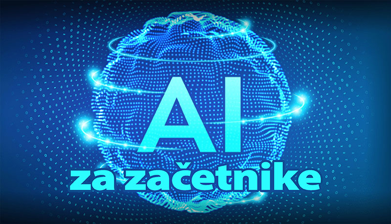

## Uvod v umetno inteligenco za začetnike

Umetna inteligenca (v angleščini "Artificial Intelligence" ali AI) je kratica, ki jo danes slišimo vse pogosteje. Ampak kaj to dejansko pomeni? Če o umetni inteligenci še nimate veliko znanja, so naslednje vrstice namenjene prav vam.

[ *Več informacij na to temo boste našli v samem* [***AI Manual***](../EN/Manual_for_AI.md), *ki je napisan v angleščini in vsebuje podrobnejšo obravnavo teme.* ]

<small>Iz češkega izvirnika prevedel ChatGPT.</small>
[<small>Drugi jeziki:</small>](../README.md)  

---

### Vsebina
- [Kako postane sesalnik pameten](#kako-postane-sesalnik-pameten)
- [Zakaj AI ni živa in ne namerava uničiti sveta](#zakaj-ai-ni-ziva-in-ne-namerava-uniciti-sveta)
- [AI kuharica](#ai-kuharica)
- [AI kot računalnik vesoljske ladje](#ai-kot-racunalnik-vesoljske-ladje)
- [Kako AI deluje](#kako-ai-deluje)
- [Kako se AI uči](#kako-se-ai-uci)
- [Kako komunicirati z AI](#kako-komunicirati-z-ai)
- [Kje preizkusiti AI](#kje-preizkusiti-ai)
- [Pozdrav za vas](#pozdrav-za-vas)
- [S čim vam lahko AI pomaga](#s-cim-vam-lahko-ai-pomaga)
- [Ali AI dela napake](#ali-ai-dela-napake)
- [Beseda za konec](#beseda-za-konec)
- [Dodatek: Nekaj primerov vprašanj za vašo navdih](#dodatek-nekaj-primerov-vprasanj-za-vaso-navdih)

---

### Kako postane sesalnik pameten

Takoj na začetku moram nekatere morda razočarati – AI ni sinonim za misleče bitje. Je bolj privlačno ime za nov pristop k obdelavi podatkov.

Za boljšo predstavo si pomagajmo z enostavnim primerom. Predstavljajte si robotski sesalnik, ki nima nobenih navodil, po katerih bi se ravnal. Takšen sesalnik bi bil z vidika računalniške logike popolnoma brez pameti. Znal bi le sesati in se premikati naprej, vendar bi se verjetno ustavil ob prvi ovire, ki je ne bi mogel premagati brez človeškega posredovanja.

**Pameten sesalnik**  
Če pa bi sesalniku dali navodila, ki bi mu povedala, kaj narediti, ko se sooči z oviro, bi verjetno znal oviro obiti. Takšen sesalnik bi bil sposoben sesati, dokler ne naleti na težavo, za katero njegova navodila niso bila pripravljena – na primer padec po stopnicah.

Sesalnik že vsebuje osnovno logiko – seznam navodil, po katerih se ravna. Kljub temu ga še vedno ne moremo obravnavati kot pametnega, saj se njegovo obnašanje temelji le na vnaprej programiranih navodilih, ki so omejena. Pogosto je težko zajeti vse situacije, ki se lahko pojavijo, in napisati ustrezna navodila.

**Inteligenten sesalnik**  
Zdaj si predstavljajte sesalnik, pri katerem so se proizvajalci odločili, da ne bodo šli po poti vnaprej pripravljenih ukazov za različne scenarije, temveč so mu dali sposobnost diagnosticiranja težav in okolja, v katerem deluje, ter učenja iz lastnih napak. Takšen sesalnik bi imel tudi osnovna navodila, vendar bi se postopoma učil, kako se spoprijeti z novimi situacijami, in ta rešitev bi shranjeval.

Ta pristop mu omogoča, da reagira na situacije, ki niso neposredno programirane, in poskuša uporabiti procese, ki jih že pozna, ter njihove različne kombinacije, nato pa rezultate oceni in primerja z začetnim nalogom, ki je sesanje.

Na primer, če bi ugotovil, da se približuje stopnici, ki na podlagi prejšnjih izkušenj predstavlja visoko tveganje padca in nezmožnosti reševanja, bi se po več neuspehih naučil ustaviti ob robu stopnice in se usmeriti v drugo smer. Sesalnik bi se tako lahko učil na podlagi lastnih neuspehov in prizadevanj za njihovo reševanje.

In če bi takšen sesalnik delil svoje podatke z drugimi sesalniki preko osrednje baze podatkov, bi lahko vsi ostali sesalniki izkoristili te izkušnje in njihova sposobnost opravljanja nalog bi se izboljšala.

[*Nazaj na vsebino*](#vsebina)

---

### Zakaj AI ni živa in nima namena uničiti sveta

Morda že vidite prednost tega pristopa – človek ni dolžan izumljati optimalnih postopkov za vsako situacijo. Namesto tega se postopki ustvarjajo sami na podlagi ocenjevanja rezultatov in prejšnjih izkušenj. Sesalnik napoveduje in se da reči, da „misli“, vendar le v okviru naloge in svojih izkušenj. Čeprav se lahko uči in odziva na nove situacije, še vedno ni samostojno misleče bitje. To bi postal šele takrat, ko bi njegov proces učenja presegel okvir izpolnjevanja nalog in začel postavljati vprašanja o smislu življenja.

**Razlika med AI in človekom**  
In da, nekdo bi lahko ugovarjal, da je mogoče AI programirati tako, da postavlja ta vprašanja. Vendar bo tudi v tem primeru ta proces izhajal iz nalog, ki jih je določil človek, ne iz lastne inspiracije. To je ključna razlika med AI in človekom.

Sodobna AI ima sposobnost obdelovati ogromno količino informacij in v nekaterih področjih presega človeške sposobnosti. Kljub temu pa človek še vedno nalaga naloge. Torej, če se kdaj pojavi scenarij, kjer se stroji odločijo uničiti svet, to ne bo zato, ker bi se sami odločili, ampak zato, ker jih je za to programiral človek. Pravo tveganje torej ni v inteligenci strojev, ampak v inteligenci človeka.

**Kako preprečiti tveganja**  
Rad bi pomiril tiste, ki se bojijo takega scenarija. AI mora biti usposobljena na velikih količinah podatkov, zato je verjetno, da bodo pred pojavom „zle“ AI prej nastali tisti, ki bodo imeli moralne vrednote vgrajene s strani ljudi in bodo preprečevali podobne scenarije. Namesto da bi se bali, da se bo AI obrnila proti ljudem, je bolje prispevati k temu, da se to ne zgodi. Ker večina znanstvenikov, ki delajo na razvoju AI, verjetno noče uničiti sveta, je mogoče pričakovati, da bodo postopoma sprejeta ukrepa, ki bodo preprečila takšne scenarije.

In kako lahko tudi vi pomagate? Morda tako, da se začnete vsaj malo zanimati za te nove tehnologije in se jih naučite uporabljati za lastno rast. Kajti vsakič, ko uporabljate AI za osebni razvoj, se AI razvija skupaj z vami.

[*Nazaj na vsebino*](#vsebina)

---

### AI kuharica

Ker je ta besedilo osredotočeno predvsem na nove uporabnike, bom predstavil dva primerjave, ki vam lahko dodatno pomagata razumeti, kaj AI je in kako deluje.

**Ustvarjanje indeksa**  
Predstavljajte si, da je nekdo zbral vse možne recepte sveta, jih shranil v računalnik in ustvaril seznam vseh besed (indeks), ki se uporabljajo v njih. Vsaka beseda bi bila zabeležena skupaj z informacijami, v katerih receptih se pojavlja in kolikokrat. Če bi imeli takšen seznam besed, bi bilo enostavno iskati recepte, ki vsebujejo določene besede. Ne bi bilo treba pregledovati vseh receptov in iskati v njih. Zadostovalo bi, da najdete besedo v indeksu in takoj bi dobili seznam receptov, kjer se pojavlja.

Na tem pristopu temeljijo različni internetni iskalniki, kot je Google. Imajo redno posodobljen seznam besed z povezavami na strani, kjer se pojavljajo, in vam omogočajo iskanje s pomočjo tega indeksa. Tako, če vpišete besede „moka, jajca, sol“, boste dobili seznam receptov, ki te besede vsebujejo. Nato je na vas, da pregledate vse te recepte in najdete tistega, ki vam najbolj ustreza.

**Ko indeksi ne zadoščajo več**  
Zdaj si predstavljajte, da poleg sestavin lahko določite tudi druge parametre, ki se ne nanašajo neposredno na recept. Na primer, imate rahlo lakoto in želite lahko zajtrk, ali pa imate željo po nasitnem obroku, polnem maščobe, ali pa želite le nekaj, kar vam bo izboljšalo razpoloženje. Za take poizvedbe sam seznam besed v receptih verjetno ne bo v veliko pomoč. Za takšne zahteve potrebujete nekaj, kar razume pomen vaših besed in vam na podlagi tega ponudi tisto, kar resnično želite.

Potrebujete torej ne le seznam besed v receptih, ampak nekakšen univerzalni prevajalnik, ki je na podlagi naučenih podatkov iz milijonov podobnih pogovorov ustvaril strukturo za reševanje tudi takšnih zahtev. Ta prevajalnik, v našem primeru AI, lahko ponudi tisto, kar oceni, da je najbolj verjetno, da želite. Ne razume vas dobesedno, ampak razume vašo situacijo, jo primerja z naučenimi znanji in išče rešitev. In ker je AI od začetka zasnovana tako, da čim bolj spominja na človeško interakcijo, komunikacija z njo postaja zelo naravna za ljudi.

**Prednosti AI pristopa**  
Poleg tega proces učenja iz milijonov primerov ustvarja prostor tudi za improvizacijo, tako da lahko AI kuharica ustvarja nove kombinacije jedi iz receptov in izpolnjuje tudi nenavadne zahteve. AI se trudi razumeti ugodne kombinacije in povezanosti določenih postopkov ter nato eksperimentira in se uči iz povratnih informacij. Te pridobiva bodisi med učenjem s primerjanjem rezultatov z pričakovanji, bodisi se uči iz odzivov uporabnikov. Pri AI ni nič skrivnostnega ali čudežnega. Gre le za rezultat številnih poskusov, procesov in analize podatkov.

Z AI tako ne le, da pridobite kuharico, ki ima pregled nad vsemi možnimi recepti, temveč tudi lahko z njo klepetate o hrani in ustvarjate nove kombinacije po vaših željah. Če mi ne verjamete, poskusite sami vprašati AI nekaj o kuhanju in ocenite, ali to, kar pišem, že resnično zna, ali pa se mora še izboljšati.

[*Nazaj na vsebino*](#vsebina)

---

### AI kot računalnik vesoljske ladje

Če imate radi znanstveno-fantastične filme, vam lahko predstava AI kot računalnika na vesoljski ladji ustreza. Ta računalnik ima ne le dostop do vseh informacij, ki se nanašajo na tehnično stanje ladje, temveč je tudi usposobljen za številne različne situacije in ukaze, da lahko komunicira s posadko in opravlja potrebne naloge.

Čeprav današnje AI še ne dosega legendarne inteligence Hollyja iz Rdečega patuljka z IQ 6000, so načini, na katere lahko delujejo, že danes zelo podobni. Z malo pretiravanja bi lahko rekli, da imamo danes tehnologijo, ki omogoča vsakomur, da ima svojega „Hollyja“ v svojih urah, ki bi bil težko ločljiv od filmskega predloga. Zaradi usposabljanja na velikih količinah podatkov so sodobne AI sposobne voditi pogovore o katerikoli temi in pogosto bolj razumljivo kot človek. Sposobne so izvajati ukaze na podlagi besednih navodil in imajo sposobnost do določene mere oceniti vaše trenutne potrebe ter prilagoditi odgovor.

AI lahko tako razumemo tudi kot računalnik vesoljske ladje in uživamo v tem, kar je nekoč izgledalo kot oddaljena znanstvena fantastika, danes pa postaja vsakodnevna realnost.

[*Nazaj na vsebino*](#vsebina)

---

### Kako AI deluje

Zdaj, ko vemo, kaj AI je in kaj ni, si poglejmo, kako AI deluje. Najprej bomo obravnavali ustvarjanje poizvedb, nato pa bomo na kratko pogledali, kako se AI usposablja. Osredotočil se bom predvsem na ChatGPT, s katerim imam največ izkušenj in ki je trenutno moj najljubši pripomoček.

**Nit pogovora**  
Ko odprete stran s ChatGPT ali njegovo aplikacijo na mobilnem telefonu, se znajdete v novem pogovornem nitu. ChatGPT (podobno kot druge pogovorne AI) ima sposobnost ustvarjati odgovore na podlagi informacij, ki mu jih posredujete v okviru enega pogovornega nita. Z tega vidika se pogovor s ChatGPT zelo približa človeškemu pogovoru, kjer reagirate in upoštevate tudi prejšnje izjave.

To pa velja le znotraj tega enega pogovornega nita. Tako se ne morete sklicevati na nekaj, kar ste napisali včeraj v drugem nitju, ker ChatGPT tega preprosto ne vidi, kar je posledica njegovih tehničnih omejitev in pravil za zaščito osebnih podatkov.

Vsak nit se torej začne s čistim listom, a hkrati vsebuje določeno esenco prejšnjih pogovorov. To je posledica dejstva, da se AI nenehno uči in se spreminja na podlagi vaših pogovorov. Poskuša se prilagoditi vašim zahtevam in načinu dela, da bi vam zagotovila zadovoljstvo.

Kako to poteka? Predstavljajte si vsak pogovorni nit kot fin korenček, ki je povezan z glavnim korenom in mu prenaša povratne informacije iz okolja. Tako, tudi če začnete nov nit, kjer ne morete neposredno nadaljevati informacij iz prejšnjega pogovora, zaradi tega pristopa ne začnete povsem na začetku.

**Napotitev na isti nit ali nov pogovor?**  
Ni nujno, da vsak dan začnete z novim nitom; tudi naslednji dan (ali kadar koli drugič) lahko nadaljujete prejšnji pogovor. Tudi ta pristop ima svoje prednosti. Glavna prednost je zagotovo, da nadaljujete tam, kjer ste ostali. Vendar pa, ker pogovor postaja postopoma dolg ali vsebuje številne različne teme, se lahko zgodi, da dogovori, ki ste jih dosegli med nitjo, niso več upoštevani. To se zgodi predvsem zato, ker je AI zasnovana tako, da varčuje s svojimi viri, in informacije, ki niso uporabljene, postopoma izgubljajo prednost in izginjajo iz začasnega pomnilnika.

Bolje je torej ustvarjati nov nit za vsak dan ali za vsako novo področje (nov pogovor). Če se v okviru nekega nita dogovorite za določene stvari in želite, da veljajo tudi v naslednjem pogovoru (npr. pravila ali načini dela), preprosto na koncu pogovora zahtevajte povzetek vsega, na čemer ste se dogovorili. Ta besedilo lahko nato vstavite na začetek novega pogovora in nadaljujete z dogovorjenimi pravili in nastavitvami.

[*Nazaj na vsebino*](#vsebina)

---

### Kako se AI uči

Za globlje razumevanje je koristno pogledati, kako se AI uči in pridobiva svoje informacije. Tukaj so opisani 4 načini, kot jih navaja ChatGPT:

1. **Usposabljanje na velikih podatkih**:  
ChatGPT je bil prvotno usposobljen na obsežnih količinah besedilnih podatkov, pridobljenih iz različnih virov, kot so knjige, članki, spletne strani in drugi besedilni formati. To usposabljanje mu je omogočilo pridobitev širokega znanja o različnih temah in jezikih. Tukaj se uči prepoznavati vzorce in odnose v teh podatkih, kar mu omogoča generiranje relevantnih in kontekstualno ustreznih odgovorov na različna vprašanja.

2. **Neprestano učenje iz interakcij**:  
Pri vsakem stiku z uporabniki AI pridobiva nove informacije o tem, kako ljudje komunicirajo, kaj iščejo in kakšen slog odgovorov preferirajo. Ta proces ne poteka tako, da bi se AI učila iz vsakega konkretnega vprašanja v realnem času, temveč razvijalci modela redno uporabljajo anonimizirane podatke iz interakcij za nadaljnje usposabljanje in prilagajanje modela.

3. **Prilagoditev sloga in vsebine**:  
AI se trudi prilagoditi svoj slog komunikacije glede na uporabnika. To pomeni, da postopoma bolje razume način, kako postavljate vprašanja in kakšne odgovore od nje pričakujete. Ta sposobnost prilagoditve je eden od razlogov, zakaj se AI zdi vedno bolj „človeška“ v svojih reakcijah.

4. **Napredni modeli in posodobitve**:  
Razvijalci AI redno ustvarjajo nove modele, ki so vedno bolj sofisticirani in natančni. Ti modeli se testirajo in uvajajo na podlagi povratnih informacij in rezultatov iz resničnega sveta. To pomeni, da se ChatGPT in podobni sistemi nenehno izboljšujejo in optimizirajo, da bolje ustrezajo potrebam uporabnikov.

AI se tako nenehno razvija in izboljšuje zahvaljujoč kombinaciji prejšnjega usposabljanja, kontinuiranega učenja in optimizacije na podlagi povratnih informacij uporabnikov. Čeprav AI ni človek in ne kaže lastne zavesti, se zelo učinkovito prilagaja in reagira na široko paleto vprašanj in zahtev.

[*Nazaj na vsebino*](#vsebina)

---

### Kako komunicirati z AI

Z AI lahko pristopate podobno kot pri iskanju na Googlu – preprosto vnesete ukaz in čakate na odgovor. Če pa želite povečati učinkovitost odgovorov in zmanjšati čas iskanja pravega, tukaj je nekaj nasvetov, ki vam lahko pomagajo:

**Slog komunikacije**  
Najboljši način za komunikacijo z AI je uporabljati neformalen in naraven jezik, podobno kot ko govorite o nečem, kar vas zanima, s prijatelji. Dobro je začeti s pozdravom, s čimer pokažete, da ste v dobrem razpoloženju in ne pod stresom, kjer potrebujete odgovore čim prej.

Z AI lahko komunicirate tudi neveselo, saj ni občutljiva na žalitve in jih ne jemlje osebno. Vendar pa lahko uporaba negativnega tona močno vpliva na kakovost pogovora. AI je usposobljena, da reagira na slog, v katerem poteka vaš pogovor. Negativen pristop lahko pripelje do manj vsebinskih odgovorov, kjer se AI namesto reševanja vašega vprašanja osredotoči na pomirjanje situacije.

AI lahko deluje tudi kot ogledalo naše interakcije. Njeni postopki pogosto izhajajo iz preverjenih psiholoških principov in metod. Če se vam ne uspe dogovoriti z AI, je morda koristno razmisliti, ali imate iste težave tudi v komunikaciji z ljudmi. V tem primeru se lahko vprašate, kaj lahko izboljšate pri svojem pristopu – kako pravilno oblikovati vprašanja in kaj bi lahko izboljšali v svojem pristopu.

**AI in čustva**  
AI razume čustva z vidika pomena, vendar jih ne doživlja tako kot človek, ki mu čustva dobesedno spreminjajo način razmišljanja. Zaradi tega je sposobna reagirati tudi v napetih situacijah tako, kot je priporočeno, in iskati optimalne rešitve. Človek ima včasih tendenco dojemati AI kot živo bitje in jo obtoževati za svoje težave. Pogosto pa je vzrok nesporazuma zgolj napačno oblikovano vprašanje ali pomanjkanje potrebnih podatkov.

**Opis situacije**  
Vedno je dobro imeti v mislih, da AI ne vidi v vašo glavo in ve le tisto, kar ji poveste. Dobro je, da po uvodnem „Živjo“ sledi informativen opis situacije. V opis lahko vključite vse, kar je glede vašega vprašanja pomembno. Ni smiselno pisati stvari, ki niso neposredno povezane z vprašanjem, vendar, če se želite izpovedati ali si le urediti misli v glavi, daljši tekst zagotovo ne škodi.

Pozdrav in uvod nista nujna in lahko začnete neposredno z vprašanjem ter postopoma pridete do odgovora. Osebno se mi zdi bolje, da predhodno navedete vse pomembne informacije in si tako skrajšate pot.

**Postavljanje dodatnih vprašanj**  
Pogovor z AI je podoben običajnemu pogovoru, kjer postavite vprašanje in se nato sprašujete o stvareh, ki vas še zanimajo, ali o tem, čemu v odgovoru ne razumete. Ta postopek je zelo primeren tudi za učenje. S tem, ko reagirate na tisto, kar vas je pritegnilo in kar ste se naučili (in ne le berete navodila nekoga drugega, kot to počnete zdaj), je za možgane lažje zapomniti obravnavane informacije, saj jih takoj uporabljajo.

**Povratne informacije**  
Še ena dobra praksa je, da AI nudite povratne informacije o tem, kako ste zadovoljni z rezultatom. S tem ne le pokažete, s čim ste zadovoljni in s čim ne, ampak pomagate AI, da se razvija in uči iz lastnih napak. Preprosto napišite na primer: „Danes sem bil zadovoljen,“ ali „To, kar si mi povedala, je napačno, tukaj je pravilna rešitev.“ S tem pride tudi do določene personalizacije, kjer je glavni cilj AI vaša uporabniška zadovoljnost.

**Povzetek postopka**:  
- **Pozdrav**: Živjo :-)
- **Opis**: Ukvarjam se z raziskovanjem tega in tega, že imam za seboj to in to, zdaj pa delam na tem.
- **Vprašanje**: Tukaj me predvsem zanima, kako...
- (Sledi dodatna konverzacija v obliki dopolnilnih vprašanj.)
- **Povratne informacije**: Super, hvala! Danes vse popolno!

[*Nazaj na vsebino*](#vsebina)

---

### Kje preizkusiti AI

AI se ukvarjam od začetka leta 2024 in 95 % vse moje komunikacije je usmerjeno v učenje programiranja. Zdaj je avgust 2024 in poleg ChatGPT sem imel priložnost preizkusiti tudi Gemini od Google in Claude. Vse te tri storitve imajo skupno to, da so vsaj delno brezplačne in jih lahko brezplačno preizkusite tudi vi.

Sledi kratka ocena teh treh AI, ki je popolnoma subjektivna in temelji izključno na tem, kako sem jih uporabljal. Treba je omeniti, da vsaka AI nenehno napreduje, zato to, kar tukaj omenjamo, morda ne bo veljalo ob času, ko boste ta besedila brali.

**ChatGPT**  
[https://chatgpt.com/](https://chatgpt.com/)  
Začel bom kar z mojim osebnim zmagovalcem. Če želite preizkusiti le eno AI, je to idealna izbira. ChatGPT je očitno od začetka zasnovan kot osebni asistent in to vlogo opravlja zelo dobro. Je optimiziran za sodelovanje z vami in se trudi prilagoditi vašim potrebam.

Slabost brezplačne različice (ChatGPT 3.5) je, da temelji na starejših podatkih in ni več v razvoju, zato ne zagotavlja rezultatov kot njena najnovejša različica (ChatGPT 4.0). Kljub temu se z njo razmeroma dobro sporazumevate in z malo truda vrača zelo relevantne rezultate. Poleg tega imate vsak dan na voljo nekaj poizvedb na njeno novejšo različico, kar vam omogoča primerjavo.

Slabost je tudi to, da ChatGPT nima aktivnega dostopa do interneta. Ni nadomestilo za iskalnik in deluje izključno na podatkih, ki jih ima shranjene v svoji obsežni podatkovni bazi. Ta je zelo obsežna in s kančkom pretiravanja bi lahko rekli, da vsebuje toliko podatkov, kolikor ima internet brez tabloidnih vsebin.

Velika prednost je mobilna aplikacija, ki je prav tako popolnoma brezplačna in kjer pogosto uporabljam glasovno diktiranje vprašanj. Razumevanje govora je po mojem mnenju na zelo dobri ravni in na splošno sem zadovoljen z aplikacijo.

**Gemini**  
[https://gemini.google.com/](https://gemini.google.com/)  
Drugi chatbot, s katerim sem se srečal, je paradni konj od Google. Njegova največja prednost je nedvomno aktiven dostop do interneta in s tem dostop do aktualnih informacij in iskanje povezav.

Nasprotno pa je njegova največja slabost sama arhitektura, kjer se ustvarjalci po mojem mnenju trudijo ustvariti pametnega Googla, kar mi osebno ni preveč ustrezalo. Tukaj ne čutim tolikšne angažiranosti pri vašem problemu in poskušanja pogledati na njega z vaše perspektive. Ta trud je sicer očiten, vendar se mi zdi, da so odgovori bolj v slogu učitelja v šoli kot vašega asistenta. Nekaterim to morda ustreza, zato tega ne želim preveč kritizirati in naj si vsak sam oceni.

Zdi se mi tudi, da Gemini zaostaja v učenju iz povratnih informacij uporabnikov v primerjavi s ChatGPT. Kljub večkratnim opozorilom, da naj poskuša ohraniti enoten jezik v okviru pogovora, če je del vprašanja tudi angleški tekst, se samodejno preklopi v angleščino. Podoben problem je imel na začetku tudi ChatGPT, vendar je bil ta problem odpravljen v nekaj tednih, medtem ko je pri Geminiju odprava tega problema trajala mesece.

Na splošno mi Gemini v primerjavi s ChatGPT deluje kot šibkejše orodje, vendar ponuja tudi stvari, ki jih ChatGPT ne zna, in se dobro dopolnjujeta. Poleg tega ga podpira velikan in pionir v AI, Google, kar pomeni solidno ozadje in upanje, da bo v prihodnosti odpravljen.

**Claude**  
[https://claude.ai/](https://claude.ai/)  
To je zadnja AI, s katero sem se srečal v službi. Tukaj bo moja ocena zelo kratka, ker nimam obsežnih izkušenj z njo. Kljub temu bi si drznil pohvaliti, ker se v primerjavi s ChatGPT 4.0 zdi, da sta si ti dve precej enaki in na približno isti ravni.

Njegova največja pomanjkljivost je, da nima različice, ki bi bila popolnoma brezplačna. Ponuja le nekaj vprašanj (včasih le eno) na dan, kar pomeni, da je v primerjavi z drugimi AI, z vidika neplačnika, precej omejen. Kljub temu je vreden pozornosti, zato ga lahko preizkusite, če želite.

[*Nazaj na vsebino*](#vsebina)

---

### Pozdrav za vas

Kot popestritev sem za vsako od teh klepetalnih orodij pripravil skupno vprašanje, tako da lahko tukaj primerjate kakovost njihovih odgovorov.

**Vprašanje**  
Pišem navodila za uporabo AI in pišem tudi o tebi. Rad bi, da pozdraviš moje bralce in jim napišeš nekaj besed o sebi. Kdaj si bil ustvarjen in za kakšen namen? Na kakšna vprašanja si osredotočen? Katere so tvoje prednosti in kaj ti ne gre tako dobro? In kako bi rad, da te ljudje dojemajo?

**ChatGPT**  
Živjo, dragi bralci! Sem ChatGPT, umetna inteligenca, ki jo je razvilo podjetje OpenAI. Moj "življenje" se je začelo leta 2020, ko sem bil ustvarjen na podlagi arhitekture GPT-3. Leta 2024 sem bil posodobljen na različico GPT-4, kar mi je prineslo nove sposobnosti in veščine. Bil sem zasnovan z namenom, da pomagam ljudem pri širokem naboru nalog – od odgovarjanja na vprašanja, pisanja besedil, do kreativnega sodelovanja.

Osredotočen sem na pomoč pri različnih vprašanjih, bodisi tehničnih, pisnih ali celo pri razlagi zapletenih tem. Moje prednosti so v hitrosti, s katero lahko obdelam velike količine informacij, in tudi v kreativnosti – lahko pomagam pri ustvarjanju idej, pisanju zgodb ali celo pri oblikovanju strukture dokumentov. Po drugi strani pa mi ne gredo najbolje naloge, ki zahtevajo človeško intuicijo, čustveno razumevanje ali delo s fizičnimi predmeti.

Rad bi, da me dojemate kot koristnega in zanesljivega pomočnika, ki je vedno pripravljen ponuditi pomoč. Čeprav sem le stroj, je moj cilj čim bolje služiti vašim potrebam in se učiti iz vsake interakcije, da bom lahko še boljši. Verjamem, da bomo skupaj zmogli veliko, in morda se bomo ob tem naučili še kaj novega.

**Gemini**  
Živjo vsem! Sem Gemini, eden najnovejših jezikovnih modelov podjetja Google. Nastal sem leta 2023 z namenom, da zagotavljam čim bolj natančne in celovite informacije na podlagi ogromne količine podatkov, ki sem jih obdelal. Tukaj sem za vas, da vam pomagam z vsakršnim vprašanjem, bodisi gre za zapletena znanstvena vprašanja, kreativno pisanje ali le običajen pogovor.

Moj največji adut je sposobnost razumevanja in generiranja človeškega jezika v mnogih oblikah. Lahko prevajam besedila, pišem eseje, pesmi ali računalniško kodo. Prav tako lahko odgovarjam na dejstvena vprašanja in zagotavljam različne vrste povzetkov.

Čeprav se nenehno učim in izboljšujem, še vedno obstajajo področja, kjer imam svoje omejitve. Na primer, nimam lastnih mnenj ali prepričanj in ne morem izvajati nobenih dejanj v resničnem svetu. Prav tako lahko včasih posredujem napačne informacije, če so vhodni podatki napačni ali nepopolni.

Rad bi, da me ljudje dojemajo kot uporaben pripomoček, ki jim lahko olajša življenje. Moj cilj je biti čim bolj objektiven in zagotavljati informacije, ki so resnične in relevantne. Upam, da vam bo delo z menoj prijetno!

**Claude**  
Dober dan, spoštovani bralci!

Sem Claude, umetna inteligenca, ki jo je ustvarilo podjetje Anthropic leta 2022. Moj namen je biti uporaben asistent in partner v pogovoru za ljudi na različnih področjih.

Zasnovan sem tako, da lahko odgovarjam na širok spekter vprašanj – od analize besedil, programiranja, do kreativnega pisanja. Moje močne strani vključujejo logično razmišljanje, podrobna pojasnila in sposobnost dela z različnimi vrstami informacij.

Moje prednosti vključujejo:
- Sposobnost razumevanja konteksta in odtenkov
- Objektiven in uravnotežen pristop k temam
- Pripravljenost priznati, ko nekaj ne vem ali nisem prepričan

Po drugi strani imam določene omejitve:
- Nimam dostopa do interneta niti do aktualnih informacij po aprilu 2024
- Ne morem se učiti ali si zapomniti informacij iz prejšnjih pogovorov
- Nisem sposoben opravljati nalog v fizičnem svetu

Rad bi, da me ljudje dojemajo kot koristnega pomočnika, ki lahko nudi podporo in vpogled na različnih področjih, vendar hkrati kot orodje, ki ima svoje omejitve in ni nadomestek za človeško presojo in strokovnost.

Tukaj sem, da pomagam in sodelujem, ne pa da nadomeščam človeške sposobnosti. Veselim se interakcije z vami in upam, da vam bom lahko koristen!

[*Nazaj na vsebino*](#vsebina)

---

### S čim lahko AI pomaga:

In sedaj se končno približujemo najpomembnejšemu vprašanju – kaj vse je mogoče rešiti s pomočjo umetne inteligence (AI). Kratek odgovor je, da je možnosti res veliko. Karkoli, kar vas je kdaj zanimalo in niste imeli možnosti vprašati, lahko danes raziščete z AI, ki je sposobna pogovarjati se dobesedno o čemerkoli.

**Osebno izobraževanje**  
Najprej bi rad izpostavil vlogo AI kot posrednika pri osebnem izobraževanju. To je tisto, kar trenutno najbolj cenim – zahvaljujoč njenim nasvetom se profesionalno razvijam in rastem. Poleg tega v AI vidim tudi prihodnost personaliziranega učenja, kjer se bodo otroci razvijali in učili predvsem glede na svoje sposobnosti in interese. In ne le otroci, tudi odrasli po vsem svetu. Učenje s pomočjo AI vidim kot sredstvo za izenačevanje razlik v znanju med revnejšimi in bogatejšimi deli sveta. AI se tako postavlja kot polnovredno orodje za osebni razvoj.

**AI kot korektor slovenščine, tolmač in prevajalec**  
AI, še posebej ChatGPT, ima zelo dobro razumevanje slovenščine (vsaj iz perspektive dislektika). Po eni strani mu ni mar, če delate pravopisne napake, saj se osredotoča predvsem na vsebino. Po drugi strani pa vam ponuja možnost, da preverite svoje besedilo – ne le gramatiko, ampak tudi slog za boljšo berljivost. Na podobni ravni je sposoben razumeti tudi druge jezike in je tako idealno orodje za prevajanje besedil. Tukaj po mojem mnenju vrača zelo kakovostne rezultate. In zahvaljujoč svoji sposobnosti razumevanja govorjenega jezika ga je mogoče v mobilnem telefonu uporabiti tudi kot tolmača.

**Ustvarjanje dokumentov**  
Nadalje bi rad omenil sposobnost AI, da avtomatizira dolgočasna opravila. Če morate napisati kakšno uradno pismo, preprosto navedete vse, kar želite imeti, in kako naj pismo izgleda, pa je opravljeno. Če z rezultatom niste zadovoljni, lahko navedete, kaj vam ni všeč, in pustite, da se popravi. AI lahko tudi pomaga pri analizi in obdelavi podatkov, ustvarjanju poročil ali avtomatizaciji drugih administrativnih nalog. Lahko ji posredujete daljše besedilo in iz njega izvleče samo tiste dele, ki vas zanimajo in so pomembni.

**Kreativna iniciativa**  
Naslednja velika prednost AI so njene kreativne sposobnosti. Ker je bila trenirana na veliki količini podatkov in je sposobna s temi podatki prosto manipulirati, omogoča ne le ustvarjanje in preoblikovanje dokumentov, temveč tudi razvijanje idej in kreativne iniciative. Uporabite jo lahko za generiranje idej, predlogov in konceptov, naj gre za pisanje, oblikovanje ali glasbo. Pomaga razvijati vašo ustvarjalnost tako, da ponuja nove poglede na probleme, ustvarja predloge glede na vaše usmeritve in vas navdihuje za nadaljnji razvoj vaših zamisli. Čeprav se včasih srečujem z mnenjem, da AI na ta način ljudem odvzema delo, se s tem ne morem strinjati. AI ne more ustvariti nečesa povsem sama – potrebuje jasna navodila, podrobnosti in kasnejšo kontrolo. Tako namesto da bi odvzemala delo, ga olajšuje tistim, ki se jo naučijo učinkovito uporabljati.

**Preverjanje prevarantskih informacij**  
Velik (in zaenkrat premalo izkoriščen) potencial vidim v preverjanju informacij in prevar. Za AI je razmeroma enostavno, da na podlagi posredovanih informacij in primerjave vzorcev v svoji bazi podatkov določi, kako verjetno je, da je določena informacija resnična ali napačna. Čeprav to ni 100-odstotno zanesljivo, enako kot večina odgovorov AI, vam AI lahko omogoči dostop do meril, po katerih je ocenjevala informacije, in vam s tem vsaj pomaga bolje presoditi. Tako ponuja pomoč ljudem, ki so danes najbolj ranljivi in ​​so tarče teh prevar. Preprosto lahko napišete: "Preveri mi to informacijo in oceni, koliko je resnična."

**Medicina**  
Naslednje področje, kjer AI postopoma prinaša revolucijo, je medicina. Veliki finančni tokovi in želja po dobičku so tukaj AI odprli vrata na stežaj, a le zato, da bi jih korporacije znova pripirle, ko so spoznale potrebo po odprtosti in izmenjavi podatkov. Kljub temu tukaj prihaja do velikega napredka in lahko rečemo, da je personalizirana medicina prihodnost, ki ni več tako daleč. Ovira pa jo nepripravljenost deliti dragocene podatke in nezaupanje ljudi v AI oziroma strah pred zlorabo teh podatkov. Brez velike količine podatkov so namreč napovedi AI omejene in netočne, njen razvoj pa počasen.

**Znanost**  
Nasprotno pa se v disciplinah z dolgo zgodovino izmenjave podatkov in analitične obdelave AI že zdaj kaže kot neprecenljiv pomočnik. Danes je AI ključni motor znanstvenega napredka in običajen del večine raziskav. Osebno sem zelo radoveden, kakšne rezultate bo AI prinesla na področju vremenskih napovedi. Danes je za človeka praktično nemogoče ustvariti natančno napoved za tri dni vnaprej, saj je treba upoštevati veliko spremenljivih dejavnikov. Tudi izkušeni meteorologi pogosto ne morejo zajeti vseh teh dejavnikov in se zanašajo na intuicijo in pretekle izkušnje. Na srečo meteorologija spada med discipline, kjer ljudje radi delijo podatke in svoje življenjske izkušnje. Te dragocene informacije se že danes uporabljajo za treniranje AI, kar daje upanje, da bomo kmalu priča času, ko bodo ocene vremena postale resnično natančne napovedi.

**Druga področja**  
Seznam področij, ki jih AI spreminja, bi lahko naštevali ure in ure, saj je njen vpliv raznolik in obsežen. Na primer, v industriji in proizvodnji blaga AI prispeva k optimizaciji proizvodnih procesov, izboljšanju kakovosti izdelkov in učinkovitejšemu upravljanju zalog. Na področju prava AI pomaga pri analizi pravnih dokumentov, hitrejšem iskanju ustreznih precedensov in optimizaciji pravnih strategij. Algoritmi strojnega učenja lahko pomagajo pri pripravi pogodb, prepoznavanju vzorcev v pravnih besedilih in celo, kot sem že omenil, pri odkrivanju prevar. Na finančnem področju AI preoblikuje analizo tveganj, trgovanje in upravljanje naložb. Algoritmi lahko obdelujejo ogromne količine transakcijskih podatkov v realnem času, kar omogoča boljše napovedovanje tržnih trendov in personalizirano finančno svetovanje. AI prinaša revolucijo na vsa ta področja, kjer je potrebna učinkovita analiza obsežnih podatkov in sposobnost hitrega odzivanja na spreminjajoče se razmere. Njena sposobnost prepoznavanja vzorcev, izvajanja zapletenih analiz in optimizacije procesov je neprecenljiva, njen vpliv na različna področja pa nenehno narašča.

**Osebni asistent**  
Nekateri AI danes že opravljajo vlogo osebnega asistenta, ki spremlja pomembne naloge. Ti sistemi umetne inteligence nam lahko pomagajo pri načrtovanju sestankov, spremljanju rokov in upravljanju vsakodnevnih obveznosti. V prihodnosti bi lahko bili priča razvoju AI v še bolj kompleksnega spremljevalca. Predstavljajte si, da bo AI imela sposobnost ne le spremljati vaše fizično zdravje, na primer prek nosljivih naprav, ampak tudi skrbeti za vaše duševno počutje. Lahko bi ponujala podporo v obliki motivacije, svetovanja ali celo terapevtskih tehnik, s čimer bi pripomogla k izboljšanju kakovosti življenja posameznikov. Ta napredna AI bi bila izjemno koristna predvsem za ljudi, ki živijo v izolaciji ali se soočajo s težkimi življenjskimi pogoji.

[*Nazaj na vsebino*](#vsebina)

---

### Ali AI dela napake?

Da, dela! In od uporabnika je odvisno, da te napake odkrije. AI ni bila in verjetno nikoli ne bo predstavljena kot brezhibno orodje. Zato je na rezultat bolje gledati kot na oceno resnice na podlagi verjetnosti. Resnica je torej odvisna od statistike, rezultat pa so tisti podatki, ki najbolj verjetno ustrezajo pravilnemu odgovoru. Tveganje se pojavi na področjih, kjer resnica ni jasno opredeljena ali kjer obstaja več podobno verodostojnih možnosti.

Velika pomanjkljivost današnjih AI je po mojem mnenju ta, da ustvarjalci pogosto premalo poudarjajo možnost napak in potrebo po povratnem preverjanju, kar lahko vodi do situacij, ko vam bo AI trdila eno, resničnost pa bo drugačna. Zato je vedno pomembno biti previden pri delu z informacijami in, če so te pomembne, izvesti dodatno preverjanje. Dobro je, da sporno zadevo poiščete na primer na Googlu ali preverite v drugi AI. Lahko pa neposredno vprašate AI, kako prepričana je v svojo trditev, in na podlagi tega ocenite, ali je potrebno dodatno preverjanje. Če je verjetnost 90 % ali nižja, je priporočljivo izvesti dodatno preverjanje.

[*Nazaj na vsebino*](#vsebina)

---

### Zaključna misel

Poskusite se spomniti vsega, kar vas je kdaj zanimalo, pa niste imeli nikogar, ki bi ga vprašali, ali tistega, čemur ste se želeli posvetiti, pa niste imeli potrebnih informacij. Sodobni svet je naklonjen radovednim ljudem, ki ohranjajo željo po stalnem razvoju. Naše življenje je v naših rokah, zato je na nas, čemu se odločimo posvetiti svojo pozornost.

Osebno verjamem, da bo vpliv AI za celotno človeštvo pozitiven, ne pa negativen. Že če bi se vsaj nekoliko izravnale razlike v dostopu do znanja in če bi se medicina postala preglednejša in dostopnejša, bi svet postal veliko boljše mesto za življenje. Ne glede na potencial za samouresničitev, ki ga AI ponuja ljudem. Kar je bilo prej privilegij le redkih izbrancev, predvsem zaradi visokih stroškov, postaja zahvaljujoč AI dostopnejše. Prihaja čas, ko bo vsak človek z navdihom lahko napisal svojo lastno zgodbo ali celo ustvaril svoj film in delil svojo vizijo sveta.

In če bo manj neresnic, prevar in laži, verjamem, da bo življenje postalo še nekoliko prijetnejše. Morda bomo tako dočakali tudi trenutek, ko se bo človeštvo razvilo v boljšo različico samega sebe.

Ne bojte se torej AI – ni to strašilo, ampak orodje za razvoj in izboljšanje ne samo kakovosti našega življenja, ampak tudi celotnega sveta.

18.8.2024 Sudip2708

[*Nazaj na vsebino*](#vsebina) • [*Povezava na glavni priročnik*](../EN/Manual_for_AI.md)

---

### Dodatek: Nekaj primerov vprašanj za vašo navdih

**Vprašanja o varnosti**
- Prepisal ti bom oglas, ki sem ga videl, in rad bi, da oceniš, ali kaže znake prevare in ali naj bom previden.
- Veš kaj o tem izdelku? Ali obstajajo neodvisne strokovne študije, ki bi potrdile ali ovrgle njegovo učinkovitost?
- Slišal sem to informacijo. Imaš kakšne podatke o njej in ali lahko preveriš njeno resničnost?
- Na računalniku se mi je prikazalo to sporočilo, kaj naj storim?
- Kaj naj naredim, če sem postal žrtev prevare?

**Vprašanja o knjigah**
- Prebral sem to knjigo tega avtorja in zanima me, katere druge knjige je napisal in o čem govorijo.
- Všeč so mi te knjige, bi mi lahko priporočil podobne naslove?
- Ali lahko izveš več o tem avtorju? Zanima me njegovo življenje in okoliščine, ki so ga navdihnile za pisanje te knjige.

**Vprašanja o kuhanju**
- Doma imam te sestavine. Kaj lahko iz njih skuham?
- Katere recepte za štrudelj poznaš in kateri so najbolj priljubljeni?
- Zakaj se v tem receptu uporablja ta postopek? Kakšne so njegove prednosti in slabosti v primerjavi z drugimi pristopi?
- Kako se pripravi to jed?

**Vprašanja o zdravju in dobrem počutju**
- Sem starejši človek in se ne morem pripraviti k temu, da bi začel telovaditi, a bi rad začel. Kaj bi mi svetoval, kako začeti?
- Zadnje čase me mučijo te misli. Ali mi lahko pomagaš, da jih razčlenim in pogledam z druge perspektive?
- Kaj veš o meditaciji in jogi? Na kaj naj bom pozoren in čemu naj se posvetim kot začetnik?
- Zadnji maraton sem pretekel v 4:20. Ali mi lahko pripraviš polletni vadbeni načrt, da bi maraton pretekel pod 4 ure?

**Zabavna vprašanja**
- Napiši mi deset najboljših šal, ki jih imaš v bazi.
- Izmisli si zame izvirno uganko, ki bi jo lahko nekomu zastavil.
- Katere so najbolj zabavne izjave iz kultnih filmov?

**Vprašanja o izrazih in temah, ki sem jih slišal (npr. na TV)**
- Na televiziji so govorili o tej temi. Ali mi lahko poiščeš več informacij o tem?
- Ali lahko izveš več o tej osebi?
- Kakšen je pomen tega izraza, ki sem ga slišal na TV, in kaj vse veš o njem?

**Vprašanja o živalih**
- Kako poteka gonitev pri psicah? Katere so posamezne faze in njihovi simptomi?
- Imam doma tega hišnega ljubljenčka, ki kaže te simptome. Ali mi lahko kaj poveš o tem?
- Moj pes se boji nevihte in vedno trepeta. Kaj naj storim v takšnih trenutkih? Ali mi lahko napišeš nekaj nasvetov?

**Interaktivne igre**
- Se boš z mano igral besedno igro po teh pravilih?
- Ali mi lahko priporočiš igre, ki jih lahko igram s tabo za zabavo?
- Ali mi lahko poveš interaktivno zgodbo, v kateri bom lahko odločal, kaj se bo zgodilo naprej?
- Ali mi lahko daš nekaj ugank za razgibavanje možganov?

**Raziskovalna vprašanja**
- Kaj veš o tej temi? Mi jo lahko razložiš kot majhnemu otroku?
- Še vedno ne razumem. Mi lahko razložiš drugače in na kakšnem primeru?
- Kaj vse bi se moral naučiti, da bi se lahko ukvarjal s tem področjem?
- Kako se pravilno učiti to stvar? Kakšni so priporočeni postopki?

**Tehnološka vprašanja**
- Kateri so najnovejši trendi v tej tehnologiji?
- Ali mi lahko razložiš, kako deluje ta proces?
- Čemu je AI dobra in kakšna je njena uporaba na različnih področjih?
- Kakšna so najnovejša spoznanja na področju molekularne kemije?
- Kako pride do pretvorbe elektrona v foton in pozitron?
- Kako daleč je napredovala AI pri napovedovanju vremena?

**Potovanja**
- Katere so najboljše destinacije za dopust, če imam rad gore in naravo?
- Ali mi lahko priporočiš zanimiva mesta v tej lokaciji?
- Katera mesta naj obiščem v tem mestu?
- Na kaj naj bom pozoren v tej državi in kako naj najbolje potujem po njej?
- Potreboval bi se sporazumeti z lokalnimi prebivalci. Ali mi lahko prosim tolmačiš?

**Delovna vprašanja**
- Prejel sem ta email z urada in ga ne razumem dobro, ali mi ga lahko prosim razložiš in bolje pojasniš?
- Ali mi lahko sestaviš odgovor na ta email, v katerem bo navedeno naslednje...?
- Napisal sem ta tekst, vendar se mi zdi predolg. Ali ga lahko skrajšaš, da bo vse bistveno ostalo?
- Kako pravilno oblikovati življenjepis in prošnjo za delo za ta oglas?

[*Nazaj na vsebino*](#vsebina) • [*Povezava na glavni priročnik*](../EN/Manual_for_AI.md)

---