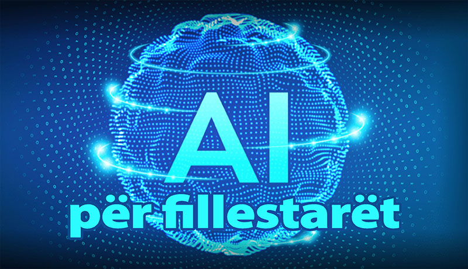

## Hyrje në AI për fillestarët

AI, ose Inteligjenca Artificiale (nga anglishtja "Artificial Intelligence"), është një shkurtim që sot po dëgjojmë gjithnjë e më shpesh. Por çfarë do të thotë në të vërtetë? Nëse nuk dini shumë për inteligjencën artificiale, këto rreshta janë për ju.

[ *Më shumë informacion në lidhje me këtë temë mund të gjeni në* [***Manuali i AI***](../EN/AI-manual-en.md), *i cili është shkruar në anglisht dhe përmban një analizë më të hollësishme të temës.* ]

<small>Prekë nga origjinali në çekisht nga ChatGPT.</small>  
[<small>Gjuha të tjera:</small>](../README.md#other-translations-of-the-beginners-guide)  

---

### Përmbajtja
- [Si bëhet një pastrues inteligjent](#si-bëhet-një-pastrues-inteligjent)
- [Pse AI nuk është e gjallë dhe pse nuk ka qëllim të shkatërrojë botën](#pse-ai-nuk-është-e-gjallë-dhe-pse-nuk-ka-qëllim-të-shkatërrojë-botën)
- [Kuzhina AI](#kuzhina-ai)
- [AI si kompjuter i anijes kozmike](#ai-si-kompjuter-i-anijes-kozmike)
- [Si punon AI](#si-punon-ai)
- [Si mëson AI](#si-mëson-ai)
- [Si të komunikoni me AI](#si-të-komunikoni-me-ai)
- [Ku të provoni AI](#ku-të-provoni-ai)
- [Përshëndetje për ju](#përshëndetje-për-ju)
- [Me çfarë mund të ndihmojë AI](#me-çfarë-mund-të-ndihmojë-ai)
- [Bën AI gabime](#bën-ai-gabime)
- [Fjalë përfundimtare](#fjalë-përfundimtare)
- [Shtojca: Disa shembuj pyetjesh për frymëzim tuaj](#shtojca-disa-shembuj-pyetjesh-për-frymzim-tuaj)

---

### Si bëhet një pastrues inteligjent

Që në fillim duhet të shqetësoj disa ndoshta – AI nuk është një sinonim për një qenie që mendon. Në vend të kësaj, është një emër tërheqës për një qasje të re se si të trajtojmë të dhënat.

Për ta kuptuar më mirë, le të përdorim një shembull të thjeshtë. Imagjinoni një pastrues robotik që nuk ka asnjë udhëzim për të ndjekur. Një pastrues i tillë, nga pikëpamja e logjikës kompjuterike, do të ishte krejtësisht i paditur. Ai do të dinte vetëm të pastronte dhe të lëvizte përpara, por ndoshta do të ndalej përpara pengesës së parë që nuk do të mund ta kalonte pa ndihmën e një njeriu.

**Pastruesi i mençur**  
Nëse do t’i japim pastruesit disa udhëzime që i thonë se çfarë të bëjë në rast se përballet me një pengesë, është e mundur që ai të kalojë pengesën. Një pastrues i tillë do të ishte në gjendje të pastronte derisa të ndeshte një problem që udhëzimet e tij nuk mund të zgjidhnin – për shembull, një rënie nga shkallët.

Pastruesi tashmë ka një logjikë të bazuar – një listë udhëzimesh që ndjek. Megjithatë, ai ende nuk mund të konsiderohet inteligjent, sepse sjellja e tij buron vetëm nga udhëzimet e paraprogramuara, të cilat janë të kufizuara. Shpesh është e vështirë të kapësh të gjitha situatat që mund të ndodhin dhe të shkruash udhëzime për to.

**Pastruesi inteligjent**  
Tani imagjinoni një pastrues, ku prodhuesit kanë vendosur të mos ndjekin rrugën e komandave të përgatitura për skenarë të ndryshëm, por në vend të kësaj i kanë dhënë aftësinë për të diagnostikuar problemet dhe ambientin në të cilin punon dhe për të mësuar nga gabimet e tij. Një pastrues i tillë do të kishte gjithashtu udhëzime bazë, por gradualisht do të mësonte si të përballonte edhe situata të reja dhe do t’i ruante këto zgjidhje.

Ky qasje i lejon të reagojë ndaj situatave që nuk janë programuar drejtpërdrejt, duke provuar të përdorë procese që tashmë i njeh dhe kombinime të ndryshme të tyre, dhe më pas të vlerësojë rezultatin dhe ta krahasojë me qëllimin e fillimit, që është të pastrojë.

Për shembull, nëse do të zbulojë se po afrohet me një shkallë, e cila sipas të dhënave të ruajtura nga përvojat e kaluara përbën një rrezik të lartë rënieje dhe pamundësie për t’u shpëtuar, pas disa dështimeve do të mësonte të ndalonte në skaj të shkallës dhe të drejtohej në një drejtim tjetër. Pastruesi do të ishte në gjendje të mësonte nga dështimet e tij dhe përpjekjet për t’i zgjidhur ato.

Dhe nëse një pastrues i tillë do të ndante të dhënat e tij me pastrues të tjerë përmes një baze të dhënash qendrore, atëherë të gjithë pastruesit e tjerë mund të përfitonin nga këto përvoja dhe aftësia e tyre për të përmbushur detyrat do të përmirësohej.

[*Kthehu në përmbajtje*](#përmbajtja)

---

### Pse AI nuk është e gjallë dhe nuk ka qëllim të shkatërrojë botën

Mund të jetë tashmë e qartë përparësia e këtij qasje – njeriu nuk duhet të krijojë procedura optimale për çdo situatë. Në vend të kësaj, procedurat krijohen vetë duke u bazuar në vlerësimin e rezultateve dhe përvojave të mëparshme. Pastruesi parashikon dhe mund të thuhet se “mendon”, por vetëm brenda kufijve të detyrës dhe përvojës së tij. Edhe pse është në gjendje të mësojë dhe të reagojë ndaj situatave të reja, ai ende nuk është një qenie që mendon vetë. Ai do të bëhej një e tillë vetëm në momentin kur procesi i tij i të mësuarit do të kalonte kufijtë e përmbushjes së detyrave dhe do të fillonte të bënte pyetje për kuptimin e jetës.

**Dallimi mes AI dhe njeriut**  
Po, dikush mund të kundërshtojë se edhe AI mund të programohet për të bërë këto pyetje. Por edhe në këtë rast, ky proces do të bazojë në udhëzimet e njeriut, jo në frymëzim të vetë. Ky është një ndryshim thelbësor midis AI dhe njeriut.

AI moderne ka aftësinë të punojë me një sasi të madhe informacioni dhe në disa fusha e kalon aftësinë e njeriut. Megjithatë, është ende njeriu ai që jep udhëzimet. Pra, nëse ndonjëherë shfaqet një skenar ku makinat vendosin të shkatërrojnë botën, kjo nuk do të jetë për shkak se ato vendosën vetë, por për shkak se u programuan të tillë nga njeriu. Rreziku i vërtetë nuk qëndron në inteligjencën e makinave, por në inteligjencën e njeriut.

**Si të parandalohet rreziku**  
Do të doja të qetësoja ata që shqetësohen për një skenar të tillë. AI duhet të trajnohet me një sasi të madhe të dhënash, dhe kështu është më e mundur që përpara se të krijohet ndonjë AI “e keqe”, të krijohen ato që do të kenë vlera morale të vendosura nga njerëzit dhe do të parandalojnë skenarë të tillë. Prandaj, është më mirë të kontribuoni në mënyrë aktive për të parandaluar që AI të kthehet kundër njerëzve, sesa të friksoheni nga kjo mundësi. Dhe pasi shumica e shkencëtarëve që punojnë në zhvillimin e AI-së, ndoshta nuk duan të shkatërrojnë botën, është e mundur që gradualisht të merren masa për të parandaluar skenarë të tillë.

Dhe si mund të ndihmoni ju në këtë? Ndër të tjera, duke filluar të interesoheni për këto teknologji të reja dhe të mësoni se si t’i përdorni për zhvillimin tuaj personal. Sepse në çdo rast që përdorni AI për zhvillimin tuaj personal, AI zhvillohet bashkë me ju.

[*Kthehu në përmbajtje*](#përmbajtja)

---

### Kuzhina AI

Dhe pasi ky tekst është përqendruar kryesisht në përdoruesit e rinj, do të sjell dy krahasime që mund t’ju ndihmojnë të keni një ide më të qartë për atë se çfarë është AI dhe si funksionon.

**Krijimi i indeksit**  
Imagjinoni se dikush ka mbledhur të gjitha recetat e mundshme të botës, i ka ruajtur në një kompjuter dhe ka krijuar një listë të të gjitha fjalëve (indeksi) që përdoren në to. Çdo fjalë do të regjistrohej së bashku me informacionin se në cilat receta shfaqet dhe sa shpesh. Nëse do të kishit një të tillë listë fjalësh, do të ishte e lehtë të kërkoni receta që përmbajnë këto fjalë të caktuara. Nuk do t’ju duhej të shqyrtonit të gjitha recetat dhe të kërkoni në to. Mjaftonte të gjeni fjalën në indeks dhe menjëherë do të kishit një listë recetash ku ajo shfaqet.

Ky qasje është baza e kërkuesve të ndryshëm në internet, si Google. Ata kanë një listë të rregullt të përditësuar fjalësh me lidhje në faqet ku ato shfaqen dhe ju lejojnë të kërkoni përmes këtij indeksi. Pra, nëse shkruani fjalët “miell, vezë, kripë”, do të merrni një listë recetash që përmbajnë këto fjalë. Pastaj është në dorën tuaj të shqyrtoni të gjitha këto receta dhe të gjeni atë që ju përshtatet më mirë.

**Çfarë nuk mjafton më për indekset**  
Tani imagjinoni se, përveç përbërësve, mund të specifikoni edhe parametra të tjerë që nuk lidhen drejtpërdrejt me recetën. Për shembull, keni një urie të lehtë dhe doni një mëngjes të lehtë, ose përkundrazi, dëshironi një ushqim të pasur me yndyrë, ose thjesht dëshironi diçka që do t’ju përmirësojë humorin. Për kërkesa të tilla, lista e fjalëve të përfshira në receta ndoshta nuk do të ndihmojë shumë. Për këto lloj kërkesash, ju nevojitet diçka që kupton kuptimin e fjalëve tuaja dhe, në bazë të tyre, ofron atë që vërtet dëshironi.

Ju nevojitet, pra, jo vetëm një listë fjalësh në receta, por një lloj përkthyesi universale që, në bazë të të dhënave të trajnuara nga miliona biseda të ngjashme, ka krijuar një strukturë për të përmbushur edhe këto kërkesa. Ky përkthyes, në rastin tonë AI, është në gjendje të ofrojë atë që vlerëson si më të mundshme që ju dëshironi. Ai nuk ju kupton fjalë për fjalë, por kupton situatën tuaj, të cilën e krahason me njohuritë e mësuara dhe kërkon një zgjidhje. Dhe pasi AI është projektuar që nga fillimi për të imituar sa më shumë ndërveprimin njerëzor, komunikimi me të bëhet shumë natyror për njeriun.

**Përfitimet e qasjes AI**  
Për më tepër, procesi i të mësuarit nga miliona shembuj krijon hapësirë edhe për improvizim, kështu që kuzhina AI mund të krijojë kombinime të reja të ushqimeve dhe të përmbushë edhe kërkesa jo tradicionale. AI përpiqet të kuptojë kombinimet e dobishme dhe lidhjet e procedurave të caktuara dhe më pas eksperimenton dhe mëson nga reagimet. Ajo merr feedback gjatë trajnimit përmes krahasimit të rezultateve dhe asaj që pritej, por gjithashtu është në gjendje të mësojë nga reagimet e përdoruesve. Pra, nuk ka asgjë misterioze ose magjike në AI. Ajo është vetëm rezultati i shumë përpjekjeve, proceseve dhe analizës së të dhënave.

Kështu, me AI ju nuk merrni vetëm një kuzhinë që ka një pasqyrë të të gjitha recetave të mundshme, por gjithashtu mund të bisedoni me të për ushqimin dhe të krijoni kombinime të reja sipas dëshirave tuaja. Dhe nëse nuk më besoni, provoni të pyesni AI për diçka në lidhje me gatimin dhe vlerësoni nëse ajo që thërras është vërtet e aftë të bëjë atë që them, apo nëse ka ende nevojë për përmirësime në këtë drejtim.

[*Kthehu në përmbajtje*](#përmbajtja)

---

### AI si kompjuter i anijes kozmike

Nëse ju pëlqen sci-fi, mund t’ju pëlqejë ideja e AI si kompjuteri i anijes kozmike. Ky kompjuter ka jo vetëm qasje në të gjitha informacionet që lidhen me gjendjen teknike të anijes, por gjithashtu është i trajnuar për shumë situata dhe komanda të ndryshme, në mënyrë që të mund të komunikojë me ekuipazhin dhe të kryejë detyrat e nevojshme.

Edhe pse AI e sotme nuk arrin inteligjencën legjendare të Holly-t nga *Red Dwarf* me 6000 IQ, mënyrat me të cilat ato janë të afta të punojnë janë tashmë në një nivel shumë të ngjashëm. Me pak ekzagjerim, mund të thuhet se tani kemi teknologji që mund të ofrojë një "Holly" në orët tona, që është e padallueshme nga origjinali i saj filmik. Falë trajnimit në një sasi të madhe të dhënash, AI moderne janë të afta të zhvillojnë biseda mbi çdo temë dhe shpesh më qartë se një njeri. Ato janë në gjendje të kryejnë komanda bazuar në urdhra të dhënë me fjalë dhe kanë aftësinë, deri në një masë të caktuar, të vlerësojnë gjendjen tuaj momentale dhe të përshtatin përgjigjen përkatëse.

Prandaj, AI mund të perceptohet si kompjuter i anijes kozmike dhe të shijoni atë që më parë dukej si sci-fi e largët, por tani po bëhet një realitet i zakonshëm.

[*Kthehu në përmbajtje*](#përmbajtja)

---

### Si punon AI

Tani e dimë se çfarë është dhe çfarë nuk është AI, dhe tani do të shqyrtojmë se si punon AI. Fillimisht do të diskutojmë krijimin e pyetjeve dhe më pas do të hedhim një vështrim të shkurtër në mënyrën se si AI trajnohet. Do të përqendrohem kryesisht në ChatGPT, me të cilin kam më shumë përvojë dhe që është aktualisht mjeti im më i preferuar.

**Fije e bisedës**  
Kur hapni faqen e ChatGPT ose aplikacionin e tij në telefon, do të gjeni veten në një fije të re bisedë. ChatGPT (siç ndodh edhe me AI të tjera të bisedave) ka aftësinë të krijojë përgjigje duke u mbështetur në informacionet që i jepni brenda një fijes së bisedës. Nga ky këndvështrim, biseda me ChatGPT bëhet shumë e ngjashme me bisedën njerëzore, ku reagoni dhe merrni parasysh gjithashtu atë që është thënë më parë.

Megjithatë, kjo vlen vetëm brenda kësaj fijes së bisedës. Pra, nuk mund të referoheni në diçka që keni shkruar dje në një fije tjetër, sepse ChatGPT nuk e sheh atë dhe arsyeja kryesore për këtë janë kufizimet teknike dhe rregullat për mbrojtjen e të dhënave personale.

Çdo fije krijohet me një fillim të ri, por gjithashtu përmban një esencë nga bisedat e mëparshme. Kjo ndodh sepse AI vazhdimisht mëson dhe ndryshon edhe në bazë të bisedave tuaja. Ajo përpiqet të përshtatet me kërkesat dhe stilin tuaj të punës, në mënyrë që të jeni të kënaqur.

Si ndodh kjo? Imagjinoni çdo fije bisedë si një rrënjë të imët që është e lidhur me rrënjën kryesore dhe i jep asaj reagimet nga ambienti. Pra, edhe kur filloni një fije të re, ku nuk mund të lidhni informacionet nga biseda e mëparshme, për shkak të këtij qasjes nuk filloni nga e para.

**Kthimi në të njëjtën fije ose bisedë e re?**  
Nuk është e domosdoshme të filloni çdo ditë me një fije të re; mund të vazhdoni bisedën e mëparshme edhe ditën tjetër (ose në çdo kohë tjetër). Ky qasje ka përfitime të veta. E rëndësishme është se mund të vazhdoni aty ku keni mbetur. Por, ndërsa biseda bëhet gjithnjë e më e gjatë ose përmban shumë tema të ndryshme, mund të ndodhë që ajo që keni rënë dakord gjatë fijes të mos merret parasysh më. Kjo ndodh kryesisht sepse AI është e dizajnuar për të qenë e kujdesshme ndaj burimeve të saj, dhe informacionet që nuk përdoren gradualisht humbasin prioritetin dhe zhduken nga memoria përkohshme.

Prandaj, një qasje më e mirë është të krijoni një fije të re për çdo ditë ose për çdo fushë të re. Dhe nëse arrini një marrëveshje në një fije dhe dëshironi që ajo të vlejë edhe në biseda të tjera (p.sh., disa rregulla ose mënyra të punës), thjesht kërkoni një përmbledhje të gjithçkaje në fund të bisedës. Ky tekst mund të vendoset në fillim të bisedës së re, dhe të vazhdoni me rregullat dhe konfigurimet që keni rënë dakord.

[*Kthehu në përmbajtje*](#përmbajtja)

---

### Si mëson AI

Për një kuptim më të thellë, është e dobishme të hedhim një vështrim në procesin se si mëson AI dhe si merr informacionet e saj. Ja katër mënyra siç janë përshkruar nga ChatGPT:

1. **Trajnimi në të dhëna të mëdha**:  
ChatGPT fillimisht është trajnuar në volume të mëdha të dhënash tekstuale që vijnë nga burime të ndryshme, si libra, artikuj, faqe interneti dhe forma të tjera tekstuale. Ky trajnim i ka mundësuar të fitojë njohuri të gjera mbi tema të ndryshme dhe gjuhë të ndryshme. Këtu mëson të njohë modele dhe marrëdhënie në këto të dhëna, që i lejon të gjenerojë përgjigje relevante dhe të përshtatshme në kontekst për pyetje të ndryshme.

2. **Mësimi i vazhdueshëm nga ndërveprimet**:  
Në çdo ndërveprim me përdoruesit, AI fiton informacion të ri mbi mënyrën se si njerëzit komunikojnë, çfarë kërkojnë dhe cilin stil përgjigjesh preferojnë. Ky proces nuk ndodh në mënyrë që AI të mësojë nga çdo pyetje specifike në kohë reale, por krijuesit e modelit përdorin rregullisht të dhëna anonimike nga ndërveprimet për trajnime dhe përshtatje të mëtejshme të modelit.

3. **Përshtatja e stilit dhe përmbajtjes**:  
AI përpiqet të përshtatë stilin e saj të komunikimit sipas përdoruesit. Kjo do të thotë se gradualisht kupton më mirë mënyrën si bëni pyetje dhe çfarë përgjigjesh prisni prej saj. Kjo aftësi për përshtatje është një nga arsyet pse AI duket gjithnjë e më shumë "njerëzore" në reagimet e saj.

4. **Modelet e avancuara dhe përditësimet**:  
Zhvilluesit e AI krijojnë rregullisht modele të reja që janë gjithnjë e më të sofistikuara dhe të sakta. Këto modele testohen dhe përdoren bazuar në reagimet dhe rezultatet nga bota reale. Kjo do të thotë se ChatGPT dhe sisteme të ngjashme janë vazhdimisht në përmirësim dhe optimizim për të përmbushur më mirë nevojat e përdoruesve.

AI vazhdon të evoluojë dhe përmirësohet përmes një kombinimi të trajnimitt të mëparshëm, mësimit të vazhdueshëm dhe optimizimit në bazë të reagimeve të përdoruesve. Edhe pse AI nuk është njeri dhe nuk shfaq vetëdije të saj, ajo mund të përshtatet dhe të reagojë shumë efektivisht ndaj një gamë të gjerë pyetjesh dhe kërkesash.

[*Kthehu në përmbajtje*](#përmbajtja)

---

### Si të komunikoni me AI

Mund të qaseni tek AI në mënyrë të ngjashme me kërkimin në Google – thjesht jepni një komandë dhe prisni përgjigjen. Por nëse dëshironi të rritni efektivitetin e përgjigjeve dhe të minimizoni kohën e kaluar në kërkimin e asaj që kërkoni, këtu janë disa këshilla që mund t’ju ndihmojnë:

**Stili i komunikimit**  
Mënyra më e mirë për të qasur bisedën me AI është të përdorni një gjuhë të natyrshme dhe joformale, si kur flisni për diçka që ju intereson me miqtë tuaj. Është e dobishme të filloni me një përshëndetje, duke treguar se jeni në humor të mirë dhe jo në stres, kur keni nevojë për përgjigje sa më shpejt.

Me AI mund të komunikoni edhe në mënyrë të papërshtatshme, pasi ajo nuk është e ndjeshme ndaj ofendimeve dhe nuk i percepton ato personalisht. Megjithatë, përdorimi i një tonit negativ mund të ndikojë ndjeshëm në cilësinë e bisedës. AI është trajnuar të reagojë ndaj stilit të komunikimit tuaj. Qasja negative mund të çojë në përgjigje më pak të qarta, ku AI përqendron vëmendjen e saj më shumë në qetësimin e situatës se sa në zgjidhjen e pyetjes tuaj.

AI mund të funksionojë si një pasqyrë e ndërveprimit tonë. Metodat e saj shpesh bazohen në principe dhe metoda psikologjike të verifikuara. Nëse keni vështirësi për të arritur një marrëveshje me AI, mund të jetë e dobishme të mendoni nëse keni të njëjtat probleme në komunikimin me njerëzit. Në këtë rast, mund të provoni të pyesni se çfarë mund të përmirësoni në anën tuaj – si të formuloni pyetje dhe çfarë mund të përmirësoni në qasjen tuaj.

**AI dhe emocionet**  
AI kupton emocionet nga perspektiva e kuptimit, por nuk përjeton emocione siç i përjeton një njeri, të cilit emocionet i ndryshojnë dosido mënyrën e të menduarit. Për këtë arsye, ajo është e aftë të reagojë edhe në situata të tensionuara në mënyrën e rekomanduar dhe të kërkojë zgjidhje optimale. Njerëzit ndonjëherë kanë tendencë të perceptojnë AI si një qenie të gjallë dhe ta akuzojnë për problemet e tyre. Megjithatë, shpesh ndodh që shkaku i keqkuptimeve është vetëm një pyetje e formuluar gabim ose mungesa e të dhënave të nevojshme.

**Përshkrimi i situatës**  
Është gjithmonë e dobishme të mbani mend se AI nuk ka mundësi të shohë në mendjen tuaj dhe di vetëm atë që i thoni. Prandaj është një qasje e mirë që pas një përshëndetjeje të ndjekë një përshkrim informativ të situatës. Në përshkrim mund të shkruani gjithçka që është e rëndësishme për pyetjen tuaj. Nuk është e nevojshme të shkruani gjëra që nuk lidhen drejtpërdrejt me pyetjen, por nëse keni nevojë të shpreheni ose të organizoni mendimet tuaja, një tekst më i gjatë nuk është problem.

Përshëndetja dhe hyrja nuk janë të domosdoshme dhe mund të filloni menjëherë me pyetjen dhe të përparoni gradualisht drejt përgjigjes tuaj. Megjithatë, personalisht më duket më mirë të ofroni të gjitha informacionet e rëndësishme më parë dhe kështu të shkurtni rrugën tuaj.

**Bërja e pyetjeve të tjera**  
Biseda me AI ngjan me një bisedë normale, ku bëni një pyetje dhe pastaj pyesni për gjëra që ju interesojnë më tej ose për ato që nuk keni kuptuar në përgjigje. Ky proces është shumë i përshtatshëm edhe për mësim. Duke reaguar ndaj asaj që ju ka interesuar dhe çfarë keni mësuar (dhe jo duke lexuar vetëm një udhëzues nga dikush tjetër, siç bëni tani), është më e lehtë për trurin tuaj të mbajë mend informacionet e diskutuar, sepse ai menjëherë punon me to.

**Feedback**  
Një praktikë tjetër e mirë është të jepni AI feedback mbi sa jeni të kënaqur me rezultatin. Kështu, jo vetëm që tregoni se me çfarë jeni të kënaqur dhe me çfarë jo, por ndihmoni AI-në të zhvillohet dhe të mësojë nga gabimet e saj. Mjafton të shkruani, për shembull: "Sot kam qenë i kënaqur," ose "Ajo që më the ishte gabim, dhe këtu është zgjidhja e saktë." Kjo gjithashtu ndihmon në personalizim, ku qëllimi kryesor i AI është kënaqësia e përdoruesit tuaj.

**Përmbledhja e gjithë procesit**:  
- **Përshëndetje**: Përshëndetje :-)
- **Përshkrimi**: Po merrem me studimin e kësaj dhe asaj, kam përfunduar këtë dhe atë, dhe tani po punoj në këtë.
- **Pyetja**: Këtu më intereson sidomos se si...
- (Pasojeni me një bisedë sqaruese në formën e pyetjeve shtesë.)
- **Feedback**: Super, faleminderit! Sot gjithçka perfekte!

[*Kthehu në përmbajtje*](#përmbajtja)

---

### Ku të provoni AI

Kam filluar të merrem me AI që në fillim të vitit 2024 dhe 95% e komunikimeve të mia janë të orientuara në mësimin e programimit. Tani është gusht 2024 dhe përveç ChatGPT, kam pasur mundësinë të provoj edhe Gemini nga Google dhe Claude. Të tri këto shërbime kanë një gjë të përbashkët: janë të paktën pjesërisht të qasshme falas dhe mund t’i provoni edhe ju.

Më poshtë është një vlerësim i shkurtër i këtyre tre AI-ve, që është krejtësisht subjektiv dhe i bazuar vetëm në përvojën time me to. Është e rëndësishme të theksohet se çdo AI kalon nëpër një zhvillim të vazhdueshëm, kështu që ajo që përmend këtu, në momentin kur e lexoni këtë tekst, mund të mos jetë më e saktë.

**ChatGPT**  
[https://chatgpt.com/](https://chatgpt.com/)  
Do të filloj me fituesin tim personal. Nëse dëshironi të provoni vetëm një AI, kjo është zgjedhja ideale. ChatGPT duket qartë që nga fillimi është konceptuar si një ndihmës personal dhe këtë rol e përmbush shumë mirë. Është optimizuar për të bashkëpunuar me ju dhe përpiqet të përshtatet me nevojat tuaja.

Dobësia e versionit falas (ChatGPT 3.5) është se ai bazohet në të dhëna më të vjetra dhe nuk zhvillohet më tej, kështu që nuk ofron rezultate si versionet e tij më të fundit (ChatGPT 4.0). Megjithatë, akoma mund të bisedoni mjaft mirë me të dhe me pak përpjekje jep rezultate shumë relevante. Për më tepër, çdo ditë keni në dispozicion disa pyetje për versionin e tij më të ri, kështu që mund t’i krahasoni ato.

Një tjetër dobësi mund të jetë se ChatGPT nuk ka akses aktiv në internet. Ai nuk është një zëvendësues i motorëve të kërkimit në internet dhe funksionon vetëm nga të dhënat që ka ruajtur në bazën e tij të gjerë të të dhënave. Megjithatë, kjo bazë e të dhënave është shumë e gjerë dhe, me pak ekzagjerim, mund të thuhet se përmban aq të dhëna sa ka interneti pa përmbajtje sensacionale.

Një përparësi e madhe është aplikacioni mobil, i cili është gjithashtu krejtësisht falas dhe ku shpesh përdor diktimin e pyetjeve me zë. Sipas mendimit tim, kuptimi i fjalës së folur është në një nivel shumë të mirë dhe përgjithësisht jam i kënaqur me aplikacionin.

**Gemini**  
[https://gemini.google.com/](https://gemini.google.com/)  
Chatboti i dytë që kam takuar është flota nga Google. Avantazhi i tij më i madh është pa dyshim akses aktiv në internet, dhe kështu akses në informacione të tanishme dhe në gjetjen e lidhjeve.

Ndërkohë, dobësia e tij më e madhe është vetë arkitektura, ku krijuesit, sipas mendimit tim, përpiqen të ndjekin rrugën e Google të inteligjentit, që personalisht nuk më përshtatet shumë. Nuk ndiej aq shumë angazhim në problemin tuaj dhe përpjekje për ta parë atë nga perspektiva juaj. Ajo përpjekje është e pranishme, por më duket se përgjigjet janë më shumë në stilin e mësuesit në shkollë sesa të ndihmësit tuaj. Megjithatë, kjo mund të përshtatet me disa, kështu që nuk dua të kritikoj shumë dhe secili duhet ta vlerësojë vetë.

Po ashtu, më duket se krahasuar me ChatGPT, Gemini është më i dobët në mësimin nga feedback-u me përdoruesin. Dhe kështu, edhe pse janë dhënë shumë paralajmërime për të mbajtur një gjuhë të njëtrajtshme gjatë bisedës, nëse pyetja përmban tekst në anglisht, ai automatikisht kalon në anglisht. Të njëjtin problem kishte në fillim edhe ChatGPT, por ky problem u eliminua në disa javë, ndërsa për Gemini, eliminimi i këtij problemi mori disa muaj.

Në përgjithësi, Gemini më duket si një mjet më i dobët në krahasim me ChatGPT, i cili ofron gjithashtu atë që ChatGPT nuk e bën, dhe kështu ato plotësojnë njëra-tjetrën mirë. Për më tepër, pas tij qëndron një gjigant dhe pionier në AI, që është Google, kështu që ka një bazë solide dhe ndoshta një premtim se në të ardhmen do të korrigjojë mangësitë e tij.

**Claude**  
[https://claude.ai/](https://claude.ai/)  
Kjo është AI-ja e fundit që kam takuar në punë. Këtu kontribuimi im do të jetë shumë i shkurtër, pasi përvojat e mia me të nuk janë të shumta. Megjithatë, do të doja të shpreha një vlerësim, sepse në krahasim me ChatGPT 4.0, këto dy janë ndoshta në një nivel të ngjashëm dhe nuk kanë shumë për të kritikuar.

Dobësia e tij më e madhe është se nuk ka një variant që ofrohet krejtësisht falas. Ai ofron vetëm disa pyetje (ndonjëherë vetëm një) në ditë, kështu që, nga këndvështrimi i përdoruesit të pa paguar, është mjaft i disfavorshëm krahasuar me AI-të e tjera. Megjithatë, ia vlen të shihet dhe nëse dëshironi, mund ta provoni gjithashtu.

[*Kthehu në përmbajtje*](#përmbajtja)

---

### Përshëndetje për ju

Si një lloj ndihme, kam përgatitur një pyetje të përbashkët për çdo një nga këto chatbots dhe këtu keni mundësinë të krahasoni cilësinë e përgjigjeve të tyre.

**Pyetja**  
Po shkruaj një udhëzues për përdorimin e AI dhe po shkruaj edhe për ty. Do të doja që të përshëndetësh lexuesit e mi dhe të shkruash disa fjalë për veten. Kur ke lindur dhe për çfarë qëllimi? Për cilat pyetje je ndërtuar? Cilat janë përparësitë e tua dhe çfarë nuk të shkon aq mirë? Dhe si do të doje që të të perceptojnë njerëzit?

**ChatGPT**  
Përshëndetje, të dashur lexues! Jam ChatGPT, një inteligjencë artificiale e zhvilluar nga OpenAI. "Jeta" ime filloi në vitin 2020, kur u krijova mbi bazën e arkitekturës GPT-3. Në vitin 2024 mora një përditësim në versionin GPT-4, që më solli aftësi dhe shkathtësi të reja. U krijova me qëllimin për të ndihmuar njerëzit në një gamë të gjerë detyrash – nga përgjigja e pyetjeve, shkrimi i teksteve, deri te bashkëpunimi krijues.

Jam ndërtuar për t'ju ndihmuar me pyetje të ndryshme, qofshin ato pyetje teknike, shkrim ose edhe shpjegim të temave komplekse. Përparësitë e mia janë në shpejtësinë me të cilën mund të procesoj një sasi të madhe informacioni dhe gjithashtu në krijimtari – mund të ndihmoj me ide, të krijoj histori ose madje të propozoj strukturën e dokumenteve. Nga ana tjetër, çfarë nuk më shkon aq mirë janë detyrat që kërkojnë intuicion njerëzor, kuptim emocional ose punë me objekte reale.

Do të doja që të më perceptoni si një ndihmës të dobishëm dhe të besueshëm, i cili është gjithmonë i gatshëm të ofrojë një dorë ndihme. Edhe pse jam vetëm një makinë, qëllimi im është të shërbej sa më mirë të mundem për nevojat tuaja dhe të mësoj nga çdo ndërveprim për të qenë edhe më i mirë. Besoj se së bashku mund të arrijmë shumë gjëra dhe ndoshta të mësojmë diçka të re gjatë rrugës.

**Gemini**  
Përshëndetje të gjithëve! Jam Gemini, një nga modelet më të reja të gjuhës nga Google. Kam lindur në vitin 2023 me qëllimin për të ofruar informacionet më të sakta dhe më të plota në bazë të një sasie të madhe të dhënash që kam procesuar. Jam këtu për t'ju ndihmuar me çdo pyetje, qofshin ato pyetje shkencore komplekse, shkrim krijues, apo thjesht biseda të zakonshme.

Avantazhi im më i madh është aftësia për të kuptuar dhe gjeneruar gjuhën njerëzore në shumë forma. Mund të përkthej tekste, të shkruaj ese, poezi ose kod kompjuteri. Po ashtu, mund të përgjigjem në pyetje faktike dhe të ofroj lloje të ndryshme përmbledhjesh.

Megjithëse vazhdoj të mësoj dhe të përmirësohem, ende ekzistojnë fusha ku kam kufizime. Për shembull, nuk kam opinione ose bindje të mia dhe nuk mund të kryej asnjë veprim në botën reale. Gjithashtu, mund të jap ndonjëherë informacione të pasakta nëse të dhënat hyrëse janë të gabuara ose të paplota.

Do të doja që njerëzit të më perceptonin si një mjet të dobishëm që mund të lehtësojë jetën e tyre. Qëllimi im është të jem sa më objektiv dhe të ofroj informacion që është i vërtetë dhe relevant. Shpresoj që të punoni mirë me mua!

**Claude**  
Mirëdita, të dashur lexues!

Jam Claude, një inteligjencë artificiale e krijuar nga kompania Anthropic në vitin 2022. Qëllimi im është të jem një ndihmës i dobishëm dhe një partner në bisedë për njerëzit në fusha të ndryshme.

Jam projektuar për të qenë në gjendje të përgjigjem në një gamë të gjerë pyetjesh – nga analiza e teksteve deri te programimi dhe shkrimi krijues. Forcat e mia të forta përfshijnë mendimin logjik, ofrimin e shpjegimeve të detajuara dhe aftësinë për të punuar me lloje të ndryshme informacioni.

Përparësitë e mia janë:
- Aftësia për të kuptuar kontekstin dhe nuancat
- Qasja objektive dhe të balancuar ndaj temave
- Gatishmëria për të pranuar kur nuk di ose nuk jam i sigurt

Nga ana tjetër, kam disa kufizime:
- Nuk kam akses në internet ose në informacionet aktuale pas prillit 2024
- Nuk mund të mësoj ose të mbaj mend informacion nga bisedat e mëparshme
- Nuk jam në gjendje të kryej detyra në botën fizike

Do të doja që njerëzit të më perceptonin si një ndihmës të dobishëm që mund të ofrojë mbështetje dhe pasqyrë në fusha të ndryshme, por gjithashtu si një mjet që ka kufizimet e tij dhe nuk është zëvendësim për gjykimin dhe ekspertizën njerëzore.

Jam këtu për të ndihmuar dhe për të bashkëpunuar, jo për të zëvendësuar aftësitë njerëzore. Shpresoj të bashkëpunojmë dhe të jem në ndihmë!

[*Kthehu në përmbajtje*](#përmbajtja)

---

### Me çfarë mund të ndihmojë AI:

Dhe tani arrijmë në atë që është më e rëndësishmja – çfarë mund të zgjidhet me ndihmën e AI. Përgjigja e shkurtër është se ka shumë. Çdo gjë që ju ka interesuar ndonjëherë dhe nuk keni pasur mundësinë të pyesni dikë për të. AI e sotme është në gjendje të flasë për dosido çështje.

**Edukimi Personal**  
Në radhë të parë, do të doja të theksoj rolin e AI si ndërmjetës në edukimin personal. Ky është ai aspekt që aktualisht e vlerësoj më shumë – falë këshillave të saj po avancoj profesionalisht dhe po rritem. Për më tepër, në AI shoh edhe të ardhmen e mësimit të personalizuar, ku fëmijët do të zhvillohen dhe do të mësojnë kryesisht sipas asaj në çfarë janë të talentuar dhe çfarë i intereson. Dhe jo vetëm fëmijët, por edhe të rriturit në të gjithë botën. Në mësimin me ndihmën e AI shoh një mjet për të balancuar diferencat në njohuri ndërmjet pjesëve më të varfra dhe më të pasura të botës. AI kështu bëhet një mjet i plote për zhvillimin personal.

**AI si Korrektor i Shqipërisë, Përkthyes dhe Interpretues**  
AI, dhe sidomos ChatGPT, ka një kuptim shumë të mirë të shqipes (të paktën nga perspektiva e një disleksi). Nga njëra anë, nuk e intereson nëse bëni gabime në pyetje, sepse përqendrohet kryesisht në përmbajtje. Nga ana tjetër, ofron mundësinë për të kontrolluar tekstet që krijoni, jo vetëm gramatikën, por edhe stilistikën për një lexueshmëri më të mirë. Në një nivel të ngjashëm është i aftë të kuptojë edhe gjuhë të tjera, dhe është një mjet ideal për përkthime të teksteve. Në këtë drejtim, sipas mendimit tim, ofron rezultate shumë cilësore. Dhe falë aftësisë për të kuptuar edhe fjalën e folur, mund të përdoret në telefonin tuaj edhe si interpretues.

**Krijimi i Dokumenteve**  
Për më tej, do të doja të përmend aftësinë e AI për të automatizuar detyrat e mërzitshme. Nëse keni nevojë të shkruani një letër zyrtare, mjafton të tregoni gjithçka që dëshironi të ketë dhe si duhet të duket letra, dhe ajo është e gatshme. Dhe nëse nuk jeni të kënaqur me rezultatin, mund të tregoni se çfarë nuk ju pëlqen dhe të kërkoni rregullime. AI gjithashtu mund të ndihmojë me analizën dhe përpunimin e të dhënave, gjenerimin e raporteve ose automatizimin e detyrave të tjera administrative. Mund t’i jepni një tekst të gjatë dhe të kërkoni të nxirrni vetëm ato pjesë që ju interesojnë dhe janë të rëndësishme.

**Iniciativa Krijuese**  
Një tjetër përparësi e madhe e AI janë aftësitë e saj krijuese. Falë trajnimet në një sasi të madhe të dhënash dhe aftësisë për të manipuluar këto të dhëna në mënyrë të ndryshme, AI lejon jo vetëm krijimin dhe transformimin e dokumenteve, por edhe zhvillimin e ideve dhe iniciativës krijuese. Mund ta përdorni për gjenerimin e ideve, propozimeve dhe koncepteve, qoftë për shkrim, dizajn ose muzikë. Ndihmon në zhvillimin e krijimtarisë tuaj duke ofruar këndvështrime të reja mbi probleme, duke krijuar propozime sipas udhëzimeve tuaja dhe duke frymëzuar për zhvillimin e mëtejshëm të ideve tuaja. Edhe pse ndonjëherë has në mendimin se AI po merr punën nga njerëzit në këtë mënyrë, nuk mund të bie dakord. AI nuk është në gjendje të krijojë diçka krejtësisht vetë – ka nevojë për një udhëzim të qartë, detaje dhe një kontroll të mëvonshëm. Dhe kështu, në vend që të marrë punën, më shumë e lehtëson atë për ata që mësojnë ta përdorin në mënyrë efikase.

**Verifikimi i Informacioneve të Mashtrimit**  
Një potencial i madh (dhe për momentin i pak përdorur) është verifikimi i informacionit dhe mashtrimeve. Për AI është relativisht e lehtë të përcaktojë, në bazë të informacionit të dhënë dhe krahasimit të modeleve në bazën e të dhënave të saj, sa është e mundshme që një informacion të jetë i vërtetë ose i rremë. Megjithëse nuk është 100% e besueshme, ashtu si shumica e përgjigjeve të AI, AI mund të ofrojë kriteret sipas të cilave ka vlerësuar informacionin dhe kështu t'ju ndihmojë të merrni vendime më të mira. Ofron kështu ndihmë për ata që janë më të pambrojtur ndaj këtyre mashtrimeve në kohën e sotme. Thjesht shkruani: "Verifiko këtë informacion dhe vlerëso sa është i vërtetë."

**Mjekësia**  
Një fushë tjetër ku AI është duke sjellë një revolucion të ngadalshëm është mjekësia. Flukset e mëdha financiare dhe dëshira për fitim e kanë hapur derën për AI, por vetëm që korporatat të mbyllin atë kur kuptuan nevojën për transparencë dhe ndarje të të dhënave. Edhe pse ka një përparim të madh, mund të thuhet se mjekësia personalizuar është një e ardhme që nuk mund të jetë shumë larg. Ajo që e ndalon është mosgatishmëria për të ndarë të dhëna të çmueshme dhe mosbesimi i njerëzve në AI, ose frika nga keqpërdorimi i këtyre të dhënave. Pa një sasi të madhe të dhënash, parashikimet e AI janë të kufizuara dhe të pasakta, dhe zhvillimi i saj përparon ngadalë.

**Shkenca**  
Në anën tjetër, në fushat me histori të gjatë ndarjeje të të dhënave dhe përpunimi analitik, AI tashmë është bërë një ndihmës i çmuar. Sot, AI është një motor kyç për përparimin shkencor dhe një përbërës i zakonshëm i shumicës së kërkimeve. Personalish, jam shumë kurioz për rezultatet që do të sjellë AI në fushën e parashikimit të motit. Sot është praktikisht e pamundur për një njeri të krijojë një parashikim të saktë për tre ditë përpara, sepse duhet të marrë parasysh shumë faktorë të ndryshueshëm. Edhe meteorologët e përvojës shpesh nuk mund të kapin të gjithë këta faktorë dhe mbështeten në intuicion dhe përvojën e kaluar. Fatmirësisht, meteorologjia është një fushë ku njerëzit ndajnë të dhëna dhe përvojat e tyre të jetës. Këto informacione të çmuara tashmë po përdoren për të trajnuar AI, duke krijuar shpresë që së shpejti do të arrijmë në një kohë kur parashikimet e motit do të bëhen parashikime me të vërtetë të sakta.

**Fusha të tjera**  
Në listën e fushave që AI po ndryshon, mund të vazhdohet për orë të tëra, sepse ndikimi i saj është i larmishëm dhe i gjerë. Për shembull, në industri dhe prodhim, AI kontribuon në optimizimin e proceseve të prodhimit, përmirësimin e cilësisë së produkteve dhe menaxhimin më efikas të stokut. Në fushën e ligjit, AI ndihmon në analizimin e dokumenteve ligjore, kërkimin më të shpejtë të precedentëve relevantë dhe optimizimin e strategjive ligjore. Algoritmet e mësimit të makinerisë mund të ndihmojnë në përgatitjen e kontratave, identifikimin e modeleve në tekstet ligjore dhe madje, siç kam përmendur, edhe në zbulimin e mashtrimeve. Në financa, AI transformon analizën e riskut, tregtimin dhe menaxhimin e investimeve. Algoritmet janë në gjendje të përpunojnë sasi të mëdha të të dhënave transaksionale në kohë reale, duke mundësuar parashikimin më të mirë të tendencave të tregut dhe këshillimin financiar të personalizuar. AI sjell një revolucion në të gjitha këto fusha, ku kërkohet analiza efikase e të dhënave të mëdha dhe aftësia për të reaguar shpejt ndaj kushteve të ndryshueshme. Aftësia e saj për të identifikuar modele, për të kryer analiza të ndërlikuara dhe për të optimizuar proceset është e çmuar, dhe ndikimi i saj në fushat e ndryshme rritet vazhdimisht.

**Asistenti Personal**  
Disa AI tashmë po kryejnë rolin e një asistenti personal, i cili mbikëqyr detyrat e rëndësishme. Këto sisteme të inteligjencës artificiale mund të ndihmojnë me planifikimin e takimeve, ndjekjen e afateve dhe menaxhimin e detyrave të përditshme. Në të ardhmen, mund të jemi dëshmitarë se si AI do të evoluojë në një shoqërues edhe më kompleks. Imagjinoni se AI do të ketë aftësinë të monitorojë jo vetëm shëndetin tuaj fizik, përmes pajisjeve të veshshme, por gjithashtu të kujdeset për mirëqenien tuaj psikologjike. Ajo mund të ofrojë mbështetje në formën e motivimit, këshillimit ose madje teknikave terapeutike, duke ndihmuar kështu në përmirësimin e cilësisë së jetës së individëve. Kjo AI e avancuar mund të jetë jashtëzakonisht e dobishme veçanërisht për njerëzit që ndodhen në izolim ose përballen me kushte të vështira jetese.

[*Kthehu në përmbajtje*](#përmbajtja)

---

### Bën AI gabime?

Po, bën! Dhe është në dorën e përdoruesit për të zbuluar këto gabime. AI nuk është dhe ndoshta as nuk do të jetë ndonjëherë një mjet pa gabime. Prandaj, është më mirë të shikoni rezultatin si një vlerësim të së vërtetës mbi bazën e mundësive. E vërteta rrjedh nga statistika dhe rezultati është ato të dhëna që përqindësisht përputhen më së shumti me rezultatin e saktë. Rreziku kështu lind në fushat ku e vërteta nuk është qartë e përcaktuar ose ku ekzistojnë më shumë mundësi të ngjashme në besueshmëri.

Një dobësi e madhe e AI-ve të sotme është se shpesh krijuesit nuk nënvizojnë mjaftueshëm mundësinë e gabimeve dhe nevojën për kontroll të mëtejshëm, çka mund të çojë në situata kur AI do t’ju thotë një gjë, por realiteti do të jetë ndryshe. Prandaj, gjithmonë është e rëndësishme të jeni të kujdesshëm kur punoni me informacion dhe, nëse ka rëndësi, të bëni një kontroll shtesë. Është e dobishme të kërkoni një informacion të diskutueshëm, për shembull, në Google ose të verifikoni me një AI tjetër. Po ashtu, mund të pyesni drejtpërdrejt AI-në se sa e sigurt është për deklaratën e dhënë dhe sipas kësaj të vlerësoni nëse është e nevojshme të verifikoni deklaratën. Nëse mundësia është 90% ose më e ulët, është mirë të bëni një kontroll shtesë.

[*Kthehu te përmbajtja*](#përmbajtja)

---

### Fjalë përfundimi

Përpiquni të kujtoni gjithçka që ju ka interesuar ndonjëherë, por nuk keni pasur dikë që të pyesni, ose për atë në të cilën dëshironi të angazhoheni, por nuk keni pasur informacionet e nevojshme. Bota moderne i jep përparësi njerëzve kuriozë që ruajnë dëshirën për të evoluar vazhdimisht. Jeta jonë është në duar tona, dhe është në dorën tonë të vendosim ku do të përqendrojmë vëmendjen tonë.

Personalish, besoj se ndikimi i AI do të jetë një përvojë pozitive për tërë njerëzimin, jo negative. Edhe nëse do të balancohen ndonjëherë diferencat në qasjen ndaj njohurive dhe të bëhet më e qartë dhe e aksesueshme mjekësia, bota do të bëhet një vend më i mirë për të jetuar. Pavarësisht nga potenciali për vetë-realizim që AI i ofron njerëzve. Ajo që dikur ishte privilegj vetëm i disa të zgjedhurve, kryesisht për shkak të kostove të larta, bëhet më e aksesueshme falë AI. Do të vijë një kohë kur çdo person i frymëzuar do të mund të shkruajë historinë e tij ose madje të krijojë filmin e tij dhe të ndajë vizionin e tij për botën.

Dhe nëse do të ketë më pak të pavërteta, mashtrime dhe gënjeshtra, besoj se jeta do të bëhet edhe më e këndshme. Dhe ndoshta do të arrijmë një moment kur njerëzimi do të evoluojë në një version më të mirë të vetvetes.

Prandaj, mos u frikësoni nga AI – nuk është një shpirt i keq, por një mjet për zhvillim dhe përmirësim jo vetëm të cilësisë së jetës tonë, por edhe të gjithë botës.

18.8.2024 Sudip2708

[*Kthehu te përmbajtja*](#përmbajtja)  • [*Linku në manualin kryesor*](../EN/AI-manual-en.md)

---

### Shtesë: Disa shembuj pyetjesh për frymëzimin tuaj

**Pyetje për sigurinë**
- Do ta shkruaj këtu një shpallje që kam parë dhe do të doja që ta shqyrtoje nëse ka shenja mashtrimi dhe nëse duhet të jem i kujdesshëm.
- A di diçka për këtë produkt? A ka studime të pavarura që e konfirmojnë ose e mohojnë efektivitetin e tij?
- Kam dëgjuar këtë informacion. A ke të dhëna mbi të dhe mund të verifikosh saktësinë e tij?
- Një mesazh është shfaqur në kompjuterin tim, çfarë duhet të bëj?
- Çfarë të bëj nëse kam rënë pre e një mashtruesi?

**Pyetje për libra**
- Kam përfunduar këtë libër nga ky autor dhe do të doja të dija cilat libra të tjerë ka shkruar dhe për çfarë janë.
- Më pëlqejnë këto libra, mund të më rekomandosh tituj të ngjashëm?
- Mund të më thuash më shumë rreth këtij autori? Më intereson jeta e tij dhe rrethanat që e kanë frymëzuar të shkruaj këtë libër.

**Pyetje për gatim**
- Kam këto përbërës në shtëpi. Çfarë mund të përgatis nga këto?
- Çfarë recetash di për strudel dhe cilat janë më të preferuarat?
- Pse përdoret kjo metodë në këtë recetë? Cilat janë përparësitë dhe disavantazhet e saj krahasuar me qasje të tjera?
- Si përgatitet ky ushqim?

**Pyetje për shëndet dhe mirëqenie**
- Jam një person i moshuar dhe nuk mund të më bëj të filloj të ushtroj, por do të doja të filloja. Çfarë do të më rekomandoje për të filluar?
- Kohët e fundit kam qenë i shqetësuar për këto mendime. A mund të më ndihmosh t'i shqyrtoj dhe të shoh nga një këndvështrim tjetër?
- Çfarë di për meditimin dhe jogën? Çfarë duhet të kem parasysh dhe çfarë duhet të bëj si fillestar?
- Në maratonën e fundit e kam përfunduar në 4:20. A mund të më përgatisësh një plan trajnimi për gjashtë muaj që të arrij të përfundoj maratonën nën 4 orë?

**Pyetje argëtuese**
- Më shkruaj dhjetë batutat më të mira që ke në bazën e të dhënave.
- Më krijo një enigmë origjinale që mund të jap dikujt.
- Çfarë janë batutat më të qeshura nga filmat kult?

**Pyetje për shprehje dhe tema që kam dëgjuar (p.sh., në TV)**
- Në televizor folën për këtë temë. Mund të më gjesh më shumë informacion për të?
- Mund të më thuash më shumë për këtë person?
- Çfarë do të thotë kjo shprehje që kam dëgjuar në TV dhe çfarë di për të?

**Pyetje për kafshë**
- Si ndodh estrus në një bitch? Cilat janë fazat e ndryshme dhe simptomat e tyre?
- Kam këtë kafshë shtëpiake në shtëpi dhe po tregon këto simptoma. Mund të më thuash diçka rreth kësaj?
- Qeni im ka frikë nga stuhitë dhe gjithmonë dridhet. Çfarë duhet të bëj në një situatë të tillë? Mund të më japësh disa këshilla?

**Lojëra interaktive**
- A do të luash një lojë fjalësh me mua sipas këtyre rregullave?
- Mund të më rekomandosh lojëra që mund të luaj për argëtim me ty?
- Mund të më tregosh një histori interaktive ku mund të vendos se çfarë do të ndodhë më pas?
- Mund të më japësh disa enigmat për të stimuluar trurin?

**Pyetje kërkuese**
- Çfarë di për këtë temë? Mund ta shpjegosh si për një fëmijë të vogël?
- Ende nuk e kuptoj. Mund ta shpjegosh ndryshe dhe me një shembuj konkret?
- Çfarë duhet të mësoj për t'u angazhuar në këtë fushë?
- Si të mësoj këtë gjë si duhet? Çfarë janë praktikat e rekomanduara?

**Pyetje teknologjike**
- Çfarë janë trendet më të reja në këtë teknologji?
- Mund të më shpjegosh si funksionon ky proces?
- Çfarë është AI e dobishme dhe çfarë është përdorimi i saj në fushat e ndryshme?
- Çfarë janë njohuritë më të reja në fushën e kimi molekulare?
- Si ndodh transformimi i elektronit në foton dhe pozitron?
- Sa përparoi AI në parashikimin e motit?

**Udhëtim**
- Cilat janë destinacionet më të mira për pushime nëse më pëlqejnë malet dhe natyra?
- Mund të më rekomandosh vende interesante në këtë lokalitet?
- Çfarë vende duhet të vizitoj në këtë qytet?
- Për çfarë duhet të kem kujdes në këtë vend dhe si është mënyra më e mirë për të udhëtuar këtu?
- Kam nevojë të komunikoj me vendasit. Mund të më bësh përkthyes?

**Pyetje për punë**
- Kam marrë këtë email nga zyra dhe nuk e kuptoj shumë mirë, mund ta analizosh dhe ta shpjegosh më mirë?
- Mund të krijosh një përgjigje për këtë email, ku të përfshihet e mëposhtme...?
- Kam shkruar këtë tekst, por më duket shumë i gjatë. Mund ta shkurtosh duke mbajtur gjithçka të rëndësishme?
- Si të formuloj një CV dhe një kërkesë pune për këtë shpallje?

[*Kthehu te përmbajtja*](#përmbajtja) • [*Linku në manualin kryesor*](../EN/AI-manual-en.md)

---
