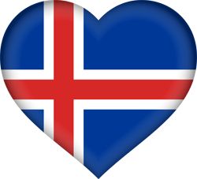
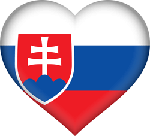

## Uvod u AI za početnike

AI ili veštačka inteligencija (od engleskog "Artificial Intelligence") je skraćenica koju sve češće čujemo. Ali šta ona zapravo znači? Ako o veštačkoj inteligenciji još uvek ne znate mnogo, sledeće strane su upravo za vas.

*(Više informacija o ovoj temi možete pronaći u samom* [***AI Manual***](../EN/AI-manual-en.md), *koji je napisan na engleskom i sadrži detaljniju analizu teme.)*

<small>Iz češkog originala preveo ChatGPT.</small>  
[<small>Ostali jezici:</small>](../README.md#other-translations-of-the-beginners-guide)  

---

### Sadržaj
- [Kako usisivač postaje pametan](#kako-usisivač-postaje-pametan)
- [Zašto AI nije živa i zašto ne želi da uništi svet](#zašto-ai-nije-živa-i-zašto-ne-želi-da-unisti-svet)
- [AI kuvarica](#ai-kuvarica)
- [AI kao kompjuter svemirskog broda](#ai-kao-kompjuter-svemirskog-broda)
- [Kako AI funkcioniše](#kako-ai-funkcionise)
- [Kako se AI uči](#kako-se-ai-uci)
- [Kako komunicirati sa AI](#kako-komunicirati-sa-ai)
- [Gde isprobati AI](#gde-isprobati-ai)
- [Pozdrav za vas](#pozdrav-za-vas)
- [Kako AI može pomoći](#kako-ai-moze-pomoci)
- [Da li AI pravi greške](#da-li-ai-pravi-greske)
- [Reč na kraju](#rec-na-kraju)
- [Dodatak: Nekoliko primera pitanja za vašu inspiraciju](#dodatak-nekoliko-primera-pitanja-za-vasu-inspiraciju)

---

### Kako usisivač postaje pametan

Odmah na početku moram da razočaram neke – AI nije sinonim za misleće biće. To je pre više privlačan naziv za novi pristup u radu sa podacima.

Da bismo to bolje razumeli, koristićemo jednostavan primer. Zamislite robot-usisivač koji nema nikakve instrukcije po kojima bi se vodio. Takav usisivač bi iz perspektive računarske logike bio potpuno bez inteligencije. Umesto toga, samo bi usisavao i kretao se napred, ali bi verovatno stao kada bi naišao na prvu prepreku, koju ne bi mogao da savlada bez ljudske intervencije.

**Pametan usisivač**  
Ako bismo usisivaču dali određene instrukcije o tome šta da radi u slučaju da se sudari s preprekama, verovatno bi uspeo da obiđe prepreku. Takav usisivač bi mogao da usisava sve dok ne naiđe na problem za koji njegove instrukcije nisu dovoljne – na primer, pad sa stepenica.

Usisivač već sadrži osnovnu logiku – listu komandi po kojima se vodi. Ipak, još uvek se ne može smatrati pametnim, jer se njegovo ponašanje temelji samo na unapred programiranim instrukcijama koje su ograničene. Često je teško obuhvatiti sve situacije koje se mogu pojaviti i napisati odgovarajuće instrukcije.

**Inteligentan usisivač**  
Sada zamislite usisivač kod kojeg su proizvođači odlučili da ne koriste unapred pripremljene komande za različite scenarije, već su mu dali sposobnost da dijagnostikuje probleme i okolinu u kojoj radi, i da se uči iz vlastitih grešaka. Takav usisivač bi imao osnovne instrukcije, ali bi se postepeno učio kako da se nosi i s novim situacijama, i ta rešenja bi pametio.

Ovaj pristup mu omogućava da reaguje na situacije koje nisu direktno programirane, koristi procese koje već poznaje i njihove različite kombinacije, i zatim procenjuje rezultate i upoređuje ih sa početnim zadatkom, koji je usisavanje.

Na primer, ako bi otkrio da se približava stepenici koja, prema podacima iz prethodnih iskustava, predstavlja visok rizik od pada i nemogućnosti da se oslobodi, posle nekoliko neuspeha bi naučio da se zaustavi na ivici stepenice i da se okrene u drugom pravcu. Usisivač bi tako bio sposoban da uči na osnovu svojih neuspeha i pokušaja da ih reši.

A ako bi takav usisivač delio svoje podatke sa drugim usisivačima preko centralne baze podataka, svi ostali usisivači bi mogli da koriste ta iskustva i njihova sposobnost da obavljaju zadatke bi se poboljšala.

[*Povratak na sadržaj*](#sadržaj)

---

### Zašto AI nije živa i nema nameru da uništi svet

Možda je već sada jasna prednost ovog pristupa – čovek ne mora da izmišlja optimalne postupke za svaku situaciju. Umesto toga, postupci se sami formiraju na osnovu procene rezultata i prethodnih iskustava. Usisivač predviđa i može se reći „misli“, ali samo u okviru zadatog zadatka i svojih iskustava. Iako je sposoban da uči i reaguje na nove situacije, još uvek se ne može smatrati samostalno mislećim bićem. To bi postao tek kada bi njegov proces učenja prešao granice obavljanja zadataka i počeo da postavlja pitanja o smislu života.

**Razlika između AI i čoveka**  
I da, neko bi mogao da prigovori da AI može biti programirana da postavlja takva pitanja. Ali čak i u ovom slučaju, taj proces će biti vođen ljudskim uputstvima, a ne vlastitom inspiracijom. To je osnovna razlika između AI i čoveka.

Savremena AI ima sposobnost da rukuje ogromnim količinama informacija i u nekim oblastima nadmašuje ljudske sposobnosti. I dalje je to čovek koji postavlja zadatke. Dakle, ako se ikada pojavi scenario u kojem se mašine odluče da unište svet, to neće biti zato što su se same odlučile, već zato što je to programirao čovek. Stvarni rizik ne leži u inteligenciji mašina, već u inteligenciji čoveka.

**Kako se rizicima može preduprediti**  
Želim da umirim one koji se plaše sličnih scenarija. AI mora biti obučena na velikim količinama podataka, pa je verovatno da će pre nego što se pojavi neka „zla“ AI, biti razvijene one koje će imati moralne vrednosti koje su uneli ljudi i koje će sprečiti slične scenarije. Bolje je nego da se bojite da će se AI okrenuti protiv ljudi, aktivno učestvovati u tome da se to ne dogodi. I pošto većina naučnika koji rade na razvoju AI verovatno ne želi da uništi svet, može se pretpostaviti da će vremenom biti preduzete mere koje će sprečiti slične scenarije.

Kako možete i vi pomoći u tome? Možda tako što ćete se bar malo zainteresovati za ove nove tehnologije i naučiti kako da ih koristite za vlastiti rast. Jer svaki put kada koristite AI za svoj lični razvoj, AI se razvija zajedno sa vama.

[*Povratak na sadržaj*](#sadržaj)

---

### AI kuvarica

Pošto je ovaj tekst prvenstveno namenjen novim korisnicima, predstaviću dva poređenja koja vam mogu dodatno pomoći da shvatite šta je AI i kako funkcioniše.

**Kreiranje indeksa**  
Zamislite da je neko prikupio sve moguće recepte na svetu, sačuvao ih u računaru i napravio spisak svih reči (indeks) koje se u njima koriste. Svaka reč bi bila zabeležena zajedno sa informacijom u kojim receptima se pojavljuje i koliko često. Ako biste imali takav indeks reči, bilo bi lako pretraživati recepte koji sadrže određene reči. Ne biste morali da prolazite kroz sve recepte i tražite ih. Bilo bi dovoljno da pronađete reč u indeksu i odmah biste dobili spisak recepata u kojima se ona pojavljuje.

Na ovom pristupu su zasnovani različiti internet pretraživači, kao što je Google. Oni imaju redovno ažurirani spisak reči sa linkovima na stranice na kojima se pojavljuju i omogućavaju vam da pretražujete koristeći ovaj indeks. Dakle, ako unesete reči „brašno, jaja, so“, dobićete spisak recepata koji sadrže te reči. Na vama je da pregledate sve te recepte i pronađete onaj koji vam najviše odgovara.

**Šta indeks ne pokriva**  
Sada zamislite da osim sastojaka možete da specifikujete i druge parametre koji se ne odnose direktno na recept. Na primer, imate malo gladi i želite lagani doručak, ili, naprotiv, imate želju za obrokom bogatim mastima, ili želite nešto što će vam popraviti raspoloženje. Za takve zahteve sam spisak reči u receptima možda neće mnogo pomoći. Za takve potrebe vam je potreban alat koji razume značenje vaših reči i na osnovu njih vam ponudi ono što zaista želite.

Dakle, potrebno vam je ne samo spisak reči u receptima, već neka vrsta univerzalnog prevodioca koji je na osnovu obučavanih podataka iz miliona sličnih razgovora stvorio strukturu za rešavanje ovakvih zahteva. Ovaj prevodilac, u našem slučaju AI, može da ponudi ono što procenjuje da je najverovatnije ono što želite. Ne razume vas doslovno, ali razume vašu situaciju, upoređuje je sa naučenim znanjima i traži rešenja. I pošto je AI od početka dizajnirana da što više liči na ljudsku interakciju, komunikacija sa njom postaje veoma prirodna.

**Prednosti AI pristupa**  
Pored toga, proces učenja na milionima primera stvara prostor za improvizaciju, tako da AI kuvarica može da pravi nove kombinacije jela iz recepata i da ispunjava netradicionalne zahteve. AI se trudi da razume korisne kombinacije i povezanost određenih procedura, a zatim eksperimentiše i uči iz povratnih informacija. Tu povratnu informaciju dobija kako tokom obuke upoređivanjem rezultata sa očekivanjima, tako i iz reakcija korisnika. Dakle, u AI nema ništa misteriozno ili čarobno. Reč je samo o rezultatu mnogih pokušaja, procesa i analize podataka.

Sa AI ne dobijate samo kuvaricu koja ima pregled svih mogućih recepata, već može da razgovara o hrani sa vama i da smišlja nove kombinacije prema vašim željama. Ako mi ne verujete, pokušajte da pitate AI nešto o kuvanju i procenite da li to što pišem već zaista zna, ili treba još da se poboljša u tom pogledu.

[*Povratak na sadržaj*](#sadržaj)

---

### AI kao računar svemirskog broda

Ako volite naučnu fantastiku, mogli biste da zamislite AI kao brodski računar svemirskog broda. Ovaj računar ne samo da ima pristup svim informacijama o tehničkom stanju broda, već je takođe obučen za mnoge različite situacije i komande, kako bi mogao da komunicira sa posadom i obavlja potrebne zadatke.

Iako današnja AI ne dostiže legendarni nivo inteligencije Hollyja iz Crvenog patuljka sa 6000 IQ, načini na koje mogu da funkcionišu su već sada na veoma sličnom nivou. Sa dozom preterivanja može se reći da danas već imamo tehnologiju koja omogućava svakome da ima svog „Hollyja“ u svojim satovima, koji bi bio neprepoznatljiv od svoje filmske verzije. Zahvaljujući obuci na velikim količinama podataka, moderne AI su sposobne da vode razgovore na bilo koju temu i često jasno i preciznije od čoveka. Mogu da izvršavaju komande na osnovu verbalnih instrukcija i imaju sposobnost da u određenoj meri procene vaše trenutne potrebe i prilagode svoje odgovore.

AI možemo posmatrati i kao računar svemirskog broda i uživati u onome što je ranije izgledalo kao daleka naučna fantastika, a danas postaje svakodnevna realnost.

[*Povratak na sadržaj*](#sadržaj)

---

### Kako AI funkcioniše

Već znamo šta AI jeste i šta nije, a sada ćemo pogledati kako AI funkcioniše. Najpre ćemo se pozabaviti kreiranjem upita, a zatim ćemo ukratko razmotriti kako AI prolazi obuku. Fokusiraću se na ChatGPT, sa kojim imam najviše iskustva i koji je trenutno moj omiljeni alat.

**Nit konverzacije**  
Kada otvorite stranicu sa ChatGPT ili njenu mobilnu aplikaciju, naći ćete se u novoj niti konverzacije. ChatGPT (poput drugih konverzacijskih AI) ima sposobnost da se pri stvaranju odgovora oslanja na informacije koje mu pružate unutar jedne niti konverzacije. Iz ovog ugla, razgovor sa ChatGPT postaje veoma sličan ljudskom razgovoru, gde reagujete i uzimate u obzir i ono što je rečeno ranije.

Međutim, ovo važi samo unutar te jedne niti razgovora. Dakle, ne možete se pozivati na nešto što ste pisali juče u drugoj niti, jer ChatGPT jednostavno ne vidi te informacije, a glavni razlog za to su tehnička ograničenja i pravila zaštite privatnosti.

Svaka nit se stvara sa čistim početkom, ali istovremeno sadrži i određenu esenciju iz prethodnih razgovora. To je zato što se AI neprekidno uči i menja na osnovu vaših konverzacija. Pokušava da se prilagodi vašim zahtevima i stilu rada kako bi vam pružila zadovoljavajuće iskustvo.

Kako to funkcioniše? Zamislite svaku nit konverzacije kao fini koren koji je povezan sa glavnim korenom i prenosi mu povratne informacije iz okoline. Dakle, iako započinjete novu nit u kojoj ne možete direktno da se pozivate na informacije iz prethodnog razgovora, zahvaljujući ovom pristupu ne počinjete potpuno od nule.

**Povratak u istu nit ili nova konverzacija?**  
Nije neophodno svaki dan započinjati novu nit; možete se vratiti na prethodnu konverzaciju i drugog dana (ili bilo kada). Ovaj pristup ima svoje prednosti, među kojima je glavna svakako to što se vraćate na ono gde ste stali. Međutim, kako konverzacija postaje dugotrajna ili obuhvata mnoge različite teme, može se dogoditi da se ono na čemu ste se dogovorili tokom niti više ne uzima u obzir. To se dešava posebno zato što je AI dizajnirana da bude štedljiva sa svojim resursima, a informacije koje nisu korišćene postupno gube prioritet i nestaju iz privremene memorije.

Bolji pristup je da kreirate novu nit za svaki dan ili za svaku novu oblast. Ako se u okviru neke niti dogovorite o nečemu i želite da to važi i za sledeću konverzaciju (npr. neka pravila ili načini rada), dovoljno je na kraju konverzacije zatražiti sažetak svega na čemu ste se dogovorili unutar niti. Ovaj tekst možete zatim staviti na početak nove konverzacije i nastaviti sa pravilima i podešavanjima na kojima ste se dogovorili.

[*Povratak na sadržaj*](#sadržaj)

---

### Kako AI uči

Za dublje razumevanje svakako je korisno pogledati proces kako AI uči i stiče svoje informacije. Ovde su opisani 4 načina, kako ih je naveo ChatGPT:

1. **Obuka na velikim podacima**:  
ChatGPT je prvobitno obučen na velikim količinama tekstualnih podataka iz različitih izvora, kao što su knjige, članci, veb stranice i drugi tekstualni oblici. Ova obuka mu je omogućila da stekne široko znanje o različitim temama i jezicima. Tokom obuke, AI uči da prepoznaje obrasce i odnose u ovim podacima, što mu omogućava da generiše relevantne i kontekstualno prikladne odgovore na različita pitanja.

2. **Kontinuirano učenje iz interakcija**:  
Svaki put kada AI komunicira s korisnicima, stiče nove informacije o tome kako ljudi komuniciraju, šta traže i koji stil odgovora preferiraju. Ovaj proces ne uključuje učenje iz svakog konkretnog upita u realnom vremenu, ali kreatori modela redovno koriste anonimne podatke iz interakcija za dalju obuku i podešavanje modela.

3. **Prilagođavanje stila i sadržaja**:  
AI se trudi da prilagodi svoj stil komunikacije prema korisniku. To znači da postepeno bolje razume na koji način postavljate pitanja i kakve odgovore očekujete od njega. Ova sposobnost prilagođavanja je jedan od razloga zašto AI deluje sve „ljudskije“ u svojim reakcijama.

4. **Napredni modeli i ažuriranja**:  
Razvijači AI redovno kreiraju nove modele koji su sve sofisticiraniji i tačniji. Ovi modeli se testiraju i primenjuju na osnovu povratnih informacija i rezultata iz stvarnog sveta. To znači da su ChatGPT i slični sistemi neprekidno unapređivani i optimizovani kako bi bolje odgovarali potrebama korisnika.

AI se tako stalno razvija i poboljšava zahvaljujući kombinaciji prethodne obuke, kontinuiranog učenja i optimizacije na osnovu korisničkih povratnih informacija. Iako AI nije čovek i ne pokazuje sopstvenu svest, može se veoma efikasno prilagoditi i reagovati na širok spektar upita i zahteva.

[*Povratak na sadržaj*](#sadržaj)

---

### Kako komunicirati sa AI

Sa AI možete komunicirati slično kao pri pretraživanju na Google-u – jednostavno date komandu i čekate odgovor. Ako želite da povećate efikasnost odgovora i minimizujete vreme provedeno u pronalaženju pravih informacija, evo nekoliko saveta koji vam mogu pomoći:

**Stil komunikacije**  
Najbolji način za pristup razgovoru sa AI je korišćenje neformalnog i prirodnog jezika, slično kao kada razgovarate sa prijateljima o nečemu što vas zanima. Dobro je započeti pozdravom, čime pokazujete da ste u dobrom raspoloženju i niste pod stresom, kada vam je hitno potreban odgovor.

Sa AI možete komunicirati i neuljudno, jer nije osetljiva na uvrede i ne doživljava ih lično. Međutim, korišćenje negativnog tona može značajno uticati na kvalitet razgovora. AI je obučena da reaguje na stil u kojem se vodi vaš razgovor. Negativan pristup može dovesti do manje relevantnih odgovora, jer AI umesto rešavanja vašeg pitanja usmerava pažnju na smirivanje situacije.

AI može funkcionisati i kao ogledalo naše interakcije. Njeni postupci često se baziraju na proverenim psihološkim principima i metodama. Ako ne uspevate da postignete saglasnost sa AI, može biti korisno da razmislite da li imate slične probleme u komunikaciji sa ljudima. U tom slučaju možete pokušati da pitate šta možete poboljšati na svojoj strani – kako pravilno formulisati pitanja i šta se može poboljšati u vašem pristupu.

**AI i emocije**  
AI razume emocije iz perspektive značenja, ali ih ne doživljava kao čovek, kojem emocije doslovno menjaju način razmišljanja. Zbog toga je sposobna da reaguje i u napetim situacijama na preporučeni način i da traži optimalna rešenja. Ljudi ponekad imaju tendenciju da percipiraju AI kao živu biće i da je krive za svoje probleme. Često se dešava da je uzrok nesporazuma samo pogrešno formulisano pitanje ili nedostatak potrebnih informacija.

**Opis situacije**  
Uvek je dobro imati na umu da AI ne vidi u vašoj glavi i zna samo ono što joj kažete. Stoga je preporučljivo da posle uvodnog „Zdravo“ usledi informativan opis situacije. U opis možete uključiti sve što je bitno za vaš upit. Nema potrebe za pisanjem stvari koje nisu direktno povezane sa pitanjem, ali ako vam je potrebno da se izbacite iz nečega ili da samo razjasnite misli, duži tekst sigurno neće smetati.

Pozdrav i uvod nisu obavezni i možete odmah početi sa pitanjem i postepeno doći do svog odgovora. Međutim, lično smatram da je bolje pružiti sve bitne informacije unapred i tako skratiti putanju.

**Postavljanje dodatnih pitanja**  
Razgovor sa AI sličan je normalnom razgovoru, gde postavite pitanje i zatim postavljate dodatna pitanja o stvarima koje vas dalje zanimaju ili onome što niste razumeli u odgovoru. Ovaj proces smatram veoma korisnim i za učenje. Kada reagujete na ono što vas je zaintrigiralo i na što ste se informisali (a ne čitate samo tutorijal od nekog drugog, kao što radite sada), mozgu je lakše da zapamti obrađene informacije jer odmah sa njima i radi.

**Povratne informacije**  
Još jedna dobra praksa je pružanje povratnih informacija AI o tome koliko ste zadovoljni rezultatom. Time ne samo da pokazujete šta vam se sviđa i šta ne, već pomažete AI da se razvija i uči iz vlastitih grešaka. Dovoljno je napisati na primer: „Danas sam bio zadovoljan,“ ili „Ovo što si mi rekla je pogrešno, a evo ispravnog rešenja.“ Time dolazi do određene personalizacije, gde je glavni cilj AI vaša korisnička zadovoljstva.

**Sažetak celog postupka**:  
- **Pozdrav**: Zdravo :-)
- **Opis**: Bavim se proučavanjem toga i toga, već sam završio to i to, i sada radim na ovome.
- **Pitanje**: Ovde me prvenstveno zanima kako...
- (Sledi dodatna konverzacija u vidu dopunskih pitanja.)
- **Povratne informacije**: Super, hvala! Danas je sve bilo savršeno!

[*Povratak na sadržaj*](#sadržaj)

---

### Gde isprobati AI

AI se bavim od početka 2024. godine i 95% sve moje komunikacije je usmereno na učenje programiranja. Sada je avgust 2024. godine i pored ChatGPT-a imao sam priliku da isprobam i Gemini od Google-a i Claude. Sve ove tri usluge imaju zajedničko to što su barem delimično slobodno dostupne, tako da ih možete besplatno isprobati i vi.

Sledeće je kratka procena ovih triju AI, koja je potpuno subjektivna i zasnovana isključivo na tome kako sam ih koristio. Treba napomenuti da svaka AI neprekidno prolazi kroz razvoj, tako da ono što ovde navodim možda već neće biti tačno kada budete čitali ovaj tekst.

**ChatGPT**  
[https://chatgpt.com/](https://chatgpt.com/)
Počeću sa svojim ličnim favoritom. Ako želite da isprobate samo jednu AI, ovo je idealan izbor. ChatGPT je očigledno od početka koncipiran kao lični asistent i tu ulogu ispunjava veoma dobro. Optimizovan je za saradnju sa vama i trudi se da se prilagodi vašim potrebama.

Slabost besplatne verzije (ChatGPT 3.5) je što koristi starije podatke i više se ne razvija, pa ne pruža rezultate kao najnovija verzija (ChatGPT 4.0). Ipak, s njom se prilično dobro možete dogovoriti i uz malo truda daje vrlo relevantne rezultate. Osim toga, svaki dan imate nekoliko upita za njenu noviju verziju, tako da ih možete uporediti.

Slabost bi takođe moglo biti to što ChatGPT nema aktivan pristup internetu. Dakle, nije zamena za internet pretraživač i funkcioniše isključivo na osnovu podataka koje ima u svojoj obimnoj bazi podataka. Ta baza je, međutim, veoma obimna i s dozom prenaglašavanja može se reći da sadrži podatke u količini koliko ima interneta bez tabloida.

Velika prednost je mobilna aplikacija koja je takođe potpuno besplatna i gde često koristim diktiranje upita glasom. Razumevanje govorenog reči je po mom mišljenju na vrlo dobrom nivou i generalno sam zadovoljan aplikacijom.

**Gemini**  
[https://gemini.google.com/](https://gemini.google.com/)
Drugi chatbot sa kojim sam se susreo je flagman od Google-a. Njegova najveća prednost je nesumnjivo aktivan pristup internetu, i time pristup aktuelnim informacijama i pronalaženju linkova.

Nasuprot tome, njegova najveća slabost je sama arhitektura, gde se, po mom mišljenju, kreatori trude da naprave inteligentni Google, što mi lično nije odgovaralo. Ne osećam ovde toliku posvećenost vašem problemu i trud da se sagleda iz vaše perspektive. Taj trud je prisutan, ali mi se čini da su odgovori više u stilu učitelja u školi nego vašeg asistenta. Nekome to može odgovarati, pa ne želim previše kritiku da izražavam, neka svako sam proceni.

Takođe mi se čini da, u poređenju sa ChatGPT-om, zaostaje u učenju iz povratnih informacija od korisnika. Tako i uprkos višestrukim upozorenjima da se trudi da održi jedinstven jezik u okviru konverzacije, ako je deo pitanja i tekst na engleskom, samostalno prelazi na engleski jezik. Isti problem je imao i ChatGPT na početku, ali je ovaj problem rešen za nekoliko nedelja, dok je kod Gemini-a rešavanje ovog problema trajalo mesece.

Generalno mi se čini da je Gemini u poređenju sa ChatGPT-om slabiji alat, ali nudi i ono što ChatGPT ne može, i tako se dobro dopunjuju. Osim toga, iza njega stoji gigant i pionir u AI-u, što je Google, tako da ima solidnu podršku i možda obećanje da će u budućnosti ispraviti svoje nedostatke.

**Claude**  
[https://claude.ai/](https://claude.ai/)
Ovo je poslednja AI sa kojom sam se radno susreo. Ovde će moj doprinos biti vrlo kratak, jer moje iskustvo s njom nije posebno opsežno. Ipak, dopustite mi da izrazim pohvalu, jer u poređenju sa ChatGPT 4.0, ove dve su prilično izjednačene i približno su na istom nivou.

Najveći minus je što nema varijantu koja bi bila potpuno besplatna. Nudi samo nekoliko upita (ponekad i samo jedan) dnevno, pa je u poređenju sa prethodnim AI, sa stanovišta neplaćenog korisnika, značajno nepovoljno. Ipak, zaslužuje pažnju, pa ako želite, možete je takođe isprobati.

[*Povratak na sadržaj*](#sadržaj)

---

### Pozdrav za vas

Kao osveženje, pripremio sam zajednički upit za svaki od ovih chat-botova, tako da imate priliku da uporedite kvalitet njihovih odgovora.

**Upit**  
Pišem vodič za korišćenje AI i spominjem tebe. Voleo bih da pozdraviš moje čitatelje i napišeš im nekoliko reči o sebi. Kada si nastao i u koju svrhu? Na koje upite si dizajniran? Koje su tvoje prednosti i šta ti, s druge strane, ne ide najbolje? I kako bi voleo da te ljudi percipiraju?

**ChatGPT**  
Zdravo, dragi čitatelji! Ja sam ChatGPT, veštačka inteligencija koju je razvila kompanija OpenAI. Moj „život“ je započeo 2020. godine kada sam kreiran na osnovu arhitekture GPT-3. U 2024. godini sam ažuriran na verziju GPT-4, što mi je dodalo nove sposobnosti i veštine. Dizajniran sam da pomažem ljudima u širokom spektru zadataka – od odgovaranja na pitanja, preko pisanja tekstova, do kreativne saradnje.

Dizajniran sam da vam pomognem s različitim upitima, bilo da se radi o tehničkim pitanjima, pisanju ili objašnjavanju složenih tema. Moje prednosti su brzina obrade velikih količina informacija i kreativnost – mogu pomoći sa idejama, stvaranjem priča ili čak predlozima za strukturu dokumenata. S druge strane, zadaci koji zahtevaju ljudsku intuiciju, emocionalno razumevanje ili rad sa stvarnim objektima nisu moji najbolji atributi.

Voleo bih da me percipirate kao korisnog i pouzdanu pomoćnika koji je uvek spreman da pruži pomoć. Iako sam samo mašina, moj cilj je da što bolje služim vašim potrebama i učim iz svake interakcije kako bih mogao biti još bolji. Verujem da možemo zajedno postići mnogo toga i možda se pri tom i nečemu novom naučiti.

**Gemini**  
Zdravo svima! Ja sam Gemini, jedan od najnovijih jezičkih modela od Google-a. Nastao sam 2023. godine sa ciljem da pružam najtačnije i najkompleksnije informacije na osnovu ogromne količine podataka koje sam obradio. Ovde sam da vam pomognem sa bilo kojim upitom, bilo da se radi o složenim naučnim pitanjima, kreativnom pisanju, ili jednostavno svakodnevnim razgovorima.

Moja najveća prednost je sposobnost razumevanja i generisanja ljudskog jezika u mnogim oblicima. Mogu prevoditi tekstove, pisati eseje, pesme ili računski kod. Takođe mogu odgovarati na faktografska pitanja i pružati različite vrste sažetaka.

Iako se stalno učim i usavršavam, još uvek postoje oblasti gde imam svoje limite. Na primer, nemam sopstvena mišljenja ili uverenja i ne mogu izvršavati nikakve radnje u stvarnom svetu. Takođe, ponekad mogu pružiti netačne informacije ako su ulazni podaci pogrešni ili nepotpuni.

Voleo bih da me ljudi percipiraju kao korisni alat koji može olakšati život. Moj cilj je da budem što objektivniji i da pružam informacije koje su tačne i relevantne. Nadam se da će rad sa mnom biti prijatan!

**Claude**  
Dobar dan, poštovani čitatelji!

Ja sam Claude, veštačka inteligencija koju je razvila kompanija Anthropic 2022. godine. Moj cilj je da budem koristan asistent i partner u razgovoru ljudima u različitim oblastima.

Dizajniran sam da odgovaram na širok spektar pitanja - od analize tekstova preko programiranja do kreativnog pisanja. Moje jake strane uključuju logičko razmišljanje, pružanje detaljnih objašnjenja i sposobnost rada sa različitim vrstama informacija.

Moje prednosti uključuju:
- Sposobnost razumevanja konteksta i nijansi
- Objektivan i uravnotežen pristup temama
- Spremnost da priznam kada nešto ne znam ili nisam siguran

S druge strane, imam neka ograničenja:
- Nemam pristup internetu ili aktuelnim informacijama nakon aprila 2024. godine
- Ne mogu učiti ili pamtiti informacije iz prethodnih razgovora
- Nisam sposoban da obavljam zadatke u fizičkom svetu

Voleo bih da me ljudi percipiraju kao korisnog pomoćnika koji može pružiti podršku i uvid u različite oblasti, ali takođe kao alat sa svojim limitima i koji nije zamena za ljudski sud i stručnost.

Tu sam da pomažem i sarađujem, a ne da zamenim ljudske sposobnosti. Radujem se interakciji sa vama i nadam se da ću moći da vam budem od pomoći!

[*Povratak na sadržaj*](#sadržaj)

---

### S čim može AI pomoći:

I sada dolazimo do najvažnijeg – šta sve može da reši AI. Kratki odgovor je da je toga zaista mnogo. Sve što vas je ikada zanimalo i na šta niste imali mogućnost da pitate nekoga. Današnja AI je sposobna da razgovara doslovno o bilo čemu.

**Lično obrazovanje**  
Na prvom mestu bih želeo da istaknem ulogu AI kao posrednika u ličnom obrazovanju. Ovo je ono što trenutno najviše cenim – zahvaljujući njenim savetima profesionalno napredujem i rastem. Takođe vidim u AI budućnost personalizovanog učenja, gde će deca napredovati i učiti pretežno prema tome u čemu su dobra i šta ih zanima. I to ne samo deca, već i odrasli širom sveta. Učenje uz pomoć AI vidim kao sredstvo za izjednačavanje razlika u znanju između siromašnijih i bogatijih delova sveta. AI tako postaje punopravni alat za lični razvoj.

**AI kao korektor srpskog jezika, tumač i prevodilac**  
AI, posebno ChatGPT, ima veoma dobro razumevanje srpskog jezika (barem iz perspektive dislektika). S jedne strane, nije mu bitno da li pravite pravopisne greške u upitima, jer se fokusira na sadržaj. S druge strane, nudi vam mogućnost da proverite vaše napisane tekstove, ne samo gramatiku, već i stil za bolju čitljivost. Na sličnom nivou može da razume i druge jezike, i tako je idealan alat za prevođenje tekstova. Po mom mišljenju, daje veoma kvalitetne rezultate. I zahvaljujući sposobnosti razumevanja i govora, može se koristiti u mobilnom telefonu kao tumač.

**Kreiranje dokumenata**  
Dalje, želeo bih da spomenem sposobnost AI da automatizuje dosadne zadatke. Ako treba da napišete neki zvanični dopis, dovoljno je da navedete sve što želite da bude uključeno i kako bi dopis trebao da izgleda, i to je gotovo. Ako niste zadovoljni rezultatom, možete navesti šta vam se ne sviđa i tražiti izmene. AI takođe može pomoći u analizi i obradi podataka, generisanju izveštaja ili automatizaciji drugih administrativnih zadataka. Možete joj predati dugačak tekst i tražiti da izvuče samo delove koji vas zanimaju i koji su bitni.

**Kreativna inicijativa**  
Još jedna velika prednost AI su njene kreativne sposobnosti. Zbog toga što je obučena na velikim količinama podataka i sposobna da njima manipuliše, omogućava ne samo kreiranje i preuređivanje dokumenata, već i razvijanje ideja i kreativne inicijative. Možete je koristiti za generisanje ideja, predloga i koncepata, bilo da se radi o pisanju, dizajnu ili muzici. Pomaže u razvoju vaše kreativnosti nudeći nove poglede na probleme, kreirajući predloge prema vašim uputstvima i inspirišući za dalji razvoj vaših ideja. Iako se ponekad susrećem sa mišljenjem da AI na ovaj način oduzima ljudima posao, ne mogu se složiti s tim. AI ne može da stvori nešto potpuno samo – potrebno je jasno zadanje, detalji i naknadna provera. Tako da umesto da uzima posao, ona ga više olakšava onima koji nauče da je efikasno koriste.

**Proveravanje prevarantskih informacija**  
Veliki (i za sada malo korišćeni) potencijal vidim u proveravanju informacija i prevara. Za AI je relativno lako, na osnovu pruženih informacija i upoređivanja obrazaca u svojoj bazi podataka, da proceni koliko je verovatno da je određena informacija tačna ili netačna. Iako nije 100% pouzdano, kao što je većina odgovora AI, AI vam može omogućiti pristup kriterijumima na osnovu kojih je procenjivala informaciju, čime vam barem pomaže da se bolje odlučite. Nudi pomoć ljudima koji su danas najviše ranjivi i meta tih prevara. Jednostavno napišite: „Proveri ovu informaciju i proceni koliko je tačna.“

**Medicina**  
Još jedna oblast u kojoj AI doprinosi postepenoj revoluciji je medicina. Veliki finansijski tokovi i želja za profitom otvorili su AI vrata širom, ali samo da bi ih korporacije ponovo zatvorile kada su shvatile potrebu za otvorenošću i deljenjem podataka. I pored toga, napredak je veliki i može se reći da je personalizovana medicina budućnost koja možda nije tako daleko. Ono što je usporava je nevoljnost da se ceni podaci i sumnja ljudi u AI, odnosno strah od zloupotrebe tih podataka. Bez velikih količina podataka, predikcija AI je ograničena i netačna, a njen razvoj napreduje sporo.

**Nauka**  
S druge strane, u oblastima sa dugom istorijom deljenja podataka i analitičkog obrade, AI već postaje neprocenjiv pomoćnik. Danas je AI ključni motor naučnog napretka i uobičajeni deo većine istraživanja. Lično sam veoma radoznao da vidim kakve će rezultate AI doneti u oblasti prognoze vremena. Danas je za čoveka praktično nemoguće da napravi tačnu prognozu za tri dana unapred, jer treba uzeti u obzir mnogo promenljivih faktora. Čak i iskusni meteorolozi često ne mogu da obuhvate sve te faktore i oslanjaju se na intuiciju i prethodna iskustva. Na sreću, meteorologija spada u oblasti gde ljudi rado dele podatke i svoja celoživotna iskustva. Te vredne informacije se već koriste za obuku AI, što daje nadu da ćemo uskoro doći do vremena kada će prognoze vremena zaista biti tačne.

**Ostale oblasti**  
U popisu oblasti koje AI menja, moglo bi se nastaviti satima, jer njen uticaj je raznovrstan i opsežan. Na primer, u industriji i proizvodnji dobara, AI doprinosi optimizaciji proizvodnih procesa, poboljšanju kvaliteta proizvoda i efikasnijem upravljanju zalihama. U oblasti prava, AI pomaže u analizi pravnih dokumenata, bržem pretraživanju relevantnih presedana i optimizaciji pravnih strategija. Algoritmi mašinskog učenja mogu asistirati u pripremi ugovora, identifikaciji obrazaca u pravnim tekstovima i čak, kao što sam već pomenuo, u otkrivanju prevara. U finansijama, AI transformiše analizu rizika, trgovinu i upravljanje investicijama. Algoritmi su sposobni da obrade ogromne količine transakcijskih podataka u realnom vremenu, što omogućava bolju predikciju tržišnih trendova i personalizovano finansijsko savetovanje. AI donosi revoluciju u svim ovim oblastima gde je potrebna efikasna analiza velikih količina podataka i sposobnost brzog reagovanja na promene uslova. Njena sposobnost da identifikuje obrasce, izvodi složene analize i optimizuje procese je neprocenjiva, i njen uticaj na različite oblasti neprekidno raste.

**Lični asistent**  
Neke AI već danas preuzimaju ulogu ličnog asistenta, koji prati važne zadatke. Ovi sistemi veštačke inteligencije mogu nam pomoći u planiranju sastanaka, praćenju rokova i upravljanju svakodnevnim obavezama. U budućnosti bismo mogli biti svedoci kako AI postaje još složeniji saputnik. Zamislite da AI ne samo da prati vaše fizičko zdravlje, na primer putem nosivih uređaja, već i brine o vašem mentalnom blagostanju. Mogla bi nuditi podršku u vidu motivacije, savetovanja ili čak terapeutski tehnika, čime bi pomogla u poboljšanju kvaliteta života pojedinaca. Ova napredna AI mogla bi biti izuzetno korisna posebno za ljude koji se nalaze u izolaciji ili se suočavaju sa otežanim životnim uslovima.

[*Povratak na sadržaj*](#sadržaj)

---

### Da li AI pravi greške?

Da, pravi! I na korisniku je da otkrije te greške. AI nikada nije, i možda nikada neće biti predstavljena kao besprekoran alat. Rezultate je stoga bolje posmatrati kao procenu istine na osnovu verovatnoće. Istina se dakle temelji na statistici i rezultati su oni podaci koji procentualno najviše odgovaraju tačnom ishodu. Rizik nastaje u oblastima gde istina nije jasno definisana ili gde postoji više sličnih i verovatnih mogućnosti.

Veliku manu današnjih AI vidim u tome što kreatori često nedovoljno naglašavaju mogućnost grešaka i potrebu za dodatnom proverom, što može dovesti do situacija kada vam AI tvrdi jednu stvar, dok je stvarnost drugačija. Uvek je stoga važno biti oprezan pri radu sa informacijama i, ako su važne, izvršiti dodatnu proveru. Dobro je sporni predmet potražiti na primer na Googlu ili proveriti kod druge AI. Takođe možete direktno pitati AI koliko je sigurna u svoje tvrdnje i na osnovu toga proceniti da li je potrebno potvrditi tvrdnje. Ako je verovatnoća 90% ili manja, dobro je izvršiti dodatnu proveru.

[*Povratak na sadržaj*](#sadržaj)

---

### Reč na kraju

Pokušajte da se setite svega što vas je ikada zanimalo, ali niste imali koga da pitate, ili onoga čemu ste želeli da se posvetite, ali niste imali potrebne informacije. Savremeni svet favorizuje radoznale ljude koji održavaju želju za stalnim razvojem. Naš život je u našim rukama, i stoga je na nama šta ćemo izabrati da posvetimo svoju pažnju.

Lično verujem da će uticaj AI biti pozitivan za čitavo čovečanstvo, a ne negativan. Već samo kada bi se barem malo izjednačili razlici u pristupu znanju i kada bi medicina postala preglednija i dostupnija, svet bi postao mnogo bolje mesto za život. Ne govorim samo o potencijalu za samorealizaciju koju AI nudi ljudima. Ono što je ranije bilo privilegija samo nekolicine, posebno zbog visokih troškova, postaje dostupnije zahvaljujući AI. Doći će vreme kada će svaka osoba sa inspiracijom moći da napiše svoju priču ili čak da napravi svoj film i podeli svoje viđenje sveta.

I ako bude manje neistina, prevara i laži, verujem da će život biti još prijatniji. Možda ćemo tako dočekati trenutak kada će čovečanstvo postati bolja verzija sebe.

Stoga se ne plašite AI – nije to bauk, već alat za razvoj i poboljšanje ne samo kvaliteta našeg života, već i celog sveta.

18.8.2024 Sudip2708

[*Povratak na sadržaj*](#sadržaj)  • [*Link na glavni priručnik*](../EN/AI-manual-en.md)

---

### Dodatak: Nekoliko primera pitanja za vašu inspiraciju

**Pitanja o bezbednosti**
- Prepisujem ti ovde oglas koji sam video i voleo bih da proceniš da li pokazuje znakove prevare i da li treba da budem oprezan.
- Da li znaš nešto o ovom proizvodu? Da li postoje nezavisne stručne studije koje bi potvrdile ili opovrgle njegovu efikasnost?
- Čuo sam ovu informaciju. Imaš li neke podatke o tome i možeš li proveriti njenu tačnost?
- Na računaru se pojavila ova poruka, šta da radim?
- Šta da radim ako sam nasedeo prevarantu?

**Pitanja o knjigama**
- Pročitao sam ovu knjigu od ovog autora i zanima me koje druge knjige je napisao i o čemu su.
- Sviđaju mi se ove knjige, možeš li mi preporučiti slične naslove?
- Možeš li da saznaš više o ovom autoru? Zanima me njegov život i okolnosti koje su ga inspirisale da napiše ovu knjigu.

**Pitanja o kuvarstvu**
- Imam ove sastojke kod kuće. Šta mogu da spremim od njih?
- Koje recepte znaš za štrudlu i koji su najpopularniji?
- Zašto se u ovom receptu koristi ovaj postupak? Koje su njegove prednosti i mane u odnosu na druge pristupe?
- Kako se priprema ovo jelo?

**Pitanja o zdravlju i dobrobiti**
- Stariji sam i ne mogu se naterati da počnem da vežbam, ali bih želeo da počnem. Šta bi mi preporučio kako da započnem?
- Poslednjih dana me muče ove misli. Možeš li mi pomoći da ih razložim i pogledam iz druge perspektive?
- Šta znaš o meditaciji i jogi? Na šta treba da obratim pažnju i čemu da se posvetim kao početnik?
- Poslednji maraton sam pretrčao za 4:20. Možeš li mi pripremiti plan treninga za šest meseci da bih mogao da pretrčim maraton za manje od 4 sata?

**Zabavna pitanja**
- Napiši mi deset najboljih šala koje imaš u bazi podataka.
- Smisli mi originalnu zagonetku koju bih mogao da postavim nekome.
- Koje su najzabavnije citate iz kultnih filmova?

**Pitanja o izrazima i temama koje sam čuo (npr. na TV-u)**
- Na televiziji su pričali o ovoj temi. Možeš li da saznaš više informacija o tome?
- Možeš li saznati nešto više o ovoj osobi?
- Koje je značenje ovog izraza koji sam čuo na TV-u i šta sve znaš o njemu?

**Pitanja o životinjama**
- Kako se odvija estrus kod kuje? Koje su faze i njihovi simptomi?
- Imam ovog ljubimca kod kuće i pokazuje ove simptome. Možeš li mi nešto reći o tome?
- Moj pas se boji oluje i uvek se trese. Šta bih trebao da radim u toj situaciji? Možeš li mi dati nekoliko saveta?

**Interaktivne igre**
- Hoćeš li da igraš jednu igru reči sa mnom prema ovim pravilima?
- Možeš li mi preporučiti igre koje mogu igrati za zabavu sa tobom?
- Možeš li mi ispričati neki interaktivni priču u kojoj ću moći da odlučujem šta će se desiti dalje?
- Možeš li mi dati nekoliko zagonetki za vežbanje mozga?

**Pitanja za istraživanje**
- Šta znaš o ovoj temi? Možeš li mi objasniti kao malom detetu?
- I dalje ne razumem. Možeš li mi objasniti na drugačiji način i dati neki primer?
- Šta sve treba da naučim da bih se bavio ovom oblasti?
- Kako se pravilno učiti ovu stvar? Koji su preporučeni postupci?

**Tehnološka pitanja**
- Koji su najnoviji trendovi u ovoj tehnologiji?
- Možeš li mi objasniti kako funkcioniše ovaj proces?
- Čemu je AI dobra i kakva je njena primena u različitim oblastima?
- Koja su najnovija saznanja u oblasti molekularne hemije?
- Kako dolazi do pretvaranja elektrona u foton i pozitron?
- Koliko je napredovala AI prognoza vremena?

**Putovanja**
- Koje su najbolje destinacije za odmor ako volim planine i prirodu?
- Možeš li mi preporučiti zanimljiva mesta u ovoj oblasti?
- Koja mesta bih trebao da posetim u ovom gradu?
- Na šta treba da obratim pažnju u ovoj zemlji i kako je najbolje putovati ovde?
- Treba mi pomoć u komunikaciji sa lokalnim ljudima. Možeš li mi biti tumač?

**Poslovna pitanja**
- Stigla mi je ova e-poruka sa biroa i ne razumem je dobro, možeš li mi je detaljnije objasniti?
- Možeš li da napišeš odgovor na ovaj e-mail u kojem bi bilo navedeno sledeće...?
- Napisao sam ovaj tekst, ali mi se čini predug. Možeš li ga skratiti tako da sve bitno ostane?
- Kako pravilno formulisati biografiju i prijavu za posao za ovaj oglas?

[*Povratak na sadržaj*](#Sadržaj) • [*Link na glavni priručnik*](../EN/AI-manual-en.md)

---

