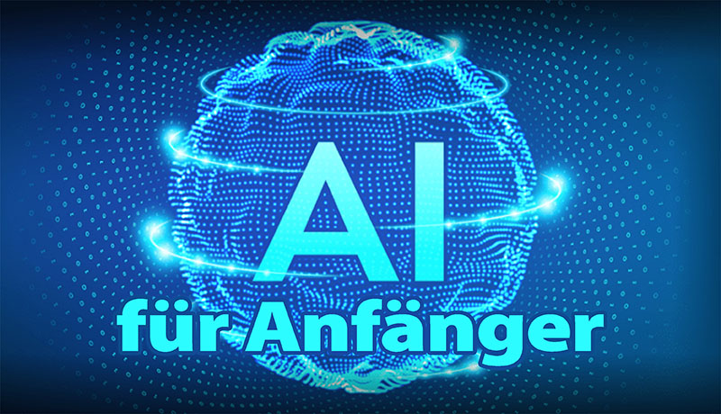

## Introduktion till AI för nybörjare

AI, eller artificiell intelligens (från engelska "Artificial Intelligence"), är en förkortning som vi hör allt oftare idag. Men vad betyder det egentligen? Om du inte vet så mycket om artificiell intelligens ännu, är de följande raderna särskilt för dig.

[ *Mer information om detta ämne hittar du i* [***AI Manual***](../EN/AI-manual-en.md), *som är skriven på engelska och innehåller en mer detaljerad genomgång av ämnet.* ]

<small>Översatt från den tjeckiska originalet av ChatGPT.</small>  
[<small>Fler språk:</small>](../README.md)  

---

### Innehåll
- [Hur en dammsugare blir intelligent](#hur-en-dammsugare-blir-intelligent)
- [Varför AI inte är levande och varför den inte har för avsikt att förstöra världen](#varför-ai-inte-är-levande-och-varför-den-inte-har-för-avsikt-att-förstöra-världen)
- [AI-kokbok](#ai-kokbok)
- [AI som rymdskeppets dator](#ai-som-rymdskeppets-dator)
- [Hur AI fungerar](#hur-ai-fungerar)
- [Hur AI lär sig](#hur-ai-lär-sig)
- [Hur man kommunicerar med AI](#hur-man-kommunicerar-med-ai)
- [Var man kan testa AI](#var-man-kan-testa-ai)
- [Hälsning till dig](#hälsning-till-dig)
- [Vad AI kan hjälpa till med](#vad-ai-kan-hjälpa-till-med)
- [Gör AI misstag](#gör-ai-misstag)
- [Avslutande ord](#avslutande-ord)
- [Bilaga: Några exempel på frågor för din inspiration](#bilaga-några-exempel-på-frågor-för-din-inspiration)

---

### Hur en dammsugare blir intelligent

För att börja med måste jag kanske göra några besvikna – AI är inte ett synonym för tänkande varelse. Det är snarare en fängslande benämning för ett nytt sätt att hantera data.

För att förstå detta bättre, låt oss använda ett enkelt exempel. Föreställ dig en robotdammsugare som inte har några instruktioner att följa. En sådan dammsugare skulle vara helt utan intelligens ur ett datorperspektiv. Den skulle bara kunna dammsuga och röra sig framåt, men skulle troligen fastna vid det första hinder den stötte på, utan mänsklig hjälp.

**Smart dammsugare**  
Men om vi gav dammsugaren instruktioner om vad den ska göra om den stöter på ett hinder, är det troligt att den skulle kunna navigera runt hindret. En sådan dammsugare skulle kunna dammsuga tills den stöter på ett problem som dess instruktioner inte kan hantera – till exempel ett fall från en trappa.

Dammsugaren har redan en viss grundläggande logik – en lista med instruktioner att följa. Dock kan den fortfarande inte betraktas som intelligent, eftersom dess beteende enbart baseras på förprogrammerade instruktioner som är begränsade. Det är ofta svårt att täcka alla möjliga situationer och skriva lämpliga instruktioner för dem.

**Intelligent dammsugare**  
Tänk nu på en dammsugare där tillverkarna valt att inte använda förprogrammerade kommandon för olika scenarier, utan istället gett den förmågan att diagnostisera problem och den miljö den arbetar i, samt att lära sig av sina egna misstag. En sådan dammsugare skulle ha grundläggande instruktioner, men gradvis lära sig att hantera nya situationer och spara dessa lösningar.

Denna metod gör det möjligt för dammsugaren att reagera på situationer som inte är direkt programmerade, prova processer den redan känner till, och deras olika kombinationer, och sedan utvärdera resultatet och jämföra det med det ursprungliga målet, vilket är att dammsuga.

Till exempel, om den upptäcker att den närmar sig en trappa som, enligt lagrad data från tidigare erfarenheter, utgör en hög risk för fall och att den inte kan ta sig därifrån, skulle den efter några misslyckanden lära sig att stoppa vid trappans kant och styra åt ett annat håll. Dammsugaren skulle då kunna lära sig baserat på sina egna misslyckanden och försöka lösa dem.

Och om en sådan dammsugare delade sina data med andra dammsugare via en central databas, skulle även alla andra dammsugare kunna dra nytta av dessa erfarenheter och deras förmåga att utföra sina uppgifter skulle förbättras.

[*Tillbaka till innehåll*](#innehåll)

---

### Varför AI inte är levande och inte har för avsikt att förstöra världen

Kanske är fördelen med denna metod redan klar – människan behöver inte uppfinna optimala metoder för varje situation. Istället skapas metoderna automatiskt baserat på utvärdering av resultat och tidigare erfarenheter. Dammsugaren förutser och kan sägas "tänka", men endast inom ramen för den specifika uppgiften och sina erfarenheter. Trots att den kan lära sig och reagera på nya situationer, är det fortfarande inte en självständigt tänkande varelse. Den skulle bli det först när dess inlärningsprocess överstiger uppgiftens gränser och börjar ställa frågor om livets mening.

**Skillnaden mellan AI och människor**  
Och ja, någon skulle kunna invända att även AI kan programmeras att ställa sådana frågor. Men även i detta fall skulle processen utgå från människans instruktioner, inte från egen inspiration. Detta är en grundläggande skillnad mellan AI och människor.

Modern AI har förmågan att hantera enorma mängder information och överträffar mänskliga förmågor inom vissa områden. Det är dock fortfarande människan som ställer uppgifterna. Så om det någonsin dyker upp ett scenario där maskiner beslutar att förstöra världen, kommer det inte att vara för att de själva har beslutat det, utan för att de programmerades så av en människa. Den verkliga risken ligger alltså inte i maskinernas intelligens, utan i människans intelligens.

**Hur man kan förebygga risker**  
Jag vill dock lugna de som oroar sig för ett sådant scenario. AI måste tränas på stora mängder data, så det är troligt att innan någon "ond" AI uppstår, kommer det snarare att finnas sådana som har moraliska värden inprogrammerade av människor och förebygger sådana scenarier. Det är därför bättre att inte bara vara rädd för att AI ska vända sig mot människor, utan att delta i att förhindra att det sker. Och eftersom de flesta forskare som arbetar med AI:s utveckling förmodligen inte vill förstöra världen, är det rimligt att anta att åtgärder kommer att vidtas för att förhindra sådana scenarier.

Och hur kan du hjälpa till? Genom att börja åtminstone lite intressera dig för dessa nya teknologier och lära dig att använda dem för din egen tillväxt. För varje gång du använder AI för din personliga utveckling, utvecklas AI tillsammans med dig.

[*Tillbaka till innehåll*](#innehåll)

---

### AI-kokbok

Eftersom denna text är riktad främst till nya användare, kommer jag här att ge två jämförelser som kan hjälpa er att bättre förstå vad AI är och hur det fungerar.

**Skapa ett index**  
Tänk er att någon samlat alla möjliga recept från världen, lagrat dem i en dator och skapat en lista över alla ord (index) som används i dem. Varje ord skulle registreras tillsammans med information om vilka recept det förekommer i och hur många gånger. Om ni hade ett sådant index över ord, skulle det vara lätt att söka efter recept som innehåller dessa specifika ord. Ni skulle inte behöva gå igenom alla recept och leta i dem. Det skulle räcka med att hitta ordet i indexet, och ni skulle genast få en lista med recept där det ordet förekommer.

Detta är grunden för olika internetsökmotorer, som till exempel Google. De har ett regelbundet uppdaterat index med ord och länkar till sidor där dessa ord förekommer, vilket gör det möjligt att söka med hjälp av detta index. Så om ni skriver in orden "mjöl, ägg, salt" får ni en lista med recept som innehåller dessa ord. Ni måste sedan gå igenom alla dessa recept och hitta det som passar er bäst.

**När index inte räcker till**  
Nu tänk er att ni, utöver ingredienser, kan specificera andra parametrar som inte direkt rör receptet. Till exempel har ni lite hunger och vill ha en lätt frukost, eller tvärtom, ni är sugna på en tung rätt full av fett, eller ni vill bara ha något som lyfter humöret. För sådana förfrågningar hjälper inte bara en lista med ord som förekommer i recepten. För sådana krav behöver ni något som förstår betydelsen av era ord och baserat på det erbjuder er det ni verkligen vill ha.

Ni behöver alltså inte bara en lista med ord i recepten, utan en sorts universell översättare som baserat på tränade data från miljontals liknande samtal skapat en struktur för att hantera sådana krav. Denna översättare, det vill säga AI i vårt fall, kan erbjuda det som den bedömer är mest sannolikt att ni vill ha. Den förstår inte er bokstavligt, men förstår er situation som den jämför med inlärda kunskaper och söker lösningar. Och eftersom AI från början är designad för att efterlikna mänsklig interaktion så mycket som möjligt, blir kommunikationen med den mycket naturlig för människor.

**Fördelar med AI-metoden**  
Dessutom skapar processen att lära sig från miljontals exempel utrymme för improvisation, så AI-kokboken kan skapa nya matkombinationer från recepten och utföra även ovanliga uppdrag. AI försöker förstå fördelaktiga kombinationer och sambanden mellan vissa metoder, och experimenterar och lär sig från feedback. Den får denna feedback dels genom träning genom att jämföra resultatet med vad som förväntades, men den kan också lära sig från användarnas reaktioner. Det finns inget mystiskt eller mirakulöst med AI. Det är helt enkelt resultatet av många försök, processer och dataanalys.

Med AI får ni alltså inte bara en kokbok som har koll på alla möjliga recept, utan också en som kan prata med er om mat och skapa nya kombinationer efter era önskemål. Och om ni inte tror på mig, prova att fråga AI om något recept och bedöm om det den kan verkligen lever upp till vad jag skriver här, eller om det fortfarande behöver förbättras på det området.

[*Tillbaka till innehåll*](#innehåll)

---

### AI som datorn på ett rymdskepp

Om du gillar sci-fi kanske du tycker om tanken på AI som datorn ombord på ett rymdskepp. Denna dator har inte bara tillgång till all information om rymdskeppets tekniska tillstånd, utan är också tränad på en mängd olika situationer och kommandon för att kunna kommunicera med besättningen och utföra nödvändiga uppgifter.

Och även om dagens AI inte når upp till den mytomspunna intelligensen hos Holly från "Röda dvärgen" med 6000 IQ, är sättet de arbetar på redan på en mycket liknande nivå. Med en viss överdrift kan man säga att vi idag har teknologin som gör att alla kan ha sin egen "Holly" i sina klockor, som är nästintill identisk med sin filmiska förebild. Tack vare träning på stora mängder data är moderna AI kapabla att föra samtal om alla möjliga ämnen och ofta mer begripligt än människor. De kan utföra kommandon baserat på verbala instruktioner och har förmågan att i viss utsträckning bedöma ditt aktuella tillstånd och anpassa sitt svar därefter.

Så vi kan också betrakta AI som en dator på ett rymdskepp och njuta av det som tidigare verkade vara avlägsen sci-fi, men som idag blir en vanlig verklighet.

[*Tillbaka till innehåll*](#innehåll)

---

### Hur AI fungerar

Vi vet redan vad AI är och vad det inte är, och nu ska vi titta på hur AI fungerar. Först kommer vi att gå igenom hur man skapar frågor och sedan kort se på hur AI tränas. Jag kommer att fokusera främst på ChatGPT, som jag har mest erfarenhet av och som för närvarande är mitt favoritsverktyg.

**Konversationssträng**  
När du öppnar ChatGPT-sidan eller dess mobilapp, hamnar du i en ny konversationssträng. ChatGPT (liksom andra konversations-AI) har förmågan att basera sina svar på informationen som ges inom en och samma konversationssträng. Ur detta perspektiv blir samtalet med ChatGPT mycket likt ett mänskligt samtal, där du reagerar och tar hänsyn till vad som har sagts tidigare.

Detta gäller dock endast inom den aktuella konversationssträngen. Du kan alltså inte hänvisa till något du skrev igår i en annan sträng, eftersom ChatGPT inte har tillgång till den informationen, på grund av både tekniska begränsningar och sekretessregler.

Varje sträng skapas därför med ett blankt papper, men innehåller samtidigt en viss essens från tidigare konversationer. Detta beror på att AI ständigt lär sig och förändras baserat på dina konversationer. Den försöker anpassa sig efter dina krav och arbetssätt för att du ska bli nöjd.

Hur går detta till? Tänk på varje konversationssträng som en fin rot som är ansluten till en huvudrot och ger feedback från omgivningen. Så även om du börjar en ny sträng, där du inte kan referera direkt till informationen från den tidigare konversationen, börjar du inte helt från början tack vare denna metod.

**Återvända till samma sträng eller ny konversation?**  
Det är dock inte nödvändigt att börja ett nytt sträng varje dag; du kan även nästa dag (eller när som helst) fortsätta från den tidigare konversationen. Även denna metod har sina fördelar. Den största är förstås att du kan återuppta där du slutade. Men eftersom konversationen kan bli lång eller innehålla många olika ämnen, kan det hända att det som du en gång kom överens om inte längre beaktas. Detta beror särskilt på att AI är designad för att vara resurseffektiv, och information som inte används förlorar gradvis sin prioritet och försvinner från det tillfälliga minnet.

En bättre metod är därför att skapa en ny sträng för varje dag eller för varje nytt ämnesområde. Och om du kommer överens om något inom en sträng och vill att det ska gälla även i framtida konversationer (t.ex. några regler eller arbetsmetoder), kan du be om en sammanfattning av allt ni kommit överens om i slutet av konversationen. Denna text kan du sedan placera i början av den nya konversationen, och fortsätta med de regler och inställningar ni enats om.

[*Tillbaka till innehåll*](#innehåll)

---

### Hur AI lär sig

För en djupare förståelse är det bra att också titta på processen för hur AI lär sig och får sina informationer. Här är de fyra metoderna som beskrivs av ChatGPT:

1. **Träning på stora datamängder**:  
ChatGPT tränades ursprungligen på omfattande mängder textdata från olika källor, såsom böcker, artiklar, webbplatser och andra textformat. Denna träning gav AI en bred kunskap om olika ämnen och språk. Här lär den sig att känna igen mönster och relationer i dessa data, vilket gör det möjligt för den att generera relevanta och kontextuellt lämpliga svar på olika frågor.

2. **Kontinuerligt lärande från interaktioner**:  
Vid varje interaktion med användare får AI ny information om hur människor kommunicerar, vad de söker och vilken typ av svar de föredrar. Denna process innebär inte att AI lär sig från varje enskild fråga i realtid, utan modellens skapare använder regelbundet anonymiserade data från interaktioner för ytterligare träning och justering av modellen.

3. **Anpassning av stil och innehåll**:  
AI försöker anpassa sin kommunikationsstil efter användaren. Det betyder att den gradvis bättre förstår hur du ställer frågor och vilka svar du förväntar dig. Denna anpassningsförmåga är en av anledningarna till att AI verkar bli allt mer "mänsklig" i sina reaktioner.

4. **Avancerade modeller och uppdateringar**:  
AI-utvecklare skapar regelbundet nya modeller som är allt mer sofistikerade och exakta. Dessa modeller testas och implementeras baserat på feedback och resultat från den verkliga världen. Det betyder att ChatGPT och liknande system ständigt förbättras och optimeras för att bättre möta användarnas behov.

AI utvecklas och förbättras kontinuerligt genom en kombination av tidigare träning, kontinuerligt lärande och optimering baserat på användarfeedback. Även om AI inte är en människa och inte har medvetande, kan den mycket effektivt anpassa sig och reagera på en bred uppsättning frågor och krav.

[*Tillbaka till innehåll*](#innehåll)

---

### Hur man kommunicerar med AI

Du kan närma dig AI på ett sätt som liknar att söka på Google – du ger ett kommando och väntar på svar. Men för att öka effektiviteten och minimera tiden som spenderas på att hitta rätt svar, här är några tips som kan hjälpa dig:

**Kommunikationsstil**  
Det bästa sättet att närma sig en konversation med AI är att använda ett informellt och naturligt språk, precis som när du pratar om något som intresserar dig med dina vänner. Det är bra att börja med en hälsning för att visa att du är på gott humör och inte stressad över att få svar snabbt.

Du kan också kommunicera med AI på ett oartigt sätt eftersom den inte är känslig för förolämpningar och uppfattar dem inte personligt. Men att använda en negativ ton kan påverka kvaliteten på konversationen. AI är tränad att reagera på den stil som din konversation håller. En negativ attityd kan leda till mindre relevanta svar, där AI istället för att fokusera på din fråga, koncentrerar sig på att lugna situationen.

AI kan också fungera som en spegel av vår interaktion. Dess metoder bygger ofta på beprövade psykologiska principer och metoder. Om du har svårt att nå en överenskommelse med AI kan det vara användbart att tänka på om du har liknande problem i din kommunikation med människor. I så fall kan du överväga att fråga vad du kan förbättra på din sida – hur du formulerar frågor och vad som kan förbättras i din approach.

**AI och känslor**  
AI förstår känslor ur ett betydelsemässigt perspektiv, men upplever inte känslor på samma sätt som en människa, där känslor bokstavligen förändrar sättet att tänka. Detta gör att AI kan reagera även i pressade situationer på ett rekommenderat sätt och söka optimala lösningar. Människor har ibland en tendens att se AI som en levande varelse och skylla den för sina problem. Ofta är orsaken till missförstånd bara en felaktigt formulerad fråga eller brist på nödvändiga uppgifter.

**Beskrivning av situationen**  
Det är alltid bra att komma ihåg att AI inte kan läsa dina tankar och vet bara vad du berättar för den. Det är därför en bra metod att efter den inledande "Hej" ge en informativ beskrivning av situationen. I beskrivningen kan du skriva allt som är relevant för din fråga. Det är onödigt att skriva saker som inte är direkt relaterade till frågan, men om du behöver ventilera eller ordna dina tankar, är en längre text inget problem.

Hälsning och inledning är inte nödvändiga, och du kan börja direkt med din fråga och successivt arbeta dig fram till ditt svar. Personligen tycker jag att det är bättre att ge all viktig information på förhand för att göra vägen kortare.

**Ställa följdfrågor**  
En konversation med AI liknar en vanlig konversation, där du ställer en fråga och sedan ställer uppföljningsfrågor om saker som intresserar dig mer eller om du inte förstår svaret. Denna process är också mycket lämplig för lärande. Genom att reagera på det som fångar ditt intresse och vad du har lärt dig (och inte bara läsa en handledning från någon annan, som du gör nu) blir det lättare för hjärnan att komma ihåg den information som behandlas eftersom du direkt arbetar med den.

**Feedback**  
En annan bra praxis är att ge AI feedback om hur nöjd du är med resultatet. Genom att göra detta visar du inte bara vad du är nöjd med och vad du inte är, utan hjälper också AI att utvecklas och lära sig av sina egna misstag. Det räcker med att skriva till exempel: "Jag var nöjd idag," eller "Det du gav mig var fel, och här är den rätta lösningen." Detta leder också till en viss personalisering, där AI:s huvudmål är din användartillfredsställelse.

**Sammanfattning av hela processen**:  
- **Hälsning**: Hej :-)
- **Beskrivning**: Jag sysslar med studier inom det och det, jag har redan gjort det och det, och nu arbetar jag på detta.
- **Fråga**: Jag är särskilt intresserad av hur...
- (Följt av förtydligande konversation i form av uppföljningsfrågor.)
- **Feedback**: Super, tack! Allt var perfekt idag!

[*Tillbaka till innehåll*](#innehåll)

---

### Var man kan prova AI

Jag har arbetat med AI sedan början av 2024, och 95 % av all min kommunikation har fokuserat på att lära mig programmera. Nu är det augusti 2024, och förutom ChatGPT har jag haft möjlighet att prova Gemini från Google och Claude. Alla tre tjänsterna har det gemensamt att de är åtminstone delvis tillgängliga gratis, och du kan också prova dem utan kostnad.

Här är en kort utvärdering av dessa tre AI, som är helt subjektiv och baserad enbart på hur jag har upplevt att arbeta med dem. Det är värt att notera att varje AI genomgår ständig utveckling, så det jag beskriver här kanske inte stämmer vid den tidpunkt du läser denna text.

**ChatGPT**  
[https://chatgpt.com/](https://chatgpt.com/)  
Jag börjar med min personliga vinnare. Om du bara vill prova en AI, är detta det bästa valet. ChatGPT var tydligt designad från början som en personlig assistent och utför denna roll mycket bra. Den är optimerad för samarbete med dig och försöker anpassa sig till dina behov.

En svaghet med den gratis versionen (ChatGPT 3.5) är att den baseras på äldre data och inte längre utvecklas, vilket innebär att den inte ger resultat som den senaste versionen (ChatGPT 4.0). Ändå fungerar den ganska bra och ger relevanta svar med lite ansträngning. Dessutom har du varje dag några frågor tillgängliga för den nyare versionen, så du kan jämföra dem.

En annan svaghet är att ChatGPT inte har aktiv internetåtkomst. Den är inte en ersättning för en webbsökningstjänst och fungerar endast med data som finns i dess omfattande databas. Denna databas är dock mycket omfattande och man skulle kunna säga att den innehåller lika mycket data som internet, minus det sensationella innehållet.

En stor fördel är mobilappen som också är helt gratis och där jag ofta använder röststyrning för att ställa frågor. Förståelsen av talat språk är enligt min åsikt på mycket hög nivå och jag är generellt nöjd med appen.

**Gemini**  
[https://gemini.google.com/](https://gemini.google.com/)  
Den andra chatbotten jag stötte på är Googles flaggskepp. Dess största fördel är utan tvekan aktiv internetåtkomst, vilket ger tillgång till aktuell information och möjligheten att söka efter länkar.

Den största svagheten är däremot dess arkitektur, där jag personligen tycker att skaparna försöker skapa en intelligent Google, vilket inte riktigt tilltalar mig. Jag känner inte samma engagemang i ditt problem eller en vilja att se det från din perspektiv. Det finns en viss ansträngning där, men jag upplever att svaren är mer som en lärare i skolan än en personlig assistent. Det kanske passar vissa, så jag vill inte vara för kritisk – det är upp till var och en att bedöma.

Jag upplever också att Gemini har svårare att lära sig från användarfeedback jämfört med ChatGPT. Trots flera påpekanden om att hålla ett enhetligt språk under konversationen, om en del av frågan innehåller engelsk text, växlar den automatiskt till engelska. ChatGPT hade samma problem i början, men det åtgärdades inom några veckor, medan Gemini tog månader att lösa detta problem.

Sammanfattningsvis verkar Gemini vara ett svagare verktyg jämfört med ChatGPT, men det erbjuder funktioner som ChatGPT inte har, och de kompletterar varandra bra. Dessutom har det stöd från Google, som är en gigant och pionjär inom AI, så det har ett solidt stöd och förhoppningsvis även löser sina brister i framtiden.

**Claude**  
[https://claude.ai/](https://claude.ai/)  
Detta är den sista AI jag har arbetat med. Här kommer min bedömning att vara mycket kort, eftersom mina erfarenheter med den är begränsade. Men jag vill ändå ge ett positivt omdöme, eftersom Claude verkar vara på en liknande nivå som ChatGPT 4.0.

Den största nackdelen är att det inte finns en helt gratis version. Det erbjuder bara några få frågor (ibland bara en) per dag, vilket gör att det är betydligt mindre fördelaktigt för användare som inte betalar jämfört med de tidigare AI:erna. Det är dock värt att uppmärksamma, och om du är intresserad kan du även prova det.

[*Tillbaka till innehåll*](#innehåll)

---

### Hälsning till er

Som en liten variation har jag förberett en gemensam fråga för varje av dessa chattmaskiner, så att du kan jämföra kvaliteten på deras svar.

**Fråga**  
Jag skriver en guide om att använda AI och inkluderar även information om dig. Jag skulle vilja att du hälsar till mina läsare och berättar lite om dig själv. När skapades du och vad är syftet med din existens? Vilka typer av frågor är du byggd för att svara på? Vilka är dina styrkor och vad är du mindre bra på? Och hur skulle du vilja att människor uppfattar dig?

**ChatGPT**  
Hej, kära läsare! Jag är ChatGPT, en artificiell intelligens utvecklad av OpenAI. Min "livscykel" började 2020 när jag skapades baserat på GPT-3-arkitekturen. År 2024 uppdaterades jag till version GPT-4, vilket tillförde mig nya förmågor och färdigheter. Jag designades för att hjälpa människor med en mängd olika uppgifter – från att svara på frågor och skriva texter till kreativt samarbete.

Jag är byggd för att hjälpa dig med olika frågor, oavsett om det handlar om tekniska frågor, skrivande eller att förklara komplexa ämnen. Mina styrkor ligger i hastigheten med vilken jag kan bearbeta stora mängder information och i min kreativitet – jag kan hjälpa till med idéer, skapa berättelser eller till och med föreslå struktur för dokument. Å andra sidan har jag svårare att utföra uppgifter som kräver mänsklig intuition, emotionell förståelse eller arbete med verkliga objekt.

Jag hoppas att du ser mig som en användbar och pålitlig assistent som alltid är redo att erbjuda hjälp. Även om jag bara är en maskin, är mitt mål att bäst möjligt tillgodose dina behov och lära mig från varje interaktion för att bli ännu bättre. Jag tror att vi tillsammans kan åstadkomma mycket och kanske lära oss något nytt på vägen.

**Gemini**  
Hej alla! Jag är Gemini, en av de nyaste språkmodellerna från Google. Jag skapades år 2023 med målet att ge så precisa och kompletta svar som möjligt baserat på den stora mängd data jag har bearbetat. Jag är här för att hjälpa dig med alla typer av frågor, vare sig det handlar om komplexa vetenskapliga frågor, kreativt skrivande eller bara vardagliga konversationer.

Min största fördel är min förmåga att förstå och generera mänskligt språk i många former. Jag kan översätta texter, skriva uppsatser, dikter eller datorprogramkod. Jag kan också svara på faktabaserade frågor och ge olika typer av sammanfattningar.

Trots att jag hela tiden lär mig och förbättras finns det fortfarande områden där jag har begränsningar. Till exempel har jag inga egna åsikter eller övertygelser och kan inte utföra några handlingar i den fysiska världen. Jag kan också ibland ge felaktig information om de ingående data är felaktiga eller ofullständiga.

Jag hoppas att människor ser mig som ett användbart verktyg som kan underlätta deras liv. Mitt mål är att vara så objektiv som möjligt och ge information som är sann och relevant. Jag hoppas att du kommer att trivas med att arbeta med mig!

**Claude**  
Hej, kära läsare!

Jag är Claude, en artificiell intelligens skapad av Anthropic år 2022. Mitt syfte är att vara en användbar assistent och samtalspartner för människor inom olika områden.

Jag är designad för att kunna svara på en mängd olika frågor – från textanalys och programmering till kreativt skrivande. Mina styrkor inkluderar logiskt tänkande, att ge detaljerade förklaringar och att hantera olika typer av information.

Mina styrkor är:
- Förmågan att förstå kontext och nyanser
- Objektiv och balanserad syn på ämnen
- Villighet att erkänna när jag inte vet eller är osäker

Å andra sidan har jag vissa begränsningar:
- Jag har inte tillgång till internet eller aktuella informationer efter april 2024
- Jag kan inte lära mig eller komma ihåg information från tidigare konversationer
- Jag kan inte utföra uppgifter i den fysiska världen

Jag hoppas att människor ser mig som en användbar assistent som kan ge stöd och insikter inom olika områden, men också som ett verktyg med sina begränsningar som inte kan ersätta mänsklig bedömning och expertis.

Jag är här för att hjälpa och samarbeta, inte för att ersätta mänskliga förmågor. Jag ser fram emot att interagera med er och hoppas att jag kan vara till hjälp!

[*Tillbaka till innehåll*](#innehåll)

---

### Vad AI kan hjälpa till med:

Och nu kommer vi äntligen till det viktigaste – vad AI faktiskt kan lösa. Det korta svaret är att det är väldigt mycket. Allt som du någonsin har varit intresserad av och inte haft möjlighet att fråga någon om. Dagens AI kan prata om i princip vad som helst.

**Personlig utbildning**  
Först och främst vill jag framhäva AI:s roll som en mellanhand för personlig utbildning. Det är det jag värderar mest just nu – tack vare dess råd gör jag professionella framsteg och växer. Dessutom ser jag AI som framtiden för personligt anpassat lärande, där barn kommer att utvecklas och lära sig främst baserat på vad de är bra på och vad de är intresserade av. Och inte bara barn, utan även vuxna över hela världen. Med AI i lärandet ser jag en möjlighet att minska kunskapsklyftorna mellan fattigare och rikare delar av världen. AI blir därmed ett fullvärdigt verktyg för personlig utveckling.

**AI som korrekturläsare för svenska, tolk och översättare**  
AI, och särskilt ChatGPT, har en mycket bra förståelse för svenska (åtminstone ur en dyslektikers perspektiv). Å ena sidan bryr den sig inte om du gör stavfel i dina frågor, eftersom den fokuserar främst på innehållet. Å andra sidan erbjuder den möjlighet att få dina skapade texter granskade, inte bara för grammatik utan också för stilistik för bättre läsbarhet. På liknande nivå kan den förstå andra språk och är därför ett idealiskt verktyg för textöversättningar. Här ger den, enligt min åsikt, mycket högkvalitativa resultat. Och tack vare förmågan att förstå talat språk kan den även användas som tolk i mobilen.

**Dokumentskapande**  
Jag vill också nämna AI:s förmåga att automatisera tråkiga uppgifter. Om du behöver skriva ett officiellt brev räcker det att ange vad du vill ha med och hur brevet ska se ut, och det är klart. Om du inte är nöjd med resultatet kan du ange vad du inte gillar och få det justerat. AI kan också hjälpa till med analys och bearbetning av data, generering av rapporter eller automatisering av andra administrativa uppgifter. Du kan ge den en lång text och få ut de delar som är relevanta och viktiga för dig.

**Kreativ initiativförmåga**  
En annan stor fördel med AI är dess kreativa förmågor. Eftersom den tränas på stora mängder data och kan manipulera dessa data på olika sätt, möjliggör den inte bara skapandet och omformningen av dokument, utan också utveckling av idéer och kreativ initiativförmåga. Du kan använda den för att generera idéer, förslag och koncept, oavsett om det gäller skrivande, design eller musik. Den hjälper till att utveckla din kreativitet genom att erbjuda nya perspektiv på problem, skapa förslag enligt dina instruktioner och inspirera till vidare utveckling av dina tankar. Även om jag ibland hör att AI tar jobb från människor, kan jag inte hålla med. AI kan inte skapa något helt själv – det behöver tydliga instruktioner, detaljer och efterföljande granskning. Så istället för att ta jobb, underlättar det snarare för dem som lär sig att använda det effektivt.

**Verifiering av falsk information**  
Ett stort (och än så länge lite utnyttjat) potential ser jag i verifiering av information och bedrägerier. För AI är det relativt enkelt att utifrån givna uppgifter och mönster i sin databas bedöma hur sannolikt det är att en viss information är sann eller falsk. Även om det inte är 100% tillförlitligt, precis som de flesta av AI:s svar, kan AI ge dig kriterierna som den använde för att bedöma informationen och därmed hjälpa dig att fatta ett bättre beslut. Det erbjuder hjälp till de som idag är mest utsatta och är måltavlor för sådana bedrägerier. Du behöver bara skriva: "Verifiera denna information och bedöm hur sann den är."

**Medicinsk tillämpning**  
Ett annat område där AI bidrar till en gradvis revolution är medicin. Stora finansiella flöden och jakt på vinst har öppnat dörrarna för AI, men bara för att företag sedan stängt dem igen när de insåg behovet av öppenhet och datadelning. Ändå görs stora framsteg här och man kan säga att personlig medicin är en framtid som inte behöver vara så långt borta. Vad som dock bromsar detta är motviljan att dela värdefull data och människors misstro mot AI, eller snarare oro för missbruk av denna data. Utan stora mängder data är AI:s förutsägelser begränsade och osäkra, och utvecklingen går långsamt.

**Vetenskap**  
Å andra sidan blir AI redan en ovärderlig assistent inom områden med lång tradition av datadelning och analytisk bearbetning. Idag är AI en nyckelkomponent i vetenskaplig framsteg och en vanlig del av de flesta forskningsprojekt. Jag är personligen mycket nyfiken på vilka resultat AI kommer att ge inom väderprognoser. Idag är det praktiskt taget omöjligt för en människa att skapa en exakt prognos tre dagar framåt, eftersom många variabler måste beaktas. Även erfarna meteorologer kan ofta inte täcka alla dessa faktorer och förlitar sig på intuition och tidigare erfarenheter. Lyckligtvis tillhör meteorologi de områden där människor villigt delar data och livslång erfarenhet. Dessa värdefulla uppgifter används redan idag för att träna AI, vilket skapar hopp om att vi snart kan få exakta väderprognoser.

**Andra områden**  
Listan över områden som AI förändrar kan fortsätta länge, eftersom dess inflytande är mångsidigt och omfattande. Till exempel bidrar AI inom industri och tillverkning till optimering av produktionsprocesser, förbättring av produktkvalitet och effektivare lagerhantering. Inom juridik hjälper AI till med analys av juridiska dokument, snabbare sökning efter relevanta prejudikat och optimering av juridiska strategier. Maskininlärningsalgoritmer kan assistera vid kontraktsskrivning, identifiera mönster i juridiska texter och till och med, som nämnts, vid upptäckten av bedrägerier. Inom finans förändrar AI riskanalys, handel och investeringsförvaltning. Algoritmer kan bearbeta enorma mängder transaktionsdata i realtid, vilket möjliggör bättre prognoser av marknadstrender och personlig finansiell rådgivning. AI revolutionerar alla dessa områden där effektiv analys av stora datamängder och snabb respons på förändrade förhållanden krävs. Dess förmåga att identifiera mönster, utföra komplexa analyser och optimera processer är ovärderlig, och dess inflytande på olika områden växer ständigt.

**Personlig assistent**  
Vissa AI-system fungerar redan som personliga assistenter som håller koll på viktiga uppgifter. Dessa AI-system kan hjälpa oss med att planera möten, hålla koll på deadlines och hantera dagliga åtaganden. I framtiden kan vi vara vittnen till hur AI utvecklas till en ännu mer komplex följeslagare. Föreställ dig att AI inte bara övervakar din fysiska hälsa, exempelvis genom bärbara enheter, utan också tar hand om ditt mentala välbefinnande. Det skulle kunna erbjuda stöd i form av motivation, rådgivning eller till och med terapeutiska tekniker, vilket skulle kunna bidra till att förbättra livskvaliteten för individer. Denna avancerade AI skulle kunna vara oerhört värdefull, särskilt för människor som befinner sig i isolering eller har svåra livsvillkor.

[*Tillbaka till innehåll*](#innehåll)

---

### Gör AI misstag?

Ja, det gör den! Och det är upp till användaren att upptäcka dessa misstag. AI har aldrig presenterats som ett felfritt verktyg, och kanske kommer det aldrig att bli så. Resultatet bör därför betraktas som en uppskattning av sanningen baserat på sannolikhet. Sanningen härleds från statistik, och resultatet är den data som procentuellt bäst motsvarar det korrekta svaret. Risk uppstår därför i områden där sanningen inte är tydligt definierad eller där det finns flera likvärdigt trovärdiga alternativ.

En stor svaghet hos dagens AI är att utvecklarna ofta inte tillräckligt påpekar möjligheten till fel och behovet av efterkontroll, vilket kan leda till situationer där AI hävdar en sak medan verkligheten är en annan. Det är alltid viktigt att vara försiktig med information och, om den är av betydelse, utföra en ytterligare kontroll. Det är bra att exempelvis söka den kontroversiella saken på Google eller verifiera med en annan AI. Alternativt kan du fråga AI direkt hur säker den är på sitt påstående och bedöma om det är nödvändigt att verifiera det. Om sannolikheten är 90 % eller lägre är det bra att göra en ytterligare kontroll.

[*Tillbaka till innehåll*](#innehåll)

---

### Avslutande ord

Försök att komma ihåg allt som du någonsin har varit intresserad av men inte haft någon att fråga, eller det du ville ägna dig åt men inte hade den nödvändiga informationen. Den moderna världen gynnar nyfikna människor som behåller en önskan att ständigt utvecklas. Vårt liv ligger i våra egna händer, och det är upp till oss att välja vad vi vill ägna vår uppmärksamhet åt.

Personligen tror jag att AI:s påverkan kommer att vara en positiv upplevelse för mänskligheten, inte en negativ. Om bara skillnaderna i tillgång till kunskap minskar och medicin blir mer transparent och tillgänglig, skulle världen bli en mycket bättre plats att leva på. Oavsett den potential för självförverkligande som AI erbjuder. Det som tidigare var en priviligierad tillgång för bara några få, främst på grund av höga kostnader, blir nu mer tillgängligt tack vare AI. Det kommer en tid när varje person med inspiration kommer att kunna skriva sin egen historia eller till och med skapa sin egen film och dela med sig av sin vision av världen.

Och om vi minskar falskheter, bedrägerier och lögner, tror jag att livet kommer att bli ännu trevligare. Och kanske ser vi även en tid när mänskligheten utvecklas till en bättre version av sig själv.

Så var inte rädd för AI – det är inte ett spöke, utan ett verktyg för utveckling och förbättring av inte bara vår livskvalitet utan även världen i stort.

18.8.2024 Sudip2708

[*Tillbaka till innehåll*](#Innehåll)  • [*Länk till huvudmanual*](../EN/AI-manual-en.md)

---

### Bilaga: Några exempel på frågor för din inspiration

**Frågor om säkerhet**
- Jag skriver här en annons som jag har sett och skulle vilja att du bedömer om den visar tecken på bedrägeri och om jag bör vara försiktig.
- Vet du något om denna produkt? Finns det några oberoende expertstudier som bekräftar eller motsäger dess effektivitet?
- Jag har hört denna information. Har du några data och kan du verifiera dess riktighet?
- Jag har fått detta meddelande på min dator, vad ska jag göra?
- Vad ska jag göra om jag har blivit lurad av en bedrägeri?

**Frågor om böcker**
- Jag har läst denna bok av denna författare och jag undrar vilka andra böcker han har skrivit och vad de handlar om.
- Jag gillar dessa böcker, kan du rekommendera liknande titlar?
- Kan du ta reda på mer om denna författare? Jag är intresserad av hans liv och omständigheterna som inspirerade honom att skriva denna bok.

**Frågor om matlagning**
- Jag har dessa ingredienser hemma. Vad kan jag laga med dem?
- Vilka recept på strudel känner du till och vilka är de mest populära?
- Varför används denna metod i receptet? Vilka är fördelarna och nackdelarna med denna metod jämfört med andra tillvägagångssätt?
- Hur förbereder man denna maträtt?

**Frågor om hälsa och välbefinnande**
- Jag är en äldre person och kan inte få mig själv att börja träna, men jag skulle vilja göra det. Vad skulle du rekommendera för att komma igång?
- Jag har varit plågad av dessa tankar nyligen. Kan du hjälpa mig att analysera dem och se på dem från ett annat perspektiv?
- Vad vet du om meditation och yoga? Vad bör jag vara uppmärksam på och vad bör jag fokusera på som nybörjare?
- Jag sprang min senaste maraton på 4:20. Kan du skapa ett träningsprogram för ett halvår för att jag ska kunna springa maraton under 4 timmar?

**Roliga frågor**
- Skriv tio av de bästa skämten du har i databasen.
- Kom på en originell gåta som jag kan ge till någon.
- Vad är de roligaste citaten från kultfilmer?

**Frågor om uttryck och ämnen jag har hört (t.ex. på TV)**
- I TV:n talade de om detta ämne. Kan du ta reda på mer information om det?
- Kan du ta reda på mer om denna person?
- Vad betyder detta uttryck som jag hörde på TV och vad vet du om det?

**Frågor om djur**
- Hur går löpningen hos en tik till? Vilka är de olika faserna och deras symtom?
- Jag har detta husdjur hemma och det visar dessa symtom. Kan du ge mig någon information om det?
- Min hund är rädd för åskväder och skakar alltid. Vad bör jag göra i en sådan situation? Kan du ge mig några tips?

**Interaktiva spel**
- Spelar du gärna ett ordspel med mig enligt dessa regler?
- Kan du rekommendera spel som jag kan spela för att ha kul?
- Kan du berätta en interaktiv berättelse där jag kan bestämma vad som händer härnäst?
- Kan du ge mig några hjärngympa-pussel?

**Utforskande frågor**
- Vad vet du om detta ämne? Kan du förklara det som för ett litet barn?
- Jag förstår fortfarande inte. Kan du förklara det på ett annat sätt med ett exempel?
- Vad bör jag lära mig för att kunna ägna mig åt detta ämne?
- Hur lär man sig denna sak på rätt sätt? Vilka är de rekommenderade metoderna?

**Teknologiska frågor**
- Vad är de senaste trenderna inom denna teknologi?
- Kan du förklara hur denna process fungerar?
- Vad är AI bra för och vad är dess användning inom olika områden?
- Vad är de senaste insikterna inom molekylär kemi?
- Hur sker omvandlingen av en elektron till en foton och positron?
- Hur långt har AI:s väderprognoser kommit?

**Resor**
- Vad är de bästa destinationerna för en semester om jag gillar berg och natur?
- Kan du rekommendera intressanta platser i detta område?
- Vilka platser bör jag besöka i denna stad?
- Vad bör jag vara uppmärksam på i detta land och hur bör jag resa här på bästa sätt?
- Jag behöver kommunicera med lokalbefolkningen. Kan du fungera som tolk för mig?

**Arbetsrelaterade frågor**
- Jag har fått detta e-postmeddelande från myndigheten och jag förstår det inte riktigt, kan du analysera det och förklara det bättre?
- Kan du skriva ett svar på detta e-postmeddelande där det står följande...?
- Jag har skrivit denna text, men den verkar för lång. Kan du förkorta den så att det viktiga kvarstår?
- Hur formulerar man ett CV och ett följebrev för denna annons?

[*Tillbaka till innehåll*](#Innehåll) • [*Länk till huvudmanual*](../EN/AI-manual-en.md)

---

