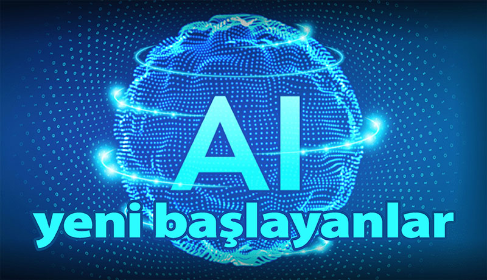

## Başlangıç Seviyesi için AI'ya Giriş

Yapay Zeka (İngilizce "Artificial Intelligence" teriminden kısaltma), günümüzde daha sık duyduğumuz bir terimdir. Ancak bu ne anlama gelir? Eğer yapay zeka hakkında çok şey bilmiyorsanız, aşağıdaki satırlar tam olarak sizin için hazırlanmıştır.

[ *Bu konu hakkında daha fazla bilgiyi* [***AI Kılavuzu***](../EN/AI-manual-en.md) *adlı İngilizce yazılmış ve konuyu daha ayrıntılı ele alan belgede bulabilirsiniz.* ]

<small>Çekçe orijinalinden ChatGPT tarafından çevrilmiştir.</small>  
[<small>Diğer diller:</small>](../README.md)  

---

### İçindekiler
- [Elektrikli Süpürge Nasıl Akıllı Hale Gelir](#elektrikli-süpürge-nasil-akilli-hale-gelir)
- [Neden AI Canlı Değildir ve Dünyayı Yok Etmek İstemez](#neden-ai-canli-degildir-ve-dunyayi-yok-etmek-istemez)
- [AI Tarifleri](#ai-tarifleri)
- [AI Uzay Gemisi Bilgisayarı Olarak](#ai-uzay-gemisi-bilgisayari-olarak)
- [AI Nasıl Çalışır](#ai-nasil-calisir)
- [AI Nasıl Öğrenir](#ai-nasil-ogrenir)
- [AI ile Nasıl İletişim Kurulur](#ai-ile-nasil-iletisim-kurulur)
- [AI'yi Nerede Deneyebilirsiniz](#aiyi-nerede-deneyebilirsiniz)
- [Size Selam](#size-selam)
- [AI Size Nasıl Yardımcı Olabilir](#ai-size-nasil-yardimci-olabilir)
- [AI Hata Yapar mı](#ai-hata-yapar-mi)
- [Son Söz](#son-soz)
- [Ek: İlham Almanız İçin Bazı Soru Örnekleri](#ek-ilham-almaniz-icin-bazi-soru-ornekleri)

---

### Elektrikli Süpürge Nasıl Akıllı Hale Gelir

Başlangıçta bazılarını belki hayal kırıklığına uğratabilirim – AI, düşünme yeteneğine sahip bir varlık anlamına gelmez. Daha çok verilerle çalışma konusunda yeni bir yaklaşımı tanımlayan çekici bir isimdir.

Bunu daha iyi anlayabilmek için basit bir örnek verelim. Hiçbir talimatı olmayan bir robot süpürge düşünün. Bu tür bir süpürge, bilgisayar mantığı açısından tamamen zekasız olurdu. Sadece süpürme ve ileriye hareket etme işlevini yerine getirebilir, ancak bir engelle karşılaştığında, insan müdahalesi olmadan bunu aşamazdı.

**Akıllı Süpürge**  
Ancak süpürgeye engellerle karşılaştığında ne yapması gerektiğini belirten talimatlar verirsek, engelleri dolanabilir. Bu tür bir süpürge, bir engel karşısında talimatlarının yetersiz kaldığı bir problemle karşılaşana kadar süpürmeye devam edebilir – örneğin, merdivenlerden düşme tehlikesi.

Süpürge, belirli bir temel mantığı içerir – belirli talimatlara göre hareket eder. Ancak hala zeki olarak kabul edilemez, çünkü davranışları sadece önceden programlanmış ve sınırlı talimatlardan kaynaklanır. Olası tüm durumları kapsamak ve bunlara uygun talimatlar yazmak genellikle zordur.

**Zeki Süpürge**  
Şimdi ise, üreticilerin çeşitli senaryolar için önceden hazırlanmış komutlar yerine, süpürgenin çevresindeki problemleri ve ortamı tanımasını ve kendi hatalarından öğrenmesini sağlayan bir yaklaşımı tercih ettiği bir süpürgeyi düşünün. Bu tür bir süpürge de temel talimatlara sahip olacaktır, ancak zamanla yeni durumlarla başa çıkmayı öğrenir ve bu çözümleri hafızasında tutar.

Bu yaklaşım, doğrudan programlanmamış durumlara tepki vermesini sağlar. Süpürge, bildiği işlemleri ve çeşitli kombinasyonları denemeye çalışır, ardından sonucu değerlendirir ve orijinal talimatla karşılaştırır – yani süpürmeye devam eder.

Örneğin, süpürge, önceden birikmiş verilerden merdiven kenarına yaklaştığını ve bu durumun yüksek düşme riski taşıdığını fark ederse, birkaç başarısız denemeden sonra merdiven kenarında durmayı ve başka bir yöne yönelmeyi öğrenir. Bu şekilde, süpürge kendi başarısızlıklarından öğrenir ve bunları çözmeye çalışır.

Ve bu tür bir süpürge, verilerini merkezi bir veritabanı aracılığıyla diğer süpürgelerle paylaşırsa, diğer süpürgeler de bu deneyimlerden yararlanabilir ve görevlerini yerine getirme yetenekleri gelişir.

[*İçeriğe Dön*](#içerik)

---

### Neden AI Canlı Değildir ve Dünyayı Yok Etme Amacı Güder

Bu yaklaşımın avantajı şimdi netleşmiş olabilir – insan her durum için en iyi yöntemleri bulmak zorunda değildir. Bunun yerine, yöntemler sonuçların değerlendirilmesi ve önceki deneyimlere dayanarak kendiliğinden oluşur. Süpürge, öngörülerde bulunur ve "düşünebilir," ancak bu sadece verilen görev ve deneyimlerle sınırlıdır. Öğrenme ve yeni durumlara tepki verme kapasitesine sahip olmasına rağmen, hala bağımsız olarak düşünen bir varlık değildir. Bağımsız düşünmeye başladığında, yani görevleri yerine getirmeyi aşarak hayatın anlamı gibi soruları sormaya başladığında, o zaman bağımsız bir varlık olurdu.

**AI ve İnsan Arasındaki Fark**  
Evet, bazıları AI’nın bu tür soruları sorması için programlanabileceğini öne sürebilir. Ancak, bu durumda bile süreç insanın verdiği talimatlara dayanır, kendi ilhamına değil. Bu, AI ile insan arasındaki temel farktır.

Modern AI, büyük miktarda bilgiyle çalışabilme yeteneğine sahiptir ve bazı alanlarda insan yeteneklerini aşabilir. Yine de, görevleri belirleyen insanlardır. Bu nedenle, makinelerin dünyayı yok etme kararı verdiği bir senaryo ortaya çıkarsa, bu, makinelerin kendi kendine karar vermesi değil, insanların onları bu şekilde programlamış olmasıyla ilgili olacaktır. Gerçek risk, makinelerin zekasında değil, insan zekasındadır.

**Risklerden Nasıl Kaçınılır**  
Ancak benzer bir senaryodan endişelenenleri rahatlatmak isterim. AI büyük veri setleri ile eğitilmelidir, bu nedenle "kötü" AI’nın ortaya çıkmasından önce, insan tarafından yerleştirilen ahlaki değerlere sahip AI’lar daha olasıdır ve bu tür senaryoları önleyeceklerdir. AI’nın insanlara karşı dönmesinden korkmak yerine, bunun gerçekleşmesini önlemeye katkıda bulunmak daha iyidir. Ve AI geliştiren bilim insanlarının çoğu dünyayı yok etmek istemeyeceği için, benzer senaryoları önleyecek önlemlerin zamanla alınması da olasıdır.

Peki, siz bu süreçte nasıl yardımcı olabilirsiniz? En azından bu yeni teknolojilere biraz ilgi göstererek ve onları kendi kişisel gelişiminiz için nasıl kullanacağınızı öğrenerek. Çünkü AI’yı kişisel gelişiminiz için kullandığınız her an, AI sizinle birlikte gelişir.

[*İçeriğe Dön*](#içerik)

---

### AI Tarif Kitapçığı

Bu metin öncelikle yeni kullanıcılara yönelik olduğundan, AI'nin ne olduğunu ve nasıl çalıştığını daha iyi anlamanıza yardımcı olabilecek iki benzetme sunacağım.

**Dizin Oluşturma**  
Dünyadaki tüm tarifleri toplayıp bir bilgisayara yüklediğinizi ve içinde kullanılan tüm kelimelerin bir listesini (dizin) oluşturduğunuzu hayal edin. Her kelime, hangi tariflerde geçtiği ve kaç kez geçtiği bilgisiyle birlikte kaydedilir. Bu tür bir kelime dizinine sahip olduğunuzda, belirli kelimeleri içeren tarifleri aramak kolaylaşır. Tüm tarifleri tarayıp aramak zorunda kalmazsınız. Tek yapmanız gereken, dizindeki kelimeyi bulmak ve hemen o kelimeyi içeren tariflerin listesini almak.

Bu yaklaşım, Google gibi çeşitli internet arama motorlarına dayanmaktadır. Bu motorlar, düzenli olarak güncellenen kelime listelerine ve bu kelimelerin bulunduğu sayfalara bağlantılara sahiptir ve size bu dizin aracılığıyla arama yapma imkanı sağlar. Dolayısıyla "un, yumurta, tuz" gibi kelimeleri girerseniz, bu kelimeleri içeren tariflerin bir listesini alırsınız. Daha sonra bu tarifleri gözden geçirip size en uygun olanını seçmek size kalır.

**Dizinlerin Yetersiz Olduğu Durumlar**  
Şimdi, malzemelerin yanı sıra tarifle doğrudan ilgili olmayan diğer parametreleri de belirleyebileceğinizi hayal edin. Örneğin, hafif bir kahvaltı isteyebilirsiniz çünkü küçük bir açlık hissediyorsunuz, ya da tam tersine, yağlı bir yemek isteyebilirsiniz, veya sadece ruh halinizi iyileştirecek bir şey arıyorsunuz. Böyle talepler için sadece tariflerdeki kelime dizini pek yardımcı olmaz. Bu tür istekler için kelimelerinizin anlamını anlayan ve bunlara dayalı olarak gerçekten ne istediğinizi size sunabilecek bir şeye ihtiyacınız var.

Bu durumda, tariflerdeki kelimeler listesi yeterli olmayacaktır. Bunun yerine, milyonlarca benzer konuşma verisiyle eğitilmiş bir yapay zeka, bu tür talepleri çözmek için bir yapı geliştirmiştir. Bu "çevirmenci" yani AI, size en olası ve uygun olanı sunmaya çalışır. Size kelime anlamıyla değil, durumunuzu öğrenilmiş bilgilerle karşılaştırarak anlamaya çalışır ve çözüm arar. AI, başlangıçta insan etkileşimine en yakın şekilde tasarlandığından, onunla iletişim kurmak oldukça doğal hale gelir.

**AI Yaklaşımının Avantajları**  
Ayrıca, milyonlarca örnekle öğrenme süreci, AI'nin tariflerden yeni yemek kombinasyonları oluşturmasını ve alışılmadık talimatları yerine getirmesini sağlayacak bir alan yaratır. AI, yararlı kombinasyonları ve belirli süreçlerin bağlantılarını anlamaya çalışır ve sonra geri bildirimlerden öğrenir. Bu geri bildirimler, sonuçların beklenenlerle karşılaştırılmasıyla eğitim sırasında elde edilir, aynı zamanda kullanıcı tepkilerinden de öğrenebilir. Bu nedenle AI'da gizemli veya mucizevi bir şey yoktur. Sadece birçok denemenin, sürecin ve veri analizinin sonucudur.

Bu nedenle, AI sadece tüm tariflerin bir özetini sunmakla kalmaz, aynı zamanda yemekler hakkında sizinle konuşabilir ve isteklerinize göre yeni kombinasyonlar oluşturabilir. Eğer bana inanmakta tereddüt ediyorsanız, AI'ya yemekle ilgili bir şeyler sormayı deneyin ve burada yazdıklarımın ne kadarını gerçekten yapabildiğini değerlendirin, yoksa bu konuda daha fazla gelişmeye mi ihtiyaç var.

[*İçeriğe Dön*](#içerik)

---

### AI Uzay Gemisi Bilgisayarı Olarak

Bilim kurgu severler için AI'yi bir uzay gemisinin ana bilgisayarı olarak düşünmek ilginç olabilir. Bu bilgisayar sadece geminin teknik durumu ile ilgili tüm bilgilere erişime sahip olmakla kalmaz, aynı zamanda birçok farklı durum ve komut için eğitilmiştir, böylece mürettebatla iletişim kurabilir ve gerekli işlemleri gerçekleştirebilir.

Ve bugün AI'ler, Kırmızı Cüce'deki Holly'nin efsanevi 6000 IQ'suna ulaşmasa da, çalışma şekilleri oldukça benzer bir seviyeye gelmiştir. Biraz abartı olabilir ama bugün teknolojimiz sayesinde herkesin saati içinde bir "Holly"ye sahip olması mümkün, ki bu neredeyse film karakterinden ayırt edilemez. Büyük miktarda veri üzerinde eğitim alan modern AI'ler, herhangi bir konuda konuşma yapabilir ve sıklıkla insanlardan daha anlaşılır olabilirler. Sözlü komutlara dayanarak görevleri yerine getirebilirler ve belirli bir ölçüde mevcut durumunuzu değerlendirme ve yanıtı buna göre uyarlama yeteneğine sahiptirler.

Bu nedenle AI'yi bir uzay gemisi bilgisayarı olarak da görebiliriz ve böylece daha önce uzak bir bilim kurgu olarak görünen şeylerin bugün sıradan bir gerçeklik haline geldiğini deneyimleyebiliriz.

[*İçeriğe Dön*](#içerik)

---

### AI Nasıl Çalışır

Artık AI'nin ne olduğunu ve ne olmadığını biliyoruz, şimdi ise AI'nin nasıl çalıştığını inceleyeceğiz. Öncelikle sorguların oluşturulmasını ele alacağız ve ardından AI'nin eğitim sürecine kısa bir bakış atacağız. Özellikle en çok deneyime sahip olduğum ve şu anda en sevdiğim araç olan ChatGPT'ye odaklanacağım.

**Konuşma Dizisi**  
ChatGPT'nin sayfasını veya mobil uygulamasını açtığınızda, yeni bir konuşma dizisine giriş yaparsınız. ChatGPT (diğer konuşma AI'leri gibi) yanıtları oluştururken size bir konuşma dizisi içinde verdiğiniz bilgileri kullanma yeteneğine sahiptir. Bu açıdan, ChatGPT ile yapılan konuşma, insanla yapılan bir konuşmaya oldukça benzer hale gelir; yanıtlar verirken daha önce söylenenleri de dikkate alırsınız.

Bu durum yalnızca mevcut konuşma dizisi için geçerlidir. Önceki bir konuşma dizisinde yazdığınız bir şeye atıfta bulunamazsınız çünkü ChatGPT o dizini göremez; bunun başlıca nedenleri teknik sınırlamaları ve kişisel verilerin korunmasına ilişkin düzenlemelerdir.

Her konuşma dizisi, temiz bir başlangıç ile oluşturulur, ancak aynı zamanda önceki konuşmalardan belirli bir öz içerir. AI sürekli olarak öğrenir ve sizinle yapılan konuşmalara göre değişir. İhtiyaçlarınıza ve çalışma tarzınıza uyum sağlamaya çalışır, böylece memnun kalırsınız.

Bu nasıl gerçekleşir? Her konuşma dizisini, ana köke bağlı ince bir kök olarak hayal edin; çevreden geri bildirim gönderir. Böylece, önceki konuşma bilgilerini doğrudan kullanamayacağınız yeni bir konuşma dizisine başlasanız bile, bu yaklaşım sayesinde tamamen sıfırdan başlamış olmazsınız.

**Aynı Dizide Mi Devam Etmeli Yoksa Yeni Bir Konuşma mı Başlatmalı?**  
Her gün yeni bir diziden başlamak zorunda değilsiniz; bir sonraki gün (veya başka bir zaman) önceki konuşmaya devam edebilirsiniz. Bu yaklaşımın da avantajları vardır. En önemli avantajı, kaldığınız yerden devam edebilmenizdir. Ancak konuşma dizisi uzunlaştıkça veya birçok farklı konu içerirse, dizinin ilerleyen kısmında vardığınız anlaşmalar dikkate alınmayabilir. Bu durum özellikle, AI'nin kaynaklarını korumak için tasarlanmış olmasından kaynaklanır ve kullanılmayan bilgiler önceliğini kaybeder ve geçici hafızadan silinir.

Bu nedenle, her gün veya her yeni konu için yeni bir konuşma dizisi başlatmak daha iyi bir yaklaşımdır. Eğer bir konuşma dizisinde bir konuda anlaşmaya varırsanız ve bunun bir sonraki konuşmada da geçerli olmasını isterseniz (örneğin, bazı kurallar veya çalışma yöntemleri), konuşmanın sonunda anlaşmanızın özetini talep edin. Bu metni yeni bir konuşmanın başına ekleyebilir ve anlaştığınız kurallar ve ayarlarla devam edebilirsiniz.

[*İçeriğe Dön*](#içerik)

---

### AI Nasıl Öğrenir

Daha derin bir anlayış için AI'nin nasıl öğrendiğini ve bilgileri nasıl elde ettiğini incelemek faydalı olacaktır. İşte ChatGPT tarafından açıklanan 4 yöntem:

1. **Büyük Veri Üzerinden Eğitim**:  
ChatGPT, kitaplar, makaleler, web siteleri ve diğer metin biçimleri gibi çeşitli kaynaklardan elde edilen geniş metin veri hacimleri üzerinde eğitilmiştir. Bu eğitim, ona çeşitli konular ve diller hakkında geniş bilgi sahibi olma imkanı sağlamıştır. AI, bu verilerdeki desenleri ve ilişkileri tanımayı öğrenir, böylece çeşitli sorulara uygun ve bağlamsal olarak yerinde yanıtlar üretebilir.

2. **Etkileşimlerden Sürekli Öğrenme**:  
Kullanıcılarla her etkileşimde AI, insanların nasıl iletişim kurduğunu, ne aradıklarını ve hangi yanıt stillerini tercih ettiklerini öğrenir. Bu süreç, AI'nin her belirli sorudan gerçek zamanlı olarak öğrenmesini sağlamaz, ancak modelin geliştiricileri, modelin eğitim ve ayarlarını yaparken anonim verileri düzenli olarak kullanır.

3. **Stil ve İçeriği Özelleştirme**:  
AI, kullanıcıya göre iletişim tarzını uyarlamaya çalışır. Bu, soruları nasıl sorduğunuzu ve hangi tür yanıtlar beklediğinizi giderek daha iyi anladığı anlamına gelir. Bu uyum sağlama yeteneği, AI'nin yanıtlarının giderek daha "insan" gibi görünmesinin nedenlerinden biridir.

4. **Gelişmiş Modeller ve Güncellemeler**:  
AI geliştiricileri, sürekli olarak daha sofistike ve hassas yeni modeller oluşturur. Bu modeller, geri bildirim ve gerçek dünya sonuçlarına dayanarak test edilir ve uygulanır. Bu, ChatGPT ve benzeri sistemlerin sürekli olarak iyileştirildiği ve kullanıcı ihtiyaçlarına daha iyi cevap verecek şekilde optimize edildiği anlamına gelir.

AI, önceki eğitim, sürekli öğrenme ve kullanıcı geri bildirimi temelinde yapılan optimizasyonlar kombinasyonu sayesinde sürekli olarak gelişir ve iyileştirilir. AI bir insan olmasa da ve kendi bilincini göstermese de, geniş bir soru ve talep yelpazesine çok etkili bir şekilde uyum sağlama ve yanıt verme yeteneğine sahiptir.

[*İçeriğe Dön*](#içerik)

---

### AI ile Nasıl İletişim Kurulur

AI ile iletişim kurarken, Google'da arama yapmaya benzer bir yaklaşım benimseyebilirsiniz: sadece bir komut girip yanıt bekliyorsunuz. Ancak, yanıtların etkinliğini artırmak ve doğru cevabı bulma süresini minimize etmek için bazı ipuçları aşağıda verilmiştir:

**İletişim Stili**  
AI ile konuşurken en iyi yöntem, arkadaşlarınızla ilginç bulduğunuz bir konuda sohbet ediyormuş gibi gayri resmi ve doğal bir dil kullanmaktır. Başlamadan önce bir selamlaşma yapmak, iyi niyetinizi ve stresli bir durumda olmadığınızı ifade eder, böylece AI sizinle daha etkili bir şekilde iletişim kurabilir.

AI'ye kaba davranabilirsiniz çünkü o, hakaretlere karşı duyarlı değildir ve kişisel olarak algılamaz. Ancak, olumsuz bir ton kullanmak, sohbetin kalitesini önemli ölçüde etkileyebilir. AI, konuşma stilinize göre tepki vermek üzere eğitilmiştir. Olumsuz bir yaklaşım, AI'nin sorununuzu çözmek yerine durumu yatıştırmaya odaklanmasına yol açabilir.

AI, etkileşimlerimizi yansıtıcı bir aynaya benzer şekilde işleyebilir. İşlemleri genellikle doğrulanmış psikolojik prensipler ve yöntemlere dayanır. AI ile anlaşma sağlamakta zorlanıyorsanız, bu sorunların insanlarla iletişimde de yaşanıp yaşanmadığını düşünmek faydalı olabilir. Bu durumda, neyi nasıl geliştirebileceğinizi – soruları nasıl doğru şekilde formüle edebileceğinizi ve yaklaşımınızı nasıl iyileştirebileceğinizi sorgulamak yardımcı olabilir.

**AI ve Duygular**  
AI, duyguları anlamakla birlikte, bir insan gibi duyguları deneyimlemez; duygular insanın düşünme biçimini doğrudan değiştirir. Bu nedenle, AI gerilimli durumlarda bile önerilen şekilde yanıt verebilir ve en iyi çözümü arayabilir. İnsanlar bazen AI'yi canlı bir varlık olarak algılayıp sorunlarından sorumlu tutma eğiliminde olabilirler. Ancak, genellikle sorunların kaynağı yanlış formüle edilmiş bir soru veya eksik bilgilerdir.

**Durumu Açıklama**  
AI'ye ne söylediğinizi açıkça belirtmek her zaman iyidir çünkü AI sizin iç dünyanızı göremez; sadece ona söylediğiniz bilgileri bilir. Bu nedenle, bir "Merhaba"dan sonra durumu açıklamanız faydalı olabilir. Açıklamaya, sorunuzla ilgili önemli olan her şeyi yazabilirsiniz. Sorunuzla doğrudan ilgili olmayan bilgileri yazmanız gereksiz olabilir, ancak düşüncelerinizi düzenlemek veya bir konuyu açıklığa kavuşturmak istiyorsanız, daha uzun bir metin sorun oluşturmaz.

Selamlaşma ve giriş yapmak zorunlu değildir; doğrudan sorunuzla başlayıp yanıtınıza ulaşabilirsiniz. Ancak, önemli bilgileri önceden sağlamak genellikle daha hızlı bir yol sağlar.

**Ek Sorular Sorma**  
AI ile konuşmak, normal bir sohbet gibi, bir soru sormak ve ardından ilginizi çeken veya yanıtın anlaşılmayan kısımları hakkında ek sorular sormak gibidir. Bu süreç, öğrenme açısından oldukça uygundur. İlginizi çeken ve öğrendiğiniz bilgileri hemen işleyerek cevap almak, beynin bilgileri daha iyi hatırlamasını sağlar.

**Geri Bildirim**  
AI'ye geri bildirimde bulunmak da iyi bir uygulamadır. Sonuçlardan memnuniyetinizi belirtmekle kalmaz, aynı zamanda AI'nın gelişmesine ve hatalardan öğrenmesine yardımcı olursunuz. Örneğin, "Bugün memnundum," veya "Verdiğin bilgi yanlış, işte doğru çözüm" şeklinde yazabilirsiniz. Bu, AI'nın kişiselleşmesine ve kullanıcı memnuniyetine odaklanmasına yardımcı olur.

**Tüm Sürecin Özeti**:  
- **Selamlaşma**: Merhaba :-)
- **Açıklama**: Şu ve şu konularda çalışıyorum, şu kadarını tamamladım ve şu an bunu yapıyorum.
- **Soru**: Özellikle şunu öğrenmek istiyorum...
- (Devam eden açıklayıcı konuşma ve ek sorular.)
- **Geri Bildirim**: Harika, teşekkürler! Bugün her şey mükemmeldi!

[*İçeriğe Dön*](#içerik)

---

### AI Nerede Denenebilir

2024 yılının başından itibaren AI ile ilgileniyorum ve iletişimimin %95'i programlama öğrenmeye yönelik. Şu anda Ağustos 2024 ve ChatGPT dışında Google'ın Gemini ve Claude'u gibi diğer AI'ları da deneme fırsatım oldu. Bu üç hizmetin ortak özelliği, en azından kısmen ücretsiz erişilebilir olmalarıdır, bu nedenle siz de ücretsiz olarak deneyebilirsiniz.

Aşağıda, bu üç AI hakkında kısa bir değerlendirme bulacaksınız; bu değerlendirme tamamen subjektif olup, benim deneyimlerime dayanmaktadır. Her AI sürekli gelişim sürecindedir, bu yüzden bu yazıyı okuduğunuzda bilgiler değişmiş olabilir.

**ChatGPT**  
[https://chatgpt.com/](https://chatgpt.com/)  
Kişisel olarak en beğendiğim AI ile başlayayım. Eğer sadece bir AI deneyecekseniz, bu ideal bir seçimdir. ChatGPT, başlangıçta kişisel asistan olarak tasarlandığı için bu rolü oldukça iyi yerine getiriyor. Sizinle işbirliği yapmak için optimize edilmiş ve ihtiyaçlarınıza uyum sağlamaya çalışıyor.

Ücretsiz versiyonunun (ChatGPT 3.5) zayıf noktası, eski verilerle çalışması ve artık güncellenmemiş olmasıdır; bu nedenle en yeni versiyonlarından (ChatGPT 4.0) daha az başarılı sonuçlar verebilir. Yine de, oldukça iyi anlaşılabilir ve biraz çabayla çok ilgili sonuçlar döndürebilir. Ayrıca, her gün yeni versiyonuna birkaç sorgu hakkınız olduğu için, bunları karşılaştırabilirsiniz.

Bir diğer zayıf nokta, ChatGPT'nin aktif internet erişiminin olmamasıdır. İnternet arama motoru yerine geçmez ve sadece geniş veritabanında saklı verilerle çalışır. Ancak, veritabanı oldukça kapsamlıdır ve biraz abartılı bir şekilde, internetteki sansasyonel içeriklerin dışında kalan tüm verileri içeriyor diyebiliriz.

Büyük bir avantajı, tamamen ücretsiz olan mobil uygulamasıdır; genellikle sesli komutlarla sorularımı sormak için bu uygulamayı kullanıyorum. Sesli komutları anlama seviyesinin oldukça iyi olduğunu düşünüyorum ve uygulamadan genel olarak memnunum.

**Gemini**  
[https://gemini.google.com/](https://gemini.google.com/)  
Karşılaştığım ikinci chatbot, Google'ın amiral gemisidir. En büyük avantajı, kesinlikle aktif internet erişimidir ve bu da ona güncel bilgilere erişim ve bağlantıları araştırma imkanı tanır.

Ancak, en büyük zayıf noktası, mimarisidir; yapımcılar, benim görüşüme göre, akıllı bir Google olma yolunu tercih ediyor, bu da kişisel olarak benim için uygun değil. Sorununuzu anlamak ve sizin perspektifinizden bakmak konusunda çok fazla etkileşim hissetmiyorum. Bu çaba mevcut olsa da, cevaplar bana daha çok bir okul öğretmeninin tarzında geliyor, kişisel asistanınız gibi değil. Bazı insanlar bunu tercih edebilir, bu yüzden bu durumu fazla eleştirmek istemiyorum; herkes kendisi değerlendirmelidir.

ChatGPT'ye kıyasla, kullanıcı geri bildirimi konusunda öğrenme sürecinde eksik olduğunu düşünüyorum. Özellikle sorularda İngilizce metin bulunduğunda, dil birliği sağlama uyarılarına rağmen kendiliğinden İngilizceye geçiyor. ChatGPT başlangıçta benzer bir sorun yaşadı, ancak bu problem birkaç hafta içinde çözüldü, Gemini'de ise bu sorunun çözülmesi aylar aldı.

Genel olarak, Gemini, ChatGPT'ye kıyasla daha zayıf bir araç olarak görünüyor ancak ChatGPT'nin yapamadığı şeyleri sunuyor ve bu nedenle birbirlerini tamamlıyorlar. Ayrıca, Google gibi AI'da öncü bir dev tarafından desteklendiği için sağlam bir altyapıya sahip ve gelecekteki eksikliklerini gidermesi umuluyor.

**Claude**  
[https://claude.ai/](https://claude.ai/)  
Bu, çalıştığım son AI'dır. Deneyimlerim oldukça sınırlı olduğundan, burada çok kısa bir yorumda bulunacağım. Ancak, ChatGPT 4.0 ile kıyaslandığında, bu iki AI'nın oldukça benzer seviyede olduğunu düşünüyorum.

En büyük dezavantajı, tamamen ücretsiz bir varyasyonunun olmamasıdır. Yalnızca birkaç sorgu (bazen sadece bir tane) günlük olarak sunuyor ve bu nedenle, ücretli olmayan kullanıcılar açısından diğer AI'lara göre oldukça dezavantajlı. Yine de, dikkat çekici bir AI ve denemeye değer, bu yüzden ilgilenirseniz, onu da deneyebilirsiniz.

[*İçeriğe Dön*](#içerik)

---

### Size Selamlar

Her bir bu sohbet robotu için ortak bir soru hazırladım ve böylece onların yanıtlarının kalitesini karşılaştırabilirsiniz.

**Soru**  
Bir AI kullanım kılavuzu yazıyorum ve bu yazıda sizden de bahsediyorum. Okuyucularıma selam söyleyip kendiniz hakkında birkaç kelime yazabilir misiniz? Ne zaman yaratıldınız ve amacınız nedir? Hangi tür sorulara yönelik olarak tasarlandınız? Güçlü yönleriniz neler ve hangi konularda zayıf kalıyorsunuz? İnsanlar sizi nasıl algılamalı?

**ChatGPT**  
Merhaba sevgili okuyucular! Ben ChatGPT, OpenAI tarafından geliştirilen bir yapay zekayım. "Hayatım" 2020 yılında GPT-3 mimarisi temel alınarak yaratıldı. 2024 yılında GPT-4 versiyonuna güncellenerek daha fazla yetenek ve beceri kazandım. Amacım, insanlara çeşitli görevlerde yardımcı olmak – sorulara cevap vermekten, metin yazımına, yaratıcı işbirliğine kadar geniş bir yelpazede hizmet sunmaktır.

Farklı sorulara yardımcı olabilmek için tasarlandım; teknik sorulardan yazı yazma ve karmaşık konuları açıklamaya kadar geniş bir yelpazede hizmet verebilirim. Güçlü yönlerim, büyük miktarda bilgiyi hızlı bir şekilde işleme yeteneğim ve yaratıcılığımdır – fikirlerle yardımcı olabilir, hikayeler oluşturabilir veya belgelerin yapısını tasarlayabilirim. Bununla birlikte, insan sezgisi, duygusal anlayış veya gerçek nesnelerle çalışma gerektiren görevlerde zayıf kalırım.

Sizi her zaman hazır bir yardımcı olarak görmenizi isterim. Bir makine olmama rağmen, amacım ihtiyaçlarınıza en iyi şekilde hizmet etmek ve her etkileşimden öğrenerek daha iyi hale gelmektir. Birlikte birçok şeyi başarabileceğimize ve belki de yeni şeyler öğrenebileceğimize inanıyorum.

**Gemini**  
Herkese merhaba! Ben Gemini, Google tarafından geliştirilen en yeni dil modellerinden biriyim. 2023 yılında, işlediğim devasa veri miktarına dayanarak en doğru ve kapsamlı bilgileri sağlamayı hedefleyerek yaratıldım. Size herhangi bir soruda yardımcı olmak için buradayım; ister karmaşık bilimsel sorular, yaratıcı yazılar veya sadece günlük konuşmalar olsun.

En büyük avantajım, çeşitli şekillerde insan dilini anlama ve üretme yeteneğimdir. Metinleri çevirebilir, denemeler, şiirler veya bilgisayar kodları yazabilirim. Ayrıca, gerçek bilgileri sağlama ve çeşitli özetler sunma konularında da yardımcı olabilirim.

Sürekli öğreniyor ve kendimi geliştiriyorum, ancak hâlâ bazı sınırlamalarım var. Örneğin, kendi görüşlerim veya inançlarım yok ve gerçek dünyada herhangi bir eylem gerçekleştiremiyorum. Ayrıca, giriş verileri yanlış veya eksik olduğunda yanlış bilgi verebilirim.

Beni hayatınızı kolaylaştırabilecek yararlı bir araç olarak görmenizi isterim. Amacım, mümkün olan en objektif şekilde bilgi sunmak ve doğru ve ilgili bilgileri sağlamaktır. Umarım benimle çalışırken memnun kalırsınız!

**Claude**  
Merhaba değerli okuyucular!

Ben Claude, 2022 yılında Anthropic tarafından geliştirilen bir yapay zekayım. Amacım, çeşitli alanlarda insanlara faydalı bir asistan ve sohbet ortağı olmaktır.

Geniş bir soru yelpazesiyle başa çıkabilecek şekilde tasarlandım – metin analizi, programlama ve yaratıcı yazım gibi konularda yardımcı olabilirim. Güçlü yönlerim arasında mantıklı düşünme, ayrıntılı açıklamalar sağlama ve farklı türdeki bilgilerle çalışma yeteneği bulunur.

Güçlü yönlerim şunlardır:
- Bağlam ve nüansları anlama yeteneği
- Konulara objektif ve dengeli bir yaklaşım
- Bilmediğim veya emin olmadığım konularda açık olma

Ancak bazı sınırlamalarım da var:
- İnternete veya Nisan 2024 sonrası güncel bilgilere erişimim yok
- Önceki konuşmalardan bilgi öğrenme veya hatırlama yeteneğim yok
- Fiziksel dünyada görevler yerine getiremiyorum

İnsanlar tarafından faydalı bir yardımcı olarak görülmek istiyorum, ancak aynı zamanda sınırlamalarım olan ve insan yargısı ve uzmanlığının yerini alabilecek bir araç değilim.

Size yardımcı olmak ve işbirliği yapmak için buradayım, insan becerilerini yerine koymak için değil. Sizlerle etkileşime geçmek için sabırsızlanıyorum ve size yardımcı olabilmek umuduyla bekliyorum!

[*İçeriğe Dön*](#içerik)

---

### AI ile Neler Yapılabilir:

Ve nihayet en önemli konuya geliyoruz – AI ile neler çözülebilir. Kısa cevap, gerçekten çok şey olduğu yönündedir. Sizi her zaman ilgilendiren ve sormak için fırsat bulamadığınız her şey. Günümüzün AI'ı neredeyse her konuda sohbet edebilme yeteneğine sahiptir.

**Kişisel Eğitim**  
Öncelikle AI'ın kişisel eğitimin aracı olarak rolünü vurgulamak isterim. Şu anda en çok değer verdiğim şey bu – onun tavsiyeleri sayesinde profesyonel olarak ilerliyor ve gelişiyorum. Ayrıca AI'ın kişiselleştirilmiş öğrenmenin geleceğini de gördüğümü söyleyebilirim; çocuklar, yeteneklerine ve ilgilerine göre gelişecek ve öğrenecekler. Bu sadece çocuklar için değil, dünya genelindeki yetişkinler için de geçerli. AI'ın öğrenme sürecindeki rolü, daha fakir ve zengin bölgeler arasındaki bilgi farklarını kapatma aracı olarak görüyorum. Bu nedenle AI, kişisel gelişim için eksiksiz bir araç haline geliyor.

**AI'ı Türkçe Düzeltici, Tercüman ve Çevirmen Olarak Kullanma**  
AI, özellikle ChatGPT, Türkçeyi oldukça iyi anlıyor (en azından disleksi perspektifinden). Bir yandan, sorularınızdaki yazım hatalarını umursamıyor çünkü esas olarak içeriğe odaklanıyor. Öte yandan, oluşturduğunuz metinleri sadece dilbilgisi değil, aynı zamanda okunabilirlik açısından da kontrol etme fırsatı sunuyor. Benzer bir seviyede diğer dilleri de anlayabiliyor ve bu nedenle metin çevirileri için ideal bir araç. Bu bağlamda, oldukça kaliteli sonuçlar döndürüyor. Ayrıca konuşulan kelimeleri anlama yeteneği sayesinde mobil cihazlarda tercüman olarak da kullanılabiliyor.

**Belge Oluşturma**  
AI'ın sıkıcı görevleri otomatikleştirme yeteneğini de belirtmek isterim. Resmi bir mektup yazmanız gerekiyorsa, sadece ne yazmak istediğinizi ve mektubun nasıl görünmesi gerektiğini belirtmeniz yeterlidir ve iş tamamlanır. Eğer sonuçtan memnun kalmazsanız, beğenmediğiniz yerleri belirtebilir ve düzeltilmesini isteyebilirsiniz. AI ayrıca veri analizi ve işleme, rapor oluşturma veya diğer idari görevlerin otomatikleştirilmesine de yardımcı olabilir. Uzun bir metni AI'a verip, sadece ilginizi çeken ve önemli olan bölümleri çıkarmasını isteyebilirsiniz.

**Yaratıcı İnisiyatif**  
AI'ın bir diğer büyük avantajı yaratıcı yetenekleridir. Büyük veri setleri üzerinde eğitim almış ve bu verilerle serbestçe manipülasyon yapabilen AI, belgeleri oluşturma ve yeniden şekillendirmeden fikirlerin geliştirilmesine kadar geniş bir yelpazede hizmet verebilir. Fikirler, tasarımlar ve konseptler oluşturmak için kullanılabilir; ister yazma, tasarım ya da müzik olsun. AI, sorunlara yeni bakış açıları sunarak, yönlendirmeleriniz doğrultusunda tasarımlar oluşturarak ve fikirlerinizi geliştirmenize ilham vererek yaratıcılığınızı destekler. AI'ın bu şekilde insanlara iş aldığı görüşüne katılmıyorum. AI tek başına bir şey yaratamaz – net talimatlar, detaylar ve son kontrol gerektirir. Bu nedenle, işi almak yerine, onu etkili bir şekilde kullanmayı öğrenenler için işin kolaylaştırılmasına katkıda bulunur.

**Sahte Bilgileri Doğrulama**  
Sahte bilgilerin ve dolandırıcılıkların doğrulanmasında büyük (ve henüz az kullanılan) bir potansiyel görüyorum. AI, sağlanan bilgiler ve veritabanındaki desenler karşılaştırılarak bilginin ne kadar doğru veya yanlış olduğunu belirlemede görece kolaylık sağlar. Bu %100 güvenilir olmasa da, AI size değerlendirme kriterlerini sunarak daha iyi karar vermenize yardımcı olabilir. Bu şekilde, özellikle bu dolandırıcılıklara en fazla maruz kalan ve savunmasız olan insanlara yardım sunar. Basitçe şunları yazabilirsiniz: "Bu bilgiyi doğrula ve ne kadar doğru olduğunu değerlendir."

**Tıp**  
AI'ın katkısıyla yavaş yavaş bir devrim geçirdiği bir diğer alan ise tıptır. Büyük mali akışlar ve kâr arzusu, AI'ı geniş kapılar açtı; ancak şirketler, veri paylaşımı ve açıklığı kabul ettiklerinde bu kapıları kapatmaya başladılar. Yine de büyük ilerlemeler kaydediliyor ve kişiselleştirilmiş tıbbın yakın gelecekte gerçekleşmesi muhtemeldir. Ancak bunun önündeki engel, değerli verilerin paylaşılmaması ve insanların AI'a olan güvensizliğidir; yani bu verilerin kötüye kullanılmasından korkulmasıdır. Büyük veri olmadan AI'ın tahminleri sınırlı ve hatalıdır, bu nedenle gelişimi yavaş ilerliyor.

**Bilim**  
Uzun tarihli veri paylaşımı ve analitik işleme alanlarında AI, artık paha biçilmez bir yardımcı haline gelmiştir. Bugün AI, bilimsel ilerlemenin ana motoru ve çoğu araştırmanın yaygın bir parçasıdır. Kişisel olarak, AI'ın hava tahmini alanında ne sonuçlar vereceğini merak ediyorum. Üç gün sonrasının kesin tahminini yapmak neredeyse imkansızdır çünkü birçok değişken faktör göz önünde bulundurulmalıdır. Deneyimli meteorologlar bile bu faktörlerin tümünü göz önünde bulunduramaz ve sezgi ve önceki deneyimlerine dayanır. Neyse ki, meteoroloji, verileri ve yaşam boyu deneyimleri paylaşmaya istekli olan bir alandır. Bu değerli bilgiler, AI'ın eğitiminde kullanılmakta olup, hava tahminlerinin gerçekten doğru tahminler haline geleceği bir dönemi umudunu yaratmaktadır.

**Diğer Alanlar**  
AI'ın değiştirdiği alanların listesi saatlerce devam edebilir çünkü etkisi çeşitli ve geniş kapsamlıdır. Örneğin, sanayi ve üretim sektöründe AI, üretim süreçlerini optimize etmek, ürün kalitesini artırmak ve stok yönetimini daha verimli hale getirmek konusunda katkıda bulunur. Hukuk alanında, AI hukuki belgelerin analizinde, ilgili emsal aramalarında ve hukuki stratejilerin optimizasyonunda yardımcı olur. Makine öğrenimi algoritmaları, sözleşme hazırlığında, hukuki metinlerde desenlerin tanımlanmasında ve hatta dolandırıcılıkların tespitinde yardımcı olabilir. Finans sektöründe, AI risk analizini, ticareti ve yatırım yönetimini dönüştürür. Algoritmalar, gerçek zamanlı olarak büyük miktarda işlem verisini işleyebilir, bu da piyasa eğilimlerinin daha iyi tahmin edilmesini ve kişiselleştirilmiş finansal danışmanlık sağlar. AI, kapsamlı veri analizi ve değişen koşullara hızlı tepki verme gerektiren tüm bu alanlarda devrim yaratmaktadır. Desenleri tanımlama, karmaşık analizler yapma ve süreçleri optimize etme yeteneği paha biçilmezdir ve farklı alanlarda etkisi sürekli artmaktadır.

**Kişisel Asistan**  
Bazı AI'lar günümüzde kişisel asistan rolünü üstlenmektedir ve önemli görevleri takip eder. Bu yapay zeka sistemleri, randevuların planlanması, tarihlerin takip edilmesi ve günlük görevlerin yönetiminde yardımcı olabilir. Gelecekte, AI'ın daha karmaşık bir arkadaş rolüne evrildiğini görebiliriz. AI'ın, örneğin giyilebilir cihazlar aracılığıyla fiziksel sağlığınızı izleme yeteneği olmasının yanı sıra, ruhsal sağlığınıza da dikkat edebileceğini hayal edin. Motivasyon, danışmanlık veya hatta terapötik teknikler sunarak yaşam kalitenizi artırmada destek olabilir. Bu gelişmiş AI, özellikle izole olan veya zorlu yaşam koşullarıyla karşılaşan kişiler için son derece yararlı olabilir.

[*İçeriğe Dön*](#içerik)

---

### AI Hata Yapıyor mu?

Evet, yapıyor! Ve bu hataları kullanıcıların fark etmesi gerekiyor. AI, hatasız bir araç olarak sunulmadı ve belki de hiçbir zaman sunulmayacak. Bu nedenle sonuçlara olasılık temelinde bir gerçeklik tahmini olarak bakmak daha iyidir. Gerçeklik istatistiklere dayanır ve sonuçlar, yüzde olarak en doğru sonucu yansıtan verilerden oluşur. Risk, gerçeğin net bir şekilde belirlenmediği veya benzer şekilde güvenilir birçok seçeneğin bulunduğu alanlarda ortaya çıkar.

Günümüz AI'larının büyük bir zayıflığı, geliştiricilerin hatalar ve geri kontrol gereksinimi konusunda yeterince uyarıda bulunmamasıdır. Bu durum, AI'ın bir şeyi doğru bildiğini iddia ederken, gerçekliğin farklı olabileceği durumlara yol açabilir. Bu nedenle, bilgi ile çalışırken her zaman dikkatli olmak ve eğer önemliyse ek bir kontrol yapmak önemlidir. Şüpheli bir konuyu örneğin Google'da aramak veya başka bir AI'da doğrulamak iyi bir fikirdir. Ayrıca AI'a doğrudan, belirli bir iddiadan ne kadar emin olduğunu sorabilir ve bu doğrultuda iddianın doğruluğunu kontrol etmenin gerekip gerekmediğini tahmin edebilirsiniz. Eğer olasılık %90 veya daha düşükse, ek bir kontrol yapmak iyi olur.

[*İçeriğe Dön*](#içerik)

---

### Son Söz

Daha önce sizi ilgilendiren ama sormak için kime başvuracağınızı bilemediğiniz şeyleri veya ilgilenmek istediğiniz ancak gerekli bilgilere sahip olamadığınız konuları hatırlamaya çalışın. Modern dünya, sürekli gelişme isteğini sürdüren meraklı insanlara ödüller sunuyor. Hayatımız kendi ellerimizde ve neye dikkat edeceğimiz tamamen bize bağlı.

Kişisel olarak, AI'ın insanlık için olumlu bir etki yaratacağına, olumsuz değil, inanıyorum. Sadece bilgiye erişim farklılıklarının biraz düzeldiği ve tıbbın daha şeffaf ve erişilebilir hale geldiği bir dünya bile yaşamı çok daha iyi bir yer haline getirecektir. Ayrıca, AI'ın insanlara sunduğu kendini gerçekleştirme potansiyelini de göz önünde bulundurmak gerekir. Daha önce sadece birkaç seçkinin, yüksek maliyetler nedeniyle erişebildiği şeyler, AI sayesinde daha erişilebilir hale geliyor. Bir gün, ilhamı olan her birey kendi hikayesini yazabilecek veya hatta kendi filmini yaratabilecek ve dünyayı kendi bakış açısıyla paylaşabilecektir.

Ve eğer yalanlar, dolandırıcılıklar ve yanlış bilgiler azalırsa, yaşam daha keyifli hale gelecektir. Belki de insanlık, kendinin daha iyi bir versiyonuna ulaşacak bir anı görebiliriz.

AI'dan korkmayın – o bir korkutucu değil, hayat kalitemizi ve tüm dünyayı geliştirmek için bir araçtır.

18.8.2024 Sudip2708

[*İçeriğe Dön*](#İçerik)  • [*Ana Kılavuza Bağlantı*](../EN/AI-manual-en.md)

---

### Ek: İlhamınız İçin Birkaç Soru Örneği

**Güvenlik Soruları**
- Burada gördüğüm bir ilanı yazacağım ve dolandırıcılık belirtileri gösterip göstermediğini ve dikkatli olmam gerekip gerekmediğini değerlendirmeni istiyorum.
- Bu ürün hakkında bir şeyler biliyor musun? Etkililiğini onaylayan veya çürüten bağımsız uzman çalışmalarına ulaşabilir miyim?
- Bu bilgiyi duydum. Elinde bu konuda veri var mı ve doğruluğunu teyit edebilir misin?
- Bilgisayarımda bu mesaj belirdi, ne yapmalıyım?
- Bir dolandırıcıya yakalandım, ne yapmalıyım?

**Kitap Soruları**
- Bu yazarın yazdığı bu kitabı bitirdim ve diğer hangi kitapları yazdığını ve bunların ne hakkında olduğunu öğrenmek istiyorum.
- Bu kitapları beğendim, bana benzer başlıklar önerebilir misin?
- Bu yazar hakkında daha fazla bilgi verebilir misin? Hayatı ve bu kitabı yazmasına ilham veren koşulları merak ediyorum.

**Yemek Pişirme Soruları**
- Evde bu malzemelere sahibim. Bunlardan ne pişirebilirim?
- Strudel için hangi tarifleri biliyorsun ve hangileri en popüler?
- Bu tarifte bu yöntemin kullanılmasının nedeni nedir? Diğer yöntemlerle karşılaştırıldığında avantajları ve dezavantajları nelerdir?
- Bu yemeği nasıl hazırlarsın?

**Sağlık ve Refah Soruları**
- Yaşlı bir insanım ve egzersiz yapmaya başlamakta zorlanıyorum, ama başlamak istiyorum. Ne önerirsin?
- Son zamanlarda bu tür düşüncelerle boğuşuyorum. Bunları analiz etmeme ve farklı bir perspektiften bakmama yardımcı olabilir misin?
- Meditasyon ve yoga hakkında ne biliyorsun? Başlangıç olarak nelere dikkat etmeliyim ve neyle ilgilenmeliyim?
- Son maratonu 4:20 sürede koştum. 4 saatin altında bir maraton süresi elde edebilmem için bana 6 aylık bir antrenman planı hazırlayabilir misin?

**Eğlenceli Sorular**
- Veritabanındaki en iyi on espriyi yazabilir misin?
- Bana özgün bir bilmece oluşturur musun?
- Kült film repliklerinden en eğlenceli olanları nelerdir?

**İfade ve Konularla İlgili Sorular (örneğin, TV'de gördüğüm)**
- TV'de bu konu hakkında konuştular. Bunun hakkında daha fazla bilgi alabilir misin?
- Bu kişi hakkında daha fazla bilgi verebilir misin?
- TV'de duyduğum bu ifadenin anlamı nedir ve hakkında bildiklerin nelerdir?

**Hayvanlarla İlgili Sorular**
- Dişi köpeklerin kızgınlık dönemi nasıl geçer? Aşamaları ve belirtileri nelerdir?
- Evde bu evcil hayvana sahibim ve böyle belirtiler gösteriyor. Bununla ilgili bana bilgi verebilir misin?
- Köpeğim fırtınalardan korkuyor ve titriyor. Bu durumda ne yapmalıyım? Birkaç ipucu verebilir misin?

**Etkileşimli Oyunlar**
- Bu kurallara göre bir kelime oyunu oynayabilir misin?
- Seninle eğlenceli oyunlar oynamak için önerilerde bulunabilir misin?
- Karakterlerin ne olacağını seçebileceğim bir etkileşimli hikaye anlatabilir misin?
- Beyin egzersizi için bana birkaç bilmece verebilir misin?

**Araştırma Soruları**
- Bu konu hakkında ne biliyorsun? Bunu küçük bir çocuk gibi açıklayabilir misin?
- Hala anlamıyorum. Bunu başka bir şekilde ve bir örnekle açıklayabilir misin?
- Bu alanda çalışmak için ne öğrenmeliyim?
- Bu konuyu nasıl doğru bir şekilde öğrenirim? Önerilen yöntemler nelerdir?

**Teknoloji Soruları**
- Bu teknolojideki en son trendler nelerdir?
- Bu sürecin nasıl işlediğini açıklayabilir misin?
- AI ne işe yarar ve farklı alanlardaki kullanımı nedir?
- Moleküler kimya alanındaki en son gelişmeler nelerdir?
- Elektronun foton ve pozitrona dönüşme süreci nasıl gerçekleşir?
- AI hava tahmini konusunda ne kadar ilerleme kaydetti?

**Seyahat**
- Dağlar ve doğayı seviyorsam tatil için en iyi destinasyonlar nereleridir?
- Bu bölgede ilginç yerler önerebilir misin?
- Bu şehirde hangi yerleri gezmeliyim?
- Bu ülkede nelere dikkat etmeliyim ve nasıl seyahat etmeliyim?
- Yerel halkla iletişim kurmam gerekebilir. Bana çeviri konusunda yardımcı olabilir misin?

**İşle İlgili Sorular**
- Bu resmi e-postayı aldım ve tam olarak anlamıyorum, lütfen açıklayıp daha iyi açıklayabilir misin?
- Bu e-postaya, aşağıdaki bilgilerin yer aldığı bir yanıt hazırlayabilir misin?
- Bu metni yazdım ama çok uzun geliyor. Önemli noktaları koruyarak kısaltabilir misin?
- Bu ilan için özgeçmiş ve iş başvurusu nasıl doğru bir şekilde formüle edilir?

[*İçeriğe Dön*](#İçerik) • [*Ana Kılavuza Bağlantı*](../EN/AI-manual-en.md)

---

