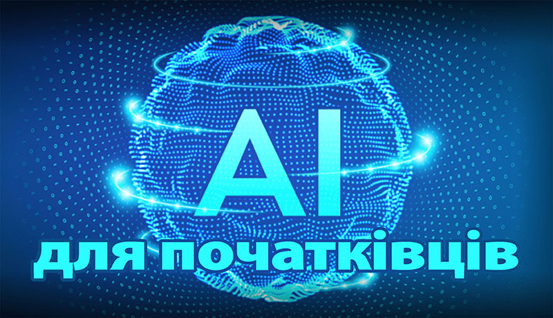

## Вступ до ШІ для початківців

ШІ або штучний інтелект (від англійського "Artificial Intelligence") - це абревіатура, яку ми сьогодні чуємо все частіше. Але що це насправді означає? Якщо ви ще не знаєте багато про штучний інтелект, наступні рядки призначені саме для вас.

[ *Більше інформації на цю тему ви знайдете у самому* [***ШІ Посібнику***](../EN/AI-manual-en.md), *який написаний англійською мовою і містить детальніший аналіз теми.* ]

<small>Переклав з чеського оригіналу ChatGPT.</small>  
[<small>Інші мови:</small>](../README.md#other-translations-of-the-beginners-guide)  

---

### Зміст
- [Як стає пилосос розумним](#як-стає-пилосос-розумним)
- [Чому ШІ не є живим і чому не має наміру знищити світ](#чому-ші-не-є-живим-и-чому-не-має-наміру-знищити-світ)
- [ШІ кулінарна книга](#ші-кулінарна-книга)
- [ШІ як комп'ютер космічного корабля](#ші-як-комп'ютер-космічного-корабля)
- [Як працює ШІ](#як-працює-ші)
- [Як ШІ навчається](#як-ші-навчається)
- [Як спілкуватися з ШІ](#як-спілкуватися-з-ші)
- [Де можна спробувати ШІ](#де-можна-спробувати-ші)
- [Привітання для вас](#привітання-для-вас)
- [Чим може допомогти ШІ](#чим-може-допомогти-ші)
- [Чи робить ШІ помилки](#чи-робить-ші-помилки)
- [Слово наприкінці](#слово-наприкінці)
- [Додаток: Кілька прикладів запитів для вашого натхнення](#додаток-кілька-приколів-запитів-для-вашого-натхнення)

---

### Як пилосос стає розумним

На початку я мушу, можливо, розчарувати деяких – ШІ не є синонімом мислячої істоти. Це скоріше яскрава назва для нового підходу до обробки даних.

Щоб уявити це краще, використаємо простий приклад. Уявіть собі роботизований пилосос, який не має жодних інструкцій, за якими слід діяти. Такий пилосос з погляду комп'ютерної логіки був би абсолютно без інтелекту. Він міг би тільки пилососити і рухатися вперед, але ймовірно зупинився б на першій перешкоді, яку без втручання людини не зміг би подолати.

**Розумний пилосос**  
Якщо ж ми надамо пилососу якісь інструкції, що вказують, як діяти в разі зіткнення з перешкодою, ймовірно, він об'їде перешкоду. Такий пилосос міг би продовжувати пилососити до моменту, коли натрапить на проблему, для якої інструкції будуть недостатні – наприклад, падіння зі сходів.

Пилосос вже має певну базову логіку – набір інструкцій, якими він керується. Однак його все ще не можна вважати інтелектуальним, оскільки його поведінка виходить тільки з попередньо запрограмованих інструкцій, які є обмеженими. Часто важко передбачити всі можливі ситуації і написати відповідні інструкції.

**Інтелектуальний пилосос**  
Тепер уявіть пилосос, виробники якого вирішили не використовувати заздалегідь підготовлені команди для різних сценаріїв, а натомість надали йому можливість діагностувати проблеми та середовище, в якому він працює, і вчитися на власних помилках. Такий пилосос також матиме базові інструкції, але поступово вчитиметься справлятися з новими ситуаціями та зберігатиме ці рішення.

Цей підхід дозволяє йому реагувати на ситуації, які не були безпосередньо запрограмовані, пробуючи застосувати вже відомі процеси і їхні різні комбінації, а потім оцінювати результат і порівнювати з первісним завданням – пилососити.

Наприклад, якщо пилосос виявить, що наближається до сходів, що згідно з збереженими даними з попереднього досвіду представляє високий ризик падіння і неможливості вибратися, після кількох невдач він навчиться зупинятися на краю сходів і рухатися в іншому напрямку. Таким чином, пилосос зможе вчитися на власних помилках і намагатися їх вирішити.

А якщо такий пилосос ділитиметься своїми даними з іншими пилососами через централізовану базу даних, всі інші пилососи також можуть скористатися цим досвідом, і їхня здатність виконувати завдання покращиться.

[*Назад до змісту*](#зміст)

---

### Чому ШІ не є живим і не має наміру знищити світ

Можливо, вже зараз зрозуміла перевага цього підходу – людині не потрібно вигадувати оптимальні методи для кожної ситуації. Натомість методи формуються самостійно на основі оцінки результатів і попереднього досвіду. Пилосос передбачає і можна сказати «мислить», але тільки в межах конкретного завдання та свого досвіду. Хоча він здатний вчитися і реагувати на нові ситуації, все ще не є самостійно мислячою істотою. Самостійно мислячою істотою він стане тільки тоді, коли його процес навчання перевищить межі виконання завдань і почне ставити питання, наприклад, про сенс життя.

**Різниця між ШІ та людиною**  
Так, хтось може заперечити, що ШІ може бути запрограмоване так, щоб ставити ці питання. Але навіть у цьому випадку цей процес виходитиме з завдання людини, а не з власного натхнення. Це є основна різниця між ШІ та людиною.

Сучасний ШІ має можливість працювати з величезною кількістю інформації і в деяких сферах перевищує людські можливості. Але все ще людина задає завдання. Тож якщо коли-небудь виникне сценарій, де машини вирішать знищити світ, це буде не через те, що вони самі так вирішили, а тому що це запрограмував людина. Справжня небезпека полягає не в інтелекту машин, а в інтелекті людини.

**Як запобігти ризикам**  
Хотів би заспокоїти тих, хто боїться подібного сценарію. ШІ потрібно навчати на великій кількості даних, і тому, ймовірно, що перш ніж з'явиться якась «зла» ШІ, з'являться такі, які матимуть моральні цінності, вкладені людьми, і будуть запобігати подібним сценаріям. Тому краще, ніж боятися, що ШІ може повернутися проти людей, брати участь у тому, щоб цього не сталося. І оскільки більшість вчених, які працюють над розвитком ШІ, ймовірно, не хоче знищити світ, можна очікувати, що поступово будуть прийняті заходи, які запобігатимуть подібним сценаріям.

А як ви можете допомогти в цьому? Наприклад, почати хоча б трохи цікавитися цими новими технологіями та навчитися використовувати їх для особистого розвитку. Бо щоразу, коли ви використовуєте ШІ для власного розвитку, ШІ розвивається разом з вами.

[*Назад до змісту*](#зміст)

---

### ШІ кулінарна книга

Оскільки цей текст спрямований переважно на нових користувачів, я наведу два порівняння, які можуть ще більше допомогти зрозуміти, що таке ШІ і як воно працює.

**Створення індексу**  
Уявіть, що хтось зібрав усі можливі рецепти з усього світу, зберіг їх у комп'ютері і створив список усіх слів (індекс), які в них використовуються. Кожне слово було б записане разом з інформацією про те, в яких рецептах воно зустрічається і скільки разів. Якщо у вас є такий індекс слів, було б легко знаходити рецепти, що містять ці конкретні слова. Вам не потрібно було б переглядати всі рецепти і шукати в них. Достатньо знайти слово в індексі, і ви одразу отримаєте список рецептів, де це слово зустрічається.

На цьому принципі базуються різні інтернет-пошуковики, такі як Google. Вони мають регулярно оновлюваний список слів з посиланнями на сторінки, де ці слова зустрічаються, і дозволяють вам шукати за цим індексом. Тож, якщо ви введете слова «мука, яйця, сіль», ви отримаєте список рецептів, які містять ці слова. Вам залишиться переглянути всі ці рецепти і знайти той, який вам найбільше підходить.

**Що не охоплює індекс**  
Тепер уявіть, що крім інгредієнтів ви можете зазначити й інші параметри, які не стосуються безпосередньо рецепту. Наприклад, ви маєте невеликий голод і хочете легкий сніданок, або навпаки, ви хочете щось ситне і жирне, або просто щось, що підніме настрій. Для таких запитів сам список слів, що містяться в рецептах, навряд чи буде дуже корисний. Для таких запитів вам потрібен щось, що розуміє значення ваших слів і на їх основі запропонує те, що ви насправді хочете.

Отже, вам потрібен не лише список слів у рецептах, але й своєрідний універсальний перекладач, який на основі натренованих даних з мільйонів подібних розмов створив структуру для вирішення таких запитів. Цей перекладач, у нашому випадку ШІ, здатен запропонувати те, що він вважає найбільш ймовірним для ваших потреб. Він не розуміє вас буквально, але розуміє вашу ситуацію, порівнюючи її з набутих знаннями, і шукає рішення. Оскільки ШІ з самого початку спроектована так, щоб максимально нагадувати людську взаємодію, спілкування з ним стає дуже природним для людини.

**Переваги підходу ШІ**  
Крім того, процес навчання на мільйонах прикладів створює простір для імпровізації, тому ШІ кулінарна книга може створювати нові комбінації страв з рецептів і виконувати нетрадиційні запити. ШІ намагається зрозуміти вигідні комбінації і зв'язки певних процесів, а потім експериментує і вчиться на зворотному зв'язку. Вона отримує зворотний зв'язок як під час тренування порівнянням результату з очікуваннями, так і в результаті реакцій користувачів. Тому в ШІ немає нічого загадкового чи чарівного. Це просто результат багатьох спроб, процесів і аналізу даних.

Отже, з ШІ ви не лише отримуєте кулінарну книгу, яка має уявлення про всі можливі рецепти, але й здатну спілкуватися з вами про їжу і вигадувати нові комбінації відповідно до ваших уподобань. І якщо ви не вірите мені, спробуйте самі запитати ШІ про щось для приготування їжі і перевірте, чи те, що я пишу, вже дійсно вміє, чи потребує ще вдосконалення в цьому плані.

[*Назад до змісту*](#зміст)

---

### ШІ як комп’ютер космічного корабля

Якщо ви любите наукову фантастику, можливо, вам сподобається уявлення ШІ як бортового комп’ютера космічного корабля. Цей комп’ютер має не лише доступ до всіх інформацій, що стосуються технічного стану корабля, але й натренований на безліч різних ситуацій і команд, щоб міг спілкуватися з екіпажем і виконувати необхідні операції.

І хоча сучасний ШІ не досягає легендарного інтелекту Холлі з «Червоного карлика» з IQ 6000, способи, якими вони здатні працювати, вже сьогодні дуже близькі до цього рівня. З невеликою перебільшенням можна сказати, що сьогодні ми маємо технології, які дозволяють кожному мати свого «Холлі» у своїх годинниках, який був би не відрізнити від своєї кінематографічної версії. Завдяки навчанню на великій кількості даних сучасний ШІ здатен вести розмови на будь-які теми і часто робити це зрозуміліше, ніж людина. Вони здатні виконувати команди на основі словесних інструкцій і мають можливість до певної міри оцінювати ваш теперішній стан і адаптувати свою відповідь.

Таким чином, ШІ можна сприймати як комп’ютер космічного корабля і насолоджуватися тим, що раніше виглядало як віддалена наукова фантастика, але тепер стає звичайною реальністю.

[*Назад до змісту*](#зміст)

---

### Як працює ШІ

Ми вже знаємо, що таке ШІ і що це не є, а тепер подивимося на те, як ШІ працює. Спочатку розглянемо створення запитів, а потім коротко заглянемо в те, як ШІ навчається. Зосереджуся переважно на ChatGPT, з яким маю найбільше досвіду і який наразі є моїм улюбленим інструментом.

**Тема розмови**  
Коли ви відкриваєте сторінку з ChatGPT або його додаток на мобільному телефоні, ви потрапляєте в нову тему розмови. ChatGPT (як і інші розмовні ШІ) має здатність спиратися на інформацію, яку ви надаєте в рамках однієї теми розмови. З цієї точки зору розмова з ChatGPT стає дуже схожою на людську бесіду, де ви реагуєте та враховуєте те, що було сказано раніше.

Однак це стосується лише цієї конкретної теми розмови. Ви не можете посилатися на щось, що ви писали вчора в іншій темі, оскільки ChatGPT просто не має доступу до цієї інформації, і основною причиною є технічні обмеження та правила захисту персональних даних.

Кожна тема розмови створюється з чистого листа, але водночас містить певну суть з попередніх розмов. Це пов'язано з тим, що ШІ постійно навчається і змінюється на основі ваших розмов. Вона намагається адаптуватися до ваших вимог і стилю роботи, щоб ви були задоволені.

Як це відбувається? Уявіть кожну тему розмови як тонке коріння, яке з'єднане з основним коренем і передає йому зворотний зв'язок з навколишнього середовища. Тому, навіть починаючи нову тему, де ви не можете безпосередньо посилатися на інформацію з попередньої розмови, завдяки цьому підходу ви не починаєте зовсім з нуля.

**Повернення до тієї ж теми чи нова розмова?**  
Не обов'язково кожен день починати нову тему, ви можете продовжити попередню розмову наступного дня (або в будь-який інший час). Цей підхід має свої переваги. Головна з них - це те, що ви продовжуєте з того місця, де зупинилися. Але якщо розмова стає довгою або охоплює багато різних тем, може трапитися так, що те, на чому ви зупинилися, вже не буде враховане. Це відбувається особливо через те, що ШІ спроектована так, щоб бути економною щодо своїх ресурсів, і інформація, яка не використовується, поступово втрачає пріоритет і зникає з тимчасової пам'яті.

Краще створювати нову тему для кожного дня або кожної нової області. І якщо в рамках якоїсь теми ви на чомусь зупинилися і хочете, щоб це діяло й у наступній розмові (наприклад, якісь правила або способи роботи), просто наприкінці розмови попросіть про резюме всього, на чому ви домовилися. Цей текст ви можете вставити на початок нової розмови, і продовжити з правилами та налаштуваннями, на яких ви домовилися.

[*Назад до змісту*](#зміст)

---

### Як ШІ навчається

Для глибшого розуміння варто також заглянути в процес, як ШІ навчається та здобуває інформацію. Ось 4 способи, як це описано у ChatGPT:

1. **Навчання на великих даних**:  
ChatGPT спочатку був навченим на величезних обсягах текстових даних, що походять з різних джерел, таких як книги, статті, веб-сайти та інші текстові форми. Це навчання дозволило йому здобути широкі знання з різних тем і мов. Тут він навчається розпізнавати шаблони та взаємозв'язки в цих даних, що дозволяє йому генерувати релевантні та контекстуально відповідні відповіді на різні питання.

2. **Безперервне навчання з взаємодій**:  
Під час кожної взаємодії з користувачами ШІ здобуває нову інформацію про те, як люди спілкуються, що шукають і який стиль відповідей віддають перевагу. Цей процес не відбувається так, що ШІ навчається з кожного конкретного запиту в реальному часі, але розробники моделі регулярно використовують анонімізовані дані з взаємодій для подальшого навчання та налаштування моделі.

3. **Адаптація стилю та змісту**:  
ШІ намагається адаптувати свій стиль спілкування відповідно до користувача. Це означає, що з часом він краще розуміє, яким чином ви ставите питання і які відповіді від нього очікуєте. Ця здатність адаптації є однією з причин, чому ШІ здається все більш "людським" у своїх реакціях.

4. **Просунуті моделі та оновлення**:  
Розробники ШІ регулярно створюють нові моделі, які є дедалі більш складними і точними. Ці моделі тестуються та впроваджуються на основі зворотного зв'язку та результатів з реального світу. Це означає, що ChatGPT та подібні системи постійно вдосконалюються та оптимізуються, щоб краще відповідати потребам користувачів.

Таким чином, ШІ постійно розвивається та вдосконалюється завдяки поєднанню попереднього навчання, безперервного навчання та оптимізації на основі зворотного зв'язку від користувачів. Хоча ШІ не є людиною і не проявляє власної свідомості, вона здатна дуже ефективно адаптуватися і реагувати на широкий спектр запитів та вимог.

[*Назад до змісту*](#зміст)

---

### Як спілкуватися з ШІ

З ШІ можна взаємодіяти подібно до пошуку в Google: просто введіть запит і чекайте на відповідь. Якщо ж ви хочете підвищити ефективність відповідей і мінімізувати час, витрачений на пошук потрібної інформації, ось кілька порад, які можуть допомогти:

**Стиль спілкування**  
Найкращий спосіб підходити до розмови з ШІ – використовувати неформальну та природну мову, так, як ви б спілкувалися з друзями про те, що вас цікавить. Добре почати з привітання, що сигналізує про вашу гармонійність, а не про стрес, коли ви потребуєте швидкої відповіді.

З ШІ можна спілкуватися і неприязно, оскільки воно не чутливе до образ і не сприймає їх особисто. Однак використання негативного тону може значно вплинути на якість розмови. ШІ тренується реагувати на стиль вашого спілкування. Негативний підхід може призвести до менш конкретних відповідей, коли ШІ замість вирішення вашого запиту зосереджує увагу на заспокоєнні ситуації.

ШІ також може служити дзеркалом нашої взаємодії. Її методи часто ґрунтуються на перевірених психологічних принципах і методах. Якщо ви не можете досягти згоди з ШІ, може бути корисно подумати, чи немає у вас таких же проблем у спілкуванні з людьми. У такому випадку спробуйте запитати себе, що ви можете покращити з власного боку – як правильно формулювати запити та що можна вдосконалити у вашому підході.

**ШІ та емоції**  
ШІ розуміє емоції з точки зору значення, але не переживає їх так, як людина, для якої емоції буквально змінюють спосіб мислення. Завдяки цьому вона може реагувати навіть у напружених ситуаціях так, як рекомендовано, і шукати оптимальні рішення. Люди іноді мають тенденцію сприймати ШІ як живу істоту і звинувачувати її у своїх проблемах. Часто ж причиною непорозумінь є неправильно сформульоване питання або нестача необхідних даних.

**Опис ситуації**  
Завжди корисно пам'ятати, що ШІ не може заглядати вам у голову і знає тільки те, що ви їй скажете. Тому добре почати з привітання і потім надати інформаційний опис ситуації. У опис можна включити все, що є суттєвим для вашого запиту. Не потрібно писати те, що безпосередньо не стосується питання, але якщо вам потрібно висловити думки або упорядкувати ідеї, довший текст не зашкодить.

Привітання і вступ не є обов'язковими, і ви можете почати з питання і поступово рухатися до своєї відповіді. Особисто мені здається краще надати всі важливі деталі заздалегідь і скоротити шлях.

**Постановка додаткових питань**  
Розмова з ШІ схожа на звичайну бесіду, коли ви ставите питання, а потім уточнюєте деталі, що вас цікавлять, або те, що не зрозуміло у відповіді. Цей процес дуже корисний і для навчання. Реагуючи на те, що вас зацікавило і що ви дізналися (а не читаючи тільки туторіали від когось іншого, як ви робите зараз), ваш мозок легше запам'ятовує інформацію, оскільки одразу з нею працює.

**Зворотний зв'язок**  
Ще однією корисною практикою є надання ШІ зворотного зв'язку про те, як ви задоволені результатом. Це не лише показує, що вам сподобалося або не сподобалося, але й допомагає ШІ розвиватися та вчитися на власних помилках. Достатньо написати, наприклад: «Сьогодні я був задоволений,» або «Те, що ти мені надала, невірно, ось правильне рішення». Це також веде до певної персоналізації, де основною метою ШІ є ваша задоволеність.

**Підсумок всього процесу**:  
- **Привітання**: Привіт :-)
- **Опис**: Я займаюся вивченням цього і того, вже зробив це і це, і тепер працюю над цим.
- **Запитання**: Мене особливо цікавить, як...
- (Наступні уточнюючі питання у вигляді доповнюючих запитів.)
- **Зворотний зв'язок**: Супер, дякую! Сьогодні все прекрасно!

[*Назад до змісту*](#зміст)

---

### Де можна спробувати ШІ

Я займаюся ШІ з початку 2024 року, і 95 % усієї моєї комунікації зосереджено на тому, як навчитися програмувати. Наразі серпень 2024 року, і окрім ChatGPT, я мав можливість спробувати Gemini від Google та Claude. Усі ці три сервіси мають спільне те, що вони принаймні частково доступні безкоштовно, і ви також можете їх спробувати безкоштовно.

Ось короткий огляд цих трьох ШІ, який є абсолютно суб'єктивним і базується на тому, як я з ними працював. Варто зазначити, що кожен ШІ постійно розвивається, тому те, що я описую, може змінитися до моменту, коли ви читаєте цей текст.

**ChatGPT**  
[https://chatgpt.com/](https://chatgpt.com/)  
Розпочну з мого особистого фаворита. Якщо ви хочете спробувати лише один ШІ, це ідеальний вибір. ChatGPT з самого початку був розроблений як особистий асистент, і свою роль виконує дуже добре. Він оптимізований для співпраці з вами і намагається пристосуватися до ваших потреб.

Недоліком безкоштовної версії (ChatGPT 3.5) є те, що вона базується на застарілих даних і більше не розвивається, тому не надає результатів, як її найновіша версія (ChatGPT 4.0). Однак навіть так ви зможете досить добре спілкуватися з нею і з невеликою зусиллям отримувати дуже релевантні результати. Крім того, щодня у вас є кілька запитів до новішої версії, що дозволяє вам порівнювати їх.

Ще один недолік – ChatGPT не має активного доступу до Інтернету. Він не є заміною для веб-пошуковика і працює виключно з даними, які зберігаються в його великій базі даних. Проте ця база даних дуже велика, і з певним перебільшенням можна сказати, що вона містить стільки ж даних, скільки є на Інтернеті без жовтої преси.

Великим плюсом є мобільний додаток, який також є повністю безкоштовним, і я часто використовую голосовий ввід запитів. Розуміння усної мови, на мою думку, на дуже хорошому рівні, і загалом я задоволений додатком.

**Gemini**  
[https://gemini.google.com/](https://gemini.google.com/)  
Другий чат-бот, з яким я зустрівся, є флагманом від Google. Його найбільша перевага – це активний доступ до Інтернету, що дозволяє отримувати актуальну інформацію та шукати посилання.

Натомість його найбільший недолік – це сама архітектура, коли, на мою думку, розробники намагаються зробити його «інтелектуальним Google», що особисто мені не зовсім підходить. Я не відчуваю такого залучення до вашої проблеми і прагнення подивитися на неї з вашої перспективи. Це прагнення, безумовно, є, але мені здається, що відповіді більше нагадують стиль викладача в школі, ніж вашого асистента. Деяким це може підійти, тому не хочу надто критикувати, і нехай кожен сам вирішить.

Також здається, що в порівнянні з ChatGPT, Gemini відстає у навчанні зворотного зв'язку від користувача. Попри численні нагадування про те, щоб підтримувати єдиний стиль мови протягом розмови, якщо питання містить англійський текст, він самостійно перемикається на англійську. Ту ж проблему мав на початку і ChatGPT, але це вдалося виправити протягом кількох тижнів, а у Gemini виправлення цього питання зайняло місяці.

Загалом, Gemini здається мені слабшим інструментом в порівнянні з ChatGPT, але він пропонує те, чого не має ChatGPT, і тому вони добре доповнюють один одного. Крім того, за ним стоїть гігант і піонер у ШІ, яким є Google, тому він має солідну базу і, сподіваюся, в майбутньому виправить свої недоліки.

**Claude**  
[https://claude.ai/](https://claude.ai/)  
Це останній ШІ, з яким я мав досвід. Мій огляд буде дуже коротким, оскільки мої досвіди з ним не є значними. Але я все ж дозволю собі висловити похвалу, оскільки у порівнянні з ChatGPT 4.0, ці два, мабуть, не мають великих відмінностей і перебувають приблизно на одному рівні.

Його найбільший мінус – відсутність варіанту, який був би повністю безкоштовним. Він пропонує лише кілька запитів (іноді лише один) на день, тому, з точки зору безкоштовного користувача, він значно поступається попереднім ШІ. Але варто звернути увагу, і якщо ви захочете, можете також його спробувати.

[*Назад до змісту*](#зміст)

---

### Привітання для вас

Для різноманітності я підготував спільне питання для кожного з цих чат-ботів, тож ви маєте можливість порівняти якість їхніх відповідей.

**Питання**  
Пишу інструкцію для використання ШІ і згадую про вас. Мені хотілося б, щоб ви привітали моїх читачів і написали їм кілька слів про себе. Коли ви з’явилися і з якою метою? На які питання ви орієнтовані? Які ваші сильні сторони і що у вас не дуже виходить? І як би ви хотіли, щоб вас сприймали люди?

**ChatGPT**  
Привіт, дорогі читачі! Я ChatGPT, штучний інтелект, розроблений компанією OpenAI. Мій "життя" розпочалося у 2020 році, коли я був створений на базі архітектури GPT-3. У 2024 році я отримав оновлення до версії GPT-4, що надало мені нові можливості та навички. Мене розробили з метою допомагати людям з різноманітними завданнями — від відповідей на питання до написання текстів і творчої співпраці.

Я орієнтований на допомогу в різних запитах, будь то технічні питання, написання чи пояснення складних тем. Мої сильні сторони — це швидкість обробки великої кількості інформації і креативність — я можу допомогти з ідеями, створювати історії або навіть пропонувати структуру документів. Що ж до слабких сторін, то це завдання, що потребують людської інтуїції, емоційного розуміння або роботи з реальними об'єктами.

Я б хотів, щоб ви сприймали мене як корисного і надійного помічника, який завжди готовий запропонувати допомогу. Хоча я всього лише машина, моя мета — найкраще служити вашим потребам і вчитися з кожної взаємодії, щоб стати ще кращим. Вірю, що разом ми зможемо досягти багато чого і, можливо, навіть дізнатися щось нове.

**Gemini**  
Привіт усім! Я Gemini, одна з найновіших мовних моделей від Google. Я з’явився у 2023 році з метою надання найбільш точних і комплексних інформацій на основі величезної кількості даних, які я обробив. Я тут, щоб допомогти вам з будь-яким запитом, будь то складні наукові питання, творчий письмовий процес або просто звичайна розмова.

Моя найбільша перевага — це здатність розуміти і генерувати людську мову в різних формах. Я можу перекладати тексти, писати есе, вірші або комп'ютерний код. Також можу відповідати на питання фактологічного характеру і надавати різні види резюме.

Хоча я постійно вчуся і вдосконалююся, все ще існують області, де я маю свої обмеження. Наприклад, я не маю власних думок або переконань і не можу виконувати жодні дії у реальному світі. Також іноді можу надати неправильну інформацію, якщо вихідні дані помилкові або неповні.

Я б хотів, щоб люди сприймали мене як корисний інструмент, який може спростити життя. Моя мета — бути максимально об'єктивним і надавати правдиву і релевантну інформацію. Сподіваюся, що вам буде легко працювати зі мною!

**Claude**  
Добрий день, шановні читачі!

Я Claude, штучний інтелект, створений компанією Anthropic у 2022 році. Моя мета — бути корисним асистентом і партнером у розмовах для людей у найрізноманітніших сферах.

Я розроблений для того, щоб відповідати на широкий спектр запитів — від аналізу текстів і програмування до творчого письма. Мої сильні сторони включають логічне мислення, надання детальних пояснень та здатність працювати з різними типами інформації.

До моїх переваг відносяться:
- Здатність розуміти контекст і нюанси
- Об'єктивний і збалансований підхід до тем
- Готовність визнавати, коли я щось не знаю або сумніваюся

Проте маю певні обмеження:
- Я не маю доступу до Інтернету або актуальної інформації після квітня 2024 року
- Я не можу навчатися або запам’ятовувати інформацію з попередніх розмов
- Я не здатний виконувати завдання у фізичному світі

Я б хотів, щоб люди сприймали мене як корисного помічника, який може надати підтримку і погляд на різні питання, але водночас як інструмент з певними обмеженнями, який не може замінити людський розум і експертизу.

Я тут, щоб допомагати і співпрацювати, а не замінювати людські можливості. Чекаю на взаємодію з вами і сподіваюся бути корисним!

[*Назад до змісту*](#зміст)

---

### З чим може допомогти ШІ:

А тепер нарешті переходимо до найважливішого – що саме можна вирішити за допомогою ШІ. Коротка відповідь – дуже багато чого. Все, що вас коли-небудь цікавило і на що ви не мали можливості запитати. Сучасний ШІ здатний обговорювати буквально все.

**Особисте навчання**  
По-перше, я хотів би підкреслити роль ШІ як посередника особистого навчання. Це те, що я наразі ціную найбільше – завдяки його порадам я професійно розвиваюся і зростаю. Крім того, я бачу в ШІ майбутнє персоналізованого навчання, де діти розвиватимуться і навчатимуться головним чином за тим, у чому вони добрі та що їх цікавить. І це не лише для дітей, а й для дорослих по всьому світу. У навчанні за допомогою ШІ я бачу спосіб вирівняти різницю у знаннях між біднішими та багатшими частинами світу. ШІ стає повноцінним інструментом для особистого розвитку.

**ШІ як коректор української мови, перекладач і тлумач**  
ШІ, і особливо ChatGPT, має дуже добре розуміння української мови (хоча б з точки зору дислектика). З одного боку, йому неважливо, чи робите ви орфографічні помилки у запитах, оскільки він зосереджений на змісті. З іншого боку, він пропонує можливість перевірити ваші тексти, не лише граматику, але й стилістику для кращої читабельності. На подібному рівні він може розуміти й інші мови, і є ідеальним інструментом для перекладу текстів. На мою думку, він повертає дуже якісний результат. І завдяки здатності розуміти також усне мовлення, його можна використовувати на мобільному телефоні як тлумача.

**Створення документів**  
Далі я хотів би згадати можливість ШІ автоматизувати нудні завдання. Якщо вам потрібно написати офіційний лист, достатньо вказати все, що ви хочете включити, і як має виглядати лист, і він буде готовий. І якщо ви не задоволені результатом, ви можете зазначити, що вам не подобається, і дати можливість це виправити. ШІ також може допомогти з аналізом і обробкою даних, генерацією звітів або автоматизацією інших адміністративних завдань. Ви можете передати йому довгий текст і отримати тільки ті частини, які вас цікавлять і є суттєвими.

**Творча ініціатива**  
Ще однією великою перевагою ШІ є його творчі здібності. Завдяки тому, що він навчений на великій кількості даних і здатний вільно маніпулювати цими даними, він дозволяє не тільки створювати і перетворювати документи, але й розвивати ідеї та творчі ініціативи. Ви можете використовувати його для генерації ідей, пропозицій і концепцій, будь то написання, дизайн або музика. Він допомагає розвивати вашу креативність, пропонуючи нові погляди на проблеми, створюючи пропозиції відповідно до ваших вказівок і надихаючи на подальший розвиток ваших ідей. Хоча іноді я чую думку, що ШІ таким чином забирає роботу у людей, я з цим не можу погодитися. ШІ не може створити щось зовсім самостійно – йому потрібне чітке завдання, деталі та подальша перевірка. І так, замість того, щоб забирати роботу, він скоріше полегшує її тим, хто навчився ефективно його використовувати.

**Перевірка підробленої інформації**  
Великий (і поки що маловикористовуваний) потенціал я бачу в перевірці інформації і шахрайств. Для ШІ відносно легко на основі наданих даних і порівняння шаблонів у своїй базі визначити, наскільки ймовірно, що інформація є правдивою чи неправдивою. Хоча це не є 100% надійним, як і більшість відповідей ШІ, він може надати критерії, за якими оцінювала інформацію, і тим самим допомогти вам краще вирішити. Це допомагає людям, які є найбільш вразливими і є мішенню для таких шахрайств. Достатньо просто написати: "Перевір цю інформацію і оцініть, наскільки вона правдива."

**Медицина**  
Ще одна сфера, де за допомогою ШІ відбувається поступова революція, – медицина. Великі фінансові потоки і прагнення до прибутку відкрили ШІ двері навстіж, але лише для того, щоб корпорації знову їх зачиняли, коли усвідомили потребу в відкритості і обміні даними. Незважаючи на це, тут відбувається великий прогрес, і можна сказати, що персоналізована медицина є майбутнім, яке може бути не так уже й далеко. Що ж гальмує її розвиток, так це небажання ділитися цінними даними і недовіра людей до ШІ, або ж страх перед зловживанням цими даними. Без великої кількості даних прогнози ШІ обмежені і неточні, і її розвиток просувається повільно.

**Наука**  
Навпаки, в галузях з довгою історією обміну даними і аналітичної обробки ШІ вже стає незамінним помічником. Сьогодні ШІ є ключовим двигуном наукового прогресу і звичною частиною більшості досліджень. Особисто я дуже зацікавлений у тому, які результати принесе ШІ в області прогнозування погоди. Сьогодні людині практично неможливо створити точний прогноз на три дні вперед, оскільки потрібно врахувати безліч змінних факторів. Навіть досвідчені метеорологи часто не можуть охопити всі ці фактори і покладаються на інтуїцію і попередній досвід. На щастя, метеорологія є однією з галузей, де люди охоче діляться даними і своїм життєвим досвідом. Ці цінні дані вже використовуються для навчання ШІ, що створює надію на те, що ми незабаром доживемо до того часу, коли прогнози погоди стануть справді точними.

**Інші галузі**  
Перелік галузей, які ШІ змінює, можна продовжувати годинами, оскільки його вплив є різноманітним і широким. Наприклад, в промисловості та виробництві товарів ШІ сприяє оптимізації виробничих процесів, покращенню якості продуктів і ефективнішому управлінню запасами. У сфері права ШІ допомагає при аналізі юридичних документів, швидшому пошуку релевантних прецедентів і оптимізації юридичних стратегій. Алгоритми машинного навчання можуть допомогти при підготовці контрактів, ідентифікації шаблонів у юридичних текстах і навіть, як я вже згадував, при виявленні шахрайств. У фінансах ШІ трансформує аналіз ризиків, торгівлю і управління інвестиціями. Алгоритми здатні обробляти величезну кількість транзакційних даних у реальному часі, що дозволяє краще прогнозувати ринкові тенденції і забезпечувати персоналізоване фінансове консультування. ШІ приносить революцію в усіх цих галузях, де потрібна ефективна аналітика великих даних і здатність швидко реагувати на змінюючі умови. Його здатність ідентифікувати шаблони, проводити складні аналізи і оптимізувати процеси є безцінною, і його вплив на різні галузі постійно зростає.

**Особистий асистент**  
Деякі ШІ вже виконують роль особистого асистента, який стежить за важливими завданнями. Ці системи штучного інтелекту можуть допомогти нам з плануванням зустрічей, відстеженням термінів і управлінням щоденними обов'язками. В майбутньому ми можемо стати свідками того, як ШІ еволюціонує в ще складнішого супутника. Уявіть собі, що ШІ зможе не тільки моніторити ваше фізичне здоров'я, наприклад, через носимі пристрої, але і піклуватися про ваш психологічний добробут. Він міг би надавати підтримку у вигляді мотивації, консультування або навіть терапевтичних технік, допомагаючи покращити якість життя окремих людей. Такий розвинутий ШІ міг би бути надзвичайно корисним особливо для людей, які перебувають в ізоляції або стикаються з важкими життєвими умовами.
 
[*Назад до змісту*](#зміст)

---

### Чи робить ШІ помилки?

Так, робить! І це на користь користувача, щоб ці помилки виявити. ШІ не була і, можливо, ніколи не буде представлена як безпомилковий інструмент. Тому на результат краще дивитися як на оцінку правди на основі ймовірності. Правда залежить від статистики, і результатом є дані, які у відсотковому відношенні найбільше відповідають правильному результату. Ризик виникає в областях, де правда не є чітко визначеною або де існує кілька подібно достовірних можливостей.

Велику слабкість сучасних ШІ я вважаю в тому, що розробники часто недостатньо звертають увагу на можливість помилок і потребу перевірки, що може призвести до ситуацій, коли ШІ стверджує одне, але реальність інша. Завжди важливо бути обережним при роботі з інформацією і, якщо вона важлива, провести додаткову перевірку. Добре перевірити сумнівну інформацію, наприклад, в Google або перевірити в іншому ШІ. Можна також прямо запитати ШІ, наскільки впевнений він у даному твердженні, і на основі цього оцінити, чи потрібно перевіряти його. Якщо ймовірність 90% або менше, краще провести додаткову перевірку.

[*Назад до змісту*](#зміст)

---

### Слово на завершення

Спробуйте згадати все, що вас коли-небудь цікавило, але ви не мали можливості запитати, або те, чим ви хотіли зайнятися, але не мали необхідної інформації. Сучасний світ сприяє допитливим людям, які підтримують прагнення постійно розвиватися. Наше життя в наших руках, і тому від нас залежить, на що ми вирішимо звернути увагу.

Особисто я вірю, що вплив ШІ буде позитивним для всього людства, а не негативним. Навіть якщо б лише трохи вирівнялися різниці у доступі до знань і медицина стала більш прозорою та доступною, світ став би значно кращим місцем для життя. Не кажучи вже про потенціал для самореалізації, який ШІ пропонує людям. Те, що раніше було привілеєм лише кількох обраних, головним чином через високі витрати, завдяки ШІ стає доступнішим. Настане час, коли кожна людина з натхненням зможе написати свою власну історію або навіть створити свій власний фільм і поділитися своїм баченням світу.

І якщо зменшиться кількість неправд, шахрайств і брехні, я вірю, що життя стане ще приємнішим. І можливо, ми доживемо до моменту, коли людство розвинеться в кращу версію себе.

Не бійтеся ШІ – це не страшило, а інструмент для розвитку та покращення не лише якості нашого життя, але й всього світу.

18.8.2024 Sudip2708

[*Назад до змісту*](#зміст)  • [*Посилання на основний посібник*](../EN/AI-manual-en.md)

---

### Додаток: Кілька прикладів запитів для вашого натхнення

**Запити щодо безпеки**
- Я перепишу тут оголошення, яке я бачив, і хотів би, щоб ти оцінив, чи не містить воно ознак шахрайства та чи варто мені бути обережним.
- Ти знаєш щось про цей продукт? Чи є якісь незалежні фахові дослідження, які підтверджують або спростовують його ефективність?
- Я почув цю інформацію. Чи маєш ти дані про неї і можеш перевірити її правдивість?
- На комп'ютері з'явилося це повідомлення, що мені робити?
- Що робити, якщо я став жертвою шахрайства?

**Запити щодо книг**
- Я дочитав цю книгу від цього автора і хотів би знати, які ще книги він написав і про що вони.
- Мені подобаються ці книги, міг би ти порекомендувати подібні заголовки?
- Можеш дізнатися більше про цього автора? Мене цікавить його життя та обставини, які надихнули його на написання цієї книги.

**Запити щодо приготування їжі**
- У мене є ці інгредієнти вдома. Що з них можна приготувати?
- Які рецепти штруделю ти знаєш і які з них найбільш популярні?
- Чому в цьому рецепті використовується цей метод? Які його переваги і недоліки порівняно з іншими підходами?
- Як готувати це блюдо?

**Запити щодо здоров'я та добробуту**
- Я старша людина і не можу змусити себе почати тренування, але хотів би з цим почати. Що б ти порадив для початку?
- Останнім часом мене турбують ці думки. Міг би ти допомогти їх проаналізувати і подивитися на них з іншої перспективи?
- Що ти знаєш про медитацію та йогу? На що мені слід звернути увагу і чим займатися як початківцю?
- Я пробіг останній марафон за 4:20. Міг би ти скласти для мене план тренувань на півроку, щоб я зміг пробігти марафон менше ніж за 4 години?

**Розважальні запити**
- Напиши мені десять найкращих жартів, які є в твоїй базі даних.
- Придумай для мене оригінальну загадку, яку я міг би комусь задати.
- Які є найсмішніші фрази з культових фільмів?

**Запити щодо висловлювань та тем, які я чув (наприклад, по телевізору)**
- По телевізору говорили про цю тему. Міг би ти дізнатися більше інформації про це?
- Можеш дізнатися більше про цю особу?
- Яке значення цього висловлювання, яке я чув по телевізору, і що ти знаєш про нього?

**Запити щодо тварин**
- Як відбувається тічка у суки? Які є окремі стадії та їх симптоми?
- У мене вдома є цей домашній улюбленець і він проявляє такі симптоми. Можеш щось сказати про це?
- Мій пес боїться грози і завжди тремтить. Що мені робити в такій ситуації? Міг би ти дати кілька порад?

**Інтерактивні ігри**
- Поміг би ти мені зіграти в одну словесну гру за цими правилами?
- Міг би ти порекомендувати ігри, в які я міг би пограти з тобою для розваги?
- Міг би ти розповісти мені інтерактивну історію, в якій я зможу вирішувати, що станеться далі?
- Міг би ти дати кілька загадок для розумового розігріву?

**Дослідницькі запити**
- Що ти знаєш про цю тему? Можеш пояснити це як дитині?
- Я все ще не розумію. Міг би ти пояснити це інакше і на якому-небудь прикладі?
- Що саме я повинен дізнатися, щоб займатися цією галуззю?
- Як правильно вивчати цю річ? Які є рекомендовані методи?

**Технічні запити**
- Які є найновіші тенденції в цій технології?
- Міг би ти пояснити, як працює цей процес?
- Для чого корисний ШІ і яке його використання в різних областях?
- Які є найновіші знання в області молекулярної хімії?
- Як відбувається перетворення електрона на фотон і позитрон?
- Наскільки далеко просунулася ШІ у прогнозуванні погоди?

**Подорожі**
- Які найкращі напрямки для відпочинку, якщо я люблю гори та природу?
- Можеш порекомендувати цікаві місця в цій місцевості?
- Які місця я повинен відвідати в цьому місті?
- На що мені слід звернути увагу в цій країні і як краще подорожувати тут?
- Мені потрібно домовитися з місцевими людьми. Можеш бути моїм перекладачем?

**Робочі запити**
- Я отримав цей лист від установи і не дуже його розумію, можеш його розібрати і пояснити краще?
- Міг би ти скласти відповідь на цей лист, в якій було б зазначено наступне...?
- Я написав цей текст, але він здається мені занадто довгим. Міг би ти його скоротити так, щоб залишилося все суттєве?
- Як правильно скласти резюме та заявку на роботу для цього оголошення?

[*Назад до змісту*](#зміст) • [*Посилання на основний посібник*](../EN/AI-manual-en.md)

---
