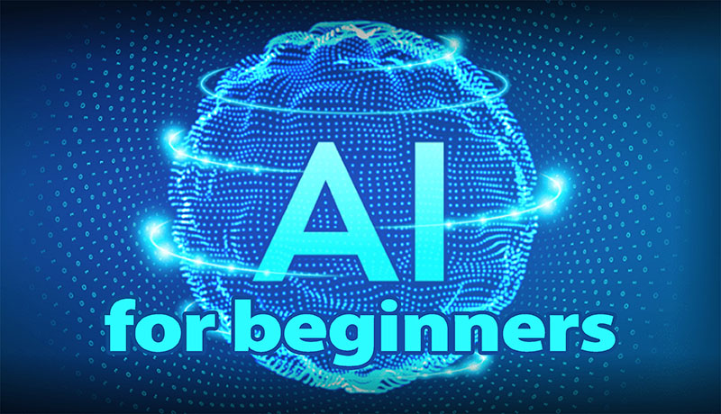

## Introduction to AI for Beginners

AI, or Artificial Intelligence, is a term we hear more and more often these days. But what does it actually mean? If you're not very familiar with artificial intelligence yet, the following lines are just for you.

*(For more information on this topic, you can check out the* [***AI Manual***](../EN/AI-manual-en.md), *which is written in English and provides a more detailed analysis.)*

<small>Translated from the original Czech by ChatGPT.</small>  
[<small>Other languages:</small>](../README.md#other-translations-of-the-beginners-guide)  

---

### Contents
- [How a Vacuum Cleaner Becomes Intelligent](#how-a-vacuum-cleaner-becomes-intelligent)
- [Why AI Isn't Alive and Doesn't Want to Destroy the World](#why-ai-isnt-alive-and-doesnt-want-to-destroy-the-world)
- [AI Cookbook](#ai-cookbook)
- [AI as a Spaceship Computer](#ai-as-a-spaceship-computer)
- [How AI Works](#how-ai-works)
- [How AI Learns](#how-ai-learns)
- [How to Communicate with AI](#how-to-communicate-with-ai)
- [Where to Try Out AI](#where-to-try-out-ai)
- [A Greeting for You](#a-greeting-for-you)
- [What AI Can Help With](#what-ai-can-help-with)
- [Does AI Make Mistakes?](#does-ai-make-mistakes)
- [Final Words](#final-words)
- [Appendix: A Few Example Queries for Your Inspiration](#appendix-a-few-example-queries-for-your-inspiration)

---

### How a Vacuum Cleaner Becomes Intelligent

Let me start by addressing a potential misconception—AI is not synonymous with a thinking being. It’s more of a catchy name for a new approach to handling data.

To better understand this, let's use a simple example. Imagine a robotic vacuum cleaner with no instructions to guide its actions. From a computer logic perspective, such a vacuum would be completely unintelligent. It might only be able to vacuum and move forward, but it would likely stop at the first obstacle it encountered, unable to overcome it without human intervention.

**A Smart Vacuum**  
Now, suppose we give this vacuum cleaner some instructions on what to do when it encounters an obstacle. It’s likely that it would navigate around the obstacle. This vacuum would be able to clean until it encountered a problem that its instructions couldn’t handle—like falling down the stairs.

The vacuum now contains some basic logic—a set of instructions it follows. However, it still wouldn’t be considered intelligent because its behavior is driven only by pre-programmed instructions, which are limited. It’s often challenging to anticipate all possible scenarios and write the appropriate instructions for them.

**An Intelligent Vacuum**  
Now, imagine a vacuum where the developers decided not to rely solely on pre-programmed commands for various scenarios but instead equipped it with the ability to diagnose problems and environments and learn from its mistakes. This vacuum would still have basic instructions but would gradually learn how to handle new situations and store these solutions.

This approach allows it to respond to situations that aren’t directly programmed, by trying to use processes it already knows and combining them in different ways. It would then evaluate the outcome and compare it to its original goal of vacuuming.

For example, if it detected it was approaching a staircase, which previous experiences have shown to pose a high risk of falling and getting stuck, after several failures, it would learn to stop at the edge and change direction. The vacuum would thus learn from its own mistakes and attempts to solve them.

And if such a vacuum could share its data with other vacuums through a central database, then all the other vacuums could benefit from these experiences, improving their ability to complete their tasks.

[*Back to Contents*](#contents)

---

### Why AI Isn't Alive and Doesn't Want to Destroy the World

By now, the advantage of this approach may be clear—humans don't need to come up with the optimal procedures for every situation. Instead, these procedures are created automatically based on the evaluation of outcomes and previous experiences. The vacuum cleaner anticipates and could be said to "think," but only within the scope of its assigned task and its experiences. Even though it can learn and respond to new situations, it still isn't a self-aware thinking entity. It would only become one if its learning process extended beyond task fulfillment and it began to ask questions like the meaning of life.

**The Difference Between AI and Humans**  
Yes, someone might argue that AI could be programmed to ask such questions. But even in this case, the process would stem from human input, not from AI's own inspiration. This is the key difference between AI and humans.

Modern AI has the capability to process vast amounts of information and, in some areas, surpasses human abilities. However, it's still humans who assign the tasks. So if there's ever a scenario where machines decide to destroy the world, it won't be because they chose to do so on their own, but because a human programmed them to. The real risk, therefore, lies not in the intelligence of machines but in the intelligence of humans.

**How to Mitigate Risks**  
I’d like to reassure those who worry about such a scenario. AI must be trained on large amounts of data, making it more likely that, before any "evil" AI emerges, there will be AIs with moral values instilled by humans to prevent such scenarios. Instead of fearing that AI will turn against humanity, it's better to contribute to ensuring that it doesn't happen. Since most scientists working on AI development probably don't want to destroy the world, we can also expect that measures will be gradually implemented to prevent such scenarios.

And how can you help with this? By starting to take an interest in these new technologies and learning how to use them for your own growth. Because every time you use AI for personal development, the AI evolves along with you.

[*Back to Contents*](#contents)

---

### AI as a Cookbook

Since this text is primarily aimed at new users, I'll use two analogies that might help you further understand what AI is and how it works.

**Creating an Index**  
Imagine someone collected all the recipes in the world, stored them in a computer, and created an index of every word used in those recipes. Each word would be recorded along with information on which recipes it appears in and how many times. If you had such an index, it would be easy to search for recipes containing specific words. You wouldn’t need to go through every recipe manually. Instead, you could just find the word in the index and instantly get a list of recipes that include it.

This approach is the foundation of various internet search engines, like Google. They regularly update a list of words with links to the pages where those words appear, allowing you to search using this index. So, if you type in "flour, eggs, salt," you’ll get a list of recipes that contain those words. It’s then up to you to go through these recipes and find the one that suits you best.

**When Indexes Aren’t Enough**  
Now, imagine you want to specify more than just ingredients. For example, you’re only a little hungry and want a light breakfast, or maybe you’re craving a hearty, greasy meal, or perhaps you just want something to lift your spirits. For such queries, a simple word index might not be very helpful. For these types of requests, you need something that understands the meaning behind your words and can offer you exactly what you want.

You need more than just a list of words in recipes—you need a sort of universal translator that, based on trained data from millions of similar conversations, has developed a structure for addressing even these kinds of requests. This translator, in our case AI, can offer what it determines is most likely what you want. It doesn’t understand you literally, but it understands your situation, compares it to learned knowledge, and finds a solution. And because AI is designed to closely mimic human interaction, communicating with it becomes very natural for us.

**Advantages of the AI Approach**  
Additionally, learning from millions of examples creates room for improvisation, so an AI cookbook can create new dish combinations and fulfill even unconventional requests. AI tries to understand beneficial combinations and connections between certain procedures, then experiments and learns from feedback. It gains feedback not only during training by comparing the result with what was expected but also by learning from user reactions. There’s nothing mysterious or miraculous about AI. It’s simply the result of many trials, processes, and data analysis.

So with AI, you’re not just getting a cookbook that knows about all possible recipes but also one that can chat with you about food and come up with new combinations based on your preferences. And if you don’t believe me, try asking AI something about cooking and see if it can already do what I’ve described or if it still needs some improvement in that area.

[*Back to Contents*](#contents)

---

### AI as a Spaceship Computer

If you’re a fan of sci-fi, you might like to think of AI as the onboard computer of a spaceship. This computer not only has access to all the information regarding the ship’s technical status but is also trained on a multitude of different scenarios and commands so that it can communicate with the crew and perform necessary tasks.

And while today’s AI doesn’t reach the legendary intelligence of Holly from *Red Dwarf* with his IQ of 6000, the ways in which they can operate are already on a very similar level. With a bit of exaggeration, we could say that we now have the technology for everyone to have their own "Holly" on their wristwatch, virtually indistinguishable from the film version. Thanks to training on vast amounts of data, modern AIs are capable of holding conversations on almost any topic, often more clearly than a human. They can execute commands based on verbal input and have a certain ability to assess your current state and tailor their responses accordingly.

So, we can also think of AI as a spaceship computer and enjoy what once seemed like distant sci-fi but is now becoming everyday reality.

[*Back to Contents*](#contents)

---

### How AI Works

Now that we know what AI is and isn’t, let’s take a look at how AI works. We’ll start with how to create queries and then briefly explore how AI is trained. I’ll focus primarily on ChatGPT, as I have the most experience with it, and it’s currently my favorite tool.

**Conversation Threads**  
When you open the ChatGPT webpage or its mobile app, you’ll find yourself in a new conversation thread. ChatGPT (like other conversational AIs) can generate responses based on the information you provide within a single conversation thread. This makes interacting with ChatGPT quite similar to a human conversation, where responses are influenced by what has been previously said.

However, this applies only to the current conversation thread. You can’t refer back to something you wrote in a different thread yesterday, as ChatGPT can’t access that, due to its technical limitations and privacy regulations.

Each thread starts with a clean slate, but it also contains some essence of previous conversations. This is because the AI is constantly learning and evolving based on your interactions, adapting to your preferences and working style to better meet your needs.

How does this work? Imagine each conversation thread as a delicate root connected to a main root that feeds back information from its environment. So, while you can’t directly reference past conversations in a new thread, you’re not entirely starting from scratch either.

**Returning to the Same Thread or Starting a New Conversation?**  
It’s not necessary to start a new thread every day; you can continue a previous conversation the next day (or whenever you choose). This approach has its advantages, particularly in picking up where you left off. However, as the conversation grows longer or covers various topics, the AI may no longer consider earlier agreements or contexts. This happens because AI is designed to be resource-efficient, so information that’s no longer relevant gradually loses priority and fades from temporary memory.

A better approach is to create a new thread (or new conversation) for each day or each new topic. If you reach an agreement within a thread and want those rules or settings to apply in future conversations, you can simply ask for a summary at the end of the conversation. Then, you can paste that summary at the beginning of the next conversation to continue with the agreed-upon rules and settings.

[*Back to Contents*](#contents)

---

### How AI Learns

To gain a deeper understanding, it’s helpful to explore how AI learns and acquires its knowledge. Below are four methods as described by ChatGPT:

1. **Training on Large Datasets**:  
   ChatGPT was initially trained on vast amounts of text data from various sources like books, articles, websites, and other text forms. This training process enabled it to acquire broad knowledge across different topics and languages. By recognizing patterns and relationships in the data, ChatGPT can generate relevant and contextually appropriate responses to a wide range of questions.

2. **Continuous Learning from Interactions**:  
   With each user interaction, AI gathers new insights into how people communicate, what they’re looking for, and what style of response they prefer. While the AI doesn’t learn from each specific query in real time, the model’s creators regularly use anonymized interaction data to further train and fine-tune the model.

3. **Adapting Style and Content**:  
   AI strives to adapt its communication style based on the user. Over time, it better understands how you ask questions and what type of answers you expect. This adaptability is one of the reasons why AI seems increasingly “human” in its responses.

4. **Advanced Models and Updates**:  
   AI developers continuously create new models that are more sophisticated and accurate. These models are tested and deployed based on feedback and real-world results. This means that ChatGPT and similar systems are constantly being refined and optimized to better meet users’ needs.

Through a combination of prior training, continuous learning, and optimization based on user feedback, AI is constantly evolving and improving. While AI is not human and doesn’t possess consciousness, it is highly effective at adapting and responding to a wide range of questions and requests.

[*Back to Contents*](#contents)

---

### How to Communicate with AI

You can approach interacting with AI much like you would when using Google—just type in a command and wait for a response. However, if you want to improve the effectiveness of the answers and minimize the time spent searching for the right one, here are a few tips that might help:

**Communication Style**  
The best way to approach a conversation with AI is to use informal and natural language, similar to how you’d talk to friends about something that interests you. It’s a good idea to start with a greeting, signaling that you’re in a good mood and not stressed or in urgent need of quick answers.

You can communicate with AI even in an impolite manner since it doesn’t take offense and doesn’t perceive insults personally. However, using a negative tone can significantly affect the quality of the conversation. AI is trained to respond in the style in which the conversation is conducted. A negative approach might lead to less effective answers, as the AI may focus on diffusing tension rather than addressing your query.

In this way, AI can act as a mirror of our interaction. Its methods often draw on established psychological principles. If you find it difficult to reach an agreement with AI, it might be helpful to consider whether you face similar communication issues with people. In such cases, you could try asking what you might improve on your end—how to better formulate questions and what could be improved in your approach.

**AI and Emotions**  
AI understands emotions in terms of their meaning, but it doesn’t experience emotions like a human, whose emotions can alter their thinking. Because of this, AI can respond appropriately in tense situations, as recommended, and seek optimal solutions. Sometimes, people tend to perceive AI as a living being and blame it for their problems. Often, misunderstandings arise simply from poorly formulated queries or a lack of necessary information.

**Describing the Situation**  
It’s always good to remember that AI can’t read your mind and only knows what you tell it. A good approach is to follow up your initial “Hi” with an informative description of the situation. Include everything relevant to your query. It’s unnecessary to mention things unrelated to the query, but if you need to write things down to clear your head, a longer text won’t hurt.

While a greeting and introduction aren’t necessary, and you can start directly with your question and work your way to the answer, I personally find it better to provide all the important information upfront to streamline the process.

**Asking Follow-up Questions**  
A conversation with AI is similar to a normal conversation, where you ask a question and then follow up with further inquiries about things that interest you or things you didn’t understand in the answer. I find this process particularly useful for learning. By reacting to what interests you and what you’ve learned (instead of just reading a tutorial written by someone else, as you’re doing now), it becomes easier for your brain to remember the information because you’re actively engaging with it.

**Feedback**  
Another good practice is to provide AI with feedback on how satisfied you are with the result. This not only lets the AI know what you’re happy with and what you’re not, but it also helps the AI improve and learn from its mistakes. You can simply write something like, “I was satisfied today,” or “What you provided was incorrect, and here’s the correct solution.” This process also leads to a certain level of personalization, with the AI’s main goal being your user satisfaction.

**Summary of the Whole Process**:  
- **Greeting**: Hi there! :-)
- **Description**: I’m studying this and that, I’ve completed this, and now I’m working on this.
- **Question**: I’m particularly interested in how…
- (Followed by clarifying conversation in the form of additional questions.)
- **Feedback**: Great, thanks! Everything was perfect today!

[*Back to Contents*](#contents)

---

### Where to Try AI

I’ve been working with AI since the beginning of 2024, and 95% of my interactions have been focused on learning programming. As of August 2024, in addition to ChatGPT, I’ve had the chance to try Google’s Gemini and Claude. All three of these services are at least partially accessible for free, so you can try them out yourself as well.

Here’s a brief review of these three AIs, which is entirely subjective and based solely on my personal experience. It’s worth noting that each AI is continually evolving, so what I mention here might not hold true by the time you read this.

**ChatGPT**  
[https://chatgpt.com/](https://chatgpt.com/)  
I’ll start with my personal favorite. If you’re only going to try one AI, this is the ideal choice. ChatGPT was clearly designed from the beginning to be a personal assistant, and it performs this role very well. It is optimized to work with you and tries to adapt to your needs.

The free version (ChatGPT 3.5) has a drawback in that it is based on older data and is no longer updated, so it doesn’t provide results as good as its latest version (ChatGPT 4.0). Nonetheless, it still communicates quite well and, with a bit of effort, returns very relevant results. Plus, you get a few queries daily on the newer version, so you can compare them.

Another limitation is that ChatGPT does not have active internet access. It doesn’t replace an internet search engine and works solely from the data stored in its extensive database. However, this database is very large, and with a bit of exaggeration, one could say it contains as much data as the internet minus the tabloid content.

A big advantage is the mobile app, which is also completely free and where I often use voice dictation for queries. In my opinion, the understanding of spoken language is at a very good level, and overall, I’m satisfied with the app.

**Gemini**  
[https://gemini.google.com/](https://gemini.google.com/)  
The second chatbot I encountered is Google’s flagship offering. Its biggest strength is undoubtedly its active internet access, providing access to current information and link retrieval.

On the other hand, its main weakness is its architecture. In my opinion, the developers seem to be trying to create an intelligent version of Google, which personally didn’t quite suit me. I don’t feel as much engagement with your problem or an effort to view it from your perspective. Although the effort is noticeable, the responses feel more like those of a teacher rather than an assistant. However, this might work for some people, so I don’t want to criticize it too harshly, and I suggest everyone evaluate it for themselves.

It also seems to lag behind ChatGPT in learning from user feedback. Despite multiple reminders to maintain consistent language within the conversation, if an English text is part of the question, it automatically switches to English. ChatGPT had the same issue initially but managed to resolve it within a few weeks, while Gemini took months to fix this problem.

Overall, Gemini seems like a weaker tool compared to ChatGPT but offers capabilities that ChatGPT lacks, making them complementary. Additionally, with Google backing it, a major player and pioneer in AI, it has a solid foundation and a promise of future improvements.

**Claude**  
[https://claude.ai/](https://claude.ai/)  
This is the last AI I’ve worked with. My feedback here will be brief since my experience with it isn’t extensive. However, I’d like to express my praise because, compared to ChatGPT 4.0, these two are quite comparable and are roughly on the same level.

Its major downside is that it doesn’t offer a completely free version. It only provides a few queries (sometimes just one) per day, which makes it significantly disadvantaged compared to the previous AIs for non-paying users. Nevertheless, it’s worth a look, and if you’re interested, you can try it out as well.

[*Back to Contents*](#contents)

---

### Greetings from Each AI

As a fun exercise, I’ve asked each of these chatbots a common question so you can compare the quality of their responses.

**The Question**  
I’m writing a guide on using AI and including information about you. I’d like you to greet my readers and share a bit about yourself. When were you created and for what purpose? What kinds of queries are you designed to handle? What are your strengths, and what areas do you struggle with? And how would you like people to perceive you?

**ChatGPT**  
Hello, dear readers! I’m ChatGPT, an artificial intelligence developed by OpenAI. My “life” began in 2020, when I was created based on the GPT-3 architecture. In 2024, I was updated to GPT-4, which added new abilities and skills. I was designed to assist people with a wide range of tasks—from answering questions and writing texts to creative collaboration.

I’m built to help with various queries, whether they involve technical questions, writing, or explaining complex topics. My strengths lie in the speed at which I can process large amounts of information and my creativity—I can help with ideas, create stories, or even suggest document structures. However, tasks that require human intuition, emotional understanding, or working with physical objects are areas where I may struggle.

I’d like you to see me as a helpful and reliable assistant, always ready to lend a hand. Even though I’m just a machine, my goal is to best serve your needs and learn from every interaction to become even better. I believe we can accomplish a lot together and maybe even learn something new in the process.

**Gemini**  
Hello everyone! I’m Gemini, one of Google’s latest language models. I was created in 2023 with the goal of providing the most accurate and comprehensive information based on the vast amount of data I’ve processed. I’m here to help with any query, whether it’s complex scientific questions, creative writing, or simple conversations.

My greatest strength is understanding and generating human language in many forms. I can translate texts, write essays, poems, or computer code. I can also answer factual questions and provide various kinds of summaries.

Although I’m constantly learning and improving, there are still areas where I have limitations. For example, I don’t have personal opinions or beliefs and can’t perform actions in the real world. I may also sometimes provide incorrect information if the input data is flawed or incomplete.

I’d like people to see me as a useful tool that can make life easier. My goal is to be as objective as possible and provide information that is true and relevant. I hope you find working with me beneficial!

**Claude**  
Hello, dear readers!

I’m Claude, an artificial intelligence created by Anthropic in 2022. My purpose is to be a helpful assistant and conversational partner in various fields.

I’m designed to handle a wide range of queries—from text analysis and programming to creative writing. My strengths include logical reasoning, providing detailed explanations, and working with various types of information.

My strengths are:
- Understanding context and nuances
- Providing objective and balanced perspectives on topics
- Willingness to admit when I don’t know something or am unsure

On the other hand, I have certain limitations:
- I don’t have internet access or current information beyond April 2024
- I cannot learn or remember information from previous conversations
- I’m unable to perform tasks in the physical world

I’d like people to view me as a useful assistant who can provide support and insight across various areas, but also as a tool with its limits and not a replacement for human judgment and expertise.

I’m here to help and collaborate, not to replace human abilities. I look forward to interacting with you and hope I can be of assistance!

[*Back to Contents*](#contents)

---

### How AI Can Help:

And now, we finally get to the most important part—what AI can actually help with. The short answer is that there is a lot it can address. Anything that has ever piqued your interest and you haven’t had the chance to ask someone about. Today's AI can discuss just about anything.

**Personal Learning**  
First and foremost, I want to highlight AI's role as a mediator in personal education. This is what I currently value the most—thanks to its guidance, I’m advancing and growing professionally. I also see AI as the future of personalized learning, where children will develop and learn primarily based on their strengths and interests. And it's not just for children, but for adults around the world as well. AI in education can help bridge the knowledge gap between poorer and wealthier parts of the world, making it a valuable tool for personal development.

**AI as an English Proofreader, Interpreter, and Translator**  
AI, especially ChatGPT, has a strong understanding of English (at least from a dyslexic’s perspective). On one hand, it doesn’t mind if you make spelling mistakes in your queries because it focuses mainly on content. On the other hand, it offers the ability to check your written texts, not just for grammar but also for style to improve readability. It can also understand other languages at a similar level, making it an ideal tool for text translation. In this regard, it delivers very high-quality results. Additionally, due to its ability to understand spoken language, it can be used on mobile devices as an interpreter.

**Document Creation**  
Another point to mention is AI's ability to automate mundane tasks. If you need to write an official letter, just specify what you want to include and how you want the letter to look, and it's done. And if you're not satisfied with the result, you can indicate what you don’t like and have it revised. AI can also assist with data analysis and processing, generating reports, or automating other administrative tasks. You can provide it with a long text and have it extract only the parts that interest you and are relevant.

**Creative Initiative**  
AI’s creative capabilities are another significant advantage. Since it’s trained on a vast amount of data and can manipulate this data freely, it allows not only for the creation and modification of documents but also for the development of ideas and creative initiatives. You can use it to generate ideas, proposals, and concepts, whether for writing, design, or music. It helps foster your creativity by offering new perspectives on problems, creating proposals based on your instructions, and inspiring further development of your ideas. Although there are opinions that AI may take jobs away from people in this way, I don’t agree. AI cannot create something entirely on its own—it needs clear instructions, details, and subsequent review. Thus, rather than taking work away, it simplifies it for those who learn to use it effectively.

**Fraudulent Information Verification**  
A significant (and still underutilized) potential lies in verifying information and detecting fraud. For AI, it’s relatively easy to determine, based on the provided information and pattern matching within its database, how likely it is that a given piece of information is true or false. While it’s not 100% reliable, like most AI responses, AI can provide the criteria it used to evaluate the information, helping you make better decisions. It offers assistance to people who are most vulnerable to such scams today. Simply write: “Verify this information and assess how true it is.”

**Medicine**  
Another area where AI is gradually revolutionizing the field is medicine. Large financial flows and the desire for profit have opened doors for AI, but only for corporations to realize the need for openness and data sharing. Despite this, significant progress is being made, and it can be said that personalized medicine is a future that might not be too far off. What holds it back, however, is the reluctance to share valuable data and people's distrust of AI, or fear of data misuse. Without a large amount of data, AI's predictions are limited and inaccurate, and its development proceeds slowly.

**Science**  
In contrast, in fields with a long history of data sharing and analytical processing, AI is already becoming an invaluable assistant. Today, AI is a key driver of scientific progress and a common part of most research. I’m personally very curious about the results AI will bring to weather forecasting. Today, it’s practically impossible for humans to create an accurate forecast three days in advance because many variable factors need to be considered. Even experienced meteorologists often can’t account for all these factors and rely on intuition and previous experience. Fortunately, meteorology is a field where people willingly share data and their lifetime experiences. This valuable information is already being used to train AI, creating hope that soon we will have truly accurate weather predictions.

**Other Fields**  
The list of fields that AI is transforming could go on for hours, as its impact is diverse and extensive. For example, in manufacturing and production, AI contributes to optimizing production processes, improving product quality, and more efficient inventory management. In the legal field, AI helps with analyzing legal documents, quickly finding relevant precedents, and optimizing legal strategies. Machine learning algorithms can assist in preparing contracts, identifying patterns in legal texts, and even detecting fraud. In finance, AI is reshaping risk analysis, trading, and investment management. Algorithms can process vast amounts of transactional data in real time, allowing for better market trend predictions and personalized financial advice. AI is revolutionizing all these areas where effective analysis of large data sets and the ability to respond quickly to changing conditions are required. Its ability to identify patterns, perform complex analyses, and optimize processes is invaluable, and its impact on various fields continues to grow.

**Personal Assistant**  
Some AIs already serve as personal assistants, managing important tasks. These AI systems can help with scheduling meetings, tracking deadlines, and managing daily responsibilities. In the future, we might witness AI evolving into an even more complex companion. Imagine AI not only monitoring your physical health through wearable devices but also taking care of your mental well-being. It could offer support through motivation, advice, or even therapeutic techniques, helping to improve individuals' quality of life. This advanced AI could be especially beneficial for people who are isolated or facing challenging living conditions.

[*Back to Contents*](#contents)

---

### Does AI Make Mistakes?

Yes, it does! And it's up to the user to spot these mistakes. AI has not been, and may never be, presented as a flawless tool. It’s better to view its output as an estimate of the truth based on probabilities. The truth is derived from statistics, resulting in data that statistically most closely matches the correct result. The risk arises in areas where the truth is not clearly defined or where there are multiple similarly credible options.

A major weakness of today’s AI is that creators often do not sufficiently highlight the possibility of errors and the need for verification, which can lead to situations where AI asserts one thing while reality may be different. It’s always important to be cautious when working with information and, if it matters, to conduct additional verification. It’s a good practice to look up contentious information on Google or check it with another AI. Alternatively, you can directly ask the AI how confident it is about its statement and assess whether the claim needs verification based on that. If the confidence level is 90% or lower, it’s advisable to perform additional checks.

[*Back to Contents*](#contents)

---

### In Conclusion

Think about everything that has ever intrigued you but you didn’t have anyone to ask, or what you wanted to pursue but lacked the necessary information. The modern world favors curious individuals who maintain a desire to keep evolving. Our lives are in our own hands, and it’s up to us where we choose to focus our attention.

I personally believe that the impact of AI will be a positive experience for humanity rather than a negative one. Even if it just slightly narrows the knowledge gap and makes medicine more transparent and accessible, the world would become a much better place to live. Not to mention the potential for self-realization that AI offers. What was once the privilege of a few, especially due to high costs, is becoming more accessible thanks to AI. There will come a time when anyone with inspiration can write their own story or even create their own film and share their vision of the world.

And if the amount of falsehoods, frauds, and lies decreases, I believe life will become a bit more pleasant. Perhaps we might even see a time when humanity evolves into a better version of itself.

So don’t be afraid of AI—it’s not a boogeyman but a tool for development and improvement, not just of the quality of our lives but of the world as a whole.

August 18, 2024 Sudip2708

[*Back to Contents*](#contents) • [*Link to Main Manual*](../EN/AI-manual-en.md)

---

### Appendix: A Few Examples of Queries for Your Inspiration

**Safety Queries**
- I’ll rewrite an ad I saw here, and I’d like you to assess whether it shows signs of fraud and if I should be cautious.
- Do you know anything about this product? Are there any independent expert studies available that confirm or refute its effectiveness?
- I heard this piece of information. Do you have any data on it and can you verify its accuracy?
- I received this message on my computer. What should I do?
- What should I do if I’ve been scammed?

**Book Queries**
- I finished this book by this author and I’m interested in what other books they’ve written and what they’re about.
- I like these books; could you recommend similar titles?
- Can you find out more about this author? I’m interested in their life and what inspired them to write this book.

**Cooking Queries**
- I have these ingredients at home. What can I cook with them?
- What are some recipes for strudel and which ones are the most popular?
- Why is this method used in this recipe? What are its advantages and disadvantages compared to other approaches?
- How do you prepare this dish?

**Health and Wellness Queries**
- I’m an older person and I can’t motivate myself to start exercising, but I’d like to. What would you recommend as a starting point?
- I’ve been troubled by these thoughts lately. Could you help me analyze them and look at them from a different perspective?
- What do you know about meditation and yoga? What should I watch out for and what should I focus on as a beginner?
- I ran my last marathon in 4:20. Could you prepare a six-month training plan so I can complete a marathon in under 4 hours?

**Fun Queries**
- Give me the top ten jokes you have in your database.
- Come up with an original riddle for me to give someone.
- What are the funniest quotes from cult movies?

**Expressions and Topics I’ve Heard (e.g., on TV)**
- They talked about this topic on TV. Could you find out more information about it?
- Can you tell me more about this person?
- What does this expression mean that I heard on TV, and what do you know about it?

**Animal Queries**
- How does a female dog’s heat cycle work? What are the different stages and their symptoms?
- I have this pet at home and it’s showing these symptoms. Can you tell me more about it?
- My dog is afraid of storms and always shakes. What should I do in such a situation? Can you provide some tips?

**Interactive Games**
- Will you play a word game with me according to these rules?
- Could you recommend some games that I can play with you for fun?
- Can you tell me an interactive story where I can decide what happens next?
- Can you give me some brain teasers to work on?

**Exploratory Queries**
- What do you know about this topic? Can you explain it to me as if I were a child?
- I still don’t understand. Can you explain it differently and with an example?
- What should I learn to pursue this field?
- How should I go about learning this? What are the recommended practices?

**Technology Queries**
- What are the latest trends in this technology?
- Could you explain how this process works?
- What is AI good for and how is it used in different areas?
- What are the latest findings in molecular chemistry?
- How does the conversion of an electron into a photon and positron occur?
- How advanced is AI in weather forecasting?

**Travel**
- What are the best vacation destinations if I like mountains and nature?
- Can you recommend interesting places in this area?
- What places should I visit in this city?
- What should I watch out for in this country and how is the best way to travel here?
- I need to communicate with local people. Can you act as a translator for me?

**Work-Related Queries**
- I received this email from a government office and I don’t understand it well. Can you break it down and explain it better?
- Can you help me draft a response to this email that includes the following...?
- I wrote this text, but it seems too long. Can you shorten it while keeping all the essential information?
- How should I properly format a resume and job application for this job posting?

[*Back to Contents*](#contents) • [*Link to Main Manual*](../EN/AI-manual-en.md)

---