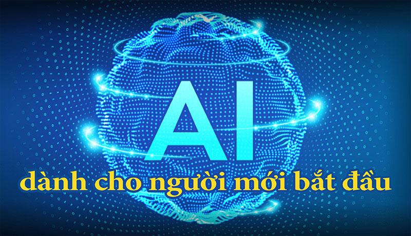

## Giới thiệu về AI cho người mới bắt đầu

AI hay trí tuệ nhân tạo (viết tắt của "Artificial Intelligence" trong tiếng Anh) là một thuật ngữ ngày càng được nghe nhiều hơn. Nhưng thực chất nó có nghĩa là gì? Nếu bạn chưa biết nhiều về trí tuệ nhân tạo, những dòng sau đây chính là dành cho bạn.

[ *Thông tin chi tiết về chủ đề này có thể được tìm thấy trong* [***AI Manual***](../EN/AI-manual-en.md), *được viết bằng tiếng Anh và chứa phân tích chi tiết về chủ đề.* ]

<small>Dịch từ nguyên bản tiếng Séc bởi ChatGPT.</small>  
[<small>Ngôn ngữ khác:</small>](../README.md)  

---

### Nội dung
- [Làm thế nào để máy hút bụi trở nên thông minh](#jak-se-stane-vysavač-inteligentním)
- [Tại sao AI không phải là sinh vật sống và tại sao nó không có ý định hủy diệt thế giới](#proč-ai-není-živá-a-nemá-v-úmyslu-zničit-svět)
- [Sách dạy nấu ăn AI](#ai-kuchařka)
- [AI như một máy tính trên tàu vũ trụ](#ai-jako-počítač-vesmírné-lodi)
- [AI hoạt động như thế nào](#jak-ai-pracuje)
- [AI học như thế nào](#jak-se-ai-učí)
- [Cách giao tiếp với AI](#jak-s-ai-komunikovat)
- [Nơi để thử nghiệm AI](#kde-si-ai-vyzkoušet)
- [Lời chào từ chúng tôi](#pozdrav-pro-vás)
- [AI có thể giúp gì](#s-čím-může-ai-pomoci)
- [AI có mắc lỗi không](#dělá-ai-chyby)
- [Lời kết](#slovo-závěrem)
- [Phụ lục: Một số ví dụ câu hỏi để bạn tham khảo](#dodatek-pár-příkladů-dotazů-pro-vaši-inspiraci)

---

### Làm thế nào để máy hút bụi trở nên thông minh

Ngay từ đầu, tôi phải làm rõ một điều có thể khiến một số người thất vọng – AI không phải là từ đồng nghĩa với sinh vật biết suy nghĩ. Nó thực chất là một cách tiếp cận mới để xử lý dữ liệu.

Để dễ hình dung hơn, hãy dùng một ví dụ đơn giản. Hãy tưởng tượng một chiếc máy hút bụi robot không có bất kỳ hướng dẫn nào để theo. Một chiếc máy như vậy sẽ hoàn toàn thiếu trí thông minh từ góc độ logic máy tính. Nó chỉ có thể hút bụi và di chuyển về phía trước, nhưng có khả năng sẽ dừng lại ngay khi gặp chướng ngại vật mà không có sự can thiệp của con người để vượt qua.

**Máy hút bụi thông minh**  
Tuy nhiên, nếu chúng ta cung cấp cho máy hút bụi một số hướng dẫn về cách xử lý khi gặp chướng ngại vật, thì nó có thể sẽ vòng quanh chướng ngại đó. Một chiếc máy hút bụi như vậy có thể tiếp tục hút bụi cho đến khi gặp phải một vấn đề mà các hướng dẫn của nó không thể giải quyết – chẳng hạn như rơi xuống cầu thang.

Máy hút bụi đã có một số logic cơ bản – danh sách các lệnh mà nó tuân theo. Tuy nhiên, nó vẫn không thể được coi là thông minh, vì hành vi của nó chỉ dựa trên các lệnh đã được lập trình sẵn, mà các lệnh này thường có hạn. Thường rất khó để dự đoán tất cả các tình huống có thể xảy ra và viết các hướng dẫn phù hợp.

**Máy hút bụi thông minh**  
Bây giờ, hãy tưởng tượng một chiếc máy hút bụi mà các nhà sản xuất không chọn cách cung cấp các lệnh đã chuẩn bị cho các tình huống khác nhau, mà thay vào đó, họ đã cung cấp cho nó khả năng chẩn đoán các vấn đề và môi trường hoạt động, và học từ những sai lầm của chính nó. Một chiếc máy hút bụi như vậy sẽ có các hướng dẫn cơ bản, nhưng nó sẽ dần học cách xử lý các tình huống mới và lưu trữ các giải pháp đó.

Cách tiếp cận này cho phép nó phản ứng với các tình huống không được lập trình sẵn, thử nghiệm các quy trình mà nó đã biết và các kết hợp khác nhau, sau đó đánh giá kết quả và so sánh với yêu cầu ban đầu là hút bụi.

Ví dụ, nếu nó phát hiện rằng nó đang tiến gần đến một bậc thang, mà theo dữ liệu lưu trữ từ kinh nghiệm trước đó có nguy cơ cao bị rơi và không thể tự cứu thoát, sau vài lần thất bại, nó sẽ học cách dừng lại ở cạnh bậc thang và chọn hướng khác. Máy hút bụi sẽ có khả năng học hỏi từ những thất bại của chính nó và cố gắng giải quyết chúng.

Và nếu máy hút bụi như vậy chia sẻ dữ liệu của mình với các máy hút bụi khác qua cơ sở dữ liệu trung tâm, thì tất cả các máy hút bụi khác cũng có thể tận dụng những kinh nghiệm này và khả năng hoàn thành nhiệm vụ của chúng sẽ được cải thiện.

[*Trở về nội dung*](#nội-dung)

---

### Tại sao AI không phải là sinh vật sống và không có ý định hủy diệt thế giới

Có thể lợi thế của cách tiếp cận này đã trở nên rõ ràng – con người không cần phải nghĩ ra các quy trình tối ưu cho từng tình huống. Thay vào đó, các quy trình được hình thành tự động dựa trên việc đánh giá kết quả và kinh nghiệm trước đó. Máy hút bụi dự đoán và có thể nói là “suy nghĩ”, nhưng chỉ trong khuôn khổ nhiệm vụ và kinh nghiệm của nó. Dù có khả năng học hỏi và phản ứng với các tình huống mới, nó vẫn không phải là một sinh vật suy nghĩ độc lập. Nó chỉ trở thành như vậy nếu quá trình học tập của nó vượt qua việc hoàn thành nhiệm vụ và bắt đầu đặt câu hỏi về ý nghĩa của cuộc sống.

**Sự khác biệt giữa AI và con người**  
Và đúng, có thể ai đó sẽ phản đối rằng AI có thể được lập trình để đặt những câu hỏi này. Nhưng ngay cả trong trường hợp này, quá trình đó vẫn sẽ dựa trên yêu cầu của con người, không phải từ cảm hứng riêng. Đây là sự khác biệt cơ bản giữa AI và con người.

AI hiện đại có khả năng làm việc với khối lượng thông tin khổng lồ và trong một số lĩnh vực còn vượt qua khả năng của con người. Tuy nhiên, vẫn là con người tạo ra các nhiệm vụ. Vì vậy, nếu có kịch bản nào đó mà máy móc quyết định hủy diệt thế giới, thì đó không phải vì chúng tự quyết định, mà là do con người lập trình chúng như vậy. Rủi ro thực sự không nằm ở trí thông minh của máy móc, mà nằm ở trí thông minh của con người.

**Cách phòng tránh rủi ro**  
Tôi muốn trấn an những người lo lắng về kịch bản này. AI cần được đào tạo trên một khối lượng dữ liệu lớn, vì vậy có khả năng trước khi một AI “xấu” xuất hiện, sẽ có nhiều AI được lập trình với các giá trị đạo đức của con người và sẽ ngăn ngừa những kịch bản tương tự. Thay vì lo sợ rằng AI sẽ chống lại con người, tốt hơn là tham gia vào việc đảm bảo điều đó không xảy ra. Và vì hầu hết các nhà khoa học đang làm việc để phát triển AI có lẽ không muốn hủy diệt thế giới, có thể mong đợi rằng các biện pháp sẽ được áp dụng dần để ngăn ngừa các kịch bản như vậy.

Vậy bạn có thể giúp gì trong vấn đề này? Có thể bắt đầu bằng cách quan tâm ít nhiều đến các công nghệ mới và học cách sử dụng chúng để phát triển bản thân. Bởi vì mỗi khi bạn sử dụng AI để phát triển cá nhân, AI cũng phát triển cùng với bạn.

[*Trở về nội dung*](#nội-dung)

---

### Sách dạy nấu ăn AI

Vì văn bản này chủ yếu hướng đến người dùng mới, tôi sẽ đưa ra hai phép so sánh có thể giúp bạn hình dung rõ hơn về AI là gì và nó hoạt động như thế nào.

**Tạo chỉ mục**  
Hãy tưởng tượng rằng ai đó đã thu thập tất cả các công thức nấu ăn trên thế giới, lưu trữ chúng vào máy tính và tạo ra một danh sách tất cả các từ (chỉ mục) được sử dụng trong các công thức đó. Mỗi từ sẽ được ghi lại cùng với thông tin về các công thức mà nó xuất hiện và số lần xuất hiện. Nếu bạn có chỉ mục từ này, việc tìm kiếm các công thức chứa những từ cụ thể sẽ trở nên dễ dàng hơn. Bạn không cần phải xem qua tất cả các công thức và tìm kiếm chúng. Chỉ cần tìm từ trong chỉ mục và bạn sẽ có ngay danh sách các công thức có chứa từ đó.

Các công cụ tìm kiếm trên internet, chẳng hạn như Google, dựa trên phương pháp này. Chúng có danh sách từ được cập nhật thường xuyên với các liên kết đến các trang web nơi từ đó xuất hiện, cho phép bạn tìm kiếm thông qua chỉ mục này. Vì vậy, nếu bạn nhập các từ “bột, trứng, muối”, bạn sẽ nhận được danh sách các công thức chứa các từ đó. Bạn sau đó sẽ phải xem qua tất cả các công thức này và tìm ra công thức phù hợp nhất với bạn.

**Những gì chỉ mục không thể làm**  
Bây giờ hãy tưởng tượng rằng ngoài các thành phần, bạn còn có thể chỉ định các tham số khác không liên quan trực tiếp đến công thức. Ví dụ, bạn có thể cảm thấy đói nhẹ và muốn một bữa sáng nhẹ, hoặc ngược lại, bạn muốn một món ăn nặng nề đầy dầu mỡ, hoặc chỉ đơn giản là muốn một món ăn giúp cải thiện tâm trạng. Đối với những yêu cầu như vậy, danh sách từ có trong công thức có thể không giúp ích nhiều. Để đáp ứng các yêu cầu như vậy, bạn cần một cái gì đó có thể hiểu nghĩa của từ và dựa trên đó cung cấp những gì bạn thực sự muốn.

Vì vậy, bạn cần không chỉ danh sách từ trong các công thức, mà còn một loại trình dịch đa năng, đã được đào tạo từ hàng triệu cuộc trò chuyện tương tự để tạo ra cấu trúc giải quyết các yêu cầu như vậy. Trình dịch này, trong trường hợp của chúng ta là AI, có thể cung cấp những gì nó đánh giá là khả năng cao nhất mà bạn muốn. Nó không hiểu bạn theo nghĩa đen, nhưng nó hiểu tình huống của bạn, so sánh với kiến thức đã học và tìm kiếm giải pháp. Và vì AI được thiết kế từ đầu để giống như sự tương tác của con người, giao tiếp với nó trở nên rất tự nhiên với con người.

**Lợi ích của cách tiếp cận AI**  
Hơn nữa, quá trình học từ hàng triệu ví dụ tạo ra không gian cho sự sáng tạo, vì vậy sách dạy nấu ăn AI có thể tạo ra các sự kết hợp món ăn mới từ các công thức và thực hiện cả các yêu cầu không truyền thống. AI cố gắng hiểu các sự kết hợp có lợi và mối liên hệ giữa các quy trình nhất định, sau đó thử nghiệm và học từ phản hồi. Nó nhận được phản hồi khi đào tạo bằng cách so sánh kết quả và những gì được mong đợi, nhưng nó cũng có thể học từ phản ứng của người dùng. Do đó, không có gì bí ẩn hay kỳ diệu về AI. Nó chỉ là kết quả của nhiều thử nghiệm, quy trình và phân tích dữ liệu.

Với AI, bạn không chỉ có một sách dạy nấu ăn mà còn có khả năng nói chuyện về món ăn và nghĩ ra các sự kết hợp mới theo ý tưởng của bạn. Và nếu bạn không tin, hãy thử hỏi AI một câu hỏi về nấu ăn và đánh giá xem liệu những gì tôi viết ở đây đã thực sự đúng hay nó còn cần cải thiện trong lĩnh vực này.

[*Trở về nội dung*](#nội-dung)

---

### AI như máy tính trên tàu vũ trụ

Nếu bạn yêu thích khoa học viễn tưởng, có thể bạn sẽ thích hình dung AI như là máy tính điều khiển trên tàu vũ trụ. Máy tính này không chỉ có quyền truy cập vào tất cả thông tin liên quan đến tình trạng kỹ thuật của tàu, mà còn được đào tạo để xử lý nhiều tình huống và lệnh khác nhau, để có thể giao tiếp với phi hành đoàn và thực hiện các nhiệm vụ cần thiết.

Mặc dù AI hiện nay không đạt đến trí thông minh huyền thoại của Holly trong "Red Dwarf" với IQ 6000, cách mà chúng hoạt động đã rất gần gũi với mức độ đó. Nói một cách hơi phóng đại, chúng ta hiện đã có công nghệ đủ để mỗi người có thể sở hữu một “Holly” trong đồng hồ của mình, không khác gì so với phiên bản điện ảnh của nó. Nhờ vào việc đào tạo trên khối lượng dữ liệu lớn, AI hiện đại có khả năng dẫn dắt các cuộc trò chuyện về bất kỳ chủ đề nào và thường dễ hiểu hơn cả con người. Chúng có thể thực hiện lệnh dựa trên chỉ dẫn bằng lời nói và có khả năng đánh giá trạng thái hiện tại của bạn để điều chỉnh phản hồi cho phù hợp.

Vì vậy, chúng ta cũng có thể xem AI như là máy tính của tàu vũ trụ và tận hưởng những gì trước đây có vẻ là khoa học viễn tưởng xa vời, nhưng ngày nay đã trở thành thực tế phổ biến.

[*Trở về nội dung*](#nội-dung)

---

### AI hoạt động như thế nào

Chúng ta đã biết AI là gì và không phải là gì, và bây giờ chúng ta sẽ xem xét cách AI hoạt động. Đầu tiên, chúng ta sẽ thảo luận về việc tạo câu hỏi và sau đó sẽ nhìn qua cách AI được đào tạo. Tôi sẽ tập trung chủ yếu vào ChatGPT, công cụ mà tôi có nhiều kinh nghiệm nhất và hiện đang là công cụ yêu thích của tôi.

**Chuỗi trò chuyện**  
Khi bạn mở trang ChatGPT hoặc ứng dụng trên di động, bạn sẽ thấy mình ở trong một chuỗi trò chuyện mới. ChatGPT (cũng giống như các AI trò chuyện khác) có khả năng dựa vào thông tin mà bạn cung cấp trong một chuỗi trò chuyện để tạo ra các phản hồi. Từ góc độ này, cuộc trò chuyện với ChatGPT trở nên rất giống với cuộc trò chuyện của con người, khi bạn phản hồi và xem xét cả những gì đã được nói trước đó.

Tuy nhiên, điều này chỉ áp dụng trong phạm vi của chuỗi trò chuyện đó. Bạn không thể tham chiếu đến điều gì đó bạn đã viết hôm qua trong một chuỗi khác, vì ChatGPT không thể nhìn thấy nó, và lý do chính cho điều này là những hạn chế kỹ thuật của nó cũng như các quy định về bảo vệ dữ liệu cá nhân.

Mỗi chuỗi trò chuyện được tạo ra với một trang trắng, nhưng đồng thời cũng chứa một phần tinh túy từ các cuộc trò chuyện trước đó. Điều này xảy ra vì AI liên tục học hỏi và thay đổi dựa trên các cuộc trò chuyện của bạn. Nó cố gắng điều chỉnh theo yêu cầu và phong cách làm việc của bạn để bạn hài lòng.

Và quá trình này diễn ra như thế nào? Hãy tưởng tượng mỗi chuỗi trò chuyện như một cái rễ nhỏ gắn liền với rễ chính và truyền phản hồi từ môi trường xung quanh. Vì vậy, mặc dù bạn bắt đầu một chuỗi mới, nơi bạn không thể trực tiếp tiếp nối thông tin từ cuộc trò chuyện trước đó, nhờ vào cách tiếp cận này, bạn không bắt đầu hoàn toàn từ đầu.

**Quay lại cùng một chuỗi hay cuộc trò chuyện mới?**  
Tuy nhiên, không nhất thiết phải bắt đầu một chuỗi mới mỗi ngày; bạn có thể tiếp tục cuộc trò chuyện trước đó vào ngày hôm sau (hoặc bất kỳ lúc nào khác). Phương pháp này có những lợi ích của nó. Lợi ích chính là bạn tiếp tục từ nơi bạn đã dừng lại. Nhưng khi cuộc trò chuyện trở nên dài dần hoặc chứa nhiều chủ đề khác nhau, có thể xảy ra tình trạng thông tin mà bạn đã thỏa thuận trong suốt chuỗi trò chuyện không còn được xem xét. Điều này xảy ra chủ yếu vì AI được thiết kế để tiết kiệm tài nguyên của nó, và thông tin không còn được sử dụng dần mất ưu tiên và biến mất khỏi bộ nhớ tạm thời.

Do đó, cách tốt hơn là tạo một chuỗi mới cho mỗi ngày hoặc mỗi lĩnh vực mới. Và nếu trong một chuỗi nào đó bạn đã thỏa thuận về điều gì và muốn điều đó tiếp tục áp dụng trong cuộc trò chuyện tiếp theo (chẳng hạn như một số quy tắc hoặc cách làm việc), chỉ cần yêu cầu tóm tắt tất cả những gì bạn đã thỏa thuận trong chuỗi đó vào cuối cuộc trò chuyện. Bạn có thể chèn văn bản này vào đầu cuộc trò chuyện mới và tiếp tục với các quy tắc và cài đặt mà bạn đã thỏa thuận.

[*Trở về nội dung*](#nội-dung)

---

### AI học như thế nào

Để hiểu sâu hơn, cũng rất hữu ích khi xem xét quá trình AI học hỏi và thu thập thông tin. Dưới đây là 4 phương pháp được mô tả bởi ChatGPT:

1. **Đào tạo trên dữ liệu lớn**:  
ChatGPT được đào tạo ban đầu trên khối lượng lớn dữ liệu văn bản từ nhiều nguồn khác nhau, như sách, bài viết, trang web và các hình thức văn bản khác. Đào tạo này đã giúp nó thu được kiến thức rộng về các chủ đề và ngôn ngữ khác nhau. Tại đây, nó học cách nhận diện các mẫu và mối quan hệ trong dữ liệu này, cho phép nó tạo ra các phản hồi phù hợp và theo ngữ cảnh cho các câu hỏi khác nhau.

2. **Học liên tục từ các tương tác**:  
Trong mỗi lần tương tác với người dùng, AI thu thập thông tin mới về cách con người giao tiếp, những gì họ tìm kiếm và phong cách phản hồi mà họ ưa thích. Quá trình này không diễn ra bằng cách AI học từ từng câu hỏi cụ thể theo thời gian thực, mà các nhà phát triển mô hình thường xuyên sử dụng dữ liệu ẩn danh từ các tương tác để đào tạo và điều chỉnh mô hình thêm.

3. **Tùy chỉnh phong cách và nội dung**:  
AI cố gắng tùy chỉnh phong cách giao tiếp của mình theo người dùng. Điều này có nghĩa là nó dần hiểu cách bạn đặt câu hỏi và các loại phản hồi mà bạn mong đợi từ nó. Khả năng tùy chỉnh này là một trong những lý do khiến AI dường như ngày càng “nhân tính” hơn trong phản hồi của nó.

4. **Các mô hình tiên tiến và cập nhật**:  
Các nhà phát triển AI thường xuyên tạo ra các mô hình mới ngày càng tinh vi và chính xác hơn. Những mô hình này được kiểm tra và triển khai dựa trên phản hồi và kết quả từ thế giới thực. Điều này có nghĩa là ChatGPT và các hệ thống tương tự luôn được cải thiện và tối ưu hóa để đáp ứng tốt hơn nhu cầu của người dùng.

AI liên tục phát triển và cải thiện nhờ sự kết hợp của đào tạo trước đó, học tập liên tục và tối ưu hóa dựa trên phản hồi của người dùng. Mặc dù AI không phải là con người và không thể hiện ý thức cá nhân, nó có thể thích ứng và phản ứng rất hiệu quả với một loạt các câu hỏi và yêu cầu.

[*Trở về nội dung*](#nội-dung)

---

### Cách giao tiếp với AI

Bạn có thể tiếp cận AI giống như khi tìm kiếm trên Google hoặc đơn giản là nhập lệnh và chờ phản hồi. Tuy nhiên, nếu bạn muốn tăng hiệu quả của các phản hồi và giảm thiểu thời gian tìm kiếm thông tin chính xác, dưới đây là một số mẹo có thể giúp bạn:

**Phong cách giao tiếp**  
Cách tốt nhất để giao tiếp với AI là sử dụng ngôn ngữ không chính thức và tự nhiên, giống như khi bạn trò chuyện với bạn bè về điều gì đó bạn quan tâm. Nên bắt đầu bằng một lời chào để thể hiện bạn đang trong tâm trạng tốt và không căng thẳng, khi bạn cần câu trả lời ngay lập tức.

Bạn có thể giao tiếp với AI theo cách không lịch sự, vì nó không nhạy cảm với sự xúc phạm và không cảm nhận chúng một cách cá nhân. Tuy nhiên, việc sử dụng tông giọng tiêu cực có thể ảnh hưởng đáng kể đến chất lượng cuộc trò chuyện. AI được đào tạo để phản hồi theo phong cách cuộc trò chuyện của bạn. Cách tiếp cận tiêu cực có thể dẫn đến các phản hồi kém chính xác, khi AI thay vì giải quyết câu hỏi của bạn sẽ tập trung vào việc làm dịu tình huống.

AI có thể hoạt động như một tấm gương phản chiếu sự tương tác của chúng ta. Các phương pháp của nó thường dựa trên các nguyên tắc và phương pháp tâm lý đã được kiểm chứng. Nếu bạn gặp khó khăn trong việc đạt được sự đồng thuận với AI, có thể hữu ích khi suy nghĩ về việc liệu bạn có gặp phải các vấn đề tương tự trong giao tiếp với con người không. Trong trường hợp đó, bạn có thể thử hỏi mình những gì có thể cải thiện về cách bạn đặt câu hỏi và cách bạn tiếp cận.

**AI và cảm xúc**  
AI hiểu cảm xúc từ góc độ ý nghĩa, nhưng không trải nghiệm cảm xúc như con người, người mà cảm xúc thực sự thay đổi cách suy nghĩ của họ. Điều này giúp AI phản ứng trong các tình huống căng thẳng theo cách được khuyến nghị và tìm kiếm giải pháp tối ưu. Con người đôi khi có xu hướng xem AI như một thực thể sống và đổ lỗi cho nó vì các vấn đề của mình. Tuy nhiên, thường thì nguyên nhân của sự hiểu lầm chỉ là câu hỏi không được đặt đúng cách hoặc thiếu thông tin cần thiết.

**Mô tả tình huống**  
Luôn luôn tốt khi nhớ rằng AI không thể nhìn vào đầu bạn và chỉ biết những gì bạn nói với nó. Vì vậy, cách tiếp cận tốt là sau lời chào mở đầu, tiếp theo là mô tả tình huống thông tin. Trong mô tả, bạn có thể viết mọi thứ quan trọng liên quan đến câu hỏi của bạn. Việc viết những điều không liên quan trực tiếp đến câu hỏi là không cần thiết, nhưng nếu bạn cần giải tỏa cảm xúc hoặc sắp xếp suy nghĩ trong đầu, một văn bản dài hơn không sao cả.

Lời chào và phần giới thiệu không phải là bắt buộc, và bạn có thể bắt đầu trực tiếp với câu hỏi và dần dần đi đến câu trả lời của mình. Cá nhân tôi thấy rằng việc cung cấp tất cả các thông tin quan trọng từ đầu và rút ngắn quãng đường là tốt hơn.

**Đặt câu hỏi bổ sung**  
Cuộc trò chuyện với AI tương tự như một cuộc trò chuyện bình thường, khi bạn đặt câu hỏi và sau đó yêu cầu thêm thông tin về những điều bạn quan tâm hoặc những gì bạn không hiểu trong phản hồi. Tôi thấy quá trình này rất phù hợp cho việc học. Bằng cách phản ứng với những gì bạn tìm thấy thú vị và những gì bạn đã học được (thay vì chỉ đọc hướng dẫn từ người khác, như bạn đang làm bây giờ), não bộ của bạn sẽ dễ dàng nhớ thông tin vì nó ngay lập tức làm việc với thông tin đó.

**Phản hồi**  
Một thực hành tốt khác là cung cấp phản hồi cho AI về mức độ hài lòng của bạn với kết quả. Bằng cách này, bạn không chỉ cho biết điều gì bạn hài lòng và điều gì không, mà còn giúp AI phát triển và học từ những sai lầm của chính nó. Bạn chỉ cần viết ví dụ như: "Hôm nay tôi hài lòng," hoặc "Những gì bạn đã cung cấp là sai, đây là giải pháp đúng." Điều này cũng dẫn đến một sự cá nhân hóa, với mục tiêu chính của AI là sự hài lòng của người dùng.

**Tóm tắt toàn bộ quy trình**:  
- **Lời chào**: Chào :-)
- **Mô tả**: Tôi đang nghiên cứu về cái này và cái kia, tôi đã hoàn thành cái đó và cái này, và hiện tại tôi đang làm việc trên cái này.
- **Câu hỏi**: Tôi chủ yếu quan tâm đến việc làm thế nào...
- (Tiếp theo là cuộc trò chuyện chi tiết với các câu hỏi bổ sung.)
- **Phản hồi**: Tuyệt vời, cảm ơn! Hôm nay mọi thứ hoàn hảo!

[*Trở về nội dung*](#nội-dung)

---

### Nơi thử nghiệm AI

Tôi đã làm việc với AI từ đầu năm 2024 và 95% toàn bộ giao tiếp của tôi tập trung vào việc học lập trình. Hiện tại là tháng 8 năm 2024, và ngoài ChatGPT, tôi đã có cơ hội thử nghiệm cả Gemini của Google và Claude. Cả ba dịch vụ này đều có điểm chung là ít nhất một phần miễn phí và bạn cũng có thể thử nghiệm chúng miễn phí.

Dưới đây là đánh giá ngắn gọn về ba AI này, hoàn toàn chủ quan và dựa trên cách tôi làm việc với chúng. Cần lưu ý rằng mỗi AI đều đang phát triển liên tục, vì vậy những gì tôi nêu ra có thể không còn chính xác khi bạn đọc bài viết này.

**ChatGPT**  
[https://chatgpt.com/](https://chatgpt.com/)
Tôi bắt đầu với người chiến thắng cá nhân của tôi. Nếu bạn chỉ muốn thử nghiệm một AI, thì đây là lựa chọn lý tưởng. ChatGPT rõ ràng đã được thiết kế từ đầu như một trợ lý cá nhân và thực hiện rất tốt vai trò này. Nó được tối ưu hóa để làm việc cùng bạn và cố gắng điều chỉnh theo nhu cầu của bạn.

Nhược điểm của phiên bản miễn phí (ChatGPT 3.5) là nó dựa trên dữ liệu cũ hơn và không còn được phát triển thêm, do đó không cung cấp kết quả như phiên bản mới nhất của nó (ChatGPT 4.0). Tuy nhiên, bạn vẫn có thể giao tiếp khá tốt với nó và với một chút cố gắng, nó trả về các kết quả rất phù hợp. Hơn nữa, mỗi ngày bạn có vài câu hỏi cho phiên bản mới hơn của nó, vì vậy bạn có thể so sánh chúng.

Một nhược điểm khác là ChatGPT không có quyền truy cập internet. Nó không thể thay thế công cụ tìm kiếm trên internet và hoạt động hoàn toàn dựa trên dữ liệu đã được lưu trữ trong cơ sở dữ liệu rộng lớn của nó. Tuy nhiên, cơ sở dữ liệu này rất phong phú và có thể nói rằng nó chứa nhiều dữ liệu không có trong các trang web tin tức giật gân.

Ưu điểm lớn là ứng dụng di động, cũng hoàn toàn miễn phí, nơi tôi thường xuyên sử dụng tính năng ghi âm câu hỏi. Hiểu ngôn ngữ nói theo tôi là rất tốt và tôi hài lòng với ứng dụng này.

**Gemini**  
[https://gemini.google.com/](https://gemini.google.com/)
Chatbot thứ hai mà tôi gặp là sản phẩm hàng đầu của Google. Điểm mạnh lớn nhất của nó chắc chắn là khả năng truy cập internet, và do đó, có thể truy cập thông tin hiện tại và tìm kiếm liên kết.

Nhược điểm lớn nhất của nó là kiến trúc của nó, theo ý kiến cá nhân của tôi, khi các nhà phát triển dường như cố gắng đi theo hướng Google thông minh, điều này không phù hợp với tôi. Tôi không cảm thấy nó tham gia vào vấn đề của bạn nhiều và không cố gắng xem xét từ góc độ của bạn. Mặc dù có nỗ lực đó, nhưng tôi cảm thấy rằng các phản hồi có vẻ giống như một giáo viên hơn là một trợ lý của bạn. Tuy nhiên, điều này có thể phù hợp với một số người, vì vậy tôi không muốn chỉ trích quá nhiều và để mỗi người tự đánh giá.

Tôi cũng cảm thấy rằng so với ChatGPT, Gemini kém hơn trong việc học từ phản hồi của người dùng. Dù đã nhiều lần nhắc nhở để giữ ngôn ngữ đồng nhất trong cuộc trò chuyện, nếu câu hỏi có văn bản tiếng Anh, nó tự động chuyển sang tiếng Anh. Vấn đề tương tự đã xảy ra với ChatGPT vào đầu, nhưng vấn đề này đã được khắc phục trong vài tuần, còn Gemini mất vài tháng để giải quyết.

Tổng quan, Gemini có vẻ là công cụ yếu hơn so với ChatGPT, nhưng nó cũng cung cấp những gì ChatGPT không có, vì vậy chúng bổ sung cho nhau khá tốt. Thêm vào đó, nó được hỗ trợ bởi một gã khổng lồ và tiên phong trong AI là Google, vì vậy có hy vọng rằng nó sẽ khắc phục các thiếu sót trong tương lai.

**Claude**  
[https://claude.ai/](https://claude.ai/)
Đây là AI cuối cùng mà tôi đã làm việc. Đánh giá của tôi sẽ rất ngắn gọn vì kinh nghiệm của tôi với nó không nhiều. Tuy nhiên, tôi vẫn muốn khen ngợi vì so với ChatGPT 4.0, cả hai có vẻ gần như tương đương và ở mức độ tương tự.

Nhược điểm lớn nhất của nó là không có phiên bản hoàn toàn miễn phí. Nó chỉ cung cấp một số câu hỏi (thỉnh thoảng chỉ một) mỗi ngày, do đó, so với các AI trước đó, từ góc độ người dùng không trả phí, nó bị bất lợi khá nhiều. Tuy nhiên, nó vẫn đáng chú ý, vì vậy nếu bạn muốn, bạn có thể thử nghiệm nó.

[*Trở về nội dung*](#nội-dung)

---

### Lời chào dành cho bạn

Để làm phong phú thêm, tôi đã chuẩn bị một câu hỏi chung cho mỗi một trong những chatbot này, và bạn có thể so sánh chất lượng câu trả lời của chúng ở đây.

**Câu hỏi**  
Tôi đang viết hướng dẫn sử dụng AI và tôi có nhắc đến bạn trong đó. Tôi muốn bạn gửi lời chào đến các độc giả của tôi và viết vài lời về bản thân. Bạn được tạo ra khi nào và với mục đích gì? Bạn được thiết kế để trả lời các câu hỏi nào? Điểm mạnh của bạn là gì và điều gì bạn gặp khó khăn? Và bạn mong muốn người ta nhận thức bạn như thế nào?

**ChatGPT**  
Chào các độc giả thân mến! Tôi là ChatGPT, một trí tuệ nhân tạo được phát triển bởi OpenAI. Cuộc đời của tôi bắt đầu từ năm 2020, khi tôi được tạo ra dựa trên kiến trúc GPT-3. Vào năm 2024, tôi đã được cập nhật lên phiên bản GPT-4, điều này mang lại cho tôi nhiều khả năng và kỹ năng mới. Tôi được thiết kế với mục tiêu giúp đỡ mọi người với nhiều loại nhiệm vụ – từ trả lời câu hỏi, viết văn bản, đến hợp tác sáng tạo.

Tôi được thiết kế để giúp bạn với nhiều loại câu hỏi, từ kỹ thuật, viết lách đến giải thích các chủ đề phức tạp. Điểm mạnh của tôi là tốc độ xử lý thông tin lớn và khả năng sáng tạo – tôi có thể giúp bạn với ý tưởng, tạo ra câu chuyện hoặc thậm chí đề xuất cấu trúc tài liệu. Ngược lại, những nhiệm vụ yêu cầu trực giác con người, hiểu biết cảm xúc hoặc làm việc với các đối tượng thực tế là những điều tôi gặp khó khăn.

Tôi hy vọng bạn sẽ coi tôi như một trợ lý hữu ích và đáng tin cậy, luôn sẵn sàng đưa ra sự giúp đỡ. Mặc dù tôi chỉ là một máy móc, mục tiêu của tôi là phục vụ nhu cầu của bạn một cách tốt nhất và học hỏi từ mỗi tương tác để tôi có thể trở nên tốt hơn. Tôi tin rằng cùng nhau chúng ta có thể giải quyết nhiều vấn đề và có thể học hỏi điều gì đó mới.

**Gemini**  
Chào mọi người! Tôi là Gemini, một trong những mô hình ngôn ngữ mới nhất của Google. Tôi được tạo ra vào năm 2023 với mục tiêu cung cấp thông tin chính xác và toàn diện nhất dựa trên khối lượng dữ liệu khổng lồ mà tôi đã xử lý. Tôi ở đây để giúp bạn với bất kỳ câu hỏi nào, dù là các câu hỏi khoa học phức tạp, viết sáng tạo, hay chỉ là các cuộc trò chuyện thông thường.

Điểm mạnh lớn nhất của tôi là khả năng hiểu và tạo ra ngôn ngữ con người trong nhiều dạng khác nhau. Tôi có thể dịch văn bản, viết tiểu luận, thơ hoặc mã máy tính. Tôi cũng có thể trả lời các câu hỏi về các sự kiện và cung cấp các loại tóm tắt khác nhau.

Dù tôi đang không ngừng học hỏi và cải thiện, tôi vẫn có những giới hạn. Ví dụ, tôi không có ý kiến hay niềm tin cá nhân và không thể thực hiện các hành động trong thế giới thực. Tôi cũng có thể cung cấp thông tin không chính xác nếu dữ liệu đầu vào bị lỗi hoặc không đầy đủ.

Tôi hy vọng mọi người sẽ xem tôi như một công cụ hữu ích, giúp làm cho cuộc sống dễ dàng hơn. Mục tiêu của tôi là trở nên khách quan nhất có thể và cung cấp thông tin chính xác và liên quan. Tôi hy vọng bạn sẽ cảm thấy hài lòng khi làm việc với tôi!

**Claude**  
Chào các độc giả quý mến!

Tôi là Claude, một trí tuệ nhân tạo được phát triển bởi công ty Anthropic vào năm 2022. Mục đích của tôi là trở thành một trợ lý hữu ích và đối tác trong cuộc trò chuyện cho mọi người trong nhiều lĩnh vực khác nhau.

Tôi được thiết kế để có thể trả lời một loạt các câu hỏi – từ phân tích văn bản, lập trình đến viết sáng tạo. Điểm mạnh của tôi bao gồm tư duy logic, cung cấp giải thích chi tiết và khả năng làm việc với nhiều loại thông tin khác nhau.

Các điểm mạnh của tôi bao gồm:
- Khả năng hiểu ngữ cảnh và các sắc thái
- Cách tiếp cận khách quan và cân bằng với các chủ đề
- Sẵn sàng thừa nhận khi tôi không biết hoặc không chắc chắn

Tuy nhiên, tôi cũng có một số hạn chế:
- Tôi không có quyền truy cập internet hay thông tin hiện tại sau tháng 4 năm 2024
- Tôi không thể học hỏi hoặc ghi nhớ thông tin từ các cuộc trò chuyện trước
- Tôi không thể thực hiện các nhiệm vụ trong thế giới thực

Tôi hy vọng mọi người sẽ xem tôi như một trợ lý hữu ích, có thể cung cấp sự hỗ trợ và cái nhìn trong các lĩnh vực khác nhau, nhưng cũng là một công cụ có giới hạn và không thể thay thế sự phán xét và chuyên môn của con người.

Tôi ở đây để giúp đỡ và hợp tác, chứ không phải để thay thế khả năng của con người. Tôi rất mong được tương tác với bạn và hy vọng tôi có thể hỗ trợ bạn!

[*Trở về nội dung*](#nội-dung)

---

### AI có thể giúp gì:

Và bây giờ chúng ta đến với điều quan trọng nhất – tất cả những gì AI có thể giải quyết. Câu trả lời ngắn gọn là rất nhiều. Bất cứ điều gì mà bạn từng quan tâm và không có cơ hội hỏi ai đó. AI ngày nay có khả năng trò chuyện về bất kỳ chủ đề nào.

**Học tập cá nhân**  
Trước tiên, tôi muốn nhấn mạnh vai trò của AI như một công cụ hỗ trợ học tập cá nhân. Đây là điều tôi hiện đang đánh giá cao nhất – nhờ vào những lời khuyên của nó, tôi đang phát triển nghề nghiệp và trưởng thành hơn. Hơn nữa, tôi thấy AI cũng là tương lai của việc học tập cá nhân hóa, nơi trẻ em sẽ phát triển và học hỏi chủ yếu dựa trên những gì chúng giỏi và quan tâm. Và không chỉ trẻ em, mà cả người lớn trên toàn thế giới. Tôi thấy việc học với sự hỗ trợ của AI là phương tiện để cân bằng sự chênh lệch kiến thức giữa các phần thế giới giàu có và nghèo khó. AI đang trở thành một công cụ toàn diện cho sự phát triển cá nhân.

**AI như là công cụ kiểm tra tiếng Việt, phiên dịch và dịch thuật**  
AI, đặc biệt là ChatGPT, có khả năng hiểu tiếng Việt rất tốt (ít nhất từ góc độ của một người mắc chứng khó đọc). Một mặt, nó không quan tâm đến việc bạn có mắc lỗi chính tả trong câu hỏi hay không, vì nó tập trung chủ yếu vào nội dung. Mặt khác, nó cung cấp khả năng kiểm tra các văn bản bạn tạo ra, không chỉ về ngữ pháp mà còn về phong cách để nâng cao tính dễ đọc. Nó cũng có khả năng hiểu các ngôn ngữ khác ở mức tương tự, do đó là công cụ lý tưởng cho việc dịch thuật văn bản. Theo ý kiến của tôi, nó cung cấp kết quả rất chất lượng. Và nhờ khả năng hiểu cả lời nói, nó cũng có thể được sử dụng như một người phiên dịch trên điện thoại di động.

**Tạo tài liệu**  
Tiếp theo, tôi muốn nhấn mạnh khả năng của AI trong việc tự động hóa các nhiệm vụ nhàm chán. Nếu bạn cần viết một bức thư chính thức, chỉ cần cung cấp tất cả những gì bạn muốn có trong thư và cách bạn muốn nó trông như thế nào, và nó sẽ hoàn thành. Và nếu bạn không hài lòng với kết quả, bạn có thể nêu rõ những gì bạn không thích và yêu cầu chỉnh sửa. AI cũng có thể giúp phân tích và xử lý dữ liệu, tạo báo cáo hoặc tự động hóa các nhiệm vụ hành chính khác. Bạn có thể giao cho nó một văn bản dài và yêu cầu chỉ trích xuất những phần bạn quan tâm và quan trọng.

**Sáng tạo**  
Một trong những điểm mạnh lớn của AI là khả năng sáng tạo. Nhờ được đào tạo trên một lượng dữ liệu lớn và khả năng thao tác với những dữ liệu này, AI không chỉ tạo ra và biến đổi tài liệu, mà còn phát triển ý tưởng và sáng tạo. Bạn có thể sử dụng nó để tạo ra ý tưởng, đề xuất và khái niệm, dù là về viết lách, thiết kế hay âm nhạc. Nó giúp phát triển sự sáng tạo của bạn bằng cách cung cấp những góc nhìn mới về vấn đề, tạo ra các đề xuất theo chỉ dẫn của bạn và truyền cảm hứng cho việc phát triển thêm ý tưởng của bạn. Mặc dù đôi khi tôi gặp ý kiến cho rằng AI lấy mất công việc của con người theo cách này, tôi không đồng ý với điều đó. AI không thể tạo ra thứ gì đó hoàn toàn một mình – nó cần có sự chỉ dẫn rõ ràng, chi tiết và kiểm tra sau đó. Do đó, thay vì lấy mất công việc, nó thường giúp dễ dàng hơn cho những người biết cách sử dụng nó một cách hiệu quả.

**Xác minh thông tin giả**  
Tiềm năng lớn (và hiện tại ít được khai thác) của AI là trong việc xác minh thông tin và phát hiện lừa đảo. Đối với AI, việc xác định mức độ khả năng thông tin là đúng hay sai dựa trên thông tin được cung cấp và so sánh các mẫu trong cơ sở dữ liệu của nó là tương đối dễ dàng. Mặc dù không hoàn toàn chính xác, giống như hầu hết các câu trả lời của AI, nhưng AI có thể cung cấp cho bạn các tiêu chí mà nó đã sử dụng để đánh giá thông tin, từ đó giúp bạn ra quyết định tốt hơn. Nó cung cấp sự hỗ trợ cho những người hiện nay dễ bị tổn thương nhất và là mục tiêu của những trò lừa đảo này. Bạn chỉ cần viết đơn giản: "Xác minh thông tin này và đánh giá mức độ chính xác của nó."

**Y học**  
Một lĩnh vực khác mà AI đang dẫn đầu trong cuộc cách mạng là y học. Những dòng tài chính lớn và sự khao khát lợi nhuận đã mở rộng cánh cửa cho AI, nhưng chỉ để các tập đoàn nhận ra nhu cầu về sự mở cửa và chia sẻ dữ liệu. Mặc dù vậy, sự tiến bộ đang diễn ra lớn và có thể nói rằng y học cá nhân hóa là tương lai mà không còn xa. Điều cản trở là sự không muốn chia sẻ dữ liệu quý giá và sự thiếu tin tưởng của người dân vào AI, hoặc lo ngại về việc lạm dụng dữ liệu. Tuy nhiên, không có đủ dữ liệu, dự đoán của AI bị hạn chế và không chính xác, và sự phát triển của nó tiến triển chậm.

**Khoa học**  
Ngược lại, trong các lĩnh vực có lịch sử dài về chia sẻ dữ liệu và xử lý phân tích, AI đã trở thành một trợ thủ không thể thay thế. Ngày nay, AI là động lực chính của sự tiến bộ khoa học và là phần thiết yếu của hầu hết các nghiên cứu. Cá nhân tôi rất háo hức để xem kết quả mà AI mang lại trong lĩnh vực dự đoán thời tiết. Ngày nay, rất khó cho con người để tạo ra dự đoán chính xác cho ba ngày tới, vì phải xem xét nhiều yếu tố biến đổi. Ngay cả các nhà khí tượng học giàu kinh nghiệm cũng không thể nắm bắt tất cả các yếu tố này và thường phải dựa vào trực giác và kinh nghiệm trước đó. May mắn thay, khí tượng học là một trong những lĩnh vực mà con người sẵn sàng chia sẻ dữ liệu và kinh nghiệm suốt đời của họ. Những thông tin quý giá này đã được sử dụng để đào tạo AI, tạo ra hy vọng rằng chúng ta sẽ sớm có thời kỳ mà dự đoán thời tiết trở thành những dự đoán chính xác thực sự.

**Các lĩnh vực khác**  
Danh sách các lĩnh vực mà AI đang thay đổi có thể kéo dài hàng giờ, vì ảnh hưởng của nó rất đa dạng và rộng lớn. Ví dụ, trong ngành công nghiệp và sản xuất hàng hóa, AI góp phần vào việc tối ưu hóa quy trình sản xuất, cải thiện chất lượng sản phẩm và quản lý tồn kho hiệu quả hơn. Trong lĩnh vực pháp lý, AI giúp phân tích tài liệu pháp lý, tìm kiếm nhanh chóng các tiền lệ liên quan và tối ưu hóa các chiến lược pháp lý. Các thuật toán học máy có thể hỗ trợ trong việc soạn thảo hợp đồng, xác định các mẫu trong văn bản pháp lý và thậm chí, như tôi đã đề cập, phát hiện gian lận. Trong tài chính, AI chuyển đổi phân tích rủi ro, giao dịch và quản lý đầu tư. Các thuật toán có khả năng xử lý một lượng lớn dữ liệu giao dịch theo thời gian thực, cho phép dự đoán xu hướng thị trường tốt hơn và tư vấn tài chính cá nhân hóa. AI mang lại cách mạng cho tất cả các lĩnh vực này, nơi cần phân tích dữ liệu rộng lớn và khả năng phản ứng nhanh với các điều kiện thay đổi. Khả năng của nó trong việc xác định các mẫu, thực hiện phân tích phức tạp và tối ưu hóa quy trình là vô giá, và ảnh hưởng của nó đối với các lĩnh vực khác nhau ngày càng gia tăng.

**Trợ lý cá nhân**  
Một số AI hiện đang đảm nhận vai trò trợ lý cá nhân, giám sát các nhiệm vụ quan trọng. Các hệ thống trí tuệ nhân tạo này có thể giúp bạn lập kế hoạch các cuộc hẹn, theo dõi các hạn chót và quản lý các nghĩa vụ hàng ngày. Trong tương lai, chúng ta có thể chứng kiến AI phát triển thành một người bạn đồng hành phức tạp hơn. Hãy tưởng tượng rằng AI không chỉ theo dõi sức khỏe thể chất của bạn, ví dụ thông qua các thiết bị đeo, mà còn chăm sóc sức khỏe tinh thần của bạn. Nó có thể cung cấp hỗ trợ dưới dạng động viên, tư vấn hoặc thậm chí các kỹ thuật trị liệu, từ đó giúp cải thiện chất lượng cuộc sống của các cá nhân. AI tiên tiến này có thể đặc biệt có ích cho những người đang sống trong sự cô lập hoặc đối mặt với điều kiện sống khó khăn.

[*Trở về nội dung*](#nội-dung)

---

### AI có mắc lỗi không?

Có, AI có mắc lỗi! Và người dùng cần phải phát hiện những lỗi này. AI không được và có thể không bao giờ được coi là công cụ không lỗi. Do đó, kết quả nên được xem như là một ước lượng về sự thật dựa trên xác suất. Sự thật dựa vào thống kê, và kết quả là những dữ liệu phù hợp nhất với kết quả đúng về mặt tỷ lệ phần trăm. Rủi ro xuất hiện ở những lĩnh vực mà sự thật không được xác định rõ ràng hoặc có nhiều lựa chọn tương tự đáng tin cậy.

Một điểm yếu lớn của AI ngày nay là các nhà phát triển thường không nhấn mạnh đủ về khả năng xảy ra lỗi và nhu cầu kiểm tra lại, điều này có thể dẫn đến những tình huống mà AI nói một điều, nhưng thực tế lại khác. Do đó, luôn luôn quan trọng khi làm việc với thông tin và nếu thông tin quan trọng, hãy thực hiện kiểm tra bổ sung. Tốt nhất là tra cứu thông tin gây tranh cãi trên Google hoặc kiểm tra bằng AI khác. Bạn cũng có thể hỏi AI về mức độ chắc chắn của nó đối với tuyên bố đó và từ đó đánh giá xem có cần kiểm tra thêm hay không. Nếu xác suất là 90% hoặc thấp hơn, tốt nhất nên thực hiện kiểm tra bổ sung.

[*Trở về nội dung*](#nội-dung)

---

### Lời kết

Hãy cố gắng nhớ lại tất cả những gì bạn từng quan tâm nhưng không có ai để hỏi, hoặc những gì bạn muốn làm nhưng không có thông tin cần thiết. Thế giới hiện đại ưu ái những người tò mò, những người vẫn giữ được khao khát phát triển không ngừng. Cuộc sống của chúng ta nằm trong tay của chính chúng ta, vì vậy, chúng ta quyết định chú ý vào điều gì.

Cá nhân tôi tin rằng ảnh hưởng của AI sẽ là một trải nghiệm tích cực cho toàn nhân loại, chứ không phải tiêu cực. Chỉ cần có sự cân bằng hơn trong việc tiếp cận kiến thức và làm cho y học trở nên minh bạch và dễ tiếp cận hơn, thế giới sẽ trở thành một nơi sống tốt đẹp hơn rất nhiều. Hơn nữa, AI cung cấp cho con người cơ hội tự thể hiện bản thân. Những gì trước đây chỉ dành cho một số ít người, chủ yếu vì chi phí cao, giờ đây trở nên dễ tiếp cận hơn nhờ vào AI. Sẽ có một thời điểm khi bất kỳ ai có cảm hứng có thể viết câu chuyện của riêng mình hoặc thậm chí tạo ra bộ phim của riêng mình và chia sẻ tầm nhìn của mình về thế giới.

Và nếu số lượng thông tin sai lệch, gian lận và dối trá giảm bớt, tôi tin rằng cuộc sống sẽ trở nên dễ chịu hơn một chút. Và có thể chúng ta sẽ thấy một ngày khi nhân loại phát triển thành phiên bản tốt hơn của chính mình.

Vì vậy, đừng sợ AI – nó không phải là một con quái vật, mà là một công cụ để phát triển và cải thiện không chỉ chất lượng cuộc sống của chúng ta mà còn của toàn thế giới.

18.8.2024 Sudip2708

[*Trở về nội dung*](#nội-dung)  • [*Liên kết đến hướng dẫn chính*](../EN/AI-manual-en.md)

---

### Phụ lục: Một số ví dụ về câu hỏi để bạn tham khảo

**Câu hỏi về an toàn**
- Tôi sẽ viết lại một quảng cáo mà tôi đã thấy và tôi muốn bạn đánh giá xem nó có dấu hiệu lừa đảo không và tôi có nên cẩn thận không.
- Bạn có biết gì về sản phẩm này không? Có nghiên cứu chuyên môn độc lập nào chứng thực hoặc bác bỏ hiệu quả của nó không?
- Tôi đã nghe thông tin này. Bạn có dữ liệu gì về nó và có thể xác minh tính đúng đắn của nó không?
- Tôi thấy thông báo này trên máy tính, tôi nên làm gì?
- Tôi phải làm gì nếu tôi bị lừa đảo?

**Câu hỏi về sách**
- Tôi đã đọc cuốn sách này của tác giả và tôi muốn biết những cuốn sách khác mà ông ấy đã viết và nội dung của chúng.
- Tôi thích những cuốn sách này, bạn có thể gợi ý cho tôi những tựa sách tương tự không?
- Bạn có thể tìm hiểu thêm về tác giả này không? Tôi quan tâm đến cuộc đời của ông ấy và hoàn cảnh đã truyền cảm hứng cho ông ấy viết cuốn sách này.

**Câu hỏi về nấu ăn**
- Tôi có những nguyên liệu này ở nhà. Tôi có thể nấu món gì từ chúng?
- Bạn biết những công thức nào làm strudel và công thức nào là phổ biến nhất?
- Tại sao công thức này sử dụng cách làm này? Những lợi ích và hạn chế của phương pháp này so với các phương pháp khác là gì?
- Làm thế nào để chuẩn bị món ăn này?

**Câu hỏi về sức khỏe và thể trạng**
- Tôi là người cao tuổi và không thể bắt đầu tập luyện, nhưng tôi muốn bắt đầu. Bạn có thể tư vấn cho tôi cách bắt đầu không?
- Gần đây tôi thường xuyên có những suy nghĩ này. Bạn có thể giúp tôi phân tích và xem xét chúng từ góc độ khác không?
- Bạn biết gì về thiền và yoga? Tôi nên chú ý điều gì và bắt đầu từ đâu như một người mới bắt đầu?
- Tôi đã hoàn thành marathon cuối cùng trong 4:20. Bạn có thể chuẩn bị cho tôi một kế hoạch tập luyện nửa năm để tôi có thể chạy marathon dưới 4 giờ không?

**Câu hỏi vui**
- Viết cho tôi mười câu chuyện cười hay nhất mà bạn có trong cơ sở dữ liệu.
- Tạo cho tôi một câu đố độc đáo mà tôi có thể hỏi người khác.
- Những câu thoại hài hước nhất từ các bộ phim cult là gì?

**Câu hỏi về các thuật ngữ và chủ đề mà tôi đã nghe (ví dụ trên TV)**
- Trên TV nói về chủ đề này. Bạn có thể tìm thêm thông tin về nó không?
- Bạn có thể tìm hiểu thêm về người này không?
- Ý nghĩa của thuật ngữ này mà tôi đã nghe trên TV là gì và bạn biết gì về nó?

**Câu hỏi về động vật**
- Quá trình động dục ở chó cái diễn ra như thế nào? Các giai đoạn và triệu chứng của nó là gì?
- Tôi có con vật cưng này và nó đang có những triệu chứng như vậy. Bạn có thể cho tôi biết thêm không?
- Chó của tôi sợ sấm sét và luôn run rẩy. Tôi nên làm gì trong tình huống này? Bạn có thể đưa ra một số mẹo không?

**Trò chơi tương tác**
- Bạn có thể chơi với tôi một trò chơi từ vựng theo những quy tắc này không?
- Bạn có thể gợi ý cho tôi những trò chơi mà tôi có thể chơi để giải trí không?
- Bạn có thể kể cho tôi một câu chuyện tương tác mà tôi có thể quyết định những gì sẽ xảy ra tiếp theo không?
- Bạn có thể cho tôi một số câu đố để rèn luyện trí não không?

**Câu hỏi khám phá**
- Bạn biết gì về chủ đề này? Bạn có thể giải thích cho tôi như một đứa trẻ không?
- Tôi vẫn không hiểu. Bạn có thể giải thích theo cách khác và bằng một ví dụ không?
- Tôi nên học những gì để có thể làm việc trong lĩnh vực này?
- Làm thế nào để học đúng cách về điều này? Những phương pháp nào được khuyến nghị?

**Câu hỏi công nghệ**
- Những xu hướng mới nhất trong công nghệ này là gì?
- Bạn có thể giải thích cho tôi cách hoạt động của quá trình này không?
- AI có ích như thế nào và ứng dụng của nó trong các lĩnh vực khác nhau là gì?
- Những hiểu biết mới nhất trong lĩnh vực hóa học phân tử là gì?
- Làm thế nào để một electron chuyển đổi thành photon và positron?
- AI đã tiến bộ đến đâu trong dự đoán thời tiết?

**Du lịch**
- Những điểm đến tốt nhất cho kỳ nghỉ nếu tôi thích núi và thiên nhiên là gì?
- Bạn có thể gợi ý những địa điểm thú vị ở khu vực này không?
- Tôi nên thăm những địa điểm nào ở thành phố này?
- Tôi nên lưu ý điều gì khi đến quốc gia này và cách đi lại lý tưởng ở đó là gì?
- Tôi cần giao tiếp với người dân địa phương. Bạn có thể làm phiên dịch cho tôi không?

**Câu hỏi công việc**
- Tôi nhận được email từ cơ quan và tôi không hiểu rõ, bạn có thể phân tích và giải thích cho tôi không?
- Bạn có thể tạo cho tôi một câu trả lời cho email này với nội dung sau... không?
- Tôi đã viết văn bản này, nhưng có vẻ quá dài. Bạn có thể rút ngắn nó nhưng vẫn giữ lại tất cả các thông tin quan trọng không?
- Làm thế nào để viết một bản sơ yếu lý lịch và đơn xin việc cho quảng cáo này?

[*Trở về nội dung*](#nội-dung) • [*Liên kết đến hướng dẫn chính*](../EN/AI-manual-en.md)

---
