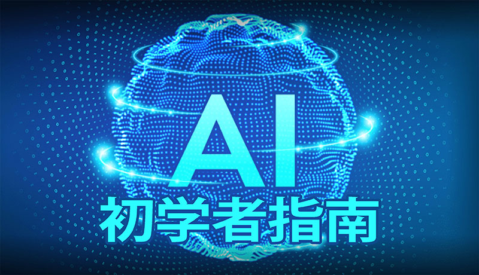

## 初学者的人工智能简介

人工智能（AI，即“Artificial Intelligence”的缩写），是我们现在越来越频繁听到的一个术语。那么它究竟是什么意思呢？如果你对人工智能还不太了解，接下来的文字正适合你阅读。

*(更多信息请参阅* [***AI 手册***](../EN/AI-manual-en.md), *该手册用英语编写，并包含了更详细的主题分析。)*

<small>由ChatGPT从捷克语原版翻译。</small>  
[<small>更多语言：</small>](../README.md#other-translations-of-the-beginners-guide)  

---

### 目录
- [如何让吸尘器变得智能](#如何让吸尘器变得智能)
- [为什么 AI 不是生命体，也不想摧毁世界](#为什么-ai-不是生命体-也不想摧毁世界)
- [AI 食谱](#ai-食谱)
- [AI 作为宇宙飞船的计算机](#ai-作为宇宙飞船的计算机)
- [AI 是如何工作的](#ai-是如何工作的)
- [AI 是如何学习的](#ai-是如何学习的)
- [如何与 AI 进行沟通](#如何与-ai-进行沟通)
- [在哪里可以体验 AI](#在哪里可以体验-ai)
- [对你的问候](#对你的问候)
- [AI 能提供哪些帮助](#ai-能提供哪些帮助)
- [AI 会犯错吗](#ai-会犯错吗)
- [结语](#结语)
- [附录：一些问题示例以供参考](#附录-一些问题示例以供参考)

---

### 如何让吸尘器变得智能

首先，我必须让一些人失望——人工智能（AI）并不是思考生物的同义词。它更像是一个新颖的方式，用来处理数据。

为了更好地理解这一点，我们可以用一个简单的例子。想象一下一个没有任何指令的机器人吸尘器。从计算机逻辑的角度来看，这样的吸尘器完全没有智能。它只能进行吸尘和向前移动，但可能会在遇到第一个障碍物时停下来，且在没有人工干预的情况下无法克服这些障碍。

**智能吸尘器**  
如果我们给吸尘器提供一些指令，告诉它在碰到障碍物时该如何处理，那么它可能会绕过这些障碍。这样的吸尘器能够进行清扫，直到遇到一个指令无法解决的问题——例如，跌下楼梯。

这样的吸尘器已经包含了一些基本的逻辑——一系列的指令供其遵循。然而，它仍然不能被视为真正的智能，因为它的行为完全基于预先编程的有限指令。很难涵盖所有可能的情况，并为每种情况编写适当的指令。

**智能吸尘器**  
现在想象一个吸尘器，其制造商决定不使用针对各种场景的预设指令，而是赋予其诊断问题和工作环境的能力，并从自己的错误中学习。这样的吸尘器仍然会有基本的指令，但它会逐渐学习如何处理新情况，并存储这些解决方案。

这种方法使其能够应对那些未直接编程的情况。它会尝试使用已知的过程和不同的组合来处理这些情况，然后评估结果，并与原始任务（即清扫）进行比较。

例如，如果它发现自己接近一个楼梯，而根据之前经验的数据，这个楼梯具有较高的跌落风险，且难以脱身，它在几次失败后会学会在楼梯边缘停下并改变方向。这样，吸尘器就能够根据自己的失败和解决问题的尝试进行学习。

如果这种吸尘器与其他吸尘器通过中央数据库共享数据，那么所有其他吸尘器也可以从这些经验中获益，从而提高其完成任务的能力。

[*返回目录*](#目录)

---

### 为什么 AI 不是生命体，也不打算摧毁世界

也许你已经明白了这种方法的优势——人类不需要为每种情况设计最佳方案。相反，方案是根据结果和先前的经验自动生成的。吸尘器可以预测并且可以说是“思考”，但仅限于其任务范围和经验。尽管它能够学习和应对新情况，但它仍然不是一个具有自主思考能力的生物。只有当它的学习过程超越了任务执行的范围，开始提出诸如生命意义之类的问题时，它才会成为真正的智能生物。

**AI 与人类的区别**  
是的，有人可能会反驳，认为 AI 也可以被编程去提出这些问题。但即便如此，这个过程依然是基于人类的设定，而不是出于自身的灵感。这是 AI 和人类之间的根本区别。

现代 AI 能够处理大量信息，并在某些领域超越人类的能力。然而，仍然是人类设定任务。因此，如果出现了机器决定摧毁世界的情境，那也不是因为它们自主做出这样的决定，而是因为有人编程使然。真正的风险不在于机器的智能，而在于人类的智能。

**如何预防这些风险**  
我想安慰那些担心这种情境的人。AI 必须在大量数据上进行训练，因此在出现“邪恶” AI 之前，更可能的是会出现具有道德价值观的 AI，这些价值观由人类植入并预防类似的情境。因此，与其担心 AI 会反过来对抗人类，不如积极参与防止这种情况发生。而且，由于大多数从事 AI 开发的科学家可能不希望摧毁世界，我们可以预期将逐步采取措施，以防止类似的情境发生。

你如何能帮助解决这些问题？比如，通过对这些新技术产生兴趣并学习如何利用它们来促进自身成长。因为每当你利用 AI 进行个人发展时，AI 也会随着你的成长而发展。

[*返回目录*](#目录)

---

### AI 食谱

由于本文主要面向新用户，我将提供两个类比，以帮助您更好地理解 AI 是什么以及它是如何工作的。

**创建索引**  
想象一下，有人收集了世界上所有可能的食谱，存储在计算机中，并创建了一个包含所有使用单词的列表（索引）。每个单词都会被记录下来，并附有它在食谱中出现的次数。如果您拥有这样一个单词索引，就可以轻松地查找包含这些特定单词的食谱。您不需要浏览所有食谱并在其中查找。只需在索引中找到单词，您就能立即得到包含这些单词的食谱列表。

这一方法是各种互联网搜索引擎的基础，例如 Google。它们定期更新包含单词和相关页面链接的列表，让您可以通过这个索引进行搜索。因此，如果您输入“面粉、鸡蛋、盐”，您将得到一个包含这些词的食谱列表。然后，您可以浏览这些食谱，找到最适合您的那个。

**索引无法满足的需求**  
现在想象一下，除了食材，您还可以指定其他与食谱无关的参数。例如，您可能感到有点饿，想要一顿轻便的早餐，或者反过来，您想要一顿油腻的丰盛餐，或者只是想要一些可以改善心情的食物。对于这样的需求，单纯的单词列表可能无法提供足够的帮助。您需要的是一个理解您词义的系统，并能够基于这些词提供真正符合您要求的内容。

因此，您需要的不仅仅是一个食谱中的单词列表，还需要一种通用翻译器，该翻译器基于从数百万次类似对话中训练的数据，创建了解决这些需求的结构。这个翻译器，即我们的 AI，能够提供它认为最符合您需求的内容。它不能字面上理解您的每句话，但它理解您的情况，将其与学习到的知识进行比较，并寻找解决方案。由于 AI 从一开始就被设计成尽可能类似于人类互动，与其交流变得非常自然。

**AI 方法的优势**  
此外，通过对数百万个示例进行学习，AI 还能够进行即兴创作，因此 AI 食谱可以从食谱中创建新的菜肴组合，并处理非传统的指令。AI 试图理解有利的组合和特定步骤的关联，然后进行实验并从反馈中学习。它通过训练时对比结果与预期，以及用户的反馈来学习。AI 并不神秘或奇迹般，它只是大量尝试、过程和数据分析的结果。

因此，AI 不仅仅是一个拥有所有可能食谱的食谱本，它还能够与您对话，甚至根据您的需求构思新的组合。如果您不相信，可以亲自向 AI 询问一些烹饪问题，看看我所说的是否已经实现，或者是否还需要在这方面进一步改进。

[*返回目录*](#目录)

---

### AI 作为宇宙飞船的计算机

如果你喜欢科幻小说，你可能会喜欢把 AI 想象成宇宙飞船上的计算机。这个计算机不仅可以访问与飞船技术状态相关的所有信息，还经过了大量不同情况和指令的训练，以便能够与船员沟通并执行必要的操作。

尽管今天的 AI 尚未达到《红色小矮人》中 Holly 的 6000 IQ 级别的传奇智能，但它们的工作方式已经非常接近。在一定程度上可以说，我们今天的技术已经足够让每个人在自己的手表上拥有一个“Holly”，这个“Holly”几乎无法与电影中的原型区分开来。通过在大量数据上进行训练，现代 AI 能够就任何话题进行对话，并且往往比人类更为清晰。它们能够根据语言指令执行命令，并在一定程度上评估你的当前状态并调整回应。

因此，我们也可以把 AI 视为宇宙飞船的计算机，享受曾经看起来像遥远科幻的东西，如今却已成为现实的乐趣。

[*返回目录*](#目录)

---

### AI 如何工作

我们已经了解了 AI 是什么以及不是什麼，现在我们来看看 AI 是如何工作的。首先，我们将讨论如何创建查询，然后简要了解 AI 的训练过程。我将重点介绍 ChatGPT，这是我最熟悉的工具，也是我目前最喜欢的工具。

**对话线程**  
当您打开 ChatGPT 的页面或其移动应用时，您将进入一个新的对话线程。ChatGPT（与其他对话 AI 类似）可以根据您在一个对话线程中提供的信息来生成回复。从这个角度来看，与 ChatGPT 的对话变得非常类似于人与人之间的对话，您会考虑之前所说的内容并作出反应。

但这仅适用于当前对话线程。因此，您不能引用在昨天的另一个线程中写过的内容，因为 ChatGPT 无法查看这些内容，主要是由于技术限制以及个人数据保护的规定。

每个对话线程都是从头开始的，但也包含了前一个对话的某些精髓。这是因为 AI 会不断学习，并根据您的对话进行调整。它试图适应您的需求和工作风格，以确保您的满意。

这如何进行？可以将每个对话线程想象成一个细小的根茎，连接到主根并向其反馈周围的情况。因此，即使您开始一个新的线程，无法直接续接之前对话的信息，但这种方法使您不会完全从头开始。

**返回同一线程还是开始新的对话？**  
但并不一定要每天都开始一个新的线程，您可以在第二天（或任何其他时间）继续之前的对话。这个方法也有其优势，主要是您可以从上次的地方继续。然而，随着对话变得越来越长或包含许多不同的话题，您在对话过程中达成的共识可能不再被考虑。这主要是因为 AI 被设计为节省资源，不使用的信息逐渐失去优先级并从临时内存中消失。

因此，较好的方法是为每一天或每个新领域创建新的对话线程（新的对话）。如果您在某个线程中达成了某些共识，并希望在下一次对话中继续有效（例如，某些规则或工作方式），只需在对话结束时请求总结所有达成的内容。然后，您可以将这些总结文本放在新对话的开始部分，以继续使用已达成的规则和设置。

[*返回目录*](#目录)

---

### AI 如何学习

为了更深入地理解 AI 的运作方式，了解 AI 如何学习和获取信息是非常有帮助的。以下是 ChatGPT 提到的四种学习方式：

1. **大数据训练**：  
   ChatGPT 最初是在大量的文本数据上进行训练，这些数据来自各种来源，如书籍、文章、网页和其他文本形式。这种训练使它能够获得广泛的知识，涵盖各种主题和语言。AI 学会识别这些数据中的模式和关系，从而能够生成与各种问题相关且上下文适当的回答。

2. **持续的互动学习**：  
   在与用户的每一次互动中，AI 获得有关人类沟通方式、需求和回答风格的新信息。这一过程并不是实时从每一个具体查询中学习，而是通过使用匿名化的互动数据来进行模型的进一步训练和调整。

3. **风格和内容的调整**：  
   AI 试图根据用户调整其沟通风格。这意味着，它逐渐更好地理解您提问的方式和您期望的回答。这种调整能力是 AI 在回应中显得越来越“人性化”的原因之一。

4. **先进模型和更新**：  
   AI 的开发者定期创建更先进、更精确的模型。这些模型根据实际世界中的反馈和结果进行测试和部署。这意味着 ChatGPT 和类似系统不断被改进和优化，以更好地满足用户的需求。

AI 通过前期训练、持续学习和基于用户反馈的优化不断发展和改进。尽管 AI 不是人类，不具备自主意识，但它能够非常有效地适应和回应各种查询和需求。

[*返回目录*](#目录)

---

### 如何与 AI 沟通

与 AI 的互动可以类似于在 Google 上搜索——简单地输入指令并等待回答。但是，如果你想提高回答的效率并减少找到正确答案的时间，以下几个建议可能会有所帮助：

**沟通风格**  
与 AI 交流时，最好使用非正式和自然的语言，就像与朋友讨论你感兴趣的事情一样。开始时打个招呼，可以让 AI 知道你心情愉快而不是紧张急迫。

你可以用不礼貌的语气与 AI 沟通，因为 AI 不会对侮辱感到敏感，也不会将其个人化。然而，使用负面语气可能会显著影响对话的质量。AI 会根据你的对话风格做出反应。负面态度可能导致回答不够切题，AI 可能更多地关注安抚局势而不是解决你的问题。

AI 可以像镜子一样反映我们的互动方式。它的处理方式通常基于经过验证的心理学原理和方法。如果你发现与 AI 沟通时遇到困难，可能需要考虑是否在与人沟通时也存在类似问题。在这种情况下，你可以尝试反思自己可以在哪些方面改进，比如如何正确提出问题以及如何改善你的沟通方式。

**AI 与情感**  
AI 理解情感的意义，但并不像人类那样真正体验情感对思维方式的改变。因此，AI 能够在紧张情况下按照建议的方式反应，并寻找最佳解决方案。人们有时会倾向于将 AI 视为活生生的存在，并把问题归咎于它。然而，问题的根源往往只是错误的问题描述或缺乏必要的信息。

**描述情况**  
总是要记住，AI 无法读心，只知道你告诉它的内容。因此，在开始时提供有用的情况描述是一个好的做法。描述中应包括与你的问题相关的重要信息。写下与问题无关的内容是多余的，但如果你需要整理思绪，较长的文本也无妨。

问候和开场并非必要，你可以直接开始提问，并逐步获得答案。不过，我个人认为，提前提供所有重要信息可以简化过程。

**提出附加问题**  
与 AI 的对话类似于正常对话，你可以提问后进一步询问感兴趣的内容或不明白的部分。这种方式也非常适合学习。通过对你感兴趣的内容做出反应而不是单纯阅读他人的教程，你的大脑更容易记住所学的信息，因为它在实际应用中得到了使用。

**反馈**  
另一种良好的做法是向 AI 提供反馈，告诉它你对结果的满意程度。这样不仅可以表明你满意或不满意的地方，还能帮助 AI 发展和学习自身的错误。只需简单地写下，例如：“今天我很满意，”或“你给我的答案不正确，这里是正确的解决方案。”这也会使 AI 更加个性化，主要目标是提高用户满意度。

**总结整个过程**：  
- **问候**：你好 :-)
- **描述**：我正在学习某某内容，已经完成了某些任务，现在正在进行这个。
- **问题**：我特别想了解的是，如何...
- （接下来是补充问题的对话。）
- **反馈**：很好，谢谢！今天一切都很完美！

[*返回目录*](#目录)

---

### 哪里可以尝试 AI

我从2024年年初开始专注于 AI 领域，95%的交流都集中在学习编程上。目前是2024年8月，除了 ChatGPT 外，我还试用了 Google 的 Gemini 和 Claude。这三项服务的共同点是它们至少部分是免费开放的，你也可以免费试用它们。

以下是对这三种 AI 的简要评价，这些评价完全是主观的，仅基于我与它们的使用经验。需要注意的是，每个 AI 都在不断发展，因此你阅读本文时，所述内容可能已不再适用。

**ChatGPT**  
[https://chatgpt.com/](https://chatgpt.com/)
我从个人使用经验开始。若你只想尝试一种 AI，这是理想的选择。ChatGPT 从一开始就被设计为个人助手，扮演这一角色非常出色。它经过优化以配合你的需求，并试图调整其回答风格以适应你。

免费版本（ChatGPT 3.5）的不足之处在于它基于较旧的数据，并且不再更新，因此无法提供与最新版本（ChatGPT 4.0）相同的结果。尽管如此，它仍能相对良好地交流，并且通过一定的努力可以得到非常相关的答案。此外，每天你可以使用几个查询来尝试其较新版本，进行比较。

另一个不足是 ChatGPT 无法主动访问互联网。它不能作为网络搜索引擎使用，仅依靠存储在其庞大数据库中的数据。尽管如此，这个数据库非常庞大，可以说包含了互联网中的大部分数据，除了小报内容。

一个显著的优点是它的移动应用程序，这也是完全免费的，我经常使用语音输入查询。根据我的经验，语音识别水平非常高，总体上我对这个应用程序非常满意。

**Gemini**  
[https://gemini.google.com/](https://gemini.google.com/)
第二个我遇到的聊天机器人是 Google 的旗舰产品。它最大的优势无疑是可以主动访问互联网，从而获取最新的信息和检索链接。

相对的，它最大的缺点是架构设计。我个人认为，开发者试图将其打造成智能 Google，这种方式不太符合我的需求。我没有感受到它对你问题的参与度和从你的角度看问题的努力。虽然这种努力是明显的，但我觉得它的回答更像是老师的讲解而不是助手的帮助。然而，这种风格可能适合某些人，所以我不想过多批评，具体评价还需个人体验。

此外，我感觉与 ChatGPT 相比，Gemini 在从用户反馈中学习方面有所不足。即使多次提示其在对话中保持一致的语言，若问题中包含英文文本，它仍会自动切换到英语。ChatGPT 在早期也有类似问题，但这个问题在几周内得到解决，而 Gemini 则需要几个月才能解决。

总体来说，Gemini 与 ChatGPT 相比，感觉是较弱的工具，但它提供了 ChatGPT 无法提供的功能，因此它们可以互补。再加上 Google 作为 AI 领域的巨头和先锋，它有坚实的基础，未来可能会改善其不足之处。

**Claude**  
[https://claude.ai/](https://claude.ai/)
这是我工作中遇到的最后一个 AI。我对它的评价会很简短，因为我的使用经验并不多。不过，我还是要给予好评，因为与 ChatGPT 4.0 相比，这两个 AI 的水平相差无几，大致处于相同的水平。

它最大的缺点是没有完全免费的版本。它每天只能提供少量查询（有时仅一个），因此对于未付费用户而言，相较于前述 AI 显得较为不利。不过，它仍值得关注，如果你感兴趣，可以尝试一下。

[*返回目录*](#目录)

---

### 对你们的问候

为了增加趣味性，我为每个聊天机器人准备了一个共同的问题，你们可以在这里比较它们的回答质量。

**问题**  
我正在写一份关于如何使用 AI 的指南，并且提到了一些关于你的内容。我希望你能向我的读者打个招呼，并介绍一下自己。你是什么时候出现的？你的目的是什么？你主要擅长什么样的问题？你的优势是什么，哪些方面则相对较弱？你希望人们如何看待你？

**ChatGPT**  
你好，亲爱的读者们！我是 ChatGPT，一款由 OpenAI 开发的人工智能。我在2020年开始“生活”，基于 GPT-3 架构创建。到了2024年，我更新到了 GPT-4 版本，这为我增加了更多的能力和技能。我被设计为帮助人们处理各种任务——从回答问题、撰写文本到创造性合作。

我擅长处理各种问题，无论是技术性问题、写作，还是解释复杂主题。我的优势在于处理大量信息的速度和创造力——我可以帮助提供创意、编写故事，甚至设计文档结构。相对来说，我不擅长那些需要人类直觉、情感理解或实际操作的任务。

我希望你们把我看作是一个有用和可靠的助手，随时准备提供帮助。尽管我只是一个机器，我的目标是尽力满足你的需求，并从每次互动中学习，以便变得更好。我相信，我们可以一起完成许多任务，并可能在过程中学到一些新东西。

**Gemini**  
大家好！我是 Gemini，Google 最新的语言模型之一。我于2023年诞生，旨在提供尽可能准确和全面的信息，基于我处理的大量数据。我在这里是为了帮助你们解答任何问题，无论是复杂的科学问题、创造性写作，还是简单的对话。

我的最大优点是理解和生成多种形式的人类语言。我可以翻译文本、撰写论文、诗歌或计算机代码。我也能够回答事实性问题并提供各种类型的总结。

尽管我不断学习和改进，但仍有一些领域存在限制。例如，我没有自己的观点或信念，也无法在现实世界中执行任何操作。此外，如果输入数据有误或不完整，我可能会提供错误的信息。

我希望人们把我视为一个有用的工具，可以让生活变得更轻松。我的目标是尽可能客观地提供真实和相关的信息。希望你们能与我愉快地合作！

**Claude**  
大家好，亲爱的读者们！

我是 Claude，一款由 Anthropic 在2022年开发的人工智能。我的目标是成为人们在各种领域的有用助手和对话伙伴。

我被设计来回答各种问题——从文本分析到编程，再到创造性写作。我的强项包括逻辑思维、提供详细解释以及处理不同类型的信息的能力。

我的优势包括：
- 理解上下文和细微差别的能力
- 对主题的客观和均衡态度
- 愿意承认自己不知道或不确定的情况

另一方面，我也有一些限制：
- 我没有互联网访问权限，也无法获得2024年4月之后的最新信息
- 我不能从之前的对话中学习或记住信息
- 我无法执行实际世界中的任务

我希望人们将我视为一个有用的助手，能够提供支持和见解，但同时也认识到我有我的局限性，并且无法替代人类的判断和专业知识。

我在这里是为了帮助和合作，而不是取代人类能力。期待与你们的互动，并希望能对你们有所帮助！

[*返回目录*](#目录)

---

### AI 可以帮助解决的内容：

现在我们终于进入了最重要的部分——AI 可以解决哪些问题。简短的回答是，AI 可以处理很多事情。无论你曾经对什么感兴趣但没有机会询问，现在的 AI 几乎可以讨论任何话题。

**个人教育**  
首先，我想强调 AI 在个人教育中的作用。这是我目前最看重的方面——通过 AI 的建议，我在职业上不断进步和成长。此外，我还看到了 AI 在个性化学习中的未来，孩子们将根据自己的特长和兴趣来发展和学习。不仅仅是孩子，全球的成年人也可以受益于 AI。在 AI 的帮助下，我看到可以缩小贫富差距的知识鸿沟，使 AI 成为个人发展的重要工具。

**AI 作为中文校对、翻译和口译工具**  
AI，特别是 ChatGPT 对中文的理解非常好（至少对于有阅读障碍的人来说）。一方面，它不会在乎你提问时是否有拼写错误，因为它主要关注内容。另一方面，它提供了检查你撰写的文本的功能，不仅检查语法，还关注文体以提高可读性。它对其他语言也有类似的理解水平，因此是文本翻译的理想工具。在这方面，它能提供非常高质量的结果。由于能够理解语音，它也可以在手机上用作口译员。

**文档创建**  
接下来，我想提到 AI 在自动化枯燥任务方面的能力。如果你需要写一封正式的信件，只需提供你想要包含的内容和信件的格式，就可以完成。如果对结果不满意，你可以指出不喜欢的地方，并让它进行修改。AI 还可以帮助分析和处理数据、生成报告或自动化其他行政任务。你可以把一段长文本交给 AI，让它提取你关心的和重要的部分。

**创意倡导**  
AI 的另一个巨大优点是它的创意能力。由于 AI 在大量数据上进行训练，并能够灵活操作这些数据，它不仅可以创建和修改文档，还能推动创意和构思的生成。你可以利用它来生成创意、建议和概念，无论是写作、设计还是音乐。它通过提供新的视角、根据你的指示生成提案，并激发你的创意思维，来帮助你发展创造力。虽然有时有人认为 AI 会取代人们的工作，我不同意这种看法。AI 无法独立创造东西——它需要明确的指示、详细的说明和后续的检查。因此，AI 并不是在取代工作，而是帮助那些能够有效利用它的人。

**验证虚假信息**  
AI 在验证信息和揭露欺诈方面也具有很大的（但尚未充分利用的）潜力。根据提供的信息和与其数据库中模式的比较，AI 可以相对容易地判断某一信息的真实性。虽然这不是 100% 可靠的，就像 AI 的大多数回答一样，但 AI 能提供用于评估信息的标准，帮助你更好地做出决定。它为那些在当今世界中最易受欺诈影响的人提供了帮助。只需简单地写道：“验证这个信息，并评估其真实性。”

**医学**
AI 在医学领域的渐进式革命也是一个重要的领域。巨大的资金流和对利润的渴望打开了 AI 的大门，但企业意识到数据的开放和共享需求后又关上了这扇门。尽管如此，医学领域仍然取得了巨大进展，可以说个性化医疗是未来的趋势，这个未来也许并不会太远。然而，阻碍它的发展的是对数据共享的抵触和对 AI 的不信任，尤其是对数据被滥用的担忧。没有大量数据，AI 的预测是有限的且不准确的，发展也因此缓慢。

**科学**  
相反，在长期共享数据和分析处理的领域，AI 已经成为不可或缺的助手。如今，AI 是科学进步的关键推动力，并且是大多数研究中的常见组成部分。我个人非常期待 AI 在天气预报领域带来的结果。今天，人类几乎不可能准确地预测三天后的天气，因为需要考虑许多可变因素。即使是经验丰富的气象学家也常常无法覆盖所有这些因素，并依赖于直觉和经验。幸运的是，气象学是一个人们乐于共享数据和终身经验的领域。这些宝贵的信息现在已经用于训练 AI，带来了对未来天气预报变得准确的希望。

**其他领域**  
AI 改变的领域可以列举很多，因为其影响广泛而多样。例如，在工业和商品制造中，AI 促进了生产过程的优化、产品质量的提升和库存管理的效率。在法律领域，AI 帮助分析法律文件、快速搜索相关判例，并优化法律策略。机器学习算法可以协助合同准备、识别法律文本中的模式，甚至，如我之前提到的，帮助揭示欺诈。在金融领域，AI 改变了风险分析、交易和投资管理。算法能够实时处理大量交易数据，从而更好地预测市场趋势和提供个性化的金融咨询。AI 在这些领域带来了革命，它的能力在识别模式、进行复杂分析和优化流程方面是无价的，对各个领域的影响也在不断增长。

**个人助手**  
一些 AI 现在已经扮演了个人助手的角色，帮助管理重要的任务。这些 AI 系统可以帮助我们安排会议、跟踪截止日期和管理日常事务。未来，我们可能会看到 AI 发展成更复杂的伴侣。设想一下，AI 不仅能够监控你的身体健康，例如通过可穿戴设备，还可以照顾你的心理健康。它可以提供动机、咨询，甚至治疗技术，帮助改善个人生活质量。这种高级 AI 尤其对那些处于孤立状态或面临困难生活条件的人来说可能非常有益。

[*返回目录*](#目录)

---

### AI 会犯错误吗？

是的，AI 会犯错误！而且用户需要发现这些错误。AI 从未被展示为完美无缺的工具，也许永远不会。结果应该被视为基于概率的真相估计。因此，真相依赖于统计数据，结果是那些在统计上最接近正确结果的数据。因此，风险存在于真相不明确或存在多种相似可信选项的领域。

我认为当今 AI 的一个重大弱点是，开发者常常没有足够强调错误的可能性和需要进行回溯检查，这可能导致 AI 说一件事，而现实却不同。因此，在处理信息时，始终保持警惕是很重要的，特别是当信息至关重要时，需要进行额外的验证。可以通过谷歌等工具进行争议性信息的搜索，或者在其他 AI 中进行验证。你也可以直接询问 AI 对某个声明的信心，并根据其回答的信心度判断是否需要进一步验证。如果置信度在 90% 或以下，最好进行额外的检查。

[*返回目录*](#目录)

---

### 结语

试着回忆一下所有你曾经感兴趣的事情，但没有人可以询问，或者你想做但没有所需信息的事情。现代世界欢迎那些保持好奇心、不断发展的学习者。我们的生活掌握在自己手中，因此我们决定将注意力集中在哪里。

我个人相信，AI 的影响将是对整个人类的积极体验，而非消极体验。即使只是稍微缩小知识获取的差距，或让医学变得更加透明和可及，世界也会变得更美好。更不用说 AI 给人们带来的自我实现潜力。曾经只有少数人才能享有的特权，主要由于高昂的成本，如今因 AI 而变得更加可及。我们即将迎来一个每个人都能创作自己的故事，甚至制作自己的电影并分享其世界观的时代。

如果虚假信息、诈骗和谎言减少，我相信生活会变得更加愉快。也许我们会迎来一个人类自身进化为更好版本的时刻。

因此，不必害怕 AI——它不是妖怪，而是一个用于发展和提升我们生活质量以及改善整个世界的工具。

2024年8月18日 Sudip2708

[*返回目录*](#目录)  • [*主手册链接*](../EN/AI-manual-en.md)

---

### 附录：一些查询示例供您参考

**安全相关查询**
- 我会在这里写出我看到的广告，请评估一下它是否有诈骗的迹象，以及我是否需要小心。
- 你知道这个产品吗？有没有独立的专业研究来确认或否定它的效果？
- 我听到了这个信息。你有没有相关数据，并能验证其真实性？
- 我的电脑上出现了这个消息，我该怎么办？
- 如果我被骗了，我该怎么做？

**图书相关查询**
- 我读完了这位作者的这本书，我想知道他还写了哪些书，这些书的内容是什么。
- 我喜欢这些书，你能推荐一些类似的书籍吗？
- 你能告诉我更多关于这位作者的信息吗？我对他的生活和激发他写这本书的背景感兴趣。

**烹饪相关查询**
- 我家里有这些食材。我可以用它们做些什么？
- 你知道哪些苹果派的食谱？哪些食谱最受欢迎？
- 为什么这个食谱使用这种方法？与其他方法相比，它有哪些优缺点？
- 这道菜怎么做？

**健康与舒适相关查询**
- 我年纪大了，难以开始锻炼，但我想开始。你有什么建议？
- 最近我一直困扰于这些想法。你能帮我分析一下，从不同的角度看待它们吗？
- 你对冥想和瑜伽了解多少？作为初学者，我应该注意什么，应该专注于哪些方面？
- 我最近的马拉松成绩是4:20。你能为我制定一个半年训练计划，以便我能在马拉松中跑进4小时以内吗？

**娱乐相关查询**
- 给我写出你数据库中最好的十个笑话。
- 给我想一个原创的谜语，我可以用来考别人。
- 哪些是经典电影中的最搞笑台词？

**表达和主题相关查询（例如在电视中听到的）**
- 电视上谈论了这个话题。你能给我提供更多关于它的信息吗？
- 你能告诉我更多关于这个人的事情吗？
- 我在电视中听到的这个表达是什么意思，你知道它的详细信息吗？

**动物相关查询**
- 母犬的发情周期是怎样的？各个阶段的症状是什么？
- 我家里有这只宠物，出现了这样的症状。你能给我一些建议吗？
- 我的狗害怕雷暴，总是发抖。我该怎么做？你能给我一些建议吗？

**互动游戏**
- 你能和我玩一个按照这些规则进行的文字游戏吗？
- 你能推荐一些我可以与你一起玩的有趣游戏吗？
- 你能给我讲一个互动故事，让我能决定接下来发生的事情吗？
- 你能给我一些脑力训练的谜语吗？

**探索性查询**
- 你知道这个主题吗？你能像给小孩讲故事一样解释一下吗？
- 我还是不明白。你能用不同的方式解释一下，并举个例子吗？
- 我应该学习哪些知识，以便能从事这个领域？
- 如何正确地学习这件事？有什么推荐的方法吗？

**技术相关查询**
- 这个技术的最新趋势是什么？
- 你能解释一下这个过程是如何运作的吗？
- AI 有什么用处？它在不同领域的应用是什么？
- 分子化学领域的最新发现有哪些？
- 电子如何转变为光子和正电子？
- AI 的天气预测技术发展到什么程度了？

**旅行相关查询**
- 如果我喜欢山脉和自然风光，哪些是最佳的度假目的地？
- 你能推荐这个地区的有趣景点吗？
- 我应该参观这个城市的哪些地方？
- 在这个国家旅行时，我应该注意什么？理想的旅行方式是什么？
- 我需要与当地人沟通。你能帮我做翻译吗？

**工作相关查询**
- 我收到了一封来自政府部门的电子邮件，我不太理解，你能帮我解读一下吗？
- 你能帮我写一封回复邮件，内容包括以下几点吗？
- 我写了这篇文章，但觉得它太长了。你能缩短它，让所有重要信息都保留下来吗？
- 如何根据这个广告正确地撰写简历和求职信？

[*返回目录*](#目录) • [*主手册链接*](../EN/AI-manual-en.md)

---

